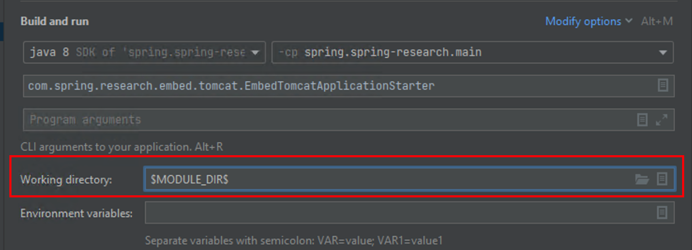

#  Spring Framework

This is the home of the Spring Framework, the foundation for all
[Spring projects](https://spring.io/projects). Together the Spring Framework and the family of Spring projects make up what we call "Spring". 

## Spring-helloworld in Spring
The module is used to start up spring. And you can run HelloWorldDemo to test the spring resource code environment.

## spring-research in Spring
The module provide start up spring with embed tomcat. It can help research the spring bean load.
You must select the $MODULE_DIR$, or the directory is default path(the parent project)
