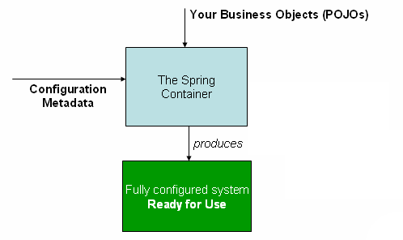
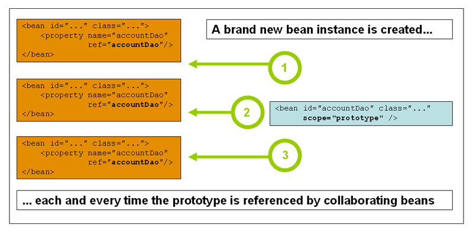

[[beans]]
= The IoC container

[[beans-introduction]]
== Introduction to the Spring IoC container and beans
This chapter covers the Spring Framework implementation of the Inversion of Control
(IoC) footnote:[See pass:specialcharacters,macros[<<background-ioc>>] ] principle. IoC
is also known as __dependency injection__ (DI). It is a process whereby objects define
their dependencies, that is, the other objects they work with, only through constructor
arguments, arguments to a factory method, or properties that are set on the object
instance after it is constructed or returned from a factory method. The container then
__injects__ those dependencies when it creates the bean. This process is fundamentally
the inverse, hence the name __Inversion of Control__ (IoC), of the bean itself
controlling the instantiation or location of its dependencies by using direct
construction of classes, or a mechanism such as the __Service Locator__ pattern.

The `org.springframework.beans` and `org.springframework.context` packages are the basis
for Spring Framework's IoC container. The
{api-spring-framework}/beans/factory/BeanFactory.html[`BeanFactory`]
interface provides an advanced configuration mechanism capable of managing any type of
object.
{api-spring-framework}/context/ApplicationContext.html[`ApplicationContext`]
is a sub-interface of `BeanFactory`. It adds easier integration with Spring's AOP
features; message resource handling (for use in internationalization), event
publication; and application-layer specific contexts such as the `WebApplicationContext`
for use in web applications.

In short, the `BeanFactory` provides the configuration framework and basic
functionality, and the `ApplicationContext` adds more enterprise-specific functionality.
The `ApplicationContext` is a complete superset of the `BeanFactory`, and is used
exclusively in this chapter in descriptions of Spring's IoC container. For more
information on using the `BeanFactory` instead of the `ApplicationContext,` refer to
<<beans-beanfactory>>.

In Spring, the objects that form the backbone of your application and that are managed
by the Spring IoC __container__ are called __beans__. A bean is an object that is
instantiated, assembled, and otherwise managed by a Spring IoC container. Otherwise, a
bean is simply one of many objects in your application. Beans, and the __dependencies__
among them, are reflected in the __configuration metadata__ used by a container.

[[beans-basics]]
== Container overview
The interface `org.springframework.context.ApplicationContext` represents the Spring IoC
container and is responsible for instantiating, configuring, and assembling the
aforementioned beans. The container gets its instructions on what objects to
instantiate, configure, and assemble by reading configuration metadata. The
configuration metadata is represented in XML, Java annotations, or Java code. It allows
you to express the objects that compose your application and the rich interdependencies
between such objects.

Several implementations of the `ApplicationContext` interface are supplied
out-of-the-box with Spring. In standalone applications it is common to create an
instance of
{api-spring-framework}/context/support/ClassPathXmlApplicationContext.html[`ClassPathXmlApplicationContext`]
or {api-spring-framework}/context/support/FileSystemXmlApplicationContext.html[`FileSystemXmlApplicationContext`].
 While XML has been the traditional format for defining configuration metadata you can
instruct the container to use Java annotations or code as the metadata format by
providing a small amount of XML configuration to declaratively enable support for these
additional metadata formats.

In most application scenarios, explicit user code is not required to instantiate one or
more instances of a Spring IoC container. For example, in a web application scenario, a
simple eight (or so) lines of boilerplate web descriptor XML in the `web.xml` file
of the application will typically suffice (see <<context-create>>). If you are using the
https://spring.io/tools/sts[Spring Tool Suite] Eclipse-powered development
environment this boilerplate configuration can be easily created with few mouse clicks or
keystrokes.

The following diagram is a high-level view of how Spring works. Your application classes
are combined with configuration metadata so that after the `ApplicationContext` is
created and initialized, you have a fully configured and executable system or
application.

.The Spring IoC container

[[beans-factory-metadata]]
=== Configuration metadata

As the preceding diagram shows, the Spring IoC container consumes a form of
__configuration metadata__; this configuration metadata represents how you as an
application developer tell the Spring container to instantiate, configure, and assemble
the objects in your application.

Configuration metadata is traditionally supplied in a simple and intuitive XML format,
which is what most of this chapter uses to convey key concepts and features of the
Spring IoC container.

[NOTE]
====
XML-based metadata is __not__ the only allowed form of configuration metadata. The
Spring IoC container itself is __totally__ decoupled from the format in which this
configuration metadata is actually written. These days many developers choose
<<beans-java,Java-based configuration>> for their Spring applications.
====

For information about using other forms of metadata with the Spring container, see:

* <<beans-annotation-config,Annotation-based configuration>>: Spring 2.5 introduced
  support for annotation-based configuration metadata.
* <<beans-java,Java-based configuration>>: Starting with Spring 3.0, many features
  provided by the Spring JavaConfig project became part of the core Spring Framework.
  Thus you can define beans external to your application classes by using Java rather
  than XML files. To use these new features, see the `@Configuration`, `@Bean`, `@Import`
  and `@DependsOn` annotations.

Spring configuration consists of at least one and typically more than one bean
definition that the container must manage. XML-based configuration metadata shows these
beans configured as `<bean/>` elements inside a top-level `<beans/>` element. Java
configuration typically uses `@Bean` annotated methods within a `@Configuration` class.

These bean definitions correspond to the actual objects that make up your application.
Typically you define service layer objects, data access objects (DAOs), presentation
objects such as Struts `Action` instances, infrastructure objects such as Hibernate
`SessionFactories`, JMS `Queues`, and so forth. Typically one does not configure
fine-grained domain objects in the container, because it is usually the responsibility
of DAOs and business logic to create and load domain objects. However, you can use
Spring's integration with AspectJ to configure objects that have been created outside
the control of an IoC container. See <<aop-atconfigurable,Using AspectJ to
dependency-inject domain objects with Spring>>.

The following example shows the basic structure of XML-based configuration metadata:

[source,xml,indent=0]
[subs="verbatim,quotes"]
----
	<?xml version="1.0" encoding="UTF-8"?>
	<beans xmlns="http://www.springframework.org/schema/beans"
		xmlns:xsi="http://www.w3.org/2001/XMLSchema-instance"
		xsi:schemaLocation="http://www.springframework.org/schema/beans
			http://www.springframework.org/schema/beans/spring-beans.xsd">

		<bean id="..." class="...">
			<!-- collaborators and configuration for this bean go here -->
		</bean>

		<bean id="..." class="...">
			<!-- collaborators and configuration for this bean go here -->
		</bean>

		<!-- more bean definitions go here -->

	</beans>
----

The `id` attribute is a string that you use to identify the individual bean definition.
The `class` attribute defines the type of the bean and uses the fully qualified
classname. The value of the id attribute refers to collaborating objects. The XML for
referring to collaborating objects is not shown in this example; see
<<beans-dependencies,Dependencies>> for more information.

[[beans-factory-instantiation]]
=== Instantiating a container

Instantiating a Spring IoC container is straightforward. The location path or paths
supplied to an `ApplicationContext` constructor are actually resource strings that allow
the container to load configuration metadata from a variety of external resources such
as the local file system, from the Java `CLASSPATH`, and so on.

[source,java,indent=0]
[subs="verbatim,quotes"]
----
	ApplicationContext context =
		new ClassPathXmlApplicationContext(new String[] {"services.xml", "daos.xml"});
----

[NOTE]
====
After you learn about Spring's IoC container, you may want to know more about Spring's
`Resource` abstraction, as described in <<resources>>, which provides a convenient
mechanism for reading an InputStream from locations defined in a URI syntax. In
particular, `Resource` paths are used to construct applications contexts as described in
<<resources-app-ctx>>.
====

The following example shows the service layer objects `(services.xml)` configuration file:

[source,xml,indent=0]
[subs="verbatim,quotes"]
----
	<?xml version="1.0" encoding="UTF-8"?>
	<beans xmlns="http://www.springframework.org/schema/beans"
		xmlns:xsi="http://www.w3.org/2001/XMLSchema-instance"
		xsi:schemaLocation="http://www.springframework.org/schema/beans
			http://www.springframework.org/schema/beans/spring-beans.xsd">

		<!-- services -->

		<bean id="petStore" class="org.springframework.samples.jpetstore.services.PetStoreServiceImpl">
			<property name="accountDao" ref="accountDao"/>
			<property name="itemDao" ref="itemDao"/>
			<!-- additional collaborators and configuration for this bean go here -->
		</bean>

		<!-- more bean definitions for services go here -->

	</beans>
----

The following example shows the data access objects `daos.xml` file:

[source,xml,indent=0]
[subs="verbatim,quotes"]
----
	<?xml version="1.0" encoding="UTF-8"?>
	<beans xmlns="http://www.springframework.org/schema/beans"
		xmlns:xsi="http://www.w3.org/2001/XMLSchema-instance"
		xsi:schemaLocation="http://www.springframework.org/schema/beans
			http://www.springframework.org/schema/beans/spring-beans.xsd">

		<bean id="accountDao"
			class="org.springframework.samples.jpetstore.dao.jpa.JpaAccountDao">
			<!-- additional collaborators and configuration for this bean go here -->
		</bean>

		<bean id="itemDao" class="org.springframework.samples.jpetstore.dao.jpa.JpaItemDao">
			<!-- additional collaborators and configuration for this bean go here -->
		</bean>

		<!-- more bean definitions for data access objects go here -->

	</beans>
----

In the preceding example, the service layer consists of the class `PetStoreServiceImpl`,
and two data access objects of the type `JpaAccountDao` and `JpaItemDao` (based
on the JPA Object/Relational mapping standard). The `property name` element refers to the
name of the JavaBean property, and the `ref` element refers to the name of another bean
definition. This linkage between `id` and `ref` elements expresses the dependency between
collaborating objects. For details of configuring an object's dependencies, see
<<beans-dependencies,Dependencies>>.

[[beans-factory-xml-import]]
==== Composing XML-based configuration metadata

It can be useful to have bean definitions span multiple XML files. Often each individual
XML configuration file represents a logical layer or module in your architecture.

You can use the application context constructor to load bean definitions from all these
XML fragments. This constructor takes multiple `Resource` locations, as was shown in the
previous section. Alternatively, use one or more occurrences of the `<import/>` element
to load bean definitions from another file or files. For example:

[source,xml,indent=0]
[subs="verbatim,quotes"]
----
	<beans>
		<import resource="services.xml"/>
		<import resource="resources/messageSource.xml"/>
		<import resource="/resources/themeSource.xml"/>

		<bean id="bean1" class="..."/>
		<bean id="bean2" class="..."/>
	</beans>
----

In the preceding example, external bean definitions are loaded from three files:
`services.xml`, `messageSource.xml`, and `themeSource.xml`. All location paths are
relative to the definition file doing the importing, so `services.xml` must be in the
same directory or classpath location as the file doing the importing, while
`messageSource.xml` and `themeSource.xml` must be in a `resources` location below the
location of the importing file. As you can see, a leading slash is ignored, but given
that these paths are relative, it is better form not to use the slash at all. The
contents of the files being imported, including the top level `<beans/>` element, must
be valid XML bean definitions according to the Spring Schema.

[NOTE]
====
It is possible, but not recommended, to reference files in parent directories using a
relative "../" path. Doing so creates a dependency on a file that is outside the current
application. In particular, this reference is not recommended for "classpath:" URLs (for
example, "classpath:../services.xml"), where the runtime resolution process chooses the
"nearest" classpath root and then looks into its parent directory. Classpath
configuration changes may lead to the choice of a different, incorrect directory.

You can always use fully qualified resource locations instead of relative paths: for
example, "file:C:/config/services.xml" or "classpath:/config/services.xml". However, be
aware that you are coupling your application's configuration to specific absolute
locations. It is generally preferable to keep an indirection for such absolute
locations, for example, through "${...}" placeholders that are resolved against JVM
system properties at runtime.
====

[[beans-factory-client]]
=== Using the container

The `ApplicationContext` is the interface for an advanced factory capable of maintaining
a registry of different beans and their dependencies. Using the method `T getBean(String
name, Class<T> requiredType)` you can retrieve instances of your beans.

The `ApplicationContext` enables you to read bean definitions and access them as follows:

[source,java,indent=0]
[subs="verbatim,quotes"]
----
	// create and configure beans
	ApplicationContext context =
		new ClassPathXmlApplicationContext(new String[] {"services.xml", "daos.xml"});

	// retrieve configured instance
	PetStoreService service = context.getBean("petStore", PetStoreService.class);

	// use configured instance
	List<String> userList = service.getUsernameList();
----

You use `getBean()` to retrieve instances of your beans. The `ApplicationContext`
interface has a few other methods for retrieving beans, but ideally your application
code should never use them. Indeed, your application code should have no calls to the
`getBean()` method at all, and thus no dependency on Spring APIs at all. For example,
Spring's integration with web frameworks provides for dependency injection for various
web framework classes such as controllers and JSF-managed beans.

[[beans-definition]]
== Bean overview
A Spring IoC container manages one or more __beans__. These beans are created with the
configuration metadata that you supply to the container, for example, in the form of XML
`<bean/>` definitions.

Within the container itself, these bean definitions are represented as `BeanDefinition`
objects, which contain (among other information) the following metadata:

* __A package-qualified class name:__ typically the actual implementation class of the
  bean being defined.
* Bean behavioral configuration elements, which state how the bean should behave in the
  container (scope, lifecycle callbacks, and so forth).
* References to other beans that are needed for the bean to do its work; these
  references are also called __collaborators__ or __dependencies__.
* Other configuration settings to set in the newly created object, for example, the
  number of connections to use in a bean that manages a connection pool, or the size
  limit of the pool.

This metadata translates to a set of properties that make up each bean definition.

[[beans-factory-bean-definition-tbl]]
.The bean definition
|===
| Property| Explained in...

| class
| <<beans-factory-class>>

| name
| <<beans-beanname>>

| scope
| <<beans-factory-scopes>>

| constructor arguments
| <<beans-factory-collaborators>>

| properties
| <<beans-factory-collaborators>>

| autowiring mode
| <<beans-factory-autowire>>

| lazy-initialization mode
| <<beans-factory-lazy-init>>

| initialization method
| <<beans-factory-lifecycle-initializingbean>>

| destruction method
| <<beans-factory-lifecycle-disposablebean>>
|===

In addition to bean definitions that contain information on how to create a specific
bean, the `ApplicationContext` implementations also permit the registration of existing
objects that are created outside the container, by users. This is done by accessing the
ApplicationContext's BeanFactory via the method `getBeanFactory()` which returns the
BeanFactory implementation `DefaultListableBeanFactory`. `DefaultListableBeanFactory`
supports this registration through the methods `registerSingleton(..)` and
`registerBeanDefinition(..)`. However, typical applications work solely with beans
defined through metadata bean definitions.

[NOTE]
====
Bean metadata and manually supplied singleton instances need to be registered as early
as possible, in order for the container to properly reason about them during autowiring
and other introspection steps. While overriding of existing metadata and existing
singleton instances is supported to some degree, the registration of new beans at
runtime (concurrently with live access to factory) is not officially supported and may
lead to concurrent access exceptions and/or inconsistent state in the bean container.
====

[[beans-beanname]]
=== Naming beans

Every bean has one or more identifiers. These identifiers must be unique within the
container that hosts the bean. A bean usually has only one identifier, but if it
requires more than one, the extra ones can be considered aliases.

In XML-based configuration metadata, you use the `id` and/or `name` attributes
to specify the bean identifier(s). The `id` attribute allows you to specify
exactly one id. Conventionally these names are alphanumeric ('myBean',
'fooService', etc.), but may contain special characters as well. If you want to
introduce other aliases to the bean, you can also specify them in the `name`
attribute, separated by a comma (`,`), semicolon (`;`), or white space. As a
historical note, in versions prior to Spring 3.1, the `id` attribute was
defined as an `xsd:ID` type, which constrained possible characters. As of 3.1,
it is defined as an `xsd:string` type. Note that bean `id` uniqueness is still
enforced by the container, though no longer by XML parsers.

You are not required to supply a name or id for a bean. If no name or id is supplied
explicitly, the container generates a unique name for that bean. However, if you want to
refer to that bean by name, through the use of the `ref` element or
<<beans-servicelocator,Service Locator>> style lookup, you must provide a name.
Motivations for not supplying a name are related to using <<beans-inner-beans,inner
beans>> and <<beans-factory-autowire,autowiring collaborators>>.

.Bean Naming Conventions
****
The convention is to use the standard Java convention for instance field names when
naming beans. That is, bean names start with a lowercase letter, and are camel-cased
from then on. Examples of such names would be (without quotes) `'accountManager'`,
`'accountService'`, `'userDao'`, `'loginController'`, and so forth.

Naming beans consistently makes your configuration easier to read and understand, and if
you are using Spring AOP it helps a lot when applying advice to a set of beans related
by name.
****

[NOTE]
====
With component scanning in the classpath, Spring generates bean names for unnamed
components, following the rules above: essentially, taking the simple class name
and turning its initial character to lower-case. However, in the (unusual) special
case when there is more than one character and both the first and second characters
are upper case, the original casing gets preserved. These are the same rules as
defined by `java.beans.Introspector.decapitalize` (which Spring is using here).
====

[[beans-beanname-alias]]
==== Aliasing a bean outside the bean definition

In a bean definition itself, you can supply more than one name for the bean, by using a
combination of up to one name specified by the `id` attribute, and any number of other
names in the `name` attribute. These names can be equivalent aliases to the same bean,
and are useful for some situations, such as allowing each component in an application to
refer to a common dependency by using a bean name that is specific to that component
itself.

Specifying all aliases where the bean is actually defined is not always adequate,
however. It is sometimes desirable to introduce an alias for a bean that is defined
elsewhere. This is commonly the case in large systems where configuration is split
amongst each subsystem, each subsystem having its own set of object definitions. In
XML-based configuration metadata, you can use the `<alias/>` element to accomplish this.

[source,xml,indent=0]
[subs="verbatim,quotes"]
----
	<alias name="fromName" alias="toName"/>
----

In this case, a bean in the same container which is named `fromName`, may also,
after the use of this alias definition, be referred to as `toName`.

For example, the configuration metadata for subsystem A may refer to a DataSource via
the name `subsystemA-dataSource`. The configuration metadata for subsystem B may refer to
a DataSource via the name `subsystemB-dataSource`. When composing the main application
that uses both these subsystems the main application refers to the DataSource via the
name `myApp-dataSource`. To have all three names refer to the same object you add to the
MyApp configuration metadata the following aliases definitions:

[source,xml,indent=0]
[subs="verbatim,quotes"]
----
	<alias name="subsystemA-dataSource" alias="subsystemB-dataSource"/>
	<alias name="subsystemA-dataSource" alias="myApp-dataSource" />
----

Now each component and the main application can refer to the dataSource through a name
that is unique and guaranteed not to clash with any other definition (effectively
creating a namespace), yet they refer to the same bean.

.Java-configuration
****
If you are using Java-configuration, the `@Bean` annotation can be used to provide aliases
see <<beans-java-bean-annotation>> for details.
****

[[beans-factory-class]]
=== Instantiating beans

A bean definition essentially is a recipe for creating one or more objects. The
container looks at the recipe for a named bean when asked, and uses the configuration
metadata encapsulated by that bean definition to create (or acquire) an actual object.

If you use XML-based configuration metadata, you specify the type (or class) of object
that is to be instantiated in the `class` attribute of the `<bean/>` element. This
`class` attribute, which internally is a `Class` property on a `BeanDefinition`
instance, is usually mandatory. (For exceptions, see
<<beans-factory-class-instance-factory-method>> and <<beans-child-bean-definitions>>.)
You use the `Class` property in one of two ways:

* Typically, to specify the bean class to be constructed in the case where the container
  itself directly creates the bean by calling its constructor reflectively, somewhat
  equivalent to Java code using the `new` operator.
* To specify the actual class containing the `static` factory method that will be
  invoked to create the object, in the less common case where the container invokes a
  `static` __factory__ method on a class to create the bean. The object type returned
  from the invocation of the `static` factory method may be the same class or another
  class entirely.

****
.Inner class names
If you want to configure a bean definition for a `static` nested class, you have to use
the __binary__ name of the nested class.

For example, if you have a class called `Foo` in the `com.example` package, and this
`Foo` class has a `static` nested class called `Bar`, the value of the `'class'`
attribute on a bean definition would be...

`com.example.Foo$Bar`

Notice the use of the `$` character in the name to separate the nested class name from
the outer class name.
****

[[beans-factory-class-ctor]]
==== Instantiation with a constructor

When you create a bean by the constructor approach, all normal classes are usable by and
compatible with Spring. That is, the class being developed does not need to implement
any specific interfaces or to be coded in a specific fashion. Simply specifying the bean
class should suffice. However, depending on what type of IoC you use for that specific
bean, you may need a default (empty) constructor.

The Spring IoC container can manage virtually __any__ class you want it to manage; it is
not limited to managing true JavaBeans. Most Spring users prefer actual JavaBeans with
only a default (no-argument) constructor and appropriate setters and getters modeled
after the properties in the container. You can also have more exotic non-bean-style
classes in your container. If, for example, you need to use a legacy connection pool
that absolutely does not adhere to the JavaBean specification, Spring can manage it as
well.

With XML-based configuration metadata you can specify your bean class as follows:

[source,xml,indent=0]
[subs="verbatim,quotes"]
----
	<bean id="exampleBean" class="examples.ExampleBean"/>

	<bean name="anotherExample" class="examples.ExampleBeanTwo"/>
----

For details about the mechanism for supplying arguments to the constructor (if required)
and setting object instance properties after the object is constructed, see
<<beans-factory-collaborators,Injecting Dependencies>>.

[[beans-factory-class-static-factory-method]]
==== Instantiation with a static factory method

When defining a bean that you create with a static factory method, you use the `class`
attribute to specify the class containing the `static` factory method and an attribute
named `factory-method` to specify the name of the factory method itself. You should be
able to call this method (with optional arguments as described later) and return a live
object, which subsequently is treated as if it had been created through a constructor.
One use for such a bean definition is to call `static` factories in legacy code.

The following bean definition specifies that the bean will be created by calling a
factory-method. The definition does not specify the type (class) of the returned object,
only the class containing the factory method. In this example, the `createInstance()`
method must be a __static__ method.

[source,xml,indent=0]
[subs="verbatim,quotes"]
----
	<bean id="clientService"
		class="examples.ClientService"
		factory-method="createInstance"/>
----

[source,java,indent=0]
[subs="verbatim,quotes"]
----
	public class ClientService {
		private static ClientService clientService = new ClientService();
		private ClientService() {}

		public static ClientService createInstance() {
			return clientService;
		}
	}
----

For details about the mechanism for supplying (optional) arguments to the factory method
and setting object instance properties after the object is returned from the factory,
see <<beans-factory-properties-detailed,Dependencies and configuration in detail>>.

[[beans-factory-class-instance-factory-method]]
==== Instantiation using an instance factory method

Similar to instantiation through a <<beans-factory-class-static-factory-method,static
factory method>>, instantiation with an instance factory method invokes a non-static
method of an existing bean from the container to create a new bean. To use this
mechanism, leave the `class` attribute empty, and in the `factory-bean` attribute,
specify the name of a bean in the current (or parent/ancestor) container that contains
the instance method that is to be invoked to create the object. Set the name of the
factory method itself with the `factory-method` attribute.

[source,xml,indent=0]
[subs="verbatim,quotes"]
----
	<!-- the factory bean, which contains a method called createInstance() -->
	<bean id="serviceLocator" class="examples.DefaultServiceLocator">
		<!-- inject any dependencies required by this locator bean -->
	</bean>

	<!-- the bean to be created via the factory bean -->
	<bean id="clientService"
		factory-bean="serviceLocator"
		factory-method="createClientServiceInstance"/>
----

[source,java,indent=0]
[subs="verbatim,quotes"]
----
	public class DefaultServiceLocator {

		private static ClientService clientService = new ClientServiceImpl();
		private DefaultServiceLocator() {}

		public ClientService createClientServiceInstance() {
			return clientService;
		}
	}
----

One factory class can also hold more than one factory method as shown here:

[source,xml,indent=0]
[subs="verbatim,quotes"]
----
	<bean id="serviceLocator" class="examples.DefaultServiceLocator">
		<!-- inject any dependencies required by this locator bean -->
	</bean>

	<bean id="clientService"
		factory-bean="serviceLocator"
		factory-method="createClientServiceInstance"/>

	<bean id="accountService"
		factory-bean="serviceLocator"
		factory-method="createAccountServiceInstance"/>
----

[source,java,indent=0]
[subs="verbatim,quotes"]
----
	public class DefaultServiceLocator {

		private static ClientService clientService = new ClientServiceImpl();
		private static AccountService accountService = new AccountServiceImpl();

		private DefaultServiceLocator() {}

		public ClientService createClientServiceInstance() {
			return clientService;
		}

		public AccountService createAccountServiceInstance() {
			return accountService;
		}

	}
----

This approach shows that the factory bean itself can be managed and configured through
dependency injection (DI). See <<beans-factory-properties-detailed,Dependencies and
configuration in detail>>.

[NOTE]
====
In Spring documentation,__ factory bean__ refers to a bean that is configured in the
Spring container that will create objects through an
<<beans-factory-class-instance-factory-method,instance>> or
<<beans-factory-class-static-factory-method,static>> factory method. By contrast,
`FactoryBean` (notice the capitalization) refers to a Spring-specific
<<beans-factory-extension-factorybean, `FactoryBean` >>.
====

[[beans-dependencies]]
== Dependencies
A typical enterprise application does not consist of a single object (or bean in the
Spring parlance). Even the simplest application has a few objects that work together to
present what the end-user sees as a coherent application. This next section explains how
you go from defining a number of bean definitions that stand alone to a fully realized
application where objects collaborate to achieve a goal.

[[beans-factory-collaborators]]
=== Dependency Injection

__Dependency injection__ (DI) is a process whereby objects define their dependencies,
that is, the other objects they work with, only through constructor arguments, arguments
to a factory method, or properties that are set on the object instance after it is
constructed or returned from a factory method. The container then __injects__ those
dependencies when it creates the bean. This process is fundamentally the inverse, hence
the name __Inversion of Control__ (IoC), of the bean itself controlling the instantiation
or location of its dependencies on its own by using direct construction of classes, or
the __Service Locator__ pattern.

Code is cleaner with the DI principle and decoupling is more effective when objects are
provided with their dependencies. The object does not look up its dependencies, and does
not know the location or class of the dependencies. As such, your classes become easier
to test, in particular when the dependencies are on interfaces or abstract base classes,
which allow for stub or mock implementations to be used in unit tests.

DI exists in two major variants, <<beans-constructor-injection,Constructor-based
dependency injection>> and <<beans-setter-injection,Setter-based dependency injection>>.

[[beans-constructor-injection]]
==== Constructor-based dependency injection

__Constructor-based__ DI is accomplished by the container invoking a constructor with a
number of arguments, each representing a dependency. Calling a `static` factory method
with specific arguments to construct the bean is nearly equivalent, and this discussion
treats arguments to a constructor and to a `static` factory method similarly. The
following example shows a class that can only be dependency-injected with constructor
injection. Notice that there is nothing __special__ about this class, it is a POJO that
has no dependencies on container specific interfaces, base classes or annotations.

[source,java,indent=0]
[subs="verbatim,quotes"]
----
	public class SimpleMovieLister {

		// the SimpleMovieLister has a dependency on a MovieFinder
		private MovieFinder movieFinder;

		// a constructor so that the Spring container can inject a MovieFinder
		public SimpleMovieLister(MovieFinder movieFinder) {
			this.movieFinder = movieFinder;
		}

		// business logic that actually uses the injected MovieFinder is omitted...

	}
----

[[beans-factory-ctor-arguments-resolution]]
===== Constructor argument resolution

Constructor argument resolution matching occurs using the argument's type. If no
potential ambiguity exists in the constructor arguments of a bean definition, then the
order in which the constructor arguments are defined in a bean definition is the order
in which those arguments are supplied to the appropriate constructor when the bean is
being instantiated. Consider the following class:

[source,java,indent=0]
[subs="verbatim,quotes"]
----
	package x.y;

	public class Foo {

		public Foo(Bar bar, Baz baz) {
			// ...
		}

	}
----

No potential ambiguity exists, assuming that `Bar` and `Baz` classes are not related by
inheritance. Thus the following configuration works fine, and you do not need to specify
the constructor argument indexes and/or types explicitly in the `<constructor-arg/>`
element.

[source,xml,indent=0]
[subs="verbatim,quotes"]
----
	<beans>
		<bean id="foo" class="x.y.Foo">
			<constructor-arg ref="bar"/>
			<constructor-arg ref="baz"/>
		</bean>

		<bean id="bar" class="x.y.Bar"/>

		<bean id="baz" class="x.y.Baz"/>
	</beans>
----

When another bean is referenced, the type is known, and matching can occur (as was the
case with the preceding example). When a simple type is used, such as
`<value>true</value>`, Spring cannot determine the type of the value, and so cannot match
by type without help. Consider the following class:

[source,java,indent=0]
[subs="verbatim,quotes"]
----
	package examples;

	public class ExampleBean {

		// Number of years to calculate the Ultimate Answer
		private int years;

		// The Answer to Life, the Universe, and Everything
		private String ultimateAnswer;

		public ExampleBean(int years, String ultimateAnswer) {
			this.years = years;
			this.ultimateAnswer = ultimateAnswer;
		}

	}
----

.[[beans-factory-ctor-arguments-type]]Constructor argument type matching
--
In the preceding scenario, the container __can__ use type matching with simple types if
you explicitly specify the type of the constructor argument using the `type` attribute.
For example:

[source,xml,indent=0]
[subs="verbatim,quotes"]
----
	<bean id="exampleBean" class="examples.ExampleBean">
		<constructor-arg type="int" value="7500000"/>
		<constructor-arg type="java.lang.String" value="42"/>
	</bean>
----
--

.[[beans-factory-ctor-arguments-index]]Constructor argument index
--
Use the `index` attribute to specify explicitly the index of constructor arguments. For
example:

[source,xml,indent=0]
[subs="verbatim,quotes"]
----
	<bean id="exampleBean" class="examples.ExampleBean">
		<constructor-arg index="0" value="7500000"/>
		<constructor-arg index="1" value="42"/>
	</bean>
----

In addition to resolving the ambiguity of multiple simple values, specifying an index
resolves ambiguity where a constructor has two arguments of the same type. Note that the
__index is 0 based__.
--

.[[beans-factory-ctor-arguments-name]]Constructor argument name
--
You can also use the constructor parameter name for value disambiguation:

[source,xml,indent=0]
[subs="verbatim,quotes"]
----
	<bean id="exampleBean" class="examples.ExampleBean">
		<constructor-arg name="years" value="7500000"/>
		<constructor-arg name="ultimateAnswer" value="42"/>
	</bean>
----

Keep in mind that to make this work out of the box your code must be compiled with the
debug flag enabled so that Spring can look up the parameter name from the constructor.
If you can't compile your code with debug flag (or don't want to) you can use
http://download.oracle.com/javase/6/docs/api/java/beans/ConstructorProperties.html[@ConstructorProperties]
JDK annotation to explicitly name your constructor arguments. The sample class would
then have to look as follows:

[source,java,indent=0]
[subs="verbatim,quotes"]
----
	package examples;

	public class ExampleBean {

		// Fields omitted

		@ConstructorProperties({"years", "ultimateAnswer"})
		public ExampleBean(int years, String ultimateAnswer) {
			this.years = years;
			this.ultimateAnswer = ultimateAnswer;
		}

	}
----
--

[[beans-setter-injection]]
==== Setter-based dependency injection

__Setter-based__ DI is accomplished by the container calling setter methods on your
beans after invoking a no-argument constructor or no-argument `static` factory method to
instantiate your bean.

The following example shows a class that can only be dependency-injected using pure
setter injection. This class is conventional Java. It is a POJO that has no dependencies
on container specific interfaces, base classes or annotations.

[source,java,indent=0]
[subs="verbatim,quotes"]
----
	public class SimpleMovieLister {

		// the SimpleMovieLister has a dependency on the MovieFinder
		private MovieFinder movieFinder;

		// a setter method so that the Spring container can inject a MovieFinder
		public void setMovieFinder(MovieFinder movieFinder) {
			this.movieFinder = movieFinder;
		}

		// business logic that actually uses the injected MovieFinder is omitted...

	}
----

The `ApplicationContext` supports constructor-based and setter-based DI for the beans it
manages. It also supports setter-based DI after some dependencies have already been
injected through the constructor approach. You configure the dependencies in the form of
a `BeanDefinition`, which you use in conjunction with `PropertyEditor` instances to
convert properties from one format to another. However, most Spring users do not work
with these classes directly (i.e., programmatically) but rather with XML `bean`
definitions, annotated components (i.e., classes annotated with `@Component`,
`@Controller`, etc.), or `@Bean` methods in Java-based `@Configuration` classes. These
sources are then converted internally into instances of `BeanDefinition` and used to
load an entire Spring IoC container instance.

.Constructor-based or setter-based DI?
****
Since you can mix constructor-based and setter-based DI, it is a good rule of thumb to
use constructors for _mandatory dependencies_ and setter methods or configuration methods
for _optional dependencies_. Note that use of the <<beans-required-annotation,@Required>>
annotation on a setter method can be used to make the property a required dependency.

The Spring team generally advocates constructor injection as it enables one to implement
application components as _immutable objects_ and to ensure that required dependencies
are not `null`. Furthermore constructor-injected components are always returned to client
(calling) code in a fully initialized state. As a side note, a large number of constructor
arguments is a _bad code smell_, implying that the class likely has too many
responsibilities and should be refactored to better address proper separation of concerns.

Setter injection should primarily only be used for optional dependencies that can be
assigned reasonable default values within the class. Otherwise, not-null checks must be
performed everywhere the code uses the dependency. One benefit of setter injection is that
setter methods make objects of that class amenable to reconfiguration or re-injection
later. Management through <<jmx,JMX MBeans>> is therefore a compelling use case for setter
injection.

Use the DI style that makes the most sense for a particular class. Sometimes, when dealing
with third-party classes for which you do not have the source, the choice is made for you.
For example, if a third-party class does not expose any setter methods, then constructor
injection may be the only available form of DI.
****

[[beans-dependency-resolution]]
==== Dependency resolution process

The container performs bean dependency resolution as follows:

* The `ApplicationContext` is created and initialized with configuration metadata that
  describes all the beans. Configuration metadata can be specified via XML, Java code, or
  annotations.
* For each bean, its dependencies are expressed in the form of properties, constructor
  arguments, or arguments to the static-factory method if you are using that instead of
  a normal constructor. These dependencies are provided to the bean, __when the bean is
  actually created__.
* Each property or constructor argument is an actual definition of the value to set, or
  a reference to another bean in the container.
* Each property or constructor argument which is a value is converted from its specified
  format to the actual type of that property or constructor argument. By default Spring
  can convert a value supplied in string format to all built-in types, such as `int`,
  `long`, `String`, `boolean`, etc.

The Spring container validates the configuration of each bean as the container is created.
However, the bean properties themselves are not set until the bean __is actually created__.
Beans that are singleton-scoped and set to be pre-instantiated (the default) are created
when the container is created. Scopes are defined in <<beans-factory-scopes>>. Otherwise,
the bean is created only when it is requested. Creation of a bean potentially causes a
graph of beans to be created, as the bean's dependencies and its dependencies'
dependencies (and so on) are created and assigned. Note that resolution mismatches among
those dependencies may show up late, i.e. on first creation of the affected bean.

.Circular dependencies
****
If you use predominantly constructor injection, it is possible to create an unresolvable
circular dependency scenario.

For example: Class A requires an instance of class B through constructor injection, and
class B requires an instance of class A through constructor injection. If you configure
beans for classes A and B to be injected into each other, the Spring IoC container
detects this circular reference at runtime, and throws a
`BeanCurrentlyInCreationException`.

One possible solution is to edit the source code of some classes to be configured by
setters rather than constructors. Alternatively, avoid constructor injection and use
setter injection only. In other words, although it is not recommended, you can configure
circular dependencies with setter injection.

Unlike the __typical__ case (with no circular dependencies), a circular dependency
between bean A and bean B forces one of the beans to be injected into the other prior to
being fully initialized itself (a classic chicken/egg scenario).
****

You can generally trust Spring to do the right thing. It detects configuration problems,
such as references to non-existent beans and circular dependencies, at container
load-time. Spring sets properties and resolves dependencies as late as possible, when
the bean is actually created. This means that a Spring container which has loaded
correctly can later generate an exception when you request an object if there is a
problem creating that object or one of its dependencies. For example, the bean throws an
exception as a result of a missing or invalid property. This potentially delayed
visibility of some configuration issues is why `ApplicationContext` implementations by
default pre-instantiate singleton beans. At the cost of some upfront time and memory to
create these beans before they are actually needed, you discover configuration issues
when the `ApplicationContext` is created, not later. You can still override this default
behavior so that singleton beans will lazy-initialize, rather than be pre-instantiated.

If no circular dependencies exist, when one or more collaborating beans are being
injected into a dependent bean, each collaborating bean is __totally__ configured prior
to being injected into the dependent bean. This means that if bean A has a dependency on
bean B, the Spring IoC container completely configures bean B prior to invoking the
setter method on bean A. In other words, the bean is instantiated (if not a
pre-instantiated singleton), its dependencies are set, and the relevant lifecycle
methods (such as a <<beans-factory-lifecycle-initializingbean,configured init method>>
or the <<beans-factory-lifecycle-initializingbean,InitializingBean callback method>>)
are invoked.

[[beans-some-examples]]
==== Examples of dependency injection

The following example uses XML-based configuration metadata for setter-based DI. A small
part of a Spring XML configuration file specifies some bean definitions:

[source,xml,indent=0]
[subs="verbatim,quotes"]
----
	<bean id="exampleBean" class="examples.ExampleBean">
		<!-- setter injection using the nested ref element -->
		<property name="beanOne">
			<ref bean="anotherExampleBean"/>
		</property>

		<!-- setter injection using the neater ref attribute -->
		<property name="beanTwo" ref="yetAnotherBean"/>
		<property name="integerProperty" value="1"/>
	</bean>

	<bean id="anotherExampleBean" class="examples.AnotherBean"/>
	<bean id="yetAnotherBean" class="examples.YetAnotherBean"/>
----

[source,java,indent=0]
[subs="verbatim,quotes"]
----
	public class ExampleBean {

		private AnotherBean beanOne;
		private YetAnotherBean beanTwo;
		private int i;

		public void setBeanOne(AnotherBean beanOne) {
			this.beanOne = beanOne;
		}

		public void setBeanTwo(YetAnotherBean beanTwo) {
			this.beanTwo = beanTwo;
		}

		public void setIntegerProperty(int i) {
			this.i = i;
		}

	}
----

In the preceding example, setters are declared to match against the properties specified
in the XML file. The following example uses constructor-based DI:

[source,xml,indent=0]
[subs="verbatim,quotes"]
----
	<bean id="exampleBean" class="examples.ExampleBean">
		<!-- constructor injection using the nested ref element -->
		<constructor-arg>
			<ref bean="anotherExampleBean"/>
		</constructor-arg>

		<!-- constructor injection using the neater ref attribute -->
		<constructor-arg ref="yetAnotherBean"/>

		<constructor-arg type="int" value="1"/>
	</bean>

	<bean id="anotherExampleBean" class="examples.AnotherBean"/>
	<bean id="yetAnotherBean" class="examples.YetAnotherBean"/>
----

[source,java,indent=0]
[subs="verbatim,quotes"]
----
	public class ExampleBean {

		private AnotherBean beanOne;
		private YetAnotherBean beanTwo;
		private int i;

		public ExampleBean(
			AnotherBean anotherBean, YetAnotherBean yetAnotherBean, int i) {
			this.beanOne = anotherBean;
			this.beanTwo = yetAnotherBean;
			this.i = i;
		}

	}
----

The constructor arguments specified in the bean definition will be used as arguments to
the constructor of the `ExampleBean`.

Now consider a variant of this example, where instead of using a constructor, Spring is
told to call a `static` factory method to return an instance of the object:

[source,xml,indent=0]
[subs="verbatim,quotes"]
----
	<bean id="exampleBean" class="examples.ExampleBean" factory-method="createInstance">
		<constructor-arg ref="anotherExampleBean"/>
		<constructor-arg ref="yetAnotherBean"/>
		<constructor-arg value="1"/>
	</bean>

	<bean id="anotherExampleBean" class="examples.AnotherBean"/>
	<bean id="yetAnotherBean" class="examples.YetAnotherBean"/>
----

[source,java,indent=0]
[subs="verbatim,quotes"]
----
	public class ExampleBean {

		// a private constructor
		private ExampleBean(...) {
			...
		}

		// a static factory method; the arguments to this method can be
		// considered the dependencies of the bean that is returned,
		// regardless of how those arguments are actually used.
		public static ExampleBean createInstance (
			AnotherBean anotherBean, YetAnotherBean yetAnotherBean, int i) {

			ExampleBean eb = new ExampleBean (...);
			// some other operations...
			return eb;
		}

	}
----

Arguments to the `static` factory method are supplied via `<constructor-arg/>` elements,
exactly the same as if a constructor had actually been used. The type of the class being
returned by the factory method does not have to be of the same type as the class that
contains the `static` factory method, although in this example it is. An instance
(non-static) factory method would be used in an essentially identical fashion (aside
from the use of the `factory-bean` attribute instead of the `class` attribute), so
details will not be discussed here.

[[beans-factory-properties-detailed]]
=== Dependencies and configuration in detail

As mentioned in the previous section, you can define bean properties and constructor
arguments as references to other managed beans (collaborators), or as values defined
inline. Spring's XML-based configuration metadata supports sub-element types within its
`<property/>` and `<constructor-arg/>` elements for this purpose.

[[beans-value-element]]
==== Straight values (primitives, Strings, and so on)

The `value` attribute of the `<property/>` element specifies a property or constructor
argument as a human-readable string representation. Spring's
<<core-convert-ConversionService-API, conversion service>> is used to convert these
values from a `String` to the actual type of the property or argument.

[source,xml,indent=0]
[subs="verbatim,quotes"]
----
	<bean id="myDataSource" class="org.apache.commons.dbcp.BasicDataSource" destroy-method="close">
		<!-- results in a setDriverClassName(String) call -->
		<property name="driverClassName" value="com.mysql.jdbc.Driver"/>
		<property name="url" value="jdbc:mysql://localhost:3306/mydb"/>
		<property name="username" value="root"/>
		<property name="password" value="masterkaoli"/>
	</bean>
----

The following example uses the <<beans-p-namespace,p-namespace>> for even more succinct
XML configuration.

[source,xml,indent=0]
[subs="verbatim,quotes"]
----
	<beans xmlns="http://www.springframework.org/schema/beans"
		xmlns:xsi="http://www.w3.org/2001/XMLSchema-instance"
		xmlns:p="http://www.springframework.org/schema/p"
		xsi:schemaLocation="http://www.springframework.org/schema/beans
		http://www.springframework.org/schema/beans/spring-beans.xsd">

		<bean id="myDataSource" class="org.apache.commons.dbcp.BasicDataSource"
			destroy-method="close"
			p:driverClassName="com.mysql.jdbc.Driver"
			p:url="jdbc:mysql://localhost:3306/mydb"
			p:username="root"
			p:password="masterkaoli"/>

	</beans>
----

The preceding XML is more succinct; however, typos are discovered at runtime rather than
design time, unless you use an IDE such as http://www.jetbrains.com/idea/[IntelliJ
IDEA] or the https://spring.io/tools/sts[Spring Tool Suite] (STS)
that support automatic property completion when you create bean definitions. Such IDE
assistance is highly recommended.

You can also configure a `java.util.Properties` instance as:

[source,xml,indent=0]
[subs="verbatim,quotes"]
----
	<bean id="mappings"
		class="org.springframework.beans.factory.config.PropertyPlaceholderConfigurer">

		<!-- typed as a java.util.Properties -->
		<property name="properties">
			<value>
				jdbc.driver.className=com.mysql.jdbc.Driver
				jdbc.url=jdbc:mysql://localhost:3306/mydb
			</value>
		</property>
	</bean>
----

The Spring container converts the text inside the `<value/>` element into a
`java.util.Properties` instance by using the JavaBeans `PropertyEditor` mechanism. This
is a nice shortcut, and is one of a few places where the Spring team do favor the use of
the nested `<value/>` element over the `value` attribute style.

[[beans-idref-element]]
===== The idref element

The `idref` element is simply an error-proof way to pass the __id__ (string value - not
a reference) of another bean in the container to a `<constructor-arg/>` or `<property/>`
element.

[source,xml,indent=0]
[subs="verbatim,quotes"]
----
	<bean id="theTargetBean" class="..."/>

	<bean id="theClientBean" class="...">
		<property name="targetName">
			<idref bean="theTargetBean" />
		</property>
	</bean>
----

The above bean definition snippet is __exactly__ equivalent (at runtime) to the
following snippet:

[source,xml,indent=0]
[subs="verbatim,quotes"]
----
	<bean id="theTargetBean" class="..." />

	<bean id="client" class="...">
		<property name="targetName" value="theTargetBean" />
	</bean>
----

The first form is preferable to the second, because using the `idref` tag allows the
container to validate __at deployment time__ that the referenced, named bean actually
exists. In the second variation, no validation is performed on the value that is passed
to the `targetName` property of the `client` bean. Typos are only discovered (with most
likely fatal results) when the `client` bean is actually instantiated. If the `client`
bean is a <<beans-factory-scopes,prototype>> bean, this typo and the resulting exception
may only be discovered long after the container is deployed.

[NOTE]
====
The `local` attribute on the `idref` element is no longer supported in the 4.0 beans xsd
since it does not provide value over a regular `bean` reference anymore. Simply change
your existing `idref local` references to `idref bean` when upgrading to the 4.0 schema.
====

A common place (at least in versions earlier than Spring 2.0) where the `<idref/>` element
brings value is in the configuration of <<aop-pfb-1,AOP interceptors>> in a
`ProxyFactoryBean` bean definition. Using `<idref/>` elements when you specify the
interceptor names prevents you from misspelling an interceptor id.

[[beans-ref-element]]
==== References to other beans (collaborators)

The `ref` element is the final element inside a `<constructor-arg/>` or `<property/>`
definition element. Here you set the value of the specified property of a bean to be a
reference to another bean (a collaborator) managed by the container. The referenced bean
is a dependency of the bean whose property will be set, and it is initialized on demand
as needed before the property is set. (If the collaborator is a singleton bean, it may
be initialized already by the container.) All references are ultimately a reference to
another object. Scoping and validation depend on whether you specify the id/name of the
other object through the `bean`, `local,` or `parent` attributes.

Specifying the target bean through the `bean` attribute of the `<ref/>` tag is the most
general form, and allows creation of a reference to any bean in the same container or
parent container, regardless of whether it is in the same XML file. The value of the
`bean` attribute may be the same as the `id` attribute of the target bean, or as one of
the values in the `name` attribute of the target bean.

[source,xml,indent=0]
[subs="verbatim,quotes"]
----
	<ref bean="someBean"/>
----

Specifying the target bean through the `parent` attribute creates a reference to a bean
that is in a parent container of the current container. The value of the `parent`
attribute may be the same as either the `id` attribute of the target bean, or one of the
values in the `name` attribute of the target bean, and the target bean must be in a
parent container of the current one. You use this bean reference variant mainly when you
have a hierarchy of containers and you want to wrap an existing bean in a parent
container with a proxy that will have the same name as the parent bean.

[source,xml,indent=0]
[subs="verbatim,quotes"]
----
	<!-- in the parent context -->
	<bean id="accountService" class="com.foo.SimpleAccountService">
		<!-- insert dependencies as required as here -->
	</bean>
----

[source,xml,indent=0]
[subs="verbatim,quotes"]
----
	<!-- in the child (descendant) context -->
	<bean id="accountService" <!-- bean name is the same as the parent bean -->
		class="org.springframework.aop.framework.ProxyFactoryBean">
		<property name="target">
			<ref parent="accountService"/> <!-- notice how we refer to the parent bean -->
		</property>
		<!-- insert other configuration and dependencies as required here -->
	</bean>
----

[NOTE]
====
The `local` attribute on the `ref` element is no longer supported in the 4.0 beans xsd
since it does not provide value over a regular `bean` reference anymore. Simply change
your existing `ref local` references to `ref bean` when upgrading to the 4.0 schema.
====

[[beans-inner-beans]]
==== Inner beans

A `<bean/>` element inside the `<property/>` or `<constructor-arg/>` elements defines a
so-called __inner bean__.

[source,xml,indent=0]
[subs="verbatim,quotes"]
----
	<bean id="outer" class="...">
		<!-- instead of using a reference to a target bean, simply define the target bean inline -->
		<property name="target">
			<bean class="com.example.Person"> <!-- this is the inner bean -->
				<property name="name" value="Fiona Apple"/>
				<property name="age" value="25"/>
			</bean>
		</property>
	</bean>
----

An inner bean definition does not require a defined id or name; if specified, the container
does not use such a value as an identifier. The container also ignores the `scope` flag on
creation: Inner beans are __always__ anonymous and they are __always__ created with the outer
bean. It is __not__ possible to inject inner beans into collaborating beans other than into
the enclosing bean or to access them independently.

As a corner case, it is possible to receive destruction callbacks from a custom scope, e.g.
for a request-scoped inner bean contained within a singleton bean: The creation of the inner
bean instance will be tied to its containing bean, but destruction callbacks allow it to
participate in the request scope's lifecycle. This is not a common scenario; inner beans
typically simply share their containing bean's scope.

[[beans-collection-elements]]
==== Collections

In the `<list/>`, `<set/>`, `<map/>`, and `<props/>` elements, you set the properties
and arguments of the Java `Collection` types `List`, `Set`, `Map`, and `Properties`,
respectively.

[source,xml,indent=0]
[subs="verbatim,quotes"]
----
	<bean id="moreComplexObject" class="example.ComplexObject">
		<!-- results in a setAdminEmails(java.util.Properties) call -->
		<property name="adminEmails">
			<props>
				<prop key="administrator">administrator@example.org</prop>
				<prop key="support">support@example.org</prop>
				<prop key="development">development@example.org</prop>
			</props>
		</property>
		<!-- results in a setSomeList(java.util.List) call -->
		<property name="someList">
			<list>
				<value>a list element followed by a reference</value>
				<ref bean="myDataSource" />
			</list>
		</property>
		<!-- results in a setSomeMap(java.util.Map) call -->
		<property name="someMap">
			<map>
				<entry key="an entry" value="just some string"/>
				<entry key ="a ref" value-ref="myDataSource"/>
			</map>
		</property>
		<!-- results in a setSomeSet(java.util.Set) call -->
		<property name="someSet">
			<set>
				<value>just some string</value>
				<ref bean="myDataSource" />
			</set>
		</property>
	</bean>
----

__The value of a map key or value, or a set value, can also again be any of the
following elements:__

[source,xml,indent=0]
[subs="verbatim,quotes"]
----
	bean | ref | idref | list | set | map | props | value | null
----

[[beans-collection-elements-merging]]
===== Collection merging

The Spring container also supports the __merging__ of collections. An application
developer can define a parent-style `<list/>`, `<map/>`, `<set/>` or `<props/>` element,
and have child-style `<list/>`, `<map/>`, `<set/>` or `<props/>` elements inherit and
override values from the parent collection. That is, the child collection's values are
the result of merging the elements of the parent and child collections, with the child's
collection elements overriding values specified in the parent collection.

__This section on merging discusses the parent-child bean mechanism. Readers unfamiliar
with parent and child bean definitions may wish to read the
<<beans-child-bean-definitions,relevant section>> before continuing.__

The following example demonstrates collection merging:

[source,xml,indent=0]
[subs="verbatim,quotes"]
----
	<beans>
		<bean id="parent" abstract="true" class="example.ComplexObject">
			<property name="adminEmails">
				<props>
					<prop key="administrator">administrator@example.com</prop>
					<prop key="support">support@example.com</prop>
				</props>
			</property>
		</bean>
		<bean id="child" parent="parent">
			<property name="adminEmails">
				<!-- the merge is specified on the child collection definition -->
				<props merge="true">
					<prop key="sales">sales@example.com</prop>
					<prop key="support">support@example.co.uk</prop>
				</props>
			</property>
		</bean>
	<beans>
----

Notice the use of the `merge=true` attribute on the `<props/>` element of the
`adminEmails` property of the `child` bean definition. When the `child` bean is resolved
and instantiated by the container, the resulting instance has an `adminEmails`
`Properties` collection that contains the result of the merging of the child's
`adminEmails` collection with the parent's `adminEmails` collection.

[literal]
[subs="verbatim,quotes"]
----
administrator=administrator@example.com
sales=sales@example.com
support=support@example.co.uk
----

The child `Properties` collection's value set inherits all property elements from the
parent `<props/>`, and the child's value for the `support` value overrides the value in
the parent collection.

This merging behavior applies similarly to the `<list/>`, `<map/>`, and `<set/>`
collection types. In the specific case of the `<list/>` element, the semantics
associated with the `List` collection type, that is, the notion of an `ordered`
collection of values, is maintained; the parent's values precede all of the child list's
values. In the case of the `Map`, `Set`, and `Properties` collection types, no ordering
exists. Hence no ordering semantics are in effect for the collection types that underlie
the associated `Map`, `Set`, and `Properties` implementation types that the container
uses internally.

[[beans-collection-merge-limitations]]
===== Limitations of collection merging

You cannot merge different collection types (such as a `Map` and a `List`), and if you
do attempt to do so an appropriate `Exception` is thrown. The `merge` attribute must be
specified on the lower, inherited, child definition; specifying the `merge` attribute on
a parent collection definition is redundant and will not result in the desired merging.

[[beans-collection-elements-strongly-typed]]
===== Strongly-typed collection

With the introduction of generic types in Java 5, you can use strongly typed collections.
That is, it is possible to declare a `Collection` type such that it can only contain
`String` elements (for example). If you are using Spring to dependency-inject a
strongly-typed `Collection` into a bean, you can take advantage of Spring's
type-conversion support such that the elements of your strongly-typed `Collection`
instances are converted to the appropriate type prior to being added to the `Collection`.

[source,java,indent=0]
[subs="verbatim,quotes"]
----
	public class Foo {

		private Map<String, Float> accounts;

		public void setAccounts(Map<String, Float> accounts) {
			this.accounts = accounts;
		}
	}
----

[source,xml,indent=0]
[subs="verbatim,quotes"]
----
	<beans>
		<bean id="foo" class="x.y.Foo">
			<property name="accounts">
				<map>
					<entry key="one" value="9.99"/>
					<entry key="two" value="2.75"/>
					<entry key="six" value="3.99"/>
				</map>
			</property>
		</bean>
	</beans>
----

When the `accounts` property of the `foo` bean is prepared for injection, the generics
information about the element type of the strongly-typed `Map<String, Float>` is
available by reflection. Thus Spring's type conversion infrastructure recognizes the
various value elements as being of type `Float`, and the string values `9.99, 2.75`, and
`3.99` are converted into an actual `Float` type.

[[beans-null-element]]
==== Null and empty string values

Spring treats empty arguments for properties and the like as empty `Strings`. The
following XML-based configuration metadata snippet sets the email property to the empty
`String` value ("").

[source,xml,indent=0]
[subs="verbatim,quotes"]
----
	<bean class="ExampleBean">
		<property name="email" value=""/>
	</bean>
----

The preceding example is equivalent to the following Java code:

[source,java,indent=0]
[subs="verbatim,quotes"]
----
        exampleBean.setEmail("")
----

The `<null/>` element handles `null` values. For example:

[source,xml,indent=0]
[subs="verbatim,quotes"]
----
	<bean class="ExampleBean">
		<property name="email">
			<null/>
		</property>
	</bean>
----

The above configuration is equivalent to the following Java code:

[source,java,indent=0]
[subs="verbatim,quotes"]
----
	exampleBean.setEmail(null)
----

[[beans-p-namespace]]
==== XML shortcut with the p-namespace

The p-namespace enables you to use the `bean` element's attributes, instead of nested
`<property/>` elements, to describe your property values and/or collaborating beans.

Spring supports extensible configuration formats <<xsd-configuration,with namespaces>>, which are
based on an XML Schema definition. The `beans` configuration format discussed in this
chapter is defined in an XML Schema document. However, the p-namespace is not defined in
an XSD file and exists only in the core of Spring.

The following example shows two XML snippets that resolve to the same result: The first
uses standard XML format and the second uses the p-namespace.

[source,xml,indent=0]
[subs="verbatim,quotes"]
----
	<beans xmlns="http://www.springframework.org/schema/beans"
		xmlns:xsi="http://www.w3.org/2001/XMLSchema-instance"
		xmlns:p="http://www.springframework.org/schema/p"
		xsi:schemaLocation="http://www.springframework.org/schema/beans
			http://www.springframework.org/schema/beans/spring-beans.xsd">

		<bean name="classic" class="com.example.ExampleBean">
			<property name="email" value="foo@bar.com"/>
		</bean>

		<bean name="p-namespace" class="com.example.ExampleBean"
			p:email="foo@bar.com"/>
	</beans>
----

The example shows an attribute in the p-namespace called email in the bean definition.
This tells Spring to include a property declaration. As previously mentioned, the
p-namespace does not have a schema definition, so you can set the name of the attribute
to the property name.

This next example includes two more bean definitions that both have a reference to
another bean:

[source,xml,indent=0]
[subs="verbatim,quotes"]
----
	<beans xmlns="http://www.springframework.org/schema/beans"
		xmlns:xsi="http://www.w3.org/2001/XMLSchema-instance"
		xmlns:p="http://www.springframework.org/schema/p"
		xsi:schemaLocation="http://www.springframework.org/schema/beans
			http://www.springframework.org/schema/beans/spring-beans.xsd">

		<bean name="john-classic" class="com.example.Person">
			<property name="name" value="John Doe"/>
			<property name="spouse" ref="jane"/>
		</bean>

		<bean name="john-modern"
			class="com.example.Person"
			p:name="John Doe"
			p:spouse-ref="jane"/>

		<bean name="jane" class="com.example.Person">
			<property name="name" value="Jane Doe"/>
		</bean>
	</beans>
----

As you can see, this example includes not only a property value using the p-namespace,
but also uses a special format to declare property references. Whereas the first bean
definition uses `<property name="spouse" ref="jane"/>` to create a reference from bean
`john` to bean `jane`, the second bean definition uses `p:spouse-ref="jane"` as an
attribute to do the exact same thing. In this case `spouse` is the property name,
whereas the `-ref` part indicates that this is not a straight value but rather a
reference to another bean.

[NOTE]
====
The p-namespace is not as flexible as the standard XML format. For example, the format
for declaring property references clashes with properties that end in `Ref`, whereas the
standard XML format does not. We recommend that you choose your approach carefully and
communicate this to your team members, to avoid producing XML documents that use all
three approaches at the same time.
====

[[beans-c-namespace]]
==== XML shortcut with the c-namespace

Similar to the <<beans-p-namespace>>, the __c-namespace__, newly introduced in Spring
3.1, allows usage of inlined attributes for configuring the constructor arguments rather
then nested `constructor-arg` elements.

Let's review the examples from <<beans-constructor-injection>> with the `c:` namespace:

[source,xml,indent=0]
[subs="verbatim,quotes"]
----
	<beans xmlns="http://www.springframework.org/schema/beans"
		xmlns:xsi="http://www.w3.org/2001/XMLSchema-instance"
		xmlns:c="http://www.springframework.org/schema/c"
		xsi:schemaLocation="http://www.springframework.org/schema/beans
			http://www.springframework.org/schema/beans/spring-beans.xsd">

		<bean id="bar" class="x.y.Bar"/>
		<bean id="baz" class="x.y.Baz"/>

		<!-- traditional declaration -->
		<bean id="foo" class="x.y.Foo">
			<constructor-arg ref="bar"/>
			<constructor-arg ref="baz"/>
			<constructor-arg value="foo@bar.com"/>
		</bean>

		<!-- c-namespace declaration -->
		<bean id="foo" class="x.y.Foo" c:bar-ref="bar" c:baz-ref="baz" c:email="foo@bar.com"/>

	</beans>
----

The `c:` namespace uses the same conventions as the `p:` one (trailing `-ref` for bean
references) for setting the constructor arguments by their names. And just as well, it
needs to be declared even though it is not defined in an XSD schema (but it exists
inside the Spring core).

For the rare cases where the constructor argument names are not available (usually if
the bytecode was compiled without debugging information), one can use fallback to the
argument indexes:

[source,xml,indent=0]
[subs="verbatim,quotes"]
----
	<!-- c-namespace index declaration -->
	<bean id="foo" class="x.y.Foo" c:_0-ref="bar" c:_1-ref="baz"/>
----

[NOTE]
====
Due to the XML grammar, the index notation requires the presence of the leading `_` as
XML attribute names cannot start with a number (even though some IDE allow it).
====

In practice, the constructor resolution
<<beans-factory-ctor-arguments-resolution,mechanism>> is quite efficient in matching
arguments so unless one really needs to, we recommend using the name notation
through-out your configuration.

[[beans-compound-property-names]]
==== Compound property names

You can use compound or nested property names when you set bean properties, as long as
all components of the path except the final property name are not `null`. Consider the
following bean definition.

[source,xml,indent=0]
[subs="verbatim,quotes"]
----
	<bean id="foo" class="foo.Bar">
		<property name="fred.bob.sammy" value="123" />
	</bean>
----

The `foo` bean has a `fred` property, which has a `bob` property, which has a `sammy`
property, and that final `sammy` property is being set to the value `123`. In order for
this to work, the `fred` property of `foo`, and the `bob` property of `fred` must not be
`null` after the bean is constructed, or a `NullPointerException` is thrown.

[[beans-factory-dependson]]
=== Using depends-on

If a bean is a dependency of another that usually means that one bean is set as a
property of another. Typically you accomplish this with the <<beans-ref-element, `<ref/>`
element>> in XML-based configuration metadata. However, sometimes dependencies between
beans are less direct; for example, a static initializer in a class needs to be
triggered, such as database driver registration. The `depends-on` attribute can
explicitly force one or more beans to be initialized before the bean using this element
is initialized. The following example uses the `depends-on` attribute to express a
dependency on a single bean:

[source,xml,indent=0]
[subs="verbatim,quotes"]
----
	<bean id="beanOne" class="ExampleBean" depends-on="manager"/>
	<bean id="manager" class="ManagerBean" />
----

To express a dependency on multiple beans, supply a list of bean names as the value of
the `depends-on` attribute, with commas, whitespace and semicolons, used as valid
delimiters:

[source,xml,indent=0]
[subs="verbatim,quotes"]
----
	<bean id="beanOne" class="ExampleBean" depends-on="manager,accountDao">
		<property name="manager" ref="manager" />
	</bean>

	<bean id="manager" class="ManagerBean" />
	<bean id="accountDao" class="x.y.jdbc.JdbcAccountDao" />
----

[NOTE]
====
The `depends-on` attribute in the bean definition can specify both an initialization
time dependency and, in the case of <<beans-factory-scopes-singleton,singleton>> beans
only, a corresponding destroy time dependency. Dependent beans that define a
`depends-on` relationship with a given bean are destroyed first, prior to the given bean
itself being destroyed. Thus `depends-on` can also control shutdown order.
====

[[beans-factory-lazy-init]]
=== Lazy-initialized beans

By default, `ApplicationContext` implementations eagerly create and configure all
<<beans-factory-scopes-singleton,singleton>> beans as part of the initialization
process. Generally, this pre-instantiation is desirable, because errors in the
configuration or surrounding environment are discovered immediately, as opposed to hours
or even days later. When this behavior is __not__ desirable, you can prevent
pre-instantiation of a singleton bean by marking the bean definition as
lazy-initialized. A lazy-initialized bean tells the IoC container to create a bean
instance when it is first requested, rather than at startup.

In XML, this behavior is controlled by the `lazy-init` attribute on the `<bean/>`
element; for example:

[source,xml,indent=0]
[subs="verbatim,quotes"]
----
	<bean id="lazy" class="com.foo.ExpensiveToCreateBean" lazy-init="true"/>
	<bean name="not.lazy" class="com.foo.AnotherBean"/>
----

When the preceding configuration is consumed by an `ApplicationContext`, the bean named
`lazy` is not eagerly pre-instantiated when the `ApplicationContext` is starting up,
whereas the `not.lazy` bean is eagerly pre-instantiated.

However, when a lazy-initialized bean is a dependency of a singleton bean that is
__not__ lazy-initialized, the `ApplicationContext` creates the lazy-initialized bean at
startup, because it must satisfy the singleton's dependencies. The lazy-initialized bean
is injected into a singleton bean elsewhere that is not lazy-initialized.

You can also control lazy-initialization at the container level by using the
`default-lazy-init` attribute on the `<beans/>` element; for example:

[source,xml,indent=0]
[subs="verbatim,quotes"]
----
	<beans default-lazy-init="true">
		<!-- no beans will be pre-instantiated... -->
	</beans>
----

[[beans-factory-autowire]]
=== Autowiring collaborators

The Spring container can __autowire__ relationships between collaborating beans. You can
allow Spring to resolve collaborators (other beans) automatically for your bean by
inspecting the contents of the `ApplicationContext`. Autowiring has the following
advantages:

* Autowiring can significantly reduce the need to specify properties or constructor
  arguments. (Other mechanisms such as a bean template
  <<beans-child-bean-definitions,discussed elsewhere in this chapter>> are also valuable
  in this regard.)
* Autowiring can update a configuration as your objects evolve. For example, if you need
  to add a dependency to a class, that dependency can be satisfied automatically without
  you needing to modify the configuration. Thus autowiring can be especially useful
  during development, without negating the option of switching to explicit wiring when
  the code base becomes more stable.

When using XML-based configuration metadata footnote:[See
pass:specialcharacters,macros[<<beans-factory-collaborators>>]], you specify autowire
mode for a bean definition with the `autowire` attribute of the `<bean/>` element. The
autowiring functionality has four modes. You specify autowiring __per__ bean and thus
can choose which ones to autowire.

[[beans-factory-autowiring-modes-tbl]]
.Autowiring modes
|===
| Mode| Explanation

| no
| (Default) No autowiring. Bean references must be defined via a `ref` element. Changing
  the default setting is not recommended for larger deployments, because specifying
  collaborators explicitly gives greater control and clarity. To some extent, it
  documents the structure of a system.

| byName
| Autowiring by property name. Spring looks for a bean with the same name as the
  property that needs to be autowired. For example, if a bean definition is set to
  autowire by name, and it contains a __master__ property (that is, it has a
  __setMaster(..)__ method), Spring looks for a bean definition named `master`, and uses
  it to set the property.

| byType
| Allows a property to be autowired if exactly one bean of the property type exists in
  the container. If more than one exists, a fatal exception is thrown, which indicates
  that you may not use __byType__ autowiring for that bean. If there are no matching
  beans, nothing happens; the property is not set.

| constructor
| Analogous to __byType__, but applies to constructor arguments. If there is not exactly
  one bean of the constructor argument type in the container, a fatal error is raised.
|===

With __byType__ or __constructor__ autowiring mode, you can wire arrays and
typed-collections. In such cases __all__ autowire candidates within the container that
match the expected type are provided to satisfy the dependency. You can autowire
strongly-typed Maps if the expected key type is `String`. An autowired Maps values will
consist of all bean instances that match the expected type, and the Maps keys will
contain the corresponding bean names.

You can combine autowire behavior with dependency checking, which is performed after
autowiring completes.

[[beans-autowired-exceptions]]
==== Limitations and disadvantages of autowiring

Autowiring works best when it is used consistently across a project. If autowiring is
not used in general, it might be confusing to developers to use it to wire only one or
two bean definitions.

Consider the limitations and disadvantages of autowiring:

* Explicit dependencies in `property` and `constructor-arg` settings always override
  autowiring. You cannot autowire so-called __simple__ properties such as primitives,
  `Strings`, and `Classes` (and arrays of such simple properties). This limitation is
  by-design.
* Autowiring is less exact than explicit wiring. Although, as noted in the above table,
  Spring is careful to avoid guessing in case of ambiguity that might have unexpected
  results, the relationships between your Spring-managed objects are no longer
  documented explicitly.
* Wiring information may not be available to tools that may generate documentation from
  a Spring container.
* Multiple bean definitions within the container may match the type specified by the
  setter method or constructor argument to be autowired. For arrays, collections, or
  Maps, this is not necessarily a problem. However for dependencies that expect a single
  value, this ambiguity is not arbitrarily resolved. If no unique bean definition is
  available, an exception is thrown.

In the latter scenario, you have several options:

* Abandon autowiring in favor of explicit wiring.
* Avoid autowiring for a bean definition by setting its `autowire-candidate` attributes
  to `false` as described in the next section.
* Designate a single bean definition as the __primary__ candidate by setting the
  `primary` attribute of its `<bean/>` element to `true`.
* Implement the more fine-grained control available
  with annotation-based configuration, as described in <<beans-annotation-config>>.

[[beans-factory-autowire-candidate]]
==== Excluding a bean from autowiring

On a per-bean basis, you can exclude a bean from autowiring. In Spring's XML format, set
the `autowire-candidate` attribute of the `<bean/>` element to `false`; the container
makes that specific bean definition unavailable to the autowiring infrastructure
(including annotation style configurations such as <<beans-autowired-annotation,
`@Autowired`>>).

You can also limit autowire candidates based on pattern-matching against bean names. The
top-level `<beans/>` element accepts one or more patterns within its
`default-autowire-candidates` attribute. For example, to limit autowire candidate status
to any bean whose name ends with __Repository,__ provide a value of *Repository. To
provide multiple patterns, define them in a comma-separated list. An explicit value of
`true` or `false` for a bean definitions `autowire-candidate` attribute always takes
precedence, and for such beans, the pattern matching rules do not apply.

These techniques are useful for beans that you never want to be injected into other
beans by autowiring. It does not mean that an excluded bean cannot itself be configured
using autowiring. Rather, the bean itself is not a candidate for autowiring other beans.

[[beans-factory-method-injection]]
=== Method injection

In most application scenarios, most beans in the container are
<<beans-factory-scopes-singleton,singletons>>. When a singleton bean needs to
collaborate with another singleton bean, or a non-singleton bean needs to collaborate
with another non-singleton bean, you typically handle the dependency by defining one
bean as a property of the other. A problem arises when the bean lifecycles are
different. Suppose singleton bean A needs to use non-singleton (prototype) bean B,
perhaps on each method invocation on A. The container only creates the singleton bean A
once, and thus only gets one opportunity to set the properties. The container cannot
provide bean A with a new instance of bean B every time one is needed.

A solution is to forego some inversion of control. You can <<beans-factory-aware,make
bean A aware of the container>> by implementing the `ApplicationContextAware` interface,
and by <<beans-factory-client,making a getBean("B") call to the container>> ask for (a
typically new) bean B instance every time bean A needs it. The following is an example
of this approach:

[source,java,indent=0]
[subs="verbatim,quotes"]
----
	// a class that uses a stateful Command-style class to perform some processing
	package fiona.apple;

	// Spring-API imports
	import org.springframework.beans.BeansException;
	import org.springframework.context.ApplicationContext;
	import org.springframework.context.ApplicationContextAware;

	public class CommandManager implements ApplicationContextAware {

		private ApplicationContext applicationContext;

		public Object process(Map commandState) {
			// grab a new instance of the appropriate Command
			Command command = createCommand();
			// set the state on the (hopefully brand new) Command instance
			command.setState(commandState);
			return command.execute();
		}

		protected Command createCommand() {
			// notice the Spring API dependency!
			return this.applicationContext.getBean("command", Command.class);
		}

		public void setApplicationContext(
				ApplicationContext applicationContext) throws BeansException {
			this.applicationContext = applicationContext;
		}
	}
----

The preceding is not desirable, because the business code is aware of and coupled to the
Spring Framework. Method Injection, a somewhat advanced feature of the Spring IoC
container, allows this use case to be handled in a clean fashion.

****
You can read more about the motivation for Method Injection in
https://spring.io/blog/2004/08/06/method-injection/[this blog entry].
****

[[beans-factory-lookup-method-injection]]
==== Lookup method injection

Lookup method injection is the ability of the container to override methods on
__container managed beans__, to return the lookup result for another named bean in the
container. The lookup typically involves a prototype bean as in the scenario described
in the preceding section. The Spring Framework implements this method injection by using
bytecode generation from the CGLIB library to generate dynamically a subclass that
overrides the method.

[NOTE]
====
* For this dynamic subclassing to work, the class that the Spring bean container will
  subclass cannot be `final`, and the method to be overridden cannot be `final` either.
* Unit-testing a class that has an `abstract` method requires you to subclass the class
  yourself and to supply a stub implementation of the `abstract` method.
* Concrete methods are also necessary for component scanning which requires concrete
  classes to pick up.
* A further key limitation is that lookup methods won't work with factory methods and
  in particular not with `@Bean` methods in configuration classes, since the container
  is not in charge of creating the instance in that case and therefore cannot create
  a runtime-generated subclass on the fly.
* Finally, objects that have been the target of method injection cannot be serialized.
====

Looking at the `CommandManager` class in the previous code snippet, you see that the
Spring container will dynamically override the implementation of the `createCommand()`
method. Your `CommandManager` class will not have any Spring dependencies, as can be
seen in the reworked example:

[source,java,indent=0]
[subs="verbatim,quotes"]
----
	package fiona.apple;

	// no more Spring imports!

	public abstract class CommandManager {

		public Object process(Object commandState) {
			// grab a new instance of the appropriate Command interface
			Command command = createCommand();
			// set the state on the (hopefully brand new) Command instance
			command.setState(commandState);
			return command.execute();
		}

		// okay... but where is the implementation of this method?
		protected abstract Command createCommand();
	}
----

In the client class containing the method to be injected (the `CommandManager` in this
case), the method to be injected requires a signature of the following form:

[source,xml,indent=0]
[subs="verbatim,quotes"]
----
	<public|protected> [abstract] <return-type> theMethodName(no-arguments);
----

If the method is `abstract`, the dynamically-generated subclass implements the method.
Otherwise, the dynamically-generated subclass overrides the concrete method defined in
the original class. For example:

[source,xml,indent=0]
[subs="verbatim,quotes"]
----
	<!-- a stateful bean deployed as a prototype (non-singleton) -->
	<bean id="command" class="fiona.apple.AsyncCommand" scope="prototype">
		<!-- inject dependencies here as required -->
	</bean>

	<!-- commandProcessor uses statefulCommandHelper -->
	<bean id="commandManager" class="fiona.apple.CommandManager">
		<lookup-method name="createCommand" bean="command"/>
	</bean>
----

The bean identified as __commandManager__ calls its own method `createCommand()`
whenever it needs a new instance of the __command__ bean. You must be careful to deploy
the `command` bean as a prototype, if that is actually what is needed. If it is deployed
as a <<beans-factory-scopes-singleton,singleton>>, the same instance of the `command`
bean is returned each time.

[TIP]
====
The interested reader may also find the `ServiceLocatorFactoryBean` (in the
`org.springframework.beans.factory.config` package) to be of use. The approach used in
ServiceLocatorFactoryBean is similar to that of another utility class,
`ObjectFactoryCreatingFactoryBean`, but it allows you to specify your own lookup
interface as opposed to a Spring-specific lookup interface. Consult the javadocs of
these classes for additional information.
====

[[beans-factory-arbitrary-method-replacement]]
==== Arbitrary method replacement

A less useful form of method injection than lookup method injection is the ability to
replace arbitrary methods in a managed bean with another method implementation. Users
may safely skip the rest of this section until the functionality is actually needed.

With XML-based configuration metadata, you can use the `replaced-method` element to
replace an existing method implementation with another, for a deployed bean. Consider
the following class, with a method computeValue, which we want to override:

[source,java,indent=0]
[subs="verbatim,quotes"]
----
	public class MyValueCalculator {

		public String computeValue(String input) {
			// some real code...
		}

		// some other methods...

	}
----

A class implementing the `org.springframework.beans.factory.support.MethodReplacer`
interface provides the new method definition.

[source,java,indent=0]
[subs="verbatim,quotes"]
----
	/**
	 * meant to be used to override the existing computeValue(String)
	 * implementation in MyValueCalculator
	 */
	public class ReplacementComputeValue implements MethodReplacer {

		public Object reimplement(Object o, Method m, Object[] args) throws Throwable {
			// get the input value, work with it, and return a computed result
			String input = (String) args[0];
			...
			return ...;
		}
	}
----

The bean definition to deploy the original class and specify the method override would
look like this:

[source,xml,indent=0]
[subs="verbatim,quotes"]
----
	<bean id="myValueCalculator" class="x.y.z.MyValueCalculator">
		<!-- arbitrary method replacement -->
		<replaced-method name="computeValue" replacer="replacementComputeValue">
			<arg-type>String</arg-type>
		</replaced-method>
	</bean>

	<bean id="replacementComputeValue" class="a.b.c.ReplacementComputeValue"/>
----

You can use one or more contained `<arg-type/>` elements within the `<replaced-method/>`
element to indicate the method signature of the method being overridden. The signature
for the arguments is necessary only if the method is overloaded and multiple variants
exist within the class. For convenience, the type string for an argument may be a
substring of the fully qualified type name. For example, the following all match
`java.lang.String`:

[source,java,indent=0]
[subs="verbatim,quotes"]
----
	java.lang.String
	String
	Str
----

Because the number of arguments is often enough to distinguish between each possible
choice, this shortcut can save a lot of typing, by allowing you to type only the
shortest string that will match an argument type.

[[beans-factory-scopes]]
== Bean scopes
When you create a bean definition, you create a __recipe__ for creating actual instances
of the class defined by that bean definition. The idea that a bean definition is a
recipe is important, because it means that, as with a class, you can create many object
instances from a single recipe.

You can control not only the various dependencies and configuration values that are to
be plugged into an object that is created from a particular bean definition, but also
the __scope__ of the objects created from a particular bean definition. This approach is
powerful and flexible in that you can __choose__ the scope of the objects you create
through configuration instead of having to bake in the scope of an object at the Java
class level. Beans can be defined to be deployed in one of a number of scopes: out of
the box, the Spring Framework supports five scopes, three of which are available only if
you use a web-aware `ApplicationContext`.

The following scopes are supported out of the box. You can also create
<<beans-factory-scopes-custom,a custom scope.>>

[[beans-factory-scopes-tbl]]
.Bean scopes
|===
| Scope| Description

| <<beans-factory-scopes-singleton,singleton>>
| (Default) Scopes a single bean definition to a single object instance per Spring IoC
  container.

| <<beans-factory-scopes-prototype,prototype>>
| Scopes a single bean definition to any number of object instances.

| <<beans-factory-scopes-request,request>>
| Scopes a single bean definition to the lifecycle of a single HTTP request; that is,
  each HTTP request has its own instance of a bean created off the back of a single bean
  definition. Only valid in the context of a web-aware Spring `ApplicationContext`.

| <<beans-factory-scopes-session,session>>
| Scopes a single bean definition to the lifecycle of an HTTP `Session`. Only valid in
  the context of a web-aware Spring `ApplicationContext`.

| <<beans-factory-scopes-global-session,global session>>
| Scopes a single bean definition to the lifecycle of a global HTTP `Session`. Typically
  only valid when used in a portlet context. Only valid in the context of a web-aware
  Spring `ApplicationContext`.

| <<beans-factory-scopes-application,application>>
| Scopes a single bean definition to the lifecycle of a `ServletContext`. Only valid in
  the context of a web-aware Spring `ApplicationContext`.
|===

[NOTE]
====
As of Spring 3.0, a __thread scope__ is available, but is not registered by default. For
more information, see the documentation for
{api-spring-framework}/context/support/SimpleThreadScope.html[`SimpleThreadScope`].
For instructions on how to register this or any other custom scope, see
<<beans-factory-scopes-custom-using>>.
====

[[beans-factory-scopes-singleton]]
=== The singleton scope

Only one __shared__ instance of a singleton bean is managed, and all requests for beans
with an id or ids matching that bean definition result in that one specific bean
instance being returned by the Spring container.

To put it another way, when you define a bean definition and it is scoped as a
singleton, the Spring IoC container creates __exactly one__ instance of the object
defined by that bean definition. This single instance is stored in a cache of such
singleton beans, and __all subsequent requests and references__ for that named bean
return the cached object.

image::images/singleton.png[width=400]

Spring's concept of a singleton bean differs from the Singleton pattern as defined in
the Gang of Four (GoF) patterns book. The GoF Singleton hard-codes the scope of an
object such that one __and only one__ instance of a particular class is created __per
ClassLoader__. The scope of the Spring singleton is best described as __per container
and per bean__. This means that if you define one bean for a particular class in a
single Spring container, then the Spring container creates one __and only one__ instance
of the class defined by that bean definition. __The singleton scope is the default scope
in Spring__. To define a bean as a singleton in XML, you would write, for example:

[source,xml,indent=0]
[subs="verbatim,quotes"]
----
	<bean id="accountService" class="com.foo.DefaultAccountService"/>

	<!-- the following is equivalent, though redundant (singleton scope is the default) -->
	<bean id="accountService" class="com.foo.DefaultAccountService" scope="singleton"/>
----

[[beans-factory-scopes-prototype]]
=== The prototype scope

The non-singleton, prototype scope of bean deployment results in the __creation of a new
bean instance__ every time a request for that specific bean is made. That is, the bean
is injected into another bean or you request it through a `getBean()` method call on the
container. As a rule, use the prototype scope for all stateful beans and the singleton
scope for stateless beans.

The following diagram illustrates the Spring prototype scope. __A data access object
(DAO) is not typically configured as a prototype, because a typical DAO does not hold
any conversational state; it was just easier for this author to reuse the core of the
singleton diagram.__

The following example defines a bean as a prototype in XML:

[source,xml,indent=0]
[subs="verbatim,quotes"]
----
	<bean id="accountService" class="com.foo.DefaultAccountService" scope="prototype"/>
----

In contrast to the other scopes, Spring does not manage the complete lifecycle of a
prototype bean: the container instantiates, configures, and otherwise assembles a
prototype object, and hands it to the client, with no further record of that prototype
instance. Thus, although__ initialization__ lifecycle callback methods are called on all
objects regardless of scope, in the case of prototypes, configured __destruction__
lifecycle callbacks are __not__ called. The client code must clean up prototype-scoped
objects and release expensive resources that the prototype bean(s) are holding. To get
the Spring container to release resources held by prototype-scoped beans, try using a
custom <<beans-factory-extension-bpp,bean post-processor>>, which holds a reference to
beans that need to be cleaned up.

In some respects, the Spring container's role in regard to a prototype-scoped bean is a
replacement for the Java `new` operator. All lifecycle management past that point must
be handled by the client. (For details on the lifecycle of a bean in the Spring
container, see <<beans-factory-lifecycle>>.)

[[beans-factory-scopes-sing-prot-interaction]]
=== Singleton beans with prototype-bean dependencies

When you use singleton-scoped beans with dependencies on prototype beans, be aware that
__dependencies are resolved at instantiation time__. Thus if you dependency-inject a
prototype-scoped bean into a singleton-scoped bean, a new prototype bean is instantiated
and then dependency-injected into the singleton bean. The prototype instance is the sole
instance that is ever supplied to the singleton-scoped bean.

However, suppose you want the singleton-scoped bean to acquire a new instance of the
prototype-scoped bean repeatedly at runtime. You cannot dependency-inject a
prototype-scoped bean into your singleton bean, because that injection occurs only
__once__, when the Spring container is instantiating the singleton bean and resolving
and injecting its dependencies. If you need a new instance of a prototype bean at
runtime more than once, see <<beans-factory-method-injection>>

[[beans-factory-scopes-other]]
=== Request, session, and global session scopes

The `request`, `session`, and `global session` scopes are __only__ available if you use
a web-aware Spring `ApplicationContext` implementation (such as
`XmlWebApplicationContext`). If you use these scopes with regular Spring IoC containers
such as the `ClassPathXmlApplicationContext`, you get an `IllegalStateException`
complaining about an unknown bean scope.

[[beans-factory-scopes-other-web-configuration]]
==== Initial web configuration

To support the scoping of beans at the `request`, `session`, and `global session` levels
(web-scoped beans), some minor initial configuration is required before you define your
beans. (This initial setup is __not__ required for the standard scopes, `singleton` and
`prototype`.)

How you accomplish this initial setup depends on your particular Servlet environment.

If you access scoped beans within Spring Web MVC, in effect, within a request that is
processed by the Spring `DispatcherServlet` or `DispatcherPortlet`, then no special
setup is necessary: `DispatcherServlet` and `DispatcherPortlet` already expose all
relevant state.

If you use a Servlet 2.5 web container, with requests processed outside of Spring's
`DispatcherServlet` (for example, when using JSF or Struts), you need to register the
`org.springframework.web.context.request.RequestContextListener` `ServletRequestListener`.
For Servlet 3.0+, this can be done programmatically via the `WebApplicationInitializer`
interface. Alternatively, or for older containers, add the following declaration to
your web application's `web.xml` file:

[source,xml,indent=0]
[subs="verbatim,quotes"]
----
	<web-app>
		...
		<listener>
			<listener-class>
				org.springframework.web.context.request.RequestContextListener
			</listener-class>
		</listener>
		...
	</web-app>
----

Alternatively, if there are issues with your listener setup, consider using Spring's
`RequestContextFilter`. The filter mapping depends on the surrounding web
application configuration, so you have to change it as appropriate.

[source,xml,indent=0]
[subs="verbatim,quotes"]
----
	<web-app>
		...
		<filter>
			<filter-name>requestContextFilter</filter-name>
			<filter-class>org.springframework.web.filter.RequestContextFilter</filter-class>
		</filter>
		<filter-mapping>
			<filter-name>requestContextFilter</filter-name>
			<url-pattern>/*</url-pattern>
		</filter-mapping>
		...
	</web-app>
----

`DispatcherServlet`, `RequestContextListener`, and `RequestContextFilter` all do exactly
the same thing, namely bind the HTTP request object to the `Thread` that is servicing
that request. This makes beans that are request- and session-scoped available further
down the call chain.

[[beans-factory-scopes-request]]
==== Request scope

Consider the following bean definition:

[source,xml,indent=0]
[subs="verbatim,quotes"]
----
	<bean id="loginAction" class="com.foo.LoginAction" scope="request"/>
----

The Spring container creates a new instance of the `LoginAction` bean by using the
`loginAction` bean definition for each and every HTTP request. That is, the
`loginAction` bean is scoped at the HTTP request level. You can change the internal
state of the instance that is created as much as you want, because other instances
created from the same `loginAction` bean definition will not see these changes in state;
they are particular to an individual request. When the request completes processing, the
bean that is scoped to the request is discarded.

[[beans-factory-scopes-session]]
==== Session scope

Consider the following bean definition:

[source,xml,indent=0]
[subs="verbatim,quotes"]
----
	<bean id="userPreferences" class="com.foo.UserPreferences" scope="session"/>
----

The Spring container creates a new instance of the `UserPreferences` bean by using the
`userPreferences` bean definition for the lifetime of a single HTTP `Session`. In other
words, the `userPreferences` bean is effectively scoped at the HTTP `Session` level. As
with `request-scoped` beans, you can change the internal state of the instance that is
created as much as you want, knowing that other HTTP `Session` instances that are also
using instances created from the same `userPreferences` bean definition do not see these
changes in state, because they are particular to an individual HTTP `Session`. When the
HTTP `Session` is eventually discarded, the bean that is scoped to that particular HTTP
`Session` is also discarded.

[[beans-factory-scopes-global-session]]
==== Global session scope

Consider the following bean definition:

[source,xml,indent=0]
[subs="verbatim,quotes"]
----
	<bean id="userPreferences" class="com.foo.UserPreferences" scope="globalSession"/>
----

The `global session` scope is similar to the standard HTTP `Session` scope
(<<beans-factory-scopes-session,described above>>), and applies only in the context of
portlet-based web applications. The portlet specification defines the notion of a global
`Session` that is shared among all portlets that make up a single portlet web
application. Beans defined at the `global session` scope are scoped (or bound) to the
lifetime of the global portlet `Session`.

If you write a standard Servlet-based web application and you define one or more beans
as having `global session` scope, the standard HTTP `Session` scope is used, and no
error is raised.

[[beans-factory-scopes-application]]
==== Application scope

Consider the following bean definition:

[source,xml,indent=0]
[subs="verbatim,quotes"]
----
	<bean id="appPreferences" class="com.foo.AppPreferences" scope="application"/>
----

The Spring container creates a new instance of the `AppPreferences` bean by using the
`appPreferences` bean definition once for the entire web application. That is, the
`appPreferences` bean is scoped at the `ServletContext` level, stored as a regular
`ServletContext` attribute. This is somewhat similar to a Spring singleton bean but
differs in two important ways: It is a singleton per `ServletContext`, not per Spring
'ApplicationContext' (for which there may be several in any given web application),
and it is actually exposed and therefore visible as a `ServletContext` attribute.

[[beans-factory-scopes-other-injection]]
==== Scoped beans as dependencies

The Spring IoC container manages not only the instantiation of your objects (beans),
but also the wiring up of collaborators (or dependencies). If you want to inject (for
example) an HTTP request scoped bean into another bean of a longer-lived scope, you may
choose to inject an AOP proxy in place of the scoped bean. That is, you need to inject
a proxy object that exposes the same public interface as the scoped object but that can
also retrieve the real target object from the relevant scope (such as an HTTP request)
and delegate method calls onto the real object.

[NOTE]
====
You may also use `<aop:scoped-proxy/>` between beans that are scoped as `singleton`,
with the reference then going through an intermediate proxy that is serializable
and therefore able to re-obtain the target singleton bean on deserialization.

When declaring `<aop:scoped-proxy/>` against a bean of scope `prototype`, every method
call on the shared proxy will lead to the creation of a new target instance which the
call is then being forwarded to.

Also, scoped proxies are not the only way to access beans from shorter scopes in a
lifecycle-safe fashion. You may also simply declare your injection point (i.e. the
constructor/setter argument or autowired field) as `ObjectFactory<MyTargetBean>`,
allowing for a `getObject()` call to retrieve the current instance on demand every
time it is needed - without holding on to the instance or storing it separately.

The JSR-330 variant of this is called `Provider`, used with a `Provider<MyTargetBean>`
declaration and a corresponding `get()` call for every retrieval attempt.
See <<beans-standard-annotations,here>> for more details on JSR-330 overall.
====

The configuration in the following example is only one line, but it is important to
understand the "why" as well as the "how" behind it.

[source,xml,indent=0]
[subs="verbatim,quotes"]
----
	<?xml version="1.0" encoding="UTF-8"?>
	<beans xmlns="http://www.springframework.org/schema/beans"
		xmlns:xsi="http://www.w3.org/2001/XMLSchema-instance"
		xmlns:aop="http://www.springframework.org/schema/aop"
		xsi:schemaLocation="http://www.springframework.org/schema/beans
			http://www.springframework.org/schema/beans/spring-beans.xsd
			http://www.springframework.org/schema/aop
			http://www.springframework.org/schema/aop/spring-aop.xsd">

		<!-- an HTTP Session-scoped bean exposed as a proxy -->
		<bean id="userPreferences" class="com.foo.UserPreferences" scope="session">
			<!-- instructs the container to proxy the surrounding bean -->
			<aop:scoped-proxy/>
		</bean>

		<!-- a singleton-scoped bean injected with a proxy to the above bean -->
		<bean id="userService" class="com.foo.SimpleUserService">
			<!-- a reference to the proxied userPreferences bean -->
			<property name="userPreferences" ref="userPreferences"/>
		</bean>
	</beans>
----

To create such a proxy, you insert a child `<aop:scoped-proxy/>` element into a scoped
bean definition. See <<beans-factory-scopes-other-injection-proxies>> and
<<xsd-configuration>>.) Why do definitions of beans scoped at the `request`, `session`,
`globalSession` and custom-scope levels require the `<aop:scoped-proxy/>` element ?
Let's examine the following singleton bean definition and contrast it with what you need
to define for the aforementioned scopes. (The following `userPreferences` bean
definition as it stands is __incomplete.)__

[source,xml,indent=0]
[subs="verbatim,quotes"]
----
	<bean id="userPreferences" class="com.foo.UserPreferences" scope="session"/>

	<bean id="userManager" class="com.foo.UserManager">
		<property name="userPreferences" ref="userPreferences"/>
	</bean>
----

In the preceding example, the singleton bean `userManager` is injected with a reference
to the HTTP `Session`-scoped bean `userPreferences`. The salient point here is that the
`userManager` bean is a singleton: it will be instantiated __exactly once__ per
container, and its dependencies (in this case only one, the `userPreferences` bean) are
also injected only once. This means that the `userManager` bean will only operate on the
exact same `userPreferences` object, that is, the one that it was originally injected
with.

This is __not__ the behavior you want when injecting a shorter-lived scoped bean into a
longer-lived scoped bean, for example injecting an HTTP `Session`-scoped collaborating
bean as a dependency into singleton bean. Rather, you need a single `userManager`
object, and for the lifetime of an HTTP `Session`, you need a `userPreferences` object
that is specific to said HTTP `Session`. Thus the container creates an object that
exposes the exact same public interface as the `UserPreferences` class (ideally an
object that __is a__ `UserPreferences` instance) which can fetch the real
`UserPreferences` object from the scoping mechanism (HTTP request, `Session`, etc.). The
container injects this proxy object into the `userManager` bean, which is unaware that
this `UserPreferences` reference is a proxy. In this example, when a `UserManager`
instance invokes a method on the dependency-injected `UserPreferences` object, it
actually is invoking a method on the proxy. The proxy then fetches the real
`UserPreferences` object from (in this case) the HTTP `Session`, and delegates the
method invocation onto the retrieved real `UserPreferences` object.

Thus you need the following, correct and complete, configuration when injecting
`request-`, `session-`, and `globalSession-scoped` beans into collaborating objects:

[source,xml,indent=0]
[subs="verbatim,quotes"]
----
	<bean id="userPreferences" class="com.foo.UserPreferences" scope="session">
		<aop:scoped-proxy/>
	</bean>

	<bean id="userManager" class="com.foo.UserManager">
		<property name="userPreferences" ref="userPreferences"/>
	</bean>
----

[[beans-factory-scopes-other-injection-proxies]]
===== Choosing the type of proxy to create

By default, when the Spring container creates a proxy for a bean that is marked up with
the `<aop:scoped-proxy/>` element, __a CGLIB-based class proxy is created__.

[NOTE]
====
CGLIB proxies only intercept public method calls! Do not call non-public methods
on such a proxy; they will not be delegated to the actual scoped target object.
====

Alternatively, you can configure the Spring container to create standard JDK
interface-based proxies for such scoped beans, by specifying `false` for the value of
the `proxy-target-class` attribute of the `<aop:scoped-proxy/>` element. Using JDK
interface-based proxies means that you do not need additional libraries in your
application classpath to effect such proxying. However, it also means that the class of
the scoped bean must implement at least one interface, and __that all__ collaborators
into which the scoped bean is injected must reference the bean through one of its
interfaces.

[source,xml,indent=0]
[subs="verbatim,quotes"]
----
	<!-- DefaultUserPreferences implements the UserPreferences interface -->
	<bean id="userPreferences" class="com.foo.DefaultUserPreferences" scope="session">
		<aop:scoped-proxy proxy-target-class="false"/>
	</bean>

	<bean id="userManager" class="com.foo.UserManager">
		<property name="userPreferences" ref="userPreferences"/>
	</bean>
----

For more detailed information about choosing class-based or interface-based proxying,
see <<aop-proxying>>.

[[beans-factory-scopes-custom]]
=== Custom scopes

The bean scoping mechanism is extensible; You can define your own
scopes, or even redefine existing scopes, although the latter is considered bad practice
and you __cannot__ override the built-in `singleton` and `prototype` scopes.

[[beans-factory-scopes-custom-creating]]
==== Creating a custom scope

To integrate your custom scope(s) into the Spring container, you need to implement the
`org.springframework.beans.factory.config.Scope` interface, which is described in this
section. For an idea of how to implement your own scopes, see the `Scope`
implementations that are supplied with the Spring Framework itself and the
{api-spring-framework}/beans/factory/config/Scope.html[`Scope` javadocs],
which explains the methods you need to implement in more detail.

The `Scope` interface has four methods to get objects from the scope, remove them from
the scope, and allow them to be destroyed.

The following method returns the object from the underlying scope. The session scope
implementation, for example, returns the session-scoped bean (and if it does not exist,
the method returns a new instance of the bean, after having bound it to the session for
future reference).

[source,java,indent=0]
[subs="verbatim,quotes"]
----
	Object get(String name, ObjectFactory objectFactory)
----

The following method removes the object from the underlying scope. The session scope
implementation for example, removes the session-scoped bean from the underlying session.
The object should be returned, but you can return null if the object with the specified
name is not found.

[source,java,indent=0]
[subs="verbatim,quotes"]
----
	Object remove(String name)
----

The following method registers the callbacks the scope should execute when it is
destroyed or when the specified object in the scope is destroyed. Refer to the javadocs
or a Spring scope implementation for more information on destruction callbacks.

[source,java,indent=0]
[subs="verbatim,quotes"]
----
	void registerDestructionCallback(String name, Runnable destructionCallback)
----

The following method obtains the conversation identifier for the underlying scope. This
identifier is different for each scope. For a session scoped implementation, this
identifier can be the session identifier.

[source,java,indent=0]
[subs="verbatim,quotes"]
----
	String getConversationId()
----

[[beans-factory-scopes-custom-using]]
==== Using a custom scope

After you write and test one or more custom `Scope` implementations, you need to make
the Spring container aware of your new scope(s). The following method is the central
method to register a new `Scope` with the Spring container:

[source,java,indent=0]
[subs="verbatim,quotes"]
----
	void registerScope(String scopeName, Scope scope);
----

This method is declared on the `ConfigurableBeanFactory` interface, which is available
on most of the concrete `ApplicationContext` implementations that ship with Spring via
the BeanFactory property.

The first argument to the `registerScope(..)` method is the unique name associated with
a scope; examples of such names in the Spring container itself are `singleton` and
`prototype`. The second argument to the `registerScope(..)` method is an actual instance
of the custom `Scope` implementation that you wish to register and use.

Suppose that you write your custom `Scope` implementation, and then register it as below.

[NOTE]
====
The example below uses `SimpleThreadScope` which is included with Spring, but not
registered by default. The instructions would be the same for your own custom `Scope`
implementations.
====

[source,java,indent=0]
[subs="verbatim,quotes"]
----
	Scope threadScope = new SimpleThreadScope();
	beanFactory.registerScope("thread", threadScope);
----

You then create bean definitions that adhere to the scoping rules of your custom `Scope`:

[source,xml,indent=0]
[subs="verbatim,quotes"]
----
	<bean id="..." class="..." scope="thread">
----

With a custom `Scope` implementation, you are not limited to programmatic registration
of the scope. You can also do the `Scope` registration declaratively, using the
`CustomScopeConfigurer` class:

[source,xml,indent=0]
[subs="verbatim,quotes"]
----
	<?xml version="1.0" encoding="UTF-8"?>
	<beans xmlns="http://www.springframework.org/schema/beans"
		xmlns:xsi="http://www.w3.org/2001/XMLSchema-instance"
		xmlns:aop="http://www.springframework.org/schema/aop"
		xsi:schemaLocation="http://www.springframework.org/schema/beans
			http://www.springframework.org/schema/beans/spring-beans.xsd
			http://www.springframework.org/schema/aop
			http://www.springframework.org/schema/aop/spring-aop.xsd">

		<bean class="org.springframework.beans.factory.config.CustomScopeConfigurer">
			<property name="scopes">
				<map>
					<entry key="thread">
						<bean class="org.springframework.context.support.SimpleThreadScope"/>
					</entry>
				</map>
			</property>
		</bean>

		<bean id="bar" class="x.y.Bar" scope="thread">
			<property name="name" value="Rick"/>
			<aop:scoped-proxy/>
		</bean>

		<bean id="foo" class="x.y.Foo">
			<property name="bar" ref="bar"/>
		</bean>

	</beans>
----

[NOTE]
====
When you place `<aop:scoped-proxy/>` in a `FactoryBean` implementation, it is the factory
bean itself that is scoped, not the object returned from `getObject()`.
====

[[beans-factory-nature]]
== Customizing the nature of a bean

[[beans-factory-lifecycle]]
=== Lifecycle callbacks

To interact with the container's management of the bean lifecycle, you can implement the
Spring `InitializingBean` and `DisposableBean` interfaces. The container calls
`afterPropertiesSet()` for the former and `destroy()` for the latter to allow the bean
to perform certain actions upon initialization and destruction of your beans.

[TIP]
====

The JSR-250 `@PostConstruct` and `@PreDestroy` annotations are generally considered best
practice for receiving lifecycle callbacks in a modern Spring application. Using these
annotations means that your beans are not coupled to Spring specific interfaces. For
details see <<beans-postconstruct-and-predestroy-annotations>>.

If you don't want to use the JSR-250 annotations but you are still looking to remove
coupling consider the use of init-method and destroy-method object definition metadata.
====

Internally, the Spring Framework uses `BeanPostProcessor` implementations to process any
callback interfaces it can find and call the appropriate methods. If you need custom
features or other lifecycle behavior Spring does not offer out-of-the-box, you can
implement a `BeanPostProcessor` yourself. For more information, see
<<beans-factory-extension>>.

In addition to the initialization and destruction callbacks, Spring-managed objects may
also implement the `Lifecycle` interface so that those objects can participate in the
startup and shutdown process as driven by the container's own lifecycle.

The lifecycle callback interfaces are described in this section.

[[beans-factory-lifecycle-initializingbean]]
==== Initialization callbacks

The `org.springframework.beans.factory.InitializingBean` interface allows a bean to
perform initialization work after all necessary properties on the bean have been set by
the container. The `InitializingBean` interface specifies a single method:

[source,java,indent=0]
[subs="verbatim,quotes"]
----
	void afterPropertiesSet() throws Exception;
----

It is recommended that you do not use the `InitializingBean` interface because it
unnecessarily couples the code to Spring. Alternatively, use
the <<beans-postconstruct-and-predestroy-annotations, `@PostConstruct`>> annotation or
specify a POJO initialization method. In the case of XML-based configuration metadata,
you use the `init-method` attribute to specify the name of the method that has a void
no-argument signature. With Java config, you use the `initMethod` attribute of `@Bean`,
see <<beans-java-lifecycle-callbacks>>. For example, the following:

[source,xml,indent=0]
[subs="verbatim,quotes"]
----
	<bean id="exampleInitBean" class="examples.ExampleBean" init-method="init"/>
----

[source,java,indent=0]
[subs="verbatim,quotes"]
----
	public class ExampleBean {

		public void init() {
			// do some initialization work
		}

	}
----

...is exactly the same as...

[source,xml,indent=0]
[subs="verbatim,quotes"]
----
	<bean id="exampleInitBean" class="examples.AnotherExampleBean"/>
----

[source,java,indent=0]
[subs="verbatim,quotes"]
----
	public class AnotherExampleBean implements InitializingBean {

		public void afterPropertiesSet() {
			// do some initialization work
		}

	}
----

but does not couple the code to Spring.

[[beans-factory-lifecycle-disposablebean]]
==== Destruction callbacks

Implementing the `org.springframework.beans.factory.DisposableBean` interface allows a
bean to get a callback when the container containing it is destroyed. The
`DisposableBean` interface specifies a single method:

[source,java,indent=0]
[subs="verbatim,quotes"]
----
	void destroy() throws Exception;
----

It is recommended that you do not use the `DisposableBean` callback interface because it
unnecessarily couples the code to Spring. Alternatively, use
the <<beans-postconstruct-and-predestroy-annotations, `@PreDestroy`>> annotation or
specify a generic method that is supported by bean definitions. With XML-based
configuration metadata, you use the `destroy-method` attribute on the `<bean/>`.
With Java config, you use the `destroyMethod` attribute of `@Bean`, see
<<beans-java-lifecycle-callbacks>>. For example, the following definition:

[source,xml,indent=0]
[subs="verbatim,quotes"]
----
	<bean id="exampleInitBean" class="examples.ExampleBean" destroy-method="cleanup"/>
----

[source,java,indent=0]
[subs="verbatim,quotes"]
----
	public class ExampleBean {

		public void cleanup() {
			// do some destruction work (like releasing pooled connections)
		}

	}
----

is exactly the same as:

[source,xml,indent=0]
[subs="verbatim,quotes"]
----
	<bean id="exampleInitBean" class="examples.AnotherExampleBean"/>
----

[source,java,indent=0]
[subs="verbatim,quotes"]
----
	public class AnotherExampleBean implements DisposableBean {

		public void destroy() {
			// do some destruction work (like releasing pooled connections)
		}

	}
----

but does not couple the code to Spring.

[TIP]
====
The `destroy-method` attribute of a `<bean>` element can be assigned a special
`(inferred)` value which instructs Spring to automatically detect a public `close` or
`shutdown` method on the specific bean class (any class that implements
`java.lang.AutoCloseable` or `java.io.Closeable` would therefore match). This special
`(inferred)` value can also be set on the `default-destroy-method` attribute of a
`<beans>` element to apply this behavior to an entire set of beans (see
<<beans-factory-lifecycle-default-init-destroy-methods>>). Note that this is the
default behavior with Java config.
====

[[beans-factory-lifecycle-default-init-destroy-methods]]
==== Default initialization and destroy methods

When you write initialization and destroy method callbacks that do not use the
Spring-specific `InitializingBean` and `DisposableBean` callback interfaces, you
typically write methods with names such as `init()`, `initialize()`, `dispose()`, and so
on. Ideally, the names of such lifecycle callback methods are standardized across a
project so that all developers use the same method names and ensure consistency.

You can configure the Spring container to `look` for named initialization and destroy
callback method names on __every__ bean. This means that you, as an application
developer, can write your application classes and use an initialization callback called
`init()`, without having to configure an `init-method="init"` attribute with each bean
definition. The Spring IoC container calls that method when the bean is created (and in
accordance with the standard lifecycle callback contract described previously). This
feature also enforces a consistent naming convention for initialization and destroy
method callbacks.

Suppose that your initialization callback methods are named `init()` and destroy
callback methods are named `destroy()`. Your class will resemble the class in the
following example.

[source,java,indent=0]
[subs="verbatim,quotes"]
----
	public class DefaultBlogService implements BlogService {

		private BlogDao blogDao;

		public void setBlogDao(BlogDao blogDao) {
			this.blogDao = blogDao;
		}

		// this is (unsurprisingly) the initialization callback method
		public void init() {
			if (this.blogDao == null) {
				throw new IllegalStateException("The [blogDao] property must be set.");
			}
		}

	}
----

[source,xml,indent=0]
[subs="verbatim,quotes"]
----
	<beans default-init-method="init">

		<bean id="blogService" class="com.foo.DefaultBlogService">
			<property name="blogDao" ref="blogDao" />
		</bean>

	</beans>
----

The presence of the `default-init-method` attribute on the top-level `<beans/>` element
attribute causes the Spring IoC container to recognize a method called `init` on beans
as the initialization method callback. When a bean is created and assembled, if the bean
class has such a method, it is invoked at the appropriate time.

You configure destroy method callbacks similarly (in XML, that is) by using the
`default-destroy-method` attribute on the top-level `<beans/>` element.

Where existing bean classes already have callback methods that are named at variance
with the convention, you can override the default by specifying (in XML, that is) the
method name using the `init-method` and `destroy-method` attributes of the <bean/>
itself.

The Spring container guarantees that a configured initialization callback is called
immediately after a bean is supplied with all dependencies. Thus the initialization
callback is called on the raw bean reference, which means that AOP interceptors and so
forth are not yet applied to the bean. A target bean is fully created __first__,
__then__ an AOP proxy (for example) with its interceptor chain is applied. If the target
bean and the proxy are defined separately, your code can even interact with the raw
target bean, bypassing the proxy. Hence, it would be inconsistent to apply the
interceptors to the init method, because doing so would couple the lifecycle of the
target bean with its proxy/interceptors and leave strange semantics when your code
interacts directly to the raw target bean.

[[beans-factory-lifecycle-combined-effects]]
==== Combining lifecycle mechanisms

As of Spring 2.5, you have three options for controlling bean lifecycle behavior: the
<<beans-factory-lifecycle-initializingbean, `InitializingBean`>> and
<<beans-factory-lifecycle-disposablebean, `DisposableBean`>> callback interfaces; custom
`init()` and `destroy()` methods; and the
<<beans-postconstruct-and-predestroy-annotations, `@PostConstruct` and `@PreDestroy`
annotations>>. You can combine these mechanisms to control a given bean.

[NOTE]
====
If multiple lifecycle mechanisms are configured for a bean, and each mechanism is
configured with a different method name, then each configured method is executed in the
order listed below. However, if the same method name is configured - for example,
`init()` for an initialization method - for more than one of these lifecycle mechanisms,
that method is executed once, as explained in the preceding section.
====

Multiple lifecycle mechanisms configured for the same bean, with different
initialization methods, are called as follows:

* Methods annotated with `@PostConstruct`
* `afterPropertiesSet()` as defined by the `InitializingBean` callback interface
* A custom configured `init()` method

Destroy methods are called in the same order:

* Methods annotated with `@PreDestroy`
* `destroy()` as defined by the `DisposableBean` callback interface
* A custom configured `destroy()` method

[[beans-factory-lifecycle-processor]]
==== Startup and shutdown callbacks

The `Lifecycle` interface defines the essential methods for any object that has its own
lifecycle requirements (e.g. starts and stops some background process):

[source,java,indent=0]
[subs="verbatim,quotes"]
----
	public interface Lifecycle {

		void start();

		void stop();

		boolean isRunning();

	}
----

Any Spring-managed object may implement that interface. Then, when the
`ApplicationContext` itself receives start and stop signals, e.g. for a stop/restart
scenario at runtime, it will cascade those calls to all `Lifecycle` implementations
defined within that context. It does this by delegating to a `LifecycleProcessor`:

[source,java,indent=0]
[subs="verbatim,quotes"]
----
	public interface LifecycleProcessor extends Lifecycle {

		void onRefresh();

		void onClose();

	}
----

Notice that the `LifecycleProcessor` is itself an extension of the `Lifecycle`
interface. It also adds two other methods for reacting to the context being refreshed
and closed.

[TIP]
====
Note that the regular `org.springframework.context.Lifecycle` interface is just a plain
contract for explicit start/stop notifications and does NOT imply auto-startup at context
refresh time. Consider implementing `org.springframework.context.SmartLifecycle` instead
for fine-grained control over auto-startup of a specific bean (including startup phases).
Also, please note that stop notifications are not guaranteed to come before destruction:
On regular shutdown, all `Lifecycle` beans will first receive a stop notification before
the general destruction callbacks are being propagated; however, on hot refresh during a
context's lifetime or on aborted refresh attempts, only destroy methods will be called.
====

The order of startup and shutdown invocations can be important. If a "depends-on"
relationship exists between any two objects, the dependent side will start __after__ its
dependency, and it will stop __before__ its dependency. However, at times the direct
dependencies are unknown. You may only know that objects of a certain type should start
prior to objects of another type. In those cases, the `SmartLifecycle` interface defines
another option, namely the `getPhase()` method as defined on its super-interface,
`Phased`.

[source,java,indent=0]
[subs="verbatim,quotes"]
----
	public interface Phased {

		int getPhase();

	}
----

[source,java,indent=0]
[subs="verbatim,quotes"]
----
	public interface SmartLifecycle extends Lifecycle, Phased {

		boolean isAutoStartup();

		void stop(Runnable callback);

	}
----

When starting, the objects with the lowest phase start first, and when stopping, the
reverse order is followed. Therefore, an object that implements `SmartLifecycle` and
whose `getPhase()` method returns `Integer.MIN_VALUE` would be among the first to start
and the last to stop. At the other end of the spectrum, a phase value of
`Integer.MAX_VALUE` would indicate that the object should be started last and stopped
first (likely because it depends on other processes to be running). When considering the
phase value, it's also important to know that the default phase for any "normal"
`Lifecycle` object that does not implement `SmartLifecycle` would be 0. Therefore, any
negative phase value would indicate that an object should start before those standard
components (and stop after them), and vice versa for any positive phase value.

As you can see the stop method defined by `SmartLifecycle` accepts a callback. Any
implementation __must__ invoke that callback's `run()` method after that implementation's
shutdown process is complete. That enables asynchronous shutdown where necessary since
the default implementation of the `LifecycleProcessor` interface,
`DefaultLifecycleProcessor`, will wait up to its timeout value for the group of objects
within each phase to invoke that callback. The default per-phase timeout is 30 seconds.
You can override the default lifecycle processor instance by defining a bean named
"lifecycleProcessor" within the context. If you only want to modify the timeout, then
defining the following would be sufficient:

[source,xml,indent=0]
[subs="verbatim,quotes"]
----
	<bean id="lifecycleProcessor" class="org.springframework.context.support.DefaultLifecycleProcessor">
		<!-- timeout value in milliseconds -->
		<property name="timeoutPerShutdownPhase" value="10000"/>
	</bean>
----

As mentioned, the `LifecycleProcessor` interface defines callback methods for the
refreshing and closing of the context as well. The latter will simply drive the shutdown
process as if `stop()` had been called explicitly, but it will happen when the context is
closing. The 'refresh' callback on the other hand enables another feature of
`SmartLifecycle` beans. When the context is refreshed (after all objects have been
instantiated and initialized), that callback will be invoked, and at that point the
default lifecycle processor will check the boolean value returned by each
`SmartLifecycle` object's `isAutoStartup()` method. If "true", then that object will be
started at that point rather than waiting for an explicit invocation of the context's or
its own `start()` method (unlike the context refresh, the context start does not happen
automatically for a standard context implementation). The "phase" value as well as any
"depends-on" relationships will determine the startup order in the same way as described
above.

[[beans-factory-shutdown]]
==== Shutting down the Spring IoC container gracefully in non-web applications

[NOTE]
====
This section applies only to non-web applications. Spring's web-based
`ApplicationContext` implementations already have code in place to shut down the Spring
IoC container gracefully when the relevant web application is shut down.
====

If you are using Spring's IoC container in a non-web application environment; for
example, in a rich client desktop environment; you register a shutdown hook with the
JVM. Doing so ensures a graceful shutdown and calls the relevant destroy methods on your
singleton beans so that all resources are released. Of course, you must still configure
and implement these destroy callbacks correctly.

To register a shutdown hook, you call the `registerShutdownHook()` method that is
declared on the `ConfigurableApplicationContext` interface:

[source,java,indent=0]
[subs="verbatim,quotes"]
----
	import org.springframework.context.ConfigurableApplicationContext;
	import org.springframework.context.support.ClassPathXmlApplicationContext;

	public final class Boot {

		public static void main(final String[] args) throws Exception {

			ConfigurableApplicationContext ctx = new ClassPathXmlApplicationContext(
					new String []{"beans.xml"});

			// add a shutdown hook for the above context...
			ctx.registerShutdownHook();

			// app runs here...

			// main method exits, hook is called prior to the app shutting down...

		}
	}
----

[[beans-factory-aware]]
=== ApplicationContextAware and BeanNameAware

When an `ApplicationContext` creates an object instance that implements the
`org.springframework.context.ApplicationContextAware` interface, the instance is provided
with a reference to that `ApplicationContext`.

[source,java,indent=0]
[subs="verbatim,quotes"]
----
	public interface ApplicationContextAware {

		void setApplicationContext(ApplicationContext applicationContext) throws BeansException;

	}
----

Thus beans can manipulate programmatically the `ApplicationContext` that created them,
through the `ApplicationContext` interface, or by casting the reference to a known
subclass of this interface, such as `ConfigurableApplicationContext`, which exposes
additional functionality. One use would be the programmatic retrieval of other beans.
Sometimes this capability is useful; however, in general you should avoid it, because it
couples the code to Spring and does not follow the Inversion of Control style, where
collaborators are provided to beans as properties. Other methods of the
`ApplicationContext` provide access to file resources, publishing application events, and
accessing a `MessageSource`. These additional features are described in
<<context-introduction>>

As of Spring 2.5, autowiring is another alternative to obtain reference to the
`ApplicationContext`. The "traditional" `constructor` and `byType` autowiring modes (as
described in <<beans-factory-autowire>>) can provide a dependency of type
`ApplicationContext` for a constructor argument or setter method parameter,
respectively. For more flexibility, including the ability to autowire fields and
multiple parameter methods, use the new annotation-based autowiring features. If you do,
the `ApplicationContext` is autowired into a field, constructor argument, or method
parameter that is expecting the `ApplicationContext` type if the field, constructor, or
method in question carries the `@Autowired` annotation. For more information, see
<<beans-autowired-annotation>>.

When an `ApplicationContext` creates a class that implements the
`org.springframework.beans.factory.BeanNameAware` interface, the class is provided with
a reference to the name defined in its associated object definition.

[source,java,indent=0]
[subs="verbatim,quotes"]
----
	public interface BeanNameAware {

		void setBeanName(string name) throws BeansException;

	}
----

The callback is invoked after population of normal bean properties but before an
initialization callback such as `InitializingBean` __afterPropertiesSet__ or a custom
init-method.

[[aware-list]]
=== Other Aware interfaces

Besides `ApplicationContextAware` and `BeanNameAware` discussed above, Spring offers a
range of `Aware` interfaces that allow beans to indicate to the container that they
require a certain __infrastructure__ dependency. The most important `Aware` interfaces
are summarized below - as a general rule, the name is a good indication of the
dependency type:

[[beans-factory-nature-aware-list]]
.Aware interfaces
|===
| Name| Injected Dependency| Explained in...

| `ApplicationContextAware`
| Declaring `ApplicationContext`
| <<beans-factory-aware>>

| `ApplicationEventPublisherAware`
| Event publisher of the enclosing `ApplicationContext`
| <<context-introduction>>

| `BeanClassLoaderAware`
| Class loader used to load the bean classes.
| <<beans-factory-class>>

| `BeanFactoryAware`
| Declaring `BeanFactory`
| <<beans-factory-aware>>

| `BeanNameAware`
| Name of the declaring bean
| <<beans-factory-aware>>

| `BootstrapContextAware`
| Resource adapter `BootstrapContext` the container runs in. Typically available only in
  JCA aware ++ApplicationContext++s
| <<cci>>

| `LoadTimeWeaverAware`
| Defined __weaver__ for processing class definition at load time
| <<aop-aj-ltw>>

| `MessageSourceAware`
| Configured strategy for resolving messages (with support for parametrization and
  internationalization)
| <<context-introduction>>

| `NotificationPublisherAware`
| Spring JMX notification publisher
| <<jmx-notifications>>

| `PortletConfigAware`
| Current `PortletConfig` the container runs in. Valid only in a web-aware Spring
  `ApplicationContext`
| <<portlet>>

| `PortletContextAware`
| Current `PortletContext` the container runs in. Valid only in a web-aware Spring
  `ApplicationContext`
| <<portlet>>

| `ResourceLoaderAware`
| Configured loader for low-level access to resources
| <<resources>>

| `ServletConfigAware`
| Current `ServletConfig` the container runs in. Valid only in a web-aware Spring
  `ApplicationContext`
| <<mvc>>

| `ServletContextAware`
| Current `ServletContext` the container runs in. Valid only in a web-aware Spring
  `ApplicationContext`
| <<mvc>>
|===

Note again that usage of these interfaces ties your code to the Spring API and does not
follow the Inversion of Control style. As such, they are recommended for infrastructure
beans that require programmatic access to the container.

[[beans-child-bean-definitions]]
== Bean definition inheritance
A bean definition can contain a lot of configuration information, including constructor
arguments, property values, and container-specific information such as initialization
method, static factory method name, and so on. A child bean definition inherits
configuration data from a parent definition. The child definition can override some
values, or add others, as needed. Using parent and child bean definitions can save a lot
of typing. Effectively, this is a form of templating.

If you work with an `ApplicationContext` interface programmatically, child bean
definitions are represented by the `ChildBeanDefinition` class. Most users do not work
with them on this level, instead configuring bean definitions declaratively in something
like the `ClassPathXmlApplicationContext`. When you use XML-based configuration
metadata, you indicate a child bean definition by using the `parent` attribute,
specifying the parent bean as the value of this attribute.

[source,xml,indent=0]
[subs="verbatim,quotes"]
----
	<bean id="inheritedTestBean" abstract="true"
			class="org.springframework.beans.TestBean">
		<property name="name" value="parent"/>
		<property name="age" value="1"/>
	</bean>

	<bean id="inheritsWithDifferentClass"
			class="org.springframework.beans.DerivedTestBean"
			**parent="inheritedTestBean"** init-method="initialize">
		<property name="name" value="override"/>
		<!-- the age property value of 1 will be inherited from parent -->
	</bean>
----

A child bean definition uses the bean class from the parent definition if none is
specified, but can also override it. In the latter case, the child bean class must be
compatible with the parent, that is, it must accept the parent's property values.

A child bean definition inherits scope, constructor argument values, property values, and
method overrides from the parent, with the option to add new values. Any scope, initialization
method, destroy method, and/or `static` factory method settings that you specify will
override the corresponding parent settings.

The remaining settings are __always__ taken from the child definition: __depends on__,
__autowire mode__, __dependency check__, __singleton__, __lazy init__.

The preceding example explicitly marks the parent bean definition as abstract by using
the `abstract` attribute. If the parent definition does not specify a class, explicitly
marking the parent bean definition as `abstract` is required, as follows:

[source,xml,indent=0]
[subs="verbatim,quotes"]
----
	<bean id="inheritedTestBeanWithoutClass" abstract="true">
		<property name="name" value="parent"/>
		<property name="age" value="1"/>
	</bean>

	<bean id="inheritsWithClass" class="org.springframework.beans.DerivedTestBean"
			parent="inheritedTestBeanWithoutClass" init-method="initialize">
		<property name="name" value="override"/>
		<!-- age will inherit the value of 1 from the parent bean definition-->
	</bean>
----

The parent bean cannot be instantiated on its own because it is incomplete, and it is
also explicitly marked as `abstract`. When a definition is `abstract` like this, it is
usable only as a pure template bean definition that serves as a parent definition for
child definitions. Trying to use such an `abstract` parent bean on its own, by referring
to it as a ref property of another bean or doing an explicit `getBean()` call with the
parent bean id, returns an error. Similarly, the container's internal
`preInstantiateSingletons()` method ignores bean definitions that are defined as
abstract.

[NOTE]
====
`ApplicationContext` pre-instantiates all singletons by default. Therefore, it is
important (at least for singleton beans) that if you have a (parent) bean definition
which you intend to use only as a template, and this definition specifies a class, you
must make sure to set the __abstract__ attribute to __true__, otherwise the application
context will actually (attempt to) pre-instantiate the `abstract` bean.
====

[[beans-factory-extension]]
== Container Extension Points
Typically, an application developer does not need to subclass `ApplicationContext`
implementation classes. Instead, the Spring IoC container can be extended by plugging in
implementations of special integration interfaces. The next few sections describe these
integration interfaces.

[[beans-factory-extension-bpp]]
=== Customizing beans using a BeanPostProcessor

The `BeanPostProcessor` interface defines __callback methods__ that you can implement to
provide your own (or override the container's default) instantiation logic,
dependency-resolution logic, and so forth. If you want to implement some custom logic
after the Spring container finishes instantiating, configuring, and initializing a bean,
you can plug in one or more `BeanPostProcessor` implementations.

You can configure multiple `BeanPostProcessor` instances, and you can control the order
in which these ++BeanPostProcessor++s execute by setting the `order` property. You can
set this property only if the `BeanPostProcessor` implements the `Ordered` interface; if
you write your own `BeanPostProcessor` you should consider implementing the `Ordered`
interface too. For further details, consult the javadocs of the `BeanPostProcessor` and
`Ordered` interfaces. See also the note below on
<<beans-factory-programmatically-registering-beanpostprocessors, programmatic
registration of `BeanPostProcessors`>>.

[NOTE]
====
++BeanPostProcessor++s operate on bean (or object) __instances__; that is to say, the
Spring IoC container instantiates a bean instance and __then__ ++BeanPostProcessor++s do
their work.

++BeanPostProcessor++s are scoped __per-container__. This is only relevant if you are
using container hierarchies. If you define a `BeanPostProcessor` in one container, it
will __only__ post-process the beans in that container. In other words, beans that are
defined in one container are not post-processed by a `BeanPostProcessor` defined in
another container, even if both containers are part of the same hierarchy.

To change the actual bean definition (i.e., the __blueprint__ that defines the bean),
you instead need to use a `BeanFactoryPostProcessor` as described in
<<beans-factory-extension-factory-postprocessors>>.
====

The `org.springframework.beans.factory.config.BeanPostProcessor` interface consists of
exactly two callback methods. When such a class is registered as a post-processor with
the container, for each bean instance that is created by the container, the
post-processor gets a callback from the container both __before__ container
initialization methods (such as InitializingBean's __afterPropertiesSet()__ and any
declared init method) are called as well as __after__ any bean initialization callbacks.
The post-processor can take any action with the bean instance, including ignoring the
callback completely. A bean post-processor typically checks for callback interfaces or
may wrap a bean with a proxy. Some Spring AOP infrastructure classes are implemented as
bean post-processors in order to provide proxy-wrapping logic.

An `ApplicationContext` __automatically detects__ any beans that are defined in the
configuration metadata which implement the `BeanPostProcessor` interface. The
`ApplicationContext` registers these beans as post-processors so that they can be called
later upon bean creation. Bean post-processors can be deployed in the container just
like any other beans.

Note that when declaring a ++BeanPostProcessor++ using an `@Bean` factory method on a
configuration class, the return type of the factory method should be the implementation
class itself or at least the `org.springframework.beans.factory.config.BeanPostProcessor`
interface, clearly indicating the post-processor nature of that bean. Otherwise, the
`ApplicationContext` won't be able to autodetect it by type before fully creating it.
Since a ++BeanPostProcessor++ needs to be instantiated early in order to apply to the
initialization of other beans in the context, this early type detection is critical.

[[beans-factory-programmatically-registering-beanpostprocessors]]
.Programmatically registering BeanPostProcessors
[NOTE]
====
While the recommended approach for `BeanPostProcessor` registration is through
`ApplicationContext` auto-detection (as described above), it is also possible to
register them __programmatically__ against a `ConfigurableBeanFactory` using the
`addBeanPostProcessor` method. This can be useful when needing to evaluate conditional
logic before registration, or even for copying bean post processors across contexts in a
hierarchy. Note however that `BeanPostProcessors` added programmatically __do not
respect the `Ordered` interface__. Here it is the __order of registration__ that
dictates the order of execution. Note also that `BeanPostProcessors` registered
programmatically are always processed before those registered through auto-detection,
regardless of any explicit ordering.
====

.BeanPostProcessors and AOP auto-proxying
[NOTE]
====
Classes that implement the `BeanPostProcessor` interface are __special__ and are treated
differently by the container. All `BeanPostProcessors` __and beans that they reference
directly__ are instantiated on startup, as part of the special startup phase of the
`ApplicationContext`. Next, all `BeanPostProcessors` are registered in a sorted fashion
and applied to all further beans in the container. Because AOP auto-proxying is
implemented as a `BeanPostProcessor` itself, neither `BeanPostProcessors` nor the beans
they reference directly are eligible for auto-proxying, and thus do not have aspects
woven into them.

For any such bean, you should see an informational log message: "__Bean foo is not
eligible for getting processed by all BeanPostProcessor interfaces (for example: not
eligible for auto-proxying)__".

Note that if you have beans wired into your `BeanPostProcessor` using autowiring or
`@Resource` (which may fall back to autowiring), Spring might access unexpected beans
when searching for type-matching dependency candidates, and therefore make them
ineligible for auto-proxying or other kinds of bean post-processing. For example, if you
have a dependency annotated with `@Resource` where the field/setter name does not
directly correspond to the declared name of a bean and no name attribute is used, then
Spring will access other beans for matching them by type.
====

The following examples show how to write, register, and use `BeanPostProcessors` in an
`ApplicationContext`.

[[beans-factory-extension-bpp-examples-hw]]
==== Example: Hello World, BeanPostProcessor-style

This first example illustrates basic usage. The example shows a custom
`BeanPostProcessor` implementation that invokes the `toString()` method of each bean as
it is created by the container and prints the resulting string to the system console.

Find below the custom `BeanPostProcessor` implementation class definition:

[source,java,indent=0]
[subs="verbatim,quotes"]
----
	package scripting;

	import org.springframework.beans.factory.config.BeanPostProcessor;
	import org.springframework.beans.BeansException;

	public class InstantiationTracingBeanPostProcessor implements BeanPostProcessor {

		// simply return the instantiated bean as-is
		public Object postProcessBeforeInitialization(Object bean,
				String beanName) throws BeansException {
			return bean; // we could potentially return any object reference here...
		}

		public Object postProcessAfterInitialization(Object bean,
				String beanName) throws BeansException {
			System.out.println("Bean '" + beanName + "' created : " + bean.toString());
			return bean;
		}

	}
----

[source,xml,indent=0]
[subs="verbatim,quotes"]
----
	<?xml version="1.0" encoding="UTF-8"?>
	<beans xmlns="http://www.springframework.org/schema/beans"
		xmlns:xsi="http://www.w3.org/2001/XMLSchema-instance"
		xmlns:lang="http://www.springframework.org/schema/lang"
		xsi:schemaLocation="http://www.springframework.org/schema/beans
			http://www.springframework.org/schema/beans/spring-beans.xsd
			http://www.springframework.org/schema/lang
			http://www.springframework.org/schema/lang/spring-lang.xsd">

		<lang:groovy id="messenger"
				script-source="classpath:org/springframework/scripting/groovy/Messenger.groovy">
			<lang:property name="message" value="Fiona Apple Is Just So Dreamy."/>
		</lang:groovy>

		<!--
		when the above bean (messenger) is instantiated, this custom
		BeanPostProcessor implementation will output the fact to the system console
		-->
		<bean class="scripting.InstantiationTracingBeanPostProcessor"/>

	</beans>
----

Notice how the `InstantiationTracingBeanPostProcessor` is simply defined. It does not
even have a name, and because it is a bean it can be dependency-injected just like any
other bean. (The preceding configuration also defines a bean that is backed by a Groovy
script. The Spring dynamic language support is detailed in the chapter entitled
<<dynamic-language>>.)

The following simple Java application executes the preceding code and configuration:

[source,java,indent=0]
[subs="verbatim,quotes"]
----
	import org.springframework.context.ApplicationContext;
	import org.springframework.context.support.ClassPathXmlApplicationContext;
	import org.springframework.scripting.Messenger;

	public final class Boot {

		public static void main(final String[] args) throws Exception {
			ApplicationContext ctx = new ClassPathXmlApplicationContext("scripting/beans.xml");
			Messenger messenger = (Messenger) ctx.getBean("messenger");
			System.out.println(messenger);
		}

	}
----

The output of the preceding application resembles the following:

[literal]
[subs="verbatim,quotes"]
----
Bean 'messenger' created : org.springframework.scripting.groovy.GroovyMessenger@272961
org.springframework.scripting.groovy.GroovyMessenger@272961
----

[[beans-factory-extension-bpp-examples-rabpp]]
==== Example: The RequiredAnnotationBeanPostProcessor

Using callback interfaces or annotations in conjunction with a custom
`BeanPostProcessor` implementation is a common means of extending the Spring IoC
container. An example is Spring's `RequiredAnnotationBeanPostProcessor` - a
`BeanPostProcessor` implementation that ships with the Spring distribution which ensures
that JavaBean properties on beans that are marked with an (arbitrary) annotation are
actually (configured to be) dependency-injected with a value.

[[beans-factory-extension-factory-postprocessors]]
=== Customizing configuration metadata with a BeanFactoryPostProcessor

The next extension point that we will look at is the
`org.springframework.beans.factory.config.BeanFactoryPostProcessor`. The semantics of
this interface are similar to those of the `BeanPostProcessor`, with one major
difference: `BeanFactoryPostProcessor` operates on the __bean configuration metadata__;
that is, the Spring IoC container allows a `BeanFactoryPostProcessor` to read the
configuration metadata and potentially change it __before__ the container instantiates
any beans other than `BeanFactoryPostProcessors`.

You can configure multiple `BeanFactoryPostProcessors`, and you can control the order in
which these `BeanFactoryPostProcessors` execute by setting the `order` property.
However, you can only set this property if the `BeanFactoryPostProcessor` implements the
`Ordered` interface. If you write your own `BeanFactoryPostProcessor`, you should
consider implementing the `Ordered` interface too. Consult the javadocs of the
`BeanFactoryPostProcessor` and `Ordered` interfaces for more details.

[NOTE]
====
If you want to change the actual bean __instances__ (i.e., the objects that are created
from the configuration metadata), then you instead need to use a `BeanPostProcessor`
(described above in <<beans-factory-extension-bpp>>). While it is technically possible
to work with bean instances within a `BeanFactoryPostProcessor` (e.g., using
`BeanFactory.getBean()`), doing so causes premature bean instantiation, violating the
standard container lifecycle. This may cause negative side effects such as bypassing
bean post processing.

Also, `BeanFactoryPostProcessors` are scoped __per-container__. This is only relevant if
you are using container hierarchies. If you define a `BeanFactoryPostProcessor` in one
container, it will __only__ be applied to the bean definitions in that container. Bean
definitions in one container will not be post-processed by `BeanFactoryPostProcessors`
in another container, even if both containers are part of the same hierarchy.
====

A bean factory post-processor is executed automatically when it is declared inside an
`ApplicationContext`, in order to apply changes to the configuration metadata that
define the container. Spring includes a number of predefined bean factory
post-processors, such as `PropertyOverrideConfigurer` and
`PropertyPlaceholderConfigurer`. A custom `BeanFactoryPostProcessor` can also be used,
for example, to register custom property editors.

[[null]]

An `ApplicationContext` automatically detects any beans that are deployed into it that
implement the `BeanFactoryPostProcessor` interface. It uses these beans as bean factory
post-processors, at the appropriate time. You can deploy these post-processor beans as
you would any other bean.

[NOTE]
====
As with ++BeanPostProcessor++s , you typically do not want to configure
++BeanFactoryPostProcessor++s for lazy initialization. If no other bean references a
`Bean(Factory)PostProcessor`, that post-processor will not get instantiated at all.
Thus, marking it for lazy initialization will be ignored, and the
`Bean(Factory)PostProcessor` will be instantiated eagerly even if you set the
`default-lazy-init` attribute to `true` on the declaration of your `<beans />` element.
====

[[beans-factory-placeholderconfigurer]]
==== Example: the Class name substitution PropertyPlaceholderConfigurer

You use the `PropertyPlaceholderConfigurer` to externalize property values from a bean
definition in a separate file using the standard Java `Properties` format. Doing so
enables the person deploying an application to customize environment-specific properties
such as database URLs and passwords, without the complexity or risk of modifying the
main XML definition file or files for the container.

Consider the following XML-based configuration metadata fragment, where a `DataSource`
with placeholder values is defined. The example shows properties configured from an
external `Properties` file. At runtime, a `PropertyPlaceholderConfigurer` is applied to
the metadata that will replace some properties of the DataSource. The values to replace
are specified as __placeholders__ of the form `${property-name}` which follows the Ant /
log4j / JSP EL style.

[source,xml,indent=0]
[subs="verbatim,quotes"]
----
	<bean class="org.springframework.beans.factory.config.PropertyPlaceholderConfigurer">
		<property name="locations" value="classpath:com/foo/jdbc.properties"/>
	</bean>

	<bean id="dataSource" destroy-method="close"
			class="org.apache.commons.dbcp.BasicDataSource">
		<property name="driverClassName" value="${jdbc.driverClassName}"/>
		<property name="url" value="${jdbc.url}"/>
		<property name="username" value="${jdbc.username}"/>
		<property name="password" value="${jdbc.password}"/>
	</bean>
----

The actual values come from another file in the standard Java `Properties` format:

[literal]
[subs="verbatim,quotes"]
----
jdbc.driverClassName=org.hsqldb.jdbcDriver
jdbc.url=jdbc:hsqldb:hsql://production:9002
jdbc.username=sa
jdbc.password=root
----

Therefore, the string `${jdbc.username}` is replaced at runtime with the value 'sa', and
the same applies for other placeholder values that match keys in the properties file.
The `PropertyPlaceholderConfigurer` checks for placeholders in most properties and
attributes of a bean definition. Furthermore, the placeholder prefix and suffix can be
customized.

With the `context` namespace introduced in Spring 2.5, it is possible to configure
property placeholders with a dedicated configuration element. One or more locations can
be provided as a comma-separated list in the `location` attribute.

[source,xml,indent=0]
[subs="verbatim,quotes"]
----
	<context:property-placeholder location="classpath:com/foo/jdbc.properties"/>
----

The `PropertyPlaceholderConfigurer` not only looks for properties in the `Properties`
file you specify. By default it also checks against the Java `System` properties if it
cannot find a property in the specified properties files. You can customize this
behavior by setting the `systemPropertiesMode` property of the configurer with one of
the following three supported integer values:

* __never__ (0): Never check system properties
* __fallback__ (1): Check system properties if not resolvable in the specified
  properties files. This is the default.
* __override__ (2): Check system properties first, before trying the specified
  properties files. This allows system properties to override any other property source.

Consult the `PropertyPlaceholderConfigurer` javadocs for more information.

[TIP]
====

You can use the `PropertyPlaceholderConfigurer` to substitute class names, which is
sometimes useful when you have to pick a particular implementation class at runtime. For
example:

[source,xml,indent=0]
[subs="verbatim,quotes"]
----
	<bean class="org.springframework.beans.factory.config.PropertyPlaceholderConfigurer">
		<property name="locations">
			<value>classpath:com/foo/strategy.properties</value>
		</property>
		<property name="properties">
			<value>custom.strategy.class=com.foo.DefaultStrategy</value>
		</property>
	</bean>

	<bean id="serviceStrategy" class="${custom.strategy.class}"/>
----

If the class cannot be resolved at runtime to a valid class, resolution of the bean
fails when it is about to be created, which is during the `preInstantiateSingletons()`
phase of an `ApplicationContext` for a non-lazy-init bean.
====

[[beans-factory-overrideconfigurer]]
==== Example: the PropertyOverrideConfigurer

The `PropertyOverrideConfigurer`, another bean factory post-processor, resembles the
`PropertyPlaceholderConfigurer`, but unlike the latter, the original definitions can
have default values or no values at all for bean properties. If an overriding
`Properties` file does not have an entry for a certain bean property, the default
context definition is used.

Note that the bean definition is __not__ aware of being overridden, so it is not
immediately obvious from the XML definition file that the override configurer is being
used. In case of multiple `PropertyOverrideConfigurer` instances that define different
values for the same bean property, the last one wins, due to the overriding mechanism.

Properties file configuration lines take this format:

[literal]
[subs="verbatim,quotes"]
----
beanName.property=value
----

For example:

[literal]
[subs="verbatim,quotes"]
----
dataSource.driverClassName=com.mysql.jdbc.Driver
dataSource.url=jdbc:mysql:mydb
----

This example file can be used with a container definition that contains a bean called
__dataSource__, which has __driver__ and __url__ properties.

Compound property names are also supported, as long as every component of the path
except the final property being overridden is already non-null (presumably initialized
by the constructors). In this example...

[literal]
[subs="verbatim,quotes"]
----
foo.fred.bob.sammy=123
----

... the `sammy` property of the `bob` property of the `fred` property of the `foo` bean
is set to the scalar value `123`.

[NOTE]
====
Specified override values are always __literal__ values; they are not translated into
bean references. This convention also applies when the original value in the XML bean
definition specifies a bean reference.
====

With the `context` namespace introduced in Spring 2.5, it is possible to configure
property overriding with a dedicated configuration element:

[source,xml,indent=0]
[subs="verbatim,quotes"]
----
	<context:property-override location="classpath:override.properties"/>
----

[[beans-factory-extension-factorybean]]
=== Customizing instantiation logic with a FactoryBean

Implement the `org.springframework.beans.factory.FactoryBean` interface for objects that
__are themselves factories__.

The `FactoryBean` interface is a point of pluggability into the Spring IoC container's
instantiation logic. If you have complex initialization code that is better expressed in
Java as opposed to a (potentially) verbose amount of XML, you can create your own
`FactoryBean`, write the complex initialization inside that class, and then plug your
custom `FactoryBean` into the container.

The `FactoryBean` interface provides three methods:

* `Object getObject()`: returns an instance of the object this factory creates. The
  instance can possibly be shared, depending on whether this factory returns singletons
  or prototypes.
* `boolean isSingleton()`: returns `true` if this `FactoryBean` returns singletons,
  `false` otherwise.
* `Class getObjectType()`: returns the object type returned by the `getObject()` method
  or `null` if the type is not known in advance.

The `FactoryBean` concept and interface is used in a number of places within the Spring
Framework; more than 50 implementations of the `FactoryBean` interface ship with Spring
itself.

When you need to ask a container for an actual `FactoryBean` instance itself instead of
the bean it produces, preface the bean's id with the ampersand symbol ( `&`) when
calling the `getBean()` method of the `ApplicationContext`. So for a given `FactoryBean`
with an id of `myBean`, invoking `getBean("myBean")` on the container returns the
product of the `FactoryBean`; whereas, invoking `getBean("&myBean")` returns the
`FactoryBean` instance itself.

[[beans-annotation-config]]
== Annotation-based container configuration

.Are annotations better than XML for configuring Spring?
****
The introduction of annotation-based configurations raised the question of whether this
approach is 'better' than XML. The short answer is __it depends__. The long answer is
that each approach has its pros and cons, and usually it is up to the developer to
decide which strategy suits them better. Due to the way they are defined, annotations
provide a lot of context in their declaration, leading to shorter and more concise
configuration. However, XML excels at wiring up components without touching their source
code or recompiling them. Some developers prefer having the wiring close to the source
while others argue that annotated classes are no longer POJOs and, furthermore, that the
configuration becomes decentralized and harder to control.

No matter the choice, Spring can accommodate both styles and even mix them together.
It's worth pointing out that through its <<beans-java,JavaConfig>> option, Spring allows
annotations to be used in a non-invasive way, without touching the target components
source code and that in terms of tooling, all configuration styles are supported by the
https://spring.io/tools/sts[Spring Tool Suite].
****

An alternative to XML setups is provided by annotation-based configuration which rely on
the bytecode metadata for wiring up components instead of angle-bracket declarations.
Instead of using XML to describe a bean wiring, the developer moves the configuration
into the component class itself by using annotations on the relevant class, method, or
field declaration. As mentioned in <<beans-factory-extension-bpp-examples-rabpp>>, using
a `BeanPostProcessor` in conjunction with annotations is a common means of extending the
Spring IoC container. For example, Spring 2.0 introduced the possibility of enforcing
required properties with the <<beans-required-annotation,@Required>> annotation. Spring
2.5 made it possible to follow that same general approach to drive Spring's dependency
injection. Essentially, the `@Autowired` annotation provides the same capabilities as
described in <<beans-factory-autowire>> but with more fine-grained control and wider
applicability. Spring 2.5 also added support for JSR-250 annotations such as
`@PostConstruct`, and `@PreDestroy`. Spring 3.0 added support for JSR-330 (Dependency
Injection for Java) annotations contained in the javax.inject package such as `@Inject`
and `@Named`. Details about those annotations can be found in the
<<beans-standard-annotations,relevant section>>.
[NOTE]
====
Annotation injection is performed __before__ XML injection, thus the latter
configuration will override the former for properties wired through both approaches.
====
As always, you can register them as individual bean definitions, but they can also be
implicitly registered by including the following tag in an XML-based Spring
configuration (notice the inclusion of the `context` namespace):

[source,xml,indent=0]
[subs="verbatim,quotes"]
----
	<?xml version="1.0" encoding="UTF-8"?>
	<beans xmlns="http://www.springframework.org/schema/beans"
		xmlns:xsi="http://www.w3.org/2001/XMLSchema-instance"
		xmlns:context="http://www.springframework.org/schema/context"
		xsi:schemaLocation="http://www.springframework.org/schema/beans
			http://www.springframework.org/schema/beans/spring-beans.xsd
			http://www.springframework.org/schema/context
			http://www.springframework.org/schema/context/spring-context.xsd">

		<context:annotation-config/>

	</beans>
----

(The implicitly registered post-processors include
{api-spring-framework}/beans/factory/annotation/AutowiredAnnotationBeanPostProcessor.html[`AutowiredAnnotationBeanPostProcessor`],
 {api-spring-framework}/context/annotation/CommonAnnotationBeanPostProcessor.html[`CommonAnnotationBeanPostProcessor`],
 {api-spring-framework}/orm/jpa/support/PersistenceAnnotationBeanPostProcessor.html[`PersistenceAnnotationBeanPostProcessor`],
as well as the aforementioned
{api-spring-framework}/beans/factory/annotation/RequiredAnnotationBeanPostProcessor.html[`RequiredAnnotationBeanPostProcessor`].)

[NOTE]
====
`<context:annotation-config/>` only looks for annotations on beans in the same
application context in which it is defined. This means that, if you put
`<context:annotation-config/>` in a `WebApplicationContext` for a `DispatcherServlet`,
it only checks for `@Autowired` beans in your controllers, and not your services. See
<<mvc-servlet>> for more information.
====

[[beans-required-annotation]]
=== @Required

The `@Required` annotation applies to bean property setter methods, as in the following
example:

[source,java,indent=0]
[subs="verbatim,quotes"]
----
	public class SimpleMovieLister {

		private MovieFinder movieFinder;

		@Required
		public void setMovieFinder(MovieFinder movieFinder) {
			this.movieFinder = movieFinder;
		}

		// ...

	}
----

This annotation simply indicates that the affected bean property must be populated at
configuration time, through an explicit property value in a bean definition or through
autowiring. The container throws an exception if the affected bean property has not been
populated; this allows for eager and explicit failure, avoiding ++NullPointerException++s
or the like later on. It is still recommended that you put assertions into the bean
class itself, for example, into an init method. Doing so enforces those required
references and values even when you use the class outside of a container.

[[beans-autowired-annotation]]
=== @Autowired

[NOTE]
====
JSR 330's `@Inject` annotation can be used in place of Spring's `@Autowired` annotation
in the examples below. See <<beans-standard-annotations,here>> for more details.
====

You can apply the `@Autowired` annotation to constructors:

[source,java,indent=0]
[subs="verbatim,quotes"]
----
	public class MovieRecommender {

		private final CustomerPreferenceDao customerPreferenceDao;

		@Autowired
		public MovieRecommender(CustomerPreferenceDao customerPreferenceDao) {
			this.customerPreferenceDao = customerPreferenceDao;
		}

		// ...

	}
----

[NOTE]
====
As of Spring Framework 4.3, the `@Autowired` constructor is no longer necessary if the
target bean only defines one constructor. If several constructors are available, at
least one must be annotated to teach the container which one it has to use.
====

As expected, you can also apply the `@Autowired` annotation to "traditional" setter
methods:

[source,java,indent=0]
[subs="verbatim,quotes"]
----
	public class SimpleMovieLister {

		private MovieFinder movieFinder;

		@Autowired
		public void setMovieFinder(MovieFinder movieFinder) {
			this.movieFinder = movieFinder;
		}

		// ...

	}
----

You can also apply the annotation to methods with arbitrary names and/or multiple
arguments:

[source,java,indent=0]
[subs="verbatim,quotes"]
----
	public class MovieRecommender {

		private MovieCatalog movieCatalog;

		private CustomerPreferenceDao customerPreferenceDao;

		@Autowired
		public void prepare(MovieCatalog movieCatalog,
				CustomerPreferenceDao customerPreferenceDao) {
			this.movieCatalog = movieCatalog;
			this.customerPreferenceDao = customerPreferenceDao;
		}

		// ...

	}
----

You can apply `@Autowired` to fields as well and even mix it with constructors:

[source,java,indent=0]
[subs="verbatim,quotes"]
----
	public class MovieRecommender {

		private final CustomerPreferenceDao customerPreferenceDao;

		@Autowired
		private MovieCatalog movieCatalog;

		@Autowired
		public MovieRecommender(CustomerPreferenceDao customerPreferenceDao) {
			this.customerPreferenceDao = customerPreferenceDao;
		}

		// ...

	}
----

It is also possible to provide __all__ beans of a particular type from the
`ApplicationContext` by adding the annotation to a field or method that expects an array
of that type:

[source,java,indent=0]
[subs="verbatim,quotes"]
----
	public class MovieRecommender {

		@Autowired
		private MovieCatalog[] movieCatalogs;

		// ...

	}
----

The same applies for typed collections:

[source,java,indent=0]
[subs="verbatim,quotes"]
----
	public class MovieRecommender {

		private Set<MovieCatalog> movieCatalogs;

		@Autowired
		public void setMovieCatalogs(Set<MovieCatalog> movieCatalogs) {
			this.movieCatalogs = movieCatalogs;
		}

		// ...

	}
----

[TIP]
====
Your beans can implement the `org.springframework.core.Ordered` interface or either use
the `@Order` or standard `@Priority` annotation if you want items in the array or list
to be sorted into a specific order.
====

Even typed Maps can be autowired as long as the expected key type is `String`. The Map
values will contain all beans of the expected type, and the keys will contain the
corresponding bean names:

[source,java,indent=0]
[subs="verbatim,quotes"]
----
	public class MovieRecommender {

		private Map<String, MovieCatalog> movieCatalogs;

		@Autowired
		public void setMovieCatalogs(Map<String, MovieCatalog> movieCatalogs) {
			this.movieCatalogs = movieCatalogs;
		}

		// ...

	}
----

By default, the autowiring fails whenever __zero__ candidate beans are available; the
default behavior is to treat annotated methods, constructors, and fields as
indicating __required__ dependencies. This behavior can be changed as demonstrated below.

[source,java,indent=0]
[subs="verbatim,quotes"]
----
	public class SimpleMovieLister {

		private MovieFinder movieFinder;

		@Autowired(required=false)
		public void setMovieFinder(MovieFinder movieFinder) {
			this.movieFinder = movieFinder;
		}

		// ...

	}
----

[NOTE]
====
Only __one annotated constructor per-class__ can be marked as __required__, but multiple
non-required constructors can be annotated. In that case, each is considered among the
candidates and Spring uses the __greediest__ constructor whose dependencies can be
satisfied, that is the constructor that has the largest number of arguments.

`@Autowired`'s __required__ attribute is recommended over the `@Required` annotation.
The __required__ attribute indicates that the property is not required for autowiring
purposes, the property is ignored if it cannot be autowired. `@Required`, on the other
hand, is stronger in that it enforces the property that was set by any means supported
by the container. If no value is injected, a corresponding exception is raised.
====

You can also use `@Autowired` for interfaces that are well-known resolvable
dependencies: `BeanFactory`, `ApplicationContext`, `Environment`, `ResourceLoader`,
`ApplicationEventPublisher`, and `MessageSource`. These interfaces and their extended
interfaces, such as `ConfigurableApplicationContext` or `ResourcePatternResolver`, are
automatically resolved, with no special setup necessary.

[source,java,indent=0]
[subs="verbatim,quotes"]
----
	public class MovieRecommender {

		@Autowired
		private ApplicationContext context;

		public MovieRecommender() {
		}

		// ...

	}
----

[NOTE]
====
`@Autowired`, `@Inject`, `@Resource`, and `@Value` annotations are handled by a Spring
`BeanPostProcessor` implementations which in turn means that you __cannot__ apply these
annotations within your own `BeanPostProcessor` or `BeanFactoryPostProcessor` types (if
any). These types must be 'wired up' explicitly via XML or using a Spring `@Bean` method.
====

[[beans-autowired-annotation-primary]]
=== Fine-tuning annotation-based autowiring with @Primary

Because autowiring by type may lead to multiple candidates, it is often necessary to have
more control over the selection process. One way to accomplish this is with Spring's
`@Primary` annotation. `@Primary` indicates that a particular bean should be given
preference when multiple beans are candidates to be autowired to a single-valued
dependency. If exactly one 'primary' bean exists among the candidates, it will be the
autowired value.

Let's assume we have the following configuration that defines `firstMovieCatalog` as the
_primary_ `MovieCatalog`.

[source,java,indent=0]
[subs="verbatim,quotes"]
----
	@Configuration
	public class MovieConfiguration {

		@Bean
		**@Primary**
		public MovieCatalog firstMovieCatalog() { ... }

		@Bean
		public MovieCatalog secondMovieCatalog() { ... }

		// ...

	}
----

With such configuration, the following `MovieRecommender` will be autowired with the
`firstMovieCatalog`.

[source,java,indent=0]
[subs="verbatim,quotes"]
----
	public class MovieRecommender {

		@Autowired
		private MovieCatalog movieCatalog;

		// ...

	}
----

The corresponding bean definitions appear as follows.

[source,xml,indent=0]
[subs="verbatim,quotes"]
----
	<?xml version="1.0" encoding="UTF-8"?>
	<beans xmlns="http://www.springframework.org/schema/beans"
		xmlns:xsi="http://www.w3.org/2001/XMLSchema-instance"
		xmlns:context="http://www.springframework.org/schema/context"
		xsi:schemaLocation="http://www.springframework.org/schema/beans
			http://www.springframework.org/schema/beans/spring-beans.xsd
			http://www.springframework.org/schema/context
			http://www.springframework.org/schema/context/spring-context.xsd">

		<context:annotation-config/>

		<bean class="example.SimpleMovieCatalog" **primary="true"**>
			<!-- inject any dependencies required by this bean -->
		</bean>

		<bean class="example.SimpleMovieCatalog">
			<!-- inject any dependencies required by this bean -->
		</bean>

		<bean id="movieRecommender" class="example.MovieRecommender"/>

	</beans>
----

[[beans-autowired-annotation-qualifiers]]
=== Fine-tuning annotation-based autowiring with qualifiers

`@Primary` is an effective way to use autowiring by type with several instances when one
primary candidate can be determined. When more control over the selection process is
required, Spring's `@Qualifier` annotation can be used. You can associate qualifier values
with specific arguments, narrowing the set of type matches so that a specific bean is
chosen for each argument. In the simplest case, this can be a plain descriptive value:

[source,java,indent=0]
[subs="verbatim,quotes"]
----
	public class MovieRecommender {

		@Autowired
		**@Qualifier("main")**
		private MovieCatalog movieCatalog;

		// ...

	}
----

The `@Qualifier` annotation can also be specified on individual constructor arguments or
method parameters:

[source,java,indent=0]
[subs="verbatim,quotes"]
----
	public class MovieRecommender {

		private MovieCatalog movieCatalog;

		private CustomerPreferenceDao customerPreferenceDao;

		@Autowired
		public void prepare(**@Qualifier("main")**MovieCatalog movieCatalog,
				CustomerPreferenceDao customerPreferenceDao) {
			this.movieCatalog = movieCatalog;
			this.customerPreferenceDao = customerPreferenceDao;
		}

		// ...

	}
----

The corresponding bean definitions appear as follows. The bean with qualifier value
"main" is wired with the constructor argument that is qualified with the same value.

[source,xml,indent=0]
[subs="verbatim,quotes"]
----
	<?xml version="1.0" encoding="UTF-8"?>
	<beans xmlns="http://www.springframework.org/schema/beans"
		xmlns:xsi="http://www.w3.org/2001/XMLSchema-instance"
		xmlns:context="http://www.springframework.org/schema/context"
		xsi:schemaLocation="http://www.springframework.org/schema/beans
			http://www.springframework.org/schema/beans/spring-beans.xsd
			http://www.springframework.org/schema/context
			http://www.springframework.org/schema/context/spring-context.xsd">

		<context:annotation-config/>

		<bean class="example.SimpleMovieCatalog">
			**<qualifier value="main"/>**

			<!-- inject any dependencies required by this bean -->
		</bean>

		<bean class="example.SimpleMovieCatalog">
			**<qualifier value="action"/>**

			<!-- inject any dependencies required by this bean -->
		</bean>

		<bean id="movieRecommender" class="example.MovieRecommender"/>

	</beans>
----

For a fallback match, the bean name is considered a default qualifier value. Thus you
can define the bean with an id "main" instead of the nested qualifier element, leading
to the same matching result. However, although you can use this convention to refer to
specific beans by name, `@Autowired` is fundamentally about type-driven injection with
optional semantic qualifiers. This means that qualifier values, even with the bean name
fallback, always have narrowing semantics within the set of type matches; they do not
semantically express a reference to a unique bean id. Good qualifier values are "main"
or "EMEA" or "persistent", expressing characteristics of a specific component that are
independent from the bean `id`, which may be auto-generated in case of an anonymous bean
definition like the one in the preceding example.

Qualifiers also apply to typed collections, as discussed above, for example, to
`Set<MovieCatalog>`. In this case, all matching beans according to the declared
qualifiers are injected as a collection. This implies that qualifiers do not have to be
unique; they rather simply constitute filtering criteria. For example, you can define
multiple `MovieCatalog` beans with the same qualifier value "action", all of which would
be injected into a `Set<MovieCatalog>` annotated with `@Qualifier("action")`.

[TIP]
====

If you intend to express annotation-driven injection by name, do not primarily use
`@Autowired`, even if is technically capable of referring to a bean name through
`@Qualifier` values. Instead, use the JSR-250 `@Resource` annotation, which is
semantically defined to identify a specific target component by its unique name, with
the declared type being irrelevant for the matching process.

As a specific consequence of this semantic difference, beans that are themselves defined
as a collection or map type cannot be injected through `@Autowired`, because type
matching is not properly applicable to them. Use `@Resource` for such beans, referring
to the specific collection or map bean by unique name.

`@Autowired` applies to fields, constructors, and multi-argument methods, allowing for
narrowing through qualifier annotations at the parameter level. By contrast, `@Resource`
is supported only for fields and bean property setter methods with a single argument. As
a consequence, stick with qualifiers if your injection target is a constructor or a
multi-argument method.
====

You can create your own custom qualifier annotations. Simply define an annotation and
provide the `@Qualifier` annotation within your definition:

[source,java,indent=0]
[subs="verbatim,quotes"]
----
	@Target({ElementType.FIELD, ElementType.PARAMETER})
	@Retention(RetentionPolicy.RUNTIME)
	**@Qualifier**
	public @interface Genre {

		String value();
	}
----

Then you can provide the custom qualifier on autowired fields and parameters:

[source,java,indent=0]
[subs="verbatim,quotes"]
----
	public class MovieRecommender {

		@Autowired
		**@Genre("Action")**
		private MovieCatalog actionCatalog;
		private MovieCatalog comedyCatalog;

		@Autowired
		public void setComedyCatalog(**@Genre("Comedy")** MovieCatalog comedyCatalog) {
			this.comedyCatalog = comedyCatalog;
		}

		// ...

	}
----

Next, provide the information for the candidate bean definitions. You can add
`<qualifier/>` tags as sub-elements of the `<bean/>` tag and then specify the `type` and
`value` to match your custom qualifier annotations. The type is matched against the
fully-qualified class name of the annotation. Or, as a convenience if no risk of
conflicting names exists, you can use the short class name. Both approaches are
demonstrated in the following example.

[source,xml,indent=0]
[subs="verbatim,quotes"]
----
	<?xml version="1.0" encoding="UTF-8"?>
	<beans xmlns="http://www.springframework.org/schema/beans"
		xmlns:xsi="http://www.w3.org/2001/XMLSchema-instance"
		xmlns:context="http://www.springframework.org/schema/context"
		xsi:schemaLocation="http://www.springframework.org/schema/beans
			http://www.springframework.org/schema/beans/spring-beans.xsd
			http://www.springframework.org/schema/context
			http://www.springframework.org/schema/context/spring-context.xsd">

		<context:annotation-config/>

		<bean class="example.SimpleMovieCatalog">
			**<qualifier type="Genre" value="Action"/>**
			<!-- inject any dependencies required by this bean -->
		</bean>

		<bean class="example.SimpleMovieCatalog">
			**<qualifier type="example.Genre" value="Comedy"/>**
			<!-- inject any dependencies required by this bean -->
		</bean>

		<bean id="movieRecommender" class="example.MovieRecommender"/>

	</beans>
----

In <<beans-classpath-scanning>>, you will see an annotation-based alternative to
providing the qualifier metadata in XML. Specifically, see <<beans-scanning-qualifiers>>.

In some cases, it may be sufficient to use an annotation without a value. This may be
useful when the annotation serves a more generic purpose and can be applied across
several different types of dependencies. For example, you may provide an __offline__
catalog that would be searched when no Internet connection is available. First define
the simple annotation:

[source,java,indent=0]
[subs="verbatim,quotes"]
----
	@Target({ElementType.FIELD, ElementType.PARAMETER})
	@Retention(RetentionPolicy.RUNTIME)
	@Qualifier
	public @interface Offline {

	}
----

Then add the annotation to the field or property to be autowired:

[source,java,indent=0]
[subs="verbatim,quotes"]
----
	public class MovieRecommender {

		@Autowired
		**@Offline**
		private MovieCatalog offlineCatalog;

		// ...

	}
----

Now the bean definition only needs a qualifier `type`:

[source,xml,indent=0]
[subs="verbatim,quotes"]
----
	<bean class="example.SimpleMovieCatalog">
		**<qualifier type="Offline"/>**
		<!-- inject any dependencies required by this bean -->
	</bean>
----

You can also define custom qualifier annotations that accept named attributes in
addition to or instead of the simple `value` attribute. If multiple attribute values are
then specified on a field or parameter to be autowired, a bean definition must match
__all__ such attribute values to be considered an autowire candidate. As an example,
consider the following annotation definition:

[source,java,indent=0]
[subs="verbatim,quotes"]
----
	@Target({ElementType.FIELD, ElementType.PARAMETER})
	@Retention(RetentionPolicy.RUNTIME)
	@Qualifier
	public @interface MovieQualifier {

		String genre();

		Format format();

	}
----

In this case `Format` is an enum:

[source,java,indent=0]
[subs="verbatim,quotes"]
----
	public enum Format {
		VHS, DVD, BLURAY
	}
----

The fields to be autowired are annotated with the custom qualifier and include values
for both attributes: `genre` and `format`.

[source,java,indent=0]
[subs="verbatim,quotes"]
----
	public class MovieRecommender {

		@Autowired
		@MovieQualifier(format=Format.VHS, genre="Action")
		private MovieCatalog actionVhsCatalog;

		@Autowired
		@MovieQualifier(format=Format.VHS, genre="Comedy")
		private MovieCatalog comedyVhsCatalog;

		@Autowired
		@MovieQualifier(format=Format.DVD, genre="Action")
		private MovieCatalog actionDvdCatalog;

		@Autowired
		@MovieQualifier(format=Format.BLURAY, genre="Comedy")
		private MovieCatalog comedyBluRayCatalog;

		// ...

	}
----

Finally, the bean definitions should contain matching qualifier values. This example
also demonstrates that bean __meta__ attributes may be used instead of the
`<qualifier/>` sub-elements. If available, the `<qualifier/>` and its attributes take
precedence, but the autowiring mechanism falls back on the values provided within the
`<meta/>` tags if no such qualifier is present, as in the last two bean definitions in
the following example.

[source,xml,indent=0]
[subs="verbatim,quotes"]
----
	<?xml version="1.0" encoding="UTF-8"?>
	<beans xmlns="http://www.springframework.org/schema/beans"
		xmlns:xsi="http://www.w3.org/2001/XMLSchema-instance"
		xmlns:context="http://www.springframework.org/schema/context"
		xsi:schemaLocation="http://www.springframework.org/schema/beans
			http://www.springframework.org/schema/beans/spring-beans.xsd
			http://www.springframework.org/schema/context
			http://www.springframework.org/schema/context/spring-context.xsd">

		<context:annotation-config/>

		<bean class="example.SimpleMovieCatalog">
			<qualifier type="MovieQualifier">
				<attribute key="format" value="VHS"/>
				<attribute key="genre" value="Action"/>
			</qualifier>
			<!-- inject any dependencies required by this bean -->
		</bean>

		<bean class="example.SimpleMovieCatalog">
			<qualifier type="MovieQualifier">
				<attribute key="format" value="VHS"/>
				<attribute key="genre" value="Comedy"/>
			</qualifier>
			<!-- inject any dependencies required by this bean -->
		</bean>

		<bean class="example.SimpleMovieCatalog">
			<meta key="format" value="DVD"/>
			<meta key="genre" value="Action"/>
			<!-- inject any dependencies required by this bean -->
		</bean>

		<bean class="example.SimpleMovieCatalog">
			<meta key="format" value="BLURAY"/>
			<meta key="genre" value="Comedy"/>
			<!-- inject any dependencies required by this bean -->
		</bean>

	</beans>
----

[[beans-generics-as-qualifiers]]
=== Using generics as autowiring qualifiers

In addition to the `@Qualifier` annotation, it is also possible to use Java generic types
as an implicit form of qualification. For example, suppose you have the following
configuration:

[source,java,indent=0]
[subs="verbatim,quotes"]
----
	@Configuration
	public class MyConfiguration {

		@Bean
		public StringStore stringStore() {
			return new StringStore();
		}

		@Bean
		public IntegerStore integerStore() {
			return new IntegerStore();
		}

	}
----

Assuming that beans above implement a generic interface, i.e. `Store<String>` and
`Store<Integer>`, you can `@Autowire` the `Store` interface and the __generic__ will
be used as a qualifier:

[source,java,indent=0]
[subs="verbatim,quotes"]
----
	@Autowired
	private Store<String> s1; // <String> qualifier, injects the stringStore bean

	@Autowired
	private Store<Integer> s2; // <Integer> qualifier, injects the integerStore bean
----

Generic qualifiers also apply when autowiring Lists, Maps and Arrays:

[source,java,indent=0]
[subs="verbatim,quotes"]
----
	// Inject all Store beans as long as they have an <Integer> generic
	// Store<String> beans will not appear in this list
	@Autowired
	private List<Store<Integer>> s;
----

[[beans-custom-autowire-configurer]]
=== CustomAutowireConfigurer

The
{api-spring-framework}/beans/factory/annotation/CustomAutowireConfigurer.html[`CustomAutowireConfigurer`]
is a `BeanFactoryPostProcessor` that enables you to register your own custom qualifier
annotation types even if they are not annotated with Spring's `@Qualifier` annotation.

[source,xml,indent=0]
[subs="verbatim,quotes"]
----
	<bean id="customAutowireConfigurer"
			class="org.springframework.beans.factory.annotation.CustomAutowireConfigurer">
		<property name="customQualifierTypes">
			<set>
				<value>example.CustomQualifier</value>
			</set>
		</property>
	</bean>
----

The `AutowireCandidateResolver` determines autowire candidates by:

* the `autowire-candidate` value of each bean definition
* any `default-autowire-candidates` pattern(s) available on the `<beans/>` element
* the presence of `@Qualifier` annotations and any custom annotations registered
with the `CustomAutowireConfigurer`

When multiple beans qualify as autowire candidates, the determination of a "primary" is
the following: if exactly one bean definition among the candidates has a `primary`
attribute set to `true`, it will be selected.

[[beans-resource-annotation]]
=== @Resource

Spring also supports injection using the JSR-250 `@Resource` annotation on fields or
bean property setter methods. This is a common pattern in Java EE 5 and 6, for example
in JSF 1.2 managed beans or JAX-WS 2.0 endpoints. Spring supports this pattern for
Spring-managed objects as well.

`@Resource` takes a name attribute, and by default Spring interprets that value as the
bean name to be injected. In other words, it follows __by-name__ semantics, as
demonstrated in this example:

[source,java,indent=0]
[subs="verbatim,quotes"]
----
	public class SimpleMovieLister {

		private MovieFinder movieFinder;

		**@Resource(name="myMovieFinder")**
		public void setMovieFinder(MovieFinder movieFinder) {
			this.movieFinder = movieFinder;
		}

	}
----

If no name is specified explicitly, the default name is derived from the field name or
setter method. In case of a field, it takes the field name; in case of a setter method,
it takes the bean property name. So the following example is going to have the bean with
name "movieFinder" injected into its setter method:

[source,java,indent=0]
[subs="verbatim,quotes"]
----
	public class SimpleMovieLister {

		private MovieFinder movieFinder;

		**@Resource**
		public void setMovieFinder(MovieFinder movieFinder) {
			this.movieFinder = movieFinder;
		}

	}
----

[NOTE]
====
The name provided with the annotation is resolved as a bean name by the
`ApplicationContext` of which the `CommonAnnotationBeanPostProcessor` is aware. The
names can be resolved through JNDI if you configure Spring's
{api-spring-framework}/jndi/support/SimpleJndiBeanFactory.html[`SimpleJndiBeanFactory`]
explicitly. However, it is recommended that you rely on the default behavior and simply
use Spring's JNDI lookup capabilities to preserve the level of indirection.
====

In the exclusive case of `@Resource` usage with no explicit name specified, and similar
to `@Autowired`, `@Resource` finds a primary type match instead of a specific named bean
and resolves well-known resolvable dependencies: the `BeanFactory`,
`ApplicationContext`, `ResourceLoader`, `ApplicationEventPublisher`, and `MessageSource`
interfaces.

Thus in the following example, the `customerPreferenceDao` field first looks for a bean
named customerPreferenceDao, then falls back to a primary type match for the type
`CustomerPreferenceDao`. The "context" field is injected based on the known resolvable
dependency type `ApplicationContext`.

[source,java,indent=0]
[subs="verbatim,quotes"]
----
	public class MovieRecommender {

		@Resource
		private CustomerPreferenceDao customerPreferenceDao;

		@Resource
		private ApplicationContext context;

		public MovieRecommender() {
		}

		// ...

	}
----

[[beans-postconstruct-and-predestroy-annotations]]
=== @PostConstruct and @PreDestroy

The `CommonAnnotationBeanPostProcessor` not only recognizes the `@Resource` annotation
but also the JSR-250 __lifecycle__ annotations. Introduced in Spring 2.5, the support
for these annotations offers yet another alternative to those described in
<<beans-factory-lifecycle-initializingbean,initialization callbacks>> and
<<beans-factory-lifecycle-disposablebean,destruction callbacks>>. Provided that the
`CommonAnnotationBeanPostProcessor` is registered within the Spring
`ApplicationContext`, a method carrying one of these annotations is invoked at the same
point in the lifecycle as the corresponding Spring lifecycle interface method or
explicitly declared callback method. In the example below, the cache will be
pre-populated upon initialization and cleared upon destruction.

[source,java,indent=0]
[subs="verbatim,quotes"]
----
	public class CachingMovieLister {

		@PostConstruct
		public void populateMovieCache() {
			// populates the movie cache upon initialization...
		}

		@PreDestroy
		public void clearMovieCache() {
			// clears the movie cache upon destruction...
		}

	}
----

[NOTE]
====
For details about the effects of combining various lifecycle mechanisms, see
<<beans-factory-lifecycle-combined-effects>>.
====

[[beans-classpath-scanning]]
== Classpath scanning and managed components
Most examples in this chapter use XML to specify the configuration metadata that produces
each `BeanDefinition` within the Spring container. The previous section
(<<beans-annotation-config>>) demonstrates how to provide a lot of the configuration
metadata through source-level annotations. Even in those examples, however, the "base"
bean definitions are explicitly defined in the XML file, while the annotations only drive
the dependency injection. This section describes an option for implicitly detecting the
__candidate components__ by scanning the classpath. Candidate components are classes that
match against a filter criteria and have a corresponding bean definition registered with
the container. This removes the need to use XML to perform bean registration; instead you
can use annotations (for example `@Component`), AspectJ type expressions, or your own
custom filter criteria to select which classes will have bean definitions registered with
the container.

[NOTE]
====
Starting with Spring 3.0, many features provided by the Spring JavaConfig project are
part of the core Spring Framework. This allows you to define beans using Java rather
than using the traditional XML files. Take a look at the `@Configuration`, `@Bean`,
`@Import`, and `@DependsOn` annotations for examples of how to use these new features.
====

[[beans-stereotype-annotations]]
=== @Component and further stereotype annotations

The `@Repository` annotation is a marker for any class that fulfills the role or
__stereotype__ of a repository (also known as Data Access Object or DAO). Among the uses
of this marker is the automatic translation of exceptions as described in
<<orm-exception-translation>>.

Spring provides further stereotype annotations: `@Component`, `@Service`, and
`@Controller`. `@Component` is a generic stereotype for any Spring-managed component.
`@Repository`, `@Service`, and `@Controller` are specializations of `@Component` for
more specific use cases, for example, in the persistence, service, and presentation
layers, respectively. Therefore, you can annotate your component classes with
`@Component`, but by annotating them with `@Repository`, `@Service`, or `@Controller`
instead, your classes are more properly suited for processing by tools or associating
with aspects. For example, these stereotype annotations make ideal targets for
pointcuts. It is also possible that `@Repository`, `@Service`, and `@Controller` may
carry additional semantics in future releases of the Spring Framework. Thus, if you are
choosing between using `@Component` or `@Service` for your service layer, `@Service` is
clearly the better choice. Similarly, as stated above, `@Repository` is already
supported as a marker for automatic exception translation in your persistence layer.

[[beans-meta-annotations]]
=== Meta-annotations

Many of the annotations provided by Spring can be used as __meta-annotations__ in your
own code. A meta-annotation is simply an annotation that can be applied to another
annotation. For example, the `@Service` annotation mentioned above is meta-annotated with
`@Component`:

[source,java,indent=0]
[subs="verbatim,quotes"]
----
	@Target(ElementType.TYPE)
	@Retention(RetentionPolicy.RUNTIME)
	@Documented
	**@Component** // Spring will see this and treat @Service in the same way as @Component
	public @interface Service {

		// ....
	}
----

Meta-annotations can also be combined to create __composed annotations__. For example,
the `@RestController` annotation from Spring MVC is __composed__ of `@Controller` and
`@ResponseBody`.

In addition, composed annotations may optionally redeclare attributes from
meta-annotations to allow user customization. This can be particularly useful when you
want to only expose a subset of the meta-annotation's attributes. For example, the
following is a custom `@Scope` annotation that hardcodes the scope name to `session` but
still allows customization of the `proxyMode`.

[source,java,indent=0]
[subs="verbatim,quotes"]
----
	@Target(ElementType.TYPE)
	@Retention(RetentionPolicy.RUNTIME)
	**@Scope("session")**
	public @interface SessionScope {

		ScopedProxyMode proxyMode() default ScopedProxyMode.DEFAULT;
	}
----

`@SessionScope` can then be used without declaring the `proxyMode` as follows:

[source,java,indent=0]
[subs="verbatim,quotes"]
----
	@Service
	**@SessionScope**
	public class SessionScopedUserService implements UserService {
		// ...
	}
----

Or with an overridden value for the `proxyMode` as follows:

[source,java,indent=0]
[subs="verbatim,quotes"]
----
	@Service
	**@SessionScope(proxyMode = ScopedProxyMode.TARGET_CLASS)**
	public class SessionScopedService {
		// ...
	}
----

For further details, consult the <<annotation-programming-model,Spring Annotation Programming Model>>.

[[beans-scanning-autodetection]]
=== Automatically detecting classes and registering bean definitions

Spring can automatically detect stereotyped classes and register corresponding
++BeanDefinition++s with the `ApplicationContext`. For example, the following two classes
are eligible for such autodetection:

[source,java,indent=0]
[subs="verbatim,quotes"]
----
	@Service
	public class SimpleMovieLister {

		private MovieFinder movieFinder;

		@Autowired
		public SimpleMovieLister(MovieFinder movieFinder) {
			this.movieFinder = movieFinder;
		}

	}
----

[source,java,indent=0]
[subs="verbatim,quotes"]
----
	@Repository
	public class JpaMovieFinder implements MovieFinder {
		// implementation elided for clarity
	}
----

To autodetect these classes and register the corresponding beans, you need to add
`@ComponentScan` to your `@Configuration` class, where the `basePackages` attribute
is a common parent package for the two classes. (Alternatively, you can specify a
comma/semicolon/space-separated list that includes the parent package of each class.)

[source,java,indent=0]
[subs="verbatim,quotes"]
----
	@Configuration
	@ComponentScan(basePackages = "org.example")
	public class AppConfig  {
    	...
	}
----

[NOTE]
====
for concision, the above may have used the `value` attribute of the
annotation, i.e. `ComponentScan("org.example")`
====

The following is an alternative using XML

[source,xml,indent=0]
[subs="verbatim,quotes"]
----
	<?xml version="1.0" encoding="UTF-8"?>
	<beans xmlns="http://www.springframework.org/schema/beans"
		xmlns:xsi="http://www.w3.org/2001/XMLSchema-instance"
		xmlns:context="http://www.springframework.org/schema/context"
		xsi:schemaLocation="http://www.springframework.org/schema/beans
			http://www.springframework.org/schema/beans/spring-beans.xsd
			http://www.springframework.org/schema/context
			http://www.springframework.org/schema/context/spring-context.xsd">

		<context:component-scan base-package="org.example"/>

	</beans>
----

[TIP]
====

The use of `<context:component-scan>` implicitly enables the functionality of
`<context:annotation-config>`. There is usually no need to include the
`<context:annotation-config>` element when using `<context:component-scan>`.
====

[NOTE]
====
The scanning of classpath packages requires the presence of corresponding directory
entries in the classpath. When you build JARs with Ant, make sure that you do __not__
activate the files-only switch of the JAR task. Also, classpath directories may not
get exposed based on security policies in some environments, e.g. standalone apps on
JDK 1.7.0_45 and higher (which requires 'Trusted-Library' setup in your manifests; see
http://stackoverflow.com/questions/19394570/java-jre-7u45-breaks-classloader-getresources).
====

Furthermore, the `AutowiredAnnotationBeanPostProcessor` and
`CommonAnnotationBeanPostProcessor` are both included implicitly when you use the
component-scan element. That means that the two components are autodetected __and__
wired together - all without any bean configuration metadata provided in XML.

[NOTE]
====
You can disable the registration of `AutowiredAnnotationBeanPostProcessor` and
`CommonAnnotationBeanPostProcessor` by including the __annotation-config__ attribute
with a value of false.
====

[[beans-scanning-filters]]
=== Using filters to customize scanning

By default, classes annotated with `@Component`, `@Repository`, `@Service`,
`@Controller`, or a custom annotation that itself is annotated with `@Component` are the
only detected candidate components. However, you can modify and extend this behavior
simply by applying custom filters. Add them as __includeFilters__ or __excludeFilters__
parameters of the `@ComponentScan` annotation (or as __include-filter__ or __exclude-filter__
sub-elements of the `component-scan` element). Each filter element requires the `type`
and `expression` attributes. The following table describes the filtering options.

[[beans-scanning-filters-tbl]]
.Filter Types
|===
| Filter Type| Example Expression| Description

| annotation (default)
| `org.example.SomeAnnotation`
| An annotation to be present at the type level in target components.

| assignable
| `org.example.SomeClass`
| A class (or interface) that the target components are assignable to (extend/implement).

| aspectj
| `org.example..*Service+`
| An AspectJ type expression to be matched by the target components.

| regex
| `org\.example\.Default.*`
| A regex expression to be matched by the target components class names.

| custom
| `org.example.MyTypeFilter`
| A custom implementation of the `org.springframework.core.type .TypeFilter` interface.
|===

The following example shows the configuration ignoring all `@Repository` annotations
and using "stub" repositories instead.

[source,java,indent=0]
[subs="verbatim,quotes"]
----
	@Configuration
    @ComponentScan(basePackages = "org.example",
    		includeFilters = @Filter(type = FilterType.REGEX, pattern = ".*Stub.*Repository"),
    		excludeFilters = @Filter(Repository.class))
    public class AppConfig {
    	...
    }
----

and the equivalent using XML

[source,xml,indent=0]
[subs="verbatim,quotes"]
----
	<beans>
		<context:component-scan base-package="org.example">
			<context:include-filter type="regex"
					expression=".*Stub.*Repository"/>
			<context:exclude-filter type="annotation"
					expression="org.springframework.stereotype.Repository"/>
		</context:component-scan>
	</beans>
----

[NOTE]
====
You can also disable the default filters by setting `useDefaultFilters=false` on the annotation or
providing `use-default-filters="false"` as an attribute of the <component-scan/> element. This
will in effect disable automatic detection of classes annotated with `@Component`, `@Repository`,
`@Service`, or `@Controller`.
====

[[beans-factorybeans-annotations]]
=== Defining bean metadata within components

Spring components can also contribute bean definition metadata to the container. You do
this with the same `@Bean` annotation used to define bean metadata within `@Configuration`
annotated classes. Here is a simple example:

[source,java,indent=0]
[subs="verbatim,quotes"]
----
	@Component
	public class FactoryMethodComponent {

		@Bean
		@Qualifier("public")
		public TestBean publicInstance() {
			return new TestBean("publicInstance");
		}

		public void doWork() {
			// Component method implementation omitted
		}

	}
----

This class is a Spring component that has application-specific code contained in its
`doWork()` method. However, it also contributes a bean definition that has a factory
method referring to the method `publicInstance()`. The `@Bean` annotation identifies the
factory method and other bean definition properties, such as a qualifier value through
the `@Qualifier` annotation. Other method level annotations that can be specified are
`@Scope`, `@Lazy`, and custom qualifier annotations.

[TIP]
====
In addition to its role for component initialization, the `@Lazy` annotation may also be
placed on injection points marked with `@Autowired` or `@Inject`. In this context, it
leads to the injection of a lazy-resolution proxy.
====

Autowired fields and methods are supported as previously discussed, with additional
support for autowiring of `@Bean` methods:

[source,java,indent=0]
[subs="verbatim,quotes"]
----
	@Component
	public class FactoryMethodComponent {

		private static int i;

		@Bean
		@Qualifier("public")
		public TestBean publicInstance() {
			return new TestBean("publicInstance");
		}

		// use of a custom qualifier and autowiring of method parameters

		@Bean
		protected TestBean protectedInstance(
				@Qualifier("public") TestBean spouse,
				@Value("#{privateInstance.age}") String country) {
			TestBean tb = new TestBean("protectedInstance", 1);
			tb.setSpouse(spouse);
			tb.setCountry(country);
			return tb;
		}

		@Bean
		@Scope(BeanDefinition.SCOPE_SINGLETON)
		private TestBean privateInstance() {
			return new TestBean("privateInstance", i++);
		}

		@Bean
		@Scope(value = WebApplicationContext.SCOPE_SESSION, proxyMode = ScopedProxyMode.TARGET_CLASS)
		public TestBean requestScopedInstance() {
			return new TestBean("requestScopedInstance", 3);
		}

	}
----

The example autowires the `String` method parameter `country` to the value of the `Age`
property on another bean named `privateInstance`. A Spring Expression Language element
defines the value of the property through the notation `#{ <expression> }`. For `@Value`
annotations, an expression resolver is preconfigured to look for bean names when
resolving expression text.

The `@Bean` methods in a Spring component are processed differently than their
counterparts inside a Spring `@Configuration` class. The difference is that `@Component`
classes are not enhanced with CGLIB to intercept the invocation of methods and fields.
CGLIB proxying is the means by which invoking methods or fields within `@Bean` methods
in `@Configuration` classes creates bean metadata references to collaborating objects;
such methods are __not__ invoked with normal Java semantics but rather go through the
container in order to provide the usual lifecycle management and proxying of Spring
beans even when referring to other beans via programmatic calls to `@Bean` methods.
In contrast, invoking a method or field in an `@Bean` method within a plain `@Component`
class __has__ standard Java semantics, with no special CGLIB processing or other
constraints applying.

[NOTE]
====
You may declare `@Bean` methods as `static`, allowing for them to be called without
creating their containing configuration class as an instance. This makes particular
sense when defining post-processor beans, e.g. of type `BeanFactoryPostProcessor` or
`BeanPostProcessor`, since such beans will get initialized early in the container
lifecycle and should avoid triggering other parts of the configuration at that point.

Note that calls to static `@Bean` methods will never get intercepted by the container,
not even within `@Configuration` classes (see above). This is due to technical
limitations: CGLIB subclassing can only override non-static methods. As a consequence,
a direct call to another `@Bean` method will have standard Java semantics, resulting
in an independent instance being returned straight from the factory method itself.

The Java language visibility of `@Bean` methods does not have an immediate impact on
the resulting bean definition in Spring's container. You may freely declare your
factory methods as you see fit in non-`@Configuration` classes and also for static
methods anywhere. However, regular `@Bean` methods in `@Configuration` classes need
to be overridable, i.e. they must not be declared as `private` or `final`.

`@Bean` methods will also be discovered on base classes of a given component or
configuration class, as well as on Java 8 default methods declared in interfaces
implemented by the component or configuration class. This allows for a lot of
flexibility in composing complex configuration arrangements, with even multiple
inheritance being possible through Java 8 default methods as of Spring 4.2.

Finally, note that a single class may hold multiple `@Bean` methods for the same
bean, as an arrangement of multiple factory methods to use depending on available
dependencies at runtime. This is the same algorithm as for choosing the "greediest"
constructor or factory method in other configuration scenarios: The variant with
the largest number of satisfiable dependencies will be picked at construction time,
analogous to how the container selects between multiple `@Autowired` constructors.
====

[[beans-scanning-name-generator]]
=== Naming autodetected components

When a component is autodetected as part of the scanning process, its bean name is
generated by the `BeanNameGenerator` strategy known to that scanner. By default, any
Spring stereotype annotation ( `@Component`, `@Repository`, `@Service`, and
`@Controller`) that contains a `name` value will thereby provide that name to the
corresponding bean definition.

If such an annotation contains no `name` value or for any other detected component (such
as those discovered by custom filters), the default bean name generator returns the
uncapitalized non-qualified class name. For example, if the following two components
were detected, the names would be myMovieLister and movieFinderImpl:

[source,java,indent=0]
[subs="verbatim,quotes"]
----
	@Service("myMovieLister")
	public class SimpleMovieLister {
		// ...
	}
----

[source,java,indent=0]
[subs="verbatim,quotes"]
----
	@Repository
	public class MovieFinderImpl implements MovieFinder {
		// ...
	}
----

[NOTE]
====
If you do not want to rely on the default bean-naming strategy, you can provide a custom
bean-naming strategy. First, implement the
{api-spring-framework}/beans/factory/support/BeanNameGenerator.html[`BeanNameGenerator`]
interface, and be sure to include a default no-arg constructor. Then, provide the
fully-qualified class name when configuring the scanner:
====

[source,java,indent=0]
[subs="verbatim,quotes"]
----
	@Configuration
    @ComponentScan(basePackages = "org.example", nameGenerator = MyNameGenerator.class)
    public class AppConfig {
    	...
    }
----

[source,xml,indent=0]
[subs="verbatim,quotes"]
----
	<beans>
		<context:component-scan base-package="org.example"
			name-generator="org.example.MyNameGenerator" />
	</beans>
----

As a general rule, consider specifying the name with the annotation whenever other
components may be making explicit references to it. On the other hand, the
auto-generated names are adequate whenever the container is responsible for wiring.

[[beans-scanning-scope-resolver]]
=== Providing a scope for autodetected components

As with Spring-managed components in general, the default and most common scope for
autodetected components is singleton. However, sometimes you need other scopes, which
Spring 2.5 provides with a new `@Scope` annotation. Simply provide the name of the scope
within the annotation:

[source,java,indent=0]
[subs="verbatim,quotes"]
----
	@Scope("prototype")
	@Repository
	public class MovieFinderImpl implements MovieFinder {
		// ...
	}
----

[NOTE]
====
To provide a custom strategy for scope resolution rather than relying on the
annotation-based approach, implement the
{api-spring-framework}/context/annotation/ScopeMetadataResolver.html[`ScopeMetadataResolver`]
interface, and be sure to include a default no-arg constructor. Then, provide the
fully-qualified class name when configuring the scanner:
====

[source,java,indent=0]
[subs="verbatim,quotes"]
----
	@Configuration
	@ComponentScan(basePackages = "org.example", scopeResolver = MyScopeResolver.class)
	public class AppConfig {
    	...
    }
----

[source,xml,indent=0]
[subs="verbatim,quotes"]
----
	<beans>
		<context:component-scan base-package="org.example"
				scope-resolver="org.example.MyScopeResolver" />
	</beans>
----

When using certain non-singleton scopes, it may be necessary to generate proxies for the
scoped objects. The reasoning is described in <<beans-factory-scopes-other-injection>>.
For this purpose, a __scoped-proxy__ attribute is available on the component-scan
element. The three possible values are: no, interfaces, and targetClass. For example,
the following configuration will result in standard JDK dynamic proxies:

[source,java,indent=0]
[subs="verbatim,quotes"]
----
	@Configuration
	@ComponentScan(basePackages = "org.example", scopedProxy = ScopedProxyMode.INTERFACES)
	public class AppConfig {
    	...
    }
----

[source,xml,indent=0]
[subs="verbatim,quotes"]
----
	<beans>
		<context:component-scan base-package="org.example"
			scoped-proxy="interfaces" />
	</beans>
----

[[beans-scanning-qualifiers]]
=== Providing qualifier metadata with annotations

The `@Qualifier` annotation is discussed in <<beans-autowired-annotation-qualifiers>>.
The examples in that section demonstrate the use of the `@Qualifier` annotation and
custom qualifier annotations to provide fine-grained control when you resolve autowire
candidates. Because those examples were based on XML bean definitions, the qualifier
metadata was provided on the candidate bean definitions using the `qualifier` or `meta`
sub-elements of the `bean` element in the XML. When relying upon classpath scanning for
autodetection of components, you provide the qualifier metadata with type-level
annotations on the candidate class. The following three examples demonstrate this
technique:

[source,java,indent=0]
[subs="verbatim,quotes"]
----
	@Component
	**@Qualifier("Action")**
	public class ActionMovieCatalog implements MovieCatalog {
		// ...
	}
----

[source,java,indent=0]
[subs="verbatim,quotes"]
----
	@Component
	**@Genre("Action")**
	public class ActionMovieCatalog implements MovieCatalog {
		// ...
	}
----

[source,java,indent=0]
[subs="verbatim,quotes"]
----
	@Component
	**@Offline**
	public class CachingMovieCatalog implements MovieCatalog {
		// ...
	}
----

[NOTE]
====
As with most annotation-based alternatives, keep in mind that the annotation metadata is
bound to the class definition itself, while the use of XML allows for multiple beans
__of the same type__ to provide variations in their qualifier metadata, because that
metadata is provided per-instance rather than per-class.
====

[[beans-standard-annotations]]
== Using JSR 330 Standard Annotations
Starting with Spring 3.0, Spring offers support for JSR-330 standard annotations
(Dependency Injection). Those annotations are scanned in the same way as the Spring
annotations. You just need to have the relevant jars in your classpath.

[NOTE]
====
If you are using Maven, the `javax.inject` artifact is available in the standard Maven
repository (
http://repo1.maven.org/maven2/javax/inject/javax.inject/1/[http://repo1.maven.org/maven2/javax/inject/javax.inject/1/]).
You can add the following dependency to your file pom.xml:

[source,xml,indent=0]
[subs="verbatim,quotes"]
----
	<dependency>
		<groupId>javax.inject</groupId>
		<artifactId>javax.inject</artifactId>
		<version>1</version>
	</dependency>
----
====

[[beans-inject-named]]
=== Dependency Injection with @Inject and @Named

Instead of `@Autowired`, `@javax.inject.Inject` may be used as follows:

[source,java,indent=0]
[subs="verbatim,quotes"]
----
	import javax.inject.Inject;

	public class SimpleMovieLister {

		private MovieFinder movieFinder;

		@Inject
		public void setMovieFinder(MovieFinder movieFinder) {
			this.movieFinder = movieFinder;
		}

		public void listMovies() {
			this.movieFinder.findMovies(...);
			...
		}
	}
----

As with `@Autowired`, it is possible to use `@Inject` at the field level, method level
and constructor-argument level. Furthermore, you may declare your injection point as a
`Provider`, allowing for on-demand access to beans of shorter scopes or lazy access to
other beans through a `Provider.get()` call. As a variant of the example above:

[source,java,indent=0]
[subs="verbatim,quotes"]
----
	import javax.inject.Inject;
	import javax.inject.Provider;

	public class SimpleMovieLister {

		private Provider<MovieFinder> movieFinder;

		public void listMovies() {
			this.movieFinder.get().findMovies(...);
			...
		}
	}
----

If you would like to use a qualified name for the dependency that should be injected,
you should use the `@Named` annotation as follows:

[source,java,indent=0]
[subs="verbatim,quotes"]
----
	import javax.inject.Inject;
	import javax.inject.Named;

	public class SimpleMovieLister {

		private MovieFinder movieFinder;

		@Inject
		public void setMovieFinder(@Named("main") MovieFinder movieFinder) {
			this.movieFinder = movieFinder;
		}

		// ...
	}
----

[[beans-named]]
=== @Named: a standard equivalent to the @Component annotation

Instead of `@Component`, `@javax.inject.Named` may be used as follows:

[source,java,indent=0]
[subs="verbatim,quotes"]
----
	import javax.inject.Inject;
	import javax.inject.Named;

	@Named("movieListener")
	public class SimpleMovieLister {

		private MovieFinder movieFinder;

		@Inject
		public void setMovieFinder(MovieFinder movieFinder) {
			this.movieFinder = movieFinder;
		}

		// ...
	}
----

It is very common to use `@Component` without specifying a name for the component.
`@Named` can be used in a similar fashion:

[source,java,indent=0]
[subs="verbatim,quotes"]
----
	import javax.inject.Inject;
	import javax.inject.Named;

	@Named
	public class SimpleMovieLister {

		private MovieFinder movieFinder;

		@Inject
		public void setMovieFinder(MovieFinder movieFinder) {
			this.movieFinder = movieFinder;
		}

		// ...
	}
----

When using `@Named`, it is possible to use component scanning in the exact same way
as when using Spring annotations:

[source,java,indent=0]
[subs="verbatim,quotes"]
----
	@Configuration
	@ComponentScan(basePackages = "org.example")
	public class AppConfig  {
    	...
	}
----

[NOTE]
====
In contrast to `@Component`, the JSR-330 `@Named` annotation is not composable.
Please use Spring's stereotype model for building custom component annotations.
====

[[beans-standard-annotations-limitations]]
=== Limitations of the standard approach

When working with standard annotations, it is important to know that some significant
features are not available as shown in the table below:

[[annotations-comparison]]
.Spring component model elements vs. JSR-330 variants
|===
| Spring| javax.inject.*| javax.inject restrictions / comments

| @Autowired
| @Inject
| `@Inject` has no 'required' attribute; can be used with Java 8's `Optional` instead.

| @Component
| @Named
| JSR-330 does not provide a composable model, just a way to identify named components.

| @Scope("singleton")
| @Singleton
| The JSR-330 default scope is like Spring's `prototype`. However, in order to keep it
  consistent with Spring's general defaults, a JSR-330 bean declared in the Spring
  container is a `singleton` by default. In order to use a scope other than `singleton`,
  you should use Spring's `@Scope` annotation. `javax.inject` also provides a
  http://download.oracle.com/javaee/6/api/javax/inject/Scope.html[@Scope] annotation.
  Nevertheless, this one is only intended to be used for creating your own annotations.

| @Qualifier
| @Qualifier / @Named
| `javax.inject.Qualifier` is just a meta-annotation for building custom qualifiers.
  Concrete String qualifiers (like Spring's `@Qualifier` with a value) can be associated
  through `javax.inject.Named`.

| @Value
| -
| no equivalent

| @Required
| -
| no equivalent

| @Lazy
| -
| no equivalent

| ObjectFactory
| Provider
| `javax.inject.Provider` is a direct alternative to Spring's `ObjectFactory`,
  just with a shorter `get()` method name. It can also be used in combination with
  Spring's `@Autowired` or with non-annotated constructors and setter methods.
|===

[[beans-java]]
== Java-based container configuration

[[beans-java-basic-concepts]]
=== Basic concepts: @Bean and @Configuration

The central artifacts in Spring's new Java-configuration support are
`@Configuration`-annotated classes and `@Bean`-annotated methods.

The `@Bean` annotation is used to indicate that a method instantiates, configures and
initializes a new object to be managed by the Spring IoC container. For those familiar
with Spring's `<beans/>` XML configuration the `@Bean` annotation plays the same role as
the `<bean/>` element. You can use `@Bean` annotated methods with any Spring
`@Component`, however, they are most often used with `@Configuration` beans.

Annotating a class with `@Configuration` indicates that its primary purpose is as a
source of bean definitions. Furthermore, `@Configuration` classes allow inter-bean
dependencies to be defined by simply calling other `@Bean` methods in the same class.
The simplest possible `@Configuration` class would read as follows:

[source,java,indent=0]
[subs="verbatim,quotes"]
----
	@Configuration
	public class AppConfig {

		@Bean
		public MyService myService() {
			return new MyServiceImpl();
		}

	}
----

The `AppConfig` class above would be equivalent to the following Spring `<beans/>` XML:

[source,xml,indent=0]
[subs="verbatim,quotes"]
----
	<beans>
		<bean id="myService" class="com.acme.services.MyServiceImpl"/>
	</beans>
----

.Full @Configuration vs 'lite' @Beans mode?
****
When `@Bean` methods are declared within classes that are __not__ annotated with
`@Configuration` they are referred to as being processed in a 'lite' mode. For example,
bean methods declared in a `@Component` or even in a __plain old class__ will be
considered 'lite'.

Unlike full `@Configuration`, lite `@Bean` methods cannot easily declare inter-bean
dependencies. Usually one `@Bean` method should not invoke another `@Bean` method when
operating in 'lite' mode.

Only using `@Bean` methods within `@Configuration` classes is a recommended approach of
ensuring that 'full' mode is always used. This will prevent the same `@Bean` method from
accidentally being invoked multiple times and helps to reduce subtle bugs that can be
hard to track down when operating in 'lite' mode.
****

The `@Bean` and `@Configuration` annotations will be discussed in depth in the sections
below. First, however, we'll cover the various ways of creating a spring container using
Java-based configuration.

[[beans-java-instantiating-container]]
=== Instantiating the Spring container using AnnotationConfigApplicationContext

The sections below document Spring's `AnnotationConfigApplicationContext`, new in Spring
3.0. This versatile `ApplicationContext` implementation is capable of accepting not only
`@Configuration` classes as input, but also plain `@Component` classes and classes
annotated with JSR-330 metadata.

When `@Configuration` classes are provided as input, the `@Configuration` class itself
is registered as a bean definition, and all declared `@Bean` methods within the class
are also registered as bean definitions.

When `@Component` and JSR-330 classes are provided, they are registered as bean
definitions, and it is assumed that DI metadata such as `@Autowired` or `@Inject` are
used within those classes where necessary.

[[beans-java-instantiating-container-contstructor]]
==== Simple construction

In much the same way that Spring XML files are used as input when instantiating a
`ClassPathXmlApplicationContext`, `@Configuration` classes may be used as input when
instantiating an `AnnotationConfigApplicationContext`. This allows for completely
XML-free usage of the Spring container:

[source,java,indent=0]
[subs="verbatim,quotes"]
----
	public static void main(String[] args) {
		ApplicationContext ctx = new AnnotationConfigApplicationContext(AppConfig.class);
		MyService myService = ctx.getBean(MyService.class);
		myService.doStuff();
	}
----

As mentioned above, `AnnotationConfigApplicationContext` is not limited to working only
with `@Configuration` classes. Any `@Component` or JSR-330 annotated class may be supplied
as input to the constructor. For example:

[source,java,indent=0]
[subs="verbatim,quotes"]
----
	public static void main(String[] args) {
		ApplicationContext ctx = new AnnotationConfigApplicationContext(MyServiceImpl.class, Dependency1.class, Dependency2.class);
		MyService myService = ctx.getBean(MyService.class);
		myService.doStuff();
	}
----

The above assumes that `MyServiceImpl`, `Dependency1` and `Dependency2` use Spring
dependency injection annotations such as `@Autowired`.

[[beans-java-instantiating-container-register]]
==== Building the container programmatically using register(Class<?>...)

An `AnnotationConfigApplicationContext` may be instantiated using a no-arg constructor
and then configured using the `register()` method. This approach is particularly useful
when programmatically building an `AnnotationConfigApplicationContext`.

[source,java,indent=0]
[subs="verbatim,quotes"]
----
	public static void main(String[] args) {
		AnnotationConfigApplicationContext ctx = new AnnotationConfigApplicationContext();
		ctx.register(AppConfig.class, OtherConfig.class);
		ctx.register(AdditionalConfig.class);
		ctx.refresh();
		MyService myService = ctx.getBean(MyService.class);
		myService.doStuff();
	}
----

[[beans-java-instantiating-container-scan]]
==== Enabling component scanning with scan(String...)

To enable component scanning, just annotate your `@Configuration` class as follows:

[source,java,indent=0]
[subs="verbatim,quotes"]
----
	@Configuration
	@ComponentScan(basePackages = "com.acme")
	public class AppConfig  {
    	...
	}
----

[TIP]
====

Experienced Spring users will be familiar with the XML declaration equivalent from
Spring's `context:` namespace

[source,xml,indent=0]
[subs="verbatim,quotes"]
----
	<beans>
		<context:component-scan base-package="com.acme"/>
	</beans>
----
====

In the example above, the `com.acme` package will be scanned, looking for any
`@Component`-annotated classes, and those classes will be registered as Spring bean
definitions within the container. `AnnotationConfigApplicationContext` exposes the
`scan(String...)` method to allow for the same component-scanning functionality:

[source,java,indent=0]
[subs="verbatim,quotes"]
----
	public static void main(String[] args) {
		AnnotationConfigApplicationContext ctx = new AnnotationConfigApplicationContext();
		ctx.scan("com.acme");
		ctx.refresh();
		MyService myService = ctx.getBean(MyService.class);
	}
----

[NOTE]
====
Remember that `@Configuration` classes are <<beans-meta-annotations,meta-annotated>>
with `@Component`, so they are candidates for component-scanning! In the example above,
assuming that `AppConfig` is declared within the `com.acme` package (or any package
underneath), it will be picked up during the call to `scan()`, and upon `refresh()` all
its `@Bean` methods will be processed and registered as bean definitions within the
container.
====

[[beans-java-instantiating-container-web]]
==== Support for web applications with AnnotationConfigWebApplicationContext

A `WebApplicationContext` variant of `AnnotationConfigApplicationContext` is available
with `AnnotationConfigWebApplicationContext`. This implementation may be used when
configuring the Spring `ContextLoaderListener` servlet listener, Spring MVC
`DispatcherServlet`, etc. What follows is a `web.xml` snippet that configures a typical
Spring MVC web application. Note the use of the `contextClass` context-param and
init-param:

[source,xml,indent=0]
[subs="verbatim,quotes"]
----
	<web-app>
		<!-- Configure ContextLoaderListener to use AnnotationConfigWebApplicationContext
			instead of the default XmlWebApplicationContext -->
		<context-param>
			<param-name>contextClass</param-name>
			<param-value>
				org.springframework.web.context.support.AnnotationConfigWebApplicationContext
			</param-value>
		</context-param>

		<!-- Configuration locations must consist of one or more comma- or space-delimited
			fully-qualified @Configuration classes. Fully-qualified packages may also be
			specified for component-scanning -->
		<context-param>
			<param-name>contextConfigLocation</param-name>
			<param-value>com.acme.AppConfig</param-value>
		</context-param>

		<!-- Bootstrap the root application context as usual using ContextLoaderListener -->
		<listener>
			<listener-class>org.springframework.web.context.ContextLoaderListener</listener-class>
		</listener>

		<!-- Declare a Spring MVC DispatcherServlet as usual -->
		<servlet>
			<servlet-name>dispatcher</servlet-name>
			<servlet-class>org.springframework.web.servlet.DispatcherServlet</servlet-class>
			<!-- Configure DispatcherServlet to use AnnotationConfigWebApplicationContext
				instead of the default XmlWebApplicationContext -->
			<init-param>
				<param-name>contextClass</param-name>
				<param-value>
					org.springframework.web.context.support.AnnotationConfigWebApplicationContext
				</param-value>
			</init-param>
			<!-- Again, config locations must consist of one or more comma- or space-delimited
				and fully-qualified @Configuration classes -->
			<init-param>
				<param-name>contextConfigLocation</param-name>
				<param-value>com.acme.web.MvcConfig</param-value>
			</init-param>
		</servlet>

		<!-- map all requests for /app/* to the dispatcher servlet -->
		<servlet-mapping>
			<servlet-name>dispatcher</servlet-name>
			<url-pattern>/app/*</url-pattern>
		</servlet-mapping>
	</web-app>
----

[[beans-java-bean-annotation]]
=== Using the @Bean annotation

`@Bean` is a method-level annotation and a direct analog of the XML `<bean/>` element.
The annotation supports some of the attributes offered by `<bean/>`, such as:
<<beans-factory-lifecycle-initializingbean,init-method>>,
<<beans-factory-lifecycle-disposablebean,destroy-method>>,
<<beans-factory-autowire,autowiring>> and `name`.

You can use the `@Bean` annotation in a `@Configuration`-annotated or in a
`@Component`-annotated class.

[[beans-java-declaring-a-bean]]
==== Declaring a bean

To declare a bean, simply annotate a method with the `@Bean` annotation. You use this
method to register a bean definition within an `ApplicationContext` of the type
specified as the method's return value. By default, the bean name will be the same as
the method name. The following is a simple example of a `@Bean` method declaration:

[source,java,indent=0]
[subs="verbatim,quotes"]
----
	@Configuration
	public class AppConfig {

		@Bean
		public TransferService transferService() {
			return new TransferServiceImpl();
		}

	}
----

The preceding configuration is exactly equivalent to the following Spring XML:

[source,xml,indent=0]
[subs="verbatim,quotes"]
----
	<beans>
		<bean id="transferService" class="com.acme.TransferServiceImpl"/>
	</beans>
----

Both declarations make a bean named `transferService` available in the
`ApplicationContext`, bound to an object instance of type `TransferServiceImpl`:

[literal]
[subs="verbatim,quotes"]
----
transferService -> com.acme.TransferServiceImpl
----

[[beans-java-dependencies]]
==== Bean dependencies

A `@Bean` annotated method can have an arbitrary number of parameters describing the
dependencies required to build that bean. For instance if our `TransferService`
requires an `AccountRepository` we can materialize that dependency via a method
parameter:

[source,java,indent=0]
[subs="verbatim,quotes"]
----
	@Configuration
	public class AppConfig {

		@Bean
		public TransferService transferService(AccountRepository accountRepository) {
			return new TransferServiceImpl(accountRepository);
		}

	}
----

The resolution mechanism is pretty much identical to constructor-based dependency
injection, see <<beans-constructor-injection,the relevant section>> for more details.

[[beans-java-lifecycle-callbacks]]
==== Receiving lifecycle callbacks

Any classes defined with the `@Bean` annotation support the regular lifecycle callbacks
and can use the `@PostConstruct` and `@PreDestroy` annotations from JSR-250, see
<<beans-postconstruct-and-predestroy-annotations,JSR-250 annotations>> for further
details.

The regular Spring <<beans-factory-nature,lifecycle>> callbacks are fully supported as
well. If a bean implements `InitializingBean`, `DisposableBean`, or `Lifecycle`, their
respective methods are called by the container.

The standard set of `*Aware` interfaces such as <<beans-beanfactory,BeanFactoryAware>>,
<<beans-factory-aware,BeanNameAware>>,
<<context-functionality-messagesource,MessageSourceAware>>,
<<beans-factory-aware,ApplicationContextAware>>, and so on are also fully supported.

The `@Bean` annotation supports specifying arbitrary initialization and destruction
callback methods, much like Spring XML's `init-method` and `destroy-method` attributes
on the `bean` element:

[source,java,indent=0]
[subs="verbatim,quotes"]
----
	public class Foo {
		public void init() {
			// initialization logic
		}
	}

	public class Bar {
		public void cleanup() {
			// destruction logic
		}
	}

	@Configuration
	public class AppConfig {

		@Bean(initMethod = "init")
		public Foo foo() {
			return new Foo();
		}

		@Bean(destroyMethod = "cleanup")
		public Bar bar() {
			return new Bar();
		}

	}
----

[NOTE]
====
By default, beans defined using Java config that have a public `close` or `shutdown`
method are automatically enlisted with a destruction callback. If you have a public
`close` or `shutdown` method and you do not wish for it to be called when the container
shuts down, simply add `@Bean(destroyMethod="")` to your bean definition to disable the
default `(inferred)` mode.

You may want to do that by default for a resource that you acquire via JNDI as its
lifecycle is managed outside the application. In particular, make sure to always do it
for a `DataSource` as it is known to be problematic on Java EE application servers.

[source,java,indent=0]
[subs="verbatim,quotes"]
----
	@Bean(destroyMethod="")
	public DataSource dataSource() throws NamingException {
		return (DataSource) jndiTemplate.lookup("MyDS");
	}
----

Also, with `@Bean` methods, you will typically choose to use programmatic JNDI lookups:
either using Spring's `JndiTemplate`/`JndiLocatorDelegate` helpers or straight JNDI
`InitialContext` usage, but not the `JndiObjectFactoryBean` variant which would force
you to declare the return type as the `FactoryBean` type instead of the actual target
type, making it harder to use for cross-reference calls in other `@Bean` methods that
intend to refer to the provided resource here.
====

Of course, in the case of `Foo` above, it would be equally as valid to call the `init()`
method directly during construction:

[source,java,indent=0]
[subs="verbatim,quotes"]
----
	@Configuration
	public class AppConfig {
		@Bean
		public Foo foo() {
			Foo foo = new Foo();
			foo.init();
		    return foo;
		}

		// ...

	}
----

[TIP]
====

When you work directly in Java, you can do anything you like with your objects and do
not always need to rely on the container lifecycle!
====

[[beans-java-specifying-bean-scope]]
==== Specifying bean scope

[[beans-java-available-scopes]]
===== Using the @Scope annotation

You can specify that your beans defined with the `@Bean` annotation should have a
specific scope. You can use any of the standard scopes specified in the
<<beans-factory-scopes,Bean Scopes>> section.

The default scope is `singleton`, but you can override this with the `@Scope` annotation:

[source,java,indent=0]
[subs="verbatim,quotes"]
----
	@Configuration
	public class MyConfiguration {

		@Bean
		**@Scope("prototype")**
		public Encryptor encryptor() {
			// ...
		}

	}
----

[[beans-java-scoped-proxy]]
===== @Scope and scoped-proxy

Spring offers a convenient way of working with scoped dependencies through
<<beans-factory-scopes-other-injection,scoped proxies>>. The easiest way to create such
a proxy when using the XML configuration is the `<aop:scoped-proxy/>` element.
Configuring your beans in Java with a @Scope annotation offers equivalent support with
the proxyMode attribute. The default is no proxy ( `ScopedProxyMode.NO`), but you can
specify `ScopedProxyMode.TARGET_CLASS` or `ScopedProxyMode.INTERFACES`.

If you port the scoped proxy example from the XML reference documentation (see preceding
link) to our `@Bean` using Java, it would look like the following:

[source,java,indent=0]
[subs="verbatim,quotes"]
----
	// an HTTP Session-scoped bean exposed as a proxy
	@Bean
	**@Scope(value = "session", proxyMode = ScopedProxyMode.TARGET_CLASS)**
	public UserPreferences userPreferences() {
		return new UserPreferences();
	}

	@Bean
	public Service userService() {
		UserService service = new SimpleUserService();
		// a reference to the proxied userPreferences bean
		service.setUserPreferences(userPreferences());
		return service;
	}
----

[[beans-java-customizing-bean-naming]]
==== Customizing bean naming

By default, configuration classes use a `@Bean` method's name as the name of the
resulting bean. This functionality can be overridden, however, with the `name` attribute.

[source,java,indent=0]
[subs="verbatim,quotes"]
----
	@Configuration
	public class AppConfig {

		@Bean(name = "myFoo")
		public Foo foo() {
			return new Foo();
		}

	}
----

[[beans-java-bean-aliasing]]
==== Bean aliasing

As discussed in <<beans-beanname>>, it is sometimes desirable to give a single bean
multiple names, otherwise known as__bean aliasing__. The `name` attribute of the `@Bean`
annotation accepts a String array for this purpose.

[source,java,indent=0]
[subs="verbatim,quotes"]
----
	@Configuration
	public class AppConfig {

		@Bean(name = { "dataSource", "subsystemA-dataSource", "subsystemB-dataSource" })
		public DataSource dataSource() {
			// instantiate, configure and return DataSource bean...
		}

	}
----

[[beans-java-bean-description]]
==== Bean description

Sometimes it is helpful to provide a more detailed textual description of a bean. This can
be particularly useful when beans are exposed (perhaps via JMX) for monitoring purposes.

To add a description to a `@Bean` the
{api-spring-framework}/context/annotation/Description.html[`@Description`]
annotation can be used:

[source,java,indent=0]
[subs="verbatim,quotes"]
----
	@Configuration
	public class AppConfig {

		@Bean
		**@Description("Provides a basic example of a bean")**
		public Foo foo() {
			return new Foo();
		}

	}
----

[[beans-java-configuration-annotation]]
=== Using the @Configuration annotation

`@Configuration` is a class-level annotation indicating that an object is a source of
bean definitions. `@Configuration` classes declare beans via public `@Bean` annotated
methods. Calls to `@Bean` methods on `@Configuration` classes can also be used to define
inter-bean dependencies. See <<beans-java-basic-concepts>> for a general introduction.

[[beans-java-injecting-dependencies]]
==== Injecting inter-bean dependencies

When ++@Bean++s have dependencies on one another, expressing that dependency is as simple
as having one bean method call another:

[source,java,indent=0]
[subs="verbatim,quotes"]
----
	@Configuration
	public class AppConfig {

		@Bean
		public Foo foo() {
			return new Foo(bar());
		}

		@Bean
		public Bar bar() {
			return new Bar();
		}

	}
----

In the example above, the `foo` bean receives a reference to `bar` via constructor
injection.

[NOTE]
====
This method of declaring inter-bean dependencies only works when the `@Bean` method is
declared within a `@Configuration` class. You cannot declare inter-bean dependencies
using plain `@Component` classes.
====

[[beans-java-method-injection]]
==== Lookup method injection

As noted earlier, <<beans-factory-method-injection,lookup method injection>> is an
advanced feature that you should use rarely. It is useful in cases where a
singleton-scoped bean has a dependency on a prototype-scoped bean. Using Java for this
type of configuration provides a natural means for implementing this pattern.

[source,java,indent=0]
[subs="verbatim,quotes"]
----
	public abstract class CommandManager {
		public Object process(Object commandState) {
			// grab a new instance of the appropriate Command interface
			Command command = createCommand();

			// set the state on the (hopefully brand new) Command instance
			command.setState(commandState);
		return command.execute();
		}

		// okay... but where is the implementation of this method?
		protected abstract Command createCommand();
	}
----

Using Java-configuration support , you can create a subclass of `CommandManager` where
the abstract `createCommand()` method is overridden in such a way that it looks up a new
(prototype) command object:

[source,java,indent=0]
[subs="verbatim,quotes"]
----
	@Bean
	@Scope("prototype")
	public AsyncCommand asyncCommand() {
		AsyncCommand command = new AsyncCommand();
		// inject dependencies here as required
		return command;
	}

	@Bean
	public CommandManager commandManager() {
		// return new anonymous implementation of CommandManager with command() overridden
		// to return a new prototype Command object
		return new CommandManager() {
			protected Command createCommand() {
				return asyncCommand();
			}
		}
	}
----

[[beans-java-further-information-java-config]]
==== Further information about how Java-based configuration works internally

The following example shows a `@Bean` annotated method being called twice:

[source,java,indent=0]
[subs="verbatim,quotes"]
----
	@Configuration
	public class AppConfig {

		@Bean
		public ClientService clientService1() {
			ClientServiceImpl clientService = new ClientServiceImpl();
			clientService.setClientDao(clientDao());
			return clientService;
		}

		@Bean
		public ClientService clientService2() {
			ClientServiceImpl clientService = new ClientServiceImpl();
			clientService.setClientDao(clientDao());
			return clientService;
		}

		@Bean
		public ClientDao clientDao() {
			return new ClientDaoImpl();
		}

	}
----

`clientDao()` has been called once in `clientService1()` and once in `clientService2()`.
Since this method creates a new instance of `ClientDaoImpl` and returns it, you would
normally expect having 2 instances (one for each service). That definitely would be
problematic: in Spring, instantiated beans have a `singleton` scope by default. This is
where the magic comes in: All `@Configuration` classes are subclassed at startup-time
with `CGLIB`. In the subclass, the child method checks the container first for any
cached (scoped) beans before it calls the parent method and creates a new instance. Note
that as of Spring 3.2, it is no longer necessary to add CGLIB to your classpath because
CGLIB classes have been repackaged under org.springframework and included directly
within the spring-core JAR.

[NOTE]
====
The behavior could be different according to the scope of your bean. We are talking
about singletons here.
====

[NOTE]
====
There are a few restrictions due to the fact that CGLIB dynamically adds features at
startup-time:

* Configuration classes should not be final
* They should have a constructor with no arguments
====

[[beans-java-composing-configuration-classes]]
=== Composing Java-based configurations

[[beans-java-using-import]]
==== Using the @Import annotation

Much as the `<import/>` element is used within Spring XML files to aid in modularizing
configurations, the `@Import` annotation allows for loading `@Bean` definitions from
another configuration class:

[source,java,indent=0]
[subs="verbatim,quotes"]
----
	@Configuration
	public class ConfigA {

	 	@Bean
		public A a() {
			return new A();
		}

	}

	@Configuration
	@Import(ConfigA.class)
	public class ConfigB {

		@Bean
		public B b() {
			return new B();
		}

	}
----

Now, rather than needing to specify both `ConfigA.class` and `ConfigB.class` when
instantiating the context, only `ConfigB` needs to be supplied explicitly:

[source,java,indent=0]
[subs="verbatim,quotes"]
----
	public static void main(String[] args) {
		ApplicationContext ctx = new AnnotationConfigApplicationContext(ConfigB.class);

		// now both beans A and B will be available...
		A a = ctx.getBean(A.class);
		B b = ctx.getBean(B.class);
	}
----

This approach simplifies container instantiation, as only one class needs to be dealt
with, rather than requiring the developer to remember a potentially large number of
`@Configuration` classes during construction.

[[beans-java-injecting-imported-beans]]
===== Injecting dependencies on imported @Bean definitions

The example above works, but is simplistic. In most practical scenarios, beans will have
dependencies on one another across configuration classes. When using XML, this is not an
issue, per se, because there is no compiler involved, and one can simply declare
`ref="someBean"` and trust that Spring will work it out during container initialization.
Of course, when using `@Configuration` classes, the Java compiler places constraints on
the configuration model, in that references to other beans must be valid Java syntax.

Fortunately, solving this problem is simple. As <<beans-java-dependencies,we already discussed>>,
`@Bean` method can have an arbitrary number of parameters describing the bean
dependencies. Let's consider a more real-world scenario with several `@Configuration`
classes, each depending on beans declared in the others:

[source,java,indent=0]
[subs="verbatim,quotes"]
----
	@Configuration
	public class ServiceConfig {

		@Bean
		public TransferService transferService(AccountRepository accountRepository) {
			return new TransferServiceImpl(accountRepository);
		}

	}

	@Configuration
	public class RepositoryConfig {

		@Bean
		public AccountRepository accountRepository(DataSource dataSource) {
			return new JdbcAccountRepository(dataSource);
		}

	}

	@Configuration
	@Import({ServiceConfig.class, RepositoryConfig.class})
	public class SystemTestConfig {

		@Bean
		public DataSource dataSource() {
			// return new DataSource
		}

	}

	public static void main(String[] args) {
		ApplicationContext ctx = new AnnotationConfigApplicationContext(SystemTestConfig.class);
		// everything wires up across configuration classes...
		TransferService transferService = ctx.getBean(TransferService.class);
		transferService.transfer(100.00, "A123", "C456");
	}
----

There is another way to achieve the same result. Remember that `@Configuration` classes are
ultimately just another bean in the container: This means that they can take advantage of
`@Autowired` and `@Value` injection etc just like any other bean!

[WARNING]
====
Make sure that the dependencies you inject that way are of the simplest kind only. `@Configuration`
classes are processed quite early during the initialization of the context and forcing a dependency
to be injected this way may lead to unexpected early initialization. Whenever possible, resort to
parameter-based injection as in the example above.

Also, be particularly careful with `BeanPostProcessor` and `BeanFactoryPostProcessor` definitions
via `@Bean`. Those should usually be declared as `static @Bean` methods, not triggering the
instantiation of their containing configuration class. Otherwise, `@Autowired` and `@Value` won't
work on the configuration class itself since it is being created as a bean instance too early.
====

[source,java,indent=0]
[subs="verbatim,quotes"]
----
	@Configuration
	public class ServiceConfig {

		@Autowired
		private AccountRepository accountRepository;

		@Bean
		public TransferService transferService() {
			return new TransferServiceImpl(accountRepository);
		}

	}

	@Configuration
	public class RepositoryConfig {

		private final DataSource dataSource;

		@Autowired
		public RepositoryConfig(DataSource dataSource) {
			this.dataSource = dataSource;
		}

		@Bean
		public AccountRepository accountRepository() {
			return new JdbcAccountRepository(dataSource);
		}

	}

	@Configuration
	@Import({ServiceConfig.class, RepositoryConfig.class})
	public class SystemTestConfig {

		@Bean
		public DataSource dataSource() {
			// return new DataSource
		}

	}

	public static void main(String[] args) {
		ApplicationContext ctx = new AnnotationConfigApplicationContext(SystemTestConfig.class);
		// everything wires up across configuration classes...
		TransferService transferService = ctx.getBean(TransferService.class);
		transferService.transfer(100.00, "A123", "C456");
	}
----

[TIP]
====
Constructor injection in `@Configuration` classes is only supported as of Spring
Framework 4.3. Note also that there is no need to specify `@Autowired` if the target
bean defines only one constructor; in the example above, `@Autowired` is not necessary
on the `RepositoryConfig` constructor.
====

.[[beans-java-injecting-imported-beans-fq]]Fully-qualifying imported beans for ease of navigation
--
In the scenario above, using `@Autowired` works well and provides the desired
modularity, but determining exactly where the autowired bean definitions are declared is
still somewhat ambiguous. For example, as a developer looking at `ServiceConfig`, how do
you know exactly where the `@Autowired AccountRepository` bean is declared? It's not
explicit in the code, and this may be just fine. Remember that the
https://spring.io/tools/sts[Spring Tool Suite] provides tooling that
can render graphs showing how everything is wired up - that may be all you need. Also,
your Java IDE can easily find all declarations and uses of the `AccountRepository` type,
and will quickly show you the location of `@Bean` methods that return that type.

In cases where this ambiguity is not acceptable and you wish to have direct navigation
from within your IDE from one `@Configuration` class to another, consider autowiring the
configuration classes themselves:

[source,java,indent=0]
[subs="verbatim,quotes"]
----
	@Configuration
	public class ServiceConfig {

		@Autowired
		private RepositoryConfig repositoryConfig;

		@Bean
		public TransferService transferService() {
			// navigate 'through' the config class to the @Bean method!
			return new TransferServiceImpl(repositoryConfig.accountRepository());
		}

	}
----

In the situation above, it is completely explicit where `AccountRepository` is defined.
However, `ServiceConfig` is now tightly coupled to `RepositoryConfig`; that's the
tradeoff. This tight coupling can be somewhat mitigated by using interface-based or
abstract class-based `@Configuration` classes. Consider the following:

[source,java,indent=0]
[subs="verbatim,quotes"]
----
	@Configuration
	public class ServiceConfig {

		@Autowired
		private RepositoryConfig repositoryConfig;

		@Bean
		public TransferService transferService() {
			return new TransferServiceImpl(repositoryConfig.accountRepository());
		}
	}

	@Configuration
	public interface RepositoryConfig {

		@Bean
		AccountRepository accountRepository();

	}

	@Configuration
	public class DefaultRepositoryConfig implements RepositoryConfig {

		@Bean
		public AccountRepository accountRepository() {
			return new JdbcAccountRepository(...);
		}

	}

	@Configuration
	@Import({ServiceConfig.class, DefaultRepositoryConfig.class}) // import the concrete config!
	public class SystemTestConfig {

		@Bean
		public DataSource dataSource() {
			// return DataSource
		}

	}

	public static void main(String[] args) {
		ApplicationContext ctx = new AnnotationConfigApplicationContext(SystemTestConfig.class);
		TransferService transferService = ctx.getBean(TransferService.class);
		transferService.transfer(100.00, "A123", "C456");
	}
----

Now `ServiceConfig` is loosely coupled with respect to the concrete
`DefaultRepositoryConfig`, and built-in IDE tooling is still useful: it will be easy for
the developer to get a type hierarchy of `RepositoryConfig` implementations. In this
way, navigating `@Configuration` classes and their dependencies becomes no different
than the usual process of navigating interface-based code.
--

[[beans-java-conditional]]
==== Conditionally include @Configuration classes or @Bean methods

It is often useful to conditionally enable or disable a complete `@Configuration` class,
or even individual `@Bean` methods, based on some arbitrary system state. One common
example of this is to use the `@Profile` annotation to activate beans only when a specific
profile has been enabled in the Spring `Environment` (see <<beans-definition-profiles>>
for details).

The `@Profile` annotation is actually implemented using a much more flexible annotation
called {api-spring-framework}/context/annotation/Conditional.html[`@Conditional`].
The `@Conditional` annotation indicates specific
`org.springframework.context.annotation.Condition` implementations that should be
consulted before a `@Bean` is registered.

Implementations of the `Condition` interface simply provide a `matches(...)`
method that returns `true` or `false`. For example, here is the actual
`Condition` implementation used for `@Profile`:

[source,java,indent=0]
[subs="verbatim,quotes"]
----
	@Override
	public boolean matches(ConditionContext context, AnnotatedTypeMetadata metadata) {
		if (context.getEnvironment() != null) {
			// Read the @Profile annotation attributes
			MultiValueMap<String, Object> attrs = metadata.getAllAnnotationAttributes(Profile.class.getName());
			if (attrs != null) {
				for (Object value : attrs.get("value")) {
					if (context.getEnvironment().acceptsProfiles(((String[]) value))) {
						return true;
					}
				}
				return false;
			}
		}
		return true;
	}
----

See the {api-spring-framework}/context/annotation/Conditional.html[
`@Conditional` javadocs] for more detail.

[[beans-java-combining]]
==== Combining Java and XML configuration

Spring's `@Configuration` class support does not aim to be a 100% complete replacement
for Spring XML. Some facilities such as Spring XML namespaces remain an ideal way to
configure the container. In cases where XML is convenient or necessary, you have a
choice: either instantiate the container in an "XML-centric" way using, for example,
`ClassPathXmlApplicationContext`, or in a "Java-centric" fashion using
`AnnotationConfigApplicationContext` and the `@ImportResource` annotation to import XML
as needed.

[[beans-java-combining-xml-centric]]
===== XML-centric use of @Configuration classes

It may be preferable to bootstrap the Spring container from XML and include
`@Configuration` classes in an ad-hoc fashion. For example, in a large existing codebase
that uses Spring XML, it will be easier to create `@Configuration` classes on an
as-needed basis and include them from the existing XML files. Below you'll find the
options for using `@Configuration` classes in this kind of "XML-centric" situation.

.[[beans-java-combining-xml-centric-declare-as-bean]]Declaring @Configuration classes as plain Spring `<bean/>` elements
--
Remember that `@Configuration` classes are ultimately just bean definitions in the
container. In this example, we create a `@Configuration` class named `AppConfig` and
include it within `system-test-config.xml` as a `<bean/>` definition. Because
`<context:annotation-config/>` is switched on, the container will recognize the
`@Configuration` annotation and process the `@Bean` methods declared in `AppConfig`
properly.

[source,java,indent=0]
[subs="verbatim,quotes"]
----
	@Configuration
	public class AppConfig {

		@Autowired
		private DataSource dataSource;

		@Bean
		public AccountRepository accountRepository() {
			return new JdbcAccountRepository(dataSource);
		}

		@Bean
		public TransferService transferService() {
			return new TransferService(accountRepository());
		}

	}
----

*system-test-config.xml*:

[source,xml,indent=0]
[subs="verbatim,quotes"]
----
	<beans>
		<!-- enable processing of annotations such as @Autowired and @Configuration -->
		<context:annotation-config/>
		<context:property-placeholder location="classpath:/com/acme/jdbc.properties"/>

		<bean class="com.acme.AppConfig"/>

		<bean class="org.springframework.jdbc.datasource.DriverManagerDataSource">
			<property name="url" value="${jdbc.url}"/>
			<property name="username" value="${jdbc.username}"/>
			<property name="password" value="${jdbc.password}"/>
		</bean>
	</beans>
----

*jdbc.properties*:

[literal]
[subs="verbatim,quotes"]
----
jdbc.url=jdbc:hsqldb:hsql://localhost/xdb
jdbc.username=sa
jdbc.password=
----

[source,java,indent=0]
[subs="verbatim,quotes"]
----
	public static void main(String[] args) {
		ApplicationContext ctx = new ClassPathXmlApplicationContext("classpath:/com/acme/system-test-config.xml");
		TransferService transferService = ctx.getBean(TransferService.class);
		// ...
	}
----

[NOTE]
====
In `system-test-config.xml` above, the `AppConfig` `<bean/>` does not declare an `id`
element. While it would be acceptable to do so, it is unnecessary given that no other
bean will ever refer to it, and it is unlikely that it will be explicitly fetched from
the container by name. Likewise with the `DataSource` bean - it is only ever autowired
by type, so an explicit bean `id` is not strictly required.
====
--

.[[beans-java-combining-xml-centric-component-scan]] Using <context:component-scan/> to pick up `@Configuration` classes
--
Because `@Configuration` is meta-annotated with `@Component`, `@Configuration`-annotated
classes are automatically candidates for component scanning. Using the same scenario as
above, we can redefine `system-test-config.xml` to take advantage of component-scanning.
Note that in this case, we don't need to explicitly declare
`<context:annotation-config/>`, because `<context:component-scan/>` enables the same
functionality.

*system-test-config.xml*:

[source,xml,indent=0]
[subs="verbatim,quotes"]
----
	<beans>
		<!-- picks up and registers AppConfig as a bean definition -->
		<context:component-scan base-package="com.acme"/>
		<context:property-placeholder location="classpath:/com/acme/jdbc.properties"/>

		<bean class="org.springframework.jdbc.datasource.DriverManagerDataSource">
			<property name="url" value="${jdbc.url}"/>
			<property name="username" value="${jdbc.username}"/>
			<property name="password" value="${jdbc.password}"/>
		</bean>
	</beans>
----
--

[[beans-java-combining-java-centric]]
===== @Configuration class-centric use of XML with @ImportResource

In applications where `@Configuration` classes are the primary mechanism for configuring
the container, it will still likely be necessary to use at least some XML. In these
scenarios, simply use `@ImportResource` and define only as much XML as is needed. Doing
so achieves a "Java-centric" approach to configuring the container and keeps XML to a
bare minimum.

[source,java,indent=0]
[subs="verbatim,quotes"]
----
	@Configuration
	@ImportResource("classpath:/com/acme/properties-config.xml")
	public class AppConfig {

		@Value("${jdbc.url}")
		private String url;

		@Value("${jdbc.username}")
		private String username;

		@Value("${jdbc.password}")
		private String password;

		@Bean
		public DataSource dataSource() {
			return new DriverManagerDataSource(url, username, password);
		}

	}
----

[source,xml,indent=0]
[subs="verbatim,quotes"]
----
	properties-config.xml
	<beans>
		<context:property-placeholder location="classpath:/com/acme/jdbc.properties"/>
	</beans>
----

[literal]
[subs="verbatim,quotes"]
----
jdbc.properties
jdbc.url=jdbc:hsqldb:hsql://localhost/xdb
jdbc.username=sa
jdbc.password=
----

[source,java,indent=0]
[subs="verbatim,quotes"]
----
	public static void main(String[] args) {
		ApplicationContext ctx = new AnnotationConfigApplicationContext(AppConfig.class);
		TransferService transferService = ctx.getBean(TransferService.class);
		// ...
	}
----

[[beans-environment]]
== Environment abstraction

The {api-spring-framework}/core/env/Environment.html[`Environment`]
is an abstraction integrated in the container that models two key
aspects of the application environment: <<beans-definition-profiles,_profiles_>>
and <<beans-property-source-abstraction,_properties_>>.

A _profile_ is a named, logical group of bean definitions to be registered with the
container only if the given profile is active. Beans may be assigned to a profile
whether defined in XML or via annotations. The role of the `Environment` object with
relation to profiles is in determining which profiles (if any) are currently active,
and which profiles (if any) should be active by default.

Properties play an important role in almost all applications, and may originate from
a variety of sources: properties files, JVM system properties, system environment
variables, JNDI, servlet context parameters, ad-hoc Properties objects, Maps, and so
on. The role of the `Environment` object with relation to properties is to provide the
user with a convenient service interface for configuring property sources and resolving
properties from them.

[[beans-definition-profiles]]
=== Bean definition profiles

Bean definition profiles is a mechanism in the core container that allows for
registration of different beans in different environments. The word _environment_
can mean different things to different users and this feature can help with many
use cases, including:

* working against an in-memory datasource in development vs looking up that same
datasource from JNDI when in QA or production
* registering monitoring infrastructure only when deploying an application into a
performance environment
* registering customized implementations of beans for customer A vs. customer
B deployments

Let's consider the first use case in a practical application that requires a
`DataSource`. In a test environment, the configuration may look like this:

[source,java,indent=0]
[subs="verbatim,quotes"]
----
	@Bean
	public DataSource dataSource() {
		return new EmbeddedDatabaseBuilder()
			.setType(EmbeddedDatabaseType.HSQL)
			.addScript("my-schema.sql")
			.addScript("my-test-data.sql")
			.build();
	}
----

Let's now consider how this application will be deployed into a QA or production
environment, assuming that the datasource for the application will be registered
with the production application server's JNDI directory. Our `dataSource` bean
now looks like this:

[source,java,indent=0]
[subs="verbatim,quotes"]
----
	@Bean(destroyMethod="")
	public DataSource dataSource() throws Exception {
		Context ctx = new InitialContext();
		return (DataSource) ctx.lookup("java:comp/env/jdbc/datasource");
	}
----

The problem is how to switch between using these two variations based on the
current environment. Over time, Spring users have devised a number of ways to
get this done, usually relying on a combination of system environment variables
and XML `<import/>` statements containing `${placeholder}` tokens that resolve
to the correct configuration file path depending on the value of an environment
variable. Bean definition profiles is a core container feature that provides a
solution to this problem.

If we generalize the example use case above of environment-specific bean
definitions, we end up with the need to register certain bean definitions in
certain contexts, while not in others. You could say that you want to register a
certain profile of bean definitions in situation A, and a different profile in
situation B. Let's first see how we can update our configuration to reflect
this need.

[[beans-definition-profiles-java]]
==== @Profile

The {api-spring-framework}/context/annotation/Profile.html[`@Profile`]
annotation allows you to indicate that a component is eligible for registration
when one or more specified profiles are active. Using our example above, we
can rewrite the `dataSource` configuration as follows:

[source,java,indent=0]
[subs="verbatim,quotes"]
----
	@Configuration
	**@Profile("dev")**
	public class StandaloneDataConfig {

		@Bean
		public DataSource dataSource() {
			return new EmbeddedDatabaseBuilder()
				.setType(EmbeddedDatabaseType.HSQL)
				.addScript("classpath:com/bank/config/sql/schema.sql")
				.addScript("classpath:com/bank/config/sql/test-data.sql")
				.build();
		}
	}
----

[source,java,indent=0]
[subs="verbatim,quotes"]
----
	@Configuration
	**@Profile("production")**
	public class JndiDataConfig {

		@Bean(destroyMethod="")
		public DataSource dataSource() throws Exception {
			Context ctx = new InitialContext();
			return (DataSource) ctx.lookup("java:comp/env/jdbc/datasource");
		}
	}
----

[NOTE]
====
As mentioned before, with `@Bean` methods, you will typically choose to use programmatic
JNDI lookups: either using Spring's `JndiTemplate`/`JndiLocatorDelegate` helpers or the
straight JNDI `InitialContext` usage shown above, but not the `JndiObjectFactoryBean`
variant which would force you to declare the return type as the `FactoryBean` type.
====

`@Profile` can be used as a <<beans-meta-annotations,meta-annotation>> for the purpose
of creating a custom _composed annotation_. The following example defines a custom
`@Production` annotation that can be used as a drop-in replacement for
`@Profile("production")`:

[source,java,indent=0]
[subs="verbatim,quotes"]
----
	@Target(ElementType.TYPE)
	@Retention(RetentionPolicy.RUNTIME)
	**@Profile("production")**
	public @interface Production {
	}
----

`@Profile` can also be declared at the method level to include only one particular bean
of a configuration class:

[source,java,indent=0]
[subs="verbatim,quotes"]
----
	@Configuration
	public class AppConfig {

		@Bean
		**@Profile("dev")**
		public DataSource devDataSource() {
			return new EmbeddedDatabaseBuilder()
				.setType(EmbeddedDatabaseType.HSQL)
				.addScript("classpath:com/bank/config/sql/schema.sql")
				.addScript("classpath:com/bank/config/sql/test-data.sql")
				.build();
		}

		@Bean
		**@Profile("production")**
		public DataSource productionDataSource() throws Exception {
			Context ctx = new InitialContext();
			return (DataSource) ctx.lookup("java:comp/env/jdbc/datasource");
		}
	}
----

[TIP]
====
If a `@Configuration` class is marked with `@Profile`, all of the `@Bean` methods and
`@Import` annotations associated with that class will be bypassed unless one or more of
the specified profiles are active. If a `@Component` or `@Configuration` class is marked
with `@Profile({"p1", "p2"})`, that class will not be registered/processed unless
profiles 'p1' and/or 'p2' have been activated. If a given profile is prefixed with the
NOT operator (`!`), the annotated element will be registered if the profile is **not**
active. For example, given `@Profile({"p1", "!p2"})`, registration will occur if profile
'p1' is active or if profile 'p2' is not active.
====

[[beans-definition-profiles-xml]]
=== XML bean definition profiles

The XML counterpart is the `profile` attribute of the `<beans>` element. Our sample
configuration above can be rewritten in two XML files as follows:

[source,xml,indent=0]
[subs="verbatim,quotes"]
----
	<beans profile="dev"
		xmlns="http://www.springframework.org/schema/beans"
		xmlns:xsi="http://www.w3.org/2001/XMLSchema-instance"
		xmlns:jdbc="http://www.springframework.org/schema/jdbc"
		xsi:schemaLocation="...">

		<jdbc:embedded-database id="dataSource">
			<jdbc:script location="classpath:com/bank/config/sql/schema.sql"/>
			<jdbc:script location="classpath:com/bank/config/sql/test-data.sql"/>
		</jdbc:embedded-database>
	</beans>
----

[source,xml,indent=0]
[subs="verbatim,quotes"]
----
	<beans profile="production"
		xmlns="http://www.springframework.org/schema/beans"
		xmlns:xsi="http://www.w3.org/2001/XMLSchema-instance"
		xmlns:jee="http://www.springframework.org/schema/jee"
		xsi:schemaLocation="...">

		<jee:jndi-lookup id="dataSource" jndi-name="java:comp/env/jdbc/datasource"/>
	</beans>
----

It is also possible to avoid that split and nest `<beans/>` elements within the same file:

[source,xml,indent=0]
[subs="verbatim,quotes"]
----
	<beans xmlns="http://www.springframework.org/schema/beans"
		xmlns:xsi="http://www.w3.org/2001/XMLSchema-instance"
		xmlns:jdbc="http://www.springframework.org/schema/jdbc"
		xmlns:jee="http://www.springframework.org/schema/jee"
		xsi:schemaLocation="...">

		<!-- other bean definitions -->

		<beans profile="dev">
			<jdbc:embedded-database id="dataSource">
				<jdbc:script location="classpath:com/bank/config/sql/schema.sql"/>
				<jdbc:script location="classpath:com/bank/config/sql/test-data.sql"/>
			</jdbc:embedded-database>
		</beans>

		<beans profile="production">
			<jee:jndi-lookup id="dataSource" jndi-name="java:comp/env/jdbc/datasource"/>
		</beans>
	</beans>
----

The `spring-bean.xsd` has been constrained to allow such elements only as the
last ones in the file. This should help provide flexibility without incurring
clutter in the XML files.

[[beans-definition-profiles-enable]]
==== Activating a profile

Now that we have updated our configuration, we still need to instruct Spring which
profile is active. If we started our sample application right now, we would see
a `NoSuchBeanDefinitionException` thrown, because the container could not find
the Spring bean named `dataSource`.

Activating a profile can be done in several ways, but the most straightforward is to do
it programmatically against the `Environment` API which is available via an
`ApplicationContext`:

[source,java,indent=0]
[subs="verbatim,quotes"]
----
	AnnotationConfigApplicationContext ctx = new AnnotationConfigApplicationContext();
	ctx.getEnvironment().setActiveProfiles("dev");
	ctx.register(SomeConfig.class, StandaloneDataConfig.class, JndiDataConfig.class);
	ctx.refresh();
----

In addition, profiles may also be activated declaratively through the
`spring.profiles.active` property which may be specified through system environment
variables, JVM system properties, servlet context parameters in `web.xml`, or even as an
entry in JNDI (see <<beans-property-source-abstraction>>). In integration tests, active
profiles can be declared via the `@ActiveProfiles` annotation in the `spring-test` module
(see <<testcontext-ctx-management-env-profiles>>).

Note that profiles are not an "either-or" proposition; it is possible to activate multiple
profiles at once. Programmatically, simply provide multiple profile names to the
`setActiveProfiles()` method, which accepts `String...` varargs:

[source,java,indent=0]
[subs="verbatim,quotes"]
----
	ctx.getEnvironment().setActiveProfiles("profile1", "profile2");
----

Declaratively, `spring.profiles.active` may accept a comma-separated list of profile names:

[source,java,indent=0]
[subs="verbatim,quotes"]
----
	-Dspring.profiles.active="profile1,profile2"
----

[[beans-definition-profiles-default]]
==== Default profile

The _default_ profile represents the profile that is enabled by default. Consider the
following:

[source,java,indent=0]
[subs="verbatim,quotes"]
----
	@Configuration
	**@Profile("default")**
	public class DefaultDataConfig {

		@Bean
		public DataSource dataSource() {
			return new EmbeddedDatabaseBuilder()
				.setType(EmbeddedDatabaseType.HSQL)
				.addScript("classpath:com/bank/config/sql/schema.sql")
				.build();
		}
	}
----

If no profile is active, the `dataSource` above will be created; this can be
seen as a way to provide a _default_ definition for one or more beans. If any
profile is enabled, the _default_ profile will not apply.

The name of the default profile can be changed using `setDefaultProfiles()` on
the `Environment` or declaratively using the `spring.profiles.default` property.

[[beans-property-source-abstraction]]
=== PropertySource abstraction

Spring's `Environment` abstraction provides search operations over a configurable
hierarchy of property sources. To explain fully, consider the following:

[source,java,indent=0]
[subs="verbatim,quotes"]
----
ApplicationContext ctx = new GenericApplicationContext();
Environment env = ctx.getEnvironment();
boolean containsFoo = env.containsProperty("foo");
System.out.println("Does my environment contain the 'foo' property? " + containsFoo);
----

In the snippet above, we see a high-level way of asking Spring whether the `foo` property is
defined for the current environment. To answer this question, the `Environment` object performs
a search over a set of {api-spring-framework}/core/env/PropertySource.html[`PropertySource`]
objects. A `PropertySource` is a simple abstraction over any source of key-value pairs, and
Spring's {api-spring-framework}/core/env/StandardEnvironment.html[`StandardEnvironment`]
is configured with two PropertySource objects -- one representing the set of JVM system properties
(_a la_ `System.getProperties()`) and one representing the set of system environment variables
(_a la_ `System.getenv()`).

[NOTE]
====
These default property sources are present for `StandardEnvironment`, for use in standalone
applications. {api-spring-framework}/web/context/support/StandardServletEnvironment.html[`StandardServletEnvironment`]
is populated with additional default property sources including servlet config and servlet
context parameters. {api-spring-framework}/web/portlet/context/StandardPortletEnvironment.html[`StandardPortletEnvironment`]
similarly has access to portlet config and portlet context parameters as property sources.
Both can optionally enable a {api-spring-framework}/jndi/JndiPropertySource.html[`JndiPropertySource`].
See the javadocs for details.
====

Concretely, when using the `StandardEnvironment`, the call to `env.containsProperty("foo")`
will return true if a `foo` system property or `foo` environment variable is present at
runtime.

[TIP]
====
The search performed is hierarchical. By default, system properties have precedence over
environment variables, so if the `foo` property happens to be set in both places during
a call to `env.getProperty("foo")`, the system property value will 'win' and be returned
preferentially over the environment variable. Note that property values will not get merged
but rather completely overridden by a preceding entry.

For a common `StandardServletEnvironment`, the full hierarchy looks as follows, with the
highest-precedence entries at the top:
* ServletConfig parameters (if applicable, e.g. in case of a `DispatcherServlet` context)
* ServletContext parameters (web.xml context-param entries)
* JNDI environment variables ("java:comp/env/" entries)
* JVM system properties ("-D" command-line arguments)
* JVM system environment (operating system environment variables)
====

Most importantly, the entire mechanism is configurable. Perhaps you have a custom source
of properties that you'd like to integrate into this search. No problem -- simply implement
and instantiate your own `PropertySource` and add it to the set of `PropertySources` for the
current `Environment`:

[source,java,indent=0]
[subs="verbatim,quotes"]
----
ConfigurableApplicationContext ctx = new GenericApplicationContext();
MutablePropertySources sources = ctx.getEnvironment().getPropertySources();
sources.addFirst(new MyPropertySource());
----

In the code above, `MyPropertySource` has been added with highest precedence in the
search. If it contains a  `foo` property, it will be detected and returned ahead of
any `foo` property in any other `PropertySource`. The
{api-spring-framework}/core/env/MutablePropertySources.html[`MutablePropertySources`]
API exposes a number of methods that allow for precise manipulation of the set of
property sources.

=== @PropertySource

The {api-spring-framework}/context/annotation/PropertySource.html[`@PropertySource`]
annotation provides a convenient and declarative mechanism for adding a `PropertySource`
to Spring's `Environment`.

Given a file "app.properties" containing the key/value pair `testbean.name=myTestBean`,
the following `@Configuration` class uses `@PropertySource` in such a way that
a call to `testBean.getName()` will return "myTestBean".

[source,java,indent=0]
[subs="verbatim,quotes"]
----
   @Configuration
   **@PropertySource("classpath:/com/myco/app.properties")**
   public class AppConfig {
	   @Autowired
	   Environment env;

	   @Bean
	   public TestBean testBean() {
		   TestBean testBean = new TestBean();
		   testBean.setName(env.getProperty("testbean.name"));
		   return testBean;
	   }
   }
----

Any `${...}` placeholders present in a `@PropertySource` resource location will
be resolved against the set of property sources already registered against the
environment. For example:

[source,java,indent=0]
[subs="verbatim,quotes"]
----
   @Configuration
   @PropertySource("classpath:/com/${my.placeholder:default/path}/app.properties")
   public class AppConfig {
	   @Autowired
	   Environment env;

	   @Bean
	   public TestBean testBean() {
		   TestBean testBean = new TestBean();
		   testBean.setName(env.getProperty("testbean.name"));
		   return testBean;
	   }
   }
----

Assuming that "my.placeholder" is present in one of the property sources already
registered, e.g. system properties or environment variables, the placeholder will
be resolved to the corresponding value. If not, then "default/path" will be used
as a default. If no default is specified and a property cannot be resolved, an
`IllegalArgumentException` will be thrown.

=== Placeholder resolution in statements

Historically, the value of placeholders in elements could be resolved only against
JVM system properties or environment variables. No longer is this the case. Because
the Environment abstraction is integrated throughout the container, it's easy to
route resolution of placeholders through it. This means that you may configure the
resolution process in any way you like: change the precedence of searching through
system properties and environment variables, or remove them entirely; add your
own property sources to the mix as appropriate.

Concretely, the following statement works regardless of where the `customer`
property is defined, as long as it is available in the `Environment`:

[source,xml,indent=0]
[subs="verbatim,quotes"]
----
	<beans>
		<import resource="com/bank/service/${customer}-config.xml"/>
	</beans>
----

[[context-load-time-weaver]]
== Registering a LoadTimeWeaver

The `LoadTimeWeaver` is used by Spring to dynamically transform classes as they are
loaded into the Java virtual machine (JVM).

To enable load-time weaving add the `@EnableLoadTimeWeaving` to one of your
`@Configuration` classes:

[source,java,indent=0]
[subs="verbatim,quotes"]
----
	@Configuration
	@EnableLoadTimeWeaving
	public class AppConfig {

	}
----

Alternatively for XML configuration use the `context:load-time-weaver` element:

[source,xml,indent=0]
[subs="verbatim,quotes"]
----
	<beans>
		<context:load-time-weaver/>
	</beans>
----

Once configured for the `ApplicationContext`. Any bean within that `ApplicationContext`
may implement `LoadTimeWeaverAware`, thereby receiving a reference to the load-time
weaver instance. This is particularly useful in combination with <<orm-jpa,Spring's JPA
support>> where load-time weaving may be necessary for JPA class transformation. Consult
the `LocalContainerEntityManagerFactoryBean` javadocs for more detail. For more on
AspectJ load-time weaving, see <<aop-aj-ltw>>.

[[context-introduction]]
== Additional Capabilities of the ApplicationContext

As was discussed in the chapter introduction, the `org.springframework.beans.factory`
package provides basic functionality for managing and manipulating beans, including in a
programmatic way. The `org.springframework.context` package adds the
{api-spring-framework}/context/ApplicationContext.html[`ApplicationContext`]
interface, which extends the `BeanFactory` interface, in addition to extending other
interfaces to provide additional functionality in a more __application
framework-oriented style__. Many people use the `ApplicationContext` in a completely
declarative fashion, not even creating it programmatically, but instead relying on
support classes such as `ContextLoader` to automatically instantiate an
`ApplicationContext` as part of the normal startup process of a Java EE web application.

To enhance `BeanFactory` functionality in a more framework-oriented style the context
package also provides the following functionality:

* __Access to messages in i18n-style__, through the `MessageSource` interface.
* __Access to resources__, such as URLs and files, through the `ResourceLoader` interface.
* __Event publication__ to namely beans implementing the `ApplicationListener` interface,
  through the use of the `ApplicationEventPublisher` interface.
* __Loading of multiple (hierarchical) contexts__, allowing each to be focused on one
  particular layer, such as the web layer of an application, through the
  `HierarchicalBeanFactory` interface.

[[context-functionality-messagesource]]
=== Internationalization using MessageSource

The `ApplicationContext` interface extends an interface called `MessageSource`, and
therefore provides internationalization (i18n) functionality. Spring also provides the
interface `HierarchicalMessageSource`, which can resolve messages hierarchically.
Together these interfaces provide the foundation upon which Spring effects message
resolution. The methods defined on these interfaces include:

* `String getMessage(String code, Object[] args, String default, Locale loc)`: The basic
  method used to retrieve a message from the `MessageSource`. When no message is found
  for the specified locale, the default message is used. Any arguments passed in become
  replacement values, using the `MessageFormat` functionality provided by the standard
  library.
* `String getMessage(String code, Object[] args, Locale loc)`: Essentially the same as
  the previous method, but with one difference: no default message can be specified; if
  the message cannot be found, a `NoSuchMessageException` is thrown.
* `String getMessage(MessageSourceResolvable resolvable, Locale locale)`: All properties
  used in the preceding methods are also wrapped in a class named
  `MessageSourceResolvable`, which you can use with this method.

When an `ApplicationContext` is loaded, it automatically searches for a `MessageSource`
bean defined in the context. The bean must have the name `messageSource`. If such a bean
is found, all calls to the preceding methods are delegated to the message source. If no
message source is found, the `ApplicationContext` attempts to find a parent containing a
bean with the same name. If it does, it uses that bean as the `MessageSource`. If the
`ApplicationContext` cannot find any source for messages, an empty
`DelegatingMessageSource` is instantiated in order to be able to accept calls to the
methods defined above.

Spring provides two `MessageSource` implementations, `ResourceBundleMessageSource` and
`StaticMessageSource`. Both implement `HierarchicalMessageSource` in order to do nested
messaging. The `StaticMessageSource` is rarely used but provides programmatic ways to
add messages to the source. The `ResourceBundleMessageSource` is shown in the following
example:

[source,xml,indent=0]
[subs="verbatim,quotes"]
----
	<beans>
		<bean id="messageSource"
				class="org.springframework.context.support.ResourceBundleMessageSource">
			<property name="basenames">
				<list>
					<value>format</value>
					<value>exceptions</value>
					<value>windows</value>
				</list>
			</property>
		</bean>
	</beans>
----

In the example it is assumed you have three resource bundles defined in your classpath
called `format`, `exceptions` and `windows`. Any request to resolve a message will be
handled in the JDK standard way of resolving messages through ResourceBundles. For the
purposes of the example, assume the contents of two of the above resource bundle files
are...

[source,java,indent=0]
[subs="verbatim,quotes"]
----
	# in format.properties
	message=Alligators rock!
----

[source,java,indent=0]
[subs="verbatim,quotes"]
----
	# in exceptions.properties
	argument.required=The {0} argument is required.
----

A program to execute the `MessageSource` functionality is shown in the next example.
Remember that all `ApplicationContext` implementations are also `MessageSource`
implementations and so can be cast to the `MessageSource` interface.

[source,java,indent=0]
[subs="verbatim,quotes"]
----
	public static void main(String[] args) {
		MessageSource resources = new ClassPathXmlApplicationContext("beans.xml");
		String message = resources.getMessage("message", null, "Default", null);
		System.out.println(message);
	}
----

The resulting output from the above program will be...

[literal]
[subs="verbatim,quotes"]
----
Alligators rock!
----

So to summarize, the `MessageSource` is defined in a file called `beans.xml`, which
exists at the root of your classpath. The `messageSource` bean definition refers to a
number of resource bundles through its `basenames` property. The three files that are
passed in the list to the `basenames` property exist as files at the root of your
classpath and are called `format.properties`, `exceptions.properties`, and
`windows.properties` respectively.

The next example shows arguments passed to the message lookup; these arguments will be
converted into Strings and inserted into placeholders in the lookup message.

[source,xml,indent=0]
[subs="verbatim,quotes"]
----
	<beans>

		<!-- this MessageSource is being used in a web application -->
		<bean id="messageSource" class="org.springframework.context.support.ResourceBundleMessageSource">
			<property name="basename" value="exceptions"/>
		</bean>

		<!-- lets inject the above MessageSource into this POJO -->
		<bean id="example" class="com.foo.Example">
			<property name="messages" ref="messageSource"/>
		</bean>

	</beans>
----

[source,java,indent=0]
[subs="verbatim,quotes"]
----
	public class Example {

		private MessageSource messages;

		public void setMessages(MessageSource messages) {
			this.messages = messages;
		}

		public void execute() {
			String message = this.messages.getMessage("argument.required",
				new Object [] {"userDao"}, "Required", null);
			System.out.println(message);
		}

	}
----

The resulting output from the invocation of the `execute()` method will be...

[literal]
[subs="verbatim,quotes"]
----
The userDao argument is required.
----

With regard to internationalization (i18n), Spring's various `MessageSource`
implementations follow the same locale resolution and fallback rules as the standard JDK
`ResourceBundle`. In short, and continuing with the example `messageSource` defined
previously, if you want to resolve messages against the British (`en-GB`) locale, you
would create files called `format_en_GB.properties`, `exceptions_en_GB.properties`, and
`windows_en_GB.properties` respectively.

Typically, locale resolution is managed by the surrounding environment of the
application. In this example, the locale against which (British) messages will be
resolved is specified manually.

[literal]
[subs="verbatim,quotes"]
----
# in exceptions_en_GB.properties
argument.required=Ebagum lad, the {0} argument is required, I say, required.
----

[source,java,indent=0]
[subs="verbatim,quotes"]
----
	public static void main(final String[] args) {
		MessageSource resources = new ClassPathXmlApplicationContext("beans.xml");
		String message = resources.getMessage("argument.required",
			new Object [] {"userDao"}, "Required", Locale.UK);
		System.out.println(message);
	}
----

The resulting output from the running of the above program will be...

[literal]
[subs="verbatim,quotes"]
----
Ebagum lad, the 'userDao' argument is required, I say, required.
----

You can also use the `MessageSourceAware` interface to acquire a reference to any
`MessageSource` that has been defined. Any bean that is defined in an
`ApplicationContext` that implements the `MessageSourceAware` interface is injected with
the application context's `MessageSource` when the bean is created and configured.

[NOTE]
====
__As an alternative to `ResourceBundleMessageSource`, Spring provides a
`ReloadableResourceBundleMessageSource` class. This variant supports the same bundle
file format but is more flexible than the standard JDK based
`ResourceBundleMessageSource` implementation.__ In particular, it allows for reading
files from any Spring resource location (not just from the classpath) and supports hot
reloading of bundle property files (while efficiently caching them in between). Check
out the `ReloadableResourceBundleMessageSource` javadocs for details.
====

[[context-functionality-events]]
=== Standard and Custom Events

Event handling in the `ApplicationContext` is provided through the `ApplicationEvent`
class and `ApplicationListener` interface. If a bean that implements the
`ApplicationListener` interface is deployed into the context, every time an
`ApplicationEvent` gets published to the `ApplicationContext`, that bean is notified.
Essentially, this is the standard __Observer__ design pattern.

[TIP]
====
As of Spring 4.2, the event infrastructure has been significantly improved and offer
an <<context-functionality-events-annotation,annotation-based model>> as well as the
ability to publish any arbitrary event, that is an object that does not necessarily
extend from `ApplicationEvent`. When such an object is published we wrap it in a
`PayloadApplicationEvent` for you.
====

Spring provides the following standard events:

[[beans-ctx-events-tbl]]
.Built-in Events
|===
| Event| Explanation

| `ContextRefreshedEvent`
| Published when the `ApplicationContext` is initialized or refreshed, for example,
  using the `refresh()` method on the `ConfigurableApplicationContext` interface.
  "Initialized" here means that all beans are loaded, post-processor beans are detected
  and activated, singletons are pre-instantiated, and the `ApplicationContext` object is
  ready for use. As long as the context has not been closed, a refresh can be triggered
  multiple times, provided that the chosen `ApplicationContext` actually supports such
  "hot" refreshes. For example, `XmlWebApplicationContext` supports hot refreshes, but
  `GenericApplicationContext` does not.

| `ContextStartedEvent`
| Published when the `ApplicationContext` is started, using the `start()` method on the
  `ConfigurableApplicationContext` interface. "Started" here means that all `Lifecycle`
  beans receive an explicit start signal. Typically this signal is used to restart beans
  after an explicit stop, but it may also be used to start components that have not been
  configured for autostart , for example, components that have not already started on
  initialization.

| `ContextStoppedEvent`
| Published when the `ApplicationContext` is stopped, using the `stop()` method on the
  `ConfigurableApplicationContext` interface. "Stopped" here means that all `Lifecycle`
  beans receive an explicit stop signal. A stopped context may be restarted through a
  `start()` call.

| `ContextClosedEvent`
| Published when the `ApplicationContext` is closed, using the `close()` method on the
  `ConfigurableApplicationContext` interface. "Closed" here means that all singleton
  beans are destroyed. A closed context reaches its end of life; it cannot be refreshed
  or restarted.

| `RequestHandledEvent`
| A web-specific event telling all beans that an HTTP request has been serviced. This
  event is published __after__ the request is complete. This event is only applicable to
  web applications using Spring's `DispatcherServlet`.
|===

You can also create and publish your own custom events. This example demonstrates a
simple class that extends Spring's `ApplicationEvent` base class:

[source,java,indent=0]
[subs="verbatim,quotes"]
----
	public class BlackListEvent extends ApplicationEvent {

		private final String address;
		private final String test;

		public BlackListEvent(Object source, String address, String test) {
			super(source);
			this.address = address;
			this.test = test;
		}

		// accessor and other methods...

	}
----

To publish a custom `ApplicationEvent`, call the `publishEvent()` method on an
`ApplicationEventPublisher`. Typically this is done by creating a class that implements
`ApplicationEventPublisherAware` and registering it as a Spring bean. The following
example demonstrates such a class:

[source,java,indent=0]
[subs="verbatim,quotes"]
----
	public class EmailService implements ApplicationEventPublisherAware {

		private List<String> blackList;
		private ApplicationEventPublisher publisher;

		public void setBlackList(List<String> blackList) {
			this.blackList = blackList;
		}

		public void setApplicationEventPublisher(ApplicationEventPublisher publisher) {
			this.publisher = publisher;
		}

		public void sendEmail(String address, String text) {
			if (blackList.contains(address)) {
				BlackListEvent event = new BlackListEvent(this, address, text);
				publisher.publishEvent(event);
				return;
			}
			// send email...
		}

	}
----

At configuration time, the Spring container will detect that `EmailService` implements
`ApplicationEventPublisherAware` and will automatically call
`setApplicationEventPublisher()`. In reality, the parameter passed in will be the Spring
container itself; you're simply interacting with the application context via its
`ApplicationEventPublisher` interface.

To receive the custom `ApplicationEvent`, create a class that implements
`ApplicationListener` and register it as a Spring bean. The following example
demonstrates such a class:

[source,java,indent=0]
[subs="verbatim,quotes"]
----
	public class BlackListNotifier implements ApplicationListener<BlackListEvent> {

		private String notificationAddress;

		public void setNotificationAddress(String notificationAddress) {
			this.notificationAddress = notificationAddress;
		}

		public void onApplicationEvent(BlackListEvent event) {
			// notify appropriate parties via notificationAddress...
		}

	}
----

Notice that `ApplicationListener` is generically parameterized with the type of your
custom event, `BlackListEvent`. This means that the `onApplicationEvent()` method can
remain type-safe, avoiding any need for downcasting. You may register as many event
listeners as you wish, but note that by default event listeners receive events
synchronously. This means the `publishEvent()` method blocks until all listeners have
finished processing the event. One advantage of this synchronous and single-threaded
approach is that when a listener receives an event, it operates inside the transaction
context of the publisher if a transaction context is available. If another strategy for
event publication becomes necessary, refer to the JavaDoc for Spring's
`ApplicationEventMulticaster` interface.

The following example shows the bean definitions used to register and configure each of
the classes above:

[source,xml,indent=0]
[subs="verbatim,quotes"]
----
	<bean id="emailService" class="example.EmailService">
		<property name="blackList">
			<list>
				<value>known.spammer@example.org</value>
				<value>known.hacker@example.org</value>
				<value>john.doe@example.org</value>
			</list>
		</property>
	</bean>

	<bean id="blackListNotifier" class="example.BlackListNotifier">
		<property name="notificationAddress" value="blacklist@example.org"/>
	</bean>
----

Putting it all together, when the `sendEmail()` method of the `emailService` bean is
called, if there are any emails that should be blacklisted, a custom event of type
`BlackListEvent` is published. The `blackListNotifier` bean is registered as an
`ApplicationListener` and thus receives the `BlackListEvent`, at which point it can
notify appropriate parties.

[NOTE]
====
Spring's eventing mechanism is designed for simple communication between Spring beans
within the same application context. However, for more sophisticated enterprise
integration needs, the separately-maintained
http://projects.spring.io/spring-integration/[Spring Integration] project provides
complete support for building lightweight,
http://www.enterpriseintegrationpatterns.com[pattern-oriented], event-driven
architectures that build upon the well-known Spring programming model.
====

[[context-functionality-events-annotation]]
==== Annotation-based Event Listeners

As of Spring 4.2, an event listener can be registered on any public method of a managed
bean via the `EventListener` annotation. The `BlackListNotifier` can be rewritten as
follows:

[source,java,indent=0]
[subs="verbatim,quotes"]
----
	public class BlackListNotifier {

		private String notificationAddress;

		public void setNotificationAddress(String notificationAddress) {
			this.notificationAddress = notificationAddress;
		}

		@EventListener
		public void processBlackListEvent(BlackListEvent event) {
			// notify appropriate parties via notificationAddress...
		}

	}
----

As you can see above, the method signature actually _infer_ which even type it listens to. This
also works for nested generics as long as the actual event resolves the generics parameter you
would filter on.

If your method should listen to several events or if you want to define it with no
parameter at all, the event type(s) can also be specified on the annotation itself:

[source,java,indent=0]
[subs="verbatim,quotes"]
----
	@EventListener({ContextStartedEvent.class, ContextRefreshedEvent.class})
	public void handleContextStart() {

	}
----

It is also possible to add additional runtime filtering via the `condition` attribute of the
annotation that defines a <<expressions,`SpEL` expression>> that should match to actually invoke
the method for a particular event.

For instance, our notifier can be rewritten to be only invoked if the `test` attribute of the
event is equal to `foo`:

[source,java,indent=0]
[subs="verbatim,quotes"]
----
	@EventListener(condition = "#event.test == 'foo'")
	public void processBlackListEvent(BlackListEvent event) {
		// notify appropriate parties via notificationAddress...
	}
----

Each `SpEL` expression evaluates again a dedicated context. The next table lists the items made
available to the context so one can use them for conditional event processing:

[[context-functionality-events-annotation-tbl]]
.Event SpEL available metadata
|===
| Name| Location| Description| Example

| event
| root object
| The actual `ApplicationEvent`
| `#root.event`

| args
| root object
| The arguments (as array) used for invoking the target
| `#root.args[0]`

| __argument name__
| evaluation context
| Name of any of the method arguments. If for some reason the names are not available
  (e.g. no debug information), the argument names are also available under the `#a<#arg>`
  where __#arg__ stands for the argument index (starting from 0).
| `#iban` or `#a0` (one can also use `#p0` or `#p<#arg>` notation as an alias).
|===

Note that `#root.event` allows you to access to the underlying event, even if your method
signature actually refers to an arbitrary object that was published.

If you need to publish an event as the result of processing another, just change the
method signature to return the event that should be published, something like:

[source,java,indent=0]
[subs="verbatim,quotes"]
----
	@EventListener
	public ListUpdateEvent handleBlackListEvent(BlackListEvent event) {
		// notify appropriate parties via notificationAddress and
		// then publish a ListUpdateEvent...
	}
----

NOTE: This feature is not supported for <<context-functionality-events-async,asynchronous
listeners>>.

This new method will publish a new `ListUpdateEvent` for every `BlackListEvent` handled
by the method above. If you need to publish several events, just return a `Collection` of
events instead.

[[context-functionality-events-async]]
==== Asynchronous Listeners

If you want a particular listener to process events asynchronously, simply reuse the
<<scheduling-annotation-support-async,regular `@Async` support>>:

[source,java,indent=0]
[subs="verbatim,quotes"]
----
	@EventListener
	@Async
	public void processBlackListEvent(BlackListEvent event) {
		// BlackListEvent is processed in a separate thread
	}
----

Be aware of the following limitations when using asynchronous events:

. If the event listener throws an `Exception` it will not be propagated to the caller,
  check `AsyncUncaughtExceptionHandler` for more details.
. Such event listener cannot send replies. If you need to send another event as the
  result of the processing, inject `ApplicationEventPublisher` to send the event
  manually.

[[context-functionality-events-order]]
==== Ordering Listeners

If you need the listener to be invoked before another one, just add the `@Order`
annotation to the method declaration:

[source,java,indent=0]
[subs="verbatim,quotes"]
----
	@EventListener
	@Order(42)
	public void processBlackListEvent(BlackListEvent event) {
		// notify appropriate parties via notificationAddress...
	}
----

[[context-functionality-events-generics]]
==== Generic Events

You may also use generics to further define the structure of your event. Consider an
`EntityCreatedEvent<T>` where `T` is the type of the actual entity that got created. You
can create the following listener definition to only receive `EntityCreatedEvent` for a
`Person`:

[source,java,indent=0]
[subs="verbatim,quotes"]
----
	@EventListener
	public void onPersonCreated(EntityCreatedEvent<Person> event) {
		...
	}
----

Due to type erasure, this will only work if the event that is fired resolves the generic
parameter(s) on which the event listener filters on (that is something like
`class PersonCreatedEvent extends EntityCreatedEvent<Person> { ... }`).

In certain circumstances, this may become quite tedious if all events follow the same
structure (as it should be the case for the event above). In such a case, you can
implement `ResolvableTypeProvider` to _guide_ the framework beyond what the runtime
environment provides:

[source,java,indent=0]
[subs="verbatim,quotes"]
----
	public class EntityCreatedEvent<T>
    		extends ApplicationEvent implements ResolvableTypeProvider {

    	public EntityCreatedEvent(T entity) {
    		super(entity);
    	}

    	@Override
    	public ResolvableType getResolvableType() {
    		return ResolvableType.forClassWithGenerics(getClass(),
    				ResolvableType.forInstance(getSource()));
    	}
    }
----

[TIP]
====
This works not only for `ApplicationEvent` but any arbitrary object that you'd send as
an event.
====

[[context-functionality-resources]]
=== Convenient access to low-level resources

For optimal usage and understanding of application contexts, users should generally
familiarize themselves with Spring's `Resource` abstraction, as described in the chapter
<<resources>>.

An application context is a `ResourceLoader`, which can be used to load ++Resource++s. A
`Resource` is essentially a more feature rich version of the JDK class `java.net.URL`,
in fact, the implementations of the `Resource` wrap an instance of `java.net.URL` where
appropriate. A `Resource` can obtain low-level resources from almost any location in a
transparent fashion, including from the classpath, a filesystem location, anywhere
describable with a standard URL, and some other variations. If the resource location
string is a simple path without any special prefixes, where those resources come from is
specific and appropriate to the actual application context type.

You can configure a bean deployed into the application context to implement the special
callback interface, `ResourceLoaderAware`, to be automatically called back at
initialization time with the application context itself passed in as the
`ResourceLoader`. You can also expose properties of type `Resource`, to be used to
access static resources; they will be injected into it like any other properties. You
can specify those `Resource` properties as simple String paths, and rely on a special
JavaBean `PropertyEditor` that is automatically registered by the context, to convert
those text strings to actual `Resource` objects when the bean is deployed.

The location path or paths supplied to an `ApplicationContext` constructor are actually
resource strings, and in simple form are treated appropriately to the specific context
implementation. `ClassPathXmlApplicationContext` treats a simple location path as a
classpath location. You can also use location paths (resource strings) with special
prefixes to force loading of definitions from the classpath or a URL, regardless of the
actual context type.

[[context-create]]
=== Convenient ApplicationContext instantiation for web applications

You can create `ApplicationContext` instances declaratively by using, for example, a
`ContextLoader`. Of course you can also create `ApplicationContext` instances
programmatically by using one of the `ApplicationContext` implementations.

You can register an `ApplicationContext` using the `ContextLoaderListener` as follows:

[source,xml,indent=0]
[subs="verbatim,quotes"]
----
	<context-param>
		<param-name>contextConfigLocation</param-name>
		<param-value>/WEB-INF/daoContext.xml /WEB-INF/applicationContext.xml</param-value>
	</context-param>

	<listener>
		<listener-class>org.springframework.web.context.ContextLoaderListener</listener-class>
	</listener>
----

The listener inspects the `contextConfigLocation` parameter. If the parameter does not
exist, the listener uses `/WEB-INF/applicationContext.xml` as a default. When the
parameter __does__ exist, the listener separates the String by using predefined
delimiters (comma, semicolon and whitespace) and uses the values as locations where
application contexts will be searched. Ant-style path patterns are supported as well.
Examples are `/WEB-INF/{asterisk}Context.xml` for all files with names ending with "Context.xml",
residing in the "WEB-INF" directory, and `/WEB-INF/**/*Context.xml`, for all such files
in any subdirectory of "WEB-INF".

[[context-deploy-rar]]
=== Deploying a Spring ApplicationContext as a Java EE RAR file

It is possible to deploy a Spring ApplicationContext as a RAR file, encapsulating the
context and all of its required bean classes and library JARs in a Java EE RAR deployment
unit. This is the equivalent of bootstrapping a standalone ApplicationContext, just hosted
in Java EE environment, being able to access the Java EE servers facilities. RAR deployment
is  more natural alternative to scenario of deploying a headless WAR file, in effect, a WAR
file without any HTTP entry points that is used only for bootstrapping a Spring
ApplicationContext in a Java EE environment.

RAR deployment is ideal for application contexts that do not need HTTP entry points but
rather consist only of message endpoints and scheduled jobs. Beans in such a context can
use application server resources such as the JTA transaction manager and JNDI-bound JDBC
DataSources and JMS ConnectionFactory instances, and may also register with the
platform's JMX server - all through Spring's standard transaction management and JNDI
and JMX support facilities. Application components can also interact with the
application server's JCA WorkManager through Spring's `TaskExecutor` abstraction.

Check out the JavaDoc of the
{api-spring-framework}/jca/context/SpringContextResourceAdapter.html[`SpringContextResourceAdapter`]
class for the configuration details involved in RAR deployment.

__For a simple deployment of a Spring ApplicationContext as a Java EE RAR file:__ package
all application classes into a RAR file, which is a standard JAR file with a different
file extension. Add all required library JARs into the root of the RAR archive. Add a
"META-INF/ra.xml" deployment descriptor (as shown in ++SpringContextResourceAdapter++'s
JavaDoc) and the corresponding Spring XML bean definition file(s) (typically
"META-INF/applicationContext.xml"), and drop the resulting RAR file into your
application server's deployment directory.

[NOTE]
====
Such RAR deployment units are usually self-contained; they do not expose components to
the outside world, not even to other modules of the same application. Interaction with a
RAR-based ApplicationContext usually occurs through JMS destinations that it shares with
other modules. A RAR-based ApplicationContext may also, for example, schedule some jobs,
reacting to new files in the file system (or the like). If it needs to allow synchronous
access from the outside, it could for example export RMI endpoints, which of course may
be used by other application modules on the same machine.
====

[[beans-beanfactory]]
== The BeanFactory
The `BeanFactory` provides the underlying basis for Spring's IoC functionality but it is
only used directly in integration with other third-party frameworks and is now largely
historical in nature for most users of Spring. The `BeanFactory` and related interfaces,
such as `BeanFactoryAware`, `InitializingBean`, `DisposableBean`, are still present in
Spring for the purposes of backward compatibility with the large number of third-party
frameworks that integrate with Spring. Often third-party components that can not use
more modern equivalents such as `@PostConstruct` or `@PreDestroy` in order to remain
compatible with JDK 1.4 or to avoid a dependency on JSR-250.

This section provides additional background into the differences between the
`BeanFactory` and `ApplicationContext` and how one might access the IoC container
directly through a classic singleton lookup.

[[context-introduction-ctx-vs-beanfactory]]
=== BeanFactory or ApplicationContext?

Use an `ApplicationContext` unless you have a good reason for not doing so.

Because the `ApplicationContext` includes all functionality of the `BeanFactory`, it is
generally recommended over the `BeanFactory`, except for a few situations such as in
embedded applications running on resource-constrained devices where memory consumption
might be critical and a few extra kilobytes might make a difference. However, for
most typical enterprise applications and systems, the `ApplicationContext` is what you
will want to use. Spring makes __heavy__ use of the <<beans-factory-extension-bpp,
`BeanPostProcessor` extension point>> (to effect proxying and so on). If you use only a
plain `BeanFactory`, a fair amount of support such as transactions and AOP will not take
effect, at least not without some extra steps on your part. This situation could be
confusing because nothing is actually wrong with the configuration.

The following table lists features provided by the `BeanFactory` and
`ApplicationContext` interfaces and implementations.

[[context-introduction-ctx-vs-beanfactory-feature-matrix]]
.Feature Matrix
|===
| Feature| `BeanFactory`| `ApplicationContext`

| Bean instantiation/wiring
| Yes
| Yes

| Automatic `BeanPostProcessor` registration
| No
| Yes

| Automatic `BeanFactoryPostProcessor` registration
| No
| Yes

| Convenient `MessageSource` access (for i18n)
| No
| Yes

| `ApplicationEvent` publication
| No
| Yes
|===

To explicitly register a bean post-processor with a `BeanFactory` implementation,
you need to write code like this:

[source,java,indent=0]
[subs="verbatim,quotes"]
----
	DefaultListableBeanFactory factory = new DefaultListableBeanFactory();
	// populate the factory with bean definitions

	// now register any needed BeanPostProcessor instances
	MyBeanPostProcessor postProcessor = new MyBeanPostProcessor();
	factory.addBeanPostProcessor(postProcessor);

	// now start using the factory
----

To explicitly register a `BeanFactoryPostProcessor` when using a `BeanFactory`
implementation, you must write code like this:

[source,java,indent=0]
[subs="verbatim,quotes"]
----
	DefaultListableBeanFactory factory = new DefaultListableBeanFactory();
	XmlBeanDefinitionReader reader = new XmlBeanDefinitionReader(factory);
	reader.loadBeanDefinitions(new FileSystemResource("beans.xml"));

	// bring in some property values from a Properties file
	PropertyPlaceholderConfigurer cfg = new PropertyPlaceholderConfigurer();
	cfg.setLocation(new FileSystemResource("jdbc.properties"));

	// now actually do the replacement
	cfg.postProcessBeanFactory(factory);
----

In both cases, the explicit registration step is inconvenient, which is one reason why
the various `ApplicationContext` implementations are preferred above plain `BeanFactory`
implementations in the vast majority of Spring-backed applications, especially when
using `BeanFactoryPostProcessors` and `BeanPostProcessors`. These mechanisms implement
important functionality such as property placeholder replacement and AOP.

[[beans-servicelocator]]
=== Glue code and the evil singleton

It is best to write most application code in a dependency-injection (DI) style, where
that code is served out of a Spring IoC container, has its own dependencies supplied by
the container when it is created, and is completely unaware of the container. However,
for the small glue layers of code that are sometimes needed to tie other code together,
you sometimes need a singleton (or quasi-singleton) style access to a Spring IoC
container. For example, third-party code may try to construct new objects directly (
`Class.forName()` style), without the ability to get these objects out of a Spring IoC
container.If the object constructed by the third-party code is a small stub or proxy,
which then uses a singleton style access to a Spring IoC container to get a real object
to delegate to, then inversion of control has still been achieved for the majority of
the code (the object coming out of the container). Thus most code is still unaware of
the container or how it is accessed, and remains decoupled from other code, with all
ensuing benefits. EJBs may also use this stub/proxy approach to delegate to a plain Java
implementation object, retrieved from a Spring IoC container. While the Spring IoC
container itself ideally does not have to be a singleton, it may be unrealistic in terms
of memory usage or initialization times (when using beans in the Spring IoC container
such as a Hibernate `SessionFactory`) for each bean to use its own, non-singleton Spring
IoC container.

Looking up the application context in a service locator style is sometimes the only
option for accessing shared Spring-managed components, such as in an EJB 2.1
environment, or when you want to share a single ApplicationContext as a parent to
WebApplicationContexts across WAR files. In this case you should look into using the
utility class
{api-spring-framework}/context/access/ContextSingletonBeanFactoryLocator.html[`ContextSingletonBeanFactoryLocator`]
locator that is described in this
https://spring.io/blog/2007/06/11/using-a-shared-parent-application-context-in-a-multi-war-spring-application/[Spring
team blog entry].
