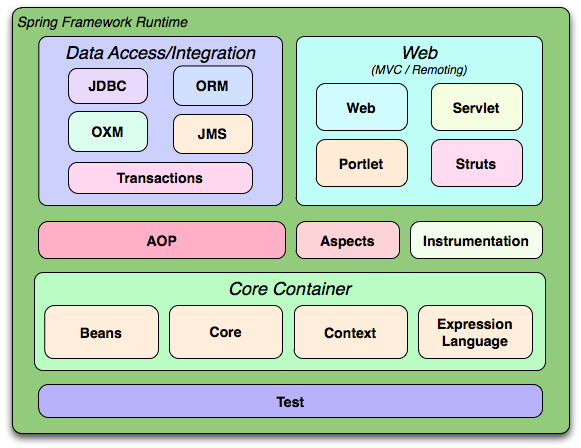

= Spring Framework Reference Documentation
Rod Johnson; Juergen Hoeller; Keith Donald; Colin Sampaleanu; Rob Harrop; Thomas Risberg; Alef Arendsen; Darren Davison; Dmitriy Kopylenko; Mark Pollack; Thierry Templier; Erwin Vervaet; Portia Tung; Ben Hale; Adrian Colyer; John Lewis; Costin Leau; Mark Fisher; Sam Brannen; Ramnivas Laddad; Arjen Poutsma; Chris Beams; Tareq Abedrabbo; Andy Clement; Dave Syer; Oliver Gierke; Rossen Stoyanchev; Phillip Webb; Rob Winch

:javadoc-baseurl: http://docs.spring.io/spring/docs/current/javadoc-api

[[spring-introduction]]
= Overview of Spring Framework

[partintro]
--
The Spring Framework is a lightweight solution and a potential one-stop-shop for
building your enterprise-ready applications. However, Spring is modular, allowing you to
use only those parts that you need, without having to bring in the rest. You can use the
IoC container, with Struts on top, but you can also use only the
<<orm-hibernate,Hibernate integration code>> or the <<jdbc-introduction,JDBC abstraction
layer>>. The Spring Framework supports declarative transaction management, remote access
to your logic through RMI or web services, and various options for persisting your data.
It offers a full-featured <<mvc-introduction,MVC framework>>, and enables you to
integrate <<aop-introduction,AOP>> transparently into your software.

Spring is designed to be non-intrusive, meaning that your domain logic code generally
has no dependencies on the framework itself. In your integration layer (such as the data
access layer), some dependencies on the data access technology and the Spring libraries
will exist. However, it should be easy to isolate these dependencies from the rest of
your code base.

This document is a reference guide to Spring Framework features. If you have any
requests, comments, or questions on this document, please post them on the user mailing
list or on the support forums at http://forum.spring.io/[].
--

[[overview-getting-started-with-spring]]
== Getting Started With Spring
This reference guide provides detailed information about the Spring Framework.
It provides comprehensive documentation for all features, as well as some background
about the underlying concepts (such as __"Dependency Injection"__) that Spring has
embraced.

If you are just getting started with Spring, you may want to begin with the lighter
https://spring.io/guides["Getting Started"] guides that are available from
http://spring.io. As well as being easier to digest, these guide are very
__task focused__. They also cover other projects from the Spring portfolio that you might
 want to consider when solving a particular problem.

https://spring.io/guides/gs/rest-service/[Getting Started Building a RESTful Web Service]
would be an excellent first choice to get your feet wet.

[[overview]]
== Introduction to Spring Framework
Spring Framework is a Java platform that provides comprehensive infrastructure support
for developing Java applications. Spring handles the infrastructure so you can focus on
your application.

Spring enables you to build applications from "plain old Java objects" (POJOs) and to
apply enterprise services non-invasively to POJOs. This capability applies to the Java
SE programming model and to full and partial Java EE.

Examples of how you, as an application developer, can use the Spring platform advantage:

* Make a Java method execute in a database transaction without having to deal with
  transaction APIs.
* Make a local Java method a remote procedure without having to deal with remote APIs.
* Make a local Java method a management operation without having to deal with JMX APIs.
* Make a local Java method a message handler without having to deal with JMS APIs.

[[overview-dependency-injection]]
=== Dependency Injection and Inversion of Control

[[background-ioc]]
.Background
****
"__The question is, what aspect of control are [they] inverting?__" Martin Fowler posed
this question about Inversion of Control (IoC) on his site in 2004. Fowler suggested
renaming the principle to make it more self-explanatory and came up with __Dependency
Injection__.

For insight into IoC and DI, refer to Fowler's article at
http://martinfowler.com/articles/injection.html[http://martinfowler.com/articles/injection.html].
****

Java applications -- a loose term that runs the gamut from constrained applets to n-tier
server-side enterprise applications -- typically consist of objects that collaborate to
form the application proper. Thus the objects in an application have __dependencies__ on
each other.

Although the Java platform provides a wealth of application development functionality,
it lacks the means to organize the basic building blocks into a coherent whole, leaving
that task to architects and developers. True, you can use design patterns such
as __Factory__, __Abstract Factory__, __Builder__, __Decorator__, and __Service Locator__
to compose the various classes and object instances that make up an application.
However, these patterns are simply that: best practices given a name, with a description
of what the pattern does, where to apply it, the problems it addresses, and so forth.
Patterns are formalized best practices that __you must implement yourself__ in your
application.

The Spring Framework __Inversion of Control__ (IoC) component addresses this concern by
providing a formalized means of composing disparate components into a fully working
application ready for use. The Spring Framework codifies formalized design patterns as
first-class objects that you can integrate into your own application(s). Numerous
organizations and institutions use the Spring Framework in this manner to engineer
robust, __maintainable__ applications.

[[overview-modules]]
=== Modules
The Spring Framework consists of features organized into about 20 modules. These modules
are grouped into Core Container, Data Access/Integration, Web, AOP (Aspect Oriented
Programming), Instrumentation, and Test, as shown in the following diagram.

.Overview of the Spring Framework

[[overview-core-container]]
==== Core Container
The <<beans-introduction,__Core Container__>> consists of the Core, Beans, Context, and
Expression Language modules.

The <<beans-introduction,__Core and Beans__>> modules provide the fundamental parts of
the framework, including the IoC and Dependency Injection features. The `BeanFactory` is
a sophisticated implementation of the factory pattern. It removes the need for
programmatic singletons and allows you to decouple the configuration and specification
of dependencies from your actual program logic.

The <<context-introduction,__Context__>> module builds on the solid base provided by the
<<beans-introduction,__Core and Beans__>> modules: it is a means to access objects in a
framework-style manner that is similar to a JNDI registry. The Context module inherits
its features from the Beans module and adds support for internationalization (using, for
example, resource bundles), event-propagation, resource-loading, and the transparent
creation of contexts by, for example, a servlet container. The Context module also
supports Java EE features such as EJB, JMX ,and basic remoting. The `ApplicationContext`
interface is the focal point of the Context module.

The <<expressions,__Expression Language__>> module provides a powerful expression
language for querying and manipulating an object graph at runtime. It is an extension of
the unified expression language (unified EL) as specified in the JSP 2.1 specification.
The language supports setting and getting property values, property assignment, method
invocation, accessing the context of arrays, collections and indexers, logical and
arithmetic operators, named variables, and retrieval of objects by name from Spring's
IoC container. It also supports list projection and selection as well as common list
aggregations.

[[overview-data-access]]
==== Data Access/Integration
The __Data Access/Integration__ layer consists of the JDBC, ORM, OXM, JMS and
Transaction modules.

The <<jdbc-introduction,JDBC>> module provides a JDBC-abstraction layer that removes the
need to do tedious JDBC coding and parsing of database-vendor specific error codes.

The <<orm-introduction,__ORM__>> module provides integration layers for popular
object-relational mapping APIs, including <<orm-jpa,JPA>>, <<orm-jdo,JDO>>, and
<<orm-hibernate,Hibernate>>. Using the ORM package you can use all of these O/R-mapping
frameworks in combination with all of the other features Spring offers, such as the simple
declarative transaction management feature mentioned previously.

The <<oxm,OXM>> module provides an abstraction layer that supports Object/XML mapping
implementations for JAXB, Castor, XMLBeans, JiBX and XStream.

The Java Messaging Service (<<jms,JMS>>) module contains features for producing and
consuming messages.

The <<transaction,Transaction>> module supports programmatic and declarative transaction
management for classes that implement special interfaces and for __all your POJOs (plain
old Java objects)__.

[[overview-web]]
==== Web
The __Web__ layer consists of the Web, Web-Servlet, WebSocket and Web-Portlet modules.

Spring's __Web__ module provides basic web-oriented integration features such as
multipart file-upload functionality and the initialization of the IoC container using
servlet listeners and a web-oriented application context. It also contains the
web-related parts of Spring's remoting support.

The __Web-Servlet__ module contains Spring's model-view-controller
(<<mvc-introduction,__MVC__>>) implementation for web applications. Spring's MVC
framework provides a clean separation between domain model code and web forms, and
integrates with all the other features of the Spring Framework.

The __Web-Portlet__ module provides the MVC implementation to be used in a portlet
environment and mirrors the functionality of Web-Servlet module.

[[overview-aop-instrumentation]]
==== AOP and Instrumentation
Spring's <<aop-introduction,__AOP__>> module provides an __AOP Alliance__-compliant
aspect-oriented programming implementation allowing you to define, for example,
method-interceptors and pointcuts to cleanly decouple code that implements functionality
that should be separated. Using source-level metadata functionality, you can also
incorporate behavioral information into your code, in a manner similar to that of .NET
attributes.

The separate __Aspects__ module provides integration with AspectJ.

The __Instrumentation__ module provides class instrumentation support and classloader
implementations to be used in certain application servers.

[[overview-testing]]
==== Test
The __Test__ module supports the testing of Spring components with JUnit or TestNG. It
provides consistent loading of Spring ApplicationContexts and caching of those contexts.
It also provides mock objects that you can use to test your code in isolation.

[[overview-usagescenarios]]
=== Usage scenarios
The building blocks described previously make Spring a logical choice in many scenarios,
from applets to full-fledged enterprise applications that use Spring's transaction
management functionality and web framework integration.

.Typical full-fledged Spring web application
image::images/overview-full.png[width=400]

Spring's <<transaction-declarative,declarative transaction management features>> make
the web application fully transactional, just as it would be if you used EJB
container-managed transactions. All your custom business logic can be implemented with
simple POJOs and managed by Spring's IoC container. Additional services include support
for sending email and validation that is independent of the web layer, which lets you
choose where to execute validation rules. Spring's ORM support is integrated with JPA,
Hibernate and and JDO; for example, when using Hibernate, you can continue to use
your existing mapping files and standard Hibernate `SessionFactory` configuration. Form
controllers seamlessly integrate the web-layer with the domain model, removing the need
for `ActionForms` or other classes that transform HTTP parameters to values for your
domain model.

.Spring middle-tier using a third-party web framework
image::images/overview-thirdparty-web.png[width=400]

Sometimes circumstances do not allow you to completely switch to a different framework.
The Spring Framework does __not__ force you to use everything within it; it is not an
__all-or-nothing__ solution. Existing front-ends built with Struts, Tapestry, JSF
or other UI frameworks can be integrated with a Spring-based middle-tier, which allows
you to use Spring transaction features. You simply need to wire up your business logic
using an `ApplicationContext` and use a `WebApplicationContext` to integrate your web
layer.

.Remoting usage scenario
image::images/overview-remoting.png[width=400]

When you need to access existing code through web services, you can use Spring's
`Hessian-`, `Burlap-`, `Rmi-` or `JaxRpcProxyFactory` classes. Enabling remote access to
existing applications is not difficult.

.EJBs - Wrapping existing POJOs
image::images/overview-ejb.png[width=400]

The Spring Framework also provides an <<ejb,access and abstraction layer>> for
Enterprise JavaBeans, enabling you to reuse your existing POJOs and wrap them in
stateless session beans for use in scalable, fail-safe web applications that might need
declarative security.

[[dependency-management]]
==== Dependency Management and Naming Conventions
Dependency management and dependency injection are different things. To get those nice
features of Spring into your application (like dependency injection) you need to
assemble all the libraries needed (jar files) and get them onto your classpath at
runtime, and possibly at compile time. These dependencies are not virtual components
that are injected, but physical resources in a file system (typically). The process of
dependency management involves locating those resources, storing them and adding them to
classpaths. Dependencies can be direct (e.g. my application depends on Spring at
runtime), or indirect (e.g. my application depends on `commons-dbcp` which depends on
`commons-pool`). The indirect dependencies are also known as "transitive" and it is
those dependencies that are hardest to identify and manage.

If you are going to use Spring you need to get a copy of the jar libraries that comprise
the pieces of Spring that you need. To make this easier Spring is packaged as a set of
modules that separate the dependencies as much as possible, so for example if you don't
want to write a web application you don't need the spring-web modules. To refer to
Spring library modules in this guide we use a shorthand naming convention `spring-*` or
`spring-*.jar,` where `*` represents the short name for the module (e.g. `spring-core`,
`spring-webmvc`, `spring-jms`, etc.). The actual jar file name that you use is normally
the module name concatenated with the version number
(e.g. __spring-core-{spring-version}.jar__).

Each release of the Spring Framework will publish artifacts to the following places:

* Maven Central, which is the default repository that Maven queries, and does not
  require any special configuration to use. Many of the common libraries that Spring
  depends on also are available from Maven Central and a large section of the Spring
  community uses Maven for dependency management, so this is convenient for them. The
  names of the jars here are in the form `spring-*-<version>.jar` and the Maven groupId
  is `org.springframework`.
* In a public Maven repository hosted specifically for Spring. In addition to the final
  GA releases, this repository also hosts development snapshots and milestones. The jar
  file names are in the same form as Maven Central, so this is a useful place to get
  development versions of Spring to use with other libraries deployed in Maven Central.
  This repository also contains a bundle distribution zip file that contains all Spring
  jars  bundled together for easy download.

So the first thing you need to decide is how to manage your dependencies: we generally
recommend the use of an automated system like Maven, Gradle or Ivy, but you can also do
it manually by downloading all the jars yourself. We provide detailed instructions later
in this chapter.

[[overview-spring-dependencies]]
===== Spring Dependencies and Depending on Spring
Although Spring provides integration and support for a huge range of enterprise and
other external tools, it intentionally keeps its mandatory dependencies to an absolute
minimum: you shouldn't have to locate and download (even automatically) a large number
of jar libraries in order to use Spring for simple use cases. For basic dependency
injection there is only one mandatory external dependency, and that is for logging (see
below for a more detailed description of logging options).

Next we outline the basic steps needed to configure an application that depends on
Spring, first with Maven and then with Gradle and finally using Ivy. In all cases, if
anything is unclear, refer to the documentation of your dependency management system, or
look at some sample code - Spring itself uses Gradle to manage dependencies when it is
building, and our samples mostly use Gradle or Maven.

[[overview-maven-dependency-management]]
===== Maven Dependency Management
If you are using http://maven.apache.org/[Maven] for dependency management you don't even
need to supply the logging dependency explicitly. For example, to create an application
context and use dependency injection to configure an application, your Maven dependencies
will look like this:

[source,xml,indent=0]
[subs="verbatim,quotes,attributes"]
----
	<dependencies>
		<dependency>
			<groupId>org.springframework</groupId>
			<artifactId>spring-context</artifactId>
			<version>{spring-version}</version>
			<scope>runtime</scope>
		</dependency>
	</dependencies>
----

That's it. Note the scope can be declared as runtime if you don't need to compile
against Spring APIs, which is typically the case for basic dependency injection use
cases.

The example above works with the Maven Central repository. To use the Spring Maven
repository (e.g. for milestones or developer snapshots), you need to specify the
repository location in your Maven configuration. For full releases:

[source,xml,indent=0]
[subs="verbatim,quotes"]
----
	<repositories>
		<repository>
			<id>io.spring.repo.maven.release</id>
			<url>http://repo.spring.io/release/</url>
			<snapshots><enabled>false</enabled></snapshots>
		</repository>
	</repositories>
----

For milestones:

[source,xml,indent=0]
[subs="verbatim,quotes"]
----
	<repositories>
		<repository>
			<id>io.spring.repo.maven.milestone</id>
			<url>http://repo.spring.io/milestone/</url>
			<snapshots><enabled>false</enabled></snapshots>
		</repository>
	</repositories>
----

And for snapshots:

[source,xml,indent=0]
[subs="verbatim,quotes"]
----
	<repositories>
		<repository>
			<id>io.spring.repo.maven.snapshot</id>
			<url>http://repo.spring.io/snapshot/</url>
			<snapshots><enabled>true</enabled></snapshots>
		</repository>
	</repositories>
----

[[overview-maven-bom]]
===== Maven "Bill Of Materials" Dependency =====
It is possible to accidentally mix different versions of Spring JARs when using Maven.
For example, you may find that a third-party library, or another Spring project,
pulls in a transitive dependency to an older release. If you forget to explicitly declare
a direct dependency yourself, all sorts of unexpected issues can arise.

To overcome such problems Maven supports the concept of a "bill of materials" (BOM)
dependency. You can import the `spring-framework-bom` in your `dependencyManagement`
section to ensure that all spring dependencies (both direct and transitive) are at
the same version.

[source,xml,indent=0]
[subs="verbatim,quotes,attributes"]
----
	<dependencyManagement>
		<dependencies>
			<dependency>
				<groupId>org.springframework</groupId>
				<artifactId>spring-framework-bom</artifactId>
				<version>{spring-version}</version>
				<type>pom</type>
				<scope>import</scope>
			</dependency>
		</dependencies>
	</dependencyManagement>
----

An added benefit of using the BOM is that you no longer need to specify the `<version>`
attribute when depending on Spring Framework artifacts:

[source,xml,indent=0]
[subs="verbatim,quotes,attributes"]
----
	<dependencies>
		<dependency>
			<groupId>org.springframework</groupId>
			<artifactId>spring-context</artifactId>
		</dependency>
		<dependency>
			<groupId>org.springframework</groupId>
			<artifactId>spring-web</artifactId>
		</dependency>
	<dependencies>
----

[[overview-gradle-dependency-management]]
===== Gradle Dependency Management
To use the Spring repository with the http://www.gradle.org/[Gradle] build system,
include the appropriate URL in the `repositories` section:

[source,groovy,indent=0]
[subs="verbatim,quotes"]
----
	repositories {
		mavenCentral()
		// and optionally...
		maven { url "http://repo.spring.io/release" }
	}
----

You can change the `repositories` URL from `/release` to `/milestone` or `/snapshot` as
appropriate. Once a repository has been configured, you can declare dependencies in the
usual Gradle way:

[source,groovy,indent=0]
[subs="verbatim,quotes,attributes"]
----
	dependencies {
		compile("org.springframework:spring-context:{spring-version}")
		testCompile("org.springframework:spring-test:{spring-version}")
	}
----

[[overview-ivy-dependency-management]]
===== Ivy Dependency Management
If you prefer to use http://ant.apache.org/ivy[Ivy] to manage dependencies then there
are similar configuration options.

To configure Ivy to point to the Spring repository add the following resolver to your
`ivysettings.xml`:

[source,xml,indent=0]
[subs="verbatim,quotes"]
----
	<resolvers>
		<ibiblio name="io.spring.repo.maven.release"
				m2compatible="true"
				root="http://repo.spring.io/release/"/>
	</resolvers>
----

You can change the `root` URL from `/release/` to `/milestone/` or `/snapshot/` as
appropriate.

Once configured, you can add dependencies in the usual way. For example (in `ivy.xml`):

[source,xml,indent=0]
[subs="verbatim,quotes,attributes"]
----
	<dependency org="org.springframework"
		name="spring-core" rev="{spring-version}" conf="compile->runtime"/>
----

[[overview-distribution-zip]]
===== Distribution Zip Files
Although using a build system that supports dependency management is the recommended
way to obtain the Spring Framework, it is still possible to download a distribution
zip file.

Distribution zips are published to the Spring Maven Repository (this is just for our
convenience, you don't need Maven or any other build system in order to download them).

To download a distribution zip open a web browser to
http://repo.spring.io/release/org/springframework/spring and select the appropriate
subfolder for the version that you want. Distribution files end `-dist.zip`, for example
+spring-framework-{spring-version}-RELEASE-dist.zip+. Distributions are also published
for http://repo.spring.io/milestone/org/springframework/spring[milestones] and
http://repo.spring.io/snapshot/org/springframework/spring[snapshots].

[[overview-logging]]
==== Logging
Logging is a very important dependency for Spring because __a)__ it is the only mandatory
external dependency, __b)__ everyone likes to see some output from the tools they are
using, and __c)__ Spring integrates with lots of other tools all of which have also made
a choice of logging dependency. One of the goals of an application developer is often to
have unified logging configured in a central place for the whole application, including
all external components. This is more difficult than it might have been since there are so
many choices of logging framework.

The mandatory logging dependency in Spring is the Jakarta Commons Logging API (JCL). We
compile against JCL and we also make JCL `Log` objects visible for classes that extend
the Spring Framework. It's important to users that all versions of Spring use the same
logging library: migration is easy because backwards compatibility is preserved even
with applications that extend Spring. The way we do this is to make one of the modules
in Spring depend explicitly on `commons-logging` (the canonical implementation of JCL),
and then make all the other modules depend on that at compile time. If you are using
Maven for example, and wondering where you picked up the dependency on
`commons-logging`, then it is from Spring and specifically from the central module
called `spring-core`.

The nice thing about `commons-logging` is that you don't need anything else to make your
application work. It has a runtime discovery algorithm that looks for other logging
frameworks in well known places on the classpath and uses one that it thinks is
appropriate (or you can tell it which one if you need to). If nothing else is available
you get pretty nice looking logs just from the JDK (java.util.logging or JUL for short).
You should find that your Spring application works and logs happily to the console out
of the box in most situations, and that's important.

[[overview-not-using-commons-logging]]
===== Not Using Commons Logging
Unfortunately, the runtime discovery algorithm in `commons-logging`, while convenient
for the end-user, is problematic. If we could turn back the clock and start Spring now
as a new project it would use a different logging dependency. The first choice would
probably be the Simple Logging Facade for Java ( http://www.slf4j.org[SLF4J]), which is
also used by a lot of other tools that people use with Spring inside their applications.

Switching off `commons-logging` is easy: just make sure it isn't on the classpath at
runtime. In Maven terms you exclude the dependency, and because of the way that the
Spring dependencies are declared, you only have to do that once.

[source,xml,indent=0]
[subs="verbatim,quotes,attributes"]
----
	<dependencies>
		<dependency>
			<groupId>org.springframework</groupId>
			<artifactId>spring-context</artifactId>
			<version>{spring-version}</version>
			<scope>runtime</scope>
			<exclusions>
				<exclusion>
					<groupId>commons-logging</groupId>
					<artifactId>commons-logging</artifactId>
				</exclusion>
			</exclusions>
		</dependency>
	</dependencies>
----

Now this application is probably broken because there is no implementation of the JCL
API on the classpath, so to fix it a new one has to be provided. In the next section we
show you how to provide an alternative implementation of JCL using SLF4J as an example.

[[overview-logging-slf4j]]
===== Using SLF4J
SLF4J is a cleaner dependency and more efficient at runtime than `commons-logging`
because it uses compile-time bindings instead of runtime discovery of the other logging
frameworks it integrates. This also means that you have to be more explicit about what
you want to happen at runtime, and declare it or configure it accordingly. SLF4J
provides bindings to many common logging frameworks, so you can usually choose one that
you already use, and bind to that for configuration and management.

SLF4J provides bindings to many common logging frameworks, including JCL, and it also
does the reverse: bridges between other logging frameworks and itself. So to use SLF4J
with Spring you need to replace the `commons-logging` dependency with the SLF4J-JCL
bridge. Once you have done that then logging calls from within Spring will be translated
into logging calls to the SLF4J API, so if other libraries in your application use that
API, then you have a single place to configure and manage logging.

A common choice might be to bridge Spring to SLF4J, and then provide explicit binding
from SLF4J to Log4J. You need to supply 4 dependencies (and exclude the existing
`commons-logging`): the bridge, the SLF4J API, the binding to Log4J, and the Log4J
implementation itself. In Maven you would do that like this

[source,xml,indent=0]
[subs="verbatim,quotes,attributes"]
----
	<dependencies>
		<dependency>
			<groupId>org.springframework</groupId>
			<artifactId>spring-context</artifactId>
			<version>{spring-version}</version>
			<scope>runtime</scope>
			<exclusions>
				<exclusion>
					<groupId>commons-logging</groupId>
					<artifactId>commons-logging</artifactId>
				</exclusion>
			</exclusions>
		</dependency>
		<dependency>
			<groupId>org.slf4j</groupId>
			<artifactId>jcl-over-slf4j</artifactId>
			<version>1.5.8</version>
			<scope>runtime</scope>
		</dependency>
		<dependency>
			<groupId>org.slf4j</groupId>
			<artifactId>slf4j-api</artifactId>
			<version>1.5.8</version>
			<scope>runtime</scope>
		</dependency>
		<dependency>
			<groupId>org.slf4j</groupId>
			<artifactId>slf4j-log4j12</artifactId>
			<version>1.5.8</version>
			<scope>runtime</scope>
		</dependency>
		<dependency>
			<groupId>log4j</groupId>
			<artifactId>log4j</artifactId>
			<version>1.2.14</version>
			<scope>runtime</scope>
		</dependency>
	</dependencies>
----

That might seem like a lot of dependencies just to get some logging. Well it is, but it
__is__ optional, and it should behave better than the vanilla `commons-logging` with
respect to classloader issues, notably if you are in a strict container like an OSGi
platform. Allegedly there is also a performance benefit because the bindings are at
compile-time not runtime.

A more common choice amongst SLF4J users, which uses fewer steps and generates fewer
dependencies, is to bind directly to http://logback.qos.ch[Logback]. This removes the
extra binding step because Logback implements SLF4J directly, so you only need to depend
on two libraries not four ( `jcl-over-slf4j` and `logback`). If you do that you might
also need to exclude the slf4j-api dependency from other external dependencies (not
Spring), because you only want one version of that API on the classpath.

[[overview-logging-log4j]]
===== Using Log4J
Many people use http://logging.apache.org/log4j[Log4j] as a logging framework for
configuration and management purposes. It's efficient and well-established, and in fact
it's what we use at runtime when we build and test Spring. Spring also provides some
utilities for configuring and initializing Log4j, so it has an optional compile-time
dependency on Log4j in some modules.

To make Log4j work with the default JCL dependency ( `commons-logging`) all you need to
do is put Log4j on the classpath, and provide it with a configuration file (
`log4j.properties` or `log4j.xml` in the root of the classpath). So for Maven users this
is your dependency declaration:

[source,xml,indent=0]
[subs="verbatim,quotes,attributes"]
----
	<dependencies>
		<dependency>
			<groupId>org.springframework</groupId>
			<artifactId>spring-context</artifactId>
			<version>{spring-version}</version>
			<scope>runtime</scope>
		</dependency>
		<dependency>
			<groupId>log4j</groupId>
			<artifactId>log4j</artifactId>
			<version>1.2.14</version>
			<scope>runtime</scope>
		</dependency>
	</dependencies>
----

And here's a sample log4j.properties for logging to the console:

[literal]
[subs="verbatim,quotes"]
----
log4j.rootCategory=INFO, stdout

log4j.appender.stdout=org.apache.log4j.ConsoleAppender
log4j.appender.stdout.layout=org.apache.log4j.PatternLayout
log4j.appender.stdout.layout.ConversionPattern=%d{ABSOLUTE} %5p %t %c{2}:%L - %m%n

log4j.category.org.springframework.beans.factory=DEBUG
----

[[overview-native-jcl]]
====== Runtime Containers with Native JCL
Many people run their Spring applications in a container that itself provides an
implementation of JCL. IBM Websphere Application Server (WAS) is the archetype. This
often causes problems, and unfortunately there is no silver bullet solution; simply
excluding `commons-logging` from your application is not enough in most situations.

To be clear about this: the problems reported are usually not with JCL per se, or even
with `commons-logging`: rather they are to do with binding `commons-logging` to another
framework (often Log4J). This can fail because `commons-logging` changed the way they do
the runtime discovery in between the older versions (1.0) found in some containers and
the modern versions that most people use now (1.1). Spring does not use any unusual
parts of the JCL API, so nothing breaks there, but as soon as Spring or your application
tries to do any logging you can find that the bindings to Log4J are not working.

In such cases with WAS the easiest thing to do is to invert the class loader hierarchy
(IBM calls it "parent last") so that the application controls the JCL dependency, not
the container. That option isn't always open, but there are plenty of other suggestions
in the public domain for alternative approaches, and your mileage may vary depending on
the exact version and feature set of the container.

[[spring-whats-new]]
= What's New in Spring Framework 4.x

[[new-in-4.0]]
== New Features and Enhancements in Spring Framework 4.0
The Spring Framework was first released in 2004; since then there have been significant
major revisions: Spring 2.0 provided XML namespaces and AspectJ support; Spring 2.5
embraced annotation-driven configuration; Spring 3.0 introduced a strong Java 5+ foundation
across the framework codebase, and features such as the Java-based `@Configuration` model.

Version 4.0 is the latest major release of the Spring Framework and the first to fully
support Java 8 features. You can still use Spring with older versions of Java, however,
the minimum requirement has now been raised to Java SE 6. We have also taken the
opportunity of a major release to remove many deprecated classes and methods.

A https://github.com/spring-projects/spring-framework/wiki/Migrating-from-earlier-versions-of-the-spring-framework[migration guide for upgrading to Spring 4.0]
is available on the https://github.com/spring-projects/spring-framework/wiki[Spring Framework GitHub Wiki].

=== Improved Getting Started Experience
The new http://spring.io[spring.io] website provides a whole series of
http://spring.io/guides["Getting Started"] guides to help you learn Spring. You
can read more about the guides in the <<overview-getting-started-with-spring>> section
in this document. The new website also provides a comprehensive overview of the many
additional projects that are released under the Spring umbrella.

If you are a Maven user you may also be interested in the helpful
<<overview-maven-bom,bill of materials>> POM file that is now published with each Spring
Framework release.

=== Removed Deprecated Packages and Methods
All deprecated packages, and many deprecated classes and methods have been removed with
version 4.0. If you are upgrading from a previous release of Spring, you should ensure
that you have fixed any deprecated calls that you were making to outdated APIs.

For a complete set of changes, check out the
http://docs.spring.io/spring-framework/docs/3.2.4.RELEASE_to_4.0.0.RELEASE/[API
Differences Report].

Note that optional third-party dependencies have been raised to a 2010/2011 minimum
(i.e. Spring 4 generally only supports versions released in late 2010 or later now):
notably, Hibernate 3.6+, EhCache 2.1+, Quartz 1.8+, Groovy 1.8+, and Joda-Time 2.0+.
As an exception to the rule, Spring 4 requires the recent Hibernate Validator 4.3+,
and support for Jackson has been focused on 2.0+ now (with Jackson 1.8/1.9 support
retained for the time being where Spring 3.2 had it; now just in deprecated form).

=== Java 8 (as well as 6 and 7)
Spring Framework 4.0 provides support for several Java 8 features. You can make use of
__lambda expressions__ and __method references__ with Spring's callback interfaces. There
is first class support for `java.time` (http://jcp.org/en/jsr/detail?id=310[JSR-310]), and
several existing annotations have been retrofitted as `@Repeatable`. You can also use
Java 8's parameter name discovery as an alternative to compiling your code with debug
information enabled.

Spring remains compatible with older versions of Java and the JDK: concretely, Java SE 6
(specifically, a minimum level equivalent to JDK 6 update 10, as released in late 2008)
and above are still fully supported. However, for newly started development projects
based on Spring 4, we recommend the use of Java 7 or 8.

Note that the Java 8 bytecode level (`-target 1.8`, as required by `-source 1.8`) is only
fully supported as of Spring Framework 4.0. In particular, Spring 3.2 based applications
need to be compiled with a maximum of Java 7 as the target, even if they happen to be
deployed onto a Java 8 runtime. Please upgrade to Spring 4 for Java 8 based applications.

=== Java EE 6 and 7
Java EE version 6 or above is now considered the baseline for Spring Framework 4, with
the JPA 2.0 and Servlet 3.0 specifications being of particular relevance. In order to
remain compatible with Google App Engine and older application servers, it is possible
to deploy a Spring application into a Servlet 2.5 environment; however, Servlet 3.0+
is recommended when at all possible.

[NOTE]
====
If you are a WebSphere 7 user, be sure to install the JPA 2.0 feature pack. On
WebLogic 10.3.4 or higher, install the JPA 2.0 patch that comes with it. This turns
both of those server generations into Spring 4 compatible deployment environments.
====

On a more forward-looking note, Spring Framework 4.0 supports the Java EE 7 level of
applicable specifications now: in particular, JMS 2.0, JTA 1.2, JPA 2.1, Bean Validation
1.1, and JSR-236 Concurrency Utilities. As usual, this support focuses on individual
use of those specifications, e.g. on Tomcat or in standalone environments. However,
it works equally well when a Spring application is deployed to a Java EE 7 server.

Note that Hibernate 4.3 is a JPA 2.1 provider and therefore only supported as of
Spring Framework 4.0. The same applies to Hibernate Validator 5.0 as a Bean Validation
1.1 provider. Neither of the two are officially supported with Spring Framework 3.2.

=== Groovy Bean Definition DSL
With Spring Framework 4.0 it is now possible to define external bean configuration using
a Groovy DSL. This is similar in concept to using XML bean definitions, but allows for
a more concise syntax. Using Groovy also allows you to easily embed bean definitions
directly in your bootstrap code. For example:

[source,groovy,indent=0]
[subs="verbatim,quotes"]
----
	def reader = new GroovyBeanDefinitionReader(myApplicationContext)
	reader.beans {
		dataSource(BasicDataSource) {
			driverClassName = "org.hsqldb.jdbcDriver"
			url = "jdbc:hsqldb:mem:grailsDB"
			username = "sa"
			password = ""
			settings = [mynew:"setting"]
		}
		sessionFactory(SessionFactory) {
			dataSource = dataSource
		}
		myService(MyService) {
			nestedBean = { AnotherBean bean ->
				dataSource = dataSource
			}
		}
	}
----

For more information consult the `GroovyBeanDefinitionReader`
{javadoc-baseurl}/org/springframework/beans/factory/groovy/GroovyBeanDefinitionReader.html[Javadoc].

=== Core Container Improvements
There have been several general improvements to the core container:

* Spring now treats <<beans-generics-as-qualifiers,__generic types__ as a form of
  __qualifier__>> when injecting Beans. For example, if you are using a Spring Data
  `Repository` you can now easily inject a specific implementation:
  `@Autowired Repository<Customer> customerRepository`.
* If you use Spring's meta-annotation support, you can now develop custom annotations that
  <<beans-meta-annotations,expose specific attributes from the source annotation>>.
* Beans can now be __ordered__ when they are <<beans-autowired-annotation,autowired into
  lists and arrays>>. Both the `@Ordered` annotation and `Ordered` interface are
  supported.
* The `@Lazy` annotation can now be used on injection points, as well as on `@Bean`
  definitions.
* The <<beans-java-bean-description,`@Description` annotation has been introduced>> for
  developers using Java-based configuration.
* A generalized model for <<beans-java-conditional,conditionally filtering beans>> has
  been added via the `@Conditional` annotation. This is similar to `@Profile` support but
  allows for user-defined strategies to be developed programmatically.
* <<aop-pfb-proxy-types,CGLIB-based proxy classes>> no longer require a default
  constructor. Support is provided via the http://code.google.com/p/objenesis/[objenesis]
  library which is repackaged __inline__ and distributed as part of the Spring Framework.
  With this strategy, no constructor at all is being invoked for proxy instances anymore.
* There is managed time zone support across the framework now, e.g. on `LocaleContext`.

=== General Web Improvements
Deployment to Servlet 2.5 servers remains an option, but Spring Framework 4.0 is now
focused primarily on Servlet 3.0+ environments. If you are using the
<<spring-mvc-test-framework,Spring MVC Test Framework>> you
will need to ensure that a Servlet 3.0 compatible JAR is in your __test classpath__.

In addition to the WebSocket support mentioned later, the following general improvements
have been made to Spring's Web modules:

* You can use the <<mvc-ann-restcontroller,new `@RestController` annotation>> with Spring
  MVC applications, removing the need to add `@ResponseBody` to each of your
  `@RequestMapping` methods.
* The `AsyncRestTemplate` class has been added, <<rest-async-resttemplate,allowing
  non-blocking asynchronous support>> when developing REST clients.
* Spring now offers <<mvc-timezone,comprehensive timezone support>> when developing
  Spring MVC applications.

=== WebSocket, SockJS, and STOMP Messaging
A new `spring-websocket` module provides comprehensive support for WebSocket-based,
two-way communication between client and server in web applications. It is compatible with
http://jcp.org/en/jsr/detail?id=356[JSR-356], the Java WebSocket API, and in addition
provides SockJS-based fallback options (i.e. WebSocket emulation) for use in browsers
that don't yet support the WebSocket protocol (e.g. Internet Explorer < 10).

A new `spring-messaging` module adds support for STOMP as the WebSocket sub-protocol
to use in applications along with an annotation programming model for routing and
processing STOMP messages from WebSocket clients. As a result an `@Controller`
can now contain both `@RequestMapping` and `@MessageMapping` methods for handling
HTTP requests and messages from WebSocket-connected clients. The new `spring-messaging`
module also contains key abstractions from the
http://projects.spring.io/spring-integration/[Spring Integration] project such as
`Message`, `MessageChannel`, `MessageHandler`, and others to serve as a foundation
for messaging-based applications.

For further details, including a more thorough introduction, see the <<websocket>> section.

=== Testing Improvements
In addition to pruning of deprecated code within the `spring-test` module, Spring
Framework 4.0 introduces several new features for use in unit and integration testing.

* Almost all annotations in the `spring-test` module (e.g., `@ContextConfiguration`,
  `@WebAppConfiguration`, `@ContextHierarchy`, `@ActiveProfiles`, etc.) can now be used
  as <<integration-testing-annotations-meta,meta-annotations>> to create custom
  _composed annotations_ and reduce configuration duplication across a test suite.
* Active bean definition profiles can now be resolved programmatically, simply by
  implementing a custom <<testcontext-ctx-management-env-profiles-ActiveProfilesResolver,`ActiveProfilesResolver`>>
  and registering it via the `resolver` attribute of `@ActiveProfiles`.
* A new `SocketUtils` class has been introduced in the `spring-core` module
  which enables you to scan for free TCP and UDP server ports on localhost. This
  functionality is not specific to testing but can prove very useful when writing
  integration tests that require the use of sockets, for example tests that start
  an in-memory SMTP server, FTP server, Servlet container, etc.
* As of Spring 4.0, the set of mocks in the `org.springframework.mock.web` package is
  now based on the Servlet 3.0 API. Furthermore, several of the Servlet API mocks
  (e.g., `MockHttpServletRequest`, `MockServletContext`, etc.) have been updated with
  minor enhancements and improved configurability.

[[spring-core]]
= Core Technologies
[partintro]
--
This part of the reference documentation covers all of those technologies that are
absolutely integral to the Spring Framework.

Foremost amongst these is the Spring Framework's Inversion of Control (IoC) container. A
thorough treatment of the Spring Framework's IoC container is closely followed by
comprehensive coverage of Spring's Aspect-Oriented Programming (AOP) technologies. The
Spring Framework has its own AOP framework, which is conceptually easy to understand,
and which successfully addresses the 80% sweet spot of AOP requirements in Java
enterprise programming.

Coverage of Spring's integration with AspectJ (currently the richest - in terms of
features - and certainly most mature AOP implementation in the Java enterprise space) is
also provided.

Finally, the adoption of the test-driven-development (TDD) approach to software
development is certainly advocated by the Spring team, and so coverage of Spring's
support for integration testing is covered (alongside best practices for unit testing).
The Spring team has found that the correct use of IoC certainly does make both unit and
integration testing easier (in that the presence of setter methods and appropriate
constructors on classes makes them easier to wire together in a test without having to
set up service locator registries and suchlike)... the chapter dedicated solely to
testing will hopefully convince you of this as well.

* <<beans>>
* <<resources>>
* <<validation>>
* <<expressions>>
* <<aop>>
* <<aop-api>>
* <<testing>>
--

[[beans]]
== The IoC container

[[beans-introduction]]
=== Introduction to the Spring IoC container and beans
This chapter covers the Spring Framework implementation of the Inversion of Control
(IoC) footnote:[See pass:specialcharacters,macros[<<background-ioc>>] ] principle. IoC
is also known as __dependency injection__ (DI). It is a process whereby objects define
their dependencies, that is, the other objects they work with, only through constructor
arguments, arguments to a factory method, or properties that are set on the object
instance after it is constructed or returned from a factory method. The container then
__injects__ those dependencies when it creates the bean. This process is fundamentally
the inverse, hence the name __Inversion of Control__ (IoC), of the bean itself
controlling the instantiation or location of its dependencies by using direct
construction of classes, or a mechanism such as the __Service Locator__ pattern.

The `org.springframework.beans` and `org.springframework.context` packages are the basis
for Spring Framework's IoC container. The
{javadoc-baseurl}/org/springframework/beans/factory/BeanFactory.html[`BeanFactory`]
interface provides an advanced configuration mechanism capable of managing any type of
object.
{javadoc-baseurl}/org/springframework/context/ApplicationContext.html[`ApplicationContext`]
is a sub-interface of `BeanFactory`. It adds easier integration with Spring's AOP
features; message resource handling (for use in internationalization), event
publication; and application-layer specific contexts such as the `WebApplicationContext`
for use in web applications.

In short, the `BeanFactory` provides the configuration framework and basic
functionality, and the `ApplicationContext` adds more enterprise-specific functionality.
The `ApplicationContext` is a complete superset of the `BeanFactory`, and is used
exclusively in this chapter in descriptions of Spring's IoC container. For more
information on using the `BeanFactory` instead of the `ApplicationContext,` refer to
<<beans-beanfactory>>.

In Spring, the objects that form the backbone of your application and that are managed
by the Spring IoC __container__ are called __beans__. A bean is an object that is
instantiated, assembled, and otherwise managed by a Spring IoC container. Otherwise, a
bean is simply one of many objects in your application. Beans, and the __dependencies__
among them, are reflected in the __configuration metadata__ used by a container.

[[beans-basics]]
=== Container overview
The interface `org.springframework.context.ApplicationContext` represents the Spring IoC
container and is responsible for instantiating, configuring, and assembling the
aforementioned beans. The container gets its instructions on what objects to
instantiate, configure, and assemble by reading configuration metadata. The
configuration metadata is represented in XML, Java annotations, or Java code. It allows
you to express the objects that compose your application and the rich interdependencies
between such objects.

Several implementations of the `ApplicationContext` interface are supplied
out-of-the-box with Spring. In standalone applications it is common to create an
instance of
{javadoc-baseurl}/org/springframework/context/support/ClassPathXmlApplicationContext.html[`ClassPathXmlApplicationContext`]
or {javadoc-baseurl}/org/springframework/context/support/FileSystemXmlApplicationContext.html[`FileSystemXmlApplicationContext`].
 While XML has been the traditional format for defining configuration metadata you can
instruct the container to use Java annotations or code as the metadata format by
providing a small amount of XML configuration to declaratively enable support for these
additional metadata formats.

In most application scenarios, explicit user code is not required to instantiate one or
more instances of a Spring IoC container. For example, in a web application scenario, a
simple eight (or so) lines of boilerplate web descriptor XML in the `web.xml` file
of the application will typically suffice (see <<context-create>>). If you are using the
http://spring.io/tools/sts[SpringSource Tool Suite] Eclipse-powered development
environment this boilerplate configuration can be easily created with few mouse clicks or
keystrokes.

The following diagram is a high-level view of how Spring works. Your application classes
are combined with configuration metadata so that after the `ApplicationContext` is
created and initialized, you have a fully configured and executable system or
application.

.The Spring IoC container
image::images/container-magic.png[width=250]

[[beans-factory-metadata]]
==== Configuration metadata
As the preceding diagram shows, the Spring IoC container consumes a form of
__configuration metadata__; this configuration metadata represents how you as an
application developer tell the Spring container to instantiate, configure, and assemble
the objects in your application.

Configuration metadata is traditionally supplied in a simple and intuitive XML format,
which is what most of this chapter uses to convey key concepts and features of the
Spring IoC container.

[NOTE]
====
XML-based metadata is __not__ the only allowed form of configuration metadata. The
Spring IoC container itself is __totally__ decoupled from the format in which this
configuration metadata is actually written. These days many developers choose
<<beans-java,Java-based configuration>> for their Spring applications.
====

For information about using other forms of metadata with the Spring container, see:

* <<beans-annotation-config,Annotation-based configuration>>: Spring 2.5 introduced
  support for annotation-based configuration metadata.
* <<beans-java,Java-based configuration>>: Starting with Spring 3.0, many features
  provided by the Spring JavaConfig project became part of the core Spring Framework.
  Thus you can define beans external to your application classes by using Java rather
  than XML files. To use these new features, see the `@Configuration`, `@Bean`, `@Import`
  and `@DependsOn` annotations.

Spring configuration consists of at least one and typically more than one bean
definition that the container must manage. XML-based configuration metadata shows these
beans configured as `<bean/>` elements inside a top-level `<beans/>` element. Java
configuration typically uses `@Bean` annotated methods within a `@Configuration` class.

These bean definitions correspond to the actual objects that make up your application.
Typically you define service layer objects, data access objects (DAOs), presentation
objects such as Struts `Action` instances, infrastructure objects such as Hibernate
`SessionFactories`, JMS `Queues`, and so forth. Typically one does not configure
fine-grained domain objects in the container, because it is usually the responsibility
of DAOs and business logic to create and load domain objects. However, you can use
Spring's integration with AspectJ to configure objects that have been created outside
the control of an IoC container. See <<aop-atconfigurable,Using AspectJ to
dependency-inject domain objects with Spring>>.

The following example shows the basic structure of XML-based configuration metadata:

[source,xml,indent=0]
[subs="verbatim,quotes"]
----
	<?xml version="1.0" encoding="UTF-8"?>
	<beans xmlns="http://www.springframework.org/schema/beans"
		xmlns:xsi="http://www.w3.org/2001/XMLSchema-instance"
		xsi:schemaLocation="http://www.springframework.org/schema/beans
			http://www.springframework.org/schema/beans/spring-beans.xsd">

		<bean id="..." class="...">
			<!-- collaborators and configuration for this bean go here -->
		</bean>

		<bean id="..." class="...">
			<!-- collaborators and configuration for this bean go here -->
		</bean>

		<!-- more bean definitions go here -->

	</beans>
----

The `id` attribute is a string that you use to identify the individual bean definition.
The `class` attribute defines the type of the bean and uses the fully qualified
classname. The value of the id attribute refers to collaborating objects. The XML for
referring to collaborating objects is not shown in this example; see
<<beans-dependencies,Dependencies>> for more information.

[[beans-factory-instantiation]]
==== Instantiating a container
Instantiating a Spring IoC container is straightforward. The location path or paths
supplied to an `ApplicationContext` constructor are actually resource strings that allow
the container to load configuration metadata from a variety of external resources such
as the local file system, from the Java `CLASSPATH`, and so on.

[source,java,indent=0]
[subs="verbatim,quotes"]
----
	ApplicationContext context =
		new ClassPathXmlApplicationContext(new String[] {"services.xml", "daos.xml"});
----

[NOTE]
====
After you learn about Spring's IoC container, you may want to know more about Spring's
`Resource` abstraction, as described in <<resources>>, which provides a convenient
mechanism for reading an InputStream from locations defined in a URI syntax. In
particular, `Resource` paths are used to construct applications contexts as described in
<<resources-app-ctx>>.
====

The following example shows the service layer objects `(services.xml)` configuration file:

[source,xml,indent=0]
[subs="verbatim,quotes"]
----
	<?xml version="1.0" encoding="UTF-8"?>
	<beans xmlns="http://www.springframework.org/schema/beans"
		xmlns:xsi="http://www.w3.org/2001/XMLSchema-instance"
		xsi:schemaLocation="http://www.springframework.org/schema/beans
			http://www.springframework.org/schema/beans/spring-beans.xsd">

		<!-- services -->

		<bean id="petStore" class="org.springframework.samples.jpetstore.services.PetStoreServiceImpl">
			<property name="accountDao" ref="accountDao"/>
			<property name="itemDao" ref="itemDao"/>
			<!-- additional collaborators and configuration for this bean go here -->
		</bean>

		<!-- more bean definitions for services go here -->

	</beans>
----

The following example shows the data access objects `daos.xml` file:

[source,xml,indent=0]
[subs="verbatim,quotes"]
----
	<?xml version="1.0" encoding="UTF-8"?>
	<beans xmlns="http://www.springframework.org/schema/beans"
		xmlns:xsi="http://www.w3.org/2001/XMLSchema-instance"
		xsi:schemaLocation="http://www.springframework.org/schema/beans
			http://www.springframework.org/schema/beans/spring-beans.xsd">

		<bean id="accountDao"
			class="org.springframework.samples.jpetstore.dao.jpa.JpaAccountDao">
			<!-- additional collaborators and configuration for this bean go here -->
		</bean>

		<bean id="itemDao" class="org.springframework.samples.jpetstore.dao.jpa.JapItemDao">
			<!-- additional collaborators and configuration for this bean go here -->
		</bean>

		<!-- more bean definitions for data access objects go here -->

	</beans>
----

In the preceding example, the service layer consists of the class `PetStoreServiceImpl`,
and two data access objects of the type `JpaAccountDao` and `JpaItemDao` (based
on the JPA Object/Relational mapping standard). The `property name` element refers to the
name of the JavaBean property, and the `ref` element refers to the name of another bean
definition. This linkage between `id` and `ref` elements expresses the dependency between
collaborating objects. For details of configuring an object's dependencies, see
<<beans-dependencies,Dependencies>>.

[[beans-factory-xml-import]]
===== Composing XML-based configuration metadata
It can be useful to have bean definitions span multiple XML files. Often each individual
XML configuration file represents a logical layer or module in your architecture.

You can use the application context constructor to load bean definitions from all these
XML fragments. This constructor takes multiple `Resource` locations, as was shown in the
previous section. Alternatively, use one or more occurrences of the `<import/>` element
to load bean definitions from another file or files. For example:

[source,xml,indent=0]
[subs="verbatim,quotes"]
----
	<beans>
		<import resource="services.xml"/>
		<import resource="resources/messageSource.xml"/>
		<import resource="/resources/themeSource.xml"/>

		<bean id="bean1" class="..."/>
		<bean id="bean2" class="..."/>
	</beans>
----

In the preceding example, external bean definitions are loaded from three files,
`services.xml`, `messageSource.xml`, and `themeSource.xml`. All location paths are
relative to the definition file doing the importing, so `services.xml` must be in the
same directory or classpath location as the file doing the importing, while
`messageSource.xml` and `themeSource.xml` must be in a `resources` location below the
location of the importing file. As you can see, a leading slash is ignored, but given
that these paths are relative, it is better form not to use the slash at all. The
contents of the files being imported, including the top level `<beans/>` element, must
be valid XML bean definitions according to the Spring Schema.

[NOTE]
====
It is possible, but not recommended, to reference files in parent directories using a
relative "../" path. Doing so creates a dependency on a file that is outside the current
application. In particular, this reference is not recommended for "classpath:" URLs (for
example, "classpath:../services.xml"), where the runtime resolution process chooses the
"nearest" classpath root and then looks into its parent directory. Classpath
configuration changes may lead to the choice of a different, incorrect directory.

You can always use fully qualified resource locations instead of relative paths: for
example, "file:C:/config/services.xml" or "classpath:/config/services.xml". However, be
aware that you are coupling your application's configuration to specific absolute
locations. It is generally preferable to keep an indirection for such absolute
locations, for example, through "${...}" placeholders that are resolved against JVM
system properties at runtime.
====

[[beans-factory-client]]
==== Using the container
The `ApplicationContext` is the interface for an advanced factory capable of maintaining
a registry of different beans and their dependencies. Using the method `T getBean(String
name, Class<T> requiredType)` you can retrieve instances of your beans.

The `ApplicationContext` enables you to read bean definitions and access them as follows:

[source,java,indent=0]
[subs="verbatim,quotes"]
----
	// create and configure beans
	ApplicationContext context =
		new ClassPathXmlApplicationContext(new String[] {"services.xml", "daos.xml"});

	// retrieve configured instance
	PetStoreService service = context.getBean("petStore", PetStoreService.class);

	// use configured instance
	List<String> userList = service.getUsernameList();
----

You use `getBean()` to retrieve instances of your beans. The `ApplicationContext`
interface has a few other methods for retrieving beans, but ideally your application
code should never use them. Indeed, your application code should have no calls to the
`getBean()` method at all, and thus no dependency on Spring APIs at all. For example,
Spring's integration with web frameworks provides for dependency injection for various
web framework classes such as controllers and JSF-managed beans.

[[beans-definition]]
=== Bean overview
A Spring IoC container manages one or more __beans__. These beans are created with the
configuration metadata that you supply to the container, for example, in the form of XML
`<bean/>` definitions.

Within the container itself, these bean definitions are represented as `BeanDefinition`
objects, which contain (among other information) the following metadata:

* __A package-qualified class name:__ typically the actual implementation class of the
  bean being defined.
* Bean behavioral configuration elements, which state how the bean should behave in the
  container (scope, lifecycle callbacks, and so forth).
* References to other beans that are needed for the bean to do its work; these
  references are also called __collaborators__ or __dependencies__.
* Other configuration settings to set in the newly created object, for example, the
  number of connections to use in a bean that manages a connection pool, or the size
  limit of the pool.

This metadata translates to a set of properties that make up each bean definition.

[[beans-factory-bean-definition-tbl]]
.The bean definition
|===
| Property| Explained in...

| class
| <<beans-factory-class>>

| name
| <<beans-beanname>>

| scope
| <<beans-factory-scopes>>

| constructor arguments
| <<beans-factory-collaborators>>

| properties
| <<beans-factory-collaborators>>

| autowiring mode
| <<beans-factory-autowire>>

| lazy-initialization mode
| <<beans-factory-lazy-init>>

| initialization method
| <<beans-factory-lifecycle-initializingbean>>

| destruction method
| <<beans-factory-lifecycle-disposablebean>>
|===

In addition to bean definitions that contain information on how to create a specific
bean, the `ApplicationContext` implementations also permit the registration of existing
objects that are created outside the container, by users. This is done by accessing the
ApplicationContext's BeanFactory via the method `getBeanFactory()` which returns the
BeanFactory implementation `DefaultListableBeanFactory`. `DefaultListableBeanFactory`
supports this registration through the methods `registerSingleton(..)` and
`registerBeanDefinition(..)`. However, typical applications work solely with beans
defined through metadata bean definitions.

[[beans-beanname]]
==== Naming beans
Every bean has one or more identifiers. These identifiers must be unique within the
container that hosts the bean. A bean usually has only one identifier, but if it
requires more than one, the extra ones can be considered aliases.

In XML-based configuration metadata, you use the `id` and/or `name` attributes
to specify the bean identifier(s). The `id` attribute allows you to specify
exactly one id. Conventionally these names are alphanumeric ('myBean',
'fooService', etc.), but may contain special characters as well. If you want to
introduce other aliases to the bean, you can also specify them in the `name`
attribute, separated by a comma (`,`), semicolon (`;`), or white space. As a
historical note, in versions prior to Spring 3.1, the `id` attribute was
defined as an `xsd:ID` type, which constrained possible characters. As of 3.1,
it is defined as an `xsd:string` type. Note that bean `id` uniqueness is still
enforced by the container, though no longer by XML parsers.

You are not required to supply a name or id for a bean. If no name or id is supplied
explicitly, the container generates a unique name for that bean. However, if you want to
refer to that bean by name, through the use of the `ref` element or
<<beans-servicelocator,Service Locator>> style lookup, you must provide a name.
Motivations for not supplying a name are related to using <<beans-inner-beans,inner
beans>> and <<beans-factory-autowire,autowiring collaborators>>.

.Bean Naming Conventions
****
The convention is to use the standard Java convention for instance field names when
naming beans. That is, bean names start with a lowercase letter, and are camel-cased
from then on. Examples of such names would be (without quotes) `'accountManager'`,
`'accountService'`, `'userDao'`, `'loginController'`, and so forth.

Naming beans consistently makes your configuration easier to read and understand, and if
you are using Spring AOP it helps a lot when applying advice to a set of beans related
by name.
****

[[beans-beanname-alias]]
===== Aliasing a bean outside the bean definition
In a bean definition itself, you can supply more than one name for the bean, by using a
combination of up to one name specified by the `id` attribute, and any number of other
names in the `name` attribute. These names can be equivalent aliases to the same bean,
and are useful for some situations, such as allowing each component in an application to
refer to a common dependency by using a bean name that is specific to that component
itself.

Specifying all aliases where the bean is actually defined is not always adequate,
however. It is sometimes desirable to introduce an alias for a bean that is defined
elsewhere. This is commonly the case in large systems where configuration is split
amongst each subsystem, each subsystem having its own set of object definitions. In
XML-based configuration metadata, you can use the `<alias/>` element to accomplish this.

[source,xml,indent=0]
[subs="verbatim,quotes"]
----
	<alias name="fromName" alias="toName"/>
----

In this case, a bean in the same container which is named `fromName`, may also,
after the use of this alias definition, be referred to as `toName`.

For example, the configuration metadata for subsystem A may refer to a DataSource via
the name `subsystemA-dataSource`. The configuration metadata for subsystem B may refer to
a DataSource via the name `subsystemB-dataSource`. When composing the main application
that uses both these subsystems the main application refers to the DataSource via the
name `myApp-dataSource`. To have all three names refer to the same object you add to the
MyApp configuration metadata the following aliases definitions:

[source,xml,indent=0]
[subs="verbatim,quotes"]
----
	<alias name="subsystemA-dataSource" alias="subsystemB-dataSource"/>
	<alias name="subsystemA-dataSource" alias="myApp-dataSource" />
----

Now each component and the main application can refer to the dataSource through a name
that is unique and guaranteed not to clash with any other definition (effectively
creating a namespace), yet they refer to the same bean.

.Java-configuration
****
If you are using Java-configuration, the `@Bean` annotation can be used to provide aliases
see <<beans-java-bean-annotation>> for details.
****

[[beans-factory-class]]
==== Instantiating beans
A bean definition essentially is a recipe for creating one or more objects. The
container looks at the recipe for a named bean when asked, and uses the configuration
metadata encapsulated by that bean definition to create (or acquire) an actual object.

If you use XML-based configuration metadata, you specify the type (or class) of object
that is to be instantiated in the `class` attribute of the `<bean/>` element. This
`class` attribute, which internally is a `Class` property on a `BeanDefinition`
instance, is usually mandatory. (For exceptions, see
<<beans-factory-class-instance-factory-method>> and <<beans-child-bean-definitions>>.)
You use the `Class` property in one of two ways:

* Typically, to specify the bean class to be constructed in the case where the container
  itself directly creates the bean by calling its constructor reflectively, somewhat
  equivalent to Java code using the `new` operator.
* To specify the actual class containing the `static` factory method that will be
  invoked to create the object, in the less common case where the container invokes a
  `static`, __factory__ method on a class to create the bean. The object type returned
  from the invocation of the `static` factory method may be the same class or another
  class entirely.

****
.Inner class names
If you want to configure a bean definition for a `static` nested class, you have to use
the __binary__ name of the inner class.

For example, if you have a class called `Foo` in the `com.example` package, and this
`Foo` class has a `static` inner class called `Bar`, the value of the `'class'`
attribute on a bean definition would be...

`com.example.Foo$Bar`

Notice the use of the `$` character in the name to separate the inner class name from
the outer class name.
****

[[beans-factory-class-ctor]]
===== Instantiation with a constructor
When you create a bean by the constructor approach, all normal classes are usable by and
compatible with Spring. That is, the class being developed does not need to implement
any specific interfaces or to be coded in a specific fashion. Simply specifying the bean
class should suffice. However, depending on what type of IoC you use for that specific
bean, you may need a default (empty) constructor.

The Spring IoC container can manage virtually __any__ class you want it to manage; it is
not limited to managing true JavaBeans. Most Spring users prefer actual JavaBeans with
only a default (no-argument) constructor and appropriate setters and getters modeled
after the properties in the container. You can also have more exotic non-bean-style
classes in your container. If, for example, you need to use a legacy connection pool
that absolutely does not adhere to the JavaBean specification, Spring can manage it as
well.

With XML-based configuration metadata you can specify your bean class as follows:

[source,xml,indent=0]
[subs="verbatim,quotes"]
----
	<bean id="exampleBean" class="examples.ExampleBean"/>

	<bean name="anotherExample" class="examples.ExampleBeanTwo"/>
----

For details about the mechanism for supplying arguments to the constructor (if required)
and setting object instance properties after the object is constructed, see
<<beans-factory-collaborators,Injecting Dependencies>>.

[[beans-factory-class-static-factory-method]]
===== Instantiation with a static factory method
When defining a bean that you create with a static factory method, you use the `class`
attribute to specify the class containing the `static` factory method and an attribute
named `factory-method` to specify the name of the factory method itself. You should be
able to call this method (with optional arguments as described later) and return a live
object, which subsequently is treated as if it had been created through a constructor.
One use for such a bean definition is to call `static` factories in legacy code.

The following bean definition specifies that the bean will be created by calling a
factory-method. The definition does not specify the type (class) of the returned object,
only the class containing the factory method. In this example, the `createInstance()`
method must be a __static__ method.

[source,xml,indent=0]
[subs="verbatim,quotes"]
----
	<bean id="clientService"
		class="examples.ClientService"
		factory-method="createInstance"/>
----

[source,java,indent=0]
[subs="verbatim,quotes"]
----
	public class ClientService {
		private static ClientService clientService = new ClientService();
		private ClientService() {}

		public static ClientService createInstance() {
			return clientService;
		}
	}
----

For details about the mechanism for supplying (optional) arguments to the factory method
and setting object instance properties after the object is returned from the factory,
see <<beans-factory-properties-detailed,Dependencies and configuration in detail>>.

[[beans-factory-class-instance-factory-method]]
===== Instantiation using an instance factory method
Similar to instantiation through a <<beans-factory-class-static-factory-method,static
factory method>>, instantiation with an instance factory method invokes a non-static
method of an existing bean from the container to create a new bean. To use this
mechanism, leave the `class` attribute empty, and in the `factory-bean` attribute,
specify the name of a bean in the current (or parent/ancestor) container that contains
the instance method that is to be invoked to create the object. Set the name of the
factory method itself with the `factory-method` attribute.

[source,xml,indent=0]
[subs="verbatim,quotes"]
----
	<!-- the factory bean, which contains a method called createInstance() -->
	<bean id="serviceLocator" class="examples.DefaultServiceLocator">
		<!-- inject any dependencies required by this locator bean -->
	</bean>

	<!-- the bean to be created via the factory bean -->
	<bean id="clientService"
		factory-bean="serviceLocator"
		factory-method="createClientServiceInstance"/>
----

[source,java,indent=0]
[subs="verbatim,quotes"]
----
	public class DefaultServiceLocator {

		private static ClientService clientService = new ClientServiceImpl();
		private DefaultServiceLocator() {}

		public ClientService createClientServiceInstance() {
			return clientService;
		}
	}
----

One factory class can also hold more than one factory method as shown here:

[source,xml,indent=0]
[subs="verbatim,quotes"]
----
	<bean id="serviceLocator" class="examples.DefaultServiceLocator">
		<!-- inject any dependencies required by this locator bean -->
	</bean>

	<bean id="clientService"
		factory-bean="serviceLocator"
		factory-method="createClientServiceInstance"/>

	<bean id="accountService"
		factory-bean="serviceLocator"
		factory-method="createAccountServiceInstance"/>
----

[source,java,indent=0]
[subs="verbatim,quotes"]
----
	public class DefaultServiceLocator {

		private static ClientService clientService = new ClientServiceImpl();
		private static AccountService accountService = new AccountServiceImpl();

		private DefaultServiceLocator() {}

		public ClientService createClientServiceInstance() {
			return clientService;
		}

		public AccountService createAccountServiceInstance() {
			return accountService;
		}

	}
----

This approach shows that the factory bean itself can be managed and configured through
dependency injection (DI). See <<beans-factory-properties-detailed,Dependencies and
configuration in detail>>.

[NOTE]
====
In Spring documentation,__ factory bean__ refers to a bean that is configured in the
Spring container that will create objects through an
<<beans-factory-class-instance-factory-method,instance>> or
<<beans-factory-class-static-factory-method,static>> factory method. By contrast,
`FactoryBean` (notice the capitalization) refers to a Spring-specific
<<beans-factory-extension-factorybean, `FactoryBean` >>.
====

[[beans-dependencies]]
=== Dependencies
A typical enterprise application does not consist of a single object (or bean in the
Spring parlance). Even the simplest application has a few objects that work together to
present what the end-user sees as a coherent application. This next section explains how
you go from defining a number of bean definitions that stand alone to a fully realized
application where objects collaborate to achieve a goal.

[[beans-factory-collaborators]]
==== Dependency injection
__Dependency injection__ (DI) is a process whereby objects define their dependencies,
that is, the other objects they work with, only through constructor arguments, arguments
to a factory method, or properties that are set on the object instance after it is
constructed or returned from a factory method. The container then __injects__ those
dependencies when it creates the bean. This process is fundamentally the inverse, hence
the name __Inversion of Control__ (IoC), of the bean itself controlling the instantiation
or location of its dependencies on its own by using direct construction of classes, or
the __Service Locator__ pattern.

Code is cleaner with the DI principle and decoupling is more effective when objects are
provided with their dependencies. The object does not look up its dependencies, and does
not know the location or class of the dependencies. As such, your classes become easier
to test, in particular when the dependencies are on interfaces or abstract base classes,
which allow for stub or mock implementations to be used in unit tests.

DI exists in two major variants, <<beans-constructor-injection,Constructor-based
dependency injection>> and <<beans-setter-injection,Setter-based dependency injection>>.

[[beans-constructor-injection]]
===== Constructor-based dependency injection
__Constructor-based__ DI is accomplished by the container invoking a constructor with a
number of arguments, each representing a dependency. Calling a `static` factory method
with specific arguments to construct the bean is nearly equivalent, and this discussion
treats arguments to a constructor and to a `static` factory method similarly. The
following example shows a class that can only be dependency-injected with constructor
injection. Notice that there is nothing __special__ about this class, it is a POJO that
has no dependencies on container specific interfaces, base classes or annotations.

[source,java,indent=0]
[subs="verbatim,quotes"]
----
	public class SimpleMovieLister {

		// the SimpleMovieLister has a dependency on a MovieFinder
		private MovieFinder movieFinder;

		// a constructor so that the Spring container can inject a MovieFinder
		public SimpleMovieLister(MovieFinder movieFinder) {
			this.movieFinder = movieFinder;
		}

		// business logic that actually uses the injected MovieFinder is omitted...

	}
----

[[beans-factory-ctor-arguments-resolution]]
====== Constructor argument resolution
Constructor argument resolution matching occurs using the argument's type. If no
potential ambiguity exists in the constructor arguments of a bean definition, then the
order in which the constructor arguments are defined in a bean definition is the order
in which those arguments are supplied to the appropriate constructor when the bean is
being instantiated. Consider the following class:

[source,java,indent=0]
[subs="verbatim,quotes"]
----
	package x.y;

	public class Foo {

		public Foo(Bar bar, Baz baz) {
			// ...
		}

	}
----

No potential ambiguity exists, assuming that `Bar` and `Baz` classes are not related by
inheritance. Thus the following configuration works fine, and you do not need to specify
the constructor argument indexes and/or types explicitly in the `<constructor-arg/>`
element.

[source,xml,indent=0]
[subs="verbatim,quotes"]
----
	<beans>
		<bean id="foo" class="x.y.Foo">
			<constructor-arg ref="bar"/>
			<constructor-arg ref="baz"/>
		</bean>

		<bean id="bar" class="x.y.Bar"/>

		<bean id="baz" class="x.y.Baz"/>
	</beans>
----

When another bean is referenced, the type is known, and matching can occur (as was the
case with the preceding example). When a simple type is used, such as
`<value>true</value>`, Spring cannot determine the type of the value, and so cannot match
by type without help. Consider the following class:

[source,java,indent=0]
[subs="verbatim,quotes"]
----
	package examples;

	public class ExampleBean {

		// Number of years to calculate the Ultimate Answer
		private int years;

		// The Answer to Life, the Universe, and Everything
		private String ultimateAnswer;

		public ExampleBean(int years, String ultimateAnswer) {
			this.years = years;
			this.ultimateAnswer = ultimateAnswer;
		}

	}
----

.[[beans-factory-ctor-arguments-type]]Constructor argument type matching
--
In the preceding scenario, the container __can__ use type matching with simple types if
you explicitly specify the type of the constructor argument using the `type` attribute.
For example:

[source,xml,indent=0]
[subs="verbatim,quotes"]
----
	<bean id="exampleBean" class="examples.ExampleBean">
		<constructor-arg type="int" value="7500000"/>
		<constructor-arg type="java.lang.String" value="42"/>
	</bean>
----
--

.[[beans-factory-ctor-arguments-index]]Constructor argument index
--
Use the `index` attribute to specify explicitly the index of constructor arguments. For
example:

[source,xml,indent=0]
[subs="verbatim,quotes"]
----
	<bean id="exampleBean" class="examples.ExampleBean">
		<constructor-arg index="0" value="7500000"/>
		<constructor-arg index="1" value="42"/>
	</bean>
----

In addition to resolving the ambiguity of multiple simple values, specifying an index
resolves ambiguity where a constructor has two arguments of the same type. Note that the
__index is 0 based__.
--

.[[beans-factory-ctor-arguments-name]]Constructor argument name
--
You can also use the constructor parameter name for value disambiguation:

[source,xml,indent=0]
[subs="verbatim,quotes"]
----
	<bean id="exampleBean" class="examples.ExampleBean">
		<constructor-arg name="years" value="7500000"/>
		<constructor-arg name="ultimateanswer" value="42"/>
	</bean>
----

Keep in mind that to make this work out of the box your code must be compiled with the
debug flag enabled so that Spring can look up the parameter name from the constructor.
If you can't compile your code with debug flag (or don't want to) you can use
http://download.oracle.com/javase/6/docs/api/java/beans/ConstructorProperties.html[@ConstructorProperties]
JDK annotation to explicitly name your constructor arguments. The sample class would
then have to look as follows:

[source,java,indent=0]
[subs="verbatim,quotes"]
----
	package examples;

	public class ExampleBean {

		// Fields omitted

		@ConstructorProperties({"years", "ultimateAnswer"})
		public ExampleBean(int years, String ultimateAnswer) {
			this.years = years;
			this.ultimateAnswer = ultimateAnswer;
		}

	}
----
--

[[beans-setter-injection]]
===== Setter-based dependency injection
__Setter-based__ DI is accomplished by the container calling setter methods on your
beans after invoking a no-argument constructor or no-argument `static` factory method to
instantiate your bean.

The following example shows a class that can only be dependency-injected using pure
setter injection. This class is conventional Java. It is a POJO that has no dependencies
on container specific interfaces, base classes or annotations.

[source,java,indent=0]
[subs="verbatim,quotes"]
----
	public class SimpleMovieLister {

		// the SimpleMovieLister has a dependency on the MovieFinder
		private MovieFinder movieFinder;

		// a setter method so that the Spring container can inject a MovieFinder
		public void setMovieFinder(MovieFinder movieFinder) {
			this.movieFinder = movieFinder;
		}

		// business logic that actually uses the injected MovieFinder is omitted...

	}
----

The `ApplicationContext` supports constructor- and setter-based DI for the beans it
manages. It also supports setter-based DI after some dependencies are already injected
through the constructor approach. You configure the dependencies in the form of a
`BeanDefinition`, which you use with `PropertyEditor` instances to convert properties
from one format to another. However, most Spring users do not work with these classes
directly (programmatically), but rather with an XML definition file that is then
converted internally into instances of these classes, and used to load an entire Spring
IoC container instance.

.Constructor-based or setter-based DI?
****
Since you can mix both, Constructor- and Setter-based DI, it is a good rule of thumb to
use constructor arguments for mandatory dependencies and setters for optional
dependencies. Note that the use of a <<beans-required-annotation,@Required>> annotation
on a setter can be used to make setters required dependencies.

The Spring team generally advocates setter injection, because large numbers of
constructor arguments can get unwieldy, especially when properties are optional. Setter
methods also make objects of that class amenable to reconfiguration or re-injection
later. Management through <<jmx,JMX MBeans>> is a compelling use case.

Some purists favor constructor-based injection. Supplying all object dependencies means
that the object is always returned to client (calling) code in a totally initialized
state. The disadvantage is that the object becomes less amenable to reconfiguration and
re-injection.

Use the DI that makes the most sense for a particular class. Sometimes, when dealing
with third-party classes to which you do not have the source, the choice is made for
you. A legacy class may not expose any setter methods, and so constructor injection is
the only available DI.
****

[[beans-dependency-resolution]]
===== Dependency resolution process
The container performs bean dependency resolution as follows:

* The `ApplicationContext` is created and initialized with configuration metadata that
  describes all the beans. Configuration metadata can be specified via XML, Java code or
  annotations.
* For each bean, its dependencies are expressed in the form of properties, constructor
  arguments, or arguments to the static-factory method if you are using that instead of
  a normal constructor. These dependencies are provided to the bean, __when the bean is
  actually created__.
* Each property or constructor argument is an actual definition of the value to set, or
  a reference to another bean in the container.
* Each property or constructor argument which is a value is converted from its specified
  format to the actual type of that property or constructor argument. By default Spring
  can convert a value supplied in string format to all built-in types, such as `int`,
  `long`, `String`, `boolean`, etc.

The Spring container validates the configuration of each bean as the container is
created, including the validation of whether bean reference properties refer to valid
beans. However, the bean properties themselves are not set until the bean __is actually
created__. Beans that are singleton-scoped and set to be pre-instantiated (the default)
are created when the container is created. Scopes are defined in
<<beans-factory-scopes>>. Otherwise, the bean is created only when it is requested.
Creation of a bean potentially causes a graph of beans to be created, as the bean's
dependencies and its dependencies' dependencies (and so on) are created and assigned.

.Circular dependencies
****
If you use predominantly constructor injection, it is possible to create an unresolvable
circular dependency scenario.

For example: Class A requires an instance of class B through constructor injection, and
class B requires an instance of class A through constructor injection. If you configure
beans for classes A and B to be injected into each other, the Spring IoC container
detects this circular reference at runtime, and throws a
`BeanCurrentlyInCreationException`.

One possible solution is to edit the source code of some classes to be configured by
setters rather than constructors. Alternatively, avoid constructor injection and use
setter injection only. In other words, although it is not recommended, you can configure
circular dependencies with setter injection.

Unlike the __typical__ case (with no circular dependencies), a circular dependency
between bean A and bean B forces one of the beans to be injected into the other prior to
being fully initialized itself (a classic chicken/egg scenario).
****

You can generally trust Spring to do the right thing. It detects configuration problems,
such as references to non-existent beans and circular dependencies, at container
load-time. Spring sets properties and resolves dependencies as late as possible, when
the bean is actually created. This means that a Spring container which has loaded
correctly can later generate an exception when you request an object if there is a
problem creating that object or one of its dependencies. For example, the bean throws an
exception as a result of a missing or invalid property. This potentially delayed
visibility of some configuration issues is why `ApplicationContext` implementations by
default pre-instantiate singleton beans. At the cost of some upfront time and memory to
create these beans before they are actually needed, you discover configuration issues
when the `ApplicationContext` is created, not later. You can still override this default
behavior so that singleton beans will lazy-initialize, rather than be pre-instantiated.

If no circular dependencies exist, when one or more collaborating beans are being
injected into a dependent bean, each collaborating bean is __totally__ configured prior
to being injected into the dependent bean. This means that if bean A has a dependency on
bean B, the Spring IoC container completely configures bean B prior to invoking the
setter method on bean A. In other words, the bean is instantiated (if not a
pre-instantiated singleton), its dependencies are set, and the relevant lifecycle
methods (such as a <<beans-factory-lifecycle-initializingbean,configured init method>>
or the <<beans-factory-lifecycle-initializingbean,InitializingBean callback method>>)
are invoked.

[[beans-some-examples]]
===== Examples of dependency injection
The following example uses XML-based configuration metadata for setter-based DI. A small
part of a Spring XML configuration file specifies some bean definitions:

[source,xml,indent=0]
[subs="verbatim,quotes"]
----
	<bean id="exampleBean" class="examples.ExampleBean">
		<!-- setter injection using the nested <ref/> element -->
		<property name="beanOne">
			<ref bean="anotherExampleBean"/>
		</property>

		<!-- setter injection using the neater 'ref' attribute -->
		<property name="beanTwo" ref="yetAnotherBean"/>
		<property name="integerProperty" value="1"/>
	</bean>

	<bean id="anotherExampleBean" class="examples.AnotherBean"/>
	<bean id="yetAnotherBean" class="examples.YetAnotherBean"/>
----

[source,java,indent=0]
[subs="verbatim,quotes"]
----
	public class ExampleBean {

		private AnotherBean beanOne;
		private YetAnotherBean beanTwo;
		private int i;

		public void setBeanOne(AnotherBean beanOne) {
			this.beanOne = beanOne;
		}

		public void setBeanTwo(YetAnotherBean beanTwo) {
			this.beanTwo = beanTwo;
		}

		public void setIntegerProperty(int i) {
			this.i = i;
		}

	}
----

In the preceding example, setters are declared to match against the properties specified
in the XML file. The following example uses constructor-based DI:

[source,xml,indent=0]
[subs="verbatim,quotes"]
----
	<bean id="exampleBean" class="examples.ExampleBean">
		<!-- constructor injection using the nested <ref/> element -->
		<constructor-arg>
			<ref bean="anotherExampleBean"/>
		</constructor-arg>

		<!-- constructor injection using the neater 'ref' attribute -->
		<constructor-arg ref="yetAnotherBean"/>

		<constructor-arg type="int" value="1"/>
	</bean>

	<bean id="anotherExampleBean" class="examples.AnotherBean"/>
	<bean id="yetAnotherBean" class="examples.YetAnotherBean"/>
----

[source,java,indent=0]
[subs="verbatim,quotes"]
----
	public class ExampleBean {

		private AnotherBean beanOne;
		private YetAnotherBean beanTwo;
		private int i;

		public ExampleBean(
			AnotherBean anotherBean, YetAnotherBean yetAnotherBean, int i) {
			this.beanOne = anotherBean;
			this.beanTwo = yetAnotherBean;
			this.i = i;
		}

	}
----

The constructor arguments specified in the bean definition will be used as arguments to
the constructor of the `ExampleBean`.

Now consider a variant of this example, where instead of using a constructor, Spring is
told to call a `static` factory method to return an instance of the object:

[source,xml,indent=0]
[subs="verbatim,quotes"]
----
	<bean id="exampleBean" class="examples.ExampleBean" factory-method="createInstance">
		<constructor-arg ref="anotherExampleBean"/>
		<constructor-arg ref="yetAnotherBean"/>
		<constructor-arg value="1"/>
	</bean>

	<bean id="anotherExampleBean" class="examples.AnotherBean"/>
	<bean id="yetAnotherBean" class="examples.YetAnotherBean"/>
----

[source,java,indent=0]
[subs="verbatim,quotes"]
----
	public class ExampleBean {

		// a private constructor
		private ExampleBean(...) {
			...
		}

		// a static factory method; the arguments to this method can be
		// considered the dependencies of the bean that is returned,
		// regardless of how those arguments are actually used.
		public static ExampleBean createInstance (
			AnotherBean anotherBean, YetAnotherBean yetAnotherBean, int i) {

			ExampleBean eb = new ExampleBean (...);
			// some other operations...
			return eb;
		}

	}
----

Arguments to the `static` factory method are supplied via `<constructor-arg/>` elements,
exactly the same as if a constructor had actually been used. The type of the class being
returned by the factory method does not have to be of the same type as the class that
contains the `static` factory method, although in this example it is. An instance
(non-static) factory method would be used in an essentially identical fashion (aside
from the use of the `factory-bean` attribute instead of the `class` attribute), so
details will not be discussed here.

[[beans-factory-properties-detailed]]
==== Dependencies and configuration in detail
As mentioned in the previous section, you can define bean properties and constructor
arguments as references to other managed beans (collaborators), or as values defined
inline. Spring's XML-based configuration metadata supports sub-element types within its
`<property/>` and `<constructor-arg/>` elements for this purpose.

[[beans-value-element]]
===== Straight values (primitives, Strings, and so on)

The `value` attribute of the `<property/>` element specifies a property or constructor
argument as a human-readable string representation. Spring's
<<core-convert-ConversionService-API, conversion service>> is used to convert these
values from a `String` to the actual type of the property or argument.

[source,xml,indent=0]
[subs="verbatim,quotes"]
----
	<bean id="myDataSource" class="org.apache.commons.dbcp.BasicDataSource" destroy-method="close">
		<!-- results in a setDriverClassName(String) call -->
		<property name="driverClassName" value="com.mysql.jdbc.Driver"/>
		<property name="url" value="jdbc:mysql://localhost:3306/mydb"/>
		<property name="username" value="root"/>
		<property name="password" value="masterkaoli"/>
	</bean>
----

The following example uses the <<beans-p-namespace,p-namespace>> for even more succinct
XML configuration.

[source,xml,indent=0]
[subs="verbatim,quotes"]
----
	<beans xmlns="http://www.springframework.org/schema/beans"
		xmlns:xsi="http://www.w3.org/2001/XMLSchema-instance"
		xmlns:p="http://www.springframework.org/schema/p"
		xsi:schemaLocation="http://www.springframework.org/schema/beans
		http://www.springframework.org/schema/beans/spring-beans.xsd">

		<bean id="myDataSource" class="org.apache.commons.dbcp.BasicDataSource"
			destroy-method="close"
			p:driverClassName="com.mysql.jdbc.Driver"
			p:url="jdbc:mysql://localhost:3306/mydb"
			p:username="root"
			p:password="masterkaoli"/>

	</beans>
----

The preceding XML is more succinct; however, typos are discovered at runtime rather than
design time, unless you use an IDE such as http://www.jetbrains.com/idea/[IntelliJ
IDEA] or the http://www.springsource.com/products/sts[SpringSource Tool Suite] (STS)
that support automatic property completion when you create bean definitions. Such IDE
assistance is highly recommended.

You can also configure a `java.util.Properties` instance as:

[source,xml,indent=0]
[subs="verbatim,quotes"]
----
	<bean id="mappings"
		class="org.springframework.beans.factory.config.PropertyPlaceholderConfigurer">

		<!-- typed as a java.util.Properties -->
		<property name="properties">
			<value>
				jdbc.driver.className=com.mysql.jdbc.Driver
				jdbc.url=jdbc:mysql://localhost:3306/mydb
			</value>
		</property>
	</bean>
----

The Spring container converts the text inside the `<value/>` element into a
`java.util.Properties` instance by using the JavaBeans `PropertyEditor` mechanism. This
is a nice shortcut, and is one of a few places where the Spring team do favor the use of
the nested `<value/>` element over the `value` attribute style.

[[beans-idref-element]]
====== The idref element

The `idref` element is simply an error-proof way to pass the __id__ (string value - not
a reference) of another bean in the container to a `<constructor-arg/>` or `<property/>`
element.

[source,xml,indent=0]
[subs="verbatim,quotes"]
----
	<bean id="theTargetBean" class="..."/>

	<bean id="theClientBean" class="...">
		<property name="targetName">
			<idref bean="theTargetBean" />
		</property>
	</bean>
----

The above bean definition snippet is __exactly__ equivalent (at runtime) to the
following snippet:

[source,xml,indent=0]
[subs="verbatim,quotes"]
----
	<bean id="theTargetBean" class="..." />

	<bean id="client" class="...">
		<property name="targetName" value="theTargetBean" />
	</bean>
----

The first form is preferable to the second, because using the `idref` tag allows the
container to validate __at deployment time__ that the referenced, named bean actually
exists. In the second variation, no validation is performed on the value that is passed
to the `targetName` property of the `client` bean. Typos are only discovered (with most
likely fatal results) when the `client` bean is actually instantiated. If the `client`
bean is a <<beans-factory-scopes,prototype>> bean, this typo and the resulting exception
may only be discovered long after the container is deployed.

Additionally, if the referenced bean is in the same XML unit, and the bean name is the
bean __id__, you can use the `local` attribute, which allows the XML parser itself to
validate the bean id earlier, at XML document parse time.

[source,xml,indent=0]
[subs="verbatim,quotes"]
----
	<property name="targetName">
		<!-- a bean with id theTargetBean must exist; otherwise an exception will be thrown -->
		<idref bean="theTargetBean"/>
	</property>
----

A common place (at least in versions earlier than Spring 2.0) where the `<idref/>` element
brings value is in the configuration of <<aop-pfb-1,AOP interceptors>> in a
`ProxyFactoryBean` bean definition. Using `<idref/>` elements when you specify the
interceptor names prevents you from misspelling an interceptor id.

[[beans-ref-element]]
===== References to other beans (collaborators)
The `ref` element is the final element inside a `<constructor-arg/>` or `<property/>`
definition element. Here you set the value of the specified property of a bean to be a
reference to another bean (a collaborator) managed by the container. The referenced bean
is a dependency of the bean whose property will be set, and it is initialized on demand
as needed before the property is set. (If the collaborator is a singleton bean, it may
be initialized already by the container.) All references are ultimately a reference to
another object. Scoping and validation depend on whether you specify the id/name of the
other object through the `bean`, `local,` or `parent` attributes.

Specifying the target bean through the `bean` attribute of the `<ref/>` tag is the most
general form, and allows creation of a reference to any bean in the same container or
parent container, regardless of whether it is in the same XML file. The value of the
`bean` attribute may be the same as the `id` attribute of the target bean, or as one of
the values in the `name` attribute of the target bean.

[source,xml,indent=0]
[subs="verbatim,quotes"]
----
	<ref bean="someBean"/>
----

Specifying the target bean through the `local` attribute leverages the ability of the
XML parser to validate XML `id` references within the same file. The value of the `local`
attribute must be the same as the `id` attribute of the target bean. The XML parser
issues an error if no matching element is found in the same file. As such, using the
local variant is the best choice (in order to know about errors as early as possible) if
the target bean is in the same XML file.

[source,xml,indent=0]
[subs="verbatim,quotes"]
----
	<ref local="someBean"/>
----

Specifying the target bean through the `parent` attribute creates a reference to a bean
that is in a parent container of the current container. The value of the `parent`
attribute may be the same as either the `id` attribute of the target bean, or one of the
values in the `name` attribute of the target bean, and the target bean must be in a
parent container of the current one. You use this bean reference variant mainly when you
have a hierarchy of containers and you want to wrap an existing bean in a parent
container with a proxy that will have the same name as the parent bean.

[source,xml,indent=0]
[subs="verbatim,quotes"]
----
	<!-- in the parent context -->
	<bean id="accountService" class="com.foo.SimpleAccountService">
		<!-- insert dependencies as required as here -->
	</bean>
----

[source,xml,indent=0]
[subs="verbatim,quotes"]
----
	<!-- in the child (descendant) context -->
	<bean id="accountService" <-- bean name is the same as the parent bean -->
		class="org.springframework.aop.framework.ProxyFactoryBean">
		<property name="target">
			<ref parent="accountService"/> <!-- notice how we refer to the parent bean -->
		</property>
		<!-- insert other configuration and dependencies as required here -->
	</bean>
----

[[beans-inner-beans]]
===== Inner beans
A `<bean/>` element inside the `<property/>` or `<constructor-arg/>` elements defines a
so-called __inner bean__.

[source,xml,indent=0]
[subs="verbatim,quotes"]
----
	<bean id="outer" class="...">
		<!-- instead of using a reference to a target bean, simply define the target bean inline -->
		<property name="target">
			<bean class="com.example.Person"> <!-- this is the inner bean -->
				<property name="name" value="Fiona Apple"/>
				<property name="age" value="25"/>
			</bean>
		</property>
	</bean>
----

An inner bean definition does not require a defined id or name; the container ignores
these values. It also ignores the `scope` flag. Inner beans are __always__ anonymous and
they are __always__ created with the outer bean. It is __not__ possible to inject inner
beans into collaborating beans other than into the enclosing bean.

[[beans-collection-elements]]
===== Collections
In the `<list/>`, `<set/>`, `<map/>`, and `<props/>` elements, you set the properties
and arguments of the Java `Collection` types `List`, `Set`, `Map`, and `Properties`,
respectively.

[source,xml,indent=0]
[subs="verbatim,quotes"]
----
	<bean id="moreComplexObject" class="example.ComplexObject">
		<!-- results in a setAdminEmails(java.util.Properties) call -->
		<property name="adminEmails">
			<props>
				<prop key="administrator">administrator@example.org</prop>
				<prop key="support">support@example.org</prop>
				<prop key="development">development@example.org</prop>
			</props>
		</property>
		<!-- results in a setSomeList(java.util.List) call -->
		<property name="someList">
			<list>
				<value>a list element followed by a reference</value>
				<ref bean="myDataSource" />
			</list>
		</property>
		<!-- results in a setSomeMap(java.util.Map) call -->
		<property name="someMap">
			<map>
				<entry key="an entry" value="just some string"/>
				<entry key ="a ref" value-ref="myDataSource"/>
			</map>
		</property>
		<!-- results in a setSomeSet(java.util.Set) call -->
		<property name="someSet">
			<set>
				<value>just some string</value>
				<ref bean="myDataSource" />
			</set>
		</property>
	</bean>
----

__The value of a map key or value, or a set value, can also again be any of the
following elements:__

[source,xml,indent=0]
[subs="verbatim,quotes"]
----
	bean | ref | idref | list | set | map | props | value | null
----

[[beans-collection-elements-merging]]
====== Collection merging
The Spring container also supports the __merging__ of collections. An application
developer can define a parent-style `<list/>`, `<map/>`, `<set/>` or `<props/>` element,
and have child-style `<list/>`, `<map/>`, `<set/>` or `<props/>` elements inherit and
override values from the parent collection. That is, the child collection's values are
the result of merging the elements of the parent and child collections, with the child's
collection elements overriding values specified in the parent collection.

__This section on merging discusses the parent-child bean mechanism. Readers unfamiliar
with parent and child bean definitions may wish to read the
<<beans-child-bean-definitions,relevant section>> before continuing.__

The following example demonstrates collection merging:

[source,xml,indent=0]
[subs="verbatim,quotes"]
----
	<beans>
		<bean id="parent" abstract="true" class="example.ComplexObject">
			<property name="adminEmails">
				<props>
					<prop key="administrator">administrator@example.com</prop>
					<prop key="support">support@example.com</prop>
				</props>
			</property>
		</bean>
		<bean id="child" parent="parent">
			<property name="adminEmails">
				<!-- the merge is specified on the child collection definition -->
				<props merge="true">
					<prop key="sales">sales@example.com</prop>
					<prop key="support">support@example.co.uk</prop>
				</props>
			</property>
		</bean>
	<beans>
----

Notice the use of the `merge=true` attribute on the `<props/>` element of the
`adminEmails` property of the `child` bean definition. When the `child` bean is resolved
and instantiated by the container, the resulting instance has an `adminEmails`
`Properties` collection that contains the result of the merging of the child's
`adminEmails` collection with the parent's `adminEmails` collection.

[literal]
[subs="verbatim,quotes"]
----
administrator=administrator@example.com
sales=sales@example.com
support=support@example.co.uk
----

The child `Properties` collection's value set inherits all property elements from the
parent `<props/>`, and the child's value for the `support` value overrides the value in
the parent collection.

This merging behavior applies similarly to the `<list/>`, `<map/>`, and `<set/>`
collection types. In the specific case of the `<list/>` element, the semantics
associated with the `List` collection type, that is, the notion of an `ordered`
collection of values, is maintained; the parent's values precede all of the child list's
values. In the case of the `Map`, `Set`, and `Properties` collection types, no ordering
exists. Hence no ordering semantics are in effect for the collection types that underlie
the associated `Map`, `Set`, and `Properties` implementation types that the container
uses internally.

[[beans-collection-merge-limitations]]
====== Limitations of collection merging
You cannot merge different collection types (such as a `Map` and a `List`), and if you
do attempt to do so an appropriate `Exception` is thrown. The `merge` attribute must be
specified on the lower, inherited, child definition; specifying the `merge` attribute on
a parent collection definition is redundant and will not result in the desired merging.

[[beans-collection-elements-strongly-typed]]
====== Strongly-typed collection
With the introduction of generic types in Java 5, you can use strongly typed collections.
That is, it is possible to declare a `Collection` type such that it can only contain
`String` elements (for example). If you are using Spring to dependency-inject a
strongly-typed `Collection` into a bean, you can take advantage of Spring's
type-conversion support such that the elements of your strongly-typed `Collection`
instances are converted to the appropriate type prior to being added to the `Collection`.

[source,java,indent=0]
[subs="verbatim,quotes"]
----
	public class Foo {

		private Map<String, Float> accounts;

		public void setAccounts(Map<String, Float> accounts) {
			this.accounts = accounts;
		}
	}
----

[source,xml,indent=0]
[subs="verbatim,quotes"]
----
	<beans>
		<bean id="foo" class="x.y.Foo">
			<property name="accounts">
				<map>
					<entry key="one" value="9.99"/>
					<entry key="two" value="2.75"/>
					<entry key="six" value="3.99"/>
				</map>
			</property>
		</bean>
	</beans>
----

When the `accounts` property of the `foo` bean is prepared for injection, the generics
information about the element type of the strongly-typed `Map<String, Float>` is
available by reflection. Thus Spring's type conversion infrastructure recognizes the
various value elements as being of type `Float`, and the string values `9.99, 2.75`, and
`3.99` are converted into an actual `Float` type.

[[beans-null-element]]
===== Null and empty string values
Spring treats empty arguments for properties and the like as empty `Strings`. The
following XML-based configuration metadata snippet sets the email property to the empty
`String` value ("")

[source,xml,indent=0]
[subs="verbatim,quotes"]
----
	<bean class="ExampleBean">
		<property name="email" value=""/>
	</bean>
----

The preceding example is equivalent to the following Java code:
`exampleBean.setEmail("")`. The `<null/>` element handles `null` values. For example:

[source,xml,indent=0]
[subs="verbatim,quotes"]
----
	<bean class="ExampleBean">
		<property name="email">
			<null/>
		</property>
	</bean>
----

The above configuration is equivalent to the following Java code:
`exampleBean.setEmail(null)`.

[[beans-p-namespace]]
===== XML shortcut with the p-namespace
The p-namespace enables you to use the `bean` element's attributes, instead of nested
`<property/>` elements, to describe your property values and/or collaborating beans.

Spring supports extensible configuration formats <<xsd-config,with namespaces>>, which are
based on an XML Schema definition. The `beans` configuration format discussed in this
chapter is defined in an XML Schema document. However, the p-namespace is not defined in
an XSD file and exists only in the core of Spring.

The following example shows two XML snippets that resolve to the same result: The first
uses standard XML format and the second uses the p-namespace.

[source,xml,indent=0]
[subs="verbatim,quotes"]
----
	<beans xmlns="http://www.springframework.org/schema/beans"
		xmlns:xsi="http://www.w3.org/2001/XMLSchema-instance"
		xmlns:p="http://www.springframework.org/schema/p"
		xsi:schemaLocation="http://www.springframework.org/schema/beans
			http://www.springframework.org/schema/beans/spring-beans.xsd">

		<bean name="classic" class="com.example.ExampleBean">
			<property name="email" value="foo@bar.com"/>
		</bean>

		<bean name="p-namespace" class="com.example.ExampleBean"
			p:email="foo@bar.com"/>
	</beans>
----

The example shows an attribute in the p-namespace called email in the bean definition.
This tells Spring to include a property declaration. As previously mentioned, the
p-namespace does not have a schema definition, so you can set the name of the attribute
to the property name.

This next example includes two more bean definitions that both have a reference to
another bean:

[source,xml,indent=0]
[subs="verbatim,quotes"]
----
	<beans xmlns="http://www.springframework.org/schema/beans"
		xmlns:xsi="http://www.w3.org/2001/XMLSchema-instance"
		xmlns:p="http://www.springframework.org/schema/p"
		xsi:schemaLocation="http://www.springframework.org/schema/beans
			http://www.springframework.org/schema/beans/spring-beans.xsd">

		<bean name="john-classic" class="com.example.Person">
			<property name="name" value="John Doe"/>
			<property name="spouse" ref="jane"/>
		</bean>

		<bean name="john-modern"
			class="com.example.Person"
			p:name="John Doe"
			p:spouse-ref="jane"/>

		<bean name="jane" class="com.example.Person">
			<property name="name" value="Jane Doe"/>
		</bean>
	</beans>
----

As you can see, this example includes not only a property value using the p-namespace,
but also uses a special format to declare property references. Whereas the first bean
definition uses `<property name="spouse" ref="jane"/>` to create a reference from bean
`john` to bean `jane`, the second bean definition uses `p:spouse-ref="jane"` as an
attribute to do the exact same thing. In this case `spouse` is the property name,
whereas the `-ref` part indicates that this is not a straight value but rather a
reference to another bean.

[NOTE]
====
The p-namespace is not as flexible as the standard XML format. For example, the format
for declaring property references clashes with properties that end in `Ref`, whereas the
standard XML format does not. We recommend that you choose your approach carefully and
communicate this to your team members, to avoid producing XML documents that use all
three approaches at the same time.
====

[[beans-c-namespace]]
===== XML shortcut with the c-namespace
Similar to the <<beans-p-namespace>>, the __c-namespace__, newly introduced in Spring
3.1, allows usage of inlined attributes for configuring the constructor arguments rather
then nested `constructor-arg` elements.

Let's review the examples from <<beans-constructor-injection>> with the `c` namespace:

[source,java,indent=0]
[subs="verbatim,quotes"]
----
	<beans xmlns="http://www.springframework.org/schema/beans"
		xmlns:xsi="http://www.w3.org/2001/XMLSchema-instance"
		xmlns:c="http://www.springframework.org/schema/c"
		xsi:schemaLocation="http://www.springframework.org/schema/beans
			http://www.springframework.org/schema/beans/spring-beans.xsd">

		<bean id="bar" class="x.y.Bar"/>
		<bean id="baz" class="x.y.Baz"/>

		<-- 'traditional' declaration -->
		<bean id="foo" class="x.y.Foo">
			<constructor-arg ref="bar"/>
			<constructor-arg ref="baz"/>
			<constructor-arg value="foo@bar.com"/>
		</bean>

		<-- 'c-namespace' declaration -->
		<bean id="foo" class="x.y.Foo" c:bar-ref="bar" c:baz-ref="baz" c:email="foo@bar.com">

	</beans>
----

The `c:` namespace uses the same conventions as the `p:` one (trailing `-ref` for bean
references) for setting the constructor arguments by their names. And just as well, it
needs to be declared even though it is not defined in an XSD schema (but it exists
inside the Spring core).

For the rare cases where the constructor argument names are not available (usually if
the bytecode was compiled without debugging information), one can use fallback to the
argument indexes:

[source,java,indent=0]
[subs="verbatim,quotes"]
----
	<-- 'c-namespace' index declaration -->
	<bean id="foo" class="x.y.Foo" c:_0-ref="bar" c:_1-ref="baz">
----

[NOTE]
====
Due to the XML grammar, the index notation requires the presence of the leading `_` as
XML attribute names cannot start with a number (even though some IDE allow it).
====

In practice, the constructor resolution
<<beans-factory-ctor-arguments-resolution,mechanism>> is quite efficient in matching
arguments so unless one really needs to, we recommend using the name notation
through-out your configuration.

[[beans-compound-property-names]]
===== Compound property names
You can use compound or nested property names when you set bean properties, as long as
all components of the path except the final property name are not `null`. Consider the
following bean definition.

[source,xml,indent=0]
[subs="verbatim,quotes"]
----
	<bean id="foo" class="foo.Bar">
		<property name="fred.bob.sammy" value="123" />
	</bean>
----

The `foo` bean has a `fred` property, which has a `bob` property, which has a `sammy`
property, and that final `sammy` property is being set to the value `123`. In order for
this to work, the `fred` property of `foo`, and the `bob` property of `fred` must not be
`null` after the bean is constructed, or a `NullPointerException` is thrown.

[[beans-factory-dependson]]
==== Using depends-on

If a bean is a dependency of another that usually means that one bean is set as a
property of another. Typically you accomplish this with the <<beans-ref-element, `<ref/>`
element>> in XML-based configuration metadata. However, sometimes dependencies between
beans are less direct; for example, a static initializer in a class needs to be
triggered, such as database driver registration. The `depends-on` attribute can
explicitly force one or more beans to be initialized before the bean using this element
is initialized. The following example uses the `depends-on` attribute to express a
dependency on a single bean:

[source,xml,indent=0]
[subs="verbatim,quotes"]
----
	<bean id="beanOne" class="ExampleBean" depends-on="**manager**"/>
	<bean id="**manager**" class="ManagerBean" />
----

To express a dependency on multiple beans, supply a list of bean names as the value of
the `depends-on` attribute, with commas, whitespace and semicolons, used as valid
delimiters:

[source,xml,indent=0]
[subs="verbatim,quotes"]
----
	<bean id="beanOne" class="ExampleBean" depends-on="manager,accountDao">
		<property name="manager" ref="manager" />
	</bean>

	<bean id="manager" class="ManagerBean" />
	<bean id="accountDao" class="x.y.jdbc.JdbcAccountDao" />
----

[NOTE]
====
The `depends-on` attribute in the bean definition can specify both an initialization
time dependency and, in the case of <<beans-factory-scopes-singleton,singleton>> beans
only, a corresponding destroy time dependency. Dependent beans that define a
`depends-on` relationship with a given bean are destroyed first, prior to the given bean
itself being destroyed. Thus `depends-on` can also control shutdown order.
====

[[beans-factory-lazy-init]]
==== Lazy-initialized beans
By default, `ApplicationContext` implementations eagerly create and configure all
<<beans-factory-scopes-singleton,singleton>> beans as part of the initialization
process. Generally, this pre-instantiation is desirable, because errors in the
configuration or surrounding environment are discovered immediately, as opposed to hours
or even days later. When this behavior is __not__ desirable, you can prevent
pre-instantiation of a singleton bean by marking the bean definition as
lazy-initialized. A lazy-initialized bean tells the IoC container to create a bean
instance when it is first requested, rather than at startup.

In XML, this behavior is controlled by the `lazy-init` attribute on the `<bean/>`
element; for example:

[source,xml,indent=0]
[subs="verbatim,quotes"]
----
	<bean id="lazy" class="com.foo.ExpensiveToCreateBean" **lazy-init="true"**/>
	<bean name="not.lazy" class="com.foo.AnotherBean"/>
----

When the preceding configuration is consumed by an `ApplicationContext`, the bean named
`lazy` is not eagerly pre-instantiated when the `ApplicationContext` is starting up,
whereas the `not.lazy` bean is eagerly pre-instantiated.

However, when a lazy-initialized bean is a dependency of a singleton bean that is
__not__ lazy-initialized, the `ApplicationContext` creates the lazy-initialized bean at
startup, because it must satisfy the singleton's dependencies. The lazy-initialized bean
is injected into a singleton bean elsewhere that is not lazy-initialized.

You can also control lazy-initialization at the container level by using the
`default-lazy-init` attribute on the `<beans/>` element; for example:

[source,xml,indent=0]
[subs="verbatim,quotes"]
----
	<beans default-lazy-init="true">
		<!-- no beans will be pre-instantiated... -->
	</beans>
----

[[beans-factory-autowire]]
==== Autowiring collaborators
The Spring container can __autowire__ relationships between collaborating beans. You can
allow Spring to resolve collaborators (other beans) automatically for your bean by
inspecting the contents of the `ApplicationContext`. Autowiring has the following
advantages:

* Autowiring can significantly reduce the need to specify properties or constructor
  arguments. (Other mechanisms such as a bean template
  <<beans-child-bean-definitions,discussed elsewhere in this chapter>> are also valuable
  in this regard.)
* Autowiring can update a configuration as your objects evolve. For example, if you need
  to add a dependency to a class, that dependency can be satisfied automatically without
  you needing to modify the configuration. Thus autowiring can be especially useful
  during development, without negating the option of switching to explicit wiring when
  the code base becomes more stable.

When using XML-based configuration metadata footnote:[See
pass:specialcharacters,macros[<<beans-factory-collaborators>>]], you specify autowire
mode for a bean definition with the `autowire` attribute of the `<bean/>` element. The
autowiring functionality has five modes. You specify autowiring __per__ bean and thus
can choose which ones to autowire.

[[beans-factory-autowiring-modes-tbl]]
.Autowiring modes
|===
| Mode| Explanation

| no
| (Default) No autowiring. Bean references must be defined via a `ref` element. Changing
  the default setting is not recommended for larger deployments, because specifying
  collaborators explicitly gives greater control and clarity. To some extent, it
  documents the structure of a system.

| byName
| Autowiring by property name. Spring looks for a bean with the same name as the
  property that needs to be autowired. For example, if a bean definition is set to
  autowire by name, and it contains a __master__ property (that is, it has a
  __setMaster(..)__ method), Spring looks for a bean definition named `master`, and uses
  it to set the property.

| byType
| Allows a property to be autowired if exactly one bean of the property type exists in
  the container. If more than one exists, a fatal exception is thrown, which indicates
  that you may not use __byType__ autowiring for that bean. If there are no matching
  beans, nothing happens; the property is not set.

| constructor
| Analogous to __byType__, but applies to constructor arguments. If there is not exactly
  one bean of the constructor argument type in the container, a fatal error is raised.
|===

With __byType__ or __constructor__ autowiring mode, you can wire arrays and
typed-collections. In such cases __all__ autowire candidates within the container that
match the expected type are provided to satisfy the dependency. You can autowire
strongly-typed Maps if the expected key type is `String`. An autowired Maps values will
consist of all bean instances that match the expected type, and the Maps keys will
contain the corresponding bean names.

You can combine autowire behavior with dependency checking, which is performed after
autowiring completes.

[[beans-autowired-exceptions]]
===== Limitations and disadvantages of autowiring
Autowiring works best when it is used consistently across a project. If autowiring is
not used in general, it might be confusing to developers to use it to wire only one or
two bean definitions.

Consider the limitations and disadvantages of autowiring:

* Explicit dependencies in `property` and `constructor-arg` settings always override
  autowiring. You cannot autowire so-called __simple__ properties such as primitives,
  `Strings`, and `Classes` (and arrays of such simple properties). This limitation is
  by-design.
* Autowiring is less exact than explicit wiring. Although, as noted in the above table,
  Spring is careful to avoid guessing in case of ambiguity that might have unexpected
  results, the relationships between your Spring-managed objects are no longer
  documented explicitly.
* Wiring information may not be available to tools that may generate documentation from
  a Spring container.
* Multiple bean definitions within the container may match the type specified by the
  setter method or constructor argument to be autowired. For arrays, collections, or
  Maps, this is not necessarily a problem. However for dependencies that expect a single
  value, this ambiguity is not arbitrarily resolved. If no unique bean definition is
  available, an exception is thrown.

In the latter scenario, you have several options:

* Abandon autowiring in favor of explicit wiring.
* Avoid autowiring for a bean definition by setting its `autowire-candidate` attributes
  to `false` as described in the next section.
* Designate a single bean definition as the __primary__ candidate by setting the
  `primary` attribute of its `<bean/>` element to `true`.
* Implement the more fine-grained control available
  with annotation-based configuration, as described in <<beans-annotation-config>>.

[[beans-factory-autowire-candidate]]
===== Excluding a bean from autowiring
On a per-bean basis, you can exclude a bean from autowiring. In Spring's XML format, set
the `autowire-candidate` attribute of the `<bean/>` element to `false`; the container
makes that specific bean definition unavailable to the autowiring infrastructure
(including annotation style configurations such as <<beans-autowired-annotation,
`@Autowired`>>).

You can also limit autowire candidates based on pattern-matching against bean names. The
top-level `<beans/>` element accepts one or more patterns within its
`default-autowire-candidates` attribute. For example, to limit autowire candidate status
to any bean whose name ends with __Repository,__ provide a value of *Repository. To
provide multiple patterns, define them in a comma-separated list. An explicit value of
`true` or `false` for a bean definitions `autowire-candidate` attribute always takes
precedence, and for such beans, the pattern matching rules do not apply.

These techniques are useful for beans that you never want to be injected into other
beans by autowiring. It does not mean that an excluded bean cannot itself be configured
using autowiring. Rather, the bean itself is not a candidate for autowiring other beans.

[[beans-factory-method-injection]]
==== Method injection
In most application scenarios, most beans in the container are
<<beans-factory-scopes-singleton,singletons>>. When a singleton bean needs to
collaborate with another singleton bean, or a non-singleton bean needs to collaborate
with another non-singleton bean, you typically handle the dependency by defining one
bean as a property of the other. A problem arises when the bean lifecycles are
different. Suppose singleton bean A needs to use non-singleton (prototype) bean B,
perhaps on each method invocation on A. The container only creates the singleton bean A
once, and thus only gets one opportunity to set the properties. The container cannot
provide bean A with a new instance of bean B every time one is needed.

A solution is to forego some inversion of control. You can <<beans-factory-aware,make
bean A aware of the container>> by implementing the `ApplicationContextAware` interface,
and by <<beans-factory-client,making a getBean("B") call to the container>> ask for (a
typically new) bean B instance every time bean A needs it. The following is an example
of this approach:

[source,java,indent=0]
[subs="verbatim,quotes"]
----
	// a class that uses a stateful Command-style class to perform some processing
	package fiona.apple;

	// Spring-API imports
	import org.springframework.beans.BeansException;
	import org.springframework.context.ApplicationContext;
	import org.springframework.context.ApplicationContextAware;

	public class CommandManager implements ApplicationContextAware {

		private ApplicationContext applicationContext;

		public Object process(Map commandState) {
			// grab a new instance of the appropriate Command
			Command command = createCommand();
			// set the state on the (hopefully brand new) Command instance
			command.setState(commandState);
			return command.execute();
		}

		protected Command createCommand() {
			// notice the Spring API dependency!
			return this.applicationContext.getBean("command", Command.class);
		}

		public void setApplicationContext(
				ApplicationContext applicationContext) throws BeansException {
			this.applicationContext = applicationContext;
		}
	}
----

The preceding is not desirable, because the business code is aware of and coupled to the
Spring Framework. Method Injection, a somewhat advanced feature of the Spring IoC
container, allows this use case to be handled in a clean fashion.

****
You can read more about the motivation for Method Injection in
http://blog.springsource.com/2004/08/06/method-injection/[this blog entry].
****

[[beans-factory-lookup-method-injection]]
===== Lookup method injection
Lookup method injection is the ability of the container to override methods on
__container managed beans__, to return the lookup result for another named bean in the
container. The lookup typically involves a prototype bean as in the scenario described
in the preceding section. The Spring Framework implements this method injection by using
bytecode generation from the CGLIB library to generate dynamically a subclass that
overrides the method.

[NOTE]
====
For this dynamic subclassing to work, the class that the Spring container will subclass
cannot be `final`, and the method to be overridden cannot be `final` either. Also,
testing a class that has an `abstract` method requires you to subclass the class
yourself and to supply a stub implementation of the `abstract` method. Finally, objects
that have been the target of method injection cannot be serialized. As of Spring 3.2 it
is no longer necessary to add CGLIB to your classpath, because CGLIB classes are
repackaged under org.springframework and distributed within the spring-core JAR. This is
done both for convenience as well as to avoid potential conflicts with other projects
that use differing versions of CGLIB.
====

Looking at the `CommandManager` class in the previous code snippet, you see that the
Spring container will dynamically override the implementation of the `createCommand()`
method. Your `CommandManager` class will not have any Spring dependencies, as can be
seen in the reworked example:

[source,java,indent=0]
[subs="verbatim,quotes"]
----
	package fiona.apple;

	// no more Spring imports!

	public abstract class CommandManager {

		public Object process(Object commandState) {
			// grab a new instance of the appropriate Command interface
			Command command = createCommand();
			// set the state on the (hopefully brand new) Command instance
			command.setState(commandState);
			return command.execute();
		}

		// okay... but where is the implementation of this method?
		protected abstract Command createCommand();
	}
----

In the client class containing the method to be injected (the `CommandManager` in this
case), the method to be injected requires a signature of the following form:

[source,xml,indent=0]
[subs="verbatim,quotes"]
----
	<public|protected> [abstract] <return-type> theMethodName(no-arguments);
----

If the method is `abstract`, the dynamically-generated subclass implements the method.
Otherwise, the dynamically-generated subclass overrides the concrete method defined in
the original class. For example:

[source,xml,indent=0]
[subs="verbatim,quotes"]
----
	<!-- a stateful bean deployed as a prototype (non-singleton) -->
	<bean id="command" class="fiona.apple.AsyncCommand" scope="prototype">
		<!-- inject dependencies here as required -->
	</bean>

	<!-- commandProcessor uses statefulCommandHelper -->
	<bean id="commandManager" class="fiona.apple.CommandManager">
		<lookup-method name="createCommand" bean="command"/>
	</bean>
----

The bean identified as __commandManager__ calls its own method `createCommand()`
whenever it needs a new instance of the __command__ bean. You must be careful to deploy
the `command` bean as a prototype, if that is actually what is needed. If it is deployed
as a <<beans-factory-scopes-singleton,singleton>>, the same instance of the `command`
bean is returned each time.

[TIP]
====
The interested reader may also find the `ServiceLocatorFactoryBean` (in the
`org.springframework.beans.factory.config` package) to be of use. The approach used in
ServiceLocatorFactoryBean is similar to that of another utility class,
`ObjectFactoryCreatingFactoryBean`, but it allows you to specify your own lookup
interface as opposed to a Spring-specific lookup interface. Consult the JavaDocs for
these classes for additional information.
====

[[beans-factory-arbitrary-method-replacement]]
===== Arbitrary method replacement
A less useful form of method injection than lookup method Injection is the ability to
replace arbitrary methods in a managed bean with another method implementation. Users
may safely skip the rest of this section until the functionality is actually needed.

With XML-based configuration metadata, you can use the `replaced-method` element to
replace an existing method implementation with another, for a deployed bean. Consider
the following class, with a method computeValue, which we want to override:

[source,java,indent=0]
[subs="verbatim,quotes"]
----
	public class MyValueCalculator {

		public String computeValue(String input) {
			// some real code...
		}

		// some other methods...

	}
----

A class implementing the `org.springframework.beans.factory.support.MethodReplacer`
interface provides the new method definition.

[source,java,indent=0]
[subs="verbatim,quotes"]
----
	/**
	 * meant to be used to override the existing computeValue(String)
	 * implementation in MyValueCalculator
	 */
	public class ReplacementComputeValue implements MethodReplacer {

		public Object reimplement(Object o, Method m, Object[] args) throws Throwable {
			// get the input value, work with it, and return a computed result
			String input = (String) args[0];
			...
			return ...;
		}
	}
----

The bean definition to deploy the original class and specify the method override would
look like this:

[source,xml,indent=0]
[subs="verbatim,quotes"]
----
	<bean id="myValueCalculator" class="x.y.z.MyValueCalculator">
		<!-- arbitrary method replacement -->
		<replaced-method name="computeValue" replacer="replacementComputeValue">
			<arg-type>String</arg-type>
		</replaced-method>
	</bean>

	<bean id="replacementComputeValue" class="a.b.c.ReplacementComputeValue"/>
----

You can use one or more contained `<arg-type/>` elements within the `<replaced-method/>`
element to indicate the method signature of the method being overridden. The signature
for the arguments is necessary only if the method is overloaded and multiple variants
exist within the class. For convenience, the type string for an argument may be a
substring of the fully qualified type name. For example, the following all match
`java.lang.String`:

[source,java,indent=0]
[subs="verbatim,quotes"]
----
	java.lang.String
	String
	Str
----

Because the number of arguments is often enough to distinguish between each possible
choice, this shortcut can save a lot of typing, by allowing you to type only the
shortest string that will match an argument type.

[[beans-factory-scopes]]
=== Bean scopes
When you create a bean definition, you create a __recipe__ for creating actual instances
of the class defined by that bean definition. The idea that a bean definition is a
recipe is important, because it means that, as with a class, you can create many object
instances from a single recipe.

You can control not only the various dependencies and configuration values that are to
be plugged into an object that is created from a particular bean definition, but also
the __scope__ of the objects created from a particular bean definition. This approach is
powerful and flexible in that you can __choose__ the scope of the objects you create
through configuration instead of having to bake in the scope of an object at the Java
class level. Beans can be defined to be deployed in one of a number of scopes: out of
the box, the Spring Framework supports five scopes, three of which are available only if
you use a web-aware `ApplicationContext`.

The following scopes are supported out of the box. You can also create
<<beans-factory-scopes-custom,a custom scope.>>

[[beans-factory-scopes-tbl]]
.Bean scopesThread-scoped beans
|===
| Scope| Description

| <<beans-factory-scopes-singleton,singleton>>
| (Default) Scopes a single bean definition to a single object instance per Spring IoC
  container.

| <<beans-factory-scopes-prototype,prototype>>
| Scopes a single bean definition to any number of object instances.

| <<beans-factory-scopes-request,request>>
| Scopes a single bean definition to the lifecycle of a single HTTP request; that is,
  each HTTP request has its own instance of a bean created off the back of a single bean
  definition. Only valid in the context of a web-aware Spring `ApplicationContext`.

| <<beans-factory-scopes-session,session>>
| Scopes a single bean definition to the lifecycle of an HTTP `Session`. Only valid in
  the context of a web-aware Spring `ApplicationContext`.

| <<beans-factory-scopes-global-session,global session>>
| Scopes a single bean definition to the lifecycle of a global HTTP `Session`. Typically
  only valid when used in a portlet context. Only valid in the context of a web-aware
  Spring `ApplicationContext`.
|===

[NOTE]
====
As of Spring 3.0, a __thread scope__ is available, but is not registered by default. For
more information, see the documentation for
{javadoc-baseurl}/org/springframework/context/support/SimpleThreadScope.html[`SimpleThreadScope`].
For instructions on how to register this or any other custom scope, see
<<beans-factory-scopes-custom-using>>.
====

[[beans-factory-scopes-singleton]]
==== The singleton scope
Only one __shared__ instance of a singleton bean is managed, and all requests for beans
with an id or ids matching that bean definition result in that one specific bean
instance being returned by the Spring container.

To put it another way, when you define a bean definition and it is scoped as a
singleton, the Spring IoC container creates __exactly one__ instance of the object
defined by that bean definition. This single instance is stored in a cache of such
singleton beans, and __all subsequent requests and references__ for that named bean
return the cached object.

image::images/singleton.png[width=400]

Spring's concept of a singleton bean differs from the Singleton pattern as defined in
the Gang of Four (GoF) patterns book. The GoF Singleton hard-codes the scope of an
object such that one __and only one__ instance of a particular class is created __per
ClassLoader__. The scope of the Spring singleton is best described as __per container
and per bean__. This means that if you define one bean for a particular class in a
single Spring container, then the Spring container creates one __and only one__ instance
of the class defined by that bean definition. __The singleton scope is the default scope
in Spring__. To define a bean as a singleton in XML, you would write, for example:

[source,xml,indent=0]
[subs="verbatim,quotes"]
----
	<bean id="accountService" class="com.foo.DefaultAccountService"/>

	<!-- the following is equivalent, though redundant (singleton scope is the default) -->
	<bean id="accountService" class="com.foo.DefaultAccountService" scope="singleton"/>
----

[[beans-factory-scopes-prototype]]
==== The prototype scope
The non-singleton, prototype scope of bean deployment results in the __creation of a new
bean instance__ every time a request for that specific bean is made. That is, the bean
is injected into another bean or you request it through a `getBean()` method call on the
container. As a rule, use the prototype scope for all stateful beans and the singleton
scope for stateless beans.

The following diagram illustrates the Spring prototype scope. __A data access object
(DAO) is not typically configured as a prototype, because a typical DAO does not hold
any conversational state; it was just easier for this author to reuse the core of the
singleton diagram.__

image::images/prototype.png[width=400]

The following example defines a bean as a prototype in XML:

[source,xml,indent=0]
[subs="verbatim,quotes"]
----
	<bean id="accountService" class="com.foo.DefaultAccountService" scope="prototype"/>
----

In contrast to the other scopes, Spring does not manage the complete lifecycle of a
prototype bean: the container instantiates, configures, and otherwise assembles a
prototype object, and hands it to the client, with no further record of that prototype
instance. Thus, although__ initialization__ lifecycle callback methods are called on all
objects regardless of scope, in the case of prototypes, configured __destruction__
lifecycle callbacks are __not__ called. The client code must clean up prototype-scoped
objects and release expensive resources that the prototype bean(s) are holding. To get
the Spring container to release resources held by prototype-scoped beans, try using a
custom <<beans-factory-extension-bpp,bean post-processor>>, which holds a reference to
beans that need to be cleaned up.

In some respects, the Spring container's role in regard to a prototype-scoped bean is a
replacement for the Java `new` operator. All lifecycle management past that point must
be handled by the client. (For details on the lifecycle of a bean in the Spring
container, see <<beans-factory-lifecycle>>.)

[[beans-factory-scopes-sing-prot-interaction]]
==== Singleton beans with prototype-bean dependencies
When you use singleton-scoped beans with dependencies on prototype beans, be aware that
__dependencies are resolved at instantiation time__. Thus if you dependency-inject a
prototype-scoped bean into a singleton-scoped bean, a new prototype bean is instantiated
and then dependency-injected into the singleton bean. The prototype instance is the sole
instance that is ever supplied to the singleton-scoped bean.

However, suppose you want the singleton-scoped bean to acquire a new instance of the
prototype-scoped bean repeatedly at runtime. You cannot dependency-inject a
prototype-scoped bean into your singleton bean, because that injection occurs only
__once__, when the Spring container is instantiating the singleton bean and resolving
and injecting its dependencies. If you need a new instance of a prototype bean at
runtime more than once, see <<beans-factory-method-injection>>

[[beans-factory-scopes-other]]
==== Request, session, and global session scopes
The `request`, `session`, and `global session` scopes are __only__ available if you use
a web-aware Spring `ApplicationContext` implementation (such as
`XmlWebApplicationContext`). If you use these scopes with regular Spring IoC containers
such as the `ClassPathXmlApplicationContext`, you get an `IllegalStateException`
complaining about an unknown bean scope.

[[beans-factory-scopes-other-web-configuration]]
===== Initial web configuration
To support the scoping of beans at the `request`, `session`, and `global session` levels
(web-scoped beans), some minor initial configuration is required before you define your
beans. (This initial setup is __not__ required for the standard scopes, singleton and
prototype.)

How you accomplish this initial setup depends on your particular Servlet environment..

If you access scoped beans within Spring Web MVC, in effect, within a request that is
processed by the Spring `DispatcherServlet`, or `DispatcherPortlet`, then no special
setup is necessary: `DispatcherServlet` and `DispatcherPortlet` already expose all
relevant state.

If you use a Servlet 2.4+ web container, with requests processed outside of Spring's
DispatcherServlet (for example, when using JSF or Struts), you need to register the
`org.springframework.web.context.request.RequestContextListener` `ServletRequestListener`.
For Servlet 3.0+, this can done programmatically via the `WebApplicationInitializer`
interface. Alternatively, or for older containers, add the following declaration to your
web applications `web.xml` file:

[source,xml,indent=0]
[subs="verbatim,quotes"]
----
	<web-app>
		...
		<listener>
			<listener-class>
				org.springframework.web.context.request.RequestContextListener
			</listener-class>
		</listener>
		...
	</web-app>
----

If you use an older web container (Servlet 2.3), use the provided `javax.servlet.Filter`
implementation. The following snippet of XML configuration must be included in the
`web.xml` file of your web application if you want to access web-scoped beans in
requests outside of Spring's DispatcherServlet on a Servlet 2.3 container. (The filter
mapping depends on the surrounding web application configuration, so you must change it
as appropriate.)

[source,xml,indent=0]
[subs="verbatim,quotes"]
----
	<web-app>
		...
		<filter>
			<filter-name>requestContextFilter</filter-name>
			<filter-class>org.springframework.web.filter.RequestContextFilter</filter-class>
		</filter>
		<filter-mapping>
			<filter-name>requestContextFilter</filter-name>
			<url-pattern>/*</url-pattern>
		</filter-mapping>
		...
	</web-app>
----

`DispatcherServlet`, `RequestContextListener` and `RequestContextFilter` all do exactly
the same thing, namely bind the HTTP request object to the `Thread` that is servicing
that request. This makes beans that are request- and session-scoped available further
down the call chain.

[[beans-factory-scopes-request]]
===== Request scope
Consider the following bean definition:

[source,xml,indent=0]
[subs="verbatim,quotes"]
----
	<bean id="loginAction" class="com.foo.LoginAction" scope="request"/>
----

The Spring container creates a new instance of the `LoginAction` bean by using the
`loginAction` bean definition for each and every HTTP request. That is, the
`loginAction` bean is scoped at the HTTP request level. You can change the internal
state of the instance that is created as much as you want, because other instances
created from the same `loginAction` bean definition will not see these changes in state;
they are particular to an individual request. When the request completes processing, the
bean that is scoped to the request is discarded.

[[beans-factory-scopes-session]]
===== Session scope
Consider the following bean definition:

[source,xml,indent=0]
[subs="verbatim,quotes"]
----
	<bean id="userPreferences" class="com.foo.UserPreferences" scope="session"/>
----

The Spring container creates a new instance of the `UserPreferences` bean by using the
`userPreferences` bean definition for the lifetime of a single HTTP `Session`. In other
words, the `userPreferences` bean is effectively scoped at the HTTP `Session` level. As
with `request-scoped` beans, you can change the internal state of the instance that is
created as much as you want, knowing that other HTTP `Session` instances that are also
using instances created from the same `userPreferences` bean definition do not see these
changes in state, because they are particular to an individual HTTP `Session`. When the
HTTP `Session` is eventually discarded, the bean that is scoped to that particular HTTP
`Session` is also discarded.

[[beans-factory-scopes-global-session]]
===== Global session scope
Consider the following bean definition:

[source,xml,indent=0]
[subs="verbatim,quotes"]
----
	<bean id="userPreferences" class="com.foo.UserPreferences" scope="globalSession"/>
----

The `global session` scope is similar to the standard HTTP `Session` scope
(<<beans-factory-scopes-session,described above>>), and applies only in the context of
portlet-based web applications. The portlet specification defines the notion of a global
`Session` that is shared among all portlets that make up a single portlet web
application. Beans defined at the `global session` scope are scoped (or bound) to the
lifetime of the global portlet `Session`.

If you write a standard Servlet-based web application and you define one or more beans
as having `global session` scope, the standard HTTP `Session` scope is used, and no
error is raised.

[[beans-factory-scopes-other-injection]]
===== Scoped beans as dependencies
The Spring IoC container manages not only the instantiation of your objects (beans), but
also the wiring up of collaborators (or dependencies). If you want to inject (for
example) an HTTP request scoped bean into another bean, you must inject an AOP proxy in
place of the scoped bean. That is, you need to inject a proxy object that exposes the
same public interface as the scoped object but that can also retrieve the real, target
object from the relevant scope (for example, an HTTP request) and delegate method calls
onto the real object.

[NOTE]
====
You __do not__ need to use the `<aop:scoped-proxy/>` in conjunction with beans that are
scoped as `singletons` or `prototypes`.
====

The configuration in the following example is only one line, but it is important to
understand the "why" as well as the "how" behind it.

[source,xml,indent=0]
[subs="verbatim,quotes"]
----
	<?xml version="1.0" encoding="UTF-8"?>
	<beans xmlns="http://www.springframework.org/schema/beans"
		xmlns:xsi="http://www.w3.org/2001/XMLSchema-instance"
		xmlns:aop="http://www.springframework.org/schema/aop"
		xsi:schemaLocation="http://www.springframework.org/schema/beans
			http://www.springframework.org/schema/beans/spring-beans.xsd
			http://www.springframework.org/schema/aop
			http://www.springframework.org/schema/aop/spring-aop.xsd">

		<!-- an HTTP Session-scoped bean exposed as a proxy -->
		<bean id="userPreferences" class="com.foo.UserPreferences" scope="session">
			<!-- instructs the container to proxy the surrounding bean -->
			<aop:scoped-proxy/>
		</bean>

		<!-- a singleton-scoped bean injected with a proxy to the above bean -->
		<bean id="userService" class="com.foo.SimpleUserService">
			<!-- a reference to the proxied userPreferences bean -->
			<property name="userPreferences" ref="userPreferences"/>
		</bean>
	</beans>
----

To create such a proxy, you insert a child `<aop:scoped-proxy/>` element into a scoped
bean definition. See <<beans-factory-scopes-other-injection-proxies>> and
<<xsd-config>>.) Why do definitions of beans scoped at the `request`, `session`,
`globalSession` and custom-scope levels require the `<aop:scoped-proxy/>` element ?
Let's examine the following singleton bean definition and contrast it with what you need
to define for the aforementioned scopes. (The following `userPreferences` bean
definition as it stands is __incomplete.)__

[source,xml,indent=0]
[subs="verbatim,quotes"]
----
	<bean id="userPreferences" class="com.foo.UserPreferences" scope="session"/>

	<bean id="userManager" class="com.foo.UserManager">
		<property name="userPreferences" ref="userPreferences"/>
	</bean>
----

In the preceding example, the singleton bean `userManager` is injected with a reference
to the HTTP `Session`-scoped bean `userPreferences`. The salient point here is that the
`userManager` bean is a singleton: it will be instantiated __exactly once__ per
container, and its dependencies (in this case only one, the `userPreferences` bean) are
also injected only once. This means that the `userManager` bean will only operate on the
exact same `userPreferences` object, that is, the one that it was originally injected
with.

This is __not__ the behavior you want when injecting a shorter-lived scoped bean into a
longer-lived scoped bean, for example injecting an HTTP `Session`-scoped collaborating
bean as a dependency into singleton bean. Rather, you need a single `userManager`
object, and for the lifetime of an HTTP `Session`, you need a `userPreferences` object
that is specific to said HTTP `Session`. Thus the container creates an object that
exposes the exact same public interface as the `UserPreferences` class (ideally an
object that __is a__ `UserPreferences` instance) which can fetch the real
`UserPreferences` object from the scoping mechanism (HTTP request, `Session`, etc.). The
container injects this proxy object into the `userManager` bean, which is unaware that
this `UserPreferences` reference is a proxy. In this example, when a `UserManager`
instance invokes a method on the dependency-injected `UserPreferences` object, it
actually is invoking a method on the proxy. The proxy then fetches the real
`UserPreferences` object from (in this case) the HTTP `Session`, and delegates the
method invocation onto the retrieved real `UserPreferences` object.

Thus you need the following, correct and complete, configuration when injecting
`request-`, `session-`, and `globalSession-scoped` beans into collaborating objects:

[source,xml,indent=0]
[subs="verbatim,quotes"]
----
	<bean id="userPreferences" class="com.foo.UserPreferences" scope="session">
		<aop:scoped-proxy/>
	</bean>
	<bean id="userManager" class="com.foo.UserManager">
		<property name="userPreferences" ref="userPreferences"/>
	</bean>
----

[[beans-factory-scopes-other-injection-proxies]]
====== Choosing the type of proxy to create
By default, when the Spring container creates a proxy for a bean that is marked up with
the `<aop:scoped-proxy/>` element, __a CGLIB-based class proxy is created__.

[NOTE]
====
CGLIB proxies only intercept public method calls! Do not call non-public
methods on such a proxy; they will not be delegated to the scoped target object.
====

Alternatively, you can configure the Spring container to create standard JDK
interface-based proxies for such scoped beans, by specifying `false` for the value of
the `proxy-target-class` attribute of the `<aop:scoped-proxy/>` element. Using JDK
interface-based proxies means that you do not need additional libraries in your
application classpath to effect such proxying. However, it also means that the class of
the scoped bean must implement at least one interface, and __that all__ collaborators
into which the scoped bean is injected must reference the bean through one of its
interfaces.

[source,xml,indent=0]
[subs="verbatim,quotes"]
----
	<!-- DefaultUserPreferences implements the UserPreferences interface -->
	<bean id="userPreferences" class="com.foo.DefaultUserPreferences" scope="session">
		<aop:scoped-proxy proxy-target-class="false"/>
	</bean>
	<bean id="userManager" class="com.foo.UserManager">
		<property name="userPreferences" ref="userPreferences"/>
	</bean>
----

For more detailed information about choosing class-based or interface-based proxying,
see <<aop-proxying>>.

[[beans-factory-scopes-custom]]
==== Custom scopes
The bean scoping mechanism is extensible; You can define your own
scopes, or even redefine existing scopes, although the latter is considered bad practice
and you __cannot__ override the built-in `singleton` and `prototype` scopes.

[[beans-factory-scopes-custom-creating]]
===== Creating a custom scope
To integrate your custom scope(s) into the Spring container, you need to implement the
`org.springframework.beans.factory.config.Scope` interface, which is described in this
section. For an idea of how to implement your own scopes, see the `Scope`
implementations that are supplied with the Spring Framework itself and the
{javadoc-baseurl}/org/springframework/beans/factory/config/Scope.html[`Scope`
Javadoc], which explains the methods you need to implement in more detail.

The `Scope` interface has four methods to get objects from the scope, remove them from
the scope, and allow them to be destroyed.

The following method returns the object from the underlying scope. The session scope
implementation, for example, returns the session-scoped bean (and if it does not exist,
the method returns a new instance of the bean, after having bound it to the session for
future reference).

[source,java,indent=0]
[subs="verbatim,quotes"]
----
	Object get(String name, ObjectFactory objectFactory)
----

The following method removes the object from the underlying scope. The session scope
implementation for example, removes the session-scoped bean from the underlying session.
The object should be returned, but you can return null if the object with the specified
name is not found.

[source,java,indent=0]
[subs="verbatim,quotes"]
----
	Object remove(String name)
----

The following method registers the callbacks the scope should execute when it is
destroyed or when the specified object in the scope is destroyed. Refer to the Javadoc
or a Spring scope implementation for more information on destruction callbacks.

[source,java,indent=0]
[subs="verbatim,quotes"]
----
	void registerDestructionCallback(String name, Runnable destructionCallback)
----

The following method obtains the conversation identifier for the underlying scope. This
identifier is different for each scope. For a session scoped implementation, this
identifier can be the session identifier.

[source,java,indent=0]
[subs="verbatim,quotes"]
----
	String getConversationId()
----

[[beans-factory-scopes-custom-using]]
===== Using a custom scope
After you write and test one or more custom `Scope` implementations, you need to make
the Spring container aware of your new scope(s). The following method is the central
method to register a new `Scope` with the Spring container:

[source,java,indent=0]
[subs="verbatim,quotes"]
----
	void registerScope(String scopeName, Scope scope);
----

This method is declared on the `ConfigurableBeanFactory` interface, which is available
on most of the concrete `ApplicationContext` implementations that ship with Spring via
the BeanFactory property.

The first argument to the `registerScope(..)` method is the unique name associated with
a scope; examples of such names in the Spring container itself are `singleton` and
`prototype`. The second argument to the `registerScope(..)` method is an actual instance
of the custom `Scope` implementation that you wish to register and use.

Suppose that you write your custom `Scope` implementation, and then register it as below.

[NOTE]
====
The example below uses `SimpleThreadScope` which is included with Spring, but not
registered by default. The instructions would be the same for your own custom `Scope`
implementations.
====

[source,java,indent=0]
[subs="verbatim,quotes"]
----
	Scope threadScope = new SimpleThreadScope();
	beanFactory.registerScope("thread", threadScope);
----

You then create bean definitions that adhere to the scoping rules of your custom `Scope`:

[source,xml,indent=0]
[subs="verbatim,quotes"]
----
	<bean id="..." class="..." scope="thread">
----

With a custom `Scope` implementation, you are not limited to programmatic registration
of the scope. You can also do the `Scope` registration declaratively, using the
`CustomScopeConfigurer` class:

[source,xml,indent=0]
[subs="verbatim,quotes"]
----
	<?xml version="1.0" encoding="UTF-8"?>
	<beans xmlns="http://www.springframework.org/schema/beans"
		xmlns:xsi="http://www.w3.org/2001/XMLSchema-instance"
		xmlns:aop="http://www.springframework.org/schema/aop"
		xsi:schemaLocation="http://www.springframework.org/schema/beans
			http://www.springframework.org/schema/beans/spring-beans.xsd
			http://www.springframework.org/schema/aop
			http://www.springframework.org/schema/aop/spring-aop.xsd">

		<bean class="org.springframework.beans.factory.config.CustomScopeConfigurer">
			<property name="scopes">
				<map>
					<entry key="thread">
						<bean class="org.springframework.context.support.SimpleThreadScope"/>
					</entry>
				</map>
			</property>
		</bean>

		<bean id="bar" class="x.y.Bar" scope="thread">
			<property name="name" value="Rick"/>
			<aop:scoped-proxy/>
		</bean>

		<bean id="foo" class="x.y.Foo">
			<property name="bar" ref="bar"/>
		</bean>

	</beans>
----

[NOTE]
====
When you place <aop:scoped-proxy/> in a `FactoryBean` implementation, it is the factory
bean itself that is scoped, not the object returned from `getObject()`.
====

[[beans-factory-nature]]
=== Customizing the nature of a bean

[[beans-factory-lifecycle]]
==== Lifecycle callbacks
To interact with the container's management of the bean lifecycle, you can implement the
Spring `InitializingBean` and `DisposableBean` interfaces. The container calls
`afterPropertiesSet()` for the former and `destroy()` for the latter to allow the bean
to perform certain actions upon initialization and destruction of your beans.

[TIP]
====

The JSR-250 `@PostConstruct` and `@PreDestroy` annotations are generally considered best
practice for receiving lifecycle callbacks in a modern Spring application. Using these
annotations means that your beans are not coupled to Spring specific interfaces. For
details see <<beans-postconstruct-and-predestroy-annotations>>.

If you don't want to use the JSR-250 annotations but you are still looking to remove
coupling consider the use of init-method and destroy-method object definition metadata.
====

Internally, the Spring Framework uses `BeanPostProcessor` implementations to process any
callback interfaces it can find and call the appropriate methods. If you need custom
features or other lifecycle behavior Spring does not offer out-of-the-box, you can
implement a `BeanPostProcessor` yourself. For more information, see
<<beans-factory-extension>>.

In addition to the initialization and destruction callbacks, Spring-managed objects may
also implement the `Lifecycle` interface so that those objects can participate in the
startup and shutdown process as driven by the container's own lifecycle.

The lifecycle callback interfaces are described in this section.

[[beans-factory-lifecycle-initializingbean]]
===== Initialization callbacks
The `org.springframework.beans.factory.InitializingBean` interface allows a bean to
perform initialization work after all necessary properties on the bean have been set by
the container. The `InitializingBean` interface specifies a single method:

[source,java,indent=0]
[subs="verbatim,quotes"]
----
	void afterPropertiesSet() throws Exception;
----

It is recommended that you do not use the `InitializingBean` interface because it
unnecessarily couples the code to Spring. Alternatively, use
the <<beans-postconstruct-and-predestroy-annotations, `@PostConstruct`>> annotation or
specify a POJO initialization method. In the case of XML-based configuration metadata,
you use the `init-method` attribute to specify the name of the method that has a void
no-argument signature. For example, the following definition:

[source,xml,indent=0]
[subs="verbatim,quotes"]
----
	<bean id="exampleInitBean" class="examples.ExampleBean" init-method="init"/>
----

[source,java,indent=0]
[subs="verbatim,quotes"]
----
	public class ExampleBean {

		public void init() {
			// do some initialization work
		}

	}
----

...is exactly the same as...

[source,xml,indent=0]
[subs="verbatim,quotes"]
----
	<bean id="exampleInitBean" class="examples.AnotherExampleBean"/>
----

[source,java,indent=0]
[subs="verbatim,quotes"]
----
	public class AnotherExampleBean implements InitializingBean {

		public void afterPropertiesSet() {
			// do some initialization work
		}

	}
----

but does not couple the code to Spring.

[[beans-factory-lifecycle-disposablebean]]
===== Destruction callbacks
Implementing the `org.springframework.beans.factory.DisposableBean` interface allows a
bean to get a callback when the container containing it is destroyed. The
`DisposableBean` interface specifies a single method:

[source,java,indent=0]
[subs="verbatim,quotes"]
----
	void destroy() throws Exception;
----

It is recommended that you do not use the `DisposableBean` callback interface because it
unnecessarily couples the code to Spring. Alternatively, use
the <<beans-postconstruct-and-predestroy-annotations, `@PreDestroy`>> annotation or
specify a generic method that is supported by bean definitions. With XML-based
configuration metadata, you use the `destroy-method` attribute on the `<bean/>`. For
example, the following definition:

[source,xml,indent=0]
[subs="verbatim,quotes"]
----
	<bean id="exampleInitBean" class="examples.ExampleBean" destroy-method="cleanup"/>
----

[source,java,indent=0]
[subs="verbatim,quotes"]
----
	public class ExampleBean {

		public void cleanup() {
			// do some destruction work (like releasing pooled connections)
		}

	}
----

is exactly the same as:

[source,xml,indent=0]
[subs="verbatim,quotes"]
----
	<bean id="exampleInitBean" class="examples.AnotherExampleBean"/>
----

[source,java,indent=0]
[subs="verbatim,quotes"]
----
	public class AnotherExampleBean implements DisposableBean {

		public void destroy() {
			// do some destruction work (like releasing pooled connections)
		}

	}
----

but does not couple the code to Spring.

[[beans-factory-lifecycle-default-init-destroy-methods]]
===== Default initialization and destroy methods
When you write initialization and destroy method callbacks that do not use the
Spring-specific `InitializingBean` and `DisposableBean` callback interfaces, you
typically write methods with names such as `init()`, `initialize()`, `dispose()`, and so
on. Ideally, the names of such lifecycle callback methods are standardized across a
project so that all developers use the same method names and ensure consistency.

You can configure the Spring container to `look` for named initialization and destroy
callback method names on __every__ bean. This means that you, as an application
developer, can write your application classes and use an initialization callback called
`init()`, without having to configure an `init-method="init"` attribute with each bean
definition. The Spring IoC container calls that method when the bean is created (and in
accordance with the standard lifecycle callback contract described previously). This
feature also enforces a consistent naming convention for initialization and destroy
method callbacks.

Suppose that your initialization callback methods are named `init()` and destroy
callback methods are named `destroy()`. Your class will resemble the class in the
following example.

[source,java,indent=0]
[subs="verbatim,quotes"]
----
	public class DefaultBlogService implements BlogService {

		private BlogDao blogDao;

		public void setBlogDao(BlogDao blogDao) {
			this.blogDao = blogDao;
		}

		// this is (unsurprisingly) the initialization callback method
		public void init() {
			if (this.blogDao == null) {
				throw new IllegalStateException("The [blogDao] property must be set.");
			}
		}

	}
----

[source,xml,indent=0]
[subs="verbatim,quotes"]
----
	<beans default-init-method="init">

		<bean id="blogService" class="com.foo.DefaultBlogService">
			<property name="blogDao" ref="blogDao" />
		</bean>

	</beans>
----

The presence of the `default-init-method` attribute on the top-level `<beans/>` element
attribute causes the Spring IoC container to recognize a method called `init` on beans
as the initialization method callback. When a bean is created and assembled, if the bean
class has such a method, it is invoked at the appropriate time.

You configure destroy method callbacks similarly (in XML, that is) by using the
`default-destroy-method` attribute on the top-level `<beans/>` element.

Where existing bean classes already have callback methods that are named at variance
with the convention, you can override the default by specifying (in XML, that is) the
method name using the `init-method` and `destroy-method` attributes of the <bean/>
itself.

The Spring container guarantees that a configured initialization callback is called
immediately after a bean is supplied with all dependencies. Thus the initialization
callback is called on the raw bean reference, which means that AOP interceptors and so
forth are not yet applied to the bean. A target bean is fully created __first__,
__then__ an AOP proxy (for example) with its interceptor chain is applied. If the target
bean and the proxy are defined separately, your code can even interact with the raw
target bean, bypassing the proxy. Hence, it would be inconsistent to apply the
interceptors to the init method, because doing so would couple the lifecycle of the
target bean with its proxy/interceptors and leave strange semantics when your code
interacts directly to the raw target bean.

[[beans-factory-lifecycle-combined-effects]]
===== Combining lifecycle mechanisms
As of Spring 2.5, you have three options for controlling bean lifecycle behavior: the
<<beans-factory-lifecycle-initializingbean, `InitializingBean`>> and
<<beans-factory-lifecycle-disposablebean, `DisposableBean`>> callback interfaces; custom
`init()` and `destroy()` methods; and the
<<beans-postconstruct-and-predestroy-annotations, `@PostConstruct` and `@PreDestroy`
annotations>>. You can combine these mechanisms to control a given bean.

[NOTE]
====
If multiple lifecycle mechanisms are configured for a bean, and each mechanism is
configured with a different method name, then each configured method is executed in the
order listed below. However, if the same method name is configured - for example,
`init()` for an initialization method - for more than one of these lifecycle mechanisms,
that method is executed once, as explained in the preceding section.
====

Multiple lifecycle mechanisms configured for the same bean, with different
initialization methods, are called as follows:

* Methods annotated with `@PostConstruct`
* `afterPropertiesSet()` as defined by the `InitializingBean` callback interface
* A custom configured `init()` method

Destroy methods are called in the same order:

* Methods annotated with `@PreDestroy`
* `destroy()` as defined by the `DisposableBean` callback interface
* A custom configured `destroy()` method

[[beans-factory-lifecycle-processor]]
===== Startup and shutdown callbacks
The `Lifecycle` interface defines the essential methods for any object that has its own
lifecycle requirements (e.g. starts and stops some background process):

[source,java,indent=0]
[subs="verbatim,quotes"]
----
	public interface Lifecycle {

		void start();

		void stop();

		boolean isRunning();

	}
----

Any Spring-managed object may implement that interface. Then, when the
ApplicationContext itself starts and stops, it will cascade those calls to all Lifecycle
implementations defined within that context. It does this by delegating to a
`LifecycleProcessor`:

[source,java,indent=0]
[subs="verbatim,quotes"]
----
	public interface LifecycleProcessor extends Lifecycle {

		void onRefresh();

		void onClose();

	}
----

Notice that the `LifecycleProcessor` is itself an extension of the `Lifecycle`
interface. It also adds two other methods for reacting to the context being refreshed
and closed.

The order of startup and shutdown invocations can be important. If a "depends-on"
relationship exists between any two objects, the dependent side will start __after__ its
dependency, and it will stop __before__ its dependency. However, at times the direct
dependencies are unknown. You may only know that objects of a certain type should start
prior to objects of another type. In those cases, the `SmartLifecycle` interface defines
another option, namely the `getPhase()` method as defined on its super-interface,
`Phased`.

[source,java,indent=0]
[subs="verbatim,quotes"]
----
	public interface Phased {

		int getPhase();

	}
----

[source,java,indent=0]
[subs="verbatim,quotes"]
----
	public interface SmartLifecycle extends Lifecycle, Phased {

		boolean isAutoStartup();

		void stop(Runnable callback);

	}
----

When starting, the objects with the lowest phase start first, and when stopping, the
reverse order is followed. Therefore, an object that implements `SmartLifecycle` and
whose getPhase() method returns `Integer.MIN_VALUE` would be among the first to start
and the last to stop. At the other end of the spectrum, a phase value of
`Integer.MAX_VALUE` would indicate that the object should be started last and stopped
first (likely because it depends on other processes to be running). When considering the
phase value, it's also important to know that the default phase for any "normal"
`Lifecycle` object that does not implement `SmartLifecycle` would be 0. Therefore, any
negative phase value would indicate that an object should start before those standard
components (and stop after them), and vice versa for any positive phase value.

As you can see the stop method defined by `SmartLifecycle` accepts a callback. Any
implementation __must__ invoke that callback's run() method after that implementation's
shutdown process is complete. That enables asynchronous shutdown where necessary since
the default implementation of the `LifecycleProcessor` interface,
`DefaultLifecycleProcessor`, will wait up to its timeout value for the group of objects
within each phase to invoke that callback. The default per-phase timeout is 30 seconds.
You can override the default lifecycle processor instance by defining a bean named
"lifecycleProcessor" within the context. If you only want to modify the timeout, then
defining the following would be sufficient:

[source,xml,indent=0]
[subs="verbatim,quotes"]
----
	<bean id="lifecycleProcessor" class="org.springframework.context.support.DefaultLifecycleProcessor">
		<!-- timeout value in milliseconds -->
		<property name="timeoutPerShutdownPhase" value="10000"/>
	</bean>
----

As mentioned, the `LifecycleProcessor` interface defines callback methods for the
refreshing and closing of the context as well. The latter will simply drive the shutdown
process as if stop() had been called explicitly, but it will happen when the context is
closing. The 'refresh' callback on the other hand enables another feature of
`SmartLifecycle` beans. When the context is refreshed (after all objects have been
instantiated and initialized), that callback will be invoked, and at that point the
default lifecycle processor will check the boolean value returned by each
`SmartLifecycle` object's `isAutoStartup()` method. If "true", then that object will be
started at that point rather than waiting for an explicit invocation of the context's or
its own start() method (unlike the context refresh, the context start does not happen
automatically for a standard context implementation). The "phase" value as well as any
"depends-on" relationships will determine the startup order in the same way as described
above.

[[beans-factory-shutdown]]
===== Shutting down the Spring IoC container gracefully in non-web applications
[NOTE]
====
This section applies only to non-web applications. Spring's web-based
`ApplicationContext` implementations already have code in place to shut down the Spring
IoC container gracefully when the relevant web application is shut down.
====

If you are using Spring's IoC container in a non-web application environment; for
example, in a rich client desktop environment; you register a shutdown hook with the
JVM. Doing so ensures a graceful shutdown and calls the relevant destroy methods on your
singleton beans so that all resources are released. Of course, you must still configure
and implement these destroy callbacks correctly.

To register a shutdown hook, you call the `registerShutdownHook()` method that is
declared on the `AbstractApplicationContext` class:

[source,java,indent=0]
[subs="verbatim,quotes"]
----
	import org.springframework.context.support.AbstractApplicationContext;
	import org.springframework.context.support.ClassPathXmlApplicationContext;

	public final class Boot {

		public static void main(final String[] args) throws Exception {

			AbstractApplicationContext ctx = new ClassPathXmlApplicationContext(
					new String []{"beans.xml"});

			// add a shutdown hook for the above context...
			ctx.registerShutdownHook();

			// app runs here...

			// main method exits, hook is called prior to the app shutting down...

		}
	}
----

[[beans-factory-aware]]
==== ApplicationContextAware and BeanNameAware

When an `ApplicationContext` creates a class that implements the
`org.springframework.context.ApplicationContextAware` interface, the class is provided
with a reference to that `ApplicationContext`.

[source,java,indent=0]
[subs="verbatim,quotes"]
----
	public interface ApplicationContextAware {

		void setApplicationContext(ApplicationContext applicationContext) throws BeansException;

	}
----

Thus beans can manipulate programmatically the `ApplicationContext` that created them,
through the `ApplicationContext` interface, or by casting the reference to a known
subclass of this interface, such as `ConfigurableApplicationContext`, which exposes
additional functionality. One use would be the programmatic retrieval of other beans.
Sometimes this capability is useful; however, in general you should avoid it, because it
couples the code to Spring and does not follow the Inversion of Control style, where
collaborators are provided to beans as properties. Other methods of the
ApplicationContext provide access to file resources, publishing application events, and
accessing a MessageSource. These additional features are described in
<<context-introduction>>

As of Spring 2.5, autowiring is another alternative to obtain reference to the
`ApplicationContext`. The "traditional" `constructor` and `byType` autowiring modes (as
described in <<beans-factory-autowire>>) can provide a dependency of type
`ApplicationContext` for a constructor argument or setter method parameter,
respectively. For more flexibility, including the ability to autowire fields and
multiple parameter methods, use the new annotation-based autowiring features. If you do,
the `ApplicationContext` is autowired into a field, constructor argument, or method
parameter that is expecting the `ApplicationContext` type if the field, constructor, or
method in question carries the `@Autowired` annotation. For more information, see
<<beans-autowired-annotation>>.

When an ApplicationContext creates a class that implements the
`org.springframework.beans.factory.BeanNameAware` interface, the class is provided with
a reference to the name defined in its associated object definition.

[source,java,indent=0]
[subs="verbatim,quotes"]
----
	public interface BeanNameAware {

		void setBeanName(string name) throws BeansException;

	}
----

The callback is invoked after population of normal bean properties but before an
initialization callback such as `InitializingBean` __afterPropertiesSet__ or a custom
init-method.

[[aware-list]]
==== Other Aware interfaces

Besides `ApplicationContextAware` and `BeanNameAware` discussed above, Spring offers a
range of `Aware` interfaces that allow beans to indicate to the container that they
require a certain __infrastructure__ dependency. The most important `Aware` interfaces
are summarized below - as a general rule, the name is a good indication of the
dependency type:

[[beans-factory-nature-aware-list]]
.Aware interfaces
|===
| Name| Injected Dependency| Explained in...

| `ApplicationContextAware`
| Declaring `ApplicationContext`
| <<beans-factory-aware>>

| `ApplicationEventPublisherAware`
| Event publisher of the enclosing `ApplicationContext`
| <<context-introduction>>

| `BeanClassLoaderAware`
| Class loader used to load the bean classes.
| <<beans-factory-class>>

| `BeanFactoryAware`
| Declaring `BeanFactory`
| <<beans-factory-aware>>

| `BeanNameAware`
| Name of the declaring bean
| <<beans-factory-aware>>

| `BootstrapContextAware`
| Resource adapter `BootstrapContext` the container runs in. Typically available only in
  JCA aware `ApplicationContext` s
| <<cci>>

| `LoadTimeWeaverAware`
| Defined __weaver__ for processing class definition at load time
| <<aop-aj-ltw>>

| `MessageSourceAware`
| Configured strategy for resolving messages (with support for parametrization and
  internationalization)
| <<context-introduction>>

| `NotificationPublisherAware`
| Spring JMX notification publisher
| <<jmx-notifications>>

| `PortletConfigAware`
| Current `PortletConfig` the container runs in. Valid only in a web-aware Spring
  `ApplicationContext`
| <<portlet>>

| `PortletContextAware`
| Current `PortletContext` the container runs in. Valid only in a web-aware Spring
  `ApplicationContext`
| <<portlet>>

| `ResourceLoaderAware`
| Configured loader for low-level access to resources
| <<resources>>

| `ServletConfigAware`
| Current `ServletConfig` the container runs in. Valid only in a web-aware Spring
  `ApplicationContext`
| <<mvc>>

| `ServletContextAware`
| Current `ServletContext` the container runs in. Valid only in a web-aware Spring
  `ApplicationContext`
| <<mvc>>
|===

Note again that usage of these interfaces ties your code to the Spring API and does not
follow the Inversion of Control style. As such, they are recommended for infrastructure
beans that require programmatic access to the container.

[[beans-child-bean-definitions]]
=== Bean definition inheritance
A bean definition can contain a lot of configuration information, including constructor
arguments, property values, and container-specific information such as initialization
method, static factory method name, and so on. A child bean definition inherits
configuration data from a parent definition. The child definition can override some
values, or add others, as needed. Using parent and child bean definitions can save a lot
of typing. Effectively, this is a form of templating.

If you work with an `ApplicationContext` interface programmatically, child bean
definitions are represented by the `ChildBeanDefinition` class. Most users do not work
with them on this level, instead configuring bean definitions declaratively in something
like the `ClassPathXmlApplicationContext`. When you use XML-based configuration
metadata, you indicate a child bean definition by using the `parent` attribute,
specifying the parent bean as the value of this attribute.

[source,xml,indent=0]
[subs="verbatim,quotes"]
----
	<bean id="inheritedTestBean" abstract="true"
			class="org.springframework.beans.TestBean">
		<property name="name" value="parent"/>
		<property name="age" value="1"/>
	</bean>

	<bean id="inheritsWithDifferentClass"
			class="org.springframework.beans.DerivedTestBean"
			**parent="inheritedTestBean"** init-method="initialize">
		<property name="name" value="override"/>
		<!-- the age property value of 1 will be inherited from parent -->
	</bean>
----

A child bean definition uses the bean class from the parent definition if none is
specified, but can also override it. In the latter case, the child bean class must be
compatible with the parent, that is, it must accept the parent's property values.

A child bean definition inherits constructor argument values, property values, and
method overrides from the parent, with the option to add new values. Any initialization
method, destroy method, and/or `static` factory method settings that you specify will
override the corresponding parent settings.

The remaining settings are __always__ taken from the child definition: __depends on__,
__autowire mode__, __dependency check__, __singleton__, __scope__, __lazy init__.

The preceding example explicitly marks the parent bean definition as abstract by using
the `abstract` attribute. If the parent definition does not specify a class, explicitly
marking the parent bean definition as `abstract` is required, as follows:

[source,xml,indent=0]
[subs="verbatim,quotes"]
----
	<bean id="inheritedTestBeanWithoutClass" abstract="true">
		<property name="name" value="parent"/>
		<property name="age" value="1"/>
	</bean>

	<bean id="inheritsWithClass" class="org.springframework.beans.DerivedTestBean"
			parent="inheritedTestBeanWithoutClass" init-method="initialize">
		<property name="name" value="override"/>
		<!-- age will inherit the value of 1 from the parent bean definition-->
	</bean>
----

The parent bean cannot be instantiated on its own because it is incomplete, and it is
also explicitly marked as `abstract`. When a definition is `abstract` like this, it is
usable only as a pure template bean definition that serves as a parent definition for
child definitions. Trying to use such an `abstract` parent bean on its own, by referring
to it as a ref property of another bean or doing an explicit `getBean()` call with the
parent bean id, returns an error. Similarly, the container's internal
`preInstantiateSingletons()` method ignores bean definitions that are defined as
abstract.

[NOTE]
====
`ApplicationContext` pre-instantiates all singletons by default. Therefore, it is
important (at least for singleton beans) that if you have a (parent) bean definition
which you intend to use only as a template, and this definition specifies a class, you
must make sure to set the __abstract__ attribute to __true__, otherwise the application
context will actually (attempt to) pre-instantiate the `abstract` bean.
====

[[beans-factory-extension]]
=== Container Extension Points
Typically, an application developer does not need to subclass `ApplicationContext`
implementation classes. Instead, the Spring IoC container can be extended by plugging in
implementations of special integration interfaces. The next few sections describe these
integration interfaces.

[[beans-factory-extension-bpp]]
==== Customizing beans using a BeanPostProcessor

The `BeanPostProcessor` interface defines __callback methods__ that you can implement to
provide your own (or override the container's default) instantiation logic,
dependency-resolution logic, and so forth. If you want to implement some custom logic
after the Spring container finishes instantiating, configuring, and initializing a bean,
you can plug in one or more `BeanPostProcessor` implementations.

You can configure multiple `BeanPostProcessor` instances, and you can control the order
in which these `BeanPostProcessor` s execute by setting the `order` property. You can
set this property only if the `BeanPostProcessor` implements the `Ordered` interface; if
you write your own `BeanPostProcessor` you should consider implementing the `Ordered`
interface too. For further details, consult the Javadoc for the `BeanPostProcessor` and
`Ordered` interfaces. See also the note below on
<<beans-factory-programmatically-registering-beanpostprocessors, programmatic
registration of `BeanPostProcessors`>>

[NOTE]
====
`BeanPostProcessor` s operate on bean (or object) __instances__; that is to say, the
Spring IoC container instantiates a bean instance and __then__ `BeanPostProcessor` s do
their work.

`BeanPostProcessor` s are scoped __per-container__. This is only relevant if you are
using container hierarchies. If you define a `BeanPostProcessor` in one container, it
will __only__ post-process the beans in that container. In other words, beans that are
defined in one container are not post-processed by a `BeanPostProcessor` defined in
another container, even if both containers are part of the same hierarchy.

To change the actual bean definition (i.e., the __blueprint__ that defines the bean),
you instead need to use a `BeanFactoryPostProcessor` as described in
<<beans-factory-extension-factory-postprocessors>>.
====

The `org.springframework.beans.factory.config.BeanPostProcessor` interface consists of
exactly two callback methods. When such a class is registered as a post-processor with
the container, for each bean instance that is created by the container, the
post-processor gets a callback from the container both __before__ container
initialization methods (such as InitializingBean's __afterPropertiesSet()__ and any
declared init method) are called as well as __after__ any bean initialization callbacks.
The post-processor can take any action with the bean instance, including ignoring the
callback completely. A bean post-processor typically checks for callback interfaces or
may wrap a bean with a proxy. Some Spring AOP infrastructure classes are implemented as
bean post-processors in order to provide proxy-wrapping logic.

An `ApplicationContext` __automatically detects__ any beans that are defined in the
configuration metadata which implement the `BeanPostProcessor` interface. The
`ApplicationContext` registers these beans as post-processors so that they can be called
later upon bean creation. Bean post-processors can be deployed in the container just
like any other beans.

[NOTE]
====

*Programmatically registering BeanPostProcessors*

While the recommended approach for `BeanPostProcessor` registration is through
`ApplicationContext` auto-detection (as described above), it is also possible to
register them __programmatically__ against a `ConfigurableBeanFactory` using the
`addBeanPostProcessor` method. This can be useful when needing to evaluate conditional
logic before registration, or even for copying bean post processors across contexts in a
hierarchy. Note however that `BeanPostProcessors` added programmatically __do not
respect the `Ordered` interface__. Here it is the __order of registration__ that
dictates the order of execution. Note also that `BeanPostProcessors` registered
programmatically are always processed before those registered through auto-detection,
regardless of any explicit ordering.
====

[NOTE]
====

*BeanPostProcessors and AOP auto-proxying*

Classes that implement the `BeanPostProcessor` interface are __special__ and are treated
differently by the container. All `BeanPostProcessors` __and beans that they reference
directly__ are instantiated on startup, as part of the special startup phase of the
`ApplicationContext`. Next, all `BeanPostProcessors` are registered in a sorted fashion
and applied to all further beans in the container. Because AOP auto-proxying is
implemented as a `BeanPostProcessor` itself, neither `BeanPostProcessors` nor the beans
they reference directly are eligible for auto-proxying, and thus do not have aspects
woven into them.

For any such bean, you should see an informational log message: "__Bean foo is not
eligible for getting processed by all BeanPostProcessor interfaces (for example: not
eligible for auto-proxying)__".

Note that if you have beans wired into your `BeanPostProcessor` using autowiring or
`@Resource` (which may fall back to autowiring), Spring might access unexpected beans
when searching for type-matching dependency candidates, and therefore make them
ineligible for auto-proxying or other kinds of bean post-processing. For example, if you
have a dependency annotated with `@Resource` where the field/setter name does not
directly correspond to the declared name of a bean and no name attribute is used, then
Spring will access other beans for matching them by type.
====

The following examples show how to write, register, and use `BeanPostProcessors` in an
`ApplicationContext`.

[[beans-factory-extension-bpp-examples-hw]]
===== Example: Hello World, BeanPostProcessor-style

This first example illustrates basic usage. The example shows a custom
`BeanPostProcessor` implementation that invokes the `toString()` method of each bean as
it is created by the container and prints the resulting string to the system console.

Find below the custom `BeanPostProcessor` implementation class definition:

[source,java,indent=0]
[subs="verbatim,quotes"]
----
	package scripting;

	import org.springframework.beans.factory.config.BeanPostProcessor;
	import org.springframework.beans.BeansException;

	public class InstantiationTracingBeanPostProcessor implements BeanPostProcessor {

		// simply return the instantiated bean as-is
		public Object postProcessBeforeInitialization(Object bean,
				String beanName) throws BeansException {
			return bean; // we could potentially return any object reference here...
		}

		public Object postProcessAfterInitialization(Object bean,
				String beanName) throws BeansException {
			System.out.println("Bean '" + beanName + "' created : " + bean.toString());
			return bean;
		}

	}
----

[source,xml,indent=0]
[subs="verbatim,quotes"]
----
	<?xml version="1.0" encoding="UTF-8"?>
	<beans xmlns="http://www.springframework.org/schema/beans"
		xmlns:xsi="http://www.w3.org/2001/XMLSchema-instance"
		xmlns:lang="http://www.springframework.org/schema/lang"
		xsi:schemaLocation="http://www.springframework.org/schema/beans
			http://www.springframework.org/schema/beans/spring-beans.xsd
			http://www.springframework.org/schema/lang
			http://www.springframework.org/schema/lang/spring-lang.xsd">

		<lang:groovy id="messenger"
				script-source="classpath:org/springframework/scripting/groovy/Messenger.groovy">
			<lang:property name="message" value="Fiona Apple Is Just So Dreamy."/>
		</lang:groovy>

		<!--
		when the above bean (messenger) is instantiated, this custom
		BeanPostProcessor implementation will output the fact to the system console
		-->
		<bean class="scripting.InstantiationTracingBeanPostProcessor"/>

	</beans>
----

Notice how the `InstantiationTracingBeanPostProcessor` is simply defined. It does not
even have a name, and because it is a bean it can be dependency-injected just like any
other bean. (The preceding configuration also defines a bean that is backed by a Groovy
script. The Spring dynamic language support is detailed in the chapter entitled
<<dynamic-language>>.)

The following simple Java application executes the preceding code and configuration:

[source,java,indent=0]
[subs="verbatim,quotes"]
----
	import org.springframework.context.ApplicationContext;
	import org.springframework.context.support.ClassPathXmlApplicationContext;
	import org.springframework.scripting.Messenger;

	public final class Boot {

		public static void main(final String[] args) throws Exception {
			ApplicationContext ctx = new ClassPathXmlApplicationContext("scripting/beans.xml");
			Messenger messenger = (Messenger) ctx.getBean("messenger");
			System.out.println(messenger);
		}

	}
----

The output of the preceding application resembles the following:

[literal]
[subs="verbatim,quotes"]
----
Bean 'messenger' created : org.springframework.scripting.groovy.GroovyMessenger@272961
org.springframework.scripting.groovy.GroovyMessenger@272961
----

[[beans-factory-extension-bpp-examples-rabpp]]
===== Example: The RequiredAnnotationBeanPostProcessor

Using callback interfaces or annotations in conjunction with a custom
`BeanPostProcessor` implementation is a common means of extending the Spring IoC
container. An example is Spring's `RequiredAnnotationBeanPostProcessor` - a
`BeanPostProcessor` implementation that ships with the Spring distribution which ensures
that JavaBean properties on beans that are marked with an (arbitrary) annotation are
actually (configured to be) dependency-injected with a value.

[[beans-factory-extension-factory-postprocessors]]
==== Customizing configuration metadata with a BeanFactoryPostProcessor

The next extension point that we will look at is the
`org.springframework.beans.factory.config.BeanFactoryPostProcessor`. The semantics of
this interface are similar to those of the `BeanPostProcessor`, with one major
difference: `BeanFactoryPostProcessor` operates on the __bean configuration metadata__;
that is, the Spring IoC container allows a `BeanFactoryPostProcessor` to read the
configuration metadata and potentially change it __before__ the container instantiates
any beans other than `BeanFactoryPostProcessors`.

You can configure multiple `BeanFactoryPostProcessors`, and you can control the order in
which these `BeanFactoryPostProcessors` execute by setting the `order` property.
However, you can only set this property if the `BeanFactoryPostProcessor` implements the
`Ordered` interface. If you write your own `BeanFactoryPostProcessor`, you should
consider implementing the `Ordered` interface too. Consult the Javadoc for the
`BeanFactoryPostProcessor` and `Ordered` interfaces for more details.

[NOTE]
====
If you want to change the actual bean __instances__ (i.e., the objects that are created
from the configuration metadata), then you instead need to use a `BeanPostProcessor`
(described above in <<beans-factory-extension-bpp>>). While it is technically possible
to work with bean instances within a `BeanFactoryPostProcessor` (e.g., using
`BeanFactory.getBean()`), doing so causes premature bean instantiation, violating the
standard container lifecycle. This may cause negative side effects such as bypassing
bean post processing.

Also, `BeanFactoryPostProcessors` are scoped __per-container__. This is only relevant if
you are using container hierarchies. If you define a `BeanFactoryPostProcessor` in one
container, it will __only__ be applied to the bean definitions in that container. Bean
definitions in one container will not be post-processed by `BeanFactoryPostProcessors`
in another container, even if both containers are part of the same hierarchy.
====

A bean factory post-processor is executed automatically when it is declared inside an
`ApplicationContext`, in order to apply changes to the configuration metadata that
define the container. Spring includes a number of predefined bean factory
post-processors, such as `PropertyOverrideConfigurer` and
`PropertyPlaceholderConfigurer`. A custom `BeanFactoryPostProcessor` can also be used,
for example, to register custom property editors.

[[null]]

An `ApplicationContext` automatically detects any beans that are deployed into it that
implement the `BeanFactoryPostProcessor` interface. It uses these beans as bean factory
post-processors, at the appropriate time. You can deploy these post-processor beans as
you would any other bean.

[NOTE]
====
As with `BeanPostProcessor` s , you typically do not want to configure
`BeanFactoryPostProcessor` s for lazy initialization. If no other bean references a
`Bean(Factory)PostProcessor`, that post-processor will not get instantiated at all.
Thus, marking it for lazy initialization will be ignored, and the
`Bean(Factory)PostProcessor` will be instantiated eagerly even if you set the
`default-lazy-init` attribute to `true` on the declaration of your `<beans />` element.
====

[[beans-factory-placeholderconfigurer]]
===== Example: the Class name substitution PropertyPlaceholderConfigurer

You use the `PropertyPlaceholderConfigurer` to externalize property values from a bean
definition in a separate file using the standard Java `Properties` format. Doing so
enables the person deploying an application to customize environment-specific properties
such as database URLs and passwords, without the complexity or risk of modifying the
main XML definition file or files for the container.

Consider the following XML-based configuration metadata fragment, where a `DataSource`
with placeholder values is defined. The example shows properties configured from an
external `Properties` file. At runtime, a `PropertyPlaceholderConfigurer` is applied to
the metadata that will replace some properties of the DataSource. The values to replace
are specified as __placeholders__ of the form `${property-name}` which follows the Ant /
log4j / JSP EL style.

[source,xml,indent=0]
[subs="verbatim,quotes"]
----
	<bean class="org.springframework.beans.factory.config.PropertyPlaceholderConfigurer">
		<property name="locations" value="classpath:com/foo/jdbc.properties"/>
	</bean>

	<bean id="dataSource" destroy-method="close"
			class="org.apache.commons.dbcp.BasicDataSource">
		<property name="driverClassName" value="${jdbc.driverClassName}"/>
		<property name="url" value="${jdbc.url}"/>
		<property name="username" value="${jdbc.username}"/>
		<property name="password" value="${jdbc.password}"/>
	</bean>
----

The actual values come from another file in the standard Java `Properties` format:

[literal]
[subs="verbatim,quotes"]
----
jdbc.driverClassName=org.hsqldb.jdbcDriver
jdbc.url=jdbc:hsqldb:hsql://production:9002
jdbc.username=sa
jdbc.password=root
----

Therefore, the string `${jdbc.username}` is replaced at runtime with the value 'sa', and
the same applies for other placeholder values that match keys in the properties file.
The `PropertyPlaceholderConfigurer` checks for placeholders in most properties and
attributes of a bean definition. Furthermore, the placeholder prefix and suffix can be
customized.

With the `context` namespace introduced in Spring 2.5, it is possible to configure
property placeholders with a dedicated configuration element. One or more locations can
be provided as a comma-separated list in the `location` attribute.

[source,xml,indent=0]
[subs="verbatim,quotes"]
----
	<context:property-placeholder location="classpath:com/foo/jdbc.properties"/>
----

The `PropertyPlaceholderConfigurer` not only looks for properties in the `Properties`
file you specify. By default it also checks against the Java `System` properties if it
cannot find a property in the specified properties files. You can customize this
behavior by setting the `systemPropertiesMode` property of the configurer with one of
the following three supported integer values:

* __never__ (0): Never check system properties
* __fallback__ (1): Check system properties if not resolvable in the specified
  properties files. This is the default.
* __override__ (2): Check system properties first, before trying the specified
  properties files. This allows system properties to override any other property source.

Consult the Javadoc for the `PropertyPlaceholderConfigurer` for more information.

[TIP]
====

You can use the `PropertyPlaceholderConfigurer` to substitute class names, which is
sometimes useful when you have to pick a particular implementation class at runtime. For
example:

[source,xml,indent=0]
[subs="verbatim,quotes"]
----
	<bean class="org.springframework.beans.factory.config.PropertyPlaceholderConfigurer">
		<property name="locations">
			<value>classpath:com/foo/strategy.properties</value>
		</property>
		<property name="properties">
			<value>custom.strategy.class=com.foo.DefaultStrategy</value>
		</property>
	</bean>

	<bean id="serviceStrategy" class="${custom.strategy.class}"/>
----

If the class cannot be resolved at runtime to a valid class, resolution of the bean
fails when it is about to be created, which is during the `preInstantiateSingletons()`
phase of an `ApplicationContext` for a non-lazy-init bean.
====

[[beans-factory-overrideconfigurer]]
===== Example: the PropertyOverrideConfigurer

The `PropertyOverrideConfigurer`, another bean factory post-processor, resembles the
`PropertyPlaceholderConfigurer`, but unlike the latter, the original definitions can
have default values or no values at all for bean properties. If an overriding
`Properties` file does not have an entry for a certain bean property, the default
context definition is used.

Note that the bean definition is __not__ aware of being overridden, so it is not
immediately obvious from the XML definition file that the override configurer is being
used. In case of multiple `PropertyOverrideConfigurer` instances that define different
values for the same bean property, the last one wins, due to the overriding mechanism.

Properties file configuration lines take this format:

[literal]
[subs="verbatim,quotes"]
----
beanName.property=value
----

For example:

[literal]
[subs="verbatim,quotes"]
----
dataSource.driverClassName=com.mysql.jdbc.Driver
dataSource.url=jdbc:mysql:mydb
----

This example file can be used with a container definition that contains a bean called
__dataSource__, which has __driver__ and __url__ properties.

Compound property names are also supported, as long as every component of the path
except the final property being overridden is already non-null (presumably initialized
by the constructors). In this example...

[literal]
[subs="verbatim,quotes"]
----
foo.fred.bob.sammy=123
----

... the `sammy` property of the `bob` property of the `fred` property of the `foo` bean
is set to the scalar value `123`.

[NOTE]
====
Specified override values are always __literal__ values; they are not translated into
bean references. This convention also applies when the original value in the XML bean
definition specifies a bean reference.
====

With the `context` namespace introduced in Spring 2.5, it is possible to configure
property overriding with a dedicated configuration element:

[source,xml,indent=0]
[subs="verbatim,quotes"]
----
	<context:property-override location="classpath:override.properties"/>
----

[[beans-factory-extension-factorybean]]
==== Customizing instantiation logic with a FactoryBean

Implement the `org.springframework.beans.factory.FactoryBean` interface for objects that
__are themselves factories__.

The `FactoryBean` interface is a point of pluggability into the Spring IoC container's
instantiation logic. If you have complex initialization code that is better expressed in
Java as opposed to a (potentially) verbose amount of XML, you can create your own
`FactoryBean`, write the complex initialization inside that class, and then plug your
custom `FactoryBean` into the container.

The `FactoryBean` interface provides three methods:

* `Object getObject()`: returns an instance of the object this factory creates. The
  instance can possibly be shared, depending on whether this factory returns singletons
  or prototypes.
* `boolean isSingleton()`: returns `true` if this `FactoryBean` returns singletons,
  `false` otherwise.
* `Class getObjectType()`: returns the object type returned by the `getObject()` method
  or `null` if the type is not known in advance.

The `FactoryBean` concept and interface is used in a number of places within the Spring
Framework; more than 50 implementations of the `FactoryBean` interface ship with Spring
itself.

When you need to ask a container for an actual `FactoryBean` instance itself instead of
the bean it produces, preface the bean's id with the ampersand symbol ( `&`) when
calling the `getBean()` method of the `ApplicationContext`. So for a given `FactoryBean`
with an id of `myBean`, invoking `getBean("myBean")` on the container returns the
product of the `FactoryBean`; whereas, invoking `getBean("&myBean")` returns the
`FactoryBean` instance itself.

[[beans-annotation-config]]
=== Annotation-based container configuration

.Are annotations better than XML for configuring Spring?
****
The introduction of annotation-based configurations raised the question of whether this
approach is 'better' than XML. The short answer is __it depends__. The long answer is
that each approach has its pros and cons, and usually it is up to the developer to
decide which strategy suits them better. Due to the way they are defined, annotations
provide a lot of context in their declaration, leading to shorter and more concise
configuration. However, XML excels at wiring up components without touching their source
code or recompiling them. Some developers prefer having the wiring close to the source
while others argue that annotated classes are no longer POJOs and, furthermore, that the
configuration becomes decentralized and harder to control.

No matter the choice, Spring can accommodate both styles and even mix them together.
It's worth pointing out that through its <<beans-java,JavaConfig>> option, Spring allows
annotations to be used in a non-invasive way, without touching the target components
source code and that in terms of tooling, all configuration styles are supported by the
http://www.springsource.com/products/sts[SpringSource Tool Suite].
****

An alternative to XML setups is provided by annotation-based configuration which rely on
the bytecode metadata for wiring up components instead of angle-bracket declarations.
Instead of using XML to describe a bean wiring, the developer moves the configuration
into the component class itself by using annotations on the relevant class, method, or
field declaration. As mentioned in <<beans-factory-extension-bpp-examples-rabpp>>, using
a `BeanPostProcessor` in conjunction with annotations is a common means of extending the
Spring IoC container. For example, Spring 2.0 introduced the possibility of enforcing
required properties with the <<beans-required-annotation,@Required>> annotation. Spring
2.5 made it possible to follow that same general approach to drive Spring's dependency
injection. Essentially, the `@Autowired` annotation provides the same capabilities as
described in <<beans-factory-autowire>> but with more fine-grained control and wider
applicability. Spring 2.5 also added support for JSR-250 annotations such as
`@PostConstruct`, and `@PreDestroy`. Spring 3.0 added support for JSR-330 (Dependency
Injection for Java) annotations contained in the javax.inject package such as `@Inject`
and `@Named`. Details about those annotations can be found in the
<<beans-standard-annotations,relevant section>>.
[NOTE]
====
Annotation injection is performed __before__ XML injection, thus the latter
configuration will override the former for properties wired through both approaches.
====
As always, you can register them as individual bean definitions, but they can also be
implicitly registered by including the following tag in an XML-based Spring
configuration (notice the inclusion of the `context` namespace):

[source,xml,indent=0]
[subs="verbatim,quotes"]
----
	<?xml version="1.0" encoding="UTF-8"?>
	<beans xmlns="http://www.springframework.org/schema/beans"
		xmlns:xsi="http://www.w3.org/2001/XMLSchema-instance"
		xmlns:context="http://www.springframework.org/schema/context"
		xsi:schemaLocation="http://www.springframework.org/schema/beans
			http://www.springframework.org/schema/beans/spring-beans.xsd
			http://www.springframework.org/schema/context
			http://www.springframework.org/schema/context/spring-context.xsd">

		<context:annotation-config/>

	</beans>
----

(The implicitly registered post-processors include
{javadoc-baseurl}/org/springframework/beans/factory/annotation/AutowiredAnnotationBeanPostProcessor.html[`AutowiredAnnotationBeanPostProcessor`],
 {javadoc-baseurl}/org/springframework/context/annotation/CommonAnnotationBeanPostProcessor.html[`CommonAnnotationBeanPostProcessor`],
 {javadoc-baseurl}/org/springframework/orm/jpa/support/PersistenceAnnotationBeanPostProcessor.html[`PersistenceAnnotationBeanPostProcessor`],
as well as the aforementioned
{javadoc-baseurl}/org/springframework/beans/factory/annotation/RequiredAnnotationBeanPostProcessor.html[`RequiredAnnotationBeanPostProcessor`].)

[NOTE]
====
`<context:annotation-config/>` only looks for annotations on beans in the same
application context in which it is defined. This means that, if you put
`<context:annotation-config/>` in a `WebApplicationContext` for a `DispatcherServlet`,
it only checks for `@Autowired` beans in your controllers, and not your services. See
<<mvc-servlet>> for more information.
====

[[beans-required-annotation]]
==== @Required

The `@Required` annotation applies to bean property setter methods, as in the following
example:

[source,java,indent=0]
[subs="verbatim,quotes"]
----
	public class SimpleMovieLister {

		private MovieFinder movieFinder;

		@Required
		public void setMovieFinder(MovieFinder movieFinder) {
			this.movieFinder = movieFinder;
		}

		// ...

	}
----

This annotation simply indicates that the affected bean property must be populated at
configuration time, through an explicit property value in a bean definition or through
autowiring. The container throws an exception if the affected bean property has not been
populated; this allows for eager and explicit failure, avoiding `NullPointerException` s
or the like later on. It is still recommended that you put assertions into the bean
class itself, for example, into an init method. Doing so enforces those required
references and values even when you use the class outside of a container.

[[beans-autowired-annotation]]
==== @Autowired

As expected, you can apply the `@Autowired` annotation to "traditional" setter methods:

[source,java,indent=0]
[subs="verbatim,quotes"]
----
	public class SimpleMovieLister {

		private MovieFinder movieFinder;

		@Autowired
		public void setMovieFinder(MovieFinder movieFinder) {
			this.movieFinder = movieFinder;
		}

		// ...

	}
----

[NOTE]
====
JSR 330's @Inject annotation can be used in place of Spring's `@Autowired` annotation in
the examples below. See <<beans-standard-annotations,here>> for more details
====

You can also apply the annotation to methods with arbitrary names and/or multiple
arguments:

[source,java,indent=0]
[subs="verbatim,quotes"]
----
	public class MovieRecommender {

		private MovieCatalog movieCatalog;

		private CustomerPreferenceDao customerPreferenceDao;

		@Autowired
		public void prepare(MovieCatalog movieCatalog,
				CustomerPreferenceDao customerPreferenceDao) {
			this.movieCatalog = movieCatalog;
			this.customerPreferenceDao = customerPreferenceDao;
		}

		// ...

	}
----

You can apply `@Autowired` to constructors and fields:

[source,java,indent=0]
[subs="verbatim,quotes"]
----
	public class MovieRecommender {

		@Autowired
		private MovieCatalog movieCatalog;

		private CustomerPreferenceDao customerPreferenceDao;

		@Autowired
		public MovieRecommender(CustomerPreferenceDao customerPreferenceDao) {
			this.customerPreferenceDao = customerPreferenceDao;
		}

		// ...

	}
----

It is also possible to provide __all__ beans of a particular type from the
`ApplicationContext` by adding the annotation to a field or method that expects an array
of that type:

[source,java,indent=0]
[subs="verbatim,quotes"]
----
	public class MovieRecommender {

		@Autowired
		private MovieCatalog[] movieCatalogs;

		// ...

	}
----

The same applies for typed collections:

[source,java,indent=0]
[subs="verbatim,quotes"]
----
	public class MovieRecommender {

		private Set<MovieCatalog> movieCatalogs;

		@Autowired
		public void setMovieCatalogs(Set<MovieCatalog> movieCatalogs) {
			this.movieCatalogs = movieCatalogs;
		}

		// ...

	}
----

[TIP]
====
Your beans can implement the `org.springframework.core.Ordered` interface or use the
the `@Ordered` annotation if you want items in the array or list to be sorted into a
specific order.
====

Even typed Maps can be autowired as long as the expected key type is `String`. The Map
values will contain all beans of the expected type, and the keys will contain the
corresponding bean names:

[source,java,indent=0]
[subs="verbatim,quotes"]
----
	public class MovieRecommender {

		private Map<String, MovieCatalog> movieCatalogs;

		@Autowired
		public void setMovieCatalogs(Map<String, MovieCatalog> movieCatalogs) {
			this.movieCatalogs = movieCatalogs;
		}

		// ...

	}
----

By default, the autowiring fails whenever __zero__ candidate beans are available; the
default behavior is to treat annotated methods, constructors, and fields as
indicating __required__ dependencies. This behavior can be changed as demonstrated below.

[source,java,indent=0]
[subs="verbatim,quotes"]
----
	public class SimpleMovieLister {

		private MovieFinder movieFinder;

		@Autowired(required=false)
		public void setMovieFinder(MovieFinder movieFinder) {
			this.movieFinder = movieFinder;
		}

		// ...

	}
----

[NOTE]
====
Only __one annotated constructor per-class__ can be marked as __required__, but multiple
non-required constructors can be annotated. In that case, each is considered among the
candidates and Spring uses the __greediest__ constructor whose dependencies can be
satisfied, that is the constructor that has the largest number of arguments.

`@Autowired`'s __required__ attribute is recommended over the `@Required` annotation.
The __required__ attribute indicates that the property is not required for autowiring
purposes, the property is ignored if it cannot be autowired. `@Required`, on the other
hand, is stronger in that it enforces the property that was set by any means supported
by the container. If no value is injected, a corresponding exception is raised.
====

You can also use `@Autowired` for interfaces that are well-known resolvable
dependencies: `BeanFactory`, `ApplicationContext`, `Environment`, `ResourceLoader`,
`ApplicationEventPublisher`, and `MessageSource`. These interfaces and their extended
interfaces, such as `ConfigurableApplicationContext` or `ResourcePatternResolver`, are
automatically resolved, with no special setup necessary.

[source,java,indent=0]
[subs="verbatim,quotes"]
----
	public class MovieRecommender {

		@Autowired
		private ApplicationContext context;

		public MovieRecommender() {
		}

		// ...

	}
----

[NOTE]
====
`@Autowired`, `@Inject`, `@Resource`, and `@Value` annotations are handled by a Spring
`BeanPostProcessor` implementations which in turn means that you __cannot__ apply these
annotations within your own `BeanPostProcessor` or `BeanFactoryPostProcessor` types (if
any). These types must be 'wired up' explicitly via XML or using a Spring `@Bean` method.
====

[[beans-autowired-annotation-qualifiers]]
==== Fine-tuning annotation-based autowiring with qualifiers
Because autowiring by type may lead to multiple candidates, it is often necessary to
have more control over the selection process. One way to accomplish this is with
Spring's `@Qualifier` annotation. You can associate qualifier values with specific
arguments, narrowing the set of type matches so that a specific bean is chosen for each
argument. In the simplest case, this can be a plain descriptive value:

[source,java,indent=0]
[subs="verbatim,quotes"]
----
	public class MovieRecommender {

		@Autowired
		**@Qualifier("main")**
		private MovieCatalog movieCatalog;

		// ...

	}
----

The `@Qualifier` annotation can also be specified on individual constructor arguments or
method parameters:

[source,java,indent=0]
[subs="verbatim,quotes"]
----
	public class MovieRecommender {

		private MovieCatalog movieCatalog;

		private CustomerPreferenceDao customerPreferenceDao;

		@Autowired
		public void prepare(**@Qualifier("main")**MovieCatalog movieCatalog,
				CustomerPreferenceDao customerPreferenceDao) {
			this.movieCatalog = movieCatalog;
			this.customerPreferenceDao = customerPreferenceDao;
		}

		// ...

	}
----

The corresponding bean definitions appear as follows. The bean with qualifier value
"main" is wired with the constructor argument that is qualified with the same value.

[source,xml,indent=0]
[subs="verbatim,quotes"]
----
	<?xml version="1.0" encoding="UTF-8"?>
	<beans xmlns="http://www.springframework.org/schema/beans"
		xmlns:xsi="http://www.w3.org/2001/XMLSchema-instance"
		xmlns:context="http://www.springframework.org/schema/context"
		xsi:schemaLocation="http://www.springframework.org/schema/beans
			http://www.springframework.org/schema/beans/spring-beans.xsd
			http://www.springframework.org/schema/context
			http://www.springframework.org/schema/context/spring-context.xsd">

		<context:annotation-config/>

		<bean class="example.SimpleMovieCatalog">
			**<qualifier value="main"/>**

			<!-- inject any dependencies required by this bean -->
		</bean>

		<bean class="example.SimpleMovieCatalog">
			**<qualifier value="action"/>**

			<!-- inject any dependencies required by this bean -->
		</bean>

		<bean id="movieRecommender" class="example.MovieRecommender"/>

	</beans>
----

For a fallback match, the bean name is considered a default qualifier value. Thus you
can define the bean with an id "main" instead of the nested qualifier element, leading
to the same matching result. However, although you can use this convention to refer to
specific beans by name, `@Autowired` is fundamentally about type-driven injection with
optional semantic qualifiers. This means that qualifier values, even with the bean name
fallback, always have narrowing semantics within the set of type matches; they do not
semantically express a reference to a unique bean id. Good qualifier values are "main"
or "EMEA" or "persistent", expressing characteristics of a specific component that are
independent from the bean id, which may be auto-generated in case of an anonymous bean
definition like the one in the preceding example.

Qualifiers also apply to typed collections, as discussed above, for example, to
`Set<MovieCatalog>`. In this case, all matching beans according to the declared
qualifiers are injected as a collection. This implies that qualifiers do not have to be
unique; they rather simply constitute filtering criteria. For example, you can define
multiple `MovieCatalog` beans with the same qualifier value "action"; all of which would
be injected into a `Set<MovieCatalog>` annotated with `@Qualifier("action")`.

[TIP]
====

If you intend to express annotation-driven injection by name, do not primarily use
`@Autowired`, even if is technically capable of referring to a bean name through
`@Qualifier` values. Instead, use the JSR-250 `@Resource` annotation, which is
semantically defined to identify a specific target component by its unique name, with
the declared type being irrelevant for the matching process.

As a specific consequence of this semantic difference, beans that are themselves defined
as a collection or map type cannot be injected through `@Autowired`, because type
matching is not properly applicable to them. Use `@Resource` for such beans, referring
to the specific collection or map bean by unique name.

`@Autowired` applies to fields, constructors, and multi-argument methods, allowing for
narrowing through qualifier annotations at the parameter level. By contrast, `@Resource`
is supported only for fields and bean property setter methods with a single argument. As
a consequence, stick with qualifiers if your injection target is a constructor or a
multi-argument method.
====

You can create your own custom qualifier annotations. Simply define an annotation and
provide the `@Qualifier` annotation within your definition:

[source,java,indent=0]
[subs="verbatim,quotes"]
----
	@Target({ElementType.FIELD, ElementType.PARAMETER})
	@Retention(RetentionPolicy.RUNTIME)
	**@Qualifier**
	public @interface Genre {

		String value();
	}
----

Then you can provide the custom qualifier on autowired fields and parameters:

[source,java,indent=0]
[subs="verbatim,quotes"]
----
	public class MovieRecommender {

		@Autowired
		**@Genre("Action")**
		private MovieCatalog actionCatalog;
		private MovieCatalog comedyCatalog;

		@Autowired
		public void setComedyCatalog(**@Genre("Comedy")** MovieCatalog comedyCatalog) {
			this.comedyCatalog = comedyCatalog;
		}

		// ...

	}
----

Next, provide the information for the candidate bean definitions. You can add
`<qualifier/>` tags as sub-elements of the `<bean/>` tag and then specify the `type` and
`value` to match your custom qualifier annotations. The type is matched against the
fully-qualified class name of the annotation. Or, as a convenience if no risk of
conflicting names exists, you can use the short class name. Both approaches are
demonstrated in the following example.

[source,xml,indent=0]
[subs="verbatim,quotes"]
----
	<?xml version="1.0" encoding="UTF-8"?>
	<beans xmlns="http://www.springframework.org/schema/beans"
		xmlns:xsi="http://www.w3.org/2001/XMLSchema-instance"
		xmlns:context="http://www.springframework.org/schema/context"
		xsi:schemaLocation="http://www.springframework.org/schema/beans
			http://www.springframework.org/schema/beans/spring-beans.xsd
			http://www.springframework.org/schema/context
			http://www.springframework.org/schema/context/spring-context.xsd">

		<context:annotation-config/>

		<bean class="example.SimpleMovieCatalog">
			**<qualifier type="Genre" value="Action"/>**
			<!-- inject any dependencies required by this bean -->
		</bean>

		<bean class="example.SimpleMovieCatalog">
			**_<qualifier type="example.Genre" value="Comedy"/>**
			<!-- inject any dependencies required by this bean -->
		</bean>

		<bean id="movieRecommender" class="example.MovieRecommender"/>

	</beans>
----

In <<beans-classpath-scanning>>, you will see an annotation-based alternative to
providing the qualifier metadata in XML. Specifically, see <<beans-scanning-qualifiers>>.

In some cases, it may be sufficient to use an annotation without a value. This may be
useful when the annotation serves a more generic purpose and can be applied across
several different types of dependencies. For example, you may provide an __offline__
catalog that would be searched when no Internet connection is available. First define
the simple annotation:

[source,java,indent=0]
[subs="verbatim,quotes"]
----
	@Target({ElementType.FIELD, ElementType.PARAMETER})
	@Retention(RetentionPolicy.RUNTIME)
	@Qualifier
	public @interface Offline {

	}
----

Then add the annotation to the field or property to be autowired:

[source,java,indent=0]
[subs="verbatim,quotes"]
----
	public class MovieRecommender {

		@Autowired
		**@Offline**
		private MovieCatalog offlineCatalog;

		// ...

	}
----

Now the bean definition only needs a qualifier `type`:

[source,xml,indent=0]
[subs="verbatim,quotes"]
----
	<bean class="example.SimpleMovieCatalog">
		**<qualifier type="Offline"/>**
		<!-- inject any dependencies required by this bean -->
	</bean>
----

You can also define custom qualifier annotations that accept named attributes in
addition to or instead of the simple `value` attribute. If multiple attribute values are
then specified on a field or parameter to be autowired, a bean definition must match
__all__ such attribute values to be considered an autowire candidate. As an example,
consider the following annotation definition:

[source,java,indent=0]
[subs="verbatim,quotes"]
----
	@Target({ElementType.FIELD, ElementType.PARAMETER})
	@Retention(RetentionPolicy.RUNTIME)
	@Qualifier
	public @interface MovieQualifier {

		String genre();

		Format format();

	}
----

In this case `Format` is an enum:

[source,java,indent=0]
[subs="verbatim,quotes"]
----
	public enum Format {
		VHS, DVD, BLURAY
	}
----

The fields to be autowired are annotated with the custom qualifier and include values
for both attributes: `genre` and `format`.

[source,java,indent=0]
[subs="verbatim,quotes"]
----
	public class MovieRecommender {

		@Autowired
		@MovieQualifier(format=Format.VHS, genre="Action")
		private MovieCatalog actionVhsCatalog;

		@Autowired
		@MovieQualifier(format=Format.VHS, genre="Comedy")
		private MovieCatalog comedyVhsCatalog;

		@Autowired
		@MovieQualifier(format=Format.DVD, genre="Action")
		private MovieCatalog actionDvdCatalog;

		@Autowired
		@MovieQualifier(format=Format.BLURAY, genre="Comedy")
		private MovieCatalog comedyBluRayCatalog;

		// ...

	}
----

Finally, the bean definitions should contain matching qualifier values. This example
also demonstrates that bean __meta__ attributes may be used instead of the
`<qualifier/>` sub-elements. If available, the `<qualifier/>` and its attributes take
precedence, but the autowiring mechanism falls back on the values provided within the
`<meta/>` tags if no such qualifier is present, as in the last two bean definitions in
the following example.

[source,xml,indent=0]
[subs="verbatim,quotes"]
----
	<?xml version="1.0" encoding="UTF-8"?>
	<beans xmlns="http://www.springframework.org/schema/beans"
		xmlns:xsi="http://www.w3.org/2001/XMLSchema-instance"
		xmlns:context="http://www.springframework.org/schema/context"
		xsi:schemaLocation="http://www.springframework.org/schema/beans
			http://www.springframework.org/schema/beans/spring-beans.xsd
			http://www.springframework.org/schema/context
			http://www.springframework.org/schema/context/spring-context.xsd">

		<context:annotation-config/>

		<bean class="example.SimpleMovieCatalog">
			<qualifier type="MovieQualifier">
				<attribute key="format" value="VHS"/>
				<attribute key="genre" value="Action"/>
			</qualifier>
			<!-- inject any dependencies required by this bean -->
		</bean>

		<bean class="example.SimpleMovieCatalog">
			<qualifier type="MovieQualifier">
				<attribute key="format" value="VHS"/>
				<attribute key="genre" value="Comedy"/>
			</qualifier>
			<!-- inject any dependencies required by this bean -->
		</bean>

		<bean class="example.SimpleMovieCatalog">
			<meta key="format" value="DVD"/>
			<meta key="genre" value="Action"/>
			<!-- inject any dependencies required by this bean -->
		</bean>

		<bean class="example.SimpleMovieCatalog">
			<meta key="format" value="BLURAY"/>
			<meta key="genre" value="Comedy"/>
			<!-- inject any dependencies required by this bean -->
		</bean>

	</beans>
----

[[beans-generics-as-qualifiers]]
==== Using generics as autowiring qualifiers
In addition to the `@Qualifier` annotation, it is also possible to use Java generic types
as an implicit form of qualification. For example, suppose you have the following
configuration:

[source,java,indent=0]
[subs="verbatim,quotes"]
----
	@Configuration
	public class MyConfiguration {

		@Bean
		public StringStore stringStore() {
			return new StringStore();
		}

		@Bean
		public IntegerStore integerStore() {
			return new IntegerStore();
		}

	}
----

Assuming that beans above implement a generic interface, i.e. `Store<String>` and
`Store<Integer>`, you can `@Autowire` the `Store` interface and the __generic__ will
be used as a qualifier:

[source,java,indent=0]
[subs="verbatim,quotes"]
----
	@Autowired
	private Store<String> s1; // <String> qualifier, injects the stringStore bean

	@Autowired
	private Store<Integer> s2; // <Integer> qualifier, injects the integerStore bean
----

Generic qualifiers also apply when autowiring Lists, Maps and Arrays:

[source,java,indent=0]
[subs="verbatim,quotes"]
----
	// Inject all Store beans as long as they have an <Integer> generic
	// Store<String> beans will not appear in this list
	@Autowired
	private List<Store<Integer>> s;
----

[[beans-custom-autowire-configurer]]
==== CustomAutowireConfigurer

The
{javadoc-baseurl}/org/springframework/beans/factory/annotation/CustomAutowireConfigurer.html[`CustomAutowireConfigurer`]
is a `BeanFactoryPostProcessor` that enables you to register your own custom qualifier
annotation types even if they are not annotated with Spring's `@Qualifier` annotation.

[source,xml,indent=0]
[subs="verbatim,quotes"]
----
	<bean id="customAutowireConfigurer"
			class="org.springframework.beans.factory.annotation.CustomAutowireConfigurer">
		<property name="customQualifierTypes">
			<set>
				<value>example.CustomQualifier</value>
			</set>
		</property>
	</bean>
----

The `AutowireCandidateResolver` determines autowire candidates by:

* the `autowire-candidate` value of each bean definition
* any `default-autowire-candidates` pattern(s) available on the `<beans/>` element
* the presence of `@Qualifier` annotations and any custom annotations registered
with the `CustomAutowireConfigurer`

When multiple beans qualify as autowire candidates, the determination of a "primary" is
the following: if exactly one bean definition among the candidates has a `primary`
attribute set to `true`, it will be selected.

[[beans-resource-annotation]]
==== @Resource

Spring also supports injection using the JSR-250 `@Resource` annotation on fields or
bean property setter methods. This is a common pattern in Java EE 5 and 6, for example
in JSF 1.2 managed beans or JAX-WS 2.0 endpoints. Spring supports this pattern for
Spring-managed objects as well.

`@Resource` takes a name attribute, and by default Spring interprets that value as the
bean name to be injected. In other words, it follows __by-name__ semantics, as
demonstrated in this example:

[source,java,indent=0]
[subs="verbatim,quotes"]
----
	public class SimpleMovieLister {

		private MovieFinder movieFinder;

		**@Resource(name="myMovieFinder")**
		public void setMovieFinder(MovieFinder movieFinder) {
			this.movieFinder = movieFinder;
		}

	}
----

If no name is specified explicitly, the default name is derived from the field name or
setter method. In case of a field, it takes the field name; in case of a setter method,
it takes the bean property name. So the following example is going to have the bean with
name "movieFinder" injected into its setter method:

[source,java,indent=0]
[subs="verbatim,quotes"]
----
	public class SimpleMovieLister {

		private MovieFinder movieFinder;

		**@Resource**
		public void setMovieFinder(MovieFinder movieFinder) {
			this.movieFinder = movieFinder;
		}

	}
----

[NOTE]
====
The name provided with the annotation is resolved as a bean name by the
`ApplicationContext` of which the `CommonAnnotationBeanPostProcessor` is aware. The
names can be resolved through JNDI if you configure Spring's
{javadoc-baseurl}/org/springframework/jndi/support/SimpleJndiBeanFactory.html[`SimpleJndiBeanFactory`]
explicitly. However, it is recommended that you rely on the default behavior and simply
use Spring's JNDI lookup capabilities to preserve the level of indirection.
====

In the exclusive case of `@Resource` usage with no explicit name specified, and similar
to `@Autowired`, `@Resource` finds a primary type match instead of a specific named bean
and resolves well-known resolvable dependencies: the `BeanFactory`,
`ApplicationContext`, `ResourceLoader`, `ApplicationEventPublisher`, and `MessageSource`
interfaces.

Thus in the following example, the `customerPreferenceDao` field first looks for a bean
named customerPreferenceDao, then falls back to a primary type match for the type
`CustomerPreferenceDao`. The "context" field is injected based on the known resolvable
dependency type `ApplicationContext`.

[source,java,indent=0]
[subs="verbatim,quotes"]
----
	public class MovieRecommender {

		@Resource
		private CustomerPreferenceDao customerPreferenceDao;

		@Resource
		private ApplicationContext context;

		public MovieRecommender() {
		}

		// ...

	}
----

[[beans-postconstruct-and-predestroy-annotations]]
==== @PostConstruct and @PreDestroy

The `CommonAnnotationBeanPostProcessor` not only recognizes the `@Resource` annotation
but also the JSR-250 __lifecycle__ annotations. Introduced in Spring 2.5, the support
for these annotations offers yet another alternative to those described in
<<beans-factory-lifecycle-initializingbean,initialization callbacks>> and
<<beans-factory-lifecycle-disposablebean,destruction callbacks>>. Provided that the
`CommonAnnotationBeanPostProcessor` is registered within the Spring
`ApplicationContext`, a method carrying one of these annotations is invoked at the same
point in the lifecycle as the corresponding Spring lifecycle interface method or
explicitly declared callback method. In the example below, the cache will be
pre-populated upon initialization and cleared upon destruction.

[source,java,indent=0]
[subs="verbatim,quotes"]
----
	public class CachingMovieLister {

		@PostConstruct
		public void populateMovieCache() {
			// populates the movie cache upon initialization...
		}

		@PreDestroy
		public void clearMovieCache() {
			// clears the movie cache upon destruction...
		}

	}
----

[NOTE]
====
For details about the effects of combining various lifecycle mechanisms, see
<<beans-factory-lifecycle-combined-effects>>.
====

[[beans-classpath-scanning]]
=== Classpath scanning and managed components
Most examples in this chapter use XML to specify the configuration metadata that
produces each `BeanDefinition` within the Spring container. The previous section
(<<beans-annotation-config>>) demonstrates how to provide a lot of the configuration
metadata through source-level annotations. Even in those examples, however, the "base"
bean definitions are explicitly defined in the XML file, while the annotations only
drive the dependency injection. This section describes an option for implicitly
detecting the __candidate components__ by scanning the classpath. Candidate components
are classes that match against a filter criteria and have a corresponding bean
definition registered with the container. This removes the need to use XML to perform
bean registration, instead you can use annotations (for example @Component), AspectJ
type expressions, or your own custom filter criteria to select which classes will have
bean definitions registered with the container.

[NOTE]
====
Starting with Spring 3.0, many features provided by the Spring JavaConfig project are
part of the core Spring Framework. This allows you to define beans using Java rather
than using the traditional XML files. Take a look at the `@Configuration`, `@Bean`,
`@Import`, and `@DependsOn` annotations for examples of how to use these new features.
====

[[beans-stereotype-annotations]]
==== @Component and further stereotype annotations

The `@Repository` annotation is a marker for any class that fulfills the role or
__stereotype__ (also known as Data Access Object or DAO) of a repository. Among the uses
of this marker is the automatic translation of exceptions as described in
<<orm-exception-translation>>.

Spring provides further stereotype annotations: `@Component`, `@Service`, and
`@Controller`. `@Component` is a generic stereotype for any Spring-managed component.
`@Repository`, `@Service`, and `@Controller` are specializations of `@Component` for
more specific use cases, for example, in the persistence, service, and presentation
layers, respectively. Therefore, you can annotate your component classes with
`@Component`, but by annotating them with `@Repository`, `@Service`, or `@Controller`
instead, your classes are more properly suited for processing by tools or associating
with aspects. For example, these stereotype annotations make ideal targets for
pointcuts. It is also possible that `@Repository`, `@Service`, and `@Controller` may
carry additional semantics in future releases of the Spring Framework. Thus, if you are
choosing between using `@Component` or `@Service` for your service layer, `@Service` is
clearly the better choice. Similarly, as stated above, `@Repository` is already
supported as a marker for automatic exception translation in your persistence layer.

[[beans-meta-annotations]]
==== Meta-annotations
Many of the annotations provided by Spring can be used as "meta-annotations" in
your own code. A meta-annotation is simply an annotation, that can be applied to another
annotation. For example, The `@Service` annotation mentioned above is meta-annotated with
with `@Component`:

[source,java,indent=0]
[subs="verbatim,quotes"]
----
	@Target({ElementType.TYPE})
	@Retention(RetentionPolicy.RUNTIME)
	@Documented
	**@Component** // Spring will see this and treat @Service in the same way as @Component
	public @interface Service {

		// ....

	}
----

Meta-annotations can also be combined together to create __composed annotations__. For
example, the `@RestController` annotation from Spring MVC is __composed__ of
`@Controller` and `@ResponseBody`.

With the exception of `value()`, meta-annotated types may redeclare attributes from the
source annotation to allow user customization. This can be particularly useful when you
want to only expose a subset of the source annotation attributes. For example, here is a
custom `@Scope` annotation that defines `session` scope, but still allows customization
of the `proxyMode`.

[source,java,indent=0]
[subs="verbatim,quotes"]
----
	@Target({ElementType.TYPE})
	@Retention(RetentionPolicy.RUNTIME)
	@Documented
	**@Scope("session")**
	public @interface SessionScope {

		ScopedProxyMode proxyMode() default ScopedProxyMode.DEFAULT

	}
----

[[beans-scanning-autodetection]]
==== Automatically detecting classes and registering bean definitions
Spring can automatically detect stereotyped classes and register corresponding
`BeanDefinition` s with the `ApplicationContext`. For example, the following two classes
are eligible for such autodetection:

[source,java,indent=0]
[subs="verbatim,quotes"]
----
	@Service
	public class SimpleMovieLister {

		private MovieFinder movieFinder;

		@Autowired
		public SimpleMovieLister(MovieFinder movieFinder) {
			this.movieFinder = movieFinder;
		}

	}
----

[source,java,indent=0]
[subs="verbatim,quotes"]
----
	@Repository
	public class JpaMovieFinder implements MovieFinder {
		// implementation elided for clarity
	}
----

To autodetect these classes and register the corresponding beans, you need to include
the following element in XML, where the base-package element is a common parent package
for the two classes. (Alternatively, you can specify a comma-separated list that
includes the parent package of each class.)

[source,xml,indent=0]
[subs="verbatim,quotes"]
----
	<?xml version="1.0" encoding="UTF-8"?>
	<beans xmlns="http://www.springframework.org/schema/beans"
		xmlns:xsi="http://www.w3.org/2001/XMLSchema-instance"
		xmlns:context="http://www.springframework.org/schema/context"
		xsi:schemaLocation="http://www.springframework.org/schema/beans
			http://www.springframework.org/schema/beans/spring-beans.xsd
			http://www.springframework.org/schema/context
			http://www.springframework.org/schema/context/spring-context.xsd">

		<context:component-scan base-package="org.example"/>

	</beans>
----

[TIP]
====

The use of `<context:component-scan>` implicitly enables the functionality of
`<context:annotation-config>`. There is usually no need to include the
`<context:annotation-config>` element when using `<context:component-scan>`.
====

[NOTE]
====
The scanning of classpath packages requires the presence of corresponding directory
entries in the classpath. When you build JARs with Ant, make sure that you do __not__
activate the files-only switch of the JAR task.
====

Furthermore, the `AutowiredAnnotationBeanPostProcessor` and
`CommonAnnotationBeanPostProcessor` are both included implicitly when you use the
component-scan element. That means that the two components are autodetected __and__
wired together - all without any bean configuration metadata provided in XML.

[NOTE]
====
You can disable the registration of `AutowiredAnnotationBeanPostProcessor` and
`CommonAnnotationBeanPostProcessor` by including the __annotation-config__ attribute
with a value of false.
====

[[beans-scanning-filters]]
==== Using filters to customize scanning
By default, classes annotated with `@Component`, `@Repository`, `@Service`,
`@Controller`, or a custom annotation that itself is annotated with `@Component` are the
only detected candidate components. However, you can modify and extend this behavior
simply by applying custom filters. Add them as __include-filter__ or __exclude-filter__
sub-elements of the `component-scan` element. Each filter element requires the `type`
and `expression` attributes. The following table describes the filtering options.

[[beans-scanning-filters-tbl]]
.Filter Types
|===
| Filter Type| Example Expression| Description

| annotation
| `org.example.SomeAnnotation`
| An annotation to be present at the type level in target components.

| assignable
| `org.example.SomeClass`
| A class (or interface) that the target components are assignable to (extend/implement).

| aspectj
| `org.example..*Service+`
| An AspectJ type expression to be matched by the target components.

| regex
| `org\.example\.Default.*`
| A regex expression to be matched by the target components class names.

| custom
| `org.example.MyTypeFilter`
| A custom implementation of the `org.springframework.core.type .TypeFilter` interface.
|===

The following example shows the XML configuration ignoring all `@Repository` annotations
and using "stub" repositories instead.

[source,xml,indent=0]
[subs="verbatim,quotes"]
----
	<beans>
		<context:component-scan base-package="org.example">
			<context:include-filter type="regex"
					expression=".*Stub.*Repository"/>
			<context:exclude-filter type="annotation"
					expression="org.springframework.stereotype.Repository"/>
		</context:component-scan>
	</beans>
----

[NOTE]
====
You can also disable the default filters by providing __use-default-filters="false"__ as
an attribute of the <component-scan/> element. This will in effect disable automatic
detection of classes annotated with `@Component`, `@Repository`, `@Service`, or
`@Controller`.
====

[[beans-factorybeans-annotations]]
==== Defining bean metadata within components
Spring components can also contribute bean definition metadata to the container. You do
this with the same `@Bean` annotation used to define bean metadata within
`@Configuration` annotated classes. Here is a simple example:

[source,java,indent=0]
[subs="verbatim,quotes"]
----
	@Component
	public class FactoryMethodComponent {

		@Bean
		@Qualifier("public")
		public TestBean publicInstance() {
			return new TestBean("publicInstance");
		}

		public void doWork() {
			// Component method implementation omitted
		}

	}
----

This class is a Spring component that has application-specific code contained in its
`doWork()` method. However, it also contributes a bean definition that has a factory
method referring to the method `publicInstance()`. The `@Bean` annotation identifies the
factory method and other bean definition properties, such as a qualifier value through
the `@Qualifier` annotation. Other method level annotations that can be specified are
`@Scope`, `@Lazy`, and custom qualifier annotations.

[TIP]
====
In addition to its role for component initialization, the `@Lazy` annotation may also be
placed on injection points marked with `@Autowired` or `@Inject`. In this context, it
leads to the injection of a lazy-resolution proxy.
====

Autowired fields and methods are supported as previously discussed, with additional
support for autowiring of `@Bean` methods:

[source,java,indent=0]
[subs="verbatim,quotes"]
----
	@Component
	public class FactoryMethodComponent {

		private static int i;

		@Bean
		@Qualifier("public")
		public TestBean publicInstance() {
			return new TestBean("publicInstance");
		}

		// use of a custom qualifier and autowiring of method parameters

		@Bean
		protected TestBean protectedInstance(
				@Qualifier("public") TestBean spouse,
				@Value("#{privateInstance.age}") String country) {
			TestBean tb = new TestBean("protectedInstance", 1);
			tb.setSpouse(tb);
			tb.setCountry(country);
			return tb;
		}

		@Bean
		@Scope(BeanDefinition.SCOPE_SINGLETON)
		private TestBean privateInstance() {
			return new TestBean("privateInstance", i++);
		}

		@Bean
		@Scope(value = WebApplicationContext.SCOPE_SESSION, proxyMode = ScopedProxyMode.TARGET_CLASS)
		public TestBean requestScopedInstance() {
			return new TestBean("requestScopedInstance", 3);
		}

	}
----

The example autowires the `String` method parameter `country` to the value of the `Age`
property on another bean named `privateInstance`. A Spring Expression Language element
defines the value of the property through the notation `#{ <expression> }`. For `@Value`
annotations, an expression resolver is preconfigured to look for bean names when
resolving expression text.

The `@Bean` methods in a Spring component are processed differently than their
counterparts inside a Spring `@Configuration` class. The difference is that `@Component`
classes are not enhanced with CGLIB to intercept the invocation of methods and fields.
CGLIB proxying is the means by which invoking methods or fields within `@Configuration`
classes `@Bean` methods create bean metadata references to collaborating objects.
Methods are __not__ invoked with normal Java semantics. In contrast, calling a method or
field within a `@Component` classes `@Bean` method __has__ standard Java semantics.

[[beans-scanning-name-generator]]
==== Naming autodetected components
When a component is autodetected as part of the scanning process, its bean name is
generated by the `BeanNameGenerator` strategy known to that scanner. By default, any
Spring stereotype annotation ( `@Component`, `@Repository`, `@Service`, and
`@Controller`) that contains a `name` value will thereby provide that name to the
corresponding bean definition.

If such an annotation contains no `name` value or for any other detected component (such
as those discovered by custom filters), the default bean name generator returns the
uncapitalized non-qualified class name. For example, if the following two components
were detected, the names would be myMovieLister and movieFinderImpl:

[source,java,indent=0]
[subs="verbatim,quotes"]
----
	@Service("myMovieLister")
	public class SimpleMovieLister {
		// ...
	}
----

[source,java,indent=0]
[subs="verbatim,quotes"]
----
	@Repository
	public class MovieFinderImpl implements MovieFinder {
		// ...
	}
----

[NOTE]
====
If you do not want to rely on the default bean-naming strategy, you can provide a custom
bean-naming strategy. First, implement the
{javadoc-baseurl}/org/springframework/beans/factory/support/BeanNameGenerator.html[`BeanNameGenerator`]
interface, and be sure to include a default no-arg constructor. Then, provide the
fully-qualified class name when configuring the scanner:
====

[source,xml,indent=0]
[subs="verbatim,quotes"]
----
	<beans>
		<context:component-scan base-package="org.example"
			name-generator="org.example.MyNameGenerator" />
	</beans>
----

As a general rule, consider specifying the name with the annotation whenever other
components may be making explicit references to it. On the other hand, the
auto-generated names are adequate whenever the container is responsible for wiring.

[[beans-scanning-scope-resolver]]
==== Providing a scope for autodetected components
As with Spring-managed components in general, the default and most common scope for
autodetected components is singleton. However, sometimes you need other scopes, which
Spring 2.5 provides with a new `@Scope` annotation. Simply provide the name of the scope
within the annotation:

[source,java,indent=0]
[subs="verbatim,quotes"]
----
	@Scope("prototype")
	@Repository
	public class MovieFinderImpl implements MovieFinder {
		// ...
	}
----

[NOTE]
====
To provide a custom strategy for scope resolution rather than relying on the
annotation-based approach, implement the
{javadoc-baseurl}/org/springframework/context/annotation/ScopeMetadataResolver.html[`ScopeMetadataResolver`]
interface, and be sure to include a default no-arg constructor. Then, provide the
fully-qualified class name when configuring the scanner:
====

[source,xml,indent=0]
[subs="verbatim,quotes"]
----
	<beans>
		<context:component-scan base-package="org.example"
				scope-resolver="org.example.MyScopeResolver" />
	</beans>
----

When using certain non-singleton scopes, it may be necessary to generate proxies for the
scoped objects. The reasoning is described in <<beans-factory-scopes-other-injection>>.
For this purpose, a __scoped-proxy__ attribute is available on the component-scan
element. The three possible values are: no, interfaces, and targetClass. For example,
the following configuration will result in standard JDK dynamic proxies:

[source,xml,indent=0]
[subs="verbatim,quotes"]
----
	<beans>
		<context:component-scan base-package="org.example"
			scoped-proxy="interfaces" />
	</beans>
----

[[beans-scanning-qualifiers]]
==== Providing qualifier metadata with annotations
The `@Qualifier` annotation is discussed in <<beans-autowired-annotation-qualifiers>>.
The examples in that section demonstrate the use of the `@Qualifier` annotation and
custom qualifier annotations to provide fine-grained control when you resolve autowire
candidates. Because those examples were based on XML bean definitions, the qualifier
metadata was provided on the candidate bean definitions using the `qualifier` or `meta`
sub-elements of the `bean` element in the XML. When relying upon classpath scanning for
autodetection of components, you provide the qualifier metadata with type-level
annotations on the candidate class. The following three examples demonstrate this
technique:

[source,java,indent=0]
[subs="verbatim,quotes"]
----
	@Component
	**@Qualifier("Action")**
	public class ActionMovieCatalog implements MovieCatalog {
		// ...
	}
----

[source,java,indent=0]
[subs="verbatim,quotes"]
----
	@Component
	**@Genre("Action")**
	public class ActionMovieCatalog implements MovieCatalog {
		// ...
	}
----

[source,java,indent=0]
[subs="verbatim,quotes"]
----
	@Component
	**@Offline**
	public class CachingMovieCatalog implements MovieCatalog {
		// ...
	}
----

[NOTE]
====
As with most annotation-based alternatives, keep in mind that the annotation metadata is
bound to the class definition itself, while the use of XML allows for multiple beans
__of the same type__ to provide variations in their qualifier metadata, because that
metadata is provided per-instance rather than per-class.
====

[[beans-standard-annotations]]
=== Using JSR 330 Standard Annotations
Starting with Spring 3.0, Spring offers support for JSR-330 standard annotations
(Dependency Injection). Those annotations are scanned in the same way as the Spring
annotations. You just need to have the relevant jars in your classpath.

[NOTE]
====
If you are using Maven, the `javax.inject` artifact is available in the standard Maven
repository (
http://repo1.maven.org/maven2/javax/inject/javax.inject/1/[http://repo1.maven.org/maven2/javax/inject/javax.inject/1/]).
You can add the following dependency to your file pom.xml:

[source,xml,indent=0]
[subs="verbatim,quotes"]
----
	<dependency>
		<groupId>javax.inject</groupId>
		<artifactId>javax.inject</artifactId>
		<version>1</version>
	</dependency>
----
====

[[beans-inject-named]]
==== Dependency Injection with @Inject and @Named

Instead of `@Autowired`, `@javax.inject.Inject` may be used as follows:

[source,java,indent=0]
[subs="verbatim,quotes"]
----
	import javax.inject.Inject;

	public class SimpleMovieLister {

		private MovieFinder movieFinder;

		@Inject
		public void setMovieFinder(MovieFinder movieFinder) {
			this.movieFinder = movieFinder;
		}

		// ...

	}
----

As with `@Autowired`, it is possible to use `@Inject` at the class-level, field-level,
method-level and constructor-argument level. If you would like to use a qualified name
for the dependency that should be injected, you should use the `@Named` annotation as
follows:

[source,java,indent=0]
[subs="verbatim,quotes"]
----
	import javax.inject.Inject;
	import javax.inject.Named;

	public class SimpleMovieLister {

		private MovieFinder movieFinder;

		@Inject
		public void setMovieFinder(@Named("main") MovieFinder movieFinder) {
			this.movieFinder = movieFinder;
		}

		// ...

	}
----

[[beans-named]]
==== @Named: a standard equivalent to the @Component annotation

Instead of `@Component`, `@javax.inject.Named` may be used as follows:

[source,java,indent=0]
[subs="verbatim,quotes"]
----
	import javax.inject.Inject;
	import javax.inject.Named;

	@Named("movieListener")
	public class SimpleMovieLister {

		private MovieFinder movieFinder;

		@Inject
		public void setMovieFinder(MovieFinder movieFinder) {
			this.movieFinder = movieFinder;
		}

		// ...

	}
----

It is very common to use `@Component` without
specifying a name for the component. `@Named`
can be used in a similar fashion:

[source,java,indent=0]
[subs="verbatim,quotes"]
----
	import javax.inject.Inject;
	import javax.inject.Named;

	@Named
	public class SimpleMovieLister {

		private MovieFinder movieFinder;

		@Inject
		public void setMovieFinder(MovieFinder movieFinder) {
			this.movieFinder = movieFinder;
		}

		// ...

	}
----

When using `@Named`, it is possible to use
component-scanning in the exact same way as when using Spring annotations:

[source,xml,indent=0]
[subs="verbatim,quotes"]
----
	<beans>
		<context:component-scan base-package="org.example"/>
	</beans>
----

[[beans-standard-annotations-limitations]]
==== Limitations of the standard approach
When working with standard annotations, it is important to know that some significant
features are not available as shown in the table below:

[[annotations-comparison]]
.Spring annotations vs. standard annotations
|===
| Spring| javax.inject.*| javax.inject restrictions / comments

| @Autowired
| @Inject
| @Inject has no 'required' attribute

| @Component
| @Named
| -

| @Scope("singleton")
| @Singleton
| The JSR-330 default scope is like Spring's `prototype`. However, in order to keep it
  consistent with Spring's general defaults, a JSR-330 bean declared in the Spring
  container is a `singleton` by default. In order to use a scope other than `singleton`,
  you should use Spring's `@Scope` annotation.

`javax.inject` also provides a
http://download.oracle.com/javaee/6/api/javax/inject/Scope.html[@Scope] annotation.
Nevertheless, this one is only intended to be used for creating your own annotations.

| @Qualifier
| @Named
| -

| @Value
| -
| no equivalent

| @Required
| -
| no equivalent

| @Lazy
| -
| no equivalent
|===

[[beans-java]]
=== Java-based container configuration

[[beans-java-basic-concepts]]
==== Basic concepts: @Bean and @Configuration

The central artifacts in Spring's new Java-configuration support are
`@Configuration`-annotated classes and `@Bean`-annotated methods.

The `@Bean` annotation is used to indicate that a method instantiates, configures and
initializes a new object to be managed by the Spring IoC container. For those familiar
with Spring's `<beans/>` XML configuration the `@Bean` annotation plays the same role as
the `<bean/>` element. You can use `@Bean` annotated methods with any Spring
`@Component`, however, they are most often used with `@Configuration` beans.

Annotating a class with `@Configuration` indicates that its primary purpose is as a
source of bean definitions. Furthermore, `@Configuration` classes allow inter-bean
dependencies to be defined by simply calling other `@Bean` methods in the same class.
The simplest possible `@Configuration` class would read as follows:

[source,java,indent=0]
[subs="verbatim,quotes"]
----
	@Configuration
	public class AppConfig {

		@Bean
		public MyService myService() {
			return new MyServiceImpl();
		}

	}
----

The `AppConfig` class above would be equivalent to the following Spring `<beans/>` XML:

[source,xml,indent=0]
[subs="verbatim,quotes"]
----
	<beans>
		<bean id="myService" class="com.acme.services.MyServiceImpl"/>
	</beans>
----

The `@Bean` and `@Configuration` annotations will be discussed in depth in the sections
below. First, however, we'll cover the various ways of creating a spring container using
Java-based configuration.

.Full @Configuration vs 'lite' @Beans mode?
****
When `@Bean` methods are declared within classes that are __not__ annotated with
`@Configuration` they are referred to as being processed in a 'lite' mode. For example,
bean methods declared in a `@Component` or even in a __plain old class__ will be
considered 'lite'.

Unlike full `@Configuration`, lite `@Bean` methods cannot easily declare inter-bean
dependencies. Usually one `@Bean` method should not invoke another `@Bean` method when
operating in 'lite' mode.

Only using `@Bean` methods within `@Configuration` classes is a recommended approach of
ensuring that 'full' mode is always used. This will prevent the same `@Bean` method from
accidentally being invoked multiple times and helps to reduce subtle bugs that can be
hard to track down when operating in 'lite' mode.
****

[[beans-java-instantiating-container]]
==== Instantiating the Spring container using AnnotationConfigApplicationContext
The sections below document Spring's `AnnotationConfigApplicationContext`, new in Spring
3.0. This versatile `ApplicationContext` implementation is capable of accepting not only
`@Configuration` classes as input, but also plain `@Component` classes and classes
annotated with JSR-330 metadata.

When `@Configuration` classes are provided as input, the `@Configuration` class itself
is registered as a bean definition, and all declared `@Bean` methods within the class
are also registered as bean definitions.

When `@Component` and JSR-330 classes are provided, they are registered as bean
definitions, and it is assumed that DI metadata such as `@Autowired` or `@Inject` are
used within those classes where necessary.

[[beans-java-instantiating-container-contstructor]]
===== Simple construction
In much the same way that Spring XML files are used as input when instantiating a
`ClassPathXmlApplicationContext`, `@Configuration` classes may be used as input when
instantiating an `AnnotationConfigApplicationContext`. This allows for completely
XML-free usage of the Spring container:

[source,java,indent=0]
[subs="verbatim,quotes"]
----
	public static void main(String[] args) {
		ApplicationContext ctx = new AnnotationConfigApplicationContext(AppConfig.class);
		MyService myService = ctx.getBean(MyService.class);
		myService.doStuff();
	}
----

As mentioned above, `AnnotationConfigApplicationContext` is not limited to working only
with `@Configuration` classes. Any `@Component` or JSR-330 annotated class may be supplied
as input to the constructor. For example:

[source,java,indent=0]
[subs="verbatim,quotes"]
----
	public static void main(String[] args) {
		ApplicationContext ctx = new AnnotationConfigApplicationContext(MyServiceImpl.class, Dependency1.class, Dependency2.class);
		MyService myService = ctx.getBean(MyService.class);
		myService.doStuff();
	}
----

The above assumes that `MyServiceImpl`, `Dependency1` and `Dependency2` use Spring
dependency injection annotations such as `@Autowired`.

[[beans-java-instantiating-container-register]]
===== Building the container programmatically using register(Class<?>...)

An `AnnotationConfigApplicationContext` may be instantiated using a no-arg constructor
and then configured using the `register()` method. This approach is particularly useful
when programmatically building an `AnnotationConfigApplicationContext`.

[source,java,indent=0]
[subs="verbatim,quotes"]
----
	public static void main(String[] args) {
		AnnotationConfigApplicationContext ctx = new AnnotationConfigApplicationContext();
		ctx.register(AppConfig.class, OtherConfig.class);
		ctx.register(AdditionalConfig.class);
		ctx.refresh();
		MyService myService = ctx.getBean(MyService.class);
		myService.doStuff();
	}
----

[[beans-java-instantiating-container-scan]]
===== Enabling component scanning with scan(String...)

Experienced Spring users will be familiar with the following commonly-used XML
declaration from Spring's `context:` namespace

[source,xml,indent=0]
[subs="verbatim,quotes"]
----
	<beans>
		<context:component-scan base-package="com.acme"/>
	</beans>
----

In the example above, the `com.acme` package will be scanned, looking for any
`@Component`-annotated classes, and those classes will be registered as Spring bean
definitions within the container. `AnnotationConfigApplicationContext` exposes the
`scan(String...)` method to allow for the same component-scanning functionality:

[source,java,indent=0]
[subs="verbatim,quotes"]
----
	public static void main(String[] args) {
		AnnotationConfigApplicationContext ctx = new AnnotationConfigApplicationContext();
		ctx.scan("com.acme");
		ctx.refresh();
		MyService myService = ctx.getBean(MyService.class);
	}
----

[NOTE]
====
Remember that `@Configuration` classes are <<beans-meta-annotations,meta-annotated>>
with `@Component`, so they are candidates for component-scanning! In the example above,
assuming that `AppConfig` is declared within the `com.acme` package (or any package
underneath), it will be picked up during the call to `scan()`, and upon `refresh()` all
its `@Bean` methods will be processed and registered as bean definitions within the
container.
====

[[beans-java-instantiating-container-web]]
===== Support for web applications with AnnotationConfigWebApplicationContext

A `WebApplicationContext` variant of `AnnotationConfigApplicationContext` is available
with `AnnotationConfigWebApplicationContext`. This implementation may be used when
configuring the Spring `ContextLoaderListener` servlet listener, Spring MVC
`DispatcherServlet`, etc. What follows is a `web.xml` snippet that configures a typical
Spring MVC web application. Note the use of the `contextClass` context-param and
init-param:

[source,xml,indent=0]
[subs="verbatim,quotes"]
----
	<web-app>
		<!-- Configure ContextLoaderListener to use AnnotationConfigWebApplicationContext
			instead of the default XmlWebApplicationContext -->
		<context-param>
			<param-name>contextClass</param-name>
			<param-value>
				org.springframework.web.context.support.AnnotationConfigWebApplicationContext
			</param-value>
		</context-param>

		<!-- Configuration locations must consist of one or more comma- or space-delimited
			fully-qualified @Configuration classes. Fully-qualified packages may also be
			specified for component-scanning -->
		<context-param>
			<param-name>contextConfigLocation</param-name>
			<param-value>com.acme.AppConfig</param-value>
		</context-param>

		<!-- Bootstrap the root application context as usual using ContextLoaderListener -->
		<listener>
			<listener-class>org.springframework.web.context.ContextLoaderListener</listener-class>
		</listener>

		<!-- Declare a Spring MVC DispatcherServlet as usual -->
		<servlet>
			<servlet-name>dispatcher</servlet-name>
			<servlet-class>org.springframework.web.servlet.DispatcherServlet</servlet-class>
			<!-- Configure DispatcherServlet to use AnnotationConfigWebApplicationContext
				instead of the default XmlWebApplicationContext -->
			<init-param>
				<param-name>contextClass</param-name>
				<param-value>
					org.springframework.web.context.support.AnnotationConfigWebApplicationContext
				</param-value>
			</init-param>
			<!-- Again, config locations must consist of one or more comma- or space-delimited
				and fully-qualified @Configuration classes -->
			<init-param>
				<param-name>contextConfigLocation</param-name>
				<param-value>com.acme.web.MvcConfig</param-value>
			</init-param>
		</servlet>

		<!-- map all requests for /app/* to the dispatcher servlet -->
		<servlet-mapping>
			<servlet-name>dispatcher</servlet-name>
			<url-pattern>/app/*</url-pattern>
		</servlet-mapping>
	</web-app>
----

[[beans-java-bean-annotation]]
==== Using the @Bean annotation

`@Bean` is a method-level annotation and a direct analog of the XML `<bean/>` element.
The annotation supports some of the attributes offered by `<bean/>`, such as:
<<beans-factory-lifecycle-initializingbean,init-method>>,
<<beans-factory-lifecycle-disposablebean,destroy-method>>,
<<beans-factory-autowire,autowiring>> and `name`.

You can use the `@Bean` annotation in a `@Configuration`-annotated or in a
`@Component`-annotated class.

[[beans-java-declaring-a-bean]]
===== Declaring a bean
To declare a bean, simply annotate a method with the `@Bean` annotation. You use this
method to register a bean definition within an `ApplicationContext` of the type
specified as the method's return value. By default, the bean name will be the same as
the method name. The following is a simple example of a `@Bean` method declaration:

[source,java,indent=0]
[subs="verbatim,quotes"]
----
	@Configuration
	public class AppConfig {

		@Bean
		public TransferService transferService() {
			return new TransferServiceImpl();
		}

	}
----

The preceding configuration is exactly equivalent to the following Spring XML:

[source,xml,indent=0]
[subs="verbatim,quotes"]
----
	<beans>
		<bean id="transferService" class="com.acme.TransferServiceImpl"/>
	</beans>
----

Both declarations make a bean named `transferService` available in the
`ApplicationContext`, bound to an object instance of type `TransferServiceImpl`:

[literal]
[subs="verbatim,quotes"]
----
transferService -> com.acme.TransferServiceImpl
----

[[beans-java-lifecycle-callbacks]]
===== Receiving lifecycle callbacks
Any classes defined with the `@Bean` annotation support the regular lifecycle callbacks
and can use the `@PostConstruct` and `@PreDestroy` annotations from JSR-250, see
<<beans-postconstruct-and-predestroy-annotations,JSR-250 annotations>> for further
details.

The regular Spring <<beans-factory-nature,lifecycle>> callbacks are fully supported as
well. If a bean implements `InitializingBean`, `DisposableBean`, or `Lifecycle`, their
respective methods are called by the container.

The standard set of `*Aware` interfaces such as <<beans-beanfactory,BeanFactoryAware>>,
<<beans-factory-aware,BeanNameAware>>,
<<context-functionality-messagesource,MessageSourceAware>>,
<<beans-factory-aware,ApplicationContextAware>>, and so on are also fully supported.

The `@Bean` annotation supports specifying arbitrary initialization and destruction
callback methods, much like Spring XML's `init-method` and `destroy-method` attributes
on the `bean` element:

[source,java,indent=0]
[subs="verbatim,quotes"]
----
	public class Foo {
		public void init() {
			// initialization logic
		}
	}

	public class Bar {
		public void cleanup() {
			// destruction logic
		}
	}

	@Configuration
	public class AppConfig {

		@Bean(initMethod = "init")
		public Foo foo() {
			return new Foo();
		}

		@Bean(destroyMethod = "cleanup")
		public Bar bar() {
			return new Bar();
		}

	}
----

Of course, in the case of `Foo` above, it would be equally as valid to call the `init()`
method directly during construction:

[source,java,indent=0]
[subs="verbatim,quotes"]
----
	@Configuration
	public class AppConfig {
		@Bean
		public Foo foo() {
			Foo foo = new Foo();
			foo.init();
		return foo;
		}

		// ...

	}
----

[TIP]
====

When you work directly in Java, you can do anything you like with your objects and do
not always need to rely on the container lifecycle!
====

[[beans-java-specifying-bean-scope]]
===== Specifying bean scope

[[beans-java-available-scopes]]
====== Using the @Scope annotation

You can specify that your beans defined with the `@Bean` annotation should have a
specific scope. You can use any of the standard scopes specified in the
<<beans-factory-scopes,Bean Scopes>> section.

The default scope is `singleton`, but you can override this with the `@Scope` annotation:

[source,java,indent=0]
[subs="verbatim,quotes"]
----
	@Configuration
	public class MyConfiguration {

		@Bean
		**@Scope("prototype")**
		public Encryptor encryptor() {
			// ...
		}

	}
----

[[beans-java-scoped-proxy]]
====== @Scope and scoped-proxy

Spring offers a convenient way of working with scoped dependencies through
<<beans-factory-scopes-other-injection,scoped proxies>>. The easiest way to create such
a proxy when using the XML configuration is the `<aop:scoped-proxy/>` element.
Configuring your beans in Java with a @Scope annotation offers equivalent support with
the proxyMode attribute. The default is no proxy ( `ScopedProxyMode.NO`), but you can
specify `ScopedProxyMode.TARGET_CLASS` or `ScopedProxyMode.INTERFACES`.

If you port the scoped proxy example from the XML reference documentation (see preceding
link) to our `@Bean` using Java, it would look like the following:

[source,java,indent=0]
[subs="verbatim,quotes"]
----
	// an HTTP Session-scoped bean exposed as a proxy
	@Bean
	**@Scope(value = "session", proxyMode = ScopedProxyMode.TARGET_CLASS)**
	public UserPreferences userPreferences() {
		return new UserPreferences();
	}

	@Bean
	public Service userService() {
		UserService service = new SimpleUserService();
		// a reference to the proxied userPreferences bean
		service.setUserPreferences(userPreferences());
		return service;
	}
----

[[beans-java-customizing-bean-naming]]
===== Customizing bean naming
By default, configuration classes use a `@Bean` method's name as the name of the
resulting bean. This functionality can be overridden, however, with the `name` attribute.

[source,java,indent=0]
[subs="verbatim,quotes"]
----
	@Configuration
	public class AppConfig {

		@Bean(name = "myFoo")
		public Foo foo() {
			return new Foo();
		}

	}
----

[[beans-java-bean-aliasing]]
===== Bean aliasing
As discussed in <<beans-beanname>>, it is sometimes desirable to give a single bean
multiple names, otherwise known as__bean aliasing__. The `name` attribute of the `@Bean`
annotation accepts a String array for this purpose.

[source,java,indent=0]
[subs="verbatim,quotes"]
----
	@Configuration
	public class AppConfig {

		@Bean(name = { "dataSource", "subsystemA-dataSource", "subsystemB-dataSource" })
		public DataSource dataSource() {
			// instantiate, configure and return DataSource bean...
		}

	}
----

[[beans-java-bean-description]]
===== Bean description
Sometimes it is helpful to provide a more detailed textual description of a bean. This can
be particularly useful when beans are exposed (perhaps via JMX) for monitoring purposes.

To add a description to a `@Bean` the
{javadoc-baseurl}/org/springframework/context/annotation/Description.html[`@Description`]
annotation can be used:

[source,java,indent=0]
[subs="verbatim,quotes"]
----
	@Configuration
	public class AppConfig {

		@Bean
		**@Desciption("Provides a basic example of a bean")**
		public Foo foo() {
			return new Foo();
		}

	}
----

[[beans-java-configuration-annotation]]
==== Using the @Configuration annotation

`@Configuration` is a class-level annotation indicating that an object is a source of
bean definitions. `@Configuration` classes declare beans via public `@Bean` annotated
methods. Calls to `@Bean` methods on `@Configuration` classes can also be used to define
inter-bean dependencies. See <<beans-java-basic-concepts>> for a general introduction.

[[beans-java-injecting-dependencies]]
===== Injecting inter-bean dependencies
When `@Bean` s have dependencies on one another, expressing that dependency is as simple
as having one bean method call another:

[source,java,indent=0]
[subs="verbatim,quotes"]
----
	@Configuration
	public class AppConfig {

		@Bean
		public Foo foo() {
			return new Foo(bar());
		}

		@Bean
		public Bar bar() {
			return new Bar();
		}

	}
----

In the example above, the `foo` bean receives a reference to `bar` via constructor
injection.

[NOTE]
====
This method of declaring inter-bean dependencies only works when the `@Bean` method is
declared within a `@Configuration` class. You cannot declare inter-bean dependencies
using plain `@Component` classes.
====

[[beans-java-method-injection]]
===== Lookup method injection
As noted earlier, <<beans-factory-method-injection,lookup method injection>> is an
advanced feature that you should use rarely. It is useful in cases where a
singleton-scoped bean has a dependency on a prototype-scoped bean. Using Java for this
type of configuration provides a natural means for implementing this pattern.

[source,java,indent=0]
[subs="verbatim,quotes"]
----
	public abstract class CommandManager {
		public Object process(Object commandState) {
			// grab a new instance of the appropriate Command interface
			Command command = createCommand();

			// set the state on the (hopefully brand new) Command instance
			command.setState(commandState);
		return command.execute();
		}

		// okay... but where is the implementation of this method?
		protected abstract Command createCommand();
	}
----

Using Java-configuration support , you can create a subclass of `CommandManager` where
the abstract `createCommand()` method is overridden in such a way that it looks up a new
(prototype) command object:

[source,java,indent=0]
[subs="verbatim,quotes"]
----
	@Bean
	@Scope("prototype")
	public AsyncCommand asyncCommand() {
		AsyncCommand command = new AsyncCommand();
		// inject dependencies here as required
		return command;
	}

	@Bean
	public CommandManager commandManager() {
		// return new anonymous implementation of CommandManager with command() overridden
		// to return a new prototype Command object
		return new CommandManager() {
			protected Command createCommand() {
				return asyncCommand();
			}
		}
	}
----

[[beans-java-further-information-java-config]]
===== Further information about how Java-based configuration works internally
The following example shows a `@Bean` annotated method being called twice:

[source,java,indent=0]
[subs="verbatim,quotes"]
----
	@Configuration
	public class AppConfig {

		@Bean
		public ClientService clientService1() {
			ClientServiceImpl clientService = new ClientServiceImpl();
			clientService.setClientDao(clientDao());
			return clientService;
		}

		@Bean
		public ClientService clientService2() {
			ClientServiceImpl clientService = new ClientServiceImpl();
			clientService.setClientDao(clientDao());
			return clientService;
		}

		@Bean
		public ClientDao clientDao() {
			return new ClientDaoImpl();
		}

	}
----

`clientDao()` has been called once in `clientService1()` and once in `clientService2()`.
Since this method creates a new instance of `ClientDaoImpl` and returns it, you would
normally expect having 2 instances (one for each service). That definitely would be
problematic: in Spring, instantiated beans have a `singleton` scope by default. This is
where the magic comes in: All `@Configuration` classes are subclassed at startup-time
with `CGLIB`. In the subclass, the child method checks the container first for any
cached (scoped) beans before it calls the parent method and creates a new instance. Note
that as of Spring 3.2, it is no longer necessary to add CGLIB to your classpath because
CGLIB classes have been repackaged under org.springframework and included directly
within the spring-core JAR.

[NOTE]
====
The behavior could be different according to the scope of your bean. We are talking
about singletons here.
====

[NOTE]
====
There are a few restrictions due to the fact that CGLIB dynamically adds features at
startup-time:

* Configuration classes should not be final
* They should have a constructor with no arguments
====

[[beans-java-composing-configuration-classes]]
==== Composing Java-based configurations

[[beans-java-using-import]]
===== Using the @Import annotation

Much as the `<import/>` element is used within Spring XML files to aid in modularizing
configurations, the `@Import` annotation allows for loading `@Bean` definitions from
another configuration class:

[source,java,indent=0]
[subs="verbatim,quotes"]
----
	@Configuration
	public class ConfigA {

	 	@Bean
		public A a() {
			return new A();
		}

	}

	@Configuration
	@Import(ConfigA.class)
	public class ConfigB {

		@Bean
		public B b() {
			return new B();
		}

	}
----

Now, rather than needing to specify both `ConfigA.class` and `ConfigB.class` when
instantiating the context, only `ConfigB` needs to be supplied explicitly:

[source,java,indent=0]
[subs="verbatim,quotes"]
----
	public static void main(String[] args) {
		ApplicationContext ctx = new AnnotationConfigApplicationContext(ConfigB.class);

		// now both beans A and B will be available...
		A a = ctx.getBean(A.class);
		B b = ctx.getBean(B.class);
	}
----

This approach simplifies container instantiation, as only one class needs to be dealt
with, rather than requiring the developer to remember a potentially large number of
`@Configuration` classes during construction.

[[beans-java-injecting-imported-beans]]
====== Injecting dependencies on imported @Bean definitions

The example above works, but is simplistic. In most practical scenarios, beans will have
dependencies on one another across configuration classes. When using XML, this is not an
issue, per se, because there is no compiler involved, and one can simply declare
`ref="someBean"` and trust that Spring will work it out during container initialization.
Of course, when using `@Configuration` classes, the Java compiler places constraints on
the configuration model, in that references to other beans must be valid Java syntax.

Fortunately, solving this problem is simple. Remember that `@Configuration` classes are
ultimately just another bean in the container - this means that they can take advantage
of `@Autowired` injection metadata just like any other bean!

Let's consider a more real-world scenario with several `@Configuration` classes, each
depending on beans declared in the others:

[source,java,indent=0]
[subs="verbatim,quotes"]
----
	@Configuration
	public class ServiceConfig {

		@Autowired
		private AccountRepository accountRepository;

		@Bean
		public TransferService transferService() {
			return new TransferServiceImpl(accountRepository);
		}

	}

	@Configuration
	public class RepositoryConfig {

		@Autowired
		private DataSource dataSource;

		@Bean
		public AccountRepository accountRepository() {
			return new JdbcAccountRepository(dataSource);
		}

	}

	@Configuration
	@Import({ServiceConfig.class, RepositoryConfig.class})
	public class SystemTestConfig {

		@Bean
		public DataSource dataSource() {
			// return new DataSource
		}

	}

	public static void main(String[] args) {
		ApplicationContext ctx = new AnnotationConfigApplicationContext(SystemTestConfig.class);
		// everything wires up across configuration classes...
		TransferService transferService = ctx.getBean(TransferService.class);
		transferService.transfer(100.00, "A123", "C456");
	}
----

.[[beans-java-injecting-imported-beans-fq]]Fully-qualifying imported beans for ease of navigation
--
In the scenario above, using `@Autowired` works well and provides the desired
modularity, but determining exactly where the autowired bean definitions are declared is
still somewhat ambiguous. For example, as a developer looking at `ServiceConfig`, how do
you know exactly where the `@Autowired AccountRepository` bean is declared? It's not
explicit in the code, and this may be just fine. Remember that the
http://www.springsource.com/products/sts[SpringSource Tool Suite] provides tooling that
can render graphs showing how everything is wired up - that may be all you need. Also,
your Java IDE can easily find all declarations and uses of the `AccountRepository` type,
and will quickly show you the location of `@Bean` methods that return that type.

In cases where this ambiguity is not acceptable and you wish to have direct navigation
from within your IDE from one `@Configuration` class to another, consider autowiring the
configuration classes themselves:

[source,java,indent=0]
[subs="verbatim,quotes"]
----
	@Configuration
	public class ServiceConfig {

		@Autowired
		private RepositoryConfig repositoryConfig;

		@Bean
		public TransferService transferService() {
			// navigate 'through' the config class to the @Bean method!
			return new TransferServiceImpl(repositoryConfig.accountRepository());
		}

	}
----

In the situation above, it is completely explicit where `AccountRepository` is defined.
However, `ServiceConfig` is now tightly coupled to `RepositoryConfig`; that's the
tradeoff. This tight coupling can be somewhat mitigated by using interface-based or
abstract class-based `@Configuration` classes. Consider the following:

[source,java,indent=0]
[subs="verbatim,quotes"]
----
	@Configuration
	public class ServiceConfig {

		@Autowired
		private RepositoryConfig repositoryConfig;

		@Bean
		public TransferService transferService() {
			return new TransferServiceImpl(repositoryConfig.accountRepository());
		}
	}

	@Configuration
	public interface RepositoryConfig {

		@Bean
		AccountRepository accountRepository();

	}

	@Configuration
	public class DefaultRepositoryConfig implements RepositoryConfig {

		@Bean
		public AccountRepository accountRepository() {
			return new JdbcAccountRepository(...);
		}

	}

	@Configuration
	@Import({ServiceConfig.class, DefaultRepositoryConfig.class}) // import the concrete config!
	public class SystemTestConfig {

		@Bean
		public DataSource dataSource() {
			// return DataSource
		}

	}

	public static void main(String[] args) {
		ApplicationContext ctx = new AnnotationConfigApplicationContext(SystemTestConfig.class);
		TransferService transferService = ctx.getBean(TransferService.class);
		transferService.transfer(100.00, "A123", "C456");
	}
----

Now `ServiceConfig` is loosely coupled with respect to the concrete
`DefaultRepositoryConfig`, and built-in IDE tooling is still useful: it will be easy for
the developer to get a type hierarchy of `RepositoryConfig` implementations. In this
way, navigating `@Configuration` classes and their dependencies becomes no different
than the usual process of navigating interface-based code.
--

[[beans-java-conditional]]
===== Conditionally including @Configuration classes or @Beans
It is often useful to conditionally enable to disable a complete `@Configuration` class,
or even individual `@Bean` methods, based on some arbitrary system state. One common
example of this it to use the `@Profile` annotation to active beans only when a specific
profile has been enabled in the Spring `Environment` (see <<beans-definition-profiles>>
for details).

The `@Profile` annotation is actually implemented using a much more flexible annotation
called {javadoc-baseurl}/org/springframework/context/annotation/Conditional.html[`@Conditional`].
The `@Conditional` annotation indicates specific
`org.springframework.context.annotation.Condition` implementations that should be
consulted before a `@Bean` is registered.

Implementations of the `Condition` interface simply provide a `matches(...)`
method that returns `true` or `false`. For example, here is the actual
`Condition` implementation used for `@Profile`:

[source,java,indent=0]
[subs="verbatim,quotes"]
----
	@Override
	public boolean matches(ConditionContext context, AnnotatedTypeMetadata metadata) {
		if (context.getEnvironment() != null) {
			// Read the @Profile annotation attributes
			MultiValueMap<String, Object> attrs = metadata.getAllAnnotationAttributes(Profile.class.getName());
			if (attrs != null) {
				for (Object value : attrs.get("value")) {
					if (context.getEnvironment().acceptsProfiles(((String[]) value))) {
						return true;
					}
				}
				return false;
			}
		}
		return true;
	}
----

See the {javadoc-baseurl}/org/springframework/context/annotation/Conditional.html[
`@Conditional` Javadoc] for more detail.

[[beans-java-combining]]
===== Combining Java and XML configuration
Spring's `@Configuration` class support does not aim to be a 100% complete replacement
for Spring XML. Some facilities such as Spring XML namespaces remain an ideal way to
configure the container. In cases where XML is convenient or necessary, you have a
choice: either instantiate the container in an "XML-centric" way using, for example,
`ClassPathXmlApplicationContext`, or in a "Java-centric" fashion using
`AnnotationConfigApplicationContext` and the `@ImportResource` annotation to import XML
as needed.

[[beans-java-combining-xml-centric]]
====== XML-centric use of @Configuration classes

It may be preferable to bootstrap the Spring container from XML and include
`@Configuration` classes in an ad-hoc fashion. For example, in a large existing codebase
that uses Spring XML, it will be easier to create `@Configuration` classes on an
as-needed basis and include them from the existing XML files. Below you'll find the
options for using `@Configuration` classes in this kind of "XML-centric" situation.

.[[beans-java-combining-xml-centric-declare-as-bean]]Declaring @Configuration classes as plain Spring `<bean/>` elements
--
Remember that `@Configuration` classes are ultimately just bean definitions in the
container. In this example, we create a `@Configuration` class named `AppConfig` and
include it within `system-test-config.xml` as a `<bean/>` definition. Because
`<context:annotation-config/>` is switched on, the container will recognize the
`@Configuration` annotation, and process the `@Bean` methods declared in `AppConfig`
properly.

[source,java,indent=0]
[subs="verbatim,quotes"]
----
	@Configuration
	public class AppConfig {

		@Autowired
		private DataSource dataSource;

		@Bean
		public AccountRepository accountRepository() {
			return new JdbcAccountRepository(dataSource);
		}

		@Bean
		public TransferService transferService() {
			return new TransferService(accountRepository());
		}

	}
----

[source,xml,indent=0]
[subs="verbatim,quotes"]
----
	system-test-config.xml
	<beans>
		<!-- enable processing of annotations such as @Autowired and @Configuration -->
		<context:annotation-config/>
		<context:property-placeholder location="classpath:/com/acme/jdbc.properties"/>

		<bean class="com.acme.AppConfig"/>

		<bean class="org.springframework.jdbc.datasource.DriverManagerDataSource">
			<property name="url" value="${jdbc.url}"/>
			<property name="username" value="${jdbc.username}"/>
			<property name="password" value="${jdbc.password}"/>
		</bean>
	</beans>
----

[literal]
[subs="verbatim,quotes"]
----
jdbc.properties
jdbc.url=jdbc:hsqldb:hsql://localhost/xdb
jdbc.username=sa
jdbc.password=
----

[source,java,indent=0]
[subs="verbatim,quotes"]
----
	public static void main(String[] args) {
		ApplicationContext ctx = new ClassPathXmlApplicationContext("classpath:/com/acme/system-test-config.xml");
		TransferService transferService = ctx.getBean(TransferService.class);
		// ...
	}
----

[NOTE]
====
In `system-test-config.xml` above, the `AppConfig<bean/>` does not declare an `id`
element. While it would be acceptable to do so, it is unnecessary given that no other
bean will ever refer to it, and it is unlikely that it will be explicitly fetched from
the container by name. Likewise with the `DataSource` bean - it is only ever autowired
by type, so an explicit bean id is not strictly required.
====
--

.[[beans-java-combining-xml-centric-component-scan]] Using <context:component-scan/> to pick up `@Configuration` classes
--
Because `@Configuration` is meta-annotated with `@Component`, `@Configuration`-annotated
classes are automatically candidates for component scanning. Using the same scenario as
above, we can redefine `system-test-config.xml` to take advantage of component-scanning.
Note that in this case, we don't need to explicitly declare
`<context:annotation-config/>`, because `<context:component-scan/>` enables all the same
functionality.

[source,xml,indent=0]
[subs="verbatim,quotes"]
----
	system-test-config.xml
	<beans>
		<!-- picks up and registers AppConfig as a bean definition -->
		<context:component-scan base-package="com.acme"/>
		<context:property-placeholder location="classpath:/com/acme/jdbc.properties"/>

		<bean class="org.springframework.jdbc.datasource.DriverManagerDataSource">
			<property name="url" value="${jdbc.url}"/>
			<property name="username" value="${jdbc.username}"/>
			<property name="password" value="${jdbc.password}"/>
		</bean>
	</beans>
----
--

[[beans-java-combining-java-centric]]
====== @Configuration class-centric use of XML with @ImportResource

In applications where `@Configuration` classes are the primary mechanism for configuring
the container, it will still likely be necessary to use at least some XML. In these
scenarios, simply use `@ImportResource` and define only as much XML as is needed. Doing
so achieves a "Java-centric" approach to configuring the container and keeps XML to a
bare minimum.

[source,java,indent=0]
[subs="verbatim,quotes"]
----
	@Configuration
	@ImportResource("classpath:/com/acme/properties-config.xml")
	public class AppConfig {

		@Value("${jdbc.url}")
		private String url;

		@Value("${jdbc.username}")
		private String username;

		@Value("${jdbc.password}")
		private String password;

		@Bean
		public DataSource dataSource() {
			return new DriverManagerDataSource(url, username, password);
		}

	}
----

[source,xml,indent=0]
[subs="verbatim,quotes"]
----
	properties-config.xml
	<beans>
		<context:property-placeholder location="classpath:/com/acme/jdbc.properties"/>
	</beans>
----

[literal]
[subs="verbatim,quotes"]
----
jdbc.properties
jdbc.url=jdbc:hsqldb:hsql://localhost/xdb
jdbc.username=sa
jdbc.password=
----

[source,java,indent=0]
[subs="verbatim,quotes"]
----
	public static void main(String[] args) {
		ApplicationContext ctx = new AnnotationConfigApplicationContext(AppConfig.class);
		TransferService transferService = ctx.getBean(TransferService.class);
		// ...
	}
----

[[beans-definition-profiles]]
=== Bean definition profiles and environment abstraction

Bean definition profiles is a mechanism in the core container that allows for registration
of different beans in different environments. This feature can help with many use cases,
including:

* working against an in-memory datasource in development vs looking up that same
datasource from JNDI when in QA or production
* registering monitoring infrastructure only when deploying an application into a
performance environment
* registering customized implementations of beans for customer A vs. customer B deployments

Find out more about http://spring.io/blog/2011/02/11/spring-framework-3-1-m1-released/[Environment,
XML Profiles] and the
http://spring.io/blog/2011/02/14/spring-3-1-m1-introducing-profile/[@Profile annotation].

[[beans-property-source-abstraction]]
=== PropertySource Abstraction

Spring's <<beans-definition-profiles,Environment abstraction>> provides search operations
over a configurable hierarchy of property sources.

You can find out more about
http://spring.io/blog/2011/02/15/spring-3-1-m1-unified-property-management/[Unified
Property Management], the
{javadoc-baseurl}/org/springframework/core/env/PropertySource.html[`PropertySource` class]
and the {javadoc-baseurl}org/springframework/context/annotation/PropertySource.html[`@PropertySource`
annotation].

[[context-load-time-weaver]]
=== Registering a LoadTimeWeaver

The `LoadTimeWeaver` is used by Spring to dynamically transform classes as they are
loaded into the Java virtual machine (JVM).

To enable load-time weaving add the `@EnableLoadTimeWeaving` to one of your
`@Configuration` classes:

[source,java,indent=0]
[subs="verbatim,quotes"]
----
	@Configuration
	@EnableLoadTimeWeaving
	public class AppConfig {

	}
----

Alternatively for XML configuration use the `context:load-time-weaver` element:

[source,xml,indent=0]
[subs="verbatim,quotes"]
----
	<beans>
		<context:load-time-weaver/>
	</beans>
----

Once configured for the `ApplicationContext`. Any bean within that `ApplicationContext`
may implement `LoadTimeWeaverAware`, thereby receiving a reference to the load-time
weaver instance. This is particularly useful in combination with <<orm-jpa,Spring's JPA
support>> where load-time weaving may be necessary for JPA class transformation. Consult
the `LocalContainerEntityManagerFactoryBean` Javadoc for more detail. For more on
AspectJ load-time weaving, see <<aop-aj-ltw>>.

[[context-introduction]]
=== Additional Capabilities of the ApplicationContext

As was discussed in the chapter introduction, the `org.springframework.beans.factory`
package provides basic functionality for managing and manipulating beans, including in a
programmatic way. The `org.springframework.context` package adds the
{javadoc-baseurl}/org/springframework/context/ApplicationContext.html[`ApplicationContext`]
interface, which extends the `BeanFactory` interface, in addition to extending other
interfaces to provide additional functionality in a more __application
framework-oriented style__. Many people use the `ApplicationContext` in a completely
declarative fashion, not even creating it programmatically, but instead relying on
support classes such as `ContextLoader` to automatically instantiate an
`ApplicationContext` as part of the normal startup process of a J2EE web application.

To enhance `BeanFactory` functionality in a more framework-oriented style the context
package also provides the following functionality:

* __Access to messages in i18n-style__, through the `MessageSource` interface.
* __Access to resources__, such as URLs and files, through the `ResourceLoader` interface.
* __Event publication__ to beans implementing the `ApplicationListener` interface,
  through the use of the `ApplicationEventPublisher` interface.
* __Loading of multiple (hierarchical) contexts__, allowing each to be focused on one
  particular layer, such as the web layer of an application, through the
  `HierarchicalBeanFactory` interface.

[[context-functionality-messagesource]]
==== Internationalization using MessageSource

The `ApplicationContext` interface extends an interface called `MessageSource`, and
therefore provides internationalization (i18n) functionality. Spring also provides the
interface `HierarchicalMessageSource`, which can resolve messages hierarchically.
Together these interfaces provide the foundation upon which Spring effects message
resolution. The methods defined on these interfaces include:

* `String getMessage(String code, Object[] args, String default, Locale loc)`: The basic
  method used to retrieve a message from the `MessageSource`. When no message is found
  for the specified locale, the default message is used. Any arguments passed in become
  replacement values, using the `MessageFormat` functionality provided by the standard
  library.
* `String getMessage(String code, Object[] args, Locale loc)`: Essentially the same as
  the previous method, but with one difference: no default message can be specified; if
  the message cannot be found, a `NoSuchMessageException` is thrown.
* `String getMessage(MessageSourceResolvable resolvable, Locale locale)`: All properties
  used in the preceding methods are also wrapped in a class named
  `MessageSourceResolvable`, which you can use with this method.

When an `ApplicationContext` is loaded, it automatically searches for a `MessageSource`
bean defined in the context. The bean must have the name `messageSource`. If such a bean
is found, all calls to the preceding methods are delegated to the message source. If no
message source is found, the `ApplicationContext` attempts to find a parent containing a
bean with the same name. If it does, it uses that bean as the `MessageSource`. If the
`ApplicationContext` cannot find any source for messages, an empty
`DelegatingMessageSource` is instantiated in order to be able to accept calls to the
methods defined above.

Spring provides two `MessageSource` implementations, `ResourceBundleMessageSource` and
`StaticMessageSource`. Both implement `HierarchicalMessageSource` in order to do nested
messaging. The `StaticMessageSource` is rarely used but provides programmatic ways to
add messages to the source. The `ResourceBundleMessageSource` is shown in the following
example:

[source,xml,indent=0]
[subs="verbatim,quotes"]
----
	<beans>
		<bean id="messageSource"
				class="org.springframework.context.support.ResourceBundleMessageSource">
			<property name="basenames">
				<list>
					<value>format</value>
					<value>exceptions</value>
					<value>windows</value>
				</list>
			</property>
		</bean>
	</beans>
----

In the example it is assumed you have three resource bundles defined in your classpath
called `format`, `exceptions` and `windows`. Any request to resolve a message will be
handled in the JDK standard way of resolving messages through ResourceBundles. For the
purposes of the example, assume the contents of two of the above resource bundle files
are...

[source,java,indent=0]
[subs="verbatim,quotes"]
----
	# in format.properties
	message=Alligators rock!
----

[source,java,indent=0]
[subs="verbatim,quotes"]
----
	# in exceptions.properties
	argument.required=The '{0}' argument is required.
----

A program to execute the `MessageSource` functionality is shown in the next example.
Remember that all `ApplicationContext` implementations are also `MessageSource`
implementations and so can be cast to the `MessageSource` interface.

[source,java,indent=0]
[subs="verbatim,quotes"]
----
	public static void main(String[] args) {
		MessageSource resources = new ClassPathXmlApplicationContext("beans.xml");
		String message = resources.getMessage("message", null, "Default", null);
		System.out.println(message);
	}
----

The resulting output from the above program will be...

[literal]
[subs="verbatim,quotes"]
----
Alligators rock!
----

So to summarize, the `MessageSource` is defined in a file called `beans.xml`, which
exists at the root of your classpath. The `messageSource` bean definition refers to a
number of resource bundles through its `basenames` property. The three files that are
passed in the list to the `basenames` property exist as files at the root of your
classpath and are called `format.properties`, `exceptions.properties`, and
`windows.properties` respectively.

The next example shows arguments passed to the message lookup; these arguments will be
converted into Strings and inserted into placeholders in the lookup message.

[source,xml,indent=0]
[subs="verbatim,quotes"]
----
	<beans>

		<!-- this MessageSource is being used in a web application -->
		<bean id="messageSource" class="org.springframework.context.support.ResourceBundleMessageSource">
			<property name="basename" value="exceptions"/>
		</bean>

		<!-- lets inject the above MessageSource into this POJO -->
		<bean id="example" class="com.foo.Example">
			<property name="messages" ref="messageSource"/>
		</bean>

	</beans>
----

[source,java,indent=0]
[subs="verbatim,quotes"]
----
	public class Example {

		private MessageSource messages;

		public void setMessages(MessageSource messages) {
			this.messages = messages;
		}

		public void execute() {
			String message = this.messages.getMessage("argument.required",
				new Object [] {"userDao"}, "Required", null);
			System.out.println(message);
		}

	}
----

The resulting output from the invocation of the `execute()` method will be...

[literal]
[subs="verbatim,quotes"]
----
The userDao argument is required.
----

With regard to internationalization (i18n), Spring's various `MessageResource`
implementations follow the same locale resolution and fallback rules as the standard JDK
`ResourceBundle`. In short, and continuing with the example `messageSource` defined
previously, if you want to resolve messages against the British (`en-GB`) locale, you
would create files called `format_en_GB.properties`, `exceptions_en_GB.properties`, and
`windows_en_GB.properties` respectively.

Typically, locale resolution is managed by the surrounding environment of the
application. In this example, the locale against which (British) messages will be
resolved is specified manually.

[literal]
[subs="verbatim,quotes"]
----
# in exceptions_en_GB.properties
argument.required=Ebagum lad, the '{0}' argument is required, I say, required.
----

[source,java,indent=0]
[subs="verbatim,quotes"]
----
	public static void main(final String[] args) {
		MessageSource resources = new ClassPathXmlApplicationContext("beans.xml");
		String message = resources.getMessage("argument.required",
			new Object [] {"userDao"}, "Required", Locale.UK);
		System.out.println(message);
	}
----

The resulting output from the running of the above program will be...

[literal]
[subs="verbatim,quotes"]
----
Ebagum lad, the 'userDao' argument is required, I say, required.
----

You can also use the `MessageSourceAware` interface to acquire a reference to any
`MessageSource` that has been defined. Any bean that is defined in an
`ApplicationContext` that implements the `MessageSourceAware` interface is injected with
the application context's `MessageSource` when the bean is created and configured.

[NOTE]
====
__As an alternative to `ResourceBundleMessageSource`, Spring provides a
`ReloadableResourceBundleMessageSource` class. This variant supports the same bundle
file format but is more flexible than the standard JDK based
`ResourceBundleMessageSource` implementation.__ In particular, it allows for reading
files from any Spring resource location (not just from the classpath) and supports hot
reloading of bundle property files (while efficiently caching them in between). Check
out the `ReloadableResourceBundleMessageSource` javadoc for details.
====

[[context-functionality-events]]
==== Standard and Custom Events
Event handling in the `ApplicationContext` is provided through the `ApplicationEvent`
class and `ApplicationListener` interface. If a bean that implements the
`ApplicationListener` interface is deployed into the context, every time an
`ApplicationEvent` gets published to the `ApplicationContext`, that bean is notified.
Essentially, this is the standard __Observer__ design pattern. Spring provides the
following standard events:

[[beans-ctx-events-tbl]]
.Built-in Events
|===
| Event| Explanation

| `ContextRefreshedEvent`
| Published when the `ApplicationContext` is initialized or refreshed, for example,
  using the `refresh()` method on the `ConfigurableApplicationContext` interface.
  "Initialized" here means that all beans are loaded, post-processor beans are detected
  and activated, singletons are pre-instantiated, and the `ApplicationContext` object is
  ready for use. As long as the context has not been closed, a refresh can be triggered
  multiple times, provided that the chosen `ApplicationContext` actually supports such
  "hot" refreshes. For example, `XmlWebApplicationContext` supports hot refreshes, but
  `GenericApplicationContext` does not.

| `ContextStartedEvent`
| Published when the `ApplicationContext` is started, using the `start()` method on the
  `ConfigurableApplicationContext` interface. "Started" here means that all `Lifecycle`
  beans receive an explicit start signal. Typically this signal is used to restart beans
  after an explicit stop, but it may also be used to start components that have not been
  configured for autostart , for example, components that have not already started on
  initialization.

| `ContextStoppedEvent`
| Published when the `ApplicationContext` is stopped, using the `stop()` method on the
  `ConfigurableApplicationContext` interface. "Stopped" here means that all `Lifecycle`
  beans receive an explicit stop signal. A stopped context may be restarted through a
  `start()` call.

| `ContextClosedEvent`
| Published when the `ApplicationContext` is closed, using the `close()` method on the
  `ConfigurableApplicationContext` interface. "Closed" here means that all singleton
  beans are destroyed. A closed context reaches its end of life; it cannot be refreshed
  or restarted.

| `RequestHandledEvent`
| A web-specific event telling all beans that an HTTP request has been serviced. This
  event is published __after__ the request is complete. This event is only applicable to
  web applications using Spring's `DispatcherServlet`.
|===

You can also create and publish your own custom events. This example demonstrates a
simple class that extends Spring's `ApplicationEvent` base class:

[source,java,indent=0]
[subs="verbatim,quotes"]
----
	public class BlackListEvent extends ApplicationEvent {

		private final String address;
		private final String test;

		public BlackListEvent(Object source, String address, String test) {
			super(source);
			this.address = address;
			this.test = test;
		}

		// accessor and other methods...

	}
----

To publish a custom `ApplicationEvent`, call the `publishEvent()` method on an
`ApplicationEventPublisher`. Typically this is done by creating a class that implements
`ApplicationEventPublisherAware` and registering it as a Spring bean. The following
example demonstrates such a class:

[source,java,indent=0]
[subs="verbatim,quotes"]
----
	public class EmailService implements ApplicationEventPublisherAware {

		private List<String> blackList;
		private ApplicationEventPublisher publisher;

		public void setBlackList(List<String> blackList) {
			this.blackList = blackList;
		}

		public void setApplicationEventPublisher(ApplicationEventPublisher publisher) {
			this.publisher = publisher;
		}

		public void sendEmail(String address, String text) {
			if (blackList.contains(address)) {
				BlackListEvent event = new BlackListEvent(this, address, text);
				publisher.publishEvent(event);
				return;
			}
			// send email...
		}

	}
----

At configuration time, the Spring container will detect that `EmailService` implements
`ApplicationEventPublisherAware` and will automatically call
`setApplicationEventPublisher()`. In reality, the parameter passed in will be the Spring
container itself; you're simply interacting with the application context via its
`ApplicationEventPublisher` interface.

To receive the custom `ApplicationEvent`, create a class that implements
`ApplicationListener` and register it as a Spring bean. The following example
demonstrates such a class:

[source,java,indent=0]
[subs="verbatim,quotes"]
----
	public class BlackListNotifier implements ApplicationListener<BlackListEvent> {

		private String notificationAddress;

		public void setNotificationAddress(String notificationAddress) {
			this.notificationAddress = notificationAddress;
		}

		public void onApplicationEvent(BlackListEvent event) {
			// notify appropriate parties via notificationAddress...
		}

	}
----

Notice that `ApplicationListener` is generically parameterized with the type of your
custom event, `BlackListEvent`. This means that the `onApplicationEvent()` method can
remain type-safe, avoiding any need for downcasting. You may register as many event
listeners as you wish, but note that by default event listeners receive events
synchronously. This means the `publishEvent()` method blocks until all listeners have
finished processing the event. One advantage of this synchronous and single-threaded
approach is that when a listener receives an event, it operates inside the transaction
context of the publisher if a transaction context is available. If another strategy for
event publication becomes necessary, refer to the JavaDoc for Spring's
`ApplicationEventMulticaster` interface.

The following example shows the bean definitions used to register and configure each of
the classes above:

[source,xml,indent=0]
[subs="verbatim,quotes"]
----
	<bean id="emailService" class="example.EmailService">
		<property name="blackList">
			<list>
				<value>known.spammer@example.org</value>
				<value>known.hacker@example.org</value>
				<value>john.doe@example.org</value>
			</list>
		</property>
	</bean>

	<bean id="blackListNotifier" class="example.BlackListNotifier">
		<property name="notificationAddress" value="blacklist@example.org"/>
	</bean>
----

Putting it all together, when the `sendEmail()` method of the `emailService` bean is
called, if there are any emails that should be blacklisted, a custom event of type
`BlackListEvent` is published. The `blackListNotifier` bean is registered as an
`ApplicationListener` and thus receives the `BlackListEvent`, at which point it can
notify appropriate parties.

[NOTE]
====
Spring's eventing mechanism is designed for simple communication between Spring beans
within the same application context. However, for more sophisticated enterprise
integration needs, the separately-maintained
http://projects.spring.io/spring-integration/[Spring Integration] project provides
complete support for building lightweight,
http://www.enterpriseintegrationpatterns.com[pattern-oriented], event-driven
architectures that build upon the well-known Spring programming model.
====

[[context-functionality-resources]]
==== Convenient access to low-level resources
For optimal usage and understanding of application contexts, users should generally
familiarize themselves with Spring's `Resource` abstraction, as described in the chapter
<<resources>>.

An application context is a `ResourceLoader`, which can be used to load `Resource` s. A
`Resource` is essentially a more feature rich version of the JDK class `java.net.URL`,
in fact, the implementations of the `Resource` wrap an instance of `java.net.URL` where
appropriate. A `Resource` can obtain low-level resources from almost any location in a
transparent fashion, including from the classpath, a filesystem location, anywhere
describable with a standard URL, and some other variations. If the resource location
string is a simple path without any special prefixes, where those resources come from is
specific and appropriate to the actual application context type.

You can configure a bean deployed into the application context to implement the special
callback interface, `ResourceLoaderAware`, to be automatically called back at
initialization time with the application context itself passed in as the
`ResourceLoader`. You can also expose properties of type `Resource`, to be used to
access static resources; they will be injected into it like any other properties. You
can specify those `Resource` properties as simple String paths, and rely on a special
JavaBean `PropertyEditor` that is automatically registered by the context, to convert
those text strings to actual `Resource` objects when the bean is deployed.

The location path or paths supplied to an `ApplicationContext` constructor are actually
resource strings, and in simple form are treated appropriately to the specific context
implementation. `ClassPathXmlApplicationContext` treats a simple location path as a
classpath location. You can also use location paths (resource strings) with special
prefixes to force loading of definitions from the classpath or a URL, regardless of the
actual context type.

[[context-create]]
==== Convenient ApplicationContext instantiation for web applications

You can create `ApplicationContext` instances declaratively by using, for example, a
`ContextLoader`. Of course you can also create `ApplicationContext` instances
programmatically by using one of the `ApplicationContext` implementations.

The `ContextLoader` mechanism comes in two flavors: the `ContextLoaderListener` and the
`ContextLoaderServlet`. They have the same functionality but differ in that the listener
version is not reliable in Servlet 2.3 containers. In the Servlet 2.4 specification,
Servlet context listeners must execute immediately after the Servlet context for the web
application is created and is available to service the first request (and also when the
Servlet context is about to be shut down). As such a Servlet context listener is an
ideal place to initialize the Spring `ApplicationContext`. All things being equal, you
should probably prefer `ContextLoaderListener`; for more information on compatibility,
have a look at the Javadoc for the `ContextLoaderServlet`.

You can register an `ApplicationContext` using the `ContextLoaderListener` as follows:

[source,xml,indent=0]
[subs="verbatim,quotes"]
----
	<context-param>
		<param-name>contextConfigLocation</param-name>
		<param-value>/WEB-INF/daoContext.xml /WEB-INF/applicationContext.xml</param-value>
	</context-param>

	<listener>
		<listener-class>org.springframework.web.context.ContextLoaderListener</listener-class>
	</listener>

	<!-- or use the ContextLoaderServlet instead of the above listener
	__<servlet>
		<servlet-name>context</servlet-name>
		<servlet-class>org.springframework.web.context.ContextLoaderServlet</servlet-class>
		<load-on-startup>1</load-on-startup>
	</servlet>__
	-->
----

The listener inspects the `contextConfigLocation` parameter. If the parameter does not
exist, the listener uses `/WEB-INF/applicationContext.xml` as a default. When the
parameter __does__ exist, the listener separates the String by using predefined
delimiters (comma, semicolon and whitespace) and uses the values as locations where
application contexts will be searched. Ant-style path patterns are supported as well.
Examples are `/WEB-INF/*Context.xml` for all files with names ending with "Context.xml",
residing in the "WEB-INF" directory, and `/WEB-INF/**/*Context.xml`, for all such files
in any subdirectory of "WEB-INF".

You can use `ContextLoaderServlet` instead of `ContextLoaderListener`. The Servlet uses
the `contextConfigLocation` parameter just as the listener does.

[[context-deploy-rar]]
==== Deploying a Spring ApplicationContext as a J2EE RAR file
It is possible to deploy a Spring ApplicationContext as a RAR file, encapsulating the
context and all of its required bean classes and library JARs in a J2EE RAR deployment
unit. This is the equivalent of bootstrapping a standalone ApplicationContext, just hosted
in J2EE environment, being able to access the J2EE servers facilities. RAR deployment is a
more natural alternative to scenario of deploying a headless WAR file, in effect, a WAR
file without any HTTP entry points that is used only for bootstrapping a Spring
ApplicationContext in a J2EE environment.

RAR deployment is ideal for application contexts that do not need HTTP entry points but
rather consist only of message endpoints and scheduled jobs. Beans in such a context can
use application server resources such as the JTA transaction manager and JNDI-bound JDBC
DataSources and JMS ConnectionFactory instances, and may also register with the
platform's JMX server - all through Spring's standard transaction management and JNDI
and JMX support facilities. Application components can also interact with the
application server's JCA WorkManager through Spring's `TaskExecutor` abstraction.

Check out the JavaDoc of the
{javadoc-baseurl}/org/springframework/jca/context/SpringContextResourceAdapter.html[`SpringContextResourceAdapter`]
class for the configuration details involved in RAR deployment.

__For a simple deployment of a Spring ApplicationContext as a J2EE RAR file:__ package
all application classes into a RAR file, which is a standard JAR file with a different
file extension. Add all required library JARs into the root of the RAR archive. Add a
"META-INF/ra.xml" deployment descriptor (as shown in `SpringContextResourceAdapter` s
JavaDoc) and the corresponding Spring XML bean definition file(s) (typically
"META-INF/applicationContext.xml"), and drop the resulting RAR file into your
application server's deployment directory.

[NOTE]
====
Such RAR deployment units are usually self-contained; they do not expose components to
the outside world, not even to other modules of the same application. Interaction with a
RAR-based ApplicationContext usually occurs through JMS destinations that it shares with
other modules. A RAR-based ApplicationContext may also, for example, schedule some jobs,
reacting to new files in the file system (or the like). If it needs to allow synchronous
access from the outside, it could for example export RMI endpoints, which of course may
be used by other application modules on the same machine.
====

[[beans-beanfactory]]
=== The BeanFactory
The `BeanFactory` provides the underlying basis for Spring's IoC functionality but it is
only used directly in integration with other third-party frameworks and is now largely
historical in nature for most users of Spring. The `BeanFactory` and related interfaces,
such as `BeanFactoryAware`, `InitializingBean`, `DisposableBean`, are still present in
Spring for the purposes of backward compatibility with the large number of third-party
frameworks that integrate with Spring. Often third-party components that can not use
more modern equivalents such as `@PostConstruct` or `@PreDestroy` in order to remain
compatible with JDK 1.4 or to avoid a dependency on JSR-250.

This section provides additional background into the differences between the
`BeanFactory` and `ApplicationContext` and how one might access the IoC container
directly through a classic singleton lookup.

[[context-introduction-ctx-vs-beanfactory]]
==== BeanFactory or ApplicationContext?

Use an `ApplicationContext` unless you have a good reason for not doing so.

Because the `ApplicationContext` includes all functionality of the `BeanFactory`, it is
generally recommended over the `BeanFactory`, except for a few situations such as in an
`Applet` where memory consumption might be critical and a few extra kilobytes might make
a difference. However, for most typical enterprise applications and systems, the
`ApplicationContext` is what you will want to use. Spring makes __heavy__
use of the <<beans-factory-extension-bpp, `BeanPostProcessor` extension point>> (to
effect proxying and so on). If you use only a plain `BeanFactory`, a fair amount of
support such as transactions and AOP will not take effect, at least not without some
extra steps on your part. This situation could be confusing because nothing is actually
wrong with the configuration.

The following table lists features provided by the `BeanFactory` and
`ApplicationContext` interfaces and implementations.

[[context-introduction-ctx-vs-beanfactory-feature-matrix]]
.Feature Matrix
|===
| Feature| `BeanFactory`| `ApplicationContext`

| Bean instantiation/wiring
| Yes
| Yes

| Automatic `BeanPostProcessor` registration
| No
| Yes

| Automatic `BeanFactoryPostProcessor` registration
| No
| Yes

| Convenient `MessageSource` access (for i18n)
| No
| Yes

| `ApplicationEvent` publication
| No
| Yes
|===

To explicitly register a bean post-processor with a `BeanFactory` implementation, you
must write code like this:

[source,java,indent=0]
[subs="verbatim,quotes"]
----
	ConfigurableBeanFactory factory = new XmlBeanFactory(...);

	// now register any needed BeanPostProcessor instances
	MyBeanPostProcessor postProcessor = new MyBeanPostProcessor();
	factory.addBeanPostProcessor(postProcessor);

	// now start using the factory
----

To explicitly register a `BeanFactoryPostProcessor` when using a `BeanFactory`
implementation, you must write code like this:

[source,java,indent=0]
[subs="verbatim,quotes"]
----
	XmlBeanFactory factory = new XmlBeanFactory(new FileSystemResource("beans.xml"));

	// bring in some property values from a Properties file
	PropertyPlaceholderConfigurer cfg = new PropertyPlaceholderConfigurer();
	cfg.setLocation(new FileSystemResource("jdbc.properties"));

	// now actually do the replacement
	cfg.postProcessBeanFactory(factory);
----

In both cases, the explicit registration step is inconvenient, which is one reason why
the various `ApplicationContext` implementations are preferred above plain `BeanFactory`
implementations in the vast majority of Spring-backed applications, especially when
using `BeanFactoryPostProcessors` and `BeanPostProcessors`. These mechanisms implement
important functionality such as property placeholder replacement and AOP.

[[beans-servicelocator]]
==== Glue code and the evil singleton
It is best to write most application code in a dependency-injection (DI) style, where
that code is served out of a Spring IoC container, has its own dependencies supplied by
the container when it is created, and is completely unaware of the container. However,
for the small glue layers of code that are sometimes needed to tie other code together,
you sometimes need a singleton (or quasi-singleton) style access to a Spring IoC
container. For example, third-party code may try to construct new objects directly (
`Class.forName()` style), without the ability to get these objects out of a Spring IoC
container.If the object constructed by the third-party code is a small stub or proxy,
which then uses a singleton style access to a Spring IoC container to get a real object
to delegate to, then inversion of control has still been achieved for the majority of
the code (the object coming out of the container). Thus most code is still unaware of
the container or how it is accessed, and remains decoupled from other code, with all
ensuing benefits. EJBs may also use this stub/proxy approach to delegate to a plain Java
implementation object, retrieved from a Spring IoC container. While the Spring IoC
container itself ideally does not have to be a singleton, it may be unrealistic in terms
of memory usage or initialization times (when using beans in the Spring IoC container
such as a Hibernate `SessionFactory`) for each bean to use its own, non-singleton Spring
IoC container.

Looking up the application context in a service locator style is sometimes the only
option for accessing shared Spring-managed components, such as in an EJB 2.1
environment, or when you want to share a single ApplicationContext as a parent to
WebApplicationContexts across WAR files. In this case you should look into using the
utility class
{javadoc-baseurl}/org/springframework/context/access/ContextSingletonBeanFactoryLocator.html[`ContextSingletonBeanFactoryLocator`]
locator that is described in this
http://blog.springsource.com/2007/06/11/using-a-shared-parent-application-context-in-a-multi-war-spring-application/[SpringSource
team blog entry].

[[resources]]
== Resources

[[resources-introduction]]
=== Introduction
Java's standard `java.net.URL` class and standard handlers for various URL prefixes
unfortunately are not quite adequate enough for all access to low-level resources. For
example, there is no standardized `URL` implementation that may be used to access a
resource that needs to be obtained from the classpath, or relative to a
`ServletContext`. While it is possible to register new handlers for specialized `URL`
prefixes (similar to existing handlers for prefixes such as `http:`), this is generally
quite complicated, and the `URL` interface still lacks some desirable functionality,
such as a method to check for the existence of the resource being pointed to.

[[resources-resource]]
=== The Resource interface

Spring's `Resource` interface is meant to be a more capable interface for abstracting
access to low-level resources.

[source,java,indent=0]
[subs="verbatim,quotes"]
----
	public interface Resource extends InputStreamSource {

		boolean exists();

		boolean isOpen();

		URL getURL() throws IOException;

		File getFile() throws IOException;

		Resource createRelative(String relativePath) throws IOException;

		String getFilename();

		String getDescription();

	}
----

[source,java,indent=0]
[subs="verbatim,quotes"]
----
	public interface InputStreamSource {

		InputStream getInputStream() throws IOException;

	}
----

Some of the most important methods from the `Resource` interface are:

* `getInputStream()`: locates and opens the resource, returning an `InputStream` for
  reading from the resource. It is expected that each invocation returns a fresh
  `InputStream`. It is the responsibility of the caller to close the stream.
* `exists()`: returns a `boolean` indicating whether this resource actually exists in
  physical form.
* `isOpen()`: returns a `boolean` indicating whether this resource represents a handle
  with an open stream. If `true`, the `InputStream` cannot be read multiple times, and
  must be read once only and then closed to avoid resource leaks. Will be `false` for
  all usual resource implementations, with the exception of `InputStreamResource`.
* `getDescription()`: returns a description for this resource, to be used for error
  output when working with the resource. This is often the fully qualified file name or
  the actual URL of the resource.

Other methods allow you to obtain an actual `URL` or `File` object representing the
resource (if the underlying implementation is compatible, and supports that
functionality).

The `Resource` abstraction is used extensively in Spring itself, as an argument type in
many method signatures when a resource is needed. Other methods in some Spring APIs
(such as the constructors to various `ApplicationContext` implementations), take a
`String` which in unadorned or simple form is used to create a `Resource` appropriate to
that context implementation, or via special prefixes on the `String` path, allow the
caller to specify that a specific `Resource` implementation must be created and used.

While the `Resource` interface is used a lot with Spring and by Spring, it's actually
very useful to use as a general utility class by itself in your own code, for access to
resources, even when your code doesn't know or care about any other parts of Spring.
While this couples your code to Spring, it really only couples it to this small set of
utility classes, which are serving as a more capable replacement for `URL`, and can be
considered equivalent to any other library you would use for this purpose.

It is important to note that the `Resource` abstraction does not replace functionality:
it wraps it where possible. For example, a `UrlResource` wraps a URL, and uses the
wrapped `URL` to do its work.

[[resources-implementations]]
=== Built-in Resource implementations

There are a number of `Resource` implementations that come supplied straight out of the
box in Spring:

[[resources-implementations-urlresource]]
==== UrlResource

The `UrlResource` wraps a `java.net.URL`, and may be used to access any object that is
normally accessible via a URL, such as files, an HTTP target, an FTP target, etc. All
URLs have a standardized `String` representation, such that appropriate standardized
prefixes are used to indicate one URL type from another. This includes `file:` for
accessing filesystem paths, `http:` for accessing resources via the HTTP protocol,
`ftp:` for accessing resources via FTP, etc.

A `UrlResource` is created by Java code explicitly using the `UrlResource` constructor,
but will often be created implicitly when you call an API method which takes a `String`
argument which is meant to represent a path. For the latter case, a JavaBeans
`PropertyEditor` will ultimately decide which type of `Resource` to create. If the path
string contains a few well-known (to it, that is) prefixes such as `classpath:`, it will
create an appropriate specialized `Resource` for that prefix. However, if it doesn't
recognize the prefix, it will assume the this is just a standard URL string, and will
create a `UrlResource`.

[[resources-implementations-classpathresource]]
==== ClassPathResource

This class represents a resource which should be obtained from the classpath. This uses
either the thread context class loader, a given class loader, or a given class for
loading resources.

This `Resource` implementation supports resolution as `java.io.File` if the class path
resource resides in the file system, but not for classpath resources which reside in a
jar and have not been expanded (by the servlet engine, or whatever the environment is)
to the filesystem. To address this the various `Resource` implementations always support
resolution as a `java.net.URL`.

A `ClassPathResource` is created by Java code explicitly using the `ClassPathResource`
constructor, but will often be created implicitly when you call an API method which
takes a `String` argument which is meant to represent a path. For the latter case, a
JavaBeans `PropertyEditor` will recognize the special prefix `classpath:` on the string
path, and create a `ClassPathResource` in that case.

[[resources-implementations-filesystemresource]]
==== FileSystemResource

This is a `Resource` implementation for `java.io.File` handles. It obviously supports
resolution as a `File`, and as a `URL`.

[[resources-implementations-servletcontextresource]]
==== ServletContextResource

This is a `Resource` implementation for `ServletContext` resources, interpreting
relative paths within the relevant web application's root directory.

This always supports stream access and URL access, but only allows `java.io.File` access
when the web application archive is expanded and the resource is physically on the
filesystem. Whether or not it's expanded and on the filesystem like this, or accessed
directly from the JAR or somewhere else like a DB (it's conceivable) is actually
dependent on the Servlet container.

[[resources-implementations-inputstreamresource]]
==== InputStreamResource

A `Resource` implementation for a given `InputStream`. This should only be used if no
specific `Resource` implementation is applicable. In particular, prefer
`ByteArrayResource` or any of the file-based `Resource` implementations where possible.

In contrast to other `Resource` implementations, this is a descriptor for an __already__
opened resource - therefore returning `true` from `isOpen()`. Do not use it if you need
to keep the resource descriptor somewhere, or if you need to read a stream multiple
times.

[[resources-implementations-bytearrayresource]]
==== ByteArrayResource

This is a `Resource` implementation for a given byte array. It creates a
`ByteArrayInputStream` for the given byte array.

It's useful for loading content from any given byte array, without having to resort to a
single-use `InputStreamResource`.

[[resources-resourceloader]]
=== The ResourceLoader

The `ResourceLoader` interface is meant to be implemented by objects that can return
(i.e. load) `Resource` instances.

[source,java,indent=0]
[subs="verbatim,quotes"]
----
	public interface ResourceLoader {

		Resource getResource(String location);

	}
----

All application contexts implement the `ResourceLoader` interface, and therefore all
application contexts may be used to obtain `Resource` instances.

When you call `getResource()` on a specific application context, and the location path
specified doesn't have a specific prefix, you will get back a `Resource` type that is
appropriate to that particular application context. For example, assume the following
snippet of code was executed against a `ClassPathXmlApplicationContext` instance:

[source,java,indent=0]
[subs="verbatim,quotes"]
----
	Resource template = ctx.getResource("some/resource/path/myTemplate.txt");
----

What would be returned would be a `ClassPathResource`; if the same method was executed
against a `FileSystemXmlApplicationContext` instance, you'd get back a
`FileSystemResource`. For a `WebApplicationContext`, you'd get back a
`ServletContextResource`, and so on.

As such, you can load resources in a fashion appropriate to the particular application
context.

On the other hand, you may also force `ClassPathResource` to be used, regardless of the
application context type, by specifying the special `classpath:` prefix:

[source,java,indent=0]
[subs="verbatim,quotes"]
----
	Resource template = ctx.getResource("classpath:some/resource/path/myTemplate.txt");
----

Similarly, one can force a `UrlResource` to be used by specifying any of the standard
`java.net.URL` prefixes:

[source,java,indent=0]
[subs="verbatim,quotes"]
----
	Resource template = ctx.getResource("file:/some/resource/path/myTemplate.txt");
----

[source,java,indent=0]
[subs="verbatim,quotes"]
----
	Resource template = ctx.getResource("http://myhost.com/resource/path/myTemplate.txt");
----

The following table summarizes the strategy for converting `String` s to `Resource` s:

[[resources-resource-strings]]
.Resource strings
|===
| Prefix| Example| Explanation

| classpath:
| `classpath:com/myapp/config.xml`
| Loaded from the classpath.

| file:
| `file:/data/config.xml`
| Loaded as a `URL`, from the filesystem. footnote:[But see also
  pass:specialcharacters,macros[<<resources-filesystemresource-caveats>>].]

| http:
| `http://myserver/logo.png`
| Loaded as a `URL`.

| (none)
| `/data/config.xml`
| Depends on the underlying `ApplicationContext`.
|===

[[resources-resourceloaderaware]]
=== The ResourceLoaderAware interface

The `ResourceLoaderAware` interface is a special marker interface, identifying objects
that expect to be provided with a `ResourceLoader` reference.

[source,java,indent=0]
[subs="verbatim,quotes"]
----
	public interface ResourceLoaderAware {

		void setResourceLoader(ResourceLoader resourceLoader);
	}
----

When a class implements `ResourceLoaderAware` and is deployed into an application
context (as a Spring-managed bean), it is recognized as `ResourceLoaderAware` by the
application context. The application context will then invoke the
`setResourceLoader(ResourceLoader)`, supplying itself as the argument (remember, all
application contexts in Spring implement the `ResourceLoader` interface).

Of course, since an `ApplicationContext` is a `ResourceLoader`, the bean could also
implement the `ApplicationContextAware` interface and use the supplied application
context directly to load resources, but in general, it's better to use the specialized
`ResourceLoader` interface if that's all that's needed. The code would just be coupled
to the resource loading interface, which can be considered a utility interface, and not
the whole Spring `ApplicationContext` interface.

As of Spring 2.5, you can rely upon autowiring of the `ResourceLoader` as an alternative
to implementing the `ResourceLoaderAware` interface. The "traditional" `constructor` and
`byType` autowiring modes (as described in <<beans-factory-autowire>>) are now capable
of providing a dependency of type `ResourceLoader` for either a constructor argument or
setter method parameter respectively. For more flexibility (including the ability to
autowire fields and multiple parameter methods), consider using the new annotation-based
autowiring features. In that case, the `ResourceLoader` will be autowired into a field,
constructor argument, or method parameter that is expecting the `ResourceLoader` type as
long as the field, constructor, or method in question carries the `@Autowired`
annotation. For more information, see <<beans-autowired-annotation>>.

[[resources-as-dependencies]]
=== Resources as dependencies

If the bean itself is going to determine and supply the resource path through some sort
of dynamic process, it probably makes sense for the bean to use the `ResourceLoader`
interface to load resources. Consider as an example the loading of a template of some
sort, where the specific resource that is needed depends on the role of the user. If the
resources are static, it makes sense to eliminate the use of the `ResourceLoader`
interface completely, and just have the bean expose the `Resource` properties it needs,
and expect that they will be injected into it.

What makes it trivial to then inject these properties, is that all application contexts
register and use a special JavaBeans `PropertyEditor` which can convert `String` paths
to `Resource` objects. So if `myBean` has a template property of type `Resource`, it can
be configured with a simple string for that resource, as follows:

[source,xml,indent=0]
[subs="verbatim,quotes"]
----
	<bean id="myBean" class="...">
		<property name="template" value="some/resource/path/myTemplate.txt"/>
	</bean>
----

Note that the resource path has no prefix, so because the application context itself is
going to be used as the `ResourceLoader`, the resource itself will be loaded via a
`ClassPathResource`, `FileSystemResource`, or `ServletContextResource` (as appropriate)
depending on the exact type of the context.

If there is a need to force a specific `Resource` type to be used, then a prefix may be
used. The following two examples show how to force a `ClassPathResource` and a
`UrlResource` (the latter being used to access a filesystem file).

[source,xml,indent=0]
[subs="verbatim,quotes"]
----
	<property name="template" value="classpath:some/resource/path/myTemplate.txt">
----

[source,xml,indent=0]
[subs="verbatim,quotes"]
----
	<property name="template" value="file:/some/resource/path/myTemplate.txt"/>
----

[[resources-app-ctx]]
=== Application contexts and Resource paths

[[resources-app-ctx-construction]]
==== Constructing application contexts
An application context constructor (for a specific application context type) generally
takes a string or array of strings as the location path(s) of the resource(s) such as
XML files that make up the definition of the context.

When such a location path doesn't have a prefix, the specific `Resource` type built from
that path and used to load the bean definitions, depends on and is appropriate to the
specific application context. For example, if you create a
`ClassPathXmlApplicationContext` as follows:

[source,java,indent=0]
[subs="verbatim,quotes"]
----
	ApplicationContext ctx = new ClassPathXmlApplicationContext("conf/appContext.xml");
----

The bean definitions will be loaded from the classpath, as a `ClassPathResource` will be
used. But if you create a `FileSystemXmlApplicationContext` as follows:

[source,java,indent=0]
[subs="verbatim,quotes"]
----
	ApplicationContext ctx =
		new FileSystemXmlApplicationContext("conf/appContext.xml");
----

The bean definition will be loaded from a filesystem location, in this case relative to
the current working directory.

Note that the use of the special classpath prefix or a standard URL prefix on the
location path will override the default type of `Resource` created to load the
definition. So this `FileSystemXmlApplicationContext`...

[source,java,indent=0]
[subs="verbatim,quotes"]
----
	ApplicationContext ctx =
		new FileSystemXmlApplicationContext("classpath:conf/appContext.xml");
----

... will actually load its bean definitions from the classpath. However, it is still a
`FileSystemXmlApplicationContext`. If it is subsequently used as a `ResourceLoader`, any
unprefixed paths will still be treated as filesystem paths.

[[resources-app-ctx-classpathxml]]
===== Constructing ClassPathXmlApplicationContext instances - shortcuts

The `ClassPathXmlApplicationContext` exposes a number of constructors to enable
convenient instantiation. The basic idea is that one supplies merely a string array
containing just the filenames of the XML files themselves (without the leading path
information), and one __also__ supplies a `Class`; the `ClassPathXmlApplicationContext`
will derive the path information from the supplied class.

An example will hopefully make this clear. Consider a directory layout that looks like
this:

[literal]
[subs="verbatim,quotes"]
----
com/
  foo/
	services.xml
	daos.xml
    MessengerService.class
----

A `ClassPathXmlApplicationContext` instance composed of the beans defined in the
`'services.xml'` and `'daos.xml'` could be instantiated like so...

[source,java,indent=0]
[subs="verbatim,quotes"]
----
	ApplicationContext ctx = new ClassPathXmlApplicationContext(
		new String[] {"services.xml", "daos.xml"}, MessengerService.class);
----

Please do consult the Javadocs for the `ClassPathXmlApplicationContext` class for
details of the various constructors.

[[resources-app-ctx-wildcards-in-resource-paths]]
==== Wildcards in application context constructor resource paths
The resource paths in application context constructor values may be a simple path (as
shown above) which has a one-to-one mapping to a target Resource, or alternately may
contain the special "classpath*:" prefix and/or internal Ant-style regular expressions
(matched using Spring's `PathMatcher` utility). Both of the latter are effectively
wildcards

One use for this mechanism is when doing component-style application assembly. All
components can 'publish' context definition fragments to a well-known location path, and
when the final application context is created using the same path prefixed via
`classpath*:`, all component fragments will be picked up automatically.

Note that this wildcarding is specific to use of resource paths in application context
constructors (or when using the `PathMatcher` utility class hierarchy directly), and is
resolved at construction time. It has nothing to do with the `Resource` type itself.
It's not possible to use the `classpath*:` prefix to construct an actual `Resource`, as
a resource points to just one resource at a time.

[[resources-app-ctx-ant-patterns-in-paths]]
===== Ant-style Patterns
When the path location contains an Ant-style pattern, for example:

[literal]
[subs="verbatim,quotes"]
----
/WEB-INF/*-context.xml
  com/mycompany/**/applicationContext.xml
  file:C:/some/path/*-context.xml
  classpath:com/mycompany/**/applicationContext.xml
----

... the resolver follows a more complex but defined procedure to try to resolve the
wildcard. It produces a Resource for the path up to the last non-wildcard segment and
obtains a URL from it. If this URL is not a "jar:" URL or container-specific variant
(e.g. " `zip:`" in WebLogic, " `wsjar`" in WebSphere, etc.), then a `java.io.File` is
obtained from it and used to resolve the wildcard by traversing the filesystem. In the
case of a jar URL, the resolver either gets a `java.net.JarURLConnection` from it or
manually parses the jar URL and then traverses the contents of the jar file to resolve
the wildcards.

[[resources-app-ctx-portability]]
====== Implications on portability
If the specified path is already a file URL (either explicitly, or implicitly because
the base `ResourceLoader` is a filesystem one, then wildcarding is guaranteed to work in
a completely portable fashion.

If the specified path is a classpath location, then the resolver must obtain the last
non-wildcard path segment URL via a `Classloader.getResource()` call. Since this is just
a node of the path (not the file at the end) it is actually undefined (in the
`ClassLoader` Javadocs) exactly what sort of a URL is returned in this case. In
practice, it is always a `java.io.File` representing the directory, where the classpath
resource resolves to a filesystem location, or a jar URL of some sort, where the
classpath resource resolves to a jar location. Still, there is a portability concern on
this operation.

If a jar URL is obtained for the last non-wildcard segment, the resolver must be able to
get a `java.net.JarURLConnection` from it, or manually parse the jar URL, to be able to
walk the contents of the jar, and resolve the wildcard. This will work in most
environments, but will fail in others, and it is strongly recommended that the wildcard
resolution of resources coming from jars be thoroughly tested in your specific
environment before you rely on it.

[[resources-classpath-wildcards]]
===== The Classpath*: portability classpath*: prefix

When constructing an XML-based application context, a location string may use the
special `classpath*:` prefix:

[source,java,indent=0]
[subs="verbatim,quotes"]
----
	ApplicationContext ctx =
		new ClassPathXmlApplicationContext("classpath*:conf/appContext.xml");
----

This special prefix specifies that all classpath resources that match the given name
must be obtained (internally, this essentially happens via a
`ClassLoader.getResources(...)` call), and then merged to form the final application
context definition.

[NOTE]
====
The wildcard classpath relies on the `getResources()` method of the underlying
classloader. As most application servers nowadays supply their own classloader
implementation, the behavior might differ especially when dealing with jar files. A
simple test to check if `classpath*` works is to use the classloader to load a file from
within a jar on the classpath:
`getClass().getClassLoader().getResources("<someFileInsideTheJar>")`. Try this test with
files that have the same name but are placed inside two different locations. In case an
inappropriate result is returned, check the application server documentation for
settings that might affect the classloader behavior.
====

The " `classpath*:`" prefix can also be combined with a `PathMatcher` pattern in the
rest of the location path, for example " `classpath*:META-INF/*-beans.xml`". In this
case, the resolution strategy is fairly simple: a ClassLoader.getResources() call is
used on the last non-wildcard path segment to get all the matching resources in the
class loader hierarchy, and then off each resource the same PathMatcher resolution
strategy described above is used for the wildcard subpath.

[[resources-wildcards-in-path-other-stuff]]
===== Other notes relating to wildcards
Please note that " `classpath*:`" when combined with Ant-style patterns will only work
reliably with at least one root directory before the pattern starts, unless the actual
target files reside in the file system. This means that a pattern like "
`classpath*:*.xml`" will not retrieve files from the root of jar files but rather only
from the root of expanded directories. This originates from a limitation in the JDK's
`ClassLoader.getResources()` method which only returns file system locations for a
passed-in empty string (indicating potential roots to search).

Ant-style patterns with " `classpath:`" resources are not guaranteed to find matching
resources if the root package to search is available in multiple class path locations.
This is because a resource such as

[literal]
[subs="verbatim,quotes"]
----
com/mycompany/package1/service-context.xml
----

may be in only one location, but when a path such as

[literal]
[subs="verbatim,quotes"]
----
classpath:com/mycompany/**/service-context.xml
----

is used to try to resolve it, the resolver will work off the (first) URL returned by
`getResource("com/mycompany")`;. If this base package node exists in multiple
classloader locations, the actual end resource may not be underneath. Therefore,
preferably, use " `classpath*:`" with the same Ant-style pattern in such a case, which
will search all class path locations that contain the root package.

[[resources-filesystemresource-caveats]]
==== FileSystemResource caveats

A `FileSystemResource` that is not attached to a `FileSystemApplicationContext` (that
is, a `FileSystemApplicationContext` is not the actual `ResourceLoader`) will treat
absolute vs. relative paths as you would expect. Relative paths are relative to the
current working directory, while absolute paths are relative to the root of the
filesystem.

For backwards compatibility (historical) reasons however, this changes when the
`FileSystemApplicationContext` is the `ResourceLoader`. The
`FileSystemApplicationContext` simply forces all attached `FileSystemResource` instances
to treat all location paths as relative, whether they start with a leading slash or not.
In practice, this means the following are equivalent:

[source,java,indent=0]
[subs="verbatim,quotes"]
----
	ApplicationContext ctx =
		new FileSystemXmlApplicationContext("conf/context.xml");
----

[source,java,indent=0]
[subs="verbatim,quotes"]
----
	ApplicationContext ctx =
		new FileSystemXmlApplicationContext("/conf/context.xml");
----

As are the following: (Even though it would make sense for them to be different, as one
case is relative and the other absolute.)

[source,java,indent=0]
[subs="verbatim,quotes"]
----
	FileSystemXmlApplicationContext ctx = ...;
	ctx.getResource("some/resource/path/myTemplate.txt");
----

[source,java,indent=0]
[subs="verbatim,quotes"]
----
	FileSystemXmlApplicationContext ctx = ...;
	ctx.getResource("/some/resource/path/myTemplate.txt");
----

In practice, if true absolute filesystem paths are needed, it is better to forgo the use
of absolute paths with `FileSystemResource` / `FileSystemXmlApplicationContext`, and
just force the use of a `UrlResource`, by using the `file:` URL prefix.

[source,java,indent=0]
[subs="verbatim,quotes"]
----
	// actual context type doesn't matter, the Resource will always be UrlResource
	ctx.getResource("file:/some/resource/path/myTemplate.txt");
----

[source,java,indent=0]
[subs="verbatim,quotes"]
----
	// force this FileSystemXmlApplicationContext to load its definition via a UrlResource
	ApplicationContext ctx =
		new FileSystemXmlApplicationContext("file:/conf/context.xml");
----

[[validation]]
== Validation, Data Binding, and Type Conversion

[[validation-introduction]]
=== Introduction

.JSR-303/JSR-349 Bean Validation
****
Spring Framework 4.0 supports Bean Validation 1.0 (JSR-303) and Bean Validation 1.1
(JSR-349) in terms of setup support, also adapting it to Spring's `Validator` interface.

An application can choose to enable Bean Validation once globally, as described in
<<validation-beanvalidation>>, and use it exclusively for all validation needs.

An application can also register additional Spring `Validator` instances per
`DataBinder` instance, as described in <<validation-binder>>. This may be useful for
plugging in validation logic without the use of annotations.
****

There are pros and cons for considering validation as business logic, and Spring offers
a design for validation (and data binding) that does not exclude either one of them.
Specifically validation should not be tied to the web tier, should be easy to localize
and it should be possible to plug in any validator available. Considering the above,
Spring has come up with a `Validator` interface that is both basic ands eminently usable
in every layer of an application.

Data binding is useful for allowing user input to be dynamically bound to the domain
model of an application (or whatever objects you use to process user input). Spring
provides the so-called `DataBinder` to do exactly that. The `Validator` and the
`DataBinder` make up the `validation` package, which is primarily used in but not
limited to the MVC framework.

The `BeanWrapper` is a fundamental concept in the Spring Framework and is used in a lot
of places. However, you probably will not have the need to use the `BeanWrapper`
directly. Because this is reference documentation however, we felt that some explanation
might be in order. We will explain the `BeanWrapper` in this chapter since, if you were
going to use it at all, you would most likely do so when trying to bind data to objects.

Spring's DataBinder and the lower-level BeanWrapper both use PropertyEditors to parse
and format property values. The `PropertyEditor` concept is part of the JavaBeans
specification, and is also explained in this chapter. Spring 3 introduces a
"core.convert" package that provides a general type conversion facility, as well as a
higher-level "format" package for formatting UI field values. These new packages may be
used as simpler alternatives to PropertyEditors, and will also be discussed in this
chapter.

[[validator]]
=== Validation using Spring's Validator interface

Spring features a `Validator` interface that you can use to validate objects. The
`Validator` interface works using an `Errors` object so that while validating,
validators can report validation failures to the `Errors` object.

Let's consider a small data object:

[source,java,indent=0]
[subs="verbatim,quotes"]
----
	public class Person {

		private String name;
		private int age;

		// the usual getters and setters...
	}
----

We're going to provide validation behavior for the `Person` class by implementing the
following two methods of the `org.springframework.validation.Validator` interface:

* `supports(Class)` - Can this `Validator` validate instances of the supplied `Class`?
* `validate(Object, org.springframework.validation.Errors)` - validates the given object
  and in case of validation errors, registers those with the given `Errors` object

Implementing a `Validator` is fairly straightforward, especially when you know of the
`ValidationUtils` helper class that the Spring Framework also provides.

[source,java,indent=0]
[subs="verbatim,quotes"]
----
	public class PersonValidator implements Validator {

		/**
		 * This Validator validates *just* Person instances
		 */
		public boolean supports(Class clazz) {
			return Person.class.equals(clazz);
		}

		public void validate(Object obj, Errors e) {
			ValidationUtils.rejectIfEmpty(e, "name", "name.empty");
			Person p = (Person) obj;
			if (p.getAge() < 0) {
				e.rejectValue("age", "negativevalue");
			} else if (p.getAge() > 110) {
				e.rejectValue("age", "too.darn.old");
			}
		}
	}
----

As you can see, the `static` `rejectIfEmpty(..)` method on the `ValidationUtils` class
is used to reject the `'name'` property if it is `null` or the empty string. Have a look
at the Javadoc for the `ValidationUtils` class to see what functionality it provides
besides the example shown previously.

While it is certainly possible to implement a single `Validator` class to validate each
of the nested objects in a rich object, it may be better to encapsulate the validation
logic for each nested class of object in its own `Validator` implementation. A simple
example of a __'rich'__ object would be a `Customer` that is composed of two `String`
properties (a first and second name) and a complex `Address` object. `Address` objects
may be used independently of `Customer` objects, and so a distinct `AddressValidator`
has been implemented. If you want your `CustomerValidator` to reuse the logic contained
within the `AddressValidator` class without resorting to copy-and-paste, you can
dependency-inject or instantiate an `AddressValidator` within your `CustomerValidator`,
and use it like so:

[source,java,indent=0]
[subs="verbatim,quotes"]
----
	public class CustomerValidator implements Validator {

		private final Validator addressValidator;

		public CustomerValidator(Validator addressValidator) {
			if (addressValidator == null) {
				throw new IllegalArgumentException("The supplied [Validator] is " +
					"required and must not be null.");
			}
			if (!addressValidator.supports(Address.class)) {
				throw new IllegalArgumentException("The supplied [Validator] must " +
					support the validation of [Address] instances.");
			}
			this.addressValidator = addressValidator;
		}

		/**
		 * This Validator validates Customer instances, and any subclasses of Customer too
		 */
		public boolean supports(Class clazz) {
			return Customer.class.isAssignableFrom(clazz);
		}

		public void validate(Object target, Errors errors) {
			ValidationUtils.rejectIfEmptyOrWhitespace(errors, "firstName", "field.required");
			ValidationUtils.rejectIfEmptyOrWhitespace(errors, "surname", "field.required");
			Customer customer = (Customer) target;
			try {
				errors.pushNestedPath("address");
				ValidationUtils.invokeValidator(this.addressValidator, customer.getAddress(), errors);
			} finally {
				errors.popNestedPath();
			}
		}
	}
----

Validation errors are reported to the `Errors` object passed to the validator. In case
of Spring Web MVC you can use `<spring:bind/>` tag to inspect the error messages, but of
course you can also inspect the errors object yourself. More information about the
methods it offers can be found from the Javadoc.

[[validation-conversion]]
=== Resolving codes to error messages
We've talked about databinding and validation. Outputting messages corresponding to
validation errors is the last thing we need to discuss. In the example we've shown
above, we rejected the `name` and the `age` field. If we're going to output the error
messages by using a `MessageSource`, we will do so using the error code we've given when
rejecting the field ('name' and 'age' in this case). When you call (either directly, or
indirectly, using for example the `ValidationUtils` class) `rejectValue` or one of the
other `reject` methods from the `Errors` interface, the underlying implementation will
not only register the code you've passed in, but also a number of additional error
codes. What error codes it registers is determined by the `MessageCodesResolver` that is
used. By default, the `DefaultMessageCodesResolver` is used, which for example not only
registers a message with the code you gave, but also messages that include the field
name you passed to the reject method. So in case you reject a field using
`rejectValue("age", "too.darn.old")`, apart from the `too.darn.old` code, Spring will
also register `too.darn.old.age` and `too.darn.old.age.int` (so the first will include
the field name and the second will include the type of the field); this is done as a
convenience to aid developers in targeting error messages and suchlike.

More information on the `MessageCodesResolver` and the default strategy can be found
online with the Javadocs for
{javadoc-baseurl}/org/springframework/validation/MessageCodesResolver.html[`MessageCodesResolver`]
and
{javadoc-baseurl}/org/springframework/validation/DefaultMessageCodesResolver.html[`DefaultMessageCodesResolver`]
respectively.

[[beans-beans]]
=== Bean manipulation and the BeanWrapper

The `org.springframework.beans` package adheres to the JavaBeans standard provided by
Oracle. A JavaBean is simply a class with a default no-argument constructor, which follows
a naming convention where (by way of an example) a property named `bingoMadness` would
have a setter method `setBingoMadness(..)` and a getter method `getBingoMadness()`. For
more information about JavaBeans and the specification, please refer to Oracle's website (
http://docs.oracle.com/javase/6/docs/api/java/beans/package-summary.html[javabeans]).

One quite important class in the beans package is the `BeanWrapper` interface and its
corresponding implementation ( `BeanWrapperImpl`). As quoted from the Javadoc, the
`BeanWrapper` offers functionality to set and get property values (individually or in
bulk), get property descriptors, and to query properties to determine if they are
readable or writable. Also, the `BeanWrapper` offers support for nested properties,
enabling the setting of properties on sub-properties to an unlimited depth. Then, the
`BeanWrapper` supports the ability to add standard JavaBeans `PropertyChangeListeners`
and `VetoableChangeListeners`, without the need for supporting code in the target class.
Last but not least, the `BeanWrapper` provides support for the setting of indexed
properties. The `BeanWrapper` usually isn't used by application code directly, but by
the `DataBinder` and the `BeanFactory`.

The way the `BeanWrapper` works is partly indicated by its name: __it wraps a bean__ to
perform actions on that bean, like setting and retrieving properties.

[[beans-beans-conventions]]
==== Setting and getting basic and nested properties
Setting and getting properties is done using the `setPropertyValue(s)` and
`getPropertyValue(s)` methods that both come with a couple of overloaded variants.
They're all described in more detail in the Javadoc Spring comes with. What's important
to know is that there are a couple of conventions for indicating properties of an
object. A couple of examples:

[[beans-beans-conventions-properties-tbl]]
.Examples of properties
|===
| Expression| Explanation

| `name`
| Indicates the property `name` corresponding to the methods `getName()` or `isName()`
  and `setName(..)`

| `account.name`
| Indicates the nested property `name` of the property `account` corresponding e.g. to
  the methods `getAccount().setName()` or `getAccount().getName()`

| `account[2]`
| Indicates the __third__ element of the indexed property `account`. Indexed properties
  can be of type `array`, `list` or other __naturally ordered__ collection

| `account[COMPANYNAME]`
| Indicates the value of the map entry indexed by the key __COMPANYNAME__ of the Map
  property `account`
|===

Below you'll find some examples of working with the `BeanWrapper` to get and set
properties.

__(This next section is not vitally important to you if you're not planning to work with
the `BeanWrapper` directly. If you're just using the `DataBinder` and the `BeanFactory`
and their out-of-the-box implementation, you should skip ahead to the section about
`PropertyEditors`.)__

Consider the following two classes:

[source,java,indent=0]
[subs="verbatim,quotes"]
----
	public class Company {

		private String name;
		private Employee managingDirector;

		public String getName() {
			return this.name;
		}

		public void setName(String name) {
			this.name = name;
		}

		public Employee getManagingDirector() {
			return this.managingDirector;
		}

		public void setManagingDirector(Employee managingDirector) {
			this.managingDirector = managingDirector;
		}
	}
----

[source,java,indent=0]
[subs="verbatim,quotes"]
----
	public class Employee {

		private String name;

		private float salary;

		public String getName() {
			return this.name;
		}

		public void setName(String name) {
			this.name = name;
		}

		public float getSalary() {
			return salary;
		}

		public void setSalary(float salary) {
			this.salary = salary;
		}
	}
----

The following code snippets show some examples of how to retrieve and manipulate some of
the properties of instantiated `Companies` and `Employees`:

[source,java,indent=0]
[subs="verbatim,quotes"]
----
	BeanWrapper company = BeanWrapperImpl(new Company());
	// setting the company name..
	company.setPropertyValue("name", "Some Company Inc.");
	// ... can also be done like this:
	PropertyValue value = new PropertyValue("name", "Some Company Inc.");
	company.setPropertyValue(value);

	// ok, let's create the director and tie it to the company:
	BeanWrapper jim = BeanWrapperImpl(new Employee());
	jim.setPropertyValue("name", "Jim Stravinsky");
	company.setPropertyValue("managingDirector", jim.getWrappedInstance());

	// retrieving the salary of the managingDirector through the company
	Float salary = (Float) company.getPropertyValue("managingDirector.salary");
----

[[beans-beans-conversion]]
==== Built-in PropertyEditor implementations

Spring uses the concept of `PropertyEditors` to effect the conversion between an
`Object` and a `String`. If you think about it, it sometimes might be handy to be able
to represent properties in a different way than the object itself. For example, a `Date`
can be represented in a human readable way (as the `String` ' `2007-14-09`'), while
we're still able to convert the human readable form back to the original date (or even
better: convert any date entered in a human readable form, back to `Date` objects). This
behavior can be achieved by __registering custom editors__, of type
`java.beans.PropertyEditor`. Registering custom editors on a `BeanWrapper` or
alternately in a specific IoC container as mentioned in the previous chapter, gives it
the knowledge of how to convert properties to the desired type. Read more about
`PropertyEditors` in the Javadoc of the `java.beans` package provided by Oracle.

A couple of examples where property editing is used in Spring:

* __setting properties on beans__ is done using `PropertyEditors`. When mentioning
  `java.lang.String` as the value of a property of some bean you're declaring in XML
  file, Spring will (if the setter of the corresponding property has a
  `Class`-parameter) use the `ClassEditor` to try to resolve the parameter to a `Class`
  object.
* __parsing HTTP request parameters__ in Spring's MVC framework is done using all kinds
  of `PropertyEditors` that you can manually bind in all subclasses of the
  `CommandController`.

Spring has a number of built-in `PropertyEditors` to make life easy. Each of those is
listed below and they are all located in the `org.springframework.beans.propertyeditors`
package. Most, but not all (as indicated below), are registered by default by
`BeanWrapperImpl`. Where the property editor is configurable in some fashion, you can of
course still register your own variant to override the default one:

[[beans-beans-property-editors-tbl]]
.Built-in PropertyEditors
|===
| Class| Explanation

| `ByteArrayPropertyEditor`
| Editor for byte arrays. Strings will simply be converted to their corresponding byte
  representations. Registered by default by `BeanWrapperImpl`.

| `ClassEditor`
| Parses Strings representing classes to actual classes and the other way around. When a
  class is not found, an `IllegalArgumentException` is thrown. Registered by default by
  `BeanWrapperImpl`.

| `CustomBooleanEditor`
| Customizable property editor for `Boolean` properties. Registered by default by
  `BeanWrapperImpl`, but, can be overridden by registering custom instance of it as
  custom editor.

| `CustomCollectionEditor`
| Property editor for Collections, converting any source `Collection` to a given target
  `Collection` type.

| `CustomDateEditor`
| Customizable property editor for java.util.Date, supporting a custom DateFormat. NOT
  registered by default. Must be user registered as needed with appropriate format.

| `CustomNumberEditor`
| Customizable property editor for any Number subclass like `Integer`, `Long`, `Float`,
  `Double`. Registered by default by `BeanWrapperImpl`, but can be overridden by
  registering custom instance of it as a custom editor.

| `FileEditor`
| Capable of resolving Strings to `java.io.File` objects. Registered by default by
  `BeanWrapperImpl`.

| `InputStreamEditor`
| One-way property editor, capable of taking a text string and producing (via an
  intermediate `ResourceEditor` and `Resource`) an `InputStream`, so `InputStream`
  properties may be directly set as Strings. Note that the default usage will not close
  the `InputStream` for you! Registered by default by `BeanWrapperImpl`.

| `LocaleEditor`
| Capable of resolving Strings to `Locale` objects and vice versa (the String format is
  [language]_[country]_[variant], which is the same thing the toString() method of
  Locale provides). Registered by default by `BeanWrapperImpl`.

| `PatternEditor`
| Capable of resolving Strings to JDK 1.5 `Pattern` objects and vice versa.

| `PropertiesEditor`
| Capable of converting Strings (formatted using the format as defined in the Javadoc
  for the java.lang.Properties class) to `Properties` objects. Registered by default by
  `BeanWrapperImpl`.

| `StringTrimmerEditor`
| Property editor that trims Strings. Optionally allows transforming an empty string
  into a `null` value. NOT registered by default; must be user registered as needed.

| `URLEditor`
| Capable of resolving a String representation of a URL to an actual `URL` object.
  Registered by default by `BeanWrapperImpl`.
|===

Spring uses the `java.beans.PropertyEditorManager` to set the search path for property
editors that might be needed. The search path also includes `sun.bean.editors`, which
includes `PropertyEditor` implementations for types such as `Font`, `Color`, and most of
the primitive types. Note also that the standard JavaBeans infrastructure will
automatically discover `PropertyEditor` classes (without you having to register them
explicitly) if they are in the same package as the class they handle, and have the same
name as that class, with `'Editor'` appended; for example, one could have the following
class and package structure, which would be sufficient for the `FooEditor` class to be
recognized and used as the `PropertyEditor` for `Foo`-typed properties.

[literal]
[subs="verbatim,quotes"]
----
com
  chank
    pop
      Foo
      FooEditor // the PropertyEditor for the Foo class
----

Note that you can also use the standard `BeanInfo` JavaBeans mechanism here as well
(described
http://docs.oracle.com/javase/tutorial/javabeans/advanced/customization.html[in
not-amazing-detail here]). Find below an example of using the `BeanInfo` mechanism for
explicitly registering one or more `PropertyEditor` instances with the properties of an
associated class.

[literal]
[subs="verbatim,quotes"]
----
com
  chank
    pop
      Foo
      FooBeanInfo // the BeanInfo for the Foo class
----

Here is the Java source code for the referenced `FooBeanInfo` class. This would
associate a `CustomNumberEditor` with the `age` property of the `Foo` class.

[source,java,indent=0]
[subs="verbatim,quotes"]
----
	public class FooBeanInfo extends SimpleBeanInfo {

		public PropertyDescriptor[] getPropertyDescriptors() {
			try {
				final PropertyEditor numberPE = new CustomNumberEditor(Integer.class, true);
				PropertyDescriptor ageDescriptor = new PropertyDescriptor("age", Foo.class) {
					public PropertyEditor createPropertyEditor(Object bean) {
						return numberPE;
					};
				};
				return new PropertyDescriptor[] { ageDescriptor };
			}
			catch (IntrospectionException ex) {
				throw new Error(ex.toString());
			}
		}
	}
----

[[beans-beans-conversion-customeditor-registration]]
===== Registering additional custom PropertyEditors

When setting bean properties as a string value, a Spring IoC container ultimately uses
standard JavaBeans `PropertyEditors` to convert these Strings to the complex type of the
property. Spring pre-registers a number of custom `PropertyEditors` (for example, to
convert a classname expressed as a string into a real `Class` object). Additionally,
Java's standard JavaBeans `PropertyEditor` lookup mechanism allows a `PropertyEditor`
for a class simply to be named appropriately and placed in the same package as the class
it provides support for, to be found automatically.

If there is a need to register other custom `PropertyEditors`, there are several
mechanisms available. The most manual approach, which is not normally convenient or
recommended, is to simply use the `registerCustomEditor()` method of the
`ConfigurableBeanFactory` interface, assuming you have a `BeanFactory` reference.
Another, slightly more convenient, mechanism is to use a special bean factory
post-processor called `CustomEditorConfigurer`. Although bean factory post-processors
can be used with `BeanFactory` implementations, the `CustomEditorConfigurer` has a
nested property setup, so it is strongly recommended that it is used with the
`ApplicationContext`, where it may be deployed in similar fashion to any other bean, and
automatically detected and applied.

Note that all bean factories and application contexts automatically use a number of
built-in property editors, through their use of something called a `BeanWrapper` to
handle property conversions. The standard property editors that the `BeanWrapper`
registers are listed in <<beans-beans-conversion,the previous section>>. Additionally,
`ApplicationContexts` also override or add an additional number of editors to handle
resource lookups in a manner appropriate to the specific application context type.

Standard JavaBeans `PropertyEditor` instances are used to convert property values
expressed as strings to the actual complex type of the property.
`CustomEditorConfigurer`, a bean factory post-processor, may be used to conveniently add
support for additional `PropertyEditor` instances to an `ApplicationContext`.

Consider a user class `ExoticType`, and another class `DependsOnExoticType` which needs
`ExoticType` set as a property:

[source,java,indent=0]
[subs="verbatim,quotes"]
----
	package example;

	public class ExoticType {

		private String name;

		public ExoticType(String name) {
			this.name = name;
		}
	}

	public class DependsOnExoticType {

		private ExoticType type;

		public void setType(ExoticType type) {
			this.type = type;
		}
	}
----

When things are properly set up, we want to be able to assign the type property as a
string, which a `PropertyEditor` will behind the scenes convert into an actual
`ExoticType` instance:

[source,xml,indent=0]
[subs="verbatim,quotes"]
----
	<bean id="sample" class="example.DependsOnExoticType">
		<property name="type" value="aNameForExoticType"/>
	</bean>
----

The `PropertyEditor` implementation could look similar to this:

[source,java,indent=0]
[subs="verbatim,quotes"]
----
	// converts string representation to ExoticType object
	package example;

	public class ExoticTypeEditor extends PropertyEditorSupport {

		public void setAsText(String text) {
			setValue(new ExoticType(text.toUpperCase()));
		}
	}
----

Finally, we use `CustomEditorConfigurer` to register the new `PropertyEditor` with the
`ApplicationContext`, which will then be able to use it as needed:

[source,xml,indent=0]
[subs="verbatim,quotes"]
----
	<bean class="org.springframework.beans.factory.config.CustomEditorConfigurer">
		<property name="customEditors">
			<map>
				<entry key="example.ExoticType" value="example.ExoticTypeEditor"/>
			</map>
		</property>
	</bean>
----

[[beans-beans-conversion-customeditor-registration-per]]
====== Using PropertyEditorRegistrars

Another mechanism for registering property editors with the Spring container is to
create and use a `PropertyEditorRegistrar`. This interface is particularly useful when
you need to use the same set of property editors in several different situations: write
a corresponding registrar and reuse that in each case. `PropertyEditorRegistrars` work
in conjunction with an interface called `PropertyEditorRegistry`, an interface that is
implemented by the Spring `BeanWrapper` (and `DataBinder`). `PropertyEditorRegistrars`
are particularly convenient when used in conjunction with the `CustomEditorConfigurer`
(introduced <<beans-beans-conversion-customeditor-registration,here>>), which exposes a
property called `setPropertyEditorRegistrars(..)`: `PropertyEditorRegistrars` added to a
`CustomEditorConfigurer` in this fashion can easily be shared with `DataBinder` and
Spring MVC `Controllers`. Furthermore, it avoids the need for synchronization on custom
editors: a `PropertyEditorRegistrar` is expected to create fresh `PropertyEditor`
instances for each bean creation attempt.

Using a `PropertyEditorRegistrar` is perhaps best illustrated with an example. First
off, you need to create your own `PropertyEditorRegistrar` implementation:

[source,java,indent=0]
[subs="verbatim,quotes"]
----
	package com.foo.editors.spring;

	public final class CustomPropertyEditorRegistrar implements PropertyEditorRegistrar {

		public void registerCustomEditors(PropertyEditorRegistry registry) {

			// it is expected that new PropertyEditor instances are created
			registry.registerCustomEditor(ExoticType.class, new ExoticTypeEditor());

			// you could register as many custom property editors as are required here...
		}
	}
----

See also the `org.springframework.beans.support.ResourceEditorRegistrar` for an example
`PropertyEditorRegistrar` implementation. Notice how in its implementation of the
`registerCustomEditors(..)` method it creates new instances of each property editor.

Next we configure a `CustomEditorConfigurer` and inject an instance of our
`CustomPropertyEditorRegistrar` into it:

[source,xml,indent=0]
[subs="verbatim,quotes"]
----
	<bean class="org.springframework.beans.factory.config.CustomEditorConfigurer">
		<property name="propertyEditorRegistrars">
			<list>
				<ref bean="customPropertyEditorRegistrar"/>
			</list>
		</property>
	</bean>

	<bean id="customPropertyEditorRegistrar"
		class="com.foo.editors.spring.CustomPropertyEditorRegistrar"/>
----

Finally, and in a bit of a departure from the focus of this chapter, for those of you
using <<mvc,Spring's MVC web framework>>, using `PropertyEditorRegistrars` in
conjunction with data-binding `Controllers` (such as `SimpleFormController`) can be very
convenient. Find below an example of using a `PropertyEditorRegistrar` in the
implementation of an `initBinder(..)` method:

[source,java,indent=0]
[subs="verbatim,quotes"]
----
	public final class RegisterUserController extends SimpleFormController {

		private final PropertyEditorRegistrar customPropertyEditorRegistrar;

		public RegisterUserController(PropertyEditorRegistrar propertyEditorRegistrar) {
			this.customPropertyEditorRegistrar = propertyEditorRegistrar;
		}

		protected void initBinder(HttpServletRequest request,
				ServletRequestDataBinder binder) throws Exception {
			**this.customPropertyEditorRegistrar.registerCustomEditors(binder);**
		}

		// other methods to do with registering a User
	}
----

This style of `PropertyEditor` registration can lead to concise code (the implementation
of `initBinder(..)` is just one line long!), and allows common `PropertyEditor`
registration code to be encapsulated in a class and then shared amongst as many
`Controllers` as needed.

[[core-convert]]
=== Spring Type Conversion
Spring 3 introduces a `core.convert` package that provides a general type conversion
system. The system defines an SPI to implement type conversion logic, as well as an API
to execute type conversions at runtime. Within a Spring container, this system can be
used as an alternative to PropertyEditors to convert externalized bean property value
strings to required property types. The public API may also be used anywhere in your
application where type conversion is needed.

[[core-convert-Converter-API]]
==== Converter SPI
The SPI to implement type conversion logic is simple and strongly typed:

[source,java,indent=0]
[subs="verbatim,quotes"]
----
	package org.springframework.core.convert.converter;

	public interface Converter<S, T> {

		T convert(S source);

	}
----

To create your own Converter, simply implement the interface above. Parameterize S as
the type you are converting from, and T as the type you are converting to. For each call
to convert(S), the source argument is guaranteed to be NOT null. Your Converter may
throw any Exception if conversion fails. An IllegalArgumentException should be thrown to
report an invalid source value. Take care to ensure your Converter implementation is
thread-safe.

Several converter implementations are provided in the `core.convert.support` package as
a convenience. These include converters from Strings to Numbers and other common types.
Consider `StringToInteger` as an example Converter implementation:

[source,java,indent=0]
[subs="verbatim,quotes"]
----
	package org.springframework.core.convert.support;

	final class StringToInteger implements Converter<String, Integer> {

		public Integer convert(String source) {
			return Integer.valueOf(source);
		}

	}
----

[[core-convert-ConverterFactory-SPI]]
==== ConverterFactory
When you need to centralize the conversion logic for an entire class hierarchy, for
example, when converting from String to java.lang.Enum objects, implement
`ConverterFactory`:

[source,java,indent=0]
[subs="verbatim,quotes"]
----
	package org.springframework.core.convert.converter;

	public interface ConverterFactory<S, R> {

		<T extends R> Converter<S, T> getConverter(Class<T> targetType);

	}
----

Parameterize S to be the type you are converting from and R to be the base type defining
the __range__ of classes you can convert to. Then implement getConverter(Class<T>),
where T is a subclass of R.

Consider the `StringToEnum` ConverterFactory as an example:

[source,java,indent=0]
[subs="verbatim,quotes"]
----
	package org.springframework.core.convert.support;

	final class StringToEnumConverterFactory implements ConverterFactory<String, Enum> {

		public <T extends Enum> Converter<String, T> getConverter(Class<T> targetType) {
			return new StringToEnumConverter(targetType);
		}

		private final class StringToEnumConverter<T extends Enum> implements Converter<String, T> {

			private Class<T> enumType;

			public StringToEnumConverter(Class<T> enumType) {
				this.enumType = enumType;
			}

			public T convert(String source) {
				return (T) Enum.valueOf(this.enumType, source.trim());
			}
		}
	}
----

[[core-convert-GenericConverter-SPI]]
==== GenericConverter
When you require a sophisticated Converter implementation, consider the GenericConverter
interface. With a more flexible but less strongly typed signature, a GenericConverter
supports converting between multiple source and target types. In addition, a
GenericConverter makes available source and target field context you can use when
implementing your conversion logic. Such context allows a type conversion to be driven
by a field annotation, or generic information declared on a field signature.

[source,java,indent=0]
[subs="verbatim,quotes"]
----
	package org.springframework.core.convert.converter;

	public interface GenericConverter {

		public Set<ConvertiblePair> getConvertibleTypes();

		Object convert(Object source, TypeDescriptor sourceType, TypeDescriptor targetType);

	}
----

To implement a GenericConverter, have getConvertibleTypes() return the supported
source->target type pairs. Then implement convert(Object, TypeDescriptor,
TypeDescriptor) to implement your conversion logic. The source TypeDescriptor provides
access to the source field holding the value being converted. The target TypeDescriptor
provides access to the target field where the converted value will be set.

A good example of a GenericConverter is a converter that converts between a Java Array
and a Collection. Such an ArrayToCollectionConverter introspects the field that declares
the target Collection type to resolve the Collection's element type. This allows each
element in the source array to be converted to the Collection element type before the
Collection is set on the target field.

[NOTE]
====
Because GenericConverter is a more complex SPI interface, only use it when you need it.
Favor Converter or ConverterFactory for basic type conversion needs.
====

[[core-convert-ConditionalGenericConverter-SPI]]
===== ConditionalGenericConverter
Sometimes you only want a Converter to execute if a specific condition holds true. For
example, you might only want to execute a Converter if a specific annotation is present
on the target field. Or you might only want to execute a Converter if a specific method,
such as static valueOf method, is defined on the target class.
ConditionalGenericConverter is an subinterface of GenericConverter that allows you to
define such custom matching criteria:

[source,java,indent=0]
[subs="verbatim,quotes"]
----
	public interface ConditionalGenericConverter extends GenericConverter {

		boolean matches(TypeDescriptor sourceType, TypeDescriptor targetType);

	}
----

A good example of a ConditionalGenericConverter is an EntityConverter that converts
between an persistent entity identifier and an entity reference. Such a EntityConverter
might only match if the target entity type declares a static finder method e.g.
findAccount(Long). You would perform such a finder method check in the implementation of
matches(TypeDescriptor, TypeDescriptor).

[[core-convert-ConversionService-API]]
==== ConversionService API
The ConversionService defines a unified API for executing type conversion logic at
runtime. Converters are often executed behind this facade interface:

[source,java,indent=0]
[subs="verbatim,quotes"]
----
	package org.springframework.core.convert;

	public interface ConversionService {

		boolean canConvert(Class<?> sourceType, Class<?> targetType);

		<T> T convert(Object source, Class<T> targetType);

		boolean canConvert(TypeDescriptor sourceType, TypeDescriptor targetType);

		Object convert(Object source, TypeDescriptor sourceType, TypeDescriptor targetType);

	}
----

Most ConversionService implementations also implement `ConverterRegistry`, which
provides an SPI for registering converters. Internally, a ConversionService
implementation delegates to its registered converters to carry out type conversion logic.

A robust ConversionService implementation is provided in the `core.convert.support`
package. `GenericConversionService` is the general-purpose implementation suitable for
use in most environments. `ConversionServiceFactory` provides a convenient factory for
creating common ConversionService configurations.

[[core-convert-Spring-config]]
==== Configuring a ConversionService
A ConversionService is a stateless object designed to be instantiated at application
startup, then shared between multiple threads. In a Spring application, you typically
configure a ConversionService instance per Spring container (or ApplicationContext).
That ConversionService will be picked up by Spring and then used whenever a type
conversion needs to be performed by the framework. You may also inject this
ConversionService into any of your beans and invoke it directly.

[NOTE]
====
If no ConversionService is registered with Spring, the original PropertyEditor-based
system is used.
====

To register a default ConversionService with Spring, add the following bean definition
with id `conversionService`:

[source,xml,indent=0]
[subs="verbatim,quotes"]
----
	<bean id="conversionService"
		class="org.springframework.context.support.ConversionServiceFactoryBean"/>
----

A default ConversionService can convert between strings, numbers, enums, collections,
maps, and other common types. To supplement or override the default converters with your
own custom converter(s), set the `converters` property. Property values may implement
either of the Converter, ConverterFactory, or GenericConverter interfaces.

[source,xml,indent=0]
[subs="verbatim,quotes"]
----
	<bean id="conversionService"
			class="org.springframework.context.support.ConversionServiceFactoryBean">
		<property name="converters">
			<set>
				<bean class="example.MyCustomConverter"/>
			</set>
		</property>
	</bean>
----

It is also common to use a ConversionService within a Spring MVC application. See
<<format-configuring-formatting-mvc>> for details on use with `<mvc:annotation-driven/>`.

In certain situations you may wish to apply formatting during conversion. See
<<format-FormatterRegistry-SPI>> for details on using
`FormattingConversionServiceFactoryBean`.

[[core-convert-programmatic-usage]]
==== Using a ConversionService programmatically
To work with a ConversionService instance programmatically, simply inject a reference to
it like you would for any other bean:

[source,java,indent=0]
[subs="verbatim,quotes"]
----
	@Service
	public class MyService {

		@Autowired
		public MyService(ConversionService conversionService) {
			this.conversionService = conversionService;
		}

		public void doIt() {
			this.conversionService.convert(...)
		}
	}
----

[[format]]
=== Spring Field Formatting
As discussed in the previous section, <<core-convert, `core.convert`>> is a
general-purpose type conversion system. It provides a unified ConversionService API as
well as a strongly-typed Converter SPI for implementing conversion logic from one type
to another. A Spring Container uses this system to bind bean property values. In
addition, both the Spring Expression Language (SpEL) and DataBinder use this system to
bind field values. For example, when SpEL needs to coerce a `Short` to a `Long` to
complete an `expression.setValue(Object bean, Object value)` attempt, the core.convert
system performs the coercion.

Now consider the type conversion requirements of a typical client environment such as a
web or desktop application. In such environments, you typically convert __from String__
to support the client postback process, as well as back __to String__ to support the
view rendering process. In addition, you often need to localize String values. The more
general __core.convert__ Converter SPI does not address such __formatting__ requirements
directly. To directly address them, Spring 3 introduces a convenient Formatter SPI that
provides a simple and robust alternative to PropertyEditors for client environments.

In general, use the Converter SPI when you need to implement general-purpose type
conversion logic; for example, for converting between a java.util.Date and and
java.lang.Long. Use the Formatter SPI when you're working in a client environment, such
as a web application, and need to parse and print localized field values. The
ConversionService provides a unified type conversion API for both SPIs.

[[format-Formatter-SPI]]
==== Formatter SPI
The Formatter SPI to implement field formatting logic is simple and strongly typed:

[source,java,indent=0]
[subs="verbatim,quotes"]
----
	package org.springframework.format;

	public interface Formatter<T> extends Printer<T>, Parser<T> {
	}
----

Where Formatter extends from the Printer and Parser building-block interfaces:

[source,java,indent=0]
[subs="verbatim,quotes"]
----
	public interface Printer<T> {
		String print(T fieldValue, Locale locale);
	}
----

[source,java,indent=0]
[subs="verbatim,quotes"]
----
	import java.text.ParseException;

	public interface Parser<T> {
		T parse(String clientValue, Locale locale) throws ParseException;
	}
----

To create your own Formatter, simply implement the Formatter interface above.
Parameterize T to be the type of object you wish to format, for example,
`java.util.Date`. Implement the `print()` operation to print an instance of T for
display in the client locale. Implement the `parse()` operation to parse an instance of
T from the formatted representation returned from the client locale. Your Formatter
should throw a ParseException or IllegalArgumentException if a parse attempt fails. Take
care to ensure your Formatter implementation is thread-safe.

Several Formatter implementations are provided in `format` subpackages as a convenience.
The `number` package provides a `NumberFormatter`, `CurrencyFormatter`, and
`PercentFormatter` to format `java.lang.Number` objects using a `java.text.NumberFormat`.
The `datetime` package provides a `DateFormatter` to format `java.util.Date` objects with
a `java.text.DateFormat`. The `datetime.joda` package provides comprehensive datetime
formatting support based on the http://joda-time.sourceforge.net[Joda Time library].

Consider `DateFormatter` as an example `Formatter` implementation:

[source,java,indent=0]
[subs="verbatim,quotes"]
----
	package org.springframework.format.datetime;

	public final class DateFormatter implements Formatter<Date> {

		private String pattern;

		public DateFormatter(String pattern) {
			this.pattern = pattern;
		}

		public String print(Date date, Locale locale) {
			if (date == null) {
				return "";
			}
			return getDateFormat(locale).format(date);
		}

		public Date parse(String formatted, Locale locale) throws ParseException {
			if (formatted.length() == 0) {
				return null;
			}
			return getDateFormat(locale).parse(formatted);
		}

		protected DateFormat getDateFormat(Locale locale) {
			DateFormat dateFormat = new SimpleDateFormat(this.pattern, locale);
			dateFormat.setLenient(false);
			return dateFormat;
		}

	}
----

The Spring team welcomes community-driven Formatter contributions; see
http://jira.springframework.org[http://jira.springframework.org] to contribute.

[[format-CustomFormatAnnotations]]
==== Annotation-driven Formatting
As you will see, field formatting can be configured by field type or annotation. To bind
an Annotation to a formatter, implement AnnotationFormatterFactory:

[source,java,indent=0]
[subs="verbatim,quotes"]
----
	package org.springframework.format;

	public interface AnnotationFormatterFactory<A extends Annotation> {

		Set<Class<?>> getFieldTypes();

		Printer<?> getPrinter(A annotation, Class<?> fieldType);

		Parser<?> getParser(A annotation, Class<?> fieldType);

	}
----

Parameterize A to be the field annotationType you wish to associate formatting logic
with, for example `org.springframework.format.annotation.DateTimeFormat`. Have
`getFieldTypes()` return the types of fields the annotation may be used on. Have
`getPrinter()` return a Printer to print the value of an annotated field. Have
`getParser()` return a Parser to parse a clientValue for an annotated field.

The example AnnotationFormatterFactory implementation below binds the @NumberFormat
Annotation to a formatter. This annotation allows either a number style or pattern to be
specified:

[source,java,indent=0]
[subs="verbatim,quotes"]
----
	public final class NumberFormatAnnotationFormatterFactory
			implements AnnotationFormatterFactory<NumberFormat> {

		public Set<Class<?>> getFieldTypes() {
			return new HashSet<Class<?>>(asList(new Class<?>[] {
				Short.class, Integer.class, Long.class, Float.class,
				Double.class, BigDecimal.class, BigInteger.class }));
		}

		public Printer<Number> getPrinter(NumberFormat annotation, Class<?> fieldType) {
			return configureFormatterFrom(annotation, fieldType);
		}

		public Parser<Number> getParser(NumberFormat annotation, Class<?> fieldType) {
			return configureFormatterFrom(annotation, fieldType);
		}

		private Formatter<Number> configureFormatterFrom(NumberFormat annotation,
				Class<?> fieldType) {
			if (!annotation.pattern().isEmpty()) {
				return new NumberFormatter(annotation.pattern());
			} else {
				Style style = annotation.style();
				if (style == Style.PERCENT) {
					return new PercentFormatter();
				} else if (style == Style.CURRENCY) {
					return new CurrencyFormatter();
				} else {
					return new NumberFormatter();
				}
			}
		}
	}
----

To trigger formatting, simply annotate fields with @NumberFormat:

[source,java,indent=0]
[subs="verbatim,quotes"]
----
	public class MyModel {

		@NumberFormat(style=Style.CURRENCY)
		private BigDecimal decimal;

	}
----

[[format-annotations-api]]
===== Format Annotation API
A portable format annotation API exists in the `org.springframework.format.annotation`
package. Use @NumberFormat to format java.lang.Number fields. Use @DateTimeFormat to
format java.util.Date, java.util.Calendar, java.util.Long, or Joda Time fields.

The example below uses @DateTimeFormat to format a java.util.Date as a ISO Date
(yyyy-MM-dd):

[source,java,indent=0]
[subs="verbatim,quotes"]
----
	public class MyModel {

		@DateTimeFormat(iso=ISO.DATE)
		private Date date;

	}
----

[[format-FormatterRegistry-SPI]]
==== FormatterRegistry SPI
The FormatterRegistry is an SPI for registering formatters and converters.
`FormattingConversionService` is an implementation of FormatterRegistry suitable for
most environments. This implementation may be configured programmatically or
declaratively as a Spring bean using `FormattingConversionServiceFactoryBean`. Because
this implementation also implements `ConversionService`, it can be directly configured
for use with Spring's DataBinder and the Spring Expression Language (SpEL).

Review the FormatterRegistry SPI below:

[source,java,indent=0]
[subs="verbatim,quotes"]
----
	package org.springframework.format;

	public interface FormatterRegistry extends ConverterRegistry {

		void addFormatterForFieldType(Class<?> fieldType, Printer<?> printer, Parser<?> parser);

		void addFormatterForFieldType(Class<?> fieldType, Formatter<?> formatter);

		void addFormatterForFieldType(Formatter<?> formatter);

		void addFormatterForAnnotation(AnnotationFormatterFactory<?, ?> factory);

	}
----

As shown above, Formatters can be registered by fieldType or annotation.

The FormatterRegistry SPI allows you to configure Formatting rules centrally, instead of
duplicating such configuration across your Controllers. For example, you might want to
enforce that all Date fields are formatted a certain way, or fields with a specific
annotation are formatted in a certain way. With a shared FormatterRegistry, you define
these rules once and they are applied whenever formatting is needed.

[[format-FormatterRegistrar-SPI]]
==== FormatterRegistrar SPI
The FormatterRegistrar is an SPI for registering formatters and converters through the
FormatterRegistry:

[source,java,indent=0]
[subs="verbatim,quotes"]
----
	package org.springframework.format;

	public interface FormatterRegistrar {

		void registerFormatters(FormatterRegistry registry);

	}
----

A FormatterRegistrar is useful when registering multiple related converters and
formatters for a given formatting category, such as Date formatting. It can also be
useful where declarative registration is insufficient. For example when a formatter
needs to be indexed under a specific field type different from its own <T> or when
registering a Printer/Parser pair. The next section provides more information on
converter and formatter registration.

[[format-configuring-formatting-mvc]]
==== Configuring Formatting in Spring MVC
In a Spring MVC application, you may configure a custom ConversionService instance
explicitly as an attribute of the `annotation-driven` element of the MVC namespace. This
ConversionService will then be used anytime a type conversion is required during
Controller model binding. If not configured explicitly, Spring MVC will automatically
register default formatters and converters for common types such as numbers and dates.

To rely on default formatting rules, no custom configuration is required in your Spring
MVC config XML:

[source,xml,indent=0]
[subs="verbatim,quotes"]
----
	<?xml version="1.0" encoding="UTF-8"?>
	<beans xmlns="http://www.springframework.org/schema/beans"
		xmlns:mvc="http://www.springframework.org/schema/mvc"
		xmlns:xsi="http://www.w3.org/2001/XMLSchema-instance"
		xsi:schemaLocation="
			http://www.springframework.org/schema/beans
			http://www.springframework.org/schema/beans/spring-beans.xsd
			http://www.springframework.org/schema/mvc
			http://www.springframework.org/schema/mvc/spring-mvc.xsd">

		<mvc:annotation-driven/>

	</beans>
----

With this one-line of configuration, default formatters for Numbers and Date types will
be installed, including support for the @NumberFormat and @DateTimeFormat annotations.
Full support for the Joda Time formatting library is also installed if Joda Time is
present on the classpath.

To inject a ConversionService instance with custom formatters and converters registered,
set the conversion-service attribute and then specify custom converters, formatters, or
FormatterRegistrars as properties of the FormattingConversionServiceFactoryBean:

[source,xml,indent=0]
[subs="verbatim,quotes"]
----
	<?xml version="1.0" encoding="UTF-8"?>
	<beans xmlns="http://www.springframework.org/schema/beans"
		xmlns:mvc="http://www.springframework.org/schema/mvc"
		xmlns:xsi="http://www.w3.org/2001/XMLSchema-instance"
		xsi:schemaLocation="
			http://www.springframework.org/schema/beans
			http://www.springframework.org/schema/beans/spring-beans.xsd
			http://www.springframework.org/schema/mvc
			http://www.springframework.org/schema/mvc/spring-mvc.xsd">

		<mvc:annotation-driven conversion-service="conversionService"/>

		<bean id="conversionService"
				class="org.springframework.format.support.FormattingConversionServiceFactoryBean">
			<property name="converters">
				<set>
					<bean class="org.example.MyConverter"/>
				</set>
			</property>
			<property name="formatters">
				<set>
					<bean class="org.example.MyFormatter"/>
					<bean class="org.example.MyAnnotationFormatterFactory"/>
				</set>
			</property>
			<property name="formatterRegistrars">
				<set>
					<bean class="org.example.MyFormatterRegistrar"/>
				</set>
			</property>
		</bean>

	</beans>
----

[NOTE]
====
See <<format-FormatterRegistrar-SPI>> and the `FormattingConversionServiceFactoryBean`
for more information on when to use FormatterRegistrars.
====

[[format-configuring-formatting-globaldatetimeformat]]
=== Configuring a global date & time format
By default, date and time fields that are not annotated with `@DateTimeFormat` are
converted from strings using the the `DateFormat.SHORT` style. If you prefer, you can
change this by defining your own global format.

You will need to ensure that Spring does not register default formatters, and instead
you should register all formatters manually. Use the
`org.springframework.format.datetime.joda.JodaTimeFormatterRegistrar` or
`org.springframework.format.datetime.DateFormatterRegistrar` class depending on whether
you use the Joda Time library.

For example, the following Java configuration will register a global ' `yyyyMMdd`'
format. This example does not depend on the Joda Time library:

[source,java,indent=0]
[subs="verbatim,quotes"]
----
	@Configuration
	public class AppConfig {

		@Bean
		public FormattingConversionService conversionService() {

			// Use the DefaultFormattingConversionService but do not register defaults
			DefaultFormattingConversionService conversionService = new DefaultFormattingConversionService(false);

			// Ensure @NumberFormat is still supported
			conversionService.addFormatterForFieldAnnotation(new NumberFormatAnnotationFormatterFactory());

			// Register date conversion with a specific global format
			DateFormatterRegistrar registrar = new DateFormatterRegistrar();
			registrar.setFormatter(new DateFormatter("yyyyMMdd"));
			registrar.registerFormatters(conversionService);

			return conversionService;
		}
	}
----

If you prefer XML based configuration you can use a
`FormattingConversionServiceFactoryBean`. Here is the same example, this time using Joda
Time:

[source,xml,indent=0]
[subs="verbatim,quotes"]
----
	<?xml version="1.0" encoding="UTF-8"?>
	<beans xmlns="http://www.springframework.org/schema/beans"
		xmlns:xsi="http://www.w3.org/2001/XMLSchema-instance"
		xsi:schemaLocation="
			http://www.springframework.org/schema/beans
			http://www.springframework.org/schema/beans/spring-beans.xsd>

		<bean id="conversionService" class="org.springframework.format.support.FormattingConversionServiceFactoryBean">
			<property name="registerDefaultFormatters" value="false" />
			<property name="formatters">
				<set>
					<bean class="org.springframework.format.number.NumberFormatAnnotationFormatterFactory" />
				</set>
			</property>
			<property name="formatterRegistrars">
				<set>
					<bean class="org.springframework.format.datetime.joda.JodaTimeFormatterRegistrar">
						<property name="dateFormatter">
							<bean class="org.springframework.format.datetime.joda.DateTimeFormatterFactoryBean">
								<property name="pattern" value="yyyyMMdd"/>
							</bean>
						</property>
					</bean>
				</set>
			</property>
		</bean>
	</beans>
----

[NOTE]
====
Joda Time provides separate distinct types to represent `date`, `time` and `date-time`
values. The `dateFormatter`, `timeFormatter` and `dateTimeFormatter` properties of the
`JodaTimeFormatterRegistrar` should be used to configure the different formats for each
type. The `DateTimeFormatterFactoryBean` provides a convenient way to create formatters.
====

If you are using Spring MVC remember to explicitly configure the conversion service that
is used. For Java based `@Configuration` this means extending the
`WebMvcConfigurationSupport` class and overriding the `mvcConversionService()` method.
For XML you should use the `'conversion-service'` attribute of the
`mvc:annotation-driven` element. See <<format-configuring-formatting-mvc>> for details.

[[validation-beanvalidation]]
=== Spring Validation
Spring 3 introduces several enhancements to its validation support. First, the JSR-303
Bean Validation API is now fully supported. Second, when used programmatically, Spring's
DataBinder can now validate objects as well as bind to them. Third, Spring MVC now has
support for declaratively validating @Controller inputs.

[[validation-beanvalidation-overview]]
==== Overview of the JSR-303 Bean Validation API
JSR-303 standardizes validation constraint declaration and metadata for the Java
platform. Using this API, you annotate domain model properties with declarative
validation constraints and the runtime enforces them. There are a number of built-in
constraints you can take advantage of. You may also define your own custom constraints.

To illustrate, consider a simple PersonForm model with two properties:

[source,java,indent=0]
[subs="verbatim,quotes"]
----
	public class PersonForm {
		private String name;
		private int age;
	}
----

JSR-303 allows you to define declarative validation constraints against such properties:

[source,java,indent=0]
[subs="verbatim,quotes"]
----
	public class PersonForm {

		@NotNull
		@Size(max=64)
		private String name;

		@Min(0)
		private int age;

	}
----

When an instance of this class is validated by a JSR-303 Validator, these constraints
will be enforced.

For general information on JSR-303/JSR-349, see the http://beanvalidation.org/[Bean
Validation website]. For information on the specific capabilities of the default
reference implementation, see the https://www.hibernate.org/412.html[Hibernate
Validator] documentation. To learn how to setup a Bean Validation provider as a Spring
bean, keep reading.

[[validation-beanvalidation-spring]]
==== Configuring a Bean Validation Provider
Spring provides full support for the Bean Validation API. This includes convenient
support for bootstrapping a JSR-303/JSR-349 Bean Validation provider as a Spring bean.
This allows for a `javax.validation.ValidatorFactory` or `javax.validation.Validator` to
be injected wherever validation is needed in your application.

Use the `LocalValidatorFactoryBean` to configure a default Validator as a Spring bean:

[source,xml,indent=0]
[subs="verbatim,quotes"]
----
	<bean id="validator"
		class="org.springframework.validation.beanvalidation.LocalValidatorFactoryBean"/>
----

The basic configuration above will trigger Bean Validation to initialize using its
default bootstrap mechanism. A JSR-303/JSR-349 provider, such as Hibernate Validator, is
expected to be present in the classpath and will be detected automatically.

[[validation-beanvalidation-spring-inject]]
===== Injecting a Validator
`LocalValidatorFactoryBean` implements both `javax.validation.ValidatorFactory` and
`javax.validation.Validator`, as well as Spring's
`org.springframework.validation.Validator`. You may inject a reference to either of
these interfaces into beans that need to invoke validation logic.

Inject a reference to `javax.validation.Validator` if you prefer to work with the Bean
Validation API directly:

[source,java,indent=0]
[subs="verbatim,quotes"]
----
	import javax.validation.Validator;

	@Service
	public class MyService {

		@Autowired
		private Validator validator;
----

Inject a reference to `org.springframework.validation.Validator` if your bean requires
the Spring Validation API:

[source,java,indent=0]
[subs="verbatim,quotes"]
----
	import org.springframework.validation.Validator;

	@Service
	public class MyService {

		@Autowired
		private Validator validator;

	}
----

[[validation-beanvalidation-spring-constraints]]
===== Configuring Custom Constraints
Each Bean Validation constraint consists of two parts. First, a @Constraint annotation
that declares the constraint and its configurable properties. Second, an implementation
of the `javax.validation.ConstraintValidator` interface that implements the constraint's
behavior. To associate a declaration with an implementation, each @Constraint annotation
references a corresponding ValidationConstraint implementation class. At runtime, a
`ConstraintValidatorFactory` instantiates the referenced implementation when the
constraint annotation is encountered in your domain model.

By default, the `LocalValidatorFactoryBean` configures a
`SpringConstraintValidatorFactory` that uses Spring to create ConstraintValidator
instances. This allows your custom ConstraintValidators to benefit from dependency
injection like any other Spring bean.

Shown below is an example of a custom @Constraint declaration, followed by an associated
`ConstraintValidator` implementation that uses Spring for dependency injection:

[source,java,indent=0]
[subs="verbatim,quotes"]
----
	@Target({ElementType.METHOD, ElementType.FIELD})
	@Retention(RetentionPolicy.RUNTIME)
	@Constraint(validatedBy=MyConstraintValidator.class)
	public @interface MyConstraint {
	}
----

[source,java,indent=0]
[subs="verbatim,quotes"]
----
	import javax.validation.ConstraintValidator;

	public class MyConstraintValidator implements ConstraintValidator {

		@Autowired;
		private Foo aDependency;

		...
	}
----

As you can see, a ConstraintValidator implementation may have its dependencies
@Autowired like any other Spring bean.

[[validation-beanvalidation-spring-other]]
===== Additional Configuration Options
The default `LocalValidatorFactoryBean` configuration should prove sufficient for most
cases. There are a number of configuration options for various Bean Validation
constructs, from message interpolation to traversal resolution. See the JavaDocs of
`LocalValidatorFactoryBean` for more information on these options.

[[validation-binder]]
==== Configuring a DataBinder
Since Spring 3, a DataBinder instance can be configured with a Validator. Once
configured, the Validator may be invoked by calling `binder.validate()`. Any validation
Errors are automatically added to the binder's BindingResult.

When working with the DataBinder programmatically, this can be used to invoke validation
logic after binding to a target object:

[source,java,indent=0]
[subs="verbatim,quotes"]
----
	Foo target = new Foo();
	DataBinder binder = new DataBinder(target);
	binder.setValidator(new FooValidator());

	// bind to the target object
	binder.bind(propertyValues);

	// validate the target object
	binder.validate();

	// get BindingResult that includes any validation errors
	BindingResult results = binder.getBindingResult();
----

A DataBinder can also be configured with multiple `Validator` instances via
`dataBinder.addValidators` and `dataBinder.replaceValidators`. This is useful when
combining globally configured Bean Validation with a Spring `Validator` configured
locally on a DataBinder instance. See <<validation-mvc-configuring>>.

[[validation-mvc]]
==== Spring MVC 3 Validation
Beginning with Spring 3, Spring MVC has the ability to automatically validate
@Controller inputs. In previous versions it was up to the developer to manually invoke
validation logic.

[[validation-mvc-triggering]]
===== Triggering @Controller Input Validation
To trigger validation of a @Controller input, simply annotate the input argument as
@Valid:

[source,java,indent=0]
[subs="verbatim,quotes"]
----
	@Controller
	public class MyController {

		@RequestMapping("/foo", method=RequestMethod.POST)
		public void processFoo(**@Valid** Foo foo) { /* ... */ }
----

Spring MVC will validate a @Valid object after binding so-long as an appropriate
Validator has been configured.

[NOTE]
====
The @Valid annotation is part of the standard JSR-303 Bean Validation API, and is not a
Spring-specific construct.
====

[[validation-mvc-configuring]]
===== Configuring a Validator for use by Spring MVC
The Validator instance invoked when a @Valid method argument is encountered may be
configured in two ways. First, you may call binder.setValidator(Validator) within a
@Controller's @InitBinder callback. This allows you to configure a Validator instance
per @Controller class:

[source,java,indent=0]
[subs="verbatim,quotes"]
----
	@Controller
	public class MyController {

		@InitBinder
		protected void initBinder(WebDataBinder binder) {
			binder.setValidator(new FooValidator());
		}

		@RequestMapping("/foo", method=RequestMethod.POST)
		public void processFoo(@Valid Foo foo) { ... }

	}
----

Second, you may call setValidator(Validator) on the global WebBindingInitializer. This
allows you to configure a Validator instance across all @Controllers. This can be
achieved easily by using the Spring MVC namespace:

[source,xml,indent=0]
[subs="verbatim,quotes"]
----
	<?xml version="1.0" encoding="UTF-8"?>
	<beans xmlns="http://www.springframework.org/schema/beans"
		xmlns:mvc="http://www.springframework.org/schema/mvc"
		xmlns:xsi="http://www.w3.org/2001/XMLSchema-instance"
		xsi:schemaLocation="
			http://www.springframework.org/schema/beans
			http://www.springframework.org/schema/beans/spring-beans.xsd
			http://www.springframework.org/schema/mvc
			http://www.springframework.org/schema/mvc/spring-mvc.xsd">

		<mvc:annotation-driven validator="globalValidator"/>

	</beans>
----

To combine a global and a local validator, configure the global validator as shown above
and then add a local validator:

[source,java,indent=0]
[subs="verbatim,quotes"]
----
	@Controller
	public class MyController {

		@InitBinder
		protected void initBinder(WebDataBinder binder) {
			binder.addValidators(new FooValidator());
		}

	}
----

[[validation-mvc-jsr303]]
===== Configuring a JSR-303/JSR-349 Validator for use by Spring MVC
With Bean Validation, a single `javax.validation.Validator` instance typically validates
__all__ model objects that declare validation constraints. To configure such a JSR-303
backed Validator with Spring MVC, simply add a Bean Validation provider, such as
Hibernate Validator, to your classpath. Spring MVC will detect it and automatically
enable Bean Validation support across all Controllers.

The Spring MVC configuration required to enable Bean Validation support is shown below:

[source,xml,indent=0]
[subs="verbatim,quotes"]
----
	<?xml version="1.0" encoding="UTF-8"?>
	<beans xmlns="http://www.springframework.org/schema/beans"
		xmlns:mvc="http://www.springframework.org/schema/mvc"
		xmlns:xsi="http://www.w3.org/2001/XMLSchema-instance"
		xsi:schemaLocation="
			http://www.springframework.org/schema/beans
			http://www.springframework.org/schema/beans/spring-beans.xsd
			http://www.springframework.org/schema/mvc
			http://www.springframework.org/schema/mvc/spring-mvc.xsd">

		<!-- JSR-303/JSR-349 support will be detected on classpath and enabled automatically -->
		<mvc:annotation-driven/>

	</beans>
----

With this minimal configuration, anytime a @Valid @Controller input is encountered, it
will be validated by the Bean Validation provider. That provider, in turn, will enforce
any constraints declared against the input. Any ConstraintViolations will automatically
be exposed as errors in the BindingResult renderable by standard Spring MVC form tags.

[[expressions]]
== Spring Expression Language (SpEL)

[[expressions-intro]]
=== Introduction
The Spring Expression Language (SpEL for short) is a powerful expression language that
supports querying and manipulating an object graph at runtime. The language syntax is
similar to Unified EL but offers additional features, most notably method invocation and
basic string templating functionality.

While there are several other Java expression languages available, OGNL, MVEL, and JBoss
EL, to name a few, the Spring Expression Language was created to provide the Spring
community with a single well supported expression language that can be used across all
the products in the Spring portfolio. Its language features are driven by the
requirements of the projects in the Spring portfolio, including tooling requirements for
code completion support within the eclipse based SpringSource Tool Suite. That said,
SpEL is based on a technology agnostic API allowing other expression language
implementations to be integrated should the need arise.

While SpEL serves as the foundation for expression evaluation within the Spring
portfolio, it is not directly tied to Spring and can be used independently. In order to
be self contained, many of the examples in this chapter use SpEL as if it were an
independent expression language. This requires creating a few bootstrapping
infrastructure classes such as the parser. Most Spring users will not need to deal with
this infrastructure and will instead only author expression strings for evaluation. An
example of this typical use is the integration of SpEL into creating XML or annotated
based bean definitions as shown in the section <<expressions-beandef,Expression support
for defining bean definitions.>>

This chapter covers the features of the expression language, its API, and its language
syntax. In several places an Inventor and Inventor's Society class are used as the
target objects for expression evaluation. These class declarations and the data used to
populate them are listed at the end of the chapter.

[[expressions-features]]
=== Feature Overview
The expression language supports the following functionality

* Literal expressions
* Boolean and relational operators
* Regular expressions
* Class expressions
* Accessing properties, arrays, lists, maps
* Method invocation
* Relational operators
* Assignment
* Calling constructors
* Bean references
* Array construction
* Inline lists
* Ternary operator
* Variables
* User defined functions
* Collection projection
* Collection selection
* Templated expressions

[[expressions-evaluation]]
=== Expression Evaluation using Spring's Expression Interface
This section introduces the simple use of SpEL interfaces and its expression language.
The complete language reference can be found in the section
<<expressions-language-ref,Language Reference>>.

The following code introduces the SpEL API to evaluate the literal string expression
'Hello World'.

[source,java,indent=0]
[subs="verbatim,quotes"]
----
	ExpressionParser parser = new SpelExpressionParser();
	Expression exp = parser.parseExpression("**\'Hello World'**");
	String message = (String) exp.getValue();
----

The value of the message variable is simply 'Hello World'.

The SpEL classes and interfaces you are most likely to use are located in the packages
`org.springframework.expression` and its sub packages and `spel.support`.

The interface `ExpressionParser` is responsible for parsing an expression string. In
this example the expression string is a string literal denoted by the surrounding single
quotes. The interface `Expression` is responsible for evaluating the previously defined
expression string. There are two exceptions that can be thrown, `ParseException` and
`EvaluationException` when calling ' `parser.parseExpression`' and ' `exp.getValue`'
respectively.

SpEL supports a wide range of features, such as calling methods, accessing properties,
and calling constructors.

As an example of method invocation, we call the 'concat' method on the string literal.

[source,java,indent=0]
[subs="verbatim,quotes"]
----
	ExpressionParser parser = new SpelExpressionParser();
	Expression exp = parser.parseExpression("**\'Hello World'.concat(\'!')**");
	String message = (String) exp.getValue();
----

The value of message is now 'Hello World!'.

As an example of calling a JavaBean property, the String property 'Bytes' can be called
as shown below.

[source,java,indent=0]
[subs="verbatim,quotes"]
----
	ExpressionParser parser = new SpelExpressionParser();

	// invokes 'getBytes()'
	Expression exp = parser.parseExpression("**\'Hello World'.bytes**");
	byte[] bytes = (byte[]) exp.getValue();
----

SpEL also supports nested properties using standard 'dot' notation, i.e.
prop1.prop2.prop3 and the setting of property values

Public fields may also be accessed.

[source,java,indent=0]
[subs="verbatim,quotes"]
----
	ExpressionParser parser = new SpelExpressionParser();

	// invokes 'getBytes().length'
	Expression exp = parser.parseExpression("**\'Hello World'.bytes.length**");
	int length = (Integer) exp.getValue();
----

The String's constructor can be called instead of using a string literal.

[source,java,indent=0]
[subs="verbatim,quotes"]
----
	ExpressionParser parser = new SpelExpressionParser();
	Expression exp = parser.parseExpression("**new String(\'hello world').toUpperCase()**");
	String message = exp.getValue(String.class);
----

Note the use of the generic method `public <T> T getValue(Class<T> desiredResultType)`.
Using this method removes the need to cast the value of the expression to the desired
result type. An `EvaluationException` will be thrown if the value cannot be cast to the
type `T` or converted using the registered type converter.

The more common usage of SpEL is to provide an expression string that is evaluated
against a specific object instance (called the root object). There are two options here
and which to choose depends on whether the object against which the expression is being
evaluated will be changing with each call to evaluate the expression. In the following
example we retrieve the `name` property from an instance of the Inventor class.

[source,java,indent=0]
[subs="verbatim,quotes"]
----
	// Create and set a calendar
	GregorianCalendar c = new GregorianCalendar();
	c.set(1856, 7, 9);

	// The constructor arguments are name, birthday, and nationality.
	Inventor tesla = new Inventor("Nikola Tesla", c.getTime(), "Serbian");

	ExpressionParser parser = new SpelExpressionParser();
	Expression exp = parser.parseExpression("**name**");

	EvaluationContext context = new StandardEvaluationContext(tesla);
	String name = (String) exp.getValue(context);
----

In the last line, the value of the string variable 'name' will be set to "Nikola Tesla".
The class StandardEvaluationContext is where you can specify which object the "name"
property will be evaluated against. This is the mechanism to use if the root object is
unlikely to change, it can simply be set once in the evaluation context. If the root
object is likely to change repeatedly, it can be supplied on each call to `getValue`, as
this next example shows:

[source,java,indent=0]
[subs="verbatim,quotes"]
----
	/ Create and set a calendar
	GregorianCalendar c = new GregorianCalendar();
	c.set(1856, 7, 9);

	// The constructor arguments are name, birthday, and nationality.
	Inventor tesla = new Inventor("Nikola Tesla", c.getTime(), "Serbian");

	ExpressionParser parser = new SpelExpressionParser();
	Expression exp = parser.parseExpression("**name**");
	String name = (String) exp.getValue(tesla);
----

In this case the inventor `tesla` has been supplied directly to `getValue` and the
expression evaluation infrastructure creates and manages a default evaluation context
internally - it did not require one to be supplied.

The StandardEvaluationContext is relatively expensive to construct and during repeated
usage it builds up cached state that enables subsequent expression evaluations to be
performed more quickly. For this reason it is better to cache and reuse them where
possible, rather than construct a new one for each expression evaluation.

In some cases it can be desirable to use a configured evaluation context and yet still
supply a different root object on each call to `getValue`. `getValue` allows both to be
specified on the same call. In these situations the root object passed on the call is
considered to override any (which maybe null) specified on the evaluation context.

[NOTE]
====
In standalone usage of SpEL there is a need to create the parser, parse expressions and
perhaps provide evaluation contexts and a root context object. However, more common
usage is to provide only the SpEL expression string as part of a configuration file, for
example for Spring bean or Spring Web Flow definitions. In this case, the parser,
evaluation context, root object and any predefined variables are all set up implicitly,
requiring the user to specify nothing other than the expressions.
====
As a final introductory example, the use of a boolean operator is shown using the
Inventor object in the previous example.

[source,java,indent=0]
[subs="verbatim,quotes"]
----
	Expression exp = parser.parseExpression("name == 'Nikola Tesla'");
	boolean result = exp.getValue(context, Boolean.class); // evaluates to true
----

[[expressions-evaluation-context]]
==== The EvaluationContext interface
The interface `EvaluationContext` is used when evaluating an expression to resolve
properties, methods, fields, and to help perform type conversion. The out-of-the-box
implementation, `StandardEvaluationContext`, uses reflection to manipulate the object,
caching `java.lang.reflect`'s `Method`, `Field`, and `Constructor` instances for
increased performance.

The `StandardEvaluationContext` is where you may specify the root object to evaluate
against via the method `setRootObject()` or passing the root object into the
constructor. You can also specify variables and functions that will be used in the
expression using the methods `setVariable()` and `registerFunction()`. The use of
variables and functions are described in the language reference sections
<<expressions-ref-variables,Variables>> and <<expressions-ref-functions,Functions>>. The
`StandardEvaluationContext` is also where you can register custom
`ConstructorResolver` s, `MethodResolver` s, and `PropertyAccessor` s to extend how SpEL
evaluates expressions. Please refer to the JavaDoc of these classes for more details.

[[expressions-type-conversion]]
===== Type Conversion
By default SpEL uses the conversion service available in Spring core (
`org.springframework.core.convert.ConversionService`). This conversion service comes
with many converters built in for common conversions but is also fully extensible so
custom conversions between types can be added. Additionally it has the key capability
that it is generics aware. This means that when working with generic types in
expressions, SpEL will attempt conversions to maintain type correctness for any objects
it encounters.

What does this mean in practice? Suppose assignment, using `setValue()`, is being used
to set a `List` property. The type of the property is actually `List<Boolean>`. SpEL
will recognize that the elements of the list need to be converted to `Boolean` before
being placed in it. A simple example:

[source,java,indent=0]
[subs="verbatim,quotes"]
----
	class Simple {
		public List<Boolean> booleanList = new ArrayList<Boolean>();
	}

	Simple simple = new Simple();

	simple.booleanList.add(true);

	StandardEvaluationContext simpleContext = new StandardEvaluationContext(simple);

	// false is passed in here as a string. SpEL and the conversion service will
	// correctly recognize that it needs to be a Boolean and convert it
	parser.parseExpression("booleanList[0]").setValue(simpleContext, "false");

	// b will be false
	Boolean b = simple.booleanList.get(0);
----

[[expressions-beandef]]
=== Expression support for defining bean definitions
SpEL expressions can be used with XML or annotation based configuration metadata for
defining BeanDefinitions. In both cases the syntax to define the expression is of the
form `#{ <expression string> }`.

[[expressions-beandef-xml-based]]
==== XML based configuration
A property or constructor-arg value can be set using expressions as shown below

[source,xml,indent=0]
[subs="verbatim,quotes"]
----
	<bean id="numberGuess" class="org.spring.samples.NumberGuess">
		<property name="randomNumber" value="#{ T(java.lang.Math).random() * 100.0 }"/>

		<!-- other properties -->
	</bean>
----

The variable 'systemProperties' is predefined, so you can use it in your expressions as
shown below. Note that you do not have to prefix the predefined variable with the '#'
symbol in this context.

[source,xml,indent=0]
[subs="verbatim,quotes"]
----
	<bean id="taxCalculator" class="org.spring.samples.TaxCalculator">
		<property name="defaultLocale" value="#{ systemProperties['user.region'] }"/>

		<!-- other properties -->
	</bean>
----

You can also refer to other bean properties by name, for example.

[source,xml,indent=0]
[subs="verbatim,quotes"]
----
	<bean id="numberGuess" class="org.spring.samples.NumberGuess">
		<property name="randomNumber" value="#{ T(java.lang.Math).random() * 100.0 }"/>

		<!-- other properties -->
	</bean>

	<bean id="shapeGuess" class="org.spring.samples.ShapeGuess">
		<property name="initialShapeSeed" value="#{ numberGuess.randomNumber }"/>

		<!-- other properties -->
	</bean>
----

[[expressions-beandef-annotation-based]]
==== Annotation-based configuration
The `@Value` annotation can be placed on fields, methods and method/constructor
parameters to specify a default value.

Here is an example to set the default value of a field variable.

[source,java,indent=0]
[subs="verbatim,quotes"]
----
	public static class FieldValueTestBean

		@Value("#{ systemProperties['user.region'] }")
		private String defaultLocale;

		public void setDefaultLocale(String defaultLocale) {
			this.defaultLocale = defaultLocale;
		}

		public String getDefaultLocale() {
			return this.defaultLocale;
		}

	}
----

The equivalent but on a property setter method is shown below.

[source,java,indent=0]
[subs="verbatim,quotes"]
----
	public static class PropertyValueTestBean

		private String defaultLocale;

		@Value("#{ systemProperties['user.region'] }")
		public void setDefaultLocale(String defaultLocale) {
			this.defaultLocale = defaultLocale;
		}

		public String getDefaultLocale() {
			return this.defaultLocale;
		}

	}
----

Autowired methods and constructors can also use the `@Value` annotation.

[source,java,indent=0]
[subs="verbatim,quotes"]
----
	public class SimpleMovieLister {

		private MovieFinder movieFinder;
		private String defaultLocale;

		@Autowired
		public void configure(MovieFinder movieFinder,
				@Value("#{ systemProperties['user.region'] }") String defaultLocale) {
			this.movieFinder = movieFinder;
			this.defaultLocale = defaultLocale;
		}

		// ...
	}
----

[source,java,indent=0]
[subs="verbatim,quotes"]
----
	public class MovieRecommender {

		private String defaultLocale;

		private CustomerPreferenceDao customerPreferenceDao;

		@Autowired
		public MovieRecommender(CustomerPreferenceDao customerPreferenceDao,
				@Value("#{systemProperties['user.country']}") String defaultLocale) {
			this.customerPreferenceDao = customerPreferenceDao;
			this.defaultLocale = defaultLocale;
		}

		// ...
	}
----

[[expressions-language-ref]]
=== Language Reference

[[expressions-ref-literal]]
==== Literal expressions
The types of literal expressions supported are strings, dates, numeric values (int,
real, and hex), boolean and null. Strings are delimited by single quotes. To put a
single quote itself in a string use two single quote characters. The following listing
shows simple usage of literals. Typically they would not be used in isolation like this,
but as part of a more complex expression, for example using a literal on one side of a
logical comparison operator.

[source,java,indent=0]
[subs="verbatim,quotes"]
----
	ExpressionParser parser = new SpelExpressionParser();

	// evals to "Hello World"
	String helloWorld = (String) parser.parseExpression("'Hello World'").getValue();

	double avogadrosNumber = (Double) parser.parseExpression("6.0221415E+23").getValue();

	// evals to 2147483647
	int maxValue = (Integer) parser.parseExpression("0x7FFFFFFF").getValue();

	boolean trueValue = (Boolean) parser.parseExpression("true").getValue();

	Object nullValue = parser.parseExpression("null").getValue();
----

Numbers support the use of the negative sign, exponential notation, and decimal points.
By default real numbers are parsed using Double.parseDouble().

[[expressions-properties-arrays]]
==== Properties, Arrays, Lists, Maps, Indexers
Navigating with property references is easy, just use a period to indicate a nested
property value. The instances of Inventor class, pupin and tesla, were populated with
data listed in the section <<expressions-example-classes,Classes used in the examples>>.
To navigate "down" and get Tesla's year of birth and Pupin's city of birth the following
expressions are used.

[source,java,indent=0]
[subs="verbatim,quotes"]
----
	// evals to 1856
	int year = (Integer) parser.parseExpression("Birthdate.Year + 1900").getValue(context);

	String city = (String) parser.parseExpression("placeOfBirth.City").getValue(context);
----

Case insensitivity is allowed for the first letter of property names. The contents of
arrays and lists are obtained using square bracket notation.

[source,java,indent=0]
[subs="verbatim,quotes"]
----
	ExpressionParser parser = new SpelExpressionParser();

	// Inventions Array
	StandardEvaluationContext teslaContext = new StandardEvaluationContext(tesla);

	// evaluates to "Induction motor"
	String invention = parser.parseExpression("inventions[3]").getValue(
			teslaContext, String.class);

	// Members List
	StandardEvaluationContext societyContext = new StandardEvaluationContext(ieee);

	// evaluates to "Nikola Tesla"
	String name = parser.parseExpression("Members[0].Name").getValue(
			societyContext, String.class);

	// List and Array navigation
	// evaluates to "Wireless communication"
	String invention = parser.parseExpression("Members[0].Inventions[6]").getValue(
			societyContext, String.class);
----

The contents of maps are obtained by specifying the literal key value within the
brackets. In this case, because keys for the Officers map are strings, we can specify
string literals.

[source,java,indent=0]
[subs="verbatim,quotes"]
----
	// Officer's Dictionary

	Inventor pupin = parser.parseExpression("Officers['president']").getValue(
			societyContext, Inventor.class);

	// evaluates to "Idvor"
	String city = parser.parseExpression("Officers['president'].PlaceOfBirth.City").getValue(
			societyContext, String.class);

	// setting values
	parser.parseExpression("Officers['advisors'][0].PlaceOfBirth.Country").setValue(
			societyContext, "Croatia");
----

[[expressions-inline-lists]]
==== Inline lists
Lists can be expressed directly in an expression using {} notation.

[source,java,indent=0]
[subs="verbatim,quotes"]
----
	// evaluates to a Java list containing the four numbers
	List numbers = (List) parser.parseExpression("{1,2,3,4}").getValue(context);

	List listOfLists = (List) parser.parseExpression("{{'a','b'},{'x','y'}}").getValue(context);
----

{} by itself means an empty list. For performance reasons, if the list is itself
entirely composed of fixed literals then a constant list is created to represent the
expression, rather than building a new list on each evaluation.

[[expressions-array-construction]]
==== Array construction
Arrays can be built using the familiar Java syntax, optionally supplying an initializer
to have the array populated at construction time.

[source,java,indent=0]
[subs="verbatim,quotes"]
----
	int[] numbers1 = (int[]) parser.parseExpression("new int[4]").getValue(context);

	// Array with initializer
	int[] numbers2 = (int[]) parser.parseExpression("new int[]{1,2,3}").getValue(context);

	// Multi dimensional array
	int[][] numbers3 = (int[][]) parser.parseExpression("new int[4][5]").getValue(context);
----

It is not currently allowed to supply an initializer when constructing a
multi-dimensional array.

[[expressions-methods]]
==== Methods
Methods are invoked using typical Java programming syntax. You may also invoke methods
on literals. Varargs are also supported.

[source,java,indent=0]
[subs="verbatim,quotes"]
----
	// string literal, evaluates to "bc"
	String c = parser.parseExpression("'abc'.substring(2, 3)").getValue(String.class);

	// evaluates to true
	boolean isMember = parser.parseExpression("isMember('Mihajlo Pupin')").getValue(
			societyContext, Boolean.class);
----

[[expressions-operators]]
==== Operators

[[expressions-operators-relational]]
===== Relational operators
The relational operators; equal, not equal, less than, less than or equal, greater than,
and greater than or equal are supported using standard operator notation.

[source,java,indent=0]
[subs="verbatim,quotes"]
----
	// evaluates to true
	boolean trueValue = parser.parseExpression("2 == 2").getValue(Boolean.class);

	// evaluates to false
	boolean falseValue = parser.parseExpression("2 < -5.0").getValue(Boolean.class);

	// evaluates to true
	boolean trueValue = parser.parseExpression("'black' < 'block'").getValue(Boolean.class);
----

In addition to standard relational operators SpEL supports the 'instanceof' and regular
expression based 'matches' operator.

[source,java,indent=0]
[subs="none"]
----
	// evaluates to false
	boolean falseValue = parser.parseExpression(
			"'xyz' instanceof T(int)").getValue(Boolean.class);

	// evaluates to true
	boolean trueValue = parser.parseExpression(
			"'5.00' matches '^-?\\d+(\\.\\d{2})?$'").getValue(Boolean.class);

	//evaluates to false
	boolean falseValue = parser.parseExpression(
			"'5.0067' matches '^-?\\d+(\\.\\d{2})?$'").getValue(Boolean.class);
----

Each symbolic operator can also be specified as a purely alphabetic equivalent. This
avoids problems where the symbols used have special meaning for the document type in
which the expression is embedded (eg. an XML document). The textual equivalents are
shown here: lt ('<'), gt ('>'), le ('<='), ge ('>='), eq ('=='), ne ('!='), div ('/'),
mod ('%'), not ('!'). These are case insensitive.

[[expressions-operators-logical]]
===== Logical operators
The logical operators that are supported are and, or, and not. Their use is demonstrated
below.

[source,java,indent=0]
[subs="verbatim,quotes"]
----
	// -- AND --

	// evaluates to false
	boolean falseValue = parser.parseExpression("true and false").getValue(Boolean.class);

	// evaluates to true
	String expression = "isMember('Nikola Tesla') and isMember('Mihajlo Pupin')";
	boolean trueValue = parser.parseExpression(expression).getValue(societyContext, Boolean.class);

	// -- OR --

	// evaluates to true
	boolean trueValue = parser.parseExpression("true or false").getValue(Boolean.class);

	// evaluates to true
	String expression = "isMember('Nikola Tesla') or isMember('Albert Einstein')";
	boolean trueValue = parser.parseExpression(expression).getValue(societyContext, Boolean.class);

	// -- NOT --

	// evaluates to false
	boolean falseValue = parser.parseExpression("!true").getValue(Boolean.class);

	// -- AND and NOT --
	String expression = "isMember('Nikola Tesla') and !isMember('Mihajlo Pupin')";
	boolean falseValue = parser.parseExpression(expression).getValue(societyContext, Boolean.class);
----

[[expressions-operators-mathematical]]
===== Mathematical operators
The addition operator can be used on both numbers and strings. Subtraction, multiplication
and division can be used only on numbers. Other mathematical operators supported are
modulus (%) and exponential power (^). Standard operator precedence is enforced. These
operators are demonstrated below.

[source,java,indent=0]
[subs="verbatim,quotes"]
----
	// Addition
	int two = parser.parseExpression("1 + 1").getValue(Integer.class); // 2

	String testString = parser.parseExpression(
			"'test' + ' ' + 'string'").getValue(String.class); // 'test string'

	// Subtraction
	int four = parser.parseExpression("1 - -3").getValue(Integer.class); // 4

	double d = parser.parseExpression("1000.00 - 1e4").getValue(Double.class); // -9000

	// Multiplication
	int six = parser.parseExpression("-2 * -3").getValue(Integer.class); // 6

	double twentyFour = parser.parseExpression("2.0 * 3e0 * 4").getValue(Double.class); // 24.0

	// Division
	int minusTwo = parser.parseExpression("6 / -3").getValue(Integer.class); // -2

	double one = parser.parseExpression("8.0 / 4e0 / 2").getValue(Double.class); // 1.0

	// Modulus
	int three = parser.parseExpression("7 % 4").getValue(Integer.class); // 3

	int one = parser.parseExpression("8 / 5 % 2").getValue(Integer.class); // 1

	// Operator precedence
	int minusTwentyOne = parser.parseExpression("1+2-3*8").getValue(Integer.class); // -21
----

[[expressions-assignment]]
==== Assignment
Setting of a property is done by using the assignment operator. This would typically be
done within a call to `setValue` but can also be done inside a call to `getValue`.

[source,java,indent=0]
[subs="verbatim,quotes"]
----
	Inventor inventor = new Inventor();
	StandardEvaluationContext inventorContext = new StandardEvaluationContext(inventor);

	parser.parseExpression("Name").setValue(inventorContext, "Alexander Seovic2");

	// alternatively

	String aleks = parser.parseExpression(
			"Name = 'Alexandar Seovic'").getValue(inventorContext, String.class);
----

[[expressions-types]]
==== Types
The special 'T' operator can be used to specify an instance of java.lang.Class (the
'type'). Static methods are invoked using this operator as well. The
`StandardEvaluationContext` uses a `TypeLocator` to find types and the
`StandardTypeLocator` (which can be replaced) is built with an understanding of the
java.lang package. This means T() references to types within java.lang do not need to be
fully qualified, but all other type references must be.

[source,java,indent=0]
[subs="verbatim,quotes"]
----
	Class dateClass = parser.parseExpression("T(java.util.Date)").getValue(Class.class);

	Class stringClass = parser.parseExpression("T(String)").getValue(Class.class);

	boolean trueValue = parser.parseExpression(
			"T(java.math.RoundingMode).CEILING < T(java.math.RoundingMode).FLOOR")
			.getValue(Boolean.class);
----

[[expressions-constructors]]
==== Constructors
Constructors can be invoked using the new operator. The fully qualified class name
should be used for all but the primitive type and String (where int, float, etc, can be
used).

[source,java,indent=0]
[subs="verbatim,quotes"]
----
	Inventor einstein = p.parseExpression(
			"new org.spring.samples.spel.inventor.Inventor('Albert Einstein', 'German')")
			.getValue(Inventor.class);

	//create new inventor instance within add method of List
	p.parseExpression(
			"Members.add(new org.spring.samples.spel.inventor.Inventor(
				'Albert Einstein', 'German'))").getValue(societyContext);
----

[[expressions-ref-variables]]
==== Variables
Variables can be referenced in the expression using the syntax #variableName. Variables
are set using the method setVariable on the StandardEvaluationContext.

[source,java,indent=0]
[subs="verbatim,quotes"]
----
	Inventor tesla = new Inventor("Nikola Tesla", "Serbian");
	StandardEvaluationContext context = new StandardEvaluationContext(tesla);
	context.setVariable("newName", "Mike Tesla");

	parser.parseExpression("Name = #newName").getValue(context);

	System.out.println(tesla.getName()) // "Mike Tesla"
----

[[expressions-this-root]]
===== The #this and #root variables
The variable #this is always defined and refers to the current evaluation object
(against which unqualified references are resolved). The variable #root is always
defined and refers to the root context object. Although #this may vary as components of
an expression are evaluated, #root always refers to the root.

[source,java,indent=0]
[subs="verbatim,quotes"]
----
	// create an array of integers
	List<Integer> primes = new ArrayList<Integer>();
	primes.addAll(Arrays.asList(2,3,5,7,11,13,17));

	// create parser and set variable 'primes' as the array of integers
	ExpressionParser parser = new SpelExpressionParser();
	StandardEvaluationContext context = new StandardEvaluationContext();
	context.setVariable("primes",primes);

	// all prime numbers > 10 from the list (using selection ?{...})
	// evaluates to [11, 13, 17]
	List<Integer> primesGreaterThanTen = (List<Integer>) parser.parseExpression(
			"#primes.?[#this>10]").getValue(context);
----

[[expressions-ref-functions]]
==== Functions
You can extend SpEL by registering user defined functions that can be called within the
expression string. The function is registered with the `StandardEvaluationContext` using
the method.

[source,java,indent=0]
[subs="verbatim,quotes"]
----
	public void registerFunction(String name, Method m)
----

A reference to a Java Method provides the implementation of the function. For example, a
utility method to reverse a string is shown below.

[source,java,indent=0]
[subs="verbatim,quotes"]
----
	public abstract class StringUtils {

		public static String reverseString(String input) {
			StringBuilder backwards = new StringBuilder();
			for (int i = 0; i < input.length(); i++)
				backwards.append(input.charAt(input.length() - 1 - i));
			}
			return backwards.toString();
		}
	}
----

This method is then registered with the evaluation context and can be used within an
expression string.

[source,java,indent=0]
[subs="verbatim,quotes"]
----
	ExpressionParser parser = new SpelExpressionParser();
	StandardEvaluationContext context = new StandardEvaluationContext();

	context.registerFunction("reverseString",
		StringUtils.class.getDeclaredMethod("reverseString", new Class[] { String.class }));

	String helloWorldReversed = parser.parseExpression(
		"#reverseString('hello')").getValue(context, String.class);
----

[[expressions-bean-references]]
==== Bean references
If the evaluation context has been configured with a bean resolver it is possible to
lookup beans from an expression using the (@) symbol.

[source,java,indent=0]
[subs="verbatim,quotes"]
----
	ExpressionParser parser = new SpelExpressionParser();
	StandardEvaluationContext context = new StandardEvaluationContext();
	context.setBeanResolver(new MyBeanResolver());

	// This will end up calling resolve(context,"foo") on MyBeanResolver during evaluation
	Object bean = parser.parseExpression("@foo").getValue(context);
----

[[expressions-operator-ternary]]
==== Ternary Operator (If-Then-Else)
You can use the ternary operator for performing if-then-else conditional logic inside
the expression. A minimal example is:

[source,java,indent=0]
[subs="verbatim,quotes"]
----
	String falseString = parser.parseExpression(
			"false ? 'trueExp' : 'falseExp'").getValue(String.class);
----

In this case, the boolean false results in returning the string value 'falseExp'. A more
realistic example is shown below.

[source,java,indent=0]
[subs="verbatim,quotes"]
----
	parser.parseExpression("Name").setValue(societyContext, "IEEE");
	societyContext.setVariable("queryName", "Nikola Tesla");

	expression = "isMember(#queryName)? #queryName + ' is a member of the ' " +
			"+ Name + ' Society' : #queryName + ' is not a member of the ' + Name + ' Society'";

	String queryResultString = parser.parseExpression(expression)
			.getValue(societyContext, String.class);
	// queryResultString = "Nikola Tesla is a member of the IEEE Society"
----

Also see the next section on the Elvis operator for an even shorter syntax for the
ternary operator.

[[expressions-operator-elvis]]
==== The Elvis Operator
The Elvis operator is a shortening of the ternary operator syntax and is used in the
http://groovy.codehaus.org/Operators#Operators-ElvisOperator(%3F%3A)[Groovy] language.
With the ternary operator syntax you usually have to repeat a variable twice, for
example:

[source,groovy,indent=0]
[subs="verbatim,quotes"]
----
	String name = "Elvis Presley";
	String displayName = name != null ? name : "Unknown";
----

Instead you can use the Elvis operator, named for the resemblance to Elvis' hair style.

[source,java,indent=0]
[subs="verbatim,quotes"]
----
	ExpressionParser parser = new SpelExpressionParser();

	String name = parser.parseExpression("null?:'Unknown'").getValue(String.class);

	System.out.println(name); // 'Unknown'
----

Here is a more complex example.

[source,java,indent=0]
[subs="verbatim,quotes"]
----
	ExpressionParser parser = new SpelExpressionParser();

	Inventor tesla = new Inventor("Nikola Tesla", "Serbian");
	StandardEvaluationContext context = new StandardEvaluationContext(tesla);

	String name = parser.parseExpression("Name?:'Elvis Presley'").getValue(context, String.class);

	System.out.println(name); // Nikola Tesla

	tesla.setName(null);

	name = parser.parseExpression("Name?:'Elvis Presley'").getValue(context, String.class);

	System.out.println(name); // Elvis Presley
----

[[expressions-operator-safe-navigation]]
==== Safe Navigation operator
The Safe Navigation operator is used to avoid a `NullPointerException` and comes from
the http://groovy.codehaus.org/Operators#Operators-SafeNavigationOperator(%3F.)[Groovy]
language. Typically when you have a reference to an object you might need to verify that
it is not null before accessing methods or properties of the object. To avoid this, the
safe navigation operator will simply return null instead of throwing an exception.

[source,java,indent=0]
[subs="verbatim,quotes"]
----
	ExpressionParser parser = new SpelExpressionParser();

	Inventor tesla = new Inventor("Nikola Tesla", "Serbian");
	tesla.setPlaceOfBirth(new PlaceOfBirth("Smiljan"));

	StandardEvaluationContext context = new StandardEvaluationContext(tesla);

	String city = parser.parseExpression("PlaceOfBirth?.City").getValue(context, String.class);
	System.out.println(city); // Smiljan

	tesla.setPlaceOfBirth(null);

	city = parser.parseExpression("PlaceOfBirth?.City").getValue(context, String.class);

	System.out.println(city); // null - does not throw NullPointerException!!!
----

[NOTE]
====
The Elvis operator can be used to apply default values in expressions, e.g. in an
`@Value` expression:

[source,java,indent=0]
[subs="verbatim,quotes"]
----
	@Value("#{systemProperties['pop3.port'] ?: 25}")
----

This will inject a system property `pop3.port` if it is defined or 25 if not.
====

[[expressions-collection-selection]]
==== Collection Selection
Selection is a powerful expression language feature that allows you to transform some
source collection into another by selecting from its entries.

Selection uses the syntax `?[selectionExpression]`. This will filter the collection and
return a new collection containing a subset of the original elements. For example,
selection would allow us to easily get a list of Serbian inventors:

[source,java,indent=0]
[subs="verbatim,quotes"]
----
	List<Inventor> list = (List<Inventor>) parser.parseExpression(
			"Members.?[Nationality == 'Serbian']").getValue(societyContext);
----

Selection is possible upon both lists and maps. In the former case the selection
criteria is evaluated against each individual list element whilst against a map the
selection criteria is evaluated against each map entry (objects of the Java type
`Map.Entry`). Map entries have their key and value accessible as properties for use in
the selection.

This expression will return a new map consisting of those elements of the original map
where the entry value is less than 27.

[source,java,indent=0]
[subs="verbatim,quotes"]
----
	Map newMap = parser.parseExpression("map.?[value<27]").getValue();
----

In addition to returning all the selected elements, it is possible to retrieve just the
first or the last value. To obtain the first entry matching the selection the syntax is
`^[...]` whilst to obtain the last matching selection the syntax is `$[...]`.

[[expressions-collection-projection]]
==== Collection Projection
Projection allows a collection to drive the evaluation of a sub-expression and the
result is a new collection. The syntax for projection is `![projectionExpression]`. Most
easily understood by example, suppose we have a list of inventors but want the list of
cities where they were born. Effectively we want to evaluate 'placeOfBirth.city' for
every entry in the inventor list. Using projection:

[source,java,indent=0]
[subs="verbatim,quotes"]
----
	// returns ['Smiljan', 'Idvor' ]
	List placesOfBirth = (List)parser.parseExpression("Members.![placeOfBirth.city]");
----

A map can also be used to drive projection and in this case the projection expression is
evaluated against each entry in the map (represented as a Java `Map.Entry`). The result
of a projection across a map is a list consisting of the evaluation of the projection
expression against each map entry.

[[expressions-templating]]
==== Expression templating
Expression templates allow a mixing of literal text with one or more evaluation blocks.
Each evaluation block is delimited with prefix and suffix characters that you can
define, a common choice is to use `#{ }` as the delimiters. For example,

[source,java,indent=0]
[subs="verbatim,quotes"]
----
	String randomPhrase = parser.parseExpression(
			"random number is #{T(java.lang.Math).random()}",
			new TemplateParserContext()).getValue(String.class);

	// evaluates to "random number is 0.7038186818312008"
----

The string is evaluated by concatenating the literal text 'random number is ' with the
result of evaluating the expression inside the #{ } delimiter, in this case the result
of calling that random() method. The second argument to the method `parseExpression()`
is of the type `ParserContext`. The `ParserContext` interface is used to influence how
the expression is parsed in order to support the expression templating functionality.
The definition of `TemplateParserContext` is shown below.

[source,java,indent=0]
[subs="verbatim,quotes"]
----
	public class TemplateParserContext implements ParserContext {

		public String getExpressionPrefix() {
			return "#{";
		}

		public String getExpressionSuffix() {
			return "}";
		}

		public boolean isTemplate() {
			return true;
		}
	}
----

[[expressions-example-classes]]
=== Classes used in the examples
Inventor.java

[source,java,indent=0]
[subs="verbatim,quotes"]
----
	package org.spring.samples.spel.inventor;

	import java.util.Date;
	import java.util.GregorianCalendar;

	public class Inventor {

		private String name;
		private String nationality;
		private String[] inventions;
		private Date birthdate;
		private PlaceOfBirth placeOfBirth;

		public Inventor(String name, String nationality) {
			GregorianCalendar c= new GregorianCalendar();
			this.name = name;
			this.nationality = nationality;
			this.birthdate = c.getTime();
		}

		public Inventor(String name, Date birthdate, String nationality) {
			this.name = name;
			this.nationality = nationality;
			this.birthdate = birthdate;
		}

		public Inventor() {
		}

		public String getName() {
			return name;
		}

		public void setName(String name) {
			this.name = name;
		}

		public String getNationality() {
			return nationality;
		}

		public void setNationality(String nationality) {
			this.nationality = nationality;
		}

		public Date getBirthdate() {
			return birthdate;
		}

		public void setBirthdate(Date birthdate) {
			this.birthdate = birthdate;
		}

		public PlaceOfBirth getPlaceOfBirth() {
			return placeOfBirth;
		}

		public void setPlaceOfBirth(PlaceOfBirth placeOfBirth) {
			this.placeOfBirth = placeOfBirth;
		}

		public void setInventions(String[] inventions) {
			this.inventions = inventions;
		}

		public String[] getInventions() {
			return inventions;
		}
	}
----

PlaceOfBirth.java

[source,java,indent=0]
[subs="verbatim,quotes"]
----
	package org.spring.samples.spel.inventor;

	public class PlaceOfBirth {

		private String city;
		private String country;

		public PlaceOfBirth(String city) {
			this.city=city;
		}

		public PlaceOfBirth(String city, String country) {
			this(city);
			this.country = country;
		}

		public String getCity() {
			return city;
		}

		public void setCity(String s) {
			this.city = s;
		}

		public String getCountry() {
			return country;
		}

		public void setCountry(String country) {
			this.country = country;
		}

	}
----

Society.java

[source,java,indent=0]
[subs="verbatim,quotes"]
----
	package org.spring.samples.spel.inventor;

	import java.util.*;

	public class Society {

		private String name;

		public static String Advisors = "advisors";
		public static String President = "president";

		private List<Inventor> members = new ArrayList<Inventor>();
		private Map officers = new HashMap();

		public List getMembers() {
			return members;
		}

		public Map getOfficers() {
			return officers;
		}

		public String getName() {
			return name;
		}

		public void setName(String name) {
			this.name = name;
		}

		public boolean isMember(String name) {
			for (Inventor inventor : members) {
				if (inventor.getName().equals(name)) {
					return true;
				}
			}
			return false;
		}

	}
----

[[aop]]
== Aspect Oriented Programming with Spring

[[aop-introduction]]
=== Introduction
__Aspect-Oriented Programming__ (AOP) complements Object-Oriented Programming (OOP) by
providing another way of thinking about program structure. The key unit of modularity in
OOP is the class, whereas in AOP the unit of modularity is the __aspect__. Aspects
enable the modularization of concerns such as transaction management that cut across
multiple types and objects. (Such concerns are often termed __crosscutting__ concerns in
AOP literature.)

One of the key components of Spring is the __AOP framework__. While the Spring IoC
container does not depend on AOP, meaning you do not need to use AOP if you don't want
to, AOP complements Spring IoC to provide a very capable middleware solution.

.Spring 2.0 AOP
****
Spring 2.0 introduces a simpler and more powerful way of writing custom aspects using
either a <<aop-schema,schema-based approach>> or the <<aop-ataspectj,@AspectJ annotation
style>>. Both of these styles offer fully typed advice and use of the AspectJ pointcut
language, while still using Spring AOP for weaving.

The Spring 2.0 schema- and @AspectJ-based AOP support is discussed in this chapter.
Spring 2.0 AOP remains fully backwards compatible with Spring 1.2 AOP, and the
lower-level AOP support offered by the Spring 1.2 APIs is discussed in <<aop-api,the
following chapter>>.
****

AOP is used in the Spring Framework to...

* ... provide declarative enterprise services, especially as a replacement for EJB
  declarative services. The most important such service is
  <<transaction-declarative,__declarative transaction management__>>.
* ... allow users to implement custom aspects, complementing their use of OOP with AOP.

[NOTE]
====
If you are interested only in generic declarative services or other pre-packaged
declarative middleware services such as pooling, you do not need to work directly with
Spring AOP, and can skip most of this chapter.
====

[[aop-introduction-defn]]
==== AOP concepts
Let us begin by defining some central AOP concepts and terminology. These terms are not
Spring-specific... unfortunately, AOP terminology is not particularly intuitive;
however, it would be even more confusing if Spring used its own terminology.

* __Aspect__: a modularization of a concern that cuts across multiple classes.
  Transaction management is a good example of a crosscutting concern in enterprise Java
  applications. In Spring AOP, aspects are implemented using regular classes
  (the <<aop-schema,schema-based approach>>) or regular classes annotated with the
  `@Aspect` annotation (the <<aop-ataspectj, `@AspectJ` style>>).
* __Join point__: a point during the execution of a program, such as the execution of a
  method or the handling of an exception. In Spring AOP, a join point __always__
  represents a method execution.
* __Advice__: action taken by an aspect at a particular join point. Different types of
  advice include "around," "before" and "after" advice. (Advice types are discussed
  below.) Many AOP frameworks, including Spring, model an advice as an __interceptor__,
  maintaining a chain of interceptors __around__ the join point.
* __Pointcut__: a predicate that matches join points. Advice is associated with a
  pointcut expression and runs at any join point matched by the pointcut (for example,
  the execution of a method with a certain name). The concept of join points as matched
  by pointcut expressions is central to AOP, and Spring uses the AspectJ pointcut
  expression language by default.
* __Introduction__: declaring additional methods or fields on behalf of a type. Spring
  AOP allows you to introduce new interfaces (and a corresponding implementation) to any
  advised object. For example, you could use an introduction to make a bean implement an
  `IsModified` interface, to simplify caching. (An introduction is known as an
  inter-type declaration in the AspectJ community.)
* __Target object__: object being advised by one or more aspects. Also referred to as
  the __advised__ object. Since Spring AOP is implemented using runtime proxies, this
  object will always be a __proxied__ object.
* __AOP proxy__: an object created by the AOP framework in order to implement the aspect
  contracts (advise method executions and so on). In the Spring Framework, an AOP proxy
  will be a JDK dynamic proxy or a CGLIB proxy.
* __Weaving__: linking aspects with other application types or objects to create an
  advised object. This can be done at compile time (using the AspectJ compiler, for
  example), load time, or at runtime. Spring AOP, like other pure Java AOP frameworks,
  performs weaving at runtime.

Types of advice:

* __Before advice__: Advice that executes before a join point, but which does not have
  the ability to prevent execution flow proceeding to the join point (unless it throws
  an exception).
* __After returning advice__: Advice to be executed after a join point completes
  normally: for example, if a method returns without throwing an exception.
* __After throwing advice__: Advice to be executed if a method exits by throwing an
  exception.
* __After (finally) advice__: Advice to be executed regardless of the means by which a
  join point exits (normal or exceptional return).
* __Around advice__: Advice that surrounds a join point such as a method invocation.
  This is the most powerful kind of advice. Around advice can perform custom behavior
  before and after the method invocation. It is also responsible for choosing whether to
  proceed to the join point or to shortcut the advised method execution by returning its
  own return value or throwing an exception.

Around advice is the most general kind of advice. Since Spring AOP, like AspectJ,
provides a full range of advice types, we recommend that you use the least powerful
advice type that can implement the required behavior. For example, if you need only to
update a cache with the return value of a method, you are better off implementing an
after returning advice than an around advice, although an around advice can accomplish
the same thing. Using the most specific advice type provides a simpler programming model
with less potential for errors. For example, you do not need to invoke the `proceed()`
method on the `JoinPoint` used for around advice, and hence cannot fail to invoke it.

In Spring 2.0, all advice parameters are statically typed, so that you work with advice
parameters of the appropriate type (the type of the return value from a method execution
for example) rather than `Object` arrays.

The concept of join points, matched by pointcuts, is the key to AOP which distinguishes
it from older technologies offering only interception. Pointcuts enable advice to be
targeted independently of the Object-Oriented hierarchy. For example, an around advice
providing declarative transaction management can be applied to a set of methods spanning
multiple objects (such as all business operations in the service layer).

[[aop-introduction-spring-defn]]
==== Spring AOP capabilities and goals
Spring AOP is implemented in pure Java. There is no need for a special compilation
process. Spring AOP does not need to control the class loader hierarchy, and is thus
suitable for use in a Servlet container or application server.

Spring AOP currently supports only method execution join points (advising the execution
of methods on Spring beans). Field interception is not implemented, although support for
field interception could be added without breaking the core Spring AOP APIs. If you need
to advise field access and update join points, consider a language such as AspectJ.

Spring AOP's approach to AOP differs from that of most other AOP frameworks. The aim is
not to provide the most complete AOP implementation (although Spring AOP is quite
capable); it is rather to provide a close integration between AOP implementation and
Spring IoC to help solve common problems in enterprise applications.

Thus, for example, the Spring Framework's AOP functionality is normally used in
conjunction with the Spring IoC container. Aspects are configured using normal bean
definition syntax (although this allows powerful "autoproxying" capabilities): this is a
crucial difference from other AOP implementations. There are some things you cannot do
easily or efficiently with Spring AOP, such as advise very fine-grained objects (such as
domain objects typically): AspectJ is the best choice in such cases. However, our
experience is that Spring AOP provides an excellent solution to most problems in
enterprise Java applications that are amenable to AOP.

Spring AOP will never strive to compete with AspectJ to provide a comprehensive AOP
solution. We believe that both proxy-based frameworks like Spring AOP and full-blown
frameworks such as AspectJ are valuable, and that they are complementary, rather than in
competition. Spring seamlessly integrates Spring AOP and IoC with AspectJ, to enable
all uses of AOP to be catered for within a consistent Spring-based application
architecture. This integration does not affect the Spring AOP API or the AOP Alliance
API: Spring AOP remains backward-compatible. See <<aop-api,the following chapter>> for a
discussion of the Spring AOP APIs.

[NOTE]
====
One of the central tenets of the Spring Framework is that of __non-invasiveness__; this
is the idea that you should not be forced to introduce framework-specific classes and
interfaces into your business/domain model. However, in some places the Spring Framework
does give you the option to introduce Spring Framework-specific dependencies into your
codebase: the rationale in giving you such options is because in certain scenarios it
might be just plain easier to read or code some specific piece of functionality in such
a way. The Spring Framework (almost) always offers you the choice though: you have the
freedom to make an informed decision as to which option best suits your particular use
case or scenario.

One such choice that is relevant to this chapter is that of which AOP framework (and
which AOP style) to choose. You have the choice of AspectJ and/or Spring AOP, and you
also have the choice of either the @AspectJ annotation-style approach or the Spring XML
configuration-style approach. The fact that this chapter chooses to introduce the
@AspectJ-style approach first should not be taken as an indication that the Spring team
favors the @AspectJ annotation-style approach over the Spring XML configuration-style.

See <<aop-choosing>> for a more complete discussion of the whys and wherefores of each
style.
====

[[aop-introduction-proxies]]
==== AOP Proxies
Spring AOP defaults to using standard J2SE __dynamic proxies__ for AOP proxies. This
enables any interface (or set of interfaces) to be proxied.

Spring AOP can also use CGLIB proxies. This is necessary to proxy classes, rather than
interfaces. CGLIB is used by default if a business object does not implement an
interface. As it is good practice to program to interfaces rather than classes, business
classes normally will implement one or more business interfaces. It is possible to
<<aop-autoproxy-force-CGLIB,force the use of CGLIB>>, in those (hopefully rare) cases
where you need to advise a method that is not declared on an interface, or where you
need to pass a proxied object to a method as a concrete type.

It is important to grasp the fact that Spring AOP is __proxy-based__. See
<<aop-understanding-aop-proxies>> for a thorough examination of exactly what this
implementation detail actually means.

[[aop-ataspectj]]
=== @AspectJ support
@AspectJ refers to a style of declaring aspects as regular Java classes annotated with
annotations. The @AspectJ style was introduced by the
http://www.eclipse.org/aspectj[AspectJ project] as part of the AspectJ 5 release. Spring
interprets the same annotations as AspectJ 5, using a library supplied by AspectJ
for pointcut parsing and matching. The AOP runtime is still pure Spring AOP though, and
there is no dependency on the AspectJ compiler or weaver.

[NOTE]
====
Using the AspectJ compiler and weaver enables use of the full AspectJ language, and is
discussed in <<aop-using-aspectj>>.
====

[[aop-aspectj-support]]
==== Enabling @AspectJ Support
To use @AspectJ aspects in a Spring configuration you need to enable Spring support for
configuring Spring AOP based on @AspectJ aspects, and __autoproxying__ beans based on
whether or not they are advised by those aspects. By autoproxying we mean that if Spring
determines that a bean is advised by one or more aspects, it will automatically generate
a proxy for that bean to intercept method invocations and ensure that advice is executed
as needed.

The @AspectJ support can be enabled with XML or Java style configuration. In either
case you will also need to ensure that AspectJ's `aspectjweaver.jar` library is on the
classpath of your application (version 1.6.8 or later). This library is available in the
`'lib'` directory of an AspectJ distribution or via the Maven Central repository.

[[aop-enable-aspectj-java]]
===== Enabling @AspectJ Support with Java configuration
To enable @AspectJ support with Java `@Configuration` add the `@EnableAspectJAutoProxy`
annotation:

[source,java,indent=0]
[subs="verbatim,quotes"]
----
	@Configuration
	@EnableAspectJAutoProxy
	public class AppConfig {

	}
----

[[aop-enable-aspectj-xml]]
===== Enabling @AspectJ Support with XML configuration
To enable @AspectJ support with XML based configuration use the `aop:aspectj-autoproxy`
element:

[source,xml,indent=0]
[subs="verbatim,quotes"]
----
	<aop:aspectj-autoproxy/>
----

This assumes that you are using schema support as described in <<xsd-config>>. See
<<xsd-config-body-schemas-aop>> for how to import the tags in the aop namespace.

[[aop-at-aspectj]]
==== Declaring an aspect

With the @AspectJ support enabled, any bean defined in your application context with a
class that is an @AspectJ aspect (has the `@Aspect` annotation) will be automatically
detected by Spring and used to configure Spring AOP. The following example shows the
minimal definition required for a not-very-useful aspect:

A regular bean definition in the application context, pointing to a bean class that has
the `@Aspect` annotation:

[source,xml,indent=0]
[subs="verbatim,quotes"]
----
	<bean id="myAspect" class="org.xyz.NotVeryUsefulAspect">
		<!-- configure properties of aspect here as normal -->
	</bean>
----

And the `NotVeryUsefulAspect` class definition, annotated with
`org.aspectj.lang.annotation.Aspect` annotation;

[source,java,indent=0]
[subs="verbatim,quotes"]
----
	package org.xyz;
	import org.aspectj.lang.annotation.Aspect;

	@Aspect
	public class NotVeryUsefulAspect {

	}
----

Aspects (classes annotated with `@Aspect`) may have methods and fields just like any
other class. They may also contain pointcut, advice, and introduction (inter-type)
declarations.

.Autodetecting aspects through component scanning
[NOTE]
====
You may register aspect classes as regular beans in your Spring XML configuration, or
autodetect them through classpath scanning - just like any other Spring-managed bean.
However, note that the __@Aspect__ annotation is __not__ sufficient for autodetection in
the classpath: For that purpose, you need to add a separate __@Component__ annotation
(or alternatively a custom stereotype annotation that qualifies, as per the rules of
Spring's component scanner).
====

.Advising aspects with other aspects?
[NOTE]
====
In Spring AOP, it is __not__ possible to have aspects themselves be the target of advice
from other aspects. The __@Aspect__ annotation on a class marks it as an aspect, and
hence excludes it from auto-proxying.
====

[[aop-pointcuts]]
==== Declaring a pointcut
Recall that pointcuts determine join points of interest, and thus enable us to control
when advice executes. __Spring AOP only supports method execution join points for Spring
beans__, so you can think of a pointcut as matching the execution of methods on Spring
beans. A pointcut declaration has two parts: a signature comprising a name and any
parameters, and a pointcut expression that determines __exactly__ which method
executions we are interested in. In the @AspectJ annotation-style of AOP, a pointcut
signature is provided by a regular method definition, and the pointcut expression is
indicated using the `@Pointcut` annotation (the method serving as the pointcut signature
__must__ have a `void` return type).

An example will help make this distinction between a pointcut signature and a pointcut
expression clear. The following example defines a pointcut named `'anyOldTransfer'` that
will match the execution of any method named `'transfer'`:

[source,java,indent=0]
[subs="verbatim,quotes"]
----
	@Pointcut("execution(* transfer(..))")// the pointcut expression
	private void anyOldTransfer() {}// the pointcut signature
----

The pointcut expression that forms the value of the `@Pointcut` annotation is a regular
AspectJ 5 pointcut expression. For a full discussion of AspectJ's pointcut language, see
the http://www.eclipse.org/aspectj/doc/released/progguide/index.html[AspectJ
Programming Guide] (and for extensions, the
http://www.eclipse.org/aspectj/doc/released/adk15notebook/index.html[AspectJ 5
Developers Notebook]) or one of the books on AspectJ such as "Eclipse AspectJ" by Colyer
et. al. or "AspectJ in Action" by Ramnivas Laddad.

[[aop-pointcuts-designators]]
===== Supported Pointcut Designators
Spring AOP supports the following AspectJ pointcut designators (PCD) for use in pointcut
expressions:

.Other pointcut types
****
The full AspectJ pointcut language supports additional pointcut designators that are not
supported in Spring. These are: `call, get, set, preinitialization,
staticinitialization, initialization, handler, adviceexecution, withincode, cflow,
cflowbelow, if, @this`, and `@withincode`. Use of these pointcut designators in pointcut
expressions interpreted by Spring AOP will result in an `IllegalArgumentException` being
thrown.

The set of pointcut designators supported by Spring AOP may be extended in future
releases to support more of the AspectJ pointcut designators.
****

* __execution__ - for matching method execution join points, this is the primary
  pointcut designator you will use when working with Spring AOP
* __within__ - limits matching to join points within certain types (simply the execution
  of a method declared within a matching type when using Spring AOP)
* __this__ - limits matching to join points (the execution of methods when using Spring
  AOP) where the bean reference (Spring AOP proxy) is an instance of the given type
* __target__ - limits matching to join points (the execution of methods when using
  Spring AOP) where the target object (application object being proxied) is an instance
  of the given type
* __args__ - limits matching to join points (the execution of methods when using Spring
  AOP) where the arguments are instances of the given types
* __@target__ - limits matching to join points (the execution of methods when using
  Spring AOP) where the class of the executing object has an annotation of the given type
* __@args__ - limits matching to join points (the execution of methods when using Spring
  AOP) where the runtime type of the actual arguments passed have annotations of the
  given type(s)
* __@within__ - limits matching to join points within types that have the given
  annotation (the execution of methods declared in types with the given annotation when
  using Spring AOP)
* __@annotation__ - limits matching to join points where the subject of the join point
  (method being executed in Spring AOP) has the given annotation

Because Spring AOP limits matching to only method execution join points, the discussion
of the pointcut designators above gives a narrower definition than you will find in the
AspectJ programming guide. In addition, AspectJ itself has type-based semantics and at
an execution join point both ' `this`' and ' `target`' refer to the same object - the
object executing the method. Spring AOP is a proxy-based system and differentiates
between the proxy object itself (bound to ' `this`') and the target object behind the
proxy (bound to ' `target`').

[NOTE]
====
Due to the proxy-based nature of Spring's AOP framework, protected methods are by
definition __not__ intercepted, neither for JDK proxies (where this isn't applicable)
nor for CGLIB proxies (where this is technically possible but not recommendable for AOP
purposes). As a consequence, any given pointcut will be matched against __public methods
only__!

If your interception needs include protected/private methods or even constructors,
consider the use of Spring-driven <<aop-aj-ltw,native AspectJ weaving>> instead of
Spring's proxy-based AOP framework. This constitutes a different mode of AOP usage with
different characteristics, so be sure to make yourself familiar with weaving first
before making a decision.
====

Spring AOP also supports an additional PCD named ' `bean`'. This PCD allows you to limit
the matching of join points to a particular named Spring bean, or to a set of named
Spring beans (when using wildcards). The ' `bean`' PCD has the following form:

[source,java,indent=0]
[subs="verbatim,quotes"]
----
	bean(idOrNameOfBean)
----

The ' `idOrNameOfBean`' token can be the name of any Spring bean: limited wildcard
support using the ' `*`' character is provided, so if you establish some naming
conventions for your Spring beans you can quite easily write a ' `bean`' PCD expression
to pick them out. As is the case with other pointcut designators, the ' `bean`' PCD can
be &&'ed, ||'ed, and ! (negated) too.

[NOTE]
====
Please note that the ' `bean`' PCD is __only__ supported in Spring AOP - and __not__ in
native AspectJ weaving. It is a Spring-specific extension to the standard PCDs that
AspectJ defines.

The ' `bean`' PCD operates at the __instance__ level (building on the Spring bean name
concept) rather than at the type level only (which is what weaving-based AOP is limited
to). Instance-based pointcut designators are a special capability of Spring's
proxy-based AOP framework and its close integration with the Spring bean factory, where
it is natural and straightforward to identify specific beans by name.
====

[[aop-pointcuts-combining]]
===== Combining pointcut expressions
Pointcut expressions can be combined using '&&', '||' and '!'. It is also possible to
refer to pointcut expressions by name. The following example shows three pointcut
expressions: `anyPublicOperation` (which matches if a method execution join point
represents the execution of any public method); `inTrading` (which matches if a method
execution is in the trading module), and `tradingOperation` (which matches if a method
execution represents any public method in the trading module).

[source,java,indent=0]
[subs="verbatim,quotes"]
----
	@Pointcut("execution(public * *(..))")
		private void anyPublicOperation() {}

		@Pointcut("within(com.xyz.someapp.trading..*)")
		private void inTrading() {}

		@Pointcut("anyPublicOperation() && inTrading()")
		private void tradingOperation() {}
----

It is a best practice to build more complex pointcut expressions out of smaller named
components as shown above. When referring to pointcuts by name, normal Java visibility
rules apply (you can see private pointcuts in the same type, protected pointcuts in the
hierarchy, public pointcuts anywhere and so on). Visibility does not affect pointcut
__matching__.

[[aop-common-pointcuts]]
===== Sharing common pointcut definitions
When working with enterprise applications, you often want to refer to modules of the
application and particular sets of operations from within several aspects. We recommend
defining a "SystemArchitecture" aspect that captures common pointcut expressions for
this purpose. A typical such aspect would look as follows:

[source,java,indent=0]
[subs="verbatim,quotes"]
----
	package com.xyz.someapp;

	import org.aspectj.lang.annotation.Aspect;
	import org.aspectj.lang.annotation.Pointcut;

	@Aspect
	public class SystemArchitecture {

		/**
		 * A join point is in the web layer if the method is defined
		 * in a type in the com.xyz.someapp.web package or any sub-package
		 * under that.
		 */
		@Pointcut("within(com.xyz.someapp.web..*)")
		public void inWebLayer() {}

		/**
		 * A join point is in the service layer if the method is defined
		 * in a type in the com.xyz.someapp.service package or any sub-package
		 * under that.
		 */
		@Pointcut("within(com.xyz.someapp.service..*)")
		public void inServiceLayer() {}

		/**
		 * A join point is in the data access layer if the method is defined
		 * in a type in the com.xyz.someapp.dao package or any sub-package
		 * under that.
		 */
		@Pointcut("within(com.xyz.someapp.dao..*)")
		public void inDataAccessLayer() {}

		/**
		 * A business service is the execution of any method defined on a service
		 * interface. This definition assumes that interfaces are placed in the
		 * "service" package, and that implementation types are in sub-packages.
		 *
		 * If you group service interfaces by functional area (for example,
		 * in packages com.xyz.someapp.abc.service and com.xyz.def.service) then
		 * the pointcut expression "execution(* com.xyz.someapp..service.*.*(..))"
		 * could be used instead.
		 *
		 * Alternatively, you can write the expression using the 'bean'
		 * PCD, like so "bean(*Service)". (This assumes that you have
		 * named your Spring service beans in a consistent fashion.)
		 */
		@Pointcut("execution(* com.xyz.someapp.service.*.*(..))")
		public void businessService() {}

		/**
		 * A data access operation is the execution of any method defined on a
		 * dao interface. This definition assumes that interfaces are placed in the
		 * "dao" package, and that implementation types are in sub-packages.
		 */
		@Pointcut("execution(* com.xyz.someapp.dao.*.*(..))")
		public void dataAccessOperation() {}

	}
----

The pointcuts defined in such an aspect can be referred to anywhere that you need a
pointcut expression. For example, to make the service layer transactional, you could
write:

[source,xml,indent=0]
[subs="verbatim,quotes"]
----
	<aop:config>
		<aop:advisor
			pointcut="com.xyz.someapp.SystemArchitecture.businessService()"
			advice-ref="tx-advice"/>
	</aop:config>

	<tx:advice id="tx-advice">
		<tx:attributes>
			<tx:method name="*" propagation="REQUIRED"/>
		</tx:attributes>
	</tx:advice>
----

The `<aop:config>` and `<aop:advisor>` elements are discussed in <<aop-schema>>. The
transaction elements are discussed in <<transaction>>.

[[aop-pointcuts-examples]]
===== Examples
Spring AOP users are likely to use the `execution` pointcut designator the most often.
The format of an execution expression is:

[source,java,indent=0]
[subs="verbatim,quotes"]
----
	execution(modifiers-pattern? ret-type-pattern declaring-type-pattern? name-pattern(param-pattern)
				throws-pattern?)
----

All parts except the returning type pattern (ret-type-pattern in the snippet above),
name pattern, and parameters pattern are optional. The returning type pattern determines
what the return type of the method must be in order for a join point to be matched. Most
frequently you will use `*` as the returning type pattern, which matches any return
type. A fully-qualified type name will match only when the method returns the given
type. The name pattern matches the method name. You can use the `*` wildcard as all or
part of a name pattern. The parameters pattern is slightly more complex: `()` matches a
method that takes no parameters, whereas `(..)` matches any number of parameters (zero
or more). The pattern `(*)` matches a method taking one parameter of any type,
`(*,String)` matches a method taking two parameters, the first can be of any type, the
second must be a String. Consult the
http://www.eclipse.org/aspectj/doc/released/progguide/semantics-pointcuts.html[Language
Semantics] section of the AspectJ Programming Guide for more information.

Some examples of common pointcut expressions are given below.

* the execution of any public method:

[source,java,indent=0]
[subs="verbatim,quotes"]
----
	execution(public * *(..))
----

* the execution of any method with a name beginning with "set":

[source,java,indent=0]
[subs="verbatim,quotes"]
----
	execution(* set*(..))
----

* the execution of any method defined by the `AccountService` interface:

[source,java,indent=0]
[subs="verbatim,quotes"]
----
	execution(* com.xyz.service.AccountService.*(..))
----

* the execution of any method defined in the service package:

[source,java,indent=0]
[subs="verbatim,quotes"]
----
	execution(* com.xyz.service.*.*(..))
----

* the execution of any method defined in the service package or a sub-package:

[source,java,indent=0]
[subs="verbatim,quotes"]
----
	execution(* com.xyz.service..*.*(..))
----

* any join point (method execution only in Spring AOP) within the service package:

[source,java,indent=0]
[subs="verbatim,quotes"]
----
	within(com.xyz.service.*)
----

* any join point (method execution only in Spring AOP) within the service package or a
  sub-package:

[source,java,indent=0]
[subs="verbatim,quotes"]
----
	within(com.xyz.service..*)
----

* any join point (method execution only in Spring AOP) where the proxy implements the
  `AccountService` interface:

[source,java,indent=0]
[subs="verbatim,quotes"]
----
	this(com.xyz.service.AccountService)
----

[NOTE]
====
'this' is more commonly used in a binding form :- see the following section on advice
for how to make the proxy object available in the advice body.
====

* any join point (method execution only in Spring AOP) where the target object
  implements the `AccountService` interface:

[source,java,indent=0]
[subs="verbatim,quotes"]
----
	target(com.xyz.service.AccountService)
----

[NOTE]
====
'target' is more commonly used in a binding form :- see the following section on advice
for how to make the target object available in the advice body.
====

* any join point (method execution only in Spring AOP) which takes a single parameter,
  and where the argument passed at runtime is `Serializable`:

[source,java,indent=0]
[subs="verbatim,quotes"]
----
	args(java.io.Serializable)
----

[NOTE]
====
'args' is more commonly used in a binding form :- see the following section on advice
for how to make the method arguments available in the advice body.
====

Note that the pointcut given in this example is different to `execution(*
*(java.io.Serializable))`: the args version matches if the argument passed at runtime is
Serializable, the execution version matches if the method signature declares a single
parameter of type `Serializable`.

* any join point (method execution only in Spring AOP) where the target object has an
  `@Transactional` annotation:

[source,java,indent=0]
[subs="verbatim,quotes"]
----
	@target(org.springframework.transaction.annotation.Transactional)
----

[NOTE]
====
'@target' can also be used in a binding form :- see the following section on advice for
how to make the annotation object available in the advice body.
====

* any join point (method execution only in Spring AOP) where the declared type of the
  target object has an `@Transactional` annotation:

[source,java,indent=0]
[subs="verbatim,quotes"]
----
	@within(org.springframework.transaction.annotation.Transactional)
----

[NOTE]
====
'@within' can also be used in a binding form :- see the following section on advice for
how to make the annotation object available in the advice body.
====

* any join point (method execution only in Spring AOP) where the executing method has an
  `@Transactional` annotation:

[source,java,indent=0]
[subs="verbatim,quotes"]
----
	@annotation(org.springframework.transaction.annotation.Transactional)
----

[NOTE]
====
'@annotation' can also be used in a binding form :- see the following section on advice
for how to make the annotation object available in the advice body.
====

* any join point (method execution only in Spring AOP) which takes a single parameter,
  and where the runtime type of the argument passed has the `@Classified` annotation:

[source,java,indent=0]
[subs="verbatim,quotes"]
----
	@args(com.xyz.security.Classified)
----

[NOTE]
====
'@args' can also be used in a binding form :- see the following section on advice for
how to make the annotation object(s) available in the advice body.
====

* any join point (method execution only in Spring AOP) on a Spring bean named '
  `tradeService`':

[source,java,indent=0]
[subs="verbatim,quotes"]
----
	bean(tradeService)
----

* any join point (method execution only in Spring AOP) on Spring beans having names that
  match the wildcard expression ' `*Service`':

[source,java,indent=0]
[subs="verbatim,quotes"]
----
	bean(*Service)
----

[[writing-good-pointcuts]]
===== Writing good pointcuts
During compilation, AspectJ processes pointcuts in order to try and optimize matching
performance. Examining code and determining if each join point matches (statically or
dynamically) a given pointcut is a costly process. (A dynamic match means the match
cannot be fully determined from static analysis and a test will be placed in the code to
determine if there is an actual match when the code is running). On first encountering a
pointcut declaration, AspectJ will rewrite it into an optimal form for the matching
process. What does this mean? Basically pointcuts are rewritten in DNF (Disjunctive
Normal Form) and the components of the pointcut are sorted such that those components
that are cheaper to evaluate are checked first. This means you do not have to worry
about understanding the performance of various pointcut designators and may supply them
in any order in a pointcut declaration.

However, AspectJ can only work with what it is told, and for optimal performance of
matching you should think about what they are trying to achieve and narrow the search
space for matches as much as possible in the definition. The existing designators
naturally fall into one of three groups: kinded, scoping and context:

* Kinded designators are those which select a particular kind of join point. For
  example: execution, get, set, call, handler
* Scoping designators are those which select a group of join points of interest (of
  probably many kinds). For example: within, withincode
* Contextual designators are those that match (and optionally bind) based on context.
  For example: this, target, @annotation

A well written pointcut should try and include at least the first two types (kinded and
scoping), whilst the contextual designators may be included if wishing to match based on
join point context, or bind that context for use in the advice. Supplying either just a
kinded designator or just a contextual designator will work but could affect weaving
performance (time and memory used) due to all the extra processing and analysis. Scoping
designators are very fast to match and their usage means AspectJ can very quickly
dismiss groups of join points that should not be further processed - that is why a good
pointcut should always include one if possible.

[[aop-advice]]
==== Declaring advice
Advice is associated with a pointcut expression, and runs before, after, or around
method executions matched by the pointcut. The pointcut expression may be either a
simple reference to a named pointcut, or a pointcut expression declared in place.

[[aop-advice-before]]
===== Before advice
Before advice is declared in an aspect using the `@Before` annotation:

[source,java,indent=0]
[subs="verbatim,quotes"]
----
	import org.aspectj.lang.annotation.Aspect;
	import org.aspectj.lang.annotation.Before;

	@Aspect
	public class BeforeExample {

		@Before("com.xyz.myapp.SystemArchitecture.dataAccessOperation()")
		public void doAccessCheck() {
			// ...
		}

	}
----

If using an in-place pointcut expression we could rewrite the above example as:

[source,java,indent=0]
[subs="verbatim,quotes"]
----
	import org.aspectj.lang.annotation.Aspect;
	import org.aspectj.lang.annotation.Before;

	@Aspect
	public class BeforeExample {

		@Before("execution(* com.xyz.myapp.dao.*.*(..))")
		public void doAccessCheck() {
			// ...
		}

	}
----

[[aop-advice-after-returning]]
===== After returning advice
After returning advice runs when a matched method execution returns normally. It is
declared using the `@AfterReturning` annotation:

[source,java,indent=0]
[subs="verbatim,quotes"]
----
	import org.aspectj.lang.annotation.Aspect;
	import org.aspectj.lang.annotation.AfterReturning;

	@Aspect
	public class AfterReturningExample {

		@AfterReturning("com.xyz.myapp.SystemArchitecture.dataAccessOperation()")
		public void doAccessCheck() {
			// ...
		}

	}
----

[NOTE]
====
Note: it is of course possible to have multiple advice declarations, and other members
as well, all inside the same aspect. We're just showing a single advice declaration in
these examples to focus on the issue under discussion at the time.
====

Sometimes you need access in the advice body to the actual value that was returned. You
can use the form of `@AfterReturning` that binds the return value for this:

[source,java,indent=0]
[subs="verbatim,quotes"]
----
	import org.aspectj.lang.annotation.Aspect;
	import org.aspectj.lang.annotation.AfterReturning;

	@Aspect
	public class AfterReturningExample {

		@AfterReturning(
			pointcut="com.xyz.myapp.SystemArchitecture.dataAccessOperation()",
			returning="retVal")
		public void doAccessCheck(Object retVal) {
			// ...
		}

	}
----

The name used in the `returning` attribute must correspond to the name of a parameter in
the advice method. When a method execution returns, the return value will be passed to
the advice method as the corresponding argument value. A `returning` clause also
restricts matching to only those method executions that return a value of the specified
type ( `Object` in this case, which will match any return value).

Please note that it is __not__ possible to return a totally different reference when
using after-returning advice.

[[aop-advice-after-throwing]]
===== After throwing advice
After throwing advice runs when a matched method execution exits by throwing an
exception. It is declared using the `@AfterThrowing` annotation:

[source,java,indent=0]
[subs="verbatim,quotes"]
----
	import org.aspectj.lang.annotation.Aspect;
	import org.aspectj.lang.annotation.AfterThrowing;

	@Aspect
	public class AfterThrowingExample {

		@AfterThrowing("com.xyz.myapp.SystemArchitecture.dataAccessOperation()")
		public void doRecoveryActions() {
			// ...
		}

	}
----

Often you want the advice to run only when exceptions of a given type are thrown, and
you also often need access to the thrown exception in the advice body. Use the
`throwing` attribute to both restrict matching (if desired, use `Throwable` as the
exception type otherwise) and bind the thrown exception to an advice parameter.

[source,java,indent=0]
[subs="verbatim,quotes"]
----
	import org.aspectj.lang.annotation.Aspect;
	import org.aspectj.lang.annotation.AfterThrowing;

	@Aspect
	public class AfterThrowingExample {

		@AfterThrowing(
			pointcut="com.xyz.myapp.SystemArchitecture.dataAccessOperation()",
			throwing="ex")
		public void doRecoveryActions(DataAccessException ex) {
			// ...
		}

	}
----

The name used in the `throwing` attribute must correspond to the name of a parameter in
the advice method. When a method execution exits by throwing an exception, the exception
will be passed to the advice method as the corresponding argument value. A `throwing`
clause also restricts matching to only those method executions that throw an exception
of the specified type ( `DataAccessException` in this case).

[[aop-advice-after-finally]]
===== After (finally) advice
After (finally) advice runs however a matched method execution exits. It is declared
using the `@After` annotation. After advice must be prepared to handle both normal and
exception return conditions. It is typically used for releasing resources, etc.

[source,java,indent=0]
[subs="verbatim,quotes"]
----
	import org.aspectj.lang.annotation.Aspect;
	import org.aspectj.lang.annotation.After;

	@Aspect
	public class AfterFinallyExample {

		@After("com.xyz.myapp.SystemArchitecture.dataAccessOperation()")
		public void doReleaseLock() {
			// ...
		}

	}
----

[[aop-ataspectj-around-advice]]
===== Around advice
The final kind of advice is around advice. Around advice runs "around" a matched method
execution. It has the opportunity to do work both before and after the method executes,
and to determine when, how, and even if, the method actually gets to execute at all.
Around advice is often used if you need to share state before and after a method
execution in a thread-safe manner (starting and stopping a timer for example). Always
use the least powerful form of advice that meets your requirements (i.e. don't use
around advice if simple before advice would do).

Around advice is declared using the `@Around` annotation. The first parameter of the
advice method must be of type `ProceedingJoinPoint`. Within the body of the advice,
calling `proceed()` on the `ProceedingJoinPoint` causes the underlying method to
execute. The `proceed` method may also be called passing in an `Object[]` - the values
in the array will be used as the arguments to the method execution when it proceeds.

[NOTE]
====
The behavior of proceed when called with an Object[] is a little different than the
behavior of proceed for around advice compiled by the AspectJ compiler. For around
advice written using the traditional AspectJ language, the number of arguments passed to
proceed must match the number of arguments passed to the around advice (not the number
of arguments taken by the underlying join point), and the value passed to proceed in a
given argument position supplants the original value at the join point for the entity
the value was bound to (Don't worry if this doesn't make sense right now!). The approach
taken by Spring is simpler and a better match to its proxy-based, execution only
semantics. You only need to be aware of this difference if you are compiling @AspectJ
aspects written for Spring and using proceed with arguments with the AspectJ compiler
and weaver. There is a way to write such aspects that is 100% compatible across both
Spring AOP and AspectJ, and this is discussed in the following section on advice
parameters.
====

[source,java,indent=0]
[subs="verbatim,quotes"]
----
	import org.aspectj.lang.annotation.Aspect;
	import org.aspectj.lang.annotation.Around;
	import org.aspectj.lang.ProceedingJoinPoint;

	@Aspect
	public class AroundExample {

		@Around("com.xyz.myapp.SystemArchitecture.businessService()")
		public Object doBasicProfiling(ProceedingJoinPoint pjp) throws Throwable {
			// start stopwatch
			Object retVal = pjp.proceed();
			// stop stopwatch
			return retVal;
		}

	}
----

The value returned by the around advice will be the return value seen by the caller of
the method. A simple caching aspect for example could return a value from a cache if it
has one, and invoke proceed() if it does not. Note that proceed may be invoked once,
many times, or not at all within the body of the around advice, all of these are quite
legal.

[[aop-ataspectj-advice-params]]
===== Advice parameters
Spring offers fully typed advice - meaning that you declare the parameters you need
in the advice signature (as we saw for the returning and throwing examples above) rather
than work with `Object[]` arrays all the time. We'll see how to make argument and other
contextual values available to the advice body in a moment. First let's take a look at
how to write generic advice that can find out about the method the advice is currently
advising.

[[aop-ataspectj-advice-params-the-joinpoint]]
====== Access to the current JoinPoint

Any advice method may declare as its first parameter, a parameter of type
`org.aspectj.lang.JoinPoint` (please note that around advice is __required__ to declare
a first parameter of type `ProceedingJoinPoint`, which is a subclass of `JoinPoint`. The
`JoinPoint` interface provides a number of useful methods such as `getArgs()` (returns
the method arguments), `getThis()` (returns the proxy object), `getTarget()` (returns
the target object), `getSignature()` (returns a description of the method that is being
advised) and `toString()` (prints a useful description of the method being advised).
Please do consult the Javadocs for full details.

[[aop-ataspectj-advice-params-passing]]
====== Passing parameters to advice
We've already seen how to bind the returned value or exception value (using after
returning and after throwing advice). To make argument values available to the advice
body, you can use the binding form of `args`. If a parameter name is used in place of a
type name in an args expression, then the value of the corresponding argument will be
passed as the parameter value when the advice is invoked. An example should make this
clearer. Suppose you want to advise the execution of dao operations that take an Account
object as the first parameter, and you need access to the account in the advice body.
You could write the following:

[source,java,indent=0]
[subs="verbatim,quotes"]
----
	@Before("com.xyz.myapp.SystemArchitecture.dataAccessOperation() && args(account,..)")
	public void validateAccount(Account account) {
		// ...
	}
----

The `args(account,..)` part of the pointcut expression serves two purposes: firstly, it
restricts matching to only those method executions where the method takes at least one
parameter, and the argument passed to that parameter is an instance of `Account`;
secondly, it makes the actual `Account` object available to the advice via the `account`
parameter.

Another way of writing this is to declare a pointcut that "provides" the `Account`
object value when it matches a join point, and then just refer to the named pointcut
from the advice. This would look as follows:

[source,java,indent=0]
[subs="verbatim,quotes"]
----
	@Pointcut("com.xyz.myapp.SystemArchitecture.dataAccessOperation() && args(account,..)")
	private void accountDataAccessOperation(Account account) {}

	@Before("accountDataAccessOperation(account)")
	public void validateAccount(Account account) {
		// ...
	}
----

The interested reader is once more referred to the AspectJ programming guide for more
details.

The proxy object ( `this`), target object ( `target`), and annotations ( `@within,
@target, @annotation, @args`) can all be bound in a similar fashion. The following
example shows how you could match the execution of methods annotated with an
`@Auditable` annotation, and extract the audit code.

First the definition of the `@Auditable` annotation:

[source,java,indent=0]
[subs="verbatim,quotes"]
----
	@Retention(RetentionPolicy.RUNTIME)
	@Target(ElementType.METHOD)
	public @interface Auditable {
		AuditCode value();
	}
----

And then the advice that matches the execution of `@Auditable` methods:

[source,java,indent=0]
[subs="verbatim,quotes"]
----
	@Before("com.xyz.lib.Pointcuts.anyPublicMethod() && @annotation(auditable)")
	public void audit(Auditable auditable) {
		AuditCode code = auditable.value();
		// ...
	}
----

[[aop-ataspectj-advice-params-generics]]
====== Advice parameters and generics
Spring AOP can handle generics used in class declarations and method parameters. Suppose
you have a generic type like this:

[source,java,indent=0]
[subs="verbatim,quotes"]
----
	public interface Sample<T> {
		void sampleGenericMethod(T param);
		void sampleGenericCollectionMethod(Collection>T> param);
	}
----

You can restrict interception of method types to certain parameter types by simply
typing the advice parameter to the parameter type you want to intercept the method for:

[source,java,indent=0]
[subs="verbatim,quotes"]
----
	@Before("execution(* ..Sample+.sampleGenericMethod(*)) && args(param)")
	public void beforeSampleMethod(MyType param) {
		// Advice implementation
	}
----

That this works is pretty obvious as we already discussed above. However, it's worth
pointing out that this won't work for generic collections. So you cannot define a
pointcut like this:

[source,java,indent=0]
[subs="verbatim,quotes"]
----
	@Before("execution(* ..Sample+.sampleGenericCollectionMethod(*)) && args(param)")
	public void beforeSampleMethod(Collection<MyType> param) {
		// Advice implementation
	}
----

To make this work we would have to inspect every element of the collection, which is not
reasonable as we also cannot decide how to treat `null` values in general. To achieve
something similar to this you have to type the parameter to `Collection<?>` and manually
check the type of the elements.

[[aop-ataspectj-advice-params-names]]
====== Determining argument names
The parameter binding in advice invocations relies on matching names used in pointcut
expressions to declared parameter names in (advice and pointcut) method signatures.
Parameter names are __not__ available through Java reflection, so Spring AOP uses the
following strategies to determine parameter names:

* If the parameter names have been specified by the user explicitly, then the specified
  parameter names are used: both the advice and the pointcut annotations have
  an optional "argNames" attribute which can be used to specify the argument names of
  the annotated method - these argument names __are__ available at runtime. For example:

[source,java,indent=0]
[subs="verbatim,quotes"]
----
	@Before(value="com.xyz.lib.Pointcuts.anyPublicMethod() && target(bean) && @annotation(auditable)",
			argNames="bean,auditable")
	public void audit(Object bean, Auditable auditable) {
		AuditCode code = auditable.value();
		// ... use code and bean
	}
----

If the first parameter is of the `JoinPoint`, `ProceedingJoinPoint`, or
`JoinPoint.StaticPart` type, you may leave out the name of the parameter from the value
of the "argNames" attribute. For example, if you modify the preceding advice to receive
the join point object, the "argNames" attribute need not include it:

[source,java,indent=0]
[subs="verbatim,quotes"]
----
	@Before(value="com.xyz.lib.Pointcuts.anyPublicMethod() && target(bean) && @annotation(auditable)",
			argNames="bean,auditable")
	public void audit(JoinPoint jp, Object bean, Auditable auditable) {
		AuditCode code = auditable.value();
		// ... use code, bean, and jp
	}
----

The special treatment given to the first parameter of the `JoinPoint`,
`ProceedingJoinPoint`, and `JoinPoint.StaticPart` types is particularly convenient for
advice that do not collect any other join point context. In such situations, you may
simply omit the "argNames" attribute. For example, the following advice need not declare
the "argNames" attribute:

[source,java,indent=0]
[subs="verbatim,quotes"]
----
	@Before("com.xyz.lib.Pointcuts.anyPublicMethod()")
	public void audit(JoinPoint jp) {
		// ... use jp
	}
----

* Using the `'argNames'` attribute is a little clumsy, so if the `'argNames'` attribute
  has not been specified, then Spring AOP will look at the debug information for the
  class and try to determine the parameter names from the local variable table. This
  information will be present as long as the classes have been compiled with debug
  information ( `'-g:vars'` at a minimum). The consequences of compiling with this flag
  on are: (1) your code will be slightly easier to understand (reverse engineer), (2)
  the class file sizes will be very slightly bigger (typically inconsequential), (3) the
  optimization to remove unused local variables will not be applied by your compiler. In
  other words, you should encounter no difficulties building with this flag on.

[NOTE]
====
If an @AspectJ aspect has been compiled by the AspectJ compiler (ajc) even without the
debug information then there is no need to add the argNames attribute as the compiler
will retain the needed information.
====

* If the code has been compiled without the necessary debug information, then Spring AOP
  will attempt to deduce the pairing of binding variables to parameters (for example, if
  only one variable is bound in the pointcut expression, and the advice method only
  takes one parameter, the pairing is obvious!). If the binding of variables is
  ambiguous given the available information, then an `AmbiguousBindingException` will be
  thrown.
* If all of the above strategies fail then an `IllegalArgumentException` will be thrown.

[[aop-ataspectj-advice-proceeding-with-the-call]]
====== Proceeding with arguments
We remarked earlier that we would describe how to write a proceed call __with
arguments__ that works consistently across Spring AOP and AspectJ. The solution is
simply to ensure that the advice signature binds each of the method parameters in order.
For example:

[source,java,indent=0]
[subs="verbatim,quotes"]
----
	@Around("execution(List<Account> find*(..)) && " +
			"com.xyz.myapp.SystemArchitecture.inDataAccessLayer() && " +
			"args(accountHolderNamePattern)")
	public Object preProcessQueryPattern(ProceedingJoinPoint pjp,
			String accountHolderNamePattern) throws Throwable {
		String newPattern = preProcess(accountHolderNamePattern);
		return pjp.proceed(new Object[] {newPattern});
	}
----

In many cases you will be doing this binding anyway (as in the example above).

[[aop-ataspectj-advice-ordering]]
===== Advice ordering
What happens when multiple pieces of advice all want to run at the same join point?
Spring AOP follows the same precedence rules as AspectJ to determine the order of advice
execution. The highest precedence advice runs first "on the way in" (so given two pieces
of before advice, the one with highest precedence runs first). "On the way out" from a
join point, the highest precedence advice runs last (so given two pieces of after
advice, the one with the highest precedence will run second).

When two pieces of advice defined in __different__ aspects both need to run at the same
join point, unless you specify otherwise the order of execution is undefined. You can
control the order of execution by specifying precedence. This is done in the normal
Spring way by either implementing the `org.springframework.core.Ordered` interface in
the aspect class or annotating it with the `Order` annotation. Given two aspects, the
aspect returning the lower value from `Ordered.getValue()` (or the annotation value) has
the higher precedence.

When two pieces of advice defined in __the same__ aspect both need to run at the same
join point, the ordering is undefined (since there is no way to retrieve the declaration
order via reflection for javac-compiled classes). Consider collapsing such advice
methods into one advice method per join point in each aspect class, or refactor the
pieces of advice into separate aspect classes - which can be ordered at the aspect level.

[[aop-introductions]]
==== Introductions
Introductions (known as inter-type declarations in AspectJ) enable an aspect to declare
that advised objects implement a given interface, and to provide an implementation of
that interface on behalf of those objects.

An introduction is made using the `@DeclareParents` annotation. This annotation is used
to declare that matching types have a new parent (hence the name). For example, given an
interface `UsageTracked`, and an implementation of that interface `DefaultUsageTracked`,
the following aspect declares that all implementors of service interfaces also implement
the `UsageTracked` interface. (In order to expose statistics via JMX for example.)

[source,java,indent=0]
[subs="verbatim,quotes"]
----
	@Aspect
	public class UsageTracking {

		@DeclareParents(value="com.xzy.myapp.service.*+", defaultImpl=DefaultUsageTracked.class)
		public static UsageTracked mixin;

		@Before("com.xyz.myapp.SystemArchitecture.businessService() && this(usageTracked)")
		public void recordUsage(UsageTracked usageTracked) {
			usageTracked.incrementUseCount();
		}

	}
----

The interface to be implemented is determined by the type of the annotated field. The
`value` attribute of the `@DeclareParents` annotation is an AspectJ type pattern :- any
bean of a matching type will implement the UsageTracked interface. Note that in the
before advice of the above example, service beans can be directly used as
implementations of the `UsageTracked` interface. If accessing a bean programmatically
you would write the following:

[source,java,indent=0]
[subs="verbatim,quotes"]
----
	UsageTracked usageTracked = (UsageTracked) context.getBean("myService");
----

[[aop-instantiation-models]]
==== Aspect instantiation models
[NOTE]
====
(This is an advanced topic, so if you are just starting out with AOP you can safely skip
it until later.)
====

By default there will be a single instance of each aspect within the application
context. AspectJ calls this the singleton instantiation model. It is possible to define
aspects with alternate lifecycles :- Spring supports AspectJ's `perthis` and `pertarget`
instantiation models ( `percflow, percflowbelow,` and `pertypewithin` are not currently
supported).

A "perthis" aspect is declared by specifying a `perthis` clause in the `@Aspect`
annotation. Let's look at an example, and then we'll explain how it works.

[source,java,indent=0]
[subs="verbatim,quotes"]
----
	@Aspect("perthis(com.xyz.myapp.SystemArchitecture.businessService())")
	public class MyAspect {

		private int someState;

		@Before(com.xyz.myapp.SystemArchitecture.businessService())
		public void recordServiceUsage() {
			// ...
		}

	}
----

The effect of the `'perthis'` clause is that one aspect instance will be created for
each unique service object executing a business service (each unique object bound to
'this' at join points matched by the pointcut expression). The aspect instance is
created the first time that a method is invoked on the service object. The aspect goes
out of scope when the service object goes out of scope. Before the aspect instance is
created, none of the advice within it executes. As soon as the aspect instance has been
created, the advice declared within it will execute at matched join points, but only
when the service object is the one this aspect is associated with. See the AspectJ
programming guide for more information on per-clauses.

The `'pertarget'` instantiation model works in exactly the same way as perthis, but
creates one aspect instance for each unique target object at matched join points.

[[aop-ataspectj-example]]
==== Example
Now that you have seen how all the constituent parts work, let's put them together to do
something useful!

The execution of business services can sometimes fail due to concurrency issues (for
example, deadlock loser). If the operation is retried, it is quite likely to succeed
next time round. For business services where it is appropriate to retry in such
conditions (idempotent operations that don't need to go back to the user for conflict
resolution), we'd like to transparently retry the operation to avoid the client seeing a
`PessimisticLockingFailureException`. This is a requirement that clearly cuts across
multiple services in the service layer, and hence is ideal for implementing via an
aspect.

Because we want to retry the operation, we will need to use around advice so that we can
call proceed multiple times. Here's how the basic aspect implementation looks:

[source,java,indent=0]
[subs="verbatim,quotes"]
----
	@Aspect
	public class ConcurrentOperationExecutor implements Ordered {

		private static final int DEFAULT_MAX_RETRIES = 2;

		private int maxRetries = DEFAULT_MAX_RETRIES;
		private int order = 1;

		public void setMaxRetries(int maxRetries) {
			this.maxRetries = maxRetries;
		}

		public int getOrder() {
			return this.order;
		}

		public void setOrder(int order) {
			this.order = order;
		}

		@Around("com.xyz.myapp.SystemArchitecture.businessService()")
		public Object doConcurrentOperation(ProceedingJoinPoint pjp) throws Throwable {
			int numAttempts = 0;
			PessimisticLockingFailureException lockFailureException;
			do {
				numAttempts++;
				try {
					return pjp.proceed();
				}
				catch(PessimisticLockingFailureException ex) {
					lockFailureException = ex;
				}
			} while(numAttempts <= this.maxRetries);
			throw lockFailureException;
		}

	}
----

Note that the aspect implements the `Ordered` interface so we can set the precedence of
the aspect higher than the transaction advice (we want a fresh transaction each time we
retry). The `maxRetries` and `order` properties will both be configured by Spring. The
main action happens in the `doConcurrentOperation` around advice. Notice that for the
moment we're applying the retry logic to all `businessService()s`. We try to proceed,
and if we fail with an `PessimisticLockingFailureException` we simply try again unless
we have exhausted all of our retry attempts.

The corresponding Spring configuration is:

[source,xml,indent=0]
[subs="verbatim,quotes"]
----
	<aop:aspectj-autoproxy/>

	<bean id="concurrentOperationExecutor" class="com.xyz.myapp.service.impl.ConcurrentOperationExecutor">
		<property name="maxRetries" value="3"/>
		<property name="order" value="100"/>
	</bean>
----

To refine the aspect so that it only retries idempotent operations, we might define an
`Idempotent` annotation:

[source,java,indent=0]
[subs="verbatim,quotes"]
----
	@Retention(RetentionPolicy.RUNTIME)
	public @interface Idempotent {
		// marker annotation
	}
----

and use the annotation to annotate the implementation of service operations. The change
to the aspect to only retry idempotent operations simply involves refining the pointcut
expression so that only `@Idempotent` operations match:

[source,java,indent=0]
[subs="verbatim,quotes"]
----
	@Around("com.xyz.myapp.SystemArchitecture.businessService() && " +
			"@annotation(com.xyz.myapp.service.Idempotent)")
	public Object doConcurrentOperation(ProceedingJoinPoint pjp) throws Throwable {
		...
	}
----

[[aop-schema]]
=== Schema-based AOP support
If you prefer an XML-based format, then Spring also offers support for defining aspects
using the new "aop" namespace tags. The exact same pointcut expressions and advice kinds
are supported as when using the @AspectJ style, hence in this section we will focus on
the new __syntax__ and refer the reader to the discussion in the previous section
(<<aop-ataspectj>>) for an understanding of writing pointcut expressions and the binding
of advice parameters.

To use the aop namespace tags described in this section, you need to import the
spring-aop schema as described in <<xsd-config>>. See <<xsd-config-body-schemas-aop>>
for how to import the tags in the aop namespace.

Within your Spring configurations, all aspect and advisor elements must be placed within
an `<aop:config>` element (you can have more than one `<aop:config>` element in an
application context configuration). An `<aop:config>` element can contain pointcut,
advisor, and aspect elements (note these must be declared in that order).

[WARNING]
====

The `<aop:config>` style of configuration makes heavy use of Spring's
<<aop-autoproxy,auto-proxying>> mechanism. This can cause issues (such as advice not
being woven) if you are already using explicit auto-proxying via the use of
`BeanNameAutoProxyCreator` or suchlike. The recommended usage pattern is to use either
just the `<aop:config>` style, or just the `AutoProxyCreator` style.
====

[[aop-schema-declaring-an-aspect]]
==== Declaring an aspect
Using the schema support, an aspect is simply a regular Java object defined as a bean in
your Spring application context. The state and behavior is captured in the fields and
methods of the object, and the pointcut and advice information is captured in the XML.

An aspect is declared using the <aop:aspect> element, and the backing bean is referenced
using the `ref` attribute:

[source,xml,indent=0]
[subs="verbatim,quotes"]
----
	<aop:config>
		<aop:aspect id="myAspect" ref="aBean">
			...
		</aop:aspect>
	</aop:config>

	<bean id="aBean" class="...">
		...
	</bean>
----

The bean backing the aspect (" `aBean`" in this case) can of course be configured and
dependency injected just like any other Spring bean.

[[aop-schema-pointcuts]]
==== Declaring a pointcut
A named pointcut can be declared inside an <aop:config> element, enabling the pointcut
definition to be shared across several aspects and advisors.

A pointcut representing the execution of any business service in the service layer could
be defined as follows:

[source,xml,indent=0]
[subs="verbatim,quotes"]
----
	<aop:config>

		<aop:pointcut id="businessService"
			expression="execution(* com.xyz.myapp.service.*.*(..))"/>

	</aop:config>
----

Note that the pointcut expression itself is using the same AspectJ pointcut expression
language as described in <<aop-ataspectj>>. If you are using the schema based
declaration style, you can refer to named pointcuts defined in types
(@Aspects) within the pointcut expression. Another way of defining the above pointcut
would be:

[source,xml,indent=0]
[subs="verbatim,quotes"]
----
	<aop:config>

		<aop:pointcut id="businessService"
			expression="com.xyz.myapp.SystemArchitecture.businessService()"/>

	</aop:config>
----

Assuming you have a `SystemArchitecture` aspect as described in <<aop-common-pointcuts>>.

Declaring a pointcut inside an aspect is very similar to declaring a top-level pointcut:

[source,xml,indent=0]
[subs="verbatim,quotes"]
----
	<aop:config>

		<aop:aspect id="myAspect" ref="aBean">

			<aop:pointcut id="businessService"
				expression="execution(* com.xyz.myapp.service.*.*(..))"/>

			...

		</aop:aspect>

	</aop:config>
----

Much the same way in an @AspectJ aspect, pointcuts declared using the schema based
definition style may collect join point context. For example, the following pointcut
collects the 'this' object as the join point context and passes it to advice:

[source,xml,indent=0]
[subs="verbatim,quotes"]
----
	<aop:config>

		<aop:aspect id="myAspect" ref="aBean">

			<aop:pointcut id="businessService"
				expression="execution(* com.xyz.myapp.service.*.*(..)) &amp;&amp; this(service)"/>

			<aop:before pointcut-ref="businessService" method="monitor"/>

			...

		</aop:aspect>

	</aop:config>
----

The advice must be declared to receive the collected join point context by including
parameters of the matching names:

[source,java,indent=0]
[subs="verbatim,quotes"]
----
	public void monitor(Object service) {
		...
	}
----

When combining pointcut sub-expressions, '&&' is awkward within an XML document, and so
the keywords 'and', 'or' and 'not' can be used in place of '&&', '||' and '!'
respectively. For example, the previous pointcut may be better written as:

[source,xml,indent=0]
[subs="verbatim,quotes"]
----
	<aop:config>

		<aop:aspect id="myAspect" ref="aBean">

			<aop:pointcut id="businessService"
				expression="execution(* com.xyz.myapp.service.*.*(..)) **and** this(service)"/>

			<aop:before pointcut-ref="businessService" method="monitor"/>

			...
		</aop:aspect>
	</aop:config>
----

Note that pointcuts defined in this way are referred to by their XML id and cannot be
used as named pointcuts to form composite pointcuts. The named pointcut support in the
schema based definition style is thus more limited than that offered by the @AspectJ
style.

[[aop-schema-advice]]
==== Declaring advice
The same five advice kinds are supported as for the @AspectJ style, and they have
exactly the same semantics.

[[aop-schema-advice-before]]
===== Before advice
Before advice runs before a matched method execution. It is declared inside an
`<aop:aspect>` using the <aop:before> element.

[source,xml,indent=0]
[subs="verbatim,quotes"]
----
	<aop:aspect id="beforeExample" ref="aBean">

		<aop:before
			pointcut-ref="dataAccessOperation"
			method="doAccessCheck"/>

		...

	</aop:aspect>
----

Here `dataAccessOperation` is the id of a pointcut defined at the top ( `<aop:config>`)
level. To define the pointcut inline instead, replace the `pointcut-ref` attribute with
a `pointcut` attribute:

[source,xml,indent=0]
[subs="verbatim,quotes"]
----
	<aop:aspect id="beforeExample" ref="aBean">

		<aop:before
			pointcut="execution(* com.xyz.myapp.dao.*.*(..))"
			method="doAccessCheck"/>

		...

	</aop:aspect>
----

As we noted in the discussion of the @AspectJ style, using named pointcuts can
significantly improve the readability of your code.

The method attribute identifies a method ( `doAccessCheck`) that provides the body of
the advice. This method must be defined for the bean referenced by the aspect element
containing the advice. Before a data access operation is executed (a method execution
join point matched by the pointcut expression), the "doAccessCheck" method on the aspect
bean will be invoked.

[[aop-schema-advice-after-returning]]
===== After returning advice
After returning advice runs when a matched method execution completes normally. It is
declared inside an `<aop:aspect>` in the same way as before advice. For example:

[source,xml,indent=0]
[subs="verbatim,quotes"]
----
	<aop:aspect id="afterReturningExample" ref="aBean">

		<aop:after-returning
			pointcut-ref="dataAccessOperation"
			method="doAccessCheck"/>

		...

	</aop:aspect>
----

Just as in the @AspectJ style, it is possible to get hold of the return value within the
advice body. Use the returning attribute to specify the name of the parameter to which
the return value should be passed:

[source,xml,indent=0]
[subs="verbatim,quotes"]
----
	<aop:aspect id="afterReturningExample" ref="aBean">

		<aop:after-returning
			pointcut-ref="dataAccessOperation"
			returning="retVal"
			method="doAccessCheck"/>

		...

	</aop:aspect>
----

The doAccessCheck method must declare a parameter named `retVal`. The type of this
parameter constrains matching in the same way as described for @AfterReturning. For
example, the method signature may be declared as:

[source,java,indent=0]
[subs="verbatim,quotes"]
----
	public void doAccessCheck(Object retVal) {...
----

[[aop-schema-advice-after-throwing]]
===== After throwing advice
After throwing advice executes when a matched method execution exits by throwing an
exception. It is declared inside an `<aop:aspect>` using the after-throwing element:

[source,xml,indent=0]
[subs="verbatim,quotes"]
----
	<aop:aspect id="afterThrowingExample" ref="aBean">

		<aop:after-throwing
			pointcut-ref="dataAccessOperation"
			method="doRecoveryActions"/>

		...

	</aop:aspect>
----

Just as in the @AspectJ style, it is possible to get hold of the thrown exception within
the advice body. Use the throwing attribute to specify the name of the parameter to
which the exception should be passed:

[source,xml,indent=0]
[subs="verbatim,quotes"]
----
	<aop:aspect id="afterThrowingExample" ref="aBean">

		<aop:after-throwing
			pointcut-ref="dataAccessOperation"
			throwing="dataAccessEx"
			method="doRecoveryActions"/>

		...

	</aop:aspect>
----

The doRecoveryActions method must declare a parameter named `dataAccessEx`. The type of
this parameter constrains matching in the same way as described for @AfterThrowing. For
example, the method signature may be declared as:

[source,java,indent=0]
[subs="verbatim,quotes"]
----
	public void doRecoveryActions(DataAccessException dataAccessEx) {...
----

[[aop-schema-advice-after-finally]]
===== After (finally) advice
After (finally) advice runs however a matched method execution exits. It is declared
using the `after` element:

[source,xml,indent=0]
[subs="verbatim,quotes"]
----
	<aop:aspect id="afterFinallyExample" ref="aBean">

		<aop:after
			pointcut-ref="dataAccessOperation"
			method="doReleaseLock"/>

		...

	</aop:aspect>
----

[[aop-schema-advice-around]]
===== Around advice
The final kind of advice is around advice. Around advice runs "around" a matched method
execution. It has the opportunity to do work both before and after the method executes,
and to determine when, how, and even if, the method actually gets to execute at all.
Around advice is often used if you need to share state before and after a method
execution in a thread-safe manner (starting and stopping a timer for example). Always
use the least powerful form of advice that meets your requirements; don't use around
advice if simple before advice would do.

Around advice is declared using the `aop:around` element. The first parameter of the
advice method must be of type `ProceedingJoinPoint`. Within the body of the advice,
calling `proceed()` on the `ProceedingJoinPoint` causes the underlying method to
execute. The `proceed` method may also be calling passing in an `Object[]` - the values
in the array will be used as the arguments to the method execution when it proceeds. See
<<aop-ataspectj-around-advice>> for notes on calling proceed with an `Object[]`.

[source,xml,indent=0]
[subs="verbatim,quotes"]
----
	<aop:aspect id="aroundExample" ref="aBean">

		<aop:around
			pointcut-ref="businessService"
			method="doBasicProfiling"/>

		...

	</aop:aspect>
----

The implementation of the `doBasicProfiling` advice would be exactly the same as in the
@AspectJ example (minus the annotation of course):

[source,java,indent=0]
[subs="verbatim,quotes"]
----
	public Object doBasicProfiling(ProceedingJoinPoint pjp) throws Throwable {
		// start stopwatch
		Object retVal = pjp.proceed();
		// stop stopwatch
		return retVal;
	}
----

[[aop-schema-params]]
===== Advice parameters
The schema based declaration style supports fully typed advice in the same way as
described for the @AspectJ support - by matching pointcut parameters by name against
advice method parameters. See <<aop-ataspectj-advice-params>> for details. If you wish
to explicitly specify argument names for the advice methods (not relying on the
detection strategies previously described) then this is done using the `arg-names`
attribute of the advice element, which is treated in the same manner to the "argNames"
attribute in an advice annotation as described in <<aop-ataspectj-advice-params-names>>.
For example:

[source,xml,indent=0]
[subs="verbatim,quotes"]
----
	<aop:before
		pointcut="com.xyz.lib.Pointcuts.anyPublicMethod() and @annotation(auditable)"
		method="audit"
		arg-names="auditable"/>
----

The `arg-names` attribute accepts a comma-delimited list of parameter names.

Find below a slightly more involved example of the XSD-based approach that illustrates
some around advice used in conjunction with a number of strongly typed parameters.

[source,java,indent=0]
[subs="verbatim,quotes"]
----
	package x.y.service;

	public interface FooService {

		Foo getFoo(String fooName, int age);
	}

	public class DefaultFooService implements FooService {

		public Foo getFoo(String name, int age) {
			return new Foo(name, age);
		}
	}
----

Next up is the aspect. Notice the fact that the `profile(..)` method accepts a number of
strongly-typed parameters, the first of which happens to be the join point used to
proceed with the method call: the presence of this parameter is an indication that the
`profile(..)` is to be used as `around` advice:

[source,java,indent=0]
[subs="verbatim,quotes"]
----
	package x.y;

	import org.aspectj.lang.ProceedingJoinPoint;
	import org.springframework.util.StopWatch;

	public class SimpleProfiler {

		public Object profile(ProceedingJoinPoint call, String name, int age) throws Throwable {
			StopWatch clock = new StopWatch("Profiling for '" + name + "' and '" + age + "'");
			try {
				clock.start(call.toShortString());
				return call.proceed();
			} finally {
				clock.stop();
				System.out.println(clock.prettyPrint());
			}
		}
	}
----

Finally, here is the XML configuration that is required to effect the execution of the
above advice for a particular join point:

[source,xml,indent=0]
[subs="verbatim,quotes"]
----
	<beans xmlns="http://www.springframework.org/schema/beans"
		xmlns:xsi="http://www.w3.org/2001/XMLSchema-instance"
		xmlns:aop="http://www.springframework.org/schema/aop"
		xsi:schemaLocation="
			http://www.springframework.org/schema/beans http://www.springframework.org/schema/beans/spring-beans.xsd
			http://www.springframework.org/schema/aop http://www.springframework.org/schema/aop/spring-aop.xsd">

		<!-- this is the object that will be proxied by Spring's AOP infrastructure -->
		<bean id="fooService" class="x.y.service.DefaultFooService"/>

		<!-- this is the actual advice itself -->
		<bean id="profiler" class="x.y.SimpleProfiler"/>

		<aop:config>
			<aop:aspect ref="profiler">

				<aop:pointcut id="theExecutionOfSomeFooServiceMethod"
					expression="execution(* x.y.service.FooService.getFoo(String,int))
					and args(name, age)"/>

				<aop:around pointcut-ref="theExecutionOfSomeFooServiceMethod"
					method="profile"/>

			</aop:aspect>
		</aop:config>

	</beans>
----

If we had the following driver script, we would get output something like this on
standard output:

[source,java,indent=0]
[subs="verbatim,quotes"]
----
	import org.springframework.beans.factory.BeanFactory;
	import org.springframework.context.support.ClassPathXmlApplicationContext;
	import x.y.service.FooService;

	public final class Boot {

		public static void main(final String[] args) throws Exception {
			BeanFactory ctx = new ClassPathXmlApplicationContext("x/y/plain.xml");
			FooService foo = (FooService) ctx.getBean("fooService");
			foo.getFoo("Pengo", 12);
		}
	}
----

[literal]
[subs="verbatim,quotes"]
----
StopWatch 'Profiling for 'Pengo' and '12'': running time (millis) = 0
-----------------------------------------
ms     %     Task name
-----------------------------------------
00000  ?  execution(getFoo)
----

[[aop-ordering]]
===== Advice ordering
When multiple advice needs to execute at the same join point (executing method) the
ordering rules are as described in <<aop-ataspectj-advice-ordering>>. The precedence
between aspects is determined by either adding the `Order` annotation to the bean
backing the aspect or by having the bean implement the `Ordered` interface.

[[aop-schema-introductions]]
==== Introductions
Introductions (known as inter-type declarations in AspectJ) enable an aspect to declare
that advised objects implement a given interface, and to provide an implementation of
that interface on behalf of those objects.

An introduction is made using the `aop:declare-parents` element inside an `aop:aspect`
This element is used to declare that matching types have a new parent (hence the name).
For example, given an interface `UsageTracked`, and an implementation of that interface
`DefaultUsageTracked`, the following aspect declares that all implementors of service
interfaces also implement the `UsageTracked` interface. (In order to expose statistics
via JMX for example.)

[source,xml,indent=0]
[subs="verbatim,quotes"]
----
	<aop:aspect id="usageTrackerAspect" ref="usageTracking">

		<aop:declare-parents
			types-matching="com.xzy.myapp.service.*+"
			implement-interface="com.xyz.myapp.service.tracking.UsageTracked"
			default-impl="com.xyz.myapp.service.tracking.DefaultUsageTracked"/>

		<aop:before
			pointcut="com.xyz.myapp.SystemArchitecture.businessService()
				and this(usageTracked)"
				method="recordUsage"/>

	</aop:aspect>
----

The class backing the `usageTracking` bean would contain the method:

[source,java,indent=0]
[subs="verbatim,quotes"]
----
	public void recordUsage(UsageTracked usageTracked) {
		usageTracked.incrementUseCount();
	}
----

The interface to be implemented is determined by `implement-interface` attribute. The
value of the `types-matching` attribute is an AspectJ type pattern :- any bean of a
matching type will implement the `UsageTracked` interface. Note that in the before
advice of the above example, service beans can be directly used as implementations of
the `UsageTracked` interface. If accessing a bean programmatically you would write the
following:

[source,java,indent=0]
[subs="verbatim,quotes"]
----
	UsageTracked usageTracked = (UsageTracked) context.getBean("myService");
----

[[aop-schema-instatiation-models]]
==== Aspect instantiation models
The only supported instantiation model for schema-defined aspects is the singleton
model. Other instantiation models may be supported in future releases.

[[aop-schema-advisors]]
==== Advisors
The concept of "advisors" is brought forward from the AOP support defined in Spring 1.2
and does not have a direct equivalent in AspectJ. An advisor is like a small
self-contained aspect that has a single piece of advice. The advice itself is
represented by a bean, and must implement one of the advice interfaces described in
<<aop-api-advice-types>>. Advisors can take advantage of AspectJ pointcut expressions
though.

Spring supports the advisor concept with the `<aop:advisor>` element. You will most
commonly see it used in conjunction with transactional advice, which also has its own
namespace support in Spring. Here's how it looks:

[source,xml,indent=0]
[subs="verbatim,quotes"]
----
	<aop:config>

		<aop:pointcut id="businessService"
			expression="execution(* com.xyz.myapp.service.*.*(..))"/>

		<aop:advisor
			pointcut-ref="businessService"
			advice-ref="tx-advice"/>

	</aop:config>

	<tx:advice id="tx-advice">
		<tx:attributes>
			<tx:method name="*" propagation="REQUIRED"/>
		</tx:attributes>
	</tx:advice>
----

As well as the `pointcut-ref` attribute used in the above example, you can also use the
`pointcut` attribute to define a pointcut expression inline.

To define the precedence of an advisor so that the advice can participate in ordering,
use the `order` attribute to define the `Ordered` value of the advisor.

[[aop-schema-example]]
==== Example
Let's see how the concurrent locking failure retry example from
<<aop-ataspectj-example>> looks when rewritten using the schema support.

The execution of business services can sometimes fail due to concurrency issues (for
example, deadlock loser). If the operation is retried, it is quite likely it will
succeed next time round. For business services where it is appropriate to retry in such
conditions (idempotent operations that don't need to go back to the user for conflict
resolution), we'd like to transparently retry the operation to avoid the client seeing a
`PessimisticLockingFailureException`. This is a requirement that clearly cuts across
multiple services in the service layer, and hence is ideal for implementing via an
aspect.

Because we want to retry the operation, we'll need to use around advice so that we can
call proceed multiple times. Here's how the basic aspect implementation looks (it's just
a regular Java class using the schema support):

[source,java,indent=0]
[subs="verbatim,quotes"]
----
	public class ConcurrentOperationExecutor implements Ordered {

		private static final int DEFAULT_MAX_RETRIES = 2;

		private int maxRetries = DEFAULT_MAX_RETRIES;
		private int order = 1;

		public void setMaxRetries(int maxRetries) {
			this.maxRetries = maxRetries;
		}

		public int getOrder() {
			return this.order;
		}

		public void setOrder(int order) {
			this.order = order;
		}

		public Object doConcurrentOperation(ProceedingJoinPoint pjp) throws Throwable {
			int numAttempts = 0;
			PessimisticLockingFailureException lockFailureException;
			do {
				numAttempts++;
				try {
					return pjp.proceed();
				}
				catch(PessimisticLockingFailureException ex) {
					lockFailureException = ex;
				}
			} while(numAttempts <= this.maxRetries);
			throw lockFailureException;
		}

	}
----

Note that the aspect implements the `Ordered` interface so we can set the precedence of
the aspect higher than the transaction advice (we want a fresh transaction each time we
retry). The `maxRetries` and `order` properties will both be configured by Spring. The
main action happens in the `doConcurrentOperation` around advice method. We try to
proceed, and if we fail with a `PessimisticLockingFailureException` we simply try again
unless we have exhausted all of our retry attempts.

[NOTE]
====
This class is identical to the one used in the @AspectJ example, but with the
annotations removed.
====

The corresponding Spring configuration is:

[source,xml,indent=0]
[subs="verbatim,quotes"]
----
	<aop:config>

		<aop:aspect id="concurrentOperationRetry" ref="concurrentOperationExecutor">

			<aop:pointcut id="idempotentOperation"
				expression="execution(* com.xyz.myapp.service.*.*(..))"/>

			<aop:around
				pointcut-ref="idempotentOperation"
				method="doConcurrentOperation"/>

		</aop:aspect>

	</aop:config>

	<bean id="concurrentOperationExecutor"
		class="com.xyz.myapp.service.impl.ConcurrentOperationExecutor">
			<property name="maxRetries" value="3"/>
			<property name="order" value="100"/>
	</bean>
----

Notice that for the time being we assume that all business services are idempotent. If
this is not the case we can refine the aspect so that it only retries genuinely
idempotent operations, by introducing an `Idempotent` annotation:

[source,java,indent=0]
[subs="verbatim,quotes"]
----
	@Retention(RetentionPolicy.RUNTIME)
	public @interface Idempotent {
		// marker annotation
	}
----

and using the annotation to annotate the implementation of service operations. The
change to the aspect to retry only idempotent operations simply involves refining the
pointcut expression so that only `@Idempotent` operations match:

[source,xml,indent=0]
[subs="verbatim,quotes"]
----
	<aop:pointcut id="idempotentOperation"
			expression="execution(* com.xyz.myapp.service.*.*(..)) and
			@annotation(com.xyz.myapp.service.Idempotent)"/>
----

[[aop-choosing]]
=== Choosing which AOP declaration style to use
Once you have decided that an aspect is the best approach for implementing a given
requirement, how do you decide between using Spring AOP or AspectJ, and between the
Aspect language (code) style, @AspectJ annotation style, or the Spring XML style? These
decisions are influenced by a number of factors including application requirements,
development tools, and team familiarity with AOP.

[[aop-spring-or-aspectj]]
==== Spring AOP or full AspectJ?
Use the simplest thing that can work. Spring AOP is simpler than using full AspectJ as
there is no requirement to introduce the AspectJ compiler / weaver into your development
and build processes. If you only need to advise the execution of operations on Spring
beans, then Spring AOP is the right choice. If you need to advise objects not managed by
the Spring container (such as domain objects typically), then you will need to use
AspectJ. You will also need to use AspectJ if you wish to advise join points other than
simple method executions (for example, field get or set join points, and so on).

When using AspectJ, you have the choice of the AspectJ language syntax (also known as
the "code style") or the @AspectJ annotation style. Clearly, if you are not using Java
5+ then the choice has been made for you... use the code style. If aspects play a large
role in your design, and you are able to use the http://www.eclipse.org/ajdt/[AspectJ
Development Tools (AJDT)] plugin for Eclipse, then the AspectJ language syntax is the
preferred option: it is cleaner and simpler because the language was purposefully
designed for writing aspects. If you are not using Eclipse, or have only a few aspects
that do not play a major role in your application, then you may want to consider using
the @AspectJ style and sticking with a regular Java compilation in your IDE, and adding
an aspect weaving phase to your build script.

[[aop-ataspectj-or-xml]]
==== @AspectJ or XML for Spring AOP?
If you have chosen to use Spring AOP, then you have a choice of @AspectJ or XML style.
There are various tradeoffs to consider.

The XML style will be most familiar to existing Spring users and it is backed by genuine
POJOs. When using AOP as a tool to configure enterprise services then XML can be a good
choice (a good test is whether you consider the pointcut expression to be a part of your
configuration you might want to change independently). With the XML style arguably it is
clearer from your configuration what aspects are present in the system.

The XML style has two disadvantages. Firstly it does not fully encapsulate the
implementation of the requirement it addresses in a single place. The DRY principle says
that there should be a single, unambiguous, authoritative representation of any piece of
knowledge within a system. When using the XML style, the knowledge of __how__ a
requirement is implemented is split across the declaration of the backing bean class,
and the XML in the configuration file. When using the @AspectJ style there is a single
module - the aspect - in which this information is encapsulated. Secondly, the XML style
is slightly more limited in what it can express than the @AspectJ style: only the
"singleton" aspect instantiation model is supported, and it is not possible to combine
named pointcuts declared in XML. For example, in the @AspectJ style you can write
something like:

[source,java,indent=0]
[subs="verbatim,quotes"]
----
	@Pointcut(execution(* get*()))
		public void propertyAccess() {}

		@Pointcut(execution(org.xyz.Account+ *(..))
		public void operationReturningAnAccount() {}

		@Pointcut(propertyAccess() && operationReturningAnAccount())
		public void accountPropertyAccess() {}
----

In the XML style I can declare the first two pointcuts:

[source,xml,indent=0]
[subs="verbatim,quotes"]
----
	<aop:pointcut id="propertyAccess"
			expression="execution(* get*())"/>

	<aop:pointcut id="operationReturningAnAccount"
			expression="execution(org.xyz.Account+ *(..))"/>
----

The downside of the XML approach is that you cannot define the '
`accountPropertyAccess`' pointcut by combining these definitions.

The @AspectJ style supports additional instantiation models, and richer pointcut
composition. It has the advantage of keeping the aspect as a modular unit. It also has
the advantage the @AspectJ aspects can be understood (and thus consumed) both by Spring
AOP and by AspectJ - so if you later decide you need the capabilities of AspectJ to
implement additional requirements then it is very easy to migrate to an AspectJ-based
approach. On balance the Spring team prefer the @AspectJ style whenever you have aspects
that do more than simple "configuration" of enterprise services.

[[aop-mixing-styles]]
=== Mixing aspect types
It is perfectly possible to mix @AspectJ style aspects using the autoproxying support,
schema-defined `<aop:aspect>` aspects, `<aop:advisor>` declared advisors and even
proxies and interceptors defined using the Spring 1.2 style in the same configuration.
All of these are implemented using the same underlying support mechanism and will
co-exist without any difficulty.

[[aop-proxying]]
=== Proxying mechanisms
Spring AOP uses either JDK dynamic proxies or CGLIB to create the proxy for a given
target object. (JDK dynamic proxies are preferred whenever you have a choice).

If the target object to be proxied implements at least one interface then a JDK dynamic
proxy will be used. All of the interfaces implemented by the target type will be
proxied. If the target object does not implement any interfaces then a CGLIB proxy will
be created.

If you want to force the use of CGLIB proxying (for example, to proxy every method
defined for the target object, not just those implemented by its interfaces) you can do
so. However, there are some issues to consider:

* `final` methods cannot be advised, as they cannot be overridden.
* As of Spring 3.2, it is no longer necessary to add CGLIB to your project classpath, as
  CGLIB classes are repackaged under org.springframework and included directly in the
  spring-core JAR. This means that CGLIB-based proxy support 'just works' in the same
  way that JDK dynamic proxies always have.
* The constructor of your proxied object will be called twice. This is a natural
  consequence of the CGLIB proxy model whereby a subclass is generated for each proxied
  object. For each proxied instance, two objects are created: the actual proxied object
  and an instance of the subclass that implements the advice. This behavior is not
  exhibited when using JDK proxies. Usually, calling the constructor of the proxied type
  twice, is not an issue, as there are usually only assignments taking place and no real
  logic is implemented in the constructor.

To force the use of CGLIB proxies set the value of the `proxy-target-class` attribute of
the `<aop:config>` element to true:

[source,xml,indent=0]
[subs="verbatim,quotes"]
----
	<aop:config proxy-target-class="true">
		<!-- other beans defined here... -->
	</aop:config>
----

To force CGLIB proxying when using the @AspectJ autoproxy support, set the
`'proxy-target-class'` attribute of the `<aop:aspectj-autoproxy>` element to `true`:

[source,xml,indent=0]
[subs="verbatim,quotes"]
----
	<aop:aspectj-autoproxy proxy-target-class="true"/>
----

[NOTE]
====
Multiple `<aop:config/>` sections are collapsed into a single unified auto-proxy creator
at runtime, which applies the __strongest__ proxy settings that any of the
`<aop:config/>` sections (typically from different XML bean definition files) specified.
This also applies to the `<tx:annotation-driven/>` and `<aop:aspectj-autoproxy/>`
elements.

To be clear: using ' `proxy-target-class="true"`' on `<tx:annotation-driven/>`,
`<aop:aspectj-autoproxy/>` or `<aop:config/>` elements will force the use of CGLIB
proxies __for all three of them__.
====

[[aop-understanding-aop-proxies]]
==== Understanding AOP proxies
Spring AOP is __proxy-based__. It is vitally important that you grasp the semantics of
what that last statement actually means before you write your own aspects or use any of
the Spring AOP-based aspects supplied with the Spring Framework.

Consider first the scenario where you have a plain-vanilla, un-proxied,
nothing-special-about-it, straight object reference, as illustrated by the following
code snippet.

[source,java,indent=0]
[subs="verbatim,quotes"]
----
	public class SimplePojo implements Pojo {

		public void foo() {
			// this next method invocation is a direct call on the 'this' reference
			this.bar();
		}

		public void bar() {
			// some logic...
		}
	}
----

If you invoke a method on an object reference, the method is invoked __directly__ on
that object reference, as can be seen below.

image::images/aop-proxy-plain-pojo-call.png[width=400]

[source,java,indent=0]
[subs="verbatim,quotes"]
----
	public class Main {

		public static void main(String[] args) {

			Pojo pojo = new SimplePojo();

			// this is a direct method call on the 'pojo' reference
			pojo.foo();
		}
	}
----

Things change slightly when the reference that client code has is a proxy. Consider the
following diagram and code snippet.

image::images/aop-proxy-call.png[width=400]

[source,java,indent=0]
[subs="verbatim,quotes"]
----
	public class Main {

		public static void main(String[] args) {

			ProxyFactory factory = new ProxyFactory(new SimplePojo());
			factory.addInterface(Pojo.class);
			factory.addAdvice(new RetryAdvice());

			Pojo pojo = (Pojo) factory.getProxy();

			// this is a method call on the proxy!
			pojo.foo();
		}
	}
----

The key thing to understand here is that the client code inside the `main(..)` of the
`Main` class __has a reference to the proxy__. This means that method calls on that
object reference will be calls on the proxy, and as such the proxy will be able to
delegate to all of the interceptors (advice) that are relevant to that particular method
call. However, once the call has finally reached the target object, the `SimplePojo`
reference in this case, any method calls that it may make on itself, such as
`this.bar()` or `this.foo()`, are going to be invoked against the __this__ reference,
and __not__ the proxy. This has important implications. It means that self-invocation is
__not__ going to result in the advice associated with a method invocation getting a
chance to execute.

Okay, so what is to be done about this? The best approach (the term best is used loosely
here) is to refactor your code such that the self-invocation does not happen. For sure,
this does entail some work on your part, but it is the best, least-invasive approach.
The next approach is absolutely horrendous, and I am almost reticent to point it out
precisely because it is so horrendous. You can (choke!) totally tie the logic within
your class to Spring AOP by doing this:

[source,java,indent=0]
[subs="verbatim,quotes"]
----
	public class SimplePojo implements Pojo {

		public void foo() {
			// this works, but... gah!
			((Pojo) AopContext.currentProxy()).bar();
		}

		public void bar() {
			// some logic...
		}
	}
----

This totally couples your code to Spring AOP, __and__ it makes the class itself aware of
the fact that it is being used in an AOP context, which flies in the face of AOP. It
also requires some additional configuration when the proxy is being created:

[source,java,indent=0]
[subs="verbatim,quotes"]
----
	public class Main {

		public static void main(String[] args) {

			ProxyFactory factory = new ProxyFactory(new SimplePojo());
			factory.adddInterface(Pojo.class);
			factory.addAdvice(new RetryAdvice());
			factory.setExposeProxy(true);

			Pojo pojo = (Pojo) factory.getProxy();

			// this is a method call on the proxy!
			pojo.foo();
		}
	}
----

Finally, it must be noted that AspectJ does not have this self-invocation issue because
it is not a proxy-based AOP framework.

[[aop-aspectj-programmatic]]
=== Programmatic creation of @AspectJ Proxies
In addition to declaring aspects in your configuration using either `<aop:config>` or
`<aop:aspectj-autoproxy>`, it is also possible programmatically to create proxies that
advise target objects. For the full details of Spring's AOP API, see the next chapter.
Here we want to focus on the ability to automatically create proxies using @AspectJ
aspects.

The class `org.springframework.aop.aspectj.annotation.AspectJProxyFactory` can be used
to create a proxy for a target object that is advised by one or more @AspectJ aspects.
Basic usage for this class is very simple, as illustrated below. See the Javadocs for
full information.

[source,java,indent=0]
[subs="verbatim,quotes"]
----
	// create a factory that can generate a proxy for the given target object
	AspectJProxyFactory factory = new AspectJProxyFactory(targetObject);

	// add an aspect, the class must be an @AspectJ aspect
	// you can call this as many times as you need with different aspects
	factory.addAspect(SecurityManager.class);

	// you can also add existing aspect instances, the type of the object supplied must be an @AspectJ aspect
	factory.addAspect(usageTracker);

	// now get the proxy object...
	MyInterfaceType proxy = factory.getProxy();
----

[[aop-using-aspectj]]
=== Using AspectJ with Spring applications
Everything we've covered so far in this chapter is pure Spring AOP. In this section,
we're going to look at how you can use the AspectJ compiler/weaver instead of, or in
addition to, Spring AOP if your needs go beyond the facilities offered by Spring AOP
alone.

Spring ships with a small AspectJ aspect library, which is available standalone in your
distribution as `spring-aspects.jar`; you'll need to add this to your classpath in order
to use the aspects in it. <<aop-atconfigurable>> and <<aop-ajlib-other>> discuss the
content of this library and how you can use it. <<aop-aj-configure>> discusses how to
dependency inject AspectJ aspects that are woven using the AspectJ compiler. Finally,
<<aop-aj-ltw>> provides an introduction to load-time weaving for Spring applications
using AspectJ.

[[aop-atconfigurable]]
==== Using AspectJ to dependency inject domain objects with Spring
The Spring container instantiates and configures beans defined in your application
context. It is also possible to ask a bean factory to configure a __pre-existing__
object given the name of a bean definition containing the configuration to be applied.
The `spring-aspects.jar` contains an annotation-driven aspect that exploits this
capability to allow dependency injection of __any object__. The support is intended to
be used for objects created __outside of the control of any container__. Domain objects
often fall into this category because they are often created programmatically using the
`new` operator, or by an ORM tool as a result of a database query.

The `@Configurable` annotation marks a class as eligible for Spring-driven
configuration. In the simplest case it can be used just as a marker annotation:

[source,java,indent=0]
[subs="verbatim,quotes"]
----
	package com.xyz.myapp.domain;

	import org.springframework.beans.factory.annotation.Configurable;

	@Configurable
	public class Account {
		// ...
	}
----

When used as a marker interface in this way, Spring will configure new instances of the
annotated type ( `Account` in this case) using a bean definition (typically
prototype-scoped) with the same name as the fully-qualified type name (
`com.xyz.myapp.domain.Account`). Since the default name for a bean is the
fully-qualified name of its type, a convenient way to declare the prototype definition
is simply to omit the `id` attribute:

[source,xml,indent=0]
[subs="verbatim,quotes"]
----
	<bean class="com.xyz.myapp.domain.Account" scope="prototype">
		<property name="fundsTransferService" ref="fundsTransferService"/>
	</bean>
----

If you want to explicitly specify the name of the prototype bean definition to use, you
can do so directly in the annotation:

[source,java,indent=0]
[subs="verbatim,quotes"]
----
	package com.xyz.myapp.domain;

	import org.springframework.beans.factory.annotation.Configurable;

	@Configurable("account")
	public class Account {
		// ...
	}
----

Spring will now look for a bean definition named " `account`" and use that as the
definition to configure new `Account` instances.

You can also use autowiring to avoid having to specify a dedicated bean definition at
all. To have Spring apply autowiring use the ' `autowire`' property of the
`@Configurable` annotation: specify either `@Configurable(autowire=Autowire.BY_TYPE)` or
`@Configurable(autowire=Autowire.BY_NAME` for autowiring by type or by name
respectively. As an alternative, as of Spring 2.5 it is preferable to specify explicit,
annotation-driven dependency injection for your `@Configurable` beans by using
`@Autowired` or `@Inject` at the field or method level (see <<beans-annotation-config>>
for further details).

Finally you can enable Spring dependency checking for the object references in the newly
created and configured object by using the `dependencyCheck` attribute (for example:
`@Configurable(autowire=Autowire.BY_NAME,dependencyCheck=true)`). If this attribute is
set to true, then Spring will validate after configuration that all properties (__which
are not primitives or collections__) have been set.

Using the annotation on its own does nothing of course. It is the
`AnnotationBeanConfigurerAspect` in `spring-aspects.jar` that acts on the presence of
the annotation. In essence the aspect says "after returning from the initialization of a
new object of a type annotated with `@Configurable`, configure the newly created object
using Spring in accordance with the properties of the annotation". In this context,
__initialization__ refers to newly instantiated objects (e.g., objects instantiated with
the ' `new`' operator) as well as to `Serializable` objects that are undergoing
deserialization (e.g., via
http://docs.oracle.com/javase/6/docs/api/java/io/Serializable.html[readResolve()]).

[NOTE]
====
One of the key phrases in the above paragraph is '__in essence__'. For most cases, the
exact semantics of '__after returning from the initialization of a new object__' will be
fine... in this context, '__after initialization__' means that the dependencies will be
injected __after__ the object has been constructed - this means that the dependencies
will not be available for use in the constructor bodies of the class. If you want the
dependencies to be injected __before__ the constructor bodies execute, and thus be
available for use in the body of the constructors, then you need to define this on the
`@Configurable` declaration like so:

[source,java,indent=0]
[subs="verbatim,quotes"]
----
	@Configurable(preConstruction=true)
----

You can find out more information about the language semantics of the various pointcut
types in AspectJ
http://www.eclipse.org/aspectj/doc/next/progguide/semantics-joinPoints.html[in this
appendix] of the http://www.eclipse.org/aspectj/doc/next/progguide/index.html[AspectJ
Programming Guide].
====

For this to work the annotated types must be woven with the AspectJ weaver - you can
either use a build-time Ant or Maven task to do this (see for example the
http://www.eclipse.org/aspectj/doc/released/devguide/antTasks.html[AspectJ Development
Environment Guide]) or load-time weaving (see <<aop-aj-ltw>>). The
`AnnotationBeanConfigurerAspect` itself needs configuring by Spring (in order to obtain
a reference to the bean factory that is to be used to configure new objects). If you are
using Java based configuration simply add `@EnableSpringConfigured` to any
`@Configuration` class.

[source,java,indent=0]
[subs="verbatim,quotes"]
----
	@Configuration
	@EnableSpringConfigured
	public class AppConfig {

	}
----

If you prefer XML based configuration, the Spring <<xsd-config-body-schemas-context,
`context` namespace>> defines a convenient `context:spring-configured` element:

[source,xml,indent=0]
[subs="verbatim,quotes"]
----
	<context:spring-configured/>
----

Instances of `@Configurable` objects created __before__ the aspect has been configured
will result in a message being issued to the debug log and no configuration of the
object taking place. An example might be a bean in the Spring configuration that creates
domain objects when it is initialized by Spring. In this case you can use the
"depends-on" bean attribute to manually specify that the bean depends on the
configuration aspect.

[source,xml,indent=0]
[subs="verbatim,quotes"]
----
	<bean id="myService"
			class="com.xzy.myapp.service.MyService"
			depends-on="org.springframework.beans.factory.aspectj.AnnotationBeanConfigurerAspect">

		<!-- ... -->

	</bean>
----

[NOTE]
====
Do not activate `@Configurable` processing through the bean configurer aspect unless you
really mean to rely on its semantics at runtime. In particular, make sure that you do
not use `@Configurable` on bean classes which are registered as regular Spring beans
with the container: You would get double initialization otherwise, once through the
container and once through the aspect.
====

[[aop-configurable-testing]]
===== Unit testing @Configurable objects

One of the goals of the `@Configurable` support is to enable independent unit testing of
domain objects without the difficulties associated with hard-coded lookups. If
`@Configurable` types have not been woven by AspectJ then the annotation has no affect
during unit testing, and you can simply set mock or stub property references in the
object under test and proceed as normal. If `@Configurable` types __have__ been woven by
AspectJ then you can still unit test outside of the container as normal, but you will
see a warning message each time that you construct an `@Configurable` object indicating
that it has not been configured by Spring.

[[aop-configurable-container]]
===== Working with multiple application contexts
The `AnnotationBeanConfigurerAspect` used to implement the `@Configurable` support is an
AspectJ singleton aspect. The scope of a singleton aspect is the same as the scope of
`static` members, that is to say there is one aspect instance per classloader that
defines the type. This means that if you define multiple application contexts within the
same classloader hierarchy you need to consider where to define the
`@EnableSpringConfigured` bean and where to place `spring-aspects.jar` on the classpath.

Consider a typical Spring web-app configuration with a shared parent application context
defining common business services and everything needed to support them, and one child
application context per servlet containing definitions particular to that servlet. All
of these contexts will co-exist within the same classloader hierarchy, and so the
`AnnotationBeanConfigurerAspect` can only hold a reference to one of them. In this case
we recommend defining the `@EnableSpringConfigured` bean in the shared (parent)
application context: this defines the services that you are likely to want to inject
into domain objects. A consequence is that you cannot configure domain objects with
references to beans defined in the child (servlet-specific) contexts using the
@Configurable mechanism (probably not something you want to do anyway!).

When deploying multiple web-apps within the same container, ensure that each
web-application loads the types in `spring-aspects.jar` using its own classloader (for
example, by placing `spring-aspects.jar` in `'WEB-INF/lib'`). If `spring-aspects.jar` is
only added to the container wide classpath (and hence loaded by the shared parent
classloader), all web applications will share the same aspect instance which is probably
not what you want.

[[aop-ajlib-other]]
==== Other Spring aspects for AspectJ
In addition to the `@Configurable` aspect, `spring-aspects.jar` contains an AspectJ
aspect that can be used to drive Spring's transaction management for types and methods
annotated with the `@Transactional` annotation. This is primarily intended for users who
want to use the Spring Framework's transaction support outside of the Spring container.

The aspect that interprets `@Transactional` annotations is the
`AnnotationTransactionAspect`. When using this aspect, you must annotate the
__implementation__ class (and/or methods within that class), __not__ the interface (if
any) that the class implements. AspectJ follows Java's rule that annotations on
interfaces are __not inherited__.

A `@Transactional` annotation on a class specifies the default transaction semantics for
the execution of any __public__ operation in the class.

A `@Transactional` annotation on a method within the class overrides the default
transaction semantics given by the class annotation (if present). Methods with `public`,
`protected`, and default visibility may all be annotated. Annotating `protected` and
default visibility methods directly is the only way to get transaction demarcation for
the execution of such methods.

For AspectJ programmers that want to use the Spring configuration and transaction
management support but don't want to (or cannot) use annotations, `spring-aspects.jar`
also contains `abstract` aspects you can extend to provide your own pointcut
definitions. See the sources for the `AbstractBeanConfigurerAspect` and
`AbstractTransactionAspect` aspects for more information. As an example, the following
excerpt shows how you could write an aspect to configure all instances of objects
defined in the domain model using prototype bean definitions that match the
fully-qualified class names:

[source,java,indent=0]
[subs="verbatim,quotes"]
----
	public aspect DomainObjectConfiguration extends AbstractBeanConfigurerAspect {

		public DomainObjectConfiguration() {
			setBeanWiringInfoResolver(new ClassNameBeanWiringInfoResolver());
		}

		// the creation of a new bean (any object in the domain model)
		protected pointcut beanCreation(Object beanInstance) :
			initialization(new(..)) &&
			SystemArchitecture.inDomainModel() &&
			this(beanInstance);

	}
----

[[aop-aj-configure]]
==== Configuring AspectJ aspects using Spring IoC
When using AspectJ aspects with Spring applications, it is natural to both want and
expect to be able to configure such aspects using Spring. The AspectJ runtime itself is
responsible for aspect creation, and the means of configuring the AspectJ created
aspects via Spring depends on the AspectJ instantiation model (the ' `per-xxx`' clause)
used by the aspect.

The majority of AspectJ aspects are __singleton__ aspects. Configuration of these
aspects is very easy: simply create a bean definition referencing the aspect type as
normal, and include the bean attribute `'factory-method="aspectOf"'`. This ensures that
Spring obtains the aspect instance by asking AspectJ for it rather than trying to create
an instance itself. For example:

[source,xml,indent=0]
[subs="verbatim,quotes"]
----
	<bean id="profiler" class="com.xyz.profiler.Profiler"
			**factory-method="aspectOf"**>

		<property name="profilingStrategy" ref="jamonProfilingStrategy"/>
	</bean>
----

Non-singleton aspects are harder to configure: however it is possible to do so by
creating prototype bean definitions and using the `@Configurable` support from
`spring-aspects.jar` to configure the aspect instances once they have bean created by
the AspectJ runtime.

If you have some @AspectJ aspects that you want to weave with AspectJ (for example,
using load-time weaving for domain model types) and other @AspectJ aspects that you want
to use with Spring AOP, and these aspects are all configured using Spring, then you will
need to tell the Spring AOP @AspectJ autoproxying support which exact subset of the
@AspectJ aspects defined in the configuration should be used for autoproxying. You can
do this by using one or more `<include/>` elements inside the `<aop:aspectj-autoproxy/>`
declaration. Each `<include/>` element specifies a name pattern, and only beans with
names matched by at least one of the patterns will be used for Spring AOP autoproxy
configuration:

[source,xml,indent=0]
[subs="verbatim,quotes"]
----
	<aop:aspectj-autoproxy>
		<aop:include name="thisBean"/>
		<aop:include name="thatBean"/>
	</aop:aspectj-autoproxy>
----

[NOTE]
====
Do not be misled by the name of the `<aop:aspectj-autoproxy/>` element: using it will
result in the creation of __Spring AOP proxies__. The @AspectJ style of aspect
declaration is just being used here, but the AspectJ runtime is __not__ involved.
====

[[aop-aj-ltw]]
==== Load-time weaving with AspectJ in the Spring Framework
Load-time weaving (LTW) refers to the process of weaving AspectJ aspects into an
application's class files as they are being loaded into the Java virtual machine (JVM).
The focus of this section is on configuring and using LTW in the specific context of the
Spring Framework: this section is not an introduction to LTW though. For full details on
the specifics of LTW and configuring LTW with just AspectJ (with Spring not being
involved at all), see the
http://www.eclipse.org/aspectj/doc/released/devguide/ltw.html[LTW section of the AspectJ
Development Environment Guide].

The value-add that the Spring Framework brings to AspectJ LTW is in enabling much
finer-grained control over the weaving process. 'Vanilla' AspectJ LTW is effected using
a Java (5+) agent, which is switched on by specifying a VM argument when starting up a
JVM. It is thus a JVM-wide setting, which may be fine in some situations, but often is a
little too coarse. Spring-enabled LTW enables you to switch on LTW on a
__per-ClassLoader__ basis, which obviously is more fine-grained and which can make more
sense in a 'single-JVM-multiple-application' environment (such as is found in a typical
application server environment).

Further, <<aop-aj-ltw-environments,in certain environments>>, this support enables
load-time weaving __without making any modifications to the application server's launch
script__ that will be needed to add `-javaagent:path/to/aspectjweaver.jar` or (as we
describe later in this section)
`-javaagent:path/to/org.springframework.instrument-{version}.jar` (previously named
`spring-agent.jar`). Developers simply modify one or more files that form the
application context to enable load-time weaving instead of relying on administrators who
typically are in charge of the deployment configuration such as the launch script.

Now that the sales pitch is over, let us first walk through a quick example of AspectJ
LTW using Spring, followed by detailed specifics about elements introduced in the
following example. For a complete example, please see the
https://github.com/spring-projects/spring-petclinic[Petclinic sample application].

[[aop-aj-ltw-first-example]]
===== A first example
Let us assume that you are an application developer who has been tasked with diagnosing
the cause of some performance problems in a system. Rather than break out a profiling
tool, what we are going to do is switch on a simple profiling aspect that will enable us
to very quickly get some performance metrics, so that we can then apply a finer-grained
profiling tool to that specific area immediately afterwards.

[NOTE]
====
The example presented here uses XML style configuration, it is also possible to
configure and use @AspectJ with <<beans-java,Java Configuration>>. Specifically the
`@EnableLoadTimeWeaving` annotation can be used as an alternative to
`<context:load-time-weaver/>` (see <<aop-aj-ltw-spring,below>> for details).
====

Here is the profiling aspect. Nothing too fancy, just a quick-and-dirty time-based
profiler, using the @AspectJ-style of aspect declaration.

[source,java,indent=0]
[subs="verbatim,quotes"]
----
	package foo;

	import org.aspectj.lang.ProceedingJoinPoint;
	import org.aspectj.lang.annotation.Aspect;
	import org.aspectj.lang.annotation.Around;
	import org.aspectj.lang.annotation.Pointcut;
	import org.springframework.util.StopWatch;
	import org.springframework.core.annotation.Order;

	@Aspect
	public class ProfilingAspect {

		@Around("methodsToBeProfiled()")
		public Object profile(ProceedingJoinPoint pjp) throws Throwable {
			StopWatch sw = new StopWatch(getClass().getSimpleName());
			try {
				sw.start(pjp.getSignature().getName());
				return pjp.proceed();
			} finally {
				sw.stop();
				System.out.println(sw.prettyPrint());
			}
		}

		@Pointcut("execution(public * foo..*.*(..))")
		public void methodsToBeProfiled(){}
	}
----

We will also need to create an ' `META-INF/aop.xml`' file, to inform the AspectJ weaver
that we want to weave our `ProfilingAspect` into our classes. This file convention,
namely the presence of a file (or files) on the Java classpath called '
`META-INF/aop.xml`' is standard AspectJ.

[source,xml,indent=0]
[subs="verbatim,quotes"]
----
	<!DOCTYPE aspectj PUBLIC "-//AspectJ//DTD//EN" "http://www.eclipse.org/aspectj/dtd/aspectj.dtd">
	<aspectj>

		<weaver>
			<!-- only weave classes in our application-specific packages -->
			<include within="foo.*"/>
		</weaver>

		<aspects>
			<!-- weave in just this aspect -->
			<aspect name="foo.ProfilingAspect"/>
		</aspects>

	</aspectj>
----

Now to the Spring-specific portion of the configuration. We need to configure a
`LoadTimeWeaver` (all explained later, just take it on trust for now). This load-time
weaver is the essential component responsible for weaving the aspect configuration in
one or more ' `META-INF/aop.xml`' files into the classes in your application. The good
thing is that it does not require a lot of configuration, as can be seen below (there
are some more options that you can specify, but these are detailed later).

[source,xml,indent=0]
[subs="verbatim,quotes"]
----
	<?xml version="1.0" encoding="UTF-8"?>
	<beans xmlns="http://www.springframework.org/schema/beans"
		xmlns:xsi="http://www.w3.org/2001/XMLSchema-instance"
		xmlns:context="http://www.springframework.org/schema/context"
		xsi:schemaLocation="
			http://www.springframework.org/schema/beans
			http://www.springframework.org/schema/beans/spring-beans.xsd
			http://www.springframework.org/schema/context
			http://www.springframework.org/schema/context/spring-context.xsd">

		<!-- a service object; we will be profiling its methods -->
		<bean id="entitlementCalculationService"
				class="foo.StubEntitlementCalculationService"/>

		<!-- this switches on the load-time weaving -->
		**<context:load-time-weaver/>**
	</beans>
----

Now that all the required artifacts are in place - the aspect, the ' `META-INF/aop.xml`'
file, and the Spring configuration -, let us create a simple driver class with a
`main(..)` method to demonstrate the LTW in action.

[source,java,indent=0]
[subs="verbatim,quotes"]
----
	package foo;

	import org.springframework.context.support.ClassPathXmlApplicationContext;

	public final class Main {

		public static void main(String[] args) {

			ApplicationContext ctx = new ClassPathXmlApplicationContext("beans.xml", Main.class);

			EntitlementCalculationService entitlementCalculationService
				= (EntitlementCalculationService) ctx.getBean("entitlementCalculationService");

			// the profiling aspect is 'woven' around this method execution
			entitlementCalculationService.calculateEntitlement();
		}
	}
----

There is one last thing to do. The introduction to this section did say that one could
switch on LTW selectively on a per- `ClassLoader` basis with Spring, and this is true.
However, just for this example, we are going to use a Java agent (supplied with Spring)
to switch on the LTW. This is the command line we will use to run the above `Main` class:

[literal]
[subs="verbatim,quotes"]
----
java -javaagent:C:/projects/foo/lib/global/spring-instrument.jar foo.Main
----

The ' `-javaagent`' is a flag for specifying and enabling
http://docs.oracle.com/javase/6/docs/api/java/lang/instrument/package-summary.html[agents
to instrument programs running on the JVM]. The Spring Framework ships with such an
agent, the `InstrumentationSavingAgent`, which is packaged in the
`spring-instrument.jar` that was supplied as the value of the `-javaagent` argument in
the above example.

The output from the execution of the `Main` program will look something like that below.
(I have introduced a `Thread.sleep(..)` statement into the `calculateEntitlement()`
implementation so that the profiler actually captures something other than 0
milliseconds - the `01234` milliseconds is __not__ an overhead introduced by the AOP :) )

[literal]
[subs="verbatim,quotes"]
----
Calculating entitlement

StopWatch 'ProfilingAspect': running time (millis) = 1234
------ ----- ----------------------------
ms     %     Task name
------ ----- ----------------------------
01234  100%  calculateEntitlement
----

Since this LTW is effected using full-blown AspectJ, we are not just limited to advising
Spring beans; the following slight variation on the `Main` program will yield the same
result.

[source,java,indent=0]
[subs="verbatim,quotes"]
----
	package foo;

	import org.springframework.context.support.ClassPathXmlApplicationContext;

	public final class Main {

		public static void main(String[] args) {

			new ClassPathXmlApplicationContext("beans.xml", Main.class);

			EntitlementCalculationService entitlementCalculationService =
				new StubEntitlementCalculationService();

			// the profiling aspect will be 'woven' around this method execution
			entitlementCalculationService.calculateEntitlement();
		}
	}
----

Notice how in the above program we are simply bootstrapping the Spring container, and
then creating a new instance of the `StubEntitlementCalculationService` totally outside
the context of Spring... the profiling advice still gets woven in.

The example admittedly is simplistic... however the basics of the LTW support in Spring
have all been introduced in the above example, and the rest of this section will explain
the 'why' behind each bit of configuration and usage in detail.

[NOTE]
====
The `ProfilingAspect` used in this example may be basic, but it is quite useful. It is a
nice example of a development-time aspect that developers can use during development (of
course), and then quite easily exclude from builds of the application being deployed
into UAT or production.
====

[[aop-aj-ltw-the-aspects]]
===== Aspects
The aspects that you use in LTW have to be AspectJ aspects. They can be written in
either the AspectJ language itself or you can write your aspects in the @AspectJ-style.
It means that your aspects are then both valid AspectJ __and__ Spring AOP aspects.
Furthermore, the compiled aspect classes need to be available on the classpath.

[[aop-aj-ltw-aop_dot_xml]]
===== ' META-INF/aop.xml'

The AspectJ LTW infrastructure is configured using one or more ' `META-INF/aop.xml`'
files, that are on the Java classpath (either directly, or more typically in jar files).

The structure and contents of this file is detailed in the main AspectJ reference
documentation, and the interested reader is
http://www.eclipse.org/aspectj/doc/released/devguide/ltw-configuration.html[referred to
that resource]. (I appreciate that this section is brief, but the ' `aop.xml`' file is
100% AspectJ - there is no Spring-specific information or semantics that apply to it,
and so there is no extra value that I can contribute either as a result), so rather than
rehash the quite satisfactory section that the AspectJ developers wrote, I am just
directing you there.)

[[aop-aj-ltw-libraries]]
===== Required libraries (JARS)
At a minimum you will need the following libraries to use the Spring Framework's support
for AspectJ LTW:

* `spring-aop.jar` (version 2.5 or later, plus all mandatory dependencies)
* `aspectjweaver.jar` (version 1.6.8 or later)

If you are using the <<aop-aj-ltw-environment-generic,Spring-provided agent to enable
instrumentation>>, you will also need:

* `spring-instrument.jar`

[[aop-aj-ltw-spring]]
===== Spring configuration
The key component in Spring's LTW support is the `LoadTimeWeaver` interface (in the
`org.springframework.instrument.classloading` package), and the numerous implementations
of it that ship with the Spring distribution. A `LoadTimeWeaver` is responsible for
adding one or more `java.lang.instrument.ClassFileTransformers` to a `ClassLoader` at
runtime, which opens the door to all manner of interesting applications, one of which
happens to be the LTW of aspects.

[TIP]
====

If you are unfamiliar with the idea of runtime class file transformation, you are
encouraged to read the Javadoc API documentation for the `java.lang.instrument` package
before continuing. This is not a huge chore because there is - rather annoyingly -
precious little documentation there... the key interfaces and classes will at least be
laid out in front of you for reference as you read through this section.
====

Configuring a `LoadTimeWeaver` for a particular `ApplicationContext` can be as easy as
adding one line. (Please note that you almost certainly will need to be using an
`ApplicationContext` as your Spring container - typically a `BeanFactory` will not be
enough because the LTW support makes use of `BeanFactoryPostProcessors`.)

To enable the Spring Framework's LTW support, you need to configure a `LoadTimeWeaver`,
which typically is done using the `@EnableLoadTimeWeaving` annotation.

[source,java,indent=0]
[subs="verbatim,quotes"]
----
	@Configuration
	@EnableLoadTimeWeaving
	public class AppConfig {

	}
----

Alternatively, if you prefer XML based configuration, use the
`<context:load-time-weaver/>` element. Note that the element is defined in the '
`context`' namespace.

[source,xml,indent=0]
[subs="verbatim,quotes"]
----
	<?xml version="1.0" encoding="UTF-8"?>
	<beans xmlns="http://www.springframework.org/schema/beans"
		xmlns:xsi="http://www.w3.org/2001/XMLSchema-instance"
		xmlns:context="http://www.springframework.org/schema/context"
		xsi:schemaLocation="
			http://www.springframework.org/schema/beans
			http://www.springframework.org/schema/beans/spring-beans.xsd
			http://www.springframework.org/schema/context
			http://www.springframework.org/schema/context/spring-context.xsd">

		<context:load-time-weaver/>

	</beans>
----

The above configuration will define and register a number of LTW-specific infrastructure
beans for you automatically, such as a `LoadTimeWeaver` and an `AspectJWeavingEnabler`.
The default `LoadTimeWeaver` is the `DefaultContextLoadTimeWeaver` class, which attempts
to decorate an automatically detected `LoadTimeWeaver`: the exact type of
`LoadTimeWeaver` that will be 'automatically detected' is dependent upon your runtime
environment (summarized in the following table).

[[aop-aj-ltw-spring-env-impls]]
.DefaultContextLoadTimeWeaver LoadTimeWeavers
|===
| Runtime Environment| `LoadTimeWeaver` implementation

| Running in
  http://www.bea.com/framework.jsp?CNT=index.htm&FP=/content/products/weblogic/server[BEA's
  Weblogic 10]
| `WebLogicLoadTimeWeaver`

| Running in http://www-01.ibm.com/software/webservers/appserv/was/[IBM WebSphere
  Application Server 7]
| `WebSphereLoadTimeWeaver`

| Running in http://glassfish.dev.java.net/[GlassFish]
| `GlassFishLoadTimeWeaver`

| Running in http://www.jboss.org/jbossas/[JBoss AS]
| `JBossLoadTimeWeaver`

| JVM started with Spring `InstrumentationSavingAgent` __(java
  -javaagent:path/to/spring-instrument.jar)__
| `InstrumentationLoadTimeWeaver`

| Fallback, expecting the underlying ClassLoader to follow common conventions (e.g.
  applicable to `TomcatInstrumentableClassLoader` and http://www.caucho.com/[Resin])
| `ReflectiveLoadTimeWeaver`
|===

Note that these are just the `LoadTimeWeavers` that are autodetected when using the
`DefaultContextLoadTimeWeaver`: it is of course possible to specify exactly which
`LoadTimeWeaver` implementation that you wish to use.

To specify a specific `LoadTimeWeaver` with Java configuration implement the
`LoadTimeWeavingConfigurer` interface and override the `getLoadTimeWeaver()` method:

[source,java,indent=0]
[subs="verbatim,quotes"]
----
	@Configuration
	@EnableLoadTimeWeaving
	public class AppConfig implements LoadTimeWeavingConfigurer {

		@Override
		public LoadTimeWeaver getLoadTimeWeaver() {
			return new ReflectiveLoadTimeWeaver();
		}
	}
----

If you are using XML based configuration you can specify the fully-qualified classname
as the value of the ' `weaver-class`' attribute on the `<context:load-time-weaver/>`
element:

[source,xml,indent=0]
[subs="verbatim,quotes"]
----
	<?xml version="1.0" encoding="UTF-8"?>
	<beans xmlns="http://www.springframework.org/schema/beans"
		xmlns:xsi="http://www.w3.org/2001/XMLSchema-instance"
		xmlns:context="http://www.springframework.org/schema/context"
		xsi:schemaLocation="
			http://www.springframework.org/schema/beans
			http://www.springframework.org/schema/beans/spring-beans.xsd
			http://www.springframework.org/schema/context
			http://www.springframework.org/schema/context/spring-context.xsd">

		<context:load-time-weaver
				weaver-class="org.springframework.instrument.classloading.ReflectiveLoadTimeWeaver"/>

	</beans>
----

The `LoadTimeWeaver` that is defined and registered by the configuration can be later
retrieved from the Spring container using the well-known name ' `loadTimeWeaver`'.
Remember that the `LoadTimeWeaver` exists just as a mechanism for Spring's LTW
infrastructure to add one or more `ClassFileTransformers`. The actual
`ClassFileTransformer` that does the LTW is the `ClassPreProcessorAgentAdapter` (from
the `org.aspectj.weaver.loadtime` package) class. See the class-level Javadoc for the
`ClassPreProcessorAgentAdapter` class for further details, because the specifics of how
the weaving is actually effected is beyond the scope of this section.

There is one final attribute of the configuration left to discuss: the '
`aspectjWeaving`' attribute (or ' `aspectj-weaving`' if you are using XML). This is a
simple attribute that controls whether LTW is enabled or not, it is as simple as that.
It accepts one of three possible values, summarized below, with the default value if the
attribute is not present being ' `autodetect`'

[[aop-aj-ltw-ltw-tag-attrs]]
.AspectJ weaving attribute values
|===
| Annotation Value| XML Value| Explanation

| `ENABLED`
| `on`
| AspectJ weaving is on, and aspects will be woven at load-time as appropriate.

| `DISABLED`
| `off`
| LTW is off... no aspect will be woven at load-time.

| `AUTODETECT`
| `autodetect`
| If the Spring LTW infrastructure can find at least one ' `META-INF/aop.xml`' file,
  then AspectJ weaving is on, else it is off. This is the default value.
|===

[[aop-aj-ltw-environments]]
===== Environment-specific configuration
This last section contains any additional settings and configuration that you will need
when using Spring's LTW support in environments such as application servers and web
containers.

[[aop-aj-ltw-environment-tomcat]]
====== Tomcat
http://tomcat.apache.org/[Apache Tomcat]'s default class loader does not support class
transformation which is why Spring provides an enhanced implementation that addresses
this need. Named `TomcatInstrumentableClassLoader`, the loader works on Tomcat 5.0 and
above and can be registered individually for __each__ web application as follows:

* Tomcat 6.0.x or higher
* Copy `org.springframework.instrument.tomcat.jar` into __$CATALINA_HOME__/lib, where
  __$CATALINA_HOME__ represents the root of the Tomcat installation)
* Instruct Tomcat to use the custom class loader (instead of the default) by editing the
  web application context file:

[source,xml,indent=0]
[subs="verbatim,quotes"]
----
	<Context path="/myWebApp" docBase="/my/webApp/location">
		<Loader
			loaderClass="org.springframework.instrument.classloading.tomcat.TomcatInstrumentableClassLoader"/>
	</Context>
----

Apache Tomcat 6.0.x (similar to 5.0.x/5.5.x) series supports several context locations:

* server configuration file - __$CATALINA_HOME/conf/server.xml__
* default context configuration - __$CATALINA_HOME/conf/context.xml__ - that affects all
  deployed web applications
* per-web application configuration which can be deployed either on the server-side at
  __$CATALINA_HOME/conf/[enginename]/[hostname]/[webapp]-context.xml__ or embedded
  inside the web-app archive at __META-INF/context.xml__

For efficiency, the embedded per-web-app configuration style is recommended because it
will impact only applications that use the custom class loader and does not require any
changes to the server configuration. See the Tomcat 6.0.x
http://tomcat.apache.org/tomcat-6.0-doc/config/context.html[documentation] for more
details about available context locations.

* Tomcat 5.0.x/5.5.x
* Copy `org.springframework.instrument.tomcat.jar` into __$CATALINA_HOME__/server/lib,
  where __$CATALINA_HOME__ represents the root of the Tomcat installation.
* Instruct Tomcat to use the custom class loader instead of the default one by editing
  the web application context file:

[source,xml,indent=0]
[subs="verbatim,quotes"]
----
	<Context path="/myWebApp" docBase="/my/webApp/location">
		<Loader
			loaderClass="org.springframework.instrument.classloading.tomcat.TomcatInstrumentableClassLoader"/>
	</Context>
----

Tomcat 5.0.x and 5.5.x series supports several context locations:

* server configuration file - __$CATALINA_HOME/conf/server.xml__
* default context configuration - __$CATALINA_HOME/conf/context.xml__ - that affects all
  deployed web applications
* per-web application configuration which can be deployed either on the server-side at
  __$CATALINA_HOME/conf/[enginename]/[hostname]/[webapp]-context.xml__ or embedded
  inside the web-app archive at __META-INF/context.xml__

For efficiency, the embedded web-app configuration style is recommended recommended
because it will impact only applications that use the class loader. See the Tomcat 5.x
http://tomcat.apache.org/tomcat-5.5-doc/config/context.html[documentation] for more
details about available context locations.

Tomcat versions prior to 5.5.20 contained a bug in the XML configuration parsing that
prevented usage of the `Loader` tag inside __server.xml__ configuration, regardless of
whether a class loader is specified or whether it is the official or a custom one. See
Tomcat's bugzilla for http://issues.apache.org/bugzilla/show_bug.cgi?id=39704[more
details].

In Tomcat 5.5.x, versions 5.5.20 or later, you should set
__useSystemClassLoaderAsParent__ to `false` to fix this problem:

[source,xml,indent=0]
[subs="verbatim,quotes"]
----
	<Context path="/myWebApp" docBase="/my/webApp/location">
		<Loader
			loaderClass="org.springframework.instrument.classloading.tomcat.TomcatInstrumentableClassLoader"
					**useSystemClassLoaderAsParent="false"**/>
	</Context>
----

This setting is not needed on Tomcat 6 or higher.

Alternatively, consider the use of the Spring-provided generic VM agent, to be specified
in Tomcat's launch script (see above). This will make instrumentation available to all
deployed web applications, no matter what ClassLoader they happen to run on.

[[aop-aj-ltw-environments-weblogic-oc4j-resin-glassfish-jboss]]
====== WebLogic, WebSphere, Resin, GlassFish, JBoss
Recent versions of WebLogic Server (version 10 and above), IBM WebSphere Application
Server (version 7 and above), Resin (3.1 and above) and JBoss (5.x or above) provide a
ClassLoader that is capable of local instrumentation. Spring's native LTW leverages such
ClassLoaders to enable AspectJ weaving. You can enable LTW by simply activating
load-time weaving as described earlier. Specifically, you do __not__ need to modify the
launch script to add `-javaagent:path/to/spring-instrument.jar`.

Note that GlassFish instrumentation-capable ClassLoader is available only in its EAR
environment. For GlassFish web applications, follow the Tomcat setup instructions as
outlined above.

Note that on JBoss 6.x, the app server scanning needs to be disabled to prevent it from
loading the classes before the application actually starts. A quick workaround is to add
to your artifact a file named `WEB-INF/jboss-scanning.xml` with the following content:

[source,xml,indent=0]
[subs="verbatim,quotes"]
----
	<scanning xmlns="urn:jboss:scanning:1.0"/>
----

[[aop-aj-ltw-environment-generic]]
====== Generic Java applications
When class instrumentation is required in environments that do not support or are not
supported by the existing `LoadTimeWeaver` implementations, a JDK agent can be the only
solution. For such cases, Spring provides `InstrumentationLoadTimeWeaver`, which
requires a Spring-specific (but very general) VM agent,
`org.springframework.instrument-{version}.jar` (previously named `spring-agent.jar`).

To use it, you must start the virtual machine with the Spring agent, by supplying the
following JVM options:

[literal]
[subs="verbatim,quotes"]
----
-javaagent:/path/to/org.springframework.instrument-{version}.jar
----

Note that this requires modification of the VM launch script which may prevent you from
using this in application server environments (depending on your operation policies).
Additionally, the JDK agent will instrument the __entire__ VM which can prove expensive.

For performance reasons, it is recommended to use this configuration only if your target
environment (such as http://www.eclipse.org/jetty/[Jetty]) does not have (or does not
support) a dedicated LTW.

[[aop-resources]]
=== Further Resources
More information on AspectJ can be found on the http://www.eclipse.org/aspectj[AspectJ
website].

The book __Eclipse AspectJ__ by Adrian Colyer et. al. (Addison-Wesley, 2005) provides a
comprehensive introduction and reference for the AspectJ language.

The book __AspectJ in Action__ by Ramnivas Laddad (Manning, 2003) comes highly
recommended; the focus of the book is on AspectJ, but a lot of general AOP themes are
explored (in some depth).

[[aop-api]]
== Spring AOP APIs

[[aop-api-introduction]]
=== Introduction
The previous chapter described the Spring's support for AOP using
@AspectJ and schema-based aspect definitions. In this chapter we discuss the lower-level
Spring AOP APIs and the AOP support used in Spring 1.2 applications. For new
applications, we recommend the use of the Spring 2.0 and later AOP support described in
the previous chapter, but when working with existing applications, or when reading books
and articles, you may come across Spring 1.2 style examples. Spring 4.0 is backwards
compatible with Spring 1.2 and everything described in this chapter is fully supported
in Spring 4.0.

[[aop-api-pointcuts]]
=== Pointcut API in Spring
Let's look at how Spring handles the crucial pointcut concept.

[[aop-api-concepts]]
==== Concepts
Spring's pointcut model enables pointcut reuse independent of advice types. It's
possible to target different advice using the same pointcut.

The `org.springframework.aop.Pointcut` interface is the central interface, used to
target advices to particular classes and methods. The complete interface is shown below:

[source,java,indent=0]
[subs="verbatim,quotes"]
----
	public interface Pointcut {

		ClassFilter getClassFilter();

		MethodMatcher getMethodMatcher();

	}
----

Splitting the `Pointcut` interface into two parts allows reuse of class and method
matching parts, and fine-grained composition operations (such as performing a "union"
with another method matcher).

The `ClassFilter` interface is used to restrict the pointcut to a given set of target
classes. If the `matches()` method always returns true, all target classes will be
matched:

[source,java,indent=0]
[subs="verbatim,quotes"]
----
	public interface ClassFilter {

		boolean matches(Class clazz);
	}
----

The `MethodMatcher` interface is normally more important. The complete interface is
shown below:

[source,java,indent=0]
[subs="verbatim,quotes"]
----
	public interface MethodMatcher {

		boolean matches(Method m, Class targetClass);

		boolean isRuntime();

		boolean matches(Method m, Class targetClass, Object[] args);
	}
----

The `matches(Method, Class)` method is used to test whether this pointcut will ever
match a given method on a target class. This evaluation can be performed when an AOP
proxy is created, to avoid the need for a test on every method invocation. If the
2-argument matches method returns true for a given method, and the `isRuntime()` method
for the MethodMatcher returns true, the 3-argument matches method will be invoked on
every method invocation. This enables a pointcut to look at the arguments passed to the
method invocation immediately before the target advice is to execute.

Most MethodMatchers are static, meaning that their `isRuntime()` method returns false.
In this case, the 3-argument matches method will never be invoked.

[TIP]
====

If possible, try to make pointcuts static, allowing the AOP framework to cache the
results of pointcut evaluation when an AOP proxy is created.
====

[[aop-api-pointcut-ops]]
==== Operations on pointcuts
Spring supports operations on pointcuts: notably, __union__ and __intersection__.

* Union means the methods that either pointcut matches.
* Intersection means the methods that both pointcuts match.
* Union is usually more useful.
* Pointcuts can be composed using the static methods in the
  __org.springframework.aop.support.Pointcuts__ class, or using the
  __ComposablePointcut__ class in the same package. However, using AspectJ pointcut
  expressions is usually a simpler approach.

[[aop-api-pointcuts-aspectj]]
==== AspectJ expression pointcuts
Since 2.0, the most important type of pointcut used by Spring is
`org.springframework.aop.aspectj.AspectJExpressionPointcut`. This is a pointcut that
uses an AspectJ supplied library to parse an AspectJ pointcut expression string.

See the previous chapter for a discussion of supported AspectJ pointcut primitives.

[[aop-api-pointcuts-impls]]
==== Convenience pointcut implementations
Spring provides several convenient pointcut implementations. Some can be used out of the
box; others are intended to be subclassed in application-specific pointcuts.

[[aop-api-pointcuts-static]]
===== Static pointcuts
Static pointcuts are based on method and target class, and cannot take into account the
method's arguments. Static pointcuts are sufficient - __and best__ - for most usages.
It's possible for Spring to evaluate a static pointcut only once, when a method is first
invoked: after that, there is no need to evaluate the pointcut again with each method
invocation.

Let's consider some static pointcut implementations included with Spring.

[[aop-api-pointcuts-regex]]
====== Regular expression pointcuts
One obvious way to specify static pointcuts is regular expressions. Several AOP
frameworks besides Spring make this possible.
`org.springframework.aop.support.JdkRegexpMethodPointcut` is a generic regular
expression pointcut, using the regular expression support in JDK 1.4+.

Using the `JdkRegexpMethodPointcut` class, you can provide a list of pattern Strings. If
any of these is a match, the pointcut will evaluate to true. (So the result is
effectively the union of these pointcuts.)

The usage is shown below:

[source,xml,indent=0]
[subs="verbatim,quotes"]
----
	<bean id="settersAndAbsquatulatePointcut"
			class="org.springframework.aop.support.JdkRegexpMethodPointcut">
		<property name="patterns">
			<list>
				<value>.*set.*</value>
				<value>.*absquatulate</value>
			</list>
		</property>
	</bean>
----

Spring provides a convenience class, `RegexpMethodPointcutAdvisor`, that allows us to
also reference an Advice (remember that an Advice can be an interceptor, before advice,
throws advice etc.). Behind the scenes, Spring will use a `JdkRegexpMethodPointcut`.
Using `RegexpMethodPointcutAdvisor` simplifies wiring, as the one bean encapsulates both
pointcut and advice, as shown below:

[source,xml,indent=0]
[subs="verbatim,quotes"]
----
	<bean id="settersAndAbsquatulateAdvisor"
			class="org.springframework.aop.support.RegexpMethodPointcutAdvisor">
		<property name="advice">
			<ref bean="beanNameOfAopAllianceInterceptor"/>
		</property>
		<property name="patterns">
			<list>
				<value>.*set.*</value>
				<value>.*absquatulate</value>
			</list>
		</property>
	</bean>
----

__RegexpMethodPointcutAdvisor__ can be used with any Advice type.

[[aop-api-pointcuts-attribute-driven]]
====== Attribute-driven pointcuts
An important type of static pointcut is a __metadata-driven__ pointcut. This uses the
values of metadata attributes: typically, source-level metadata.

[[aop-api-pointcuts-dynamic]]
===== Dynamic pointcuts
Dynamic pointcuts are costlier to evaluate than static pointcuts. They take into account
method __arguments__, as well as static information. This means that they must be
evaluated with every method invocation; the result cannot be cached, as arguments will
vary.

The main example is the `control flow` pointcut.

[[aop-api-pointcuts-cflow]]
====== Control flow pointcuts
Spring control flow pointcuts are conceptually similar to AspectJ __cflow__ pointcuts,
although less powerful. (There is currently no way to specify that a pointcut executes
below a join point matched by another pointcut.) A control flow pointcut matches the
current call stack. For example, it might fire if the join point was invoked by a method
in the `com.mycompany.web` package, or by the `SomeCaller` class. Control flow pointcuts
are specified using the `org.springframework.aop.support.ControlFlowPointcut` class.
[NOTE]
====
Control flow pointcuts are significantly more expensive to evaluate at runtime than even
other dynamic pointcuts. In Java 1.4, the cost is about 5 times that of other dynamic
pointcuts.
====

[[aop-api-pointcuts-superclasses]]
==== Pointcut superclasses
Spring provides useful pointcut superclasses to help you to implement your own pointcuts.

Because static pointcuts are most useful, you'll probably subclass
StaticMethodMatcherPointcut, as shown below. This requires implementing just one
abstract method (although it's possible to override other methods to customize behavior):

[source,java,indent=0]
[subs="verbatim,quotes"]
----
	class TestStaticPointcut extends StaticMethodMatcherPointcut {

		public boolean matches(Method m, Class targetClass) {
			// return true if custom criteria match
		}
	}
----

There are also superclasses for dynamic pointcuts.

You can use custom pointcuts with any advice type in Spring 1.0 RC2 and above.

[[aop-api-pointcuts-custom]]
==== Custom pointcuts
Because pointcuts in Spring AOP are Java classes, rather than language features (as in
AspectJ) it's possible to declare custom pointcuts, whether static or dynamic. Custom
pointcuts in Spring can be arbitrarily complex. However, using the AspectJ pointcut
expression language is recommended if possible.

[NOTE]
====
Later versions of Spring may offer support for "semantic pointcuts" as offered by JAC:
for example, "all methods that change instance variables in the target object."
====

[[aop-api-advice]]
=== Advice API in Spring
Let's now look at how Spring AOP handles advice.

[[aop-api-advice-lifecycle]]
==== Advice lifecycles
Each advice is a Spring bean. An advice instance can be shared across all advised
objects, or unique to each advised object. This corresponds to __per-class__ or
__per-instance__ advice.

Per-class advice is used most often. It is appropriate for generic advice such as
transaction advisors. These do not depend on the state of the proxied object or add new
state; they merely act on the method and arguments.

Per-instance advice is appropriate for introductions, to support mixins. In this case,
the advice adds state to the proxied object.

It's possible to use a mix of shared and per-instance advice in the same AOP proxy.

[[aop-api-advice-types]]
==== Advice types in Spring
Spring provides several advice types out of the box, and is extensible to support
arbitrary advice types. Let us look at the basic concepts and standard advice types.

[[aop-api-advice-around]]
===== Interception around advice
The most fundamental advice type in Spring is __interception around advice__.

Spring is compliant with the AOP Alliance interface for around advice using method
interception. MethodInterceptors implementing around advice should implement the
following interface:

[source,java,indent=0]
[subs="verbatim,quotes"]
----
	public interface MethodInterceptor extends Interceptor {

		Object invoke(MethodInvocation invocation) throws Throwable;
	}
----

The `MethodInvocation` argument to the `invoke()` method exposes the method being
invoked; the target join point; the AOP proxy; and the arguments to the method. The
`invoke()` method should return the invocation's result: the return value of the join
point.

A simple `MethodInterceptor` implementation looks as follows:

[source,java,indent=0]
[subs="verbatim,quotes"]
----
	public class DebugInterceptor implements MethodInterceptor {

		public Object invoke(MethodInvocation invocation) throws Throwable {
			System.out.println("Before: invocation=[" + invocation + "]");
			Object rval = invocation.proceed();
			System.out.println("Invocation returned");
			return rval;
		}
	}
----

Note the call to the MethodInvocation's `proceed()` method. This proceeds down the
interceptor chain towards the join point. Most interceptors will invoke this method, and
return its return value. However, a MethodInterceptor, like any around advice, can
return a different value or throw an exception rather than invoke the proceed method.
However, you don't want to do this without good reason!

[NOTE]
====
MethodInterceptors offer interoperability with other AOP Alliance-compliant AOP
implementations. The other advice types discussed in the remainder of this section
implement common AOP concepts, but in a Spring-specific way. While there is an advantage
in using the most specific advice type, stick with MethodInterceptor around advice if
you are likely to want to run the aspect in another AOP framework. Note that pointcuts
are not currently interoperable between frameworks, and the AOP Alliance does not
currently define pointcut interfaces.
====

[[aop-api-advice-before]]
===== Before advice
A simpler advice type is a __before advice__. This does not need a `MethodInvocation`
object, since it will only be called before entering the method.

The main advantage of a before advice is that there is no need to invoke the `proceed()`
method, and therefore no possibility of inadvertently failing to proceed down the
interceptor chain.

The `MethodBeforeAdvice` interface is shown below. (Spring's API design would allow for
field before advice, although the usual objects apply to field interception and it's
unlikely that Spring will ever implement it).

[source,java,indent=0]
[subs="verbatim,quotes"]
----
	public interface MethodBeforeAdvice extends BeforeAdvice {

		void before(Method m, Object[] args, Object target) throws Throwable;
	}
----

Note the return type is `void`. Before advice can insert custom behavior before the join
point executes, but cannot change the return value. If a before advice throws an
exception, this will abort further execution of the interceptor chain. The exception
will propagate back up the interceptor chain. If it is unchecked, or on the signature of
the invoked method, it will be passed directly to the client; otherwise it will be
wrapped in an unchecked exception by the AOP proxy.

An example of a before advice in Spring, which counts all method invocations:

[source,java,indent=0]
[subs="verbatim,quotes"]
----
	public class CountingBeforeAdvice implements MethodBeforeAdvice {

		private int count;

		public void before(Method m, Object[] args, Object target) throws Throwable {
			++count;
		}

		public int getCount() {
			return count;
		}
	}
----

[TIP]
====

Before advice can be used with any pointcut.
====

[[aop-api-advice-throws]]
===== Throws advice
__Throws advice__ is invoked after the return of the join point if the join point threw
an exception. Spring offers typed throws advice. Note that this means that the
`org.springframework.aop.ThrowsAdvice` interface does not contain any methods: It is a
tag interface identifying that the given object implements one or more typed throws
advice methods. These should be in the form of:

[source,java,indent=0]
[subs="verbatim,quotes"]
----
	afterThrowing([Method, args, target], subclassOfThrowable)
----

Only the last argument is required. The method signatures may have either one or four
arguments, depending on whether the advice method is interested in the method and
arguments. The following classes are examples of throws advice.

The advice below is invoked if a `RemoteException` is thrown (including subclasses):

[source,java,indent=0]
[subs="verbatim,quotes"]
----
	public class RemoteThrowsAdvice implements ThrowsAdvice {

		public void afterThrowing(RemoteException ex) throws Throwable {
			// Do something with remote exception
		}
	}
----

The following advice is invoked if a `ServletException` is thrown. Unlike the above
advice, it declares 4 arguments, so that it has access to the invoked method, method
arguments and target object:

[source,java,indent=0]
[subs="verbatim,quotes"]
----
	public class ServletThrowsAdviceWithArguments implements ThrowsAdvice {

		public void afterThrowing(Method m, Object[] args, Object target, ServletException ex) {
			// Do something with all arguments
		}
	}
----

The final example illustrates how these two methods could be used in a single class,
which handles both `RemoteException` and `ServletException`. Any number of throws advice
methods can be combined in a single class.

[source,java,indent=0]
[subs="verbatim,quotes"]
----
	public static class CombinedThrowsAdvice implements ThrowsAdvice {

		public void afterThrowing(RemoteException ex) throws Throwable {
			// Do something with remote exception
		}

		public void afterThrowing(Method m, Object[] args, Object target, ServletException ex) {
			// Do something with all arguments
		}
	}
----

[NOTE]
====
If a throws-advice method throws an exception itself, it will override the
original exception (i.e. change the exception thrown to the user). The overriding
exception will typically be a RuntimeException; this is compatible with any method
signature. However, if a throws-advice method throws a checked exception, it will have
to match the declared exceptions of the target method and is hence to some degree
coupled to specific target method signatures. __Do not throw an undeclared checked
exception that is incompatible with the target method's signature!__
====

[TIP]
====

Throws advice can be used with any pointcut.
====

[[aop-api-advice-after-returning]]
===== After Returning advice
An after returning advice in Spring must implement the
__org.springframework.aop.AfterReturningAdvice__ interface, shown below:

[source,java,indent=0]
[subs="verbatim,quotes"]
----
	public interface AfterReturningAdvice extends Advice {

		void afterReturning(Object returnValue, Method m, Object[] args, Object target)
				throws Throwable;
	}
----

An after returning advice has access to the return value (which it cannot modify),
invoked method, methods arguments and target.

The following after returning advice counts all successful method invocations that have
not thrown exceptions:

[source,java,indent=0]
[subs="verbatim,quotes"]
----
	public class CountingAfterReturningAdvice implements AfterReturningAdvice {

		private int count;

		public void afterReturning(Object returnValue, Method m, Object[] args, Object target)
				throws Throwable {
			++count;
		}

		public int getCount() {
			return count;
		}
	}
----

This advice doesn't change the execution path. If it throws an exception, this will be
thrown up the interceptor chain instead of the return value.

[TIP]
====

After returning advice can be used with any pointcut.
====

[[aop-api-advice-introduction]]
===== Introduction advice
Spring treats introduction advice as a special kind of interception advice.

Introduction requires an `IntroductionAdvisor`, and an `IntroductionInterceptor`,
implementing the following interface:

[source,java,indent=0]
[subs="verbatim,quotes"]
----
	public interface IntroductionInterceptor extends MethodInterceptor {

		boolean implementsInterface(Class intf);
	}
----

The `invoke()` method inherited from the AOP Alliance `MethodInterceptor` interface must
implement the introduction: that is, if the invoked method is on an introduced
interface, the introduction interceptor is responsible for handling the method call - it
cannot invoke `proceed()`.

Introduction advice cannot be used with any pointcut, as it applies only at class,
rather than method, level. You can only use introduction advice with the
`IntroductionAdvisor`, which has the following methods:

[source,java,indent=0]
[subs="verbatim,quotes"]
----
	public interface IntroductionAdvisor extends Advisor, IntroductionInfo {

		ClassFilter getClassFilter();

		void validateInterfaces() throws IllegalArgumentException;
	}

	public interface IntroductionInfo {

		Class[] getInterfaces();
	}
----

There is no `MethodMatcher`, and hence no `Pointcut`, associated with introduction
advice. Only class filtering is logical.

The `getInterfaces()` method returns the interfaces introduced by this advisor.

The `validateInterfaces()` method is used internally to see whether or not the
introduced interfaces can be implemented by the configured `IntroductionInterceptor`.

Let's look at a simple example from the Spring test suite. Let's suppose we want to
introduce the following interface to one or more objects:

[source,java,indent=0]
[subs="verbatim,quotes"]
----
	public interface Lockable {
		void lock();
		void unlock();
		boolean locked();
	}
----

This illustrates a __mixin__. We want to be able to cast advised objects to Lockable,
whatever their type, and call lock and unlock methods. If we call the lock() method, we
want all setter methods to throw a `LockedException`. Thus we can add an aspect that
provides the ability to make objects immutable, without them having any knowledge of it:
a good example of AOP.

Firstly, we'll need an `IntroductionInterceptor` that does the heavy lifting. In this
case, we extend the `org.springframework.aop.support.DelegatingIntroductionInterceptor`
convenience class. We could implement IntroductionInterceptor directly, but using
`DelegatingIntroductionInterceptor` is best for most cases.

The `DelegatingIntroductionInterceptor` is designed to delegate an introduction to an
actual implementation of the introduced interface(s), concealing the use of interception
to do so. The delegate can be set to any object using a constructor argument; the
default delegate (when the no-arg constructor is used) is this. Thus in the example
below, the delegate is the `LockMixin` subclass of `DelegatingIntroductionInterceptor`.
Given a delegate (by default itself), a `DelegatingIntroductionInterceptor` instance
looks for all interfaces implemented by the delegate (other than
IntroductionInterceptor), and will support introductions against any of them. It's
possible for subclasses such as `LockMixin` to call the `suppressInterface(Class intf)`
method to suppress interfaces that should not be exposed. However, no matter how many
interfaces an `IntroductionInterceptor` is prepared to support, the
`IntroductionAdvisor` used will control which interfaces are actually exposed. An
introduced interface will conceal any implementation of the same interface by the target.

Thus LockMixin subclasses `DelegatingIntroductionInterceptor` and implements Lockable
itself. The superclass automatically picks up that Lockable can be supported for
introduction, so we don't need to specify that. We could introduce any number of
interfaces in this way.

Note the use of the `locked` instance variable. This effectively adds additional state
to that held in the target object.

[source,java,indent=0]
[subs="verbatim,quotes"]
----
	public class LockMixin extends DelegatingIntroductionInterceptor implements Lockable {

		private boolean locked;

		public void lock() {
			this.locked = true;
		}

		public void unlock() {
			this.locked = false;
		}

		public boolean locked() {
			return this.locked;
		}

		public Object invoke(MethodInvocation invocation) throws Throwable {
			if (locked() && invocation.getMethod().getName().indexOf("set") == 0) {
				throw new LockedException();
			}
			return super.invoke(invocation);
		}

	}
----

Often it isn't necessary to override the `invoke()` method: the
`DelegatingIntroductionInterceptor` implementation - which calls the delegate method if
the method is introduced, otherwise proceeds towards the join point - is usually
sufficient. In the present case, we need to add a check: no setter method can be invoked
if in locked mode.

The introduction advisor required is simple. All it needs to do is hold a distinct
`LockMixin` instance, and specify the introduced interfaces - in this case, just
`Lockable`. A more complex example might take a reference to the introduction
interceptor (which would be defined as a prototype): in this case, there's no
configuration relevant for a `LockMixin`, so we simply create it using `new`.

[source,java,indent=0]
[subs="verbatim,quotes"]
----
	public class LockMixinAdvisor extends DefaultIntroductionAdvisor {

		public LockMixinAdvisor() {
			super(new LockMixin(), Lockable.class);
		}
	}
----

We can apply this advisor very simply: it requires no configuration. (However, it __is__
necessary: It's impossible to use an `IntroductionInterceptor` without an
__IntroductionAdvisor__.) As usual with introductions, the advisor must be per-instance,
as it is stateful. We need a different instance of `LockMixinAdvisor`, and hence
`LockMixin`, for each advised object. The advisor comprises part of the advised object's
state.

We can apply this advisor programmatically, using the `Advised.addAdvisor()` method, or
(the recommended way) in XML configuration, like any other advisor. All proxy creation
choices discussed below, including "auto proxy creators," correctly handle introductions
and stateful mixins.

[[aop-api-advisor]]
=== Advisor API in Spring
In Spring, an Advisor is an aspect that contains just a single advice object associated
with a pointcut expression.

Apart from the special case of introductions, any advisor can be used with any advice.
`org.springframework.aop.support.DefaultPointcutAdvisor` is the most commonly used
advisor class. For example, it can be used with a `MethodInterceptor`, `BeforeAdvice` or
`ThrowsAdvice`.

It is possible to mix advisor and advice types in Spring in the same AOP proxy. For
example, you could use a interception around advice, throws advice and before advice in
one proxy configuration: Spring will automatically create the necessary interceptor
chain.

[[aop-pfb]]
=== Using the ProxyFactoryBean to create AOP proxies
If you're using the Spring IoC container (an ApplicationContext or BeanFactory) for your
business objects - and you should be! - you will want to use one of Spring's AOP
FactoryBeans. (Remember that a factory bean introduces a layer of indirection, enabling
it to create objects of a different type.)

[NOTE]
====
The Spring AOP support also uses factory beans under the covers.
====

The basic way to create an AOP proxy in Spring is to use the
__org.springframework.aop.framework.ProxyFactoryBean__. This gives complete control over
the pointcuts and advice that will apply, and their ordering. However, there are simpler
options that are preferable if you don't need such control.

[[aop-pfb-1]]
==== Basics
The `ProxyFactoryBean`, like other Spring `FactoryBean` implementations, introduces a
level of indirection. If you define a `ProxyFactoryBean` with name `foo`, what objects
referencing `foo` see is not the `ProxyFactoryBean` instance itself, but an object
created by the `ProxyFactoryBean`'s implementation of the `getObject()` method. This
method will create an AOP proxy wrapping a target object.

One of the most important benefits of using a `ProxyFactoryBean` or another IoC-aware
class to create AOP proxies, is that it means that advices and pointcuts can also be
managed by IoC. This is a powerful feature, enabling certain approaches that are hard to
achieve with other AOP frameworks. For example, an advice may itself reference
application objects (besides the target, which should be available in any AOP
framework), benefiting from all the pluggability provided by Dependency Injection.

[[aop-pfb-2]]
==== JavaBean properties
In common with most `FactoryBean` implementations provided with Spring, the
`ProxyFactoryBean` class is itself a JavaBean. Its properties are used to:

* Specify the target you want to proxy.
* Specify whether to use CGLIB (see below and also <<aop-pfb-proxy-types>>).

Some key properties are inherited from `org.springframework.aop.framework.ProxyConfig`
(the superclass for all AOP proxy factories in Spring). These key properties include:

* `proxyTargetClass`: `true` if the target class is to be proxied, rather than the
  target class' interfaces. If this property value is set to `true`, then CGLIB proxies
  will be created (but see also <<aop-pfb-proxy-types>>).
* `optimize`: controls whether or not aggressive optimizations are applied to proxies
  __created via CGLIB__. One should not blithely use this setting unless one fully
  understands how the relevant AOP proxy handles optimization. This is currently used
  only for CGLIB proxies; it has no effect with JDK dynamic proxies.
* `frozen`: if a proxy configuration is `frozen`, then changes to the configuration are
  no longer allowed. This is useful both as a slight optimization and for those cases
  when you don't want callers to be able to manipulate the proxy (via the `Advised`
  interface) after the proxy has been created. The default value of this property is
  `false`, so changes such as adding additional advice are allowed.
* `exposeProxy`: determines whether or not the current proxy should be exposed in a
  `ThreadLocal` so that it can be accessed by the target. If a target needs to obtain
  the proxy and the `exposeProxy` property is set to `true`, the target can use the
  `AopContext.currentProxy()` method.

Other properties specific to `ProxyFactoryBean` include:

* `proxyInterfaces`: array of String interface names. If this isn't supplied, a CGLIB
  proxy for the target class will be used (but see also <<aop-pfb-proxy-types>>).
* `interceptorNames`: String array of `Advisor`, interceptor or other advice names to
  apply. Ordering is significant, on a first come-first served basis. That is to say
  that the first interceptor in the list will be the first to be able to intercept the
  invocation.

The names are bean names in the current factory, including bean names from ancestor
factories. You can't mention bean references here since doing so would result in the
`ProxyFactoryBean` ignoring the singleton setting of the advice.

You can append an interceptor name with an asterisk ( `*`). This will result in the
application of all advisor beans with names starting with the part before the asterisk
to be applied. An example of using this feature can be found in <<aop-global-advisors>>.

* singleton: whether or not the factory should return a single object, no matter how
  often the `getObject()` method is called. Several `FactoryBean` implementations offer
  such a method. The default value is `true`. If you want to use stateful advice - for
  example, for stateful mixins - use prototype advices along with a singleton value of
  `false`.

[[aop-pfb-proxy-types]]
==== JDK- and CGLIB-based proxies
This section serves as the definitive documentation on how the `ProxyFactoryBean`
chooses to create one of either a JDK- and CGLIB-based proxy for a particular target
object (that is to be proxied).

[NOTE]
====
The behavior of the `ProxyFactoryBean` with regard to creating JDK- or CGLIB-based
proxies changed between versions 1.2.x and 2.0 of Spring. The `ProxyFactoryBean` now
exhibits similar semantics with regard to auto-detecting interfaces as those of the
`TransactionProxyFactoryBean` class.
====

If the class of a target object that is to be proxied (hereafter simply referred to as
the target class) doesn't implement any interfaces, then a CGLIB-based proxy will be
created. This is the easiest scenario, because JDK proxies are interface based, and no
interfaces means JDK proxying isn't even possible. One simply plugs in the target bean,
and specifies the list of interceptors via the `interceptorNames` property. Note that a
CGLIB-based proxy will be created even if the `proxyTargetClass` property of the
`ProxyFactoryBean` has been set to `false`. (Obviously this makes no sense, and is best
removed from the bean definition because it is at best redundant, and at worst
confusing.)

If the target class implements one (or more) interfaces, then the type of proxy that is
created depends on the configuration of the `ProxyFactoryBean`.

If the `proxyTargetClass` property of the `ProxyFactoryBean` has been set to `true`,
then a CGLIB-based proxy will be created. This makes sense, and is in keeping with the
principle of least surprise. Even if the `proxyInterfaces` property of the
`ProxyFactoryBean` has been set to one or more fully qualified interface names, the fact
that the `proxyTargetClass` property is set to `true` __will__ cause CGLIB-based
proxying to be in effect.

If the `proxyInterfaces` property of the `ProxyFactoryBean` has been set to one or more
fully qualified interface names, then a JDK-based proxy will be created. The created
proxy will implement all of the interfaces that were specified in the `proxyInterfaces`
property; if the target class happens to implement a whole lot more interfaces than
those specified in the `proxyInterfaces` property, that is all well and good but those
additional interfaces will not be implemented by the returned proxy.

If the `proxyInterfaces` property of the `ProxyFactoryBean` has __not__ been set, but
the target class __does implement one (or more)__ interfaces, then the
`ProxyFactoryBean` will auto-detect the fact that the target class does actually
implement at least one interface, and a JDK-based proxy will be created. The interfaces
that are actually proxied will be __all__ of the interfaces that the target class
implements; in effect, this is the same as simply supplying a list of each and every
interface that the target class implements to the `proxyInterfaces` property. However,
it is significantly less work, and less prone to typos.

[[aop-api-proxying-intf]]
==== Proxying interfaces
Let's look at a simple example of `ProxyFactoryBean` in action. This example involves:

* A __target bean__ that will be proxied. This is the "personTarget" bean definition in
  the example below.
* An Advisor and an Interceptor used to provide advice.
* An AOP proxy bean definition specifying the target object (the personTarget bean) and
  the interfaces to proxy, along with the advices to apply.

[source,xml,indent=0]
[subs="verbatim,quotes"]
----
	<bean id="personTarget" class="com.mycompany.PersonImpl">
		<property name="name" value="Tony"/>
		<property name="age" value="51"/>
	</bean>

	<bean id="myAdvisor" class="com.mycompany.MyAdvisor">
		<property name="someProperty" value="Custom string property value"/>
	</bean>

	<bean id="debugInterceptor" class="org.springframework.aop.interceptor.DebugInterceptor">
	</bean>

	<bean id="person"
		class="org.springframework.aop.framework.ProxyFactoryBean">
		<property name="proxyInterfaces" value="com.mycompany.Person"/>

		<property name="target" ref="personTarget"/>
		<property name="interceptorNames">
			<list>
				<value>myAdvisor</value>
				<value>debugInterceptor</value>
			</list>
		</property>
	</bean>
----

Note that the `interceptorNames` property takes a list of String: the bean names of the
interceptor or advisors in the current factory. Advisors, interceptors, before, after
returning and throws advice objects can be used. The ordering of advisors is significant.

[NOTE]
====
You might be wondering why the list doesn't hold bean references. The reason for this is
that if the ProxyFactoryBean's singleton property is set to false, it must be able to
return independent proxy instances. If any of the advisors is itself a prototype, an
independent instance would need to be returned, so it's necessary to be able to obtain
an instance of the prototype from the factory; holding a reference isn't sufficient.
====

The "person" bean definition above can be used in place of a Person implementation, as
follows:

[source,java,indent=0]
[subs="verbatim,quotes"]
----
	Person person = (Person) factory.getBean("person");
----

Other beans in the same IoC context can express a strongly typed dependency on it, as
with an ordinary Java object:

[source,xml,indent=0]
[subs="verbatim,quotes"]
----
	<bean id="personUser" class="com.mycompany.PersonUser">
		<property name="person"><ref bean="person"/></property>
	</bean>
----

The `PersonUser` class in this example would expose a property of type Person. As far as
it's concerned, the AOP proxy can be used transparently in place of a "real" person
implementation. However, its class would be a dynamic proxy class. It would be possible
to cast it to the `Advised` interface (discussed below).

It's possible to conceal the distinction between target and proxy using an anonymous
__inner bean__, as follows. Only the `ProxyFactoryBean` definition is different; the
advice is included only for completeness:

[source,xml,indent=0]
[subs="verbatim,quotes"]
----
	<bean id="myAdvisor" class="com.mycompany.MyAdvisor">
		<property name="someProperty" value="Custom string property value"/>
	</bean>

	<bean id="debugInterceptor" class="org.springframework.aop.interceptor.DebugInterceptor"/>

	<bean id="person" class="org.springframework.aop.framework.ProxyFactoryBean">
		<property name="proxyInterfaces" value="com.mycompany.Person"/>
		<!-- Use inner bean, not local reference to target -->
		<property name="target">
			<bean class="com.mycompany.PersonImpl">
				<property name="name" value="Tony"/>
				<property name="age" value="51"/>
			</bean>
		</property>
		<property name="interceptorNames">
			<list>
				<value>myAdvisor</value>
				<value>debugInterceptor</value>
			</list>
		</property>
	</bean>
----

This has the advantage that there's only one object of type `Person`: useful if we want
to prevent users of the application context from obtaining a reference to the un-advised
object, or need to avoid any ambiguity with Spring IoC __autowiring__. There's also
arguably an advantage in that the ProxyFactoryBean definition is self-contained.
However, there are times when being able to obtain the un-advised target from the
factory might actually be an __advantage__: for example, in certain test scenarios.

[[aop-api-proxying-class]]
==== Proxying classes
What if you need to proxy a class, rather than one or more interfaces?

Imagine that in our example above, there was no `Person` interface: we needed to advise
a class called `Person` that didn't implement any business interface. In this case, you
can configure Spring to use CGLIB proxying, rather than dynamic proxies. Simply set the
`proxyTargetClass` property on the ProxyFactoryBean above to true. While it's best to
program to interfaces, rather than classes, the ability to advise classes that don't
implement interfaces can be useful when working with legacy code. (In general, Spring
isn't prescriptive. While it makes it easy to apply good practices, it avoids forcing a
particular approach.)

If you want to, you can force the use of CGLIB in any case, even if you do have
interfaces.

CGLIB proxying works by generating a subclass of the target class at runtime. Spring
configures this generated subclass to delegate method calls to the original target: the
subclass is used to implement the __Decorator__ pattern, weaving in the advice.

CGLIB proxying should generally be transparent to users. However, there are some issues
to consider:

* `Final` methods can't be advised, as they can't be overridden.
* There is no need to add CGLIB to your classpath. As of Spring 3.2, CGLIB is repackaged
  and included in the spring-core JAR. In other words, CGLIB-based AOP will work "out of
  the box" just as do JDK dynamic proxies.

There's little performance difference between CGLIB proxying and dynamic proxies. As of
Spring 1.0, dynamic proxies are slightly faster. However, this may change in the future.
Performance should not be a decisive consideration in this case.

[[aop-global-advisors]]
==== Using 'global' advisors
By appending an asterisk to an interceptor name, all advisors with bean names matching
the part before the asterisk, will be added to the advisor chain. This can come in handy
if you need to add a standard set of 'global' advisors:

[source,xml,indent=0]
[subs="verbatim,quotes"]
----
	<bean id="proxy" class="org.springframework.aop.framework.ProxyFactoryBean">
		<property name="target" ref="service"/>
		<property name="interceptorNames">
			<list>
				<value>global*</value>
			</list>
		</property>
	</bean>

	<bean id="global_debug" class="org.springframework.aop.interceptor.DebugInterceptor"/>
	<bean id="global_performance" class="org.springframework.aop.interceptor.PerformanceMonitorInterceptor"/>
----

[[aop-concise-proxy]]
=== Concise proxy definitions
Especially when defining transactional proxies, you may end up with many similar proxy
definitions. The use of parent and child bean definitions, along with inner bean
definitions, can result in much cleaner and more concise proxy definitions.

First a parent, __template__, bean definition is created for the proxy:

[source,xml,indent=0]
[subs="verbatim,quotes"]
----
	<bean id="txProxyTemplate" abstract="true"
			class="org.springframework.transaction.interceptor.TransactionProxyFactoryBean">
		<property name="transactionManager" ref="transactionManager"/>
		<property name="transactionAttributes">
			<props>
				<prop key="*">PROPAGATION_REQUIRED</prop>
			</props>
		</property>
	</bean>
----

This will never be instantiated itself, so may actually be incomplete. Then each proxy
which needs to be created is just a child bean definition, which wraps the target of the
proxy as an inner bean definition, since the target will never be used on its own anyway.

[source,xml,indent=0]
[subs="verbatim,quotes"]
----
	<bean id="myService" parent="txProxyTemplate">
		<property name="target">
			<bean class="org.springframework.samples.MyServiceImpl">
			</bean>
		</property>
	</bean>
----

It is of course possible to override properties from the parent template, such as in
this case, the transaction propagation settings:

[source,xml,indent=0]
[subs="verbatim,quotes"]
----
	<bean id="mySpecialService" parent="txProxyTemplate">
		<property name="target">
			<bean class="org.springframework.samples.MySpecialServiceImpl">
			</bean>
		</property>
		<property name="transactionAttributes">
			<props>
				<prop key="get*">PROPAGATION_REQUIRED,readOnly</prop>
				<prop key="find*">PROPAGATION_REQUIRED,readOnly</prop>
				<prop key="load*">PROPAGATION_REQUIRED,readOnly</prop>
				<prop key="store*">PROPAGATION_REQUIRED</prop>
			</props>
		</property>
	</bean>
----

Note that in the example above, we have explicitly marked the parent bean definition as
__abstract__ by using the __abstract__ attribute, as described
<<beans-child-bean-definitions,previously>>, so that it may not actually ever be
instantiated. Application contexts (but not simple bean factories) will by default
pre-instantiate all singletons. It is therefore important (at least for singleton beans)
that if you have a (parent) bean definition which you intend to use only as a template,
and this definition specifies a class, you must make sure to set the __abstract__
attribute to __true__, otherwise the application context will actually try to
pre-instantiate it.

[[aop-prog]]
=== Creating AOP proxies programmatically with the ProxyFactory
It's easy to create AOP proxies programmatically using Spring. This enables you to use
Spring AOP without dependency on Spring IoC.

The following listing shows creation of a proxy for a target object, with one
interceptor and one advisor. The interfaces implemented by the target object will
automatically be proxied:

[source,java,indent=0]
[subs="verbatim,quotes"]
----
	ProxyFactory factory = new ProxyFactory(myBusinessInterfaceImpl);
	factory.addAdvice(myMethodInterceptor);
	factory.addAdvisor(myAdvisor);
	MyBusinessInterface tb = (MyBusinessInterface) factory.getProxy();
----

The first step is to construct an object of type
`org.springframework.aop.framework.ProxyFactory`. You can create this with a target
object, as in the above example, or specify the interfaces to be proxied in an alternate
constructor.

You can add advices (with interceptors as a specialized kind of advice) and/or advisors,
and manipulate them for the life of the ProxyFactory. If you add an
IntroductionInterceptionAroundAdvisor, you can cause the proxy to implement additional
interfaces.

There are also convenience methods on ProxyFactory (inherited from `AdvisedSupport`)
which allow you to add other advice types such as before and throws advice.
AdvisedSupport is the superclass of both ProxyFactory and ProxyFactoryBean.

[TIP]
====

Integrating AOP proxy creation with the IoC framework is best practice in most
applications. We recommend that you externalize configuration from Java code with AOP,
as in general.
====

[[aop-api-advised]]
=== Manipulating advised objects
However you create AOP proxies, you can manipulate them using the
`org.springframework.aop.framework.Advised` interface. Any AOP proxy can be cast to this
interface, whichever other interfaces it implements. This interface includes the
following methods:

[source,java,indent=0]
[subs="verbatim,quotes"]
----
	Advisor[] getAdvisors();

	void addAdvice(Advice advice) throws AopConfigException;

	void addAdvice(int pos, Advice advice) throws AopConfigException;

	void addAdvisor(Advisor advisor) throws AopConfigException;

	void addAdvisor(int pos, Advisor advisor) throws AopConfigException;

	int indexOf(Advisor advisor);

	boolean removeAdvisor(Advisor advisor) throws AopConfigException;

	void removeAdvisor(int index) throws AopConfigException;

	boolean replaceAdvisor(Advisor a, Advisor b) throws AopConfigException;

	boolean isFrozen();
----

The `getAdvisors()` method will return an Advisor for every advisor, interceptor or
other advice type that has been added to the factory. If you added an Advisor, the
returned advisor at this index will be the object that you added. If you added an
interceptor or other advice type, Spring will have wrapped this in an advisor with a
pointcut that always returns true. Thus if you added a `MethodInterceptor`, the advisor
returned for this index will be an `DefaultPointcutAdvisor` returning your
`MethodInterceptor` and a pointcut that matches all classes and methods.

The `addAdvisor()` methods can be used to add any Advisor. Usually the advisor holding
pointcut and advice will be the generic `DefaultPointcutAdvisor`, which can be used with
any advice or pointcut (but not for introductions).

By default, it's possible to add or remove advisors or interceptors even once a proxy
has been created. The only restriction is that it's impossible to add or remove an
introduction advisor, as existing proxies from the factory will not show the interface
change. (You can obtain a new proxy from the factory to avoid this problem.)

A simple example of casting an AOP proxy to the `Advised` interface and examining and
manipulating its advice:

[source,java,indent=0]
[subs="verbatim,quotes"]
----
	Advised advised = (Advised) myObject;
	Advisor[] advisors = advised.getAdvisors();
	int oldAdvisorCount = advisors.length;
	System.out.println(oldAdvisorCount + " advisors");

	// Add an advice like an interceptor without a pointcut
	// Will match all proxied methods
	// Can use for interceptors, before, after returning or throws advice
	advised.addAdvice(new DebugInterceptor());

	// Add selective advice using a pointcut
	advised.addAdvisor(new DefaultPointcutAdvisor(mySpecialPointcut, myAdvice));

	assertEquals("Added two advisors", oldAdvisorCount + 2, advised.getAdvisors().length);
----

[NOTE]
====
It's questionable whether it's advisable (no pun intended) to modify advice on a
business object in production, although there are no doubt legitimate usage cases.
However, it can be very useful in development: for example, in tests. I have sometimes
found it very useful to be able to add test code in the form of an interceptor or other
advice, getting inside a method invocation I want to test. (For example, the advice can
get inside a transaction created for that method: for example, to run SQL to check that
a database was correctly updated, before marking the transaction for roll back.)
====

Depending on how you created the proxy, you can usually set a `frozen` flag, in which
case the `Advised` `isFrozen()` method will return true, and any attempts to modify
advice through addition or removal will result in an `AopConfigException`. The ability
to freeze the state of an advised object is useful in some cases, for example, to
prevent calling code removing a security interceptor. It may also be used in Spring 1.1
to allow aggressive optimization if runtime advice modification is known not to be
required.

[[aop-autoproxy]]
=== Using the "auto-proxy" facility
So far we've considered explicit creation of AOP proxies using a `ProxyFactoryBean` or
similar factory bean.

Spring also allows us to use "auto-proxy" bean definitions, which can automatically
proxy selected bean definitions. This is built on Spring "bean post processor"
infrastructure, which enables modification of any bean definition as the container loads.

In this model, you set up some special bean definitions in your XML bean definition file
to configure the auto proxy infrastructure. This allows you just to declare the targets
eligible for auto-proxying: you don't need to use `ProxyFactoryBean`.

There are two ways to do this:

* Using an auto-proxy creator that refers to specific beans in the current context.
* A special case of auto-proxy creation that deserves to be considered separately;
  auto-proxy creation driven by source-level metadata attributes.

[[aop-autoproxy-choices]]
==== Autoproxy bean definitions
The `org.springframework.aop.framework.autoproxy` package provides the following
standard auto-proxy creators.

[[aop-api-autoproxy]]
===== BeanNameAutoProxyCreator
The `BeanNameAutoProxyCreator` class is a `BeanPostProcessor` that automatically creates
AOP proxies for beans with names matching literal values or wildcards.

[source,xml,indent=0]
[subs="verbatim,quotes"]
----
	<bean class="org.springframework.aop.framework.autoproxy.BeanNameAutoProxyCreator">
		<property name="beanNames" value="jdk*,onlyJdk"/>
		<property name="interceptorNames">
			<list>
				<value>myInterceptor</value>
			</list>
		</property>
	</bean>
----

As with `ProxyFactoryBean`, there is an `interceptorNames` property rather than a list
of interceptors, to allow correct behavior for prototype advisors. Named "interceptors"
can be advisors or any advice type.

As with auto proxying in general, the main point of using `BeanNameAutoProxyCreator` is
to apply the same configuration consistently to multiple objects, with minimal volume of
configuration. It is a popular choice for applying declarative transactions to multiple
objects.

Bean definitions whose names match, such as "jdkMyBean" and "onlyJdk" in the above
example, are plain old bean definitions with the target class. An AOP proxy will be
created automatically by the `BeanNameAutoProxyCreator`. The same advice will be applied
to all matching beans. Note that if advisors are used (rather than the interceptor in
the above example), the pointcuts may apply differently to different beans.

[[aop-api-autoproxy-default]]
===== DefaultAdvisorAutoProxyCreator
A more general and extremely powerful auto proxy creator is
`DefaultAdvisorAutoProxyCreator`. This will automagically apply eligible advisors in the
current context, without the need to include specific bean names in the auto-proxy
advisor's bean definition. It offers the same merit of consistent configuration and
avoidance of duplication as `BeanNameAutoProxyCreator`.

Using this mechanism involves:

* Specifying a `DefaultAdvisorAutoProxyCreator` bean definition.
* Specifying any number of Advisors in the same or related contexts. Note that these
  __must__ be Advisors, not just interceptors or other advices. This is necessary
  because there must be a pointcut to evaluate, to check the eligibility of each advice
  to candidate bean definitions.

The `DefaultAdvisorAutoProxyCreator` will automatically evaluate the pointcut contained
in each advisor, to see what (if any) advice it should apply to each business object
(such as "businessObject1" and "businessObject2" in the example).

This means that any number of advisors can be applied automatically to each business
object. If no pointcut in any of the advisors matches any method in a business object,
the object will not be proxied. As bean definitions are added for new business objects,
they will automatically be proxied if necessary.

Autoproxying in general has the advantage of making it impossible for callers or
dependencies to obtain an un-advised object. Calling getBean("businessObject1") on this
ApplicationContext will return an AOP proxy, not the target business object. (The "inner
bean" idiom shown earlier also offers this benefit.)

[source,xml,indent=0]
[subs="verbatim,quotes"]
----
	<bean class="org.springframework.aop.framework.autoproxy.DefaultAdvisorAutoProxyCreator"/>

	<bean class="org.springframework.transaction.interceptor.TransactionAttributeSourceAdvisor">
		<property name="transactionInterceptor" ref="transactionInterceptor"/>
	</bean>

	<bean id="customAdvisor" class="com.mycompany.MyAdvisor"/>

	<bean id="businessObject1" class="com.mycompany.BusinessObject1">
		<!-- Properties omitted -->
	</bean>

	<bean id="businessObject2" class="com.mycompany.BusinessObject2"/>
----

The `DefaultAdvisorAutoProxyCreator` is very useful if you want to apply the same advice
consistently to many business objects. Once the infrastructure definitions are in place,
you can simply add new business objects without including specific proxy configuration.
You can also drop in additional aspects very easily - for example, tracing or
performance monitoring aspects - with minimal change to configuration.

The DefaultAdvisorAutoProxyCreator offers support for filtering (using a naming
convention so that only certain advisors are evaluated, allowing use of multiple,
differently configured, AdvisorAutoProxyCreators in the same factory) and ordering.
Advisors can implement the `org.springframework.core.Ordered` interface to ensure
correct ordering if this is an issue. The TransactionAttributeSourceAdvisor used in the
above example has a configurable order value; the default setting is unordered.

[[aop-api-autoproxy-abstract]]
===== AbstractAdvisorAutoProxyCreator
This is the superclass of DefaultAdvisorAutoProxyCreator. You can create your own
auto-proxy creators by subclassing this class, in the unlikely event that advisor
definitions offer insufficient customization to the behavior of the framework
`DefaultAdvisorAutoProxyCreator`.

[[aop-autoproxy-metadata]]
==== Using metadata-driven auto-proxying
A particularly important type of auto-proxying is driven by metadata. This produces a
similar programming model to .NET `ServicedComponents`. Instead of defining metadata in
XML descriptors, configuration for transaction management and other enterprise services
is held in source-level attributes.

In this case, you use the `DefaultAdvisorAutoProxyCreator`, in combination with Advisors
that understand metadata attributes. The metadata specifics are held in the pointcut
part of the candidate advisors, rather than in the auto-proxy creation class itself.

This is really a special case of the `DefaultAdvisorAutoProxyCreator`, but deserves
consideration on its own. (The metadata-aware code is in the pointcuts contained in the
advisors, not the AOP framework itself.)

The `/attributes` directory of the JPetStore sample application shows the use of
attribute-driven auto-proxying. In this case, there's no need to use the
`TransactionProxyFactoryBean`. Simply defining transactional attributes on business
objects is sufficient, because of the use of metadata-aware pointcuts. The bean
definitions include the following code, in `/WEB-INF/declarativeServices.xml`. Note that
this is generic, and can be used outside the JPetStore:

[source,xml,indent=0]
[subs="verbatim,quotes"]
----
	<bean class="org.springframework.aop.framework.autoproxy.DefaultAdvisorAutoProxyCreator"/>

	<bean class="org.springframework.transaction.interceptor.TransactionAttributeSourceAdvisor">
		<property name="transactionInterceptor" ref="transactionInterceptor"/>
	</bean>

	<bean id="transactionInterceptor"
			class="org.springframework.transaction.interceptor.TransactionInterceptor">
		<property name="transactionManager" ref="transactionManager"/>
		<property name="transactionAttributeSource">
			<bean class="org.springframework.transaction.interceptor.AttributesTransactionAttributeSource">
				<property name="attributes" ref="attributes"/>
			</bean>
		</property>
	</bean>

	<bean id="attributes" class="org.springframework.metadata.commons.CommonsAttributes"/>
----

The `DefaultAdvisorAutoProxyCreator` bean definition (the name is not significant, hence
it can even be omitted) will pick up all eligible pointcuts in the current application
context. In this case, the "transactionAdvisor" bean definition, of type
`TransactionAttributeSourceAdvisor`, will apply to classes or methods carrying a
transaction attribute. The TransactionAttributeSourceAdvisor depends on a
TransactionInterceptor, via constructor dependency. The example resolves this via
autowiring. The `AttributesTransactionAttributeSource` depends on an implementation of
the `org.springframework.metadata.Attributes` interface. In this fragment, the
"attributes" bean satisfies this, using the Jakarta Commons Attributes API to obtain
attribute information. (The application code must have been compiled using the Commons
Attributes compilation task.)

The `/annotation` directory of the JPetStore sample application contains an analogous
example for auto-proxying driven by JDK 1.5+ annotations. The following configuration
enables automatic detection of Spring's `Transactional` annotation, leading to implicit
proxies for beans containing that annotation:

[source,xml,indent=0]
[subs="verbatim,quotes"]
----
	<bean class="org.springframework.aop.framework.autoproxy.DefaultAdvisorAutoProxyCreator"/>

	<bean class="org.springframework.transaction.interceptor.TransactionAttributeSourceAdvisor">
		<property name="transactionInterceptor" ref="transactionInterceptor"/>
	</bean>

	<bean id="transactionInterceptor"
			class="org.springframework.transaction.interceptor.TransactionInterceptor">
		<property name="transactionManager" ref="transactionManager"/>
		<property name="transactionAttributeSource">
			<bean class="org.springframework.transaction.annotation.AnnotationTransactionAttributeSource"/>
		</property>
	</bean>
----

The `TransactionInterceptor` defined here depends on a `PlatformTransactionManager`
definition, which is not included in this generic file (although it could be) because it
will be specific to the application's transaction requirements (typically JTA, as in
this example, or Hibernate, JDO or JDBC):

[source,xml,indent=0]
[subs="verbatim,quotes"]
----
	<bean id="transactionManager"
			class="org.springframework.transaction.jta.JtaTransactionManager"/>
----

[TIP]
====

If you require only declarative transaction management, using these generic XML
definitions will result in Spring automatically proxying all classes or methods with
transaction attributes. You won't need to work directly with AOP, and the programming
model is similar to that of .NET ServicedComponents.
====

This mechanism is extensible. It's possible to do auto-proxying based on custom
attributes. You need to:

* Define your custom attribute.
* Specify an Advisor with the necessary advice, including a pointcut that is triggered
  by the presence of the custom attribute on a class or method. You may be able to use
  an existing advice, merely implementing a static pointcut that picks up the custom
  attribute.

It's possible for such advisors to be unique to each advised class (for example,
mixins): they simply need to be defined as prototype, rather than singleton, bean
definitions. For example, the `LockMixin` introduction interceptor from the Spring test
suite, shown above, could be used in conjunction with an attribute-driven pointcut to
target a mixin, as shown here. We use the generic `DefaultPointcutAdvisor`, configured
using JavaBean properties:

[source,xml,indent=0]
[subs="verbatim,quotes"]
----
	<bean id="lockMixin" class="org.springframework.aop.LockMixin"
			scope="prototype"/>

	<bean id="lockableAdvisor" class="org.springframework.aop.support.DefaultPointcutAdvisor"
			scope="prototype">
		<property name="pointcut" ref="myAttributeAwarePointcut"/>
		<property name="advice" ref="lockMixin"/>
	</bean>

	<bean id="anyBean" class="anyclass" ...
----

If the attribute aware pointcut matches any methods in the `anyBean` or other bean
definitions, the mixin will be applied. Note that both `lockMixin` and `lockableAdvisor`
definitions are prototypes. The `myAttributeAwarePointcut` pointcut can be a singleton
definition, as it doesn't hold state for individual advised objects.

[[aop-targetsource]]
=== Using TargetSources
Spring offers the concept of a __TargetSource__, expressed in the
`org.springframework.aop.TargetSource` interface. This interface is responsible for
returning the "target object" implementing the join point. The `TargetSource`
implementation is asked for a target instance each time the AOP proxy handles a method
invocation.

Developers using Spring AOP don't normally need to work directly with TargetSources, but
this provides a powerful means of supporting pooling, hot swappable and other
sophisticated targets. For example, a pooling TargetSource can return a different target
instance for each invocation, using a pool to manage instances.

If you do not specify a TargetSource, a default implementation is used that wraps a
local object. The same target is returned for each invocation (as you would expect).

Let's look at the standard target sources provided with Spring, and how you can use them.

[TIP]
====

When using a custom target source, your target will usually need to be a prototype
rather than a singleton bean definition. This allows Spring to create a new target
instance when required.
====

[[aop-ts-swap]]
==== Hot swappable target sources
The `org.springframework.aop.target.HotSwappableTargetSource` exists to allow the target
of an AOP proxy to be switched while allowing callers to keep their references to it.

Changing the target source's target takes effect immediately. The
`HotSwappableTargetSource` is threadsafe.

You can change the target via the `swap()` method on HotSwappableTargetSource as follows:

[source,java,indent=0]
[subs="verbatim,quotes"]
----
	HotSwappableTargetSource swapper = (HotSwappableTargetSource) beanFactory.getBean("swapper");
	Object oldTarget = swapper.swap(newTarget);
----

The XML definitions required look as follows:

[source,xml,indent=0]
[subs="verbatim,quotes"]
----
	<bean id="initialTarget" class="mycompany.OldTarget"/>

	<bean id="swapper" class="org.springframework.aop.target.HotSwappableTargetSource">
		<constructor-arg ref="initialTarget"/>
	</bean>

	<bean id="swappable" class="org.springframework.aop.framework.ProxyFactoryBean">
		<property name="targetSource" ref="swapper"/>
	</bean>
----

The above `swap()` call changes the target of the swappable bean. Clients who hold a
reference to that bean will be unaware of the change, but will immediately start hitting
the new target.

Although this example doesn't add any advice - and it's not necessary to add advice to
use a `TargetSource` - of course any `TargetSource` can be used in conjunction with
arbitrary advice.

[[aop-ts-pool]]
==== Pooling target sources
Using a pooling target source provides a similar programming model to stateless session
EJBs, in which a pool of identical instances is maintained, with method invocations
going to free objects in the pool.

A crucial difference between Spring pooling and SLSB pooling is that Spring pooling can
be applied to any POJO. As with Spring in general, this service can be applied in a
non-invasive way.

Spring provides out-of-the-box support for Jakarta Commons Pool 1.3, which provides a
fairly efficient pooling implementation. You'll need the commons-pool Jar on your
application's classpath to use this feature. It's also possible to subclass
`org.springframework.aop.target.AbstractPoolingTargetSource` to support any other
pooling API.

Sample configuration is shown below:

[source,xml,indent=0]
[subs="verbatim,quotes"]
----
	<bean id="businessObjectTarget" class="com.mycompany.MyBusinessObject"
			scope="prototype">
		... properties omitted
	</bean>

	<bean id="poolTargetSource" class="org.springframework.aop.target.CommonsPoolTargetSource">
		<property name="targetBeanName" value="businessObjectTarget"/>
		<property name="maxSize" value="25"/>
	</bean>

	<bean id="businessObject" class="org.springframework.aop.framework.ProxyFactoryBean">
		<property name="targetSource" ref="poolTargetSource"/>
		<property name="interceptorNames" value="myInterceptor"/>
	</bean>
----

Note that the target object - "businessObjectTarget" in the example - __must__ be a
prototype. This allows the `PoolingTargetSource` implementation to create new instances
of the target to grow the pool as necessary. See the javadoc for
`AbstractPoolingTargetSource` and the concrete subclass you wish to use for information
about its properties: "maxSize" is the most basic, and always guaranteed to be present.

In this case, "myInterceptor" is the name of an interceptor that would need to be
defined in the same IoC context. However, it isn't necessary to specify interceptors to
use pooling. If you want only pooling, and no other advice, don't set the
interceptorNames property at all.

It's possible to configure Spring so as to be able to cast any pooled object to the
`org.springframework.aop.target.PoolingConfig` interface, which exposes information
about the configuration and current size of the pool through an introduction. You'll
need to define an advisor like this:

[source,xml,indent=0]
[subs="verbatim,quotes"]
----
	<bean id="poolConfigAdvisor" class="org.springframework.beans.factory.config.MethodInvokingFactoryBean">
		<property name="targetObject" ref="poolTargetSource"/>
		<property name="targetMethod" value="getPoolingConfigMixin"/>
	</bean>
----

This advisor is obtained by calling a convenience method on the
`AbstractPoolingTargetSource` class, hence the use of MethodInvokingFactoryBean. This
advisor's name ("poolConfigAdvisor" here) must be in the list of interceptors names in
the ProxyFactoryBean exposing the pooled object.

The cast will look as follows:

[source,java,indent=0]
[subs="verbatim,quotes"]
----
	PoolingConfig conf = (PoolingConfig) beanFactory.getBean("businessObject");
	System.out.println("Max pool size is " + conf.getMaxSize());
----

[NOTE]
====
Pooling stateless service objects is not usually necessary. We don't believe it should
be the default choice, as most stateless objects are naturally thread safe, and instance
pooling is problematic if resources are cached.
====

Simpler pooling is available using auto-proxying. It's possible to set the TargetSources
used by any auto-proxy creator.

[[aop-ts-prototype]]
==== Prototype target sources
Setting up a "prototype" target source is similar to a pooling TargetSource. In this
case, a new instance of the target will be created on every method invocation. Although
the cost of creating a new object isn't high in a modern JVM, the cost of wiring up the
new object (satisfying its IoC dependencies) may be more expensive. Thus you shouldn't
use this approach without very good reason.

To do this, you could modify the `poolTargetSource` definition shown above as follows.
(I've also changed the name, for clarity.)

[source,xml,indent=0]
[subs="verbatim,quotes"]
----
	<bean id="prototypeTargetSource" class="org.springframework.aop.target.PrototypeTargetSource">
		<property name="targetBeanName" ref="businessObjectTarget"/>
	</bean>
----

There's only one property: the name of the target bean. Inheritance is used in the
TargetSource implementations to ensure consistent naming. As with the pooling target
source, the target bean must be a prototype bean definition.

[[aop-ts-threadlocal]]
==== ThreadLocal target sources

`ThreadLocal` target sources are useful if you need an object to be created for each
incoming request (per thread that is). The concept of a `ThreadLocal` provide a JDK-wide
facility to transparently store resource alongside a thread. Setting up a
`ThreadLocalTargetSource` is pretty much the same as was explained for the other types
of target source:

[source,xml,indent=0]
[subs="verbatim,quotes"]
----
	<bean id="threadlocalTargetSource" class="org.springframework.aop.target.ThreadLocalTargetSource">
		<property name="targetBeanName" value="businessObjectTarget"/>
	</bean>
----

[NOTE]
====
ThreadLocals come with serious issues (potentially resulting in memory leaks) when
incorrectly using them in a multi-threaded and multi-classloader environments. One
should always consider wrapping a threadlocal in some other class and never directly use
the `ThreadLocal` itself (except of course in the wrapper class). Also, one should
always remember to correctly set and unset (where the latter simply involved a call to
`ThreadLocal.set(null)`) the resource local to the thread. Unsetting should be done in
any case since not unsetting it might result in problematic behavior. Spring's
ThreadLocal support does this for you and should always be considered in favor of using
ThreadLocals without other proper handling code.
====

[[aop-extensibility]]
=== Defining new Advice types

Spring AOP is designed to be extensible. While the interception implementation strategy
is presently used internally, it is possible to support arbitrary advice types in
addition to the out-of-the-box interception around advice, before, throws advice and
after returning advice.

The `org.springframework.aop.framework.adapter` package is an SPI package allowing
support for new custom advice types to be added without changing the core framework. The
only constraint on a custom `Advice` type is that it must implement the
`org.aopalliance.aop.Advice` tag interface.

Please refer to the `org.springframework.aop.framework.adapter` package's Javadocs for
further information.

[[aop-api-resources]]
=== Further resources
Please refer to the Spring sample applications for further examples of Spring AOP:

* The JPetStore's default configuration illustrates the use of the
  `TransactionProxyFactoryBean` for declarative transaction management.
* The `/attributes` directory of the JPetStore illustrates the use of attribute-driven
  declarative transaction management.

[[testing]]
== Testing

[[testing-introduction]]
=== Introduction to Spring Testing
Testing is an integral part of enterprise software development. This chapter focuses on
the value-add of the IoC principle to <<unit-testing,unit testing>> and on the benefits
of the Spring Framework's support for <<integration-testing,integration testing>>. __(A
thorough treatment of testing in the enterprise is beyond the scope of this reference
manual.)__

[[unit-testing]]
=== Unit Testing
Dependency Injection should make your code less dependent on the container than it would
be with traditional Java EE development. The POJOs that make up your application should
be testable in JUnit or TestNG tests, with objects simply instantiated using the `new`
operator, __without Spring or any other container__. You can use <<mock-objects,mock
objects>> (in conjunction with other valuable testing techniques) to test your code in
isolation. If you follow the architecture recommendations for Spring, the resulting
clean layering and componentization of your codebase will facilitate easier unit
testing. For example, you can test service layer objects by stubbing or mocking DAO or
Repository interfaces, without needing to access persistent data while running unit
tests.

True unit tests typically run extremely quickly, as there is no runtime infrastructure
to set up. Emphasizing true unit tests as part of your development methodology will
boost your productivity. You may not need this section of the testing chapter to help
you write effective unit tests for your IoC-based applications. For certain unit testing
scenarios, however, the Spring Framework provides the following mock objects and testing
support classes.

[[mock-objects]]
==== Mock Objects

[[mock-objects-env]]
===== Environment
The `org.springframework.mock.env` package contains mock implementations of the
`Environment` and `PropertySource` abstractions (see <<beans-definition-profiles>>
and <<beans-property-source-abstraction>>). `MockEnvironment` and
`MockPropertySource` are useful for developing __out-of-container__ tests for code that
depends on environment-specific properties.

[[mock-objects-jndi]]
===== JNDI
The `org.springframework.mock.jndi` package contains an implementation of the JNDI SPI,
which you can use to set up a simple JNDI environment for test suites or stand-alone
applications. If, for example, JDBC `DataSource` s get bound to the same JNDI names in
test code as within a Java EE container, you can reuse both application code and
configuration in testing scenarios without modification.

[[mock-objects-servlet]]
===== Servlet API
The `org.springframework.mock.web` package contains a comprehensive set of Servlet API
mock objects, targeted at usage with Spring's Web MVC framework, which are useful for
testing web contexts and controllers. These mock objects are generally more convenient
to use than dynamic mock objects such as http://www.easymock.org[EasyMock] or existing
Servlet API mock objects such as http://www.mockobjects.com[MockObjects].

[[mock-objects-portlet]]
===== Portlet API
The `org.springframework.mock.web.portlet` package contains a set of Portlet API mock
objects, targeted at usage with Spring's Portlet MVC framework.

[[unit-testing-support-classes]]
==== Unit Testing support Classes

[[unit-testing-utilities]]
===== General utilities
The `org.springframework.test.util` package contains `ReflectionTestUtils`, which is a
collection of reflection-based utility methods. Developers use these methods in unit and
integration testing scenarios in which they need to set a non- `public` field or invoke
a non- `public` setter method when testing application code involving, for example:

* ORM frameworks such as JPA and Hibernate that condone `private` or `protected` field
  access as opposed to `public` setter methods for properties in a domain entity.
* Spring's support for annotations such as `@Autowired`, `@Inject`, and `@Resource,`
  which provides dependency injection for `private` or `protected` fields, setter
  methods, and configuration methods.

[[unit-testing-spring-mvc]]
===== Spring MVC
The `org.springframework.test.web` package contains `ModelAndViewAssert`, which you can
use in combination with JUnit, TestNG, or any other testing framework for unit tests
dealing with Spring MVC `ModelAndView` objects.

.Unit testing Spring MVC Controllers
[TIP]
====

To test your Spring MVC `Controller` s, use `ModelAndViewAssert` combined with
`MockHttpServletRequest`, `MockHttpSession`, and so on from the <<mock-objects-servlet,
`org.springframework.mock.web`>> package.
====

[[integration-testing]]
=== Integration Testing

[[integration-testing-overview]]
==== Overview
It is important to be able to perform some integration testing without requiring
deployment to your application server or connecting to other enterprise infrastructure.
This will enable you to test things such as:

* The correct wiring of your Spring IoC container contexts.
* Data access using JDBC or an ORM tool. This would include such things as the
  correctness of SQL statements, Hibernate queries, JPA entity mappings, etc.

The Spring Framework provides first-class support for integration testing in the
`spring-test` module. The name of the actual JAR file might include the release version
and might also be in the long `org.springframework.test` form, depending on where you
get it from (see the <<dependency-management,section on Dependency Management>> for an
explanation). This library includes the `org.springframework.test` package, which
contains valuable classes for integration testing with a Spring container. This testing
does not rely on an application server or other deployment environment. Such tests are
slower to run than unit tests but much faster than the equivalent Cactus tests or remote
tests that rely on deployment to an application server.

In Spring 2.5 and later, unit and integration testing support is provided in the form of
the annotation-driven <<testcontext-framework,Spring TestContext Framework>>. The
TestContext framework is agnostic of the actual testing framework in use, thus allowing
instrumentation of tests in various environments including JUnit, TestNG, and so on.

[[integration-testing-goals]]
==== Goals of Integration Testing
Spring's integration testing support has the following primary goals:

* To manage <<testing-ctx-management,Spring IoC container caching>> between test
  execution.
* To provide <<testing-fixture-di,Dependency Injection of test fixture instances>>.
* To provide <<testing-tx,transaction management>> appropriate to integration testing.
* To supply <<testing-support-classes,Spring-specific base classes>> that assist
  developers in writing integration tests.

The next few sections describe each goal and provide links to implementation and
configuration details.

[[testing-ctx-management]]
===== Context management and caching
The Spring TestContext Framework provides consistent loading of Spring
`ApplicationContext` s and `WebApplicationContext` s as well as caching of those
contexts. Support for the caching of loaded contexts is important, because startup time
can become an issue -- not because of the overhead of Spring itself, but because the
objects instantiated by the Spring container take time to instantiate. For example, a
project with 50 to 100 Hibernate mapping files might take 10 to 20 seconds to load the
mapping files, and incurring that cost before running every test in every test fixture
leads to slower overall test runs that reduce developer productivity.

Test classes typically declare either an array of __resource locations__ for XML
configuration metadata -- often in the classpath -- or an array of __annotated classes__
that is used to configure the application. These locations or classes are the same as or
similar to those specified in `web.xml` or other deployment configuration files.

By default, once loaded, the configured `ApplicationContext` is reused for each test.
Thus the setup cost is incurred only once per test suite, and subsequent test execution
is much faster. In this context, the term __test suite__ means all tests run in the same
JVM -- for example, all tests run from an Ant, Maven, or Gradle build for a given
project or module. In the unlikely case that a test corrupts the application context and
requires reloading -- for example, by modifying a bean definition or the state of an
application object -- the TestContext framework can be configured to reload the
configuration and rebuild the application context before executing the next test.

See <<testcontext-ctx-management>> and <<testcontext-ctx-management-caching>> with the
TestContext framework.

[[testing-fixture-di]]
===== Dependency Injection of test fixtures
When the TestContext framework loads your application context, it can optionally
configure instances of your test classes via Dependency Injection. This provides a
convenient mechanism for setting up test fixtures using preconfigured beans from your
application context. A strong benefit here is that you can reuse application contexts
across various testing scenarios (e.g., for configuring Spring-managed object graphs,
transactional proxies, `DataSource` s, etc.), thus avoiding the need to duplicate
complex test fixture setup for individual test cases.

As an example, consider the scenario where we have a class, `HibernateTitleRepository`,
that implements data access logic for a `Title` domain entity. We want to write
integration tests that test the following areas:

* The Spring configuration: basically, is everything related to the configuration of the
  `HibernateTitleRepository` bean correct and present?
* The Hibernate mapping file configuration: is everything mapped correctly, and are the
  correct lazy-loading settings in place?
* The logic of the `HibernateTitleRepository`: does the configured instance of this
  class perform as anticipated?

See dependency injection of test fixtures with the <<testcontext-fixture-di,TestContext
framework>>.

[[testing-tx]]
===== Transaction management
One common issue in tests that access a real database is their effect on the state of
the persistence store. Even when you're using a development database, changes to the
state may affect future tests. Also, many operations -- such as inserting or modifying
persistent data -- cannot be performed (or verified) outside a transaction.

The TestContext framework addresses this issue. By default, the framework will create
and roll back a transaction for each test. You simply write code that can assume the
existence of a transaction. If you call transactionally proxied objects in your tests,
they will behave correctly, according to their configured transactional semantics. In
addition, if a test method deletes the contents of selected tables while running within
the transaction managed for the test, the transaction will roll back by default, and the
database will return to its state prior to execution of the test. Transactional support
is provided to a test via a `PlatformTransactionManager` bean defined in the test's
application context.

If you want a transaction to commit -- unusual, but occasionally useful when you want a
particular test to populate or modify the database -- the TestContext framework can be
instructed to cause the transaction to commit instead of roll back via the
<<integration-testing-annotations, `@TransactionConfiguration`>> and
<<integration-testing-annotations, `@Rollback`>> annotations.

See transaction management with the <<testcontext-tx,TestContext framework>>.

[[testing-support-classes]]
===== Support classes for integration testing
The Spring TestContext Framework provides several `abstract` support classes that
simplify the writing of integration tests. These base test classes provide well-defined
hooks into the testing framework as well as convenient instance variables and methods,
which enable you to access:

* The `ApplicationContext`, for performing explicit bean lookups or testing the state of
  the context as a whole.
* A `JdbcTemplate`, for executing SQL statements to query the database. Such queries can
  be used to confirm database state both __prior to__ and __after__ execution of
  database-related application code, and Spring ensures that such queries run in the
  scope of the same transaction as the application code. When used in conjunction with
  an ORM tool, be sure to avoid <<testcontext-tx-false-positives,false positives>>.

In addition, you may want to create your own custom, application-wide superclass with
instance variables and methods specific to your project.

See support classes for the <<testcontext-support-classes,TestContext framework>>.

[[integration-testing-support-jdbc]]
==== JDBC Testing Support
The `org.springframework.test.jdbc` package contains `JdbcTestUtils`, which is a
collection of JDBC related utility functions intended to simplify standard database
testing scenarios. __Note that <<testcontext-support-classes-junit4,
`AbstractTransactionalJUnit4SpringContextTests`>> and
<<testcontext-support-classes-testng, `AbstractTransactionalTestNGSpringContextTests`>>
provide convenience methods which delegate to `JdbcTestUtils` internally.__

The `spring-jdbc` module provides support for configuring and launching an embedded
database which can be used in integration tests that interact with a database. For
details, see <<jdbc-embedded-database-support>> and
<<jdbc-embedded-database-dao-testing>>.

[[integration-testing-annotations]]
==== Annotations

[[integration-testing-annotations-spring]]
===== Spring Testing Annotations
The Spring Framework provides the following set of __Spring-specific__ annotations that
you can use in your unit and integration tests in conjunction with the TestContext
framework. Refer to the respective Javadoc for further information, including default
attribute values, attribute aliases, and so on.

* `@ContextConfiguration`

+

Defines class-level metadata that is used to determine how to load and configure an
`ApplicationContext` for integration tests. Specifically, `@ContextConfiguration`
declares __either__ the application context resource `locations` __or__ the annotated
`classes` that will be used to load the context.

+

Resource locations are typically XML configuration files located in the classpath;
whereas, annotated classes are typically `@Configuration` classes. However, resource
locations can also refer to files in the file system, and annotated classes can be
component classes, etc.

+

[source,java,indent=0]
[subs="verbatim,quotes"]
----
	**@ContextConfiguration**("/test-config.xml")
	public class XmlApplicationContextTests {
		// class body...
	}
----

+

[source,java,indent=0]
[subs="verbatim,quotes"]
----
	**@ContextConfiguration**(**classes** = TestConfig.class)
	public class ConfigClassApplicationContextTests {
		// class body...
	}
----

+

As an alternative or in addition to declaring resource locations or annotated classes,
`@ContextConfiguration` may be used to declare `ApplicationContextInitializer` classes.

+

[source,java,indent=0]
[subs="verbatim,quotes"]
----
	**@ContextConfiguration**(**initializers** = CustomContextIntializer.class)
	public class ContextInitializerTests {
		// class body...
	}
----

+

`@ContextConfiguration` may optionally be used to declare the `ContextLoader` strategy
as well. Note, however, that you typically do not need to explicitly configure the
loader since the default loader supports either resource `locations` or annotated
`classes` as well as `initializers`.

+

[source,java,indent=0]
[subs="verbatim,quotes"]
----
	**@ContextConfiguration**(**locations** = "/test-context.xml", **loader** = CustomContextLoader.class)
	public class CustomLoaderXmlApplicationContextTests {
		// class body...
	}
----

+

[NOTE]
====
`@ContextConfiguration` provides support for __inheriting__ resource locations or
configuration classes as well as context initializers declared by superclasses by
default.
====

+

See <<testcontext-ctx-management>> and the Javadoc for `@ContextConfiguration` for
further details.

* `@WebAppConfiguration`

+

A class-level annotation that is used to declare that the `ApplicationContext` loaded
for an integration test should be a `WebApplicationContext`. The mere presence of
`@WebAppConfiguration` on a test class ensures that a `WebApplicationContext` will be
loaded for the test, using the default value of `"file:src/main/webapp"` for the path to
the root of the web application (i.e., the __resource base path__). The resource base
path is used behind the scenes to create a `MockServletContext` which serves as the
`ServletContext` for the test's `WebApplicationContext`.

+

[source,java,indent=0]
[subs="verbatim,quotes"]
----
	@ContextConfiguration
	**@WebAppConfiguration**
	public class WebAppTests {
		// class body...
	}
----

+

To override the default, specify a different base resource path via the __implicit__
`value` attribute. Both `classpath:` and `file:` resource prefixes are supported. If no
resource prefix is supplied the path is assumed to be a file system resource.

+

[source,java,indent=0]
[subs="verbatim,quotes"]
----
	@ContextConfiguration
	**@WebAppConfiguration("classpath:test-web-resources")**
	public class WebAppTests {
		// class body...
	}
----

+

Note that `@WebAppConfiguration` must be used in conjunction with
`@ContextConfiguration`, either within a single test class or within a test class
hierarchy. See the Javadoc for `@WebAppConfiguration` for further details.

+

* `@ContextHierarchy`

+

A class-level annotation that is used to define a hierarchy of `ApplicationContext` s
for integration tests. `@ContextHierarchy` should be declared with a list of one or more
`@ContextConfiguration` instances, each of which defines a level in the context
hierarchy. The following examples demonstrate the use of `@ContextHierarchy` within a
single test class; however, `@ContextHierarchy` can also be used within a test class
hierarchy.

+

[source,java,indent=0]
[subs="verbatim,quotes"]
----
	@ContextHierarchy({
		@ContextConfiguration("/parent-config.xml"),
		@ContextConfiguration("/child-config.xml")
	})
	public class ContextHierarchyTests {
		// class body...
	}
----

+

[source,java,indent=0]
[subs="verbatim,quotes"]
----
	@WebAppConfiguration
	@ContextHierarchy({
		@ContextConfiguration(classes = AppConfig.class),
		@ContextConfiguration(classes = WebConfig.class)
	})
	public class WebIntegrationTests {
		// class body...
	}
----

+

If you need to merge or override the configuration for a given level of the context
hierarchy within a test class hierarchy, you must explicitly name that level by
supplying the same value to the `name` attribute in `@ContextConfiguration` at each
corresponding level in the class hierarchy. See
<<testcontext-ctx-management-ctx-hierarchies>> and the Javadoc for `@ContextHierarchy`
for further examples.

* `@ActiveProfiles`

+

A class-level annotation that is used to declare which __bean definition profiles__
should be active when loading an `ApplicationContext` for test classes.

+

[source,java,indent=0]
[subs="verbatim,quotes"]
----
	@ContextConfiguration
	**@ActiveProfiles**("dev")
	public class DeveloperTests {
		// class body...
	}
----

+

[source,java,indent=0]
[subs="verbatim,quotes"]
----
	@ContextConfiguration
	**@ActiveProfiles**({"dev", "integration"})
	public class DeveloperIntegrationTests {
		// class body...
	}
----

+

[NOTE]
====
`@ActiveProfiles` provides support for __inheriting__ active bean definition profiles
declared by superclasses by default. It is also possible to resolve active bean
definition profiles programmatically by implementing a custom
<<testcontext-ctx-management-env-profiles-ActiveProfilesResolver,`ActiveProfilesResolver`>>
and registering it via the `resolver` attribute of `@ActiveProfiles`.
====

+

See <<testcontext-ctx-management-env-profiles>> and the Javadoc for `@ActiveProfiles`
for examples and further details.

* `@DirtiesContext`

+

Indicates that the underlying Spring `ApplicationContext` has been __dirtied__ during
the execution of a test (i.e., modified or corrupted in some manner -- for example, by
changing the state of a singleton bean) and should be closed, regardless of whether the
test passed. When an application context is marked __dirty__, it is removed from the
testing framework's cache and closed. As a consequence, the underlying Spring container
will be rebuilt for any subsequent test that requires a context with the same
configuration metadata.

+

`@DirtiesContext` can be used as both a class-level and method-level annotation within
the same test class. In such scenarios, the `ApplicationContext` is marked as __dirty__
after any such annotated method as well as after the entire class. If the `ClassMode` is
set to `AFTER_EACH_TEST_METHOD`, the context is marked dirty after each test method in
the class.

+

The following examples explain when the context would be dirtied for various
configuration scenarios:

+

** After the current test class, when declared on a class with class mode set to
`AFTER_CLASS` (i.e., the default class mode).

+

[source,java,indent=0]
[subs="verbatim,quotes"]
----
	**@DirtiesContext**
	public class ContextDirtyingTests {
		// some tests that result in the Spring container being dirtied
	}
----

+

** After each test method in the current test class, when declared on a class with class
mode set to `AFTER_EACH_TEST_METHOD.`

+

[source,java,indent=0]
[subs="verbatim,quotes"]
----
	**@DirtiesContext**(**classMode** = ClassMode.AFTER_EACH_TEST_METHOD)
	public class ContextDirtyingTests {
		// some tests that result in the Spring container being dirtied
	}
----

+

** After the current test, when declared on a method.

+

[source,java,indent=0]
[subs="verbatim,quotes"]
----
	**@DirtiesContext**
	@Test
	public void testProcessWhichDirtiesAppCtx() {
		// some logic that results in the Spring container being dirtied
	}
----

+

If `@DirtiesContext` is used in a test whose context is configured as part of a context
hierarchy via `@ContextHierarchy`, the `hierarchyMode` flag can be used to control how
the context cache is cleared. By default an __exhaustive__ algorithm will be used that
clears the context cache including not only the current level but also all other context
hierarchies that share an ancestor context common to the current test; all
`ApplicationContext` s that reside in a sub-hierarchy of the common ancestor context
will be removed from the context cache and closed. If the __exhaustive__ algorithm is
overkill for a particular use case, the simpler __current level__ algorithm can be
specified instead, as seen below.

+

[source,java,indent=0]
[subs="verbatim,quotes"]
----
	@ContextHierarchy({
		@ContextConfiguration("/parent-config.xml"),
		@ContextConfiguration("/child-config.xml")
	})
	public class BaseTests {
		// class body...
	}

	public class ExtendedTests extends BaseTests {

		@Test
		@DirtiesContext(**hierarchyMode = HierarchyMode.CURRENT_LEVEL**)
		public void test() {
			// some logic that results in the child context being dirtied
		}
	}
----

+

For further details regarding the `EXHAUSTIVE` and `CURRENT_LEVEL` algorithms see the
Javadoc for `DirtiesContext.HierarchyMode`.

* `@TestExecutionListeners`

+

Defines class-level metadata for configuring which `TestExecutionListener` s should be
registered with the `TestContextManager`. Typically, `@TestExecutionListeners` is used
in conjunction with `@ContextConfiguration`.

+

[source,java,indent=0]
[subs="verbatim,quotes"]
----
	@ContextConfiguration
	**@TestExecutionListeners**({CustomTestExecutionListener.class, AnotherTestExecutionListener.class})
	public class CustomTestExecutionListenerTests {
		// class body...
	}
----

+

`@TestExecutionListeners` supports __inherited__ listeners by default. See the Javadoc
for an example and further details.

* `@TransactionConfiguration`

+

Defines class-level metadata for configuring transactional tests. Specifically, the bean
name of the `PlatformTransactionManager` that should be used to drive transactions can
be explicitly specified if there are multiple beans of type `PlatformTransactionManager`
in the test's `ApplicationContext` and if the bean name of the desired
`PlatformTransactionManager` is not "transactionManager". In addition, you can change
the `defaultRollback` flag to `false`. Typically, `@TransactionConfiguration` is used in
conjunction with `@ContextConfiguration`.

+

[source,java,indent=0]
[subs="verbatim,quotes"]
----
	@ContextConfiguration
	**@TransactionConfiguration**(**transactionManager** = "txMgr", **defaultRollback** = false)
	public class CustomConfiguredTransactionalTests {
		// class body...
	}
----

+

[NOTE]
====
If the default conventions are sufficient for your test configuration, you can avoid
using `@TransactionConfiguration` altogether. In other words, if you have only one
transaction manger -- or if you have multiple transaction mangers but the transaction
manager for tests is named "transactionManager" or specified via a
`TransactionManagementConfigurer` -- and if you want transactions to roll back
automatically, then there is no need to annotate your test class with
`@TransactionConfiguration`.
====

+

* `@Rollback`

+

Indicates whether the transaction for the annotated test method should be __rolled
back__ after the test method has completed. If `true`, the transaction is rolled back;
otherwise, the transaction is committed. Use `@Rollback` to override the default
rollback flag configured at the class level.

+

[source,java,indent=0]
[subs="verbatim,quotes"]
----
	**@Rollback**(false)
	@Test
	public void testProcessWithoutRollback() {
		// ...
	}
----

* `@BeforeTransaction`

+

Indicates that the annotated `public void` method should be executed __before__ a
transaction is started for test methods configured to run within a transaction via the
`@Transactional` annotation.

+

[source,java,indent=0]
[subs="verbatim,quotes"]
----
	**@BeforeTransaction**
	public void beforeTransaction() {
		// logic to be executed before a transaction is started
	}
----

* `@AfterTransaction`

+

Indicates that the annotated `public void` method should be executed __after__ a
transaction has ended for test methods configured to run within a transaction via the
`@Transactional` annotation.

+

[source,java,indent=0]
[subs="verbatim,quotes"]
----
	**@AfterTransaction**
	public void afterTransaction() {
		// logic to be executed after a transaction has ended
	}
----

[[integration-testing-annotations-standard]]
===== Standard Annotation Support
The following annotations are supported with standard semantics for all configurations
of the Spring TestContext Framework. Note that these annotations are not specific to
tests and can be used anywhere in the Spring Framework.

* `@Autowired`
* `@Qualifier`
* `@Resource` (javax.annotation) _if JSR-250 is present_
* `@Inject` (javax.inject) _if JSR-330 is present_
* `@Named` (javax.inject) _if JSR-330 is present_
* `@PersistenceContext` (javax.persistence) _if JPA is present_
* `@PersistenceUnit` (javax.persistence) _if JPA is present_
* `@Required`
* `@Transactional`

.JSR-250 Lifecycle Annotations
[NOTE]
====
In the Spring TestContext Framework `@PostConstruct` and `@PreDestroy` may be used with
standard semantics on any application components configured in the `ApplicationContext`;
however, these lifecycle annotations have limited usage within an actual test class.

If a method within a test class is annotated with `@PostConstruct`, that method will be
executed before any __before__ methods of the underlying test framework (e.g., methods
annotated with JUnit's `@Before`), and that will apply for every test method in the test
class. On the other hand, if a method within a test class is annotated with
`@PreDestroy`, that method will __never__ be executed. Within a test class it is
therefore recommended to use test lifecycle callbacks from the underlying test framework
instead of `@PostConstruct` and `@PreDestroy`.
====

[[integration-testing-annotations-junit]]
===== Spring JUnit Testing Annotations
The following annotations are __only__ supported when used in conjunction with the
<<testcontext-junit4-runner,SpringJUnit4ClassRunner>> or the
<<testcontext-support-classes-junit4,JUnit>> support classes.

* `@IfProfileValue`

+

Indicates that the annotated test is enabled for a specific testing environment. If the
configured `ProfileValueSource` returns a matching `value` for the provided `name`, the
test is enabled. This annotation can be applied to an entire class or to individual
methods. Class-level usage overrides method-level usage.

+

[source,java,indent=0]
[subs="verbatim,quotes"]
----
	**@IfProfileValue**(**name**="java.vendor", **value**="Oracle Corporation")
	@Test
	public void testProcessWhichRunsOnlyOnOracleJvm() {
		// some logic that should run only on Java VMs from Oracle Corporation
	}
----

+

Alternatively, you can configure `@IfProfileValue` with a list of `values` (with __OR__
semantics) to achieve TestNG-like support for __test groups__ in a JUnit environment.
Consider the following example:

+

[source,java,indent=0]
[subs="verbatim,quotes"]
----
	**@IfProfileValue**(**name**="test-groups", **values**={"unit-tests", "integration-tests"})
	@Test
	public void testProcessWhichRunsForUnitOrIntegrationTestGroups() {
		// some logic that should run only for unit and integration test groups
	}
----

+

* `@ProfileValueSourceConfiguration`

+

Class-level annotation that specifies what type of `ProfileValueSource` to use when
retrieving __profile values__ configured through the `@IfProfileValue` annotation. If
`@ProfileValueSourceConfiguration` is not declared for a test,
`SystemProfileValueSource` is used by default.

+

[source,java,indent=0]
[subs="verbatim,quotes"]
----
	**@ProfileValueSourceConfiguration**(CustomProfileValueSource.class)
	public class CustomProfileValueSourceTests {
		// class body...
	}
----

* `@Timed`

+

Indicates that the annotated test method must finish execution in a specified time
period (in milliseconds). If the text execution time exceeds the specified time period,
the test fails.

+

The time period includes execution of the test method itself, any repetitions of the
test (see `@Repeat`), as well as any __set up__ or __tear down__ of the test fixture.

+

[source,java,indent=0]
[subs="verbatim,quotes"]
----
	**@Timed**(millis=1000)
	public void testProcessWithOneSecondTimeout() {
		// some logic that should not take longer than 1 second to execute
	}
----

+

Spring's `@Timed` annotation has different semantics than JUnit's `@Test(timeout=...)`
support. Specifically, due to the manner in which JUnit handles test execution timeouts
(that is, by executing the test method in a separate `Thread`), `@Test(timeout=...)`
applies to __each iteration__ in the case of repetitions and preemptively fails the test
if the test takes too long. Spring's `@Timed`, on the other hand, times the __total__
test execution time (including all repetitions) and does not preemptively fail the test
but rather waits for the test to complete before failing.

* `@Repeat`

+

Indicates that the annotated test method must be executed repeatedly. The number of
times that the test method is to be executed is specified in the annotation.

+

The scope of execution to be repeated includes execution of the test method itself as
well as any __set up__ or __tear down__ of the test fixture.

+

[source,java,indent=0]
[subs="verbatim,quotes"]
----
	**@Repeat**(10)
	@Test
	public void testProcessRepeatedly() {
		// ...
	}
----

[[integration-testing-annotations-meta]]
===== Meta-Annotation Support for Testing
As of Spring Framework 4.0, it is now possible to use test-related annotations
as <<beans-meta-annotations,meta-annotations>> in order to create custom
_composed annotations_ and reduce configuration duplication across a test suite.

Each of the following may be used as meta-annotations in conjunction with the
<<testcontext-framework,TestContext framework>>.

* `@ContextConfiguration`
* `@ContextHierarchy`
* `@ActiveProfiles`
* `@DirtiesContext`
* `@WebAppConfiguration`
* `@TestExecutionListeners`
* `@Transactional`
* `@BeforeTransaction`
* `@AfterTransaction`
* `@TransactionConfiguration`
* `@Rollback`
* `@Repeat`
* `@Timed`
* `@IfProfileValue`
* `@ProfileValueSourceConfiguration`

For example, if we discover that we are repeating the following configuration
across our JUnit-based test suite...

[source,java,indent=0]
[subs="verbatim,quotes"]
----
	@RunWith(SpringJUnit4ClassRunner.class)
	@ContextConfiguration({"/app-config.xml", "/test-data-access-config.xml"})
	@ActiveProfiles("dev")
	@Transactional
	public class OrderRepositoryTests { }

	@RunWith(SpringJUnit4ClassRunner.class)
	@ContextConfiguration({"/app-config.xml", "/test-data-access-config.xml"})
	@ActiveProfiles("dev")
	@Transactional
	public class UserRepositoryTests { }
----

We can reduce the above duplication by introducing a custom _composed annotation_
that centralizes the common test configuration like this:

[source,java,indent=0]
[subs="verbatim,quotes"]
----
	@Target(ElementType.TYPE)
	@Retention(RetentionPolicy.RUNTIME)
	@ContextConfiguration({"/app-config.xml", "/test-data-access-config.xml"})
	@ActiveProfiles("dev")
	@Transactional
	public @interface TransactionalDevTest { }
----

Then we can use our custom `@TransactionalDevTest` annotation to simplify the
configuration of individual test classes as follows:

[source,java,indent=0]
[subs="verbatim,quotes"]
----
	@RunWith(SpringJUnit4ClassRunner.class)
	@TransactionalDevTest
	public class OrderRepositoryTests { }

	@RunWith(SpringJUnit4ClassRunner.class)
	@TransactionalDevTest
	public class UserRepositoryTests { }
----

[[testcontext-framework]]
==== Spring TestContext Framework
The __Spring TestContext Framework__ (located in the
`org.springframework.test.context` package) provides generic, annotation-driven unit and
integration testing support that is agnostic of the testing framework in use. The
TestContext framework also places a great deal of importance on __convention over
configuration__ with reasonable defaults that can be overridden through annotation-based
configuration.

In addition to generic testing infrastructure, the TestContext framework provides
explicit support for JUnit and TestNG in the form of `abstract` support classes. For
JUnit, Spring also provides a custom JUnit `Runner` that allows one to write so-called
__POJO test classes__. POJO test classes are not required to extend a particular class
hierarchy.

The following section provides an overview of the internals of the TestContext
framework. If you are only interested in using the framework and not necessarily
interested in extending it with your own custom listeners or custom loaders, feel free
to go directly to the configuration (<<testcontext-ctx-management,context management>>,
<<testcontext-fixture-di,dependency injection>>, <<testcontext-tx,transaction
management>>), <<testcontext-support-classes,support classes>>, and
<<integration-testing-annotations,annotation support>> sections.

[[testcontext-key-abstractions]]
===== Key abstractions
The core of the framework consists of the `TestContext` and `TestContextManager` classes
and the `TestExecutionListener`, `ContextLoader`, and `SmartContextLoader` interfaces. A
`TestContextManager` is created on a per-test basis (e.g., for the execution of a single
test method in JUnit). The `TestContextManager` in turn manages a `TestContext` that
holds the context of the current test. The `TestContextManager` also updates the state
of the `TestContext` as the test progresses and delegates to `TestExecutionListener` s,
which instrument the actual test execution by providing dependency injection, managing
transactions, and so on. A `ContextLoader` (or `SmartContextLoader`) is responsible for
loading an `ApplicationContext` for a given test class. Consult the Javadoc and the
Spring test suite for further information and examples of various implementations.

* `TestContext`: Encapsulates the context in which a test is executed, agnostic of the
  actual testing framework in use, and provides context management and caching support
  for the test instance for which it is responsible. The `TestContext` also delegates to
  a `ContextLoader` (or `SmartContextLoader`) to load an `ApplicationContext` if
  requested.
* `TestContextManager`: The main entry point into the __Spring TestContext Framework__,
  which manages a single `TestContext` and signals events to all registered
  `TestExecutionListener` s at well-defined test execution points:
** prior to any __before class methods__ of a particular testing framework
** test instance preparation
** prior to any __before methods__ of a particular testing framework
** after any __after methods__ of a particular testing framework
** after any __after class methods__ of a particular testing framework
* `TestExecutionListener`: Defines a __listener__ API for reacting to test execution
  events published by the `TestContextManager` with which the listener is registered.
+

Spring provides four `TestExecutionListener` implementations that are configured by
default: `ServletTestExecutionListener`, `DependencyInjectionTestExecutionListener`,
`DirtiesContextTestExecutionListener`, and `TransactionalTestExecutionListener`.
Respectively, they support Servlet API mocks for a `WebApplicationContext`, dependency
injection of the test instance, handling of the `@DirtiesContext` annotation, and
transactional test execution with default rollback semantics.

* `ContextLoader`: Strategy interface introduced in Spring 2.5 for loading an
  `ApplicationContext` for an integration test managed by the Spring TestContext
  Framework.

+

As of Spring 3.1, implement `SmartContextLoader` instead of this interface in order to
provide support for annotated classes and active bean definition profiles.

* `SmartContextLoader`: Extension of the `ContextLoader` interface introduced in Spring
  3.1.

+

The `SmartContextLoader` SPI supersedes the `ContextLoader` SPI that was introduced in
Spring 2.5. Specifically, a `SmartContextLoader` can choose to process resource
`locations`, annotated `classes`, or context `initializers`. Furthermore, a
`SmartContextLoader` can set active bean definition profiles in the context that it
loads.

+

Spring provides the following implementations:

+

** `DelegatingSmartContextLoader`: one of two default loaders which delegates internally
to an `AnnotationConfigContextLoader` or a `GenericXmlContextLoader` depending either on
the configuration declared for the test class or on the presence of default locations or
default configuration classes.
** `WebDelegatingSmartContextLoader`: one of two default loaders which delegates
internally to an `AnnotationConfigWebContextLoader` or a `GenericXmlWebContextLoader`
depending either on the configuration declared for the test class or on the presence of
default locations or default configuration classes. A web `ContextLoader` will only be
used if `@WebAppConfiguration` is present on the test class.
** `AnnotationConfigContextLoader`: loads a standard `ApplicationContext` from
__annotated classes__.
** `AnnotationConfigWebContextLoader`: loads a `WebApplicationContext` from __annotated
classes__.
** `GenericXmlContextLoader`: loads a standard `ApplicationContext` from XML __resource
locations__.
** `GenericXmlWebContextLoader`: loads a `WebApplicationContext` from XML __resource
locations__.
** `GenericPropertiesContextLoader`: loads a standard `ApplicationContext` from Java
Properties files.

The following sections explain how to configure the TestContext framework through
annotations and provide working examples of how to write unit and integration tests with
the framework.

[[testcontext-ctx-management]]
===== Context management
Each `TestContext` provides context management and caching support for the test instance
it is responsible for. Test instances do not automatically receive access to the
configured `ApplicationContext`. However, if a test class implements the
`ApplicationContextAware` interface, a reference to the `ApplicationContext` is supplied
to the test instance. Note that `AbstractJUnit4SpringContextTests` and
`AbstractTestNGSpringContextTests` implement `ApplicationContextAware` and therefore
provide access to the `ApplicationContext` automatically.

.@Autowired ApplicationContext
[TIP]
====

As an alternative to implementing the `ApplicationContextAware` interface, you can
inject the application context for your test class through the `@Autowired` annotation
on either a field or setter method. For example:

[source,java,indent=0]
[subs="verbatim,quotes"]
----
	@RunWith(SpringJUnit4ClassRunner.class)
	@ContextConfiguration
	public class MyTest {

		**@Autowired**
		private ApplicationContext applicationContext;

		// class body...
	}
----

Similarly, if your test is configured to load a `WebApplicationContext`, you can inject
the web application context into your test as follows:

[source,java,indent=0]
[subs="verbatim,quotes"]
----
	@RunWith(SpringJUnit4ClassRunner.class)
	**@WebAppConfiguration**
	@ContextConfiguration
	public class MyWebAppTest {
		**@Autowired**
		private WebApplicationContext wac;

		// class body...
	}
----

Dependency injection via `@Autowired` is provided by the
`DependencyInjectionTestExecutionListener` which is configured by default (see
<<testcontext-fixture-di>>).
====

Test classes that use the TestContext framework do not need to extend any particular
class or implement a specific interface to configure their application context. Instead,
configuration is achieved simply by declaring the `@ContextConfiguration` annotation at
the class level. If your test class does not explicitly declare application context
resource `locations` or annotated `classes`, the configured `ContextLoader` determines
how to load a context from a default location or default configuration classes. In
addition to context resource `locations` and annotated `classes`, an application context
can also be configured via application context `initializers`.

The following sections explain how to configure an `ApplicationContext` via XML
configuration files, annotated classes (typically `@Configuration` classes), or context
initializers using Spring's `@ContextConfiguration` annotation. Alternatively, you can
implement and configure your own custom `SmartContextLoader` for advanced use cases.

[[testcontext-ctx-management-xml]]
====== Context configuration with XML resources
To load an `ApplicationContext` for your tests using XML configuration files, annotate
your test class with `@ContextConfiguration` and configure the `locations` attribute
with an array that contains the resource locations of XML configuration metadata. A
plain or relative path -- for example `"context.xml"` -- will be treated as a classpath
resource that is relative to the package in which the test class is defined. A path
starting with a slash is treated as an absolute classpath location, for example
`"/org/example/config.xml"`. A path which represents a resource URL (i.e., a path
prefixed with `classpath:`, `file:`, `http:`, etc.) will be used __as is__.

[source,java,indent=0]
[subs="verbatim,quotes"]
----
	@RunWith(SpringJUnit4ClassRunner.class)
	// ApplicationContext will be loaded from "/app-config.xml" and
	// "/test-config.xml" in the root of the classpath
	**@ContextConfiguration(locations={"/app-config.xml", "/test-config.xml"})**
	public class MyTest {
		// class body...
	}
----

`@ContextConfiguration` supports an alias for the `locations` attribute through the
standard Java `value` attribute. Thus, if you do not need to declare additional
attributes in `@ContextConfiguration`, you can omit the declaration of the `locations`
attribute name and declare the resource locations by using the shorthand format
demonstrated in the following example.

[source,java,indent=0]
[subs="verbatim,quotes"]
----
	@RunWith(SpringJUnit4ClassRunner.class)
	**@ContextConfiguration({"/app-config.xml", "/test-config.xml"})**
	public class MyTest {
		// class body...
	}
----

If you omit both the `locations` and `value` attributes from the `@ContextConfiguration`
annotation, the TestContext framework will attempt to detect a default XML resource
location. Specifically, `GenericXmlContextLoader` detects a default location based on
the name of the test class. If your class is named `com.example.MyTest`,
`GenericXmlContextLoader` loads your application context from
`"classpath:/com/example/MyTest-context.xml"`.

[source,java,indent=0]
[subs="verbatim,quotes"]
----
	package com.example;

	@RunWith(SpringJUnit4ClassRunner.class)
	// ApplicationContext will be loaded from
	// "classpath:/com/example/MyTest-context.xml"
	**@ContextConfiguration**
	public class MyTest {
		// class body...
	}
----

[[testcontext-ctx-management-javaconfig]]
====== Context configuration with annotated classes
To load an `ApplicationContext` for your tests using __annotated classes__ (see
<<beans-java>>), annotate your test class with `@ContextConfiguration` and configure the
`classes` attribute with an array that contains references to annotated classes.

[source,java,indent=0]
[subs="verbatim,quotes"]
----
	@RunWith(SpringJUnit4ClassRunner.class)
	// ApplicationContext will be loaded from AppConfig and TestConfig
	**@ContextConfiguration(classes = {AppConfig.class, TestConfig.class})**
	public class MyTest {
		// class body...
	}
----

.Annotated Classes
[TIP]
====

The term __annotated class__ can refer to any of the following.

* A class annotated with `@Configuration`
* A component (i.e., a class annotated with `@Component`, `@Service`, `@Repository`, etc.)
* A JSR-330 compliant class that is annotated with `javax.inject` annotations
* Any other class that contains `@Bean`-methods

Consult the Javadoc for `@Configuration` and `@Bean` for further information regarding
the configuration and semantics of __annotated classes__, paying special attention to
the discussion of __ `@Bean` Lite Mode__.
====

If you omit the `classes` attribute from the `@ContextConfiguration` annotation, the
TestContext framework will attempt to detect the presence of default configuration
classes. Specifically, `AnnotationConfigContextLoader` will detect all static inner
classes of the test class that meet the requirements for configuration class
implementations as specified in the Javadoc for `@Configuration`. In the following
example, the `OrderServiceTest` class declares a static inner configuration class named
`Config` that will be automatically used to load the `ApplicationContext` for the test
class. Note that the name of the configuration class is arbitrary. In addition, a test
class can contain more than one static inner configuration class if desired.

[source,java,indent=0]
[subs="verbatim,quotes"]
----
	@RunWith(SpringJUnit4ClassRunner.class)
	// ApplicationContext will be loaded from the
	// static inner Config class
	**@ContextConfiguration**
	public class OrderServiceTest {

		@Configuration
		static class Config {

			// this bean will be injected into the OrderServiceTest class
			@Bean
			public OrderService orderService() {
				OrderService orderService = new OrderServiceImpl();
				// set properties, etc.
				return orderService;
			}
		}

		@Autowired
		private OrderService orderService;

		@Test
		public void testOrderService() {
			// test the orderService
		}

	}
----

[[testcontext-ctx-management-mixed-config]]
====== Mixing XML resources and annotated classes
It may sometimes be desirable to mix XML resources and annotated classes (i.e.,
typically `@Configuration` classes) to configure an `ApplicationContext` for your tests.
For example, if you use XML configuration in production, you may decide that you want to
use `@Configuration` classes to configure specific Spring-managed components for your
tests, or vice versa. As mentioned in <<integration-testing-annotations-spring>> the
TestContext framework does not allow you to declare __both__ via
`@ContextConfiguration`, but this does not mean that you cannot use both.

If you want to use XML __and__ `@Configuration` classes to configure your tests, you
will have to pick one as the __entry point__, and that one will have to include or
import the other. For example, in XML you can include `@Configuration` classes via
component scanning or define them as normal Spring beans in XML; whereas, in a
`@Configuration` class you can use `@ImportResource` to import XML configuration files.
Note that this behavior is semantically equivalent to how you configure your application
in production: in production configuration you will define either a set of XML resource
locations or a set of `@Configuration` classes that your production `ApplicationContext`
will be loaded from, but you still have the freedom to include or import the other type
of configuration.

[[testcontext-ctx-management-initializers]]
====== Context configuration with context initializers
To configure an `ApplicationContext` for your tests using context initializers, annotate
your test class with `@ContextConfiguration` and configure the `initializers` attribute
with an array that contains references to classes that implement
`ApplicationContextInitializer`. The declared context initializers will then be used to
initialize the `ConfigurableApplicationContext` that is loaded for your tests. Note that
the concrete `ConfigurableApplicationContext` type supported by each declared
initializer must be compatible with the type of `ApplicationContext` created by the
`SmartContextLoader` in use (i.e., typically a `GenericApplicationContext`).
Furthermore, the order in which the initializers are invoked depends on whether they
implement Spring's `Ordered` interface or are annotated with Spring's `@Order`
annotation.

[source,java,indent=0]
[subs="verbatim,quotes"]
----
	@RunWith(SpringJUnit4ClassRunner.class)
	// ApplicationContext will be loaded from TestConfig
	// and initialized by TestAppCtxInitializer
	**@ContextConfiguration(
		classes = TestConfig.class,
		initializers = TestAppCtxInitializer.class)**
	public class MyTest {
		// class body...
	}
----

It is also possible to omit the declaration of XML configuration files or annotated
classes in `@ContextConfiguration` entirely and instead declare only
`ApplicationContextInitializer` classes which are then responsible for registering beans
in the context -- for example, by programmatically loading bean definitions from XML
files or configuration classes.

[source,java,indent=0]
[subs="verbatim,quotes"]
----
	@RunWith(SpringJUnit4ClassRunner.class)
	// ApplicationContext will be initialized by EntireAppInitializer
	// which presumably registers beans in the context
	**@ContextConfiguration(initializers = EntireAppInitializer.class)**
	public class MyTest {
		// class body...
	}
----

[[testcontext-ctx-management-inheritance]]
====== Context configuration inheritance
`@ContextConfiguration` supports boolean `inheritLocations` and `inheritInitializers`
attributes that denote whether resource locations or annotated classes and context
initializers declared by superclasses should be __inherited__. The default value for
both flags is `true`. This means that a test class inherits the resource locations or
annotated classes as well as the context initializers declared by any superclasses.
Specifically, the resource locations or annotated classes for a test class are appended
to the list of resource locations or annotated classes declared by superclasses.
Similarly, the initializers for a given test class will be added to the set of
initializers defined by test superclasses. Thus, subclasses have the option
of __extending__ the resource locations, annotated classes, or context initializers.

If `@ContextConfiguration`'s `inheritLocations` or `inheritInitializers` attribute is
set to `false`, the resource locations or annotated classes and the context
initializers, respectively, for the test class __shadow__ and effectively replace the
configuration defined by superclasses.

In the following example that uses XML resource locations, the `ApplicationContext` for
`ExtendedTest` will be loaded from __"base-config.xml"__ __and__
__"extended-config.xml"__, in that order. Beans defined in __"extended-config.xml"__ may
therefore __override__ (i.e., replace) those defined in __"base-config.xml"__.

[source,java,indent=0]
[subs="verbatim,quotes"]
----
	@RunWith(SpringJUnit4ClassRunner.class)
	// ApplicationContext will be loaded from "/base-config.xml"
	// in the root of the classpath
	**@ContextConfiguration("/base-config.xml")**
	public class BaseTest {
		// class body...
	}

	// ApplicationContext will be loaded from "/base-config.xml" and
	// "/extended-config.xml" in the root of the classpath
	**@ContextConfiguration("/extended-config.xml")**
	public class ExtendedTest extends BaseTest {
		// class body...
	}
----

Similarly, in the following example that uses annotated classes, the
`ApplicationContext` for `ExtendedTest` will be loaded from the `BaseConfig` __and__
`ExtendedConfig` classes, in that order. Beans defined in `ExtendedConfig` may therefore
override (i.e., replace) those defined in `BaseConfig`.

[source,java,indent=0]
[subs="verbatim,quotes"]
----
	@RunWith(SpringJUnit4ClassRunner.class)
	// ApplicationContext will be loaded from BaseConfig
	**@ContextConfiguration(classes = BaseConfig.class)**
	public class BaseTest {
		// class body...
	}

	// ApplicationContext will be loaded from BaseConfig and ExtendedConfig
	**@ContextConfiguration(classes = ExtendedConfig.class)**
	public class ExtendedTest extends BaseTest {
		// class body...
	}
----

In the following example that uses context initializers, the `ApplicationContext` for
`ExtendedTest` will be initialized using `BaseInitializer` __and__
`ExtendedInitializer`. Note, however, that the order in which the initializers are
invoked depends on whether they implement Spring's `Ordered` interface or are annotated
with Spring's `@Order` annotation.

[source,java,indent=0]
[subs="verbatim,quotes"]
----
	@RunWith(SpringJUnit4ClassRunner.class)
	// ApplicationContext will be initialized by BaseInitializer
	**@ContextConfiguration(initializers=BaseInitializer.class)**
	public class BaseTest {
		// class body...
	}

	// ApplicationContext will be initialized by BaseInitializer
	// and ExtendedInitializer
	**@ContextConfiguration(initializers=ExtendedInitializer.class)**
	public class ExtendedTest extends BaseTest {
		// class body...
	}
----

[[testcontext-ctx-management-env-profiles]]
====== Context configuration with environment profiles
Spring 3.1 introduced first-class support in the framework for the notion of
environments and profiles (a.k.a., __bean definition profiles__), and integration tests
can be configured to activate particular bean definition profiles for various testing
scenarios. This is achieved by annotating a test class with the `@ActiveProfiles`
annotation and supplying a list of profiles that should be activated when loading the
`ApplicationContext` for the test.

[NOTE]
====
`@ActiveProfiles` may be used with any implementation of the new `SmartContextLoader`
SPI, but `@ActiveProfiles` is not supported with implementations of the older
`ContextLoader` SPI.
====

Let's take a look at some examples with XML configuration and `@Configuration` classes.

[source,xml,indent=0]
[subs="verbatim,quotes"]
----
	<!-- app-config.xml -->
	<beans xmlns="http://www.springframework.org/schema/beans"
		xmlns:xsi="http://www.w3.org/2001/XMLSchema-instance"
		xmlns:jdbc="http://www.springframework.org/schema/jdbc"
		xmlns:jee="http://www.springframework.org/schema/jee"
		xsi:schemaLocation="...">

		<bean id="transferService"
				class="com.bank.service.internal.DefaultTransferService">
			<constructor-arg ref="accountRepository"/>
			<constructor-arg ref="feePolicy"/>
		</bean>

		<bean id="accountRepository"
				class="com.bank.repository.internal.JdbcAccountRepository">
			<constructor-arg ref="dataSource"/>
		</bean>

		<bean id="feePolicy"
			class="com.bank.service.internal.ZeroFeePolicy"/>

		<beans profile="dev">
			<jdbc:embedded-database id="dataSource">
				<jdbc:script
					location="classpath:com/bank/config/sql/schema.sql"/>
				<jdbc:script
					location="classpath:com/bank/config/sql/test-data.sql"/>
			</jdbc:embedded-database>
		</beans>

		<beans profile="production">
			<jee:jndi-lookup id="dataSource" jndi-name="java:comp/env/jdbc/datasource"/>
		</beans>

	</beans>
----

[source,java,indent=0]
[subs="verbatim,quotes"]
----
	package com.bank.service;

	@RunWith(SpringJUnit4ClassRunner.class)
	// ApplicationContext will be loaded from "classpath:/app-config.xml"
	@ContextConfiguration("/app-config.xml")
	@ActiveProfiles("dev")
	public class TransferServiceTest {

		@Autowired
		private TransferService transferService;

		@Test
		public void testTransferService() {
			// test the transferService
		}
	}
----

When `TransferServiceTest` is run, its `ApplicationContext` will be loaded from the
`app-config.xml` configuration file in the root of the classpath. If you inspect
`app-config.xml` you'll notice that the `accountRepository` bean has a dependency on a
`dataSource` bean; however, `dataSource` is not defined as a top-level bean. Instead,
`dataSource` is defined twice: once in the __production__ profile and once in the
__dev__ profile.

By annotating `TransferServiceTest` with `@ActiveProfiles("dev")` we instruct the Spring
TestContext Framework to load the `ApplicationContext` with the active profiles set to
`{"dev"}`. As a result, an embedded database will be created, and the
`accountRepository` bean will be wired with a reference to the development `DataSource`.
And that's likely what we want in an integration test.

The following code listings demonstrate how to implement the same configuration and
integration test but using `@Configuration` classes instead of XML.

[source,java,indent=0]
[subs="verbatim,quotes"]
----
	@Configuration
	@Profile("dev")
	public class StandaloneDataConfig {

		@Bean
		public DataSource dataSource() {
			return new EmbeddedDatabaseBuilder()
				.setType(EmbeddedDatabaseType.HSQL)
				.addScript("classpath:com/bank/config/sql/schema.sql")
				.addScript("classpath:com/bank/config/sql/test-data.sql")
				.build();
		}
	}
----

[source,java,indent=0]
[subs="verbatim,quotes"]
----
	@Configuration
	@Profile("production")
	public class JndiDataConfig {

		@Bean
		public DataSource dataSource() throws Exception {
			Context ctx = new InitialContext();
			return (DataSource) ctx.lookup("java:comp/env/jdbc/datasource");
		}
	}
----

[source,java,indent=0]
[subs="verbatim,quotes"]
----
	@Configuration
	public class TransferServiceConfig {

		@Autowired DataSource dataSource;

		@Bean
		public TransferService transferService() {
			return new DefaultTransferService(accountRepository(), feePolicy());
		}

		@Bean
		public AccountRepository accountRepository() {
			return new JdbcAccountRepository(dataSource);
		}

		@Bean
		public FeePolicy feePolicy() {
			return new ZeroFeePolicy();
		}

	}
----

[source,java,indent=0]
[subs="verbatim,quotes"]
----
	package com.bank.service;

	@RunWith(SpringJUnit4ClassRunner.class)
	@ContextConfiguration(classes = {
			TransferServiceConfig.class,
			StandaloneDataConfig.class,
			JndiDataConfig.class})
	@ActiveProfiles("dev")
	public class TransferServiceTest {

		@Autowired
		private TransferService transferService;

		@Test
		public void testTransferService() {
			// test the transferService
		}
	}
----

In this variation, we have split the XML configuration into three independent
`@Configuration` classes:

* `TransferServiceConfig`: acquires a `dataSource` via dependency injection using
  `@Autowired`
* `StandaloneDataConfig`: defines a `dataSource` for an embedded database suitable for
  developer tests
* `JndiDataConfig`: defines a `dataSource` that is retrieved from JNDI in a production
  environment

As with the XML-based configuration example, we still annotate `TransferServiceTest`
with `@ActiveProfiles("dev")`, but this time we specify all three configuration classes
via the `@ContextConfiguration` annotation. The body of the test class itself remains
completely unchanged.

It is often the case that a single set of profiles is used across multiple test classes
within a given project. Thus, to avoid duplicate declarations of the `@ActiveProfiles`
annotation it is possible to declare `@ActiveProfiles` once on a base class, and
subclasses will automatically inherit the `@ActiveProfiles` configuration from the base
class. In the following example, the declaration of `@ActiveProfiles` (as well as other
annotations) has been moved to an abstract superclass, `AbstractIntegrationTest`.

[source,java,indent=0]
[subs="verbatim,quotes"]
----
	package com.bank.service;

	@RunWith(SpringJUnit4ClassRunner.class)
	@ContextConfiguration(classes = {
			TransferServiceConfig.class,
			StandaloneDataConfig.class,
			JndiDataConfig.class})
	@ActiveProfiles("dev")
	public abstract class AbstractIntegrationTest {
	}
----

[source,java,indent=0]
[subs="verbatim,quotes"]
----
	package com.bank.service;

	// "dev" profile inherited from superclass
	public class TransferServiceTest extends AbstractIntegrationTest {

		@Autowired
		private TransferService transferService;

		@Test
		public void testTransferService() {
			// test the transferService
		}
	}
----

`@ActiveProfiles` also supports an `inheritProfiles` attribute that can be used to
disable the inheritance of active profiles.

[source,java,indent=0]
[subs="verbatim,quotes"]
----
	package com.bank.service;

	// "dev" profile overridden with "production"
	@ActiveProfiles(profiles = "production", inheritProfiles = false)
	public class ProductionTransferServiceTest extends AbstractIntegrationTest {
		// test body
	}
----

[[testcontext-ctx-management-env-profiles-ActiveProfilesResolver]]
Furthermore, it is sometimes necessary to resolve active profiles for tests
__programmatically__ instead of declaratively -- for example, based on:

* the current operating system
* whether tests are being executed on a continuous integration build server
* the presence of certain environment variables
* the presence of custom class-level annotations
* etc.

To resolve active bean definition profiles programmatically, simply implement a custom
`ActiveProfilesResolver` and register it via the `resolver` attribute of
`@ActiveProfiles`. The following example demonstrates how to implement and register a
custom `OperatingSystemActiveProfilesResolver`. For further information, refer to the
respective Javadoc.

[source,java,indent=0]
[subs="verbatim,quotes"]
----
	package com.bank.service;

	// "dev" profile overridden programmatically via a custom resolver
	@ActiveProfiles(
		resolver = OperatingSystemActiveProfilesResolver.class,
		inheritProfiles = false)
	public class TransferServiceTest extends AbstractIntegrationTest {
		// test body
	}
----

[source,java,indent=0]
[subs="verbatim,quotes"]
----
	package com.bank.service.test;

	public class OperatingSystemActiveProfilesResolver implements ActiveProfilesResolver {

		@Override
		String[] resolve(Class<?> testClass) {
			String profile = ...;
			// determine the value of profile based on the operating system
			return new String[] {profile};
		}
	}
----

[[testcontext-ctx-management-web]]
====== Loading a WebApplicationContext
Spring 3.2 introduced support for loading a `WebApplicationContext` in integration
tests. To instruct the TestContext framework to load a `WebApplicationContext` instead
of a standard `ApplicationContext`, simply annotate the respective test class with
`@WebAppConfiguration`.

The presence of `@WebAppConfiguration` on your test class instructs the TestContext
framework (TCF) that a `WebApplicationContext` (WAC) should be loaded for your
integration tests. In the background the TCF makes sure that a `MockServletContext` is
created and supplied to your test's WAC. By default the base resource path for your
`MockServletContext` will be set to __"src/main/webapp"__. This is interpreted as a path
relative to the root of your JVM (i.e., normally the path to your project). If you're
familiar with the directory structure of a web application in a Maven project, you'll
know that __"src/main/webapp"__ is the default location for the root of your WAR. If you
need to override this default, simply provide an alternate path to the
`@WebAppConfiguration` annotation (e.g., `@WebAppConfiguration("src/test/webapp")`). If
you wish to reference a base resource path from the classpath instead of the file
system, just use Spring's __classpath:__ prefix.

Please note that Spring's testing support for `WebApplicationContexts` is on par with
its support for standard `ApplicationContexts`. When testing with a
`WebApplicationContext` you are free to declare either XML configuration files or
`@Configuration` classes via `@ContextConfiguration`. You are of course also free to use
any other test annotations such as `@TestExecutionListeners`,
`@TransactionConfiguration`, `@ActiveProfiles`, etc.

The following examples demonstrate some of the various configuration options for loading
a `WebApplicationContext`.

.Conventions
[source,java,indent=0]
[subs="verbatim,quotes"]
----
	@RunWith(SpringJUnit4ClassRunner.class)

	// defaults to "file:src/main/webapp"
	@WebAppConfiguration

	// detects "WacTests-context.xml" in same package
	// or static nested @Configuration class
	@ContextConfiguration

	public class WacTests {
		//...
	}
----

The above example demonstrates the TestContext framework's support for __convention over
configuration__. If you annotate a test class with `@WebAppConfiguration` without
specifying a resource base path, the resource path will effectively default
to __"file:src/main/webapp"__. Similarly, if you declare `@ContextConfiguration` without
specifying resource `locations`, annotated `classes`, or context `initializers`, Spring
will attempt to detect the presence of your configuration using conventions
(i.e., __"WacTests-context.xml"__ in the same package as the `WacTests` class or static
nested `@Configuration` classes).

.Default resource semantics
[source,java,indent=0]
[subs="verbatim,quotes"]
----
	@RunWith(SpringJUnit4ClassRunner.class)

	// file system resource
	@WebAppConfiguration("webapp")

	// classpath resource
	@ContextConfiguration("/spring/test-servlet-config.xml")

	public class WacTests {
		//...
	}
----

This example demonstrates how to explicitly declare a resource base path with
`@WebAppConfiguration` and an XML resource location with `@ContextConfiguration`. The
important thing to note here is the different semantics for paths with these two
annotations. By default, `@WebAppConfiguration` resource paths are file system based;
whereas, `@ContextConfiguration` resource locations are classpath based.

.Explicit resource semantics
[source,java,indent=0]
[subs="verbatim,quotes"]
----
	@RunWith(SpringJUnit4ClassRunner.class)

	// classpath resource
	@WebAppConfiguration("classpath:test-web-resources")

	// file system resource
	@ContextConfiguration("file:src/main/webapp/WEB-INF/servlet-config.xml")

	public class WacTests {
		//...
	}
----

In this third example, we see that we can override the default resource semantics for
both annotations by specifying a Spring resource prefix. Contrast the comments in this
example with the previous example.

.[[testcontext-ctx-management-web-mocks]]Working with Web Mocks
--
To provide comprehensive web testing support, Spring 3.2 introduced a
`ServletTestExecutionListener` that is enabled by default. When testing against a
`WebApplicationContext` this <<testcontext-key-abstractions,TestExecutionListener>> sets
up default thread-local state via Spring Web's `RequestContextHolder` before each test
method and creates a `MockHttpServletRequest`, `MockHttpServletResponse`, and
`ServletWebRequest` based on the base resource path configured via
`@WebAppConfiguration`. `ServletTestExecutionListener` also ensures that the
`MockHttpServletResponse` and `ServletWebRequest` can be injected into the test
instance, and once the test is complete it cleans up thread-local state.

Once you have a `WebApplicationContext` loaded for your test you might find that you
need to interact with the web mocks -- for example, to set up your test fixture or to
perform assertions after invoking your web component. The following example demonstrates
which mocks can be autowired into your test instance. Note that the
`WebApplicationContext` and `MockServletContext` are both cached across the test suite;
whereas, the other mocks are managed per test method by the
`ServletTestExecutionListener`.

.Injecting mocks
[source,java,indent=0]
[subs="verbatim,quotes"]
----
	@WebAppConfiguration
	@ContextConfiguration
	public class WacTests {

		@Autowired
		WebApplicationContext wac; // cached

		@Autowired
		MockServletContext servletContext; // cached

		@Autowired
		MockHttpSession session;

		@Autowired
		MockHttpServletRequest request;

		@Autowired
		MockHttpServletResponse response;

		@Autowired
		ServletWebRequest webRequest;

		//...
	}
----
--

[[testcontext-ctx-management-caching]]
====== Context caching
Once the TestContext framework loads an `ApplicationContext` (or
`WebApplicationContext`) for a test, that context will be cached and reused for __all__
subsequent tests that declare the same unique context configuration within the same test
suite. To understand how caching works, it is important to understand what is meant by
__unique__ and __test suite__.

An `ApplicationContext` can be __uniquely__ identified by the combination of
configuration parameters that are used to load it. Consequently, the unique combination
of configuration parameters are used to generate a __key__ under which the context is
cached. The TestContext framework uses the following configuration parameters to build
the context cache key:

* `locations` __(from @ContextConfiguration)__
* `classes` __(from @ContextConfiguration)__
* `contextInitializerClasses` __(from @ContextConfiguration)__
* `contextLoader` __(from @ContextConfiguration)__
* `activeProfiles` __(from @ActiveProfiles)__
* `resourceBasePath` __(from @WebAppConfiguration)__

For example, if `TestClassA` specifies `{"app-config.xml", "test-config.xml"}` for the
`locations` (or `value`) attribute of `@ContextConfiguration`, the TestContext framework
will load the corresponding `ApplicationContext` and store it in a `static` context
cache under a key that is based solely on those locations. So if `TestClassB` also
defines `{"app-config.xml", "test-config.xml"}` for its locations (either explicitly or
implicitly through inheritance) but does not define `@WebAppConfiguration`, a different
`ContextLoader`, different active profiles, or different context initializers, then the
same `ApplicationContext` will be shared by both test classes. This means that the setup
cost for loading an application context is incurred only once (per test suite), and
subsequent test execution is much faster.

.Test suites and forked processes
[NOTE]
====
The Spring TestContext framework stores application contexts in a __static__ cache. This
means that the context is literally stored in a `static` variable. In other words, if
tests execute in separate processes the static cache will be cleared between each test
execution, and this will effectively disable the caching mechanism.

To benefit from the caching mechanism, all tests must run within the same process or
test suite. This can be achieved by executing all tests as a group within an IDE.
Similarly, when executing tests with a build framework such as Ant, Maven, or Gradle it
is important to make sure that the build framework does not __fork__ between tests. For
example, if the
http://maven.apache.org/plugins/maven-surefire-plugin/test-mojo.html#forkMode[forkMode]
for the Maven Surefire plug-in is set to `always` or `pertest`, the TestContext
framework will not be able to cache application contexts between test classes and the
build process will run significantly slower as a result.
====

In the unlikely case that a test corrupts the application context and requires reloading
-- for example, by modifying a bean definition or the state of an application object --
you can annotate your test class or test method with `@DirtiesContext` (see the
discussion of `@DirtiesContext` in <<integration-testing-annotations-spring>>). This
instructs Spring to remove the context from the cache and rebuild the application
context before executing the next test. Note that support for the `@DirtiesContext`
annotation is provided by the `DirtiesContextTestExecutionListener` which is enabled by
default.

[[testcontext-ctx-management-ctx-hierarchies]]
====== Context hierarchies

When writing integration tests that rely on a loaded Spring `ApplicationContext`, it is
often sufficient to test against a single context; however, there are times when it is
beneficial or even necessary to test against a hierarchy of `ApplicationContext` s. For
example, if you are developing a Spring MVC web application you will typically have a
root `WebApplicationContext` loaded via Spring's `ContextLoaderListener` and a child
`WebApplicationContext` loaded via Spring's `DispatcherServlet`. This results in a
parent-child context hierarchy where shared components and infrastructure configuration
are declared in the root context and consumed in the child context by web-specific
components. Another use case can be found in Spring Batch applications where you often
have a parent context that provides configuration for shared batch infrastructure and a
child context for the configuration of a specific batch job.

As of Spring Framework 3.2.2, it is possible to write integration tests that use context
hierarchies by declaring context configuration via the `@ContextHierarchy` annotation,
either on an individual test class or within a test class hierarchy. If a context
hierarchy is declared on multiple classes within a test class hierarchy it is also
possible to merge or override the context configuration for a specific, named level in
the context hierarchy. When merging configuration for a given level in the hierarchy the
configuration resource type (i.e., XML configuration files or annotated classes) must be
consistent; otherwise, it is perfectly acceptable to have different levels in a context
hierarchy configured using different resource types.

The following JUnit-based examples demonstrate common configuration scenarios for
integration tests that require the use of context hierarchies.

.Single test class with context hierarchy
--
`ControllerIntegrationTests` represents a typical integration testing scenario for a
Spring MVC web application by declaring a context hierarchy consisting of two levels,
one for the __root__ WebApplicationContext (loaded using the `TestAppConfig`
`@Configuration` class) and one for the __dispatcher servlet__ `WebApplicationContext`
(loaded using the `WebConfig` `@Configuration` class). The `WebApplicationContext` that
is __autowired__ into the test instance is the one for the child context (i.e., the
lowest context in the hierarchy).

[source,java,indent=0]
[subs="verbatim,quotes"]
----
	@RunWith(SpringJUnit4ClassRunner.class)
	@WebAppConfiguration
	@ContextHierarchy({
		@ContextConfiguration(classes = TestAppConfig.class),
		@ContextConfiguration(classes = WebConfig.class)
	})
	public class ControllerIntegrationTests {

		@Autowired
		private WebApplicationContext wac;

		// ...
	}
----

--

.Class hierarchy with implicit parent context
--
The following test classes define a context hierarchy within a test class hierarchy.
`AbstractWebTests` declares the configuration for a root `WebApplicationContext` in a
Spring-powered web application. Note, however, that `AbstractWebTests` does not declare
`@ContextHierarchy`; consequently, subclasses of `AbstractWebTests` can optionally
participate in a context hierarchy or simply follow the standard semantics for
`@ContextConfiguration`. `SoapWebServiceTests` and `RestWebServiceTests` both extend
`AbstractWebTests` and define a context hierarchy via `@ContextHierarchy`. The result is
that three application contexts will be loaded (one for each declaration of
`@ContextConfiguration`), and the application context loaded based on the configuration
in `AbstractWebTests` will be set as the parent context for each of the contexts loaded
for the concrete subclasses.

[source,java,indent=0]
[subs="verbatim,quotes"]
----
	@RunWith(SpringJUnit4ClassRunner.class)
	@WebAppConfiguration
	@ContextConfiguration("file:src/main/webapp/WEB-INF/applicationContext.xml")
	public abstract class AbstractWebTests {}

	@ContextHierarchy(@ContextConfiguration("/spring/soap-ws-config.xml")
	public class SoapWebServiceTests extends AbstractWebTests {}

	@ContextHierarchy(@ContextConfiguration("/spring/rest-ws-config.xml")
	public class RestWebServiceTests extends AbstractWebTests {}
----
--

.Class hierarchy with merged context hierarchy configuration
--
The following classes demonstrate the use of __named__ hierarchy levels in order to
__merge__ the configuration for specific levels in a context hierarchy. `BaseTests`
defines two levels in the hierarchy, `parent` and `child`. `ExtendedTests` extends
`BaseTests` and instructs the Spring TestContext Framework to merge the context
configuration for the `child` hierarchy level, simply by ensuring that the names
declared via `ContextConfiguration`'s `name` attribute are both `"child"`. The result is
that three application contexts will be loaded: one for `"/app-config.xml"`, one for
`"/user-config.xml"`, and one for `{"/user-config.xml", "/order-config.xml"}`. As with
the previous example, the application context loaded from `"/app-config.xml"` will be
set as the parent context for the contexts loaded from `"/user-config.xml"` and
`{"/user-config.xml", "/order-config.xml"}`.

[source,java,indent=0]
[subs="verbatim,quotes"]
----
	@RunWith(SpringJUnit4ClassRunner.class)
	@ContextHierarchy({
		@ContextConfiguration(name = "parent", locations = "/app-config.xml"),
		@ContextConfiguration(name = "child", locations = "/user-config.xml")
	})
	public class BaseTests {}

	@ContextHierarchy(
		@ContextConfiguration(name = "child", locations = "/order-config.xml")
	)
	public class ExtendedTests extends BaseTests {}
----
--

.Class hierarchy with overridden context hierarchy configuration
--
In contrast to the previous example, this example demonstrates how to __override__ the
configuration for a given named level in a context hierarchy by setting
`ContextConfiguration`'s `inheritLocations` flag to `false`. Consequently, the
application context for `ExtendedTests` will be loaded only from
`"/test-user-config.xml"` and will have its parent set to the context loaded from
`"/app-config.xml"`.

[source,java,indent=0]
[subs="verbatim,quotes"]
----
	@RunWith(SpringJUnit4ClassRunner.class)
	@ContextHierarchy({
		@ContextConfiguration(name = "parent", locations = "/app-config.xml"),
		@ContextConfiguration(name = "child", locations = "/user-config.xml")
	})
	public class BaseTests {}

	@ContextHierarchy(
		@ContextConfiguration(
			name = "child",
			locations = "/test-user-config.xml",
			inheritLocations = false
	))
	public class ExtendedTests extends BaseTests {}
----

.Dirtying a context within a context hierarchy
[NOTE]
====
If `@DirtiesContext` is used in a test whose context is configured as part of a context
hierarchy, the `hierarchyMode` flag can be used to control how the context cache is
cleared. For further details consult the discussion of `@DirtiesContext` in
<<integration-testing-annotations-spring>> and the Javadoc for `@DirtiesContext`.
====
--

[[testcontext-fixture-di]]
===== Dependency injection of test fixtures
When you use the `DependencyInjectionTestExecutionListener` -- which is configured by
default -- the dependencies of your test instances are __injected__ from beans in the
application context that you configured with `@ContextConfiguration`. You may use setter
injection, field injection, or both, depending on which annotations you choose and
whether you place them on setter methods or fields. For consistency with the annotation
support introduced in Spring 2.5 and 3.0, you can use Spring's `@Autowired` annotation
or the `@Inject` annotation from JSR 300.

[TIP]
====

The TestContext framework does not instrument the manner in which a test instance is
instantiated. Thus the use of `@Autowired` or `@Inject` for constructors has no effect
for test classes.
====

Because `@Autowired` is used to perform <<beans-factory-autowire, __autowiring by type__
>>, if you have multiple bean definitions of the same type, you cannot rely on this
approach for those particular beans. In that case, you can use `@Autowired` in
conjunction with `@Qualifier`. As of Spring 3.0 you may also choose to use `@Inject` in
conjunction with `@Named`. Alternatively, if your test class has access to its
`ApplicationContext`, you can perform an explicit lookup by using (for example) a call
to `applicationContext.getBean("titleRepository")`.

If you do not want dependency injection applied to your test instances, simply do not
annotate fields or setter methods with `@Autowired` or `@Inject`. Alternatively, you can
disable dependency injection altogether by explicitly configuring your class with
`@TestExecutionListeners` and omitting `DependencyInjectionTestExecutionListener.class`
from the list of listeners.

Consider the scenario of testing a `HibernateTitleRepository` class, as outlined in the
<<integration-testing-goals,Goals>> section. The next two code listings demonstrate the
use of `@Autowired` on fields and setter methods. The application context configuration
is presented after all sample code listings.

[NOTE]
====
The dependency injection behavior in the following code listings is not specific to
JUnit. The same DI techniques can be used in conjunction with any testing framework.

The following examples make calls to static assertion methods such as `assertNotNull()`
but without prepending the call with `Assert`. In such cases, assume that the method was
properly imported through an `import static` declaration that is not shown in the
example.
====

The first code listing shows a JUnit-based implementation of the test class that uses
`@Autowired` for field injection.

[source,java,indent=0]
[subs="verbatim,quotes"]
----
	@RunWith(SpringJUnit4ClassRunner.class)
	// specifies the Spring configuration to load for this test fixture
	**@ContextConfiguration("repository-config.xml")**
	public class HibernateTitleRepositoryTests {

		// this instance will be dependency injected by type
		**@Autowired**
		private HibernateTitleRepository titleRepository;

		@Test
		public void findById() {
			Title title = titleRepository.findById(new Long(10));
			assertNotNull(title);
		}
	}
----

Alternatively, you can configure the class to use `@Autowired` for setter injection as
seen below.

[source,java,indent=0]
[subs="verbatim,quotes"]
----
	@RunWith(SpringJUnit4ClassRunner.class)
	// specifies the Spring configuration to load for this test fixture
	**@ContextConfiguration("repository-config.xml")**
	public class HibernateTitleRepositoryTests {

		// this instance will be dependency injected by type
		private HibernateTitleRepository titleRepository;

		**@Autowired**
		public void setTitleRepository(HibernateTitleRepository titleRepository) {
			this.titleRepository = titleRepository;
		}

		@Test
		public void findById() {
			Title title = titleRepository.findById(new Long(10));
			assertNotNull(title);
		}
	}
----

The preceding code listings use the same XML context file referenced by the
`@ContextConfiguration` annotation (that is, `repository-config.xml`), which looks like
this:

[source,xml,indent=0]
[subs="verbatim,quotes"]
----
	<?xml version="1.0" encoding="UTF-8"?>
	<beans xmlns="http://www.springframework.org/schema/beans"
		xmlns:xsi="http://www.w3.org/2001/XMLSchema-instance"
		xsi:schemaLocation="http://www.springframework.org/schema/beans
			http://www.springframework.org/schema/beans/spring-beans.xsd">

		<!-- this bean will be injected into the HibernateTitleRepositoryTests class -->
		<bean id="**titleRepository**" class="**com.foo.repository.hibernate.HibernateTitleRepository**">
			<property name="sessionFactory" ref="sessionFactory"/>
		</bean>

		<bean id="sessionFactory" class="org.springframework.orm.hibernate3.LocalSessionFactoryBean">
			<!-- configuration elided for brevity -->
		</bean>

	</beans>
----

[NOTE]
====
If you are extending from a Spring-provided test base class that happens to use
`@Autowired` on one of its setter methods, you might have multiple beans of the affected
type defined in your application context: for example, multiple `DataSource` beans. In
such a case, you can override the setter method and use the `@Qualifier` annotation to
indicate a specific target bean as follows, but make sure to delegate to the overridden
method in the superclass as well.

[source,java,indent=0]
[subs="verbatim,quotes"]
----
	// ...

		@Autowired
		@Override
		public void setDataSource(**@Qualifier("myDataSource")** DataSource dataSource) {
			**super**.setDataSource(dataSource);
		}

	// ...
----

The specified qualifier value indicates the specific `DataSource` bean to inject,
narrowing the set of type matches to a specific bean. Its value is matched against
`<qualifier>` declarations within the corresponding `<bean>` definitions. The bean name
is used as a fallback qualifier value, so you may effectively also point to a specific
bean by name there (as shown above, assuming that "myDataSource" is the bean id).
====

[[testcontext-web-scoped-beans]]
===== Testing request and session scoped beans

<<beans-factory-scopes-other,Request and session scoped beans>> have been supported by
Spring for several years now, but it's always been a bit non-trivial to test them. As of
Spring 3.2 it's a breeze to test your request-scoped and session-scoped beans by
following these steps.

* Ensure that a `WebApplicationContext` is loaded for your test by annotating your test
  class with `@WebAppConfiguration`.
* Inject the mock request or session into your test instance and prepare your test
  fixture as appropriate.
* Invoke your web component that you retrieved from the configured
  `WebApplicationContext` (i.e., via dependency injection).
* Perform assertions against the mocks.

The following code snippet displays the XML configuration for a login use case. Note
that the `userService` bean has a dependency on a request-scoped `loginAction` bean.
Also, the `LoginAction` is instantiated using <<expressions,SpEL expressions>> that
retrieve the username and password from the current HTTP request. In our test, we will
want to configure these request parameters via the mock managed by the TestContext
framework.

.Request-scoped bean configuration
[source,xml,indent=0]
[subs="verbatim,quotes"]
----
	<beans>

		<bean id="userService"
				class="com.example.SimpleUserService"
				c:loginAction-ref="loginAction" />

		<bean id="loginAction" class="com.example.LoginAction"
				c:username="#{request.getParameter('user')}"
				c:password="#{request.getParameter('pswd')}"
				scope="request">
			<aop:scoped-proxy />
		</bean>

	</beans>
----

In `RequestScopedBeanTests` we inject both the `UserService` (i.e., the subject under
test) and the `MockHttpServletRequest` into our test instance. Within our
`requestScope()` test method we set up our test fixture by setting request parameters in
the provided `MockHttpServletRequest`. When the `loginUser()` method is invoked on our
`userService` we are assured that the user service has access to the request-scoped
`loginAction` for the current `MockHttpServletRequest` (i.e., the one we just set
parameters in). We can then perform assertions against the results based on the known
inputs for the username and password.

.Request-scoped bean test
[source,java,indent=0]
[subs="verbatim,quotes"]
----
	@RunWith(SpringJUnit4ClassRunner.class)
	@ContextConfiguration
	@WebAppConfiguration
	public class RequestScopedBeanTests {

		@Autowired UserService userService;
		@Autowired MockHttpServletRequest request;

		@Test
		public void requestScope() {

			request.setParameter("user", "enigma");
			request.setParameter("pswd", "$pr!ng");

			LoginResults results = userService.loginUser();

			// assert results
		}
	}
----

The following code snippet is similar to the one we saw above for a request-scoped bean;
however, this time the `userService` bean has a dependency on a session-scoped
`userPreferences` bean. Note that the `UserPreferences` bean is instantiated using a
SpEL expression that retrieves the __theme__ from the current HTTP session. In our test,
we will need to configure a theme in the mock session managed by the TestContext
framework.

.Session-scoped bean configuration
[source,xml,indent=0]
[subs="verbatim,quotes"]
----
	<beans>

		<bean id="userService"
				class="com.example.SimpleUserService"
				c:userPreferences-ref="userPreferences" />

		<bean id="userPreferences"
				class="com.example.UserPreferences"
				c:theme="#{session.getAttribute('theme')}"
				scope="session">
			<aop:scoped-proxy />
		</bean>

	</beans>
----

In `SessionScopedBeanTests` we inject the `UserService` and the `MockHttpSession` into
our test instance. Within our `sessionScope()` test method we set up our test fixture by
setting the expected "theme" attribute in the provided `MockHttpSession`. When the
`processUserPreferences()` method is invoked on our `userService` we are assured that
the user service has access to the session-scoped `userPreferences` for the current
`MockHttpSession`, and we can perform assertions against the results based on the
configured theme.

.Session-scoped bean test
[source,java,indent=0]
[subs="verbatim,quotes"]
----
	@RunWith(SpringJUnit4ClassRunner.class)
	@ContextConfiguration
	@WebAppConfiguration
	public class SessionScopedBeanTests {

		@Autowired UserService userService;
		@Autowired MockHttpSession session;

		@Test
		public void sessionScope() throws Exception {

			session.setAttribute("theme", "blue");

			Results results = userService.processUserPreferences();

			// assert results
		}
	}
----

[[testcontext-tx]]
===== Transaction management
In the TestContext framework, transactions are managed by the
`TransactionalTestExecutionListener`. Note that `TransactionalTestExecutionListener` is
configured by default, even if you do not explicitly declare `@TestExecutionListeners`
on your test class. To enable support for transactions, however, you must provide a
`PlatformTransactionManager` bean in the application context loaded by
`@ContextConfiguration` semantics. In addition, you must declare `@Transactional` either
at the class or method level for your tests.

For class-level transaction configuration (i.e., setting an explicit bean name for the
transaction manager and the default rollback flag), see the `@TransactionConfiguration`
entry in the <<integration-testing-annotations,annotation support>> section.

If transactions are not enabled for the entire test class, you can annotate methods
explicitly with `@Transactional`. To control whether a transaction should commit for a
particular test method, you can use the `@Rollback` annotation to override the
class-level default rollback setting.

__<<testcontext-support-classes-junit4,
`AbstractTransactionalJUnit4SpringContextTests`>> and
<<testcontext-support-classes-testng, `AbstractTransactionalTestNGSpringContextTests`>>
are preconfigured for transactional support at the class level.__

Occasionally you need to execute certain code before or after a transactional test
method but outside the transactional context, for example, to verify the initial
database state prior to execution of your test or to verify expected transactional
commit behavior after test execution (if the test was configured not to roll back the
transaction). `TransactionalTestExecutionListener` supports the `@BeforeTransaction` and
`@AfterTransaction` annotations exactly for such scenarios. Simply annotate any `public
void` method in your test class with one of these annotations, and the
`TransactionalTestExecutionListener` ensures that your __before transaction method__ or
__after transaction method__ is executed at the appropriate time.

[TIP]
====

Any __before methods__ (such as methods annotated with JUnit's `@Before`) and any
__after methods__ (such as methods annotated with JUnit's `@After`) are executed
__within__ a transaction. In addition, methods annotated with `@BeforeTransaction` or
`@AfterTransaction` are naturally not executed for test methods that are not configured
to run within a transaction.
====

The following JUnit-based example displays a fictitious integration testing scenario
highlighting several transaction-related annotations. Consult the
<<integration-testing-annotations,annotation support>> section for further information
and configuration examples.

[source,java,indent=0]
[subs="verbatim,quotes"]
----
	@RunWith(SpringJUnit4ClassRunner.class)
	@ContextConfiguration
	**@TransactionConfiguration(transactionManager="txMgr", defaultRollback=false)
	@Transactional**
	public class FictitiousTransactionalTest {

		**@BeforeTransaction**
		public void verifyInitialDatabaseState() {
			// logic to verify the initial state before a transaction is started
		}

		@Before
		public void setUpTestDataWithinTransaction() {
			// set up test data within the transaction
		}

		@Test
		// overrides the class-level defaultRollback setting
		**@Rollback(true)**
		public void modifyDatabaseWithinTransaction() {
			// logic which uses the test data and modifies database state
		}

		@After
		public void tearDownWithinTransaction() {
			// execute "tear down" logic within the transaction
		}

		**@AfterTransaction**
		public void verifyFinalDatabaseState() {
			// logic to verify the final state after transaction has rolled back
		}

	}
----

.Avoid false positives when testing ORM code
[NOTE]
====
When you test application code that manipulates the state of the Hibernate session, make
sure to __flush__ the underlying session within test methods that execute that code.
Failing to flush the underlying session can produce __false positives__: your test may
pass, but the same code throws an exception in a live, production environment. In the
following Hibernate-based example test case, one method demonstrates a false positive,
and the other method correctly exposes the results of flushing the session. Note that
this applies to JPA and any other ORM frameworks that maintain an in-memory __unit of
work__.

[source,java,indent=0]
[subs="verbatim,quotes"]
----
	// ...

	@Autowired
	private SessionFactory sessionFactory;

	@Test // no expected exception!
	public void falsePositive() {
		updateEntityInHibernateSession();
		// False positive: an exception will be thrown once the session is
		// finally flushed (i.e., in production code)
	}

	@Test(expected = GenericJDBCException.class)
	public void updateWithSessionFlush() {
		updateEntityInHibernateSession();
		// Manual flush is required to avoid false positive in test
		sessionFactory.getCurrentSession().flush();
	}

	// ...
----
====

[[testcontext-support-classes]]
===== TestContext Framework support classes

[[testcontext-support-classes-junit4]]
====== JUnit support classes
The `org.springframework.test.context.junit4` package provides support classes for JUnit
4.5+ based test cases.

* `AbstractJUnit4SpringContextTests`: Abstract base test class that integrates the
  __Spring TestContext Framework__ with explicit `ApplicationContext` testing support in
  a JUnit 4.5+ environment.

+

When you extend `AbstractJUnit4SpringContextTests`, you can access the following
`protected` instance variable:

** `applicationContext`: Use this variable to perform explicit bean lookups or to test
the state of the context as a whole.

* `AbstractTransactionalJUnit4SpringContextTests`: Abstract __transactional__ extension
  of `AbstractJUnit4SpringContextTests` that also adds some convenience functionality
  for JDBC access. Expects a `javax.sql.DataSource` bean and a
  `PlatformTransactionManager` bean to be defined in the `ApplicationContext`. When you
  extend `AbstractTransactionalJUnit4SpringContextTests` you can access the following
  `protected` instance variables:
** `applicationContext`: Inherited from the `AbstractJUnit4SpringContextTests`
superclass. Use this variable to perform explicit bean lookups or to test the state of
the context as a whole.
** `jdbcTemplate`: Use this variable to execute SQL statements to query the database.
Such queries can be used to confirm database state both __prior to__ and __after__
execution of database-related application code, and Spring ensures that such queries run
in the scope of the same transaction as the application code. When used in conjunction
with an ORM tool, be sure to avoid <<testcontext-tx-false-positives,false positives>>.

+

[TIP]
====
These classes are a convenience for extension. If you do not want your test classes to
be tied to a Spring-specific class hierarchy -- for example, if you want to directly
extend the class you are testing -- you can configure your own custom test classes by
using `@RunWith(SpringJUnit4ClassRunner.class)`, `@ContextConfiguration`,
`@TestExecutionListeners`, and so on.
====

[[testcontext-junit4-runner]]
====== Spring JUnit Runner
The __Spring TestContext Framework__ offers full integration with JUnit 4.5+ through a
custom runner (tested on JUnit 4.5 -- 4.11). By annotating test classes with
`@RunWith(SpringJUnit4ClassRunner.class)`, developers can implement standard JUnit-based
unit and integration tests and simultaneously reap the benefits of the TestContext
framework such as support for loading application contexts, dependency injection of test
instances, transactional test method execution, and so on. The following code listing
displays the minimal requirements for configuring a test class to run with the custom
Spring Runner. `@TestExecutionListeners` is configured with an empty list in order to
disable the default listeners, which otherwise would require an ApplicationContext to be
configured through `@ContextConfiguration`.

[source,java,indent=0]
[subs="verbatim,quotes"]
----
	@RunWith(SpringJUnit4ClassRunner.class)
	@TestExecutionListeners({})
	public class SimpleTest {

		@Test
		public void testMethod() {
			// execute test logic...
		}
	}
----

[[testcontext-support-classes-testng]]
====== TestNG support classes
The `org.springframework.test.context.testng` package provides support classes for
TestNG based test cases.

* `AbstractTestNGSpringContextTests`: Abstract base test class that integrates the
  __Spring TestContext Framework__ with explicit `ApplicationContext` testing support in
  a TestNG environment.

+

When you extend `AbstractTestNGSpringContextTests`, you can access the following
`protected` instance variable:

+

** `applicationContext`: Use this variable to perform explicit bean lookups or to test
the state of the context as a whole.
** `AbstractTransactionalTestNGSpringContextTests`: Abstract __transactional__ extension
of `AbstractTestNGSpringContextTests` that adds some convenience functionality for JDBC
access. Expects a `javax.sql.DataSource` bean and a `PlatformTransactionManager` bean to
be defined in the `ApplicationContext`. When you extend
`AbstractTransactionalTestNGSpringContextTests`, you can access the following
`protected` instance variables:
** `applicationContext`: Inherited from the `AbstractTestNGSpringContextTests`
superclass. Use this variable to perform explicit bean lookups or to test the state of
the context as a whole.
** `jdbcTemplate`: Use this variable to execute SQL statements to query the database.
Such queries can be used to confirm database state both __prior to__ and __after__
execution of database-related application code, and Spring ensures that such queries run
in the scope of the same transaction as the application code. When used in conjunction
with an ORM tool, be sure to avoid <<testcontext-tx-false-positives,false positives>>.

+

[TIP]
====

These classes are a convenience for extension. If you do not want your test classes to
be tied to a Spring-specific class hierarchy -- for example, if you want to directly
extend the class you are testing -- you can configure your own custom test classes by
using `@ContextConfiguration`, `@TestExecutionListeners`, and so on, and by manually
instrumenting your test class with a `TestContextManager`. See the source code of
`AbstractTestNGSpringContextTests` for an example of how to instrument your test class.
====

[[spring-mvc-test-framework]]
==== Spring MVC Test Framework

.Standalone project
****
Before inclusion in Spring Framework 3.2, the Spring MVC Test framework had already
existed as a separate project on GitHub where it grew and evolved through actual use,
feedback, and the contribution of many.

The standalone https://github.com/SpringSource/spring-test-mvc[spring-test-mvc project]
is still available on GitHub and can be used in conjunction with Spring Framework 3.1.x.
Applications upgrading to 3.2 or later should replace the `spring-test-mvc` dependency with a
dependency on `spring-test`.

The `spring-test` module uses a different package `org.springframework.test.web` but
otherwise is nearly identical with two exceptions. One is support for features new in
3.2 (e.g. asynchronous web requests). The other relates to the options for creating a
`MockMvc` instance. In Spring Framework 3.2 and later, this can only be done through the
TestContext framework, which provides caching benefits for the loaded configuration.
****

The __Spring MVC Test framework__ provides first class JUnit support for testing client
and server-side Spring MVC code through a fluent API. Typically it loads the actual
Spring configuration through the __TestContext framework__ and always uses the
`DispatcherServlet` to process requests thus approximating full integration tests
without requiring a running Servlet container.

Client-side tests are `RestTemplate`-based and allow tests for code that relies on the
`RestTemplate` without requiring a running server to respond to the requests.

[[spring-mvc-test-server]]
===== Server-Side Tests
Before Spring Framework 3.2, the most likely way to test a Spring MVC controller was to
write a unit test that instantiates the controller, injects it with mock or stub
dependencies, and then calls its methods directly, using a `MockHttpServletRequest` and
`MockHttpServletResponse` where necessary.

Although this is pretty easy to do, controllers have many annotations, and much remains
untested. Request mappings, data binding, type conversion, and validation are just a few
examples of what isn't tested. Furthermore, there are other types of annotated methods
such as `@InitBinder`, `@ModelAttribute`, and `@ExceptionHandler` that get invoked as
part of request processing.

The idea behind Spring MVC Test is to be able to re-write those controller tests by
performing actual requests and generating responses, as they would be at runtime, along
the way invoking controllers through the Spring MVC `DispatcherServlet`. Controllers can
still be injected with mock dependencies, so tests can remain focused on the web layer.

Spring MVC Test builds on the familiar "mock" implementations of the Servlet API
available in the `spring-test` module. This allows performing requests and generating
responses without the need for running in a Servlet container. For the most part
everything should work as it does at runtime with the exception of JSP rendering, which
is not available outside a Servlet container. Furthermore, if you are familiar with how
the `MockHttpServletResponse` works, you'll know that forwards and redirects are not
actually executed. Instead "forwarded" and "redirected" URLs are saved and can be
asserted in tests. This means if you are using JSPs, you can verify the JSP page to
which the request was forwarded.

All other means of rendering including `@ResponseBody` methods and `View` types (besides
JSPs) such as Freemarker, Velocity, Thymeleaf, and others for rendering HTML, JSON, XML,
and so on should work as expected, and the response will contain the generated content.

Below is an example of a test requesting account information in JSON format:

[source,java,indent=0]
----
	import static org.springframework.test.web.servlet.request.MockMvcRequestBuilders.*;
	import static org.springframework.test.web.servlet.result.MockMvcResultMatchers.*;

	@RunWith(SpringJUnit4ClassRunner.class)
	@WebAppConfiguration
	@ContextConfiguration("test-servlet-context.xml")
	public class ExampleTests {

		@Autowired
		private WebApplicationContext wac;

		private MockMvc mockMvc;

		@Before
		public void setup() {
			this.mockMvc = MockMvcBuilders.webAppContextSetup(this.wac).build();
		}

		@Test
		public void getAccount() throws Exception {
			this.mockMvc.perform(get("/accounts/1").accept(MediaType.parseMediaType("application/json;charset=UTF-8")))
				.andExpect(status().isOk())
				.andExpect(content().contentType("application/json"))
				.andExpect(jsonPath("$.name").value("Lee"));
		}

	}
----

The test relies on the `WebApplicationContext` support of the __TestContext framework__.
It loads Spring configuration from an XML configuration file located in the same package
as the test class (also supports JavaConfig) and injects the created
`WebApplicationContext` into the test so a `MockMvc` instance can be created with it.

The `MockMvc` is then used to perform a request to `"/accounts/1"` and verify the
resulting response status is 200, the response content type is `"application/json"`, and
response content has a JSON property called "name" with the value "Lee". JSON content is
inspected with the help of Jayway's https://github.com/jayway/JsonPath[JsonPath
project]. There are lots of other options for verifying the result of the performed
request and those will be discussed later.

[[spring-mvc-test-server-static-imports]]
====== Static Imports
The fluent API in the example above requires a few static imports such as
`MockMvcRequestBuilders.*`, `MockMvcResultMatchers.*`, and `MockMvcBuilders.*`. An easy
way to find these classes is to search for types matching __"MockMvc*"__. If using
Eclipse, be sure to add them as "favorite static members" in the Eclipse preferences
under__Java -> Editor -> Content Assist -> Favorites__. That will allow use of content
assist after typing the first character of the static method name. Other IDEs (e.g.
IntelliJ) may not require any additional configuration. Just check the support for code
completion on static members.

[[spring-mvc-test-server-setup-options]]
====== Setup Options
The goal of server-side test setup is to create an instance of `MockMvc` that can be
used to perform requests. There are two main options.

The first option is to point to Spring MVC configuration through the __TestContext
framework__, which loads the Spring configuration and injects a `WebApplicationContext`
into the test to use to create a `MockMvc`:

[source,java,indent=0]
[subs="verbatim,quotes"]
----
	@RunWith(SpringJUnit4ClassRunner.class)
	@WebAppConfiguration
	@ContextConfiguration("my-servlet-context.xml")
	public class MyWebTests {

		@Autowired
		private WebApplicationContext wac;

		private MockMvc mockMvc;

		@Before
		public void setup() {
			this.mockMvc = MockMvcBuilders.webAppContextSetup(this.wac).build();
		}

		// ...

	}
----

The second option is to simply register a controller instance without loading any Spring
configuration. Instead basic Spring MVC configuration suitable for testing annotated
controllers is automatically created. The created configuration is comparable to that of
the MVC JavaConfig (and the MVC namespace) and can be customized to a degree through
builder-style methods:

[source,java,indent=0]
[subs="verbatim,quotes"]
----
	public class MyWebTests {

		private MockMvc mockMvc;

		@Before
		public void setup() {
			this.mockMvc = MockMvcBuilders.standaloneSetup(new AccountController()).build();
		}

		// ...

	}
----

Which option should you use?

The __"webAppContextSetup"__ loads the actual Spring MVC configuration resulting in a
more complete integration test. Since the __TestContext framework__ caches the loaded
Spring configuration, it helps to keep tests running fast even as more tests get added.
Furthermore, you can inject mock services into controllers through Spring configuration,
in order to remain focused on testing the web layer. Here is an example of declaring a
mock service with Mockito:

[source,xml,indent=0]
[subs="verbatim,quotes"]
----
	<bean id="accountService" class="org.mockito.Mockito" factory-method="mock">
		<constructor-arg value="org.example.AccountService"/>
	</bean>
----

Then you can inject the mock service into the test in order set up and verify
expectations:

[source,java,indent=0]
[subs="verbatim,quotes"]
----
	@RunWith(SpringJUnit4ClassRunner.class)
	@WebAppConfiguration
	@ContextConfiguration("test-servlet-context.xml")
	public class AccountTests {

		@Autowired
		private WebApplicationContext wac;

		private MockMvc mockMvc;

		@Autowired
		private AccountService accountService;

		// ...

	}
----

The __"standaloneSetup"__ on the other hand is a little closer to a unit test. It tests
one controller at a time, the controller can be injected with mock dependencies
manually, and it doesn't involve loading Spring configuration. Such tests are more
focused in style and make it easier to see which controller is being tested, whether any
specific Spring MVC configuration is required to work, and so on. The "standaloneSetup"
is also a very convenient way to write ad-hoc tests to verify some behavior or to debug
an issue.

Just like with integration vs unit testing, there is no right or wrong answer. Using the
"standaloneSetup" does imply the need for some additional "webAppContextSetup" tests to
verify the Spring MVC configuration. Alternatively, you can decide write all tests with
"webAppContextSetup" and always test against actual Spring MVC configuration.

[[spring-mvc-test-server-performing-requests]]
====== Performing Requests
To perform requests, use the appropriate HTTP method and additional builder-style
methods corresponding to properties of `MockHttpServletRequest`. For example:

[source,java,indent=0]
[subs="verbatim,quotes"]
----
	mockMvc.perform(post("/hotels/{id}", 42).accept(MediaType.APPLICATION_JSON));
----

In addition to all the HTTP methods, you can also perform file upload requests, which
internally creates an instance of `MockMultipartHttpServletRequest`:

[source,java,indent=0]
[subs="verbatim,quotes"]
----
	mockMvc.perform(fileUpload("/doc").file("a1", "ABC".getBytes("UTF-8")));
----

Query string parameters can be specified in the URI template:

[source,java,indent=0]
[subs="verbatim,quotes"]
----
	mockMvc.perform(get("/hotels?foo={foo}", "bar"));
----

Or by adding Servlet request parameters:

[source,java,indent=0]
[subs="verbatim,quotes"]
----
	mockMvc.perform(get("/hotels").param("foo", "bar"));
----

If application code relies on Servlet request parameters, and doesn't check the query
string, as is most often the case, then it doesn't matter how parameters are added. Keep
in mind though that parameters provided in the URI template will be decoded while
parameters provided through the `param(...)` method are expected to be decoded.

In most cases it's preferable to leave out the context path and the Servlet path from
the request URI. If you must test with the full request URI, be sure to set the
`contextPath` and `servletPath` accordingly so that request mappings will work:

[source,java,indent=0]
[subs="verbatim,quotes"]
----
	mockMvc.perform(get("/app/main/hotels/{id}").contextPath("/app").servletPath("/main"))
----

Looking at the above example, it would be cumbersome to set the contextPath and
servletPath with every performed request. That's why you can define default request
properties when building the `MockMvc`:

[source,java,indent=0]
[subs="verbatim,quotes"]
----
	public class MyWebTests {

		private MockMvc mockMvc;

		@Before
		public void setup() {
			mockMvc = standaloneSetup(new AccountController())
				.defaultRequest(get("/")
				.contextPath("/app").servletPath("/main")
				.accept(MediaType.APPLICATION_JSON).build();
		}
----

The above properties will apply to every request performed through the `MockMvc`. If the
same property is also specified on a given request, it will override the default value.
That is why, the HTTP method and URI don't matter, when setting default request
properties, since they must be specified on every request.

[[spring-mvc-test-server-defining-expectations]]
====== Defining Expectations
Expectations can be defined by appending one or more `.andExpect(..)` after call to
perform the request:

[source,java,indent=0]
[subs="verbatim,quotes"]
----
	mockMvc.perform(get("/accounts/1")).andExpect(status().isOk());
----

`MockMvcResultMatchers.*` defines a number of static members, some of which return types
with additional methods, for asserting the result of the performed request. The
assertions fall in two general categories.

The first category of assertions verify properties of the response, i.e the response
status, headers, and content. Those are the most important things to test for.

The second category of assertions go beyond the response, and allow inspecting Spring
MVC specific constructs such as which controller method processed the request, whether
an exception was raised and handled, what the content of the model is, what view was
selected, what flash attributes were added, and so on. It is also possible to verify
Servlet specific constructs such as request and session attributes. The following test
asserts that binding/validation failed:

[source,java,indent=0]
[subs="verbatim,quotes"]
----
	mockMvc.perform(post("/persons"))
		.andExpect(status().isOk())
		.andExpect(model().attributeHasErrors("person"));
----

Many times when writing tests, it's useful to dump the result of the performed request.
This can be done as follows, where `print()` is a static import from
`MockMvcResultHandlers`:

[source,java,indent=0]
[subs="verbatim,quotes"]
----
	mockMvc.perform(post("/persons"))
		.andDo(print())
		.andExpect(status().isOk())
		.andExpect(model().attributeHasErrors("person"));
----

As long as request processing causes an unhandled exception, the `print()` method will
print all the available result data to `System.out`.

In some cases, you may want to get direct access to the result and verify something that
cannot be verified otherwise. This can be done by appending `.andReturn()` at the end
after all expectations:

[source,java,indent=0]
[subs="verbatim,quotes"]
----
	MvcResult mvcResult = mockMvc.perform(post("/persons")).andExpect(status().isOk()).andReturn();
	// ...
----

When all tests repeat the same expectations, you can define the common expectations once
when building the `MockMvc`:

[source,java,indent=0]
[subs="verbatim,quotes"]
----
	standaloneSetup(new SimpleController())
		.alwaysExpect(status().isOk())
		.alwaysExpect(content().contentType("application/json;charset=UTF-8"))
		.build()
----

Note that the expectation is __always__ applied and cannot be overridden without
creating a separate `MockMvc` instance.

When JSON response content contains hypermedia links created with
https://github.com/SpringSource/spring-hateoas[Spring HATEOAS], the resulting links can
be verified:

[source,java,indent=0]
[subs="verbatim,quotes"]
----
	mockMvc.perform(get("/people").accept(MediaType.APPLICATION_JSON))
		.andExpect(jsonPath("$.links[?(@.rel == 'self')].href").value("http://localhost:8080/people"));
----

When XML response content contains hypermedia links created with
https://github.com/SpringSource/spring-hateoas[Spring HATEOAS], the resulting links can
be verified:

[source,java,indent=0]
[subs="verbatim,quotes"]
----
	Map<String, String> ns = Collections.singletonMap("ns", "http://www.w3.org/2005/Atom");
	mockMvc.perform(get("/handle").accept(MediaType.APPLICATION_XML))
		.andExpect(xpath("/person/ns:link[@rel='self']/@href", ns).string("http://localhost:8080/people"));
----

[[spring-mvc-test-server-filters]]
====== Filter Registrations
When setting up a `MockMvc`, you can register one or more `Filter` instances:

[source,java,indent=0]
[subs="verbatim,quotes"]
----
	mockMvc = standaloneSetup(new PersonController()).addFilters(new CharacterEncodingFilter()).build();
----

Registered filters will be invoked through `MockFilterChain` from `spring-test` and the
last filter will delegates to the `DispatcherServlet`.

[[spring-mvc-test-server-resources]]
====== Further Server-Side Test Examples
The framework's own tests include
https://github.com/SpringSource/spring-framework/tree/master/spring-test/src/test/java/org/springframework/test/web/servlet/samples[many
sample tests] intended to demonstrate how to use Spring MVC Test. Browse these examples
for further ideas. Also the
https://github.com/SpringSource/spring-mvc-showcase[spring-mvc-showcase] has full test
coverage based on Spring MVC Test.

[[spring-mvc-test-client]]
===== Client-Side REST Tests
Client-side tests are for code using the `RestTemplate`. The goal is to define expected
requests and provide "stub" responses:

[source,java,indent=0]
[subs="verbatim,quotes"]
----
	RestTemplate restTemplate = new RestTemplate();

	MockRestServiceServer mockServer = MockRestServiceServer.createServer(restTemplate);
	mockServer.expect(requestTo("/greeting")).andRespond(withSuccess("Hello world", "text/plain"));

	// use RestTemplate ...

	mockServer.verify();
----

In the above example, `MockRestServiceServer` -- the central class for client-side REST
tests -- configures the `RestTemplate` with a custom `ClientHttpRequestFactory` that
asserts actual requests against expectations and returns "stub" responses. In this case
we expect a single request to "/greeting" and want to return a 200 response with
"text/plain" content. We could define as many additional requests and stub responses as
necessary.

Once expected requests and stub responses have been defined, the `RestTemplate` can be
used in client-side code as usual. At the end of the tests `mockServer.verify()` can be
used to verify that all expected requests were performed.

[[spring-mvc-test-client-static-imports]]
====== Static Imports
Just like with server-side tests, the fluent API for client-side tests requires a few
static imports. Those are easy to find by searching __"MockRest*"__. Eclipse users
should add `"MockRestRequestMatchers.*"` and `"MockRestResponseCreators.*"` as "favorite
static members" in the Eclipse preferences under __Java -> Editor -> Content Assist ->
Favorites__. That allows using content assist after typing the first character of the
static method name. Other IDEs (e.g. IntelliJ) may not require any additional
configuration. Just check the support for code completion on static members.

[[spring-mvc-test-client-resources]]
====== Further Examples of Client-side REST Tests
Spring MVC Test's own tests include
https://github.com/SpringSource/spring-framework/tree/master/spring-test/src/test/java/org/springframework/test/web/client/samples[example
tests] of client-side REST tests.

[[testing-examples-petclinic]]
==== PetClinic Example
The PetClinic application, available on
https://github.com/spring-projects/spring-petclinic[Github], illustrates several features
of the __Spring TestContext Framework__ in a JUnit 4.5+ environment. Most test
functionality is included in the `AbstractClinicTests`, for which a partial listing
is shown below:

[source,java,indent=0]
[subs="verbatim,quotes"]
----
	import static org.junit.Assert.assertEquals;
	// import ...

	**@ContextConfiguration**
	public abstract class AbstractClinicTests **extends AbstractTransactionalJUnit4SpringContextTests** {

		**@Autowired**
		protected Clinic clinic;

		@Test
		public void getVets() {
			Collection<Vet> vets = this.clinic.getVets();
			assertEquals("JDBC query must show the same number of vets",
				**super.countRowsInTable("VETS")**, vets.size());
			Vet v1 = EntityUtils.getById(vets, Vet.class, 2);
			assertEquals("Leary", v1.getLastName());
			assertEquals(1, v1.getNrOfSpecialties());
			assertEquals("radiology", (v1.getSpecialties().get(0)).getName());
			// ...
		}

		// ...
	}
----

Notes:

* This test case extends the `AbstractTransactionalJUnit4SpringContextTests` class, from
  which it inherits configuration for Dependency Injection (through the
  `DependencyInjectionTestExecutionListener`) and transactional behavior (through the
  `TransactionalTestExecutionListener`).
* The `clinic` instance variable -- the application object being tested -- is set by
  Dependency Injection through `@Autowired` semantics.
* The `testGetVets()` method illustrates how you can use the inherited
  `countRowsInTable()` method to easily verify the number of rows in a given table, thus
  verifying correct behavior of the application code being tested. This allows for
  stronger tests and lessens dependency on the exact test data. For example, you can add
  additional rows in the database without breaking tests.
* Like many integration tests that use a database, most of the tests in
  `AbstractClinicTests` depend on a minimum amount of data already in the database
  before the test cases run. Alternatively, you might choose to populate the database
  within the test fixture set up of your test cases -- again, within the same
  transaction as the tests.

The PetClinic application supports three data access technologies: JDBC, Hibernate, and
JPA. By declaring `@ContextConfiguration` without any specific resource locations, the
`AbstractClinicTests` class will have its application context loaded from the default
location, `AbstractClinicTests-context.xml`, which declares a common `DataSource`.
Subclasses specify additional context locations that must declare a
`PlatformTransactionManager` and a concrete implementation of `Clinic`.

For example, the Hibernate implementation of the PetClinic tests contains the following
implementation. For this example, `HibernateClinicTests` does not contain a single line
of code: we only need to declare `@ContextConfiguration`, and the tests are inherited
from `AbstractClinicTests`. Because `@ContextConfiguration` is declared without any
specific resource locations, the __Spring TestContext Framework__ loads an application
context from all the beans defined in `AbstractClinicTests-context.xml` (i.e., the
inherited locations) and `HibernateClinicTests-context.xml`, with
`HibernateClinicTests-context.xml` possibly overriding beans defined in
`AbstractClinicTests-context.xml`.

[source,java,indent=0]
[subs="verbatim,quotes"]
----
	**@ContextConfiguration**
	public class HibernateClinicTests extends AbstractClinicTests { }
----

In a large-scale application, the Spring configuration is often split across multiple
files. Consequently, configuration locations are typically specified in a common base
class for all application-specific integration tests. Such a base class may also add
useful instance variables -- populated by Dependency Injection, naturally -- such as a
`SessionFactory` in the case of an application using Hibernate.

As far as possible, you should have exactly the same Spring configuration files in your
integration tests as in the deployed environment. One likely point of difference
concerns database connection pooling and transaction infrastructure. If you are
deploying to a full-blown application server, you will probably use its connection pool
(available through JNDI) and JTA implementation. Thus in production you will use a
`JndiObjectFactoryBean` or `<jee:jndi-lookup>` for the `DataSource` and
`JtaTransactionManager`. JNDI and JTA will not be available in out-of-container
integration tests, so you should use a combination like the Commons DBCP
`BasicDataSource` and `DataSourceTransactionManager` or `HibernateTransactionManager`
for them. You can factor out this variant behavior into a single XML file, having the
choice between application server and a 'local' configuration separated from all other
configuration, which will not vary between the test and production environments. In
addition, it is advisable to use properties files for connection settings. See the
PetClinic application for an example.

[[testing-resources]]
=== Further Resources
Consult the following resources for more information about testing:

* http://www.junit.org/[JUnit]: "__A programmer-oriented testing framework for Java__".
  Used by the Spring Framework in its test suite.
* http://testng.org/[TestNG]: A testing framework inspired by JUnit with added support
  for annotations, test groups, data-driven testing, distributed testing, etc.
* http://www.mockobjects.com/[MockObjects.com]: Web site dedicated to mock objects, a
  technique for improving the design of code within test-driven development.
* http://en.wikipedia.org/wiki/Mock_Object["Mock Objects"]: Article in Wikipedia.
* http://www.easymock.org/[EasyMock]: Java library " __that provides Mock Objects for
  interfaces (and objects through the class extension) by generating them on the fly
  using Java's proxy mechanism.__ " Used by the Spring Framework in its test suite.
* http://www.jmock.org/[JMock]: Library that supports test-driven development of Java
  code with mock objects.
* http://mockito.org/[Mockito]: Java mock library based on the
  http://xunitpatterns.com/Test%20Spy.html[test spy] pattern.
* http://dbunit.sourceforge.net/[DbUnit]: JUnit extension (also usable with Ant and
  Maven) targeted for database-driven projects that, among other things, puts your
  database into a known state between test runs.
* http://grinder.sourceforge.net/[The Grinder]: Java load testing framework.

[[spring-data-tier]]
= Data Access
[partintro]
--
This part of the reference documentation is concerned with data access and the
interaction between the data access layer and the business or service layer.

Spring's comprehensive transaction management support is covered in some detail,
followed by thorough coverage of the various data access frameworks and technologies
that the Spring Framework integrates with.

* <<transaction>>
* <<dao>>
* <<jdbc>>
* <<orm>>
* <<oxm>>
--

[[transaction]]
== Transaction Management

[[transaction-intro]]
=== Introduction to Spring Framework transaction management
Comprehensive transaction support is among the most compelling reasons to use the Spring
Framework. The Spring Framework provides a consistent abstraction for transaction
management that delivers the following benefits:

* Consistent programming model across different transaction APIs such as Java
  Transaction API (JTA), JDBC, Hibernate, Java Persistence API (JPA), and Java Data
  Objects (JDO).
* Support for <<transaction-declarative,declarative transaction management>>.
* Simpler API for <<transaction-programmatic,programmatic>> transaction management than
  complex transaction APIs such as JTA.
* Excellent integration with Spring's data access abstractions.

The following sections describe the Spring Framework's transaction value-adds and
technologies. (The chapter also includes discussions of best practices, application
server integration, and solutions to common problems.)

* <<transaction-motivation,Advantages of the Spring Framework's transaction support
  model>> describes __why__ you would use the Spring Framework's transaction abstraction
  instead of EJB Container-Managed Transactions (CMT) or choosing to drive local
  transactions through a proprietary API such as Hibernate.
* <<transaction-strategies,Understanding the Spring Framework transaction abstraction>>
  outlines the core classes and describes how to configure and obtain `DataSource`
  instances from a variety of sources.
* <<tx-resource-synchronization,Synchronizing resources with transactions >>describes
  how the application code ensures that resources are created, reused, and cleaned up
  properly.
* <<transaction-declarative,Declarative transaction management>> describes support for
  declarative transaction management.
* <<transaction-programmatic,Programmatic transaction management>> covers support for
  programmatic (that is, explicitly coded) transaction management.

[[transaction-motivation]]
=== Advantages of the Spring Framework's transaction support model
Traditionally, Java EE developers have had two choices for transaction management:
__global__ or __local__ transactions, both of which have profound limitations. Global
and local transaction management is reviewed in the next two sections, followed by a
discussion of how the Spring Framework's transaction management support addresses the
limitations of the global and local transaction models.

[[transaction-global]]
==== Global transactions
Global transactions enable you to work with multiple transactional resources, typically
relational databases and message queues. The application server manages global
transactions through the JTA, which is a cumbersome API to use (partly due to its
exception model). Furthermore, a JTA `UserTransaction` normally needs to be sourced from
JNDI, meaning that you __also__ need to use JNDI in order to use JTA. Obviously the use
of global transactions would limit any potential reuse of application code, as JTA is
normally only available in an application server environment.

Previously, the preferred way to use global transactions was via EJB __CMT__
(__Container Managed Transaction__): CMT is a form of __declarative transaction
management__ (as distinguished from __programmatic transaction management__). EJB CMT
removes the need for transaction-related JNDI lookups, although of course the use of EJB
itself necessitates the use of JNDI. It removes most but not all of the need to write
Java code to control transactions. The significant downside is that CMT is tied to JTA
and an application server environment. Also, it is only available if one chooses to
implement business logic in EJBs, or at least behind a transactional EJB facade. The
negatives of EJB in general are so great that this is not an attractive proposition,
especially in the face of compelling alternatives for declarative transaction management.

[[transaction-local]]
==== Local transactions
Local transactions are resource-specific, such as a transaction associated with a JDBC
connection. Local transactions may be easier to use, but have significant disadvantages:
they cannot work across multiple transactional resources. For example, code that manages
transactions using a JDBC connection cannot run within a global JTA transaction. Because
the application server is not involved in transaction management, it cannot help ensure
correctness across multiple resources. (It is worth noting that most applications use a
single transaction resource.) Another downside is that local transactions are invasive
to the programming model.

[[transaction-programming-model]]
==== Spring Framework's consistent programming model

Spring resolves the disadvantages of global and local transactions. It enables
application developers to use a __consistent__ programming model __in any environment__.
You write your code once, and it can benefit from different transaction management
strategies in different environments. The Spring Framework provides both declarative and
programmatic transaction management. Most users prefer declarative transaction
management, which is recommended in most cases.

With programmatic transaction management, developers work with the Spring Framework
transaction abstraction, which can run over any underlying transaction infrastructure.
With the preferred declarative model, developers typically write little or no code
related to transaction management, and hence do not depend on the Spring Framework
transaction API, or any other transaction API.

.Do you need an application server for transaction management?
****
The Spring Framework's transaction management support changes traditional rules as to
when an enterprise Java application requires an application server.

In particular, you do not need an application server simply for declarative transactions
through EJBs. In fact, even if your application server has powerful JTA capabilities,
you may decide that the Spring Framework's declarative transactions offer more power and
a more productive programming model than EJB CMT.

Typically you need an application server's JTA capability only if your application needs
to handle transactions across multiple resources, which is not a requirement for many
applications. Many high-end applications use a single, highly scalable database (such as
Oracle RAC) instead. Standalone transaction managers such as
http://www.atomikos.com/[Atomikos Transactions] and http://jotm.objectweb.org/[JOTM]
are other options. Of course, you may need other application server capabilities such as
Java Message Service (JMS) and J2EE Connector Architecture (JCA).

The Spring Framework __gives you the choice of when to scale your application to a fully
loaded application server__. Gone are the days when the only alternative to using EJB
CMT or JTA was to write code with local transactions such as those on JDBC connections,
and face a hefty rework if you need that code to run within global, container-managed
transactions. With the Spring Framework, only some of the bean definitions in your
configuration file, rather than your code, need to change.
****

[[transaction-strategies]]
=== Understanding the Spring Framework transaction abstraction
The key to the Spring transaction abstraction is the notion of a __transaction
strategy__. A transaction strategy is defined by the
`org.springframework.transaction.PlatformTransactionManager` interface:

[source,java,indent=0]
[subs="verbatim,quotes"]
----
	public interface PlatformTransactionManager {

		TransactionStatus getTransaction(
				TransactionDefinition definition) throws TransactionException;

		void commit(TransactionStatus status) throws TransactionException;

		void rollback(TransactionStatus status) throws TransactionException;
	}
----

This is primarily a service provider interface (SPI), although it can be used
<<transaction-programmatic-ptm,programmatically>> from your application code. Because
`PlatformTransactionManager` is an __interface__, it can be easily mocked or stubbed as
necessary. It is not tied to a lookup strategy such as JNDI.
`PlatformTransactionManager` implementations are defined like any other object (or bean)
in the Spring Framework IoC container. This benefit alone makes Spring Framework
transactions a worthwhile abstraction even when you work with JTA. Transactional code
can be tested much more easily than if it used JTA directly.

Again in keeping with Spring's philosophy, the `TransactionException` that can be thrown
by any of the `PlatformTransactionManager` interface's methods is __unchecked__ (that
is, it extends the `java.lang.RuntimeException` class). Transaction infrastructure
failures are almost invariably fatal. In rare cases where application code can actually
recover from a transaction failure, the application developer can still choose to catch
and handle `TransactionException`. The salient point is that developers are not
__forced__ to do so.

The `getTransaction(..)` method returns a `TransactionStatus` object, depending on a
`TransactionDefinition` parameter. The returned `TransactionStatus` might represent a
new transaction, or can represent an existing transaction if a matching transaction
exists in the current call stack. The implication in this latter case is that, as with
Java EE transaction contexts, a `TransactionStatus` is associated with a __thread__ of
execution.

The `TransactionDefinition` interface specifies:

* __Isolation__: The degree to which this transaction is isolated from the work of other
  transactions. For example, can this transaction see uncommitted writes from other
  transactions?
* __Propagation__: Typically, all code executed within a transaction scope will run in
  that transaction. However, you have the option of specifying the behavior in the event
  that a transactional method is executed when a transaction context already exists. For
  example, code can continue running in the existing transaction (the common case); or
  the existing transaction can be suspended and a new transaction created. __Spring
  offers all of the transaction propagation options familiar from EJB CMT__. To read
  about the semantics of transaction propagation in Spring, see <<tx-propagation>>.
* __Timeout__: How long this transaction runs before timing out and being rolled back
  automatically by the underlying transaction infrastructure.
* __Read-only status__: A read-only transaction can be used when your code reads but
  does not modify data. Read-only transactions can be a useful optimization in some
  cases, such as when you are using Hibernate.

These settings reflect standard transactional concepts. If necessary, refer to resources
that discuss transaction isolation levels and other core transaction concepts.
Understanding these concepts is essential to using the Spring Framework or any
transaction management solution.

The `TransactionStatus` interface provides a simple way for transactional code to
control transaction execution and query transaction status. The concepts should be
familiar, as they are common to all transaction APIs:

[source,java,indent=0]
[subs="verbatim,quotes"]
----
	public interface TransactionStatus extends SavepointManager {

		boolean isNewTransaction();

		boolean hasSavepoint();

		void setRollbackOnly();

		boolean isRollbackOnly();

		void flush();

		boolean isCompleted();

	}
----

Regardless of whether you opt for declarative or programmatic transaction management in
Spring, defining the correct `PlatformTransactionManager` implementation is absolutely
essential. You typically define this implementation through dependency injection.

`PlatformTransactionManager` implementations normally require knowledge of the
environment in which they work: JDBC, JTA, Hibernate, and so on. The following examples
show how you can define a local `PlatformTransactionManager` implementation. (This
example works with plain JDBC.)

You define a JDBC `DataSource`

[source,xml,indent=0]
[subs="verbatim,quotes"]
----
	<bean id="dataSource" class="org.apache.commons.dbcp.BasicDataSource" destroy-method="close">
		<property name="driverClassName" value="${jdbc.driverClassName}" />
		<property name="url" value="${jdbc.url}" />
		<property name="username" value="${jdbc.username}" />
		<property name="password" value="${jdbc.password}" />
	</bean>
----

The related `PlatformTransactionManager` bean definition will then have a reference to
the `DataSource` definition. It will look like this:

[source,xml,indent=0]
[subs="verbatim,quotes"]
----
	<bean id="txManager" class="org.springframework.jdbc.datasource.DataSourceTransactionManager">
		<property name="dataSource" ref="dataSource"/>
	</bean>
----

If you use JTA in a Java EE container then you use a container `DataSource`, obtained
through JNDI, in conjunction with Spring's `JtaTransactionManager`. This is what the JTA
and JNDI lookup version would look like:

[source,xml,indent=0]
[subs="verbatim,quotes"]
----
	<?xml version="1.0" encoding="UTF-8"?>
	<beans xmlns="http://www.springframework.org/schema/beans"
		xmlns:xsi="http://www.w3.org/2001/XMLSchema-instance"
		xmlns:jee="http://www.springframework.org/schema/jee"
		xsi:schemaLocation="
			http://www.springframework.org/schema/beans
			http://www.springframework.org/schema/beans/spring-beans.xsd
			http://www.springframework.org/schema/jee
			http://www.springframework.org/schema/jee/spring-jee.xsd">

		<jee:jndi-lookup id="dataSource" jndi-name="jdbc/jpetstore"/>

		<bean id="txManager" class="org.springframework.transaction.jta.JtaTransactionManager" />

		<!-- other <bean/> definitions here -->

	</beans>
----

The `JtaTransactionManager` does not need to know about the `DataSource`, or any other
specific resources, because it uses the container's global transaction management
infrastructure.

[NOTE]
====
The above definition of the `dataSource` bean uses the `<jndi-lookup/>` tag from the
`jee` namespace. For more information on schema-based configuration, see <<xsd-config>>,
and for more information on the `<jee/>` tags see the section entitled
<<xsd-config-body-schemas-jee>>.
====

You can also use Hibernate local transactions easily, as shown in the following
examples. In this case, you need to define a Hibernate `LocalSessionFactoryBean`, which
your application code will use to obtain Hibernate `Session` instances.

The `DataSource` bean definition will be similar to the local JDBC example shown
previously and thus is not shown in the following example.

[NOTE]
====
If the `DataSource`, used by any non-JTA transaction manager, is looked up via JNDI and
managed by a Java EE container, then it should be non-transactional because the Spring
Framework, rather than the Java EE container, will manage the transactions.
====

The `txManager` bean in this case is of the `HibernateTransactionManager` type. In the
same way as the `DataSourceTransactionManager` needs a reference to the `DataSource`,
the `HibernateTransactionManager` needs a reference to the `SessionFactory`.

[source,xml,indent=0]
[subs="verbatim,quotes"]
----
	<bean id="sessionFactory" class="org.springframework.orm.hibernate3.LocalSessionFactoryBean">
		<property name="dataSource" ref="dataSource" />
		<property name="mappingResources">
			<list>
				<value>org/springframework/samples/petclinic/hibernate/petclinic.hbm.xml</value>
			</list>
		</property>
		<property name="hibernateProperties">
			<value>
				hibernate.dialect=${hibernate.dialect}
			</value>
		</property>
	</bean>

	<bean id="txManager" class="org.springframework.orm.hibernate3.HibernateTransactionManager">
		<property name="sessionFactory" ref="sessionFactory" />
	</bean>
----

If you are using Hibernate and Java EE container-managed JTA transactions, then you
should simply use the same `JtaTransactionManager` as in the previous JTA example for
JDBC.

[source,xml,indent=0]
[subs="verbatim,quotes"]
----
	<bean id="txManager" class="org.springframework.transaction.jta.JtaTransactionManager"/>
----

[NOTE]
====
If you use JTA , then your transaction manager definition will look the same regardless
of what data access technology you use, be it JDBC, Hibernate JPA or any other supported
technology. This is due to the fact that JTA transactions are global transactions, which
can enlist any transactional resource.
====

In all these cases, application code does not need to change. You can change how
transactions are managed merely by changing configuration, even if that change means
moving from local to global transactions or vice versa.

[[tx-resource-synchronization]]
=== Synchronizing resources with transactions
It should now be clear how you create different transaction managers, and how they are
linked to related resources that need to be synchronized to transactions (for example
`DataSourceTransactionManager` to a JDBC `DataSource`, `HibernateTransactionManager` to
a Hibernate `SessionFactory`, and so forth). This section describes how the application
code, directly or indirectly using a persistence API such as JDBC, Hibernate, or JDO,
ensures that these resources are created, reused, and cleaned up properly. The section
also discusses how transaction synchronization is triggered (optionally) through the
relevant `PlatformTransactionManager`.

[[tx-resource-synchronization-high]]
==== High-level synchronization approach
The preferred approach is to use Spring's highest level template based persistence
integration APIs or to use native ORM APIs with transaction- aware factory beans or
proxies for managing the native resource factories. These transaction-aware solutions
internally handle resource creation and reuse, cleanup, optional transaction
synchronization of the resources, and exception mapping. Thus user data access code does
not have to address these tasks, but can be focused purely on non-boilerplate
persistence logic. Generally, you use the native ORM API or take a __template__ approach
for JDBC access by using the `JdbcTemplate`. These solutions are detailed in subsequent
chapters of this reference documentation.

[[tx-resource-synchronization-low]]
==== Low-level synchronization approach
Classes such as `DataSourceUtils` (for JDBC), `EntityManagerFactoryUtils` (for JPA),
`SessionFactoryUtils` (for Hibernate), `PersistenceManagerFactoryUtils` (for JDO), and
so on exist at a lower level. When you want the application code to deal directly with
the resource types of the native persistence APIs, you use these classes to ensure that
proper Spring Framework-managed instances are obtained, transactions are (optionally)
synchronized, and exceptions that occur in the process are properly mapped to a
consistent API.

For example, in the case of JDBC, instead of the traditional JDBC approach of calling
the `getConnection()` method on the `DataSource`, you instead use Spring's
`org.springframework.jdbc.datasource.DataSourceUtils` class as follows:

[source,java,indent=0]
[subs="verbatim,quotes"]
----
	Connection conn = DataSourceUtils.getConnection(dataSource);
----

If an existing transaction already has a connection synchronized (linked) to it, that
instance is returned. Otherwise, the method call triggers the creation of a new
connection, which is (optionally) synchronized to any existing transaction, and made
available for subsequent reuse in that same transaction. As mentioned, any
`SQLException` is wrapped in a Spring Framework `CannotGetJdbcConnectionException`, one
of the Spring Framework's hierarchy of unchecked DataAccessExceptions. This approach
gives you more information than can be obtained easily from the `SQLException`, and
ensures portability across databases, even across different persistence technologies.

This approach also works without Spring transaction management (transaction
synchronization is optional), so you can use it whether or not you are using Spring for
transaction management.

Of course, once you have used Spring's JDBC support, JPA support or Hibernate support,
you will generally prefer not to use `DataSourceUtils` or the other helper classes,
because you will be much happier working through the Spring abstraction than directly
with the relevant APIs. For example, if you use the Spring `JdbcTemplate` or
`jdbc.object` package to simplify your use of JDBC, correct connection retrieval occurs
behind the scenes and you won't need to write any special code.

[[tx-resource-synchronization-tadsp]]
==== TransactionAwareDataSourceProxy

At the very lowest level exists the `TransactionAwareDataSourceProxy` class. This is a
proxy for a target `DataSource`, which wraps the target `DataSource` to add awareness of
Spring-managed transactions. In this respect, it is similar to a transactional JNDI
`DataSource` as provided by a Java EE server.

It should almost never be necessary or desirable to use this class, except when existing
code must be called and passed a standard JDBC `DataSource` interface implementation. In
that case, it is possible that this code is usable, but participating in Spring managed
transactions. It is preferable to write your new code by using the higher level
abstractions mentioned above.

[[transaction-declarative]]
=== Declarative transaction management
[NOTE]
====
Most Spring Framework users choose declarative transaction management. This option has
the least impact on application code, and hence is most consistent with the ideals of a
__non-invasive__ lightweight container.
====

The Spring Framework's declarative transaction management is made possible with Spring
aspect-oriented programming (AOP), although, as the transactional aspects code comes
with the Spring Framework distribution and may be used in a boilerplate fashion, AOP
concepts do not generally have to be understood to make effective use of this code.

The Spring Framework's declarative transaction management is similar to EJB CMT in that
you can specify transaction behavior (or lack of it) down to individual method level. It
is possible to make a `setRollbackOnly()` call within a transaction context if
necessary. The differences between the two types of transaction management are:

* Unlike EJB CMT, which is tied to JTA, the Spring Framework's declarative transaction
  management works in any environment. It can work with JTA transactions or local
  transactions using JDBC, JPA, Hibernate or JDO by simply adjusting the configuration
  files.
* You can apply the Spring Framework declarative transaction management to any class,
  not merely special classes such as EJBs.
* The Spring Framework offers declarative
  <<transaction-declarative-rolling-back,__rollback rules__, >>a feature with no EJB
  equivalent. Both programmatic and declarative support for rollback rules is provided.
* The Spring Framework enables you to customize transactional behavior, by using AOP.
  For example, you can insert custom behavior in the case of transaction rollback. You
  can also add arbitrary advice, along with the transactional advice. With EJB CMT, you
  cannot influence the container's transaction management except with
  `setRollbackOnly()`.
* The Spring Framework does not support propagation of transaction contexts across
  remote calls, as do high-end application servers. If you need this feature, we
  recommend that you use EJB. However, consider carefully before using such a feature,
  because normally, one does not want transactions to span remote calls.

.Where is TransactionProxyFactoryBean?
****
Declarative transaction configuration in versions of Spring 2.0 and above differs
considerably from previous versions of Spring. The main difference is that there is no
longer any need to configure `TransactionProxyFactoryBean` beans.

The pre-Spring 2.0 configuration style is still 100% valid configuration; think of the
new `<tx:tags/>` as simply defining `TransactionProxyFactoryBean` beans on your behalf.
****

The concept of rollback rules is important: they enable you to specify which exceptions
(and throwables) should cause automatic rollback. You specify this declaratively, in
configuration, not in Java code. So, although you can still call `setRollbackOnly()` on
the `TransactionStatus` object to roll back the current transaction back, most often you
can specify a rule that `MyApplicationException` must always result in rollback. The
significant advantage to this option is that business objects do not depend on the
transaction infrastructure. For example, they typically do not need to import Spring
transaction APIs or other Spring APIs.

Although EJB container default behavior automatically rolls back the transaction on a
__system exception__ (usually a runtime exception), EJB CMT does not roll back the
transaction automatically on an__application exception__ (that is, a checked exception
other than `java.rmi.RemoteException`). While the Spring default behavior for
declarative transaction management follows EJB convention (roll back is automatic only
on unchecked exceptions), it is often useful to customize this behavior.

[[tx-decl-explained]]
==== Understanding the Spring Framework's declarative transaction implementation
It is not sufficient to tell you simply to annotate your classes with the
`@Transactional` annotation, add `@EnableTransactionManagement` to your configuration,
and then expect you to understand how it all works. This section explains the inner
workings of the Spring Framework's declarative transaction infrastructure in the event
of transaction-related issues.

The most important concepts to grasp with regard to the Spring Framework's declarative
transaction support are that this support is enabled
<<aop-understanding-aop-proxies,__via AOP proxies__>>, and that the transactional advice
is driven by __metadata__ (currently XML- or annotation-based). The combination of AOP
with transactional metadata yields an AOP proxy that uses a `TransactionInterceptor` in
conjunction with an appropriate `PlatformTransactionManager` implementation to drive
transactions __around method invocations__.

[NOTE]
====
Spring AOP is covered in <<aop>>.
====

Conceptually, calling a method on a transactional proxy looks like this...

image::images/tx.png[width=400]

[[transaction-declarative-first-example]]
==== Example of declarative transaction implementation
Consider the following interface, and its attendant implementation. This example uses
`Foo` and `Bar` classes as placeholders so that you can concentrate on the transaction
usage without focusing on a particular domain model. For the purposes of this example,
the fact that the `DefaultFooService` class throws `UnsupportedOperationException`
instances in the body of each implemented method is good; it allows you to see
transactions created and then rolled back in response to the
`UnsupportedOperationException` instance.

[source,java,indent=0]
[subs="verbatim,quotes"]
----
	// the service interface that we want to make transactional

	package x.y.service;

	public interface FooService {

		Foo getFoo(String fooName);

		Foo getFoo(String fooName, String barName);

		void insertFoo(Foo foo);

		void updateFoo(Foo foo);

	}
----

[source,java,indent=0]
[subs="verbatim,quotes"]
----
	// an implementation of the above interface

	package x.y.service;

	public class DefaultFooService implements FooService {

		public Foo getFoo(String fooName) {
			throw new UnsupportedOperationException();
		}

		public Foo getFoo(String fooName, String barName) {
			throw new UnsupportedOperationException();
		}

		public void insertFoo(Foo foo) {
			throw new UnsupportedOperationException();
		}

		public void updateFoo(Foo foo) {
			throw new UnsupportedOperationException();
		}

	}
----

Assume that the first two methods of the `FooService` interface, `getFoo(String)` and
`getFoo(String, String)`, must execute in the context of a transaction with read-only
semantics, and that the other methods, `insertFoo(Foo)` and `updateFoo(Foo)`, must
execute in the context of a transaction with read-write semantics. The following
configuration is explained in detail in the next few paragraphs.

[source,xml,indent=0]
[subs="verbatim,quotes"]
----
	<!-- from the file 'context.xml' -->
	<?xml version="1.0" encoding="UTF-8"?>
	<beans xmlns="http://www.springframework.org/schema/beans"
		xmlns:xsi="http://www.w3.org/2001/XMLSchema-instance"
		xmlns:aop="http://www.springframework.org/schema/aop"
		xmlns:tx="http://www.springframework.org/schema/tx"
		xsi:schemaLocation="
			http://www.springframework.org/schema/beans
			http://www.springframework.org/schema/beans/spring-beans.xsd
			http://www.springframework.org/schema/tx
			http://www.springframework.org/schema/tx/spring-tx.xsd
			http://www.springframework.org/schema/aop
			http://www.springframework.org/schema/aop/spring-aop.xsd">

		<!-- this is the service object that we want to make transactional -->
		<bean id="fooService" class="x.y.service.DefaultFooService"/>

		<!-- the transactional advice (what 'happens'; see the <aop:advisor/> bean below) -->
		<tx:advice id="txAdvice" transaction-manager="txManager">
			<!-- the transactional semantics... -->
			<tx:attributes>
				<!-- all methods starting with 'get' are read-only -->
				<tx:method name="get*" read-only="true"/>
				<!-- other methods use the default transaction settings (see below) -->
				<tx:method name="*"/>
			</tx:attributes>
		</tx:advice>

		<!-- ensure that the above transactional advice runs for any execution
			of an operation defined by the FooService interface -->
		<aop:config>
			<aop:pointcut id="fooServiceOperation" expression="execution(* x.y.service.FooService.*(..))"/>
			<aop:advisor advice-ref="txAdvice" pointcut-ref="fooServiceOperation"/>
		</aop:config>

		<!-- don't forget the DataSource -->
		<bean id="dataSource" class="org.apache.commons.dbcp.BasicDataSource" destroy-method="close">
			<property name="driverClassName" value="oracle.jdbc.driver.OracleDriver"/>
			<property name="url" value="jdbc:oracle:thin:@rj-t42:1521:elvis"/>
			<property name="username" value="scott"/>
			<property name="password" value="tiger"/>
		</bean>

		<!-- similarly, don't forget the PlatformTransactionManager -->
		<bean id="txManager" class="org.springframework.jdbc.datasource.DataSourceTransactionManager">
			<property name="dataSource" ref="dataSource"/>
		</bean>

		<!-- other <bean/> definitions here -->

	</beans>
----

Examine the preceding configuration. You want to make a service object, the `fooService`
bean, transactional. The transaction semantics to apply are encapsulated in the
`<tx:advice/>` definition. The `<tx:advice/>` definition reads as "__... all methods on
starting with `'get'` are to execute in the context of a read-only transaction, and all
other methods are to execute with the default transaction semantics__". The
`transaction-manager` attribute of the `<tx:advice/>` tag is set to the name of the
`PlatformTransactionManager` bean that is going to __drive__ the transactions, in this
case, the `txManager` bean.

[TIP]
====

You can omit the `transaction-manager` attribute in the transactional advice (
`<tx:advice/>`) if the bean name of the `PlatformTransactionManager` that you want to
wire in has the name `transactionManager`. If the `PlatformTransactionManager` bean that
you want to wire in has any other name, then you must use the `transaction-manager`
attribute explicitly, as in the preceding example.
====

The `<aop:config/>` definition ensures that the transactional advice defined by the
`txAdvice` bean executes at the appropriate points in the program. First you define a
pointcut that matches the execution of any operation defined in the `FooService`
interface ( `fooServiceOperation`). Then you associate the pointcut with the `txAdvice`
using an advisor. The result indicates that at the execution of a `fooServiceOperation`,
the advice defined by `txAdvice` will be run.

The expression defined within the `<aop:pointcut/>` element is an AspectJ pointcut
expression; see <<aop>> for more details on pointcut expressions in Spring.

A common requirement is to make an entire service layer transactional. The best way to
do this is simply to change the pointcut expression to match any operation in your
service layer. For example:

[source,xml,indent=0]
[subs="verbatim,quotes"]
----
	<aop:config>
		<aop:pointcut id="fooServiceMethods" expression="execution(* x.y.service.*.*(..))"/>
		<aop:advisor advice-ref="txAdvice" pointcut-ref="fooServiceMethods"/>
	</aop:config>
----

[NOTE]
====
__In this example it is assumed that all your service interfaces are defined in the
`x.y.service` package; see <<aop>> for more details.__
====

Now that we've analyzed the configuration, you may be asking yourself, "__Okay... but
what does all this configuration actually do?__".

The above configuration will be used to create a transactional proxy around the object
that is created from the `fooService` bean definition. The proxy will be configured with
the transactional advice, so that when an appropriate method is invoked __on the
proxy__, a transaction is started, suspended, marked as read-only, and so on, depending
on the transaction configuration associated with that method. Consider the following
program that test drives the above configuration:

[source,java,indent=0]
[subs="verbatim,quotes"]
----
	public final class Boot {

		public static void main(final String[] args) throws Exception {
			ApplicationContext ctx = new ClassPathXmlApplicationContext("context.xml", Boot.class);
			FooService fooService = (FooService) ctx.getBean("fooService");
			fooService.insertFoo (new Foo());
		}
	}
----

The output from running the preceding program will resemble the following. (The Log4J
output and the stack trace from the UnsupportedOperationException thrown by the
insertFoo(..) method of the DefaultFooService class have been truncated for clarity.)

[source,xml,indent=0]
[subs="verbatim,quotes"]
----
	<!-- the Spring container is starting up... -->
	[AspectJInvocationContextExposingAdvisorAutoProxyCreator] - Creating implicit proxy for bean 'fooService' with 0 common interceptors and 1 specific interceptors

	<!-- the DefaultFooService is actually proxied -->
	[JdkDynamicAopProxy] - Creating JDK dynamic proxy for [x.y.service.DefaultFooService]

	<!-- ... the insertFoo(..) method is now being invoked on the proxy -->
	[TransactionInterceptor] - Getting transaction for x.y.service.FooService.insertFoo

	<!-- the transactional advice kicks in here... -->
	[DataSourceTransactionManager] - Creating new transaction with name [x.y.service.FooService.insertFoo]
	[DataSourceTransactionManager] - Acquired Connection [org.apache.commons.dbcp.PoolableConnection@a53de4] for JDBC transaction

	<!-- the insertFoo(..) method from DefaultFooService throws an exception... -->
	[RuleBasedTransactionAttribute] - Applying rules to determine whether transaction should rollback on java.lang.UnsupportedOperationException
	[TransactionInterceptor] - Invoking rollback for transaction on x.y.service.FooService.insertFoo due to throwable [java.lang.UnsupportedOperationException]

	<!-- and the transaction is rolled back (by default, RuntimeException instances cause rollback) -->
	[DataSourceTransactionManager] - Rolling back JDBC transaction on Connection [org.apache.commons.dbcp.PoolableConnection@a53de4]
	[DataSourceTransactionManager] - Releasing JDBC Connection after transaction
	[DataSourceUtils] - Returning JDBC Connection to DataSource

	Exception in thread "main" java.lang.UnsupportedOperationException at x.y.service.DefaultFooService.insertFoo(DefaultFooService.java:14)
	<!-- AOP infrastructure stack trace elements removed for clarity -->
	at $Proxy0.insertFoo(Unknown Source)
	at Boot.main(Boot.java:11)
----

[[transaction-declarative-rolling-back]]
==== Rolling back a declarative transaction
The previous section outlined the basics of how to specify transactional settings for
classes, typically service layer classes, declaratively in your application. This
section describes how you can control the rollback of transactions in a simple
declarative fashion.

The recommended way to indicate to the Spring Framework's transaction infrastructure
that a transaction's work is to be rolled back is to throw an `Exception` from code that
is currently executing in the context of a transaction. The Spring Framework's
transaction infrastructure code will catch any unhandled `Exception` as it bubbles up
the call stack, and make a determination whether to mark the transaction for rollback.

In its default configuration, the Spring Framework's transaction infrastructure code
__only__ marks a transaction for rollback in the case of runtime, unchecked exceptions;
that is, when the thrown exception is an instance or subclass of `RuntimeException`. (
`Error` s will also - by default - result in a rollback). Checked exceptions that are
thrown from a transactional method do __not__ result in rollback in the default
configuration.

You can configure exactly which `Exception` types mark a transaction for rollback,
including checked exceptions. The following XML snippet demonstrates how you configure
rollback for a checked, application-specific `Exception` type.

[source,xml,indent=0]
[subs="verbatim,quotes"]
----
	<tx:advice id="txAdvice" transaction-manager="txManager">
		<tx:attributes>
		<tx:method name="get*" read-only="true" rollback-for="NoProductInStockException"/>
		<tx:method name="*"/>
		</tx:attributes>
	</tx:advice>
----

You can also specify 'no rollback rules', if you do __not__ want a transaction rolled
back when an exception is thrown. The following example tells the Spring Framework's
transaction infrastructure to commit the attendant transaction even in the face of an
unhandled `InstrumentNotFoundException`.

[source,xml,indent=0]
[subs="verbatim,quotes"]
----
	<tx:advice id="txAdvice">
		<tx:attributes>
		<tx:method name="updateStock" no-rollback-for="InstrumentNotFoundException"/>
		<tx:method name="*"/>
		</tx:attributes>
	</tx:advice>
----

When the Spring Framework's transaction infrastructure catches an exception and is
consults configured rollback rules to determine whether to mark the transaction for
rollback, the __strongest__ matching rule wins. So in the case of the following
configuration, any exception other than an `InstrumentNotFoundException` results in a
rollback of the attendant transaction.

[source,xml,indent=0]
[subs="verbatim,quotes"]
----
	<tx:advice id="txAdvice">
		<tx:attributes>
		<tx:method name="*" rollback-for="Throwable" no-rollback-for="InstrumentNotFoundException"/>
		</tx:attributes>
	</tx:advice>
----

You can also indicate a required rollback __programmatically__. Although very simple,
this process is quite invasive, and tightly couples your code to the Spring Framework's
transaction infrastructure:

[source,java,indent=0]
[subs="verbatim,quotes"]
----
	public void resolvePosition() {
		try {
			// some business logic...
		} catch (NoProductInStockException ex) {
			// trigger rollback programmatically
			TransactionAspectSupport.currentTransactionStatus().setRollbackOnly();
		}
	}
----

You are strongly encouraged to use the declarative approach to rollback if at all
possible. Programmatic rollback is available should you absolutely need it, but its
usage flies in the face of achieving a clean POJO-based architecture.

[[transaction-declarative-diff-tx]]
==== Configuring different transactional semantics for different beans
Consider the scenario where you have a number of service layer objects, and you want to
apply a __totally different__ transactional configuration to each of them. You do this
by defining distinct `<aop:advisor/>` elements with differing `pointcut` and
`advice-ref` attribute values.

As a point of comparison, first assume that all of your service layer classes are
defined in a root `x.y.service` package. To make all beans that are instances of classes
defined in that package (or in subpackages) and that have names ending in `Service` have
the default transactional configuration, you would write the following:

[source,xml,indent=0]
[subs="verbatim,quotes"]
----
	<?xml version="1.0" encoding="UTF-8"?>
	<beans xmlns="http://www.springframework.org/schema/beans"
		xmlns:xsi="http://www.w3.org/2001/XMLSchema-instance"
		xmlns:aop="http://www.springframework.org/schema/aop"
		xmlns:tx="http://www.springframework.org/schema/tx"
		xsi:schemaLocation="
			http://www.springframework.org/schema/beans
			http://www.springframework.org/schema/beans/spring-beans.xsd
			http://www.springframework.org/schema/tx
			http://www.springframework.org/schema/tx/spring-tx.xsd
			http://www.springframework.org/schema/aop
			http://www.springframework.org/schema/aop/spring-aop.xsd">

		<aop:config>

			<aop:pointcut id="serviceOperation"
					expression="execution(* x.y.service..*Service.*(..))"/>

			<aop:advisor pointcut-ref="serviceOperation" advice-ref="txAdvice"/>

		</aop:config>

		<!-- these two beans will be transactional... -->
		<bean id="fooService" class="x.y.service.DefaultFooService"/>
		<bean id="barService" class="x.y.service.extras.SimpleBarService"/>

		<!-- ... and these two beans won't -->
		<bean id="anotherService" class="org.xyz.SomeService"/> <!-- (not in the right package) -->
		<bean id="barManager" class="x.y.service.SimpleBarManager"/> <!-- (doesn't end in 'Service') -->

		<tx:advice id="txAdvice">
			<tx:attributes>
				<tx:method name="get*" read-only="true"/>
				<tx:method name="*"/>
			</tx:attributes>
		</tx:advice>

		<!-- other transaction infrastructure beans such as a PlatformTransactionManager omitted... -->

	</beans>
----

The following example shows how to configure two distinct beans with totally different
transactional settings.

[source,xml,indent=0]
[subs="verbatim,quotes"]
----
	<?xml version="1.0" encoding="UTF-8"?>
	<beans xmlns="http://www.springframework.org/schema/beans"
		xmlns:xsi="http://www.w3.org/2001/XMLSchema-instance"
		xmlns:aop="http://www.springframework.org/schema/aop"
		xmlns:tx="http://www.springframework.org/schema/tx"
		xsi:schemaLocation="
			http://www.springframework.org/schema/beans
			http://www.springframework.org/schema/beans/spring-beans.xsd
			http://www.springframework.org/schema/tx
			http://www.springframework.org/schema/tx/spring-tx.xsd
			http://www.springframework.org/schema/aop
			http://www.springframework.org/schema/aop/spring-aop.xsd">

		<aop:config>

			<aop:pointcut id="defaultServiceOperation"
					expression="execution(* x.y.service.*Service.*(..))"/>

			<aop:pointcut id="noTxServiceOperation"
					expression="execution(* x.y.service.ddl.DefaultDdlManager.*(..))"/>

			<aop:advisor pointcut-ref="defaultServiceOperation" advice-ref="defaultTxAdvice"/>

			<aop:advisor pointcut-ref="noTxServiceOperation" advice-ref="noTxAdvice"/>

		</aop:config>

		<!-- this bean will be transactional (see the 'defaultServiceOperation' pointcut) -->
		<bean id="fooService" class="x.y.service.DefaultFooService"/>

		<!-- this bean will also be transactional, but with totally different transactional settings -->
		<bean id="anotherFooService" class="x.y.service.ddl.DefaultDdlManager"/>

		<tx:advice id="defaultTxAdvice">
			<tx:attributes>
				<tx:method name="get*" read-only="true"/>
				<tx:method name="*"/>
			</tx:attributes>
		</tx:advice>

		<tx:advice id="noTxAdvice">
			<tx:attributes>
				<tx:method name="*" propagation="NEVER"/>
			</tx:attributes>
		</tx:advice>

		<!-- other transaction infrastructure beans such as a PlatformTransactionManager omitted... -->

	</beans>
----

[[transaction-declarative-txadvice-settings]]
==== <tx:advice/> settings

This section summarizes the various transactional settings that can be specified using
the `<tx:advice/>` tag. The default `<tx:advice/>` settings are:

* <<tx-propagation,Propagation setting>> is `REQUIRED.`
* Isolation level is `DEFAULT.`
* Transaction is read/write.
* Transaction timeout defaults to the default timeout of the underlying transaction
  system, or none if timeouts are not supported.
* Any `RuntimeException` triggers rollback, and any checked `Exception` does not.

You can change these default settings; the various attributes of the `<tx:method/>` tags
that are nested within `<tx:advice/>` and `<tx:attributes/>` tags are summarized below:

[[tx-method-settings]]
.<tx:method/> settings
|===
| Attribute| Required?| Default| Description

| `name`
| Yes
|
| Method name(s) with which the transaction attributes are to be associated. The
  wildcard (*) character can be used to associate the same transaction attribute
  settings with a number of methods; for example, `get*`, `handle*`, `on*Event`, and so
  forth.

| `propagation`
| No
| REQUIRED
| Transaction propagation behavior.

| `isolation`
| No
| DEFAULT
| Transaction isolation level.

| `timeout`
| No
| -1
| Transaction timeout value (in seconds).

| `read-only`
| No
| false
| Is this transaction read-only?

| `rollback-for`
| No
|
| `Exception(s)` that trigger rollback; comma-delimited. For example,
  `com.foo.MyBusinessException,ServletException.`

| `no-rollback-for`
| No
|
| `Exception(s)` that do __not__ trigger rollback; comma-delimited. For example,
  `com.foo.MyBusinessException,ServletException.`
|===

[[transaction-declarative-annotations]]
==== Using @Transactional

In addition to the XML-based declarative approach to transaction configuration, you can
use an annotation-based approach. Declaring transaction semantics directly in the Java
source code puts the declarations much closer to the affected code. There is not much
danger of undue coupling, because code that is meant to be used transactionally is
almost always deployed that way anyway.

The ease-of-use afforded by the use of the `@Transactional` annotation is best
illustrated with an example, which is explained in the text that follows. Consider the
following class definition:

[source,java,indent=0]
[subs="verbatim,quotes"]
----
	// the service class that we want to make transactional
	**@Transactional**
	public class DefaultFooService implements FooService {

		Foo getFoo(String fooName);

		Foo getFoo(String fooName, String barName);

		void insertFoo(Foo foo);

		void updateFoo(Foo foo);
	}
----

When the above POJO is defined as a bean in a Spring IoC container, the bean instance
can be made transactional by adding merely __one__ line of XML configuration:

[source,xml,indent=0]
[subs="verbatim,quotes"]
----
	<!-- from the file 'context.xml' -->
	<?xml version="1.0" encoding="UTF-8"?>
	<beans xmlns="http://www.springframework.org/schema/beans"
		xmlns:xsi="http://www.w3.org/2001/XMLSchema-instance"
		xmlns:aop="http://www.springframework.org/schema/aop"
		xmlns:tx="http://www.springframework.org/schema/tx"
		xsi:schemaLocation="
			http://www.springframework.org/schema/beans
			http://www.springframework.org/schema/beans/spring-beans.xsd
			http://www.springframework.org/schema/tx
			http://www.springframework.org/schema/tx/spring-tx.xsd
			http://www.springframework.org/schema/aop
			http://www.springframework.org/schema/aop/spring-aop.xsd">

		<!-- this is the service object that we want to make transactional -->
		<bean id="fooService" class="x.y.service.DefaultFooService"/>

		<!-- enable the configuration of transactional behavior based on annotations -->
		__<tx:annotation-driven transaction-manager="txManager"/>__<!-- a PlatformTransactionManager is still required -->
		<bean id="txManager" class="org.springframework.jdbc.datasource.DataSourceTransactionManager">
			<!-- (this dependency is defined somewhere else) -->
			<property name="dataSource" ref="dataSource"/>
		</bean>

		<!-- other <bean/> definitions here -->

	</beans>
----

[TIP]
====
You can omit the `transaction-manager` attribute in the `<tx:annotation-driven/>` tag if
the bean name of the `PlatformTransactionManager` that you want to wire in has the name
`transactionManager`. If the `PlatformTransactionManager` bean that you want to
dependency-inject has any other name, then you have to use the `transaction-manager`
attribute explicitly, as in the preceding example.
====

[NOTE]
====
The `@EnableTransactionManagement` annotation provides equivalent support if you are
using Java based configuration. Simply add the annotation to a `@Configuration` class.
See Javadoc for full details.
====

.Method visibility and @Transactional
****
When using proxies, you should apply the `@Transactional` annotation only to methods
with __public__ visibility. If you do annotate protected, private or package-visible
methods with the `@Transactional` annotation, no error is raised, but the annotated
method does not exhibit the configured transactional settings. Consider the use of
AspectJ (see below) if you need to annotate non-public methods.
****

You can place the `@Transactional` annotation before an interface definition, a method
on an interface, a class definition, or a __public__ method on a class. However, the
mere presence of the `@Transactional` annotation is not enough to activate the
transactional behavior. The `@Transactional` annotation is simply metadata that can be
consumed by some runtime infrastructure that is `@Transactional`-aware and that can use
the metadata to configure the appropriate beans with transactional behavior. In the
preceding example, the `<tx:annotation-driven/>` element __switches on__ the
transactional behavior.

[TIP]
====

Spring recommends that you only annotate concrete classes (and methods of concrete
classes) with the `@Transactional` annotation, as opposed to annotating interfaces. You
certainly can place the `@Transactional` annotation on an interface (or an interface
method), but this works only as you would expect it to if you are using interface-based
proxies. The fact that Java annotations are __not inherited from interfaces__ means that
if you are using class-based proxies ( `proxy-target-class="true"`) or the weaving-based
aspect ( `mode="aspectj"`), then the transaction settings are not recognized by the
proxying and weaving infrastructure, and the object will not be wrapped in a
transactional proxy, which would be decidedly __bad__.
====

[NOTE]
====
In proxy mode (which is the default), only external method calls coming in through the
proxy are intercepted. This means that self-invocation, in effect, a method within the
target object calling another method of the target object, will not lead to an actual
transaction at runtime even if the invoked method is marked with `@Transactional`.
====

Consider the use of AspectJ mode (see mode attribute in table below) if you expect
self-invocations to be wrapped with transactions as well. In this case, there will not
be a proxy in the first place; instead, the target class will be weaved (that is, its
byte code will be modified) in order to turn `@Transactional` into runtime behavior on
any kind of method.

[[tx-annotation-driven-settings]]
.Annotation driven transaction settings
|===
| XML Attribute| Annotation Attribute| Default| Description

| `transaction-manager`
| N/A (See `TransactionManagementConfigurer` Javadoc)
| transactionManager
| Name of transaction manager to use. Only required if the name of the transaction
  manager is not `transactionManager`, as in the example above.

| `mode`
| `mode`
| proxy
| The default mode "proxy" processes annotated beans to be proxied using Spring's AOP
  framework (following proxy semantics, as discussed above, applying to method calls
  coming in through the proxy only). The alternative mode "aspectj" instead weaves the
  affected classes with Spring's AspectJ transaction aspect, modifying the target class
  byte code to apply to any kind of method call. AspectJ weaving requires
  spring-aspects.jar in the classpath as well as load-time weaving (or compile-time
  weaving) enabled. (See <<aop-aj-ltw-spring>> for details on how to set up load-time
  weaving.)

| `proxy-target-class`
| `proxyTargetClass`
| false
| Applies to proxy mode only. Controls what type of transactional proxies are created
  for classes annotated with the `@Transactional` annotation. If the
  `proxy-target-class` attribute is set to `true`, then class-based proxies are created.
  If `proxy-target-class` is `false` or if the attribute is omitted, then standard JDK
  interface-based proxies are created. (See <<aop-proxying>> for a detailed examination
  of the different proxy types.)

| `order`
| `order`
| Ordered.LOWEST_PRECEDENCE
| Defines the order of the transaction advice that is applied to beans annotated with
  `@Transactional`. (For more information about the rules related to ordering of AOP
  advice, see <<aop-ataspectj-advice-ordering>>.) No specified ordering means that the
  AOP subsystem determines the order of the advice.
|===

[NOTE]
====
The `proxy-target-class` attribute controls what type of transactional proxies are
created for classes annotated with the `@Transactional` annotation. If
`proxy-target-class` is set to `true`, class-based proxies are created. If
`proxy-target-class` is `false` or if the attribute is omitted, standard JDK
interface-based proxies are created. (See <<aop-proxying>> for a discussion of the
different proxy types.)
====

[NOTE]
====
`@EnableTransactionManagement` and `<tx:annotation-driven/>` only looks for
`@Transactional` on beans in the same application context they are defined in. This
means that, if you put annotation driven configuration in a `WebApplicationContext` for
a `DispatcherServlet`, it only checks for `@Transactional` beans in your controllers,
and not your services. See <<mvc-servlet>> for more information.
====

The most derived location takes precedence when evaluating the transactional settings
for a method. In the case of the following example, the `DefaultFooService` class is
annotated at the class level with the settings for a read-only transaction, but the
`@Transactional` annotation on the `updateFoo(Foo)` method in the same class takes
precedence over the transactional settings defined at the class level.

[source,java,indent=0]
[subs="verbatim,quotes"]
----
	@Transactional(readOnly = true)
	public class DefaultFooService implements FooService {

		public Foo getFoo(String fooName) {
			// do something
		}

		// these settings have precedence for this method
		@Transactional(readOnly = false, propagation = Propagation.REQUIRES_NEW)
		public void updateFoo(Foo foo) {
			// do something
		}
	}
----

[[transaction-declarative-attransactional-settings]]
===== @Transactional settings

The `@Transactional` annotation is metadata that specifies that an interface, class, or
method must have transactional semantics; for example, "__start a brand new read-only
transaction when this method is invoked, suspending any existing transaction__". The
default `@Transactional` settings are as follows:

* Propagation setting is `PROPAGATION_REQUIRED.`
* Isolation level is `ISOLATION_DEFAULT.`
* Transaction is read/write.
* Transaction timeout defaults to the default timeout of the underlying transaction
  system, or to none if timeouts are not supported.
* Any `RuntimeException` triggers rollback, and any checked `Exception` does not.

These default settings can be changed; the various properties of the `@Transactional`
annotation are summarized in the following table:

[[tx-attransactional-properties]]
.@
|===
| Property| Type| Description

| <<tx-multiple-tx-mgrs-with-attransactional,value>>
| String
|  Optional qualifier specifying the transaction manager to be used.

| <<tx-propagation,propagation>>
| enum: `Propagation`
| Optional propagation setting.

| `isolation`
| enum: `Isolation`
| Optional isolation level.

| `readOnly`
| boolean
| Read/write vs. read-only transaction

| `timeout`
| int (in seconds granularity)
| Transaction timeout.

| `rollbackFor`
| Array of `Class` objects, which must be derived from `Throwable.`
| Optional array of exception classes that __must__ cause rollback.

| `rollbackForClassName`
| Array of class names. Classes must be derived from `Throwable.`
| Optional array of names of exception classes that __must__ cause rollback.

| `noRollbackFor`
| Array of `Class` objects, which must be derived from `Throwable.`
| Optional array of exception classes that __must not__ cause rollback.

| `noRollbackForClassName`
| Array of `String` class names, which must be derived from `Throwable.`
| Optional array of names of exception classes that __must not__ cause rollback.
|===

Currently you cannot have explicit control over the name of a transaction, where 'name'
means the transaction name that will be shown in a transaction monitor, if applicable
(for example, WebLogic's transaction monitor), and in logging output. For declarative
transactions, the transaction name is always the fully-qualified class name + "."
+ method name of the transactionally-advised class. For example, if the
`handlePayment(..)` method of the `BusinessService` class started a transaction, the
name of the transaction would be: `com.foo.BusinessService.handlePayment`.

[[tx-multiple-tx-mgrs-with-attransactional]]
===== Multiple Transaction Managers with @Transactional
Most Spring applications only need a single transaction manager, but there may be
situations where you want multiple independent transaction managers in a single
application. The value attribute of the `@Transactional` annotation can be used to
optionally specify the identity of the `PlatformTransactionManager` to be used. This can
either be the bean name or the qualifier value of the transaction manager bean. For
example, using the qualifier notation, the following Java code

[source,java,indent=0]
[subs="verbatim,quotes"]
----
	public class TransactionalService {

		@Transactional("order")
		public void setSomething(String name) { ... }

		@Transactional("account")
		public void doSomething() { ... }
	}
----

could be combined with the following transaction manager bean declarations in the
application context.

[source,xml,indent=0]
[subs="verbatim,quotes"]
----
	<tx:annotation-driven/>

		<bean id="transactionManager1" class="org.springframework.jdbc.DataSourceTransactionManager">
			...
			<qualifier value="order"/>
		</bean>

		<bean id="transactionManager2" class="org.springframework.jdbc.DataSourceTransactionManager">
			...
			<qualifier value="account"/>
		</bean>
----

In this case, the two methods on `TransactionalService` will run under separate
transaction managers, differentiated by the "order" and "account" qualifiers. The
default `<tx:annotation-driven>` target bean name `transactionManager` will still be
used if no specifically qualified PlatformTransactionManager bean is found.

[[tx-custom-attributes]]
===== Custom shortcut annotations
If you find you are repeatedly using the same attributes with `@Transactional` on many
different methods, then <<beans-meta-annotations,Spring's meta-annotation support>> allows
you to define custom shortcut annotations for your specific use cases. For example,
defining the following annotations

[source,java,indent=0]
[subs="verbatim,quotes"]
----
	@Target({ElementType.METHOD, ElementType.TYPE})
	@Retention(RetentionPolicy.RUNTIME)
	@Transactional("order")
	public @interface OrderTx {
	}

	@Target({ElementType.METHOD, ElementType.TYPE})
	@Retention(RetentionPolicy.RUNTIME)
	@Transactional("account")
	public @interface AccountTx {
	}
----

allows us to write the example from the previous section as

[source,java,indent=0]
[subs="verbatim,quotes"]
----
	public class TransactionalService {

		@OrderTx
		public void setSomething(String name) { ... }

		@AccountTx
		public void doSomething() { ... }
	}
----

Here we have used the syntax to define the transaction manager qualifier, but could also
have included propagation behavior, rollback rules, timeouts etc.

[[tx-propagation]]
==== Transaction propagation
This section describes some semantics of transaction propagation in Spring. Please note
that this section is not an introduction to transaction propagation proper; rather it
details some of the semantics regarding transaction propagation in Spring.

In Spring-managed transactions, be aware of the difference between __physical__ and
__logical__ transactions, and how the propagation setting applies to this difference.

[[tx-propagation-required]]
===== Required
image::images/tx_prop_required.png[width=400]

PROPAGATION_REQUIRED

When the propagation setting is `PROPAGATION_REQUIRED`, a __logical__ transaction scope
is created for each method upon which the setting is applied. Each such logical
transaction scope can determine rollback-only status individually, with an outer
transaction scope being logically independent from the inner transaction scope. Of
course, in case of standard `PROPAGATION_REQUIRED` behavior, all these scopes will be
mapped to the same physical transaction. So a rollback-only marker set in the inner
transaction scope does affect the outer transaction's chance to actually commit (as you
would expect it to).

However, in the case where an inner transaction scope sets the rollback-only marker, the
outer transaction has not decided on the rollback itself, and so the rollback (silently
triggered by the inner transaction scope) is unexpected. A corresponding
`UnexpectedRollbackException` is thrown at that point. This is __expected behavior__ so
that the caller of a transaction can never be misled to assume that a commit was
performed when it really was not. So if an inner transaction (of which the outer caller
is not aware) silently marks a transaction as rollback-only, the outer caller still
calls commit. The outer caller needs to receive an `UnexpectedRollbackException` to
indicate clearly that a rollback was performed instead.

[[tx-propagation-requires_new]]
===== RequiresNew
image::images/tx_prop_requires_new.png[width=400]

PROPAGATION_REQUIRES_NEW

`PROPAGATION_REQUIRES_NEW`, in contrast to `PROPAGATION_REQUIRED`, uses a __completely__
independent transaction for each affected transaction scope. In that case, the
underlying physical transactions are different and hence can commit or roll back
independently, with an outer transaction not affected by an inner transaction's rollback
status.

[[tx-propagation-nested]]
===== Nested
`PROPAGATION_NESTED` uses a __single__ physical transaction with multiple savepoints
that it can roll back to. Such partial rollbacks allow an inner transaction scope to
trigger a rollback __for its scope__, with the outer transaction being able to continue
the physical transaction despite some operations having been rolled back. This setting
is typically mapped onto JDBC savepoints, so will only work with JDBC resource
transactions. See Spring's `DataSourceTransactionManager`.

[[transaction-declarative-applying-more-than-just-tx-advice]]
==== Advising transactional operations
Suppose you want to execute __both__ transactional __and__ some basic profiling advice.
How do you effect this in the context of `<tx:annotation-driven/>`?

When you invoke the `updateFoo(Foo)` method, you want to see the following actions:

* Configured profiling aspect starts up.
* Transactional advice executes.
* Method on the advised object executes.
* Transaction commits.
* Profiling aspect reports exact duration of the whole transactional method invocation.

[NOTE]
====
This chapter is not concerned with explaining AOP in any great detail (except as it
applies to transactions). See <<aop>> for detailed coverage of the following AOP
configuration and AOP in general.
====

Here is the code for a simple profiling aspect discussed above. The ordering of advice
is controlled through the `Ordered` interface. For full details on advice ordering, see
<<aop-ataspectj-advice-ordering>>.
.
[source,java,indent=0]
[subs="verbatim,quotes"]
----
	package x.y;

	import org.aspectj.lang.ProceedingJoinPoint;
	import org.springframework.util.StopWatch;
	import org.springframework.core.Ordered;

	public class SimpleProfiler implements Ordered {

		private int order;

		// allows us to control the ordering of advice
		public int getOrder() {
			return this.order;
		}

		public void setOrder(int order) {
			this.order = order;
		}

		// this method *is* the around advice
		public Object profile(ProceedingJoinPoint call) throws Throwable {
			Object returnValue;
			StopWatch clock = new StopWatch(getClass().getName());
			try {
				clock.start(call.toShortString());
				returnValue = call.proceed();
			} finally {
				clock.stop();
				System.out.println(clock.prettyPrint());
			}
			return returnValue;
		}
	}
----

[source,xml,indent=0]
[subs="verbatim,quotes"]
----
	<?xml version="1.0" encoding="UTF-8"?>
	<beans xmlns="http://www.springframework.org/schema/beans"
		xmlns:xsi="http://www.w3.org/2001/XMLSchema-instance"
		xmlns:aop="http://www.springframework.org/schema/aop"
		xmlns:tx="http://www.springframework.org/schema/tx"
		xsi:schemaLocation="
			http://www.springframework.org/schema/beans
			http://www.springframework.org/schema/beans/spring-beans.xsd
			http://www.springframework.org/schema/tx
			http://www.springframework.org/schema/tx/spring-tx.xsd
			http://www.springframework.org/schema/aop
			http://www.springframework.org/schema/aop/spring-aop.xsd">

		<bean id="fooService" class="x.y.service.DefaultFooService"/>

		<!-- this is the aspect -->
		<bean id="profiler" class="x.y.SimpleProfiler">
			<!-- execute before the transactional advice (hence the lower order number) -->
			<property name="order" __value="1"__/>
		</bean>

		<tx:annotation-driven transaction-manager="txManager" __order="200"__/>

		<aop:config>
				<!-- this advice will execute around the transactional advice -->
				<aop:aspect id="profilingAspect" ref="profiler">
					<aop:pointcut id="serviceMethodWithReturnValue"
							expression="execution(!void x.y..*Service.*(..))"/>
					<aop:around method="profile" pointcut-ref="serviceMethodWithReturnValue"/>
				</aop:aspect>
		</aop:config>

		<bean id="dataSource" class="org.apache.commons.dbcp.BasicDataSource" destroy-method="close">
			<property name="driverClassName" value="oracle.jdbc.driver.OracleDriver"/>
			<property name="url" value="jdbc:oracle:thin:@rj-t42:1521:elvis"/>
			<property name="username" value="scott"/>
			<property name="password" value="tiger"/>
		</bean>

		<bean id="txManager" class="org.springframework.jdbc.datasource.DataSourceTransactionManager">
			<property name="dataSource" ref="dataSource"/>
		</bean>

	</beans>
----

The result of the above configuration is a `fooService` bean that has profiling and
transactional aspects applied to it __in the desired order__. You configure any number
of additional aspects in similar fashion.

The following example effects the same setup as above, but uses the purely XML
declarative approach.

[source,xml,indent=0]
[subs="verbatim,quotes"]
----
	<?xml version="1.0" encoding="UTF-8"?>
	<beans xmlns="http://www.springframework.org/schema/beans"
		xmlns:xsi="http://www.w3.org/2001/XMLSchema-instance"
		xmlns:aop="http://www.springframework.org/schema/aop"
		xmlns:tx="http://www.springframework.org/schema/tx"
		xsi:schemaLocation="
			http://www.springframework.org/schema/beans
			http://www.springframework.org/schema/beans/spring-beans.xsd
			http://www.springframework.org/schema/tx
			http://www.springframework.org/schema/tx/spring-tx.xsd
			http://www.springframework.org/schema/aop
			http://www.springframework.org/schema/aop/spring-aop.xsd">

		<bean id="fooService" class="x.y.service.DefaultFooService"/>

		<!-- the profiling advice -->
		<bean id="profiler" class="x.y.SimpleProfiler">
			<!-- execute before the transactional advice (hence the lower order number) -->
			__<property name="order" value="1__"/>
		</bean>

		<aop:config>
			<aop:pointcut id="entryPointMethod" expression="execution(* x.y..*Service.*(..))"/>
			<!-- will execute after the profiling advice (c.f. the order attribute) -->

			<aop:advisor advice-ref="txAdvice" pointcut-ref="entryPointMethod" __order="2__"/>
			<!-- order value is higher than the profiling aspect -->

			<aop:aspect id="profilingAspect" ref="profiler">
				<aop:pointcut id="serviceMethodWithReturnValue"
						expression="execution(!void x.y..*Service.*(..))"/>
				<aop:around method="profile" pointcut-ref="serviceMethodWithReturnValue"/>
			</aop:aspect>

		</aop:config>

		<tx:advice id="txAdvice" transaction-manager="txManager">
			<tx:attributes>
				<tx:method name="get*" read-only="true"/>
				<tx:method name="*"/>
			</tx:attributes>
		</tx:advice>

		<!-- other <bean/> definitions such as a DataSource and a PlatformTransactionManager here -->

	</beans>
----

The result of the above configuration will be a `fooService` bean that has profiling and
transactional aspects applied to it __in that order__. If you want the profiling advice
to execute __after__ the transactional advice on the way in, and __before__ the
transactional advice on the way out, then you simply swap the value of the profiling
aspect bean's `order` property so that it is higher than the transactional advice's
order value.

You configure additional aspects in similar fashion.

[[transaction-declarative-aspectj]]
==== Using @Transactional with AspectJ

It is also possible to use the Spring Framework's `@Transactional` support outside of a
Spring container by means of an AspectJ aspect. To do so, you first annotate your
classes (and optionally your classes' methods) with the `@Transactional` annotation, and
then you link (weave) your application with the
`org.springframework.transaction.aspectj.AnnotationTransactionAspect` defined in the
`spring-aspects.jar` file. The aspect must also be configured with a transaction
manager. You can of course use the Spring Framework's IoC container to take care of
dependency-injecting the aspect. The simplest way to configure the transaction
management aspect is to use the `<tx:annotation-driven/>` element and specify the `mode`
attribute to `aspectj` as described in <<transaction-declarative-annotations>>. Because
we're focusing here on applications running outside of a Spring container, we'll show
you how to do it programmatically.

[NOTE]
====
Prior to continuing, you may want to read <<transaction-declarative-annotations>> and
<<aop>> respectively.
====

[source,java,indent=0]
[subs="verbatim,quotes"]
----
	// construct an appropriate transaction manager
	DataSourceTransactionManager txManager = new DataSourceTransactionManager(getDataSource());

	// configure the AnnotationTransactionAspect to use it; this must be done before executing any transactional methods
	AnnotationTransactionAspect.aspectOf().setTransactionManager(txManager);
----

[NOTE]
====
When using this aspect, you must annotate the __implementation__ class (and/or methods
within that class), __not__ the interface (if any) that the class implements. AspectJ
follows Java's rule that annotations on interfaces are __not inherited__.
====

The `@Transactional` annotation on a class specifies the default transaction semantics
for the execution of any method in the class.

The `@Transactional` annotation on a method within the class overrides the default
transaction semantics given by the class annotation (if present). Any method may be
annotated, regardless of visibility.

To weave your applications with the `AnnotationTransactionAspect` you must either build
your application with AspectJ (see the
http://www.eclipse.org/aspectj/doc/released/devguide/index.html[AspectJ Development
Guide]) or use load-time weaving. See <<aop-aj-ltw>> for a discussion of load-time
weaving with AspectJ.

[[transaction-programmatic]]
=== Programmatic transaction management
The Spring Framework provides two means of programmatic transaction management:

* Using the `TransactionTemplate`.
* Using a `PlatformTransactionManager` implementation directly.

The Spring team generally recommends the `TransactionTemplate` for programmatic
transaction management. The second approach is similar to using the JTA
`UserTransaction` API, although exception handling is less cumbersome.

[[tx-prog-template]]
==== Using the TransactionTemplate

The `TransactionTemplate` adopts the same approach as other Spring __templates__ such as
the `JdbcTemplate`. It uses a callback approach, to free application code from having to
do the boilerplate acquisition and release of transactional resources, and results in
code that is intention driven, in that the code that is written focuses solely on what
the developer wants to do.

[NOTE]
====
As you will see in the examples that follow, using the `TransactionTemplate` absolutely
couples you to Spring's transaction infrastructure and APIs. Whether or not programmatic
transaction management is suitable for your development needs is a decision that you
will have to make yourself.
====

Application code that must execute in a transactional context, and that will use the
`TransactionTemplate` explicitly, looks like the following. You, as an application
developer, write a `TransactionCallback` implementation (typically expressed as an
anonymous inner class) that contains the code that you need to execute in the context of
a transaction. You then pass an instance of your custom `TransactionCallback` to the
`execute(..)` method exposed on the `TransactionTemplate`.

[source,java,indent=0]
[subs="verbatim,quotes"]
----
	public class SimpleService implements Service {

		// single TransactionTemplate shared amongst all methods in this instance
		private final TransactionTemplate transactionTemplate;

		// use constructor-injection to supply the PlatformTransactionManager
		public SimpleService(PlatformTransactionManager transactionManager) {
			Assert.notNull(transactionManager, "The 'transactionManager' argument must not be null.");
			this.transactionTemplate = new TransactionTemplate(transactionManager);
		}

		public Object someServiceMethod() {
			return transactionTemplate.execute(new TransactionCallback() {
				// the code in this method executes in a transactional context
				public Object doInTransaction(TransactionStatus status) {
					updateOperation1();
					return resultOfUpdateOperation2();
				}
			});
		}
	}
----

If there is no return value, use the convenient `TransactionCallbackWithoutResult` class
with an anonymous class as follows:

[source,java,indent=0]
[subs="verbatim,quotes"]
----
	transactionTemplate.execute(new **TransactionCallbackWithoutResult**() {
		protected void doInTransactionWithoutResult(TransactionStatus status) {
			updateOperation1();
			updateOperation2();
		}
	});
----

Code within the callback can roll the transaction back by calling the
`setRollbackOnly()` method on the supplied `TransactionStatus` object:

[source,java,indent=0]
[subs="verbatim,quotes"]
----
	transactionTemplate.execute(new TransactionCallbackWithoutResult() {

		protected void doInTransactionWithoutResult(TransactionStatus status) {
			try {
				updateOperation1();
				updateOperation2();
			} catch (SomeBusinessExeption ex) {
				**status.setRollbackOnly();**
			}
		}
	});
----

[[tx-prog-template-settings]]
===== Specifying transaction settings
You can specify transaction settings such as the propagation mode, the isolation level,
the timeout, and so forth on the `TransactionTemplate` either programmatically or in
configuration. `TransactionTemplate` instances by default have the
<<transaction-declarative-txadvice-settings,default transactional settings>>. The
following example shows the programmatic customization of the transactional settings for
a specific `TransactionTemplate:`

[source,java,indent=0]
[subs="verbatim,quotes"]
----
	public class SimpleService implements Service {

		private final TransactionTemplate transactionTemplate;

		public SimpleService(PlatformTransactionManager transactionManager) {
			Assert.notNull(transactionManager, "The 'transactionManager' argument must not be null.");
			this.transactionTemplate = new TransactionTemplate(transactionManager);

			// the transaction settings can be set here explicitly if so desired
			this.transactionTemplate.setIsolationLevel(TransactionDefinition.ISOLATION_READ_UNCOMMITTED);
			this.transactionTemplate.setTimeout(30); // 30 seconds
			// and so forth...
		}
	}
----

The following example defines a `TransactionTemplate` with some custom transactional
settings, using Spring XML configuration. The `sharedTransactionTemplate` can then be
injected into as many services as are required.

[source,xml,indent=0]
[subs="verbatim,quotes"]
----
	<bean id="sharedTransactionTemplate"
			class="org.springframework.transaction.support.TransactionTemplate">
		<property name="isolationLevelName" value="ISOLATION_READ_UNCOMMITTED"/>
		<property name="timeout" value="30"/>
	</bean>"
----

Finally, instances of the `TransactionTemplate` class are threadsafe, in that instances
do not maintain any conversational state. `TransactionTemplate` instances __do__ however
maintain configuration state, so while a number of classes may share a single instance
of a `TransactionTemplate`, if a class needs to use a `TransactionTemplate` with
different settings (for example, a different isolation level), then you need to create
two distinct `TransactionTemplate` instances.

[[transaction-programmatic-ptm]]
==== Using the PlatformTransactionManager

You can also use the `org.springframework.transaction.PlatformTransactionManager`
directly to manage your transaction. Simply pass the implementation of the
`PlatformTransactionManager` you are using to your bean through a bean reference. Then,
using the `TransactionDefinition` and `TransactionStatus` objects you can initiate
transactions, roll back, and commit.

[source,java,indent=0]
[subs="verbatim,quotes"]
----
	DefaultTransactionDefinition def = new DefaultTransactionDefinition();
	// explicitly setting the transaction name is something that can only be done programmatically
	def.setName("SomeTxName");
	def.setPropagationBehavior(TransactionDefinition.PROPAGATION_REQUIRED);

	TransactionStatus status = txManager.getTransaction(def);
	try {
		// execute your business logic here
	}
	catch (MyException ex) {
		txManager.rollback(status);
		throw ex;
	}
	txManager.commit(status);
----

[[tx-decl-vs-prog]]
=== Choosing between programmatic and declarative transaction management
Programmatic transaction management is usually a good idea only if you have a small
number of transactional operations. For example, if you have a web application that
require transactions only for certain update operations, you may not want to set up
transactional proxies using Spring or any other technology. In this case, using the
`TransactionTemplate` __may__ be a good approach. Being able to set the transaction name
explicitly is also something that can only be done using the programmatic approach to
transaction management.

On the other hand, if your application has numerous transactional operations,
declarative transaction management is usually worthwhile. It keeps transaction
management out of business logic, and is not difficult to configure. When using the
Spring Framework, rather than EJB CMT, the configuration cost of declarative transaction
management is greatly reduced.

[[transaction-application-server-integration]]
=== Application server-specific integration
Spring's transaction abstraction generally is application server agnostic. Additionally,
Spring's `JtaTransactionManager` class, which can optionally perform a JNDI lookup for
the JTA `UserTransaction` and `TransactionManager` objects, autodetects the location for
the latter object, which varies by application server. Having access to the JTA
`TransactionManager` allows for enhanced transaction semantics, in particular supporting
transaction suspension. See the `JtaTransactionManager` Javadocs for details.

Spring's `JtaTransactionManager` is the standard choice to run on Java EE application
servers, and is known to work on all common servers. Advanced functionality such as
transaction suspension works on many servers as well -- including GlassFish, JBoss and
Geronimo -- without any special configuration required. However, for fully supported
transaction suspension and further advanced integration, Spring ships special adapters
for WebLogic Server and WebSphere. These adapters are discussed in the following
sections.

__For standard scenarios, including WebLogic Server and WebSphere, consider using the
convenient `<tx:jta-transaction-manager/>` configuration element.__ When configured,
this element automatically detects the underlying server and chooses the best
transaction manager available for the platform. This means that you won't have to
configure server-specific adapter classes (as discussed in the following sections)
explicitly; rather, they are chosen automatically, with the standard
`JtaTransactionManager` as default fallback.

[[transaction-application-server-integration-websphere]]
==== IBM WebSphere
On WebSphere 6.1.0.9 and above, the recommended Spring JTA transaction manager to use is
`WebSphereUowTransactionManager`. This special adapter leverages IBM's `UOWManager` API,
which is available in WebSphere Application Server 6.0.2.19 and later and 6.1.0.9 and
later. With this adapter, Spring-driven transaction suspension (suspend/resume as
initiated by `PROPAGATION_REQUIRES_NEW`) is officially supported by IBM!

[[transaction-application-server-integration-weblogic]]
==== Oracle WebLogic Server
On WebLogic Server 9.0 or above, you typically would use the
`WebLogicJtaTransactionManager` instead of the stock `JtaTransactionManager` class. This
special WebLogic-specific subclass of the normal `JtaTransactionManager` supports the
full power of Spring's transaction definitions in a WebLogic-managed transaction
environment, beyond standard JTA semantics: Features include transaction names,
per-transaction isolation levels, and proper resuming of transactions in all cases.

[[transaction-solutions-to-common-problems]]
=== Solutions to common problems

[[transaction-solutions-to-common-problems-wrong-ptm]]
==== Use of the wrong transaction manager for a specific DataSource

Use the __correct__ `PlatformTransactionManager` implementation based on your choice of
transactional technologies and requirements. Used properly, the Spring Framework merely
provides a straightforward and portable abstraction. If you are using global
transactions, you __must__ use the
`org.springframework.transaction.jta.JtaTransactionManager` class (or an
<<transaction-application-server-integration,application server-specific subclass>> of
it) for all your transactional operations. Otherwise the transaction infrastructure
attempts to perform local transactions on resources such as container `DataSource`
instances. Such local transactions do not make sense, and a good application server
treats them as errors.

[[transaction-resources]]
=== Further Resources
For more information about the Spring Framework's transaction support:

* http://www.javaworld.com/javaworld/jw-01-2009/jw-01-spring-transactions.html[Distributed
  transactions in Spring, with and without XA] is a JavaWorld presentation in which
  SpringSource's David Syer guides you through seven patterns for distributed
  transactions in Spring applications, three of them with XA and four without.
* http://www.infoq.com/minibooks/JTDS[Java Transaction Design Strategies] is a book
  available from http://www.infoq.com/[InfoQ] that provides a well-paced introduction
  to transactions in Java. It also includes side-by-side examples of how to configure
  and use transactions with both the Spring Framework and EJB3.

[[dao]]
== DAO support

[[dao-introduction]]
=== Introduction
The Data Access Object (DAO) support in Spring is aimed at making it easy to work with
data access technologies like JDBC, Hibernate, JPA or JDO in a consistent way. This
allows one to switch between the aforementioned persistence technologies fairly easily
and it also allows one to code without worrying about catching exceptions that are
specific to each technology.

[[dao-exceptions]]
=== Consistent exception hierarchy
Spring provides a convenient translation from technology-specific exceptions like
`SQLException` to its own exception class hierarchy with the `DataAccessException` as
the root exception. These exceptions wrap the original exception so there is never any
risk that one might lose any information as to what might have gone wrong.

In addition to JDBC exceptions, Spring can also wrap Hibernate-specific exceptions,
converting them from proprietary, checked exceptions (in the case of versions of
Hibernate prior to Hibernate 3.0), to a set of focused runtime exceptions (the same is
true for JDO and JPA exceptions). This allows one to handle most persistence exceptions,
which are non-recoverable, only in the appropriate layers, without having annoying
boilerplate catch-and-throw blocks and exception declarations in one's DAOs. (One can
still trap and handle exceptions anywhere one needs to though.) As mentioned above, JDBC
exceptions (including database-specific dialects) are also converted to the same
hierarchy, meaning that one can perform some operations with JDBC within a consistent
programming model.

The above holds true for the various template classes in Springs support for various ORM
frameworks. If one uses the interceptor-based classes then the application must care
about handling `HibernateExceptions` and `JDOExceptions` itself, preferably via
delegating to `SessionFactoryUtils`' `convertHibernateAccessException(..)` or
`convertJdoAccessException()` methods respectively. These methods convert the exceptions
to ones that are compatible with the exceptions in the `org.springframework.dao`
exception hierarchy. As `JDOExceptions` are unchecked, they can simply get thrown too,
sacrificing generic DAO abstraction in terms of exceptions though.

The exception hierarchy that Spring provides can be seen below. (Please note that the
class hierarchy detailed in the image shows only a subset of the entire
`DataAccessException` hierarchy.)

image::images/DataAccessException.gif[width=400]

[[dao-annotations]]
=== Annotations used for configuring DAO or Repository classes
The best way to guarantee that your Data Access Objects (DAOs) or repositories provide
exception translation is to use the `@Repository` annotation. This annotation also
allows the component scanning support to find and configure your DAOs and repositories
without having to provide XML configuration entries for them.

[source,java,indent=0]
[subs="verbatim,quotes"]
----
	**@Repository**
	public class SomeMovieFinder implements MovieFinder {
		// ...
	}
----

Any DAO or repository implementation will need to access to a persistence resource,
depending on the persistence technology used; for example, a JDBC-based repository will
need access to a JDBC `DataSource`; a JPA-based repository will need access to an
`EntityManager`. The easiest way to accomplish this is to have this resource dependency
injected using one of the `@Autowired,`, `@Inject`, `@Resource` or `@PersistenceContext`
annotations. Here is an example for a JPA repository:

[source,java,indent=0]
[subs="verbatim,quotes"]
----
	@Repository
	public class JpaMovieFinder implements MovieFinder {

		@PersistenceContext
		private EntityManager entityManager;

		// ...

	}
----

If you are using the classic Hibernate APIs than you can inject the SessionFactory:

[source,java,indent=0]
[subs="verbatim,quotes"]
----
	@Repository
	public class HibernateMovieFinder implements MovieFinder {

		private SessionFactory sessionFactory;

		@Autowired
		public void setSessionFactory(SessionFactory sessionFactory) {
			this.sessionFactory = sessionFactory;
		}

		// ...

	}
----

Last example we will show here is for typical JDBC support. You would have the
`DataSource` injected into an initialization method where you would create a
`JdbcTemplate` and other data access support classes like `SimpleJdbcCall` etc using
this `DataSource`.

[source,java,indent=0]
[subs="verbatim,quotes"]
----
	@Repository
	public class JdbcMovieFinder implements MovieFinder {

		private JdbcTemplate jdbcTemplate;

		@Autowired
		public void init(DataSource dataSource) {
			this.jdbcTemplate = new JdbcTemplate(dataSource);
		}

		// ...

	}
----

[NOTE]
====
Please see the specific coverage of each persistence technology for details on how to
configure the application context to take advantage of these annotations.
====

[[jdbc]]
== Data access with JDBC

[[jdbc-introduction]]
=== Introduction to Spring Framework JDBC
The value-add provided by the Spring Framework JDBC abstraction is perhaps best shown by
the sequence of actions outlined in the table below. The table shows what actions Spring
will take care of and which actions are the responsibility of you, the application
developer.

[[jdbc-who-does-what]]
.Spring JDBC - who does what?
|===
| Action| Spring| You

| Define connection parameters.
|
| X

| Open the connection.
| X
|

| Specify the SQL statement.
|
| X

| Declare parameters and provide parameter values
|
| X

| Prepare and execute the statement.
| X
|

| Set up the loop to iterate through the results (if any).
| X
|

| Do the work for each iteration.
|
| X

| Process any exception.
| X
|

| Handle transactions.
| X
|

| Close the connection, statement and resultset.
| X
|
|===

The Spring Framework takes care of all the low-level details that can make JDBC such a
tedious API to develop with.

[[jdbc-choose-style]]
==== Choosing an approach for JDBC database access
You can choose among several approaches to form the basis for your JDBC database access.
In addition to three flavors of the JdbcTemplate, a new SimpleJdbcInsert and
SimplejdbcCall approach optimizes database metadata, and the RDBMS Object style takes a
more object-oriented approach similar to that of JDO Query design. Once you start using
one of these approaches, you can still mix and match to include a feature from a
different approach. All approaches require a JDBC 2.0-compliant driver, and some
advanced features require a JDBC 3.0 driver.

* __JdbcTemplate__ is the classic Spring JDBC approach and the most popular. This
  "lowest level" approach and all others use a JdbcTemplate under the covers.
* __NamedParameterJdbcTemplate__ wraps a `JdbcTemplate` to provide named parameters
  instead of the traditional JDBC "?" placeholders. This approach provides better
  documentation and ease of use when you have multiple parameters for an SQL statement.
* __SimpleJdbcInsert and SimpleJdbcCall__ optimize database metadata to limit the amount
  of necessary configuration. This approach simplifies coding so that you only need to
  provide the name of the table or procedure and provide a map of parameters matching
  the column names. This only works if the database provides adequate metadata. If the
  database doesn't provide this metadata, you will have to provide explicit
  configuration of the parameters.
* __RDBMS Objects including MappingSqlQuery, SqlUpdate and StoredProcedure__ requires
  you to create reusable and thread-safe objects during initialization of your data
  access layer. This approach is modeled after JDO Query wherein you define your query
  string, declare parameters, and compile the query. Once you do that, execute methods
  can be called multiple times with various parameter values passed in.

[[jdbc-packages]]
==== Package hierarchy
The Spring Framework's JDBC abstraction framework consists of four different packages,
namely `core`, `datasource`, `object`, and `support`.

The `org.springframework.jdbc.core` package contains the `JdbcTemplate` class and its
various callback interfaces, plus a variety of related classes. A subpackage named
`org.springframework.jdbc.core.simple` contains the `SimpleJdbcInsert` and
`SimpleJdbcCall` classes. Another subpackage named
`org.springframework.jdbc.core.namedparam` contains the `NamedParameterJdbcTemplate`
class and the related support classes. See <<jdbc-core>>, <<jdbc-advanced-jdbc>>, and
<<jdbc-simple-jdbc>>

The `org.springframework.jdbc.datasource` package contains a utility class for easy
`DataSource` access, and various simple `DataSource` implementations that can be used
for testing and running unmodified JDBC code outside of a Java EE container. A
subpackage named `org.springfamework.jdbc.datasource.embedded` provides support for
creating in-memory database instances using Java database engines such as HSQL and H2.
See <<jdbc-connections>> and <<jdbc-embedded-database-support>>

The `org.springframework.jdbc.object` package contains classes that represent RDBMS
queries, updates, and stored procedures as thread safe, reusable objects. See
<<jdbc-object>>.This approach is modeled by JDO, although of course objects returned by
queries are "disconnected" from the database. This higher level of JDBC abstraction
depends on the lower-level abstraction in the `org.springframework.jdbc.core` package.

The `org.springframework.jdbc.support` package provides `SQLException` translation
functionality and some utility classes. Exceptions thrown during JDBC processing are
translated to exceptions defined in the `org.springframework.dao` package. This means
that code using the Spring JDBC abstraction layer does not need to implement JDBC or
RDBMS-specific error handling. All translated exceptions are unchecked, which gives you
the option of catching the exceptions from which you can recover while allowing other
exceptions to be propagated to the caller. See <<jdbc-SQLExceptionTranslator>>.

[[jdbc-core]]
=== Using the JDBC core classes to control basic JDBC processing and error handling

[[jdbc-JdbcTemplate]]
==== JdbcTemplate

The `JdbcTemplate` class is the central class in the JDBC core package. It handles the
creation and release of resources, which helps you avoid common errors such as
forgetting to close the connection. It performs the basic tasks of the core JDBC
workflow such as statement creation and execution, leaving application code to provide
SQL and extract results. The `JdbcTemplate` class executes SQL queries, update
statements and stored procedure calls, performs iteration over `ResultSet` s and
extraction of returned parameter values. It also catches JDBC exceptions and translates
them to the generic, more informative, exception hierarchy defined in the
`org.springframework.dao` package.

When you use the `JdbcTemplate` for your code, you only need to implement callback
interfaces, giving them a clearly defined contract. The `PreparedStatementCreator`
callback interface creates a prepared statement given a `Connection` provided by this
class, providing SQL and any necessary parameters. The same is true for the
`CallableStatementCreator` interface, which creates callable statements. The
`RowCallbackHandler` interface extracts values from each row of a `ResultSet`.

The `JdbcTemplate` can be used within a DAO implementation through direct instantiation
with a `DataSource` reference, or be configured in a Spring IoC container and given to
DAOs as a bean reference.
[NOTE]
====
The `DataSource` should always be configured as a bean in the Spring IoC container. In
the first case the bean is given to the service directly; in the second case it is given
to the prepared template.
====

All SQL issued by this class is logged at the `DEBUG` level under the category
corresponding to the fully qualified class name of the template instance (typically
`JdbcTemplate`, but it may be different if you are using a custom subclass of the
`JdbcTemplate` class).

[[jdbc-JdbcTemplate-examples]]
===== Examples of JdbcTemplate class usage
This section provides some examples of `JdbcTemplate` class usage. These examples are
not an exhaustive list of all of the functionality exposed by the `JdbcTemplate`; see
the attendant Javadocs for that.

[[jdbc-JdbcTemplate-examples-query]]
====== Querying (SELECT)
Here is a simple query for getting the number of rows in a relation:

[source,java,indent=0]
[subs="verbatim,quotes"]
----
	int rowCount = this.jdbcTemplate.queryForObject("select count(*) from t_actor", Integer.class);
----

A simple query using a bind variable:

[source,java,indent=0]
[subs="verbatim,quotes"]
----
	int countOfActorsNamedJoe = this.jdbcTemplate.queryForObject(
			"select count(*) from t_actor where first_name = ?", Integer.class, "Joe");
----

Querying for a `String`:

[source,java,indent=0]
[subs="verbatim,quotes"]
----
	String lastName = this.jdbcTemplate.queryForObject(
			"select last_name from t_actor where id = ?",
			new Object[]{1212L}, String.class);
----

Querying and populating a __single__ domain object:

[source,java,indent=0]
[subs="verbatim,quotes"]
----
	Actor actor = this.jdbcTemplate.queryForObject(
			"select first_name, last_name from t_actor where id = ?",
			new Object[]{1212L},
			new RowMapper<Actor>() {
				public Actor mapRow(ResultSet rs, int rowNum) throws SQLException {
					Actor actor = new Actor();
					actor.setFirstName(rs.getString("first_name"));
					actor.setLastName(rs.getString("last_name"));
					return actor;
				}
			});
----

Querying and populating a number of domain objects:

[source,java,indent=0]
[subs="verbatim,quotes"]
----
	List<Actor> actors = this.jdbcTemplate.query(
			"select first_name, last_name from t_actor",
			new RowMapper<Actor>() {
				public Actor mapRow(ResultSet rs, int rowNum) throws SQLException {
					Actor actor = new Actor();
					actor.setFirstName(rs.getString("first_name"));
					actor.setLastName(rs.getString("last_name"));
					return actor;
				}
			});
----

If the last two snippets of code actually existed in the same application, it would make
sense to remove the duplication present in the two `RowMapper` anonymous inner classes,
and extract them out into a single class (typically a `static` inner class) that can
then be referenced by DAO methods as needed. For example, it may be better to write the
last code snippet as follows:

[source,java,indent=0]
[subs="verbatim,quotes"]
----
	public List<Actor> findAllActors() {
		return this.jdbcTemplate.query( "select first_name, last_name from t_actor", new ActorMapper());
	}

	private static final class ActorMapper implements RowMapper<Actor> {

		public Actor mapRow(ResultSet rs, int rowNum) throws SQLException {
			Actor actor = new Actor();
			actor.setFirstName(rs.getString("first_name"));
			actor.setLastName(rs.getString("last_name"));
			return actor;
		}
	}
----

[[jdbc-JdbcTemplate-examples-update]]
====== Updating (INSERT/UPDATE/DELETE) with jdbcTemplate
You use the `update(..)` method to perform insert, update and delete operations.
Parameter values are usually provided as var args or alternatively as an object array.

[source,java,indent=0]
[subs="verbatim,quotes"]
----
	this.jdbcTemplate.update(
			"insert into t_actor (first_name, last_name) values (?, ?)",
			"Leonor", "Watling");
----

[source,java,indent=0]
[subs="verbatim,quotes"]
----
	this.jdbcTemplate.update(
			"update t_actor set last_name = ? where id = ?",
			"Banjo", 5276L);
----

[source,java,indent=0]
[subs="verbatim,quotes"]
----
	this.jdbcTemplate.update(
			"delete from actor where id = ?",
			Long.valueOf(actorId));
----

[[jdbc-JdbcTemplate-examples-other]]
====== Other jdbcTemplate operations
You can use the `execute(..)` method to execute any arbitrary SQL, and as such the
method is often used for DDL statements. It is heavily overloaded with variants taking
callback interfaces, binding variable arrays, and so on.

[source,java,indent=0]
[subs="verbatim,quotes"]
----
	this.jdbcTemplate.execute("create table mytable (id integer, name varchar(100))");
----

The following example invokes a simple stored procedure. More sophisticated stored
procedure support is <<jdbc-StoredProcedure,covered later>>.

[source,java,indent=0]
[subs="verbatim,quotes"]
----
	this.jdbcTemplate.update(
			"call SUPPORT.REFRESH_ACTORS_SUMMARY(?)",
			Long.valueOf(unionId));
----

[[jdbc-JdbcTemplate-idioms]]
===== JdbcTemplate best practices

Instances of the `JdbcTemplate` class are __threadsafe once configured__. This is
important because it means that you can configure a single instance of a `JdbcTemplate`
and then safely inject this __shared__ reference into multiple DAOs (or repositories).
The `JdbcTemplate` is stateful, in that it maintains a reference to a `DataSource`, but
this state is __not__ conversational state.

A common practice when using the `JdbcTemplate` class (and the associated
<<jdbc-NamedParameterJdbcTemplate, `NamedParameterJdbcTemplate`>> classes) is to
configure a `DataSource` in your Spring configuration file, and then dependency-inject
that shared `DataSource` bean into your DAO classes; the `JdbcTemplate` is created in
the setter for the `DataSource`. This leads to DAOs that look in part like the following:

[source,java,indent=0]
[subs="verbatim,quotes"]
----
	public class JdbcCorporateEventDao implements CorporateEventDao {

		private JdbcTemplate jdbcTemplate;

		public void setDataSource(DataSource dataSource) {
			**this.jdbcTemplate = new JdbcTemplate(dataSource);**
		}

		// JDBC-backed implementations of the methods on the CorporateEventDao follow...
	}
----

The corresponding configuration might look like this.

[source,xml,indent=0]
[subs="verbatim,quotes"]
----
	<?xml version="1.0" encoding="UTF-8"?>
	<beans xmlns="http://www.springframework.org/schema/beans"
		xmlns:xsi="http://www.w3.org/2001/XMLSchema-instance"
		xmlns:context="http://www.springframework.org/schema/context"
		xsi:schemaLocation="
			http://www.springframework.org/schema/beans
			http://www.springframework.org/schema/beans/spring-beans.xsd
			http://www.springframework.org/schema/context
			http://www.springframework.org/schema/context/spring-context.xsd">

		<bean id="corporateEventDao" class="com.example.JdbcCorporateEventDao">
			<property name="dataSource" ref="dataSource"/>
		</bean>

		<bean id="dataSource" class="org.apache.commons.dbcp.BasicDataSource" destroy-method="close">
			<property name="driverClassName" value="${jdbc.driverClassName}"/>
			<property name="url" value="${jdbc.url}"/>
			<property name="username" value="${jdbc.username}"/>
			<property name="password" value="${jdbc.password}"/>
		</bean>

		<context:property-placeholder location="jdbc.properties"/>

	</beans>
----

An alternative to explicit configuration is to use component-scanning and annotation
support for dependency injection. In this case you annotate the class with `@Repository`
(which makes it a candidate for component-scanning) and annotate the `DataSource` setter
method with `@Autowired`.

[source,java,indent=0]
[subs="verbatim,quotes"]
----
	**@Repository**
	public class JdbcCorporateEventDao implements CorporateEventDao {

		private JdbcTemplate jdbcTemplate;

		**@Autowired**
		public void setDataSource(DataSource dataSource) {
			**this.jdbcTemplate = new JdbcTemplate(dataSource);**
		}

		// JDBC-backed implementations of the methods on the CorporateEventDao follow...
	}
----

The corresponding XML configuration file would look like the following:

[source,xml,indent=0]
[subs="verbatim,quotes"]
----
	<?xml version="1.0" encoding="UTF-8"?>
	<beans xmlns="http://www.springframework.org/schema/beans"
		xmlns:xsi="http://www.w3.org/2001/XMLSchema-instance"
		xmlns:context="http://www.springframework.org/schema/context"
		xsi:schemaLocation="
			http://www.springframework.org/schema/beans
			http://www.springframework.org/schema/beans/spring-beans.xsd
			http://www.springframework.org/schema/context
			http://www.springframework.org/schema/context/spring-context.xsd">

		<!-- Scans within the base package of the application for @Components to configure as beans -->
		<context:component-scan base-package="org.springframework.docs.test" />

		<bean id="dataSource" class="org.apache.commons.dbcp.BasicDataSource" destroy-method="close">
			<property name="driverClassName" value="${jdbc.driverClassName}"/>
			<property name="url" value="${jdbc.url}"/>
			<property name="username" value="${jdbc.username}"/>
			<property name="password" value="${jdbc.password}"/>
		</bean>

		<context:property-placeholder location="jdbc.properties"/>

	</beans>
----

If you are using Spring's `JdbcDaoSupport` class, and your various JDBC-backed DAO classes
extend from it, then your sub-class inherits a `setDataSource(..)` method from the
`JdbcDaoSupport` class. You can choose whether to inherit from this class. The
`JdbcDaoSupport` class is provided as a convenience only.

Regardless of which of the above template initialization styles you choose to use (or
not), it is seldom necessary to create a new instance of a `JdbcTemplate` class each
time you want to execute SQL. Once configured, a `JdbcTemplate` instance is threadsafe.
You may want multiple `JdbcTemplate` instances if your application accesses multiple
databases, which requires multiple `DataSources`, and subsequently multiple differently
configured `JdbcTemplates`.

[[jdbc-NamedParameterJdbcTemplate]]
==== NamedParameterJdbcTemplate

The `NamedParameterJdbcTemplate` class adds support for programming JDBC statements
using named parameters, as opposed to programming JDBC statements using only classic
placeholder ( `'?'`) arguments. The `NamedParameterJdbcTemplate` class wraps a
`JdbcTemplate`, and delegates to the wrapped `JdbcTemplate` to do much of its work. This
section describes only those areas of the `NamedParameterJdbcTemplate` class that differ
from the `JdbcTemplate` itself; namely, programming JDBC statements using named
parameters.

[source,java,indent=0]
[subs="verbatim,quotes"]
----
	// some JDBC-backed DAO class...
	private NamedParameterJdbcTemplate namedParameterJdbcTemplate;

	public void setDataSource(DataSource dataSource) {
		this.namedParameterJdbcTemplate = new NamedParameterJdbcTemplate(dataSource);
	}

	public int countOfActorsByFirstName(String firstName) {

		String sql = "select count(*) from T_ACTOR where first_name = :first_name";

		SqlParameterSource namedParameters = new MapSqlParameterSource("first_name", firstName);

		return this.namedParameterJdbcTemplate.queryForObject(sql, Integer.class, namedParameters);
	}
----

Notice the use of the named parameter notation in the value assigned to the `sql`
variable, and the corresponding value that is plugged into the `namedParameters`
variable (of type `MapSqlParameterSource`).

Alternatively, you can pass along named parameters and their corresponding values to a
`NamedParameterJdbcTemplate` instance by using the `Map`-based style.The remaining
methods exposed by the `NamedParameterJdbcOperations` and implemented by the
`NamedParameterJdbcTemplate` class follow a similar pattern and are not covered here.

The following example shows the use of the `Map`-based style.

[source,java,indent=0]
[subs="verbatim,quotes"]
----
	// some JDBC-backed DAO class...
	private NamedParameterJdbcTemplate namedParameterJdbcTemplate;

	public void setDataSource(DataSource dataSource) {
		this.namedParameterJdbcTemplate = new NamedParameterJdbcTemplate(dataSource);
	}

	public int countOfActorsByFirstName(String firstName) {

		String sql = "select count(*) from T_ACTOR where first_name = :first_name";

		Map<String, String> namedParameters = Collections.singletonMap("first_name", firstName);

		return this.namedParameterJdbcTemplate.queryForObject(sql, Integer.class, namedParameters);
	}
----

One nice feature related to the `NamedParameterJdbcTemplate` (and existing in the same
Java package) is the `SqlParameterSource` interface. You have already seen an example of
an implementation of this interface in one of the previous code snippet (the
`MapSqlParameterSource` class). An `SqlParameterSource` is a source of named parameter
values to a `NamedParameterJdbcTemplate`. The `MapSqlParameterSource` class is a very
simple implementation that is simply an adapter around a `java.util.Map`, where the keys
are the parameter names and the values are the parameter values.

Another `SqlParameterSource` implementation is the `BeanPropertySqlParameterSource`
class. This class wraps an arbitrary JavaBean (that is, an instance of a class that
adheres to http://www.oracle.com/technetwork/java/javase/documentation/spec-136004.html[the
JavaBean conventions]), and uses the properties of the wrapped JavaBean as the source
of named parameter values.

[source,java,indent=0]
[subs="verbatim,quotes"]
----
	public class Actor {

		private Long id;
		private String firstName;
		private String lastName;

		public String getFirstName() {
			return this.firstName;
		}

		public String getLastName() {
			return this.lastName;
		}

		public Long getId() {
			return this.id;
		}

		// setters omitted...

	}
----

[source,java,indent=0]
[subs="verbatim,quotes"]
----
	// some JDBC-backed DAO class...
	private NamedParameterJdbcTemplate namedParameterJdbcTemplate;

	public void setDataSource(DataSource dataSource) {
		this.namedParameterJdbcTemplate = new NamedParameterJdbcTemplate(dataSource);
	}

	public int countOfActors(Actor exampleActor) {

		// notice how the named parameters match the properties of the above 'Actor' class
		String sql = "select count(*) from T_ACTOR where first_name = :firstName and last_name = :lastName";

		SqlParameterSource namedParameters = new BeanPropertySqlParameterSource(exampleActor);

		return this.namedParameterJdbcTemplate.queryForObject(sql, Integer.class, namedParameters);
	}
----

Remember that the `NamedParameterJdbcTemplate` class __wraps__ a classic `JdbcTemplate`
template; if you need access to the wrapped `JdbcTemplate` instance to access
functionality only present in the `JdbcTemplate` class, you can use the
`getJdbcOperations()` method to access the wrapped `JdbcTemplate` through the
`JdbcOperations` interface.

See also <<jdbc-JdbcTemplate-idioms>> for guidelines on using the
`NamedParameterJdbcTemplate` class in the context of an application.

[[jdbc-SQLExceptionTranslator]]
==== SQLExceptionTranslator

`SQLExceptionTranslator` is an interface to be implemented by classes that can translate
between `SQLExceptions` and Spring's own `org.springframework.dao.DataAccessException`,
which is agnostic in regard to data access strategy. Implementations can be generic (for
example, using SQLState codes for JDBC) or proprietary (for example, using Oracle error
codes) for greater precision.

`SQLErrorCodeSQLExceptionTranslator` is the implementation of `SQLExceptionTranslator`
that is used by default. This implementation uses specific vendor codes. It is more
precise than the `SQLState` implementation. The error code translations are based on
codes held in a JavaBean type class called `SQLErrorCodes`. This class is created and
populated by an `SQLErrorCodesFactory` which as the name suggests is a factory for
creating `SQLErrorCodes` based on the contents of a configuration file named
`sql-error-codes.xml`. This file is populated with vendor codes and based on the
`DatabaseProductName` taken from the `DatabaseMetaData`. The codes for the actual
database you are using are used.

The `SQLErrorCodeSQLExceptionTranslator` applies matching rules in the following sequence:

[NOTE]
====
The `SQLErrorCodesFactory` is used by default to define Error codes and custom exception
translations. They are looked up in a file named `sql-error-codes.xml` from the
classpath and the matching `SQLErrorCodes` instance is located based on the database
name from the database metadata of the database in use.
====
* Any custom translation implemented by a subclass. Normally the provided concrete
  `SQLErrorCodeSQLExceptionTranslator` is used so this rule does not apply. It only
  applies if you have actually provided a subclass implementation.
* Any custom implementation of the `SQLExceptionTranslator` interface that is provided
  as the `customSqlExceptionTranslator` property of the `SQLErrorCodes` class.
* The list of instances of the `CustomSQLErrorCodesTranslation` class, provided for the
  `customTranslations` property of the `SQLErrorCodes` class, are searched for a match.
* Error code matching is applied.
* Use the fallback translator. `SQLExceptionSubclassTranslator` is the default fallback
  translator. If this translation is not available then the next fallback translator is
  the `SQLStateSQLExceptionTranslator`.

You can extend `SQLErrorCodeSQLExceptionTranslator:`

[source,java,indent=0]
[subs="verbatim,quotes"]
----
	public class CustomSQLErrorCodesTranslator extends SQLErrorCodeSQLExceptionTranslator {

		protected DataAccessException customTranslate(String task, String sql, SQLException sqlex) {
			if (sqlex.getErrorCode() == -12345) {
				return new DeadlockLoserDataAccessException(task, sqlex);
			}
			return null;
		}
	}
----

In this example, the specific error code `-12345` is translated and other errors are
left to be translated by the default translator implementation. To use this custom
translator, it is necessary to pass it to the `JdbcTemplate` through the method
`setExceptionTranslator` and to use this `JdbcTemplate` for all of the data access
processing where this translator is needed. Here is an example of how this custom
translator can be used:

[source,java,indent=0]
[subs="verbatim,quotes"]
----
	private JdbcTemplate jdbcTemplate;

	public void setDataSource(DataSource dataSource) {

		// create a JdbcTemplate and set data source
		this.jdbcTemplate = new JdbcTemplate();
		this.jdbcTemplate.setDataSource(dataSource);

		// create a custom translator and set the DataSource for the default translation lookup
		CustomSQLErrorCodesTranslator tr = new CustomSQLErrorCodesTranslator();
		tr.setDataSource(dataSource);
		this.jdbcTemplate.setExceptionTranslator(tr);

	}

	public void updateShippingCharge(long orderId, long pct) {
		// use the prepared JdbcTemplate for this update
		this.jdbcTemplate.update("update orders" +
			" set shipping_charge = shipping_charge * ? / 100" +
			" where id = ?", pct, orderId);
	}
----

The custom translator is passed a data source in order to look up the error codes in
`sql-error-codes.xml`.

[[jdbc-statements-executing]]
==== Executing statements
Executing an SQL statement requires very little code. You need a `DataSource` and a
`JdbcTemplate`, including the convenience methods that are provided with the
`JdbcTemplate`. The following example shows what you need to include for a minimal but
fully functional class that creates a new table:

[source,java,indent=0]
[subs="verbatim,quotes"]
----
	import javax.sql.DataSource;
	import org.springframework.jdbc.core.JdbcTemplate;

	public class ExecuteAStatement {

		private JdbcTemplate jdbcTemplate;

		public void setDataSource(DataSource dataSource) {
			this.jdbcTemplate = new JdbcTemplate(dataSource);
		}

		public void doExecute() {
			this.jdbcTemplate.execute("create table mytable (id integer, name varchar(100))");
		}
	}
----

[[jdbc-statements-querying]]
==== Running queries
Some query methods return a single value. To retrieve a count or a specific value from
one row, use `queryForObject(..)`. The latter converts the returned JDBC `Type` to the
Java class that is passed in as an argument. If the type conversion is invalid, then an
`InvalidDataAccessApiUsageException` is thrown. Here is an example that contains two
query methods, one for an `int` and one that queries for a `String`.

[source,java,indent=0]
[subs="verbatim,quotes"]
----
	import javax.sql.DataSource;
	import org.springframework.jdbc.core.JdbcTemplate;

	public class RunAQuery {

		private JdbcTemplate jdbcTemplate;

		public void setDataSource(DataSource dataSource) {
			this.jdbcTemplate = new JdbcTemplate(dataSource);
		}

		public int getCount() {
			return this.jdbcTemplate.queryForObject("select count(*) from mytable", Integer.class);
		}

		public String getName() {
			return this.jdbcTemplate.queryForObject("select name from mytable", String.class);
		}

		public void setDataSource(DataSource dataSource) {
			this.dataSource = dataSource;
		}
	}
----

In addition to the single result query methods, several methods return a list with an
entry for each row that the query returned. The most generic method is
`queryForList(..)` which returns a `List` where each entry is a `Map` with each entry in
the map representing the column value for that row. If you add a method to the above
example to retrieve a list of all the rows, it would look like this:

[source,java,indent=0]
[subs="verbatim,quotes"]
----
	private JdbcTemplate jdbcTemplate;

	public void setDataSource(DataSource dataSource) {
		this.jdbcTemplate = new JdbcTemplate(dataSource);
	}

	public List<Map<String, Object>> getList() {
		return this.jdbcTemplate.queryForList("select * from mytable");
	}
----

The list returned would look something like this:

[literal]
[subs="verbatim,quotes"]
----
[{name=Bob, id=1}, {name=Mary, id=2}]
----

[[jdbc-updates]]
==== Updating the database
The following example shows a column updated for a certain primary key. In this example,
an SQL statement has placeholders for row parameters. The parameter values can be passed
in as varargs or alternatively as an array of objects. Thus primitives should be wrapped
in the primitive wrapper classes explicitly or using auto-boxing.

[source,java,indent=0]
[subs="verbatim,quotes"]
----
	import javax.sql.DataSource;

	import org.springframework.jdbc.core.JdbcTemplate;

	public class ExecuteAnUpdate {

		private JdbcTemplate jdbcTemplate;

		public void setDataSource(DataSource dataSource) {
			this.jdbcTemplate = new JdbcTemplate(dataSource);
		}

		public void setName(int id, String name) {
			this.jdbcTemplate.update("update mytable set name = ? where id = ?", name, id);
		}
	}
----

[[jdbc-auto-genereted-keys]]
==== Retrieving auto-generated keys
An `update()` convenience method supports the retrieval of primary keys generated by the
database. This support is part of the JDBC 3.0 standard; see Chapter 13.6 of the
specification for details. The method takes a `PreparedStatementCreator` as its first
argument, and this is the way the required insert statement is specified. The other
argument is a `KeyHolder`, which contains the generated key on successful return from
the update. There is not a standard single way to create an appropriate
`PreparedStatement` (which explains why the method signature is the way it is). The
following example works on Oracle but may not work on other platforms:

[source,java,indent=0]
[subs="verbatim,quotes"]
----
	final String INSERT_SQL = "insert into my_test (name) values(?)";
	final String name = "Rob";

	KeyHolder keyHolder = new GeneratedKeyHolder();
	jdbcTemplate.update(
		new PreparedStatementCreator() {
			public PreparedStatement createPreparedStatement(Connection connection) throws SQLException {
				PreparedStatement ps = connection.prepareStatement(INSERT_SQL, new String[] {"id"});
				ps.setString(1, name);
				return ps;
			}
		},
		keyHolder);

	// keyHolder.getKey() now contains the generated key
----

[[jdbc-connections]]
=== Controlling database connections

[[jdbc-datasource]]
==== DataSource

Spring obtains a connection to the database through a `DataSource`. A `DataSource` is
part of the JDBC specification and is a generalized connection factory. It allows a
container or a framework to hide connection pooling and transaction management issues
from the application code. As a developer, you need not know details about how to
connect to the database; that is the responsibility of the administrator that sets up
the datasource. You most likely fill both roles as you develop and test code, but you do
not necessarily have to know how the production data source is configured.

When using Spring's JDBC layer, you obtain a data source from JNDI or you configure your
own with a connection pool implementation provided by a third party. Popular
implementations are Apache Jakarta Commons DBCP and C3P0. Implementations in the Spring
distribution are meant only for testing purposes and do not provide pooling.

This section uses Spring's `DriverManagerDataSource` implementation, and several
additional implementations are covered later.

[NOTE]
====
Only use the `DriverManagerDataSource` class should only be used for testing purposes
since it does not provide pooling and will perform poorly when multiple requests for a
connection are made.
====
You obtain a connection with `DriverManagerDataSource` as you typically obtain a JDBC
connection. Specify the fully qualified classname of the JDBC driver so that the
`DriverManager` can load the driver class. Next, provide a URL that varies between JDBC
drivers. (Consult the documentation for your driver for the correct value.) Then provide
a username and a password to connect to the database. Here is an example of how to
configure a `DriverManagerDataSource` in Java code:

[source,java,indent=0]
[subs="verbatim,quotes"]
----
	DriverManagerDataSource dataSource = new DriverManagerDataSource();
	dataSource.setDriverClassName("org.hsqldb.jdbcDriver");
	dataSource.setUrl("jdbc:hsqldb:hsql://localhost:");
	dataSource.setUsername("sa");
	dataSource.setPassword("");
----

Here is the corresponding XML configuration:

[source,java,indent=0]
[subs="verbatim,quotes"]
----
	<bean id="dataSource" class="org.springframework.jdbc.datasource.DriverManagerDataSource">
		<property name="driverClassName" value="${jdbc.driverClassName}"/>
		<property name="url" value="${jdbc.url}"/>
		<property name="username" value="${jdbc.username}"/>
		<property name="password" value="${jdbc.password}"/>
	</bean>

	<context:property-placeholder location="jdbc.properties"/>
----

The following examples show the basic connectivity and configuration for DBCP and C3P0.
To learn about more options that help control the pooling features, see the product
documentation for the respective connection pooling implementations.

DBCP configuration:

[source,java,indent=0]
[subs="verbatim,quotes"]
----
	<bean id="dataSource" class="org.apache.commons.dbcp.BasicDataSource" destroy-method="close">
		<property name="driverClassName" value="${jdbc.driverClassName}"/>
		<property name="url" value="${jdbc.url}"/>
		<property name="username" value="${jdbc.username}"/>
		<property name="password" value="${jdbc.password}"/>
	</bean>

	<context:property-placeholder location="jdbc.properties"/>
----

C3P0 configuration:

[source,java,indent=0]
[subs="verbatim,quotes"]
----
	<bean id="dataSource" class="com.mchange.v2.c3p0.ComboPooledDataSource" destroy-method="close">
		<property name="driverClass" value="${jdbc.driverClassName}"/>
		<property name="jdbcUrl" value="${jdbc.url}"/>
		<property name="user" value="${jdbc.username}"/>
		<property name="password" value="${jdbc.password}"/>
	</bean>

	<context:property-placeholder location="jdbc.properties"/>
----

[[jdbc-DataSourceUtils]]
==== DataSourceUtils

The `DataSourceUtils` class is a convenient and powerful helper class that provides
`static` methods to obtain connections from JNDI and close connections if necessary. It
supports thread-bound connections with, for example, `DataSourceTransactionManager`.

[[jdbc-SmartDataSource]]
==== SmartDataSource

The `SmartDataSource` interface should be implemented by classes that can provide a
connection to a relational database. It extends the `DataSource` interface to allow
classes using it to query whether the connection should be closed after a given
operation. This usage is efficient when you know that you will reuse a connection.

[[jdbc-AbstractDataSource]]
==== AbstractDataSource

`AbstractDataSource` is an `abstract` base class for Spring's `DataSource`
implementations that implements code that is common to all `DataSource` implementations.
You extend the `AbstractDataSource` class if you are writing your own `DataSource`
implementation.

[[jdbc-SingleConnectionDataSource]]
==== SingleConnectionDataSource

The `SingleConnectionDataSource` class is an implementation of the `SmartDataSource`
interface that wraps a __single__ `Connection` that is __not__ closed after each use.
Obviously, this is not multi-threading capable.

If any client code calls `close` in the assumption of a pooled connection, as when using
persistence tools, set the `suppressClose` property to `true`. This setting returns a
close-suppressing proxy wrapping the physical connection. Be aware that you will not be
able to cast this to a native Oracle `Connection` or the like anymore.

This is primarily a test class. For example, it enables easy testing of code outside an
application server, in conjunction with a simple JNDI environment. In contrast to
`DriverManagerDataSource`, it reuses the same connection all the time, avoiding
excessive creation of physical connections.

[[jdbc-DriverManagerDataSource]]
==== DriverManagerDataSource

The `DriverManagerDataSource` class is an implementation of the standard `DataSource`
interface that configures a plain JDBC driver through bean properties, and returns a new
`Connection` every time.

This implementation is useful for test and stand-alone environments outside of a Java EE
container, either as a `DataSource` bean in a Spring IoC container, or in conjunction
with a simple JNDI environment. Pool-assuming `Connection.close()` calls will simply
close the connection, so any `DataSource`-aware persistence code should work. However,
using JavaBean-style connection pools such as `commons-dbcp` is so easy, even in a test
environment, that it is almost always preferable to use such a connection pool over
`DriverManagerDataSource`.

[[jdbc-TransactionAwareDataSourceProxy]]
==== TransactionAwareDataSourceProxy

`TransactionAwareDataSourceProxy` is a proxy for a target `DataSource`, which wraps that
target `DataSource` to add awareness of Spring-managed transactions. In this respect, it
is similar to a transactional JNDI `DataSource` as provided by a Java EE server.

[NOTE]
====
It is rarely desirable to use this class, except when already existing code that must be
called and passed a standard JDBC `DataSource` interface implementation. In this case,
it's possible to still have this code be usable, and at the same time have this code
participating in Spring managed transactions. It is generally preferable to write your
own new code using the higher level abstractions for resource management, such as
`JdbcTemplate` or `DataSourceUtils`.
====

__(See the `TransactionAwareDataSourceProxy` Javadocs for more details.)__

[[jdbc-DataSourceTransactionManager]]
==== DataSourceTransactionManager

The `DataSourceTransactionManager` class is a `PlatformTransactionManager`
implementation for single JDBC datasources. It binds a JDBC connection from the
specified data source to the currently executing thread, potentially allowing for one
thread connection per data source.

Application code is required to retrieve the JDBC connection through
`DataSourceUtils.getConnection(DataSource)` instead of Java EE's standard
`DataSource.getConnection`. It throws unchecked `org.springframework.dao` exceptions
instead of checked `SQLExceptions`. All framework classes like `JdbcTemplate` use this
strategy implicitly. If not used with this transaction manager, the lookup strategy
behaves exactly like the common one - it can thus be used in any case.

The `DataSourceTransactionManager` class supports custom isolation levels, and timeouts
that get applied as appropriate JDBC statement query timeouts. To support the latter,
application code must either use `JdbcTemplate` or call the
`DataSourceUtils.applyTransactionTimeout(..)` method for each created statement.

This implementation can be used instead of `JtaTransactionManager` in the single
resource case, as it does not require the container to support JTA. Switching between
both is just a matter of configuration, if you stick to the required connection lookup
pattern. JTA does not support custom isolation levels!

[[jdbc-NativeJdbcExtractor]]
==== NativeJdbcExtractor
Sometimes you need to access vendor specific JDBC methods that differ from the standard
JDBC API. This can be problematic if you are running in an application server or with a
`DataSource` that wraps the `Connection`, `Statement` and `ResultSet` objects with its
own wrapper objects. To gain access to the native objects you can configure your
`JdbcTemplate` or `OracleLobHandler` with a `NativeJdbcExtractor`.

The `NativeJdbcExtractor` comes in a variety of flavors to match your execution
environment:

* SimpleNativeJdbcExtractor
* C3P0NativeJdbcExtractor
* CommonsDbcpNativeJdbcExtractor
* JBossNativeJdbcExtractor
* WebLogicNativeJdbcExtractor
* WebSphereNativeJdbcExtractor
* XAPoolNativeJdbcExtractor

Usually the `SimpleNativeJdbcExtractor` is sufficient for unwrapping a `Connection`
object in most environments. See the Javadocs for more details.

[[jdbc-advanced-jdbc]]
=== JDBC batch operations
Most JDBC drivers provide improved performance if you batch multiple calls to the same
prepared statement. By grouping updates into batches you limit the number of round trips
to the database.

[[jdbc-batch-classic]]
==== Basic batch operations with the JdbcTemplate
You accomplish `JdbcTemplate` batch processing by implementing two methods of a special
interface, `BatchPreparedStatementSetter`, and passing that in as the second parameter
in your `batchUpdate` method call. Use the `getBatchSize` method to provide the size of
the current batch. Use the `setValues` method to set the values for the parameters of
the prepared statement. This method will be called the number of times that you
specified in the `getBatchSize` call. The following example updates the actor table
based on entries in a list. The entire list is used as the batch in this example:

[source,java,indent=0]
[subs="verbatim,quotes"]
----
	public class JdbcActorDao implements ActorDao {
		private JdbcTemplate jdbcTemplate;

		public void setDataSource(DataSource dataSource) {
			this.jdbcTemplate = new JdbcTemplate(dataSource);
		}

		public int[] batchUpdate(final List<Actor> actors) {
			int[] updateCounts = jdbcTemplate.batchUpdate("update t_actor set first_name = ?, " +
					"last_name = ? where id = ?",
				new BatchPreparedStatementSetter() {
					public void setValues(PreparedStatement ps, int i) throws SQLException {
							ps.setString(1, actors.get(i).getFirstName());
							ps.setString(2, actors.get(i).getLastName());
							ps.setLong(3, actors.get(i).getId().longValue());
						}

						public int getBatchSize() {
							return actors.size();
						}
					});
			return updateCounts;
		}

		// ... additional methods
	}
----

If you are processing a stream of updates or reading from a file, then you might have a
preferred batch size, but the last batch might not have that number of entries. In this
case you can use the `InterruptibleBatchPreparedStatementSetter` interface, which allows
you to interrupt a batch once the input source is exhausted. The `isBatchExhausted` method
allows you to signal the end of the batch.

[[jdbc-batch-list]]
==== Batch operations with a List of objects
Both the `JdbcTemplate` and the `NamedParameterJdbcTemplate` provides an alternate way
of providing the batch update. Instead of implementing a special batch interface, you
provide all parameter values in the call as a list. The framework loops over these
values and uses an internal prepared statement setter. The API varies depending on
whether you use named parameters. For the named parameters you provide an array of
`SqlParameterSource`, one entry for each member of the batch. You can use the
`SqlParameterSource.createBatch` method to create this array, passing in either an array
of JavaBeans or an array of Maps containing the parameter values.

This example shows a batch update using named parameters:

[source,java,indent=0]
[subs="verbatim,quotes"]
----
	public class JdbcActorDao implements ActorDao {
		private NamedParameterTemplate namedParameterJdbcTemplate;

		public void setDataSource(DataSource dataSource) {
			this.namedParameterJdbcTemplate = new NamedParameterJdbcTemplate(dataSource);
		}

		public int[] batchUpdate(final List<Actor> actors) {
			SqlParameterSource[] batch = SqlParameterSourceUtils.createBatch(actors.toArray());
			int[] updateCounts = namedParameterJdbcTemplate.batchUpdate(
					"update t_actor set first_name = :firstName, last_name = :lastName where id = :id",
					batch);
			return updateCounts;
		}

		// ... additional methods
	}
----

For an SQL statement using the classic "?" placeholders, you pass in a list containing an
object array with the update values. This object array must have one entry for each
placeholder in the SQL statement, and they must be in the same order as they are defined
in the SQL statement.

The same example using classic JDBC "?" placeholders:

[source,java,indent=0]
[subs="verbatim,quotes"]
----
	public class JdbcActorDao implements ActorDao {

		private JdbcTemplate jdbcTemplate;

		public void setDataSource(DataSource dataSource) {
			this.jdbcTemplate = new JdbcTemplate(dataSource);
		}

		public int[] batchUpdate(final List<Actor> actors) {
			List<Object[]> batch = new ArrayList<Object[]>();
			for (Actor actor : actors) {
				Object[] values = new Object[] {
						actor.getFirstName(),
						actor.getLastName(),
						actor.getId()};
				batch.add(values);
			}
			int[] updateCounts = jdbcTemplate.batchUpdate(
					"update t_actor set first_name = ?, last_name = ? where id = ?",
					batch);
			return updateCounts;
		}

		// ... additional methods

	}
----

All of the above batch update methods return an int array containing the number of
affected rows for each batch entry. This count is reported by the JDBC driver. If the
count is not available, the JDBC driver returns a -2 value.

[[jdbc-batch-multi]]
==== Batch operations with multiple batches
The last example of a batch update deals with batches that are so large that you want to
break them up into several smaller batches. You can of course do this with the methods
mentioned above by making multiple calls to the `batchUpdate` method, but there is now a
more convenient method. This method takes, in addition to the SQL statement, a
Collection of objects containing the parameters, the number of updates to make for each
batch and a `ParameterizedPreparedStatementSetter` to set the values for the parameters
of the prepared statement. The framework loops over the provided values and breaks the
update calls into batches of the size specified.

This example shows a batch update using a batch size of 100:

[source,java,indent=0]
[subs="verbatim,quotes"]
----
	public class JdbcActorDao implements ActorDao {

		private JdbcTemplate jdbcTemplate;

		public void setDataSource(DataSource dataSource) {
			this.jdbcTemplate = new JdbcTemplate(dataSource);
		}

		public int[][] batchUpdate(final Collection<Actor> actors) {
			int[][] updateCounts = jdbcTemplate.batchUpdate(
					"update t_actor set first_name = ?, last_name = ? where id = ?",
					actors,
					100,
					new ParameterizedPreparedStatementSetter<Actor>() {
						public void setValues(PreparedStatement ps, Actor argument) throws SQLException {
							ps.setString(1, argument.getFirstName());
							ps.setString(2, argument.getLastName());
							ps.setLong(3, argument.getId().longValue());
						}
					});
			return updateCounts;
		}

		// ... additional methods

	}
----

The batch update methods for this call returns an array of int arrays containing an array
entry for each batch with an array of the number of affected rows for each update. The top
level array's length indicates the number of batches executed and the second level array's
length indicates the number of updates in that batch. The number of updates in each batch
should be the the batch size provided for all batches except for the last one that might
be less, depending on the total number of update objects provided. The update count for
each update statement is the one reported by the JDBC driver. If the count is not
available, the JDBC driver returns a -2 value.

[[jdbc-simple-jdbc]]
=== Simplifying JDBC operations with the SimpleJdbc classes
The `SimpleJdbcInsert` and `SimpleJdbcCall` classes provide a simplified configuration
by taking advantage of database metadata that can be retrieved through the JDBC driver.
This means there is less to configure up front, although you can override or turn off
the metadata processing if you prefer to provide all the details in your code.

[[jdbc-simple-jdbc-insert-1]]
==== Inserting data using SimpleJdbcInsert
Let's start by looking at the `SimpleJdbcInsert` class with the minimal amount of
configuration options. You should instantiate the `SimpleJdbcInsert` in the data access
layer's initialization method. For this example, the initializing method is the
`setDataSource` method. You do not need to subclass the `SimpleJdbcInsert` class; simply
create a new instance and set the table name using the `withTableName` method.
Configuration methods for this class follow the "fluid" style that returns the instance
of the `SimpleJdbcInsert`, which allows you to chain all configuration methods. This
example uses only one configuration method; you will see examples of multiple ones later.

[source,java,indent=0]
[subs="verbatim,quotes"]
----
	public class JdbcActorDao implements ActorDao {

		private JdbcTemplate jdbcTemplate;
		private SimpleJdbcInsert insertActor;

		public void setDataSource(DataSource dataSource) {
			this.jdbcTemplate = new JdbcTemplate(dataSource);
			this.insertActor = new SimpleJdbcInsert(dataSource).withTableName("t_actor");
		}

		public void add(Actor actor) {
			Map<String, Object> parameters = new HashMap<String, Object>(3);
			parameters.put("id", actor.getId());
			parameters.put("first_name", actor.getFirstName());
			parameters.put("last_name", actor.getLastName());
			insertActor.execute(parameters);
		}

		// ... additional methods
	}
----

The execute method used here takes a plain `java.utils.Map` as its only parameter. The
important thing to note here is that the keys used for the Map must match the column
names of the table as defined in the database. This is because we read the metadata in
order to construct the actual insert statement.

[[jdbc-simple-jdbc-insert-2]]
==== Retrieving auto-generated keys using SimpleJdbcInsert
This example uses the same insert as the preceding, but instead of passing in the id it
retrieves the auto-generated key and sets it on the new Actor object. When you create
the `SimpleJdbcInsert`, in addition to specifying the table name, you specify the name
of the generated key column with the `usingGeneratedKeyColumns` method.

[source,java,indent=0]
[subs="verbatim,quotes"]
----
	public class JdbcActorDao implements ActorDao {

		private JdbcTemplate jdbcTemplate;
		private SimpleJdbcInsert insertActor;

		public void setDataSource(DataSource dataSource) {
			this.jdbcTemplate = new JdbcTemplate(dataSource);
			this.insertActor = new SimpleJdbcInsert(dataSource)
					.withTableName("t_actor")
					.usingGeneratedKeyColumns("id");
		}

		public void add(Actor actor) {
			Map<String, Object> parameters = new HashMap<String, Object>(2);
			parameters.put("first_name", actor.getFirstName());
			parameters.put("last_name", actor.getLastName());
			Number newId = insertActor.executeAndReturnKey(parameters);
			actor.setId(newId.longValue());
		}

		// ... additional methods
	}
----

The main difference when executing the insert by this second approach is that you do not
add the id to the Map and you call the `executeReturningKey` method. This returns a
`java.lang.Number` object with which you can create an instance of the numerical type that
is used in our domain class. You cannot rely on all databases to return a specific Java
class here; `java.lang.Number` is the base class that you can rely on. If you have
multiple auto-generated columns, or the generated values are non-numeric, then you can
use a `KeyHolder` that is returned from the `executeReturningKeyHolder` method.

[[jdbc-simple-jdbc-insert-3]]
==== Specifying columns for a SimpleJdbcInsert
You can limit the columns for an insert by specifying a list of column names with the
`usingColumns` method:

[source,java,indent=0]
[subs="verbatim,quotes"]
----
	public class JdbcActorDao implements ActorDao {

		private JdbcTemplate jdbcTemplate;
		private SimpleJdbcInsert insertActor;

		public void setDataSource(DataSource dataSource) {
			this.jdbcTemplate = new JdbcTemplate(dataSource);
			this.insertActor = new SimpleJdbcInsert(dataSource)
					.withTableName("t_actor")
					.usingColumns("first_name", "last_name")
					.usingGeneratedKeyColumns("id");
		}

		public void add(Actor actor) {
			Map<String, Object> parameters = new HashMap<String, Object>(2);
			parameters.put("first_name", actor.getFirstName());
			parameters.put("last_name", actor.getLastName());
			Number newId = insertActor.executeAndReturnKey(parameters);
			actor.setId(newId.longValue());
		}

		// ... additional methods

	}
----

The execution of the insert is the same as if you had relied on the metadata to determine
which columns to use.

[[jdbc-simple-jdbc-parameters]]
==== Using SqlParameterSource to provide parameter values
Using a `Map` to provide parameter values works fine, but it's not the most convenient
class to use. Spring provides a couple of implementations of the `SqlParameterSource`
interface that can be used instead.The first one is `BeanPropertySqlParameterSource`,
which is a very convenient class if you have a JavaBean-compliant class that contains
your values. It will use the corresponding getter method to extract the parameter
values. Here is an example:

[source,java,indent=0]
[subs="verbatim,quotes"]
----
	public class JdbcActorDao implements ActorDao {

		private JdbcTemplate jdbcTemplate;
		private SimpleJdbcInsert insertActor;

		public void setDataSource(DataSource dataSource) {
			this.jdbcTemplate = new JdbcTemplate(dataSource);
			this.insertActor = new SimpleJdbcInsert(dataSource)
					.withTableName("t_actor")
					.usingGeneratedKeyColumns("id");
		}

		public void add(Actor actor) {
			SqlParameterSource parameters = new BeanPropertySqlParameterSource(actor);
			Number newId = insertActor.executeAndReturnKey(parameters);
			actor.setId(newId.longValue());
		}

		// ... additional methods

	}
----

Another option is the `MapSqlParameterSource` that resembles a Map but provides a more
convenient `addValue` method that can be chained.

[source,java,indent=0]
[subs="verbatim,quotes"]
----
	public class JdbcActorDao implements ActorDao {

		private JdbcTemplate jdbcTemplate;
		private SimpleJdbcInsert insertActor;

		public void setDataSource(DataSource dataSource) {
			this.jdbcTemplate = new JdbcTemplate(dataSource);
			this.insertActor = new SimpleJdbcInsert(dataSource)
					.withTableName("t_actor")
					.usingGeneratedKeyColumns("id");
		}

		public void add(Actor actor) {
			SqlParameterSource parameters = new MapSqlParameterSource()
					.addValue("first_name", actor.getFirstName())
					.addValue("last_name", actor.getLastName());
			Number newId = insertActor.executeAndReturnKey(parameters);
			actor.setId(newId.longValue());
		}

		// ... additional methods

	}
----

As you can see, the configuration is the same; only the executing code has to change to
use these alternative input classes.

[[jdbc-simple-jdbc-call-1]]
==== Calling a stored procedure with SimpleJdbcCall
The `SimpleJdbcCall` class leverages metadata in the database to look up names of `in`
and `out` parameters, so that you do not have to declare them explicitly. You can
declare parameters if you prefer to do that, or if you have parameters such as `ARRAY`
or `STRUCT` that do not have an automatic mapping to a Java class. The first example
shows a simple procedure that returns only scalar values in `VARCHAR` and `DATE` format
from a MySQL database. The example procedure reads a specified actor entry and returns
`first_name`, `last_name`, and `birth_date` columns in the form of `out` parameters.

[source,sql,indent=0]
[subs="verbatim,quotes"]
----
	CREATE PROCEDURE read_actor (
		IN in_id INTEGER,
		OUT out_first_name VARCHAR(100),
		OUT out_last_name VARCHAR(100),
		OUT out_birth_date DATE)
	BEGIN
		SELECT first_name, last_name, birth_date
		INTO out_first_name, out_last_name, out_birth_date
		FROM t_actor where id = in_id;
	END;
----

The `in_id` parameter contains the `id` of the actor you are looking up. The `out`
parameters return the data read from the table.

The `SimpleJdbcCall` is declared in a similar manner to the `SimpleJdbcInsert`. You
should instantiate and configure the class in the initialization method of your data
access layer. Compared to the StoredProcedure class, you don't have to create a subclass
and you don't have to declare parameters that can be looked up in the database metadata.
Following is an example of a SimpleJdbcCall configuration using the above stored
procedure. The only configuration option, in addition to the `DataSource`, is the name
of the stored procedure.

[source,java,indent=0]
[subs="verbatim,quotes"]
----
	public class JdbcActorDao implements ActorDao {

		private JdbcTemplate jdbcTemplate;
		private SimpleJdbcCall procReadActor;

		public void setDataSource(DataSource dataSource) {
			this.jdbcTemplate = new JdbcTemplate(dataSource);
			this.procReadActor = new SimpleJdbcCall(dataSource)
					.withProcedureName("read_actor");
		}

		public Actor readActor(Long id) {
			SqlParameterSource in = new MapSqlParameterSource()
					.addValue("in_id", id);
			Map out = procReadActor.execute(in);
			Actor actor = new Actor();
			actor.setId(id);
			actor.setFirstName((String) out.get("out_first_name"));
			actor.setLastName((String) out.get("out_last_name"));
			actor.setBirthDate((Date) out.get("out_birth_date"));
			return actor;
		}

		// ... additional methods

	}
----

The code you write for the execution of the call involves creating an `SqlParameterSource`
containing the IN parameter. It's important to match the name provided for the input value
with that of the parameter name declared in the stored procedure. The case does not have
to match because you use metadata to determine how database objects should be referred to
in a stored procedure. What is specified in the source for the stored procedure is not
necessarily the way it is stored in the database. Some databases transform names to all
upper case while others use lower case or use the case as specified.

The `execute` method takes the IN parameters and returns a Map containing any `out`
parameters keyed by the name as specified in the stored procedure. In this case they are
`out_first_name, out_last_name` and `out_birth_date`.

The last part of the `execute` method creates an Actor instance to use to return the
data retrieved. Again, it is important to use the names of the `out` parameters as they
are declared in the stored procedure. Also, the case in the names of the `out`
parameters stored in the results map matches that of the `out` parameter names in the
database, which could vary between databases. To make your code more portable you should
do a case-insensitive lookup or instruct Spring to use a `CaseInsensitiveMap` from the
Jakarta Commons project. To do the latter, you create your own `JdbcTemplate` and set
the `setResultsMapCaseInsensitive` property to `true`. Then you pass this customized
`JdbcTemplate` instance into the constructor of your `SimpleJdbcCall`. You must include
the `commons-collections.jar` in your classpath for this to work. Here is an example of
this configuration:

[source,java,indent=0]
[subs="verbatim,quotes"]
----
	public class JdbcActorDao implements ActorDao {

		private SimpleJdbcCall procReadActor;

		public void setDataSource(DataSource dataSource) {
			JdbcTemplate jdbcTemplate = new JdbcTemplate(dataSource);
			jdbcTemplate.setResultsMapCaseInsensitive(true);
			this.procReadActor = new SimpleJdbcCall(jdbcTemplate)
					.withProcedureName("read_actor");
		}

		// ... additional methods

	}
----

By taking this action, you avoid conflicts in the case used for the names of your
returned `out` parameters.

[[jdbc-simple-jdbc-call-2]]
==== Explicitly declaring parameters to use for a SimpleJdbcCall
You have seen how the parameters are deduced based on metadata, but you can declare then
explicitly if you wish. You do this by creating and configuring `SimpleJdbcCall` with
the `declareParameters` method, which takes a variable number of `SqlParameter` objects
as input. See the next section for details on how to define an `SqlParameter`.

[NOTE]
====
Explicit declarations are necessary if the database you use is not a Spring-supported
database. Currently Spring supports metadata lookup of stored procedure calls for the
following databases: Apache Derby, DB2, MySQL, Microsoft SQL Server, Oracle, and Sybase.
We also support metadata lookup of stored functions for: MySQL, Microsoft SQL Server,
and Oracle.
====

You can opt to declare one, some, or all the parameters explicitly. The parameter
metadata is still used where you do not declare parameters explicitly. To bypass all
processing of metadata lookups for potential parameters and only use the declared
parameters, you call the method `withoutProcedureColumnMetaDataAccess` as part of the
declaration. Suppose that you have two or more different call signatures declared for a
database function. In this case you call the `useInParameterNames` to specify the list
of IN parameter names to include for a given signature.

The following example shows a fully declared procedure call, using the information from
the preceding example.

[source,java,indent=0]
[subs="verbatim,quotes"]
----
	public class JdbcActorDao implements ActorDao {

		private SimpleJdbcCall procReadActor;

		public void setDataSource(DataSource dataSource) {
			JdbcTemplate jdbcTemplate = new JdbcTemplate(dataSource);
			jdbcTemplate.setResultsMapCaseInsensitive(true);
			this.procReadActor = new SimpleJdbcCall(jdbcTemplate)
					.withProcedureName("read_actor")
					.withoutProcedureColumnMetaDataAccess()
					.useInParameterNames("in_id")
					.declareParameters(
							new SqlParameter("in_id", Types.NUMERIC),
							new SqlOutParameter("out_first_name", Types.VARCHAR),
							new SqlOutParameter("out_last_name", Types.VARCHAR),
							new SqlOutParameter("out_birth_date", Types.DATE)
					);
		}

		// ... additional methods
	}
----

The execution and end results of the two examples are the same; this one specifies all
details explicitly rather than relying on metadata.

[[jdbc-params]]
==== How to define SqlParameters
To define a parameter for the SimpleJdbc classes and also for the RDBMS operations
classes, covered in <<jdbc-object>>, you use an `SqlParameter` or one of its subclasses.
You typically specify the parameter name and SQL type in the constructor. The SQL type
is specified using the `java.sql.Types` constants. We have already seen declarations
like:

[source,java,indent=0]
[subs="verbatim,quotes"]
----
	new SqlParameter("in_id", Types.NUMERIC),
		new SqlOutParameter("out_first_name", Types.VARCHAR),
----

The first line with the `SqlParameter` declares an IN parameter. IN parameters can be
used for both stored procedure calls and for queries using the `SqlQuery` and its
subclasses covered in the following section.

The second line with the `SqlOutParameter` declares an `out` parameter to be used in a
stored procedure call. There is also an `SqlInOutParameter` for `InOut` parameters,
parameters that provide an `IN` value to the procedure and that also return a value.

[NOTE]
====
Only parameters declared as `SqlParameter` and `SqlInOutParameter` will be used to
provide input values. This is different from the `StoredProcedure` class, which for
backwards compatibility reasons allows input values to be provided for parameters
declared as `SqlOutParameter`.
====

For IN parameters, in addition to the name and the SQL type, you can specify a scale for
numeric data or a type name for custom database types. For `out` parameters, you can
provide a `RowMapper` to handle mapping of rows returned from a `REF` cursor. Another
option is to specify an `SqlReturnType` that provides an opportunity to define
customized handling of the return values.

[[jdbc-simple-jdbc-call-3]]
==== Calling a stored function using SimpleJdbcCall
You call a stored function in almost the same way as you call a stored procedure, except
that you provide a function name rather than a procedure name. You use the
`withFunctionName` method as part of the configuration to indicate that we want to make
a call to a function, and the corresponding string for a function call is generated. A
specialized execute call, `executeFunction,` is used to execute the function and it
returns the function return value as an object of a specified type, which means you do
not have to retrieve the return value from the results map. A similar convenience method
named `executeObject` is also available for stored procedures that only have one `out`
parameter. The following example is based on a stored function named `get_actor_name`
that returns an actor's full name. Here is the MySQL source for this function:

[source,sql,indent=0]
[subs="verbatim,quotes"]
----
	CREATE FUNCTION get_actor_name (in_id INTEGER)
	RETURNS VARCHAR(200) READS SQL DATA
	BEGIN
		DECLARE out_name VARCHAR(200);
		SELECT concat(first_name, ' ', last_name)
			INTO out_name
			FROM t_actor where id = in_id;
		RETURN out_name;
	END;
----

To call this function we again create a `SimpleJdbcCall` in the initialization method.

[source,java,indent=0]
[subs="verbatim,quotes"]
----
	public class JdbcActorDao implements ActorDao {

		private JdbcTemplate jdbcTemplate;
		private SimpleJdbcCall funcGetActorName;

		public void setDataSource(DataSource dataSource) {
			this.jdbcTemplate = new JdbcTemplate(dataSource);
			JdbcTemplate jdbcTemplate = new JdbcTemplate(dataSource);
			jdbcTemplate.setResultsMapCaseInsensitive(true);
			this.funcGetActorName = new SimpleJdbcCall(jdbcTemplate)
					.withFunctionName("get_actor_name");
		}

		public String getActorName(Long id) {
			SqlParameterSource in = new MapSqlParameterSource()
					.addValue("in_id", id);
			String name = funcGetActorName.executeFunction(String.class, in);
			return name;
		}

		// ... additional methods

	}
----

The execute method used returns a `String` containing the return value from the function
call.

[[jdbc-simple-jdbc-call-4]]
==== Returning ResultSet/REF Cursor from a SimpleJdbcCall
Calling a stored procedure or function that returns a result set is a bit tricky. Some
databases return result sets during the JDBC results processing while others require an
explicitly registered `out` parameter of a specific type. Both approaches need
additional processing to loop over the result set and process the returned rows. With
the `SimpleJdbcCall` you use the `returningResultSet` method and declare a `RowMapper`
implementation to be used for a specific parameter. In the case where the result set is
returned during the results processing, there are no names defined, so the returned
results will have to match the order in which you declare the `RowMapper`
implementations. The name specified is still used to store the processed list of results
in the results map that is returned from the execute statement.

The next example uses a stored procedure that takes no IN parameters and returns all
rows from the t_actor table. Here is the MySQL source for this procedure:

[source,sql,indent=0]
[subs="verbatim,quotes"]
----
	CREATE PROCEDURE read_all_actors()
	BEGIN
	 SELECT a.id, a.first_name, a.last_name, a.birth_date FROM t_actor a;
	END;
----

To call this procedure you declare the `RowMapper`. Because the class you want to map to
follows the JavaBean rules, you can use a `ParameterizedBeanPropertyRowMapper` that is
created by passing in the required class to map to in the `newInstance` method.

[source,java,indent=0]
[subs="verbatim,quotes"]
----
	public class JdbcActorDao implements ActorDao {

		private SimpleJdbcCall procReadAllActors;

		public void setDataSource(DataSource dataSource) {
			JdbcTemplate jdbcTemplate = new JdbcTemplate(dataSource);
			jdbcTemplate.setResultsMapCaseInsensitive(true);
			this.procReadAllActors = new SimpleJdbcCall(jdbcTemplate)
					.withProcedureName("read_all_actors")
					.returningResultSet("actors",
					ParameterizedBeanPropertyRowMapper.newInstance(Actor.class));
		}

		public List getActorsList() {
			Map m = procReadAllActors.execute(new HashMap<String, Object>(0));
			return (List) m.get("actors");
		}

		// ... additional methods

	}
----

The execute call passes in an empty Map because this call does not take any parameters.
The list of Actors is then retrieved from the results map and returned to the caller.

[[jdbc-object]]
=== Modeling JDBC operations as Java objects
The `org.springframework.jdbc.object` package contains classes that allow you to access
the database in a more object-oriented manner. As an example, you can execute queries
and get the results back as a list containing business objects with the relational
column data mapped to the properties of the business object. You can also execute stored
procedures and run update, delete, and insert statements.

[NOTE]
====
Many Spring developers believe that the various RDBMS operation classes described below
(with the exception of the <<jdbc-StoredProcedure, `StoredProcedure`>> class) can often
be replaced with straight `JdbcTemplate` calls. Often it is simpler to write a DAO
method that simply calls a method on a `JdbcTemplate` directly (as opposed to
encapsulating a query as a full-blown class).

However, if you are getting measurable value from using the RDBMS operation classes,
continue using these classes.
====

[[jdbc-SqlQuery]]
==== SqlQuery

`SqlQuery` is a reusable, threadsafe class that encapsulates an SQL query. Subclasses
must implement the `newRowMapper(..)` method to provide a `RowMapper` instance that can
create one object per row obtained from iterating over the `ResultSet` that is created
during the execution of the query. The `SqlQuery` class is rarely used directly because
the `MappingSqlQuery` subclass provides a much more convenient implementation for
mapping rows to Java classes. Other implementations that extend `SqlQuery` are
`MappingSqlQueryWithParameters` and `UpdatableSqlQuery`.

[[jdbc-MappingSqlQuery]]
==== MappingSqlQuery

`MappingSqlQuery` is a reusable query in which concrete subclasses must implement the
abstract `mapRow(..)` method to convert each row of the supplied `ResultSet` into an
object of the type specified. The following example shows a custom query that maps the
data from the `t_actor` relation to an instance of the `Actor` class.

[source,java,indent=0]
[subs="verbatim,quotes"]
----
	public class ActorMappingQuery extends MappingSqlQuery<Actor> {

		public ActorMappingQuery(DataSource ds) {
			super(ds, "select id, first_name, last_name from t_actor where id = ?");
			super.declareParameter(new SqlParameter("id", Types.INTEGER));
			compile();
		}

		@Override
		protected Actor mapRow(ResultSet rs, int rowNumber) throws SQLException {
			Actor actor = new Actor();
			actor.setId(rs.getLong("id"));
			actor.setFirstName(rs.getString("first_name"));
			actor.setLastName(rs.getString("last_name"));
			return actor;
		}

	}
----

The class extends `MappingSqlQuery` parameterized with the `Actor` type. The constructor
for this customer query takes the `DataSource` as the only parameter. In this
constructor you call the constructor on the superclass with the `DataSource` and the SQL
that should be executed to retrieve the rows for this query. This SQL will be used to
create a `PreparedStatement` so it may contain place holders for any parameters to be
passed in during execution.You must declare each parameter using the `declareParameter`
method passing in an `SqlParameter`. The `SqlParameter` takes a name and the JDBC type
as defined in `java.sql.Types`. After you define all parameters, you call the
`compile()` method so the statement can be prepared and later executed. This class is
thread-safe after it is compiled, so as long as these instances are created when the DAO
is initialized they can be kept as instance variables and be reused.

[source,java,indent=0]
[subs="verbatim,quotes"]
----
	private ActorMappingQuery actorMappingQuery;

	@Autowired
	public void setDataSource(DataSource dataSource) {
		this.actorMappingQuery = new ActorMappingQuery(dataSource);
	}

	public Customer getCustomer(Long id) {
		return actorMappingQuery.findObject(id);
	}
----

The method in this example retrieves the customer with the id that is passed in as the
only parameter. Since we only want one object returned we simply call the convenience
method `findObject` with the id as parameter. If we had instead a query that returned a
list of objects and took additional parameters then we would use one of the execute
methods that takes an array of parameter values passed in as varargs.

[source,java,indent=0]
[subs="verbatim,quotes"]
----
	public List<Actor> searchForActors(int age, String namePattern) {
		List<Actor> actors = actorSearchMappingQuery.execute(age, namePattern);
		return actors;
	}
----

[[jdbc-SqlUpdate]]
==== SqlUpdate

The `SqlUpdate` class encapsulates an SQL update. Like a query, an update object is
reusable, and like all `RdbmsOperation` classes, an update can have parameters and is
defined in SQL. This class provides a number of `update(..)` methods analogous to the
`execute(..)` methods of query objects. The `SQLUpdate` class is concrete. It can be
subclassed, for example, to add a custom update method, as in the following snippet
where it's simply called `execute`. However, you don't have to subclass the `SqlUpdate`
class since it can easily be parameterized by setting SQL and declaring parameters.

[source,java,indent=0]
[subs="verbatim,quotes"]
----
	import java.sql.Types;

	import javax.sql.DataSource;

	import org.springframework.jdbc.core.SqlParameter;
	import org.springframework.jdbc.object.SqlUpdate;

	public class UpdateCreditRating extends SqlUpdate {

		public UpdateCreditRating(DataSource ds) {
			setDataSource(ds);
			setSql("update customer set credit_rating = ? where id = ?");
			declareParameter(new SqlParameter("creditRating", Types.NUMERIC));
			declareParameter(new SqlParameter("id", Types.NUMERIC));
			compile();
		}

		/**
		 * @param id for the Customer to be updated
		 * @param rating the new value for credit rating
		 * @return number of rows updated
		 */
		public int execute(int id, int rating) {
			return update(rating, id);
		}
	}
----

[[jdbc-StoredProcedure]]
==== StoredProcedure

The `StoredProcedure` class is a superclass for object abstractions of RDBMS stored
procedures. This class is `abstract`, and its various `execute(..)` methods have
`protected` access, preventing use other than through a subclass that offers tighter
typing.

The inherited `sql` property will be the name of the stored procedure in the RDBMS.

To define a parameter for the `StoredProcedure` class, you use an `SqlParameter` or one
of its subclasses. You must specify the parameter name and SQL type in the constructor
like in the following code snippet. The SQL type is specified using the `java.sql.Types`
constants.

[source,java,indent=0]
[subs="verbatim,quotes"]
----
	new SqlParameter("in_id", Types.NUMERIC),
		new SqlOutParameter("out_first_name", Types.VARCHAR),
----

The first line with the `SqlParameter` declares an IN parameter. IN parameters can be
used for both stored procedure calls and for queries using the `SqlQuery` and its
subclasses covered in the following section.

The second line with the `SqlOutParameter` declares an `out` parameter to be used in the
stored procedure call. There is also an `SqlInOutParameter` for `I` `nOut` parameters,
parameters that provide an `in` value to the procedure and that also return a value.

For `i` `n` parameters, in addition to the name and the SQL type, you can specify a
scale for numeric data or a type name for custom database types. For `out` parameters
you can provide a `RowMapper` to handle mapping of rows returned from a REF cursor.
Another option is to specify an `SqlReturnType` that enables you to define customized
handling of the return values.

Here is an example of a simple DAO that uses a `StoredProcedure` to call a function,
`sysdate()`,which comes with any Oracle database. To use the stored procedure
functionality you have to create a class that extends `StoredProcedure`. In this
example, the `StoredProcedure` class is an inner class, but if you need to reuse the
`StoredProcedure` you declare it as a top-level class. This example has no input
parameters, but an output parameter is declared as a date type using the class
`SqlOutParameter`. The `execute()` method executes the procedure and extracts the
returned date from the results `Map`. The results `Map` has an entry for each declared
output parameter, in this case only one, using the parameter name as the key.

[source,java,indent=0]
[subs="verbatim,quotes"]
----
	import java.sql.Types;
	import java.util.Date;
	import java.util.HashMap;
	import java.util.Map;

	import javax.sql.DataSource;

	import org.springframework.beans.factory.annotation.Autowired;
	import org.springframework.jdbc.core.SqlOutParameter;
	import org.springframework.jdbc.object.StoredProcedure;

	public class StoredProcedureDao {

		private GetSysdateProcedure getSysdate;

		@Autowired
		public void init(DataSource dataSource) {
			this.getSysdate = new GetSysdateProcedure(dataSource);
		}

		public Date getSysdate() {
			return getSysdate.execute();
		}

		private class GetSysdateProcedure extends StoredProcedure {

			private static final String SQL = "sysdate";

			public GetSysdateProcedure(DataSource dataSource) {
				setDataSource(dataSource);
				setFunction(true);
				setSql(SQL);
				declareParameter(new SqlOutParameter("date", Types.DATE));
				compile();
			}

			public Date execute() {
				// the 'sysdate' sproc has no input parameters, so an empty Map is supplied...
				Map<String, Object> results = execute(new HashMap<String, Object>());
				Date sysdate = (Date) results.get("date");
				return sysdate;
			}
		}

	}
----

The following example of a `StoredProcedure` has two output parameters (in this case,
Oracle REF cursors).

[source,java,indent=0]
[subs="verbatim,quotes"]
----
	import oracle.jdbc.OracleTypes;
	import org.springframework.jdbc.core.SqlOutParameter;
	import org.springframework.jdbc.object.StoredProcedure;

	import javax.sql.DataSource;
	import java.util.HashMap;
	import java.util.Map;

	public class TitlesAndGenresStoredProcedure extends StoredProcedure {

		private static final String SPROC_NAME = "AllTitlesAndGenres";

		public TitlesAndGenresStoredProcedure(DataSource dataSource) {
			super(dataSource, SPROC_NAME);
			declareParameter(new SqlOutParameter("titles", OracleTypes.CURSOR, new TitleMapper()));
			declareParameter(new SqlOutParameter("genres", OracleTypes.CURSOR, new GenreMapper()));
			compile();
		}

		public Map<String, Object> execute() {
			// again, this sproc has no input parameters, so an empty Map is supplied
			return super.execute(new HashMap<String, Object>());
		}
	}
----

Notice how the overloaded variants of the `declareParameter(..)` method that have been
used in the `TitlesAndGenresStoredProcedure` constructor are passed `RowMapper`
implementation instances; this is a very convenient and powerful way to reuse existing
functionality. The code for the two `RowMapper` implementations is provided below.

The `TitleMapper` class maps a `ResultSet` to a `Title` domain object for each row in
the supplied `ResultSet`:

[source,java,indent=0]
[subs="verbatim,quotes"]
----
	import org.springframework.jdbc.core.RowMapper;

	import java.sql.ResultSet;
	import java.sql.SQLException;

	import com.foo.domain.Title;

	public final class TitleMapper implements RowMapper<Title> {

		public Title mapRow(ResultSet rs, int rowNum) throws SQLException {
			Title title = new Title();
			title.setId(rs.getLong("id"));
			title.setName(rs.getString("name"));
			return title;
		}
	}
----

The `GenreMapper` class maps a `ResultSet` to a `Genre` domain object for each row in
the supplied `ResultSet`.

[source,java,indent=0]
[subs="verbatim,quotes"]
----
	import org.springframework.jdbc.core.RowMapper;

	import java.sql.ResultSet;
	import java.sql.SQLException;

	import com.foo.domain.Genre;

	public final class GenreMapper implements RowMapper<Genre> {

		public Genre mapRow(ResultSet rs, int rowNum) throws SQLException {
			return new Genre(rs.getString("name"));
		}
	}
----

To pass parameters to a stored procedure that has one or more input parameters in its
definition in the RDBMS, you can code a strongly typed `execute(..)` method that would
delegate to the superclass' untyped `execute(Map parameters)` method (which has
`protected` access); for example:

[source,java,indent=0]
[subs="verbatim,quotes"]
----
	import oracle.jdbc.OracleTypes;
	import org.springframework.jdbc.core.SqlOutParameter;
	import org.springframework.jdbc.core.SqlParameter;
	import org.springframework.jdbc.object.StoredProcedure;

	import javax.sql.DataSource;

	import java.sql.Types;
	import java.util.Date;
	import java.util.HashMap;
	import java.util.Map;

	public class TitlesAfterDateStoredProcedure extends StoredProcedure {

		private static final String SPROC_NAME = "TitlesAfterDate";
		private static final String CUTOFF_DATE_PARAM = "cutoffDate";

		public TitlesAfterDateStoredProcedure(DataSource dataSource) {
			super(dataSource, SPROC_NAME);
			declareParameter(new SqlParameter(CUTOFF_DATE_PARAM, Types.DATE);
			declareParameter(new SqlOutParameter("titles", OracleTypes.CURSOR, new TitleMapper()));
			compile();
		}

		public Map<String, Object> execute(Date cutoffDate) {
			Map<String, Object> inputs = new HashMap<String, Object>();
			inputs.put(CUTOFF_DATE_PARAM, cutoffDate);
			return super.execute(inputs);
		}
	}
----

[[jdbc-parameter-handling]]
=== Common problems with parameter and data value handling
Common problems with parameters and data values exist in the different approaches
provided by the Spring Framework JDBC.

[[jdbc-type-information]]
==== Providing SQL type information for parameters
Usually Spring determines the SQL type of the parameters based on the type of parameter
passed in. It is possible to explicitly provide the SQL type to be used when setting
parameter values. This is sometimes necessary to correctly set NULL values.

You can provide SQL type information in several ways:

* Many update and query methods of the `JdbcTemplate` take an additional parameter in
  the form of an `int` array. This array is used to indicate the SQL type of the
  corresponding parameter using constant values from the `java.sql.Types` class. Provide
  one entry for each parameter.
* You can use the `SqlParameterValue` class to wrap the parameter value that needs this
  additional information.Create a new instance for each value and pass in the SQL type
  and parameter value in the constructor. You can also provide an optional scale
  parameter for numeric values.
* For methods working with named parameters, use the `SqlParameterSource` classes
  `BeanPropertySqlParameterSource` or `MapSqlParameterSource`. They both have methods
  for registering the SQL type for any of the named parameter values.

[[jdbc-lob]]
==== Handling BLOB and CLOB objects
You can store images, other binary objects, and large chunks of text. These large object
are called BLOB for binary data and CLOB for character data. In Spring you can handle
these large objects by using the JdbcTemplate directly and also when using the higher
abstractions provided by RDBMS Objects and the `SimpleJdbc` classes. All of these
approaches use an implementation of the `LobHandler` interface for the actual management
of the LOB data. The `LobHandler` provides access to a `LobCreator` class, through the
`getLobCreator` method, used for creating new LOB objects to be inserted.

The `LobCreator/LobHandler` provides the following support for LOB input and output:

* BLOB
* byte[] -- getBlobAsBytes and setBlobAsBytes
* InputStream -- getBlobAsBinaryStream and setBlobAsBinaryStream
* CLOB
* String -- getClobAsString and setClobAsString
* InputStream -- getClobAsAsciiStream and setClobAsAsciiStream
* Reader -- getClobAsCharacterStream and setClobAsCharacterStream

The next example shows how to create and insert a BLOB. Later you will see how to read
it back from the database.

This example uses a `JdbcTemplate` and an implementation of the
`AbstractLobCreatingPreparedStatementCallbac` `k`. It implements one method,
`setValues`. This method provides a `LobCreator` that you use to set the values for the
LOB columns in your SQL insert statement.

For this example we assume that there is a variable, `lobHandle` `r`, that already is
set to an instance of a `DefaultLobHandler`. You typically set this value through
dependency injection.

[source,java,indent=0]
[subs="verbatim,quotes"]
----
	final File blobIn = new File("spring2004.jpg");
	final InputStream blobIs = new FileInputStream(blobIn);
	final File clobIn = new File("large.txt");
	final InputStream clobIs = new FileInputStream(clobIn);
	final InputStreamReader clobReader = new InputStreamReader(clobIs);
	jdbcTemplate.execute(
		"INSERT INTO lob_table (id, a_clob, a_blob) VALUES (?, ?, ?)",
		new AbstractLobCreatingPreparedStatementCallback(lobHandler) { <<1>>
	protected void setValues(PreparedStatement ps, LobCreator lobCreator) throws SQLException { ps.setLong(1, 1L); lobCreator.setClobAsCharacterStream(ps, 2, clobReader, (int)clobIn.length()); <<2>>
	lobCreator.setBlobAsBinaryStream(ps, 3, blobIs, (int)blobIn.length()); <<3>>
	} }
	);
	blobIs.close();
	clobReader.close();
----

<<1>>
Pass in the lobHandler that in this example is a plain `DefaultLobHandler`

<<2>>
Using the method `setClobAsCharacterStream`, pass in the contents of the CLOB.

<<3>>
Using the method `setBlobAsBinaryStream`, pass in the contents of the BLOB.

Now it's time to read the LOB data from the database. Again, you use a `JdbcTemplate`
with the same instance variable `l` `obHandler` and a reference to a `DefaultLobHandler`.

[source,java,indent=0]
[subs="verbatim,quotes"]
----
	List<Map<String, Object>> l = jdbcTemplate.query("select id, a_clob, a_blob from lob_table",
		new RowMapper<Map<String, Object>>() {
			public Map<String, Object> mapRow(ResultSet rs, int i) throws SQLException {
				Map<String, Object> results = new HashMap<String, Object>();
				String clobText = lobHandler.getClobAsString(rs, "a_clob"); <<1>>
	results.put("CLOB", clobText); byte[] blobBytes = lobHandler.getBlobAsBytes(rs, "a_blob"); <<2>>
	results.put("BLOB", blobBytes); return results; } });
----

<<1>>
Using the method `getClobAsString`, retrieve the contents of the CLOB.

<<2>>
Using the method `getBlobAsBytes`, retrieve the contents of the BLOB.

[[jdbc-in-clause]]
==== Passing in lists of values for IN clause
The SQL standard allows for selecting rows based on an expression that includes a
variable list of values. A typical example would be `select * from T_ACTOR where id in
(1, 2, 3)`. This variable list is not directly supported for prepared statements by the
JDBC standard; you cannot declare a variable number of placeholders. You need a number
of variations with the desired number of placeholders prepared, or you need to generate
the SQL string dynamically once you know how many placeholders are required. The named
parameter support provided in the `NamedParameterJdbcTemplate` and `JdbcTemplate` takes
the latter approach. Pass in the values as a `java.util.List` of primitive objects. This
list will be used to insert the required placeholders and pass in the values during the
statement execution.

[NOTE]
====
Be careful when passing in many values. The JDBC standard does not guarantee that you
can use more than 100 values for an `in` expression list. Various databases exceed this
number, but they usually have a hard limit for how many values are allowed. Oracle's
limit is 1000.
====

In addition to the primitive values in the value list, you can create a `java.util.List`
of object arrays. This list would support multiple expressions defined for the `in`
clause such as `select * from T_ACTOR where (id, last_name) in ((1, 'Johnson'), (2,
'Harrop'))`. This of course requires that your database supports this syntax.

[[jdbc-complex-types]]
==== Handling complex types for stored procedure calls
When you call stored procedures you can sometimes use complex types specific to the
database. To accommodate these types, Spring provides a `SqlReturnType` for handling
them when they are returned from the stored procedure call and `SqlTypeValue` when they
are passed in as a parameter to the stored procedure.

Here is an example of returning the value of an Oracle `STRUCT` object of the user
declared type `ITEM_TYPE`. The `SqlReturnType` interface has a single method named
`getTypeValue` that must be implemented. This interface is used as part of the
declaration of an `SqlOutParameter`.

[source,java,indent=0]
[subs="verbatim,quotes"]
----
	final TestItem = new TestItem(123L, "A test item",
			new SimpleDateFormat("yyyy-M-d").parse("2010-12-31"));

	declareParameter(new SqlOutParameter("item", OracleTypes.STRUCT, "ITEM_TYPE",
		new SqlReturnType() {
			public Object getTypeValue(CallableStatement cs, int colIndx, int sqlType, String typeName) throws SQLException {
				STRUCT struct = (STRUCT) cs.getObject(colIndx);
				Object[] attr = struct.getAttributes();
				TestItem item = new TestItem();
				item.setId(((Number) attr[0]).longValue());
				item.setDescription((String) attr[1]);
				item.setExpirationDate((java.util.Date) attr[2]);
				return item;
			}
		}));
----

You use the `SqlTypeValue` to pass in the value of a Java object like `TestItem` into a
stored procedure. The `SqlTypeValue` interface has a single method named
`createTypeValue` that you must implement. The active connection is passed in, and you
can use it to create database-specific objects such as `StructDescriptor` s, as shown in
the following example, or `ArrayDescriptor` s.

[source,java,indent=0]
[subs="verbatim,quotes"]
----
	final TestItem = new TestItem(123L, "A test item",
			new SimpleDateFormat("yyyy-M-d").parse("2010-12-31"));

	SqlTypeValue value = new AbstractSqlTypeValue() {
		protected Object createTypeValue(Connection conn, int sqlType, String typeName) throws SQLException {
			StructDescriptor itemDescriptor = new StructDescriptor(typeName, conn);
			Struct item = new STRUCT(itemDescriptor, conn,
			new Object[] {
				testItem.getId(),
				testItem.getDescription(),
				new java.sql.Date(testItem.getExpirationDate().getTime())
			});
			return item;
		}
	};
----

This `SqlTypeValue` can now be added to the Map containing the input parameters for the
execute call of the stored procedure.

Another use for the `SqlTypeValue` is passing in an array of values to an Oracle stored
procedure. Oracle has its own internal `ARRAY` class that must be used in this case, and
you can use the `SqlTypeValue` to create an instance of the Oracle `ARRAY` and populate
it with values from the Java `ARRAY`.

[source,java,indent=0]
[subs="verbatim,quotes"]
----
	final Long[] ids = new Long[] {1L, 2L};

	SqlTypeValue value = new AbstractSqlTypeValue() {
		protected Object createTypeValue(Connection conn, int sqlType, String typeName) throws SQLException {
			ArrayDescriptor arrayDescriptor = new ArrayDescriptor(typeName, conn);
			ARRAY idArray = new ARRAY(arrayDescriptor, conn, ids);
			return idArray;
		}
	};
----

[[jdbc-embedded-database-support]]
=== Embedded database support
The `org.springframework.jdbc.datasource.embedded` package provides support for embedded
Java database engines. Support for http://www.hsqldb.org[HSQL],
http://www.h2database.com[H2], and http://db.apache.org/derby[Derby] is provided
natively. You can also use an extensible API to plug in new embedded database types and
`DataSource` implementations.

[[jdbc-why-embedded-database]]
==== Why use an embedded database?
An embedded database is useful during the development phase of a project because of its
lightweight nature. Benefits include ease of configuration, quick startup time,
testability, and the ability to rapidly evolve SQL during development.

[[jdbc-embedded-database-xml]]
==== Creating an embedded database instance using Spring XML
If you want to expose an embedded database instance as a bean in a Spring
ApplicationContext, use the embedded-database tag in the spring-jdbc namespace:

[source,xml,indent=0]
[subs="verbatim,quotes"]
----
	<jdbc:embedded-database id="dataSource">
		<jdbc:script location="classpath:schema.sql"/>
		<jdbc:script location="classpath:test-data.sql"/>
	</jdbc:embedded-database>
----

The preceding configuration creates an embedded HSQL database populated with SQL from
schema.sql and testdata.sql resources in the classpath. The database instance is made
available to the Spring container as a bean of type `javax.sql.DataSource`. This bean
can then be injected into data access objects as needed.

[[jdbc-embedded-database-java]]
==== Creating an embedded database instance programmatically
The `EmbeddedDatabaseBuilder` class provides a fluent API for constructing an embedded
database programmatically. Use this when you need to create an embedded database
instance in a standalone environment, such as a data access object unit test:

[source,java,indent=0]
[subs="verbatim,quotes"]
----
	EmbeddedDatabaseBuilder builder = new EmbeddedDatabaseBuilder();
	EmbeddedDatabase db = builder.setType(H2).addScript("my-schema.sql").addScript("my-test-data.sql").build();
	// do stuff against the db (EmbeddedDatabase extends javax.sql.DataSource)
	db.shutdown()
----

[[jdbc-embedded-database-extension]]
==== Extending the embedded database support
Spring JDBC embedded database support can be extended in two ways:

* Implement `EmbeddedDatabaseConfigurer` to support a new embedded database type, such
  as Apache Derby.
* Implement `DataSourceFactory` to support a new DataSource implementation, such as a
  connection pool, to manage embedded database connections.

You are encouraged to contribute back extensions to the Spring community at
jira.springframework.org[jira.springframework.org].

[[jdbc-embedded-database-using-HSQL]]
==== Using HSQL
Spring supports HSQL 1.8.0 and above. HSQL is the default embedded database if no type
is specified explicitly. To specify HSQL explicitly, set the `type` attribute of the
`embedded-database` tag to `HSQL`. If you are using the builder API, call the
`setType(EmbeddedDatabaseType)` method with `EmbeddedDatabaseType.HSQL`.

[[jdbc-embedded-database-using-H2]]
==== Using H2
Spring supports the H2 database as well. To enable H2, set the `type` attribute of the
`embedded-database` tag to `H2`. If you are using the builder API, call the
`setType(EmbeddedDatabaseType)` method with `EmbeddedDatabaseType.H2`.

[[jdbc-embedded-database-using-Derby]]
==== Using Derby
Spring also supports Apache Derby 10.5 and above. To enable Derby, set the `type`
attribute of the `embedded-database` tag to `Derby`. If using the builder API, call the
`setType(EmbeddedDatabaseType)` method with `EmbeddedDatabaseType.Derby`.

[[jdbc-embedded-database-dao-testing]]
==== Testing data access logic with an embedded database
Embedded databases provide a lightweight way to test data access code. The following is
a data access unit test template that uses an embedded database:

[source,java,indent=0]
[subs="verbatim,quotes"]
----
	public class DataAccessUnitTestTemplate {

		private EmbeddedDatabase db;

		@Before
		public void setUp() {
			// creates an HSQL in-memory database populated from default scripts
			// classpath:schema.sql and classpath:data.sql
			db = new EmbeddedDatabaseBuilder().addDefaultScripts().build();
		}

		@Test
		public void testDataAccess() {
			JdbcTemplate template = new JdbcTemplate(db);
			template.query(...);
		}

		@After
		public void tearDown() {
			db.shutdown();
		}

	}
----

[[jdbc-intializing-datasource]]
=== Initializing a DataSource
The `org.springframework.jdbc.datasource.init` package provides support for initializing
an existing `DataSource`. The embedded database support provides one option for creating
and initializing a `DataSource` for an application, but sometimes you need to initialize
an instance running on a server somewhere.

[[jdbc-initializing-datasource-xml]]
==== Initializing a database instance using Spring XML
If you want to initialize a database and you can provide a reference to a DataSource
bean, use the `initialize-database` tag in the `spring-jdbc` namespace:

[source,xml,indent=0]
[subs="verbatim,quotes"]
----
	<jdbc:initialize-database data-source="dataSource">
		<jdbc:script location="classpath:com/foo/sql/db-schema.sql"/>
		<jdbc:script location="classpath:com/foo/sql/db-test-data.sql"/>
	</jdbc:initialize-database>
----

The example above runs the two scripts specified against the database: the first script
is a schema creation, and the second is a test data set insert. The script locations can
also be patterns with wildcards in the usual ant style used for resources in Spring
(e.g. `classpath*:/com/foo/**/sql/*-data.sql`). If a pattern is used the scripts are
executed in lexical order of their URL or filename.

The default behavior of the database initializer is to unconditionally execute the
scripts provided. This will not always be what you want, for instance if running against
an existing database that already has test data in it. The likelihood of accidentally
deleting data is reduced by the commonest pattern (as shown above) that creates the
tables first and then inserts the data - the first step will fail if the tables already
exist.

However, to get more control over the creation and deletion of existing data, the XML
namespace provides a couple more options. The first is flag to switch the initialization
on and off. This can be set according to the environment (e.g. to pull a boolean value
from system properties or an environment bean), e.g.

[source,xml,indent=0]
[subs="verbatim,quotes"]
----
	<jdbc:initialize-database data-source="dataSource"
		**enabled="#{systemProperties.INITIALIZE_DATABASE}"**>
		<jdbc:script location="..."/>
	</jdbc:initialize-database>
----

The second option to control what happens with existing data is to be more tolerant of
failures. To this end you can control the ability of the initializer to ignore certain
errors in the SQL it executes from the scripts, e.g.

[source,xml,indent=0]
[subs="verbatim,quotes"]
----
	<jdbc:initialize-database data-source="dataSource" **ignore-failures="DROPS"**>
		<jdbc:script location="..."/>
	</jdbc:initialize-database>
----

In this example we are saying we expect that sometimes the scripts will be run against
an empty database and there are some DROP statements in the scripts which would
therefore fail. So failed SQL `DROP` statements will be ignored, but other failures will
cause an exception. This is useful if your SQL dialect doesn't support `DROP ... IF
EXISTS` (or similar) but you want to unconditionally remove all test data before
re-creating it. In that case the first script is usually a set of drops, followed by a
set of `CREATE` statements.

The `ignore-failures` option can be set to `NONE` (the default), `DROPS` (ignore failed
drops) or `ALL` (ignore all failures).

If you need more control than you get from the XML namespace, you can simply use the
`DataSourceInitializer` directly, and define it as a component in your application.

[[jdbc-client-component-initialization]]
===== Initialization of Other Components that Depend on the Database
A large class of applications can just use the database initializer with no further
complications: those that do not use the database until after the Spring context has
started. If your application is __not__ one of those then you might need to read the
rest of this section.

The database initializer depends on a data source instance and runs the scripts provided
in its initialization callback (c.f. `init-method` in an XML bean definition or
`InitializingBean`). If other beans depend on the same data source and also use the data
source in an initialization callback then there might be a problem because the data has
not yet been initialized. A common example of this is a cache that initializes eagerly
and loads up data from the database on application startup.

To get round this issue you two options: change your cache initialization strategy to a
later phase, or ensure that the database initializer is initialized first.

The first option might be easy if the application is in your control, and not otherwise.
Some suggestions for how to implement this are

* Make the cache initialize lazily on first usage, which improves application startup time
* Have your cache or a separate component that initializes the cache implement
  `Lifecycle` or `SmartLifecycle`. When the application context starts up a
  `SmartLifecycle` can be automatically started if its `autoStartup` flag is set, and a
  `Lifecycle` can be started manually by calling
  `ConfigurableApplicationContext.start()` on the enclosing context.
* Use a Spring `ApplicationEvent` or similar custom observer mechanism to trigger the
  cache initialization. `ContextRefreshedEvent` is always published by the context when
  it is ready for use (after all beans have been initialized), so that is often a useful
  hook (this is how the `SmartLifecycle` works by default).

The second option can also be easy. Some suggestions on how to implement this are

* Rely on Spring BeanFactory default behavior, which is that beans are initialized in
  registration order. You can easily arrange that by adopting the common practice of a
  set of <import/> elements that order your application modules, and ensure that the
  database and database initialization are listed first
* Separate the datasource and the business components that use it and control their
  startup order by putting them in separate ApplicationContext instances (e.g. parent
  has the datasource and child has the business components). This structure is common in
  Spring web applications, but can be more generally applied.
* Use a modular runtime like SpringSource dm Server and separate the data source and the
  components that depend on it. E.g. specify the bundle start up order as datasource ->
  initializer -> business components.

[[orm]]
== Object Relational Mapping (ORM) Data Access

[[orm-introduction]]
=== Introduction to ORM with Spring
The Spring Framework supports integration with Hibernate, Java Persistence API (JPA)
and Java Data Objects (JDO) for resource management, data access object
(DAO) implementations, and transaction strategies. For example, for Hibernate there is
first-class support with several convenient IoC features that address many typical
Hibernate integration issues. You can configure all of the supported features for O/R
(object relational) mapping tools through Dependency Injection. They can participate in
Spring's resource and transaction management, and they comply with Spring's generic
transaction and DAO exception hierarchies. The recommended integration style is to code
DAOs against plain Hibernate, JPA, and JDO APIs. The older style of using Spring's DAO
templates is no longer recommended; however, coverage of this style can be found in the
<<classic-spring-orm>> in the appendices.

Spring adds significant enhancements to the ORM layer of your choice when you create
data access applications. You can leverage as much of the integration support as you
wish, and you should compare this integration effort with the cost and risk of building
a similar infrastructure in-house. You can use much of the ORM support as you would a
library, regardless of technology, because everything is designed as a set of reusable
JavaBeans. ORM in a Spring IoC container facilitates configuration and deployment. Thus
most examples in this section show configuration inside a Spring container.

Benefits of using the Spring Framework to create your ORM DAOs include:

* __Easier testing.__ Spring's IoC approach makes it easy to swap the implementations
  and configuration locations of Hibernate `SessionFactory` instances, JDBC `DataSource`
  instances, transaction managers, and mapped object implementations (if needed). This
  in turn makes it much easier to test each piece of persistence-related code in
  isolation.
* __Common data access exceptions.__ Spring can wrap exceptions from your ORM tool,
  converting them from proprietary (potentially checked) exceptions to a common runtime
  DataAccessException hierarchy. This feature allows you to handle most persistence
  exceptions, which are non-recoverable, only in the appropriate layers, without
  annoying boilerplate catches, throws, and exception declarations. You can still trap
  and handle exceptions as necessary. Remember that JDBC exceptions (including
  DB-specific dialects) are also converted to the same hierarchy, meaning that you can
  perform some operations with JDBC within a consistent programming model.
* __General resource management.__ Spring application contexts can handle the location
  and configuration of Hibernate `SessionFactory` instances, JPA `EntityManagerFactory`
  instances, JDBC `DataSource` instances, and other related resources. This makes these
  values easy to manage and change. Spring offers efficient, easy, and safe handling of
  persistence resources. For example, related code that uses Hibernate generally needs to
  use the same Hibernate `Session` to ensure efficiency and proper transaction handling.
  Spring makes it easy to create and bind a `Session` to the current thread transparently,
  by exposing a current `Session` through the Hibernate `SessionFactory`. Thus Spring
  solves many chronic problems of typical Hibernate usage, for any local or JTA
  transaction environment.
* __Integrated transaction management.__ You can wrap your ORM code with a declarative,
  aspect-oriented programming (AOP) style method interceptor either through the
  `@Transactional` annotation or by explicitly configuring the transaction AOP advice in
  an XML configuration file. In both cases, transaction semantics and exception handling
  (rollback, and so on) are handled for you. As discussed below, in
  <<orm-resource-mngmnt,Resource and transaction management>>, you can also swap various
  transaction managers, without affecting your ORM-related code. For example, you can
  swap between local transactions and JTA, with the same full services (such as
  declarative transactions) available in both scenarios. Additionally, JDBC-related code
  can fully integrate transactionally with the code you use to do ORM. This is useful
  for data access that is not suitable for ORM, such as batch processing and BLOB
  streaming, which still need to share common transactions with ORM operations.

[TIP]
====
For more comprehensive ORM support, including support for alternative database
technologies such as MongoDB, you might want to check out the
http://projects.spring.io/spring-data/[Spring Data] suite of projects. If you are
a JPA user, the https://spring.io/guides/gs/accessing-data-jpa/[Getting Started Accessing
Data with JPA] guide from http://spring.io provides a great introduction.
====

[[orm-general]]
=== General ORM integration considerations
This section highlights considerations that apply to all ORM technologies. The
<<orm-hibernate>> section provides more details and also show these features and
configurations in a concrete context.

The major goal of Spring's ORM integration is clear application layering, with any data
access and transaction technology, and for loose coupling of application objects. No
more business service dependencies on the data access or transaction strategy, no more
hard-coded resource lookups, no more hard-to-replace singletons, no more custom service
registries. One simple and consistent approach to wiring up application objects, keeping
them as reusable and free from container dependencies as possible. All the individual
data access features are usable on their own but integrate nicely with Spring's
application context concept, providing XML-based configuration and cross-referencing of
plain JavaBean instances that need not be Spring-aware. In a typical Spring application,
many important objects are JavaBeans: data access templates, data access objects,
transaction managers, business services that use the data access objects and transaction
managers, web view resolvers, web controllers that use the business services,and so on.

[[orm-resource-mngmnt]]
==== Resource and transaction management
Typical business applications are cluttered with repetitive resource management code.
Many projects try to invent their own solutions, sometimes sacrificing proper handling
of failures for programming convenience. Spring advocates simple solutions for proper
resource handling, namely IoC through templating in the case of JDBC and applying AOP
interceptors for the ORM technologies.

The infrastructure provides proper resource handling and appropriate conversion of
specific API exceptions to an unchecked infrastructure exception hierarchy. Spring
introduces a DAO exception hierarchy, applicable to any data access strategy. For direct
JDBC, the `JdbcTemplate` class mentioned in a previous section provides connection
handling and proper conversion of `SQLException` to the `DataAccessException` hierarchy,
including translation of database-specific SQL error codes to meaningful exception
classes. For ORM technologies, see the next section for how to get the same exception
translation benefits.

When it comes to transaction management, the `JdbcTemplate` class hooks in to the Spring
transaction support and supports both JTA and JDBC transactions, through respective
Spring transaction managers. For the supported ORM technologies Spring offers Hibernate,
JPA and JDO support through the Hibernate, JPA, and JDO transaction managers as well as
JTA support. For details on transaction support, see the <<transaction>> chapter.

[[orm-exception-translation]]
==== Exception translation
When you use Hibernate, JPA, or JDO in a DAO, you must decide how to handle the
persistence technology's native exception classes. The DAO throws a subclass of a
`HibernateException`, `PersistenceException` or `JDOException` depending on the
technology. These exceptions are all run-time exceptions and do not have to be declared
or caught. You may also have to deal with `IllegalArgumentException` and
`IllegalStateException`. This means that callers can only treat exceptions as generally
fatal, unless they want to depend on the persistence technology's own exception
structure. Catching specific causes such as an optimistic locking failure is not
possible without tying the caller to the implementation strategy. This trade off might
be acceptable to applications that are strongly ORM-based and/or do not need any special
exception treatment. However, Spring enables exception translation to be applied
transparently through the `@Repository` annotation:

[source,java,indent=0]
[subs="verbatim,quotes"]
----
	@Repository
	public class ProductDaoImpl implements ProductDao {

		// class body here...

	}
----

[source,xml,indent=0]
[subs="verbatim,quotes"]
----
	<beans>

		<!-- Exception translation bean post processor -->
		<bean class="org.springframework.dao.annotation.PersistenceExceptionTranslationPostProcessor"/>

		<bean id="myProductDao" class="product.ProductDaoImpl"/>

	</beans>
----

The postprocessor automatically looks for all exception translators (implementations of
the `PersistenceExceptionTranslator` interface) and advises all beans marked with the
`@Repository` annotation so that the discovered translators can intercept and apply the
appropriate translation on the thrown exceptions.

In summary: you can implement DAOs based on the plain persistence technology's API and
annotations, while still benefiting from Spring-managed transactions, dependency
injection, and transparent exception conversion (if desired) to Spring's custom
exception hierarchies.

[[orm-hibernate]]
=== Hibernate
We will start with a coverage of http://www.hibernate.org/[Hibernate 3] in a Spring
environment, using it to demonstrate the approach that Spring takes towards integrating
O/R mappers. This section will cover many issues in detail and show different variations
of DAO implementations and transaction demarcation. Most of these patterns can be
directly translated to all other supported ORM tools. The following sections in this
chapter will then cover the other ORM technologies, showing briefer examples there.

[NOTE]
====
As of Spring 4.0, Spring requires Hibernate 3.6 or later.
====

[[orm-session-factory-setup]]
==== SessionFactory setup in a Spring container

To avoid tying application objects to hard-coded resource lookups, you can define
resources such as a JDBC `DataSource` or a Hibernate `SessionFactory` as beans in the
Spring container. Application objects that need to access resources receive references
to such predefined instances through bean references, as illustrated in the DAO
definition in the next section.

The following excerpt from an XML application context definition shows how to set up a
JDBC `DataSource` and a Hibernate `SessionFactory` on top of it:

[source,xml,indent=0]
[subs="verbatim,quotes"]
----
	<beans>

		<bean id="myDataSource" class="org.apache.commons.dbcp.BasicDataSource" destroy-method="close">
			<property name="driverClassName" value="org.hsqldb.jdbcDriver"/>
			<property name="url" value="jdbc:hsqldb:hsql://localhost:9001"/>
			<property name="username" value="sa"/>
			<property name="password" value=""/>
		</bean>

		<bean id="mySessionFactory" class="org.springframework.orm.hibernate3.LocalSessionFactoryBean">
			<property name="dataSource" ref="myDataSource"/>
			<property name="mappingResources">
				<list>
					<value>product.hbm.xml</value>
				</list>
			</property>
			<property name="hibernateProperties">
				<value>
					hibernate.dialect=org.hibernate.dialect.HSQLDialect
				</value>
			</property>
		</bean>

	</beans>
----

Switching from a local Jakarta Commons DBCP `BasicDataSource` to a JNDI-located
`DataSource` (usually managed by an application server) is just a matter of
configuration:

[source,xml,indent=0]
[subs="verbatim,quotes"]
----
	<beans>
		<jee:jndi-lookup id="myDataSource" jndi-name="java:comp/env/jdbc/myds"/>
	</beans>
----

You can also access a JNDI-located `SessionFactory`, using Spring's
`JndiObjectFactoryBean` / `<jee:jndi-lookup>` to retrieve and expose it. However, that
is typically not common outside of an EJB context.

[[orm-hibernate-straight]]
==== Implementing DAOs based on plain Hibernate 3 API
Hibernate 3 has a feature called contextual sessions, wherein Hibernate itself manages
one current `Session` per transaction. This is roughly equivalent to Spring's
synchronization of one Hibernate `Session` per transaction. A corresponding DAO
implementation resembles the following example, based on the plain Hibernate API:

[source,java,indent=0]
[subs="verbatim,quotes"]
----
	public class ProductDaoImpl implements ProductDao {

		private SessionFactory sessionFactory;

		public void setSessionFactory(SessionFactory sessionFactory) {
			this.sessionFactory = sessionFactory;
		}

		public Collection loadProductsByCategory(String category) {
			return this.sessionFactory.getCurrentSession()
					.createQuery("from test.Product product where product.category=?")
					.setParameter(0, category)
					.list();
		}
	}
----

This style is similar to that of the Hibernate reference documentation and examples,
except for holding the `SessionFactory` in an instance variable. We strongly recommend
such an instance-based setup over the old-school `static` `HibernateUtil` class from
Hibernate's CaveatEmptor sample application. (In general, do not keep any resources in
`static` variables unless __absolutely__ necessary.)

The above DAO follows the dependency injection pattern: it fits nicely into a Spring IoC
container, just as it would if coded against Spring's `HibernateTemplate`. Of course,
such a DAO can also be set up in plain Java (for example, in unit tests). Simply
instantiate it and call `setSessionFactory(..)` with the desired factory reference. As a
Spring bean definition, the DAO would resemble the following:

[source,xml,indent=0]
[subs="verbatim,quotes"]
----
	<beans>

		<bean id="myProductDao" class="product.ProductDaoImpl">
			<property name="sessionFactory" ref="mySessionFactory"/>
		</bean>

	</beans>
----

The main advantage of this DAO style is that it depends on Hibernate API only; no import
of any Spring class is required. This is of course appealing from a non-invasiveness
perspective, and will no doubt feel more natural to Hibernate developers.

However, the DAO throws plain `HibernateException` (which is unchecked, so does not have
to be declared or caught), which means that callers can only treat exceptions as
generally fatal - unless they want to depend on Hibernate's own exception hierarchy.
Catching specific causes such as an optimistic locking failure is not possible without
tying the caller to the implementation strategy. This trade off might be acceptable to
applications that are strongly Hibernate-based and/or do not need any special exception
treatment.

Fortunately, Spring's `LocalSessionFactoryBean` supports Hibernate's
`SessionFactory.getCurrentSession()` method for any Spring transaction strategy,
returning the current Spring-managed transactional `Session` even with
`HibernateTransactionManager`. Of course, the standard behavior of that method remains
the return of the current `Session` associated with the ongoing JTA transaction, if any.
This behavior applies regardless of whether you are using Spring's
`JtaTransactionManager`, EJB container managed transactions (CMTs), or JTA.

In summary: you can implement DAOs based on the plain Hibernate 3 API, while still being
able to participate in Spring-managed transactions.

[[orm-hibernate-tx-declarative]]
==== Declarative transaction demarcation
We recommend that you use Spring's declarative transaction support, which enables you to
replace explicit transaction demarcation API calls in your Java code with an AOP
transaction interceptor. This transaction interceptor can be configured in a Spring
container using either Java annotations or XML.This declarative transaction capability
allows you to keep business services free of repetitive transaction demarcation code and
to focus on adding business logic, which is the real value of your application.

[NOTE]
====
Prior to continuing, you are __strongly__ encouraged to read <<transaction-declarative>>
if you have not done so.
====

Furthermore, transaction semantics like propagation behavior and isolation level can be
changed in a configuration file and do not affect the business service implementations.

The following example shows how you can configure an AOP transaction interceptor, using
XML, for a simple service class:

[source,xml,indent=0]
[subs="verbatim,quotes"]
----
	<?xml version="1.0" encoding="UTF-8"?>
	<beans xmlns="http://www.springframework.org/schema/beans"
		xmlns:xsi="http://www.w3.org/2001/XMLSchema-instance"
		xmlns:aop="http://www.springframework.org/schema/aop"
		xmlns:tx="http://www.springframework.org/schema/tx"
		xsi:schemaLocation="
			http://www.springframework.org/schema/beans
			http://www.springframework.org/schema/beans/spring-beans.xsd
			http://www.springframework.org/schema/tx
			http://www.springframework.org/schema/tx/spring-tx.xsd
			http://www.springframework.org/schema/aop
			http://www.springframework.org/schema/aop/spring-aop.xsd">

		<!-- SessionFactory, DataSource, etc. omitted -->

		<bean id="transactionManager"
				class="org.springframework.orm.hibernate3.HibernateTransactionManager">
			<property name="sessionFactory" ref="sessionFactory"/>
		</bean>

		<aop:config>
			<aop:pointcut id="productServiceMethods"
					expression="execution(* product.ProductService.*(..))"/>
			<aop:advisor advice-ref="txAdvice" pointcut-ref="productServiceMethods"/>
		</aop:config>

		<tx:advice id="txAdvice" transaction-manager="myTxManager">
			<tx:attributes>
				<tx:method name="increasePrice*" propagation="REQUIRED"/>
				<tx:method name="someOtherBusinessMethod" propagation="REQUIRES_NEW"/>
				<tx:method name="*" propagation="SUPPORTS" read-only="true"/>
			</tx:attributes>
		</tx:advice>

		<bean id="myProductService" class="product.SimpleProductService">
			<property name="productDao" ref="myProductDao"/>
		</bean>

	</beans>
----

This is the service class that is advised:

[source,java,indent=0]
[subs="verbatim,quotes"]
----
	public class ProductServiceImpl implements ProductService {

		private ProductDao productDao;

		public void setProductDao(ProductDao productDao) {
			this.productDao = productDao;
		}

		// notice the absence of transaction demarcation code in this method
		// Spring's declarative transaction infrastructure will be demarcating
		// transactions on your behalf
		public void increasePriceOfAllProductsInCategory(final String category) {
			List productsToChange = this.productDao.loadProductsByCategory(category);
			// ...
		}
	}
----

We also show an attribute-support based configuration, in the following example. You
annotate the service layer with @Transactional annotations and instruct the Spring
container to find these annotations and provide transactional semantics for these
annotated methods.

[source,java,indent=0]
[subs="verbatim,quotes"]
----
	public class ProductServiceImpl implements ProductService {

		private ProductDao productDao;

		public void setProductDao(ProductDao productDao) {
			this.productDao = productDao;
		}

		@Transactional
		public void increasePriceOfAllProductsInCategory(final String category) {
			List productsToChange = this.productDao.loadProductsByCategory(category);
			// ...
		}

		@Transactional(readOnly = true)
		public List<Product> findAllProducts() {
			return this.productDao.findAllProducts();
		}

	}
----

As you can see from the following configuration example, the configuration is much
simplified, compared to the XML example above, while still providing the same
functionality driven by the annotations in the service layer code. All you need to
provide is the TransactionManager implementation and a "<tx:annotation-driven/>" entry.

[source,xml,indent=0]
[subs="verbatim,quotes"]
----
	<?xml version="1.0" encoding="UTF-8"?>
	<beans xmlns="http://www.springframework.org/schema/beans"
		xmlns:xsi="http://www.w3.org/2001/XMLSchema-instance"
		xmlns:aop="http://www.springframework.org/schema/aop"
		xmlns:tx="http://www.springframework.org/schema/tx"
		xsi:schemaLocation="
			http://www.springframework.org/schema/beans
			http://www.springframework.org/schema/beans/spring-beans.xsd
			http://www.springframework.org/schema/tx
			http://www.springframework.org/schema/tx/spring-tx.xsd
			http://www.springframework.org/schema/aop
			http://www.springframework.org/schema/aop/spring-aop.xsd">

		<!-- SessionFactory, DataSource, etc. omitted -->

		<bean id="transactionManager"
				class="org.springframework.orm.hibernate3.HibernateTransactionManager">
			<property name="sessionFactory" ref="sessionFactory"/>
		</bean>

		<tx:annotation-driven/>

		<bean id="myProductService" class="product.SimpleProductService">
			<property name="productDao" ref="myProductDao"/>
		</bean>

	</beans>
----

[[orm-hibernate-tx-programmatic]]
==== Programmatic transaction demarcation
You can demarcate transactions in a higher level of the application, on top of such
lower-level data access services spanning any number of operations. Nor do restrictions
exist on the implementation of the surrounding business service; it just needs a Spring
`PlatformTransactionManager`. Again, the latter can come from anywhere, but preferably
as a bean reference through a `setTransactionManager(..)` method, just as the
`productDAO` should be set by a `setProductDao(..)` method. The following snippets show
a transaction manager and a business service definition in a Spring application context,
and an example for a business method implementation:

[source,xml,indent=0]
[subs="verbatim,quotes"]
----
	<beans>

		<bean id="myTxManager" class="org.springframework.orm.hibernate3.HibernateTransactionManager">
			<property name="sessionFactory" ref="mySessionFactory"/>
		</bean>

		<bean id="myProductService" class="product.ProductServiceImpl">
			<property name="transactionManager" ref="myTxManager"/>
			<property name="productDao" ref="myProductDao"/>
		</bean>

	</beans>
----

[source,java,indent=0]
[subs="verbatim,quotes"]
----
	public class ProductServiceImpl implements ProductService {

		private TransactionTemplate transactionTemplate;
		private ProductDao productDao;

		public void setTransactionManager(PlatformTransactionManager transactionManager) {
			this.transactionTemplate = new TransactionTemplate(transactionManager);
		}

		public void setProductDao(ProductDao productDao) {
			this.productDao = productDao;
		}

		public void increasePriceOfAllProductsInCategory(final String category) {
			this.transactionTemplate.execute(new TransactionCallbackWithoutResult() {
				public void doInTransactionWithoutResult(TransactionStatus status) {
					List productsToChange = this.productDao.loadProductsByCategory(category);
					// do the price increase...
				}
			});
		}
	}
----

Spring's `TransactionInterceptor` allows any checked application exception to be thrown
with the callback code, while `TransactionTemplate` is restricted to unchecked
exceptions within the callback. `TransactionTemplate` triggers a rollback in case of an
unchecked application exception, or if the transaction is marked rollback-only by the
application (via `TransactionStatus`). `TransactionInterceptor` behaves the same way by
default but allows configurable rollback policies per method.

[[orm-hibernate-tx-strategies]]
==== Transaction management strategies
Both `TransactionTemplate` and `TransactionInterceptor` delegate the actual transaction
handling to a `PlatformTransactionManager` instance, which can be a
`HibernateTransactionManager` (for a single Hibernate `SessionFactory`, using a
`ThreadLocal` `Session` under the hood) or a `JtaTransactionManager` (delegating to the
JTA subsystem of the container) for Hibernate applications. You can even use a custom
`PlatformTransactionManager` implementation. Switching from native Hibernate transaction
management to JTA, such as when facing distributed transaction requirements for certain
deployments of your application, is just a matter of configuration. Simply replace
the Hibernate transaction manager with Spring's JTA transaction implementation. Both
transaction demarcation and data access code will work without changes, because they
just use the generic transaction management APIs.

For distributed transactions across multiple Hibernate session factories, simply combine
`JtaTransactionManager` as a transaction strategy with multiple
`LocalSessionFactoryBean` definitions. Each DAO then gets one specific `SessionFactory`
reference passed into its corresponding bean property. If all underlying JDBC data
sources are transactional container ones, a business service can demarcate transactions
across any number of DAOs and any number of session factories without special regard, as
long as it is using `JtaTransactionManager` as the strategy.

[source,xml,indent=0]
[subs="verbatim,quotes"]
----
	<beans>

		<jee:jndi-lookup id="dataSource1" jndi-name="java:comp/env/jdbc/myds1"/>

		<jee:jndi-lookup id="dataSource2" jndi-name="java:comp/env/jdbc/myds2"/>

		<bean id="mySessionFactory1"
				class="org.springframework.orm.hibernate3.LocalSessionFactoryBean">
			<property name="dataSource" ref="myDataSource1"/>
			<property name="mappingResources">
				<list>
					<value>product.hbm.xml</value>
				</list>
			</property>
			<property name="hibernateProperties">
				<value>
					hibernate.dialect=org.hibernate.dialect.MySQLDialect
					hibernate.show_sql=true
				</value>
			</property>
		</bean>

		<bean id="mySessionFactory2"
				class="org.springframework.orm.hibernate3.LocalSessionFactoryBean">
			<property name="dataSource" ref="myDataSource2"/>
			<property name="mappingResources">
				<list>
					<value>inventory.hbm.xml</value>
				</list>
			</property>
			<property name="hibernateProperties">
				<value>
					hibernate.dialect=org.hibernate.dialect.OracleDialect
				</value>
			</property>
		</bean>

		<bean id="myTxManager" class="org.springframework.transaction.jta.JtaTransactionManager"/>

		<bean id="myProductDao" class="product.ProductDaoImpl">
			<property name="sessionFactory" ref="mySessionFactory1"/>
		</bean>

		<bean id="myInventoryDao" class="product.InventoryDaoImpl">
			<property name="sessionFactory" ref="mySessionFactory2"/>
		</bean>

		<bean id="myProductService" class="product.ProductServiceImpl">
			<property name="productDao" ref="myProductDao"/>
			<property name="inventoryDao" ref="myInventoryDao"/>
		</bean>

		<aop:config>
			<aop:pointcut id="productServiceMethods"
					expression="execution(* product.ProductService.*(..))"/>
			<aop:advisor advice-ref="txAdvice" pointcut-ref="productServiceMethods"/>
		</aop:config>

		<tx:advice id="txAdvice" transaction-manager="myTxManager">
			<tx:attributes>
				<tx:method name="increasePrice*" propagation="REQUIRED"/>
				<tx:method name="someOtherBusinessMethod" propagation="REQUIRES_NEW"/>
				<tx:method name="*" propagation="SUPPORTS" read-only="true"/>
			</tx:attributes>
		</tx:advice>

	</beans>
----

Both `HibernateTransactionManager` and `JtaTransactionManager` allow for proper
JVM-level cache handling with Hibernate, without container-specific transaction manager
lookup or a JCA connector (if you are not using EJB to initiate transactions).

`HibernateTransactionManager` can export the Hibernate JDBC `Connection` to plain JDBC
access code, for a specific `DataSource`. This capability allows for high-level
transaction demarcation with mixed Hibernate and JDBC data access completely without
JTA, if you are accessing only one database. `HibernateTransactionManager` automatically
exposes the Hibernate transaction as a JDBC transaction if you have set up the passed-in
`SessionFactory` with a `DataSource` through the `dataSource` property of the
`LocalSessionFactoryBean` class. Alternatively, you can specify explicitly the
`DataSource` for which the transactions are supposed to be exposed through the
`dataSource` property of the `HibernateTransactionManager` class.

[[orm-hibernate-resources]]
==== Comparing container-managed and locally defined resources
You can switch between a container-managed JNDI `SessionFactory` and a locally defined
one, without having to change a single line of application code. Whether to keep
resource definitions in the container or locally within the application is mainly a
matter of the transaction strategy that you use. Compared to a Spring-defined local
`SessionFactory`, a manually registered JNDI `SessionFactory` does not provide any
benefits. Deploying a `SessionFactory` through Hibernate's JCA connector provides the
added value of participating in the Java EE server's management infrastructure, but does
not add actual value beyond that.

Spring's transaction support is not bound to a container. Configured with any strategy
other than JTA, transaction support also works in a stand-alone or test environment.
Especially in the typical case of single-database transactions, Spring's single-resource
local transaction support is a lightweight and powerful alternative to JTA. When you use
local EJB stateless session beans to drive transactions, you depend both on an EJB
container and JTA, even if you access only a single database, and only use stateless
session beans to provide declarative transactions through container-managed
transactions. Also, direct use of JTA programmatically requires a Java EE environment as
well. JTA does not involve only container dependencies in terms of JTA itself and of
JNDI `DataSource` instances. For non-Spring, JTA-driven Hibernate transactions, you have
to use the Hibernate JCA connector, or extra Hibernate transaction code with the
`TransactionManagerLookup` configured for proper JVM-level caching.

Spring-driven transactions can work as well with a locally defined Hibernate
`SessionFactory` as they do with a local JDBC `DataSource` if they are accessing a
single database. Thus you only have to use Spring's JTA transaction strategy when you
have distributed transaction requirements. A JCA connector requires container-specific
deployment steps, and obviously JCA support in the first place. This configuration
requires more work than deploying a simple web application with local resource
definitions and Spring-driven transactions. Also, you often need the Enterprise Edition
of your container if you are using, for example, WebLogic Express, which does not
provide JCA. A Spring application with local resources and transactions spanning one
single database works in any Java EE web container (without JTA, JCA, or EJB) such as
Tomcat, Resin, or even plain Jetty. Additionally, you can easily reuse such a middle
tier in desktop applications or test suites.

All things considered, if you do not use EJBs, stick with local `SessionFactory` setup
and Spring's `HibernateTransactionManager` or `JtaTransactionManager`. You get all of
the benefits, including proper transactional JVM-level caching and distributed
transactions, without the inconvenience of container deployment. JNDI registration of a
Hibernate `SessionFactory` through the JCA connector only adds value when used in
conjunction with EJBs.

[[orm-hibernate-invalid-jdbc-access-error]]
==== Spurious application server warnings with Hibernate
In some JTA environments with very strict `XADataSource` implementations -- currently
only some WebLogic Server and WebSphere versions -- when Hibernate is configured without
regard to the JTA `PlatformTransactionManager` object for that environment, it is
possible for spurious warning or exceptions to show up in the application server log.
These warnings or exceptions indicate that the connection being accessed is no longer
valid, or JDBC access is no longer valid, possibly because the transaction is no longer
active. As an example, here is an actual exception from WebLogic:

[literal]
[subs="verbatim,quotes"]
----
java.sql.SQLException: The transaction is no longer active - status: 'Committed'. No
further JDBC access is allowed within this transaction.
----

You resolve this warning by simply making Hibernate aware of the JTA
`PlatformTransactionManager` instance, to which it will synchronize (along with Spring).
You have two options for doing this:

* If in your application context you are already directly obtaining the JTA
  `PlatformTransactionManager` object (presumably from JNDI through
  `JndiObjectFactoryBean` or `<jee:jndi-lookup>`) and feeding it, for example, to
  Spring's `JtaTransactionManager`, then the easiest way is to specify a reference to
  the bean defining this JTA `PlatformTransactionManager` instance as the value of the
  `jtaTransactionManager` property for `LocalSessionFactoryBean.` Spring then makes the
  object available to Hibernate.
* More likely you do not already have the JTA `PlatformTransactionManager` instance,
  because Spring's `JtaTransactionManager` can find it itself. Thus you need to
  configure Hibernate to look up JTA `PlatformTransactionManager` directly. You do this
  by configuring an application server- specific `TransactionManagerLookup` class in the
  Hibernate configuration, as described in the Hibernate manual.

The remainder of this section describes the sequence of events that occur with and
without Hibernate's awareness of the JTA `PlatformTransactionManager`.

When Hibernate is not configured with any awareness of the JTA
`PlatformTransactionManager`, the following events occur when a JTA transaction commits:

* The JTA transaction commits.
* Spring's `JtaTransactionManager` is synchronized to the JTA transaction, so it is
  called back through an __afterCompletion__ callback by the JTA transaction manager.
* Among other activities, this synchronization can trigger a callback by Spring to
  Hibernate, through Hibernate's `afterTransactionCompletion` callback (used to clear
  the Hibernate cache), followed by an explicit `close()` call on the Hibernate Session,
  which causes Hibernate to attempt to `close()` the JDBC Connection.
* In some environments, this `Connection.close()` call then triggers the warning or
  error, as the application server no longer considers the `Connection` usable at all,
  because the transaction has already been committed.

When Hibernate is configured with awareness of the JTA `PlatformTransactionManager`, the
following events occur when a JTA transaction commits:

* the JTA transaction is ready to commit.
* Spring's `JtaTransactionManager` is synchronized to the JTA transaction, so the
  transaction is called back through a __beforeCompletion__ callback by the JTA
  transaction manager.
* Spring is aware that Hibernate itself is synchronized to the JTA transaction, and
  behaves differently than in the previous scenario. Assuming the Hibernate `Session`
  needs to be closed at all, Spring will close it now.
* The JTA transaction commits.
* Hibernate is synchronized to the JTA transaction, so the transaction is called back
  through an __afterCompletion__ callback by the JTA transaction manager, and can
  properly clear its cache.

[[orm-jdo]]
=== JDO
Spring supports the standard JDO 2.0 and 2.1 APIs as data access strategy, following the
same style as the Hibernate support. The corresponding integration classes reside in the
`org.springframework.orm.jdo` package.

[[orm-jdo-setup]]
==== PersistenceManagerFactory setup

Spring provides a `LocalPersistenceManagerFactoryBean` class that allows you to define a
local JDO `PersistenceManagerFactory` within a Spring application context:

[source,xml,indent=0]
[subs="verbatim,quotes"]
----
	<beans>

		<bean id="myPmf" class="org.springframework.orm.jdo.LocalPersistenceManagerFactoryBean">
			<property name="configLocation" value="classpath:kodo.properties"/>
		</bean>

	</beans>
----

Alternatively, you can set up a `PersistenceManagerFactory` through direct instantiation
of a `PersistenceManagerFactory` implementation class. A JDO `PersistenceManagerFactory`
implementation class follows the JavaBeans pattern, just like a JDBC `DataSource`
implementation class, which is a natural fit for a configuration that uses Spring. This
setup style usually supports a Spring-defined JDBC `DataSource`, passed into the
`connectionFactory` property. For example, for the open source JDO implementation
DataNucleus (formerly JPOX) ( http://www.datanucleus.org/[http://www.datanucleus.org/]),
this is the XML configuration of the `PersistenceManagerFactory` implementation:

[source,xml,indent=0]
[subs="verbatim,quotes"]
----
	<beans>

	 <bean id="dataSource" class="org.apache.commons.dbcp.BasicDataSource" destroy-method="close">
		<property name="driverClassName" value="${jdbc.driverClassName}"/>
		<property name="url" value="${jdbc.url}"/>
		<property name="username" value="${jdbc.username}"/>
		<property name="password" value="${jdbc.password}"/>
	 </bean>

	 <bean id="myPmf" class="org.datanucleus.jdo.JDOPersistenceManagerFactory" destroy-method="close">
		<property name="connectionFactory" ref="dataSource"/>
		<property name="nontransactionalRead" value="true"/>
	 </bean>

	</beans>
----

You can also set up JDO `PersistenceManagerFactory` in the JNDI environment of a Java EE
application server, usually through the JCA connector provided by the particular JDO
implementation. Spring's standard `JndiObjectFactoryBean` or `<jee:jndi-lookup>` can be
used to retrieve and expose such a `PersistenceManagerFactory`. However, outside an EJB
context, no real benefit exists in holding the `PersistenceManagerFactory` in JNDI: only
choose such a setup for a good reason. See <<orm-hibernate-resources>> for a discussion;
the arguments there apply to JDO as well.

[[orm-jdo-daos-straight]]
==== Implementing DAOs based on the plain JDO API
DAOs can also be written directly against plain JDO API, without any Spring
dependencies, by using an injected `PersistenceManagerFactory`. The following is an
example of a corresponding DAO implementation:

[source,java,indent=0]
[subs="verbatim,quotes"]
----
	public class ProductDaoImpl implements ProductDao {

		private PersistenceManagerFactory persistenceManagerFactory;

		public void setPersistenceManagerFactory(PersistenceManagerFactory pmf) {
			this.persistenceManagerFactory = pmf;
		}

		public Collection loadProductsByCategory(String category) {
			PersistenceManager pm = this.persistenceManagerFactory.getPersistenceManager();
			try {
				Query query = pm.newQuery(Product.class, "category = pCategory");
				query.declareParameters("String pCategory");
				return query.execute(category);
			}
			finally {
				pm.close();
			}
		}
	}
----

Because the above DAO follows the dependency injection pattern, it fits nicely into a
Spring container, just as it would if coded against Spring's `JdoTemplate`:

[source,xml,indent=0]
[subs="verbatim,quotes"]
----
	<beans>

		<bean id="myProductDao" class="product.ProductDaoImpl">
			<property name="persistenceManagerFactory" ref="myPmf"/>
		</bean>

	</beans>
----

The main problem with such DAOs is that they always get a new `PersistenceManager` from
the factory. To access a Spring-managed transactional `PersistenceManager`, define a
`TransactionAwarePersistenceManagerFactoryProxy` (as included in Spring) in front of
your target `PersistenceManagerFactory`, then passing a reference to that proxy into
your DAOs as in the following example:

[source,xml,indent=0]
[subs="verbatim,quotes"]
----
	<beans>

		<bean id="myPmfProxy"
				class="org.springframework.orm.jdo.TransactionAwarePersistenceManagerFactoryProxy">
			<property name="targetPersistenceManagerFactory" ref="myPmf"/>
		</bean>

		<bean id="myProductDao" class="product.ProductDaoImpl">
			<property name="persistenceManagerFactory" ref="myPmfProxy"/>
		</bean>

	</beans>
----

Your data access code will receive a transactional `PersistenceManager` (if any) from
the `PersistenceManagerFactory.getPersistenceManager()` method that it calls. The latter
method call goes through the proxy, which first checks for a current transactional
`PersistenceManager` before getting a new one from the factory. Any `close()` calls on
the `PersistenceManager` are ignored in case of a transactional `PersistenceManager`.

If your data access code always runs within an active transaction (or at least within
active transaction synchronization), it is safe to omit the `PersistenceManager.close()`
call and thus the entire `finally` block, which you might do to keep your DAO
implementations concise:

[source,java,indent=0]
[subs="verbatim,quotes"]
----
	public class ProductDaoImpl implements ProductDao {

		private PersistenceManagerFactory persistenceManagerFactory;

		public void setPersistenceManagerFactory(PersistenceManagerFactory pmf) {
			this.persistenceManagerFactory = pmf;
		}

		public Collection loadProductsByCategory(String category) {
			PersistenceManager pm = this.persistenceManagerFactory.getPersistenceManager();
			Query query = pm.newQuery(Product.class, "category = pCategory");
			query.declareParameters("String pCategory");
			return query.execute(category);
		}
	}
----

With such DAOs that rely on active transactions, it is recommended that you enforce
active transactions through turning off
`TransactionAwarePersistenceManagerFactoryProxy`'s `allowCreate` flag:

[source,xml,indent=0]
[subs="verbatim,quotes"]
----
	<beans>

		<bean id="myPmfProxy"
				class="org.springframework.orm.jdo.TransactionAwarePersistenceManagerFactoryProxy">
			<property name="targetPersistenceManagerFactory" ref="myPmf"/>
			<property name="allowCreate" value="false"/>
		</bean>

		<bean id="myProductDao" class="product.ProductDaoImpl">
			<property name="persistenceManagerFactory" ref="myPmfProxy"/>
		</bean>

	</beans>
----

The main advantage of this DAO style is that it depends on JDO API only; no import of
any Spring class is required. This is of course appealing from a non-invasiveness
perspective, and might feel more natural to JDO developers.

However, the DAO throws plain `JDOException` (which is unchecked, so does not have to be
declared or caught), which means that callers can only treat exceptions as fatal, unless
you want to depend on JDO's own exception structure. Catching specific causes such as an
optimistic locking failure is not possible without tying the caller to the
implementation strategy. This trade off might be acceptable to applications that are
strongly JDO-based and/or do not need any special exception treatment.

In summary, you can DAOs based on the plain JDO API, and they can still participate in
Spring-managed transactions. This strategy might appeal to you if you are already
familiar with JDO. However, such DAOs throw plain `JDOException`, and you would have to
convert explicitly to Spring's `DataAccessException` (if desired).

[[orm-jdo-tx]]
==== Transaction management
[NOTE]
====
You are __strongly__ encouraged to read <<transaction-declarative>> if you have not done
so, to get a more detailed coverage of Spring's declarative transaction support.
====

To execute service operations within transactions, you can use Spring's common
declarative transaction facilities. For example:

[source,xml,indent=0]
[subs="verbatim,quotes"]
----
	<?xml version="1.0" encoding="UTF-8"?>
	<beans xmlns="http://www.springframework.org/schema/beans"
		xmlns:xsi="http://www.w3.org/2001/XMLSchema-instance"
		xmlns:aop="http://www.springframework.org/schema/aop"
		xmlns:tx="http://www.springframework.org/schema/tx"
		xsi:schemaLocation="
			http://www.springframework.org/schema/beans
			http://www.springframework.org/schema/beans/spring-beans.xsd
			http://www.springframework.org/schema/tx
			http://www.springframework.org/schema/tx/spring-tx.xsd
			http://www.springframework.org/schema/aop
			http://www.springframework.org/schema/aop/spring-aop.xsd">

		<bean id="myTxManager" class="org.springframework.orm.jdo.JdoTransactionManager">
			<property name="persistenceManagerFactory" ref="myPmf"/>
		</bean>

		<bean id="myProductService" class="product.ProductServiceImpl">
			<property name="productDao" ref="myProductDao"/>
		</bean>

		<tx:advice id="txAdvice" transaction-manager="txManager">
			<tx:attributes>
				<tx:method name="increasePrice*" propagation="REQUIRED"/>
				<tx:method name="someOtherBusinessMethod" propagation="REQUIRES_NEW"/>
				<tx:method name="*" propagation="SUPPORTS" read-only="true"/>
			</tx:attributes>
		</tx:advice>

		<aop:config>
			<aop:pointcut id="productServiceMethods"
					expression="execution(* product.ProductService.*(..))"/>
			<aop:advisor advice-ref="txAdvice" pointcut-ref="productServiceMethods"/>
		</aop:config>

	</beans>
----

JDO requires an active transaction to modify a persistent object. The non-transactional
flush concept does not exist in JDO, in contrast to Hibernate. For this reason, you need
to set up the chosen JDO implementation for a specific environment. Specifically, you
need to set it up explicitly for JTA synchronization, to detect an active JTA
transaction itself. This is not necessary for local transactions as performed by
Spring's `JdoTransactionManager`, but it is necessary to participate in JTA
transactions, whether driven by Spring's `JtaTransactionManager` or by EJB CMT and plain
JTA.

`JdoTransactionManager` is capable of exposing a JDO transaction to JDBC access code
that accesses the same JDBC `DataSource`, provided that the registered `JdoDialect`
supports retrieval of the underlying JDBC `Connection`. This is the case for JDBC-based
JDO 2.0 implementations by default.

[[orm-jdo-dialect]]
==== JdoDialect

As an advanced feature, both `JdoTemplate` and `JdoTransactionManager` support a custom
`JdoDialect` that can be passed into the `jdoDialect` bean property. In this scenario,
the DAOs will not receive a `PersistenceManagerFactory` reference but rather a full
`JdoTemplate` instance (for example, passed into the `jdoTemplate` property of
`JdoDaoSupport`). Using a `JdoDialect` implementation, you can enable advanced features
supported by Spring, usually in a vendor-specific manner:

* Applying specific transaction semantics such as custom isolation level or transaction
  timeout
* Retrieving the transactional JDBC `Connection` for exposure to JDBC-based DAOs
* Applying query timeouts, which are automatically calculated from Spring-managed
  transaction timeouts
* Eagerly flushing a `PersistenceManager,` to make transactional changes visible to
  JDBC-based data access code
* Advanced translation of `JDOExceptions` to Spring `DataAccessExceptions`

See the `JdoDialect` Javadoc for more details on its operations and how to use them
within Spring's JDO support.

[[orm-jpa]]
=== JPA
The Spring JPA, available under the `org.springframework.orm.jpa` package, offers
comprehensive support for the
http://www.oracle.com/technetwork/articles/javaee/jpa-137156.html[Java Persistence
API] in a similar manner to the integration with Hibernate or JDO, while being aware of
the underlying implementation in order to provide additional features.

[[orm-jpa-setup]]
==== Three options for JPA setup in a Spring environment
The Spring JPA support offers three ways of setting up the JPA `EntityManagerFactory`
that will be used by the application to obtain an entity manager.

[[orm-jpa-setup-lemfb]]
===== LocalEntityManagerFactoryBean

[NOTE]
====
Only use this option in simple deployment environments such as stand-alone applications
and integration tests.
====

The `LocalEntityManagerFactoryBean` creates an `EntityManagerFactory` suitable for
simple deployment environments where the application uses only JPA for data access. The
factory bean uses the JPA `PersistenceProvider` autodetection mechanism (according to
JPA's Java SE bootstrapping) and, in most cases, requires you to specify only the
persistence unit name:

[source,xml,indent=0]
[subs="verbatim,quotes"]
----
	<beans>
		<bean id="myEmf" class="org.springframework.orm.jpa.LocalEntityManagerFactoryBean">
			<property name="persistenceUnitName" value="myPersistenceUnit"/>
		</bean>
	</beans>
----

This form of JPA deployment is the simplest and the most limited. You cannot refer to an
existing JDBC `DataSource` bean definition and no support for global transactions
exists. Furthermore, weaving (byte-code transformation) of persistent classes is
provider-specific, often requiring a specific JVM agent to specified on startup. This
option is sufficient only for stand-alone applications and test environments, for which
the JPA specification is designed.

[[orm-jpa-setup-jndi]]
===== Obtaining an EntityManagerFactory from JNDI

[NOTE]
====
Use this option when deploying to a Java EE 5 server. Check your server's documentation
on how to deploy a custom JPA provider into your server, allowing for a different
provider than the server's default.
====

Obtaining an `EntityManagerFactory` from JNDI (for example in a Java EE 5 environment),
is simply a matter of changing the XML configuration:

[source,xml,indent=0]
[subs="verbatim,quotes"]
----
	<beans>
		<jee:jndi-lookup id="myEmf" jndi-name="persistence/myPersistenceUnit"/>
	</beans>
----

This action assumes standard Java EE 5 bootstrapping: the Java EE server autodetects
persistence units (in effect, `META-INF/persistence.xml` files in application jars) and
`persistence-unit-ref` entries in the Java EE deployment descriptor (for example,
`web.xml`) and defines environment naming context locations for those persistence units.

In such a scenario, the entire persistence unit deployment, including the weaving
(byte-code transformation) of persistent classes, is up to the Java EE server. The JDBC
`DataSource` is defined through a JNDI location in the `META-INF/persistence.xml` file;
EntityManager transactions are integrated with the server's JTA subsystem. Spring merely
uses the obtained `EntityManagerFactory`, passing it on to application objects through
dependency injection, and managing transactions for the persistence unit, typically
through `JtaTransactionManager`.

If multiple persistence units are used in the same application, the bean names of such
JNDI-retrieved persistence units should match the persistence unit names that the
application uses to refer to them, for example, in `@PersistenceUnit` and
`@PersistenceContext` annotations.

[[orm-jpa-setup-lcemfb]]
===== LocalContainerEntityManagerFactoryBean

[NOTE]
====
Use this option for full JPA capabilities in a Spring-based application environment.
This includes web containers such as Tomcat as well as stand-alone applications and
integration tests with sophisticated persistence requirements.
====

The `LocalContainerEntityManagerFactoryBean` gives full control over
`EntityManagerFactory` configuration and is appropriate for environments where
fine-grained customization is required. The `LocalContainerEntityManagerFactoryBean`
creates a `PersistenceUnitInfo` instance based on the `persistence.xml` file, the
supplied `dataSourceLookup` strategy, and the specified `loadTimeWeaver`. It is thus
possible to work with custom data sources outside of JNDI and to control the weaving
process. The following example shows a typical bean definition for a
`LocalContainerEntityManagerFactoryBean`:

[source,xml,indent=0]
[subs="verbatim,quotes"]
----
	<beans>
		<bean id="myEmf" class="org.springframework.orm.jpa.LocalContainerEntityManagerFactoryBean">
			<property name="dataSource" ref="someDataSource"/>
			<property name="loadTimeWeaver">
				<bean class="org.springframework.instrument.classloading.InstrumentationLoadTimeWeaver"/>
			</property>
		</bean>
	</beans>
----

The following example shows a typical `persistence.xml` file:

[source,xml,indent=0]
[subs="verbatim,quotes"]
----
	<persistence xmlns="http://java.sun.com/xml/ns/persistence" version="1.0">
		<persistence-unit name="myUnit" transaction-type="RESOURCE_LOCAL">
			<mapping-file>META-INF/orm.xml</mapping-file>
			<exclude-unlisted-classes/>
		</persistence-unit>
	</persistence>
----

[NOTE]
====
The `exclude-unlisted-classes` element always indicates that __no__ scanning for
annotated entity classes is supposed to occur, in order to support the
`<exclude-unlisted-classes/>` shortcut. This is in line with the JPA specification,
which suggests that shortcut, but unfortunately is in conflict with the JPA XSD, which
implies `false` for that shortcut. Consequently, `<exclude-unlisted-classes> false
</exclude-unlisted-classes/>` is not supported. Simply omit the
`exclude-unlisted-classes` element if you want entity class scanning to occur.
====

Using the `LocalContainerEntityManagerFactoryBean` is the most powerful JPA setup
option, allowing for flexible local configuration within the application. It supports
links to an existing JDBC `DataSource`, supports both local and global transactions, and
so on. However, it also imposes requirements on the runtime environment, such as the
availability of a weaving-capable class loader if the persistence provider demands
byte-code transformation.

This option may conflict with the built-in JPA capabilities of a Java EE 5 server. In a
full Java EE 5 environment, consider obtaining your `EntityManagerFactory` from JNDI.
Alternatively, specify a custom `persistenceXmlLocation` on your
`LocalContainerEntityManagerFactoryBean` definition, for example,
META-INF/my-persistence.xml, and only include a descriptor with that name in your
application jar files. Because the Java EE 5 server only looks for default
`META-INF/persistence.xml` files, it ignores such custom persistence units and hence
avoid conflicts with a Spring-driven JPA setup upfront. (This applies to Resin 3.1, for
example.)

.When is load-time weaving required?
****
Not all JPA providers require a JVM agent ; Hibernate is an example of one that does
not. If your provider does not require an agent or you have other alternatives, such as
applying enhancements at build time through a custom compiler or an ant task, the
load-time weaver __should not__ be used.
****

The `LoadTimeWeaver` interface is a Spring-provided class that allows JPA
`ClassTransformer` instances to be plugged in a specific manner, depending whether the
environment is a web container or application server. Hooking `ClassTransformers`
through an
http://docs.oracle.com/javase/6/docs/api/java/lang/instrument/package-summary.html[agent]
typically is not efficient. The agents work against the __entire virtual machine__ and
inspect __every__ class that is loaded, which is usually undesirable in a production
server environment.

Spring provides a number of `LoadTimeWeaver` implementations for various environments,
allowing `ClassTransformer` instances to be applied only __per class loader__ and not
per VM.

Refer to <<aop-aj-ltw-spring>> in the AOP chapter for more insight regarding the
`LoadTimeWeaver` implementations and their setup, either generic or customized to
various platforms (such as Tomcat, WebLogic, GlassFish, Resin and JBoss).

As described in the aforementioned section, you can configure a context-wide
`LoadTimeWeaver` using the `@EnableLoadTimeWeaving` annotation of
`context:load-time-weaver` XML element. Such a global weaver is picked up by all JPA
`LocalContainerEntityManagerFactoryBeans` automatically. This is the preferred way of
setting up a load-time weaver, delivering autodetection of the platform (WebLogic,
GlassFish, Tomcat, Resin, JBoss or VM agent) and automatic propagation of the weaver to
all weaver-aware beans:

[source,xml,indent=0]
[subs="verbatim,quotes"]
----
	<context:load-time-weaver/>
	<bean id="emf" class="org.springframework.orm.jpa.LocalContainerEntityManagerFactoryBean">
		...
	</bean>
----

However, if needed, one can manually specify a dedicated weaver through the
`loadTimeWeaver` property:

[source,xml,indent=0]
[subs="verbatim,quotes"]
----
	<bean id="emf" class="org.springframework.orm.jpa.LocalContainerEntityManagerFactoryBean">
		<property name="loadTimeWeaver">
			<bean class="org.springframework.instrument.classloading.ReflectiveLoadTimeWeaver"/>
		</property>
	</bean>
----

No matter how the LTW is configured, using this technique, JPA applications relying on
instrumentation can run in the target platform (ex: Tomcat) without needing an agent.
This is important especially when the hosting applications rely on different JPA
implementations because the JPA transformers are applied only at class loader level and
thus are isolated from each other.

[[orm-jpa-multiple-pu]]
===== Dealing with multiple persistence units
For applications that rely on multiple persistence units locations, stored in various
JARS in the classpath, for example, Spring offers the `PersistenceUnitManager` to act as
a central repository and to avoid the persistence units discovery process, which can be
expensive. The default implementation allows multiple locations to be specified that are
parsed and later retrieved through the persistence unit name. (By default, the classpath
is searched for `META-INF/persistence.xml` files.)

[source,xml,indent=0]
[subs="verbatim,quotes"]
----
	<bean id="pum" class="org.springframework.orm.jpa.persistenceunit.DefaultPersistenceUnitManager">
		<property name="persistenceXmlLocations">
			<list>
				<value>org/springframework/orm/jpa/domain/persistence-multi.xml</value>
				<value>classpath:/my/package/**/custom-persistence.xml</value>
				<value>classpath*:META-INF/persistence.xml</value>
			</list>
		</property>
		<property name="dataSources">
			<map>
				<entry key="localDataSource" value-ref="local-db"/>
				<entry key="remoteDataSource" value-ref="remote-db"/>
			</map>
		</property>
		<!-- if no datasource is specified, use this one -->
		<property name="defaultDataSource" ref="remoteDataSource"/>
	</bean>

	<bean id="emf" class="org.springframework.orm.jpa.LocalContainerEntityManagerFactoryBean">
		<property name="persistenceUnitManager" ref="pum"/>
		<property name="persistenceUnitName" value="myCustomUnit"/>
	</bean>
----

The default implementation allows customization of the `PersistenceUnitInfo` instances,
before they are fed to the JPA provider, declaratively through its properties, which
affect __all__ hosted units, or programmatically, through the
`PersistenceUnitPostProcessor`, which allows persistence unit selection. If no
`PersistenceUnitManager` is specified, one is created and used internally by
`LocalContainerEntityManagerFactoryBean`.

[[orm-jpa-straight]]
==== Implementing DAOs based on plain JPA
[NOTE]
====
Although `EntityManagerFactory` instances are thread-safe, `EntityManager` instances are
not. The injected JPA `EntityManager` behaves like an `EntityManager` fetched from an
application server's JNDI environment, as defined by the JPA specification. It delegates
all calls to the current transactional `EntityManager`, if any; otherwise, it falls back
to a newly created `EntityManager` per operation, in effect making its usage thread-safe.
====

It is possible to write code against the plain JPA without any Spring dependencies, by
using an injected `EntityManagerFactory` or `EntityManager`. Spring can understand
`@PersistenceUnit` and `@PersistenceContext` annotations both at field and method level
if a `PersistenceAnnotationBeanPostProcessor` is enabled. A plain JPA DAO implementation
using the `@PersistenceUnit` annotation might look like this:

[source,java,indent=0]
[subs="verbatim,quotes"]
----
	public class ProductDaoImpl implements ProductDao {

		private EntityManagerFactory emf;

		@PersistenceUnit
		public void setEntityManagerFactory(EntityManagerFactory emf) {
			this.emf = emf;
		}

		public Collection loadProductsByCategory(String category) {
			EntityManager em = this.emf.createEntityManager();
			try {
				Query query = em.createQuery("from Product as p where p.category = ?1");
				query.setParameter(1, category);
				return query.getResultList();
			}
			finally {
				if (em != null) {
					em.close();
				}
			}
		}
	}
----

The DAO above has no dependency on Spring and still fits nicely into a Spring
application context. Moreover, the DAO takes advantage of annotations to require the
injection of the default `EntityManagerFactory`:

[source,xml,indent=0]
[subs="verbatim,quotes"]
----
	<beans>

		<!-- bean post-processor for JPA annotations -->
		<bean class="org.springframework.orm.jpa.support.PersistenceAnnotationBeanPostProcessor"/>

		<bean id="myProductDao" class="product.ProductDaoImpl"/>

	</beans>
----

As an alternative to defining a `PersistenceAnnotationBeanPostProcessor` explicitly,
consider using the Spring `context:annotation-config` XML element in your application
context configuration. Doing so automatically registers all Spring standard
post-processors for annotation-based configuration, including
`CommonAnnotationBeanPostProcessor` and so on.

[source,xml,indent=0]
[subs="verbatim,quotes"]
----
	<beans>

		<!-- post-processors for all standard config annotations -->
		<context:annotation-config/>

		<bean id="myProductDao" class="product.ProductDaoImpl"/>

	</beans>
----

The main problem with such a DAO is that it always creates a new `EntityManager` through
the factory. You can avoid this by requesting a transactional `EntityManager` (also
called "shared EntityManager" because it is a shared, thread-safe proxy for the actual
transactional EntityManager) to be injected instead of the factory:

[source,java,indent=0]
[subs="verbatim,quotes"]
----
	public class ProductDaoImpl implements ProductDao {

		@PersistenceContext
		private EntityManager em;

		public Collection loadProductsByCategory(String category) {
			Query query = em.createQuery("from Product as p where p.category = :category");
			query.setParameter("category", category);
			return query.getResultList();
		}
	}
----

The `@PersistenceContext` annotation has an optional attribute `type`, which defaults to
`PersistenceContextType.TRANSACTION`. This default is what you need to receive a shared
EntityManager proxy. The alternative, `PersistenceContextType.EXTENDED`, is a completely
different affair: This results in a so-called extended EntityManager, which is __not
thread-safe__ and hence must not be used in a concurrently accessed component such as a
Spring-managed singleton bean. Extended EntityManagers are only supposed to be used in
stateful components that, for example, reside in a session, with the lifecycle of the
EntityManager not tied to a current transaction but rather being completely up to the
application.

.Method- and field-level Injection
****
Annotations that indicate dependency injections (such as `@PersistenceUnit` and
`@PersistenceContext`) can be applied on field or methods inside a class, hence the
expressions __method-level injection__ and __field-level injection__. Field-level
annotations are concise and easier to use while method-level allows for further
processing of the injected dependency. In both cases the member visibility (public,
protected, private) does not matter.

What about class-level annotations?

On the Java EE 5 platform, they are used for dependency declaration and not for resource
injection.
****

The injected `EntityManager` is Spring-managed (aware of the ongoing transaction). It is
important to note that even though the new DAO implementation uses method level
injection of an `EntityManager` instead of an `EntityManagerFactory`, no change is
required in the application context XML due to annotation usage.

The main advantage of this DAO style is that it only depends on Java Persistence API; no
import of any Spring class is required. Moreover, as the JPA annotations are understood,
the injections are applied automatically by the Spring container. This is appealing from
a non-invasiveness perspective, and might feel more natural to JPA developers.

[[orm-jpa-tx]]
==== Transaction Management
[NOTE]
====
You are __strongly__ encouraged to read <<transaction-declarative>> if you have not done
so, to get a more detailed coverage of Spring's declarative transaction support.
====

To execute service operations within transactions, you can use Spring's common
declarative transaction facilities. For example:

[source,xml,indent=0]
[subs="verbatim,quotes"]
----
	<?xml version="1.0" encoding="UTF-8"?>
	<beans xmlns="http://www.springframework.org/schema/beans"
		xmlns:xsi="http://www.w3.org/2001/XMLSchema-instance"
		xmlns:aop="http://www.springframework.org/schema/aop"
		xmlns:tx="http://www.springframework.org/schema/tx"
		xsi:schemaLocation="
			http://www.springframework.org/schema/beans
			http://www.springframework.org/schema/beans/spring-beans.xsd
			http://www.springframework.org/schema/tx
			http://www.springframework.org/schema/tx/spring-tx.xsd
			http://www.springframework.org/schema/aop
			http://www.springframework.org/schema/aop/spring-aop.xsd">

		<bean id="myTxManager" class="org.springframework.orm.jpa.JpaTransactionManager">
			<property name="entityManagerFactory" ref="myEmf"/>
		</bean>

		<bean id="myProductService" class="product.ProductServiceImpl">
			<property name="productDao" ref="myProductDao"/>
		</bean>

		<aop:config>
			<aop:pointcut id="productServiceMethods" expression="execution(* product.ProductService.*(..))"/>
			<aop:advisor advice-ref="txAdvice" pointcut-ref="productServiceMethods"/>
		</aop:config>

		<tx:advice id="txAdvice" transaction-manager="myTxManager">
			<tx:attributes>
				<tx:method name="increasePrice*" propagation="REQUIRED"/>
				<tx:method name="someOtherBusinessMethod" propagation="REQUIRES_NEW"/>
				<tx:method name="*" propagation="SUPPORTS" read-only="true"/>
			</tx:attributes>
		</tx:advice>

	</beans>
----

Spring JPA allows a configured `JpaTransactionManager` to expose a JPA transaction to
JDBC access code that accesses the same JDBC `DataSource`, provided that the registered
`JpaDialect` supports retrieval of the underlying JDBC `Connection`. Out of the box,
Spring provides dialects for the Toplink, Hibernate and OpenJPA JPA implementations. See
the next section for details on the `JpaDialect` mechanism.

[[orm-jpa-dialect]]
==== JpaDialect

As an advanced feature `JpaTemplate`, `JpaTransactionManager` and subclasses of
`AbstractEntityManagerFactoryBean` support a custom `JpaDialect`, to be passed into the
`jpaDialect` bean property. In such a scenario, the DAOs do not receive an
`EntityManagerFactory` reference but rather a full `JpaTemplate` instance (for example,
passed into the `jpaTemplate` property of `JpaDaoSupport`). A `JpaDialect`
implementation can enable some advanced features supported by Spring, usually in a
vendor-specific manner:

* Applying specific transaction semantics such as custom isolation level or transaction
  timeout)
* Retrieving the transactional JDBC `Connection` for exposure to JDBC-based DAOs)
* Advanced translation of `PersistenceExceptions` to Spring `DataAccessExceptions`

This is particularly valuable for special transaction semantics and for advanced
translation of exception. The default implementation used ( `DefaultJpaDialect`) does
not provide any special capabilities and if the above features are required, you have to
specify the appropriate dialect.

See the `JpaDialect` Javadoc for more details of its operations and how they are used
within Spring's JPA support.

[[oxm]]
== Marshalling XML using O/X Mappers

[[oxm-introduction]]
=== Introduction
In this chapter, we will describe Spring's Object/XML Mapping support. Object/XML
Mapping, or O/X mapping for short, is the act of converting an XML document to and from
an object. This conversion process is also known as XML Marshalling, or XML
Serialization. This chapter uses these terms interchangeably.

Within the field of O/X mapping, a __marshaller__ is responsible for serializing an
object (graph) to XML. In similar fashion, an __unmarshaller__ deserializes the XML to
an object graph. This XML can take the form of a DOM document, an input or output
stream, or a SAX handler.

Some of the benefits of using Spring for your O/X mapping needs are:

==== Ease of configuration
Spring's bean factory makes it easy to configure marshallers, without needing to
construct JAXB context, JiBX binding factories, etc. The marshallers can be configured
as any other bean in your application context. Additionally, XML Schema-based
configuration is available for a number of marshallers, making the configuration even
simpler.

==== Consistent Interfaces
Spring's O/X mapping operates through two global interfaces: the `Marshaller` and
`Unmarshaller` interface. These abstractions allow you to switch O/X mapping frameworks
with relative ease, with little or no changes required on the classes that do the
marshalling. This approach has the additional benefit of making it possible to do XML
marshalling with a mix-and-match approach (e.g. some marshalling performed using JAXB,
other using XMLBeans) in a non-intrusive fashion, leveraging the strength of each
technology.

==== Consistent Exception Hierarchy
Spring provides a conversion from exceptions from the underlying O/X mapping tool to its
own exception hierarchy with the `XmlMappingException` as the root exception. As can be
expected, these runtime exceptions wrap the original exception so no information is lost.

[[oxm-marshaller-unmarshaller]]
=== Marshaller and Unmarshaller
As stated in the introduction, a __marshaller__ serializes an object to XML, and an
__unmarshaller__ deserializes XML stream to an object. In this section, we will describe
the two Spring interfaces used for this purpose.

[[oxm-marshaller]]
==== Marshaller
Spring abstracts all marshalling operations behind the
`org.springframework.oxm.Marshaller` interface, the main methods of which is listed
below.

[source,java,indent=0]
[subs="verbatim,quotes"]
----
	public interface Marshaller {

		/**
		 * Marshals the object graph with the given root into the provided Result.
		 */
		void marshal(Object graph, Result result) throws XmlMappingException, IOException;

	}
----

The `Marshaller` interface has one main method, which marshals the given object to a
given `javax.xml.transform.Result`. Result is a tagging interface that basically
represents an XML output abstraction: concrete implementations wrap various XML
representations, as indicated in the table below.

[[oxm-marshller-tbl]]
|===
| Result implementation| Wraps XML representation

| `DOMResult`
| `org.w3c.dom.Node`

| `SAXResult`
| `org.xml.sax.ContentHandler`

| `StreamResult`
| `java.io.File`, `java.io.OutputStream`, or `java.io.Writer`
|===

[NOTE]
====
Although the `marshal()` method accepts a plain object as its first parameter, most
`Marshaller` implementations cannot handle arbitrary objects. Instead, an object class
must be mapped in a mapping file, marked with an annotation, registered with the
marshaller, or have a common base class. Refer to the further sections in this chapter
to determine how your O/X technology of choice manages this.
====

[[oxm-unmarshaller]]
==== Unmarshaller
Similar to the `Marshaller`, there is the `org.springframework.oxm.Unmarshaller`
interface.

[source,java,indent=0]
[subs="verbatim,quotes"]
----
	public interface Unmarshaller {

		/**
		 * Unmarshals the given provided Source into an object graph.
		 */
		Object unmarshal(Source source) throws XmlMappingException, IOException;
	}
----

This interface also has one method, which reads from the given
`javax.xml.transform.Source` (an XML input abstraction), and returns the object read. As
with Result, Source is a tagging interface that has three concrete implementations. Each
wraps a different XML representation, as indicated in the table below.

[[oxm-unmarshller-tbl]]
|===
| Source implementation| Wraps XML representation

| `DOMSource`
| `org.w3c.dom.Node`

| `SAXSource`
| `org.xml.sax.InputSource`, and `org.xml.sax.XMLReader`

| `StreamSource`
| `java.io.File`, `java.io.InputStream`, or `java.io.Reader`
|===

Even though there are two separate marshalling interfaces ( `Marshaller` and
`Unmarshaller`), all implementations found in Spring-WS implement both in one class.
This means that you can wire up one marshaller class and refer to it both as a
marshaller and an unmarshaller in your `applicationContext.xml`.

[[oxm-xmlmappingexception]]
==== XmlMappingException
Spring converts exceptions from the underlying O/X mapping tool to its own exception
hierarchy with the `XmlMappingException` as the root exception. As can be expected,
these runtime exceptions wrap the original exception so no information will be lost.

Additionally, the `MarshallingFailureException` and `UnmarshallingFailureException`
provide a distinction between marshalling and unmarshalling operations, even though the
underlying O/X mapping tool does not do so.

The O/X Mapping exception hierarchy is shown in the following figure:
image::images/oxm-exceptions.png[width=400]

O/X Mapping exception hierarchy

[[oxm-usage]]
=== Using Marshaller and Unmarshaller
Spring's OXM can be used for a wide variety of situations. In the following example, we
will use it to marshal the settings of a Spring-managed application as an XML file. We
will use a simple JavaBean to represent the settings:

[source,java,indent=0]
[subs="verbatim,quotes"]
----
	public class Settings {

		private boolean fooEnabled;

		public boolean isFooEnabled() {
			return fooEnabled;
		}

		public void setFooEnabled(boolean fooEnabled) {
			this.fooEnabled = fooEnabled;
		}
	}
----

The application class uses this bean to store its settings. Besides a main method, the
class has two methods: `saveSettings()` saves the settings bean to a file named
`settings.xml`, and `loadSettings()` loads these settings again. A `main()` method
constructs a Spring application context, and calls these two methods.

[source,java,indent=0]
[subs="verbatim,quotes"]
----
	import java.io.FileInputStream;
	import java.io.FileOutputStream;
	import java.io.IOException;
	import javax.xml.transform.stream.StreamResult;
	import javax.xml.transform.stream.StreamSource;

	import org.springframework.context.ApplicationContext;
	import org.springframework.context.support.ClassPathXmlApplicationContext;
	import org.springframework.oxm.Marshaller;
	import org.springframework.oxm.Unmarshaller;

	public class Application {

		private static final String FILE_NAME = "settings.xml";
		private Settings settings = new Settings();
		private Marshaller marshaller;
		private Unmarshaller unmarshaller;

		public void setMarshaller(Marshaller marshaller) {
			this.marshaller = marshaller;
		}

		public void setUnmarshaller(Unmarshaller unmarshaller) {
			this.unmarshaller = unmarshaller;
		}

		public void saveSettings() throws IOException {
			FileOutputStream os = null;
			try {
				os = new FileOutputStream(FILE_NAME);
				this.marshaller.marshal(settings, new StreamResult(os));
			} finally {
				if (os != null) {
					os.close();
				}
			}
		}

		public void loadSettings() throws IOException {
			FileInputStream is = null;
			try {
				is = new FileInputStream(FILE_NAME);
				this.settings = (Settings) this.unmarshaller.unmarshal(new StreamSource(is));
			} finally {
				if (is != null) {
					is.close();
				}
			}
		}

		public static void main(String[] args) throws IOException {
			ApplicationContext appContext =
					new ClassPathXmlApplicationContext("applicationContext.xml");
			Application application = (Application) appContext.getBean("application");
			application.saveSettings();
			application.loadSettings();
		}
	}
----

The `Application` requires both a `marshaller` and `unmarshaller` property to be set. We
can do so using the following `applicationContext.xml`:

[source,xml,indent=0]
[subs="verbatim,quotes"]
----
	<beans>
		<bean id="application" class="Application">
			<property name="marshaller" ref="castorMarshaller" />
			<property name="unmarshaller" ref="castorMarshaller" />
		</bean>
		<bean id="castorMarshaller" class="org.springframework.oxm.castor.CastorMarshaller"/>
	</beans>
----

This application context uses Castor, but we could have used any of the other marshaller
instances described later in this chapter. Note that Castor does not require any further
configuration by default, so the bean definition is rather simple. Also note that the
`CastorMarshaller` implements both `Marshaller` and `Unmarshaller`, so we can refer to the
`castorMarshaller` bean in both the `marshaller` and `unmarshaller` property of the
application.

This sample application produces the following `settings.xml` file:

[source,xml,indent=0]
[subs="verbatim,quotes"]
----
	<?xml version="1.0" encoding="UTF-8"?>
	<settings foo-enabled="false"/>
----

[[oxm-schema-based-config]]
=== XML Schema-based Configuration
Marshallers could be configured more concisely using tags from the OXM namespace. To
make these tags available, the appropriate schema has to be referenced first in the
preamble of the XML configuration file. Note the 'oxm' related text below:

[source,xml,indent=0]
[subs="verbatim,quotes"]
----
	<?xml version="1.0" encoding="UTF-8"?>
	<beans xmlns="http://www.springframework.org/schema/beans"
		xmlns:xsi="http://www.w3.org/2001/XMLSchema-instance"
		**xmlns:oxm="http://www.springframework.org/schema/oxm"** xsi:schemaLocation="http://www.springframework.org/schema/beans http://www.springframework.org/schema/beans/spring-beans.xsd **http://www.springframework.org/schema/oxm http://www.springframework.org/schema/oxm/spring-oxm.xsd"**>
----

Currently, the following tags are available:

* <<oxm-jaxb2-xsd, `jaxb2-marshaller`>>
* <<oxm-xmlbeans-xsd, `xmlbeans-marshaller`>>
* <<oxm-castor-xsd, `castor-marshaller`>>
* <<oxm-jibx-xsd, `jibx-marshaller`>>

Each tag will be explained in its respective marshaller's section. As an example though,
here is how the configuration of a JAXB2 marshaller might look like:

[source,xml,indent=0]
[subs="verbatim,quotes"]
----
	<oxm:jaxb2-marshaller id="marshaller" contextPath="org.springframework.ws.samples.airline.schema"/>
----

[[oxm-jaxb]]
=== JAXB
The JAXB binding compiler translates a W3C XML Schema into one or more Java classes, a
`jaxb.properties` file, and possibly some resource files. JAXB also offers a way to
generate a schema from annotated Java classes.

Spring supports the JAXB 2.0 API as XML marshalling strategies, following the
`Marshaller` and `Unmarshaller` interfaces described in <<oxm-marshaller-unmarshaller>>.
The corresponding integration classes reside in the `org.springframework.oxm.jaxb`
package.

[[oxm-jaxb2]]
==== Jaxb2Marshaller
The `Jaxb2Marshaller` class implements both the Spring `Marshaller` and `Unmarshaller`
interface. It requires a context path to operate, which you can set using the
`contextPath` property. The context path is a list of colon (:) separated Java package
names that contain schema derived classes. It also offers a `classesToBeBound` property,
which allows you to set an array of classes to be supported by the marshaller. Schema
validation is performed by specifying one or more schema resource to the bean, like so:

[source,xml,indent=0]
[subs="verbatim,quotes"]
----
	<beans>
		<bean id="jaxb2Marshaller" class="org.springframework.oxm.jaxb.Jaxb2Marshaller">
			<property name="classesToBeBound">
				<list>
					<value>org.springframework.oxm.jaxb.Flight</value>
					<value>org.springframework.oxm.jaxb.Flights</value>
				</list>
			</property>
			<property name="schema" value="classpath:org/springframework/oxm/schema.xsd"/>
		</bean>

		...

	</beans>
----

[[oxm-jaxb2-xsd]]
===== XML Schema-based Configuration
The `jaxb2-marshaller` tag configures a `org.springframework.oxm.jaxb.Jaxb2Marshaller`.
Here is an example:

[source,xml,indent=0]
[subs="verbatim,quotes"]
----
	<oxm:jaxb2-marshaller id="marshaller" contextPath="org.springframework.ws.samples.airline.schema"/>
----

Alternatively, the list of classes to bind can be provided to the marshaller via the
`class-to-be-bound` child tag:

[source,xml,indent=0]
[subs="verbatim,quotes"]
----
	<oxm:jaxb2-marshaller id="marshaller">
		<oxm:class-to-be-bound name="org.springframework.ws.samples.airline.schema.Airport"/>
		<oxm:class-to-be-bound name="org.springframework.ws.samples.airline.schema.Flight"/>
		...
	</oxm:jaxb2-marshaller>
----

Available attributes are:

|===
| Attribute| Description| Required

| `id`
| the id of the marshaller
| no

| `contextPath`
| the JAXB Context path
| no
|===

[[oxm-castor]]
=== Castor
Castor XML mapping is an open source XML binding framework. It allows you to transform
the data contained in a java object model into/from an XML document. By default, it does
not require any further configuration, though a mapping file can be used to have more
control over the behavior of Castor.

For more information on Castor, refer to the
http://castor.codehaus.org/xml-framework.html[__Castor web site__]. The Spring
integration classes reside in the `org.springframework.oxm.castor` package.

[[oxm-castor-marshaller]]
==== CastorMarshaller
As with JAXB, the `CastorMarshaller` implements both the `Marshaller` and `Unmarshaller`
interface. It can be wired up as follows:

[source,xml,indent=0]
[subs="verbatim,quotes"]
----
	<beans>
		<bean id="castorMarshaller" class="org.springframework.oxm.castor.CastorMarshaller" />
		...
	</beans>
----

[[oxm-castor-mapping]]
==== Mapping
Although it is possible to rely on Castor's default marshalling behavior, it might be
necessary to have more control over it. This can be accomplished using a Castor mapping
file. For more information, refer to http://castor.codehaus.org/xml-mapping.html[Castor
XML Mapping].

The mapping can be set using the `mappingLocation` resource property, indicated below
with a classpath resource.

[source,xml,indent=0]
[subs="verbatim,quotes"]
----
	<beans>
		<bean id="castorMarshaller" class="org.springframework.oxm.castor.CastorMarshaller" >
			<property name="mappingLocation" value="classpath:mapping.xml" />
		</bean>
	</beans>
----

[[oxm-castor-xsd]]
===== XML Schema-based Configuration
The `castor-marshaller` tag configures a
`org.springframework.oxm.castor.CastorMarshaller`. Here is an example:

[source,xml,indent=0]
[subs="verbatim,quotes"]
----
	<oxm:castor-marshaller id="marshaller" mapping-location="classpath:org/springframework/oxm/castor/mapping.xml"/>
----

The marshaller instance can be configured in two ways, by specifying either the location
of a mapping file (through the `mapping-location` property), or by identifying Java
POJOs (through the `target-class` or `target-package` properties) for which there exist
corresponding XML descriptor classes. The latter way is usually used in conjunction with
XML code generation from XML schemas.

Available attributes are:

|===
| Attribute| Description| Required

| `id`
| the id of the marshaller
| no

| `encoding`
| the encoding to use for unmarshalling from XML
| no

| `target-class`
| a Java class name for a POJO for which an XML class descriptor is available (as
  generated through code generation)
| no

| `target-package`
| a Java package name that identifies a package that contains POJOs and their
  corresponding Castor XML descriptor classes (as generated through code generation from
  XML schemas)
| no

| `mapping-location`
| location of a Castor XML mapping file
| no
|===

[[oxm-xmlbeans]]
=== XMLBeans
XMLBeans is an XML binding tool that has full XML Schema support, and offers full XML
Infoset fidelity. It takes a different approach to that of most other O/X mapping
frameworks, in that all classes that are generated from an XML Schema are all derived
from `XmlObject`, and contain XML binding information in them.

For more information on XMLBeans, refer to the http://xmlbeans.apache.org/[__XMLBeans
web site __]. The Spring-WS integration classes reside in the
`org.springframework.oxm.xmlbeans` package.

[[oxm-xmlbeans-marshaller]]
==== XmlBeansMarshaller
The `XmlBeansMarshaller` implements both the `Marshaller` and `Unmarshaller` interfaces.
It can be configured as follows:

[source,xml,indent=0]
[subs="verbatim,quotes"]
----
	<beans>

		<bean id="xmlBeansMarshaller" class="org.springframework.oxm.xmlbeans.XmlBeansMarshaller" />
		...

	</beans>
----

[NOTE]
====
Note that the `XmlBeansMarshaller` can only marshal objects of type `XmlObject`, and not
every `java.lang.Object`.
====

[[oxm-xmlbeans-xsd]]
===== XML Schema-based Configuration
The `xmlbeans-marshaller` tag configures a
`org.springframework.oxm.xmlbeans.XmlBeansMarshaller`. Here is an example:

[source,xml,indent=0]
[subs="verbatim,quotes"]
----
	<oxm:xmlbeans-marshaller id="marshaller"/>
----

Available attributes are:

|===
| Attribute| Description| Required

| `id`
| the id of the marshaller
| no

| `options`
| the bean name of the XmlOptions that is to be used for this marshaller. Typically a
  `XmlOptionsFactoryBean` definition
| no
|===

[[oxm-jibx]]
=== JiBX
The JiBX framework offers a solution similar to that which JDO provides for ORM: a
binding definition defines the rules for how your Java objects are converted to or from
XML. After preparing the binding and compiling the classes, a JiBX binding compiler
enhances the class files, and adds code to handle converting instances of the classes
from or to XML.

For more information on JiBX, refer to the http://jibx.sourceforge.net/[__JiBX web
site__]. The Spring integration classes reside in the `org.springframework.oxm.jibx`
package.

[[oxm-jibx-marshaller]]
==== JibxMarshaller
The `JibxMarshaller` class implements both the `Marshaller` and `Unmarshaller`
interface. To operate, it requires the name of the class to marshal in, which you can
set using the `targetClass` property. Optionally, you can set the binding name using the
`bindingName` property. In the next sample, we bind the `Flights` class:

[source,xml,indent=0]
[subs="verbatim,quotes"]
----
	<beans>
		<bean id="jibxFlightsMarshaller" class="org.springframework.oxm.jibx.JibxMarshaller">
			<property name="targetClass">org.springframework.oxm.jibx.Flights</property>
		</bean>
		...
	</beans>
----

A `JibxMarshaller` is configured for a single class. If you want to marshal multiple
classes, you have to configure multiple `JibxMarshaller` s with different `targetClass`
property values.

[[oxm-jibx-xsd]]
===== XML Schema-based Configuration
The `jibx-marshaller` tag configures a `org.springframework.oxm.jibx.JibxMarshaller`.
Here is an example:

[source,xml,indent=0]
[subs="verbatim,quotes"]
----
	<oxm:jibx-marshaller id="marshaller" target-class="org.springframework.ws.samples.airline.schema.Flight"/>
----

Available attributes are:

|===
| Attribute| Description| Required

| `id`
| the id of the marshaller
| no

| `target-class`
| the target class for this marshaller
| yes

| `bindingName`
| the binding name used by this marshaller
| no
|===

[[oxm-xstream]]
=== XStream
XStream is a simple library to serialize objects to XML and back again. It does not
require any mapping, and generates clean XML.

For more information on XStream, refer to the http://xstream.codehaus.org/[__XStream
web site__]. The Spring integration classes reside in the
`org.springframework.oxm.xstream` package.

[[oxm-xstream-marshaller]]
==== XStreamMarshaller
The `XStreamMarshaller` does not require any configuration, and can be configured in an
application context directly. To further customize the XML, you can set an__alias map__,
which consists of string aliases mapped to classes:

[source,xml,indent=0]
[subs="verbatim,quotes"]
----
	<beans>
		<bean id="xstreamMarshaller" class="org.springframework.oxm.xstream.XStreamMarshaller">
			<property name="aliases">
				<props>
					<prop key="Flight">org.springframework.oxm.xstream.Flight</prop>
				</props>
			</property>
		</bean>
		...
	</beans>
----

[WARNING]
====

By default, XStream allows for arbitrary classes to be unmarshalled, which can result in
security vulnerabilities. As such, it is __not recommended to use the
`XStreamMarshaller` to unmarshal XML from external sources__ (i.e. the Web), as this can
result in __security vulnerabilities__. If you do use the `XStreamMarshaller` to
unmarshal XML from an external source, set the `supportedClasses` property on the
`XStreamMarshaller`, like so:

[source,xml,indent=0]
[subs="verbatim,quotes"]
----
	<bean id="xstreamMarshaller" class="org.springframework.oxm.xstream.XStreamMarshaller">
		<property name="supportedClasses" value="org.springframework.oxm.xstream.Flight"/>
		...
	</bean>
----

This will make sure that only the registered classes are eligible for unmarshalling.

Additionally, you can register
{javadoc-baseurl}/org/springframework/oxm/xstream/XStreamMarshaller.html#setConverters(com.thoughtworks.xstream.converters.ConverterMatcher...)[custom
converters] to make sure that only your supported classes can be unmarshalled. You might
want to add a `CatchAllConverter` as the last converter in the list, in addition to
converters that explicitly support the domain classes that should be supported. As a
result, default XStream converters with lower priorities and possible security
vulnerabilities do not get invoked.
====

NOTE: Note that XStream is an XML serialization library, not a data binding library.
Therefore, it has limited namespace support. As such, it is rather unsuitable for usage
within Web services.

[[spring-web]]
= The Web
[partintro]
--
This part of the reference documentation covers Spring Framework's support for the
presentation tier (and specifically web-based presentation tiers) including support
for WebSocket-style messaging in web applications.

Spring Framework's own web framework, <<mvc,Spring Web MVC>>, is covered in the
first couple of chapters. Subsequent chapters are concerned with Spring Framework's
integration with other web technologies, such as <<struts,Struts>> <<jsf,JSF>> and
others.

Following that is coverage of Spring Framework's MVC <<portlet,portlet framework>>.

The section then concludes with comprehensive coverage of the Spring Framework
<<websocket>> (including <<websocket-stomp>>).

* <<mvc>>
* <<view>>
* <<web-integration>>
* <<portlet>>
* <<websocket>>
--

[[mvc]]
== Web MVC framework

[[mvc-introduction]]
=== Introduction to Spring Web MVC framework
The Spring Web model-view-controller (MVC) framework is designed around a
`DispatcherServlet` that dispatches requests to handlers, with configurable handler
mappings, view resolution, locale, time zone and theme resolution as well as support for
uploading files. The default handler is based on the `@Controller` and `@RequestMapping`
annotations, offering a wide range of flexible handling methods. With the introduction
of Spring 3.0, the `@Controller` mechanism also allows you to create RESTful Web sites
and applications, through the `@PathVariable` annotation and other features.

****
"Open for extension..."
A key design principle in Spring Web MVC and in Spring in general is the "__Open for
extension, closed for modification__" principle.

Some methods in the core classes of Spring Web MVC are marked `final`. As a developer
you cannot override these methods to supply your own behavior. This has not been done
arbitrarily, but specifically with this principle in mind.

For an explanation of this principle, refer to __Expert Spring Web MVC and Web Flow__ by
Seth Ladd and others; specifically see the section "A Look At Design," on page 117 of
the first edition. Alternatively, see

* http://www.objectmentor.com/resources/articles/ocp.pdf[Bob Martin, The Open-Closed
  Principle (PDF)]

You cannot add advice to final methods when you use Spring MVC. For example, you cannot
add advice to the `AbstractController.setSynchronizeOnSession()` method. Refer to
<<aop-understanding-aop-proxies>> for more information on AOP proxies and why you cannot
add advice to final methods.
****

In Spring Web MVC you can use any object as a command or form-backing object; you do not
need to implement a framework-specific interface or base class. Spring's data binding is
highly flexible: for example, it treats type mismatches as validation errors that can be
evaluated by the application, not as system errors. Thus you need not duplicate your
business objects' properties as simple, untyped strings in your form objects simply to
handle invalid submissions, or to convert the Strings properly. Instead, it is often
preferable to bind directly to your business objects.

Spring's view resolution is extremely flexible. A `Controller` is typically responsible
for preparing a model `Map` with data and selecting a view name but it can also write
directly to the response stream and complete the request. View name resolution is highly
configurable through file extension or Accept header content type negotiation, through
bean names, a properties file, or even a custom `ViewResolver` implementation. The model
(the M in MVC) is a `Map` interface, which allows for the complete abstraction of the
view technology. You can integrate directly with template based rendering technologies
such as JSP, Velocity and Freemarker, or directly generate XML, JSON, Atom, and many
other types of content. The model `Map` is simply transformed into an appropriate
format, such as JSP request attributes, a Velocity template model.

[[mvc-features]]
==== Features of Spring Web MVC

.Spring Web Flow
****
Spring Web Flow (SWF) aims to be the best solution for the management of web application
page flow.

SWF integrates with existing frameworks like Spring MVC, Struts, and JSF, in both
servlet and portlet environments. If you have a business process (or processes) that
would benefit from a conversational model as opposed to a purely request model, then SWF
may be the solution.

SWF allows you to capture logical page flows as self-contained modules that are reusable
in different situations, and as such is ideal for building web application modules that
guide the user through controlled navigations that drive business processes.

For more information about SWF, consult the
http://projects.spring.io/spring-webflow/[Spring Web Flow website].
****

Spring's web module includes many unique web support features:

* __Clear separation of roles__. Each role -- controller, validator, command object,
  form object, model object, `DispatcherServlet`, handler mapping, view resolver, and so
  on -- can be fulfilled by a specialized object.
* __Powerful and straightforward configuration of both framework and application classes
  as JavaBeans__. This configuration capability includes easy referencing across
  contexts, such as from web controllers to business objects and validators.
* __Adaptability, non-intrusiveness, and flexibility.__ Define any controller method
  signature you need, possibly using one of the parameter annotations (such as
  @RequestParam, @RequestHeader, @PathVariable, and more) for a given scenario.
* __Reusable business code, no need for duplication__. Use existing business objects
  as command or form objects instead of mirroring them to extend a particular framework
  base class.
* __Customizable binding and validation__. Type mismatches as application-level
  validation errors that keep the offending value, localized date and number binding,
  and so on instead of String-only form objects with manual parsing and conversion to
  business objects.
* __Customizable handler mapping and view resolution__. Handler mapping and view
  resolution strategies range from simple URL-based configuration, to sophisticated,
  purpose-built resolution strategies. Spring is more flexible than web MVC frameworks
  that mandate a particular technique.
* __Flexible model transfer__. Model transfer with a name/value `Map` supports easy
  integration with any view technology.
* __Customizable locale, time zone and theme resolution, support for JSPs with or without
  Spring tag library, support for JSTL, support for Velocity without the need for extra
  bridges, and so on.__
* __A simple yet powerful JSP tag library known as the Spring tag library that provides
  support for features such as data binding and themes__. The custom tags allow for
  maximum flexibility in terms of markup code. For information on the tag library
  descriptor, see the appendix entitled <<spring.tld>>
* __A JSP form tag library, introduced in Spring 2.0, that makes writing forms in JSP
  pages much easier.__ For information on the tag library descriptor, see the appendix
  entitled <<spring-form.tld>>
* __Beans whose lifecycle is scoped to the current HTTP request or HTTP `Session`.__
  This is not a specific feature of Spring MVC itself, but rather of the
  `WebApplicationContext` container(s) that Spring MVC uses. These bean scopes are
  described in <<beans-factory-scopes-other>>

[[mvc-introduction-pluggability]]
==== Pluggability of other MVC implementations
Non-Spring MVC implementations are preferable for some projects. Many teams expect to
leverage their existing investment in skills and tools. A large body of knowledge and
experience exist for the Struts framework. If you can abide Struts' architectural flaws,
it can be a viable choice for the web layer; the same applies to JSF and other web
MVC frameworks.

If you do not want to use Spring's web MVC, but intend to leverage other solutions that
Spring offers, you can integrate the web MVC framework of your choice with Spring
easily. Simply start up a Spring root application context through its
`ContextLoaderListener`, and access it through its `ServletContext` attribute (or
Spring's respective helper method) from within a Struts action. No "plug-ins"
are involved, so no dedicated integration is necessary. From the web layer's point of
view, you simply use Spring as a library, with the root application context instance as
the entry point.

Your registered beans and Spring's services can be at your fingertips even without
Spring's Web MVC. Spring does not compete with Struts in this scenario. It
simply addresses the many areas that the pure web MVC frameworks do not, from bean
configuration to data access and transaction handling. So you can enrich your
application with a Spring middle tier and/or data access tier, even if you just want to
use, for example, the transaction abstraction with JDBC or Hibernate.

[[mvc-servlet]]
=== The DispatcherServlet

Spring's web MVC framework is, like many other web MVC frameworks, request-driven,
designed around a central Servlet that dispatches requests to controllers and offers
other functionality that facilitates the development of web applications. Spring's
`DispatcherServlet` however, does more than just that. It is completely integrated with
the Spring IoC container and as such allows you to use every other feature that Spring
has.

The request processing workflow of the Spring Web MVC `DispatcherServlet` is illustrated
in the following diagram. The pattern-savvy reader will recognize that the
`DispatcherServlet` is an expression of the "Front Controller" design pattern (this is a
pattern that Spring Web MVC shares with many other leading web frameworks).

image::images/mvc.png[width=400]

The request processing workflow in Spring Web MVC (high level)

The `DispatcherServlet` is an actual `Servlet` (it inherits from the `HttpServlet` base
class), and as such is declared in the `web.xml` of your web application. You need to
map requests that you want the `DispatcherServlet` to handle, by using a URL mapping in
the same `web.xml` file. This is standard Java EE Servlet configuration; the following
example shows such a `DispatcherServlet` declaration and mapping:

[source,xml,indent=0]
[subs="verbatim,quotes"]
----
	<web-app>
		<servlet>
			<servlet-name>example</servlet-name>
			<servlet-class>org.springframework.web.servlet.DispatcherServlet</servlet-class>
			<load-on-startup>1</load-on-startup>
		</servlet>

		<servlet-mapping>
			<servlet-name>example</servlet-name>
			<url-pattern>/example/*</url-pattern>
		</servlet-mapping>

	</web-app>
----

In the preceding example, all requests starting with `/example` will be handled by the
`DispatcherServlet` instance named `example`. In a Servlet 3.0+ environment, you also
have the option of configuring the Servlet container programmatically. Below is the code
based equivalent of the above `web.xml` example:

[source,java,indent=0]
[subs="verbatim,quotes"]
----
	public class MyWebApplicationInitializer implements WebApplicationInitializer {

		@Override
		public void onStartup(ServletContext container) {
			ServletRegistration.Dynamic registration = container.addServlet("dispatcher", new DispatcherServlet());
			registration.setLoadOnStartup(1);
			registration.addMapping("/example/*");
		}

	}
----

`WebApplicationInitializer` is an interface provided by Spring MVC that ensures your
code-based configuration is detected and automatically used to initialize any Servlet 3
container. An abstract base class implementation of this interace named
`AbstractDispatcherServletInitializer` makes it even easier to register the
`DispatcherServlet` by simply specifying its servlet mapping.
See <<mvc-container-config,Code-based Servlet container initialization>> for more details.

The above is only the first step in setting up Spring Web MVC. You now need to configure
the various beans used by the Spring Web MVC framework (over and above the
`DispatcherServlet` itself).

As detailed in <<context-introduction>>, `ApplicationContext` instances in Spring can be
scoped. In the Web MVC framework, each `DispatcherServlet` has its own
`WebApplicationContext`, which inherits all the beans already defined in the root
`WebApplicationContext`. These inherited beans can be overridden in the servlet-specific
scope, and you can define new scope-specific beans local to a given Servlet instance.

.Context hierarchy in Spring Web MVC
image::images/mvc-contexts.gif[width=400]

Upon initialization of a `DispatcherServlet`, Spring MVC looks for a file named
__[servlet-name]-servlet.xml__ in the `WEB-INF` directory of your web application and
creates the beans defined there, overriding the definitions of any beans defined with
the same name in the global scope.

Consider the following `DispatcherServlet` Servlet configuration (in the `web.xml` file):

[source,xml,indent=0]
[subs="verbatim,quotes"]
----
	<web-app>
		<servlet>
			<servlet-name>**golfing**</servlet-name>
			<servlet-class>org.springframework.web.servlet.DispatcherServlet</servlet-class>
			<load-on-startup>1</load-on-startup>
		</servlet>
		<servlet-mapping>
			<servlet-name>**golfing**</servlet-name>
			<url-pattern>/golfing/*</url-pattern>
		</servlet-mapping>
	</web-app>
----

With the above Servlet configuration in place, you will need to have a file called
`/WEB-INF/golfing-servlet.xml` in your application; this file will contain all of your
Spring Web MVC-specific components (beans). You can change the exact location of this
configuration file through a Servlet initialization parameter (see below for details).

The `WebApplicationContext` is an extension of the plain `ApplicationContext` that has
some extra features necessary for web applications. It differs from a normal
`ApplicationContext` in that it is capable of resolving themes (see
<<mvc-themeresolver>>), and that it knows which Servlet it is associated with (by having
a link to the `ServletContext`). The `WebApplicationContext` is bound in the
`ServletContext`, and by using static methods on the `RequestContextUtils` class you can
always look up the `WebApplicationContext` if you need access to it.

[[mvc-servlet-special-bean-types]]
==== Special Bean Types In the WebApplicationContext

The Spring `DispatcherServlet` uses special beans to process requests and render the
appropriate views. These beans are part of Spring MVC. You can choose which special
beans to use by simply configuring one or more of them in the `WebApplicationContext`.
However, you don't need to do that initially since Spring MVC maintains a list of
default beans to use if you don't configure any. More on that in the next section. First
see the table below listing the special bean types the `DispatcherServlet` relies on.

[[mvc-webappctx-special-beans-tbl]]
.Special bean types in the WebApplicationContext
|===
| Bean type| Explanation

| <<mvc-handlermapping,HandlerMapping>>
| Maps incoming requests to handlers and a list of pre- and post-processors (handler
  interceptors) based on some criteria the details of which vary by `HandlerMapping`
  implementation. The most popular implementation supports annotated controllers but
  other implementations exists as well.

| HandlerAdapter
| Helps the `DispatcherServlet` to invoke a handler mapped to a request regardless of
  the handler is actually invoked. For example, invoking an annotated controller
  requires resolving various annotations. Thus the main purpose of a `HandlerAdapter` is
  to shield the `DispatcherServlet` from such details.

| <<mvc-exceptionhandlers,HandlerExceptionResolver>>
| Maps exceptions to views also allowing for more complex exception handling code.

| <<mvc-viewresolver,ViewResolver>>
| Resolves logical String-based view names to actual `View` types.

| <<mvc-localeresolver,LocaleResolver>> & <<mvc-timezone,LocaleContextResolver>>
| Resolves the locale a client is using and possibly their time zone, in order to be able
  to offer internationalized views

| <<mvc-themeresolver,ThemeResolver>>
| Resolves themes your web application can use, for example, to offer personalized layouts

| <<mvc-multipart,MultipartResolver>>
| Parses multi-part requests for example to support processing file uploads from HTML
  forms.

| <<mvc-flash-attributes,FlashMapManager>>
| Stores and retrieves the "input" and the "output" `FlashMap` that can be used to pass
  attributes from one request to another, usually across a redirect.
|===

[[mvc-servlet-config]]
==== Default DispatcherServlet Configuration
As mentioned in the previous section for each special bean the `DispatcherServlet`
maintains a list of implementations to use by default. This information is kept in the
file `DispatcherServlet.properties` in the package `org.springframework.web.servlet`.

All special beans have some reasonable defaults of their own. Sooner or later though
you'll need to customize one or more of the properties these beans provide. For example
it's quite common to configure an `InternalResourceViewResolver` settings its `prefix`
property to the parent location of view files.

Regardless of the details, the important concept to understand here is that once
you	configure a special bean such as an `InternalResourceViewResolver` in your
`WebApplicationContext`, you effectively override the list of default implementations
that would have been used otherwise for that special bean type. For example if you
configure an `InternalResourceViewResolver`, the default list of `ViewResolver`
implementations is ignored.

In <<mvc-config>> you'll learn about other options for configuring Spring MVC including
MVC Java config and the MVC XML namespace both of which provide a simple starting point
and assume little knowledge of how Spring MVC works. Regardless of how you choose to
configure your application, the concepts explained in this section are fundamental
should be of help to you.

[[mvc-servlet-sequence]]
==== DispatcherServlet Processing Sequence
After you set up a `DispatcherServlet`, and a request comes in for that specific
`DispatcherServlet`, the `DispatcherServlet` starts processing the request as follows:

* The `WebApplicationContext` is searched for and bound in the request as an attribute
  that the controller and other elements in the process can use. It is bound by default
  under the key `DispatcherServlet.WEB_APPLICATION_CONTEXT_ATTRIBUTE`.
* The locale resolver is bound to the request to enable elements in the process to
  resolve the locale to use when processing the request (rendering the view, preparing
  data, and so on). If you do not need locale resolving, you do not need it.
* The theme resolver is bound to the request to let elements such as views determine
  which theme to use. If you do not use themes, you can ignore it.
* If you specify a multipart file resolver, the request is inspected for multiparts; if
  multiparts are found, the request is wrapped in a `MultipartHttpServletRequest` for
  further processing by other elements in the process. See <<mvc-multipart>> for further
  information about multipart handling.
* An appropriate handler is searched for. If a handler is found, the execution chain
  associated with the handler (preprocessors, postprocessors, and controllers) is
  executed in order to prepare a model or rendering.
* If a model is returned, the view is rendered. If no model is returned, (may be due to
  a preprocessor or postprocessor intercepting the request, perhaps for security
  reasons), no view is rendered, because the request could already have been fulfilled.

Handler exception resolvers that are declared in the `WebApplicationContext` pick up
exceptions that are thrown during processing of the request. Using these exception
resolvers allows you to define custom behaviors to address exceptions.

The Spring `DispatcherServlet` also supports the return of the
__last-modification-date__, as specified by the Servlet API. The process of determining
the last modification date for a specific request is straightforward: the
`DispatcherServlet` looks up an appropriate handler mapping and tests whether the
handler that is found implements the __LastModified__ interface. If so, the value of the
`long getLastModified(request)` method of the `LastModified` interface is returned to
the client.

You can customize individual `DispatcherServlet` instances by adding Servlet
initialization parameters ( `init-param` elements) to the Servlet declaration in the
`web.xml` file. See the following table for the list of supported parameters.

[[mvc-disp-servlet-init-params-tbl]]
.DispatcherServlet initialization parameters
|===
| Parameter| Explanation

| `contextClass`
| Class that implements `WebApplicationContext`, which instantiates the context used by
  this Servlet. By default, the `XmlWebApplicationContext` is used.

| `contextConfigLocation`
| String that is passed to the context instance (specified by `contextClass`) to
  indicate where context(s) can be found. The string consists potentially of multiple
  strings (using a comma as a delimiter) to support multiple contexts. In case of
  multiple context locations with beans that are defined twice, the latest location
  takes precedence.

| `namespace`
| Namespace of the `WebApplicationContext`. Defaults to `[servlet-name]-servlet`.
|===

[[mvc-controller]]
=== Implementing Controllers
Controllers provide access to the application behavior that you typically define through
a service interface. Controllers interpret user input and transform it into a model that
is represented to the user by the view. Spring implements a controller in a very
abstract way, which enables you to create a wide variety of controllers.

Spring 2.5 introduced an annotation-based programming model for MVC controllers that
uses annotations such as `@RequestMapping`, `@RequestParam`, `@ModelAttribute`, and so
on. This annotation support is available for both Servlet MVC and Portlet MVC.
Controllers implemented in this style do not have to extend specific base classes or
implement specific interfaces. Furthermore, they do not usually have direct dependencies
on Servlet or Portlet APIs, although you can easily configure access to Servlet or
Portlet facilities.

[TIP]
====

Available in the https://github.com/spring-projects/[spring-projects Org on Github],
a number of web applications leverage the annotation support described in this section
including __MvcShowcase__, __MvcAjax__, __MvcBasic__, __PetClinic__, __PetCare__,
and others.
====

[source,java,indent=0]
[subs="verbatim,quotes"]
----
	@Controller
	public class HelloWorldController {

		@RequestMapping("/helloWorld")
		public String helloWorld(Model model) {
			model.addAttribute("message", "Hello World!");
			return "helloWorld";
		}
	}
----

As you can see, the `@Controller` and `@RequestMapping` annotations allow flexible
method names and signatures. In this particular example the method accepts a `Model` and
returns a view name as a `String`, but various other method parameters and return values
can be used as explained later in this section. `@Controller` and `@RequestMapping` and
a number of other annotations form the basis for the Spring MVC implementation. This
section documents these annotations and how they are most commonly used in a Servlet
environment.

[[mvc-ann-controller]]
==== Defining a controller with @Controller

The `@Controller` annotation indicates that a particular class serves the role of
a __controller__. Spring does not require you to extend any controller base class or
reference the Servlet API. However, you can still reference Servlet-specific features if
you need to.

The `@Controller` annotation acts as a stereotype for the annotated class, indicating
its role. The dispatcher scans such annotated classes for mapped methods and detects
`@RequestMapping` annotations (see the next section).

You can define annotated controller beans explicitly, using a standard Spring bean
definition in the dispatcher's context. However, the `@Controller` stereotype also
allows for autodetection, aligned with Spring general support for detecting component
classes in the classpath and auto-registering bean definitions for them.

To enable autodetection of such annotated controllers, you add component scanning to
your configuration. Use the __spring-context__ schema as shown in the following XML
snippet:

[source,xml,indent=0]
[subs="verbatim,quotes"]
----
	<?xml version="1.0" encoding="UTF-8"?>
	<beans xmlns="http://www.springframework.org/schema/beans"
		xmlns:xsi="http://www.w3.org/2001/XMLSchema-instance"
		xmlns:p="http://www.springframework.org/schema/p"
		xmlns:context="http://www.springframework.org/schema/context"
		xsi:schemaLocation="
			http://www.springframework.org/schema/beans
			http://www.springframework.org/schema/beans/spring-beans.xsd
			http://www.springframework.org/schema/context
			http://www.springframework.org/schema/context/spring-context.xsd">

		<context:component-scan base-package="org.springframework.samples.petclinic.web"/>

		<!-- ... -->

	</beans>
----

[[mvc-ann-requestmapping]]
==== Mapping Requests With Using @RequestMapping

You use the `@RequestMapping` annotation to map URLs such as `/appointments` onto an
entire class or a particular handler method. Typically the class-level annotation maps a
specific request path (or path pattern) onto a form controller, with additional
method-level annotations narrowing the primary mapping for a specific HTTP method
request method ("GET", "POST", etc.) or an HTTP request parameter condition.

The following example from the __Petcare__ sample shows a controller in a Spring MVC
application that uses this annotation:

[source,java,indent=0]
[subs="verbatim,quotes"]
----
	@Controller
	**@RequestMapping("/appointments")**
	public class AppointmentsController {

		private final AppointmentBook appointmentBook;

		@Autowired
		public AppointmentsController(AppointmentBook appointmentBook) {
			this.appointmentBook = appointmentBook;
		}

		**@RequestMapping(method = RequestMethod.GET)**
		public Map<String, Appointment> get() {
			return appointmentBook.getAppointmentsForToday();
		}

		**@RequestMapping(value="/{day}", method = RequestMethod.GET)**
		public Map<String, Appointment> getForDay(@PathVariable @DateTimeFormat(iso=ISO.DATE) Date day, Model model) {
			return appointmentBook.getAppointmentsForDay(day);
		}

		**@RequestMapping(value="/new", method = RequestMethod.GET)**
		public AppointmentForm getNewForm() {
			return new AppointmentForm();
		}

		**@RequestMapping(method = RequestMethod.POST)**
		public String add(@Valid AppointmentForm appointment, BindingResult result) {
			if (result.hasErrors()) {
				return "appointments/new";
			}
			appointmentBook.addAppointment(appointment);
			return "redirect:/appointments";
		}
	}
----

In the example, the `@RequestMapping` is used in a number of places. The first usage is
on the type (class) level, which indicates that all handling methods on this controller
are relative to the `/appointments` path. The `get()` method has a further
`@RequestMapping` refinement: it only accepts GET requests, meaning that an HTTP GET for
`/appointments` invokes this method. The `post()` has a similar refinement, and the
`getNewForm()` combines the definition of HTTP method and path into one, so that GET
requests for `appointments/new` are handled by that method.

The `getForDay()` method shows another usage of `@RequestMapping`: URI templates. (See
<<mvc-ann-requestmapping-uri-templates,the next section >>).

A `@RequestMapping` on the class level is not required. Without it, all paths are simply
absolute, and not relative. The following example from the __PetClinic__ sample
application shows a multi-action controller using `@RequestMapping`:

[source,java,indent=0]
[subs="verbatim,quotes"]
----
	@Controller
	public class ClinicController {

		private final Clinic clinic;

		@Autowired
		public ClinicController(Clinic clinic) {
			this.clinic = clinic;
		}

		**@RequestMapping("/")**
		public void welcomeHandler() {
		}

		**@RequestMapping("/vets")**
		public ModelMap vetsHandler() {
			return new ModelMap(this.clinic.getVets());
		}

	}
----

.@RequestMapping On Interface Methods
[TIP]
====

A common pitfall when working with annotated controller classes happens when applying
functionality that requires creating a proxy for the controller object (e.g.
`@Transactional` methods). Usually you will introduce an interface for the controller in
order to use JDK dynamic proxies. To make this work you must move the `@RequestMapping`
annotations, as well as any other type and method-level annotations (e.g.
`@ModelAttribute`, `@InitBinder`) to the interface as well as the mapping mechanism can
only "see" the interface exposed by the proxy. Alternatively, you could activate
`proxy-target-class="true"` in the configuration for the functionality applied to the
controller (in our transaction scenario in `<tx:annotation-driven />`). Doing so
indicates that CGLIB-based subclass proxies should be used instead of interface-based
JDK proxies. For more information on various proxying mechanisms see <<aop-proxying>>.

Note however that method argument annotations, e.g. `@RequestParam`, must be present in
the method signatures of the controller class.
====

[[mvc-ann-requestmapping-31-vs-30]]
===== New Support Classes for @RequestMapping methods in Spring MVC 3.1
Spring 3.1 introduced a new set of support classes for `@RequestMapping` methods called
`RequestMappingHandlerMapping` and `RequestMappingHandlerAdapter` respectively. They are
recommended for use and even required to take advantage of new features in Spring MVC
3.1 and going forward. The new support classes are enabled by default by the MVC
namespace and the MVC Java config but must be configured explicitly if using neither.
This section describes a few important differences between the old and the new support
classes.

Prior to Spring 3.1, type and method-level request mappings were examined in two
separate stages -- a controller was selected first by the
`DefaultAnnotationHandlerMapping` and the actual method to invoke was narrowed down
second by the `AnnotationMethodHandlerAdapter`.

With the new support classes in Spring 3.1, the `RequestMappingHandlerMapping` is the
only place where a decision is made about which method should process the request. Think
of controller methods as a collection of unique endpoints with mappings for each method
derived from type and method-level `@RequestMapping` information.

This enables some new possibilities. For once a `HandlerInterceptor` or a
`HandlerExceptionResolver` can now expect the Object-based handler to be a
`HandlerMethod`, which allows them to examine the exact method, its parameters and
associated annotations. The processing for a URL no longer needs to be split across
different controllers.

There are also several things no longer possible:

* Select a controller first with a `SimpleUrlHandlerMapping` or
  `BeanNameUrlHandlerMapping` and then narrow the method based on `@RequestMapping`
  annotations.
* Rely on method names as a fall-back mechanism to disambiguate between two
  `@RequestMapping` methods that don't have an explicit path mapping URL path but
  otherwise match equally, e.g. by HTTP method. In the new support classes
  `@RequestMapping` methods have to be mapped uniquely.
* Have a single default method (without an explicit path mapping) with which requests
  are processed if no other controller method matches more concretely. In the new
  support classes if a matching method is not found a 404 error is raised.

The above features are still supported with the existing support classes. However to
take advantage of new Spring MVC 3.1 features you'll need to use the new support classes.

[[mvc-ann-requestmapping-uri-templates]]
===== URI Template Patterns
__URI templates__ can be used for convenient access to selected parts of a URL in a
`@RequestMapping` method.

A URI Template is a URI-like string, containing one or more variable names. When you
substitute values for these variables, the template becomes a URI. The
http://bitworking.org/projects/URI-Templates/[proposed RFC] for URI Templates defines
how a URI is parameterized. For example, the URI Template
`http://www.example.com/users/{userId}` contains the variable __userId__. Assigning the
value __fred__ to the variable yields `http://www.example.com/users/fred`.

In Spring MVC you can use the `@PathVariable` annotation on a method argument to bind it
to the value of a URI template variable:

[source,java,indent=0]
[subs="verbatim,quotes"]
----
	@RequestMapping(value="/owners/{ownerId}", method=RequestMethod.GET)
	public String findOwner(**@PathVariable** String ownerId, Model model) {
		Owner owner = ownerService.findOwner(ownerId);
		model.addAttribute("owner", owner);
		return "displayOwner";
	}
----

The URI Template " `/owners/{ownerId}`" specifies the variable name `ownerId`. When the
controller handles this request, the value of `ownerId` is set to the value found in the
appropriate part of the URI. For example, when a request comes in for `/owners/fred`,
the value of `ownerId` is `fred`.

[TIP]
====

To process the @PathVariable annotation, Spring MVC needs to find the matching URI
template variable by name. You can specify it in the annotation:

[source,java,indent=0]
[subs="verbatim,quotes"]
----
	@RequestMapping(value="/owners/{ownerId}", method=RequestMethod.GET)
	public String findOwner(**@PathVariable("ownerId")** String theOwner, Model model) {
		// implementation omitted
	}
----

Or if the URI template variable name matches the method argument name you can omit that
detail. As long as your code is not compiled without debugging information, Spring MVC
will match the method argument name to the URI template variable name:

[source,java,indent=0]
[subs="verbatim,quotes"]
----
	@RequestMapping(value="/owners/{ownerId}", method=RequestMethod.GET)
	public String findOwner(**@PathVariable** String ownerId, Model model) {
		// implementation omitted
	}
----
====

A method can have any number of `@PathVariable` annotations:

[source,java,indent=0]
[subs="verbatim,quotes"]
----
	@RequestMapping(value="/owners/{ownerId}/pets/{petId}", method=RequestMethod.GET)
	public String findPet(**@PathVariable** String ownerId, **@PathVariable** String petId, Model model) {
		Owner owner = ownerService.findOwner(ownerId);
		Pet pet = owner.getPet(petId);
		model.addAttribute("pet", pet);
		return "displayPet";
	}
----

When a `@PathVariable` annotation is used on a `Map<String, String>` argument, the map
is populated with all URI template variables.

A URI template can be assembled from type and path level __@RequestMapping__
annotations. As a result the `findPet()` method can be invoked with a URL such as
`/owners/42/pets/21`.

[source,java,indent=0]
[subs="verbatim,quotes"]
----
	@Controller
	@RequestMapping(**"/owners/{ownerId}"**)
	public class RelativePathUriTemplateController {

		@RequestMapping(**"/pets/{petId}"**)
		public void findPet(@PathVariable String ownerId, @PathVariable String petId, Model model) {
			// implementation omitted
		}

	}
----

A `@PathVariable` argument can be of __any simple type__ such as int, long, Date, etc.
Spring automatically converts to the appropriate type or throws a
`TypeMismatchException` if it fails to do so. You can also register support for parsing
additional data types. See <<mvc-ann-typeconversion>> and <<mvc-ann-webdatabinder>>.

[[mvc-ann-requestmapping-uri-templates-regex]]
===== URI Template Patterns with Regular Expressions
Sometimes you need more precision in defining URI template variables. Consider the URL
`"/spring-web/spring-web-3.0.5.jar"`. How do you break it down into multiple parts?

The `@RequestMapping` annotation supports the use of regular expressions in URI template
variables. The syntax is `{varName:regex}` where the first part defines the variable
name and the second - the regular expression.For example:

[source,java,indent=0]
[subs="verbatim,quotes"]
----
	@RequestMapping("/spring-web/{symbolicName:[a-z-]+}-{version:\\d\\.\\d\\.\\d}{extension:\\.[a-z]+}")
		public void handle(@PathVariable String version, @PathVariable String extension) {
			// ...
		}
	}
----

[[mvc-ann-requestmapping-patterns]]
===== Path Patterns
In addition to URI templates, the `@RequestMapping` annotation also supports Ant-style
path patterns (for example, `/myPath/*.do`). A combination of URI templates and
Ant-style globs is also supported (for example, `/owners/*/pets/{petId}`).

[[mvc-ann-requestmapping-placeholders]]
===== Patterns with Placeholders
Patterns in `@RequestMapping` annotations support ${...} placeholders against local
properties and/or system properties and environment variables. This may be useful in
cases where the path a controller is mapped to may need to be customized through
configuration. For more information on placeholders see the Javadoc for
`PropertyPlaceholderConfigurer`.

[[mvc-ann-matrix-variables]]
===== Matrix Variables
The URI specification http://tools.ietf.org/html/rfc3986#section-3.3[RFC 3986] defines
the possibility of including name-value pairs within path segments. There is no specific
term used in the spec. The general "URI path parameters" could be applied although the
more unique http://www.w3.org/DesignIssues/MatrixURIs.html["Matrix URIs"], originating
from an old post by Tim Berners-Lee, is also frequently used and fairly well known.
Within Spring MVC these are referred to as matrix variables.

Matrix variables can appear in any path segment, each matrix variable separated with a
";" (semicolon). For example: `"/cars;color=red;year=2012"`. Multiple values may be
either "," (comma) separated `"color=red,green,blue"` or the variable name may be
repeated `"color=red;color=green;color=blue"`.

If a URL is expected to contain matrix variables, the request mapping pattern must
represent them with a URI template. This ensures the request can be matched correctly
regardless of whether matrix variables are present or not and in what order they are
provided.

Below is an example of extracting the matrix variable "q":

[source,java,indent=0]
[subs="verbatim,quotes"]
----
	// GET /pets/42;q=11;r=22

	@RequestMapping(value = "/pets/{petId}", method = RequestMethod.GET)
	public void findPet(@PathVariable String petId, @MatrixVariable int q) {

		// petId == 42
		// q == 11

	}
----

Since all path segments may contain matrix variables, in some cases you need to be more
specific to identify where the variable is expected to be:

[source,java,indent=0]
[subs="verbatim,quotes"]
----
	// GET /owners/42;q=11/pets/21;q=22

	@RequestMapping(value = "/owners/{ownerId}/pets/{petId}", method = RequestMethod.GET)
	public void findPet(
			@MatrixVariable(value="q", pathVar="ownerId") int q1,
			@MatrixVariable(value="q", pathVar="petId") int q2) {

		// q1 == 11
		// q2 == 22

	}
----

A matrix variable may be defined as optional and a default value specified:

[source,java,indent=0]
[subs="verbatim,quotes"]
----
	// GET /pets/42

	@RequestMapping(value = "/pets/{petId}", method = RequestMethod.GET)
	public void findPet(@MatrixVariable(required=true, defaultValue="1") int q) {

		// q == 1

	}
----

All matrix variables may be obtained in a Map:

[source,java,indent=0]
[subs="verbatim,quotes"]
----
	// GET /owners/42;q=11;r=12/pets/21;q=22;s=23

	@RequestMapping(value = "/owners/{ownerId}/pets/{petId}", method = RequestMethod.GET)
	public void findPet(
			@MatrixVariable Map<String, String> matrixVars,
			@MatrixVariable(pathVar="petId"") Map<String, String> petMatrixVars) {

		// matrixVars: ["q" : [11,22], "r" : 12, "s" : 23]
		// petMatrixVars: ["q" : 11, "s" : 23]

	}
----

Note that to enable the use of matrix variables, you must set the
`removeSemicolonContent` property of `RequestMappingHandlerMapping` to `false`. By
default it is set to `false`.

[[mvc-ann-requestmapping-consumes]]
===== Consumable Media Types
You can narrow the primary mapping by specifying a list of consumable media types. The
request will be matched only if the __Content-Type__ request header matches the specified
media type. For example:

[source,java,indent=0]
[subs="verbatim,quotes"]
----
	@Controller
	@RequestMapping(value = "/pets", method = RequestMethod.POST, **consumes="application/json"**)
	public void addPet(@RequestBody Pet pet, Model model) {
		// implementation omitted
	}
----

Consumable media type expressions can also be negated as in __!text/plain__ to match to
all requests other than those with __Content-Type__ of __text/plain__.

[TIP]
====

The __consumes__ condition is supported on the type and on the method level. Unlike most
other conditions, when used at the type level, method-level consumable types override
rather than extend type-level consumable types.
====

[[mvc-ann-requestmapping-produces]]
===== Producible Media Types
You can narrow the primary mapping by specifying a list of producible media types. The
request will be matched only if the __Accept__ request header matches one of these
values. Furthermore, use of the __produces__ condition ensures the actual content type
used to generate the response respects the media types specified in the __produces__
condition. For example:

[source,java,indent=0]
[subs="verbatim,quotes"]
----
	@Controller
	@RequestMapping(value = "/pets/{petId}", method = RequestMethod.GET, **produces="application/json"**)
	@ResponseBody
	public Pet getPet(@PathVariable String petId, Model model) {
		// implementation omitted
	}
----

Just like with __consumes__, producible media type expressions can be negated as in
__!text/plain__ to match to all requests other than those with an __Accept__ header
value of __text/plain__.

[TIP]
====
The __produces__ condition is supported on the type and on the method level. Unlike most
other conditions, when used at the type level, method-level producible types override
rather than extend type-level producible types.
====

[[mvc-ann-requestmapping-params-and-headers]]
===== Request Parameters and Header Values
You can narrow request matching through request parameter conditions such as
`"myParam"`, `"!myParam"`, or `"myParam=myValue"`. The first two test for request
parameter presence/absence and the third for a specific parameter value. Here is an
example with a request parameter value condition:

[source,java,indent=0]
[subs="verbatim,quotes"]
----
	@Controller
	@RequestMapping("/owners/{ownerId}")
	public class RelativePathUriTemplateController {

		@RequestMapping(value = "/pets/{petId}", method = RequestMethod.GET, **params="myParam=myValue"**)
		public void findPet(@PathVariable String ownerId, @PathVariable String petId, Model model) {
			// implementation omitted
		}

	}
----

The same can be done to test for request header presence/absence or to match based on a
specific request header value:

[source,java,indent=0]
[subs="verbatim,quotes"]
----
	@Controller
	@RequestMapping("/owners/{ownerId}")
	public class RelativePathUriTemplateController {

		@RequestMapping(value = "/pets", method = RequestMethod.GET, **headers="myHeader=myValue"**)
		public void findPet(@PathVariable String ownerId, @PathVariable String petId, Model model) {
			// implementation omitted
		}

	}
----

[TIP]
====

Although you can match to __Content-Type__ and __Accept__ header values using media type
wild cards (for example __"content-type=text/*"__ will match to __"text/plain"__ and
__"text/html"__), it is recommended to use the __consumes__ and __produces__ conditions
respectively instead. They are intended specifically for that purpose.
====

[[mvc-ann-methods]]
==== Defining @RequestMapping handler methods

An `@RequestMapping` handler method can have a very flexible signatures. The supported
method arguments and return values are described in the following section. Most
arguments can be used in arbitrary order with the only exception of `BindingResult`
arguments. This is described in the next section.

[NOTE]
====
Spring 3.1 introduced a new set of support classes for `@RequestMapping` methods called
`RequestMappingHandlerMapping` and `RequestMappingHandlerAdapter` respectively. They are
recommended for use and even required to take advantage of new features in Spring MVC
3.1 and going forward. The new support classes are enabled by default from the MVC
namespace and with use of the MVC Java config but must be configured explicitly if using
neither.
====

[[mvc-ann-arguments]]
===== Supported method argument types
The following are the supported method arguments:

* Request or response objects (Servlet API). Choose any specific request or response
  type, for example `ServletRequest` or `HttpServletRequest`.
* Session object (Servlet API): of type `HttpSession`. An argument of this type enforces
  the presence of a corresponding session. As a consequence, such an argument is never
  `null`.

[NOTE]
====
Session access may not be thread-safe, in particular in a Servlet environment. Consider
setting the `RequestMappingHandlerAdapter`'s "synchronizeOnSession" flag to "true" if
multiple requests are allowed to access a session concurrently.
====

* `org.springframework.web.context.request.WebRequest` or
  `org.springframework.web.context.request.NativeWebRequest`. Allows for generic request
  parameter access as well as request/session attribute access, without ties to the
  native Servlet/Portlet API.
* `java.util.Locale` for the current request locale, determined by the most specific
  locale resolver available, in effect, the configured `LocaleResolver` in a Servlet
  environment.
* `java.io.InputStream` / `java.io.Reader` for access to the request's content. This
  value is the raw InputStream/Reader as exposed by the Servlet API.
* `java.io.OutputStream` / `java.io.Writer` for generating the response's content. This
  value is the raw OutputStream/Writer as exposed by the Servlet API.
* `java.security.Principal` containing the currently authenticated user.
* `@PathVariable` annotated parameters for access to URI template variables. See
  <<mvc-ann-requestmapping-uri-templates>>.
* `@MatrixVariable` annotated parameters for access to name-value pairs located in URI
  path segments. See <<mvc-ann-matrix-variables>>.
* `@RequestParam` annotated parameters for access to specific Servlet request
  parameters. Parameter values are converted to the declared method argument type. See
  <<mvc-ann-requestparam>>.
* `@RequestHeader` annotated parameters for access to specific Servlet request HTTP
  headers. Parameter values are converted to the declared method argument type.
* `@RequestBody` annotated parameters for access to the HTTP request body. Parameter
  values are converted to the declared method argument type using
  `HttpMessageConverter` s. See <<mvc-ann-requestbody>>.
* `@RequestPart` annotated parameters for access to the content of a
  "multipart/form-data" request part. See <<mvc-multipart-forms-non-browsers>> and
  <<mvc-multipart>>.
* `HttpEntity<?>` parameters for access to the Servlet request HTTP headers and
  contents. The request stream will be converted to the entity body using
  `HttpMessageConverter` s. See <<mvc-ann-httpentity>>.
* `java.util.Map` / `org.springframework.ui.Model` / `org.springframework.ui.ModelMap`
  for enriching the implicit model that is exposed to the web view.
* `org.springframework.web.servlet.mvc.support.RedirectAttributes` to specify the exact
  set of attributes to use in case of a redirect and also to add flash attributes
  (attributes stored temporarily on the server-side to make them available to the
  request after the redirect). `RedirectAttributes` is used instead of the implicit
  model if the method returns a "redirect:" prefixed view name or `RedirectView`.
* Command or form objects to bind request parameters to bean properties (via setters) or
  directly to fields, with customizable type conversion, depending on `@InitBinder`
  methods and/or the HandlerAdapter configuration. See the `webBindingInitializer`
  property on `RequestMappingHandlerAdapter`. Such command objects along with their
  validation results will be exposed as model attributes by default, using the command
  class class name - e.g. model attribute "orderAddress" for a command object of type
  "some.package.OrderAddress". The `ModelAttribute` annotation can be used on a method
  argument to customize the model attribute name used.
* `org.springframework.validation.Errors` /
  `org.springframework.validation.BindingResult` validation results for a preceding
  command or form object (the immediately preceding method argument).
* `org.springframework.web.bind.support.SessionStatus` status handle for marking form
  processing as complete, which triggers the cleanup of session attributes that have
  been indicated by the `@SessionAttributes` annotation at the handler type level.
* `org.springframework.web.util.UriComponentsBuilder` a builder for preparing a URL
  relative to the current request's host, port, scheme, context path, and the literal
  part of the servlet mapping.

The `Errors` or `BindingResult` parameters have to follow the model object that is being
bound immediately as the method signature might have more that one model object and
Spring will create a separate `BindingResult` instance for each of them so the following
sample won't work:

.Invalid ordering of BindingResult and @ModelAttribute
[source,java,indent=0]
[subs="verbatim,quotes"]
----
	@RequestMapping(method = RequestMethod.POST)
	public String processSubmit(**@ModelAttribute("pet") Pet pet**, Model model, **BindingResult result**) { ... }
----

Note, that there is a `Model` parameter in between `Pet` and `BindingResult`. To get
this working you have to reorder the parameters as follows:

[source,java,indent=0]
[subs="verbatim,quotes"]
----
	@RequestMapping(method = RequestMethod.POST)
	public String processSubmit(**@ModelAttribute("pet") Pet pet**, **BindingResult result**, Model model) { ... }
----

[[mvc-ann-return-types]]
===== Supported method return types
The following are the supported return types:

* A `ModelAndView` object, with the model implicitly enriched with command objects and
  the results of `@ModelAttribute` annotated reference data accessor methods.
* A `Model` object, with the view name implicitly determined through a
  `RequestToViewNameTranslator` and the model implicitly enriched with command objects
  and the results of `@ModelAttribute` annotated reference data accessor methods.
* A `Map` object for exposing a model, with the view name implicitly determined through
  a `RequestToViewNameTranslator` and the model implicitly enriched with command objects
  and the results of `@ModelAttribute` annotated reference data accessor methods.
* A `View` object, with the model implicitly determined through command objects and
  `@ModelAttribute` annotated reference data accessor methods. The handler method may
  also programmatically enrich the model by declaring a `Model` argument (see above).
* A `String` value that is interpreted as the logical view name, with the model
  implicitly determined through command objects and `@ModelAttribute` annotated
  reference data accessor methods. The handler method may also programmatically enrich
  the model by declaring a `Model` argument (see above).
* `void` if the method handles the response itself (by writing the response content
  directly, declaring an argument of type `ServletResponse` / `HttpServletResponse` for
  that purpose) or if the view name is supposed to be implicitly determined through a
  `RequestToViewNameTranslator` (not declaring a response argument in the handler method
  signature).
* If the method is annotated with `@ResponseBody`, the return type is written to the
  response HTTP body. The return value will be converted to the declared method argument
  type using `HttpMessageConverter` s. See <<mvc-ann-responsebody>>.
* A `HttpEntity<?>` or `ResponseEntity<?>` object to provide access to the Servlet
  response HTTP headers and contents. The entity body will be converted to the response
  stream using `HttpMessageConverter` s. See <<mvc-ann-httpentity>>.
* A `Callable<?>` can be returned when the application wants to produce the return value
  asynchronously in a thread managed by Spring MVC.
* A `DeferredResult<?>` can be returned when the application wants to produce the return
  value from a thread of its own choosing.
* Any other return type is considered to be a single model attribute to be exposed to
  the view, using the attribute name specified through `@ModelAttribute` at the method
  level (or the default attribute name based on the return type class name). The model
  is implicitly enriched with command objects and the results of `@ModelAttribute`
  annotated reference data accessor methods.

[[mvc-ann-requestparam]]
===== Binding request parameters to method parameters with @RequestParam

Use the `@RequestParam` annotation to bind request parameters to a method parameter in
your controller.

The following code snippet shows the usage:

[source,java,indent=0]
[subs="verbatim,quotes"]
----
	@Controller
	@RequestMapping("/pets")
	@SessionAttributes("pet")
	public class EditPetForm {

		// ...

		@RequestMapping(method = RequestMethod.GET)
		public String setupForm(**@RequestParam("petId") int petId**, ModelMap model) {
			Pet pet = this.clinic.loadPet(petId);
			model.addAttribute("pet", pet);
			return "petForm";
		}

		// ...

	}
----

Parameters using this annotation are required by default, but you can specify that a
parameter is optional by setting `@RequestParam`'s `required` attribute to `false`
(e.g., `@RequestParam(value="id", required=false)`).

Type conversion is applied automatically if the target method parameter type is not
`String`. See <<mvc-ann-typeconversion>>.

[[mvc-ann-requestbody]]
===== Mapping the request body with the @RequestBody annotation
The `@RequestBody` method parameter annotation indicates that a method parameter should
be bound to the value of the HTTP request body. For example:

[source,java,indent=0]
[subs="verbatim,quotes"]
----
	@RequestMapping(value = "/something", method = RequestMethod.PUT)
	public void handle(@RequestBody String body, Writer writer) throws IOException {
		writer.write(body);
	}
----

You convert the request body to the method argument by using an `HttpMessageConverter`.
`HttpMessageConverter` is responsible for converting from the HTTP request message to an
object and converting from an object to the HTTP response body. The
`RequestMappingHandlerAdapter` supports the `@RequestBody` annotation with the following
default `HttpMessageConverters`:

* `ByteArrayHttpMessageConverter` converts byte arrays.
* `StringHttpMessageConverter` converts strings.
* `FormHttpMessageConverter` converts form data to/from a MultiValueMap<String, String>.
* `SourceHttpMessageConverter` converts to/from a javax.xml.transform.Source.

For more information on these converters, see <<rest-message-conversion,Message
Converters>>. Also note that if using the MVC namespace or the MVC Java config, a wider
range of message converters are registered by default. See <<mvc-config-enable>> for more information.

If you intend to read and write XML, you will need to configure the
`MarshallingHttpMessageConverter` with a specific `Marshaller` and an `Unmarshaller`
implementation from the `org.springframework.oxm` package. The example below shows how
to do that directly in your configuration but if your application is configured through
the MVC namespace or the MVC Java config see <<mvc-config-enable>> instead.

[source,xml,indent=0]
[subs="verbatim,quotes"]
----
	<bean class="org.springframework.web.servlet.mvc.method.annotation.RequestMappingHandlerAdapter">
		<property name="messageConverters">
			<util:list id="beanList">
				<ref bean="stringHttpMessageConverter"/>
				<ref bean="marshallingHttpMessageConverter"/>
			</util:list>
		</property
	</bean>

	<bean id="stringHttpMessageConverter"
			class="org.springframework.http.converter.StringHttpMessageConverter"/>

	<bean id="marshallingHttpMessageConverter"
			class="org.springframework.http.converter.xml.MarshallingHttpMessageConverter">
		<property name="marshaller" ref="castorMarshaller" />
		<property name="unmarshaller" ref="castorMarshaller" />
	</bean>

	<bean id="castorMarshaller" class="org.springframework.oxm.castor.CastorMarshaller"/>
----

An `@RequestBody` method parameter can be annotated with `@Valid`, in which case it will
be validated using the configured `Validator` instance. When using the MVC namespace or
the MVC Java config, a JSR-303 validator is configured automatically assuming a JSR-303
implementation is available on the classpath.

Just like with `@ModelAttribute` parameters, an `Errors` argument can be used to examine
the errors. If such an argument is not declared, a `MethodArgumentNotValidException`
will be raised. The exception is handled in the `DefaultHandlerExceptionResolver`, which
sends a `400` error back to the client.

[NOTE]
====
Also see <<mvc-config-enable>> for
information on configuring message converters and a validator through the MVC namespace
or the MVC Java config.
====

[[mvc-ann-responsebody]]
===== Mapping the response body with the @ResponseBody annotation

The `@ResponseBody` annotation is similar to `@RequestBody`. This annotation can be put
on a method and indicates that the return type should be written straight to the HTTP
response body (and not placed in a Model, or interpreted as a view name). For example:

[source,java,indent=0]
[subs="verbatim,quotes"]
----
	@RequestMapping(value = "/something", method = RequestMethod.PUT)
	@ResponseBody
	public String helloWorld() {
		return "Hello World";
	}
----

The above example will result in the text `Hello World` being written to the HTTP
response stream.

As with `@RequestBody`, Spring converts the returned object to a response body by using
an `HttpMessageConverter`. For more information on these converters, see the previous
section and <<rest-message-conversion,Message Converters>>.

[[mvc-ann-restcontroller]]
===== Creating REST Controllers with the @RestController annotation

It's a very common use case to have Controllers implement a REST API, thus serving only
JSON, XML or custom MediaType content. For convenience, instead of annotating all your
`@RequestMapping` methods with `@ResponseBody`, you can annotate your Controller Class
with `@RestController`.

{javadoc-baseurl}org/springframework/web/bind/annotation/RestController.html[`@RestController`]
is a stereotype annotation that combines `@ResponseBody` and `@Controller`. More than
that, it gives more meaning to your Controller and also may carry additional semantics
in future releases of the framework.

As with regular `@Controllers`, a `@RestController` may be assisted by a
`@ControllerAdvice` Bean. See the <<mvc-ann-controller-advice>> section for more details.

[[mvc-ann-httpentity]]
===== Using HttpEntity

The `HttpEntity` is similar to `@RequestBody` and `@ResponseBody`. Besides getting
access to the request and response body, `HttpEntity` (and the response-specific
subclass `ResponseEntity`) also allows access to the request and response headers, like
so:

[source,java,indent=0]
[subs="verbatim,quotes"]
----
	@RequestMapping("/something")
	public ResponseEntity<String> handle(HttpEntity<byte[]> requestEntity) throws UnsupportedEncodingException {
		String requestHeader = requestEntity.getHeaders().getFirst("MyRequestHeader"));
		byte[] requestBody = requestEntity.getBody();

		// do something with request header and body

		HttpHeaders responseHeaders = new HttpHeaders();
		responseHeaders.set("MyResponseHeader", "MyValue");
		return new ResponseEntity<String>("Hello World", responseHeaders, HttpStatus.CREATED);
	}
----

The above example gets the value of the `MyRequestHeader` request header, and reads the
body as a byte array. It adds the `MyResponseHeader` to the response, writes `Hello
World` to the response stream, and sets the response status code to 201 (Created).

As with `@RequestBody` and `@ResponseBody`, Spring uses `HttpMessageConverter` to
convert from and to the request and response streams. For more information on these
converters, see the previous section and <<rest-message-conversion,Message Converters>>.

[[mvc-ann-modelattrib-methods]]
===== Using @ModelAttribute on a method

The `@ModelAttribute` annotation can be used on methods or on method arguments. This
section explains its usage on methods while the next section explains its usage on
method arguments.

An `@ModelAttribute` on a method indicates the purpose of that method is to add one or
more model attributes. Such methods support the same argument types as `@RequestMapping`
methods but cannot be mapped directly to requests. Instead `@ModelAttribute` methods in
a controller are invoked before `@RequestMapping` methods, within the same controller. A
couple of examples:

[source,java,indent=0]
[subs="verbatim,quotes"]
----
	// Add one attribute
	// The return value of the method is added to the model under the name "account"
	// You can customize the name via @ModelAttribute("myAccount")

	@ModelAttribute
	public Account addAccount(@RequestParam String number) {
		return accountManager.findAccount(number);
	}

	// Add multiple attributes

	@ModelAttribute
	public void populateModel(@RequestParam String number, Model model) {
		model.addAttribute(accountManager.findAccount(number));
		// add more ...
	}
----

`@ModelAttribute` methods are used to populate the model with commonly needed attributes
for example to fill a drop-down with states or with pet types, or to retrieve a command
object like Account in order to use it to represent the data on an HTML form. The latter
case is further discussed in the next section.

Note the two styles of `@ModelAttribute` methods. In the first, the method adds an
attribute implicitly by returning it. In the second, the method accepts a `Model` and
adds any number of model attributes to it. You can choose between the two styles
depending on your needs.

A controller can have any number of `@ModelAttribute` methods. All such methods are
invoked before `@RequestMapping` methods of the same controller.

`@ModelAttribute` methods can also be defined in an `@ControllerAdvice`-annotated class
and such methods apply to many controllers. See the <<mvc-ann-controller-advice>> section
for more details.

[TIP]
====

What happens when a model attribute name is not explicitly specified? In such cases a
default name is assigned to the model attribute based on its type. For example if the
method returns an object of type `Account`, the default name used is "account". You can
change that through the value of the `@ModelAttribute` annotation. If adding attributes
directly to the `Model`, use the appropriate overloaded `addAttribute(..)` method -
i.e., with or without an attribute name.
====

The `@ModelAttribute` annotation can be used on `@RequestMapping` methods as well. In
that case the return value of the `@RequestMapping` method is interpreted as a model
attribute rather than as a view name. The view name is derived from view name
conventions instead much like for methods returning void -- see <<mvc-coc-r2vnt>>.

[[mvc-ann-modelattrib-method-args]]
===== Using @ModelAttribute on a method argument

As explained in the previous section `@ModelAttribute` can be used on methods or on
method arguments. This section explains its usage on method arguments.

An `@ModelAttribute` on a method argument indicates the argument should be retrieved
from the model. If not present in the model, the argument should be instantiated first
and then added to the model. Once present in the model, the argument's fields should be
populated from all request parameters that have matching names. This is known as data
binding in Spring MVC, a very useful mechanism that saves you from having to parse each
form field individually.

[source,java,indent=0]
[subs="verbatim,quotes"]
----
	@RequestMapping(value="/owners/{ownerId}/pets/{petId}/edit", method = RequestMethod.POST)
	public String processSubmit(**@ModelAttribute Pet pet**) { }
----

Given the above example where can the Pet instance come from? There are several options:

* It may already be in the model due to use of `@SessionAttributes` -- see
  <<mvc-ann-sessionattrib>>.
* It may already be in the model due to an `@ModelAttribute` method in the same
  controller -- as explained in the previous section.
* It may be retrieved based on a URI template variable and type converter (explained in
  more detail below).
* It may be instantiated using its default constructor.

An `@ModelAttribute` method is a common way to to retrieve an attribute from the
database, which may optionally be stored between requests through the use of
`@SessionAttributes`. In some cases it may be convenient to retrieve the attribute by
using an URI template variable and a type converter. Here is an example:

[source,java,indent=0]
[subs="verbatim,quotes"]
----
	@RequestMapping(value="/accounts/{account}", method = RequestMethod.PUT)
	public String save(@ModelAttribute("account") Account account) {

	}
----

In this example the name of the model attribute (i.e. "account") matches the name of a
URI template variable. If you register `Converter<String, Account>` that can turn the
`String` account value into an `Account` instance, then the above example will work
without the need for an `@ModelAttribute` method.

The next step is data binding. The `WebDataBinder` class matches request parameter names
-- including query string parameters and form fields -- to model attribute fields by
name. Matching fields are populated after type conversion (from String to the target
field type) has been applied where necessary. Data binding and validation are covered in
<<validation>>. Customizing the data binding process for a controller level is covered
in <<mvc-ann-webdatabinder>>.

As a result of data binding there may be errors such as missing required fields or type
conversion errors. To check for such errors add a `BindingResult` argument immediately
following the `@ModelAttribute` argument:

[source,java,indent=0]
[subs="verbatim,quotes"]
----
	@RequestMapping(value="/owners/{ownerId}/pets/{petId}/edit", method = RequestMethod.POST)
	public String processSubmit(**@ModelAttribute("pet") Pet pet**, BindingResult result) {

		if (result.hasErrors()) {
			return "petForm";
		}

		// ...

	}
----

With a `BindingResult` you can check if errors were found in which case it's common to
render the same form where the errors can be shown with the help of Spring's `<errors>`
form tag.

In addition to data binding you can also invoke validation using your own custom
validator passing the same `BindingResult` that was used to record data binding errors.
That allows for data binding and validation errors to be accumulated in one place and
subsequently reported back to the user:

[source,java,indent=0]
[subs="verbatim,quotes"]
----
	@RequestMapping(value="/owners/{ownerId}/pets/{petId}/edit", method = RequestMethod.POST)
	public String processSubmit(**@ModelAttribute("pet") Pet pet**, BindingResult result) {

		new PetValidator().validate(pet, result);
		if (result.hasErrors()) {
			return "petForm";
		}

		// ...

	}
----

Or you can have validation invoked automatically by adding the JSR-303 `@Valid`
annotation:

[source,java,indent=0]
[subs="verbatim,quotes"]
----
	@RequestMapping(value="/owners/{ownerId}/pets/{petId}/edit", method = RequestMethod.POST)
	public String processSubmit(**@Valid @ModelAttribute("pet") Pet pet**, BindingResult result) {

		if (result.hasErrors()) {
			return "petForm";
		}

		// ...

	}
----

See <<validation-beanvalidation>> and <<validation>> for details on how to configure and
use validation.

[[mvc-ann-sessionattrib]]
===== Using @SessionAttributes to store model attributes in the HTTP session between requests

The type-level `@SessionAttributes` annotation declares session attributes used by a
specific handler. This will typically list the names of model attributes or types of
model attributes which should be transparently stored in the session or some
conversational storage, serving as form-backing beans between subsequent requests.

The following code snippet shows the usage of this annotation, specifying the model
attribute name:

[source,java,indent=0]
[subs="verbatim,quotes"]
----
	@Controller
	@RequestMapping("/editPet.do")
	**@SessionAttributes("pet")**
	public class EditPetForm {
		// ...
	}
----

[NOTE]
====
When using controller interfaces (e.g., for AOP proxying), make sure to consistently put
__all__ your mapping annotations - such as `@RequestMapping` and `@SessionAttributes` -
on the controller __interface__ rather than on the implementation class.
====

[[mvc-ann-redirect-attributes]]
===== Specifying redirect and flash attributes
By default all model attributes are considered to be exposed as URI template variables
in the redirect URL. Of the remaining attributes those that are primitive types or
collections/arrays of primitive types are automatically appended as query parameters.

In annotated controllers however the model may contain additional attributes originally
added for rendering purposes (e.g. drop-down field values). To gain precise control over
the attributes used in a redirect scenario, an `@RequestMapping` method can declare an
argument of type `RedirectAttributes` and use it to add attributes for use in
`RedirectView`. If the controller method does redirect, the content of
`RedirectAttributes` is used. Otherwise the content of the default `Model` is used.

The `RequestMappingHandlerAdapter` provides a flag called
`"ignoreDefaultModelOnRedirect"` that can be used to indicate the content of the default
`Model` should never be used if a controller method redirects. Instead the controller
method should declare an attribute of type `RedirectAttributes` or if it doesn't do so
no attributes should be passed on to `RedirectView`. Both the MVC namespace and the MVC
Java config keep this flag set to `false` in order to maintain backwards compatibility.
However, for new applications we recommend setting it to `true`

The `RedirectAttributes` interface can also be used to add flash attributes. Unlike
other redirect attributes, which end up in the target redirect URL, flash attributes are
saved in the HTTP session (and hence do not appear in the URL). The model of the
controller serving the target redirect URL automatically receives these flash attributes
after which they are removed from the session. See <<mvc-flash-attributes>> for an
overview of the general support for flash attributes in Spring MVC.

[[mvc-ann-form-urlencoded-data]]
===== Working with "application/x-www-form-urlencoded" data

The previous sections covered use of `@ModelAttribute` to support form submission
requests from browser clients. The same annotation is recommended for use with requests
from non-browser clients as well. However there is one notable difference when it comes
to working with HTTP PUT requests. Browsers can submit form data via HTTP GET or HTTP
POST. Non-browser clients can also submit forms via HTTP PUT. This presents a challenge
because the Servlet specification requires the `ServletRequest.getParameter*()` family
of methods to support form field access only for HTTP POST, not for HTTP PUT.

To support HTTP PUT and PATCH requests, the `spring-web` module provides the filter
`HttpPutFormContentFilter`, which can be configured in `web.xml`:

[source,xml,indent=0]
[subs="verbatim,quotes"]
----
	<filter>
		<filter-name>httpPutFormFilter</filter-name>
		<filter-class>org.springframework.web.filter.HttpPutFormContentFilter</filter-class>
	</filter>

	<filter-mapping>
		<filter-name>httpPutFormFilter</filter-name>
		<servlet-name>dispatcherServlet</servlet-name>
	</filter-mapping>

	<servlet>
		<servlet-name>dispatcherServlet</servlet-name>
		<servlet-class>org.springframework.web.servlet.DispatcherServlet</servlet-class>
	</servlet>
----

The above filter intercepts HTTP PUT and PATCH requests with content type
`application/x-www-form-urlencoded`, reads the form data from the body of the request,
and wraps the `ServletRequest` in order to make the form data available through the
`ServletRequest.getParameter*()` family of methods.

[NOTE]
====
As `HttpPutFormContentFilter` consumes the body of the request, it should not be
configured for PUT or PATCH URLs that rely on other converters for
`application/x-www-form-urlencoded`. This includes `@RequestBody MultiValueMap<String,
String>` and `HttpEntity<MultiValueMap<String, String>>`.
====

[[mvc-ann-cookievalue]]
===== Mapping cookie values with the @CookieValue annotation
The `@CookieValue` annotation allows a method parameter to be bound to the value of an
HTTP cookie.

Let us consider that the following cookie has been received with an http request:

[literal]
[subs="verbatim,quotes"]
----
JSESSIONID=415A4AC178C59DACE0B2C9CA727CDD84
----

The following code sample demonstrates how to get the value of the `JSESSIONID` cookie:

[source,java,indent=0]
[subs="verbatim,quotes"]
----
	@RequestMapping("/displayHeaderInfo.do")
	public void displayHeaderInfo(**@CookieValue("JSESSIONID")** String cookie) {
		//...
	}
----

Type conversion is applied automatically if the target method parameter type is not
`String`. See <<mvc-ann-typeconversion>>.

This annotation is supported for annotated handler methods in Servlet and Portlet
environments.

[[mvc-ann-requestheader]]
===== Mapping request header attributes with the @RequestHeader annotation
The `@RequestHeader` annotation allows a method parameter to be bound to a request header.

Here is a sample request header:

[literal]
[subs="verbatim,quotes"]
----
Host                    localhost:8080
Accept                  text/html,application/xhtml+xml,application/xml;q=0.9
Accept-Language         fr,en-gb;q=0.7,en;q=0.3
Accept-Encoding         gzip,deflate
Accept-Charset          ISO-8859-1,utf-8;q=0.7,*;q=0.7
Keep-Alive              300
----

The following code sample demonstrates how to get the value of the `Accept-Encoding` and
`Keep-Alive` headers:

[source,java,indent=0]
[subs="verbatim,quotes"]
----
	@RequestMapping("/displayHeaderInfo.do")
	public void displayHeaderInfo(**@RequestHeader("Accept-Encoding")** String encoding,
			**@RequestHeader("Keep-Alive")** long keepAlive) {
		//...
	}
----

Type conversion is applied automatically if the method parameter is not `String`. See
<<mvc-ann-typeconversion>>.

[TIP]
====
Built-in support is available for converting a comma-separated string into an
array/collection of strings or other types known to the type conversion system. For
example a method parameter annotated with `@RequestHeader("Accept")` may be of type
`String` but also `String[]` or `List<String>`.
====

This annotation is supported for annotated handler methods in Servlet and Portlet
environments.

[[mvc-ann-typeconversion]]
===== Method Parameters And Type Conversion
String-based values extracted from the request including request parameters, path
variables, request headers, and cookie values may need to be converted to the target
type of the method parameter or field (e.g., binding a request parameter to a field in
an `@ModelAttribute` parameter) they're bound to. If the target type is not `String`,
Spring automatically converts to the appropriate type. All simple types such as int,
long, Date, etc. are supported. You can further customize the conversion process through
a `WebDataBinder` (see <<mvc-ann-webdatabinder>>) or by registering `Formatters` with
the `FormattingConversionService` (see <<format>>).

[[mvc-ann-webdatabinder]]
===== Customizing WebDataBinder initialization
To customize request parameter binding with PropertyEditors through Spring's
`WebDataBinder`, you can use `@InitBinder`-annotated methods within your controller,
`@InitBinder` methods within an `@ControllerAdvice` class, or provide a custom
`WebBindingInitializer`. See the <<mvc-ann-controller-advice>> section for more details.

[[mvc-ann-initbinder]]
====== Customizing data binding with @InitBinder
Annotating controller methods with `@InitBinder` allows you to configure web data
binding directly within your controller class. `@InitBinder` identifies methods that
initialize the `WebDataBinder` that will be used to populate command and form object
arguments of annotated handler methods.

Such init-binder methods support all arguments that `@RequestMapping` supports, except
for command/form objects and corresponding validation result objects. Init-binder
methods must not have a return value. Thus, they are usually declared as `void`. Typical
arguments include `WebDataBinder` in combination with `WebRequest` or
`java.util.Locale`, allowing code to register context-specific editors.

The following example demonstrates the use of `@InitBinder` to configure a
`CustomDateEditor` for all `java.util.Date` form properties.

[source,java,indent=0]
[subs="verbatim,quotes"]
----
	@Controller
	public class MyFormController {

		**@InitBinder**
		public void initBinder(WebDataBinder binder) {
			SimpleDateFormat dateFormat = new SimpleDateFormat("yyyy-MM-dd");
			dateFormat.setLenient(false);
			binder.registerCustomEditor(Date.class, new CustomDateEditor(dateFormat, false));
		}

		// ...

	}
----

[[mvc-ann-webbindinginitializer]]
====== Configuring a custom WebBindingInitializer

To externalize data binding initialization, you can provide a custom implementation of
the `WebBindingInitializer` interface, which you then enable by supplying a custom bean
configuration for an `AnnotationMethodHandlerAdapter`, thus overriding the default
configuration.

The following example from the PetClinic application shows a configuration using a
custom implementation of the `WebBindingInitializer` interface,
`org.springframework.samples.petclinic.web.ClinicBindingInitializer`, which configures
PropertyEditors required by several of the PetClinic controllers.

[source,xml,indent=0]
[subs="verbatim,quotes"]
----
	<bean class="org.springframework.web.servlet.mvc.method.annotation.RequestMappingHandlerAdapter">
		<property name="cacheSeconds" value="0" />
		<property name="webBindingInitializer">
			<bean class="org.springframework.samples.petclinic.web.ClinicBindingInitializer" />
		</property>
	</bean>
----

`@InitBinder` methods can also be defined in an `@ControllerAdvice`-annotated class in
which case they apply to matching controllers. This provides an alternative to using a
`WebBindingInitializer`. See the <<mvc-ann-controller-advice>> section for more details.

[[mvc-ann-lastmodified]]
===== Support for the Last-Modified Response Header To Facilitate Content Caching
An `@RequestMapping` method may wish to support `'Last-Modified'` HTTP requests, as
defined in the contract for the Servlet API's `getLastModified` method, to facilitate
content caching. This involves calculating a lastModified `long` value for a given
request, comparing it against the `'If-Modified-Since'` request header value, and
potentially returning a response with status code 304 (Not Modified). An annotated
controller method can achieve that as follows:

[source,java,indent=0]
[subs="verbatim,quotes"]
----
	@RequestMapping
	public String myHandleMethod(WebRequest webRequest, Model model) {

		long lastModified = // 1. application-specific calculation

		if (request.checkNotModified(lastModified)) {
			// 2. shortcut exit - no further processing necessary
			return null;
		}

		// 3. or otherwise further request processing, actually preparing content
		model.addAttribute(...);
		return "myViewName";
	}
----

There are two key elements to note: calling `request.checkNotModified(lastModified)` and
returning `null`. The former sets the response status to 304 before it returns `true`.
The latter, in combination with the former, causes Spring MVC to do no further
processing of the request.

[[mvc-ann-controller-advice]]
===== Assisting Controllers with the @ControllerAdvice annotation
The `@ControllerAdvice` annotation is a component annotation allowing implementation
classes to be autodetected through classpath scanning. It is automatically enabled when
using the MVC namespace or the MVC Java config.

Classes annotated with `@ControllerAdvice` can contain `@ExceptionHandler`,
`@InitBinder`, and `@ModelAttribute` annotated methods and those will apply to
`@RequestMapping` methods across controller hierarchies as opposed to the controller
hierarchy within which they are declared.

The `@ControllerAdvice` annotation can also target a subset of controllers with its
attributes:

[source,java,indent=0]
[subs="verbatim,quotes"]
----
	// Target all Controllers annotated with @RestController
	@ControllerAdvice(annotations = RestController.class)
	public class AnnotationAdvice {}

	// Target all Controllers within specific packages
	@ControllerAdvice("org.example.controllers")
	public class BasePackageAdvice {}

	// Target all Controllers assignable to specific classes
	@ControllerAdvice(assignableTypes = {ControllerInterface.class, AbstractController.class})
	public class AssignableTypesAdvice {}
----

Check out the
{javadoc-baseurl}/org/springframework/web/bind/annotation/ControllerAdvice.html[`@ControllerAdvice`
documentation] for more details.

[[mvc-ann-async]]
==== Asynchronous Request Processing
Spring MVC 3.2 introduced Servlet 3 based asynchronous request processing. Instead of
returning a value, as usual, a controller method can now return a
`java.util.concurrent.Callable` and produce the return value from a separate thread.
Meanwhile the main Servlet container thread is released and allowed to process other
requests. Spring MVC invokes the `Callable` in a separate thread with the help of a
`TaskExecutor` and when the `Callable` returns, the request is dispatched back to the
Servlet container to resume processing with the value returned by the `Callable`. Here
is an example controller method:

[source,java,indent=0]
[subs="verbatim,quotes"]
----
	@RequestMapping(method=RequestMethod.POST)
	public Callable<String> processUpload(final MultipartFile file) {

		return new Callable<String>() {
			public String call() throws Exception {
				// ...
				return "someView";
			}
		};

	}
----

A second option is for the controller to return an instance of `DeferredResult`. In this
case the return value will also be produced from a separate thread. However, that thread
is not known to Spring MVC. For example the result may be produced in response to some
external event such as a JMS message, a scheduled task, etc. Here is an example
controller method:

[source,java,indent=0]
[subs="verbatim,quotes"]
----
	@RequestMapping("/quotes")
	@ResponseBody
	public DeferredResult<String> quotes() {
		DeferredResult<String> deferredResult = new DeferredResult<String>();
		// Save the deferredResult in in-memory queue ...
		return deferredResult;
	}

	// In some other thread...
	deferredResult.setResult(data);
----

This may be difficult to understand without any knowledge of the Servlet 3 async
processing feature. It would certainly help to read up on it. At a very minimum consider
the following basic facts:

* A `ServletRequest` can be put in asynchronous mode by calling `request.startAsync()`.
  The main effect of doing so is that the Servlet, as well as any Filters, can exit but
  the response will remain open allowing some other thread to complete processing.
* The call to `request.startAsync()` returns an `AsyncContext`, which can be used for
  further control over async processing. For example it provides the method `dispatch`,
  which can be called from an application thread in order to "dispatch" the request back
  to the Servlet container. An async dispatch is similar to a forward except it is made
  from one (application) thread to another (Servlet container) thread whereas a forward
  occurs synchronously in the same (Servlet container) thread.
* `ServletRequest` provides access to the current `DispatcherType`, which can be used to
  distinguish if a `Servlet` or a `Filter` is processing on the initial request
  processing thread and when it is processing in an async dispatch.

With the above in mind, the following is the sequence of events for async request
processing with a `Callable`: (1) Controller returns a `Callable`, (2) Spring MVC starts
async processing and submits the `Callable` to a `TaskExecutor` for processing in a
separate thread, (3) the `DispatcherServlet` and all Filter's exit the request
processing thread but the response remains open, (4) the `Callable` produces a result
and Spring MVC dispatches the request back to the Servlet container, (5) the
`DispatcherServlet` is invoked again and processing resumes with the asynchronously
produced result from the `Callable`. The exact sequencing of (2), (3), and (4) may vary
depending on the speed of execution of the concurrent threads.

The sequence of events for async request processing with a `DeferredResult` is the same
in principal except it's up to the application to produce the asynchronous result from
some thread: (1) Controller returns a `DeferredResult` and saves it in some in-memory
queue or list where it can be accessed, (2) Spring MVC starts async processing, (3) the
`DispatcherServlet` and all configured Filter's exit the request processing thread but
the response remains open, (4) the application sets the `DeferredResult` from some
thread and Spring MVC dispatches the request back to the Servlet container, (5) the
`DispatcherServlet` is invoked again and processing resumes with the asynchronously
produced result.

Explaining the motivation for async request processing and when or why to use it are
beyond the scope of this document. For further information you may wish to read
http://spring.io/blog/2012/05/07/spring-mvc-3-2-preview-introducing-servlet-3-async-support[this
blog post series].

[[mvc-ann-async-exceptions]]
===== Exception Handling for Async Requests
What happens if a `Callable` returned from a controller method raises an Exception while
being executed? The effect is similar to what happens when any controller method raises
an exception. It is handled by a matching `@ExceptionHandler` method in the same
controller or by one of the configured `HandlerExceptionResolver` instances.

[NOTE]
====
Under the covers, when a `Callable` raises an Exception, Spring MVC still dispatches to
the Servlet container to resume processing. The only difference is that the result of
executing the `Callable` is an `Exception` that must be processed with the configured
`HandlerExceptionResolver` instances.
====

When using a `DeferredResult`, you have a choice of calling its `setErrorResult(Object)`
method and provide an `Exception` or any other Object you'd like to use as the result.
If the result is an `Exception`, it will be processed with a matching
`@ExceptionHandler` method in the same controller or with any configured
`HandlerExceptionResolver` instance.

[[mvc-ann-async-interception]]
===== Intercepting Async Requests
An existing `HandlerInterceptor` can implement `AsyncHandlerInterceptor`, which provides
one additional method `afterConcurrentHandlingStarted`. It is invoked after async
processing starts and when the initial request processing thread is being exited. See
the Javadoc of `AsyncHandlerInterceptor` for more details on that.

Further options for async request lifecycle callbacks are provided directly on
`DeferredResult`, which has the methods `onTimeout(Runnable)` and
`onCompletion(Runnable)`. Those are called when the async request is about to time out
or has completed respectively. The timeout event can be handled by setting the
`DeferredResult` to some value. The completion callback however is final and the result
can no longer be set.

Similar callbacks are also available with a `Callable`. However, you will need to wrap
the `Callable` in an instance of `WebAsyncTask` and then use that to register the
timeout and completion callbacks. Just like with `DeferredResult`, the timeout event can
be handled and a value can be returned while the completion event is final.

You can also register a `CallableProcessingInterceptor` or a
`DeferredResultProcessingInterceptor` globally through the MVC Java config or the MVC
namespace. Those interceptors provide a full set of callbacks and apply every time a
`Callable` or a `DeferredResult` is used.

[[mvc-ann-async-configuration]]
===== Configuration for Async Request Processing

[[mvc-ann-async-configuration-servlet3]]
====== Servlet 3 Async Config
To use Servlet 3 async request processing, you need to update `web.xml` to version 3.0:

[source,xml,indent=0]
[subs="verbatim,quotes"]
----
	<web-app xmlns="http://java.sun.com/xml/ns/javaee"
		xmlns:xsi="http://www.w3.org/2001/XMLSchema-instance"
		xsi:schemaLocation="http://java.sun.com/xml/ns/javaee http://java.sun.com/xml/ns/javaee/web-app_3_0.xsd"
		version="3.0">

		...

	</web-app>
----

The `DispatcherServlet` and any `Filter` configuration need to have the
`<async-supported>true</async-supported>` sub-element. Additionally, any `Filter` that
also needs to get involved in async dispatches should also be configured to support the
ASYNC dispatcher type. Note that it is safe to enable the ASYNC dispatcher type for all
filters provided with the Spring Framework since they will not get involved in async
dispatches unless needed.

If using Servlet 3, Java based configuration, e.g. via `WebApplicationInitializer`,
you'll also need to set the "asyncSupported" flag as well as the ASYNC dispatcher type
just like with `web.xml`. To simplify all this configuration, consider extending
`AbstractDispatcherServletInitializer` or
`AbstractAnnotationConfigDispatcherServletInitializer`, which automatically set those
options and make it very easy to register `Filter` instances.

[[mvc-ann-async-configuration-spring-mvc]]
====== Spring MVC Async Config
The MVC Java config and the MVC namespace both provide options for configuring async
request processing. `WebMvcConfigurer` has the method `configureAsyncSupport` while
<mvc:annotation-driven> has an <async-support> sub-element.

Those allow you to configure the default timeout value to use for async requests, which
if not set depends on the underlying Servlet container (e.g. 10 seconds on Tomcat). You
can also configure an `AsyncTaskExecutor` to use for executing `Callable` instances
returned from controller methods. It is highly recommended to configure this property
since by default Spring MVC uses `SimpleAsyncTaskExecutor`. The MVC Java config and the
MVC namespace also allow you to register `CallableProcessingInterceptor` and
`DeferredResultProcessingInterceptor` instances.

If you need to override the default timeout value for a specific `DeferredResult`, you
can do so by using the appropriate class constructor. Similarly, for a `Callable`, you
can wrap it in a `WebAsyncTask` and use the appropriate class constructor to customize
the timeout value. The class constructor of `WebAsyncTask` also allows providing an
`AsyncTaskExecutor`.

[[mvc-ann-tests]]
==== Testing Controllers
The `spring-test` module offers first class support for testing annotated controllers.
See <<spring-mvc-test-framework>>.

[[mvc-handlermapping]]
=== Handler mappings
In previous versions of Spring, users were required to define one or more
`HandlerMapping` beans in the web application context to map incoming web requests to
appropriate handlers. With the introduction of annotated controllers, you generally
don't need to do that because the `RequestMappingHandlerMapping` automatically looks for
`@RequestMapping` annotations on all `@Controller` beans. However, do keep in mind that
all `HandlerMapping` classes extending from `AbstractHandlerMapping` have the following
properties that you can use to customize their behavior:

* `interceptors` List of interceptors to use. `HandlerInterceptor` s are discussed in
  <<mvc-handlermapping-interceptor>>.
* `defaultHandler` Default handler to use, when this handler mapping does not result in
  a matching handler.
* `order` Based on the value of the order property (see the
  `org.springframework.core.Ordered` interface), Spring sorts all handler mappings
  available in the context and applies the first matching handler.
* `alwaysUseFullPath` If `true` , Spring uses the full path within the current Servlet
  context to find an appropriate handler. If `false` (the default), the path within the
  current Servlet mapping is used. For example, if a Servlet is mapped using
  `/testing/*` and the `alwaysUseFullPath` property is set to true,
  `/testing/viewPage.html` is used, whereas if the property is set to false,
  `/viewPage.html` is used.
* `urlDecode` Defaults to `true`, as of Spring 2.5. If you prefer to compare encoded
  paths, set this flag to `false`. However, the `HttpServletRequest` always exposes the
  Servlet path in decoded form. Be aware that the Servlet path will not match when
  compared with encoded paths.

The following example shows how to configure an interceptor:

[source,xml,indent=0]
[subs="verbatim,quotes"]
----
	<beans>
		<bean id="handlerMapping" class="org.springframework.web.servlet.mvc.method.annotation.RequestMappingHandlerMapping">
			<property name="interceptors">
				<bean class="example.MyInterceptor"/>
			</property>
		</bean>
	<beans>
----

[[mvc-handlermapping-interceptor]]
==== Intercepting requests with a HandlerInterceptor

Spring's handler mapping mechanism includes handler interceptors, which are useful when
you want to apply specific functionality to certain requests, for example, checking for
a principal.

Interceptors located in the handler mapping must implement `HandlerInterceptor` from the
`org.springframework.web.servlet` package. This interface defines three methods:
`preHandle(..)` is called __before__ the actual handler is executed; `postHandle(..)` is
called __after__ the handler is executed; and `afterCompletion(..)` is called __after
the complete request has finished__. These three methods should provide enough
flexibility to do all kinds of preprocessing and postprocessing.

The `preHandle(..)` method returns a boolean value. You can use this method to break or
continue the processing of the execution chain. When this method returns `true`, the
handler execution chain will continue; when it returns false, the `DispatcherServlet`
assumes the interceptor itself has taken care of requests (and, for example, rendered an
appropriate view) and does not continue executing the other interceptors and the actual
handler in the execution chain.

Interceptors can be configured using the `interceptors` property, which is present on
all `HandlerMapping` classes extending from `AbstractHandlerMapping`. This is shown in
the example below:

[source,xml,indent=0]
[subs="verbatim,quotes"]
----
	<beans>
		<bean id="handlerMapping"
				class="org.springframework.web.servlet.mvc.method.annotation.RequestMappingHandlerMapping">
			<property name="interceptors">
				<list>
					<ref bean="officeHoursInterceptor"/>
				</list>
			</property>
		</bean>

		<bean id="officeHoursInterceptor"
				class="samples.TimeBasedAccessInterceptor">
			<property name="openingTime" value="9"/>
			<property name="closingTime" value="18"/>
		</bean>
	<beans>
----

[source,java,indent=0]
[subs="verbatim,quotes"]
----
	package samples;

	public class TimeBasedAccessInterceptor extends HandlerInterceptorAdapter {

		private int openingTime;
		private int closingTime;

		public void setOpeningTime(int openingTime) {
			this.openingTime = openingTime;
		}

		public void setClosingTime(int closingTime) {
			this.closingTime = closingTime;
		}

		public boolean preHandle(HttpServletRequest request, HttpServletResponse response,
				Object handler) throws Exception {
			Calendar cal = Calendar.getInstance();
			int hour = cal.get(HOUR_OF_DAY);
			if (openingTime <= hour && hour < closingTime) {
				return true;
			}
			response.sendRedirect("http://host.com/outsideOfficeHours.html");
			return false;
		}
	}
----

Any request handled by this mapping is intercepted by the `TimeBasedAccessInterceptor`.
If the current time is outside office hours, the user is redirected to a static HTML
file that says, for example, you can only access the website during office hours.

[NOTE]
====
When using the `RequestMappingHandlerMapping` the actual handler is an instance of
`HandlerMethod` which identifies the specific controller method that will be invoked.
====

As you can see, the Spring adapter class `HandlerInterceptorAdapter` makes it easier to
extend the `HandlerInterceptor` interface.

[TIP]
====

In the example above, the configured interceptor will apply to all requests handled with
annotated controller methods. If you want to narrow down the URL paths to which an
interceptor applies, you can use the MVC namespace or the MVC Java config, or declare
bean instances of type `MappedInterceptor` to do that. See <<mvc-config-enable>>.
====

[[mvc-viewresolver]]
=== Resolving views
All MVC frameworks for web applications provide a way to address views. Spring provides
view resolvers, which enable you to render models in a browser without tying you to a
specific view technology. Out of the box, Spring enables you to use JSPs, Velocity
templates and XSLT views, for example. See <<view>> for a discussion of how to integrate
and use a number of disparate view technologies.

The two interfaces that are important to the way Spring handles views are `ViewResolver`
and `View`. The `ViewResolver` provides a mapping between view names and actual views.
The `View` interface addresses the preparation of the request and hands the request over
to one of the view technologies.

[[mvc-viewresolver-resolver]]
==== Resolving views with the ViewResolver interface

As discussed in <<mvc-controller>>, all handler methods in the Spring Web MVC
controllers must resolve to a logical view name, either explicitly (e.g., by returning a
`String`, `View`, or `ModelAndView`) or implicitly (i.e., based on conventions). Views
in Spring are addressed by a logical view name and are resolved by a view resolver.
Spring comes with quite a few view resolvers. This table lists most of them; a couple of
examples follow.

[[mvc-view-resolvers-tbl]]
.View resolvers
|===
| ViewResolver| Description

| `AbstractCachingViewResolver`
| Abstract view resolver that caches views. Often views need preparation before they can
  be used; extending this view resolver provides caching.

| `XmlViewResolver`
| Implementation of `ViewResolver` that accepts a configuration file written in XML with
  the same DTD as Spring's XML bean factories. The default configuration file is
  `/WEB-INF/views.xml`.

| `ResourceBundleViewResolver`
| Implementation of `ViewResolver` that uses bean definitions in a `ResourceBundle`,
  specified by the bundle base name. Typically you define the bundle in a properties
  file, located in the classpath. The default file name is `views.properties`.

| `UrlBasedViewResolver`
| Simple implementation of the `ViewResolver` interface that effects the direct
  resolution of logical view names to URLs, without an explicit mapping definition. This
  is appropriate if your logical names match the names of your view resources in a
  straightforward manner, without the need for arbitrary mappings.

| `InternalResourceViewResolver`
| Convenient subclass of `UrlBasedViewResolver` that supports `InternalResourceView` (in
  effect, Servlets and JSPs) and subclasses such as `JstlView` and `TilesView`. You can
  specify the view class for all views generated by this resolver by using
  `setViewClass(..)`. See the Javadocs for the `UrlBasedViewResolver` class for details.

| `VelocityViewResolver` / `FreeMarkerViewResolver`
| Convenient subclass of `UrlBasedViewResolver` that supports `VelocityView` (in effect,
  Velocity templates) or `FreeMarkerView` ,respectively, and custom subclasses of them.

| `ContentNegotiatingViewResolver`
| Implementation of the `ViewResolver` interface that resolves a view based on the
  request file name or `Accept` header. See <<mvc-multiple-representations>>.
|===

As an example, with JSP as a view technology, you can use the `UrlBasedViewResolver`.
This view resolver translates a view name to a URL and hands the request over to the
RequestDispatcher to render the view.

[source,xml,indent=0]
[subs="verbatim,quotes"]
----
	<bean id="viewResolver"
			class="org.springframework.web.servlet.view.UrlBasedViewResolver">
		<property name="viewClass" value="org.springframework.web.servlet.view.JstlView"/>
		<property name="prefix" value="/WEB-INF/jsp/"/>
		<property name="suffix" value=".jsp"/>
	</bean>
----

When returning `test` as a logical view name, this view resolver forwards the request to
the `RequestDispatcher` that will send the request to `/WEB-INF/jsp/test.jsp`.

When you combine different view technologies in a web application, you can use the
`ResourceBundleViewResolver`:

[source,xml,indent=0]
[subs="verbatim,quotes"]
----
	<bean id="viewResolver"
			class="org.springframework.web.servlet.view.ResourceBundleViewResolver">
		<property name="basename" value="views"/>
		<property name="defaultParentView" value="parentView"/>
	</bean>
----

The `ResourceBundleViewResolver` inspects the `ResourceBundle` identified by the
basename, and for each view it is supposed to resolve, it uses the value of the property
`[viewname].(class)` as the view class and the value of the property `[viewname].url` as
the view url. Examples can be found in the next chapter which covers view technologies.
As you can see, you can identify a parent view, from which all views in the properties
file "extend". This way you can specify a default view class, for example.

[NOTE]
====
Subclasses of `AbstractCachingViewResolver` cache view instances that they resolve.
Caching improves performance of certain view technologies. It's possible to turn off the
cache by setting the `cache` property to `false`. Furthermore, if you must refresh a
certain view at runtime (for example when a Velocity template is modified), you can use
the `removeFromCache(String viewName, Locale loc)` method.
====

[[mvc-viewresolver-chaining]]
==== Chaining ViewResolvers
Spring supports multiple view resolvers. Thus you can chain resolvers and, for example,
override specific views in certain circumstances. You chain view resolvers by adding
more than one resolver to your application context and, if necessary, by setting the
`order` property to specify ordering. Remember, the higher the order property, the later
the view resolver is positioned in the chain.

In the following example, the chain of view resolvers consists of two resolvers, an
`InternalResourceViewResolver`, which is always automatically positioned as the last
resolver in the chain, and an `XmlViewResolver` for specifying Excel views. Excel views
are not supported by the `InternalResourceViewResolver`.

[source,xml,indent=0]
[subs="verbatim,quotes"]
----
	<bean id="jspViewResolver" class="org.springframework.web.servlet.view.InternalResourceViewResolver">
		<property name="viewClass" value="org.springframework.web.servlet.view.JstlView"/>
		<property name="prefix" value="/WEB-INF/jsp/"/>
		<property name="suffix" value=".jsp"/>
	</bean>

	<bean id="excelViewResolver" class="org.springframework.web.servlet.view.XmlViewResolver">
		<property name="order" value="1"/>
		<property name="location" value="/WEB-INF/views.xml"/>
	</bean>

	<!-- in views.xml -->

	<beans>
		<bean name="report" class="org.springframework.example.ReportExcelView"/>
	</beans>
----

If a specific view resolver does not result in a view, Spring examines the context for
other view resolvers. If additional view resolvers exist, Spring continues to inspect
them until a view is resolved. If no view resolver returns a view, Spring throws a
`ServletException`.

The contract of a view resolver specifies that a view resolver __can__ return null to
indicate the view could not be found. Not all view resolvers do this, however, because
in some cases, the resolver simply cannot detect whether or not the view exists. For
example, the `InternalResourceViewResolver` uses the `RequestDispatcher` internally, and
dispatching is the only way to figure out if a JSP exists, but this action can only
execute once. The same holds for the `VelocityViewResolver` and some others. Check the
Javadoc for the view resolver to see whether it reports non-existing views. Thus,
putting an `InternalResourceViewResolver` in the chain in a place other than the last,
results in the chain not being fully inspected, because the
`InternalResourceViewResolver` will __always__ return a view!

[[mvc-redirecting]]
==== Redirecting to views
As mentioned previously, a controller typically returns a logical view name, which a
view resolver resolves to a particular view technology. For view technologies such as
JSPs that are processed through the Servlet or JSP engine, this resolution is usually
handled through the combination of `InternalResourceViewResolver` and
`InternalResourceView`, which issues an internal forward or include via the Servlet
API's `RequestDispatcher.forward(..)` method or `RequestDispatcher.include()` method.
For other view technologies, such as Velocity, XSLT, and so on, the view itself writes
the content directly to the response stream.

It is sometimes desirable to issue an HTTP redirect back to the client, before the view
is rendered. This is desirable, for example, when one controller has been called with
`POST` data, and the response is actually a delegation to another controller (for
example on a successful form submission). In this case, a normal internal forward will
mean that the other controller will also see the same `POST` data, which is potentially
problematic if it can confuse it with other expected data. Another reason to perform a
redirect before displaying the result is to eliminate the possibility of the user
submitting the form data multiple times. In this scenario, the browser will first send
an initial `POST`; it will then receive a response to redirect to a different URL; and
finally the browser will perform a subsequent `GET` for the URL named in the redirect
response. Thus, from the perspective of the browser, the current page does not reflect
the result of a `POST` but rather of a `GET`. The end effect is that there is no way the
user can accidentally re- `POST` the same data by performing a refresh. The refresh
forces a `GET` of the result page, not a resend of the initial `POST` data.

[[mvc-redirecting-redirect-view]]
===== RedirectView

One way to force a redirect as the result of a controller response is for the controller
to create and return an instance of Spring's `RedirectView`. In this case,
`DispatcherServlet` does not use the normal view resolution mechanism. Rather because it
has been given the (redirect) view already, the `DispatcherServlet` simply instructs the
view to do its work.

The `RedirectView` issues an `HttpServletResponse.sendRedirect()` call that returns to
the client browser as an HTTP redirect. By default all model attributes are considered
to be exposed as URI template variables in the redirect URL. Of the remaining attributes
those that are primitive types or collections/arrays of primitive types are
automatically appended as query parameters.

Appending primitive type attributes as query parameters may be the desired result if a
model instance was prepared specifically for the redirect. However, in annotated
controllers the model may contain additional attributes added for rendering purposes
(e.g. drop-down field values). To avoid the possibility of having such attributes appear
in the URL an annotated controller can declare an argument of type `RedirectAttributes`
and use it to specify the exact attributes to make available to `RedirectView`. If the
controller method decides to redirect, the content of `RedirectAttributes` is used.
Otherwise the content of the model is used.

Note that URI template variables from the present request are automatically made
available when expanding a redirect URL and do not need to be added explicitly neither
through `Model` nor `RedirectAttributes`. For example:

[source,java,indent=0]
[subs="verbatim,quotes"]
----
	@RequestMapping(value = "/files/{path}", method = RequestMethod.POST)
	public String upload(...) {
		// ...
		return "redirect:files/{path}";
	}
----

If you use `RedirectView` and the view is created by the controller itself, it is
recommended that you configure the redirect URL to be injected into the controller so
that it is not baked into the controller but configured in the context along with the
view names. The next section discusses this process.

[[mvc-redirecting-redirect-prefix]]
===== The redirect: prefix

While the use of `RedirectView` works fine, if the controller itself creates the
`RedirectView`, there is no avoiding the fact that the controller is aware that a
redirection is happening. This is really suboptimal and couples things too tightly. The
controller should not really care about how the response gets handled. In general it
should operate only in terms of view names that have been injected into it.

The special `redirect:` prefix allows you to accomplish this. If a view name is returned
that has the prefix `redirect:`, the `UrlBasedViewResolver` (and all subclasses) will
recognize this as a special indication that a redirect is needed. The rest of the view
name will be treated as the redirect URL.

The net effect is the same as if the controller had returned a `RedirectView`, but now
the controller itself can simply operate in terms of logical view names. A logical view
name such as `redirect:/myapp/some/resource` will redirect relative to the current
Servlet context, while a name such as `redirect:http://myhost.com/some/arbitrary/path`
will redirect to an absolute URL.

[[mvc-redirecting-forward-prefix]]
===== The forward: prefix

It is also possible to use a special `forward:` prefix for view names that are
ultimately resolved by `UrlBasedViewResolver` and subclasses. This creates an
`InternalResourceView` (which ultimately does a `RequestDispatcher.forward()`) around
the rest of the view name, which is considered a URL. Therefore, this prefix is not
useful with `InternalResourceViewResolver` and `InternalResourceView` (for JSPs for
example). But the prefix can be helpful when you are primarily using another view
technology, but still want to force a forward of a resource to be handled by the
Servlet/JSP engine. (Note that you may also chain multiple view resolvers, instead.)

As with the `redirect:` prefix, if the view name with the `forward:` prefix is injected
into the controller, the controller does not detect that anything special is happening
in terms of handling the response.

[[mvc-multiple-representations]]
==== ContentNegotiatingViewResolver

The `ContentNegotiatingViewResolver` does not resolve views itself but rather delegates
to other view resolvers, selecting the view that resembles the representation requested
by the client. Two strategies exist for a client to request a representation from the
server:

* Use a distinct URI for each resource, typically by using a different file extension in
  the URI. For example, the URI `http://www.example.com/users/fred.pdf` requests a PDF
  representation of the user fred, and `http://www.example.com/users/fred.xml` requests
  an XML representation.
* Use the same URI for the client to locate the resource, but set the `Accept` HTTP
  request header to list the http://en.wikipedia.org/wiki/Internet_media_type[media
  types] that it understands. For example, an HTTP request for
  `http://www.example.com/users/fred` with an `Accept` header set to `application/pdf`
  requests a PDF representation of the user fred, while
  `http://www.example.com/users/fred` with an `Accept` header set to `text/xml` requests
  an XML representation. This strategy is known as
  http://en.wikipedia.org/wiki/Content_negotiation[content negotiation].

[NOTE]
====
One issue with the `Accept` header is that it is impossible to set it in a web browser
within HTML. For example, in Firefox, it is fixed to:

[literal]
[subs="verbatim,quotes"]
----
Accept: text/html,application/xhtml+xml,application/xml;q=0.9,*/*;q=0.8
----

For this reason it is common to see the use of a distinct URI for each representation
when developing browser based web applications.
====

To support multiple representations of a resource, Spring provides the
`ContentNegotiatingViewResolver` to resolve a view based on the file extension or
`Accept` header of the HTTP request. `ContentNegotiatingViewResolver` does not perform
the view resolution itself but instead delegates to a list of view resolvers that you
specify through the bean property `ViewResolvers`.

The `ContentNegotiatingViewResolver` selects an appropriate `View` to handle the request
by comparing the request media type(s) with the media type (also known as
`Content-Type`) supported by the `View` associated with each of its `ViewResolvers`. The
first `View` in the list that has a compatible `Content-Type` returns the representation
to the client. If a compatible view cannot be supplied by the `ViewResolver` chain, then
the list of views specified through the `DefaultViews` property will be consulted. This
latter option is appropriate for singleton `Views` that can render an appropriate
representation of the current resource regardless of the logical view name. The `Accept`
header may include wild cards, for example `text/*`, in which case a `View` whose
Content-Type was `text/xml` is a compatible match.

To support the resolution of a view based on a file extension, use the
`ContentNegotiatingViewResolver` bean property `mediaTypes` to specify a mapping of file
extensions to media types. For more information on the algorithm used to determine the
request media type, refer to the API documentation for `ContentNegotiatingViewResolver`.

Here is an example configuration of a `ContentNegotiatingViewResolver:`

[source,xml,indent=0]
[subs="verbatim,quotes"]
----
	<bean class="org.springframework.web.servlet.view.ContentNegotiatingViewResolver">
		<property name="mediaTypes">
			<map>
				<entry key="atom" value="application/atom+xml"/>
				<entry key="html" value="text/html"/>
				<entry key="json" value="application/json"/>
			</map>
		</property>
		<property name="viewResolvers">
			<list>
				<bean class="org.springframework.web.servlet.view.BeanNameViewResolver"/>
				<bean class="org.springframework.web.servlet.view.InternalResourceViewResolver">
					<property name="prefix" value="/WEB-INF/jsp/"/>
					<property name="suffix" value=".jsp"/>
				</bean>
			</list>
		</property>
		<property name="defaultViews">
			<list>
				<bean class="org.springframework.web.servlet.view.json.MappingJackson2JsonView" />
			</list>
		</property>
	</bean>

	<bean id="content" class="com.springsource.samples.rest.SampleContentAtomView"/>
----

The `InternalResourceViewResolver` handles the translation of view names and JSP pages,
while the `BeanNameViewResolver` returns a view based on the name of a bean. (See
"<<mvc-viewresolver-resolver,Resolving views with the ViewResolver interface>>" for more
details on how Spring looks up and instantiates a view.) In this example, the `content`
bean is a class that inherits from `AbstractAtomFeedView`, which returns an Atom RSS
feed. For more information on creating an Atom Feed representation, see the section Atom
Views.

In the above configuration, if a request is made with an `.html` extension, the view
resolver looks for a view that matches the `text/html` media type. The
`InternalResourceViewResolver` provides the matching view for `text/html`. If the
request is made with the file extension `.atom`, the view resolver looks for a view that
matches the `application/atom+xml` media type. This view is provided by the
`BeanNameViewResolver` that maps to the `SampleContentAtomView` if the view name
returned is `content`. If the request is made with the file extension `.json`, the
`MappingJackson2JsonView` instance from the `DefaultViews` list will be selected
regardless of the view name. Alternatively, client requests can be made without a file
extension but with the `Accept` header set to the preferred media-type, and the same
resolution of request to views would occur.

[NOTE]
====
If `ContentNegotiatingViewResolver`'s list of ViewResolvers is not configured
explicitly, it automatically uses any ViewResolvers defined in the application context.
====

The corresponding controller code that returns an Atom RSS feed for a URI of the form
`http://localhost/content.atom` or `http://localhost/content` with an `Accept` header of
application/atom+xml is shown below.

[source,java,indent=0]
[subs="verbatim,quotes"]
----
	@Controller
	public class ContentController {

		private List<SampleContent> contentList = new ArrayList<SampleContent>();

		@RequestMapping(value="/content", method=RequestMethod.GET)
		public ModelAndView getContent() {
			ModelAndView mav = new ModelAndView();
			mav.setViewName("content");
			mav.addObject("sampleContentList", contentList);
			return mav;
		}

	}
----

[[mvc-flash-attributes]]
=== Using flash attributes
Flash attributes provide a way for one request to store attributes intended for use in
another. This is most commonly needed when redirecting -- for example, the
__Post/Redirect/Get__ pattern. Flash attributes are saved temporarily before the
redirect (typically in the session) to be made available to the request after the
redirect and removed immediately.

Spring MVC has two main abstractions in support of flash attributes. `FlashMap` is used
to hold flash attributes while `FlashMapManager` is used to store, retrieve, and manage
`FlashMap` instances.

Flash attribute support is always "on" and does not need to enabled explicitly although
if not used, it never causes HTTP session creation. On each request there is an "input"
`FlashMap` with attributes passed from a previous request (if any) and an "output"
`FlashMap` with attributes to save for a subsequent request. Both `FlashMap` instances
are accessible from anywhere in Spring MVC through static methods in
`RequestContextUtils`.

Annotated controllers typically do not need to work with `FlashMap` directly. Instead an
`@RequestMapping` method can accept an argument of type `RedirectAttributes` and use it
to add flash attributes for a redirect scenario. Flash attributes added via
`RedirectAttributes` are automatically propagated to the "output" FlashMap. Similarly
after the redirect attributes from the "input" `FlashMap` are automatically added to the
`Model` of the controller serving the target URL.

.Matching requests to flash attributes
****
The concept of flash attributes exists in many other Web frameworks and has proven to be
exposed sometimes to concurrency issues. This is because by definition flash attributes
are to be stored until the next request. However the very "next" request may not be the
intended recipient but another asynchronous request (e.g. polling or resource requests)
in which case the flash attributes are removed too early.

To reduce the possibility of such issues, `RedirectView` automatically "stamps"
`FlashMap` instances with the path and query parameters of the target redirect URL. In
turn the default `FlashMapManager` matches that information to incoming requests when
looking up the "input" `FlashMap`.

This does not eliminate the possibility of a concurrency issue entirely but nevertheless
reduces it greatly with information that is already available in the redirect URL.
Therefore the use of flash attributes is recommended mainly for redirect scenarios .
****

[[mvc-construct-encode-uri]]
=== Building URIs

Spring MVC provides a mechanism for building and encoding a URI using
`UriComponentsBuilder` and `UriComponents`.

For example you can expand and encode a URI template string:

[source,java,indent=0]
[subs="verbatim,quotes"]
----
	UriComponents uriComponents = UriComponentsBuilder.fromUriString(
			"http://example.com/hotels/{hotel}/bookings/{booking}").build();

	URI uri = uriComponents.expand("42", "21").encode().toUri();
----

Note that `UriComponents` is immutable and the `expand()` and `encode()` operations
return new instances if necessary.

You can also expand and encode using individual URI components:

[source,java,indent=0]
[subs="verbatim,quotes"]
----
	UriComponents uriComponents = UriComponentsBuilder.newInstance()
			.scheme("http").host("example.com").path("/hotels/{hotel}/bookings/{booking}").build()
			.expand("42", "21")
			.encode();
----

In a Servlet environment the `ServletUriComponentsBuilder` sub-class provides static
factory methods to copy available URL information from a Servlet requests:

[source,java,indent=0]
[subs="verbatim,quotes"]
----
	HttpServletRequest request = ...

	// Re-use host, scheme, port, path and query string
	// Replace the "accountId" query param

	ServletUriComponentsBuilder ucb = ServletUriComponentsBuilder.fromRequest(request)
			.replaceQueryParam("accountId", "{id}").build()
			.expand("123")
			.encode();
----

Alternatively, you may choose to copy a subset of the available information up to and
including the context path:

[source,java,indent=0]
[subs="verbatim,quotes"]
----
	// Re-use host, port and context path
	// Append "/accounts" to the path

	ServletUriComponentsBuilder ucb = ServletUriComponentsBuilder.fromContextPath(request)
			.path("/accounts").build()
----

Or in cases where the `DispatcherServlet` is mapped by name (e.g. `/main/*`), you can
also have the literal part of the servlet mapping included:

[source,java,indent=0]
[subs="verbatim,quotes"]
----
	// Re-use host, port, context path
	// Append the literal part of the servlet mapping to the path
	// Append "/accounts" to the path

	ServletUriComponentsBuilder ucb = ServletUriComponentsBuilder.fromServletMapping(request)
			.path("/accounts").build()
----

[[mvc-construct-uri-controllers]]
=== Building URIs to Controllers and methods

Spring MVC provides another mechanism for building and encoding URIs that link to
Controllers and methods defined within an application.
{javadoc-baseurl}/org/springframework/web/servlet/mvc/method/annotation/MvcUriComponentsBuilder.html[`MvcUriComponentsBuilder`]
extends `UriComponentsBuilder` and provides such possibilities.

Given this Controller:

[source,java,indent=0]
[subs="verbatim,quotes"]
----
	@Controller
	@RequestMapping("/hotels/{hotel}")
	public class BookingController {

		@RequestMapping("/bookings/{booking}")
		public String getBooking(@PathVariable Long booking) {

		// ...

	}
----

and using the `MvcUriComponentsBuilder`, the previous example is now:

[source,java,indent=0]
[subs="verbatim,quotes"]
----
	UriComponents uriComponents = MvcUriComponentsBuilder
		.fromMethodName(BookingController.class, "getBooking",21).buildAndExpand(42);

	URI uri = uriComponents.encode().toUri();
----

The `MvcUriComponentsBuilder` can also create "mock Controllers", thus enabling to create
URIs by coding against the actual Controller's API:

[source,java,indent=0]
[subs="verbatim,quotes"]
----
	UriComponents uriComponents = MvcUriComponentsBuilder
		.fromMethodCall(on(BookingController.class).getBooking(21)).buildAndExpand(42);

	URI uri = uriComponents.encode().toUri();
----

[[mvc-localeresolver]]
=== Using locales
Most parts of Spring's architecture support internationalization, just as the Spring web
MVC framework does. `DispatcherServlet` enables you to automatically resolve messages
using the client's locale. This is done with `LocaleResolver` objects.

When a request comes in, the `DispatcherServlet` looks for a locale resolver, and if it
finds one it tries to use it to set the locale. Using the `RequestContext.getLocale()`
method, you can always retrieve the locale that was resolved by the locale resolver.

In addition to automatic locale resolution, you can also attach an interceptor to the
handler mapping (see <<mvc-handlermapping-interceptor>> for more information on handler
mapping interceptors) to change the locale under specific circumstances, for example,
based on a parameter in the request.

Locale resolvers and interceptors are defined in the
`org.springframework.web.servlet.i18n` package and are configured in your application
context in the normal way. Here is a selection of the locale resolvers included in
Spring.

[[mvc-timezone]]
==== Obtaining Time Zone Information
In addition to obtaining the client's locale, it is often useful to know their time zone.
The `LocaleContextResolver` interface offers an extension to `LocaleResolver` that allows
resolvers to provide a richer `LocaleContext`, which may include time zone information.

When available, the user's `TimeZone` can be obtained using the
`RequestContext.getTimeZone()` method. Time zone information will automatically be used
by Date/Time `Converter` and `Formatter` objects registered with Spring's
`ConversionService`.

[[mvc-localeresolver-acceptheader]]
==== AcceptHeaderLocaleResolver
This locale resolver inspects the `accept-language` header in the request that was sent
by the client (e.g., a web browser). Usually this header field contains the locale of
the client's operating system. __Note that this resolver does not support time zone
information.__

[[mvc-localeresolver-cookie]]
==== CookieLocaleResolver

This locale resolver inspects a `Cookie` that might exist on the client to see if a
`Locale` or `TimeZone` is specified. If so, it uses the specified details. Using the
properties of this locale resolver, you can specify the name of the cookie as well as the
maximum age. Find below an example of defining a `CookieLocaleResolver`.

[source,xml,indent=0]
[subs="verbatim,quotes"]
----
	<bean id="localeResolver" class="org.springframework.web.servlet.i18n.CookieLocaleResolver">

		<property name="cookieName" value="clientlanguage"/>

		<!-- in seconds. If set to -1, the cookie is not persisted (deleted when browser shuts down) -->
		<property name="cookieMaxAge" value="100000">

	</bean>
----

[[mvc-cookie-locale-resolver-props-tbl]]
.CookieLocaleResolver properties
[cols="1,1,4"]
|===
| Property| Default| Description

| cookieName
| classname + LOCALE
| The name of the cookie

| cookieMaxAge
| Integer.MAX_INT
| The maximum time a cookie will stay persistent on the client. If -1 is specified, the
  cookie will not be persisted; it will only be available until the client shuts down
  their browser.

| cookiePath
| /
| Limits the visibility of the cookie to a certain part of your site. When cookiePath is
  specified, the cookie will only be visible to that path and the paths below it.
|===

[[mvc-localeresolver-session]]
==== SessionLocaleResolver

The `SessionLocaleResolver` allows you to retrieve `Locale` and `TimeZone` from the
session that might be associated with the user's request.

[[mvc-localeresolver-interceptor]]
==== LocaleChangeInterceptor

You can enable changing of locales by adding the `LocaleChangeInterceptor` to one of the
handler mappings (see <<mvc-handlermapping>>). It will detect a parameter in the request
and change the locale. It calls `setLocale()` on the `LocaleResolver` that also exists
in the context. The following example shows that calls to all `*.view` resources
containing a parameter named `siteLanguage` will now change the locale. So, for example,
a request for the following URL, `http://www.sf.net/home.view?siteLanguage=nl` will
change the site language to Dutch.

[source,xml,indent=0]
[subs="verbatim,quotes"]
----
	<bean id="localeChangeInterceptor"
			class="org.springframework.web.servlet.i18n.LocaleChangeInterceptor">
		<property name="paramName" value="siteLanguage"/>
	</bean>

	<bean id="localeResolver"
			class="org.springframework.web.servlet.i18n.CookieLocaleResolver"/>

	<bean id="urlMapping"
			class="org.springframework.web.servlet.handler.SimpleUrlHandlerMapping">
		<property name="interceptors">
			<list>
				<ref bean="localeChangeInterceptor"/>
			</list>
		</property>
		<property name="mappings">
			<value>/**/*.view=someController</value>
		</property>
	</bean>
----

[[mvc-themeresolver]]
=== Using themes

[[mvc-themeresolver-introduction]]
==== Overview of themes
You can apply Spring Web MVC framework themes to set the overall look-and-feel of your
application, thereby enhancing user experience. A theme is a collection of static
resources, typically style sheets and images, that affect the visual style of the
application.

[[mvc-themeresolver-defining]]
==== Defining themes
To use themes in your web application, you must set up an implementation of the
`org.springframework.ui.context.ThemeSource` interface. The `WebApplicationContext`
interface extends `ThemeSource` but delegates its responsibilities to a dedicated
implementation. By default the delegate will be an
`org.springframework.ui.context.support.ResourceBundleThemeSource` implementation that
loads properties files from the root of the classpath. To use a custom `ThemeSource`
implementation or to configure the base name prefix of the `ResourceBundleThemeSource`,
you can register a bean in the application context with the reserved name `themeSource`.
The web application context automatically detects a bean with that name and uses it.

When using the `ResourceBundleThemeSource`, a theme is defined in a simple properties
file. The properties file lists the resources that make up the theme. Here is an example:

[literal]
[subs="verbatim,quotes"]
----
styleSheet=/themes/cool/style.css
background=/themes/cool/img/coolBg.jpg
----

The keys of the properties are the names that refer to the themed elements from view
code. For a JSP, you typically do this using the `spring:theme` custom tag, which is
very similar to the `spring:message` tag. The following JSP fragment uses the theme
defined in the previous example to customize the look and feel:

[source,xml,indent=0]
[subs="verbatim,quotes"]
----
	<%@ taglib prefix="spring" uri="http://www.springframework.org/tags"%>
	<html>
		<head>
			<link rel="stylesheet" href="<spring:theme code='styleSheet'/>" type="text/css"/>
		</head>
		<body style="background=<spring:theme code='background'/>">
			...
		</body>
	</html>
----

By default, the `ResourceBundleThemeSource` uses an empty base name prefix. As a result,
the properties files are loaded from the root of the classpath. Thus you would put the
`cool.properties` theme definition in a directory at the root of the classpath, for
example, in `/WEB-INF/classes`. The `ResourceBundleThemeSource` uses the standard Java
resource bundle loading mechanism, allowing for full internationalization of themes. For
example, we could have a `/WEB-INF/classes/cool_nl.properties` that references a special
background image with Dutch text on it.

[[mvc-themeresolver-resolving]]
==== Theme resolvers
After you define themes, as in the preceding section, you decide which theme to use. The
`DispatcherServlet` will look for a bean named `themeResolver` to find out which
`ThemeResolver` implementation to use. A theme resolver works in much the same way as a
`LocaleResolver`. It detects the theme to use for a particular request and can also
alter the request's theme. The following theme resolvers are provided by Spring:

[[mvc-theme-resolver-impls-tbl]]
.ThemeResolver implementations
[cols="1,4"]
|===
| Class| Description

| `FixedThemeResolver`
| Selects a fixed theme, set using the `defaultThemeName` property.

| `SessionThemeResolver`
| The theme is maintained in the user's HTTP session. It only needs to be set once for
  each session, but is not persisted between sessions.

| `CookieThemeResolver`
| The selected theme is stored in a cookie on the client.
|===

Spring also provides a `ThemeChangeInterceptor` that allows theme changes on every
request with a simple request parameter.

[[mvc-multipart]]
=== Spring's multipart (file upload) support

[[mvc-multipart-introduction]]
==== Introduction
Spring's built-in multipart support handles file uploads in web applications. You enable
this multipart support with pluggable `MultipartResolver` objects, defined in the
`org.springframework.web.multipart` package. Spring provides one `MultipartResolver`
implementation for use with http://jakarta.apache.org/commons/fileupload[__Commons
FileUpload__] and another for use with Servlet 3.0 multipart request parsing.

By default, Spring does no multipart handling, because some developers want to handle
multiparts themselves. You enable Spring multipart handling by adding a multipart
resolver to the web application's context. Each request is inspected to see if it
contains a multipart. If no multipart is found, the request continues as expected. If a
multipart is found in the request, the `MultipartResolver` that has been declared in
your context is used. After that, the multipart attribute in your request is treated
like any other attribute.

[[mvc-multipart-resolver-commons]]
==== Using a MultipartResolver with __Commons FileUpload__

The following example shows how to use the `CommonsMultipartResolver`:

[source,xml,indent=0]
[subs="verbatim,quotes"]
----
	<bean id="multipartResolver"
			class="org.springframework.web.multipart.commons.CommonsMultipartResolver">

		<!-- one of the properties available; the maximum file size in bytes -->
		<property name="maxUploadSize" value="100000"/>

	</bean>
----

Of course you also need to put the appropriate jars in your classpath for the multipart
resolver to work. In the case of the `CommonsMultipartResolver`, you need to use
`commons-fileupload.jar`.

When the Spring `DispatcherServlet` detects a multi-part request, it activates the
resolver that has been declared in your context and hands over the request. The resolver
then wraps the current `HttpServletRequest` into a `MultipartHttpServletRequest` that
supports multipart file uploads. Using the `MultipartHttpServletRequest`, you can get
information about the multiparts contained by this request and actually get access to
the multipart files themselves in your controllers.

[[mvc-multipart-resolver-standard]]
==== Using a MultipartResolver with __Servlet 3.0__

In order to use Servlet 3.0 based multipart parsing, you need to mark the
`DispatcherServlet` with a `"multipart-config"` section in `web.xml`, or with a
`javax.servlet.MultipartConfigElement` in programmatic Servlet registration, or in case
of a custom Servlet class possibly with a `javax.servlet.annotation.MultipartConfig`
annotation on your Servlet class. Configuration settings such as maximum sizes or
storage locations need to be applied at that Servlet registration level as Servlet 3.0
does not allow for those settings to be done from the MultipartResolver.

Once Servlet 3.0 multipart parsing has been enabled in one of the above mentioned ways
you can add the `StandardServletMultipartResolver` to your Spring configuration:

[source,xml,indent=0]
[subs="verbatim,quotes"]
----
	<bean id="multipartResolver"
			class="org.springframework.web.multipart.support.StandardServletMultipartResolver">
	</bean>
----

[[mvc-multipart-forms]]
==== Handling a file upload in a form
After the `MultipartResolver` completes its job, the request is processed like any
other. First, create a form with a file input that will allow the user to upload a form.
The encoding attribute ( `enctype="multipart/form-data"`) lets the browser know how to
encode the form as multipart request:

[source,xml,indent=0]
[subs="verbatim,quotes"]
----
	<html>
		<head>
			<title>Upload a file please</title>
		</head>
		<body>
			<h1>Please upload a file</h1>
			<form method="post" action="/form" enctype="multipart/form-data">
				<input type="text" name="name"/>
				<input type="file" name="file"/>
				<input type="submit"/>
			</form>
		</body>
	</html>
----

The next step is to create a controller that handles the file upload. This controller is
very similar to a <<mvc-ann-controller,normal annotated `@Controller`>>, except that we
use `MultipartHttpServletRequest` or `MultipartFile` in the method parameters:

[source,java,indent=0]
[subs="verbatim,quotes"]
----
	@Controller
	public class FileUploadController {

		@RequestMapping(value = "/form", method = RequestMethod.POST)
		public String handleFormUpload(@RequestParam("name") String name,
				@RequestParam("file") MultipartFile file) {

			if (!file.isEmpty()) {
				byte[] bytes = file.getBytes();
				// store the bytes somewhere
				return "redirect:uploadSuccess";
			}

			return "redirect:uploadFailure";
		}

	}
----

Note how the `@RequestParam` method parameters map to the input elements declared in the
form. In this example, nothing is done with the `byte[]`, but in practice you can save
it in a database, store it on the file system, and so on.

When using Servlet 3.0 multipart parsing you can also use `javax.servlet.http.Part` for
the method parameter:

[source,java,indent=0]
[subs="verbatim,quotes"]
----
	@Controller
	public class FileUploadController {

		@RequestMapping(value = "/form", method = RequestMethod.POST)
		public String handleFormUpload(@RequestParam("name") String name,
				@RequestParam("file") Part file) {

			InputStream inputStream = file.getInputStream();
			// store bytes from uploaded file somewhere

			return "redirect:uploadSuccess";
		}

	}
----

[[mvc-multipart-forms-non-browsers]]
==== Handling a file upload request from programmatic clients
Multipart requests can also be submitted from non-browser clients in a RESTful service
scenario. All of the above examples and configuration apply here as well. However,
unlike browsers that typically submit files and simple form fields, a programmatic
client can also send more complex data of a specific content type -- for example a
multipart request with a file and second part with JSON formatted data:

[literal]
[subs="verbatim,quotes"]
----
POST /someUrl
Content-Type: multipart/mixed

--edt7Tfrdusa7r3lNQc79vXuhIIMlatb7PQg7Vp
Content-Disposition: form-data; name="meta-data"
Content-Type: application/json; charset=UTF-8
Content-Transfer-Encoding: 8bit

{
	"name": "value"
}
--edt7Tfrdusa7r3lNQc79vXuhIIMlatb7PQg7Vp
Content-Disposition: form-data; name="file-data"; filename="file.properties"
Content-Type: text/xml
Content-Transfer-Encoding: 8bit
... File Data ...
----

You could access the part named "meta-data" with a `@RequestParam("meta-data") String
metadata` controller method argument. However, you would probably prefer to accept a
strongly typed object initialized from the JSON formatted data in the body of the
request part, very similar to the way `@RequestBody` converts the body of a
non-multipart request to a target object with the help of an `HttpMessageConverter`.

You can use the `@RequestPart` annotation instead of the `@RequestParam` annotation for
this purpose. It allows you to have the content of a specific multipart passed through
an `HttpMessageConverter` taking into consideration the `'Content-Type'` header of the
multipart:

[source,java,indent=0]
[subs="verbatim,quotes"]
----
	@RequestMapping(value="/someUrl", method = RequestMethod.POST)
	public String onSubmit(**@RequestPart("meta-data") MetaData metadata,
			@RequestPart("file-data") MultipartFile file**) {

		// ...

	}
----

Notice how `MultipartFile` method arguments can be accessed with `@RequestParam` or with
`@RequestPart` interchangeably. However, the `@RequestPart("meta-data") MetaData` method
argument in this case is read as JSON content based on its `'Content-Type'` header and
converted with the help of the `MappingJackson2HttpMessageConverter`.

[[mvc-exceptionhandlers]]
=== Handling exceptions

[[mvc-exceptionhandlers-resolver]]
==== HandlerExceptionResolver

Spring `HandlerExceptionResolver` implementations deal with unexpected exceptions that
occur during controller execution. A `HandlerExceptionResolver` somewhat resembles the
exception mappings you can define in the web application descriptor `web.xml`. However,
they provide a more flexible way to do so. For example they provide information about
which handler was executing when the exception was thrown. Furthermore, a programmatic
way of handling exceptions gives you more options for responding appropriately before
the request is forwarded to another URL (the same end result as when you use the Servlet
specific exception mappings).

Besides implementing the `HandlerExceptionResolver` interface, which is only a matter of
implementing the `resolveException(Exception, Handler)` method and returning a
`ModelAndView`, you may also use the provided `SimpleMappingExceptionResolver` or create
`@ExceptionHandler` methods. The `SimpleMappingExceptionResolver` enables you to take
the class name of any exception that might be thrown and map it to a view name. This is
functionally equivalent to the exception mapping feature from the Servlet API, but it is
also possible to implement more finely grained mappings of exceptions from different
handlers. The `@ExceptionHandler` annotation on the other hand can be used on methods
that should be invoked to handle an exception. Such methods may be defined locally
within an `@Controller` or may apply to many `@Controller` classes when defined within an
`@ControllerAdvice` class. The following sections explain this in more detail.

[[mvc-ann-exceptionhandler]]
==== @ExceptionHandler

The `HandlerExceptionResolver` interface and the `SimpleMappingExceptionResolver`
implementations allow you to map Exceptions to specific views declaratively along with
some optional Java logic before forwarding to those views. However, in some cases,
especially when relying on `@ResponseBody` methods rather than on view resolution, it
may be more convenient to directly set the status of the response and optionally write
error content to the body of the response.

You can do that with `@ExceptionHandler` methods. When declared within a controller such
methods apply to exceptions raised by `@RequestMapping` methods of that contoroller (or
any of its sub-classes). You can also declare an `@ExceptionHandler` method within an
`@ControllerAdvice` class in which case it handles exceptions from `@RequestMapping`
methods from many controllers. Below is an example of a controller-local
`@ExceptionHandler` method:

[source,java,indent=0]
[subs="verbatim,quotes"]
----
	@Controller
	public class SimpleController {

		// @RequestMapping methods omitted ...

		@ExceptionHandler(IOException.class)
		public ResponseEntity<String> handleIOException(IOException ex) {
			// prepare responseEntity
			return responseEntity;
		}

	}
----

The `@ExceptionHandler` value can be set to an array of Exception types. If an exception
is thrown that matches one of the types in the list, then the method annotated with the
matching `@ExceptionHandler` will be invoked. If the annotation value is not set then
the exception types listed as method arguments are used.

Much like standard controller methods annotated with a `@RequestMapping` annotation, the
method arguments and return values of `@ExceptionHandler` methods can be flexible. For
example, the `HttpServletRequest` can be accessed in Servlet environments and the
`PortletRequest` in Portlet environments. The return type can be a `String`, which is
interpreted as a view name, a `ModelAndView` object, a `ResponseEntity`, or you can also
add the `@ResponseBody` to have the method return value converted with message
converters and written to the response stream.

[[mvc-ann-rest-spring-mvc-exceptions]]
==== Handling Standard Spring MVC Exceptions
Spring MVC may raise a number of exceptions while processing a request. The
`SimpleMappingExceptionResolver` can easily map any exception to a default error view as
needed. However, when working with clients that interpret responses in an automated way
you will want to set specific status code on the response. Depending on the exception
raised the status code may indicate a client error (4xx) or a server error (5xx).

The `DefaultHandlerExceptionResolver` translates Spring MVC exceptions to specific error
status codes. It is registered by default with the MVC namespace, the MVC Java config,
and also by the the `DispatcherServlet` (i.e. when not using the MVC namespace or Java
config). Listed below are some of the exceptions handled by this resolver and the
corresponding status codes:

|===
| Exception| HTTP Status Code

| `BindException`
| 400 (Bad Request)

| `ConversionNotSupportedException`
| 500 (Internal Server Error)

| `HttpMediaTypeNotAcceptableException`
| 406 (Not Acceptable)

| `HttpMediaTypeNotSupportedException`
| 415 (Unsupported Media Type)

| `HttpMessageNotReadableException`
| 400 (Bad Request)

| `HttpMessageNotWritableException`
| 500 (Internal Server Error)

| `HttpRequestMethodNotSupportedException`
| 405 (Method Not Allowed)

| `MethodArgumentNotValidException`
| 400 (Bad Request)

| `MissingServletRequestParameterException`
| 400 (Bad Request)

| `MissingServletRequestPartException`
| 400 (Bad Request)

| `NoHandlerFoundException`
| 404 (Not Found)

| `NoSuchRequestHandlingMethodException`
| 404 (Not Found)

| `TypeMismatchException`
| 400 (Bad Request)
|===

The `DefaultHandlerExceptionResolver` works transparently by setting the status of the
response. However, it stops short of writing any error content to the body of the
response while your application may need to add developer-friendly content to every
error response for example when providing a REST API. You can prepare a `ModelAndView`
and render error content through view resolution -- i.e. by configuring a
`ContentNegotiatingViewResolver`, `MappingJacksonJsonView`, and so on. However, you may
prefer to use `@ExceptionHandler` methods instead.

If you prefer to write error content via `@ExceptionHandler` methods you can extend
`ResponseEntityExceptionHandler` instead. This is a convenient base for
`@ControllerAdvice` classes providing an `@ExceptionHandler` method to handle standard
Spring MVC exceptions and return `ResponseEntity`. That allows you to customize the
response and write error content with message converters. See the Javadoc of
`ResponseEntityExceptionHandler` for more details.

[[mvc-ann-annotated-exceptions]]
==== Annotating Business Exceptions With @ResponseStatus

A business exception can be annotated with `@ResponseStatus`. When the exception is
raised, the `ResponseStatusExceptionResolver` handles it by setting the status of the
response accordingly. By default the `DispatcherServlet` registers the
`ResponseStatusExceptionResolver` and it is available for use.

[[mvc-ann-customer-servlet-container-error-page]]
==== Customizing the Default Servlet Container Error Page
When the status of the response is set to an error status code and the body of the
response is empty, Servlet containers commonly render an HTML formatted error page. To
customize the default error page of the container, you can declare an `<error-page>`
element in `web.xml`. Up until Servlet 3, that element had to be mapped to a specific
status code or exception type. Starting with Servlet 3 an error page does not need to be
mapped, which effectively means the specified location customizes the default Servlet
container error page.

[source,xml,indent=0]
[subs="verbatim,quotes"]
----
	<error-page>
		<location>/error</location>
	</error-page>
----

Note that the actual location for the error page can be a JSP page or some other URL
within the container including one handled through an `@Controller` method:

When writing error information, the status code and the error message set on the
`HttpServletResponse` can be accessed through request attributes in a controller:

[source,java,indent=0]
[subs="verbatim,quotes"]
----
	@Controller
	public class ErrorController {

		@RequestMapping(value="/error", produces="application/json")
		@ResponseBody
		public Map<String, Object> handle(HttpServletRequest request) {

			Map<String, Object> map = new HashMap<String, Object>();
			map.put("status", request.getAttribute("javax.servlet.error.status_code"));
			map.put("reason", request.getAttribute("javax.servlet.error.message"));

			return map;
		}

	}
----

or in a JSP:

[source,xml,indent=0]
[subs="verbatim,quotes"]
----
	<%@ page contentType="application/json" pageEncoding="UTF-8"%>
	{
		status:<%=request.getAttribute("javax.servlet.error.status_code") %>,
		reason:<%=request.getAttribute("javax.servlet.error.message") %>
	}
----

[[mvc-coc]]
=== Convention over configuration support
For a lot of projects, sticking to established conventions and having reasonable
defaults is just what they (the projects) need, and Spring Web MVC now has explicit
support for __convention over configuration__. What this means is that if you establish
a set of naming conventions and suchlike, you can __substantially__ cut down on the
amount of configuration that is required to set up handler mappings, view resolvers,
`ModelAndView` instances, etc. This is a great boon with regards to rapid prototyping,
and can also lend a degree of (always good-to-have) consistency across a codebase should
you choose to move forward with it into production.

Convention-over-configuration support addresses the three core areas of MVC: models,
views, and controllers.

[[mvc-coc-ccnhm]]
==== The Controller ControllerClassNameHandlerMapping

The `ControllerClassNameHandlerMapping` class is a `HandlerMapping` implementation that
uses a convention to determine the mapping between request URLs and the `Controller`
instances that are to handle those requests.

Consider the following simple `Controller` implementation. Take special notice of the
__name__ of the class.

[source,java,indent=0]
[subs="verbatim,quotes"]
----
	public class **ViewShoppingCartController** implements Controller {

		public ModelAndView handleRequest(HttpServletRequest request, HttpServletResponse response) {
			// the implementation is not hugely important for this example...
		}

	}
----

Here is a snippet from the corresponding Spring Web MVC configuration file:

[source,xml,indent=0]
[subs="verbatim,quotes"]
----
	<bean class="org.springframework.web.servlet.mvc.support.ControllerClassNameHandlerMapping"/>

	<bean id="**viewShoppingCart**" class="x.y.z.ViewShoppingCartController">
		<!-- inject dependencies as required... -->
	</bean>
----

The `ControllerClassNameHandlerMapping` finds all of the various handler (or
`Controller`) beans defined in its application context and strips `Controller` off the
name to define its handler mappings. Thus, `ViewShoppingCartController` maps to the
`/viewshoppingcart*` request URL.

Let's look at some more examples so that the central idea becomes immediately familiar.
(Notice all lowercase in the URLs, in contrast to camel-cased `Controller` class names.)

* `WelcomeController` maps to the `/welcome*` request URL
* `HomeController` maps to the `/home*` request URL
* `IndexController` maps to the `/index*` request URL
* `RegisterController` maps to the `/register*` request URL

In the case of `MultiActionController` handler classes, the mappings generated are
slightly more complex. The `Controller` names in the following examples are assumed to
be `MultiActionController` implementations:

* `AdminController` maps to the `/admin/*` request URL
* `CatalogController` maps to the `/catalog/*` request URL

If you follow the convention of naming your `Controller` implementations as
`xxxController`, the `ControllerClassNameHandlerMapping` saves you the tedium of
defining and maintaining a potentially __looooong__ `SimpleUrlHandlerMapping` (or
suchlike).

The `ControllerClassNameHandlerMapping` class extends the `AbstractHandlerMapping` base
class so you can define `HandlerInterceptor` instances and everything else just as you
would with many other `HandlerMapping` implementations.

[[mvc-coc-modelmap]]
==== The Model ModelMap (ModelAndView)

The `ModelMap` class is essentially a glorified `Map` that can make adding objects that
are to be displayed in (or on) a `View` adhere to a common naming convention. Consider
the following `Controller` implementation; notice that objects are added to the
`ModelAndView` without any associated name specified.

[source,java,indent=0]
[subs="verbatim,quotes"]
----
	public class DisplayShoppingCartController implements Controller {

		public ModelAndView handleRequest(HttpServletRequest request, HttpServletResponse response) {

			List cartItems = // get a List of CartItem objects
			User user = // get the User doing the shopping

			ModelAndView mav = new ModelAndView("displayShoppingCart"); <-- the logical view name

			mav.addObject(cartItems); <-- look ma, no name, just the object
			mav.addObject(user); <-- and again ma!

			return mav;
		}
	}
----

The `ModelAndView` class uses a `ModelMap` class that is a custom `Map` implementation
that automatically generates a key for an object when an object is added to it. The
strategy for determining the name for an added object is, in the case of a scalar object
such as `User`, to use the short class name of the object's class. The following
examples are names that are generated for scalar objects put into a `ModelMap` instance.

* An `x.y.User` instance added will have the name `user` generated.
* An `x.y.Registration` instance added will have the name `registration` generated.
* An `x.y.Foo` instance added will have the name `foo` generated.
* A `java.util.HashMap` instance added will have the name `hashMap` generated. You
  probably want to be explicit about the name in this case because `hashMap` is less
  than intuitive.
* Adding `null` will result in an `IllegalArgumentException` being thrown. If the object
  (or objects) that you are adding could be `null`, then you will also want to be
  explicit about the name.

.What, no automatic pluralization?
****
Spring Web MVC's convention-over-configuration support does not support automatic
pluralization. That is, you cannot add a `List` of `Person` objects to a `ModelAndView`
and have the generated name be `people`.

This decision was made after some debate, with the "Principle of Least Surprise" winning
out in the end.
****

The strategy for generating a name after adding a `Set` or a `List` is to peek into the
collection, take the short class name of the first object in the collection, and use
that with `List` appended to the name. The same applies to arrays although with arrays
it is not necessary to peek into the array contents. A few examples will make the
semantics of name generation for collections clearer:

* An `x.y.User[]` array with zero or more `x.y.User` elements added will have the name
  `userList` generated.
* An `x.y.Foo[]` array with zero or more `x.y.User` elements added will have the name
  `fooList` generated.
* A `java.util.ArrayList` with one or more `x.y.User` elements added will have the name
  `userList` generated.
* A `java.util.HashSet` with one or more `x.y.Foo` elements added will have the name
  `fooList` generated.
* An __empty__ `java.util.ArrayList` will not be added at all (in effect, the
  `addObject(..)` call will essentially be a no-op).

[[mvc-coc-r2vnt]]
==== The View - RequestToViewNameTranslator

The `RequestToViewNameTranslator` interface determines a logical `View` name when no
such logical view name is explicitly supplied. It has just one implementation, the
`DefaultRequestToViewNameTranslator` class.

The `DefaultRequestToViewNameTranslator` maps request URLs to logical view names, as
with this example:

[source,java,indent=0]
[subs="verbatim,quotes"]
----
	public class RegistrationController implements Controller {

		public ModelAndView handleRequest(HttpServletRequest request, HttpServletResponse response) {
			// process the request...
			ModelAndView mav = new ModelAndView();
			// add data as necessary to the model...
			return mav;
			// notice that no View or logical view name has been set
		}

	}
----

[source,xml,indent=0]
[subs="verbatim,quotes"]
----
	<?xml version="1.0" encoding="UTF-8"?>
	<beans xmlns="http://www.springframework.org/schema/beans"
		xmlns:xsi="http://www.w3.org/2001/XMLSchema-instance"
		xsi:schemaLocation="
			http://www.springframework.org/schema/beans
			http://www.springframework.org/schema/beans/spring-beans.xsd">

		<!-- this bean with the well known name generates view names for us -->
		<bean id="viewNameTranslator"
				class="org.springframework.web.servlet.view.DefaultRequestToViewNameTranslator"/>

		<bean class="x.y.RegistrationController">
			<!-- inject dependencies as necessary -->
		</bean>

		<!-- maps request URLs to Controller names -->
		<bean class="org.springframework.web.servlet.mvc.support.ControllerClassNameHandlerMapping"/>

		<bean id="viewResolver" class="org.springframework.web.servlet.view.InternalResourceViewResolver">
			<property name="prefix" value="/WEB-INF/jsp/"/>
			<property name="suffix" value=".jsp"/>
		</bean>

	</beans>
----

Notice how in the implementation of the `handleRequest(..)` method no `View` or logical
view name is ever set on the `ModelAndView` that is returned. The
`DefaultRequestToViewNameTranslator` is tasked with generating a __logical view name__
from the URL of the request. In the case of the above `RegistrationController`, which is
used in conjunction with the `ControllerClassNameHandlerMapping`, a request URL of
`http://localhost/registration.html` results in a logical view name of `registration`
being generated by the `DefaultRequestToViewNameTranslator`. This logical view name is
then resolved into the `/WEB-INF/jsp/registration.jsp` view by the
`InternalResourceViewResolver` bean.

[TIP]
====

You do not need to define a `DefaultRequestToViewNameTranslator` bean explicitly. If you
like the default settings of the `DefaultRequestToViewNameTranslator`, you can rely on
the Spring Web MVC `DispatcherServlet` to instantiate an instance of this class if one
is not explicitly configured.
====

Of course, if you need to change the default settings, then you do need to configure
your own `DefaultRequestToViewNameTranslator` bean explicitly. Consult the comprehensive
Javadoc for the `DefaultRequestToViewNameTranslator` class for details of the various
properties that can be configured.

[[mvc-etag]]
=== ETag support
An http://en.wikipedia.org/wiki/HTTP_ETag[ETag] (entity tag) is an HTTP response header
returned by an HTTP/1.1 compliant web server used to determine change in content at a
given URL. It can be considered to be the more sophisticated successor to the
`Last-Modified` header. When a server returns a representation with an ETag header, the
client can use this header in subsequent GETs, in an `If-None-Match` header. If the
content has not changed, the server returns `304: Not Modified`.

Support for ETags is provided by the Servlet filter `ShallowEtagHeaderFilter`. It is a
plain Servlet Filter, and thus can be used in combination with any web framework. The
`ShallowEtagHeaderFilter` filter creates so-called shallow ETags (as opposed to deep
ETags, more about that later).The filter caches the content of the rendered JSP (or
other content), generates an MD5 hash over that, and returns that as an ETag header in
the response. The next time a client sends a request for the same resource, it uses that
hash as the `If-None-Match` value. The filter detects this, renders the view again, and
compares the two hashes. If they are equal, a `304` is returned. This filter will not
save processing power, as the view is still rendered. The only thing it saves is
bandwidth, as the rendered response is not sent back over the wire.

You configure the `ShallowEtagHeaderFilter` in `web.xml`:

[source,xml,indent=0]
[subs="verbatim,quotes"]
----
	<filter>
		<filter-name>etagFilter</filter-name>
		<filter-class>org.springframework.web.filter.ShallowEtagHeaderFilter</filter-class>
	</filter>

	<filter-mapping>
		<filter-name>etagFilter</filter-name>
		<servlet-name>petclinic</servlet-name>
	</filter-mapping>
----

[[mvc-container-config]]
=== Code-based Servlet container initialization
In a Servlet 3.0+ environment, you have the option of configuring the Servlet container
programmatically as an alternative or in combination with a `web.xml` file. Below is an
example of registering a `DispatcherServlet`:

[source,java,indent=0]
[subs="verbatim,quotes"]
----
	import org.springframework.web.WebApplicationInitializer;

	public class MyWebApplicationInitializer implements WebApplicationInitializer {

		@Override
		public void onStartup(ServletContext container) {
			XmlWebApplicationContext appContext = new XmlWebApplicationContext();
			appContext.setConfigLocation("/WEB-INF/spring/dispatcher-config.xml");

			ServletRegistration.Dynamic registration = container.addServlet("dispatcher", new DispatcherServlet(appContext));
			registration.setLoadOnStartup(1);
			registration.addMapping("/");
		}

	}
----

`WebApplicationInitializer` is an interface provided by Spring MVC that ensures your
implementation is detected and automatically used to initialize any Servlet 3 container.
An abstract base class implementation of `WebApplicationInitializer` named
`AbstractDispatcherServletInitializer` makes it even easier to register the
`DispatcherServlet` by simply overriding methods to specify the servlet mapping and the
location of the `DispatcherServlet` configuration:

[source,java,indent=0]
[subs="verbatim,quotes"]
----
	public class MyWebAppInitializer extends AbstractAnnotationConfigDispatcherServletInitializer {

		@Override
		protected Class<?>[] getRootConfigClasses() {
			return null;
		}

		@Override
		protected Class<?>[] getServletConfigClasses() {
			return new Class[] { MyWebConfig.class };
		}

		@Override
		protected String[] getServletMappings() {
			return new String[] { "/" };
		}

	}
----

The above example is for an application that uses Java-based Spring configuration. If
using XML-based Spring configuration, extend directly from
`AbstractDispatcherServletInitializer`:

[source,java,indent=0]
[subs="verbatim,quotes"]
----
	public class MyWebAppInitializer extends AbstractDispatcherServletInitializer {

		@Override
		protected WebApplicationContext createRootApplicationContext() {
			return null;
		}

		@Override
		protected WebApplicationContext createServletApplicationContext() {
			XmlWebApplicationContext cxt = new XmlWebApplicationContext();
			cxt.setConfigLocation("/WEB-INF/spring/dispatcher-config.xml");
			return cxt;
		}

		@Override
		protected String[] getServletMappings() {
			return new String[] { "/" };
		}

	}
----

`AbstractDispatcherServletInitializer` also provides a convenient way to add `Filter`
instances and have them automatically mapped to the `DispatcherServlet`:

[source,java,indent=0]
[subs="verbatim,quotes"]
----
	public class MyWebAppInitializer extends AbstractDispatcherServletInitializer {

		// ...

		@Override
		protected Filter[] getServletFilters() {
			return new Filter[] { new HiddenHttpMethodFilter(), new CharacterEncodingFilter() };
		}

	}
----

Each filter is added with a default name based on its concrete type and automatically
mapped to the `DispatcherServlet`.

The `isAsyncSupported` protected method of `AbstractDispatcherServletInitializer`
provides a single place to enable async support on the `DispatcherServlet` and all
filters mapped to it. By default this flag is set to `true`.

[[mvc-config]]
=== Configuring Spring MVC
<<mvc-servlet-special-bean-types>> and <<mvc-servlet-config>> explained about Spring
MVC's special beans and the default implementations used by the `DispatcherServlet`. In
this section you'll learn about two additional ways of configuring Spring MVC. Namely
the MVC Java config and the MVC XML namespace.

The MVC Java config and the MVC namespace provide similar default configuration that
overrides the `DispatcherServlet` defaults. The goal is to spare most applications from
having to having to create the same configuration and also to provide higher-level
constructs for configuring Spring MVC that serve as a simple starting point and require
little or no prior knowledge of the underlying configuration.

You can choose either the MVC Java config or the MVC namespace depending on your
preference. Also as you will see further below, with the MVC Java config it is easier to
see the underlying configuration as well as to make fine-grained customizations directly
to the created Spring MVC beans. But let's start from the beginning.

[[mvc-config-enable]]
==== Enabling the MVC Java Config or the MVC XML Namespace
To enable MVC Java config add the annotation `@EnableWebMvc` to one of your
`@Configuration` classes:

[source,java,indent=0]
[subs="verbatim,quotes"]
----
	@Configuration
	@EnableWebMvc
	public class WebConfig {

	}
----

To achieve the same in XML use the `mvc:annotation-driven` element:

[source,xml,indent=0]
[subs="verbatim,quotes"]
----
	<?xml version="1.0" encoding="UTF-8"?>
	<beans xmlns="http://www.springframework.org/schema/beans"
		xmlns:mvc="http://www.springframework.org/schema/mvc"
		xmlns:xsi="http://www.w3.org/2001/XMLSchema-instance"
		xsi:schemaLocation="
			http://www.springframework.org/schema/beans
			http://www.springframework.org/schema/beans/spring-beans.xsd
			http://www.springframework.org/schema/mvc
			http://www.springframework.org/schema/mvc/spring-mvc.xsd">

		<mvc:annotation-driven />

	</beans>
----

The above registers a `RequestMappingHandlerMapping`, a `RequestMappingHandlerAdapter`,
and an `ExceptionHandlerExceptionResolver` (among others) in support of processing
requests with annotated controller methods using annotations such as `@RequestMapping`,
`@ExceptionHandler`, and others.

It also enables the following:

. Spring 3 style type conversion through a <<core-convert,ConversionService>> instance
in addition to the JavaBeans PropertyEditors used for Data Binding.
. Support for <<format,formatting>> Number fields using the `@NumberFormat` annotation
through the `ConversionService`.
. Support for <<format,formatting>> Date, Calendar, Long, and Joda Time fields using the
`@DateTimeFormat` annotation.
. Support for <<validation-mvc-jsr303,validating>> @Controller inputs with `@Valid`, if
a JSR-303 Provider is present on the classpath.
. HttpMessageConverter support for `@RequestBody` method parameters and `@ResponseBody`
method return values from `@RequestMapping` or `@ExceptionHandler` methods.

+

This is the complete list of HttpMessageConverters set up by mvc:annotation-driven:

+

.. `ByteArrayHttpMessageConverter` converts byte arrays.
.. `StringHttpMessageConverter` converts strings.
.. `ResourceHttpMessageConverter` converts to/from
`org.springframework.core.io.Resource` for all media types.
.. `SourceHttpMessageConverter` converts to/from a `javax.xml.transform.Source`.
.. `FormHttpMessageConverter` converts form data to/from a `MultiValueMap<String,
String>`.
.. `Jaxb2RootElementHttpMessageConverter` converts Java objects to/from XML -- added if
JAXB2 is present on the classpath.
.. `MappingJackson2HttpMessageConverter` (or `MappingJacksonHttpMessageConverter`)
converts to/from JSON -- added if Jackson 2 (or Jackson) is present on the classpath.
.. `AtomFeedHttpMessageConverter` converts Atom feeds -- added if Rome is present on the
classpath.
.. `RssChannelHttpMessageConverter` converts RSS feeds -- added if Rome is present on
the classpath.

[[mvc-config-customize]]
==== Customizing the Provided Configuration
To customize the default configuration in Java you simply implement the
`WebMvcConfigurer` interface or more likely extend the class `WebMvcConfigurerAdapter`
and override the methods you need. Below is an example of some of the available methods
to override. See
{javadoc-baseurl}/org/springframework/web/servlet/config/annotation/WebMvcConfigurer.html[`WebMvcConfigurer`]
for a list of all methods and the Javadoc for further details:

[source,java,indent=0]
[subs="verbatim,quotes"]
----
	@Configuration
	@EnableWebMvc
	public class WebConfig extends WebMvcConfigurerAdapter {

		@Override
		protected void addFormatters(FormatterRegistry registry) {
			// Add formatters and/or converters
		}

		@Override
		public void configureMessageConverters(List<HttpMessageConverter<?>> converters) {
			// Configure the list of HttpMessageConverters to use
		}

	}
----

To customize the default configuration of `<mvc:annotation-driven />` check what
attributes and sub-elements it supports. You can view the
http://schema.spring.io/mvc/spring-mvc.xsd[Spring MVC XML schema] or use the code
completion feature of your IDE to discover what attributes and sub-elements are
available. The sample below shows a subset of what is available:

[source,xml,indent=0]
[subs="verbatim,quotes"]
----
	<mvc:annotation-driven conversion-service="conversionService">
		<mvc:message-converters>
			<bean class="org.example.MyHttpMessageConverter"/>
			<bean class="org.example.MyOtherHttpMessageConverter"/>
		</mvc:message-converters>
	</mvc:annotation-driven>

	<bean id="conversionService" class="org.springframework.format.support.FormattingConversionServiceFactoryBean">
		<property name="formatters">
			<list>
				<bean class="org.example.MyFormatter"/>
				<bean class="org.example.MyOtherFormatter"/>
			</list>
		</property>
	</bean>
----

[[mvc-config-interceptors]]
==== Configuring Interceptors
You can configure `HandlerInterceptors` or `WebRequestInterceptors` to be applied to all
incoming requests or restricted to specific URL path patterns.

An example of registering interceptors in Java:

[source,java,indent=0]
[subs="verbatim,quotes"]
----
	@Configuration
	@EnableWebMvc
	public class WebConfig extends WebMvcConfigurerAdapter {

		@Override
		public void addInterceptors(InterceptorRegistry registry) {
			registry.addInterceptor(new LocaleInterceptor());
			registry.addInterceptor(new ThemeInterceptor()).addPathPatterns("/**").excludePathPatterns("/admin/**");
			registry.addInterceptor(new SecurityInterceptor()).addPathPatterns("/secure/*");
		}

	}
----

And in XML use the `<mvc:interceptors>` element:

[source,xml,indent=0]
[subs="verbatim,quotes"]
----
	<mvc:interceptors>
		<bean class="org.springframework.web.servlet.i18n.LocaleChangeInterceptor" />
		<mvc:interceptor>
			<mvc:mapping path="/**"/>
			<mvc:exclude-mapping path="/admin/**"/>
			<bean class="org.springframework.web.servlet.theme.ThemeChangeInterceptor" />
		</mvc:interceptor>
		<mvc:interceptor>
			<mvc:mapping path="/secure/*"/>
			<bean class="org.example.SecurityInterceptor" />
		</mvc:interceptor>
	</mvc:interceptors>
----

[[mvc-config-content-negotiation]]
==== Configuring Content Negotiation
You can configure how Spring MVC determines the requested media types from the client
for request mapping as well as for content negotiation purposes. The available options
are to check the file extension in the request URI, the "Accept" header, a request
parameter, as well as to fall back on a default content type. By default, file extension
in the request URI is checked first and the "Accept" header is checked next.

For file extensions in the request URI, the MVC Java config and the MVC namespace,
automatically register extensions such as `.json`, `.xml`, `.rss`, and `.atom` if the
corresponding dependencies such as Jackson, JAXB2, or Rome are present on the classpath.
Additional extensions may be not need to be registered explicitly if they can be
discovered via `ServletContext.getMimeType(String)` or the __Java Activation Framework__
(see `javax.activation.MimetypesFileTypeMap`). You can register more extensions with the
{javadoc-baseurl}/org/springframework/web/servlet/mvc/method/annotation/RequestMappingHandlerMapping.html#setUseRegisteredSuffixPatternMatch(boolean)[setUseRegisteredSuffixPatternMatch
method].

The introduction of `ContentNegotiationManger` also enables selective suffix pattern
matching for incoming requests. For more details, see the Javadoc of

Below is an example of customizing content negotiation options through the MVC Java
config:

[source,java,indent=0]
[subs="verbatim,quotes"]
----
	@Configuration
	@EnableWebMvc
	public class WebConfig extends WebMvcConfigurerAdapter {

		@Override
		public void configureContentNegotiation(ContentNegotiationConfigurer configurer) {
			configurer.favorPathExtension(false).favorParameter(true);
		}
	}
----

In the MVC namespace, the `<mvc:annotation-driven>` element has a
`content-negotiation-manager` attribute, which expects a `ContentNegotiationManager`
that in turn can be created with a `ContentNegotiationManagerFactoryBean`:

[source,xml,indent=0]
[subs="verbatim,quotes"]
----
	<mvc:annotation-driven content-negotiation-manager="contentNegotiationManager" />

	<bean id="contentNegotiationManager" class="org.springframework.web.accept.ContentNegotiationManagerFactoryBean">
		<property name="favorPathExtension" value="false" />
		<property name="favorParameter" value="true" />
		<property name="mediaTypes" >
			<value>
				json=application/json
				xml=application/xml
			</value>
		</property>
	</bean>
----

If not using the MVC Java config or the MVC namespace, you'll need to create an instance
of `ContentNegotiationManager` and use it to configure `RequestMappingHandlerMapping`
for request mapping purposes, and `RequestMappingHandlerAdapter` and
`ExceptionHandlerExceptionResolver` for content negotiation purposes.

Note that `ContentNegotiatingViewResolver` now can also be configured with a
`ContentNegotiatingViewResolver`, so you can use one instance throughout Spring MVC.

In more advanced cases, it may be useful to configure multiple
`ContentNegotiationManager` instances that in turn may contain custom
`ContentNegotiationStrategy` implementations. For example you could configure
`ExceptionHandlerExceptionResolver` with a `ContentNegotiationManager` that always
resolves the requested media type to `"application/json"`. Or you may want to plug a
custom strategy that has some logic to select a default content type (e.g. either XML or
JSON) if no content types were requested.

[[mvc-config-view-controller]]
==== Configuring View Controllers
This is a shortcut for defining a `ParameterizableViewController` that immediately
forwards to a view when invoked. Use it in static cases when there is no Java controller
logic to execute before the view generates the response.

An example of forwarding a request for `"/"` to a view called `"home"` in Java:

[source,java,indent=0]
[subs="verbatim,quotes"]
----
	@Configuration
	@EnableWebMvc
	public class WebConfig extends WebMvcConfigurerAdapter {

		@Override
		public void addViewControllers(ViewControllerRegistry registry) {
			registry.addViewController("/").setViewName("home");
		}

	}
----

And the same in XML use the `<mvc:view-controller>` element:

[source,xml,indent=0]
[subs="verbatim,quotes"]
----
	<mvc:view-controller path="/" view-name="home"/>
----

[[mvc-config-static-resources]]
==== Configuring Serving of Resources
This option allows static resource requests following a particular URL pattern to be
served by a `ResourceHttpRequestHandler` from any of a list of `Resource` locations.
This provides a convenient way to serve static resources from locations other than the
web application root, including locations on the classpath. The `cache-period` property
may be used to set far future expiration headers (1 year is the recommendation of
optimization tools such as Page Speed and YSlow) so that they will be more efficiently
utilized by the client. The handler also properly evaluates the `Last-Modified` header
(if present) so that a `304` status code will be returned as appropriate, avoiding
unnecessary overhead for resources that are already cached by the client. For example,
to serve resource requests with a URL pattern of `/resources/**` from a
`public-resources` directory within the web application root you would use:

[source,java,indent=0]
[subs="verbatim,quotes"]
----
	@Configuration
	@EnableWebMvc
	public class WebConfig extends WebMvcConfigurerAdapter {

		@Override
		public void addResourceHandlers(ResourceHandlerRegistry registry) {
			registry.addResourceHandler("/resources/**").addResourceLocations("/public-resources/");
		}

	}
----

And the same in XML:

[source,xml,indent=0]
[subs="verbatim,quotes"]
----
	<mvc:resources mapping="/resources/**" location="/public-resources/"/>
----

To serve these resources with a 1-year future expiration to ensure maximum use of the
browser cache and a reduction in HTTP requests made by the browser:

[source,java,indent=0]
[subs="verbatim,quotes"]
----
	@Configuration
	@EnableWebMvc
	public class WebConfig extends WebMvcConfigurerAdapter {

		@Override
		public void addResourceHandlers(ResourceHandlerRegistry registry) {
			registry.addResourceHandler("/resources/**").addResourceLocations("/public-resources/").setCachePeriod(31556926);
		}

	}
----

And in XML:

[source,xml,indent=0]
[subs="verbatim,quotes"]
----
	<mvc:resources mapping="/resources/**" location="/public-resources/" cache-period="31556926"/>
----

The `mapping` attribute must be an Ant pattern that can be used by
`SimpleUrlHandlerMapping`, and the `location` attribute must specify one or more valid
resource directory locations. Multiple resource locations may be specified using a
comma-separated list of values. The locations specified will be checked in the specified
order for the presence of the resource for any given request. For example, to enable the
serving of resources from both the web application root and from a known path of
`/META-INF/public-web-resources/` in any jar on the classpath use:

[source,java,indent=0]
[subs="verbatim,quotes"]
----
	@EnableWebMvc
	@Configuration
	public class WebConfig extends WebMvcConfigurerAdapter {

		@Override
		public void addResourceHandlers(ResourceHandlerRegistry registry) {
			registry.addResourceHandler("/resources/**")
					.addResourceLocations("/", "classpath:/META-INF/public-web-resources/");
		}

	}
----

And in XML:

[source,xml,indent=0]
[subs="verbatim,quotes"]
----
	<mvc:resources mapping="/resources/**" location="/, classpath:/META-INF/public-web-resources/"/>
----

When serving resources that may change when a new version of the application is
deployed, it is recommended that you incorporate a version string into the mapping
pattern used to request the resources, so that you may force clients to request the
newly deployed version of your application's resources. Such a version string can be
parameterized and accessed using SpEL so that it may be easily managed in a single place
when deploying new versions.

As an example, let's consider an application that uses a performance-optimized custom
build (as recommended) of the Dojo JavaScript library in production, and that the build
is generally deployed within the web application at a path of
`/public-resources/dojo/dojo.js`. Since different parts of Dojo may be incorporated into
the custom build for each new version of the application, the client web browsers need
to be forced to re-download that custom-built `dojo.js` resource any time a new version
of the application is deployed. A simple way to achieve this would be to manage the
version of the application in a properties file, such as:

[literal]
[subs="verbatim,quotes"]
----
application.version=1.0.0
----

and then to make the properties file's values accessible to SpEL as a bean using the
`util:properties` tag:

[source,xml,indent=0]
[subs="verbatim,quotes"]
----
	<util:properties id="applicationProps" location="/WEB-INF/spring/application.properties"/>
----

With the application version now accessible via SpEL, we can incorporate this into the
use of the `resources` tag:

[source,xml,indent=0]
[subs="verbatim,quotes"]
----
	<mvc:resources mapping="/resources-#{applicationProps['application.version']}/**" location="/public-resources/"/>
----

In Java, you can use the `@PropertySouce` annotation and then inject the `Environment`
abstraction for access to all defined properties:

[source,java,indent=0]
[subs="verbatim,quotes"]
----
	@Configuration
	@EnableWebMvc
	@PropertySource("/WEB-INF/spring/application.properties")
	public class WebConfig extends WebMvcConfigurerAdapter {

		@Inject Environment env;

		@Override
		public void addResourceHandlers(ResourceHandlerRegistry registry) {
			registry.addResourceHandler(
					"/resources-" + env.getProperty("application.version") + "/**")
					.addResourceLocations("/public-resources/");
		}

	}
----

and finally, to request the resource with the proper URL, we can take advantage of the
Spring JSP tags:

[source,xml,indent=0]
[subs="verbatim,quotes"]
----
	<spring:eval expression="@applicationProps['application.version']" var="applicationVersion"/>

	<spring:url value="/resources-{applicationVersion}" var="resourceUrl">
		<spring:param name="applicationVersion" value="${applicationVersion}"/>
	</spring:url>

	
----

[[mvc-default-servlet-handler]]
==== mvc:default-servlet-handler
This tag allows for mapping the `DispatcherServlet` to "/" (thus overriding the mapping
of the container's default Servlet), while still allowing static resource requests to be
handled by the container's default Servlet. It configures a
`DefaultServletHttpRequestHandler` with a URL mapping of "/**" and the lowest priority
relative to other URL mappings.

This handler will forward all requests to the default Servlet. Therefore it is important
that it remains last in the order of all other URL `HandlerMappings`. That will be the
case if you use `<mvc:annotation-driven>` or alternatively if you are setting up your
own customized `HandlerMapping` instance be sure to set its `order` property to a value
lower than that of the `DefaultServletHttpRequestHandler`, which is `Integer.MAX_VALUE`.

To enable the feature using the default setup use:

[source,java,indent=0]
[subs="verbatim,quotes"]
----
	@Configuration
	@EnableWebMvc
	public class WebConfig extends WebMvcConfigurerAdapter {

		@Override
		public void configureDefaultServletHandling(DefaultServletHandlerConfigurer configurer) {
			configurer.enable();
		}

	}
----

Or in XML:

[source,xml,indent=0]
[subs="verbatim,quotes"]
----
	<mvc:default-servlet-handler/>
----

The caveat to overriding the "/" Servlet mapping is that the `RequestDispatcher` for the
default Servlet must be retrieved by name rather than by path. The
`DefaultServletHttpRequestHandler` will attempt to auto-detect the default Servlet for
the container at startup time, using a list of known names for most of the major Servlet
containers (including Tomcat, Jetty, GlassFish, JBoss, Resin, WebLogic, and WebSphere).
If the default Servlet has been custom configured with a different name, or if a
different Servlet container is being used where the default Servlet name is unknown,
then the default Servlet's name must be explicitly provided as in the following example:

[source,java,indent=0]
[subs="verbatim,quotes"]
----
	@Configuration
	@EnableWebMvc
	public class WebConfig extends WebMvcConfigurerAdapter {

		@Override
		public void configureDefaultServletHandling(DefaultServletHandlerConfigurer configurer) {
			configurer.enable("myCustomDefaultServlet");
		}

	}
----

Or in XML:

[source,xml,indent=0]
[subs="verbatim,quotes"]
----
	<mvc:default-servlet-handler default-servlet-name="myCustomDefaultServlet"/>
----

[[mvc-resources]]
==== More Spring Web MVC Resources
See the following links and pointers for more resources about Spring Web MVC:

* There are many excellent articles and tutorials that show how to build web
  applications with Spring MVC. Read them at the http://spring.io/docs[Spring
  Documentation] page.
* "Expert Spring Web MVC and Web Flow" by Seth Ladd and others (published by Apress) is
  an excellent hard copy source of Spring Web MVC goodness.

[[mvc-config-advanced-java]]
==== Advanced Customizations with MVC Java Config
As you can see from the above examples, MVC Java config and the MVC namespace provide
higher level constructs that do not require deep knowledge of the underlying beans
created for you. Instead it helps you to focus on your application needs. However, at
some point you may need more fine-grained control or you may simply wish to understand
the underlying configuration.

The first step towards more fine-grained control is to see the underlying beans created
for you. In MVC Java config you can see the Javadoc and the `@Bean` methods in
`WebMvcConfigurationSupport`. The configuration in this class is automatically imported
through the `@EnableWebMvc` annotation. In fact if you open `@EnableWebMvc` you can see
the `@Import` statement.

The next step towards more fine-grained control is to customize a property on one of the
beans created in `WebMvcConfigurationSupport` or perhaps to provide your own instance.
This requires two things -- remove the `@EnableWebMvc` annotation in order to prevent
the import and then extend from `DelegatingWebMvcConfiguration`, a subclass of
`WebMvcConfigurationSupport`.
Here is an example:

[source,java,indent=0]
[subs="verbatim,quotes"]
----
	@Configuration
	public class WebConfig extends DelegatingWebMvcConfiguration {

		@Override
		public void addInterceptors(InterceptorRegistry registry){
			// ...
		}

		@Override
		@Bean
		public RequestMappingHandlerAdapter requestMappingHandlerAdapter() {
			// Create or let "super" create the adapter
			// Then customize one of its properties
		}

	}
----

[NOTE]
====
An application should have only one configuration extending `DelegatingWebMvcConfiguration`
or a single `@EnableWebMvc` annotated class, since they both register the same underlying
beans.

Modifying beans in this way does not prevent you from using any of the higher-level
constructs shown earlier in this section. `WebMvcConfigurerAdapter` subclasses and
`WebMvcConfigurer` implementations are still being used.
====

[[mvc-config-advanced-xml]]
==== Advanced Customizations with the MVC Namespace
Fine-grained control over the configuration created for you is a bit harder with the MVC
namespace.

If you do need to do that, rather than replicating the configuration it provides,
consider configuring a `BeanPostProcessor` that detects the bean you want to customize
by type and then modifying its properties as necessary. For example:

[source,java,indent=0]
[subs="verbatim,quotes"]
----
	@Component
	public class MyPostProcessor implements BeanPostProcessor {

		public Object postProcessBeforeInitialization(Object bean, String name) throws BeansException {
			if (bean instanceof RequestMappingHandlerAdapter) {
				// Modify properties of the adapter
			}
		}

	}
----

Note that `MyPostProcessor` needs to be included in an `<component scan />` in order for
it to be detected or if you prefer you can declare it explicitly with an XML bean
declaration.

[[view]]
== View technologies

[[view-introduction]]
=== Introduction
One of the areas in which Spring excels is in the separation of view technologies from
the rest of the MVC framework. For example, deciding to use Velocity or XSLT in place of
an existing JSP is primarily a matter of configuration. This chapter covers the major
view technologies that work with Spring and touches briefly on how to add new ones. This
chapter assumes you are already familiar with <<mvc-viewresolver>> which covers the
basics of how views in general are coupled to the MVC framework.

[[view-jsp]]
=== JSP & JSTL
Spring provides a couple of out-of-the-box solutions for JSP and JSTL views. Using JSP
or JSTL is done using a normal view resolver defined in the `WebApplicationContext`.
Furthermore, of course you need to write some JSPs that will actually render the view.

[NOTE]
====
Setting up your application to use JSTL is a common source of error, mainly caused by
confusion over the different servlet spec., JSP and JSTL version numbers, what they mean
and how to declare the taglibs correctly. The article
http://www.mularien.com/blog/2008/04/24/how-to-reference-and-use-jstl-in-your-web-application/[How
to Reference and Use JSTL in your Web Application] provides a useful guide to the common
pitfalls and how to avoid them. Note that as of Spring 3.0, the minimum supported
servlet version is 2.4 (JSP 2.0 and JSTL 1.1), which reduces the scope for confusion
somewhat.
====

[[view-jsp-resolver]]
==== View resolvers
Just as with any other view technology you're integrating with Spring, for JSPs you'll
need a view resolver that will resolve your views. The most commonly used view resolvers
when developing with JSPs are the `InternalResourceViewResolver` and the
`ResourceBundleViewResolver`. Both are declared in the `WebApplicationContext`:

[source,xml,indent=0]
[subs="verbatim,quotes"]
----
	<!-- the ResourceBundleViewResolver -->
	<bean id="viewResolver" class="org.springframework.web.servlet.view.ResourceBundleViewResolver">
		<property name="basename" value="views"/>
	</bean>

	# And a sample properties file is uses (views.properties in WEB-INF/classes):
	welcome.(class)=org.springframework.web.servlet.view.JstlView
	welcome.url=/WEB-INF/jsp/welcome.jsp

	productList.(class)=org.springframework.web.servlet.view.JstlView
	productList.url=/WEB-INF/jsp/productlist.jsp
----

As you can see, the `ResourceBundleViewResolver` needs a properties file defining the
view names mapped to 1) a class and 2) a URL. With a `ResourceBundleViewResolver` you
can mix different types of views using only one resolver.

[source,xml,indent=0]
[subs="verbatim,quotes"]
----
	<bean id="viewResolver" class="org.springframework.web.servlet.view.InternalResourceViewResolver">
		<property name="viewClass" value="org.springframework.web.servlet.view.JstlView"/>
		<property name="prefix" value="/WEB-INF/jsp/"/>
		<property name="suffix" value=".jsp"/>
	</bean>
----

The `InternalResourceBundleViewResolver` can be configured for using JSPs as described
above. As a best practice, we strongly encourage placing your JSP files in a directory
under the `'WEB-INF'` directory, so there can be no direct access by clients.

[[view-jsp-jstl]]
==== 'Plain-old' JSPs versus JSTL
When using the Java Standard Tag Library you must use a special view class, the
`JstlView`, as JSTL needs some preparation before things such as the I18N features will
work.

[[view-jsp-tags]]
==== Additional tags facilitating development
Spring provides data binding of request parameters to command objects as described in
earlier chapters. To facilitate the development of JSP pages in combination with those
data binding features, Spring provides a few tags that make things even easier. All
Spring tags have__HTML escaping__ features to enable or disable escaping of characters.

The tag library descriptor (TLD) is included in the `spring-webmvc.jar`. Further
information about the individual tags can be found in the appendix entitled
<<spring.tld>>.

[[view-jsp-formtaglib]]
==== Using Spring's form tag library
As of version 2.0, Spring provides a comprehensive set of data binding-aware tags for
handling form elements when using JSP and Spring Web MVC. Each tag provides support for
the set of attributes of its corresponding HTML tag counterpart, making the tags
familiar and intuitive to use. The tag-generated HTML is HTML 4.01/XHTML 1.0 compliant.

Unlike other form/input tag libraries, Spring's form tag library is integrated with
Spring Web MVC, giving the tags access to the command object and reference data your
controller deals with. As you will see in the following examples, the form tags make
JSPs easier to develop, read and maintain.

Let's go through the form tags and look at an example of how each tag is used. We have
included generated HTML snippets where certain tags require further commentary.

[[view-jsp-formtaglib-configuration]]
===== Configuration
The form tag library comes bundled in `spring-webmvc.jar`. The library descriptor is
called `spring-form.tld`.

To use the tags from this library, add the following directive to the top of your JSP
page:

[source,xml,indent=0]
[subs="verbatim,quotes"]
----
	<%@ taglib prefix="form" uri="http://www.springframework.org/tags/form" %>
----

where `form` is the tag name prefix you want to use for the tags from this library.

[[view-jsp-formtaglib-formtag]]
===== The form tag

This tag renders an HTML 'form' tag and exposes a binding path to inner tags for
binding. It puts the command object in the `PageContext` so that the command object can
be accessed by inner tags. __All the other tags in this library are nested tags of the
`form` tag__.

Let's assume we have a domain object called `User`. It is a JavaBean with properties
such as `firstName` and `lastName`. We will use it as the form backing object of our
form controller which returns `form.jsp`. Below is an example of what `form.jsp` would
look like:

[source,xml,indent=0]
[subs="verbatim,quotes"]
----
	<form:form>
		<table>
			<tr>
				<td>First Name:</td>
				<td><form:input path="firstName" /></td>
			</tr>
			<tr>
				<td>Last Name:</td>
				<td><form:input path="lastName" /></td>
			</tr>
			<tr>
				<td colspan="2">
					<input type="submit" value="Save Changes" />
				</td>
			</tr>
		</table>
	</form:form>
----

The `firstName` and `lastName` values are retrieved from the command object placed in
the `PageContext` by the page controller. Keep reading to see more complex examples of
how inner tags are used with the `form` tag.

The generated HTML looks like a standard form:

[source,xml,indent=0]
[subs="verbatim,quotes"]
----
	<form method="POST">
		<table>
			<tr>
				<td>First Name:</td>
				<td><input name="firstName" type="text" value="Harry"/></td>
			</tr>
			<tr>
				<td>Last Name:</td>
				<td><input name="lastName" type="text" value="Potter"/></td>
			</tr>
			<tr>
				<td colspan="2">
					<input type="submit" value="Save Changes" />
				</td>
			</tr>
		</table>
	</form>
----

The preceding JSP assumes that the variable name of the form backing object is
`'command'`. If you have put the form backing object into the model under another name
(definitely a best practice), then you can bind the form to the named variable like so:

[source,xml,indent=0]
[subs="verbatim,quotes"]
----
	<form:form commandName="user">
		<table>
			<tr>
				<td>First Name:</td>
				<td><form:input path="firstName" /></td>
			</tr>
			<tr>
				<td>Last Name:</td>
				<td><form:input path="lastName" /></td>
			</tr>
			<tr>
				<td colspan="2">
					<input type="submit" value="Save Changes" />
				</td>
			</tr>
		</table>
	</form:form>
----

[[view-jsp-formtaglib-inputtag]]
===== The input tag

This tag renders an HTML 'input' tag using the bound value and type='text' by default.
For an example of this tag, see <<view-jsp-formtaglib-formtag>>. Starting with Spring
3.1 you can use other types such HTML5-specific types like 'email', 'tel', 'date', and
others.

[[view-jsp-formtaglib-checkboxtag]]
===== The checkbox tag

This tag renders an HTML 'input' tag with type 'checkbox'.

Let's assume our `User` has preferences such as newsletter subscription and a list of
hobbies. Below is an example of the `Preferences` class:

[source,java,indent=0]
[subs="verbatim,quotes"]
----
	public class Preferences {

		private boolean receiveNewsletter;
		private String[] interests;
		private String favouriteWord;

		public boolean isReceiveNewsletter() {
			return receiveNewsletter;
		}

		public void setReceiveNewsletter(boolean receiveNewsletter) {
			this.receiveNewsletter = receiveNewsletter;
		}

		public String[] getInterests() {
			return interests;
		}

		public void setInterests(String[] interests) {
			this.interests = interests;
		}

		public String getFavouriteWord() {
			return favouriteWord;
		}

		public void setFavouriteWord(String favouriteWord) {
			this.favouriteWord = favouriteWord;
		}
	}
----

The `form.jsp` would look like:

[source,xml,indent=0]
[subs="verbatim,quotes"]
----
	<form:form>
		<table>
			<tr>
				<td>Subscribe to newsletter?:</td>
				<%-- Approach 1: Property is of type java.lang.Boolean --%>
				<td><form:checkbox path="preferences.receiveNewsletter"/></td>
			</tr>

			<tr>
				<td>Interests:</td>
				<%-- Approach 2: Property is of an array or of type java.util.Collection --%>
				<td>
					Quidditch: <form:checkbox path="preferences.interests" value="Quidditch"/>
					Herbology: <form:checkbox path="preferences.interests" value="Herbology"/>
					Defence Against the Dark Arts: <form:checkbox path="preferences.interests" value="Defence Against the Dark Arts"/>
				</td>
			</tr>

			<tr>
				<td>Favourite Word:</td>
				<%-- Approach 3: Property is of type java.lang.Object --%>
				<td>
					Magic: <form:checkbox path="preferences.favouriteWord" value="Magic"/>
				</td>
			</tr>
		</table>
	</form:form>
----

There are 3 approaches to the `checkbox` tag which should meet all your checkbox needs.

* Approach One - When the bound value is of type `java.lang.Boolean`, the
  `input(checkbox)` is marked as 'checked' if the bound value is `true`. The `value`
  attribute corresponds to the resolved value of the `setValue(Object)` value property.
* Approach Two - When the bound value is of type `array` or `java.util.Collection`, the
  `input(checkbox)` is marked as 'checked' if the configured `setValue(Object)` value is
  present in the bound `Collection`.
* Approach Three - For any other bound value type, the `input(checkbox)` is marked as
  'checked' if the configured `setValue(Object)` is equal to the bound value.

Note that regardless of the approach, the same HTML structure is generated. Below is an
HTML snippet of some checkboxes:

[source,xml,indent=0]
[subs="verbatim,quotes"]
----
	<tr>
		<td>Interests:</td>
		<td>
			Quidditch: <input name="preferences.interests" type="checkbox" value="Quidditch"/>
			<input type="hidden" value="1" name="_preferences.interests"/>
			Herbology: <input name="preferences.interests" type="checkbox" value="Herbology"/>
			<input type="hidden" value="1" name="_preferences.interests"/>
			Defence Against the Dark Arts: <input name="preferences.interests" type="checkbox" value="Defence Against the Dark Arts"/>
			<input type="hidden" value="1" name="_preferences.interests"/>
		</td>
	</tr>
----

What you might not expect to see is the additional hidden field after each checkbox.
When a checkbox in an HTML page is __not__ checked, its value will not be sent to the
server as part of the HTTP request parameters once the form is submitted, so we need a
workaround for this quirk in HTML in order for Spring form data binding to work. The
`checkbox` tag follows the existing Spring convention of including a hidden parameter
prefixed by an underscore ("_") for each checkbox. By doing this, you are effectively
telling Spring that "__the checkbox was visible in the form and I want my object to
which the form data will be bound to reflect the state of the checkbox no matter what__".

[[view-jsp-formtaglib-checkboxestag]]
===== The checkboxes tag

This tag renders multiple HTML 'input' tags with type 'checkbox'.

Building on the example from the previous `checkbox` tag section. Sometimes you prefer
not to have to list all the possible hobbies in your JSP page. You would rather provide
a list at runtime of the available options and pass that in to the tag. That is the
purpose of the `checkboxes` tag. You pass in an `Array`, a `List` or a `Map` containing
the available options in the "items" property. Typically the bound property is a
collection so it can hold multiple values selected by the user. Below is an example of
the JSP using this tag:

[source,xml,indent=0]
[subs="verbatim,quotes"]
----
	<form:form>
		<table>
			<tr>
				<td>Interests:</td>
				<td>
					<%-- Property is of an array or of type java.util.Collection --%>
					<form:checkboxes path="preferences.interests" items="${interestList}"/>
				</td>
			</tr>
		</table>
	</form:form>
----

This example assumes that the "interestList" is a `List` available as a model attribute
containing strings of the values to be selected from. In the case where you use a Map,
the map entry key will be used as the value and the map entry's value will be used as
the label to be displayed. You can also use a custom object where you can provide the
property names for the value using "itemValue" and the label using "itemLabel".

[[view-jsp-formtaglib-radiobuttontag]]
===== The radiobutton tag

This tag renders an HTML 'input' tag with type 'radio'.

A typical usage pattern will involve multiple tag instances bound to the same property
but with different values.

[source,xml,indent=0]
[subs="verbatim,quotes"]
----
	<tr>
		<td>Sex:</td>
		<td>
			Male: <form:radiobutton path="sex" value="M"/>  
			Female: <form:radiobutton path="sex" value="F"/>
		</td>
	</tr>
----

[[view-jsp-formtaglib-radiobuttonstag]]
===== The radiobuttons tag

This tag renders multiple HTML 'input' tags with type 'radio'.

Just like the `checkboxes` tag above, you might want to pass in the available options as
a runtime variable. For this usage you would use the `radiobuttons` tag. You pass in an
`Array`, a `List` or a `Map` containing the available options in the "items" property.
In the case where you use a Map, the map entry key will be used as the value and the map
entry's value will be used as the label to be displayed. You can also use a custom
object where you can provide the property names for the value using "itemValue" and the
label using "itemLabel".

[source,xml,indent=0]
[subs="verbatim,quotes"]
----
	<tr>
		<td>Sex:</td>
		<td><form:radiobuttons path="sex" items="${sexOptions}"/></td>
	</tr>
----

[[view-jsp-formtaglib-passwordtag]]
===== The password tag

This tag renders an HTML 'input' tag with type 'password' using the bound value.

[source,xml,indent=0]
[subs="verbatim,quotes"]
----
	<tr>
		<td>Password:</td>
		<td>
			<form:password path="password" />
		</td>
	</tr>
----

Please note that by default, the password value is __not__ shown. If you do want the
password value to be shown, then set the value of the `'showPassword'` attribute to
true, like so.

[source,xml,indent=0]
[subs="verbatim,quotes"]
----
	<tr>
		<td>Password:</td>
		<td>
			<form:password path="password" value="^76525bvHGq" showPassword="true" />
		</td>
	</tr>
----

[[view-jsp-formtaglib-selecttag]]
===== The select tag

This tag renders an HTML 'select' element. It supports data binding to the selected
option as well as the use of nested `option` and `options` tags.

Let's assume a `User` has a list of skills.

[source,xml,indent=0]
[subs="verbatim,quotes"]
----
	<tr>
		<td>Skills:</td>
		<td><form:select path="skills" items="${skills}"/></td>
	</tr>
----

If the `User's` skill were in Herbology, the HTML source of the 'Skills' row would look
like:

[source,xml,indent=0]
[subs="verbatim,quotes"]
----
	<tr>
		<td>Skills:</td>
		<td>
			<select name="skills" multiple="true">
				<option value="Potions">Potions</option>
				<option value="Herbology" selected="selected">Herbology</option>
				<option value="Quidditch">Quidditch</option>
			</select>
		</td>
	</tr>
----

[[view-jsp-formtaglib-optiontag]]
===== The option tag

This tag renders an HTML 'option'. It sets 'selected' as appropriate based on the bound
value.

[source,xml,indent=0]
[subs="verbatim,quotes"]
----
	<tr>
		<td>House:</td>
		<td>
			<form:select path="house">
				<form:option value="Gryffindor"/>
				<form:option value="Hufflepuff"/>
				<form:option value="Ravenclaw"/>
				<form:option value="Slytherin"/>
			</form:select>
		</td>
	</tr>
----

If the `User's` house was in Gryffindor, the HTML source of the 'House' row would look
like:

[source,xml,indent=0]
[subs="verbatim,quotes"]
----
	<tr>
		<td>House:</td>
		<td>
			<select name="house">
				<option value="Gryffindor" selected="selected">Gryffindor</option>
				<option value="Hufflepuff">Hufflepuff</option>
				<option value="Ravenclaw">Ravenclaw</option>
				<option value="Slytherin">Slytherin</option>
			</select>
		</td>
	</tr>
----

[[view-jsp-formtaglib-optionstag]]
===== The options tag

This tag renders a list of HTML 'option' tags. It sets the 'selected' attribute as
appropriate based on the bound value.

[source,xml,indent=0]
[subs="verbatim,quotes"]
----
	<tr>
		<td>Country:</td>
		<td>
			<form:select path="country">
				<form:option value="-" label="--Please Select"/>
				<form:options items="${countryList}" itemValue="code" itemLabel="name"/>
			</form:select>
		</td>
	</tr>
----

If the `User` lived in the UK, the HTML source of the 'Country' row would look like:

[source,xml,indent=0]
[subs="verbatim,quotes"]
----
	<tr>
		<td>Country:</td>
		<td>
			<select name="country">
				<option value="-">--Please Select</option>
				<option value="AT">Austria</option>
				<option value="UK" selected="selected">United Kingdom</option>
				<option value="US">United States</option>
			</select>
		</td>
	</tr>
----

As the example shows, the combined usage of an `option` tag with the `options` tag
generates the same standard HTML, but allows you to explicitly specify a value in the
JSP that is for display only (where it belongs) such as the default string in the
example: "-- Please Select".

The `items` attribute is typically populated with a collection or array of item objects.
`itemValue` and `itemLabel` simply refer to bean properties of those item objects, if
specified; otherwise, the item objects themselves will be stringified. Alternatively,
you may specify a `Map` of items, in which case the map keys are interpreted as option
values and the map values correspond to option labels. If `itemValue` and/or `itemLabel`
happen to be specified as well, the item value property will apply to the map key and
the item label property will apply to the map value.

[[view-jsp-formtaglib-textAreatag]]
===== The textarea tag

This tag renders an HTML 'textarea'.

[source,xml,indent=0]
[subs="verbatim,quotes"]
----
	<tr>
		<td>Notes:</td>
		<td><form:textarea path="notes" rows="3" cols="20" /></td>
		<td><form:errors path="notes" /></td>
	</tr>
----

[[view-jsp-formtaglib-hiddeninputtag]]
===== The hidden tag

This tag renders an HTML 'input' tag with type 'hidden' using the bound value. To submit
an unbound hidden value, use the HTML `input` tag with type 'hidden'.

[source,xml,indent=0]
[subs="verbatim,quotes"]
----
	<form:hidden path="house" />

----

If we choose to submit the 'house' value as a hidden one, the HTML would look like:

[source,xml,indent=0]
[subs="verbatim,quotes"]
----
	<input name="house" type="hidden" value="Gryffindor"/>

----

[[view-jsp-formtaglib-errorstag]]
===== The errors tag

This tag renders field errors in an HTML 'span' tag. It provides access to the errors
created in your controller or those that were created by any validators associated with
your controller.

Let's assume we want to display all error messages for the `firstName` and `lastName`
fields once we submit the form. We have a validator for instances of the `User` class
called `UserValidator`.

[source,java,indent=0]
[subs="verbatim,quotes"]
----
	public class UserValidator implements Validator {

		public boolean supports(Class candidate) {
			return User.class.isAssignableFrom(candidate);
		}

		public void validate(Object obj, Errors errors) {
			ValidationUtils.rejectIfEmptyOrWhitespace(errors, "firstName", "required", "Field is required.");
			ValidationUtils.rejectIfEmptyOrWhitespace(errors, "lastName", "required", "Field is required.");
		}
	}
----

The `form.jsp` would look like:

[source,xml,indent=0]
[subs="verbatim,quotes"]
----
	<form:form>
		<table>
			<tr>
				<td>First Name:</td>
				<td><form:input path="firstName" /></td>
				<%-- Show errors for firstName field --%>
				<td><form:errors path="firstName" /></td>
			</tr>

			<tr>
				<td>Last Name:</td>
				<td><form:input path="lastName" /></td>
				<%-- Show errors for lastName field --%>
				<td><form:errors path="lastName" /></td>
			</tr>
			<tr>
				<td colspan="3">
					<input type="submit" value="Save Changes" />
				</td>
			</tr>
		</table>
	</form:form>
----

If we submit a form with empty values in the `firstName` and `lastName` fields, this is
what the HTML would look like:

[source,xml,indent=0]
[subs="verbatim,quotes"]
----
	<form method="POST">
		<table>
			<tr>
				<td>First Name:</td>
				<td><input name="firstName" type="text" value=""/></td>
				<%-- Associated errors to firstName field displayed --%>
				<td>Field is required.</td>
			</tr>

			<tr>
				<td>Last Name:</td>
				<td><input name="lastName" type="text" value=""/></td>
				<%-- Associated errors to lastName field displayed --%>
				<td>Field is required.</td>
			</tr>
			<tr>
				<td colspan="3">
					<input type="submit" value="Save Changes" />
				</td>
			</tr>
		</table>
	</form>
----

What if we want to display the entire list of errors for a given page? The example below
shows that the `errors` tag also supports some basic wildcarding functionality.

* `path="*"` - displays all errors
* `path="lastName"` - displays all errors associated with the `lastName` field
* if `path` is omitted - object errors only are displayed

The example below will display a list of errors at the top of the page, followed by
field-specific errors next to the fields:

[source,xml,indent=0]
[subs="verbatim,quotes"]
----
	<form:form>
		<form:errors path="*" cssClass="errorBox" />
		<table>
			<tr>
				<td>First Name:</td>
				<td><form:input path="firstName" /></td>
				<td><form:errors path="firstName" /></td>
			</tr>
			<tr>
				<td>Last Name:</td>
				<td><form:input path="lastName" /></td>
				<td><form:errors path="lastName" /></td>
			</tr>
			<tr>
				<td colspan="3">
					<input type="submit" value="Save Changes" />
				</td>
			</tr>
		</table>
	</form:form>
----

The HTML would look like:

[source,xml,indent=0]
[subs="verbatim,quotes"]
----
	<form method="POST">
		Field is required. Field is required.
		<table>
			<tr>
				<td>First Name:</td>
				<td><input name="firstName" type="text" value=""/></td>
				<td>Field is required.</td>
			</tr>

			<tr>
				<td>Last Name:</td>
				<td><input name="lastName" type="text" value=""/></td>
				<td>Field is required.</td>
			</tr>
			<tr>
				<td colspan="3">
					<input type="submit" value="Save Changes" />
				</td>
			</tr>
	</form>
----

[[rest-method-conversion]]
===== HTTP Method Conversion
A key principle of REST is the use of the Uniform Interface. This means that all
resources (URLs) can be manipulated using the same four HTTP methods: GET, PUT, POST,
and DELETE. For each method, the HTTP specification defines the exact semantics. For
instance, a GET should always be a safe operation, meaning that is has no side effects,
and a PUT or DELETE should be idempotent, meaning that you can repeat these operations
over and over again, but the end result should be the same. While HTTP defines these
four methods, HTML only supports two: GET and POST. Fortunately, there are two possible
workarounds: you can either use JavaScript to do your PUT or DELETE, or simply do a POST
with the 'real' method as an additional parameter (modeled as a hidden input field in an
HTML form). This latter trick is what Spring's `HiddenHttpMethodFilter` does. This
filter is a plain Servlet Filter and therefore it can be used in combination with any
web framework (not just Spring MVC). Simply add this filter to your web.xml, and a POST
with a hidden _method parameter will be converted into the corresponding HTTP method
request.

To support HTTP method conversion the Spring MVC form tag was updated to support setting
the HTTP method. For example, the following snippet taken from the updated Petclinic
sample

[source,xml,indent=0]
[subs="verbatim,quotes"]
----
	<form:form method="delete">
		
<input type="submit" value="Delete Pet"/>

	</form:form>
----

This will actually perform an HTTP POST, with the 'real' DELETE method hidden behind a
request parameter, to be picked up by the `HiddenHttpMethodFilter`, as defined in
web.xml:

[source,java,indent=0]
[subs="verbatim,quotes"]
----
	<filter>
		<filter-name>httpMethodFilter</filter-name>
		<filter-class>org.springframework.web.filter.HiddenHttpMethodFilter</filter-class>
	</filter>

	<filter-mapping>
		<filter-name>httpMethodFilter</filter-name>
		<servlet-name>petclinic</servlet-name>
	</filter-mapping>
----

The corresponding @Controller method is shown below:

[source,java,indent=0]
[subs="verbatim,quotes"]
----
	@RequestMapping(method = RequestMethod.DELETE)
	public String deletePet(@PathVariable int ownerId, @PathVariable int petId) {
		this.clinic.deletePet(petId);
		return "redirect:/owners/" + ownerId;
	}
----

[[view-jsp-formtaglib-html5]]
===== HTML5 Tags
Starting with Spring 3, the Spring form tag library allows entering dynamic attributes,
which means you can enter any HTML5 specific attributes.

In Spring 3.1, the form input tag supports entering a type attribute other than 'text'.
This is intended to allow rendering new HTML5 specific input types such as 'email',
'date', 'range', and others. Note that entering type='text' is not required since 'text'
is the default type.

[[view-tiles]]
=== Tiles
It is possible to integrate Tiles - just as any other view technology - in web
applications using Spring. The following describes in a broad way how to do this.

[NOTE]
====
This section focuses on Spring's support for Tiles v3 in the
`org.springframework.web.servlet.view.tiles3` package. Tiles v1 (a.k.a. "Struts Tiles")
as well as Tiles v2 are no longer supported by Spring.
====

[[view-tiles-dependencies]]
==== Dependencies
To be able to use Tiles you have to have a couple of additional dependencies included in
your project. The following is the list of dependencies you need.

* `Tiles version 2.1.2 or higher`
* `Commons BeanUtils`
* `Commons Digester`
* `Commons Logging`

[[view-tiles-integrate]]
==== How to integrate Tiles
To be able to use Tiles, you have to configure it using files containing definitions
(for basic information on definitions and other Tiles concepts, please have a look at
http://tiles.apache.org[]). In Spring this is done using the `TilesConfigurer`. Have a
look at the following piece of example ApplicationContext configuration:

[source,xml,indent=0]
[subs="verbatim,quotes"]
----
	<bean id="tilesConfigurer" class="org.springframework.web.servlet.view.tiles2.TilesConfigurer">
		<property name="definitions">
			<list>
				<value>/WEB-INF/defs/general.xml</value>
				<value>/WEB-INF/defs/widgets.xml</value>
				<value>/WEB-INF/defs/administrator.xml</value>
				<value>/WEB-INF/defs/customer.xml</value>
				<value>/WEB-INF/defs/templates.xml</value>
			</list>
		</property>
	</bean>
----

As you can see, there are five files containing definitions, which are all located in
the `'WEB-INF/defs'` directory. At initialization of the `WebApplicationContext`, the
files will be loaded and the definitions factory will be initialized. After that has
been done, the Tiles includes in the definition files can be used as views within your
Spring web application. To be able to use the views you have to have a `ViewResolver`
just as with any other view technology used with Spring. Below you can find two
possibilities, the `UrlBasedViewResolver` and the `ResourceBundleViewResolver`.

[[view-tiles-url]]
===== UrlBasedViewResolver

The `UrlBasedViewResolver` instantiates the given `viewClass` for each view it has to
resolve.

[source,xml,indent=0]
[subs="verbatim,quotes"]
----
	<bean id="viewResolver" class="org.springframework.web.servlet.view.UrlBasedViewResolver">
		<property name="viewClass" value="org.springframework.web.servlet.view.tiles2.TilesView"/>
	</bean>
----

[[view-tiles-resource]]
===== ResourceBundleViewResolver

The `ResourceBundleViewResolver` has to be provided with a property file containing
viewnames and viewclasses the resolver can use:

[source,xml,indent=0]
[subs="verbatim,quotes"]
----
	<bean id="viewResolver" class="org.springframework.web.servlet.view.ResourceBundleViewResolver">
		<property name="basename" value="views"/>
	</bean>
----

[source,java,indent=0]
[subs="verbatim,quotes"]
----
	...
	welcomeView.(class)=org.springframework.web.servlet.view.tiles2.TilesView
	welcomeView.url=welcome (this is the name of a Tiles definition)

	vetsView.(class)=org.springframework.web.servlet.view.tiles2.TilesView
	vetsView.url=vetsView (again, this is the name of a Tiles definition)

	findOwnersForm.(class)=org.springframework.web.servlet.view.JstlView
	findOwnersForm.url=/WEB-INF/jsp/findOwners.jsp
	...
----

As you can see, when using the `ResourceBundleViewResolver`, you can easily mix
different view technologies.

Note that the `TilesView` class supports JSTL (the JSP Standard Tag Library) out of the
box.

[[view-tiles-preparer]]
===== SimpleSpringPreparerFactory and SpringBeanPreparerFactory

As an advanced feature, Spring also supports two special Tiles `PreparerFactory`
implementations. Check out the Tiles documentation for details on how to use
`ViewPreparer` references in your Tiles definition files.

Specify `SimpleSpringPreparerFactory` to autowire ViewPreparer instances based on
specified preparer classes, applying Spring's container callbacks as well as applying
configured Spring BeanPostProcessors. If Spring's context-wide annotation-config has
been activated, annotations in ViewPreparer classes will be automatically detected and
applied. Note that this expects preparer __classes__ in the Tiles definition files, just
like the default `PreparerFactory` does.

Specify `SpringBeanPreparerFactory` to operate on specified preparer __names__ instead
of classes, obtaining the corresponding Spring bean from the DispatcherServlet's
application context. The full bean creation process will be in the control of the Spring
application context in this case, allowing for the use of explicit dependency injection
configuration, scoped beans etc. Note that you need to define one Spring bean definition
per preparer name (as used in your Tiles definitions).

[source,xml,indent=0]
[subs="verbatim,quotes"]
----
	<bean id="tilesConfigurer" class="org.springframework.web.servlet.view.tiles2.TilesConfigurer">
		<property name="definitions">
			<list>
				<value>/WEB-INF/defs/general.xml</value>
				<value>/WEB-INF/defs/widgets.xml</value>
				<value>/WEB-INF/defs/administrator.xml</value>
				<value>/WEB-INF/defs/customer.xml</value>
				<value>/WEB-INF/defs/templates.xml</value>
			</list>
		</property>

		<!-- resolving preparer names as Spring bean definition names -->
		<property name="preparerFactoryClass"
				value="org.springframework.web.servlet.view.tiles2.SpringBeanPreparerFactory"/>

	</bean>
----

[[view-velocity]]
=== Velocity & FreeMarker
http://velocity.apache.org[Velocity] and http://www.freemarker.org[FreeMarker] are two
templating languages that can be used as view technologies within Spring MVC
applications. The languages are quite similar and serve similar needs and so are
considered together in this section. For semantic and syntactic differences between the
two languages, see the http://www.freemarker.org[FreeMarker] web site.

[[view-velocity-dependencies]]
==== Dependencies
Your web application will need to include `velocity-1.x.x.jar` or `freemarker-2.x.jar`
in order to work with Velocity or FreeMarker respectively and `commons-collections.jar`
is required for Velocity. Typically they are included in the `WEB-INF/lib` folder where
they are guaranteed to be found by a Java EE server and added to the classpath for your
application. It is of course assumed that you already have the `spring-webmvc.jar` in
your `'WEB-INF/lib'` directory too! If you make use of Spring's 'dateToolAttribute' or
'numberToolAttribute' in your Velocity views, you will also need to include the
`velocity-tools-generic-1.x.jar`

[[view-velocity-contextconfig]]
==== Context configuration
A suitable configuration is initialized by adding the relevant configurer bean
definition to your `'*-servlet.xml'` as shown below:

[source,xml,indent=0]
[subs="verbatim,quotes"]
----
	<!--
	This bean sets up the Velocity environment for us based on a root path for templates.
	Optionally, a properties file can be specified for more control over the Velocity
	environment, but the defaults are pretty sane for file based template loading.
	-->
	<bean id="velocityConfig" class="org.springframework.web.servlet.view.velocity.VelocityConfigurer">
		<property name="resourceLoaderPath" value="/WEB-INF/velocity/"/>
	</bean>

	<!--
	View resolvers can also be configured with ResourceBundles or XML files. If you need
	different view resolving based on Locale, you have to use the resource bundle resolver.
	-->
	<bean id="viewResolver" class="org.springframework.web.servlet.view.velocity.VelocityViewResolver">
		<property name="cache" value="true"/>
		<property name="prefix" value=""/>
		<property name="suffix" value=".vm"/>
	</bean>
----

[source,xml,indent=0]
[subs="verbatim,quotes"]
----
	<!-- freemarker config -->
	<bean id="freemarkerConfig" class="org.springframework.web.servlet.view.freemarker.FreeMarkerConfigurer">
		<property name="templateLoaderPath" value="/WEB-INF/freemarker/"/>
	</bean>

	<!--
	View resolvers can also be configured with ResourceBundles or XML files. If you need
	different view resolving based on Locale, you have to use the resource bundle resolver.
	-->
	<bean id="viewResolver" class="org.springframework.web.servlet.view.freemarker.FreeMarkerViewResolver">
		<property name="cache" value="true"/>
		<property name="prefix" value=""/>
		<property name="suffix" value=".ftl"/>
	</bean>
----

[NOTE]
====
For non web-apps add a `VelocityConfigurationFactoryBean` or a
`FreeMarkerConfigurationFactoryBean` to your application context definition file.
====

[[view-velocity-createtemplates]]
==== Creating templates
Your templates need to be stored in the directory specified by the `*Configurer` bean
shown above. This document does not cover details of creating templates for the two
languages - please see their relevant websites for information. If you use the view
resolvers highlighted, then the logical view names relate to the template file names in
similar fashion to `InternalResourceViewResolver` for JSP's. So if your controller
returns a ModelAndView object containing a view name of "welcome" then the resolvers
will look for the `/WEB-INF/freemarker/welcome.ftl` or `/WEB-INF/velocity/welcome.vm`
template as appropriate.

[[view-velocity-advancedconfig]]
==== Advanced configuration
The basic configurations highlighted above will be suitable for most application
requirements, however additional configuration options are available for when unusual or
advanced requirements dictate.

[[view-velocity-example-velocityproperties]]
===== velocity.properties
This file is completely optional, but if specified, contains the values that are passed
to the Velocity runtime in order to configure velocity itself. Only required for
advanced configurations, if you need this file, specify its location on the
`VelocityConfigurer` bean definition above.

[source,xml,indent=0]
[subs="verbatim,quotes"]
----
	<bean id="velocityConfig" class="org.springframework.web.servlet.view.velocity.VelocityConfigurer">
		<property name="configLocation" value="/WEB-INF/velocity.properties"/>
	</bean>
----

Alternatively, you can specify velocity properties directly in the bean definition for
the Velocity config bean by replacing the "configLocation" property with the following
inline properties.

[source,xml,indent=0]
[subs="verbatim,quotes"]
----
	<bean id="velocityConfig" class="org.springframework.web.servlet.view.velocity.VelocityConfigurer">
		<property name="velocityProperties">
			<props>
				<prop key="resource.loader">file</prop>
				<prop key="file.resource.loader.class">
					org.apache.velocity.runtime.resource.loader.FileResourceLoader
				</prop>
				<prop key="file.resource.loader.path">${webapp.root}/WEB-INF/velocity</prop>
				<prop key="file.resource.loader.cache">false</prop>
			</props>
		</property>
	</bean>
----

Refer to the
{javadoc-baseurl}/org/springframework/ui/velocity/VelocityEngineFactory.html[API
documentation] for Spring configuration of Velocity, or the Velocity documentation for
examples and definitions of the `'velocity.properties'` file itself.

[[views-freemarker]]
===== FreeMarker
FreeMarker 'Settings' and 'SharedVariables' can be passed directly to the FreeMarker
`Configuration` object managed by Spring by setting the appropriate bean properties on
the `FreeMarkerConfigurer` bean. The `freemarkerSettings` property requires a
`java.util.Properties` object and the `freemarkerVariables` property requires a
`java.util.Map`.

[source,xml,indent=0]
[subs="verbatim,quotes"]
----
	<bean id="freemarkerConfig" class="org.springframework.web.servlet.view.freemarker.FreeMarkerConfigurer">
		<property name="templateLoaderPath" value="/WEB-INF/freemarker/"/>
		<property name="freemarkerVariables">
			<map>
				<entry key="xml_escape" value-ref="fmXmlEscape"/>
			</map>
		</property>
	</bean>

	<bean id="fmXmlEscape" class="freemarker.template.utility.XmlEscape"/>
----

See the FreeMarker documentation for details of settings and variables as they apply to
the `Configuration` object.

[[view-velocity-forms]]
==== Bind support and form handling
Spring provides a tag library for use in JSP's that contains (amongst other things) a
`<spring:bind/>` tag. This tag primarily enables forms to display values from form
backing objects and to show the results of failed validations from a `Validator` in the
web or business tier. From version 1.1, Spring now has support for the same
functionality in both Velocity and FreeMarker, with additional convenience macros for
generating form input elements themselves.

[[view-bind-macros]]
===== The bind macros
A standard set of macros are maintained within the `spring-webmvc.jar` file for both
languages, so they are always available to a suitably configured application.

Some of the macros defined in the Spring libraries are considered internal (private) but
no such scoping exists in the macro definitions making all macros visible to calling
code and user templates. The following sections concentrate only on the macros you need
to be directly calling from within your templates. If you wish to view the macro code
directly, the files are called spring.vm / spring.ftl and are in the packages
`org.springframework.web.servlet.view.velocity` or
`org.springframework.web.servlet.view.freemarker` respectively.

[[view-simple-binding]]
===== Simple binding
In your html forms (vm / ftl templates) that act as the 'formView' for a Spring form
controller, you can use code similar to the following to bind to field values and
display error messages for each input field in similar fashion to the JSP equivalent.
Note that the name of the command object is "command" by default, but can be overridden
in your MVC configuration by setting the 'commandName' bean property on your form
controller. Example code is shown below for the `personFormV` and `personFormF` views
configured earlier;

[source,xml,indent=0]
[subs="verbatim,quotes"]
----
	<!-- velocity macros are automatically available -->
	<html>
		...
		<form action="" method="POST">
			Name:
			#springBind( "command.name" )
			<input type="text"
				name="${status.expression}"
				value="$!status.value" /> 
			#foreach($error in $status.errorMessages) <b>$error</b>   #end
			 
			...
			<input type="submit" value="submit"/>
		</form>
		...
	</html>
----

[source,xml,indent=0]
[subs="verbatim,quotes"]
----
	<!-- freemarker macros have to be imported into a namespace. We strongly
	recommend sticking to 'spring' -->
	<#import "/spring.ftl" as spring />
	<html>
		...
		<form action="" method="POST">
			Name:
			<@spring.bind "command.name" />
			<input type="text"
				name="${spring.status.expression}"
				value="${spring.status.value?default("")}" /> 
			<#list spring.status.errorMessages as error> <b>${error}</b>   </#list>
			 
			...
			<input type="submit" value="submit"/>
		</form>
		...
	</html>
----

`#springBind` / `<@spring.bind>` requires a 'path' argument which consists of the name
of your command object (it will be 'command' unless you changed it in your
FormController properties) followed by a period and the name of the field on the command
object you wish to bind to. Nested fields can be used too such as
"command.address.street". The `bind` macro assumes the default HTML escaping behavior
specified by the ServletContext parameter `defaultHtmlEscape` in web.xml

The optional form of the macro called `#springBindEscaped` / `<@spring.bindEscaped>`
takes a second argument and explicitly specifies whether HTML escaping should be used in
the status error messages or values. Set to true or false as required. Additional form
handling macros simplify the use of HTML escaping and these macros should be used
wherever possible. They are explained in the next section.

[[views-form-macros]]
===== Form input generation macros
Additional convenience macros for both languages simplify both binding and form
generation (including validation error display). It is never necessary to use these
macros to generate form input fields, and they can be mixed and matched with simple HTML
or calls direct to the spring bind macros highlighted previously.

The following table of available macros show the VTL and FTL definitions and the
parameter list that each takes.

[[views-macros-defs-tbl]]
.Table of macro definitions
[cols="3,1,1"]
|===
| macro| VTL definition| FTL definition

| **message** (output a string from a resource bundle based on the code parameter)
| #springMessage($code)
| <@spring.message code/>

| **messageText** (output a string from a resource bundle based on the code parameter,
  falling back to the value of the default parameter)
| #springMessageText($code $text)
| <@spring.messageText code, text/>

| **url** (prefix a relative URL with the application's context root)
| #springUrl($relativeUrl)
| <@spring.url relativeUrl/>

| **formInput** (standard input field for gathering user input)
| #springFormInput($path $attributes)
| <@spring.formInput path, attributes, fieldType/>

| **formHiddenInput *** (hidden input field for submitting non-user input)
| #springFormHiddenInput($path $attributes)
| <@spring.formHiddenInput path, attributes/>

| **formPasswordInput** * (standard input field for gathering passwords. Note that no
  value will ever be populated in fields of this type)
| #springFormPasswordInput($path $attributes)
| <@spring.formPasswordInput path, attributes/>

| **formTextarea** (large text field for gathering long, freeform text input)
| #springFormTextarea($path $attributes)
| <@spring.formTextarea path, attributes/>

| **formSingleSelect** (drop down box of options allowing a single required value to be
  selected)
| #springFormSingleSelect( $path $options $attributes)
| <@spring.formSingleSelect path, options, attributes/>

| **formMultiSelect** (a list box of options allowing the user to select 0 or more values)
| #springFormMultiSelect($path $options $attributes)
| <@spring.formMultiSelect path, options, attributes/>

| **formRadioButtons** (a set of radio buttons allowing a single selection to be made
  from the available choices)
| #springFormRadioButtons($path $options $separator $attributes)
| <@spring.formRadioButtons path, options separator, attributes/>

| **formCheckboxes** (a set of checkboxes allowing 0 or more values to be selected)
| #springFormCheckboxes($path $options $separator $attributes)
| <@spring.formCheckboxes path, options, separator, attributes/>

| **formCheckbox** (a single checkbox)
| #springFormCheckbox($path $attributes)
| <@spring.formCheckbox path, attributes/>

| **showErrors** (simplify display of validation errors for the bound field)
| #springShowErrors($separator $classOrStyle)
| <@spring.showErrors separator, classOrStyle/>
|===

* In FTL (FreeMarker), these two macros are not actually required as you can use the
  normal `formInput` macro, specifying ' `hidden`' or ' `password`' as the value for the
  `fieldType` parameter.

The parameters to any of the above macros have consistent meanings:

* path: the name of the field to bind to (ie "command.name")
* options: a Map of all the available values that can be selected from in the input
  field. The keys to the map represent the values that will be POSTed back from the form
  and bound to the command object. Map objects stored against the keys are the labels
  displayed on the form to the user and may be different from the corresponding values
  posted back by the form. Usually such a map is supplied as reference data by the
  controller. Any Map implementation can be used depending on required behavior. For
  strictly sorted maps, a `SortedMap` such as a `TreeMap` with a suitable Comparator may
  be used and for arbitrary Maps that should return values in insertion order, use a
  `LinkedHashMap` or a `LinkedMap` from commons-collections.
* separator: where multiple options are available as discreet elements (radio buttons or
  checkboxes), the sequence of characters used to separate each one in the list (ie
  " ").
* attributes: an additional string of arbitrary tags or text to be included within the
  HTML tag itself. This string is echoed literally by the macro. For example, in a
  textarea field you may supply attributes as 'rows="5" cols="60"' or you could pass
  style information such as 'style="border:1px solid silver"'.
* classOrStyle: for the showErrors macro, the name of the CSS class that the span tag
  wrapping each error will use. If no information is supplied (or the value is empty)
  then the errors will be wrapped in <b></b> tags.

Examples of the macros are outlined below some in FTL and some in VTL. Where usage
differences exist between the two languages, they are explained in the notes.

[[views-form-macros-input]]
====== Input Fields
[source,xml,indent=0]
[subs="verbatim,quotes"]
----
	<!-- the Name field example from above using form macros in VTL -->
	...
	Name:
	#springFormInput("command.name" "") 
	#springShowErrors(" " "") 
----

The formInput macro takes the path parameter (command.name) and an additional attributes
parameter which is empty in the example above. The macro, along with all other form
generation macros, performs an implicit spring bind on the path parameter. The binding
remains valid until a new bind occurs so the showErrors macro doesn't need to pass the
path parameter again - it simply operates on whichever field a bind was last created for.

The showErrors macro takes a separator parameter (the characters that will be used to
separate multiple errors on a given field) and also accepts a second parameter, this
time a class name or style attribute. Note that FreeMarker is able to specify default
values for the attributes parameter, unlike Velocity, and the two macro calls above
could be expressed as follows in FTL:

[source,xml,indent=0]
[subs="verbatim,quotes"]
----
	<@spring.formInput "command.name"/>
	<@spring.showErrors " "/>
----

Output is shown below of the form fragment generating the name field, and displaying a
validation error after the form was submitted with no value in the field. Validation
occurs through Spring's Validation framework.

The generated HTML looks like this:

[source,jsp,indent=0]
[subs="verbatim,quotes"]
----
	Name:
	<input type="text" name="name" value="">
	 
		<b>required</b>
	 
	 
----

The formTextarea macro works the same way as the formInput macro and accepts the same
parameter list. Commonly, the second parameter (attributes) will be used to pass style
information or rows and cols attributes for the textarea.

[[views-form-macros-select]]
====== Selection Fields
Four selection field macros can be used to generate common UI value selection inputs in
your HTML forms.

* formSingleSelect
* formMultiSelect
* formRadioButtons
* formCheckboxes

Each of the four macros accepts a Map of options containing the value for the form
field, and the label corresponding to that value. The value and the label can be the
same.

An example of radio buttons in FTL is below. The form backing object specifies a default
value of 'London' for this field and so no validation is necessary. When the form is
rendered, the entire list of cities to choose from is supplied as reference data in the
model under the name 'cityMap'.

[source,jsp,indent=0]
[subs="verbatim,quotes"]
----
	...
	Town:
	<@spring.formRadioButtons "command.address.town", cityMap, "" />  
----

This renders a line of radio buttons, one for each value in `cityMap` using the
separator "". No additional attributes are supplied (the last parameter to the macro is
missing). The cityMap uses the same String for each key-value pair in the map. The map's
keys are what the form actually submits as POSTed request parameters, map values are the
labels that the user sees. In the example above, given a list of three well known cities
and a default value in the form backing object, the HTML would be

[source,jsp,indent=0]
[subs="verbatim,quotes"]
----
	Town:
	<input type="radio" name="address.town" value="London">London</input>
	<input type="radio" name="address.town" value="Paris" checked="checked">Paris</input>
	<input type="radio" name="address.town" value="New York">New York</input>
----

If your application expects to handle cities by internal codes for example, the map of
codes would be created with suitable keys like the example below.

[source,java,indent=0]
[subs="verbatim,quotes"]
----
	protected Map referenceData(HttpServletRequest request) throws Exception {
		Map cityMap = new LinkedHashMap();
		cityMap.put("LDN", "London");
		cityMap.put("PRS", "Paris");
		cityMap.put("NYC", "New York");

		Map m = new HashMap();
		m.put("cityMap", cityMap);
		return m;
	}
----

The code would now produce output where the radio values are the relevant codes but the
user still sees the more user friendly city names.

[source,jsp,indent=0]
[subs="verbatim,quotes"]
----
	Town:
	<input type="radio" name="address.town" value="LDN">London</input>
	<input type="radio" name="address.town" value="PRS" checked="checked">Paris</input>
	<input type="radio" name="address.town" value="NYC">New York</input>
----

[[views-form-macros-html-escaping]]
===== HTML escaping and XHTML compliance
Default usage of the form macros above will result in HTML tags that are HTML 4.01
compliant and that use the default value for HTML escaping defined in your web.xml as
used by Spring's bind support. In order to make the tags XHTML compliant or to override
the default HTML escaping value, you can specify two variables in your template (or in
your model where they will be visible to your templates). The advantage of specifying
them in the templates is that they can be changed to different values later in the
template processing to provide different behavior for different fields in your form.

To switch to XHTML compliance for your tags, specify a value of 'true' for a
model/context variable named xhtmlCompliant:

[source,jsp,indent=0]
[subs="verbatim,quotes"]
----
	## for Velocity..
	#set($springXhtmlCompliant = true)

	<#-- for FreeMarker -->
	<#assign xhtmlCompliant = true in spring>
----

Any tags generated by the Spring macros will now be XHTML compliant after processing
this directive.

In similar fashion, HTML escaping can be specified per field:

[source,xml,indent=0]
[subs="verbatim,quotes"]
----
	<#-- until this point, default HTML escaping is used -->

	<#assign htmlEscape = true in spring>
	<#-- next field will use HTML escaping -->
	<@spring.formInput "command.name" />

	<#assign htmlEscape = false in spring>
	<#-- all future fields will be bound with HTML escaping off -->
----

[[view-xslt]]
=== XSLT
XSLT is a transformation language for XML and is popular as a view technology within web
applications. XSLT can be a good choice as a view technology if your application
naturally deals with XML, or if your model can easily be converted to XML. The following
section shows how to produce an XML document as model data and have it transformed with
XSLT in a Spring Web MVC application.

[[view-xslt-firstwords]]
==== My First Words
This example is a trivial Spring application that creates a list of words in the
`Controller` and adds them to the model map. The map is returned along with the view
name of our XSLT view. See <<mvc-controller>> for details of Spring Web MVC's
`Controller` interface. The XSLT view will turn the list of words into a simple XML
document ready for transformation.

[[view-xslt-beandefs]]
===== Bean definitions
Configuration is standard for a simple Spring application. The dispatcher servlet config
file contains a reference to a `ViewResolver`, URL mappings and a single controller
bean...

[source,xml,indent=0]
[subs="verbatim,quotes"]
----
	<bean id="homeController"class="xslt.HomeController"/>
----

... that encapsulates our word generation logic.

[[view-xslt-controllercode]]
===== Standard MVC controller code
The controller logic is encapsulated in a subclass of `AbstractController`, with the
handler method being defined like so...

[source,java,indent=0]
[subs="verbatim,quotes"]
----
	protected ModelAndView handleRequestInternal(HttpServletRequest request,
			HttpServletResponse response) throws Exception {

		Map map = new HashMap();
		List wordList = new ArrayList();

		wordList.add("hello");
		wordList.add("world");

		map.put("wordList", wordList);

		return new ModelAndView("home", map);
	}
----

So far we've done nothing that's XSLT specific. The model data has been created in the
same way as you would for any other Spring MVC application. Depending on the
configuration of the application now, that list of words could be rendered by JSP/JSTL
by having them added as request attributes, or they could be handled by Velocity by
adding the object to the `VelocityContext`. In order to have XSLT render them, they of
course have to be converted into an XML document somehow. There are software packages
available that will automatically 'domify' an object graph, but within Spring, you have
complete flexibility to create the DOM from your model in any way you choose. This
prevents the transformation of XML playing too great a part in the structure of your
model data which is a danger when using tools to manage the domification process.

[[view-xslt-subclassing]]
===== Convert the model data to XML
In order to create a DOM document from our list of words or any other model data, we
must subclass the (provided)
`org.springframework.web.servlet.view.xslt.AbstractXsltView` class. In doing so, we must
also typically implement the abstract method `createXsltSource(..)` method. The first
parameter passed to this method is our model map. Here's the complete listing of the
`HomePage` class in our trivial word application:

[source,java,indent=0]
[subs="verbatim,quotes"]
----
	package xslt;

	// imports omitted for brevity

	public class HomePage extends AbstractXsltView {

		protected Source createXsltSource(Map model, String rootName,
				HttpServletRequest request, HttpServletResponse response) throws Exception {

			Document document = DocumentBuilderFactory.newInstance().newDocumentBuilder().newDocument();
			Element root = document.createElement(rootName);

			List words = (List) model.get("wordList");
			for (Iterator it = words.iterator(); it.hasNext();) {
				String nextWord = (String) it.next();
				Element wordNode = document.createElement("word");
				Text textNode = document.createTextNode(nextWord);
				wordNode.appendChild(textNode);
				root.appendChild(wordNode);
			}
			return new DOMSource(root);
		}

	}
----

A series of parameter name/value pairs can optionally be defined by your subclass which
will be added to the transformation object. The parameter names must match those defined
in your XSLT template declared with `<xsl:param
name="myParam">defaultValue</xsl:param>`. To specify the parameters, override the
`getParameters()` method of the `AbstractXsltView` class and return a `Map` of the
name/value pairs. If your parameters need to derive information from the current
request, you can override the `getParameters(HttpServletRequest request)` method instead.

[[view-xslt-viewdefinitions]]
===== Defining the view properties
The views.properties file (or equivalent xml definition if you're using an XML based
view resolver as we did in the Velocity examples above) looks like this for the one-view
application that is 'My First Words':

[literal]
[subs="verbatim,quotes"]
----
home.(class)=xslt.HomePage
home.stylesheetLocation=/WEB-INF/xsl/home.xslt
home.root=words
----

Here, you can see how the view is tied in with the `HomePage` class just written which
handles the model domification in the first property `'.(class)'`. The
`'stylesheetLocation'` property points to the XSLT file which will handle the XML
transformation into HTML for us and the final property `'.root'` is the name that will
be used as the root of the XML document. This gets passed to the `HomePage` class above
in the second parameter to the `createXsltSource(..)` method(s).

[[view-xslt-transforming]]
===== Document transformation
Finally, we have the XSLT code used for transforming the above document. As shown in the
above `'views.properties'` file, the stylesheet is called `'home.xslt'` and it lives in
the war file in the `'WEB-INF/xsl'` directory.

[source,xml,indent=0]
[subs="verbatim,quotes"]
----
	<?xml version="1.0" encoding="utf-8"?>
	<xsl:stylesheet version="1.0" xmlns:xsl="http://www.w3.org/1999/XSL/Transform">

		<xsl:output method="html" omit-xml-declaration="yes"/>

		<xsl:template match="/">
			<html>
				<head><title>Hello!</title></head>
				<body>
					<h1>My First Words</h1>
					<xsl:apply-templates/>
				</body>
			</html>
		</xsl:template>

		<xsl:template match="word">
			<xsl:value-of select="."/> 
		</xsl:template>

	</xsl:stylesheet>
----

[[view-xslt-summary]]
==== Summary
A summary of the files discussed and their location in the WAR file is shown in the
simplified WAR structure below.

[literal]
[subs="verbatim,quotes"]
----
ProjectRoot
  |
  +- WebContent
      |
      +- WEB-INF
          |
          +- classes
          |    |
          |    +- xslt
          |    |   |
          |    |   +- HomePageController.class
          |    |   +- HomePage.class
          |    |
          |    +- views.properties
          |
          +- lib
          |   |
          |   +- spring-*.jar
          |
          +- xsl
          |   |
          |   +- home.xslt
          |
          +- frontcontroller-servlet.xml
----

You will also need to ensure that an XML parser and an XSLT engine are available on the
classpath. JDK 1.4 provides them by default, and most Java EE containers will also make
them available by default, but it's a possible source of errors to be aware of.

[[view-document]]
=== Document views (PDF/Excel)

[[view-document-intro]]
==== Introduction
Returning an HTML page isn't always the best way for the user to view the model output,
and Spring makes it simple to generate a PDF document or an Excel spreadsheet
dynamically from the model data. The document is the view and will be streamed from the
server with the correct content type to (hopefully) enable the client PC to run their
spreadsheet or PDF viewer application in response.

In order to use Excel views, you need to add the 'poi' library to your classpath, and
for PDF generation, the iText library.

[[view-document-config]]
==== Configuration and setup
Document based views are handled in an almost identical fashion to XSLT views, and the
following sections build upon the previous one by demonstrating how the same controller
used in the XSLT example is invoked to render the same model as both a PDF document and
an Excel spreadsheet (which can also be viewed or manipulated in Open Office).

[[view-document-configviews]]
===== Document view definitions
First, let's amend the views.properties file (or xml equivalent) and add a simple view
definition for both document types. The entire file now looks like this with the XSLT
view shown from earlier:

[literal]
[subs="verbatim,quotes"]
----
home.(class)=xslt.HomePage
home.stylesheetLocation=/WEB-INF/xsl/home.xslt
home.root=words

xl.(class)=excel.HomePage

pdf.(class)=pdf.HomePage
----

__If you want to start with a template spreadsheet or a fillable PDF form to add your
model data to, specify the location as the 'url' property in the view definition__

[[view-document-configcontroller]]
===== Controller code
The controller code we'll use remains exactly the same from the XSLT example earlier
other than to change the name of the view to use. Of course, you could be clever and
have this selected based on a URL parameter or some other logic - proof that Spring
really is very good at decoupling the views from the controllers!

[[view-document-configsubclasses]]
===== Subclassing for Excel views
Exactly as we did for the XSLT example, we'll subclass suitable abstract classes in
order to implement custom behavior in generating our output documents. For Excel, this
involves writing a subclass of
`org.springframework.web.servlet.view.document.AbstractExcelView` (for Excel files
generated by POI) or `org.springframework.web.servlet.view.document.AbstractJExcelView`
(for JExcelApi-generated Excel files) and implementing the `buildExcelDocument()` method.

Here's the complete listing for our POI Excel view which displays the word list from the
model map in consecutive rows of the first column of a new spreadsheet:

[source,java,indent=0]
[subs="verbatim,quotes"]
----
	package excel;

	// imports omitted for brevity

	public class HomePage extends AbstractExcelView {

		protected void buildExcelDocument(Map model, HSSFWorkbook wb, HttpServletRequest req,
				HttpServletResponse resp) throws Exception {

			HSSFSheet sheet;
			HSSFRow sheetRow;
			HSSFCell cell;

			// Go to the first sheet
			// getSheetAt: only if wb is created from an existing document
			// sheet = wb.getSheetAt(0);
			sheet = wb.createSheet("Spring");
			sheet.setDefaultColumnWidth((short) 12);

			// write a text at A1
			cell = getCell(sheet, 0, 0);
			setText(cell, "Spring-Excel test");

			List words = (List) model.get("wordList");
			for (int i=0; i < words.size(); i++) {
				cell = getCell(sheet, 2+i, 0);
				setText(cell, (String) words.get(i));
			}
		}

	}
----

And the following is a view generating the same Excel file, now using JExcelApi:

[source,java,indent=0]
[subs="verbatim,quotes"]
----
	package excel;

	// imports omitted for brevity

	public class HomePage extends AbstractJExcelView {

		protected void buildExcelDocument(Map model, WritableWorkbook wb,
				HttpServletRequest request, HttpServletResponse response) throws Exception {

			WritableSheet sheet = wb.createSheet("Spring", 0);

			sheet.addCell(new Label(0, 0, "Spring-Excel test"));

			List words = (List) model.get("wordList");
			for (int i = 0; i < words.size(); i++) {
				sheet.addCell(new Label(2+i, 0, (String) words.get(i)));
			}
		}
	}
----

Note the differences between the APIs. We've found that the JExcelApi is somewhat more
intuitive, and furthermore, JExcelApi has slightly better image-handling capabilities.
There have been memory problems with large Excel files when using JExcelApi however.

If you now amend the controller such that it returns `xl` as the name of the view (
`return new ModelAndView("xl", map);`) and run your application again, you should find
that the Excel spreadsheet is created and downloaded automatically when you request the
same page as before.

[[view-document-configsubclasspdf]]
===== Subclassing for PDF views
The PDF version of the word list is even simpler. This time, the class extends
`org.springframework.web.servlet.view.document.AbstractPdfView` and implements the
`buildPdfDocument()` method as follows:

[source,java,indent=0]
[subs="verbatim,quotes"]
----
	package pdf;

	// imports omitted for brevity

	public class PDFPage extends AbstractPdfView {

		protected void buildPdfDocument(Map model, Document doc, PdfWriter writer,
			HttpServletRequest req, HttpServletResponse resp) throws Exception {
			List words = (List) model.get("wordList");
			for (int i=0; i<words.size(); i++) {
				doc.add( new Paragraph((String) words.get(i)));
			}
		}

	}
----

Once again, amend the controller to return the `pdf` view with `return new
ModelAndView("pdf", map);`, and reload the URL in your application. This time a PDF
document should appear listing each of the words in the model map.

[[view-jasper-reports]]
=== JasperReports
JasperReports ( http://jasperreports.sourceforge.net[]) is a powerful open-source
reporting engine that supports the creation of report designs using an easily understood
XML file format. JasperReports is capable of rendering reports in four different
formats: CSV, Excel, HTML and PDF.

[[view-jasper-reports-dependencies]]
==== Dependencies
Your application will need to include the latest release of JasperReports, which at the
time of writing was 0.6.1. JasperReports itself depends on the following projects:

* BeanShell
* Commons BeanUtils
* Commons Collections
* Commons Digester
* Commons Logging
* iText
* POI

JasperReports also requires a JAXP compliant XML parser.

[[view-jasper-reports-configuration]]
==== Configuration
To configure JasperReports views in your Spring container configuration you need to
define a `ViewResolver` to map view names to the appropriate view class depending on
which format you want your report rendered in.

[[view-jasper-reports-configuration-resolver]]
===== Configuring the ViewResolver

Typically, you will use the `ResourceBundleViewResolver` to map view names to view
classes and files in a properties file.

[source,xml,indent=0]
[subs="verbatim,quotes"]
----
	<bean id="viewResolver" class="org.springframework.web.servlet.view.ResourceBundleViewResolver">
		<property name="basename" value="views"/>
	</bean>
----

Here we've configured an instance of the `ResourceBundleViewResolver` class that will
look for view mappings in the resource bundle with base name `views`. (The content of
this file is described in the next section.)

[[view-jasper-reports-configuration-views]]
===== Configuring the Views

The Spring Framework contains five different `View` implementations for JasperReports,
four of which correspond to one of the four output formats supported by JasperReports,
and one that allows for the format to be determined at runtime:

[[view-jasper-reports-configuration-views-classes]]
.JasperReports View classes
|===
| Class Name| Render Format

| `JasperReportsCsvView`
| CSV

| `JasperReportsHtmlView`
| HTML

| `JasperReportsPdfView`
| PDF

| `JasperReportsXlsView`
| Microsoft Excel

| `JasperReportsMultiFormatView`
| The view is <<view-jasper-reports-configuration-multiformat-view,decided upon at
  runtime>>
|===

Mapping one of these classes to a view name and a report file is a matter of adding the
appropriate entries in the resource bundle configured in the previous section as shown
here:

[literal]
[subs="verbatim,quotes"]
----
simpleReport.(class)=org.springframework.web.servlet.view.jasperreports.JasperReportsPdfView
simpleReport.url=/WEB-INF/reports/DataSourceReport.jasper
----

Here you can see that the view with name `simpleReport` is mapped to the
`JasperReportsPdfView` class, causing the output of this report to be rendered in PDF
format. The `url` property of the view is set to the location of the underlying report
file.

[[view-jasper-reports-configuration-report-files]]
===== About Report Files
JasperReports has two distinct types of report file: the design file, which has a
`.jrxml` extension, and the compiled report file, which has a `.jasper` extension.
Typically, you use the JasperReports Ant task to compile your `.jrxml` design file into
a `.jasper` file before deploying it into your application. With the Spring Framework
you can map either of these files to your report file and the framework will take care
of compiling the `.jrxml` file on the fly for you. You should note that after a `.jrxml`
file is compiled by the Spring Framework, the compiled report is cached for the lifetime
of the application. Thus, to make changes to the file you will need to restart your
application.

[[view-jasper-reports-configuration-multiformat-view]]
===== Using JasperReportsMultiFormatView

The `JasperReportsMultiFormatView` allows for the report format to be specified at
runtime. The actual rendering of the report is delegated to one of the other
JasperReports view classes - the `JasperReportsMultiFormatView` class simply adds a
wrapper layer that allows for the exact implementation to be specified at runtime.

The `JasperReportsMultiFormatView` class introduces two concepts: the format key and the
discriminator key. The `JasperReportsMultiFormatView` class uses the mapping key to look
up the actual view implementation class, and it uses the format key to lookup up the
mapping key. From a coding perspective you add an entry to your model with the format
key as the key and the mapping key as the value, for example:

[source,java,indent=0]
[subs="verbatim,quotes"]
----
	public ModelAndView handleSimpleReportMulti(HttpServletRequest request,
	HttpServletResponse response) throws Exception {

		String uri = request.getRequestURI();
		String format = uri.substring(uri.lastIndexOf(".") + 1);

		Map model = getModel();
		model.put("format", format);

		return new ModelAndView("simpleReportMulti", model);

	}
----

In this example, the mapping key is determined from the extension of the request URI and
is added to the model under the default format key: `format`. If you wish to use a
different format key then you can configure this using the `formatKey` property of the
`JasperReportsMultiFormatView` class.

By default the following mapping key mappings are configured in
`JasperReportsMultiFormatView`:

[[view-jasper-reports-configuration-multiformat-view-mappings]]
.JasperReportsMultiFormatView Default Mapping Key Mappings
|===
| Mapping Key| View Class

| csv
| `JasperReportsCsvView`

| html
| `JasperReportsHtmlView`

| pdf
| `JasperReportsPdfView`

| xls
| `JasperReportsXlsView`
|===

So in the example above a request to URI /foo/myReport.pdf would be mapped to the
`JasperReportsPdfView` class. You can override the mapping key to view class mappings
using the `formatMappings` property of `JasperReportsMultiFormatView`.

[[view-jasper-reports-model]]
==== Populating the ModelAndView

In order to render your report correctly in the format you have chosen, you must supply
Spring with all of the data needed to populate your report. For JasperReports this means
you must pass in all report parameters along with the report datasource. Report
parameters are simple name/value pairs and can be added to the `Map` for your model as
you would add any name/value pair.

When adding the datasource to the model you have two approaches to choose from. The
first approach is to add an instance of `JRDataSource` or a `Collection` type to the
model `Map` under any arbitrary key. Spring will then locate this object in the model
and treat it as the report datasource. For example, you may populate your model like so:

[source,java,indent=0]
[subs="verbatim,quotes"]
----
	private Map getModel() {
		Map model = new HashMap();
		Collection beanData = getBeanData();
		model.put("myBeanData", beanData);
		return model;
	}
----

The second approach is to add the instance of `JRDataSource` or `Collection` under a
specific key and then configure this key using the `reportDataKey` property of the view
class. In both cases Spring will wrap instances of `Collection` in a
`JRBeanCollectionDataSource` instance. For example:

[source,java,indent=0]
[subs="verbatim,quotes"]
----
	private Map getModel() {
		Map model = new HashMap();
		Collection beanData = getBeanData();
		Collection someData = getSomeData();
		model.put("myBeanData", beanData);
		model.put("someData", someData);
		return model;
	}
----

Here you can see that two `Collection` instances are being added to the model. To ensure
that the correct one is used, we simply modify our view configuration as appropriate:

[literal]
[subs="verbatim,quotes"]
----
simpleReport.(class)=org.springframework.web.servlet.view.jasperreports.JasperReportsPdfView
simpleReport.url=/WEB-INF/reports/DataSourceReport.jasper
simpleReport.reportDataKey=myBeanData
----

Be aware that when using the first approach, Spring will use the first instance of
`JRDataSource` or `Collection` that it encounters. If you need to place multiple
instances of `JRDataSource` or `Collection` into the model you need to use the second
approach.

[[view-jasper-reports-subreports]]
==== Working with Sub-Reports
JasperReports provides support for embedded sub-reports within your master report files.
There are a wide variety of mechanisms for including sub-reports in your report files.
The easiest way is to hard code the report path and the SQL query for the sub report
into your design files. The drawback of this approach is obvious: the values are
hard-coded into your report files reducing reusability and making it harder to modify
and update report designs. To overcome this you can configure sub-reports declaratively,
and you can include additional data for these sub-reports directly from your controllers.

[[view-jasper-reports-subreports-config-reports]]
===== Configuring Sub-Report Files
To control which sub-report files are included in a master report using Spring, your
report file must be configured to accept sub-reports from an external source. To do this
you declare a parameter in your report file like so:

[source,xml,indent=0]
[subs="verbatim,quotes"]
----
	<parameter name="ProductsSubReport" class="net.sf.jasperreports.engine.JasperReport"/>
----

Then, you define your sub-report to use this sub-report parameter:

[source,xml,indent=0]
[subs="verbatim,quotes"]
----
	<subreport>
		<reportElement isPrintRepeatedValues="false" x="5" y="25" width="325"
			height="20" isRemoveLineWhenBlank="true" backcolor="#ffcc99"/>
		<subreportParameter name="City">
			<subreportParameterExpression><![CDATA[$F{city}]]></subreportParameterExpression>
		</subreportParameter>
		<dataSourceExpression><![CDATA[$P{SubReportData}]]></dataSourceExpression>
		<subreportExpression class="net.sf.jasperreports.engine.JasperReport">
			<![CDATA[$P{ProductsSubReport}]]></subreportExpression>
	</subreport>
----

This defines a master report file that expects the sub-report to be passed in as an
instance of `net.sf.jasperreports.engine.JasperReports` under the parameter
`ProductsSubReport`. When configuring your Jasper view class, you can instruct Spring to
load a report file and pass it into the JasperReports engine as a sub-report using the
`subReportUrls` property:

[source,xml,indent=0]
[subs="verbatim,quotes"]
----
	<property name="subReportUrls">
		<map>
			<entry key="ProductsSubReport" value="/WEB-INF/reports/subReportChild.jrxml"/>
		</map>
	</property>
----

Here, the key of the `Map` corresponds to the name of the sub-report parameter in the
report design file, and the entry is the URL of the report file. Spring will load this
report file, compiling it if necessary, and pass it into the JasperReports engine under
the given key.

[[view-jasper-reports-subreports-config-datasources]]
===== Configuring Sub-Report Data Sources
This step is entirely optional when using Spring to configure your sub-reports. If you
wish, you can still configure the data source for your sub-reports using static queries.
However, if you want Spring to convert data returned in your `ModelAndView` into
instances of `JRDataSource` then you need to specify which of the parameters in your
`ModelAndView` Spring should convert. To do this, configure the list of parameter names
using the `subReportDataKeys` property of your chosen view class:

[source,xml,indent=0]
[subs="verbatim,quotes"]
----
	<property name="subReportDataKeys" value="SubReportData"/>
----

Here, the key you supply __must__ correspond to both the key used in your `ModelAndView`
and the key used in your report design file.

[[view-jasper-reports-exporter-parameters]]
==== Configuring Exporter Parameters
If you have special requirements for exporter configuration -- perhaps you want a
specific page size for your PDF report -- you can configure these exporter parameters
declaratively in your Spring configuration file using the `exporterParameters` property
of the view class. The `exporterParameters` property is typed as a `Map`. In your
configuration the key of an entry should be the fully-qualified name of a static field
that contains the exporter parameter definition, and the value of an entry should be the
value you want to assign to the parameter. An example of this is shown below:

[source,xml,indent=0]
[subs="verbatim,quotes"]
----
	<bean id="htmlReport" class="org.springframework.web.servlet.view.jasperreports.JasperReportsHtmlView">
		<property name="url" value="/WEB-INF/reports/simpleReport.jrxml"/>
		<property name="exporterParameters">
			<map>
				<entry key="net.sf.jasperreports.engine.export.JRHtmlExporterParameter.HTML_FOOTER">
					<value>Footer by Spring!
						&lt;/td&gt;&lt;td width="50%"&gt;&amp;nbsp; &lt;/td&gt;&lt;/tr&gt;
						&lt;/table&gt;&lt;/body&gt;&lt;/html&gt;
					</value>
				</entry>
			</map>
		</property>
	</bean>
----

Here you can see that the `JasperReportsHtmlView` is configured with an exporter
parameter for `net.sf.jasperreports.engine.export.JRHtmlExporterParameter.HTML_FOOTER`
which will output a footer in the resulting HTML.

[[view-feeds]]
=== Feed Views
Both `AbstractAtomFeedView` and `AbstractRssFeedView` inherit from the base class
`AbstractFeedView` and are used to provide Atom and RSS Feed views respectfully. They
are based on java.net's https://rome.dev.java.net[ROME] project and are located in the
package `org.springframework.web.servlet.view.feed`.

`AbstractAtomFeedView` requires you to implement the `buildFeedEntries()` method and
optionally override the `buildFeedMetadata()` method (the default implementation is
empty), as shown below.

[source,java,indent=0]
[subs="verbatim,quotes"]
----
	public class SampleContentAtomView extends AbstractAtomFeedView {

		@Override
		protected void buildFeedMetadata(Map<String, Object> model,
				Feed feed, HttpServletRequest request) {
			// implementation omitted
		}

		@Override
		protected List<Entry> buildFeedEntries(Map<String, Object> model,
				HttpServletRequest request, HttpServletResponse response) throws Exception {
			// implementation omitted
		}

	}
----

Similar requirements apply for implementing `AbstractRssFeedView`, as shown below.

[source,java,indent=0]
[subs="verbatim,quotes"]
----
	public class SampleContentAtomView extends AbstractRssFeedView {

		@Override
		protected void buildFeedMetadata(Map<String, Object> model,
				Channel feed, HttpServletRequest request) {
			// implementation omitted
		}

		@Override
		protected List<Item> buildFeedItems(Map<String, Object> model,
				HttpServletRequest request, HttpServletResponse response) throws Exception {
			// implementation omitted
		}

	}
----

The `buildFeedItems()` and `buildFeedEntires()` methods pass in the HTTP request in case
you need to access the Locale. The HTTP response is passed in only for the setting of
cookies or other HTTP headers. The feed will automatically be written to the response
object after the method returns.

For an example of creating an Atom view please refer to Alef Arendsen's SpringSource
Team Blog
http://spring.io/blog/2009/03/16/adding-an-atom-view-to-an-application-using-spring-s-rest-support[entry].

[[view-xml-marshalling]]
=== XML Marshalling View
The `MarhsallingView` uses an XML `Marshaller` defined in the `org.springframework.oxm`
package to render the response content as XML. The object to be marshalled can be set
explicitly using `MarhsallingView`'s `modelKey` bean property. Alternatively, the view
will iterate over all model properties and marshal only those types that are supported
by the `Marshaller`. For more information on the functionality in the
`org.springframework.oxm` package refer to the chapter <<oxm,Marshalling XML using O/X
Mappers>>.

[[view-json-mapping]]
=== JSON Mapping View
The `MappingJackson2JsonView` (or `MappingJacksonJsonView` depending on the the Jackson
version you have) uses the Jackson library's `ObjectMapper` to render the response
content as JSON. By default, the entire contents of the model map (with the exception of
framework-specific classes) will be encoded as JSON. For cases where the contents of the
map need to be filtered, users may specify a specific set of model attributes to encode
via the `RenderedAttributes` property. The `extractValueFromSingleKeyModel` property may
also be used to have the value in single-key models extracted and serialized directly
rather than as a map of model attributes.

JSON mapping can be customized as needed through the use of Jackson's provided
annotations. When further control is needed, a custom `ObjectMapper` can be injected
through the `ObjectMapper` property for cases where custom JSON
serializers/deserializers need to be provided for specific types.

[[web-integration]]
== Integrating with other web frameworks

[[intro]]
=== Introduction

.Spring Web Flow
****
Spring Web Flow (SWF) aims to be the best solution for the management of web application
page flow.

SWF integrates with existing frameworks like Spring MVC, Struts, and JSF, in both
servlet and portlet environments. If you have a business process (or processes) that
would benefit from a conversational model as opposed to a purely request model, then SWF
may be the solution.

SWF allows you to capture logical page flows as self-contained modules that are reusable
in different situations, and as such is ideal for building web application modules that
guide the user through controlled navigations that drive business processes.

For more information about SWF, consult the
http://projects.spring.io/spring-webflow/[Spring Web Flow website].
****

This chapter details Spring's integration with third party web frameworks such as
http://www.oracle.com/technetwork/java/javaee/javaserverfaces-139869.html[JSF],
http://struts.apache.org/[Struts], and http://tapestry.apache.org/[Tapestry].

One of the core value propositions of the Spring Framework is that of enabling
__choice__. In a general sense, Spring does not force one to use or buy into any
particular architecture, technology, or methodology (although it certainly recommends
some over others). This freedom to pick and choose the architecture, technology, or
methodology that is most relevant to a developer and their development team is
arguably most evident in the web area, where Spring provides its own web framework
(<<mvc,Spring MVC>>), while at the same time providing integration with a number of
popular third party web frameworks. This allows one to continue to leverage any and all
of the skills one may have acquired in a particular web framework such as Struts, while
at the same time being able to enjoy the benefits afforded by Spring in other areas such
as data access, declarative transaction management, and flexible configuration and
application assembly.

Having dispensed with the woolly sales patter (c.f. the previous paragraph), the
remainder of this chapter will concentrate upon the meaty details of integrating your
favorite web framework with Spring. One thing that is often commented upon by developers
coming to Java from other languages is the seeming super-abundance of web frameworks
available in Java. There are indeed a great number of web frameworks in the Java space;
in fact there are far too many to cover with any semblance of detail in a single
chapter. This chapter thus picks four of the more popular web frameworks in Java,
starting with the Spring configuration that is common to all of the supported web
frameworks, and then detailing the specific integration options for each supported web
framework.

[NOTE]
====
Please note that this chapter does not attempt to explain how to use any of the
supported web frameworks. For example, if you want to use Struts for the presentation
layer of your web application, the assumption is that you are already familiar with
Struts. If you need further details about any of the supported web frameworks
themselves, please do consult <<web-integration-resources>> at the end of this chapter.
====

[[web-integration-common]]
=== Common configuration
Before diving into the integration specifics of each supported web framework, let us
first take a look at the Spring configuration that is __not__ specific to any one web
framework. (This section is equally applicable to Spring's own web framework, Spring
MVC.)

One of the concepts (for want of a better word) espoused by (Spring's) lightweight
application model is that of a layered architecture. Remember that in a 'classic'
layered architecture, the web layer is but one of many layers; it serves as one of the
entry points into a server side application and it delegates to service objects
(facades) defined in a service layer to satisfy business specific (and
presentation-technology agnostic) use cases. In Spring, these service objects, any other
business-specific objects, data access objects, etc. exist in a distinct 'business
context', which contains __no__ web or presentation layer objects (presentation objects
such as Spring MVC controllers are typically configured in a distinct 'presentation
context'). This section details how one configures a Spring container (a
`WebApplicationContext`) that contains all of the 'business beans' in one's application.

On to specifics: all that one need do is to declare a
{javadoc-baseurl}/org/springframework/web/context/ContextLoaderListener.html[`ContextLoaderListener`]
in the standard Java EE servlet `web.xml` file of one's web application, and add a
`contextConfigLocation`<context-param/> section (in the same file) that defines which
set of Spring XML configuration files to load.

Find below the <listener/> configuration:

[source,xml,indent=0]
[subs="verbatim,quotes"]
----
	<listener>
		<listener-class>org.springframework.web.context.ContextLoaderListener</listener-class>
	</listener>
----

Find below the <context-param/> configuration:

[source,xml,indent=0]
[subs="verbatim,quotes"]
----
	<context-param>
		<param-name>contextConfigLocation</param-name>
		<param-value>/WEB-INF/applicationContext*.xml</param-value>
	</context-param>
----

If you don't specify the `contextConfigLocation` context parameter, the
`ContextLoaderListener` will look for a file called `/WEB-INF/applicationContext.xml` to
load. Once the context files are loaded, Spring creates a
{javadoc-baseurl}/org/springframework/web/context/WebApplicationContext.html[`WebApplicationContext`]
object based on the bean definitions and stores it in the `ServletContext` of the web
application.

All Java web frameworks are built on top of the Servlet API, and so one can use the
following code snippet to get access to this 'business context' `ApplicationContext`
created by the `ContextLoaderListener`.

[source,java,indent=0]
[subs="verbatim,quotes"]
----
	WebApplicationContext ctx = WebApplicationContextUtils.getWebApplicationContext(servletContext);
----

The
{javadoc-baseurl}/org/springframework/web/context/support/WebApplicationContextUtils.html[`WebApplicationContextUtils`]
class is for convenience, so you don't have to remember the name of the `ServletContext`
attribute. Its __getWebApplicationContext()__ method will return `null` if an object
doesn't exist under the `WebApplicationContext.ROOT_WEB_APPLICATION_CONTEXT_ATTRIBUTE`
key. Rather than risk getting `NullPointerExceptions` in your application, it's better
to use the `getRequiredWebApplicationContext()` method. This method throws an exception
when the `ApplicationContext` is missing.

Once you have a reference to the `WebApplicationContext`, you can retrieve beans by
their name or type. Most developers retrieve beans by name and then cast them to one of
their implemented interfaces.

Fortunately, most of the frameworks in this section have simpler ways of looking up
beans. Not only do they make it easy to get beans from a Spring container, but they also
allow you to use dependency injection on their controllers. Each web framework section
has more detail on its specific integration strategies.

[[jsf]]
=== JavaServer Faces 1.2
JavaServer Faces (JSF) is the JCP's standard component-based, event-driven web user
interface framework. As of Java EE 5, it is an official part of the Java EE umbrella.

For a popular JSF runtime as well as for popular JSF component libraries, check out the
http://myfaces.apache.org/[Apache MyFaces project]. The MyFaces project also provides
common JSF extensions such as http://myfaces.apache.org/orchestra/[MyFaces Orchestra]:
a Spring-based JSF extension that provides rich conversation scope support.

[NOTE]
====
Spring Web Flow 2.0 provides rich JSF support through its newly established Spring Faces
module, both for JSF-centric usage (as described in this section) and for Spring-centric
usage (using JSF views within a Spring MVC dispatcher). Check out the
http://projects.spring.io/spring-webflow[Spring Web Flow website] for details!
====

The key element in Spring's JSF integration is the JSF `ELResolver` mechanism.

[[jsf-springbeanfaceselresolver]]
==== SpringBeanFacesELResolver (JSF 1.2+)
`SpringBeanFacesELResolver` is a JSF 1.2 compliant `ELResolver` implementation,
integrating with the standard Unified EL as used by JSF 1.2 and JSP 2.1. Like
`SpringBeanVariableResolver`, it delegates to the Spring's 'business context'
`WebApplicationContext` __first__, then to the default resolver of the underlying JSF
implementation.

Configuration-wise, simply define `SpringBeanFacesELResolver` in your JSF 1.2
__faces-context.xml__ file:

[source,xml,indent=0]
[subs="verbatim,quotes"]
----
	<faces-config>
		<application>
			<el-resolver>org.springframework.web.jsf.el.SpringBeanFacesELResolver</el-resolver>
			...
		</application>
	</faces-config>
----

[[jsf-facescontextutils]]
==== FacesContextUtils
A custom `VariableResolver` works well when mapping one's properties to beans
in __faces-config.xml__, but at times one may need to grab a bean explicitly. The
{javadoc-baseurl}/org/springframework/web/jsf/FacesContextUtils.html[`FacesContextUtils`]
class makes this easy. It is similar to `WebApplicationContextUtils`, except that it
takes a `FacesContext` parameter rather than a `ServletContext` parameter.

[source,java,indent=0]
[subs="verbatim,quotes"]
----
	ApplicationContext ctx = FacesContextUtils.getWebApplicationContext(FacesContext.getCurrentInstance());
----

[[struts]]
=== Apache Struts 2.x
Invented by Craig McClanahan, http://struts.apache.org[Struts] is an open source project
hosted by the Apache Software Foundation. At the time, it greatly simplified the
JSP/Servlet programming paradigm and won over many developers who were using proprietary
frameworks. It simplified the programming model, it was open source (and thus free as in
beer), and it had a large community, which allowed the project to grow and become popular
among Java web developers.

Check out the Struts
https://struts.apache.org/release/2.3.x/docs/spring-plugin.html[Spring Plugin] for the
built-in Spring integration shipped with Struts.

[[tapestry]]
=== Tapestry 5.x
From the http://tapestry.apache.org/[Tapestry homepage]:

Tapestry is a "__Component oriented framework for creating dynamic, robust,
highly scalable web applications in Java.__"

While Spring has its own <<mvc,powerful web layer>>, there are a number of unique
advantages to building an enterprise Java application using a combination of Tapestry
for the web user interface and the Spring container for the lower layers.

For more information, check out Tapestry's dedicated
https://tapestry.apache.org/integrating-with-spring-framework.html[integration module for
Spring].

[[web-integration-resources]]
=== Further Resources
Find below links to further resources about the various web frameworks described in this
chapter.

* The http://www.oracle.com/technetwork/java/javaee/javaserverfaces-139869.html[JSF] homepage
* The http://struts.apache.org/[Struts] homepage
* The http://tapestry.apache.org/[Tapestry] homepage

[[portlet]]
== Portlet MVC Framework

[[portlet-introduction]]
=== Introduction

.JSR-168 The Java Portlet Specification
****
For more general information about portlet development, please review a whitepaper from
Oracle entitled
http://www.oracle.com/technetwork/java/index-raji-test-141933.html["Introduction
to JSR 168"], and of course the
http://jcp.org/aboutJava/communityprocess/final/jsr168/[JSR-168 Specification] itself.
****

In addition to supporting conventional (servlet-based) Web development, Spring also
supports JSR-168 Portlet development. As much as possible, the Portlet MVC framework is
a mirror image of the Web MVC framework, and also uses the same underlying view
abstractions and integration technology. So, be sure to review the chapters entitled
<<mvc>> and <<view>> before continuing with this chapter.

[NOTE]
====
Bear in mind that while the concepts of Spring MVC are the same in Spring Portlet MVC,
there are some notable differences created by the unique workflow of JSR-168 portlets.
====

The main way in which portlet workflow differs from servlet workflow is that the request
to the portlet can have two distinct phases: the action phase and the render phase. The
action phase is executed only once and is where any 'backend' changes or actions occur,
such as making changes in a database. The render phase then produces what is displayed
to the user each time the display is refreshed. The critical point here is that for a
single overall request, the action phase is executed only once, but the render phase may
be executed multiple times. This provides (and requires) a clean separation between the
activities that modify the persistent state of your system and the activities that
generate what is displayed to the user.

.Spring Web Flow
****
Spring Web Flow (SWF) aims to be the best solution for the management of web application
page flow.

SWF integrates with existing frameworks like Spring MVC, Struts, and JSF, in both
servlet and portlet environments. If you have a business process (or processes) that
would benefit from a conversational model as opposed to a purely request model, then SWF
may be the solution.

SWF allows you to capture logical page flows as self-contained modules that are reusable
in different situations, and as such is ideal for building web application modules that
guide the user through controlled navigations that drive business processes.

For more information about SWF, consult the Spring Web Flow website.
****

The dual phases of portlet requests are one of the real strengths of the JSR-168
specification. For example, dynamic search results can be updated routinely on the
display without the user explicitly rerunning the search. Most other portlet MVC
frameworks attempt to completely hide the two phases from the developer and make it look
as much like traditional servlet development as possible - we think this approach
removes one of the main benefits of using portlets. So, the separation of the two phases
is preserved throughout the Spring Portlet MVC framework. The primary manifestation of
this approach is that where the servlet version of the MVC classes will have one method
that deals with the request, the portlet version of the MVC classes will have two
methods that deal with the request: one for the action phase and one for the render
phase. For example, where the servlet version of `AbstractController` has the
`handleRequestInternal(..)` method, the portlet version of `AbstractController` has
`handleActionRequestInternal(..)` and `handleRenderRequestInternal(..)` methods.

The framework is designed around a `DispatcherPortlet` that dispatches requests to
handlers, with configurable handler mappings and view resolution, just as the
`DispatcherServlet` in the web framework does. File upload is also supported in the same
way.

Locale resolution and theme resolution are not supported in Portlet MVC - these areas
are in the purview of the portal/portlet container and are not appropriate at the Spring
level. However, all mechanisms in Spring that depend on the locale (such as
internationalization of messages) will still function properly because
`DispatcherPortlet` exposes the current locale in the same way as `DispatcherServlet`.

[[portlet-introduction-controller]]
==== Controllers - The C in MVC
The default handler is still a very simple `Controller` interface, offering just two
methods:

* `void handleActionRequest(request,response)`
* `ModelAndView handleRenderRequest(request,response)`

The framework also includes most of the same controller implementation hierarchy, such
as `AbstractController`, `SimpleFormController`, and so on. Data binding, command object
usage, model handling, and view resolution are all the same as in the servlet framework.

[[portlet-introduction-view]]
==== Views - The V in MVC
All the view rendering capabilities of the servlet framework are used directly via a
special bridge servlet named `ViewRendererServlet`. By using this servlet, the portlet
request is converted into a servlet request and the view can be rendered using the
entire normal servlet infrastructure. This means all the existing renderers, such as
JSP, Velocity, etc., can still be used within the portlet.

[[portlet-introduction-scope]]
==== Web-scoped beans
Spring Portlet MVC supports beans whose lifecycle is scoped to the current HTTP request
or HTTP `Session` (both normal and global). This is not a specific feature of Spring
Portlet MVC itself, but rather of the `WebApplicationContext` container(s) that Spring
Portlet MVC uses. These bean scopes are described in detail in
<<beans-factory-scopes-other>>

[[portlet-dispatcher]]
=== The DispatcherPortlet

Portlet MVC is a request-driven web MVC framework, designed around a portlet that
dispatches requests to controllers and offers other functionality facilitating the
development of portlet applications. Spring's `DispatcherPortlet` however, does more
than just that. It is completely integrated with the Spring `ApplicationContext` and
allows you to use every other feature Spring has.

Like ordinary portlets, the `DispatcherPortlet` is declared in the `portlet.xml` file of
your web application:

[source,xml,indent=0]
[subs="verbatim,quotes"]
----
	<portlet>
		<portlet-name>sample</portlet-name>
		<portlet-class>org.springframework.web.portlet.DispatcherPortlet</portlet-class>
		<supports>
			<mime-type>text/html</mime-type>
			<portlet-mode>view</portlet-mode>
		</supports>
		<portlet-info>
			<title>Sample Portlet</title>
		</portlet-info>
	</portlet>
----

The `DispatcherPortlet` now needs to be configured.

In the Portlet MVC framework, each `DispatcherPortlet` has its own
`WebApplicationContext`, which inherits all the beans already defined in the Root
`WebApplicationContext`. These inherited beans can be overridden in the portlet-specific
scope, and new scope-specific beans can be defined local to a given portlet instance.

The framework will, on initialization of a `DispatcherPortlet`, look for a file named
`[portlet-name]-portlet.xml` in the `WEB-INF` directory of your web application and
create the beans defined there (overriding the definitions of any beans defined with the
same name in the global scope).

The config location used by the `DispatcherPortlet` can be modified through a portlet
initialization parameter (see below for details).

The Spring `DispatcherPortlet` has a few special beans it uses, in order to be able to
process requests and render the appropriate views. These beans are included in the
Spring framework and can be configured in the `WebApplicationContext`, just as any other
bean would be configured. Each of those beans is described in more detail below. Right
now, we'll just mention them, just to let you know they exist and to enable us to go on
talking about the `DispatcherPortlet`. For most of the beans, defaults are provided so
you don't have to worry about configuring them.

[[portlet-webappctx-special-beans-tbl]]
.Special beans in the WebApplicationContext
[cols="1,4"]
|===
| Expression| Explanation

| handler mapping(s)
| (<<portlet-handlermapping>>) a list of pre- and post-processors and controllers that
  will be executed if they match certain criteria (for instance a matching portlet mode
  specified with the controller)

| controller(s)
| (<<portlet-controller>>) the beans providing the actual functionality (or at least,
  access to the functionality) as part of the MVC triad

| view resolver
| (<<portlet-viewresolver>>) capable of resolving view names to view definitions

| multipart resolver
| (<<portlet-multipart>>) offers functionality to process file uploads from HTML forms

| handler exception resolver
| (<<portlet-exceptionresolver>>) offers functionality to map exceptions to views or
  implement other more complex exception handling code
|===

When a `DispatcherPortlet` is setup for use and a request comes in for that specific
`DispatcherPortlet`, it starts processing the request. The list below describes the
complete process a request goes through if handled by a `DispatcherPortlet`:

. The locale returned by `PortletRequest.getLocale()` is bound to the request to let
elements in the process resolve the locale to use when processing the request (rendering
the view, preparing data, etc.).
. If a multipart resolver is specified and this is an `ActionRequest`, the request is
inspected for multiparts and if they are found, it is wrapped in a
`MultipartActionRequest` for further processing by other elements in the process. (See
<<portlet-multipart>> for further information about multipart handling).
. An appropriate handler is searched for. If a handler is found, the execution chain
associated with the handler (pre-processors, post-processors, controllers) will be
executed in order to prepare a model.
. If a model is returned, the view is rendered, using the view resolver that has been
configured with the `WebApplicationContext`. If no model is returned (which could be due
to a pre- or post-processor intercepting the request, for example, for security
reasons), no view is rendered, since the request could already have been fulfilled.

Exceptions that are thrown during processing of the request get picked up by any of the
handler exception resolvers that are declared in the `WebApplicationContext`. Using
these exception resolvers you can define custom behavior in case such exceptions get
thrown.

You can customize Spring's `DispatcherPortlet` by adding context parameters in the
`portlet.xml` file or portlet init-parameters. The possibilities are listed below.

[[portlet-dpp-init-params]]
.DispatcherPortlet initialization parameters
[cols="1,4"]
|===
| Parameter| Explanation

| `contextClass`
| Class that implements `WebApplicationContext`, which will be used to instantiate the
  context used by this portlet. If this parameter isn't specified, the
  `XmlPortletApplicationContext` will be used.

| `contextConfigLocation`
| String which is passed to the context instance (specified by `contextClass`) to
  indicate where context(s) can be found. The String is potentially split up into
  multiple Strings (using a comma as a delimiter) to support multiple contexts (in case
  of multiple context locations, for beans that are defined twice, the latest takes
  precedence).

| `namespace`
| The namespace of the `WebApplicationContext`. Defaults to `[portlet-name]-portlet`.

| `viewRendererUrl`
| The URL at which `DispatcherPortlet` can access an instance of `ViewRendererServlet`
  (see <<portlet-viewservlet>>).
|===

[[portlet-viewservlet]]
=== The ViewRendererServlet

The rendering process in Portlet MVC is a bit more complex than in Web MVC. In order to
reuse all the <<view,view technologies>> from Spring Web MVC, we must convert the
`PortletRequest` / `PortletResponse` to `HttpServletRequest` / `HttpServletResponse` and
then call the `render` method of the `View`. To do this, `DispatcherPortlet` uses a
special servlet that exists for just this purpose: the `ViewRendererServlet`.

In order for `DispatcherPortlet` rendering to work, you must declare an instance of the
`ViewRendererServlet` in the `web.xml` file for your web application as follows:

[source,xml,indent=0]
[subs="verbatim,quotes"]
----
	<servlet>
		<servlet-name>ViewRendererServlet</servlet-name>
		<servlet-class>org.springframework.web.servlet.ViewRendererServlet</servlet-class>
	</servlet>

	<servlet-mapping>
		<servlet-name>ViewRendererServlet</servlet-name>
		<url-pattern>/WEB-INF/servlet/view</url-pattern>
	</servlet-mapping>
----

To perform the actual rendering, `DispatcherPortlet` does the following:

. Binds the `WebApplicationContext` to the request as an attribute under the same
`WEB_APPLICATION_CONTEXT_ATTRIBUTE` key that `DispatcherServlet` uses.
. Binds the `Model` and `View` objects to the request to make them available to the
`ViewRendererServlet`.
. Constructs a `PortletRequestDispatcher` and performs an `include` using the `/WEB-
INF/servlet/view` URL that is mapped to the `ViewRendererServlet`.

The `ViewRendererServlet` is then able to call the `render` method on the `View` with
the appropriate arguments.

The actual URL for the `ViewRendererServlet` can be changed using `DispatcherPortlet`'s
`viewRendererUrl` configuration parameter.

[[portlet-controller]]
=== Controllers
The controllers in Portlet MVC are very similar to the Web MVC Controllers, and porting
code from one to the other should be simple.

The basis for the Portlet MVC controller architecture is the
`org.springframework.web.portlet.mvc.Controller` interface, which is listed below.

[source,java,indent=0]
----
	public interface Controller {

		/**
		 * Process the render request and return a ModelAndView object which the
		 * DispatcherPortlet will render.
		 */
		ModelAndView handleRenderRequest(RenderRequest request,
				RenderResponse response) throws Exception;

		/**
		 * Process the action request. There is nothing to return.
		 */
		void handleActionRequest(ActionRequest request,
				ActionResponse response) throws Exception;

	}
----

As you can see, the Portlet `Controller` interface requires two methods that handle the
two phases of a portlet request: the action request and the render request. The action
phase should be capable of handling an action request, and the render phase should be
capable of handling a render request and returning an appropriate model and view. While
the `Controller` interface is quite abstract, Spring Portlet MVC offers several
controllers that already contain a lot of the functionality you might need; most of
these are very similar to controllers from Spring Web MVC. The `Controller` interface
just defines the most common functionality required of every controller: handling an
action request, handling a render request, and returning a model and a view.

[[portlet-controller-abstractcontroller]]
==== AbstractController and PortletContentGenerator

Of course, just a `Controller` interface isn't enough. To provide a basic
infrastructure, all of Spring Portlet MVC's `Controller` s inherit from
`AbstractController`, a class offering access to Spring's `ApplicationContext` and
control over caching.

[[portlet-ac-features]]
.Features offered by the AbstractController
[cols="1,4"]
|===
| Parameter| Explanation

| `requireSession`
| Indicates whether or not this `Controller` requires a session to do its work. This
  feature is offered to all controllers. If a session is not present when such a
  controller receives a request, the user is informed using a `SessionRequiredException`.

| `synchronizeSession`
| Use this if you want handling by this controller to be synchronized on the user's
  session. To be more specific, the extending controller will override the
  `handleRenderRequestInternal(..)` and `handleActionRequestInternal(..)` methods, which
  will be synchronized on the user's session if you specify this variable.

| `renderWhenMinimized`
| If you want your controller to actually render the view when the portlet is in a
  minimized state, set this to true. By default, this is set to false so that portlets
  that are in a minimized state don't display any content.

| `cacheSeconds`
| When you want a controller to override the default cache expiration defined for the
  portlet, specify a positive integer here. By default it is set to `-1`, which does not
  change the default caching. Setting it to `0` will ensure the result is never cached.
|===

The `requireSession` and `cacheSeconds` properties are declared on the
`PortletContentGenerator` class, which is the superclass of `AbstractController`) but
are included here for completeness.

When using the `AbstractController` as a base class for your controllers (which is not
recommended since there are a lot of other controllers that might already do the job for
you) you only have to override either the `handleActionRequestInternal(ActionRequest,
ActionResponse)` method or the `handleRenderRequestInternal(RenderRequest,
RenderResponse)` method (or both), implement your logic, and return a `ModelAndView`
object (in the case of `handleRenderRequestInternal`).

The default implementations of both `handleActionRequestInternal(..)` and
`handleRenderRequestInternal(..)` throw a `PortletException`. This is consistent with
the behavior of `GenericPortlet` from the JSR- 168 Specification API. So you only need
to override the method that your controller is intended to handle.

Here is short example consisting of a class and a declaration in the web application
context.

[source,java,indent=0]
[subs="verbatim,quotes"]
----
	package samples;

	import javax.portlet.RenderRequest;
	import javax.portlet.RenderResponse;

	import org.springframework.web.portlet.mvc.AbstractController;
	import org.springframework.web.portlet.ModelAndView;

	public class SampleController extends AbstractController {

		public ModelAndView handleRenderRequestInternal(RenderRequest request, RenderResponse response) {
			ModelAndView mav = new ModelAndView("foo");
			mav.addObject("message", "Hello World!");
			return mav;
		}

	}
----

[source,xml,indent=0]
[subs="verbatim,quotes"]
----
	<bean id="sampleController" class="samples.SampleController">
		<property name="cacheSeconds" value="120"/>
	</bean>
----

The class above and the declaration in the web application context is all you need
besides setting up a handler mapping (see <<portlet-handlermapping>>) to get this very
simple controller working.

[[portlet-controller-simple]]
==== Other simple controllers
Although you can extend `AbstractController`, Spring Portlet MVC provides a number of
concrete implementations which offer functionality that is commonly used in simple MVC
applications.

The `ParameterizableViewController` is basically the same as the example above, except
for the fact that you can specify the view name that it will return in the web
application context (no need to hard-code the view name).

The `PortletModeNameViewController` uses the current mode of the portlet as the view
name. So, if your portlet is in View mode (i.e. `PortletMode.VIEW`) then it uses "view"
as the view name.

[[portlet-controller-command]]
==== Command Controllers
Spring Portlet MVC has the exact same hierarchy of __command controllers__ as Spring Web
MVC. They provide a way to interact with data objects and dynamically bind parameters
from the `PortletRequest` to the data object specified. Your data objects don't have to
implement a framework-specific interface, so you can directly manipulate your persistent
objects if you desire. Let's examine what command controllers are available, to get an
overview of what you can do with them:

* `AbstractCommandController` - a command controller you can use to create your own
  command controller, capable of binding request parameters to a data object you
  specify. This class does not offer form functionality, it does however offer
  validation features and lets you specify in the controller itself what to do with the
  command object that has been filled with the parameters from the request.
* `AbstractFormController` - an abstract controller offering form submission support.
  Using this controller you can model forms and populate them using a command object you
  retrieve in the controller. After a user has filled the form, `AbstractFormController`
  binds the fields, validates, and hands the object back to the controller to take
  appropriate action. Supported features are: invalid form submission (resubmission),
  validation, and normal form workflow. You implement methods to determine which views
  are used for form presentation and success. Use this controller if you need forms, but
  don't want to specify what views you're going to show the user in the application
  context.
* `SimpleFormController` - a concrete `AbstractFormController` that provides even more
  support when creating a form with a corresponding command object. The
  `SimpleFormController` lets you specify a command object, a viewname for the form, a
  viewname for the page you want to show the user when form submission has succeeded,
  and more.
* `AbstractWizardFormController` -- a concrete `AbstractFormController` that provides a
  wizard-style interface for editing the contents of a command object across multiple
  display pages. Supports multiple user actions: finish, cancel, or page change, all of
  which are easily specified in request parameters from the view.

These command controllers are quite powerful, but they do require a detailed
understanding of how they operate in order to use them efficiently. Carefully review the
Javadocs for this entire hierarchy and then look at some sample implementations before
you start using them.

[[portlet-controller-wrapping]]
==== PortletWrappingController

Instead of developing new controllers, it is possible to use existing portlets and map
requests to them from a `DispatcherPortlet`. Using the `PortletWrappingController`, you
can instantiate an existing `Portlet` as a `Controller` as follows:

[source,xml,indent=0]
[subs="verbatim,quotes"]
----
	<bean id="myPortlet" class="org.springframework.web.portlet.mvc.PortletWrappingController">
		<property name="portletClass" value="sample.MyPortlet"/>
		<property name="portletName" value="my-portlet"/>
		<property name="initParameters">
			<value>config=/WEB-INF/my-portlet-config.xml</value>
		</property>
	</bean>
----

This can be very valuable since you can then use interceptors to pre-process and
post-process requests going to these portlets. Since JSR-168 does not support any kind
of filter mechanism, this is quite handy. For example, this can be used to wrap the
Hibernate `OpenSessionInViewInterceptor` around a MyFaces JSF Portlet.

[[portlet-handlermapping]]
=== Handler mappings
Using a handler mapping you can map incoming portlet requests to appropriate handlers.
There are some handler mappings you can use out of the box, for example, the
`PortletModeHandlerMapping`, but let's first examine the general concept of a
`HandlerMapping`.

Note: We are intentionally using the term "Handler" here instead of "Controller".
`DispatcherPortlet` is designed to be used with other ways to process requests than just
Spring Portlet MVC's own Controllers. A Handler is any Object that can handle portlet
requests. Controllers are an example of Handlers, and they are of course the default. To
use some other framework with `DispatcherPortlet`, a corresponding implementation of
`HandlerAdapter` is all that is needed.

The functionality a basic `HandlerMapping` provides is the delivering of a
`HandlerExecutionChain`, which must contain the handler that matches the incoming
request, and may also contain a list of handler interceptors that are applied to the
request. When a request comes in, the `DispatcherPortlet` will hand it over to the
handler mapping to let it inspect the request and come up with an appropriate
`HandlerExecutionChain`. Then the `DispatcherPortlet` will execute the handler and
interceptors in the chain (if any). These concepts are all exactly the same as in Spring
Web MVC.

The concept of configurable handler mappings that can optionally contain interceptors
(executed before or after the actual handler was executed, or both) is extremely
powerful. A lot of supporting functionality can be built into a custom `HandlerMapping`.
Think of a custom handler mapping that chooses a handler not only based on the portlet
mode of the request coming in, but also on a specific state of the session associated
with the request.

In Spring Web MVC, handler mappings are commonly based on URLs. Since there is really no
such thing as a URL within a Portlet, we must use other mechanisms to control mappings.
The two most common are the portlet mode and a request parameter, but anything available
to the portlet request can be used in a custom handler mapping.

The rest of this section describes three of Spring Portlet MVC's most commonly used
handler mappings. They all extend `AbstractHandlerMapping` and share the following
properties:

* `interceptors`: The list of interceptors to use. `HandlerInterceptor` s are discussed
  in <<portlet-handlermapping-interceptor>>.
* `defaultHandler`: The default handler to use, when this handler mapping does not
  result in a matching handler.
* `order`: Based on the value of the order property (see the
  `org.springframework.core.Ordered` interface), Spring will sort all handler mappings
  available in the context and apply the first matching handler.
* `lazyInitHandlers`: Allows for lazy initialization of singleton handlers (prototype
  handlers are always lazily initialized). Default value is false. This property is
  directly implemented in the three concrete Handlers.

[[portlet-handlermapping-portletmode]]
==== PortletModeHandlerMapping

This is a simple handler mapping that maps incoming requests based on the current mode
of the portlet (e.g. 'view', 'edit', 'help'). An example:

[source,xml,indent=0]
[subs="verbatim,quotes"]
----
	<bean class="org.springframework.web.portlet.handler.PortletModeHandlerMapping">
		<property name="portletModeMap">
			<map>
				<entry key="view" value-ref="viewHandler"/>
				<entry key="edit" value-ref="editHandler"/>
				<entry key="help" value-ref="helpHandler"/>
			</map>
		</property>
	</bean>
----

[[portlet-handlermapping-parameter]]
==== ParameterHandlerMapping

If we need to navigate around to multiple controllers without changing portlet mode, the
simplest way to do this is with a request parameter that is used as the key to control
the mapping.

`ParameterHandlerMapping` uses the value of a specific request parameter to control the
mapping. The default name of the parameter is `'action'`, but can be changed using the
`'parameterName'` property.

The bean configuration for this mapping will look something like this:

[source,xml,indent=0]
[subs="verbatim,quotes"]
----
	<bean class="org.springframework.web.portlet.handler.ParameterHandlerMapping">
		<property name="parameterMap">
			<map>
				<entry key="add" value-ref="addItemHandler"/>
				<entry key="edit" value-ref="editItemHandler"/>
				<entry key="delete" value-ref="deleteItemHandler"/>
			</map>
		</property>
	</bean>
----

[[portlet-handlermapping-portletmodeparameter]]
==== PortletModeParameterHandlerMapping

The most powerful built-in handler mapping, `PortletModeParameterHandlerMapping`
combines the capabilities of the two previous ones to allow different navigation within
each portlet mode.

Again the default name of the parameter is "action", but can be changed using the
`parameterName` property.

By default, the same parameter value may not be used in two different portlet modes.
This is so that if the portal itself changes the portlet mode, the request will no
longer be valid in the mapping. This behavior can be changed by setting the
`allowDupParameters` property to true. However, this is not recommended.

The bean configuration for this mapping will look something like this:

[source,xml,indent=0]
[subs="verbatim,quotes"]
----
	<bean class="org.springframework.web.portlet.handler.PortletModeParameterHandlerMapping">
		<property name="portletModeParameterMap">
			<map>
				<entry key="view"> <!-- 'view' portlet mode -->
					<map>
						<entry key="add" value-ref="addItemHandler"/>
						<entry key="edit" value-ref="editItemHandler"/>
						<entry key="delete" value-ref="deleteItemHandler"/>
					</map>
				</entry>
				<entry key="edit"> <!-- 'edit' portlet mode -->
					<map>
						<entry key="prefs" value-ref="prefsHandler"/>
						<entry key="resetPrefs" value-ref="resetPrefsHandler"/>
					</map>
				</entry>
			</map>
		</property>
	</bean>
----

This mapping can be chained ahead of a `PortletModeHandlerMapping`, which can then
provide defaults for each mode and an overall default as well.

[[portlet-handlermapping-interceptor]]
==== Adding HandlerInterceptors

Spring's handler mapping mechanism has a notion of handler interceptors, which can be
extremely useful when you want to apply specific functionality to certain requests, for
example, checking for a principal. Again Spring Portlet MVC implements these concepts in
the same way as Web MVC.

Interceptors located in the handler mapping must implement `HandlerInterceptor` from the
`org.springframework.web.portlet` package. Just like the servlet version, this interface
defines three methods: one that will be called before the actual handler will be
executed ( `preHandle`), one that will be called after the handler is executed (
`postHandle`), and one that is called after the complete request has finished (
`afterCompletion`). These three methods should provide enough flexibility to do all
kinds of pre- and post- processing.

The `preHandle` method returns a boolean value. You can use this method to break or
continue the processing of the execution chain. When this method returns `true`, the
handler execution chain will continue. When it returns `false`, the `DispatcherPortlet`
assumes the interceptor itself has taken care of requests (and, for example, rendered an
appropriate view) and does not continue executing the other interceptors and the actual
handler in the execution chain.

The `postHandle` method is only called on a `RenderRequest`. The `preHandle` and
`afterCompletion` methods are called on both an `ActionRequest` and a `RenderRequest`.
If you need to execute logic in these methods for just one type of request, be sure to
check what kind of request it is before processing it.

[[portlet-handlermapping-interceptoradapter]]
==== HandlerInterceptorAdapter

As with the servlet package, the portlet package has a concrete implementation of
`HandlerInterceptor` called `HandlerInterceptorAdapter`. This class has empty versions
of all the methods so that you can inherit from this class and implement just one or two
methods when that is all you need.

[[portlet-handlermapping-parameterinterceptor]]
==== ParameterMappingInterceptor

The portlet package also has a concrete interceptor named `ParameterMappingInterceptor`
that is meant to be used directly with `ParameterHandlerMapping` and
`PortletModeParameterHandlerMapping`. This interceptor will cause the parameter that is
being used to control the mapping to be forwarded from an `ActionRequest` to the
subsequent `RenderRequest`. This will help ensure that the `RenderRequest` is mapped to
the same Handler as the `ActionRequest`. This is done in the `preHandle` method of the
interceptor, so you can still modify the parameter value in your handler to change where
the `RenderRequest` will be mapped.

Be aware that this interceptor is calling `setRenderParameter` on the `ActionResponse`,
which means that you cannot call `sendRedirect` in your handler when using this
interceptor. If you need to do external redirects then you will either need to forward
the mapping parameter manually or write a different interceptor to handle this for you.

[[portlet-viewresolver]]
=== Views and resolving them
As mentioned previously, Spring Portlet MVC directly reuses all the view technologies
from Spring Web MVC. This includes not only the various `View` implementations
themselves, but also the `ViewResolver` implementations. For more information, refer to
<<view>> and <<mvc-viewresolver>> respectively.

A few items on using the existing `View` and `ViewResolver` implementations are worth
mentioning:

* Most portals expect the result of rendering a portlet to be an HTML fragment. So,
  things like JSP/JSTL, Velocity, FreeMarker, and XSLT all make sense. But it is
  unlikely that views that return other document types will make any sense in a portlet
  context.
* There is no such thing as an HTTP redirect from within a portlet (the
  `sendRedirect(..)` method of `ActionResponse` cannot be used to stay within the
  portal). So, `RedirectView` and use of the `'redirect:'` prefix will __not__ work
  correctly from within Portlet MVC.
* It may be possible to use the `'forward:'` prefix from within Portlet MVC. However,
  remember that since you are in a portlet, you have no idea what the current URL looks
  like. This means you cannot use a relative URL to access other resources in your web
  application and that you will have to use an absolute URL.

Also, for JSP development, the new Spring Taglib and the new Spring Form Taglib both
work in portlet views in exactly the same way that they work in servlet views.

[[portlet-multipart]]
=== Multipart (file upload) support
Spring Portlet MVC has built-in multipart support to handle file uploads in portlet
applications, just like Web MVC does. The design for the multipart support is done with
pluggable `PortletMultipartResolver` objects, defined in the
`org.springframework.web.portlet.multipart` package. Spring provides a
`PortletMultipartResolver` for use with
http://jakarta.apache.org/commons/fileupload[Commons FileUpload]. How uploading files is
supported will be described in the rest of this section.

By default, no multipart handling will be done by Spring Portlet MVC, as some developers
will want to handle multiparts themselves. You will have to enable it yourself by adding
a multipart resolver to the web application's context. After you have done that,
`DispatcherPortlet` will inspect each request to see if it contains a multipart. If no
multipart is found, the request will continue as expected. However, if a multipart is
found in the request, the `PortletMultipartResolver` that has been declared in your
context will be used. After that, the multipart attribute in your request will be
treated like any other attribute.

[NOTE]
====
Any configured `PortletMultipartResolver` bean __must__ have the following id (or name):
" `portletMultipartResolver`". If you have defined your `PortletMultipartResolver` with
any other name, then the `DispatcherPortlet` will __not__ find your
`PortletMultipartResolver`, and consequently no multipart support will be in effect.
====

[[portlet-multipart-resolver]]
==== Using the PortletMultipartResolver

The following example shows how to use the `CommonsPortletMultipartResolver`:

[source,xml,indent=0]
[subs="verbatim,quotes"]
----
	<bean id="portletMultipartResolver"
			class="org.springframework.web.portlet.multipart.CommonsPortletMultipartResolver">
		<!-- one of the properties available; the maximum file size in bytes -->
		<property name="maxUploadSize" value="100000"/>
	</bean>
----

Of course you also need to put the appropriate jars in your classpath for the multipart
resolver to work. In the case of the `CommonsMultipartResolver`, you need to use
`commons-fileupload.jar`. Be sure to use at least version 1.1 of Commons FileUpload as
previous versions do not support JSR-168 Portlet applications.

Now that you have seen how to set Portlet MVC up to handle multipart requests, let's
talk about how to actually use it. When `DispatcherPortlet` detects a multipart request,
it activates the resolver that has been declared in your context and hands over the
request. What the resolver then does is wrap the current `ActionRequest` in a
`MultipartActionRequest` that has support for multipart file uploads. Using the
`MultipartActionRequest` you can get information about the multiparts contained by this
request and actually get access to the multipart files themselves in your controllers.

Note that you can only receive multipart file uploads as part of an `ActionRequest`, not
as part of a `RenderRequest`.

[[portlet-multipart-forms]]
==== Handling a file upload in a form
After the `PortletMultipartResolver` has finished doing its job, the request will be
processed like any other. To use the `PortletMultipartResolver`, create a form with an
upload field (see example below), then let Spring bind the file onto your form (backing
object). To actually let the user upload a file, we have to create a (JSP/HTML) form:

[source,xml,indent=0]
[subs="verbatim,quotes"]
----
	<h1>Please upload a file</h1>
	<form method="post" action="<portlet:actionURL/>" enctype="multipart/form-data">
		<input type="file" name="file"/>
		<input type="submit"/>
	</form>
----

As you can see, we've created a field named "file" that matches the property of the bean
that holds the `byte[]` array. Furthermore we've added the encoding attribute (
`enctype="multipart/form-data"`), which is necessary to let the browser know how to
encode the multipart fields (do not forget this!).

Just as with any other property that's not automagically convertible to a string or
primitive type, to be able to put binary data in your objects you have to register a
custom editor with the `PortletRequestDataBinder`. There are a couple of editors
available for handling files and setting the results on an object. There's a
`StringMultipartFileEditor` capable of converting files to Strings (using a user-defined
character set), and there is a `ByteArrayMultipartFileEditor` which converts files to
byte arrays. They function analogous to the `CustomDateEditor`.

So, to be able to upload files using a form, declare the resolver, a mapping to a
controller that will process the bean, and the controller itself.

[source,xml,indent=0]
[subs="verbatim,quotes"]
----
	<bean id="portletMultipartResolver"
			class="org.springframework.web.portlet.multipart.CommonsPortletMultipartResolver"/>

	<bean class="org.springframework.web.portlet.handler.PortletModeHandlerMapping">
		<property name="portletModeMap">
			<map>
				<entry key="view" value-ref="fileUploadController"/>
			</map>
		</property>
	</bean>

	<bean id="fileUploadController" class="examples.FileUploadController">
		<property name="commandClass" value="examples.FileUploadBean"/>
		<property name="formView" value="fileuploadform"/>
		<property name="successView" value="confirmation"/>
	</bean>
----

After that, create the controller and the actual class to hold the file property.

[source,java,indent=0]
[subs="verbatim,quotes"]
----
	public class FileUploadController extends SimpleFormController {

		public void onSubmitAction(ActionRequest request, ActionResponse response,
				Object command, BindException errors) throws Exception {

			// cast the bean
			FileUploadBean bean = (FileUploadBean) command;

			// let's see if there's content there
			byte[] file = bean.getFile();
			if (file == null) {
				// hmm, that's strange, the user did not upload anything
			}

			// do something with the file here
		}

		protected void initBinder(PortletRequest request,
				PortletRequestDataBinder binder) throws Exception {
			// to actually be able to convert Multipart instance to byte[]
			// we have to register a custom editor
			binder.registerCustomEditor(byte[].class, new ByteArrayMultipartFileEditor());
			// now Spring knows how to handle multipart object and convert
		}

	}

	public class FileUploadBean {

		private byte[] file;

		public void setFile(byte[] file) {
			this.file = file;
		}

		public byte[] getFile() {
			return file;
		}

	}
----

As you can see, the `FileUploadBean` has a property of type `byte[]` that holds the
file. The controller registers a custom editor to let Spring know how to actually
convert the multipart objects the resolver has found to properties specified by the
bean. In this example, nothing is done with the `byte[]` property of the bean itself,
but in practice you can do whatever you want (save it in a database, mail it to
somebody, etc).

An equivalent example in which a file is bound straight to a String-typed property on a
form backing object might look like this:

[source,java,indent=0]
[subs="verbatim,quotes"]
----
	public class FileUploadController extends SimpleFormController {

		public void onSubmitAction(ActionRequest request, ActionResponse response,
				Object command, BindException errors) throws Exception {

			// cast the bean
			FileUploadBean bean = (FileUploadBean) command;

			// let's see if there's content there
			String file = bean.getFile();
			if (file == null) {
				// hmm, that's strange, the user did not upload anything
			}

			// do something with the file here
		}

		protected void initBinder(PortletRequest request,
				PortletRequestDataBinder binder) throws Exception {

			// to actually be able to convert Multipart instance to a String
			// we have to register a custom editor
			binder.registerCustomEditor(String.class, new StringMultipartFileEditor());
			// now Spring knows how to handle multipart objects and convert
		}
	}

	public class FileUploadBean {

		private String file;

		public void setFile(String file) {
			this.file = file;
		}

		public String getFile() {
			return file;
		}
	}
----

Of course, this last example only makes (logical) sense in the context of uploading a
plain text file (it wouldn't work so well in the case of uploading an image file).

The third (and final) option is where one binds directly to a `MultipartFile` property
declared on the (form backing) object's class. In this case one does not need to
register any custom property editor because there is no type conversion to be performed.

[source,java,indent=0]
[subs="verbatim,quotes"]
----
	public class FileUploadController extends SimpleFormController {

		public void onSubmitAction(ActionRequest request, ActionResponse response,
				Object command, BindException errors) throws Exception {

			// cast the bean
			FileUploadBean bean = (FileUploadBean) command;

			// let's see if there's content there
			MultipartFile file = bean.getFile();
			if (file == null) {
				// hmm, that's strange, the user did not upload anything
			}

			// do something with the file here
		}
	}

	public class FileUploadBean {

		private MultipartFile file;

		public void setFile(MultipartFile file) {
			this.file = file;
		}

		public MultipartFile getFile() {
			return file;
		}

	}
----

[[portlet-exceptionresolver]]
=== Handling exceptions
Just like Servlet MVC, Portlet MVC provides `HandlerExceptionResolver` s to ease the
pain of unexpected exceptions that occur while your request is being processed by a
handler that matched the request. Portlet MVC also provides a portlet-specific, concrete
`SimpleMappingExceptionResolver` that enables you to take the class name of any
exception that might be thrown and map it to a view name.

[[portlet-annotation]]
=== Annotation-based controller configuration
Spring 2.5 introduced an annotation-based programming model for MVC controllers, using
annotations such as `@RequestMapping`, `@RequestParam`, `@ModelAttribute`, etc. This
annotation support is available for both Servlet MVC and Portlet MVC. Controllers
implemented in this style do not have to extend specific base classes or implement
specific interfaces. Furthermore, they do not usually have direct dependencies on
Servlet or Portlet API's, although they can easily get access to Servlet or Portlet
facilities if desired.

The following sections document these annotations and how they are most commonly used in
a Portlet environment.

[[portlet-ann-setup]]
==== Setting up the dispatcher for annotation support
__ `@RequestMapping` will only be processed if a corresponding `HandlerMapping` (for
type level annotations) and/or `HandlerAdapter` (for method level annotations) is
present in the dispatcher.__ This is the case by default in both `DispatcherServlet` and
`DispatcherPortlet`.

However, if you are defining custom `HandlerMappings` or `HandlerAdapters`, then you
need to make sure that a corresponding custom `DefaultAnnotationHandlerMapping` and/or
`AnnotationMethodHandlerAdapter` is defined as well - provided that you intend to use
`@RequestMapping`.

[source,xml,indent=0]
[subs="verbatim,quotes"]
----
	<?xml version="1.0" encoding="UTF-8"?>
	<beans xmlns="http://www.springframework.org/schema/beans"
		xmlns:xsi="http://www.w3.org/2001/XMLSchema-instance"
		xsi:schemaLocation="http://www.springframework.org/schema/beans
			http://www.springframework.org/schema/beans/spring-beans.xsd">

		<bean class="org.springframework.web.portlet.mvc.annotation.DefaultAnnotationHandlerMapping"/>

		<bean class="org.springframework.web.portlet.mvc.annotation.AnnotationMethodHandlerAdapter"/>

		// ... (controller bean definitions) ...

	</beans>
----

Defining a `DefaultAnnotationHandlerMapping` and/or `AnnotationMethodHandlerAdapter`
explicitly also makes sense if you would like to customize the mapping strategy, e.g.
specifying a custom `WebBindingInitializer` (see below).

[[portlet-ann-controller]]
==== Defining a controller with @Controller

The `@Controller` annotation indicates that a particular class serves the role of a
__controller__. There is no need to extend any controller base class or reference the
Portlet API. You are of course still able to reference Portlet-specific features if you
need to.

The basic purpose of the `@Controller` annotation is to act as a stereotype for the
annotated class, indicating its role. The dispatcher will scan such annotated classes
for mapped methods, detecting `@RequestMapping` annotations (see the next section).

Annotated controller beans may be defined explicitly, using a standard Spring bean
definition in the dispatcher's context. However, the `@Controller` stereotype also
allows for autodetection, aligned with Spring 2.5's general support for detecting
component classes in the classpath and auto-registering bean definitions for them.

To enable autodetection of such annotated controllers, you have to add component
scanning to your configuration. This is easily achieved by using the __spring-context__
schema as shown in the following XML snippet:

[source,xml,indent=0]
[subs="verbatim,quotes"]
----
	<?xml version="1.0" encoding="UTF-8"?>
	<beans xmlns="http://www.springframework.org/schema/beans"
		xmlns:xsi="http://www.w3.org/2001/XMLSchema-instance"
		xmlns:p="http://www.springframework.org/schema/p"
		xmlns:context="http://www.springframework.org/schema/context"
		xsi:schemaLocation="
			http://www.springframework.org/schema/beans
			http://www.springframework.org/schema/beans/spring-beans.xsd
			http://www.springframework.org/schema/context
			http://www.springframework.org/schema/context/spring-context.xsd">

		<context:component-scan base-package="org.springframework.samples.petportal.portlet"/>

		// ...

	</beans>
----

[[portlet-ann-requestmapping]]
==== Mapping requests with @RequestMapping

The `@RequestMapping` annotation is used to map portlet modes like 'VIEW'/'EDIT' onto an
entire class or a particular handler method. Typically the type-level annotation maps a
specific mode (or mode plus parameter condition) onto a form controller, with additional
method-level annotations 'narrowing' the primary mapping for specific portlet request
parameters.

[TIP]
====

`@RequestMapping` at the type level may be used for plain implementations of the
`Controller` interface as well. In this case, the request processing code would follow
the traditional `handle(Action|Render)Request` signature, while the controller's mapping
would be expressed through an `@RequestMapping` annotation. This works for pre-built
`Controller` base classes, such as `SimpleFormController`, too.

In the following discussion, we'll focus on controllers that are based on annotated
handler methods.
====

The following is an example of a form controller from the PetPortal sample application
using this annotation:

[source,java,indent=0]
[subs="verbatim,quotes"]
----
	@Controller
	@RequestMapping("EDIT")
	@SessionAttributes("site")
	public class PetSitesEditController {

		private Properties petSites;

		public void setPetSites(Properties petSites) {
			this.petSites = petSites;
		}

		@ModelAttribute("petSites")
		public Properties getPetSites() {
			return this.petSites;
		}

		@RequestMapping // default (action=list)
		public String showPetSites() {
			return "petSitesEdit";
		}

		@RequestMapping(params = "action=add") // render phase
		public String showSiteForm(Model model) {
			// Used for the initial form as well as for redisplaying with errors.
			if (!model.containsAttribute("site")) {
				model.addAttribute("site", new PetSite());
			}

			return "petSitesAdd";
		}

		@RequestMapping(params = "action=add") // action phase
		public void populateSite(@ModelAttribute("site") PetSite petSite,
				BindingResult result, SessionStatus status, ActionResponse response) {
			new PetSiteValidator().validate(petSite, result);
			if (!result.hasErrors()) {
				this.petSites.put(petSite.getName(), petSite.getUrl());
				status.setComplete();
				response.setRenderParameter("action", "list");
			}
		}

		@RequestMapping(params = "action=delete")
		public void removeSite(@RequestParam("site") String site, ActionResponse response) {
			this.petSites.remove(site);
			response.setRenderParameter("action", "list");
		}
	}
----

[[portlet-ann-requestmapping-arguments]]
==== Supported handler method arguments
Handler methods which are annotated with `@RequestMapping` are allowed to have very
flexible signatures. They may have arguments of the following types, in arbitrary order
(except for validation results, which need to follow right after the corresponding
command object, if desired):

* Request and/or response objects (Portlet API). You may choose any specific
  request/response type, e.g. PortletRequest / ActionRequest / RenderRequest. An
  explicitly declared action/render argument is also used for mapping specific request
  types onto a handler method (in case of no other information given that differentiates
  between action and render requests).
* Session object (Portlet API): of type PortletSession. An argument of this type will
  enforce the presence of a corresponding session. As a consequence, such an argument
  will never be `null`.
* `org.springframework.web.context.request.WebRequest` or
  `org.springframework.web.context.request.NativeWebRequest`. Allows for generic request
  parameter access as well as request/session attribute access, without ties to the
  native Servlet/Portlet API.
* `java.util.Locale` for the current request locale (the portal locale in a Portlet
  environment).
* `java.util.TimeZone` / `java.time.ZoneId` for the current request time zone.
* `java.io.InputStream` / `java.io.Reader` for access to the request's content. This
  will be the raw InputStream/Reader as exposed by the Portlet API.
* `java.io.OutputStream` / `java.io.Writer` for generating the response's content. This
  will be the raw OutputStream/Writer as exposed by the Portlet API.
* `@RequestParam` annotated parameters for access to specific Portlet request
  parameters. Parameter values will be converted to the declared method argument type.
* `java.util.Map` / `org.springframework.ui.Model` / `org.springframework.ui.ModelMap`
  for enriching the implicit model that will be exposed to the web view.
* Command/form objects to bind parameters to: as bean properties or fields, with
  customizable type conversion, depending on `@InitBinder` methods and/or the
  HandlerAdapter configuration - see the " `webBindingInitializer`" property on
  `AnnotationMethodHandlerAdapter`. Such command objects along with their validation
  results will be exposed as model attributes, by default using the non-qualified
  command class name in property notation (e.g. "orderAddress" for type
  "mypackage.OrderAddress"). Specify a parameter-level `ModelAttribute` annotation for
  declaring a specific model attribute name.
* `org.springframework.validation.Errors` /
  `org.springframework.validation.BindingResult` validation results for a preceding
  command/form object (the immediate preceding argument).
* `org.springframework.web.bind.support.SessionStatus` status handle for marking form
  processing as complete (triggering the cleanup of session attributes that have been
  indicated by the `@SessionAttributes` annotation at the handler type level).

The following return types are supported for handler methods:

* A `ModelAndView` object, with the model implicitly enriched with command objects and
  the results of `@ModelAttribute` annotated reference data accessor methods.
* A `Model` object, with the view name implicitly determined through a
  `RequestToViewNameTranslator` and the model implicitly enriched with command objects
  and the results of `@ModelAttribute` annotated reference data accessor methods.
* A `Map` object for exposing a model, with the view name implicitly determined through
  a `RequestToViewNameTranslator` and the model implicitly enriched with command objects
  and the results of `@ModelAttribute` annotated reference data accessor methods.
* A `View` object, with the model implicitly determined through command objects and
  `@ModelAttribute` annotated reference data accessor methods. The handler method may
  also programmatically enrich the model by declaring a `Model` argument (see above).
* A `String` value which is interpreted as view name, with the model implicitly
  determined through command objects and `@ModelAttribute` annotated reference data
  accessor methods. The handler method may also programmatically enrich the model by
  declaring a `Model` argument (see above).
* `void` if the method handles the response itself (e.g. by writing the response content
  directly).
* Any other return type will be considered a single model attribute to be exposed to the
  view, using the attribute name specified through `@ModelAttribute` at the method level
  (or the default attribute name based on the return type's class name otherwise). The
  model will be implicitly enriched with command objects and the results of
  `@ModelAttribute` annotated reference data accessor methods.

[[portlet-ann-requestparam]]
==== Binding request parameters to method parameters with @RequestParam

The `@RequestParam` annotation is used to bind request parameters to a method parameter
in your controller.

The following code snippet from the PetPortal sample application shows the usage:

[source,java,indent=0]
[subs="verbatim,quotes"]
----
	@Controller
	@RequestMapping("EDIT")
	@SessionAttributes("site")
	public class PetSitesEditController {

		// ...

		public void removeSite(@RequestParam("site") String site, ActionResponse response) {
			this.petSites.remove(site);
			response.setRenderParameter("action", "list");
		}

		// ...

	}
----

Parameters using this annotation are required by default, but you can specify that a
parameter is optional by setting `@RequestParam`'s `required` attribute to `false`
(e.g., `@RequestParam(value="id", required=false)`).

[[portlet-ann-modelattrib]]
==== Providing a link to data from the model with @ModelAttribute

`@ModelAttribute` has two usage scenarios in controllers. When placed on a method
parameter, `@ModelAttribute` is used to map a model attribute to the specific, annotated
method parameter (see the `populateSite()` method below). This is how the controller
gets a reference to the object holding the data entered in the form. In addition, the
parameter can be declared as the specific type of the form backing object rather than as
a generic `java.lang.Object`, thus increasing type safety.

`@ModelAttribute` is also used at the method level to provide __reference data__ for the
model (see the `getPetSites()` method below). For this usage the method signature can
contain the same types as documented above for the `@RequestMapping` annotation.

[NOTE]
====
`@ModelAttribute` annotated methods will be executed __before__ the chosen
`@RequestMapping` annotated handler method. They effectively pre-populate the implicit
model with specific attributes, often loaded from a database. Such an attribute can then
already be accessed through `@ModelAttribute` annotated handler method parameters in the
chosen handler method, potentially with binding and validation applied to it.
====

The following code snippet shows these two usages of this annotation:

[source,java,indent=0]
[subs="verbatim,quotes"]
----
	@Controller
	@RequestMapping("EDIT")
	@SessionAttributes("site")
	public class PetSitesEditController {

		// ...

		@ModelAttribute("petSites")
		public Properties getPetSites() {
			return this.petSites;
		}

		@RequestMapping(params = "action=add") // action phase
		public void populateSite( @ModelAttribute("site") PetSite petSite, BindingResult result, SessionStatus status, ActionResponse response) {
			new PetSiteValidator().validate(petSite, result);
			if (!result.hasErrors()) {
				this.petSites.put(petSite.getName(), petSite.getUrl());
				status.setComplete();
				response.setRenderParameter("action", "list");
			}
		}
	}
----

[[portlet-ann-sessionattrib]]
==== Specifying attributes to store in a Session with @SessionAttributes

The type-level `@SessionAttributes` annotation declares session attributes used by a
specific handler. This will typically list the names of model attributes or types of
model attributes which should be transparently stored in the session or some
conversational storage, serving as form-backing beans between subsequent requests.

The following code snippet shows the usage of this annotation:

[source,java,indent=0]
[subs="verbatim,quotes"]
----
	@Controller
	@RequestMapping("EDIT")
	@SessionAttributes("site")
	public class PetSitesEditController {
		// ...
	}
----

[[portlet-ann-webdatabinder]]
==== Customizing WebDataBinder initialization

To customize request parameter binding with PropertyEditors, etc. via Spring's
`WebDataBinder`, you can either use `@InitBinder`-annotated methods within your
controller or externalize your configuration by providing a custom
`WebBindingInitializer`.

[[portlet-ann-initbinder]]
===== Customizing data binding with @InitBinder

Annotating controller methods with `@InitBinder` allows you to configure web data
binding directly within your controller class. `@InitBinder` identifies methods which
initialize the `WebDataBinder` which will be used for populating command and form object
arguments of annotated handler methods.

Such init-binder methods support all arguments that `@RequestMapping` supports, except
for command/form objects and corresponding validation result objects. Init-binder
methods must not have a return value. Thus, they are usually declared as `void`. Typical
arguments include `WebDataBinder` in combination with `WebRequest` or
`java.util.Locale`, allowing code to register context-specific editors.

The following example demonstrates the use of `@InitBinder` for configuring a
`CustomDateEditor` for all `java.util.Date` form properties.

[source,java,indent=0]
[subs="verbatim,quotes"]
----
	@Controller
	public class MyFormController {

		@InitBinder
		public void initBinder(WebDataBinder binder) {
		SimpleDateFormat dateFormat = new SimpleDateFormat("yyyy-MM-dd");
			dateFormat.setLenient(false);
			binder.registerCustomEditor(Date.class, new CustomDateEditor(dateFormat, false));
		}

		// ...

	}
----

[[portlet-ann-webbindinginitializer]]
===== Configuring a custom WebBindingInitializer

To externalize data binding initialization, you can provide a custom implementation of
the `WebBindingInitializer` interface, which you then enable by supplying a custom bean
configuration for an `AnnotationMethodHandlerAdapter`, thus overriding the default
configuration.

[[portlet-deployment]]
=== Portlet application deployment
The process of deploying a Spring Portlet MVC application is no different than deploying
any JSR-168 Portlet application. However, this area is confusing enough in general that
it is worth talking about here briefly.

Generally, the portal/portlet container runs in one webapp in your servlet container and
your portlets run in another webapp in your servlet container. In order for the portlet
container webapp to make calls into your portlet webapp it must make cross-context calls
to a well-known servlet that provides access to the portlet services defined in your
`portlet.xml` file.

The JSR-168 specification does not specify exactly how this should happen, so each
portlet container has its own mechanism for this, which usually involves some kind of
"deployment process" that makes changes to the portlet webapp itself and then registers
the portlets within the portlet container.

At a minimum, the `web.xml` file in your portlet webapp is modified to inject the
well-known servlet that the portlet container will call. In some cases a single servlet
will service all portlets in the webapp, in other cases there will be an instance of the
servlet for each portlet.

Some portlet containers will also inject libraries and/or configuration files into the
webapp as well. The portlet container must also make its implementation of the Portlet
JSP Tag Library available to your webapp.

The bottom line is that it is important to understand the deployment needs of your
target portal and make sure they are met (usually by following the automated deployment
process it provides). Be sure to carefully review the documentation from your portal for
this process.

Once you have deployed your portlet, review the resulting `web.xml` file for sanity.
Some older portals have been known to corrupt the definition of the
`ViewRendererServlet`, thus breaking the rendering of your portlets.

[[websocket]]
== WebSocket Support
This part of the reference documentation covers Spring Framework's support for
WebSocket-style messaging in web applications including use of STOMP as an
application level WebSocket sub-protocol.

<<websocket-intro>> establishes a frame of mind in which to think about
WebSocket, covering adoption challenges, design considerations, and thoughts on
when it is a good fit.

<<websocket-server>> reviews the Spring WebSocket API on the
server-side while <<websocket-fallback>> explains the SockJS protocol and shows
how to configure and use it.

<<websocket-stomp-overview>> introduces the STOMP messaging protocol.

[[websocket-intro]]
=== Introduction
The WebSocket protocol http://tools.ietf.org/html/rfc6455[RFC 6455] defines an important
new capability for web applications: full-duplex, two-way communication between client
and server. It is an exciting new capability on the heels of a long history of
techniques to make the web more interactive including Java applets, XMLHttpRequest,
Adobe Flash, ActiveXObject, various Comet techniques, server-sent events, and others.

A proper introduction of the WebSocket protocol is beyond the scope of this
document. At a minimum however it's important to understand that HTTP is used only for
the initial handshake, which relies on a mechanism built into HTTP to request
a protocol upgrade (or in this case a protocol switch) to which the server can respond with
HTTP status 101 (switching protocols) if it agrees. Assuming the handshake succeeds
the TCP socket underlying the HTTP upgrade request remains open and both client and
server can use it to send messages to each other.

Spring Framework 4 includes a new `spring-websocket` module with comprehensive
WebSocket support. It is compatible with the Java WebSocket API standard
(http://jcp.org/en/jsr/detail?id=356[JSR-356])
and also provides additional value-add as explained in the rest of the introduction.

[[websocket-into-fallback-options]]
==== Fallback Options
An important challenge to adoption is the lack of support for WebSocket in some
browsers. Notably the first Internet Explorer version to support WebSocket is
version 10 (see http://caniuse.com/websockets for support by browser versions).
Furthermore, some restrictive proxies
may be configured in ways that either preclude the attempt to do HTTP upgrade
or otherwise break connection after some time because it has remained opened
for too long. A good overview on this topic from Peter Lubbers is available in
the InfoQ article
http://www.infoq.com/articles/Web-Sockets-Proxy-Servers["How HTML5 Web Sockets Interact With Proxy Servers"].

Therefore to build a WebSocket application today, fallback options are required
to simulate the WebSocket API where necessary.
Spring Framework provides such transparent fallback
options based on the https://github.com/sockjs/sockjs-protocol[SockJS protocol].
These options can be enabled through configuration and do not require
modifying the application otherwise.

[[websocket-intro-architecture]]
==== Messaging Architecture
Aside from short-to-midterm adoption challenges, using WebSocket
brings up important design considerations that are important to recognize
early on, especially in contrast to what we know about building web applications today.

Today REST is a widely accepted, understood, and supported
architecture for building web applications. It is an architecture that relies
on having many URLs (__nouns__), a handful of HTTP methods (__verbs__), and
other principles such as using hypermedia (__links__), remaining stateless, etc.

By contrast a WebSocket application may use a single URL only for the
initial HTTP handshake. All messages thereafter share and flow on the
same TCP connection. This points to an entirely different, asynchronous,
event-driven, messaging architecture. One that is much closer
to traditional messaging applications (e.g. JMS, AMQP).

Spring Framework 4 includes a new `spring-messaging` module with key
abstractions from the
http://projects.spring.io/spring-integration/[Spring Integration] project
such as `Message`, `MessageChannel`, `MessageHandler` and others that can serve as
a foundation for such a messaging architecture. The module also includes a
set of annotations for mapping messages to methods, similar to the Spring MVC
annotation based programming model.

[[websocket-intro-sub-protocol]]
==== Sub-Protocol Support
WebSocket does imply a __messaging architecture__ but does not mandate the
use of any specific __messaging protocol__. It is a very thin layer over TCP
that transforms a stream of bytes into a stream of messages
(either text or binary) and not much more. It is up to applications
to interpret the meaning of a message.

Unlike HTTP, which is an application-level protocol, in the WebSocket protocol
there is simply not enough information in an incoming message for a framework
or container to know how to route it or process it. Therefore WebSocket is arguably
too low level for anything but a very trivial application. It can be done, but
it will likely lead to creating a framework on top. This is comparable to how
most web applications today are written using a web framework rather than the
Servlet API alone.

For this reason the WebSocket RFC defines the use of
http://tools.ietf.org/html/rfc6455#section-1.9[sub-protocols].
During the handshake, client and server can use the header
`Sec-WebSocket-Protocol` to agree on a sub-protocol, i.e. a higher, application-level
protocol to use. The use of a sub-protocol is not required, but
even if not used, applications will still need to choose a message
format that both client and server can understand. That format can be custom,
framework-specific, or a standard messaging protocol.

Spring Framework provides support for using
http://stomp.github.io/stomp-specification-1.2.html#Abstract[STOMP] -- a simple, messaging protocol
originally created for use in scripting languages with frames inspired
by HTTP. STOMP is widely support and well suited for use over
WebSocket and over the web.

[[websocket-intro-when-to-use]]
==== When To Use WebSocket?
With all the design considerations surrounding the use of WebSocket, it is
reasonable to ask when is it appropriate to use?

The best fit for WebSocket is in web applications where client and
server need to exchange events at high frequency and at low latency. Prime
candidates include but are not limited to applications in finance, games,
collaboration, and others. Such applications are both very sensitive to time
delays and also need to exchange a wide variety of messages at high
frequency.

For other application types, however, this may not be the case.
For example, a news or social feed that shows breaking news as they become
available may be perfectly okay with simple polling once every few minutes.
Here latency is important, but it is acceptable if the news takes a
few minutes to appear.

Even in cases where latency is crucial, if the volume of messages is
relatively low (e.g. monitoring network failures) the use of
http://spring.io/blog/2012/05/08/spring-mvc-3-2-preview-techniques-for-real-time-updates[long polling]
should be considered as a relatively simple alternative that
works reliably and is comparable by efficiency (again assuming the volume of
messages is relatively low).

It is the combination of both low latency and high frequency of messages that can make
the use of the WebSocket protocol critical. Even in such applications,
the choice remains whether all client-server
communication should be done through WebSocket messages as opposed to using
HTTP and REST? The answer is going to vary by application, however, it is likely
that some functionality may be exposed over both WebSocket and as a REST API in
order to provide clients with alternatives. Furthermore, a REST API call may need
to broadcast a message to interested clients connected via WebSocket.

Spring Framework allows `@Controller` classes to have both
HTTP request handling and WebSocket message handling methods.
Furthermore, a Spring MVC request handling method, or any application
method for that matter, can easily broadcast a message to all interested
WebSocket clients or to a specific user.

[[websocket-server]]
=== WebSocket Server
The Spring Framework provides a WebSocket API designed to adapt to various WebSocket engines.
For example, it runs on JSR-356 runtimes such as Tomcat (7.0.47+) and GlassFish (4.0+) but
can also adapt to other WebSocket runtimes such as the Jetty (9.0+) native WebSocket support.

[NOTE]
====
As explained in the <<websocket-intro-sub-protocol,introduction>>, direct use of a
WebSocket API is too low level for applications -- until assumptions are made about the
format of a message there is little a framework can do to interpret messages or route
them via annotations. This is why applications should consider using a sub-protocol
and Spring's <<websocket-stomp,STOMP over WebSocket>> support.

When using a higher level protocol, the details of the WebSocket API become less
relevant, much like the details of TCP communication are not exposed to applications
when using HTTP. Nevertheless this section covers the details of using WebSocket
directly.
====

[[websocket-server-handler]]
==== Create and Configure a WebSocketHandler
Creating a WebSocket server is as simple as implementing `WebSocketHandler` or more
likely extending either `TextWebSocketHandler` or `BinaryWebSocketHandler`:

[source,java,indent=0]
[subs="verbatim,quotes"]
----
	import org.springframework.web.socket.WebSocketHandler;
	import org.springframework.web.socket.WebSocketSession;
	import org.springframework.web.socket.TextMessage;

	public class MyHandler extends TextWebSocketHandler {

		@Override
		public void handleTextMessage(WebSocketSession session, TextMessage message) {
			// ...
		}

	}
----

There is dedicated WebSocket Java-config and XML namespace support for mapping the above
WebSocket handler at a specific URL:

[source,java,indent=0]
[subs="verbatim,quotes"]
----
	import org.springframework.web.socket.config.annotation.EnableWebSocket;
	import org.springframework.web.socket.config.annotation.WebSocketConfigurer;
	import org.springframework.web.socket.config.annotation.WebSocketHandlerRegistry;

	@Configuration
	@EnableWebSocket
	public class WebSocketConfig implements WebSocketConfigurer {

		@Override
		public void registerWebSocketHandlers(WebSocketHandlerRegistry registry) {
			registry.addHandler(myHandler(), "/myHandler");
		}

		@Bean
		public WebSocketHandler myHandler() {
			return new MyHandler();
		}

	}
----

XML configuration equivalent:

[source,xml,indent=0]
[subs="verbatim,quotes,attributes"]
----
	<beans xmlns="http://www.springframework.org/schema/beans"
		xmlns:xsi="http://www.w3.org/2001/XMLSchema-instance"
		xmlns:websocket="http://www.springframework.org/schema/websocket"
		xsi:schemaLocation="
			http://www.springframework.org/schema/beans
			http://www.springframework.org/schema/beans/spring-beans.xsd
			http://www.springframework.org/schema/websocket
			http://www.springframework.org/schema/websocket/spring-websocket-4.0.xsd">

		<websocket:handlers>
			<websocket:mapping path="/myHandler" handler="myHandler"/>
		</websocket:handlers>

		<bean id="myHandler" class="org.springframework.samples.MyHandler"/>

	</beans>
----

The above is for use in Spring MVC applications and should be included in the
configuration of a <<mvc-serlvet,DispatcherServlet>>. However, Spring's WebSocket
support does not depend on Spring MVC. It is relatively simple to integrate a `WebSocketHandler`
into other HTTP serving environments with the help of
{javadoc-baseurl}/org/springframework/web/socket/server/support/WebSocketHttpRequestHandler.html[WebSocketHttpRequestHandler].

[[websocket-server-handshake]]
==== Customizing the WebSocket Handshake
The easiest way to customize the initial HTTP WebSocket handshake request is through
a `HandshakeInterceptor`, which exposes "before" and "after" the handshake methods.
Such an interceptor can be used to preclude the handshake or to make any attributes
available to the `WebSocketSession`. For example, there is a built-in interceptor
for passing HTTP session attributes to the WebSocket session:

[source,java,indent=0]
[subs="verbatim,quotes"]
----
	@Configuration
	@EnableWebSocket
	public class WebSocketConfig implements WebSocketConfigurer {

		@Override
		public void registerWebSocketHandlers(WebSocketHandlerRegistry registry) {
			registry.addHandler(new MyHandler(), "/myHandler")
				.addInterceptors(new HttpSessionHandshakeInterceptor());
		}

	}
----

And the XML configuration equivalent:

[source,xml,indent=0]
[subs="verbatim,quotes,attributes"]
----
	<beans xmlns="http://www.springframework.org/schema/beans"
		xmlns:xsi="http://www.w3.org/2001/XMLSchema-instance"
		xmlns:websocket="http://www.springframework.org/schema/websocket"
		xsi:schemaLocation="
			http://www.springframework.org/schema/beans
			http://www.springframework.org/schema/beans/spring-beans.xsd
			http://www.springframework.org/schema/websocket
			http://www.springframework.org/schema/websocket/spring-websocket-4.0.xsd">

		<websocket:handlers>
			<websocket:mapping path="/myHandler" handler="myHandler"/>
			<websocket:handshake-interceptors>
				<bean class="org.springframework.web.socket.server.support.HttpSessionHandshakeInterceptor"/>
			</websocket:handshake-interceptors>
		</websocket:handlers>

		<bean id="myHandler" class="org.springframework.samples.MyHandler"/>

	</beans>
----

A more advanced option is to extend the `DefaultHandshakeHandler` that performs
the steps of the WebSocket handshake, including validating the client origin,
negotiating a sub-protocol, and others. An application may also need to use this
option if it needs to configure a custom `RequestUpgradeStrategy` in order to
adapt to a WebSocket server engine and version that is not yet supported
(also see <<websocket-server-deployment>> for more on this subject).
Both the Java-config and XML namespace make it possible to configure a custom
`HandshakeHandler`.

[[websocket-server-decorators]]
==== WebSocketHandler Decoration
Spring provides a `WebSocketHandlerDecorator` base class that can be used to decorate
a `WebSocketHandler` with additional behavior. Logging and exception handling
implementations are provided and added by default when using the WebSocket Java-config
or XML namespace. The `ExceptionWebSocketHandlerDecorator` catches all uncaught
exceptions arising from any WebSocketHandler method and closes the WebSocket
session with status `1011` that indicates a server error.

[[websocket-server-deployment]]
==== Deployment Considerations
The Spring WebSocket API is easy to integrate into a Spring MVC application where
the `DispatcherServlet` serves both HTTP WebSocket handshake as well as other
HTTP requests. It is also easy to integrate into other HTTP processing scenarios
by invoking `WebSocketHttpRequestHandler`. This is convenient and easy to
understand. However, special considerations apply with regards to JSR-356 runtimes.

The Java WebSocket API (JSR-356) provides two deployment mechanisms. The first
involves a Servlet container classpath scan (Servlet 3 feature) at startup; and
the other is a registration API to use at Servlet container initialization.
Neither of these mechanism make it possible to use a single "front controller"
for all HTTP processing -- including WebSocket handshake and all other HTTP
requests -- such as Spring MVC's `DispatcherServlet`.

This is a significant limitation of JSR-356 that Spring's WebSocket support
addresses by providing a server-specific `RequestUpgradeStrategy` even when
running in a JSR-356 runtime. At present such support is available on
Tomcat 7.0.47+, Jetty 9.0+, and GlassFish 4.0+. Additional support will be
added as more WebSocket runtimes become available.

[NOTE]
====
A request to overcome the above limitation in the Java WebSocket API has been
created and can be followed at
https://java.net/jira/browse/WEBSOCKET_SPEC-211[WEBSOCKET_SPEC-211].
Also note that Tomcat and Jetty already provide native API alternatives that
makes it easy to overcome the limitation. We are hopeful that more servers
will follow their example regardless of when it is addressed in the
Java WebSocket API.
====

A secondary consideration is that Servlet containers with JSR-356 support
are expected to perform an SCI scan that can slow down application startup,
in some cases dramatically. If a significant impact is observed after an
upgrade to a Servlet container version with JSR-356 support, it should
be possible to selectively enable or disable web fragments (and SCI scanning)
through the use of an `<absolute-ordering />` element in `web.xml`:

[source,xml,indent=0]
[subs="verbatim,quotes,attributes"]
----
	<web-app xmlns="http://java.sun.com/xml/ns/javaee"
		xmlns:xsi="http://www.w3.org/2001/XMLSchema-instance"
		xsi:schemaLocation="
			http://java.sun.com/xml/ns/javaee
			http://java.sun.com/xml/ns/javaee/web-app_3_0.xsd"
		version="3.0">

		<absolute-ordering/>

	</web-app>
----

You can then selectively enable web fragments by name, such as Spring's own
`SpringServletContainerInitializer` that provides support for the Servlet 3
Java initialization API, if required:

[source,xml,indent=0]
[subs="verbatim,quotes,attributes"]
----
	<web-app xmlns="http://java.sun.com/xml/ns/javaee"
		xmlns:xsi="http://www.w3.org/2001/XMLSchema-instance"
		xsi:schemaLocation="
			http://java.sun.com/xml/ns/javaee
			http://java.sun.com/xml/ns/javaee/web-app_3_0.xsd"
		version="3.0">

		<absolute-ordering>
			<name>spring_web</name>
		</absolute-ordering>

	</web-app>
----

[[websocket-fallback]]
=== Fallback Options
As explained in the <<websocket-into-fallback-options,introduction>>, WebSocket is not
supported in all browsers yet and may be precluded by restrictive network proxies.
This is why Spring provides fallback options that emulate the WebSocket API as close
as possible based on the https://github.com/sockjs/sockjs-protocol[SockJS protocol].

[[websocket-fallback-sockjs-enable]]
==== Enable SockJS
SockJS is easy to enable through a configuration:

[source,java,indent=0]
[subs="verbatim,quotes"]
----
	@Configuration
	@EnableWebSocket
	public class WebSocketConfig implements WebSocketConfigurer {

		@Override
		public void registerWebSocketHandlers(WebSocketHandlerRegistry registry) {
			registry.addHandler(myHandler(), "/myHandler").withSockJS();
		}

		@Bean
		public WebSocketHandler myHandler() {
			return new MyHandler();
		}

	}
----

and the XML configuration equivalent:

[source,xml,indent=0]
[subs="verbatim,quotes,attributes"]
----
	<beans xmlns="http://www.springframework.org/schema/beans"
		xmlns:xsi="http://www.w3.org/2001/XMLSchema-instance"
		xmlns:websocket="http://www.springframework.org/schema/websocket"
		xsi:schemaLocation="
			http://www.springframework.org/schema/beans
			http://www.springframework.org/schema/beans/spring-beans.xsd
			http://www.springframework.org/schema/websocket
			http://www.springframework.org/schema/websocket/spring-websocket-4.0.xsd">

		<websocket:handlers>
			<websocket:mapping path="/myHandler" handler="myHandler"/>
			<websocket:sockjs/>
		</websocket:handlers>

		<bean id="myHandler" class="org.springframework.samples.MyHandler"/>

	</beans>
----

The above is for use in Spring MVC applications and should be included in the
configuration of a <<mvc-serlvet,DispatcherServlet>>. However, Spring's WebSocket
and SockJS support does not depend on Spring MVC. It is relatively simple to
integrate into other HTTP serving environments with the help of
{javadoc-baseurl}/org/springframework/web/socket/sockjs/support/SockJsHttpRequestHandler.html[SockJsHttpRequestHandler].

On the browser side, applications can use the
https://github.com/sockjs/sockjs-client[sockjs-client] that emulates the W3C
WebSocket API and communicates with the server to select the best
transport option depending on the browser it's running in. Review the
https://github.com/sockjs/sockjs-client[sockjs-client] page and the list of
transport types supported by browser. The client also provides several
configuration options, for example, to specify which transports to include.

[[websocket-fallback-sockjs-explained]]
==== How SockJS Works
An in-depth description of how SockJS works is beyond the scope of this document.
This section summarizes a few key facts to aid with understanding.
The SockJS protocol itself is defined in a
https://github.com/sockjs/sockjs-protocol/blob/master/sockjs-protocol-0.3.3.py[test suite],
with comments explaining the protocol. There is also an
http://sockjs.github.io/sockjs-protocol/sockjs-protocol-0.3.3.html[HTML version of that test]
showing comments on the right and code on the left.

The SockJS client issues HTTP requests with this URL structure:

.SockJS URL
----
http://host:port/{path-to-sockjs-endpoint}/{server-id}/{session-id}/{transport}
----

The WebSocket transport type uses a single HTTP connection to perform a
WebSocket handshake and establish an actual WebSocket session. HTTP-based
transports on the other hand must simulate the WebSocket API and at any time
may use two HTTP connections -- one for server-to-client messages, via
https://spring.io/blog/2012/05/08/spring-mvc-3-2-preview-techniques-for-real-time-updates[HTTP streaming or long polling],
and another for sending client messages to the server via HTTP POST.

The session id is useful with HTTP transports to associate individual HTTP
requests that belong to the same SockJS session. The server id is not used in the
protocol but is added to help in clustered environments.

SockJS adds a minimal amount of message framing. For example, the server can send
an "open frame" (the letter +o+), a "heartbeat frame" (the letter +h+), or a
"close frame" (the letter +c+); while the client sends messages as a JSON-encoded
array prepended with the letter `a` (e.g. +a["message1","message2"]+).

By default the server sends a heartbeat frame every 25 seconds to keep proxies
and loadbalancers from timing out the connection.

[[websocket-fallback-sockjs-spring]]
==== Spring's SockJS Support
In the Spring Framework, server-side support for the SockJS protocol is provided through a
hierarchy of classes that implement the `SockJsService` interface, while
`SockJsHttpRequestHandler` integrates the service into HTTP request processing.

To implement HTTP streaming and long polling in Servlet containers (both of which require
an HTTP connection to remain open longer than usual),  Spring's SockJS support
relies on Servlet 3 async support.

[WARNING]
====
Servlet 3 async support does not expose a notification when a client disconnects,
e.g. a browser tab is closed, page is refreshed, etc
(see https://java.net/jira/browse/SERVLET_SPEC-44[SERVLET_SPEC-44]). However, the
Serlvet container will usually raise an IOException on the next attempt to write
to the response; at which point the SockJS session will be closed. Since the
SockJsService sends a heartbeat every 25 seconds, typically a disconnected
client will be detected within that time period.
====

[[websocket-stomp]]
=== STOMP Messaging
The WebSocket protocol defines two main types of messages -- text and binary --
but leaves their content undefined. Instead it's expected that client and
server may agree on using a sub-protocol, i.e. a higher-level protocol that defines
the message content. Using a sub-protocol is optional but either way client
and server both need to understand how to interpret messages.

[[websocket-stomp-overview]]
==== Overview of STOMP
http://stomp.github.io/stomp-specification-1.2.html#Abstract[STOMP] is a simple
messaging protocol originally created for scripting languages (such as Ruby, Python and
Perl) to connect to enterprise message brokers. It is designed to address a
subset of commonly used patterns in messaging protocols. STOMP can be used over
any reliable 2-way streaming network protocol such as TCP and WebSocket.

STOMP is a frame based protocol with frames modelled on HTTP. This is the
structure of a frame:

----
COMMAND
header1:value1
header2:value2

Body^@
----

For example, a client can use the +SEND+ command to send a message or the
+SUBSCRIBE+ command to express interest in receiving messages. Both of these commands
require a +"destination"+ header that indicates where to send a message to, or likewise
what to subscribe to.

Here is an example of a client sending a request to buy stock shares:

----
SEND
destination:/queue/trade
content-type:application/json
content-length:44

{"action":"BUY","ticker":"MMM","shares",44}^@
----

Here is an example of a client subscribing to receive stock quotes:
----
SUBSCRIBE
id:sub-1
destination:/topic/price.stock.*

^@
----

[NOTE]
====
The meaning of a destination is intentionally left opaque in the STOMP spec. It can
be any string and it's entirely up to STOMP servers to define the semantics and
the syntax of the destinations that they support. It is very common however, for
destinations to be path-like strings where `"/topic/.."` implies publish-subscribe
(__one-to-many__) and `"/queue/"` to implies point-to-point (__one-to-one__) message
exchanges.
====

STOMP servers can use the +MESSAGE+ command to broadcast messages to all subscribers.
Here is an example of a server sending a stock quote to a subscribed client:

----
MESSAGE
message-id:nxahklf6-1
subscription:sub-1
destination:/topic/price.stock.MMM

{"ticker":"MMM","price":129.45}^@
----

[NOTE]
====
It's important to know that a server cannot send unsolicited messages.
All messages from a server must be in response to a specific client subscription
and the +"subscription-id"+ header of the server message must match
the +"id"+ header of the client subscription.
====

The above overview is intended to provide the most basic understanding of the
STOMP protocol. It is recommended to review the protocol
http://stomp.github.io/stomp-specification-1.2.html[specification], which is
easy to follow and manageable in terms of size.

The following summarizes the benefits for an application from using STOMP over WebSocket:

* Standard message format
* Application-level protocol with support for common messaging patterns
* Client-side support, e.g. https://github.com/jmesnil/stomp-websocket[stomp.js], https://github.com/cujojs/msgs[msgs.js]
* The ability to interpret, route, and process messages on both client and server-side
* The option to plug a message broker -- RabbitMQ, ActiveMQ, many others -- to broadcast messages (explained later)

Most importantly the use of STOMP (vs plain WebSocket) enables the Spring Framework
to provide a programming model for application-level use in the same way that
Spring MVC provides a programming model based on HTTP.

[[websocket-stomp-enable]]
==== Enable STOMP (over WebSocket)
The Spring Framework provides support for using STOMP over WebSocket through
the +spring-messaging+ and +spring-websocket+ modules. It's easy to enable it.

Here is an example of configuring a STOMP WebSocket endpoint with SockJS fallback
options. The endpoint is available for clients to connect to at URL path `/portfolio`:

[source,java,indent=0]
[subs="verbatim,quotes"]
----
	import org.springframework.web.socket.config.annotation.EnableWebSocketMessageBroker;
	import org.springframework.web.socket.config.annotation.StompEndpointRegistry;

	@Configuration
	@EnableWebSocketMessageBroker
	public class WebSocketConfig implements WebSocketMessageBrokerConfigurer {

		@Override
		public void registerStompEndpoints(StompEndpointRegistry registry) {
			registry.addEndpoint("/portfolio").withSockJS();
		}

		// ...

	}
----

XML configuration equivalent:

[source,xml,indent=0]
[subs="verbatim,quotes,attributes"]
----
	<beans xmlns="http://www.springframework.org/schema/beans"
		xmlns:xsi="http://www.w3.org/2001/XMLSchema-instance"
		xmlns:websocket="http://www.springframework.org/schema/websocket"
		xsi:schemaLocation="
			http://www.springframework.org/schema/beans
			http://www.springframework.org/schema/beans/spring-beans.xsd
			http://www.springframework.org/schema/websocket
			http://www.springframework.org/schema/websocket/spring-websocket-4.0.xsd">

		<websocket:message-broker>
			<websocket:stomp-endpoint path="/portfolio" />
				<websocket:sockjs/>
			</websocket:stomp-endpoint>
			...
		</websocket:message-broker>

	</beans>
----

On the browser side, a client might connect as follows using
https://github.com/jmesnil/stomp-websocket[stomp.js] and the
https://github.com/sockjs/sockjs-client[sockjs-client]:

[source,javascript,indent=0]
[subs="verbatim,quotes"]
----
	var socket = new SockJS("/spring-websocket-portfolio/portfolio");
	var stompClient = Stomp.over(socket);
----

Or if connecting via WebSocket (without SockJS):

[source,javascript,indent=0]
[subs="verbatim,quotes"]
----
	var socket = new WebSocket("/spring-websocket-portfolio/portfolio");
	var stompClient = Stomp.over(socket);
----

[[websocket-stomp-handle]]
==== Overview of STOMP Message Handling

When a STOMP endpoint is configured, the Spring application effectively becomes
the broker to connected clients, handling incoming messages and broadcasting
messages back to them. This part of the documentation describes how STOMP
messages are handled within the application.

As mentioned in the <<websocket-intro-architecture,introduction>> the
`spring-messaging` module contains key abstractions from the
https://spring.io/spring-integration[Spring Integration] project, including
`Message`, `MessageChannel`, `MessageHandler` and a few others.

[NOTE]
====
Spring Integration 4 will be the first version to start using the abstractions
from the package structure of the `spring-messaging` module as opposed to its
own present packages. Spring Integration also provides many additional
abstractions and implementations in support of the well-known
EAI patterns (http://www.eaipatterns.com/[enterprise integration patterns]).
====

{javadoc-baseurl}/org/springframework/messaging/MessageChannel.html[MessageChannel]
is a simple contract for passing messages between components without
creating tight coupling among them.
{javadoc-baseurl}/org/springframework/messaging/SubscribableChannel.html[SubscribableChannel] extends
it, with the ability to register subscribers; and
{javadoc-baseurl}/org/springframework/messaging/support/ExecutorSubscribableChannel.html[ExecutorSubscribableChannel]
is an implementation that passes messages to subscribers in
the same thread or a different thread depending on whether it has been provided with
a `java.util.concurrent.Executor`. This enables assembling message
handling flows from various components and modifying them through configuration.

The provided Java-config `@EnableWebSocketMessageBroker` and XML namespace
`<websocket:message-broker>` each put together a default message handling
flow for applications to use, as explained next. This flow can be modified,
customized, or extended. For example, an application can add a
{javadoc-baseurl}/org/springframework/messaging/support/ChannelInterceptor.html[ChannelInterceptor]
to any message channel in order to intercept messages passing through it;
it can register additional message handling components, alternate between
synchronous and asynchronous message passing, and so on.

Incoming client STOMP messages are passed to a message channel with the name
`"clientInboundChannel"`. By default the messages are routed to annotated
methods as well as to a "simple" message broker. This simple message broker
automatically records subscriptions, in-memory, and broadcasts messages as
necessary. As explained later, you can also use a full-featured message broker
(e.g. RabbitMQ, ActiveMQ, and any other broker that supports STOMP) to manage
subscriptions and broadcast messages.

Below is example configuration:

[source,java,indent=0]
[subs="verbatim,quotes"]
----
	@Configuration
	@EnableWebSocketMessageBroker
	public class WebSocketConfig implements WebSocketMessageBrokerConfigurer {

		@Override
		public void registerStompEndpoints(StompEndpointRegistry registry) {
			registry.addEndpoint("/portfolio").withSockJS();
		}

		@Override
		public void configureMessageBroker(MessageBrokerRegistry registry) {
			registry.enableSimpleBroker("/topic/");
			registry.setApplicationDestinationPrefixes("/app");
		}

	}
----

XML configuration equivalent:

[source,xml,indent=0]
[subs="verbatim,quotes,attributes"]
----
	<beans xmlns="http://www.springframework.org/schema/beans"
		xmlns:xsi="http://www.w3.org/2001/XMLSchema-instance"
		xmlns:websocket="http://www.springframework.org/schema/websocket"
		xsi:schemaLocation="
			http://www.springframework.org/schema/beans
			http://www.springframework.org/schema/beans/spring-beans.xsd
			http://www.springframework.org/schema/websocket
			http://www.springframework.org/schema/websocket/spring-websocket-4.0.xsd">

		<websocket:message-broker application-destination-prefix="/app">
			<websocket:stomp-endpoint path="/portfolio" />
				<websocket:sockjs/>
			</websocket:stomp-endpoint>
			<websocket:simple-broker prefix="/topic"/>
		</websocket:message-broker>

	</beans>
----

The configuration example assigns destination prefixes -- `/app` for filtering
messages to annotated methods and `/topic` for messages to the broker. The
examples below demonstrate how this can be used.

The destination prefix should not be included in annotation mappings. For
example, this method handles messages to destination `/app/greetings`:

[source,java,indent=0]
[subs="verbatim,quotes"]
----
	@Controller
	public class GreetingController {

		@MessageMapping("/greetings") {
		public void handle(String greeting) {
			// ...
		}

	}

----

The method accepts a String extracted from the payload of the message,
possibly converted based on its content type. The method can also return a
value, which is wrapped as the payload of a new message and sent to a message
channel named `"brokerChannel"` (which is used for sending messages to the broker
from within the application). The new message is sent to the same destination
as that of the client message, but with the default prefix `/topic`
(you can also use `@SendTo` for any other target destination):

[source,java,indent=0]
[subs="verbatim,quotes"]
----
	@Controller
	public class GreetingController {

		@MessageMapping("/greetings") {
		public String handle(String greeting) {
			return "[" + getTimestamp() + ": " + greeting;
		}

	}

----

As a result, to put it all together, a client sends a greeting message to
destination `/app/greetings`. The message is routed to `GreetingController`,
which enriches the greeting with a timestamp and sends a new message to the
broker with destination `/topic/greetings`. The broker then broadcasts the
message to all subscribed, connected clients.

[[websocket-stomp-handle-annotations]]
===== Annotation-based Message Handling

The `@MessageMapping` annotation is supported on methods of `@Controller`-annotated classes.
It can be used for mapping methods to path-like message destinations. It is also
possible to combine with a type-level `@MessageMapping` for expressing shared
mappings across all annotated methods within a controller.

Destination mappings can contain Ant-style patterns (e.g. "/foo*", "/foo/**")
and template variables (e.g. "/foo/{id}"), which can then be accessed via
`@DestinationVariable` method arguments. This should be familiar to Spring MVC
users, in fact the same `AntPathMatcher` is used for matching destinations based
on patterns and for extracting template variables.

The following method arguments are supported for `@MessageMapping` methods:

* `Message` method argument to get access to the complete message being processed.
* `@Payload`-annotated argument for access to the payload of a message, converted with
a `org.springframework.messaging.converter.MessageConverter`.
The presence of the annotation is not required since it is assumed by default.
* `@Header`-annotated arguments for access to a specific header value along with
type conversion using an `org.springframework.core.convert.converter.Converter`
if necessary.
* `@Headers`-annotated method argument that must also be assignable to `java.util.Map`
for access to all headers in the message.
* `MessageHeaders` method argument for getting access to a map of all headers.
* `MessageHeaderAccessor`, `SimpMessageHeaderAccessor`, or `StompHeaderAccessor`
for access to headers via typed accessor methods.
* `@DestinationVariable`-annotated arguments for access to template
variables extracted from the message destination. Values will be converted to
the declared method argument type as necessary.
* `java.security.Principal` method arguments reflecting the user logged in at
the time of the WebSocket HTTP handshake.

The return value from an `@MessageMapping` method is converted with a
`org.springframework.messaging.converter.MessageConverter` and used as the body
of a new message that is then sent, by default, to the `"brokerChannel"` with
the same destination as the client message but using the prefix "/topic" by
default. An `@SendTo` message level annotation can be used to specify any
other destination instead.

An `@SubscribeMapping` annotation can also be used to map subscription requests
to `@Controller` methods. It is supported on the method level, but can also be
combined with a type level `@MessageMapping` annotation that expresses shared
mappings across all message handling methods within the same controller.

By default the return value from an `@SubscribeMapping` method is sent as a
message directly back to the connected client and does not pass through the
broker. This is useful for implementing request-reply message interactions; for
example, to fetch application data when the application UI is being initialized.
Or alternatively an `@SubscribeMapping` method can be annotated with `@SendTo`
in which case the resulting message is sent to the `"brokerChannel"` using
the specified target destination.

[[websocket-stomp-handle-send]]
===== Sending Messages From Anywhere

What if you wanted to send messages to connected clients from any part of the
application? Any application component can send messages to the `"brokerChannel"`.
The easist way to do that is to have a `SimpMessagingTemplate` injected, and
use it to send messages. Typically it should be easy to have it injected by
type, for example:

[source,java,indent=0]
[subs="verbatim,quotes"]
----
	@Controller
	public class GreetingController {

		private SimpMessagingTemplate template;

		@Autowired
		public GreetingController(SimpMessagingTemplate template) {
			this.template = template;
		}

		@RequestMapping(value="/greetings", method=POST)
		public void greet(String greeting) {
			String text = "[" + getTimestamp() + "]:" + greeting;
			this.template.convertAndSend("/topic/greetings", text);
		}

	}
----

But it can also be qualified by its name "brokerMessagingTemplate" if another
bean of the same type exists.

[[websocket-stomp-handle-simple-broker]]
===== Simple Message Broker

The built-in, simple, message broker handles subscription requests from clients,
stores them in memory, and broadcasts messages to connected clients with matching
destinations. The broker supports path-like destinations, including subscriptions
to Ant-style destination patterns.

[[websocket-stomp-handle-broker-relay]]
===== Using a Full-Featured Message Broker

The simple broker is great for getting started but supports only a subset of
STOMP commands (e.g. no acks, receipts, etc), relies on a simple message
sending loop, and is not suitable for clustering.

Instead, applications can use a full-featured message broker and use it for
managing client subscriptions and broadcasting messages; while annotated
methods can still be used for application processing. In other words, all
else remains the same, except a full-featured broker replaces the simple
broker.

Check your message broker STOMP documentation (e.g.
http://www.rabbitmq.com/stomp.html[RabbitMQ],
http://activemq.apache.org/stomp.html[ActiveMQ]), install and run the broker with
STOMP support enabled. Then enable the STOMP broker relay in the Spring
configuration as an alternative to the simple broker.

Below is example configuration that enables use of a full-featured broker:

[source,java,indent=0]
[subs="verbatim,quotes"]
----
	@Configuration
	@EnableWebSocketMessageBroker
	public class WebSocketConfig implements WebSocketMessageBrokerConfigurer {

		@Override
		public void registerStompEndpoints(StompEndpointRegistry registry) {
			registry.addEndpoint("/portfolio").withSockJS();
		}

		@Override
		public void configureMessageBroker(MessageBrokerRegistry registry) {
			registry.enableStompBrokerRelay("/topic/", "/queue/");
			registry.setApplicationDestinationPrefixes("/app");
		}

	}
----

XML configuration equivalent:

[source,xml,indent=0]
[subs="verbatim,quotes,attributes"]
----
	<beans xmlns="http://www.springframework.org/schema/beans"
		xmlns:xsi="http://www.w3.org/2001/XMLSchema-instance"
		xmlns:websocket="http://www.springframework.org/schema/websocket"
		xsi:schemaLocation="
			http://www.springframework.org/schema/beans
			http://www.springframework.org/schema/beans/spring-beans.xsd
			http://www.springframework.org/schema/websocket
			http://www.springframework.org/schema/websocket/spring-websocket-4.0.xsd">

		<websocket:message-broker application-destination-prefix="/app">
			<websocket:stomp-endpoint path="/portfolio" />
				<websocket:sockjs/>
			</websocket:stomp-endpoint>
			<websocket:stomp-broker-relay prefix="/topic,/queue" />
		</websocket:message-broker>

	</beans>
----

The STOMP "broker relay" from the above configuration manages TCP connections
to the external broker, and forwards messages with matching destination prefixes
to it. Likewise, any messages received from the external broker are matched and
routed to connected clients.

In effect, messages are now broadcast through a full-featured, robust and
scalable message broker.

[[websocket-stomp-handle-user]]
===== Handling Messages to User Destinations

An application can also send messages targeting a specific user.

To do so a user must first be authenticated. Although the STOMP `CONNECT` frame
has authentication headers when used over WebSocket, it makes more sense to use
the same HTTP-based authentication already used to secure the application.

For example, an application can use Spring Security as usual to protect HTTP URLs,
including paths to STOMP WebSocket endpoint(s). The authenticanted user, based
on the value returned from `HttpServletRequest.getUserPrincipal()`, will be
saved in the WebSocket session and subsequently added as a header named `user`
to all incoming messages for that STOMP/WebSocket session.

Spring's STOMP support recognizes destinations prefixed with `/user/`.
For example, a client can subscribe to destination `/user/position-updates`.
This destination will be handled by the `UserDestinationMessageHandler` and
transformed into a destination unique to the user's session,
e.g. `/user/position-updates-123`. This provides the convenience of subscribing
to a generically named destination, while also ensuring that it doesn't "collide"
with any other user that also subscribes to `/user/position-updates`
in order to receive stock position updates unique to them.

On the sending side, messages can be sent to a destination such as
`/user/{username}/position-updates`, which in turn will be translated
by the `UserDestinationMessageHandler` into the same unique destination
belonging to the specified user name.

This allows any component within the application to send messages to a specific
user without necessarily knowing anything more than their name and a generic
destination.

When this is used with an external message broker, check the broker documentation
on how to manage inactive queues, so that when the user session is over, all
unique user queues are removed. For example, RabbitMQ creates auto-delete queues
when destinations like `/exchange/amq.direct/position-updates` are used.
So in that case the client could subscribe to `/user/exchange/amq.direct/position-updates`.
ActiveMQ has http://activemq.apache.org/delete-inactive-destinations.html[configuration options]
for purging inactive destinations.

[[spring-integration]]
= Integration
[partintro]
--
This part of the reference documentation covers the Spring Framework's integration with
a number of Java EE (and related) technologies.

* <<remoting>>
* <<ejb>>
* <<jms>>
* <<jmx>>
* <<cci>>
* <<mail>>
* <<scheduling>>
* <<dynamic-language>>
* <<cache>>
--

[[remoting]]
== Remoting and web services using Spring

[[remoting-introduction]]
=== Introduction
Spring features integration classes for remoting support using various technologies. The
remoting support eases the development of remote-enabled services, implemented by your
usual (Spring) POJOs. Currently, Spring supports the following remoting technologies:

* __Remote Method Invocation (RMI)__. Through the use of the `RmiProxyFactoryBean` and
  the `RmiServiceExporter` Spring supports both traditional RMI (with `java.rmi.Remote`
  interfaces and `java.rmi.RemoteException`) and transparent remoting via RMI invokers
  (with any Java interface).
* __Spring's HTTP invoker__. Spring provides a special remoting strategy which allows
  for Java serialization via HTTP, supporting any Java interface (just like the RMI
  invoker). The corresponding support classes are `HttpInvokerProxyFactoryBean` and
  `HttpInvokerServiceExporter`.
* __Hessian__. By using Spring's `HessianProxyFactoryBean` and the
  `HessianServiceExporter` you can transparently expose your services using the
  lightweight binary HTTP-based protocol provided by Caucho.
* __Burlap__. Burlap is Caucho's XML-based alternative to Hessian. Spring provides
  support classes such as `BurlapProxyFactoryBean` and `BurlapServiceExporter`.
* __JAX-WS__. Spring provides remoting support for web services via JAX-WS (the
  successor of JAX-RPC, as introduced in Java EE 5 and Java 6).
* __JMS__. Remoting using JMS as the underlying protocol is supported via the
  `JmsInvokerServiceExporter` and `JmsInvokerProxyFactoryBean` classes.
* __AMQP__. Remoting using AMQP as the underlying protocol is supported by the Spring
  AMQP project.

While discussing the remoting capabilities of Spring, we'll use the following domain
model and corresponding services:

[source,java,indent=0]
[subs="verbatim,quotes"]
----
	public class Account implements Serializable{

		private String name;

		public String getName(){
			return name;
		}

		public void setName(String name) {
			this.name = name;
		}

	}
----

[source,java,indent=0]
[subs="verbatim,quotes"]
----
	public interface AccountService {

		public void insertAccount(Account account);

		public List<Account> getAccounts(String name);

	}
----

[source,java,indent=0]
[subs="verbatim,quotes"]
----
	public interface RemoteAccountService extends Remote {

		public void insertAccount(Account account) throws RemoteException;

		public List<Account> getAccounts(String name) throws RemoteException;

	}
----

[source,java,indent=0]
[subs="verbatim,quotes"]
----
	// the implementation doing nothing at the moment
	public class AccountServiceImpl implements AccountService {

		public void insertAccount(Account acc) {
			// do something...
		}

		public List<Account> getAccounts(String name) {
			// do something...
		}

	}
----

We will start exposing the service to a remote client by using RMI and talk a bit about
the drawbacks of using RMI. We'll then continue to show an example using Hessian as the
protocol.

[[remoting-rmi]]
=== Exposing services using RMI
Using Spring's support for RMI, you can transparently expose your services through the
RMI infrastructure. After having this set up, you basically have a configuration similar
to remote EJBs, except for the fact that there is no standard support for security
context propagation or remote transaction propagation. Spring does provide hooks for
such additional invocation context when using the RMI invoker, so you can for example
plug in security frameworks or custom security credentials here.

[[remoting-rmi-server]]
==== Exporting the service using the RmiServiceExporter

Using the `RmiServiceExporter`, we can expose the interface of our AccountService object
as RMI object. The interface can be accessed by using `RmiProxyFactoryBean`, or via
plain RMI in case of a traditional RMI service. The `RmiServiceExporter` explicitly
supports the exposing of any non-RMI services via RMI invokers.

Of course, we first have to set up our service in the Spring container:

[source,xml,indent=0]
[subs="verbatim,quotes"]
----
	<bean id="accountService" class="example.AccountServiceImpl">
		<!-- any additional properties, maybe a DAO? -->
	</bean>
----

Next we'll have to expose our service using the `RmiServiceExporter`:

[source,xml,indent=0]
[subs="verbatim,quotes"]
----
	<bean class="org.springframework.remoting.rmi.RmiServiceExporter">
		<!-- does not necessarily have to be the same name as the bean to be exported -->
		<property name="serviceName" value="AccountService"/>
		<property name="service" ref="accountService"/>
		<property name="serviceInterface" value="example.AccountService"/>
		<!-- defaults to 1099 -->
		<property name="registryPort" value="1199"/>
	</bean>
----

As you can see, we're overriding the port for the RMI registry. Often, your application
server also maintains an RMI registry and it is wise to not interfere with that one.
Furthermore, the service name is used to bind the service under. So right now, the
service will be bound at `'rmi://HOST:1199/AccountService'`. We'll use the URL later on
to link in the service at the client side.

[NOTE]
====
The `servicePort` property has been omitted (it defaults to 0). This means that an
anonymous port will be used to communicate with the service.
====

[[remoting-rmi-client]]
==== Linking in the service at the client
Our client is a simple object using the `AccountService` to manage accounts:

[source,java,indent=0]
[subs="verbatim,quotes"]
----
	public class SimpleObject {

		private AccountService accountService;

		public void setAccountService(AccountService accountService) {
			this.accountService = accountService;
		}

		// additional methods using the accountService

	}
----

To link in the service on the client, we'll create a separate Spring container,
containing the simple object and the service linking configuration bits:

[source,xml,indent=0]
[subs="verbatim,quotes"]
----
	<bean class="example.SimpleObject">
		<property name="accountService" ref="accountService"/>
	</bean>

	<bean id="accountService" class="org.springframework.remoting.rmi.RmiProxyFactoryBean">
		<property name="serviceUrl" value="rmi://HOST:1199/AccountService"/>
		<property name="serviceInterface" value="example.AccountService"/>
	</bean>
----

That's all we need to do to support the remote account service on the client. Spring
will transparently create an invoker and remotely enable the account service through the
`RmiServiceExporter`. At the client we're linking it in using the `RmiProxyFactoryBean`.

[[remoting-caucho-protocols]]
=== Using Hessian or Burlap to remotely call services via HTTP
Hessian offers a binary HTTP-based remoting protocol. It is developed by Caucho and more
information about Hessian itself can be found at http://www.caucho.com[].

[[remoting-caucho-protocols-hessian]]
==== Wiring up the DispatcherServlet for Hessian and co.

Hessian communicates via HTTP and does so using a custom servlet. Using Spring's
`DispatcherServlet` principles, as known from Spring Web MVC usage, you can easily wire
up such a servlet exposing your services. First we'll have to create a new servlet in
your application (this is an excerpt from `'web.xml'`):

[source,xml,indent=0]
[subs="verbatim,quotes"]
----
	<servlet>
		<servlet-name>remoting</servlet-name>
		<servlet-class>org.springframework.web.servlet.DispatcherServlet</servlet-class>
		<load-on-startup>1</load-on-startup>
	</servlet>

	<servlet-mapping>
		<servlet-name>remoting</servlet-name>
		<url-pattern>/remoting/*</url-pattern>
	</servlet-mapping>
----

You're probably familiar with Spring's `DispatcherServlet` principles and if so, you
know that now you'll have to create a Spring container configuration resource named
`'remoting-servlet.xml'` (after the name of your servlet) in the `'WEB-INF'` directory.
The application context will be used in the next section.

Alternatively, consider the use of Spring's simpler `HttpRequestHandlerServlet`. This
allows you to embed the remote exporter definitions in your root application context (by
default in `'WEB-INF/applicationContext.xml'`), with individual servlet definitions
pointing to specific exporter beans. Each servlet name needs to match the bean name of
its target exporter in this case.

[[remoting-caucho-protocols-hessian-server]]
==== Exposing your beans by using the HessianServiceExporter

In the newly created application context called `remoting-servlet.xml`, we'll create a
`HessianServiceExporter` exporting your services:

[source,xml,indent=0]
[subs="verbatim,quotes"]
----
	<bean id="accountService" class="example.AccountServiceImpl">
		<!-- any additional properties, maybe a DAO? -->
	</bean>

	<bean name="/AccountService" class="org.springframework.remoting.caucho.HessianServiceExporter">
		<property name="service" ref="accountService"/>
		<property name="serviceInterface" value="example.AccountService"/>
	</bean>
----

Now we're ready to link in the service at the client. No explicit handler mapping is
specified, mapping request URLs onto services, so `BeanNameUrlHandlerMapping` will be
used: Hence, the service will be exported at the URL indicated through its bean name
within the containing `DispatcherServlet`'s mapping (as defined above):
`'http://HOST:8080/remoting/AccountService'`.

Alternatively, create a `HessianServiceExporter` in your root application context (e.g.
in `'WEB-INF/applicationContext.xml'`):

[source,xml,indent=0]
[subs="verbatim,quotes"]
----
	<bean name="accountExporter" class="org.springframework.remoting.caucho.HessianServiceExporter">
		<property name="service" ref="accountService"/>
		<property name="serviceInterface" value="example.AccountService"/>
	</bean>
----

In the latter case, define a corresponding servlet for this exporter in `'web.xml'`,
with the same end result: The exporter getting mapped to the request path
`/remoting/AccountService`. Note that the servlet name needs to match the bean name of
the target exporter.

[source,xml,indent=0]
[subs="verbatim,quotes"]
----
	<servlet>
		<servlet-name>accountExporter</servlet-name>
		<servlet-class>org.springframework.web.context.support.HttpRequestHandlerServlet</servlet-class>
	</servlet>

	<servlet-mapping>
		<servlet-name>accountExporter</servlet-name>
		<url-pattern>/remoting/AccountService</url-pattern>
	</servlet-mapping>
----

[[remoting-caucho-protocols-hessian-client]]
==== Linking in the service on the client
Using the `HessianProxyFactoryBean` we can link in the service at the client. The same
principles apply as with the RMI example. We'll create a separate bean factory or
application context and mention the following beans where the `SimpleObject` is using
the `AccountService` to manage accounts:

[source,xml,indent=0]
[subs="verbatim,quotes"]
----
	<bean class="example.SimpleObject">
		<property name="accountService" ref="accountService"/>
	</bean>

	<bean id="accountService" class="org.springframework.remoting.caucho.HessianProxyFactoryBean">
		<property name="serviceUrl" value="http://remotehost:8080/remoting/AccountService"/>
		<property name="serviceInterface" value="example.AccountService"/>
	</bean>
----

[[remoting-caucho-protocols-burlap]]
==== Using Burlap
We won't discuss Burlap, the XML-based equivalent of Hessian, in detail here, since it
is configured and set up in exactly the same way as the Hessian variant explained above.
Just replace the word `Hessian` with `Burlap` and you're all set to go.

[[remoting-caucho-protocols-security]]
==== Applying HTTP basic authentication to a service exposed through Hessian or Burlap
One of the advantages of Hessian and Burlap is that we can easily apply HTTP basic
authentication, because both protocols are HTTP-based. Your normal HTTP server security
mechanism can easily be applied through using the `web.xml` security features, for
example. Usually, you don't use per-user security credentials here, but rather shared
credentials defined at the `Hessian/BurlapProxyFactoryBean` level (similar to a JDBC
`DataSource`).

[source,xml,indent=0]
[subs="verbatim,quotes"]
----
	<bean class="org.springframework.web.servlet.handler.BeanNameUrlHandlerMapping">
		<property name="interceptors" ref="authorizationInterceptor"/>
	</bean>

	<bean id="authorizationInterceptor"
			class="org.springframework.web.servlet.handler.UserRoleAuthorizationInterceptor">
		<property name="authorizedRoles" value="administrator,operator"/>
	</bean>
----

This is an example where we explicitly mention the `BeanNameUrlHandlerMapping` and set
an interceptor allowing only administrators and operators to call the beans mentioned in
this application context.

[NOTE]
====
Of course, this example doesn't show a flexible kind of security infrastructure. For
more options as far as security is concerned, have a look at the Spring Security project
at http://projects.spring.io/spring-security/[].
====

[[remoting-httpinvoker]]
=== Exposing services using HTTP invokers
As opposed to Burlap and Hessian, which are both lightweight protocols using their own
slim serialization mechanisms, Spring HTTP invokers use the standard Java serialization
mechanism to expose services through HTTP. This has a huge advantage if your arguments
and return types are complex types that cannot be serialized using the serialization
mechanisms Hessian and Burlap use (refer to the next section for more considerations
when choosing a remoting technology).

Under the hood, Spring uses either the standard facilities provided by J2SE to perform
HTTP calls or Commons `HttpClient`. Use the latter if you need more advanced and
easy-to-use functionality. Refer to
http://jakarta.apache.org/commons/httpclient[jakarta.apache.org/commons/httpclient] for
more info.

[[remoting-httpinvoker-server]]
==== Exposing the service object
Setting up the HTTP invoker infrastructure for a service object resembles closely the
way you would do the same using Hessian or Burlap. Just as Hessian support provides the
`HessianServiceExporter`, Spring's HttpInvoker support provides the
`org.springframework.remoting.httpinvoker.HttpInvokerServiceExporter`.

To expose the `AccountService` (mentioned above) within a Spring Web MVC
`DispatcherServlet`, the following configuration needs to be in place in the
dispatcher's application context:

[source,xml,indent=0]
[subs="verbatim,quotes"]
----
	<bean name="/AccountService" class="org.springframework.remoting.httpinvoker.HttpInvokerServiceExporter">
		<property name="service" ref="accountService"/>
		<property name="serviceInterface" value="example.AccountService"/>
	</bean>
----

Such an exporter definition will be exposed through the `DispatcherServlet`'s standard
mapping facilities, as explained in the section on Hessian.

Alternatively, create an `HttpInvokerServiceExporter` in your root application context
(e.g. in `'WEB-INF/applicationContext.xml'`):

[source,xml,indent=0]
[subs="verbatim,quotes"]
----
	<bean name="accountExporter" class="org.springframework.remoting.httpinvoker.HttpInvokerServiceExporter">
		<property name="service" ref="accountService"/>
		<property name="serviceInterface" value="example.AccountService"/>
	</bean>
----

In addition, define a corresponding servlet for this exporter in `'web.xml'`, with the
servlet name matching the bean name of the target exporter:

[source,xml,indent=0]
[subs="verbatim,quotes"]
----
	<servlet>
		<servlet-name>accountExporter</servlet-name>
		<servlet-class>org.springframework.web.context.support.HttpRequestHandlerServlet</servlet-class>
	</servlet>

	<servlet-mapping>
		<servlet-name>accountExporter</servlet-name>
		<url-pattern>/remoting/AccountService</url-pattern>
	</servlet-mapping>
----

If you are running outside of a servlet container and are using Oracle's Java 6, then you
can use the built-in HTTP server implementation. You can configure the
`SimpleHttpServerFactoryBean` together with a `SimpleHttpInvokerServiceExporter` as is
shown in this example:

[source,xml,indent=0]
[subs="verbatim,quotes"]
----
	<bean name="accountExporter"
			class="org.springframework.remoting.httpinvoker.SimpleHttpInvokerServiceExporter">
		<property name="service" ref="accountService"/>
		<property name="serviceInterface" value="example.AccountService"/>
	</bean>

	<bean id="httpServer"
			class="org.springframework.remoting.support.SimpleHttpServerFactoryBean">
		<property name="contexts">
			<util:map>
				<entry key="/remoting/AccountService" value-ref="accountExporter"/>
			</util:map>
		</property>
		<property name="port" value="8080" />
	</bean>
----

[[remoting-httpinvoker-client]]
==== Linking in the service at the client
Again, linking in the service from the client much resembles the way you would do it
when using Hessian or Burlap. Using a proxy, Spring will be able to translate your calls
to HTTP POST requests to the URL pointing to the exported service.

[source,xml,indent=0]
[subs="verbatim,quotes"]
----
	<bean id="httpInvokerProxy" class="org.springframework.remoting.httpinvoker.HttpInvokerProxyFactoryBean">
		<property name="serviceUrl" value="http://remotehost:8080/remoting/AccountService"/>
		<property name="serviceInterface" value="example.AccountService"/>
	</bean>
----

As mentioned before, you can choose what HTTP client you want to use. By default, the
`HttpInvokerProxy` uses the J2SE HTTP functionality, but you can also use the Commons
`HttpClient` by setting the `httpInvokerRequestExecutor` property:

[source,xml,indent=0]
[subs="verbatim,quotes"]
----
	<property name="httpInvokerRequestExecutor">
		<bean class="org.springframework.remoting.httpinvoker.CommonsHttpInvokerRequestExecutor"/>
	</property>
----

[[remoting-web-services]]
=== Web services
Spring provides full support for standard Java web services APIs:

* Exposing web services using JAX-WS
* Accessing web services using JAX-WS

In addition to stock support for JAX-WS in Spring Core, the Spring portfolio also
features http://www.springframework.org/spring-ws[Spring Web Services], a solution for
contract-first, document-driven web services - highly recommended for building modern,
future-proof web services.

[[remoting-web-services-jaxws-export-servlet]]
==== Exposing servlet-based web services using JAX-WS
Spring provides a convenient base class for JAX-WS servlet endpoint implementations -
`SpringBeanAutowiringSupport`. To expose our `AccountService` we extend Spring's
`SpringBeanAutowiringSupport` class and implement our business logic here, usually
delegating the call to the business layer. We'll simply use Spring's `@Autowired`
annotation for expressing such dependencies on Spring-managed beans.

[source,java,indent=0]
----
	/**
	 * JAX-WS compliant AccountService implementation that simply delegates
	 * to the AccountService implementation in the root web application context.
	 *
	 * This wrapper class is necessary because JAX-WS requires working with dedicated
	 * endpoint classes. If an existing service needs to be exported, a wrapper that
	 * extends SpringBeanAutowiringSupport for simple Spring bean autowiring (through
	 * the @Autowired annotation) is the simplest JAX-WS compliant way.
	 *
	 * This is the class registered with the server-side JAX-WS implementation.
	 * In the case of a Java EE 5 server, this would simply be defined as a servlet
	 * in web.xml, with the server detecting that this is a JAX-WS endpoint and reacting
	 * accordingly. The servlet name usually needs to match the specified WS service name.
	 *
	 * The web service engine manages the lifecycle of instances of this class.
	 * Spring bean references will just be wired in here.
	 */
	import org.springframework.web.context.support.SpringBeanAutowiringSupport;

	@WebService(serviceName="AccountService")
	public class AccountServiceEndpoint extends SpringBeanAutowiringSupport {

		@Autowired
		private AccountService biz;

		@WebMethod
		public void insertAccount(Account acc) {
			biz.insertAccount(acc);
		}

		@WebMethod
		public Account[] getAccounts(String name) {
			return biz.getAccounts(name);
		}

	}
----

Our `AccountServletEndpoint` needs to run in the same web application as the Spring
context to allow for access to Spring's facilities. This is the case by default in Java
EE 5 environments, using the standard contract for JAX-WS servlet endpoint deployment.
See Java EE 5 web service tutorials for details.

[[remoting-web-services-jaxws-export-standalone]]
==== Exporting standalone web services using JAX-WS
The built-in JAX-WS provider that comes with Oracle's JDK 1.6 supports exposure of web
services using the built-in HTTP server that's included in JDK 1.6 as well. Spring's
`SimpleJaxWsServiceExporter` detects all `@WebService` annotated beans in the Spring
application context, exporting them through the default JAX-WS server (the JDK 1.6 HTTP
server).

In this scenario, the endpoint instances are defined and managed as Spring beans
themselves; they will be registered with the JAX-WS engine but their lifecycle will be
up to the Spring application context. This means that Spring functionality like explicit
dependency injection may be applied to the endpoint instances. Of course,
annotation-driven injection through `@Autowired` will work as well.

[source,xml,indent=0]
[subs="verbatim,quotes"]
----
	<bean class="org.springframework.remoting.jaxws.SimpleJaxWsServiceExporter">
		<property name="baseAddress" value="http://localhost:8080/"/>
	</bean>

	<bean id="accountServiceEndpoint" class="example.AccountServiceEndpoint">
		...
	</bean>

	...
----

The `AccountServiceEndpoint` may derive from Spring's `SpringBeanAutowiringSupport` but
doesn't have to since the endpoint is a fully Spring-managed bean here. This means that
the endpoint implementation may look like as follows, without any superclass declared -
and Spring's `@Autowired` configuration annotation still being honored:

[source,java,indent=0]
[subs="verbatim,quotes"]
----
	@WebService(serviceName="AccountService")
	public class AccountServiceEndpoint {

		@Autowired
		private AccountService biz;

		@WebMethod
		public void insertAccount(Account acc) {
			biz.insertAccount(acc);
		}

		@WebMethod
		public List<Account> getAccounts(String name) {
			return biz.getAccounts(name);
		}

	}
----

[[remoting-web-services-jaxws-export-ri]]
==== Exporting web services using the JAX-WS RI's Spring support
Oracle's JAX-WS RI, developed as part of the GlassFish project, ships Spring support as
part of its JAX-WS Commons project. This allows for defining JAX-WS endpoints as
Spring-managed beans, similar to the standalone mode discussed in the previous section -
but this time in a Servlet environment. __Note that this is not portable in a Java EE 5
environment; it is mainly intended for non-EE environments such as Tomcat, embedding the
JAX-WS RI as part of the web application.__

The difference to the standard style of exporting servlet-based endpoints is that the
lifecycle of the endpoint instances themselves will be managed by Spring here, and that
there will be only one JAX-WS servlet defined in `web.xml`. With the standard Java EE 5
style (as illustrated above), you'll have one servlet definition per service endpoint,
with each endpoint typically delegating to Spring beans (through the use of
`@Autowired`, as shown above).

Check out
https://jax-ws-commons.dev.java.net/spring/[https://jax-ws-commons.dev.java.net/spring/]
for the details on setup and usage style.

[[remoting-web-services-jaxws-access]]
==== Accessing web services using JAX-WS
Spring provides two factory beans to create JAX-WS web service proxies, namely
`LocalJaxWsServiceFactoryBean` and `JaxWsPortProxyFactoryBean`. The former can only
return a JAX-WS service class for us to work with. The latter is the full-fledged
version that can return a proxy that implements our business service interface. In this
example we use the latter to create a proxy for the `AccountService` endpoint (again):

[source,xml,indent=0]
[subs="verbatim,quotes"]
----
	<bean id="accountWebService" class="org.springframework.remoting.jaxws.JaxWsPortProxyFactoryBean">
		<property name="serviceInterface" value="example.AccountService"/>
		<property name="wsdlDocumentUrl" value="http://localhost:8888/AccountServiceEndpoint?WSDL"/>
		<property name="namespaceUri" value="http://example/"/>
		<property name="serviceName" value="AccountService"/>
		<property name="portName" value="AccountServiceEndpointPort"/>
	</bean>
----

Where `serviceInterface` is our business interface the clients will use.
`wsdlDocumentUrl` is the URL for the WSDL file. Spring needs this a startup time to
create the JAX-WS Service. `namespaceUri` corresponds to the targetNamespace in the
.wsdl file. `serviceName` corresponds to the service name in the .wsdl file. `portName`
corresponds to the port name in the .wsdl file.

Accessing the web service is now very easy as we have a bean factory for it that will
expose it as `AccountService` interface. We can wire this up in Spring:

[source,xml,indent=0]
[subs="verbatim,quotes"]
----
	<bean id="client" class="example.AccountClientImpl">
		...
		<property name="service" ref="accountWebService"/>
	</bean>
----

From the client code we can access the web service just as if it was a normal class:

[source,java,indent=0]
[subs="verbatim,quotes"]
----
	public class AccountClientImpl {

		private AccountService service;

		public void setService(AccountService service) {
			this.service = service;
		}

		public void foo() {
			service.insertAccount(...);
		}
	}
----

[NOTE]
====
The above is slightly simplified in that JAX-WS requires endpoint interfaces
and implementation classes to be annotated with `@WebService`, `@SOAPBinding` etc
annotations. This means that you cannot (easily) use plain Java interfaces and
implementation classes as JAX-WS endpoint artifacts; you need to annotate them
accordingly first. Check the JAX-WS documentation for details on those requirements.
====

[[remoting-jms]]
=== JMS
It is also possible to expose services transparently using JMS as the underlying
communication protocol. The JMS remoting support in the Spring Framework is pretty basic
- it sends and receives on the `same thread` and in the __same non-transactional__
`Session`, and as such throughput will be very implementation dependent. Note that these
single-threaded and non-transactional constraints apply only to Spring's JMS
__remoting__ support. See <<jms>> for information on Spring's rich support for JMS-based
__messaging__.

The following interface is used on both the server and the client side.

[source,java,indent=0]
[subs="verbatim,quotes"]
----
	package com.foo;

	public interface CheckingAccountService {

		public void cancelAccount(Long accountId);

	}
----

The following simple implementation of the above interface is used on the server-side.

[source,java,indent=0]
[subs="verbatim,quotes"]
----
	package com.foo;

	public class SimpleCheckingAccountService implements CheckingAccountService {

		public void cancelAccount(Long accountId) {
			System.out.println("Cancelling account [" + accountId + "]");
		}

	}
----

This configuration file contains the JMS-infrastructure beans that are shared on both
the client and server.

[source,xml,indent=0]
[subs="verbatim,quotes"]
----
	<?xml version="1.0" encoding="UTF-8"?>
	<beans xmlns="http://www.springframework.org/schema/beans"
		xmlns:xsi="http://www.w3.org/2001/XMLSchema-instance"
		xsi:schemaLocation="http://www.springframework.org/schema/beans
			http://www.springframework.org/schema/beans/spring-beans.xsd">

		<bean id="connectionFactory" class="org.apache.activemq.ActiveMQConnectionFactory">
			<property name="brokerURL" value="tcp://ep-t43:61616"/>
		</bean>

		<bean id="queue" class="org.apache.activemq.command.ActiveMQQueue">
			<constructor-arg value="mmm"/>
		</bean>

	</beans>
----

[[remoting-jms-server]]
==== Server-side configuration
On the server, you just need to expose the service object using the
`JmsInvokerServiceExporter`.

[source,xml,indent=0]
[subs="verbatim,quotes"]
----
	<?xml version="1.0" encoding="UTF-8"?>
	<beans xmlns="http://www.springframework.org/schema/beans"
		xmlns:xsi="http://www.w3.org/2001/XMLSchema-instance"
		xsi:schemaLocation="http://www.springframework.org/schema/beans
			http://www.springframework.org/schema/beans/spring-beans.xsd">

		<bean id="checkingAccountService"
				class="org.springframework.jms.remoting.JmsInvokerServiceExporter">
			<property name="serviceInterface" value="com.foo.CheckingAccountService"/>
			<property name="service">
				<bean class="com.foo.SimpleCheckingAccountService"/>
			</property>
		</bean>

		<bean class="org.springframework.jms.listener.SimpleMessageListenerContainer">
			<property name="connectionFactory" ref="connectionFactory"/>
			<property name="destination" ref="queue"/>
			<property name="concurrentConsumers" value="3"/>
			<property name="messageListener" ref="checkingAccountService"/>
		</bean>

	</beans>
----

[source,java,indent=0]
[subs="verbatim,quotes"]
----
	package com.foo;

	import org.springframework.context.support.ClassPathXmlApplicationContext;

	public class Server {

		public static void main(String[] args) throws Exception {
			new ClassPathXmlApplicationContext(new String[]{"com/foo/server.xml", "com/foo/jms.xml"});
		}

	}
----

[[remoting-jms-client]]
==== Client-side configuration
The client merely needs to create a client-side proxy that will implement the agreed
upon interface ( `CheckingAccountService`). The resulting object created off the back of
the following bean definition can be injected into other client side objects, and the
proxy will take care of forwarding the call to the server-side object via JMS.

[source,xml,indent=0]
[subs="verbatim,quotes"]
----
	<?xml version="1.0" encoding="UTF-8"?>
	<beans xmlns="http://www.springframework.org/schema/beans"
		xmlns:xsi="http://www.w3.org/2001/XMLSchema-instance"
		xsi:schemaLocation="http://www.springframework.org/schema/beans
			http://www.springframework.org/schema/beans/spring-beans.xsd">

		<bean id="checkingAccountService"
				class="org.springframework.jms.remoting.JmsInvokerProxyFactoryBean">
			<property name="serviceInterface" value="com.foo.CheckingAccountService"/>
			<property name="connectionFactory" ref="connectionFactory"/>
			<property name="queue" ref="queue"/>
		</bean>

	</beans>
----

[source,java,indent=0]
[subs="verbatim,quotes"]
----
	package com.foo;

	import org.springframework.context.ApplicationContext;
	import org.springframework.context.support.ClassPathXmlApplicationContext;

	public class Client {

		public static void main(String[] args) throws Exception {
			ApplicationContext ctx = new ClassPathXmlApplicationContext(
					new String[] {"com/foo/client.xml", "com/foo/jms.xml"});
			CheckingAccountService service = (CheckingAccountService) ctx.getBean("checkingAccountService");
			service.cancelAccount(new Long(10));
		}

	}
----

You may also wish to investigate the support provided by the
http://lingo.codehaus.org/[Lingo] project, which (to quote the homepage blurb) "__... is
a lightweight POJO based remoting and messaging library based on the Spring Framework's
remoting libraries which extends it to support JMS.__"

[[remoting-amqp]]
=== AMQP
Refer to the http://docs.spring.io/spring-amqp/reference/html/amqp.html#remoting[Spring
AMQP Reference Document 'Spring Remoting with AMQP' section] for more information.

[[remoting-autodection-remote-interfaces]]
=== Auto-detection is not implemented for remote interfaces
The main reason why auto-detection of implemented interfaces does not occur for remote
interfaces is to avoid opening too many doors to remote callers. The target object might
implement internal callback interfaces like `InitializingBean` or `DisposableBean` which
one would not want to expose to callers.

Offering a proxy with all interfaces implemented by the target usually does not matter
in the local case. But when exporting a remote service, you should expose a specific
service interface, with specific operations intended for remote usage. Besides internal
callback interfaces, the target might implement multiple business interfaces, with just
one of them intended for remote exposure. For these reasons, we __require__ such a
service interface to be specified.

This is a trade-off between configuration convenience and the risk of accidental
exposure of internal methods. Always specifying a service interface is not too much
effort, and puts you on the safe side regarding controlled exposure of specific methods.

[[remoting-considerations]]
=== Considerations when choosing a technology
Each and every technology presented here has its drawbacks. You should carefully
consider your needs, the services you are exposing and the objects you'll be sending
over the wire when choosing a technology.

When using RMI, it's not possible to access the objects through the HTTP protocol,
unless you're tunneling the RMI traffic. RMI is a fairly heavy-weight protocol in that
it supports full-object serialization which is important when using a complex data model
that needs serialization over the wire. However, RMI-JRMP is tied to Java clients: It is
a Java-to-Java remoting solution.

Spring's HTTP invoker is a good choice if you need HTTP-based remoting but also rely on
Java serialization. It shares the basic infrastructure with RMI invokers, just using
HTTP as transport. Note that HTTP invokers are not only limited to Java-to-Java remoting
but also to Spring on both the client and server side. (The latter also applies to
Spring's RMI invoker for non-RMI interfaces.)

Hessian and/or Burlap might provide significant value when operating in a heterogeneous
environment, because they explicitly allow for non-Java clients. However, non-Java
support is still limited. Known issues include the serialization of Hibernate objects in
combination with lazily-initialized collections. If you have such a data model, consider
using RMI or HTTP invokers instead of Hessian.

JMS can be useful for providing clusters of services and allowing the JMS broker to take
care of load balancing, discovery and auto-failover. By default: Java serialization is
used when using JMS remoting but the JMS provider could use a different mechanism for
the wire formatting, such as XStream to allow servers to be implemented in other
technologies.

Last but not least, EJB has an advantage over RMI in that it supports standard
role-based authentication and authorization and remote transaction propagation. It is
possible to get RMI invokers or HTTP invokers to support security context propagation as
well, although this is not provided by core Spring: There are just appropriate hooks for
plugging in third-party or custom solutions here.

[[rest-client-access]]
=== Accessing RESTful services on the Client
The `RestTemplate` is the core class for client-side access to RESTful services. It is
conceptually similar to other template classes in Spring, such as `JdbcTemplate` and
`JmsTemplate` and other template classes found in other Spring portfolio projects.
`RestTemplate`'s behavior is customized by providing callback methods and configuring
the `HttpMessageConverter` used to marshal objects into the HTTP request body and to
unmarshal any response back into an object. As it is common to use XML as a message
format, Spring provides a `MarshallingHttpMessageConverter` that uses the Object-to-XML
framework that is part of the `org.springframework.oxm` package. This gives you a wide
range of choices of XML to Object mapping technologies to choose from.

This section describes how to use the `RestTemplate` and its associated
`HttpMessageConverters`.

[[rest-resttemplate]]
==== RestTemplate
Invoking RESTful services in Java is typically done using a helper class such as Apache
HttpComponents `HttpClient`. For common REST operations this approach is too low level as
shown below.

[source,java,indent=0]
[subs="verbatim,quotes"]
----
	String uri = "http://example.com/hotels/1/bookings";

	PostMethod post = new PostMethod(uri);
	String request = // create booking request content
	post.setRequestEntity(new StringRequestEntity(request));

	httpClient.executeMethod(post);

	if (HttpStatus.SC_CREATED == post.getStatusCode()) {
		Header location = post.getRequestHeader("Location");
		if (location != null) {
			System.out.println("Created new booking at :" + location.getValue());
		}
	}
----

RestTemplate provides higher level methods that correspond to each of the six main HTTP
methods that make invoking many RESTful services a one-liner and enforce REST best
practices.

[NOTE]
====
RestTemplate has an asynchronous counter-part: see <<rest-async-resttemplate>>.
====

[[rest-overview-of-resttemplate-methods-tbl]]
.Overview of RestTemplate methods
[cols="1,3"]
|===
| HTTP Method | RestTemplate Method

| DELETE
| {javadoc-baseurl}/org/springframework/web/client/RestTemplate.html#delete(String,%20Object...)[delete]

| GET
| {javadoc-baseurl}/org/springframework/web/client/RestTemplate.html#getForObject(String,%20Class,%20Object...)[getForObject]
  {javadoc-baseurl}/org/springframework/web/client/RestTemplate.html#getForEntity(String,%20Class,%20Object...)[getForEntity]

| HEAD
| {javadoc-baseurl}/org/springframework/web/client/RestTemplate.html#headForHeaders(String,%20Object...)[headForHeaders(String
  url, String... urlVariables)]

| OPTIONS
| {javadoc-baseurl}/org/springframework/web/client/RestTemplate.html#optionsForAllow(String,%20Object...)[optionsForAllow(String
  url, String... urlVariables)]

| POST
| {javadoc-baseurl}/org/springframework/web/client/RestTemplate.html#postForLocation(String,%20Object,%20Object...)[postForLocation(String
  url, Object request, String... urlVariables)]
  {javadoc-baseurl}/org/springframework/web/client/RestTemplate.html#postForObject(java.lang.String,%20java.lang.Object,%20java.lang.Class,%20java.lang.String...)[postForObject(String
  url, Object request, Class<T> responseType, String... uriVariables)]

| PUT
| {javadoc-baseurl}/org/springframework/web/client/RestTemplate.html#put(String,%20Object,%20Object...)[put(String
  url, Object request, String...urlVariables)]

| PATCH and others
| {javadoc-baseurl}/org/springframework/web/client/RestTemplate.html#exchange(java.lang.String,%20org.springframework.http.HttpMethod,%20org.springframework.http.HttpEntity,%20java.lang.Class,%20java.lang.Object...)[exchange]
  {javadoc-baseurl}/org/springframework/web/client/RestTemplate.html#execute(java.lang.String,%20org.springframework.http.HttpMethod,%20org.springframework.web.client.RequestCallback,%20org.springframework.web.client.ResponseExtractor,%20java.lang.Object...)[execute]
|===

The names of `RestTemplate` methods follow a naming convention, the first part indicates
what HTTP method is being invoked and the second part indicates what is returned. For
example, the method `getForObject()` will perform a GET, convert the HTTP response into
an object type of your choice and return that object. The method `postForLocation()`
will do a POST, converting the given object into a HTTP request and return the response
HTTP Location header where the newly created object can be found. In case of an
exception processing the HTTP request, an exception of the type `RestClientException`
will be thrown; this behavior can be changed by plugging in another
`ResponseErrorHandler` implementation into the `RestTemplate`.

The `exchange` and `execute` methods are generalized versions of the more
specific methods listed above them and can support additional combinations and methods,
like HTTP PATCH. However, note that the underlying HTTP library must also support the
desired combination. The JDK `HttpURLConnection` does not support the `PATCH` method, but
Apache HttpComponents HttpClient version 4.2 or later does. They also enable
`RestTemplate` to read an HTTP response to a generic type (e.g. `List<Account>`), using a
`ParameterizedTypeReference`, a new class that enables capturing and passing generic
type info.

Objects passed to and returned from these methods are converted to and from HTTP
messages by `HttpMessageConverter` instances. Converters for the main mime types are
registered by default, but you can also write your own converter and register it via the
`messageConverters()` bean property. The default converter instances registered with the
template are `ByteArrayHttpMessageConverter`, `StringHttpMessageConverter`,
`FormHttpMessageConverter` and `SourceHttpMessageConverter`. You can override these
defaults using the `messageConverters()` bean property as would be required if using the
`MarshallingHttpMessageConverter` or `MappingJackson2HttpMessageConverter`.

Each method takes URI template arguments in two forms, either as a `String` variable
length argument or a `Map<String,String>`. For example,

[source,java,indent=0]
[subs="verbatim,quotes"]
----
	String result = restTemplate.getForObject(
			"http://example.com/hotels/{hotel}/bookings/{booking}", String.class,"42", "21");
----

using variable length arguments and

[source,java,indent=0]
[subs="verbatim,quotes"]
----
	Map<String, String> vars = Collections.singletonMap("hotel", "42");
	String result = restTemplate.getForObject(
			"http://example.com/hotels/{hotel}/rooms/{hotel}", String.class, vars);
----

using a `Map<String,String>`.

To create an instance of `RestTemplate` you can simply call the default no-arg
constructor. This will use standard Java classes from the `java.net` package as the
underlying implementation to create HTTP requests. This can be overridden by specifying
an implementation of `ClientHttpRequestFactory`. Spring provides the implementation
`HttpComponentsClientHttpRequestFactory` that uses the Apache HttpComponents
`HttpClient` to create requests. `HttpComponentsClientHttpRequestFactory` is configured
using an instance of `org.apache.http.client.HttpClient` which can in turn be configured
with credentials information or connection pooling functionality.

[TIP]
====
Note that the `java.net` implementation for HTTP requests may raise an exception when
accessing the status of a response that represents an error (e.g. 401). If this is an
issue, switch to `HttpComponentsClientHttpRequestFactory` instead.
====
The previous example using Apache HttpComponents `HttpClient` directly rewritten to use
the `RestTemplate` is shown below

[source,java,indent=0]
[subs="verbatim,quotes"]
----
	uri = "http://example.com/hotels/{id}/bookings";

	RestTemplate template = new RestTemplate();

	Booking booking = // create booking object

	URI location = template.postForLocation(uri, booking, "1");
----

To use Apache HttpComponents instead of the native `java.net` functionality, construct
the `RestTemplate` as follows:

[source,java,indent=0]
[subs="verbatim,quotes"]
----
	RestTemplate template = new RestTemplate(new HttpComponentsClientHttpRequestFactory());
----

[TIP]
====
Apache HttpClient supports gzip encoding via the `DecompressingHttpClient`. To use it,
construct a `HttpComponentsClientHttpRequestFactory` like so:

[source,java,indent=0]
[subs="verbatim,quotes"]
----
	HttpClient httpClient = new DecompressingHttpClient(new DefaultHttpClient());
	ClientHttpRequestFactory requestFactory = new HttpComponentsClientHttpRequestFactory(httpClient);
	RestTemplate template = new RestTemplate(requestFactory);
----
====
The general callback interface is `RequestCallback` and is called when the execute
method is invoked.

[source,java,indent=0]
[subs="verbatim,quotes"]
----
	public <T> T execute(String url, HttpMethod method, RequestCallback requestCallback,
			ResponseExtractor<T> responseExtractor, String... urlVariables)

	// also has an overload with urlVariables as a Map<String, String>.
----

The `RequestCallback` interface is defined as

[source,java,indent=0]
[subs="verbatim,quotes"]
----
	public interface RequestCallback {
	 void doWithRequest(ClientHttpRequest request) throws IOException;
	}
----

and allows you to manipulate the request headers and write to the request body. When
using the execute method you do not have to worry about any resource management, the
template will always close the request and handle any errors. Refer to the API
documentation for more information on using the execute method and the meaning of its
other method arguments.

[[rest-resttemplate-uri]]
===== Working with the URI
For each of the main HTTP methods, the `RestTemplate` provides variants that either take
a String URI or `java.net.URI` as the first argument.

The String URI variants accept template arguments as a String variable length argument
or as a `Map<String,String>`. They also assume the URL String is not encoded and needs
to be encoded. For example the following:

[source,java,indent=0]
[subs="verbatim,quotes"]
----
	restTemplate.getForObject("http://example.com/hotel list", String.class);
----

will perform a GET on `http://example.com/hotel%20list`. That means if the input URL
String is already encoded, it will be encoded twice -- i.e.
`http://example.com/hotel%20list` will become `http://example.com/hotel%2520list`. If
this is not the intended effect, use the `java.net.URI` method variant, which assumes
the URL is already encoded is also generally useful if you want to reuse a single (fully
expanded) `URI` multiple times.

The `UriComponentsBuilder` class can be used to build and encode the `URI` including
support for URI templates. For example you can start with a URL String:

[source,java,indent=0]
[subs="verbatim,quotes"]
----
	UriComponents uriComponents = UriComponentsBuilder.fromUriString(
			"http://example.com/hotels/{hotel}/bookings/{booking}").build()
			.expand("42", "21")
			.encode();

	URI uri = uriComponents.toUri();
----

Or specify each URI component individually:

[source,java,indent=0]
[subs="verbatim,quotes"]
----
	UriComponents uriComponents = UriComponentsBuilder.newInstance()
			.scheme("http").host("example.com").path("/hotels/{hotel}/bookings/{booking}").build()
			.expand("42", "21")
			.encode();

	URI uri = uriComponents.toUri();
----

[[rest-template-headers]]
===== Dealing with request and response headers
Besides the methods described above, the `RestTemplate` also has the `exchange()`
method, which can be used for arbitrary HTTP method execution based on the `HttpEntity`
class.

Perhaps most importantly, the `exchange()` method can be used to add request headers and
read response headers. For example:

[source,java,indent=0]
[subs="verbatim,quotes"]
----
	HttpHeaders requestHeaders = new HttpHeaders();
	requestHeaders.set("MyRequestHeader", "MyValue");
	HttpEntity<?> requestEntity = new HttpEntity(requestHeaders);

	HttpEntity<String> response = template.exchange(
			"http://example.com/hotels/{hotel}",
			HttpMethod.GET, requestEntity, String.class, "42");

	String responseHeader = response.getHeaders().getFirst("MyResponseHeader");
	String body = response.getBody();
----

In the above example, we first prepare a request entity that contains the
`MyRequestHeader` header. We then retrieve the response, and read the `MyResponseHeader`
and body.

[[rest-message-conversion]]
==== HTTP Message Conversion
Objects passed to and returned from the methods `getForObject()`, `postForLocation()`,
and `put()` are converted to HTTP requests and from HTTP responses by
`HttpMessageConverters`. The `HttpMessageConverter` interface is shown below to give you
a better feel for its functionality

[source,java,indent=0]
[subs="verbatim,quotes"]
----
	public interface HttpMessageConverter<T> {

		// Indicate whether the given class and media type can be read by this converter.
		boolean canRead(Class<?> clazz, MediaType mediaType);

		// Indicate whether the given class and media type can be written by this converter.
		boolean canWrite(Class<?> clazz, MediaType mediaType);

		// Return the list of MediaType objects supported by this converter.
		List<MediaType> getSupportedMediaTypes();

		// Read an object of the given type from the given input message, and returns it.
		T read(Class<T> clazz, HttpInputMessage inputMessage) throws IOException, HttpMessageNotReadableException;

		// Write an given object to the given output message.
		void write(T t, HttpOutputMessage outputMessage) throws IOException, HttpMessageNotWritableException;

	}
----

Concrete implementations for the main media (mime) types are provided in the framework
and are registered by default with the `RestTemplate` on the client-side and with
`AnnotationMethodHandlerAdapter` on the server-side.

The implementations of `HttpMessageConverter` s are described in the following sections.
For all converters a default media type is used but can be overridden by setting the
`supportedMediaTypes` bean property

[[rest-string-converter]]
===== StringHttpMessageConverter
An `HttpMessageConverter` implementation that can read and write Strings from the HTTP
request and response. By default, this converter supports all text media types (
`text/*`), and writes with a `Content-Type` of `text/plain`.

[[rest-form-converter]]
===== FormHttpMessageConverter
An `HttpMessageConverter` implementation that can read and write form data from the HTTP
request and response. By default, this converter reads and writes the media type
`application/x-www-form-urlencoded`. Form data is read from and written into a
`MultiValueMap<String, String>`.

[[rest-byte-converter]]
===== ByteArrayHttpMessageConverter
An `HttpMessageConverter` implementation that can read and write byte arrays from the
HTTP request and response. By default, this converter supports all media types ( `*/*`),
and writes with a `Content-Type` of `application/octet-stream`. This can be overridden
by setting the `supportedMediaTypes` property, and overriding `getContentType(byte[])`.

[[rest-marhsalling-converter]]
===== MarshallingHttpMessageConverter
An `HttpMessageConverter` implementation that can read and write XML using Spring's
`Marshaller` and `Unmarshaller` abstractions from the `org.springframework.oxm` package.
This converter requires a `Marshaller` and `Unmarshaller` before it can be used. These
can be injected via constructor or bean properties. By default this converter supports (
`text/xml`) and ( `application/xml`).

[[rest-mapping-json-converter]]
===== MappingJackson2HttpMessageConverter (or MappingJacksonHttpMessageConverter with Jackson 1.x)
An `HttpMessageConverter` implementation that can read and write JSON using Jackson's
`ObjectMapper`. JSON mapping can be customized as needed through the use of Jackson's
provided annotations. When further control is needed, a custom `ObjectMapper` can be
injected through the `ObjectMapper` property for cases where custom JSON
serializers/deserializers need to be provided for specific types. By default this
converter supports ( `application/json`).

[[rest-source-converter]]
===== SourceHttpMessageConverter
An `HttpMessageConverter` implementation that can read and write
`javax.xml.transform.Source` from the HTTP request and response. Only `DOMSource`,
`SAXSource`, and `StreamSource` are supported. By default, this converter supports (
`text/xml`) and ( `application/xml`).

[[rest-buffered-image-converter]]
===== BufferedImageHttpMessageConverter
An `HttpMessageConverter` implementation that can read and write
`java.awt.image.BufferedImage` from the HTTP request and response. This converter reads
and writes the media type supported by the Java I/O API.

[[rest-async-resttemplate]]
==== Async RestTemplate

Web applications often need to query external REST services those days. The very nature of
HTTP and synchronous calls can lead up to challenges when scaling applications for those
needs: multiple threads may be blocked, waiting for remote HTTP responses.

`AsyncRestTemplate` and <<rest-resttemplate>>'s APIs are very similar; see
<<rest-overview-of-resttemplate-methods-tbl>>. The main difference between those APIs is
that `AsyncRestTemplate` returns
{javadoc-baseurl}/org/springframework/util/concurrent/ListenableFuture.html[`ListenableFuture`]
wrappers as opposed to concrete results.

The previous `RestTemplate` example translates to:

[source,java,indent=0]
[subs="verbatim,quotes"]
----
	// async call
	Future<ResponseEntity<String>> futureEntity = template.getForEntity(
		"http://example.com/hotels/{hotel}/bookings/{booking}", String.class, "42", "21");

	// get the concrete result - synchronous call
	ResponseEntity<String> entity = futureEntity.get();
----

{javadoc-baseurl}/org/springframework/util/concurrent/ListenableFuture.html[`ListenableFuture`]
accepts completion callbacks:

[source,java,indent=0]
[subs="verbatim,quotes"]
----
	ListenableFuture<ResponseEntity<String>> futureEntity = template.getForEntity(
		"http://example.com/hotels/{hotel}/bookings/{booking}", String.class, "42", "21");

	// register a callback
	futureEntity.addCallback(new ListenableFutureCallback<ResponseEntity<String>>() {
		@Override
		public void onSuccess(ResponseEntity<String> entity) {
			//...
		}

		@Override
		public void onFailure(Throwable t) {
			//...
		}
	});
----

[NOTE]
====
The default `AsyncRestTemplate` constructor registers a
{javadoc-baseurl}/org/springframework/core/task/SimpleAsyncTaskExecutor.html[`SimpleAsyncTaskExecutor`
] for executing HTTP requests.
When dealing with a large number of short-lived requests, a thread-pooling TaskExecutor
implementation like
{javadoc-baseurl}/org/springframework/scheduling/concurrent/ThreadPoolTaskExecutor.html[`ThreadPoolTaskExecutor`]
may be a good choice.
====

See {javadoc-baseurl}/org/springframework/util/concurrent/ListenableFuture.html[`ListenableFuture`
Javadoc] and
{javadoc-baseurl}/org/springframework/web/client/AsyncRestTemplate.html[`AsyncRestTemplate`
Javadoc] for more details.

[[ejb]]
== Enterprise JavaBeans (EJB) integration

[[ejb-introduction]]
=== Introduction
As a lightweight container, Spring is often considered an EJB replacement. We do believe
that for many if not most applications and use cases, Spring as a container, combined
with its rich supporting functionality in the area of transactions, ORM and JDBC access,
is a better choice than implementing equivalent functionality via an EJB container and
EJBs.

However, it is important to note that using Spring does not prevent you from using EJBs.
In fact, Spring makes it much easier to access EJBs and implement EJBs and functionality
within them. Additionally, using Spring to access services provided by EJBs allows the
implementation of those services to later transparently be switched between local EJB,
remote EJB, or POJO (plain old Java object) variants, without the client code having to
be changed.

In this chapter, we look at how Spring can help you access and implement EJBs. Spring
provides particular value when accessing stateless session beans (SLSBs), so we'll begin
by discussing this.

[[ejb-access]]
=== Accessing EJBs

[[ejb-access-concepts]]
==== Concepts
To invoke a method on a local or remote stateless session bean, client code must
normally perform a JNDI lookup to obtain the (local or remote) EJB Home object, then use
a 'create' method call on that object to obtain the actual (local or remote) EJB object.
One or more methods are then invoked on the EJB.

To avoid repeated low-level code, many EJB applications use the Service Locator and
Business Delegate patterns. These are better than spraying JNDI lookups throughout
client code, but their usual implementations have significant disadvantages. For example:

* Typically code using EJBs depends on Service Locator or Business Delegate singletons,
  making it hard to test.
* In the case of the Service Locator pattern used without a Business Delegate,
  application code still ends up having to invoke the create() method on an EJB home,
  and deal with the resulting exceptions. Thus it remains tied to the EJB API and the
  complexity of the EJB programming model.
* Implementing the Business Delegate pattern typically results in significant code
  duplication, where we have to write numerous methods that simply call the same method
  on the EJB.

The Spring approach is to allow the creation and use of proxy objects, normally
configured inside a Spring container, which act as codeless business delegates. You do
not need	to write another Service Locator, another JNDI lookup, or duplicate methods in
a hand-coded Business Delegate unless you are actually adding real value in such code.

[[ejb-access-local]]
==== Accessing local SLSBs
Assume that we have a web controller that needs to use a local EJB. We'll follow best
practice and use the EJB Business Methods Interface pattern, so that the EJB's local
interface extends a non EJB-specific business methods interface. Let's call this
business methods interface `MyComponent`.

[source,java,indent=0]
[subs="verbatim,quotes"]
----
	public interface MyComponent {
		...
	}
----

One of the main reasons to use the Business Methods Interface pattern is to ensure that
synchronization between method signatures in local interface and bean implementation
class is automatic. Another reason is that it later makes it much easier for us to
switch to a POJO (plain old Java object) implementation of the service if it makes sense
to do so. Of course we'll also need to implement the local home interface and provide an
implementation class that implements `SessionBean` and the `MyComponent` business
methods interface. Now the only Java coding we'll need to do to hook up our web tier
controller to the EJB implementation is to expose a setter method of type `MyComponent`
on the controller. This will save the reference as an instance variable in the
controller:

[source,java,indent=0]
[subs="verbatim,quotes"]
----
	private MyComponent myComponent;

	public void setMyComponent(MyComponent myComponent) {
		this.myComponent = myComponent;
	}
----

We can subsequently use this instance variable in any business method in the controller.
Now assuming we are obtaining our controller object out of a Spring container, we can
(in the same context) configure a `LocalStatelessSessionProxyFactoryBean` instance,
which will be the EJB proxy object. The configuration of the proxy, and setting of the
`myComponent` property of the controller is done with a configuration entry such as:

[source,xml,indent=0]
[subs="verbatim,quotes"]
----
	<bean id="myComponent"
			class="org.springframework.ejb.access.LocalStatelessSessionProxyFactoryBean">
		<property name="jndiName" value="ejb/myBean"/>
		<property name="businessInterface" value="com.mycom.MyComponent"/>
	</bean>

	<bean id="myController" class="com.mycom.myController">
		<property name="myComponent" ref="myComponent"/>
	</bean>
----

There's a lot of work happening behind the scenes, courtesy of the Spring AOP framework,
although you aren't forced to work with AOP concepts to enjoy the results. The
`myComponent` bean definition creates a proxy for the EJB, which implements the business
method interface. The EJB local home is cached on startup, so there's only a single JNDI
lookup. Each time the EJB is invoked, the proxy invokes the `classname` method on the
local EJB and invokes the	corresponding business method on the EJB.

The `myController` bean definition sets the `myComponent` property of the controller
class to the EJB proxy.

Alternatively (and preferably in case of many such proxy definitions), consider using
the `<jee:local-slsb>` configuration element in Spring's "jee" namespace:

[source,xml,indent=0]
[subs="verbatim,quotes"]
----
	<jee:local-slsb id="myComponent" jndi-name="ejb/myBean"
			business-interface="com.mycom.MyComponent"/>

	<bean id="myController" class="com.mycom.myController">
		<property name="myComponent" ref="myComponent"/>
	</bean>
----

This EJB access mechanism delivers huge simplification of application code: the web tier
code (or other EJB client code) has no dependence on the use of EJB. If we want to
replace this EJB reference with a POJO or a mock object or other test stub, we could
simply change the `myComponent` bean definition without changing a line of Java code.
Additionally, we haven't had to write a single line of JNDI lookup or other EJB plumbing
code as part of our application.

Benchmarks and experience in real applications indicate that the performance overhead of
this approach (which involves reflective invocation of the target EJB) is minimal, and
is typically undetectable in typical use. Remember that we don't want to make
fine-grained calls to EJBs anyway, as there's a cost associated with the EJB
infrastructure in the application server.

There is one caveat with regards to the JNDI lookup. In a bean container, this class is
normally best used as a singleton (there simply is no reason to make it a prototype).
However, if that bean container pre-instantiates singletons (as do the various XML
`ApplicationContext` variants) you may have a problem if the bean container is loaded
before the EJB container loads the target EJB. That is because the JNDI lookup will be
performed in the `init()` method of this class and then cached, but the EJB will not
have been bound at the target location yet. The solution is to not pre-instantiate this
factory object, but allow it to be created on first use. In the XML containers, this is
controlled via the `lazy-init` attribute.

Although this will not be of interest to the majority of Spring users, those doing
programmatic AOP work with EJBs may want to look at `LocalSlsbInvokerInterceptor`.

[[ejb-access-remote]]
==== Accessing remote SLSBs
Accessing remote EJBs is essentially identical to accessing local EJBs, except that the
`SimpleRemoteStatelessSessionProxyFactoryBean` or `<jee:remote-slsb>` configuration
element is used. Of course, with or without Spring, remote invocation semantics apply; a
call to a method on an object in another VM in another computer does sometimes have to
be treated differently in terms of usage scenarios and failure handling.

Spring's EJB client support adds one more advantage over the non-Spring approach.
Normally it is problematic for EJB client code to be easily switched back and forth
between calling EJBs locally or remotely. This is because the remote interface methods
must declare that they throw `RemoteException`, and client code must deal with this,
while the local interface methods don't. Client code written for local EJBs which needs
to be moved to remote EJBs typically has to be modified to add handling for the remote
exceptions, and client code written for remote EJBs which needs to be moved to local
EJBs, can either stay the same but do a lot of unnecessary handling of remote
exceptions, or needs to be modified to remove that code. With the Spring remote EJB
proxy, you can instead not declare any thrown `RemoteException` in your Business Method
Interface and implementing EJB code, have a remote interface which is identical except
that it does throw `RemoteException`, and rely on the proxy to dynamically treat the two
interfaces as if they were the same. That is, client code does not have to deal with the
checked `RemoteException` class. Any actual `RemoteException` that is thrown during the
EJB invocation will be re-thrown as the non-checked `RemoteAccessException` class, which
is a subclass of `RuntimeException`. The target service can then be switched at will
between a local EJB or remote EJB (or even plain Java object) implementation, without
the client code knowing or caring. Of course, this is optional; there is nothing
stopping you from declaring `RemoteExceptions` in your business interface.

[[ejb-access-ejb2-ejb3]]
==== Accessing EJB 2.x SLSBs versus EJB 3 SLSBs
Accessing EJB 2.x Session Beans and EJB 3 Session Beans via Spring is largely
transparent. Spring's EJB accessors, including the `<jee:local-slsb>` and
`<jee:remote-slsb>` facilities, transparently adapt to the actual component at runtime.
They handle a home interface if found (EJB 2.x style), or perform straight component
invocations if no home interface is available (EJB 3 style).

Note: For EJB 3 Session Beans, you could effectively use a `JndiObjectFactoryBean` /
`<jee:jndi-lookup>` as well, since fully usable component references are exposed for
plain JNDI lookups there. Defining explicit `<jee:local-slsb>` / `<jee:remote-slsb>`
lookups simply provides consistent and more explicit EJB access configuration.

[[ejb-implementation]]
=== Using Spring's EJB implementation support classes

[[ejb-implementation-ejb3]]
==== EJB 3 injection interceptor
For EJB 3 Session Beans and Message-Driven Beans, Spring provides a convenient
interceptor that resolves Spring's `@Autowired` annotation in the EJB component
class: `org.springframework.ejb.interceptor.SpringBeanAutowiringInterceptor`. This
interceptor can be applied through an `@Interceptors` annotation in the EJB component
class, or through an `interceptor-binding` XML element in the EJB deployment descriptor.

[source,java,indent=0]
[subs="verbatim,quotes"]
----
	@Stateless
	@Interceptors(SpringBeanAutowiringInterceptor.class)
	public class MyFacadeEJB implements MyFacadeLocal {

		// automatically injected with a matching Spring bean
		@Autowired
		private MyComponent myComp;

		// for business method, delegate to POJO service impl.
		public String myFacadeMethod(...) {
			return myComp.myMethod(...);
		}

		...

	}
----

`SpringBeanAutowiringInterceptor` by default obtains target beans from a
`ContextSingletonBeanFactoryLocator`, with the context defined in a bean definition file
named `beanRefContext.xml`. By default, a single context definition is expected, which
is obtained by type rather than by name. However, if you need to choose between multiple
context definitions, a specific locator key is required. The locator key (i.e. the name
of the context definition in `beanRefContext.xml`) can be explicitly specified either
through overriding the `getBeanFactoryLocatorKey` method in a custom
`SpringBeanAutowiringInterceptor` subclass.

Alternatively, consider overriding `SpringBeanAutowiringInterceptor`'s `getBeanFactory`
method, e.g. obtaining a shared `ApplicationContext` from a custom holder class.

[[jms]]
== JMS (Java Message Service)

[[jms-introduction]]
=== Introduction
Spring provides a JMS integration framework that simplifies the use of the JMS API much
like Spring's integration does for the JDBC API.

JMS can be roughly divided into two areas of functionality, namely the production and
consumption of messages. The `JmsTemplate` class is used for message production and
synchronous message reception. For asynchronous reception similar to Java EE's
message-driven bean style, Spring provides a number of message listener containers that
are used to create Message-Driven POJOs (MDPs).

The package `org.springframework.jms.core` provides the core functionality for using
JMS. It contains JMS template classes that simplify the use of the JMS by handling the
creation and release of resources, much like the `JdbcTemplate` does for JDBC. The
design principle common to Spring template classes is to provide helper methods to
perform common operations and for more sophisticated usage, delegate the essence of the
processing task to user implemented callback interfaces. The JMS template follows the
same design. The classes offer various convenience methods for the sending of messages,
consuming a message synchronously, and exposing the JMS session and message producer to
the user.

The package `org.springframework.jms.support` provides `JMSException` translation
functionality. The translation converts the checked `JMSException` hierarchy to a
mirrored hierarchy of unchecked exceptions. If there are any provider specific
subclasses of the checked `javax.jms.JMSException`, this exception is wrapped in the
unchecked `UncategorizedJmsException`.

The package `org.springframework.jms.support.converter` provides a `MessageConverter`
abstraction to convert between Java objects and JMS messages.

The package `org.springframework.jms.support.destination` provides various strategies
for managing JMS destinations, such as providing a service locator for destinations
stored in JNDI.

Finally, the package `org.springframework.jms.connection` provides an implementation of
the `ConnectionFactory` suitable for use in standalone applications. It also contains an
implementation of Spring's `PlatformTransactionManager` for JMS (the cunningly named
`JmsTransactionManager`). This allows for seamless integration of JMS as a transactional
resource into Spring's transaction management mechanisms.

[[jms-using]]
=== Using Spring JMS

[[jms-jmstemplate]]
==== JmsTemplate

The `JmsTemplate` class is the central class in the JMS core package. It simplifies the
use of JMS since it handles the creation and release of resources when sending or
synchronously receiving messages.

Code that uses the `JmsTemplate` only needs to implement callback interfaces giving them
a clearly defined high level contract. The `MessageCreator` callback interface creates a
message given a `Session` provided by the calling code in `JmsTemplate`. In order to
allow for more complex usage of the JMS API, the callback `SessionCallback` provides the
user with the JMS session and the callback `ProducerCallback` exposes a `Session` and
`MessageProducer` pair.

The JMS API exposes two types of send methods, one that takes delivery mode, priority,
and time-to-live as Quality of Service (QOS) parameters and one that takes no QOS
parameters which uses default values. Since there are many send methods in
`JmsTemplate`, the setting of the QOS parameters have been exposed as bean properties to
avoid duplication in the number of send methods. Similarly, the timeout value for
synchronous receive calls is set using the property `setReceiveTimeout`.

Some JMS providers allow the setting of default QOS values administratively through the
configuration of the ConnectionFactory. This has the effect that a call to
`MessageProducer`'s send method `send(Destination destination, Message message)` will
use different QOS default values than those specified in the JMS specification. In order
to provide consistent management of QOS values, the `JmsTemplate` must therefore be
specifically enabled to use its own QOS values by setting the boolean property
`isExplicitQosEnabled` to `true`.

[NOTE]
====
Instances of the `JmsTemplate` class are __thread-safe once configured__. This is
important because it means that you can configure a single instance of a `JmsTemplate`
and then safely inject this __shared__ reference into multiple collaborators. To be
clear, the `JmsTemplate` is stateful, in that it maintains a reference to a
`ConnectionFactory`, but this state is __not__ conversational state.
====

[[jms-connections]]
==== Connections
The `JmsTemplate` requires a reference to a `ConnectionFactory`. The `ConnectionFactory`
is part of the JMS specification and serves as the entry point for working with JMS. It
is used by the client application as a factory to create connections with the JMS
provider and encapsulates various configuration parameters, many of which are vendor
specific such as SSL configuration options.

When using JMS inside an EJB, the vendor provides implementations of the JMS interfaces
so that they can participate in declarative transaction management and perform pooling
of connections and sessions. In order to use this implementation, Java EE containers
typically require that you declare a JMS connection factory as a `resource-ref` inside
the EJB or servlet deployment descriptors. To ensure the use of these features with the
`JmsTemplate` inside an EJB, the client application should ensure that it references the
managed implementation of the `ConnectionFactory`.

[[jms-caching-resources]]
===== Caching Messaging Resources
The standard API involves creating many intermediate objects. To send a message the
following 'API' walk is performed

[literal]
[subs="verbatim,quotes"]
----
ConnectionFactory->Connection->Session->MessageProducer->send
----

Between the ConnectionFactory and the Send operation there are three intermediate
objects that are created and destroyed. To optimise the resource usage and increase
performance two implementations of IConnectionFactory are provided.

[[jms-connection-factory]]
===== SingleConnectionFactory
Spring provides an implementation of the `ConnectionFactory` interface,
`SingleConnectionFactory`, that will return the same `Connection` on all
`createConnection()` calls and ignore calls to `close()`. This is useful for testing and
standalone environments so that the same connection can be used for multiple
`JmsTemplate` calls that may span any number of transactions. `SingleConnectionFactory`
takes a reference to a standard `ConnectionFactory` that would typically come from JNDI.

[[jdbc-connection-factory-caching]]
===== CachingConnectionFactory
The `CachingConnectionFactory` extends the functionality of `SingleConnectionFactory`
and adds the caching of Sessions, MessageProducers, and MessageConsumers. The initial
cache size is set to 1, use the property `SessionCacheSize` to increase the number of
cached sessions. Note that the number of actual cached sessions will be more than that
number as sessions are cached based on their acknowledgment mode, so there can be up to
4 cached session instances when `SessionCacheSize` is set to one, one for each
AcknowledgementMode. MessageProducers and MessageConsumers are cached within their
owning session and also take into account the unique properties of the producers and
consumers when caching. MessageProducers are cached based on their destination.
MessageConsumers are cached based on a key composed of the destination, selector,
noLocal delivery flag, and the durable subscription name (if creating durable consumers).

[[jms-destinations]]
==== Destination Management
Destinations, like ConnectionFactories, are JMS administered objects that can be stored
and retrieved in JNDI. When configuring a Spring application context you can use the
JNDI factory class `JndiObjectFactoryBean` / `<jee:jndi-lookup>` to perform dependency
injection on your object's references to JMS destinations. However, often this strategy
is cumbersome if there are a large number of destinations in the application or if there
are advanced destination management features unique to the JMS provider. Examples of
such advanced destination management would be the creation of dynamic destinations or
support for a hierarchical namespace of destinations. The `JmsTemplate` delegates the
resolution of a destination name to a JMS destination object to an implementation of the
interface `DestinationResolver`. `DynamicDestinationResolver` is the default
implementation used by `JmsTemplate` and accommodates resolving dynamic destinations. A
`JndiDestinationResolver` is also provided that acts as a service locator for
destinations contained in JNDI and optionally falls back to the behavior contained in
`DynamicDestinationResolver`.

Quite often the destinations used in a JMS application are only known at runtime and
therefore cannot be administratively created when the application is deployed. This is
often because there is shared application logic between interacting system components
that create destinations at runtime according to a well-known naming convention. Even
though the creation of dynamic destinations is not part of the JMS specification, most
vendors have provided this functionality. Dynamic destinations are created with a name
defined by the user which differentiates them from temporary destinations and are often
not registered in JNDI. The API used to create dynamic destinations varies from provider
to provider since the properties associated with the destination are vendor specific.
However, a simple implementation choice that is sometimes made by vendors is to
disregard the warnings in the JMS specification and to use the `TopicSession` method
`createTopic(String topicName)` or the `QueueSession` method `createQueue(String
queueName)` to create a new destination with default destination properties. Depending
on the vendor implementation, `DynamicDestinationResolver` may then also create a
physical destination instead of only resolving one.

The boolean property `pubSubDomain` is used to configure the `JmsTemplate` with
knowledge of what JMS domain is being used. By default the value of this property is
false, indicating that the point-to-point domain, Queues, will be used. This property
used by `JmsTemplate` determines the behavior of dynamic destination resolution via
implementations of the `DestinationResolver` interface.

You can also configure the `JmsTemplate` with a default destination via the property
`defaultDestination`. The default destination will be used with send and receive
operations that do not refer to a specific destination.

[[jms-mdp]]
==== Message Listener Containers
One of the most common uses of JMS messages in the EJB world is to drive message-driven
beans (MDBs). Spring offers a solution to create message-driven POJOs (MDPs) in a way
that does not tie a user to an EJB container. (See <<jms-asynchronousMessageReception>>
for detailed coverage of Spring's MDP support.)

A message listener container is used to receive messages from a JMS message queue and
drive the MessageListener that is injected into it. The listener container is
responsible for all threading of message reception and dispatches into the listener for
processing. A message listener container is the intermediary between an MDP and a
messaging provider, and takes care of registering to receive messages, participating in
transactions, resource acquisition and release, exception conversion and suchlike. This
allows you as an application developer to write the (possibly complex) business logic
associated with receiving a message (and possibly responding to it), and delegates
boilerplate JMS infrastructure concerns to the framework.

There are two standard JMS message listener containers packaged with Spring, each with
its specialised feature set.

[[jms-mdp-simple]]
===== SimpleMessageListenerContainer
This message listener container is the simpler of the two standard flavors. It creates a
fixed number of JMS sessions and consumers at startup, registers the listener using the
standard JMS `MessageConsumer.setMessageListener()` method, and leaves it up the JMS
provider to perform listener callbacks. This variant does not allow for dynamic adaption
to runtime demands or for participation in externally managed transactions.
Compatibility-wise, it stays very close to the spirit of the standalone JMS
specification - but is generally not compatible with Java EE's JMS restrictions.

[[jms-mdp-default]]
===== DefaultMessageListenerContainer
This message listener container is the one used in most cases. In contrast to
`SimpleMessageListenerContainer`, this container variant does allow for dynamic adaption
to runtime demands and is able to participate in externally managed transactions. Each
received message is registered with an XA transaction when configured with a
`JtaTransactionManager`; so processing may take advantage of XA transaction semantics.
This listener container strikes a good balance between low requirements on the JMS
provider, advanced functionality such as transaction participation, and compatibility
with Java EE environments.

[[jms-tx]]
==== Transaction management
Spring provides a `JmsTransactionManager` that manages transactions for a single JMS
`ConnectionFactory`. This allows JMS applications to leverage the managed transaction
features of Spring as described in <<transaction>>. The `JmsTransactionManager` performs
local resource transactions, binding a JMS Connection/Session pair from the specified
`ConnectionFactory` to the thread. `JmsTemplate` automatically detects such
transactional resources and operates on them accordingly.

In a Java EE environment, the `ConnectionFactory` will pool Connections and Sessions, so
those resources are efficiently reused across transactions. In a standalone environment,
using Spring's `SingleConnectionFactory` will result in a shared JMS `Connection`, with
each transaction having its own independent `Session`. Alternatively, consider the use
of a provider-specific pooling adapter such as ActiveMQ's `PooledConnectionFactory`
class.

`JmsTemplate` can also be used with the `JtaTransactionManager` and an XA-capable JMS
`ConnectionFactory` for performing distributed transactions. Note that this requires the
use of a JTA transaction manager as well as a properly XA-configured ConnectionFactory!
(Check your Java EE server's / JMS provider's documentation.)

Reusing code across a managed and unmanaged transactional environment can be confusing
when using the JMS API to create a `Session` from a `Connection`. This is because the
JMS API has only one factory method to create a `Session` and it requires values for the
transaction and acknowledgement modes. In a managed environment, setting these values is
the responsibility of the environment's transactional infrastructure, so these values
are ignored by the vendor's wrapper to the JMS Connection. When using the `JmsTemplate`
in an unmanaged environment you can specify these values through the use of the
properties `sessionTransacted` and `sessionAcknowledgeMode`. When using a
`PlatformTransactionManager` with `JmsTemplate`, the template will always be given a
transactional JMS `Session`.

[[jms-sending]]
=== Sending a Message

The `JmsTemplate` contains many convenience methods to send a message. There are send
methods that specify the destination using a `javax.jms.Destination` object and those
that specify the destination using a string for use in a JNDI lookup. The send method
that takes no destination argument uses the default destination. Here is an example that
sends a message to a queue using the 1.0.2 implementation.

[source,java,indent=0]
[subs="verbatim,quotes"]
----
	import javax.jms.ConnectionFactory;
	import javax.jms.JMSException;
	import javax.jms.Message;
	import javax.jms.Queue;
	import javax.jms.Session;

	import org.springframework.jms.core.MessageCreator;
	import org.springframework.jms.core.JmsTemplate;

	public class JmsQueueSender {

		private JmsTemplate jmsTemplate;
		private Queue queue;

		public void setConnectionFactory(ConnectionFactory cf) {
			this.jmsTemplate = new JmsTemplate(cf);
		}

		public void setQueue(Queue queue) {
			this.queue = queue;
		}

		public void simpleSend() {
			this.jmsTemplate.send(this.queue, new MessageCreator() {
				public Message createMessage(Session session) throws JMSException {
					return session.createTextMessage("hello queue world");
				}
			});
		}
	}
----

This example uses the `MessageCreator` callback to create a text message from the
supplied `Session` object. The `JmsTemplate` is constructed by passing a reference to a
`ConnectionFactory`. As an alternative, a zero argument constructor and
`connectionFactory` is provided and can be used for constructing the instance in
JavaBean style (using a BeanFactory or plain Java code). Alternatively, consider
deriving from Spring's `JmsGatewaySupport` convenience base class, which provides
pre-built bean properties for JMS configuration.

The method `send(String destinationName, MessageCreator creator)` lets you send a
message using the string name of the destination. If these names are registered in JNDI,
you should set the `destinationResolver` property of the template to an instance of
`JndiDestinationResolver`.

If you created the `JmsTemplate` and specified a default destination, the
`send(MessageCreator c)` sends a message to that destination.

[[jms-msg-conversion]]
==== Using Message Converters
In order to facilitate the sending of domain model objects, the `JmsTemplate` has
various send methods that take a Java object as an argument for a message's data
content. The overloaded methods `convertAndSend()` and `receiveAndConvert()` in
`JmsTemplate` delegate the conversion process to an instance of the `MessageConverter`
interface. This interface defines a simple contract to convert between Java objects and
JMS messages. The default implementation `SimpleMessageConverter` supports conversion
between `String` and `TextMessage`, `byte[]` and `BytesMesssage`, and `java.util.Map`
and `MapMessage`. By using the converter, you and your application code can focus on the
business object that is being sent or received via JMS and not be concerned with the
details of how it is represented as a JMS message.

The sandbox currently includes a `MapMessageConverter` which uses reflection to convert
between a JavaBean and a `MapMessage`. Other popular implementation choices you might
implement yourself are Converters that use an existing XML marshalling package, such as
JAXB, Castor, XMLBeans, or XStream, to create a `TextMessage` representing the object.

To accommodate the setting of a message's properties, headers, and body that can not be
generically encapsulated inside a converter class, the `MessagePostProcessor` interface
gives you access to the message after it has been converted, but before it is sent. The
example below demonstrates how to modify a message header and a property after a
`java.util.Map` is converted to a message.

[source,java,indent=0]
[subs="verbatim,quotes"]
----
	public void sendWithConversion() {
		Map map = new HashMap();
		map.put("Name", "Mark");
		map.put("Age", new Integer(47));
		jmsTemplate.convertAndSend("testQueue", map, new MessagePostProcessor() {
			public Message postProcessMessage(Message message) throws JMSException {
				message.setIntProperty("AccountID", 1234);
				message.setJMSCorrelationID("123-00001");
				return message;
			}
		});
	}
----

This results in a message of the form:

[literal]
[subs="verbatim,quotes"]
----
MapMessage={
	Header={
		... standard headers ...
		CorrelationID={123-00001}
	}
	Properties={
		AccountID={Integer:1234}
	}
	Fields={
		Name={String:Mark}
		Age={Integer:47}
	}
}
----

[[jms-callbacks]]
==== SessionCallback and ProducerCallback

While the send operations cover many common usage scenarios, there are cases when you
want to perform multiple operations on a JMS `Session` or `MessageProducer`. The
`SessionCallback` and `ProducerCallback` expose the JMS `Session` and `Session` /
`MessageProducer` pair respectively. The `execute()` methods on `JmsTemplate` execute
these callback methods.

[[jms-receiving]]
=== Receiving a message

[[jms-receiving-sync]]
==== Synchronous Reception
While JMS is typically associated with asynchronous processing, it is possible to
consume messages synchronously. The overloaded `receive(..)` methods provide this
functionality. During a synchronous receive, the calling thread blocks until a message
becomes available. This can be a dangerous operation since the calling thread can
potentially be blocked indefinitely. The property `receiveTimeout` specifies how long
the receiver should wait before giving up waiting for a message.

[[jms-asynchronousMessageReception]]
==== Asynchronous Reception - Message-Driven POJOs
In a fashion similar to a Message-Driven Bean (MDB) in the EJB world, the Message-Driven
POJO (MDP) acts as a receiver for JMS messages. The one restriction (but see also below
for the discussion of the `MessageListenerAdapter` class) on an MDP is that it must
implement the `javax.jms.MessageListener` interface. Please also be aware that in the
case where your POJO will be receiving messages on multiple threads, it is important to
ensure that your implementation is thread-safe.

Below is a simple implementation of an MDP:

[source,java,indent=0]
[subs="verbatim,quotes"]
----
	import javax.jms.JMSException;
	import javax.jms.Message;
	import javax.jms.MessageListener;
	import javax.jms.TextMessage;

	public class ExampleListener implements MessageListener {

		public void onMessage(Message message) {
			if (message instanceof TextMessage) {
				try {
					System.out.println(((TextMessage) message).getText());
				}
				catch (JMSException ex) {
					throw new RuntimeException(ex);
				}
			}
			else {
				throw new IllegalArgumentException("Message must be of type TextMessage");
			}
		}

	}
----

Once you've implemented your `MessageListener`, it's time to create a message listener
container.

Find below an example of how to define and configure one of the message listener
containers that ships with Spring (in this case the `DefaultMessageListenerContainer`).

[source,xml,indent=0]
[subs="verbatim,quotes"]
----
	<!-- this is the Message Driven POJO (MDP) -->
	<bean id="messageListener" class="jmsexample.ExampleListener" />

	<!-- and this is the message listener container -->
	<bean id="jmsContainer" class="org.springframework.jms.listener.DefaultMessageListenerContainer">
		<property name="connectionFactory" ref="connectionFactory"/>
		<property name="destination" ref="destination"/>
		**<property name="messageListener" ref="messageListener" />**
	</bean>
----

Please refer to the Spring Javadoc of the various message listener containers for a full
description of the features supported by each implementation.

[[jms-receiving-async-session-aware-message-listener]]
==== the SessionAwareMessageListener interface

The `SessionAwareMessageListener` interface is a Spring-specific interface that provides
a similar contract to the JMS `MessageListener` interface, but also provides the message
handling method with access to the JMS `Session` from which the `Message` was received.

[source,java,indent=0]
[subs="verbatim,quotes"]
----
	package org.springframework.jms.listener;

	public interface SessionAwareMessageListener {

		void onMessage(Message message, Session session) throws JMSException;

	}
----

You can choose to have your MDPs implement this interface (in preference to the standard
JMS `MessageListener` interface) if you want your MDPs to be able to respond to any
received messages (using the `Session` supplied in the `onMessage(Message, Session)`
method). All of the message listener container implementations that ship with Spring
have support for MDPs that implement either the `MessageListener` or
`SessionAwareMessageListener` interface. Classes that implement the
`SessionAwareMessageListener` come with the caveat that they are then tied to Spring
through the interface. The choice of whether or not to use it is left entirely up to you
as an application developer or architect.

Please note that the `'onMessage(..)'` method of the `SessionAwareMessageListener`
interface throws `JMSException`. In contrast to the standard JMS `MessageListener`
interface, when using the `SessionAwareMessageListener` interface, it is the
responsibility of the client code to handle any exceptions thrown.

[[jms-receiving-async-message-listener-adapter]]
==== the MessageListenerAdapter

The `MessageListenerAdapter` class is the final component in Spring's asynchronous
messaging support: in a nutshell, it allows you to expose almost __any__ class as a MDP
(there are of course some constraints).

Consider the following interface definition. Notice that although the interface extends
neither the `MessageListener` nor `SessionAwareMessageListener` interfaces, it can still
be used as a MDP via the use of the `MessageListenerAdapter` class. Notice also how the
various message handling methods are strongly typed according to the __contents__ of the
various `Message` types that they can receive and handle.

[source,java,indent=0]
[subs="verbatim,quotes"]
----
	public interface MessageDelegate {

		void handleMessage(String message);

		void handleMessage(Map message);

		void handleMessage(byte[] message);

		void handleMessage(Serializable message);

	}
----

[source,java,indent=0]
[subs="verbatim,quotes"]
----
	public class DefaultMessageDelegate implements MessageDelegate {
		// implementation elided for clarity...
	}
----

In particular, note how the above implementation of the `MessageDelegate` interface (the
above `DefaultMessageDelegate` class) has __no__ JMS dependencies at all. It truly is a
POJO that we will make into an MDP via the following configuration.

[source,xml,indent=0]
[subs="verbatim,quotes"]
----
	<!-- this is the Message Driven POJO (MDP) -->
	**<bean id="messageListener" class="org.springframework.jms.listener.adapter.MessageListenerAdapter">
		<constructor-arg>
			<bean class="jmsexample.DefaultMessageDelegate"/>
		</constructor-arg>
	</bean>**

	<!-- and this is the message listener container... -->
	<bean id="jmsContainer" class="org.springframework.jms.listener.DefaultMessageListenerContainer">
		<property name="connectionFactory" ref="connectionFactory"/>
		<property name="destination" ref="destination"/>
		**<property name="messageListener" ref="messageListener" />**
	</bean>
----

Below is an example of another MDP that can only handle the receiving of JMS
`TextMessage` messages. Notice how the message handling method is actually called
`'receive'` (the name of the message handling method in a `MessageListenerAdapter`
defaults to `'handleMessage'`), but it is configurable (as you will see below). Notice
also how the `'receive(..)'` method is strongly typed to receive and respond only to JMS
`TextMessage` messages.

[source,java,indent=0]
[subs="verbatim,quotes"]
----
	public interface TextMessageDelegate {

		void receive(TextMessage message);

	}
----

[source,java,indent=0]
[subs="verbatim,quotes"]
----
	public class DefaultTextMessageDelegate implements TextMessageDelegate {
		// implementation elided for clarity...
	}
----

The configuration of the attendant `MessageListenerAdapter` would look like this:

[source,xml,indent=0]
[subs="verbatim,quotes"]
----
	<bean id="messageListener" class="org.springframework.jms.listener.adapter.MessageListenerAdapter">
		<constructor-arg>
			<bean class="jmsexample.DefaultTextMessageDelegate"/>
		</constructor-arg>
		<property name="defaultListenerMethod" value="receive"/>
		<!-- we don't want automatic message context extraction -->
		<property name="messageConverter">
			<null/>
		</property>
	</bean>
----

Please note that if the above `'messageListener'` receives a JMS `Message` of a type
other than `TextMessage`, an `IllegalStateException` will be thrown (and subsequently
swallowed). Another of the capabilities of the `MessageListenerAdapter` class is the
ability to automatically send back a response `Message` if a handler method returns a
non-void value. Consider the interface and class:

[source,java,indent=0]
[subs="verbatim,quotes"]
----
	public interface ResponsiveTextMessageDelegate {

		// notice the return type...
		String receive(TextMessage message);

	}
----

[source,java,indent=0]
[subs="verbatim,quotes"]
----
	public class DefaultResponsiveTextMessageDelegate implements ResponsiveTextMessageDelegate {
		// implementation elided for clarity...
	}
----

If the above `DefaultResponsiveTextMessageDelegate` is used in conjunction with a
`MessageListenerAdapter` then any non-null value that is returned from the execution of
the `'receive(..)'` method will (in the default configuration) be converted into a
`TextMessage`. The resulting `TextMessage` will then be sent to the `Destination` (if
one exists) defined in the JMS Reply-To property of the original `Message`, or the
default `Destination` set on the `MessageListenerAdapter` (if one has been configured);
if no `Destination` is found then an `InvalidDestinationException` will be thrown (and
please note that this exception __will not__ be swallowed and __will__ propagate up the
call stack).

[[jms-tx-participation]]
==== Processing messages within transactions
Invoking a message listener within a transaction only requires reconfiguration of the
listener container.

Local resource transactions can simply be activated through the `sessionTransacted` flag
on the listener container definition. Each message listener invocation will then operate
within an active JMS transaction, with message reception rolled back in case of listener
execution failure. Sending a response message (via `SessionAwareMessageListener`) will
be part of the same local transaction, but any other resource operations (such as
database access) will operate independently. This usually requires duplicate message
detection in the listener implementation, covering the case where database processing
has committed but message processing failed to commit.

[source,xml,indent=0]
[subs="verbatim,quotes"]
----
	<bean id="jmsContainer" class="org.springframework.jms.listener.DefaultMessageListenerContainer">
		<property name="connectionFactory" ref="connectionFactory"/>
		<property name="destination" ref="destination"/>
		<property name="messageListener" ref="messageListener"/>
		**<property name="sessionTransacted" value="true"/>**
	</bean>
----

For participating in an externally managed transaction, you will need to configure a
transaction manager and use a listener container which supports externally managed
transactions: typically `DefaultMessageListenerContainer`.

To configure a message listener container for XA transaction participation, you'll want
to configure a `JtaTransactionManager` (which, by default, delegates to the Java EE
server's transaction subsystem). Note that the underlying JMS ConnectionFactory needs to
be XA-capable and properly registered with your JTA transaction coordinator! (Check your
Java EE server's configuration of JNDI resources.) This allows message reception as well
as e.g. database access to be part of the same transaction (with unified commit
semantics, at the expense of XA transaction log overhead).

[source,xml,indent=0]
[subs="verbatim,quotes"]
----
	<bean id="transactionManager" class="org.springframework.transaction.jta.JtaTransactionManager"/>
----

Then you just need to add it to our earlier container configuration. The container will
take care of the rest.

[source,xml,indent=0]
[subs="verbatim,quotes"]
----
	<bean id="jmsContainer" class="org.springframework.jms.listener.DefaultMessageListenerContainer">
		<property name="connectionFactory" ref="connectionFactory"/>
		<property name="destination" ref="destination"/>
		<property name="messageListener" ref="messageListener"/>
		**<property name="transactionManager" ref="transactionManager"/>**
	</bean>
----

[[jms-jca-message-endpoint-manager]]
=== Support for JCA Message Endpoints
Beginning with version 2.5, Spring also provides support for a JCA-based
`MessageListener` container. The `JmsMessageEndpointManager` will attempt to
automatically determine the `ActivationSpec` class name from the provider's
`ResourceAdapter` class name. Therefore, it is typically possible to just provide
Spring's generic `JmsActivationSpecConfig` as shown in the following example.

[source,xml,indent=0]
[subs="verbatim,quotes"]
----
	<bean class="org.springframework.jms.listener.endpoint.JmsMessageEndpointManager">
		<property name="resourceAdapter" ref="resourceAdapter"/>
		<property name="activationSpecConfig">
			<bean class="org.springframework.jms.listener.endpoint.JmsActivationSpecConfig">
				<property name="destinationName" value="myQueue"/>
			</bean>
		</property>
		<property name="messageListener" ref="myMessageListener"/>
	</bean>
----

Alternatively, you may set up a `JmsMessageEndpointManager` with a given
`ActivationSpec` object. The `ActivationSpec` object may also come from a JNDI lookup
(using `<jee:jndi-lookup>`).

[source,xml,indent=0]
[subs="verbatim,quotes"]
----
	<bean class="org.springframework.jms.listener.endpoint.JmsMessageEndpointManager">
		<property name="resourceAdapter" ref="resourceAdapter"/>
		<property name="activationSpec">
			<bean class="org.apache.activemq.ra.ActiveMQActivationSpec">
				<property name="destination" value="myQueue"/>
				<property name="destinationType" value="javax.jms.Queue"/>
			</bean>
		</property>
		<property name="messageListener" ref="myMessageListener"/>
	</bean>
----

Using Spring's `ResourceAdapterFactoryBean`, the target `ResourceAdapter` may be
configured locally as depicted in the following example.

[source,xml,indent=0]
[subs="verbatim,quotes"]
----
	<bean id="resourceAdapter" class="org.springframework.jca.support.ResourceAdapterFactoryBean">
		<property name="resourceAdapter">
			<bean class="org.apache.activemq.ra.ActiveMQResourceAdapter">
				<property name="serverUrl" value="tcp://localhost:61616"/>
			</bean>
		</property>
		<property name="workManager">
			<bean class="org.springframework.jca.work.SimpleTaskWorkManager"/>
		</property>
	</bean>
----

The specified `WorkManager` may also point to an environment-specific thread pool -
typically through `SimpleTaskWorkManager's` "asyncTaskExecutor" property. Consider
defining a shared thread pool for all your `ResourceAdapter` instances if you happen to
use multiple adapters.

In some environments (e.g. WebLogic 9 or above), the entire `ResourceAdapter` object may
be obtained from JNDI instead (using `<jee:jndi-lookup>`). The Spring-based message
listeners can then interact with the server-hosted `ResourceAdapter`, also using the
server's built-in `WorkManager`.

Please consult the JavaDoc for `JmsMessageEndpointManager`, `JmsActivationSpecConfig`,
and `ResourceAdapterFactoryBean` for more details.

Spring also provides a generic JCA message endpoint manager which is not tied to JMS:
`org.springframework.jca.endpoint.GenericMessageEndpointManager`. This component allows
for using any message listener type (e.g. a CCI MessageListener) and any
provider-specific ActivationSpec object. Check out your JCA provider's documentation to
find out about the actual capabilities of your connector, and consult
`GenericMessageEndpointManager`'s JavaDoc for the Spring-specific configuration details.

[NOTE]
====
JCA-based message endpoint management is very analogous to EJB 2.1 Message-Driven Beans;
it uses the same underlying resource provider contract. Like with EJB 2.1 MDBs, any
message listener interface supported by your JCA provider can be used in the Spring
context as well. Spring nevertheless provides explicit 'convenience' support for JMS,
simply because JMS is the most common endpoint API used with the JCA endpoint management
contract.
====

[[jms-namespace]]
=== JMS Namespace Support
Spring 2.5 introduces an XML namespace for simplifying JMS configuration. To use the JMS
namespace elements you will need to reference the JMS schema:

[source,xml,indent=0]
[subs="verbatim,quotes"]
----
	<?xml version="1.0" encoding="UTF-8"?>
	<beans xmlns="http://www.springframework.org/schema/beans"
			xmlns:xsi="http://www.w3.org/2001/XMLSchema-instance"
			**xmlns:jms="http://www.springframework.org/schema/jms"**
			xsi:schemaLocation="
				http://www.springframework.org/schema/beans http://www.springframework.org/schema/beans/spring-beans.xsd
				**http://www.springframework.org/schema/jms http://www.springframework.org/schema/jms/spring-jms.xsd**">

		<!-- bean definitions here -->

	</beans>
----

The namespace consists of two top-level elements: `<listener-container/>` and
`<jca-listener-container/>` both of which may contain one or more `<listener/>` child
elements. Here is an example of a basic configuration for two listeners.

[source,xml,indent=0]
[subs="verbatim,quotes"]
----
	<jms:listener-container>

		<jms:listener destination="queue.orders" ref="orderService" method="placeOrder"/>

		<jms:listener destination="queue.confirmations" ref="confirmationLogger" method="log"/>

	</jms:listener-container>
----

The example above is equivalent to creating two distinct listener container bean
definitions and two distinct `MessageListenerAdapter` bean definitions as demonstrated
in <<jms-receiving-async-message-listener-adapter>>. In addition to the attributes shown
above, the `listener` element may contain several optional ones. The following table
describes all available attributes:

[[jms-namespace-listener-tbl]]
.Attributes of the JMS <listener> element
[cols="1,6"]
|===
| Attribute| Description

| id
| A bean name for the hosting listener container. If not specified, a bean name will be
  automatically generated.

| destination __(required)__
| The destination name for this listener, resolved through the `DestinationResolver`
  strategy.

| ref __(required)__
| The bean name of the handler object.

| method
| The name of the handler method to invoke. If the `ref` points to a `MessageListener`
  or Spring `SessionAwareMessageListener`, this attribute may be omitted.

| response-destination
| The name of the default response destination to send response messages to. This will
  be applied in case of a request message that does not carry a "JMSReplyTo" field. The
  type of this destination will be determined by the listener-container's
  "destination-type" attribute. Note: This only applies to a listener method with a
  return value, for which each result object will be converted into a response message.

| subscription
| The name of the durable subscription, if any.

| selector
| An optional message selector for this listener.
|===

The `<listener-container/>` element also accepts several optional attributes. This
allows for customization of the various strategies (for example, `taskExecutor` and
`destinationResolver`) as well as basic JMS settings and resource references. Using
these attributes, it is possible to define highly-customized listener containers while
still benefiting from the convenience of the namespace.

[source,xml,indent=0]
[subs="verbatim,quotes"]
----
	<jms:listener-container connection-factory="myConnectionFactory"
			task-executor="myTaskExecutor"
			destination-resolver="myDestinationResolver"
			transaction-manager="myTransactionManager"
			concurrency="10">

		<jms:listener destination="queue.orders" ref="orderService" method="placeOrder"/>

		<jms:listener destination="queue.confirmations" ref="confirmationLogger" method="log"/>

	</jms:listener-container>
----

The following table describes all available attributes. Consult the class-level Javadoc
of the `AbstractMessageListenerContainer` and its concrete subclasses for more details
on the individual properties. The Javadoc also provides a discussion of transaction
choices and message redelivery scenarios.

[[jms-namespace-listener-container-tbl]]
.Attributes of the JMS <listener-container> element
[cols="1,6"]
|===
| Attribute| Description

| container-type
| The type of this listener container. Available options are: `default`, `simple`,
  `default102`, or `simple102` (the default value is `'default'`).

| container-class
| A custom listener container implementation class as fully qualified class name.
  Default is Spring's standard `DefaultMessageListenerContainer` or
  `SimpleMessageListenerContainer`, according to the "container-type" attribute.

| connection-factory
| A reference to the JMS `ConnectionFactory` bean (the default bean name is
  `'connectionFactory'`).

| task-executor
| A reference to the Spring `TaskExecutor` for the JMS listener invokers.

| destination-resolver
| A reference to the `DestinationResolver` strategy for resolving JMS `Destinations`.

| message-converter
| A reference to the `MessageConverter` strategy for converting JMS Messages to listener
  method arguments. Default is a `SimpleMessageConverter`.

| error-handler
| A reference to an `ErrorHandler` strategy for handling any uncaught Exceptions that
  may occur during the execution of the `MessageListener`.

| destination-type
| The JMS destination type for this listener: `queue`, `topic` or `durableTopic`. The
  default is `queue`.

| client-id
| The JMS client id for this listener container. Needs to be specified when using
  durable subscriptions.

| cache
| The cache level for JMS resources: `none`, `connection`, `session`, `consumer` or
  `auto`. By default ( `auto`), the cache level will effectively be "consumer", unless
  an external transaction manager has been specified - in which case the effective
  default will be `none` (assuming Java EE-style transaction management where the given
  ConnectionFactory is an XA-aware pool).

| acknowledge
| The native JMS acknowledge mode: `auto`, `client`, `dups-ok` or `transacted`. A value
  of `transacted` activates a locally transacted `Session`. As an alternative, specify
  the `transaction-manager` attribute described below. Default is `auto`.

| transaction-manager
| A reference to an external `PlatformTransactionManager` (typically an XA-based
  transaction coordinator, e.g. Spring's `JtaTransactionManager`). If not specified,
  native acknowledging will be used (see "acknowledge" attribute).

| concurrency
| The number of concurrent sessions/consumers to start for each listener. Can either be
  a simple number indicating the maximum number (e.g. "5") or a range indicating the
  lower as well as the upper limit (e.g. "3-5"). Note that a specified minimum is just a
  hint and might be ignored at runtime. Default is 1; keep concurrency limited to 1 in
  case of a topic listener or if queue ordering is important; consider raising it for
  general queues.

| prefetch
| The maximum number of messages to load into a single session. Note that raising this
  number might lead to starvation of concurrent consumers!

| receive-timeout
| The timeout to use for receive calls (in milliseconds). The default is `1000` ms (1
  sec); `-1` indicates no timeout at all.

| recovery-interval
| Specify the interval between recovery attempts, in milliseconds. The default is `5000`
  ms, that is, 5 seconds.

| phase
| The lifecycle phase within which this container should start and stop. The lower the
  value the earlier this container will start and the later it will stop. The default is
  `Integer.MAX_VALUE` meaning the container will start as late as possible and stop as
  soon as possible.
|===

Configuring a JCA-based listener container with the "jms" schema support is very similar.

[source,xml,indent=0]
[subs="verbatim,quotes"]
----
	<jms:jca-listener-container resource-adapter="myResourceAdapter"
			destination-resolver="myDestinationResolver"
			transaction-manager="myTransactionManager"
			concurrency="10">

		<jms:listener destination="queue.orders" ref="myMessageListener"/>

	</jms:jca-listener-container>
----

The available configuration options for the JCA variant are described in the following
table:

[[jms-namespace-jca-listener-container-tbl]]
.Attributes of the JMS <jca-listener-container/> element
[cols="1,6"]
|===
| Attribute| Description

| resource-adapter
| A reference to the JCA `ResourceAdapter` bean (the default bean name is
  `'resourceAdapter'`).

| activation-spec-factory
| A reference to the `JmsActivationSpecFactory`. The default is to autodetect the JMS
  provider and its `ActivationSpec` class (see `DefaultJmsActivationSpecFactory`)

| destination-resolver
| A reference to the `DestinationResolver` strategy for resolving JMS `Destinations`.

| message-converter
| A reference to the `MessageConverter` strategy for converting JMS Messages to listener
  method arguments. Default is a `SimpleMessageConverter`.

| destination-type
| The JMS destination type for this listener: `queue`, `topic` or `durableTopic`. The
  default is `queue`.

| client-id
| The JMS client id for this listener container. Needs to be specified when using
  durable subscriptions.

| acknowledge
| The native JMS acknowledge mode: `auto`, `client`, `dups-ok` or `transacted`. A value
  of `transacted` activates a locally transacted `Session`. As an alternative, specify
  the `transaction-manager` attribute described below. Default is `auto`.

| transaction-manager
| A reference to a Spring `JtaTransactionManager` or a
  `javax.transaction.TransactionManager` for kicking off an XA transaction for each
  incoming message. If not specified, native acknowledging will be used (see the
  "acknowledge" attribute).

| concurrency
| The number of concurrent sessions/consumers to start for each listener. Can either be
  a simple number indicating the maximum number (e.g. "5") or a range indicating the
  lower as well as the upper limit (e.g. "3-5"). Note that a specified minimum is just a
  hint and will typically be ignored at runtime when using a JCA listener container.
  Default is 1.

| prefetch
| The maximum number of messages to load into a single session. Note that raising this
  number might lead to starvation of concurrent consumers!
|===

[[jmx]]
== JMX

[[jmx-introduction]]
=== Introduction
The JMX support in Spring provides you with the features to easily and transparently
integrate your Spring application into a JMX infrastructure.

.JMX?
****
This chapter is not an introduction to JMX... it doesn't try to explain the motivations
of why one might want to use JMX (or indeed what the letters JMX actually stand for). If
you are new to JMX, check out <<jmx-resources>> at the end of this chapter.
****

Specifically, Spring's JMX support provides four core features:

* The automatic registration of __any__ Spring bean as a JMX MBean
* A flexible mechanism for controlling the management interface of your beans
* The declarative exposure of MBeans over remote, JSR-160 connectors
* The simple proxying of both local and remote MBean resources

These features are designed to work without coupling your application components to
either Spring or JMX interfaces and classes. Indeed, for the most part your application
classes need not be aware of either Spring or JMX in order to take advantage of the
Spring JMX features.

[[jmx-exporting]]
=== Exporting your beans to JMX
The core class in Spring's JMX framework is the `MBeanExporter`. This class is
responsible for taking your Spring beans and registering them with a JMX `MBeanServer`.
For example, consider the following class:

[source,java,indent=0]
[subs="verbatim,quotes"]
----
	package org.springframework.jmx;

	public class JmxTestBean implements IJmxTestBean {

		private String name;
		private int age;
		private boolean isSuperman;

		public int getAge() {
			return age;
		}

		public void setAge(int age) {
			this.age = age;
		}

		public void setName(String name) {
			this.name = name;
		}

		public String getName() {
			return name;
		}

		public int add(int x, int y) {
			return x + y;
		}

		public void dontExposeMe() {
			throw new RuntimeException();
		}
	}
----

To expose the properties and methods of this bean as attributes and operations of an
MBean you simply configure an instance of the `MBeanExporter` class in your
configuration file and pass in the bean as shown below:

[source,xml,indent=0]
[subs="verbatim,quotes"]
----
	<beans>
		<!-- this bean must not be lazily initialized if the exporting is to happen -->
		<bean id="exporter" class="org.springframework.jmx.export.MBeanExporter" lazy-init="false">
			<property name="beans">
				<map>
					<entry key="bean:name=testBean1" value-ref="testBean"/>
				</map>
			</property>
		</bean>
		<bean id="testBean" class="org.springframework.jmx.JmxTestBean">
			<property name="name" value="TEST"/>
			<property name="age" value="100"/>
		</bean>
	</beans>
----

The pertinent bean definition from the above configuration snippet is the `exporter`
bean. The `beans` property tells the `MBeanExporter` exactly which of your beans must be
exported to the JMX `MBeanServer`. In the default configuration, the key of each entry
in the `beans` `Map` is used as the `ObjectName` for the bean referenced by the
corresponding entry value. This behavior can be changed as described in <<jmx-naming>>.

With this configuration the `testBean` bean is exposed as an MBean under the
`ObjectName` `bean:name=testBean1`. By default, all __public__ properties of the bean
are exposed as attributes and all __public__ methods (bar those inherited from the
`Object` class) are exposed as operations.

[[jmx-exporting-mbeanserver]]
==== Creating an MBeanServer

The above configuration assumes that the application is running in an environment that
has one (and only one) `MBeanServer` already running. In this case, Spring will attempt
to locate the running `MBeanServer` and register your beans with that server (if any).
This behavior is useful when your application is running inside a container such as
Tomcat or IBM WebSphere that has its own `MBeanServer`.

However, this approach is of no use in a standalone environment, or when running inside
a container that does not provide an `MBeanServer`. To address this you can create an
`MBeanServer` instance declaratively by adding an instance of the
`org.springframework.jmx.support.MBeanServerFactoryBean` class to your configuration.
You can also ensure that a specific `MBeanServer` is used by setting the value of the
`MBeanExporter`'s `server` property to the `MBeanServer` value returned by an
`MBeanServerFactoryBean`; for example:

[source,xml,indent=0]
[subs="verbatim,quotes"]
----
	<beans>

		<bean id="mbeanServer" class="org.springframework.jmx.support.MBeanServerFactoryBean"/>

		<!--
		this bean needs to be eagerly pre-instantiated in order for the exporting to occur;
		this means that it must not be marked as lazily initialized
		-->
		<bean id="exporter" class="org.springframework.jmx.export.MBeanExporter">
			<property name="beans">
				<map>
					<entry key="bean:name=testBean1" value-ref="testBean"/>
				</map>
			</property>
			<property name="server" ref="mbeanServer"/>
		</bean>

		<bean id="testBean" class="org.springframework.jmx.JmxTestBean">
			<property name="name" value="TEST"/>
			<property name="age" value="100"/>
		</bean>

	</beans>
----

Here an instance of `MBeanServer` is created by the `MBeanServerFactoryBean` and is
supplied to the `MBeanExporter` via the server property. When you supply your own
`MBeanServer` instance, the `MBeanExporter` will not attempt to locate a running
`MBeanServer` and will use the supplied `MBeanServer` instance. For this to work
correctly, you must (of course) have a JMX implementation on your classpath.

[[jmx-mbean-server]]
==== Reusing an existing MBeanServer

If no server is specified, the `MBeanExporter` tries to automatically detect a running
`MBeanServer`. This works in most environment where only one `MBeanServer` instance is
used, however when multiple instances exist, the exporter might pick the wrong server.
In such cases, one should use the `MBeanServer` `agentId` to indicate which instance to
be used:

[source,xml,indent=0]
[subs="verbatim,quotes"]
----
	<beans>
		<bean id="mbeanServer" class="org.springframework.jmx.support.MBeanServerFactoryBean">
			<!-- indicate to first look for a server -->
			<property name="locateExistingServerIfPossible" value="true"/>
			<!-- search for the MBeanServer instance with the given agentId -->
			<property name="agentId" value="MBeanServer_instance_agentId>"/>
		</bean>
		<bean id="exporter" class="org.springframework.jmx.export.MBeanExporter">
			<property name="server" ref="mbeanServer"/>
			...
		</bean>
	</beans>
----

For platforms/cases where the existing `MBeanServer` has a dynamic (or unknown)
`agentId` which is retrieved through lookup methods, one should use
<<beans-factory-class-static-factory-method,factory-method>>:

[source,xml,indent=0]
[subs="verbatim,quotes"]
----
	<beans>
		<bean id="exporter" class="org.springframework.jmx.export.MBeanExporter">
			<property name="server">
				<!-- Custom MBeanServerLocator -->
				<bean class="platform.package.MBeanServerLocator" factory-method="locateMBeanServer"/>
			</property>
		</bean>

		<!-- other beans here -->

	</beans>
----

[[jmx-exporting-lazy]]
==== Lazy-initialized MBeans
If you configure a bean with the `MBeanExporter` that is also configured for lazy
initialization, then the `MBeanExporter` will __not__ break this contract and will avoid
instantiating the bean. Instead, it will register a proxy with the `MBeanServer` and
will defer obtaining the bean from the container until the first invocation on the proxy
occurs.

[[jmx-exporting-auto]]
==== Automatic registration of MBeans
Any beans that are exported through the `MBeanExporter` and are already valid MBeans are
registered as-is with the `MBeanServer` without further intervention from Spring. MBeans
can be automatically detected by the `MBeanExporter` by setting the `autodetect`
property to `true`:

[source,xml,indent=0]
[subs="verbatim,quotes"]
----
	<bean id="exporter" class="org.springframework.jmx.export.MBeanExporter">
		<property name="autodetect" value="true"/>
	</bean>

	<bean name="spring:mbean=true" class="org.springframework.jmx.export.TestDynamicMBean"/>
----

Here, the bean called `spring:mbean=true` is already a valid JMX MBean and will be
automatically registered by Spring. By default, beans that are autodetected for JMX
registration have their bean name used as the `ObjectName`. This behavior can be
overridden as detailed in <<jmx-naming>>.

[[jmx-exporting-registration-behavior]]
==== Controlling the registration behavior
Consider the scenario where a Spring `MBeanExporter` attempts to register an `MBean`
with an `MBeanServer` using the `ObjectName` `'bean:name=testBean1'`. If an `MBean`
instance has already been registered under that same `ObjectName`, the default behavior
is to fail (and throw an `InstanceAlreadyExistsException`).

It is possible to control the behavior of exactly what happens when an `MBean` is
registered with an `MBeanServer`. Spring's JMX support allows for three different
registration behaviors to control the registration behavior when the registration
process finds that an `MBean` has already been registered under the same `ObjectName`;
these registration behaviors are summarized on the following table:

[[jmx-registration-behaviors]]
.Registration Behaviors
[cols="1,4"]
|===
| Registration behavior| Explanation

| `REGISTRATION_FAIL_ON_EXISTING`
| This is the default registration behavior. If an `MBean` instance has already been
  registered under the same `ObjectName`, the `MBean` that is being registered will not
  be registered and an `InstanceAlreadyExistsException` will be thrown. The existing
  `MBean` is unaffected.

| `REGISTRATION_IGNORE_EXISTING`
| If an `MBean` instance has already been registered under the same `ObjectName`, the
  `MBean` that is being registered will __not__ be registered. The existing `MBean` is
  unaffected, and no `Exception` will be thrown. This is useful in settings where
  multiple applications want to share a common `MBean` in a shared `MBeanServer`.

| `REGISTRATION_REPLACE_EXISTING`
| If an `MBean` instance has already been registered under the same `ObjectName`, the
  existing `MBean` that was previously registered will be unregistered and the new
  `MBean` will be registered in its place (the new `MBean` effectively replaces the
  previous instance).
|===

The above values are defined as constants on the `MBeanRegistrationSupport` class (the
`MBeanExporter` class derives from this superclass). If you want to change the default
registration behavior, you simply need to set the value of the
`registrationBehaviorName` property on your `MBeanExporter` definition to one of those
values.

The following example illustrates how to effect a change from the default registration
behavior to the `REGISTRATION_REPLACE_EXISTING` behavior:

[source,xml,indent=0]
[subs="verbatim,quotes"]
----
	<beans>

		<bean id="exporter" class="org.springframework.jmx.export.MBeanExporter">
			<property name="beans">
				<map>
					<entry key="bean:name=testBean1" value-ref="testBean"/>
				</map>
			</property>
			<property name="registrationBehaviorName" value="REGISTRATION_REPLACE_EXISTING"/>
		</bean>

		<bean id="testBean" class="org.springframework.jmx.JmxTestBean">
			<property name="name" value="TEST"/>
			<property name="age" value="100"/>
		</bean>

	</beans>
----

[[jmx-interface]]
=== Controlling the management interface of your beans
In the previous example, you had little control over the management interface of your
bean; __all__ of the __public__ properties and methods of each exported bean was exposed
as JMX attributes and operations respectively. To exercise finer-grained control over
exactly which properties and methods of your exported beans are actually exposed as JMX
attributes and operations, Spring JMX provides a comprehensive and extensible mechanism
for controlling the management interfaces of your beans.

[[jmx-interface-assembler]]
==== the MBeanInfoAssembler Interface

Behind the scenes, the `MBeanExporter` delegates to an implementation of the
`org.springframework.jmx.export.assembler.MBeanInfoAssembler` interface which is
responsible for defining the management interface of each bean that is being exposed.
The default implementation,
`org.springframework.jmx.export.assembler.SimpleReflectiveMBeanInfoAssembler`, simply
defines a management interface that exposes all public properties and methods (as you
saw in the previous examples). Spring provides two additional implementations of the
`MBeanInfoAssembler` interface that allow you to control the generated management
interface using either source-level metadata or any arbitrary interface.

[[jmx-interface-metadata]]
==== Using Source-Level Metadata (JDK 5.0 annotations)
Using the `MetadataMBeanInfoAssembler` you can define the management interfaces for your
beans using source level metadata. The reading of metadata is encapsulated by the
`org.springframework.jmx.export.metadata.JmxAttributeSource` interface. Spring JMX
provides a default implementation which uses JDK 5.0 annotations, namely
`org.springframework.jmx.export.annotation.AnnotationJmxAttributeSource`. The
`MetadataMBeanInfoAssembler` __must__ be configured with an implementation instance of
the `JmxAttributeSource` interface for it to function correctly (there is __no__
default).

To mark a bean for export to JMX, you should annotate the bean class with the
`ManagedResource` annotation. Each method you wish to expose as an operation must be
marked with the `ManagedOperation` annotation and each property you wish to expose must
be marked with the `ManagedAttribute` annotation. When marking properties you can omit
either the annotation of the getter or the setter to create a write-only or read-only
attribute respectively.

The example below shows the annotated version of the `JmxTestBean` class that you saw
earlier:

[source,java,indent=0]
[subs="verbatim,quotes"]
----
	package org.springframework.jmx;

	import org.springframework.jmx.export.annotation.ManagedResource;
	import org.springframework.jmx.export.annotation.ManagedOperation;
	import org.springframework.jmx.export.annotation.ManagedAttribute;

	@ManagedResource(
			objectName="bean:name=testBean4",
			description="My Managed Bean",
			log=true,
			logFile="jmx.log",
			currencyTimeLimit=15,
			persistPolicy="OnUpdate",
			persistPeriod=200,
			persistLocation="foo",
			persistName="bar")
	public class AnnotationTestBean implements IJmxTestBean {

		private String name;
		private int age;

		@ManagedAttribute(description="The Age Attribute", currencyTimeLimit=15)
		public int getAge() {
			return age;
		}

		public void setAge(int age) {
			this.age = age;
		}

		@ManagedAttribute(description="The Name Attribute",
				currencyTimeLimit=20,
				defaultValue="bar",
				persistPolicy="OnUpdate")
		public void setName(String name) {
			this.name = name;
		}

		@ManagedAttribute(defaultValue="foo", persistPeriod=300)
		public String getName() {
			return name;
		}

		@ManagedOperation(description="Add two numbers")
		@ManagedOperationParameters({
			@ManagedOperationParameter(name = "x", description = "The first number"),
			@ManagedOperationParameter(name = "y", description = "The second number")})
		public int add(int x, int y) {
			return x + y;
		}

		public void dontExposeMe() {
			throw new RuntimeException();
		}

	}
----

Here you can see that the `JmxTestBean` class is marked with the `ManagedResource`
annotation and that this `ManagedResource` annotation is configured with a set of
properties. These properties can be used to configure various aspects of the MBean that
is generated by the `MBeanExporter`, and are explained in greater detail later in
section entitled <<jmx-interface-metadata-types>>.

You will also notice that both the `age` and `name` properties are annotated with the
`ManagedAttribute` annotation, but in the case of the `age` property, only the getter is
marked. This will cause both of these properties to be included in the management
interface as attributes, but the `age` attribute will be read-only.

Finally, you will notice that the `add(int, int)` method is marked with the
`ManagedOperation` attribute whereas the `dontExposeMe()` method is not. This will cause
the management interface to contain only one operation, `add(int, int)`, when using the
`MetadataMBeanInfoAssembler`.

The configuration below shows how you configure the `MBeanExporter` to use the
`MetadataMBeanInfoAssembler`:

[source,xml,indent=0]
[subs="verbatim,quotes"]
----
	<beans>
		<bean id="exporter" class="org.springframework.jmx.export.MBeanExporter">
			<property name="assembler" ref="assembler"/>
			<property name="namingStrategy" ref="namingStrategy"/>
			<property name="autodetect" value="true"/>
		</bean>

		<bean id="jmxAttributeSource"
				class="org.springframework.jmx.export.annotation.AnnotationJmxAttributeSource"/>

		<!-- will create management interface using annotation metadata -->
		<bean id="assembler"
				class="org.springframework.jmx.export.assembler.MetadataMBeanInfoAssembler">
			<property name="attributeSource" ref="jmxAttributeSource"/>
		</bean>

		<!-- will pick up the ObjectName from the annotation -->
		<bean id="namingStrategy"
				class="org.springframework.jmx.export.naming.MetadataNamingStrategy">
			<property name="attributeSource" ref="jmxAttributeSource"/>
		</bean>

		<bean id="testBean" class="org.springframework.jmx.AnnotationTestBean">
			<property name="name" value="TEST"/>
			<property name="age" value="100"/>
		</bean>
	</beans>
----

Here you can see that an `MetadataMBeanInfoAssembler` bean has been configured with an
instance of the `AnnotationJmxAttributeSource` class and passed to the `MBeanExporter`
through the assembler property. This is all that is required to take advantage of
metadata-driven management interfaces for your Spring-exposed MBeans.

[[jmx-interface-metadata-types]]
==== Source-Level Metadata Types
The following source level metadata types are available for use in Spring JMX:

[[jmx-metadata-types]]
.Source-Level Metadata Types
|===
| Purpose| Annotation| Annotation Type

| Mark all instances of a `Class` as JMX managed resources
| `@ManagedResource`
| Class

| Mark a method as a JMX operation
| `@ManagedOperation`
| Method

| Mark a getter or setter as one half of a JMX attribute
| `@ManagedAttribute`
| Method (only getters and setters)

| Define descriptions for operation parameters
| `@ManagedOperationParameter` and `@ManagedOperationParameters`
| Method
|===

The following configuration parameters are available for use on these source-level
metadata types:

[[jmx-metadata-parameters]]
.Source-Level Metadata Parameters
[cols="1,3,1"]
|===
| Parameter| Description| Applies to

| `ObjectName`
| Used by `MetadataNamingStrategy` to determine the `ObjectName` of a managed resource
| `ManagedResource`

| `description`
| Sets the friendly description of the resource, attribute or operation
| `ManagedResource`, `ManagedAttribute`, `ManagedOperation`, `ManagedOperationParameter`

| `currencyTimeLimit`
| Sets the value of the `currencyTimeLimit` descriptor field
| `ManagedResource`, `ManagedAttribute`

| `defaultValue`
| Sets the value of the `defaultValue` descriptor field
| `ManagedAttribute`

| `log`
| Sets the value of the `log` descriptor field
| `ManagedResource`

| `logFile`
| Sets the value of the `logFile` descriptor field
| `ManagedResource`

| `persistPolicy`
| Sets the value of the `persistPolicy` descriptor field
| `ManagedResource`

| `persistPeriod`
| Sets the value of the `persistPeriod` descriptor field
| `ManagedResource`

| `persistLocation`
| Sets the value of the `persistLocation` descriptor field
| `ManagedResource`

| `persistName`
| Sets the value of the `persistName` descriptor field
| `ManagedResource`

| `name`
| Sets the display name of an operation parameter
| `ManagedOperationParameter`

| `index`
| Sets the index of an operation parameter
| `ManagedOperationParameter`
|===

[[jmx-interface-autodetect]]
==== the AutodetectCapableMBeanInfoAssembler interface

To simplify configuration even further, Spring introduces the
`AutodetectCapableMBeanInfoAssembler` interface which extends the `MBeanInfoAssembler`
interface to add support for autodetection of MBean resources. If you configure the
`MBeanExporter` with an instance of `AutodetectCapableMBeanInfoAssembler` then it is
allowed to "vote" on the inclusion of beans for exposure to JMX.

Out of the box, the only implementation of the `AutodetectCapableMBeanInfo` interface is
the `MetadataMBeanInfoAssembler` which will vote to include any bean which is marked
with the `ManagedResource` attribute. The default approach in this case is to use the
bean name as the `ObjectName` which results in a configuration like this:

[source,xml,indent=0]
[subs="verbatim,quotes"]
----
	<beans>

		<bean id="exporter" class="org.springframework.jmx.export.MBeanExporter">
			<!-- notice how no 'beans' are explicitly configured here -->
			<property name="autodetect" value="true"/>
			<property name="assembler" ref="assembler"/>
		</bean>

		<bean id="testBean" class="org.springframework.jmx.JmxTestBean">
			<property name="name" value="TEST"/>
			<property name="age" value="100"/>
		</bean>

		<bean id="assembler" class="org.springframework.jmx.export.assembler.MetadataMBeanInfoAssembler">
			<property name="attributeSource">
				<bean class="org.springframework.jmx.export.annotation.AnnotationJmxAttributeSource"/>
			</property>
		</bean>

	</beans>
----

Notice that in this configuration no beans are passed to the `MBeanExporter`; however,
the `JmxTestBean` will still be registered since it is marked with the `ManagedResource`
attribute and the `MetadataMBeanInfoAssembler` detects this and votes to include it. The
only problem with this approach is that the name of the `JmxTestBean` now has business
meaning. You can address this issue by changing the default behavior for `ObjectName`
creation as defined in <<jmx-naming>>.

[[jmx-interface-java]]
==== Defining management interfaces using Java interfaces
In addition to the `MetadataMBeanInfoAssembler`, Spring also includes the
`InterfaceBasedMBeanInfoAssembler` which allows you to constrain the methods and
properties that are exposed based on the set of methods defined in a collection of
interfaces.

Although the standard mechanism for exposing MBeans is to use interfaces and a simple
naming scheme, the `InterfaceBasedMBeanInfoAssembler` extends this functionality by
removing the need for naming conventions, allowing you to use more than one interface
and removing the need for your beans to implement the MBean interfaces.

Consider this interface that is used to define a management interface for the
`JmxTestBean` class that you saw earlier:

[source,java,indent=0]
[subs="verbatim,quotes"]
----
	public interface IJmxTestBean {

		public int add(int x, int y);

		public long myOperation();

		public int getAge();

		public void setAge(int age);

		public void setName(String name);

		public String getName();

	}
----

This interface defines the methods and properties that will be exposed as operations and
attributes on the JMX MBean. The code below shows how to configure Spring JMX to use
this interface as the definition for the management interface:

[source,xml,indent=0]
[subs="verbatim,quotes"]
----
	<beans>

		<bean id="exporter" class="org.springframework.jmx.export.MBeanExporter">
			<property name="beans">
				<map>
					<entry key="bean:name=testBean5" value-ref="testBean"/>
				</map>
			</property>
			<property name="assembler">
				<bean class="org.springframework.jmx.export.assembler.InterfaceBasedMBeanInfoAssembler">
					<property name="managedInterfaces">
						<value>org.springframework.jmx.IJmxTestBean</value>
					</property>
				</bean>
			</property>
		</bean>

		<bean id="testBean" class="org.springframework.jmx.JmxTestBean">
			<property name="name" value="TEST"/>
			<property name="age" value="100"/>
	  	</bean>

	</beans>
----

Here you can see that the `InterfaceBasedMBeanInfoAssembler` is configured to use the
`IJmxTestBean` interface when constructing the management interface for any bean. It is
important to understand that beans processed by the `InterfaceBasedMBeanInfoAssembler`
are __not__ required to implement the interface used to generate the JMX management
interface.

In the case above, the `IJmxTestBean` interface is used to construct all management
interfaces for all beans. In many cases this is not the desired behavior and you may
want to use different interfaces for different beans. In this case, you can pass
`InterfaceBasedMBeanInfoAssembler` a `Properties` instance via the `interfaceMappings`
property, where the key of each entry is the bean name and the value of each entry is a
comma-separated list of interface names to use for that bean.

If no management interface is specified through either the `managedInterfaces` or
`interfaceMappings` properties, then the `InterfaceBasedMBeanInfoAssembler` will reflect
on the bean and use all of the interfaces implemented by that bean to create the
management interface.

[[jmx-interface-methodnames]]
==== Using MethodNameBasedMBeanInfoAssembler

The `MethodNameBasedMBeanInfoAssembler` allows you to specify a list of method names
that will be exposed to JMX as attributes and operations. The code below shows a sample
configuration for this:

[source,xml,indent=0]
[subs="verbatim,quotes"]
----
	<bean id="exporter" class="org.springframework.jmx.export.MBeanExporter">
		<property name="beans">
			<map>
				<entry key="bean:name=testBean5" value-ref="testBean"/>
			</map>
		</property>
		<property name="assembler">
			<bean class="org.springframework.jmx.export.assembler.MethodNameBasedMBeanInfoAssembler">
				<property name="managedMethods">
					<value>add,myOperation,getName,setName,getAge</value>
				</property>
			</bean>
		</property>
	</bean>
----

Here you can see that the methods `add` and `myOperation` will be exposed as JMX
operations and `getName()`, `setName(String)` and `getAge()` will be exposed as the
appropriate half of a JMX attribute. In the code above, the method mappings apply to
beans that are exposed to JMX. To control method exposure on a bean-by-bean basis, use
the `methodMappings` property of `MethodNameMBeanInfoAssembler` to map bean names to
lists of method names.

[[jmx-naming]]
=== Controlling the ObjectNames for your beans

Behind the scenes, the `MBeanExporter` delegates to an implementation of the
`ObjectNamingStrategy` to obtain `ObjectName` s for each of the beans it is registering.
The default implementation, `KeyNamingStrategy`, will, by default, use the key of the
`beans` `Map` as the `ObjectName`. In addition, the `KeyNamingStrategy` can map the key
of the `beans` `Map` to an entry in a `Properties` file (or files) to resolve the
`ObjectName`. In addition to the `KeyNamingStrategy`, Spring provides two additional
`ObjectNamingStrategy` implementations: the `IdentityNamingStrategy` that builds an
`ObjectName` based on the JVM identity of the bean and the `MetadataNamingStrategy` that
uses source level metadata to obtain the `ObjectName`.

[[jmx-naming-properties]]
==== Reading ObjectNames from Properties

You can configure your own `KeyNamingStrategy` instance and configure it to read
`ObjectName` s from a `Properties` instance rather than use bean key. The
`KeyNamingStrategy` will attempt to locate an entry in the `Properties` with a key
corresponding to the bean key. If no entry is found or if the `Properties` instance is
`null` then the bean key itself is used.

The code below shows a sample configuration for the `KeyNamingStrategy`:

[source,xml,indent=0]
[subs="verbatim,quotes"]
----
	<beans>

		<bean id="exporter" class="org.springframework.jmx.export.MBeanExporter">
			<property name="beans">
				<map>
					<entry key="testBean" value-ref="testBean"/>
				</map>
			</property>
			<property name="namingStrategy" ref="namingStrategy"/>
		</bean>

		<bean id="testBean" class="org.springframework.jmx.JmxTestBean">
			<property name="name" value="TEST"/>
			<property name="age" value="100"/>
		</bean>

		<bean id="namingStrategy" class="org.springframework.jmx.export.naming.KeyNamingStrategy">
			<property name="mappings">
				<props>
					<prop key="testBean">bean:name=testBean1</prop>
				</props>
			</property>
			<property name="mappingLocations">
				<value>names1.properties,names2.properties</value>
			</property>
		</bean>

	</beans>
----

Here an instance of `KeyNamingStrategy` is configured with a `Properties` instance that
is merged from the `Properties` instance defined by the mapping property and the
properties files located in the paths defined by the mappings property. In this
configuration, the `testBean` bean will be given the `ObjectName` `bean:name=testBean1`
since this is the entry in the `Properties` instance that has a key corresponding to the
bean key.

If no entry in the `Properties` instance can be found then the bean key name is used as
the `ObjectName`.

[[jmx-naming-metadata]]
==== Using the MetadataNamingStrategy

The `MetadataNamingStrategy` uses the `objectName` property of the `ManagedResource`
attribute on each bean to create the `ObjectName`. The code below shows the
configuration for the `MetadataNamingStrategy`:

[source,xml,indent=0]
[subs="verbatim,quotes"]
----
	<beans>

		<bean id="exporter" class="org.springframework.jmx.export.MBeanExporter">
			<property name="beans">
				<map>
					<entry key="testBean" value-ref="testBean"/>
				</map>
			</property>
			<property name="namingStrategy" ref="namingStrategy"/>
		</bean>

		<bean id="testBean" class="org.springframework.jmx.JmxTestBean">
			<property name="name" value="TEST"/>
			<property name="age" value="100"/>
		</bean>

		<bean id="namingStrategy" class="org.springframework.jmx.export.naming.MetadataNamingStrategy">
			<property name="attributeSource" ref="attributeSource"/>
		</bean>

		<bean id="attributeSource"
				class="org.springframework.jmx.export.annotation.AnnotationJmxAttributeSource"/>

	</beans>
----

If no `objectName` has been provided for the `ManagedResource` attribute, then an
`ObjectName` will be created with the following
format:__[fully-qualified-package-name]:type=[short-classname],name=[bean-name]__. For
example, the generated `ObjectName` for the following bean would be:
__com.foo:type=MyClass,name=myBean__.

[source,xml,indent=0]
[subs="verbatim,quotes"]
----
	<bean id="myBean" class="com.foo.MyClass"/>
----

[[jmx-context-mbeanexport]]
==== Configuring annotation based MBean export
If you prefer using <<jmx-interface-metadata,the annotation based approach>> to define
your management interfaces, then a convenience subclass of `MBeanExporter` is available:
`AnnotationMBeanExporter`. When defining an instance of this subclass, the
`namingStrategy`, `assembler`, and `attributeSource` configuration is no longer needed,
since it will always use standard Java annotation-based metadata (autodetection is
always enabled as well). In fact, rather than defining an `MBeanExporter` bean, an even
simpler syntax is supported by the `@EnableMBeanExport` `@Configuration` annotation.

[source,java,indent=0]
[subs="verbatim,quotes"]
----
	@Configuration
	@EnableMBeanExport
	public class AppConfig {

	}
----

If you prefer XML based configuration the ' `context:mbean-export'` element serves the
same purpose.

[source,xml,indent=0]
[subs="verbatim,quotes"]
----
	<context:mbean-export/>
----

You can provide a reference to a particular MBean `server` if necessary, and the
`defaultDomain` attribute (a property of `AnnotationMBeanExporter`) accepts an alternate
value for the generated MBean `ObjectNames`' domains. This would be used in place of the
fully qualified package name as described in the previous section on
<<jmx-naming-metadata, `MetadataNamingStrategy`>>.

[source,java,indent=0]
[subs="verbatim,quotes"]
----
	@EnableMBeanExport(server="myMBeanServer", defaultDomain="myDomain")
	@Configuration
	ContextConfiguration {

	}
----

[source,xml,indent=0]
[subs="verbatim,quotes"]
----
	<context:mbean-export server="myMBeanServer" default-domain="myDomain"/>
----

[NOTE]
====
Do not use interface-based AOP proxies in combination with autodetection of JMX
annotations in your bean classes. Interface-based proxies 'hide' the target class, which
also hides the JMX managed resource annotations. Hence, use target-class proxies in that
case: through setting the 'proxy-target-class' flag on `<aop:config/>`,
`<tx:annotation-driven/>`, etc. Otherwise, your JMX beans might be silently ignored at
startup...
====

[[jmx-jsr160]]
=== JSR-160 Connectors
For remote access, Spring JMX module offers two `FactoryBean` implementations inside the
`org.springframework.jmx.support` package for creating both server- and client-side
connectors.

[[jmx-jsr160-server]]
==== Server-side Connectors
To have Spring JMX create, start and expose a JSR-160 `JMXConnectorServer` use the
following configuration:

[source,xml,indent=0]
[subs="verbatim,quotes"]
----
	<bean id="serverConnector" class="org.springframework.jmx.support.ConnectorServerFactoryBean"/>
----

By default `ConnectorServerFactoryBean` creates a `JMXConnectorServer` bound to
`"service:jmx:jmxmp://localhost:9875"`. The `serverConnector` bean thus exposes the
local `MBeanServer` to clients through the JMXMP protocol on localhost, port 9875. Note
that the JMXMP protocol is marked as optional by the JSR 160 specification: currently,
the main open-source JMX implementation, MX4J, and the one provided with J2SE 5.0
do __not__ support JMXMP.

To specify another URL and register the `JMXConnectorServer` itself with the
`MBeanServer` use the `serviceUrl` and `ObjectName` properties respectively:

[source,xml,indent=0]
[subs="verbatim,quotes"]
----
	<bean id="serverConnector"
			class="org.springframework.jmx.support.ConnectorServerFactoryBean">
		<property name="objectName" value="connector:name=rmi"/>
		<property name="serviceUrl"
				value="service:jmx:rmi://localhost/jndi/rmi://localhost:1099/myconnector"/>
	</bean>
----

If the `ObjectName` property is set Spring will automatically register your connector
with the `MBeanServer` under that `ObjectName`. The example below shows the full set of
parameters which you can pass to the `ConnectorServerFactoryBean` when creating a
JMXConnector:

[source,xml,indent=0]
[subs="verbatim,quotes"]
----
	<bean id="serverConnector"
			class="org.springframework.jmx.support.ConnectorServerFactoryBean">
		<property name="objectName" value="connector:name=iiop"/>
		<property name="serviceUrl"
			value="service:jmx:iiop://localhost/jndi/iiop://localhost:900/myconnector"/>
		<property name="threaded" value="true"/>
		<property name="daemon" value="true"/>
		<property name="environment">
			<map>
				<entry key="someKey" value="someValue"/>
			</map>
		</property>
	</bean>
----

Note that when using a RMI-based connector you need the lookup service (tnameserv or
rmiregistry) to be started in order for the name registration to complete. If you are
using Spring to export remote services for you via RMI, then Spring will already have
constructed an RMI registry. If not, you can easily start a registry using the following
snippet of configuration:

[source,xml,indent=0]
[subs="verbatim,quotes"]
----
	<bean id="registry" class="org.springframework.remoting.rmi.RmiRegistryFactoryBean">
		<property name="port" value="1099"/>
	</bean>
----

[[jmx-jsr160-client]]
==== Client-side Connectors
To create an `MBeanServerConnection` to a remote JSR-160 enabled `MBeanServer` use the
`MBeanServerConnectionFactoryBean` as shown below:

[source,xml,indent=0]
[subs="verbatim,quotes"]
----
	<bean id="clientConnector" class="org.springframework.jmx.support.MBeanServerConnectionFactoryBean">
		<property name="serviceUrl" value="service:jmx:rmi://localhost/jndi/rmi://localhost:1099/jmxrmi"/>
	</bean>
----

[[jmx-jsr160-protocols]]
==== JMX over Burlap/Hessian/SOAP
JSR-160 permits extensions to the way in which communication is done between the client
and the server. The examples above are using the mandatory RMI-based implementation
required by the JSR-160 specification (IIOP and JRMP) and the (optional) JMXMP. By using
other providers or JMX implementations (such as http://mx4j.sourceforge.net[MX4J]) you
can take advantage of protocols like SOAP, Hessian, Burlap over simple HTTP or SSL and
others:

[source,xml,indent=0]
[subs="verbatim,quotes"]
----
	<bean id="serverConnector" class="org.springframework.jmx.support.ConnectorServerFactoryBean">
		<property name="objectName" value="connector:name=burlap"/>
		<property name="serviceUrl" value="service:jmx:burlap://localhost:9874"/>
	</bean>
----

In the case of the above example, MX4J 3.0.0 was used; see the official MX4J
documentation for more information.

[[jmx-proxy]]
=== Accessing MBeans via Proxies
Spring JMX allows you to create proxies that re-route calls to MBeans registered in a
local or remote `MBeanServer`. These proxies provide you with a standard Java interface
through which you can interact with your MBeans. The code below shows how to configure a
proxy for an MBean running in a local `MBeanServer`:

[source,xml,indent=0]
[subs="verbatim,quotes"]
----
	<bean id="proxy" class="org.springframework.jmx.access.MBeanProxyFactoryBean">
		<property name="objectName" value="bean:name=testBean"/>
		<property name="proxyInterface" value="org.springframework.jmx.IJmxTestBean"/>
	</bean>
----

Here you can see that a proxy is created for the MBean registered under the
`ObjectName`: `bean:name=testBean`. The set of interfaces that the proxy will implement
is controlled by the `proxyInterfaces` property and the rules for mapping methods and
properties on these interfaces to operations and attributes on the MBean are the same
rules used by the `InterfaceBasedMBeanInfoAssembler`.

The `MBeanProxyFactoryBean` can create a proxy to any MBean that is accessible via an
`MBeanServerConnection`. By default, the local `MBeanServer` is located and used, but
you can override this and provide an `MBeanServerConnection` pointing to a remote
`MBeanServer` to cater for proxies pointing to remote MBeans:

[source,xml,indent=0]
[subs="verbatim,quotes"]
----
	<bean id="clientConnector"
			class="org.springframework.jmx.support.MBeanServerConnectionFactoryBean">
		<property name="serviceUrl" value="service:jmx:rmi://remotehost:9875"/>
	</bean>

	<bean id="proxy" class="org.springframework.jmx.access.MBeanProxyFactoryBean">
		<property name="objectName" value="bean:name=testBean"/>
		<property name="proxyInterface" value="org.springframework.jmx.IJmxTestBean"/>
		<property name="server" ref="clientConnector"/>
	</bean>
----

Here you can see that we create an `MBeanServerConnection` pointing to a remote machine
using the `MBeanServerConnectionFactoryBean`. This `MBeanServerConnection` is then
passed to the `MBeanProxyFactoryBean` via the `server` property. The proxy that is
created will forward all invocations to the `MBeanServer` via this
`MBeanServerConnection`.

[[jmx-notifications]]
=== Notifications
Spring's JMX offering includes comprehensive support for JMX notifications.

[[jmx-notifications-listeners]]
==== Registering Listeners for Notifications
Spring's JMX support makes it very easy to register any number of
`NotificationListeners` with any number of MBeans (this includes MBeans exported by
Spring's `MBeanExporter` and MBeans registered via some other mechanism). By way of an
example, consider the scenario where one would like to be informed (via a
`Notification`) each and every time an attribute of a target MBean changes.

[source,java,indent=0]
[subs="verbatim,quotes"]
----
	package com.example;

	import javax.management.AttributeChangeNotification;
	import javax.management.Notification;
	import javax.management.NotificationFilter;
	import javax.management.NotificationListener;

	public class ConsoleLoggingNotificationListener
			implements NotificationListener, NotificationFilter {

		public void handleNotification(Notification notification, Object handback) {
			System.out.println(notification);
			System.out.println(handback);
		}

		public boolean isNotificationEnabled(Notification notification) {
			return AttributeChangeNotification.class.isAssignableFrom(notification.getClass());
		}

	}
----

[source,xml,indent=0]
[subs="verbatim,quotes"]
----
	<beans>

		<bean id="exporter" class="org.springframework.jmx.export.MBeanExporter">
			<property name="beans">
				<map>
					<entry key="bean:name=testBean1" value-ref="testBean"/>
				</map>
			</property>
			<property name="notificationListenerMappings">
				<map>
					<entry key="bean:name=testBean1">
						<bean class="com.example.ConsoleLoggingNotificationListener"/>
					</entry>
				</map>
			</property>
		</bean>

		<bean id="testBean" class="org.springframework.jmx.JmxTestBean">
			<property name="name" value="TEST"/>
			<property name="age" value="100"/>
		</bean>

	</beans>
----

With the above configuration in place, every time a JMX `Notification` is broadcast from
the target MBean ( `bean:name=testBean1`), the `ConsoleLoggingNotificationListener` bean
that was registered as a listener via the `notificationListenerMappings` property will
be notified. The `ConsoleLoggingNotificationListener` bean can then take whatever action
it deems appropriate in response to the `Notification`.

You can also use straight bean names as the link between exported beans and listeners:

[source,xml,indent=0]
[subs="verbatim,quotes"]
----
	<beans>

		<bean id="exporter" class="org.springframework.jmx.export.MBeanExporter">
			<property name="beans">
				<map>
					<entry key="bean:name=testBean1" value-ref="testBean"/>
				</map>
			</property>
			<property name="notificationListenerMappings">
				<map>
					<entry key="__testBean__">
						<bean class="com.example.ConsoleLoggingNotificationListener"/>
					</entry>
				</map>
			</property>
		</bean>

		<bean id="__testBean__" class="org.springframework.jmx.JmxTestBean">
			<property name="name" value="TEST"/>
			<property name="age" value="100"/>
		</bean>

	</beans>
----

If one wants to register a single `NotificationListener` instance for all of the beans
that the enclosing `MBeanExporter` is exporting, one can use the special wildcard `'*'`
(sans quotes) as the key for an entry in the `notificationListenerMappings` property
map; for example:

[source,xml,indent=0]
[subs="verbatim,quotes"]
----
	<property name="notificationListenerMappings">
		<map>
			<entry key="*">
				<bean class="com.example.ConsoleLoggingNotificationListener"/>
			</entry>
		</map>
	</property>
----

If one needs to do the inverse (that is, register a number of distinct listeners against
an MBean), then one has to use the `notificationListeners` list property instead (and in
preference to the `notificationListenerMappings` property). This time, instead of
configuring simply a `NotificationListener` for a single MBean, one configures
`NotificationListenerBean` instances... a `NotificationListenerBean` encapsulates a
`NotificationListener` and the `ObjectName` (or `ObjectNames`) that it is to be
registered against in an `MBeanServer`. The `NotificationListenerBean` also encapsulates
a number of other properties such as a `NotificationFilter` and an arbitrary handback
object that can be used in advanced JMX notification scenarios.

The configuration when using `NotificationListenerBean` instances is not wildly
different to what was presented previously:

[source,xml,indent=0]
[subs="verbatim,quotes"]
----
	<beans>

		<bean id="exporter" class="org.springframework.jmx.export.MBeanExporter">
			<property name="beans">
				<map>
					<entry key="bean:name=testBean1" value-ref="testBean"/>
				</map>
			</property>
			<property name="notificationListeners">
				<list>
					<bean class="org.springframework.jmx.export.NotificationListenerBean">
						<constructor-arg>
							<bean class="com.example.ConsoleLoggingNotificationListener"/>
						</constructor-arg>
						<property name="mappedObjectNames">
							<list>
								<value>bean:name=testBean1</value>
							</list>
						</property>
					</bean>
				</list>
			</property>
		</bean>

		<bean id="testBean" class="org.springframework.jmx.JmxTestBean">
			<property name="name" value="TEST"/>
			<property name="age" value="100"/>
		</bean>

	</beans>
----

The above example is equivalent to the first notification example. Lets assume then that
we want to be given a handback object every time a `Notification` is raised, and that
additionally we want to filter out extraneous `Notifications` by supplying a
`NotificationFilter`. (For a full discussion of just what a handback object is, and
indeed what a `NotificationFilter` is, please do consult that section of the JMX
specification (1.2) entitled 'The JMX Notification Model'.)

[source,xml,indent=0]
[subs="verbatim,quotes"]
----
	<beans>

		<bean id="exporter" class="org.springframework.jmx.export.MBeanExporter">
			<property name="beans">
				<map>
					<entry key="bean:name=testBean1" value-ref="testBean1"/>
					<entry key="bean:name=testBean2" value-ref="testBean2"/>
				</map>
			</property>
			<property name="notificationListeners">
				<list>
					<bean class="org.springframework.jmx.export.NotificationListenerBean">
						<constructor-arg ref="customerNotificationListener"/>
						<property name="mappedObjectNames">
							<list>
								<!-- handles notifications from two distinct MBeans -->
								<value>bean:name=testBean1</value>
								<value>bean:name=testBean2</value>
							</list>
						</property>
						<property name="handback">
							<bean class="java.lang.String">
								<constructor-arg value="This could be anything..."/>
							</bean>
						</property>
						<property name="notificationFilter" ref="customerNotificationListener"/>
					</bean>
				</list>
			</property>
		</bean>

		<!-- implements both the NotificationListener and NotificationFilter interfaces -->
		<bean id="customerNotificationListener" class="com.example.ConsoleLoggingNotificationListener"/>

		<bean id="testBean1" class="org.springframework.jmx.JmxTestBean">
			<property name="name" value="TEST"/>
			<property name="age" value="100"/>
		</bean>

		<bean id="testBean2" class="org.springframework.jmx.JmxTestBean">
			<property name="name" value="ANOTHER TEST"/>
			<property name="age" value="200"/>
		</bean>

	</beans>
----

[[jmx-notifications-publishing]]
==== Publishing Notifications
Spring provides support not just for registering to receive `Notifications`, but also
for publishing `Notifications`.

[NOTE]
====
Please note that this section is really only relevant to Spring managed beans that have
been exposed as MBeans via an `MBeanExporter`; any existing, user-defined MBeans should
use the standard JMX APIs for notification publication.
====

The key interface in Spring's JMX notification publication support is the
`NotificationPublisher` interface (defined in the
`org.springframework.jmx.export.notification` package). Any bean that is going to be
exported as an MBean via an `MBeanExporter` instance can implement the related
`NotificationPublisherAware` interface to gain access to a `NotificationPublisher`
instance. The `NotificationPublisherAware` interface simply supplies an instance of a
`NotificationPublisher` to the implementing bean via a simple setter method, which the
bean can then use to publish `Notifications`.

As stated in the Javadoc for the `NotificationPublisher` class, managed beans that are
publishing events via the `NotificationPublisher` mechanism are __not__ responsible for
the state management of any notification listeners and the like ... Spring's JMX support
will take care of handling all the JMX infrastructure issues. All one need do as an
application developer is implement the `NotificationPublisherAware` interface and start
publishing events using the supplied `NotificationPublisher` instance. Note that the
`NotificationPublisher` will be set __after__ the managed bean has been registered with
an `MBeanServer`.

Using a `NotificationPublisher` instance is quite straightforward... one simply creates
a JMX `Notification` instance (or an instance of an appropriate `Notification`
subclass), populates the notification with the data pertinent to the event that is to be
published, and one then invokes the `sendNotification(Notification)` on the
`NotificationPublisher` instance, passing in the `Notification`.

Find below a simple example... in this scenario, exported instances of the `JmxTestBean`
are going to publish a `NotificationEvent` every time the `add(int, int)` operation is
invoked.

[source,java,indent=0]
[subs="verbatim,quotes"]
----
	package org.springframework.jmx;

	import org.springframework.jmx.export.notification.NotificationPublisherAware;
	import org.springframework.jmx.export.notification.NotificationPublisher;
	import javax.management.Notification;

	public class JmxTestBean implements IJmxTestBean, NotificationPublisherAware {

		private String name;
		private int age;
		private boolean isSuperman;
		private NotificationPublisher publisher;

		// other getters and setters omitted for clarity

		public int add(int x, int y) {
			int answer = x + y;
			this.publisher.sendNotification(new Notification("add", this, 0));
			return answer;
		}

		public void dontExposeMe() {
			throw new RuntimeException();
		}

		public void setNotificationPublisher(NotificationPublisher notificationPublisher) {
			this.publisher = notificationPublisher;
		}

	}
----

The `NotificationPublisher` interface and the machinery to get it all working is one of
the nicer features of Spring's JMX support. It does however come with the price tag of
coupling your classes to both Spring and JMX; as always, the advice here is to be
pragmatic... if you need the functionality offered by the `NotificationPublisher` and
you can accept the coupling to both Spring and JMX, then do so.

[[jmx-resources]]
=== Further Resources
This section contains links to further resources about JMX.

* The http://www.oracle.com/technetwork/java/javase/tech/javamanagement-140525.html[JMX
homepage] at Oracle
* The http://jcp.org/aboutJava/communityprocess/final/jsr003/index3.html[JMX
  specification] (JSR-000003)
* The http://jcp.org/aboutJava/communityprocess/final/jsr160/index.html[JMX Remote API
  specification] (JSR-000160)
* The http://mx4j.sourceforge.net/[MX4J homepage] (an Open Source implementation of
  various JMX specs)

[[cci]]
== JCA CCI

[[cci-introduction]]
=== Introduction
Java EE provides a specification to standardize access to enterprise information systems
(EIS): the JCA (J2EE Connector Architecture). This specification is divided into several
different parts:

* SPI (Service provider interfaces) that the connector provider must implement. These
  interfaces constitute a resource adapter which can be deployed on a Java EE
  application server. In such a scenario, the server manages connection pooling,
  transaction and security (managed mode). The application server is also responsible
  for managing the configuration, which is held outside the client application. A
  connector can be used without an application server as well; in this case, the
  application must configure it directly (non-managed mode).
* CCI (Common Client Interface) that an application can use to interact with the
  connector and thus communicate with an EIS. An API for local transaction demarcation
  is provided as well.

The aim of the Spring CCI support is to provide classes to access a CCI connector in
typical Spring style, leveraging the Spring Framework's general resource and transaction
management facilities.

[NOTE]
====
The client side of connectors doesn't alway use CCI. Some connectors expose their own
APIs, only providing JCA resource adapter to use the system contracts of a Java EE
container (connection pooling, global transactions, security). Spring does not offer
special support for such connector-specific APIs.
====

[[cci-config]]
=== Configuring CCI

[[cci-config-connector]]
==== Connector configuration
The base resource to use JCA CCI is the `ConnectionFactory` interface. The connector
used must provide an implementation of this interface.

To use your connector, you can deploy it on your application server and fetch the
`ConnectionFactory` from the server's JNDI environment (managed mode). The connector
must be packaged as a RAR file (resource adapter archive) and contain a `ra.xml` file to
describe its deployment characteristics. The actual name of the resource is specified
when you deploy it. To access it within Spring, simply use Spring's
`JndiObjectFactoryBean` / `<jee:jndi-lookup>` fetch the factory by its JNDI name.

Another way to use a connector is to embed it in your application (non-managed mode),
not using an application server to deploy and configure it. Spring offers the
possibility to configure a connector as a bean, through a provided `FactoryBean` (
`LocalConnectionFactoryBean`). In this manner, you only need the connector library in
the classpath (no RAR file and no `ra.xml` descriptor needed). The library must be
extracted from the connector's RAR file, if necessary.

Once you have got access to your `ConnectionFactory` instance, you can inject it into
your components. These components can either be coded against the plain CCI API or
leverage Spring's support classes for CCI access (e.g. `CciTemplate`).

[NOTE]
====
When you use a connector in non-managed mode, you can't use global transactions because
the resource is never enlisted / delisted in the current global transaction of the
current thread. The resource is simply not aware of any global Java EE transactions that
might be running.
====

[[cci-config-connectionfactory]]
==== ConnectionFactory configuration in Spring

In order to make connections to the EIS, you need to obtain a `ConnectionFactory` from
the application server if you are in a managed mode, or directly from Spring if you are
in a non-managed mode.

In a managed mode, you access a `ConnectionFactory` from JNDI; its properties will be
configured in the application server.

[source,xml,indent=0]
[subs="verbatim,quotes"]
----
	<jee:jndi-lookup id="eciConnectionFactory" jndi-name="eis/cicseci"/>
----

In non-managed mode, you must configure the `ConnectionFactory` you want to use in the
configuration of Spring as a JavaBean. The `LocalConnectionFactoryBean` class offers
this setup style, passing in the `ManagedConnectionFactory` implementation of your
connector, exposing the application-level CCI `ConnectionFactory`.

[source,xml,indent=0]
[subs="verbatim,quotes"]
----
	<bean id="eciManagedConnectionFactory" class="com.ibm.connector2.cics.ECIManagedConnectionFactory">
		<property name="serverName" value="TXSERIES"/>
		<property name="connectionURL" value="tcp://localhost/"/>
		<property name="portNumber" value="2006"/>
	</bean>

	<bean id="eciConnectionFactory" class="org.springframework.jca.support.LocalConnectionFactoryBean">
		<property name="managedConnectionFactory" ref="eciManagedConnectionFactory"/>
	</bean>
----

[NOTE]
====
You can't directly instantiate a specific `ConnectionFactory`. You need to go through
the corresponding implementation of the `ManagedConnectionFactory` interface for your
connector. This interface is part of the JCA SPI specification.
====

[[cci-config-cci-connections]]
==== Configuring CCI connections
JCA CCI allow the developer to configure the connections to the EIS using the
`ConnectionSpec` implementation of your connector. In order to configure its properties,
you need to wrap the target connection factory with a dedicated adapter,
`ConnectionSpecConnectionFactoryAdapter`. So, the dedicated `ConnectionSpec` can be
configured with the property `connectionSpec` (as an inner bean).

This property is not mandatory because the CCI `ConnectionFactory` interface defines two
different methods to obtain a CCI connection. Some of the `ConnectionSpec` properties
can often be configured in the application server (in managed mode) or on the
corresponding local `ManagedConnectionFactory` implementation.

[source,java,indent=0]
[subs="verbatim,quotes"]
----
	public interface ConnectionFactory implements Serializable, Referenceable {
		...
		Connection getConnection() throws ResourceException;
		Connection getConnection(ConnectionSpec connectionSpec) throws ResourceException;
		...
	}
----

Spring provides a `ConnectionSpecConnectionFactoryAdapter` that allows for specifying a
`ConnectionSpec` instance to use for all operations on a given factory. If the adapter's
`connectionSpec` property is specified, the adapter uses the `getConnection` variant
with the `ConnectionSpec` argument, otherwise the variant without argument.

[source,xml,indent=0]
[subs="verbatim,quotes"]
----
	<bean id="managedConnectionFactory"
			class="com.sun.connector.cciblackbox.CciLocalTxManagedConnectionFactory">
		<property name="connectionURL" value="jdbc:hsqldb:hsql://localhost:9001"/>
		<property name="driverName" value="org.hsqldb.jdbcDriver"/>
	</bean>

	<bean id="targetConnectionFactory"
			class="org.springframework.jca.support.LocalConnectionFactoryBean">
		<property name="managedConnectionFactory" ref="managedConnectionFactory"/>
	</bean>

	<bean id="connectionFactory"
			class="org.springframework.jca.cci.connection.ConnectionSpecConnectionFactoryAdapter">
		<property name="targetConnectionFactory" ref="targetConnectionFactory"/>
		<property name="connectionSpec">
			<bean class="com.sun.connector.cciblackbox.CciConnectionSpec">
				<property name="user" value="sa"/>
				<property name="password" value=""/>
			</bean>
		</property>
	</bean>
----

[[cci-config-single-connection]]
==== Using a single CCI connection
If you want to use a single CCI connection, Spring provides a further
`ConnectionFactory` adapter to manage this. The `SingleConnectionFactory` adapter class
will open a single connection lazily and close it when this bean is destroyed at
application shutdown. This class will expose special `Connection` proxies that behave
accordingly, all sharing the same underlying physical connection.

[source,xml,indent=0]
[subs="verbatim,quotes"]
----
	<bean id="eciManagedConnectionFactory"
			class="com.ibm.connector2.cics.ECIManagedConnectionFactory">
		<property name="serverName" value="TEST"/>
		<property name="connectionURL" value="tcp://localhost/"/>
		<property name="portNumber" value="2006"/>
	</bean>

	<bean id="targetEciConnectionFactory"
			class="org.springframework.jca.support.LocalConnectionFactoryBean">
		<property name="managedConnectionFactory" ref="eciManagedConnectionFactory"/>
	</bean>

	<bean id="eciConnectionFactory"
			class="org.springframework.jca.cci.connection.SingleConnectionFactory">
		<property name="targetConnectionFactory" ref="targetEciConnectionFactory"/>
	</bean>
----

[NOTE]
====
This `ConnectionFactory` adapter cannot directly be configured with a `ConnectionSpec`.
Use an intermediary `ConnectionSpecConnectionFactoryAdapter` that the
`SingleConnectionFactory` talks to if you require a single connection for a specific
`ConnectionSpec`.
====

[[cci-using]]
=== Using Spring's CCI access support

[[cci-record-creator]]
==== Record conversion
One of the aims of the JCA CCI support is to provide convenient facilities for
manipulating CCI records. The developer can specify the strategy to create records and
extract datas from records, for use with Spring's `CciTemplate`. The following
interfaces will configure the strategy to use input and output records if you don't want
to work with records directly in your application.

In order to create an input `Record`, the developer can use a dedicated implementation
of the `RecordCreator` interface.

[source,java,indent=0]
[subs="verbatim,quotes"]
----
	public interface RecordCreator {

		Record createRecord(RecordFactory recordFactory) throws ResourceException, DataAccessException;

	}
----

As you can see, the `createRecord(..)` method receives a `RecordFactory` instance as
parameter, which corresponds to the `RecordFactory` of the `ConnectionFactory` used.
This reference can be used to create `IndexedRecord` or `MappedRecord` instances. The
following sample shows how to use the `RecordCreator` interface and indexed/mapped
records.

[source,java,indent=0]
[subs="verbatim,quotes"]
----
	public class MyRecordCreator implements RecordCreator {

		public Record createRecord(RecordFactory recordFactory) throws ResourceException {
			IndexedRecord input = recordFactory.createIndexedRecord("input");
			input.add(new Integer(id));
			return input;
		}

	}
----

An output `Record` can be used to receive data back from the EIS. Hence, a specific
implementation of the `RecordExtractor` interface can be passed to Spring's
`CciTemplate` for extracting data from the output `Record`.

[source,java,indent=0]
[subs="verbatim,quotes"]
----
	public interface RecordExtractor {

		Object extractData(Record record) throws ResourceException, SQLException, DataAccessException;

	}
----

The following sample shows how to use the `RecordExtractor` interface.

[source,java,indent=0]
[subs="verbatim,quotes"]
----
	public class MyRecordExtractor implements RecordExtractor {

		public Object extractData(Record record) throws ResourceException {
			CommAreaRecord commAreaRecord = (CommAreaRecord) record;
			String str = new String(commAreaRecord.toByteArray());
			String field1 = string.substring(0,6);
			String field2 = string.substring(6,1);
			return new OutputObject(Long.parseLong(field1), field2);
		}

	}
----

[[cci-using-template]]
==== the CciTemplate

The `CciTemplate` is the central class of the core CCI support package (
`org.springframework.jca.cci.core`). It simplifies the use of CCI since it handles the
creation and release of resources. This helps to avoid common errors like forgetting to
always close the connection. It cares for the lifecycle of connection and interaction
objects, letting application code focus on generating input records from application
data and extracting application data from output records.

The JCA CCI specification defines two distinct methods to call operations on an EIS. The
CCI `Interaction` interface provides two execute method signatures:

[source,java,indent=0]
[subs="verbatim,quotes"]
----
	public interface javax.resource.cci.Interaction {

		...

		boolean execute(InteractionSpec spec, Record input, Record output) throws ResourceException;

		Record execute(InteractionSpec spec, Record input) throws ResourceException;

		...

	}
----

Depending on the template method called, `CciTemplate` will know which `execute` method
to call on the interaction. In any case, a correctly initialized `InteractionSpec`
instance is mandatory.

`CciTemplate.execute(..)` can be used in two ways:

* With direct `Record` arguments. In this case, you simply need to pass the CCI input
  record in, and the returned object be the corresponding CCI output record.
* With application objects, using record mapping. In this case, you need to provide
  corresponding `RecordCreator` and `RecordExtractor` instances.

With the first approach, the following methods of the template will be used. These
methods directly correspond to those on the `Interaction` interface.

[source,java,indent=0]
[subs="verbatim,quotes"]
----
	public class CciTemplate implements CciOperations {

		public Record execute(InteractionSpec spec, Record inputRecord)
				throws DataAccessException { ... }

		public void execute(InteractionSpec spec, Record inputRecord, Record outputRecord)
				throws DataAccessException { ... }

	}
----

With the second approach, we need to specify the record creation and record extraction
strategies as arguments. The interfaces used are those describe in the previous section
on record conversion. The corresponding `CciTemplate` methods are the following:

[source,java,indent=0]
[subs="verbatim,quotes"]
----
	public class CciTemplate implements CciOperations {

		public Record execute(InteractionSpec spec,
				RecordCreator inputCreator) throws DataAccessException {
			// ...
		}

		public Object execute(InteractionSpec spec, Record inputRecord,
				RecordExtractor outputExtractor) throws DataAccessException {
			// ...
		}

		public Object execute(InteractionSpec spec, RecordCreator creator,
				RecordExtractor extractor) throws DataAccessException {
			// ...
		}

	}
----

Unless the `outputRecordCreator` property is set on the template (see the following
section), every method will call the corresponding `execute` method of the CCI
`Interaction` with two parameters: `InteractionSpec` and input `Record`, receiving an
output `Record` as return value.

`CciTemplate` also provides methods to create `IndexRecord` and `MappedRecord` outside a
`RecordCreator` implementation, through its `createIndexRecord(..)` and
`createMappedRecord(..)` methods. This can be used within DAO implementations to create
`Record` instances to pass into corresponding `CciTemplate.execute(..)` methods.

[source,java,indent=0]
[subs="verbatim,quotes"]
----
	public class CciTemplate implements CciOperations {

		public IndexedRecord createIndexedRecord(String name) throws DataAccessException { ... }

		public MappedRecord createMappedRecord(String name) throws DataAccessException { ... }

	}
----

[[cci-using-dao]]
==== DAO support
Spring's CCI support provides a abstract class for DAOs, supporting injection of a
`ConnectionFactory` or a `CciTemplate` instances. The name of the class is
`CciDaoSupport`: It provides simple `setConnectionFactory` and `setCciTemplate` methods.
Internally, this class will create a `CciTemplate` instance for a passed-in
`ConnectionFactory`, exposing it to concrete data access implementations in subclasses.

[source,java,indent=0]
[subs="verbatim,quotes"]
----
	public abstract class CciDaoSupport {

		public void setConnectionFactory(ConnectionFactory connectionFactory) {
			// ...
		}

		public ConnectionFactory getConnectionFactory() {
			// ...
		}

		public void setCciTemplate(CciTemplate cciTemplate) {
			// ...
		}

		public CciTemplate getCciTemplate() {
			// ...
		}

	}
----

[[automatic-output-generation]]
==== Automatic output record generation
If the connector used only supports the `Interaction.execute(..)` method with input and
output records as parameters (that is, it requires the desired output record to be
passed in instead of returning an appropriate output record), you can set the
`outputRecordCreator` property of the `CciTemplate` to automatically generate an output
record to be filled by the JCA connector when the response is received. This record will
be then returned to the caller of the template.

This property simply holds an implementation of the `RecordCreator` interface, used for
that purpose. The `RecordCreator` interface has already been discussed in
<<cci-record-creator>>. The `outputRecordCreator` property must be directly specified on
the `CciTemplate`. This could be done in the application code like so:

[source,java,indent=0]
[subs="verbatim,quotes"]
----
	cciTemplate.setOutputRecordCreator(new EciOutputRecordCreator());
----

Or (recommended) in the Spring configuration, if the `CciTemplate` is configured as a
dedicated bean instance:

[source,xml,indent=0]
[subs="verbatim,quotes"]
----
	<bean id="eciOutputRecordCreator" class="eci.EciOutputRecordCreator"/>

	<bean id="cciTemplate" class="org.springframework.jca.cci.core.CciTemplate">
		<property name="connectionFactory" ref="eciConnectionFactory"/>
		<property name="outputRecordCreator" ref="eciOutputRecordCreator"/>
	</bean>
----

[NOTE]
====
As the `CciTemplate` class is thread-safe, it will usually be configured as a shared
instance.
====

[[template-summary]]
==== Summary
The following table summarizes the mechanisms of the `CciTemplate` class and the
corresponding methods called on the CCI `Interaction` interface:

[[cci-interaction-execute-methods]]
.Usage of Interaction execute methods
[cols="3,1,3"]
|===
| CciTemplate method signature| CciTemplate outputRecordCreator property| execute method called on the CCI Interaction

| Record execute(InteractionSpec, Record)
| not set
| Record execute(InteractionSpec, Record)

| Record execute(InteractionSpec, Record)
| set
| boolean execute(InteractionSpec, Record, Record)

| void execute(InteractionSpec, Record, Record)
| not set
| void execute(InteractionSpec, Record, Record)

| void execute(InteractionSpec, Record, Record)
| set
| void execute(InteractionSpec, Record, Record)

| Record execute(InteractionSpec, RecordCreator)
| not set
| Record execute(InteractionSpec, Record)

| Record execute(InteractionSpec, RecordCreator)
| set
| void execute(InteractionSpec, Record, Record)

| Record execute(InteractionSpec, Record, RecordExtractor)
| not set
| Record execute(InteractionSpec, Record)

| Record execute(InteractionSpec, Record, RecordExtractor)
| set
| void execute(InteractionSpec, Record, Record)

| Record execute(InteractionSpec, RecordCreator, RecordExtractor)
| not set
| Record execute(InteractionSpec, Record)

| Record execute(InteractionSpec, RecordCreator, RecordExtractor)
| set
| void execute(InteractionSpec, Record, Record)
|===

[[cci-straight]]
==== Using a CCI Connection and Interaction directly

`CciTemplate` also offers the possibility to work directly with CCI connections and
interactions, in the same manner as `JdbcTemplate` and `JmsTemplate`. This is useful
when you want to perform multiple operations on a CCI connection or interaction, for
example.

The interface `ConnectionCallback` provides a CCI `Connection` as argument, in order to
perform custom operations on it, plus the CCI `ConnectionFactory` which the `Connection`
was created with. The latter can be useful for example to get an associated
`RecordFactory` instance and create indexed/mapped records, for example.

[source,java,indent=0]
[subs="verbatim,quotes"]
----
	public interface ConnectionCallback {

		Object doInConnection(Connection connection, ConnectionFactory connectionFactory)
				throws ResourceException, SQLException, DataAccessException;

	}
----

The interface `InteractionCallback` provides the CCI `Interaction`, in order to perform
custom operations on it, plus the corresponding CCI `ConnectionFactory`.

[source,java,indent=0]
[subs="verbatim,quotes"]
----
	public interface InteractionCallback {

		Object doInInteraction(Interaction interaction, ConnectionFactory connectionFactory)
			throws ResourceException, SQLException, DataAccessException;

	}
----

[NOTE]
====
`InteractionSpec` objects can either be shared across multiple template calls or newly
created inside every callback method. This is completely up to the DAO implementation.
====

[[cci-template-example]]
==== Example for CciTemplate usage

In this section, the usage of the `CciTemplate` will be shown to acces to a CICS with
ECI mode, with the IBM CICS ECI connector.

Firstly, some initializations on the CCI `InteractionSpec` must be done to specify which
CICS program to access and how to interact with it.

[source,java,indent=0]
[subs="verbatim,quotes"]
----
	ECIInteractionSpec interactionSpec = new ECIInteractionSpec();
	interactionSpec.setFunctionName("MYPROG");
	interactionSpec.setInteractionVerb(ECIInteractionSpec.SYNC_SEND_RECEIVE);
----

Then the program can use CCI via Spring's template and specify mappings between custom
objects and CCI `Records`.

[source,java,indent=0]
[subs="verbatim,quotes"]
----
	public class MyDaoImpl extends CciDaoSupport implements MyDao {

		public OutputObject getData(InputObject input) {
			ECIInteractionSpec interactionSpec = ...;

		OutputObject output = (ObjectOutput) getCciTemplate().execute(interactionSpec,
			new RecordCreator() {
				public Record createRecord(RecordFactory recordFactory) throws ResourceException {
					return new CommAreaRecord(input.toString().getBytes());
				}
			},
			new RecordExtractor() {
				public Object extractData(Record record) throws ResourceException {
					CommAreaRecord commAreaRecord = (CommAreaRecord)record;
					String str = new String(commAreaRecord.toByteArray());
					String field1 = string.substring(0,6);
					String field2 = string.substring(6,1);
					return new OutputObject(Long.parseLong(field1), field2);
				}
			});

			return output;
		}
	}
----

As discussed previously, callbacks can be used to work directly on CCI connections or
interactions.

[source,java,indent=0]
[subs="verbatim,quotes"]
----
	public class MyDaoImpl extends CciDaoSupport implements MyDao {

		public OutputObject getData(InputObject input) {
			ObjectOutput output = (ObjectOutput) getCciTemplate().execute(
				new ConnectionCallback() {
					public Object doInConnection(Connection connection,
							ConnectionFactory factory) throws ResourceException {

						// do something...

					}
				});
			}
			return output;
		}

	}
----

[NOTE]
====
With a `ConnectionCallback`, the `Connection` used will be managed and closed by the
`CciTemplate`, but any interactions created on the connection must be managed by the
callback implementation.
====

For a more specific callback, you can implement an `InteractionCallback`. The passed-in
`Interaction` will be managed and closed by the `CciTemplate` in this case.

[source,java,indent=0]
[subs="verbatim,quotes"]
----
	public class MyDaoImpl extends CciDaoSupport implements MyDao {

		public String getData(String input) {
			ECIInteractionSpec interactionSpec = ...;
			String output = (String) getCciTemplate().execute(interactionSpec,
				new InteractionCallback() {
					public Object doInInteraction(Interaction interaction,
							ConnectionFactory factory) throws ResourceException {
						Record input = new CommAreaRecord(inputString.getBytes());
						Record output = new CommAreaRecord();
						interaction.execute(holder.getInteractionSpec(), input, output);
						return new String(output.toByteArray());
					}
				});
			return output;
		}

	}
----

For the examples above, the corresponding configuration of the involved Spring beans
could look like this in non-managed mode:

[source,xml,indent=0]
[subs="verbatim,quotes"]
----
	<bean id="managedConnectionFactory" class="com.ibm.connector2.cics.ECIManagedConnectionFactory">
		<property name="serverName" value="TXSERIES"/>
		<property name="connectionURL" value="local:"/>
		<property name="userName" value="CICSUSER"/>
		<property name="password" value="CICS"/>
	</bean>

	<bean id="connectionFactory" class="org.springframework.jca.support.LocalConnectionFactoryBean">
		<property name="managedConnectionFactory" ref="managedConnectionFactory"/>
	</bean>

	<bean id="component" class="mypackage.MyDaoImpl">
		<property name="connectionFactory" ref="connectionFactory"/>
	</bean>
----

In managed mode (that is, in a Java EE environment), the configuration could look as
follows:

[source,xml,indent=0]
[subs="verbatim,quotes"]
----
	<jee:jndi-lookup id="connectionFactory" jndi-name="eis/cicseci"/>

	<bean id="component" class="MyDaoImpl">
		<property name="connectionFactory" ref="connectionFactory"/>
	</bean>
----

[[cci-object]]
=== Modeling CCI access as operation objects
The `org.springframework.jca.cci.object` package contains support classes that allow you
to access the EIS in a different style: through reusable operation objects, analogous to
Spring's JDBC operation objects (see JDBC chapter). This will usually encapsulate the
CCI API: an application-level input object will be passed to the operation object, so it
can construct the input record and then convert the received record data to an
application-level output object and return it.

[NOTE]
====
This approach is internally based on the `CciTemplate` class and the
`RecordCreator` / `RecordExtractor` interfaces, reusing the machinery of Spring's core
CCI support.
====

[[cci-object-mapping-record]]
==== MappingRecordOperation

`MappingRecordOperation` essentially performs the same work as `CciTemplate`, but
represents a specific, pre-configured operation as an object. It provides two template
methods to specify how to convert an input object to a input record, and how to convert
an output record to an output object (record mapping):

* `createInputRecord(..)` to specify how to convert an input object to an input `Record`
* `extractOutputData(..)` to specify how to extract an output object from an output
  `Record`

Here are the signatures of these methods:

[source,java,indent=0]
[subs="verbatim,quotes"]
----
	public abstract class MappingRecordOperation extends EisOperation {

		...

		protected abstract Record createInputRecord(RecordFactory recordFactory,
				Object inputObject) throws ResourceException, DataAccessException {
			// ...
		}

		protected abstract Object extractOutputData(Record outputRecord)
				throws ResourceException, SQLException, DataAccessException {
			// ...
		}

		...

	}
----

Thereafter, in order to execute an EIS operation, you need to use a single execute
method, passing in an application-level input object and receiving an application-level
output object as result:

[source,java,indent=0]
[subs="verbatim,quotes"]
----
	public abstract class MappingRecordOperation extends EisOperation {

		...

		public Object execute(Object inputObject) throws DataAccessException {
		}

		...
	}
----

As you can see, contrary to the `CciTemplate` class, this `execute(..)` method does not
have an `InteractionSpec` as argument. Instead, the `InteractionSpec` is global to the
operation. The following constructor must be used to instantiate an operation object
with a specific `InteractionSpec`:

[source,java,indent=0]
[subs="verbatim,quotes"]
----
	InteractionSpec spec = ...;
	MyMappingRecordOperation eisOperation = new MyMappingRecordOperation(getConnectionFactory(), spec);
	...
----

[[cci-object-mapping-comm-area]]
==== MappingCommAreaOperation

Some connectors use records based on a COMMAREA which represents an array of bytes
containing parameters to send to the EIS and data returned by it. Spring provides a
special operation class for working directly on COMMAREA rather than on records. The
`MappingCommAreaOperation` class extends the `MappingRecordOperation` class to provide
such special COMMAREA support. It implicitly uses the `CommAreaRecord` class as input
and output record type, and provides two new methods to convert an input object into an
input COMMAREA and the output COMMAREA into an output object.

[source,java,indent=0]
[subs="verbatim,quotes"]
----
	public abstract class MappingCommAreaOperation extends MappingRecordOperation {

		...

		protected abstract byte[] objectToBytes(Object inObject)
				throws IOException, DataAccessException;

		protected abstract Object bytesToObject(byte[] bytes)
			throws IOException, DataAccessException;

		...

	}
----

[[cci-automatic-record-gen]]
==== Automatic output record generation
As every `MappingRecordOperation` subclass is based on CciTemplate internally, the same
way to automatically generate output records as with `CciTemplate` is available. Every
operation object provides a corresponding `setOutputRecordCreator(..)` method. For
further information, see <<automatic-output-generation>>.

[[cci-object-summary]]
==== Summary
The operation object approach uses records in the same manner as the `CciTemplate` class.

[[cci-interaction-methods]]
.Usage of Interaction execute methods
[cols="3,1,3"]
|===
| MappingRecordOperation method signature| MappingRecordOperation outputRecordCreator property| execute method called on the CCI Interaction

| Object execute(Object)
| not set
| Record execute(InteractionSpec, Record)

| Object execute(Object)
| set
| boolean execute(InteractionSpec, Record, Record)
|===

[[cci-objects-mappring-record-example]]
==== Example for MappingRecordOperation usage

In this section, the usage of the `MappingRecordOperation` will be shown to access a
database with the Blackbox CCI connector.

[NOTE]
====
The original version of this connector is provided by the Java EE SDK (version 1.3),
available from Oracle.
====

Firstly, some initializations on the CCI `InteractionSpec` must be done to specify which
SQL request to execute. In this sample, we directly define the way to convert the
parameters of the request to a CCI record and the way to convert the CCI result record
to an instance of the `Person` class.

[source,java,indent=0]
[subs="verbatim,quotes"]
----
	public class PersonMappingOperation extends MappingRecordOperation {

		public PersonMappingOperation(ConnectionFactory connectionFactory) {
			setConnectionFactory(connectionFactory);
			CciInteractionSpec interactionSpec = new CciConnectionSpec();
			interactionSpec.setSql("select * from person where person_id=?");
			setInteractionSpec(interactionSpec);
		}

		protected Record createInputRecord(RecordFactory recordFactory,
				Object inputObject) throws ResourceException {
			Integer id = (Integer) inputObject;
			IndexedRecord input = recordFactory.createIndexedRecord("input");
			input.add(new Integer(id));
			return input;
		}

		protected Object extractOutputData(Record outputRecord)
				throws ResourceException, SQLException {
			ResultSet rs = (ResultSet) outputRecord;
			Person person = null;
			if (rs.next()) {
				Person person = new Person();
				person.setId(rs.getInt("person_id"));
				person.setLastName(rs.getString("person_last_name"));
				person.setFirstName(rs.getString("person_first_name"));
			}
			return person;
		}
	}
----

Then the application can execute the operation object, with the person identifier as
argument. Note that operation object could be set up as shared instance, as it is
thread-safe.

[source,java,indent=0]
[subs="verbatim,quotes"]
----
	public class MyDaoImpl extends CciDaoSupport implements MyDao {

		public Person getPerson(int id) {
			PersonMappingOperation query = new PersonMappingOperation(getConnectionFactory());
			Person person = (Person) query.execute(new Integer(id));
			return person;
		}
	}
----

The corresponding configuration of Spring beans could look as follows in non-managed mode:

[source,xml,indent=0]
[subs="verbatim,quotes"]
----
	<bean id="managedConnectionFactory"
			class="com.sun.connector.cciblackbox.CciLocalTxManagedConnectionFactory">
		<property name="connectionURL" value="jdbc:hsqldb:hsql://localhost:9001"/>
		<property name="driverName" value="org.hsqldb.jdbcDriver"/>
	</bean>

	<bean id="targetConnectionFactory"
			class="org.springframework.jca.support.LocalConnectionFactoryBean">
		<property name="managedConnectionFactory" ref="managedConnectionFactory"/>
	</bean>

	<bean id="connectionFactory"
			class="org.springframework.jca.cci.connection.ConnectionSpecConnectionFactoryAdapter">
		<property name="targetConnectionFactory" ref="targetConnectionFactory"/>
		<property name="connectionSpec">
			<bean class="com.sun.connector.cciblackbox.CciConnectionSpec">
				<property name="user" value="sa"/>
				<property name="password" value=""/>
			</bean>
		</property>
	</bean>

	<bean id="component" class="MyDaoImpl">
		<property name="connectionFactory" ref="connectionFactory"/>
	</bean>
----

In managed mode (that is, in a Java EE environment), the configuration could look as
follows:

[source,xml,indent=0]
[subs="verbatim,quotes"]
----
	<jee:jndi-lookup id="targetConnectionFactory" jndi-name="eis/blackbox"/>

	<bean id="connectionFactory"
			class="org.springframework.jca.cci.connection.ConnectionSpecConnectionFactoryAdapter">
		<property name="targetConnectionFactory" ref="targetConnectionFactory"/>
		<property name="connectionSpec">
			<bean class="com.sun.connector.cciblackbox.CciConnectionSpec">
				<property name="user" value="sa"/>
				<property name="password" value=""/>
			</bean>
		</property>
	</bean>

	<bean id="component" class="MyDaoImpl">
		<property name="connectionFactory" ref="connectionFactory"/>
	</bean>
----

[[cci-objects-mapping-comm-area-example]]
==== Example for MappingCommAreaOperation usage

In this section, the usage of the `MappingCommAreaOperation` will be shown: accessing a
CICS with ECI mode with the IBM CICS ECI connector.

Firstly, the CCI `InteractionSpec` needs to be initialized to specify which CICS program
to access and how to interact with it.

[source,java,indent=0]
[subs="verbatim,quotes"]
----
	public abstract class EciMappingOperation extends MappingCommAreaOperation {

		public EciMappingOperation(ConnectionFactory connectionFactory, String programName) {
			setConnectionFactory(connectionFactory);
			ECIInteractionSpec interactionSpec = new ECIInteractionSpec(),
			interactionSpec.setFunctionName(programName);
			interactionSpec.setInteractionVerb(ECIInteractionSpec.SYNC_SEND_RECEIVE);
			interactionSpec.setCommareaLength(30);
			setInteractionSpec(interactionSpec);
			setOutputRecordCreator(new EciOutputRecordCreator());
		}

		private static class EciOutputRecordCreator implements RecordCreator {
			public Record createRecord(RecordFactory recordFactory) throws ResourceException {
				return new CommAreaRecord();
			}
		}

	}
----

The abstract `EciMappingOperation` class can then be subclassed to specify mappings
between custom objects and `Records`.

[source,java,indent=0]
[subs="verbatim,quotes"]
----
	public class MyDaoImpl extends CciDaoSupport implements MyDao {

		public OutputObject getData(Integer id) {
			EciMappingOperation query = new EciMappingOperation(getConnectionFactory(), "MYPROG") {

				protected abstract byte[] objectToBytes(Object inObject) throws IOException {
					Integer id = (Integer) inObject;
					return String.valueOf(id);
				}

				protected abstract Object bytesToObject(byte[] bytes) throws IOException;
					String str = new String(bytes);
					String field1 = str.substring(0,6);
					String field2 = str.substring(6,1);
					String field3 = str.substring(7,1);
					return new OutputObject(field1, field2, field3);
				}
			});

			return (OutputObject) query.execute(new Integer(id));
		}

	}
----

The corresponding configuration of Spring beans could look as follows in non-managed mode:

[source,xml,indent=0]
[subs="verbatim,quotes"]
----
	<bean id="managedConnectionFactory" class="com.ibm.connector2.cics.ECIManagedConnectionFactory">
		<property name="serverName" value="TXSERIES"/>
		<property name="connectionURL" value="local:"/>
		<property name="userName" value="CICSUSER"/>
		<property name="password" value="CICS"/>
	</bean>

	<bean id="connectionFactory" class="org.springframework.jca.support.LocalConnectionFactoryBean">
		<property name="managedConnectionFactory" ref="managedConnectionFactory"/>
	</bean>

	<bean id="component" class="MyDaoImpl">
		<property name="connectionFactory" ref="connectionFactory"/>
	</bean>
----

In managed mode (that is, in a Java EE environment), the configuration could look as
follows:

[source,xml,indent=0]
[subs="verbatim,quotes"]
----
	<jee:jndi-lookup id="connectionFactory" jndi-name="eis/cicseci"/>

	<bean id="component" class="MyDaoImpl">
		<property name="connectionFactory" ref="connectionFactory"/>
	</bean>
----

[[cci-tx]]
=== Transactions
JCA specifies several levels of transaction support for resource adapters. The kind of
transactions that your resource adapter supports is specified in its `ra.xml` file.
There are essentially three options: none (for example with CICS EPI connector), local
transactions (for example with a CICS ECI connector), global transactions (for example
with an IMS connector).

[source,xml,indent=0]
[subs="verbatim,quotes"]
----
	<connector>
		<resourceadapter>
			<!-- <transaction-support>NoTransaction</transaction-support> -->
			<!-- <transaction-support>LocalTransaction</transaction-support> -->
			<transaction-support>XATransaction</transaction-support>
		<resourceadapter>
	<connector>
----

For global transactions, you can use Spring's generic transaction infrastructure to
demarcate transactions, with `JtaTransactionManager` as backend (delegating to the Java
EE server's distributed transaction coordinator underneath).

For local transactions on a single CCI `ConnectionFactory`, Spring provides a specific
transaction management strategy for CCI, analogous to the `DataSourceTransactionManager`
for JDBC. The CCI API defines a local transaction object and corresponding local
transaction demarcation methods. Spring's `CciLocalTransactionManager` executes such
local CCI transactions, fully compliant with Spring's generic
`PlatformTransactionManager` abstraction.

[source,xml,indent=0]
[subs="verbatim,quotes"]
----
	<jee:jndi-lookup id="eciConnectionFactory" jndi-name="eis/cicseci"/>

	<bean id="eciTransactionManager"
			class="org.springframework.jca.cci.connection.CciLocalTransactionManager">
		<property name="connectionFactory" ref="eciConnectionFactory"/>
	</bean>
----

Both transaction strategies can be used with any of Spring's transaction demarcation
facilities, be it declarative or programmatic. This is a consequence of Spring's generic
`PlatformTransactionManager` abstraction, which decouples transaction demarcation from
the actual execution strategy. Simply switch between `JtaTransactionManager` and
`CciLocalTransactionManager` as needed, keeping your transaction demarcation as-is.

For more information on Spring's transaction facilities, see the chapter entitled
<<transaction>>.

[[mail]]
== Email

[[mail-introduction]]
=== Introduction

.Library dependencies
****
The following additional jars to be on the classpath of your application in order to be
able to use the Spring Framework's email library.

* The https://java.net/projects/javamail/pages/Home[JavaMail] `mail.jar` library
* The http://www.oracle.com/technetwork/java/jaf11-139815.html[JAF]
  `activation.jar` library

All of these libraries are freely available on the web.
****

The Spring Framework provides a helpful utility library for sending email that shields
the user from the specifics of the underlying mailing system and is responsible for low
level resource handling on behalf of the client.

The `org.springframework.mail` package is the root level package for the Spring
Framework's email support. The central interface for sending emails is the `MailSender`
interface; a simple value object encapsulating the properties of a simple mail such as
__from__ and __to__ (plus many others) is the `SimpleMailMessage` class. This package
also contains a hierarchy of checked exceptions which provide a higher level of
abstraction over the lower level mail system exceptions with the root exception being
`MailException`. Please refer to the JavaDocs for more information on the rich mail
exception hierarchy.

The `org.springframework.mail.javamail.JavaMailSender` interface adds specialized
__JavaMail__ features such as MIME message support to the `MailSender` interface (from
which it inherits). `JavaMailSender` also provides a callback interface for preparation
of JavaMail MIME messages, called
`org.springframework.mail.javamail.MimeMessagePreparator`

[[mail-usage]]
=== Usage
Let's assume there is a business interface called `OrderManager`:

[source,java,indent=0]
[subs="verbatim,quotes"]
----
	public interface OrderManager {

		void placeOrder(Order order);

	}
----

Let us also assume that there is a requirement stating that an email message with an
order number needs to be generated and sent to a customer placing the relevant order.

[[mail-usage-simple]]
==== Basic MailSender and SimpleMailMessage usage

[source,java,indent=0]
[subs="verbatim,quotes"]
----
	import org.springframework.mail.MailException;
	import org.springframework.mail.MailSender;
	import org.springframework.mail.SimpleMailMessage;

	public class SimpleOrderManager implements OrderManager {

		private MailSender mailSender;
		private SimpleMailMessage templateMessage;

		public void setMailSender(MailSender mailSender) {
			this.mailSender = mailSender;
		}

		public void setTemplateMessage(SimpleMailMessage templateMessage) {
			this.templateMessage = templateMessage;
		}

		public void placeOrder(Order order) {

			// Do the business calculations...

			// Call the collaborators to persist the order...

			// Create a thread safe "copy" of the template message and customize it
			SimpleMailMessage msg = new SimpleMailMessage(this.templateMessage);
			msg.setTo(order.getCustomer().getEmailAddress());
			msg.setText(
				"Dear " + order.getCustomer().getFirstName()
					+ order.getCustomer().getLastName()
					+ ", thank you for placing order. Your order number is "
					+ order.getOrderNumber());
			try{
				this.mailSender.send(msg);
			}
			catch (MailException ex) {
				// simply log it and go on...
				System.err.println(ex.getMessage());
			}
		}

	}
----

Find below the bean definitions for the above code:

[source,xml,indent=0]
[subs="verbatim,quotes"]
----
	<bean id="mailSender" class="org.springframework.mail.javamail.JavaMailSenderImpl">
		<property name="host" value="mail.mycompany.com"/>
	</bean>

	<!-- this is a template message that we can pre-load with default state -->
	<bean id="templateMessage" class="org.springframework.mail.SimpleMailMessage">
		<property name="from" value="customerservice@mycompany.com"/>
		<property name="subject" value="Your order"/>
	</bean>

	<bean id="orderManager" class="com.mycompany.businessapp.support.SimpleOrderManager">
		<property name="mailSender" ref="mailSender"/>
		<property name="templateMessage" ref="templateMessage"/>
	</bean>
----

[[mail-usage-mime]]
==== Using the JavaMailSender and the MimeMessagePreparator

Here is another implementation of `OrderManager` using the `MimeMessagePreparator`
callback interface. Please note in this case that the `mailSender` property is of type
`JavaMailSender` so that we are able to use the JavaMail `MimeMessage` class:

[source,java,indent=0]
[subs="verbatim,quotes"]
----
	import javax.mail.Message;
	import javax.mail.MessagingException;
	import javax.mail.internet.InternetAddress;
	import javax.mail.internet.MimeMessage;

	import javax.mail.internet.MimeMessage;
	import org.springframework.mail.MailException;
	import org.springframework.mail.javamail.JavaMailSender;
	import org.springframework.mail.javamail.MimeMessagePreparator;

	public class SimpleOrderManager implements OrderManager {

		private JavaMailSender mailSender;

		public void setMailSender(JavaMailSender mailSender) {
			this.mailSender = mailSender;
		}

		public void placeOrder(final Order order) {

			// Do the business calculations...

			// Call the collaborators to persist the order...

			MimeMessagePreparator preparator = new MimeMessagePreparator() {

				public void prepare(MimeMessage mimeMessage) throws Exception {

					mimeMessage.setRecipient(Message.RecipientType.TO,
							new InternetAddress(order.getCustomer().getEmailAddress()));
					mimeMessage.setFrom(new InternetAddress("mail@mycompany.com"));
					mimeMessage.setText(
							"Dear " + order.getCustomer().getFirstName() + " "
								+ order.getCustomer().getLastName()
								+ ", thank you for placing order. Your order number is "
								+ order.getOrderNumber());
				}
			};

			try {
				this.mailSender.send(preparator);
			}
			catch (MailException ex) {
				// simply log it and go on...
				System.err.println(ex.getMessage());
			}
		}

	}
----

[NOTE]
====
The mail code is a crosscutting concern and could well be a candidate for refactoring
into a <<aop,custom Spring AOP aspect>>, which then could be executed at appropriate
joinpoints on the `OrderManager` target.
====

The Spring Framework's mail support ships with the standard JavaMail implementation.
Please refer to the relevant JavaDocs for more information.

[[mail-javamail-mime]]
=== Using the JavaMail MimeMessageHelper

A class that comes in pretty handy when dealing with JavaMail messages is the
`org.springframework.mail.javamail.MimeMessageHelper` class, which shields you from
having to use the verbose JavaMail API. Using the `MimeMessageHelper` it is pretty easy
to create a `MimeMessage`:

[source,java,indent=0]
[subs="verbatim,quotes"]
----
	// of course you would use DI in any real-world cases
	JavaMailSenderImpl sender = new JavaMailSenderImpl();
	sender.setHost("mail.host.com");

	MimeMessage message = sender.createMimeMessage();
	MimeMessageHelper helper = new MimeMessageHelper(message);
	helper.setTo("test@host.com");
	helper.setText("Thank you for ordering!");

	sender.send(message);
----

[[mail-javamail-mime-attachments]]
==== Sending attachments and inline resources
Multipart email messages allow for both attachments and inline resources. Examples of
inline resources would be images or a stylesheet you want to use in your message, but
that you don't want displayed as an attachment.

[[mail-javamail-mime-attachments-attachment]]
===== Attachments
The following example shows you how to use the `MimeMessageHelper` to send an email
along with a single JPEG image attachment.

[source,java,indent=0]
[subs="verbatim,quotes"]
----
	JavaMailSenderImpl sender = new JavaMailSenderImpl();
	sender.setHost("mail.host.com");

	MimeMessage message = sender.createMimeMessage();

	// use the true flag to indicate you need a multipart message
	MimeMessageHelper helper = new MimeMessageHelper(message, true);
	helper.setTo("test@host.com");

	helper.setText("Check out this image!");

	// let's attach the infamous windows Sample file (this time copied to c:/)
	FileSystemResource file = new FileSystemResource(new File("c:/Sample.jpg"));
	helper.addAttachment("CoolImage.jpg", file);

	sender.send(message);
----

[[mail-javamail-mime-attachments-inline]]
===== Inline resources
The following example shows you how to use the `MimeMessageHelper` to send an email
along with an inline image.

[source,java,indent=0]
[subs="verbatim,quotes"]
----
	JavaMailSenderImpl sender = new JavaMailSenderImpl();
	sender.setHost("mail.host.com");

	MimeMessage message = sender.createMimeMessage();

	// use the true flag to indicate you need a multipart message
	MimeMessageHelper helper = new MimeMessageHelper(message, true);
	helper.setTo("test@host.com");

	// use the true flag to indicate the text included is HTML
	helper.setText("<html><body></body></html>", true);

	// let's include the infamous windows Sample file (this time copied to c:/)
	FileSystemResource res = new FileSystemResource(new File("c:/Sample.jpg"));
	helper.addInline("identifier1234", res);

	sender.send(message);
----

[WARNING]
====

Inline resources are added to the mime message using the specified `Content-ID` (
`identifier1234` in the above example). The order in which you are adding the text and
the resource are __very__ important. Be sure to __first add the text__ and after that
the resources. If you are doing it the other way around, it won't work!
====

[[mail-templates]]
==== Creating email content using a templating library
The code in the previous examples explicitly created the content of the email message,
using methods calls such as `message.setText(..)`. This is fine for simple cases, and it
is okay in the context of the aforementioned examples, where the intent was to show you
the very basics of the API.

In your typical enterprise application though, you are not going to create the content
of your emails using the above approach for a number of reasons.

* Creating HTML-based email content in Java code is tedious and error prone
* There is no clear separation between display logic and business logic
* Changing the display structure of the email content requires writing Java code,
  recompiling, redeploying...

Typically the approach taken to address these issues is to use a template library such
as FreeMarker or Velocity to define the display structure of email content. This leaves
your code tasked only with creating the data that is to be rendered in the email
template and sending the email. It is definitely a best practice for when the content of
your emails becomes even moderately complex, and with the Spring Framework's support
classes for FreeMarker and Velocity becomes quite easy to do. Find below an example of
using the Velocity template library to create email content.

[[mail-templates-example]]
===== A Velocity-based example
To use http://velocity.apache.org[Velocity] to create your email template(s), you will
need to have the Velocity libraries available on your classpath. You will also need to
create one or more Velocity templates for the email content that your application needs.
Find below the Velocity template that this example will be using. As you can see it is
HTML-based, and since it is plain text it can be created using your favorite HTML or
text editor.

[source,xml,indent=0]
[subs="verbatim,quotes"]
----
	# in the com/foo/package
	<html>
		<body>
			<h3>Hi ${user.userName}, welcome to the Chipping Sodbury On-the-Hill message boards!</h3>

			

				Your email address is <a href="mailto:${user.emailAddress}">${user.emailAddress}</a>.
			

		</body>
	</html>
----

Find below some simple code and Spring XML configuration that makes use of the above
Velocity template to create email content and send email(s).

[source,java,indent=0]
[subs="verbatim,quotes"]
----
	package com.foo;

	import org.apache.velocity.app.VelocityEngine;
	import org.springframework.mail.javamail.JavaMailSender;
	import org.springframework.mail.javamail.MimeMessageHelper;
	import org.springframework.mail.javamail.MimeMessagePreparator;
	import org.springframework.ui.velocity.VelocityEngineUtils;

	import javax.mail.internet.MimeMessage;
	import java.util.HashMap;
	import java.util.Map;

	public class SimpleRegistrationService implements RegistrationService {

		private JavaMailSender mailSender;
		private VelocityEngine velocityEngine;

		public void setMailSender(JavaMailSender mailSender) {
			this.mailSender = mailSender;
		}

		public void setVelocityEngine(VelocityEngine velocityEngine) {
			this.velocityEngine = velocityEngine;
		}

		public void register(User user) {

			// Do the registration logic...

			sendConfirmationEmail(user);
		}

		private void sendConfirmationEmail(final User user) {
			MimeMessagePreparator preparator = new MimeMessagePreparator() {
				public void prepare(MimeMessage mimeMessage) throws Exception {
					MimeMessageHelper message = new MimeMessageHelper(mimeMessage);
					message.setTo(user.getEmailAddress());
					message.setFrom("webmaster@csonth.gov.uk"); // could be parameterized...
					Map model = new HashMap();
					model.put("user", user);
					String text = VelocityEngineUtils.mergeTemplateIntoString(
							velocityEngine, "com/dns/registration-confirmation.vm", model);
					message.setText(text, true);
				}
			};
			this.mailSender.send(preparator);
		}

	}
----

[source,xml,indent=0]
[subs="verbatim,quotes"]
----
	<?xml version="1.0" encoding="UTF-8"?>
	<beans xmlns="http://www.springframework.org/schema/beans"
		xmlns:xsi="http://www.w3.org/2001/XMLSchema-instance"
		xsi:schemaLocation="http://www.springframework.org/schema/beans
			http://www.springframework.org/schema/beans/spring-beans.xsd">

		<bean id="mailSender" class="org.springframework.mail.javamail.JavaMailSenderImpl">
			<property name="host" value="mail.csonth.gov.uk"/>
		</bean>

		<bean id="registrationService" class="com.foo.SimpleRegistrationService">
			<property name="mailSender" ref="mailSender"/>
			<property name="velocityEngine" ref="velocityEngine"/>
		</bean>

		<bean id="velocityEngine" class="org.springframework.ui.velocity.VelocityEngineFactoryBean">
			<property name="velocityProperties">
				<value>
					resource.loader=class
					class.resource.loader.class=org.apache.velocity.runtime.resource.loader.ClasspathResourceLoader
				</value>
			</property>
		</bean>

	</beans>
----

[[scheduling]]
== Task Execution and Scheduling

[[scheduling-introduction]]
=== Introduction
The Spring Framework provides abstractions for asynchronous execution and scheduling of
tasks with the `TaskExecutor` and `TaskScheduler` interfaces, respectively. Spring also
features implementations of those interfaces that support thread pools or delegation to
CommonJ within an application server environment. Ultimately the use of these
implementations behind the common interfaces abstracts away the differences between Java
SE 5, Java SE 6 and Java EE environments.

Spring also features integration classes for supporting scheduling with the `Timer`,
part of the JDK since 1.3, and the Quartz Scheduler ( http://quartz-scheduler.org[]).
Both of those schedulers are set up using a `FactoryBean` with optional references to
`Timer` or `Trigger` instances, respectively. Furthermore, a convenience class for both
the Quartz Scheduler and the `Timer` is available that allows you to invoke a method of
an existing target object (analogous to the normal `MethodInvokingFactoryBean`
operation).

[[scheduling-task-executor]]
=== The Spring TaskExecutor abstraction

Spring 2.0 introduces a new abstraction for dealing with executors. Executors are the
Java 5 name for the concept of thread pools. The "executor" naming is due to the fact
that there is no guarantee that the underlying implementation is actually a pool; an
executor may be single-threaded or even synchronous. Spring's abstraction hides
implementation details between Java SE 1.4, Java SE 5 and Java EE environments.

Spring's `TaskExecutor` interface is identical to the `java.util.concurrent.Executor`
interface. In fact, its primary reason for existence is to abstract away the need for
Java 5 when using thread pools. The interface has a single method `execute(Runnable
task)` that accepts a task for execution based on the semantics and configuration of the
thread pool.

The `TaskExecutor` was originally created to give other Spring components an abstraction
for thread pooling where needed. Components such as the `ApplicationEventMulticaster`,
JMS's `AbstractMessageListenerContainer`, and Quartz integration all use the
`TaskExecutor` abstraction to pool threads. However, if your beans need thread pooling
behavior, it is possible to use this abstraction for your own needs.

[[scheduling-task-executor-types]]
==== TaskExecutor types

There are a number of pre-built implementations of `TaskExecutor` included with the
Spring distribution. In all likelihood, you shouldn't ever need to implement your own.

* `SimpleAsyncTaskExecutor` This implementation does not reuse any threads, rather it
  starts up a new thread for each invocation. However, it does support a concurrency
  limit which will block any invocations that are over the limit until a slot has been
  freed up. If you're looking for true pooling, keep scrolling further down the page.
* `SyncTaskExecutor` This implementation doesn't execute invocations asynchronously.
  Instead, each invocation takes place in the calling thread. It is primarily used in
  situations where multithreading isn't necessary such as simple test cases.
* `ConcurrentTaskExecutor` This implementation is a wrapper for a Java 5
  `java.util.concurrent.Executor`. There is an alternative, `ThreadPoolTaskExecutor`,
  that exposes the `Executor` configuration parameters as bean properties. It is rare to
  need to use the `ConcurrentTaskExecutor` but if the <<threadPoolTaskExecutor,
  `ThreadPoolTaskExecutor`>> isn't robust enough for your needs, the
  `ConcurrentTaskExecutor` is an alternative.
* `SimpleThreadPoolTaskExecutor` This implementation is actually a subclass of Quartz's
  `SimpleThreadPool` which listens to Spring's lifecycle callbacks. This is typically
  used when you have a thread pool that may need to be shared by both Quartz and
  non-Quartz components.
* `ThreadPoolTaskExecutor`

This implementation can only be used in a Java 5 environment but is also the most
commonly used one in that environment. It exposes bean properties for configuring a
`java.util.concurrent.ThreadPoolExecutor` and wraps it in a `TaskExecutor`. If you need
something advanced such as a `ScheduledThreadPoolExecutor`, it is recommended that you
use a <<concurrentTaskExecutor, `ConcurrentTaskExecutor`>> instead.

* `TimerTaskExecutor` This implementation uses a single `TimerTask` as its backing
  implementation. It's different from the <<syncTaskExecutor, `SyncTaskExecutor`>> in
  that the method invocations are executed in a separate thread, although they are
  synchronous in that thread.
* `WorkManagerTaskExecutor`

+

****
CommonJ is a set of specifications jointly developed between BEA and IBM. These
specifications are not Java EE standards, but are standard across BEA's and IBM's
Application Server implementations.
****

+

This implementation uses the CommonJ WorkManager as its backing implementation and is
the central convenience class for setting up a CommonJ WorkManager reference in a Spring
context. Similar to the <<simpleThreadPoolTaskExecutor,
`SimpleThreadPoolTaskExecutor`>>, this class implements the WorkManager interface and
therefore can be used directly as a WorkManager as well.

[[scheduling-task-executor-usage]]
==== Using a TaskExecutor

Spring's `TaskExecutor` implementations are used as simple JavaBeans. In the example
below, we define a bean that uses the `ThreadPoolTaskExecutor` to asynchronously print
out a set of messages.

[source,java,indent=0]
[subs="verbatim,quotes"]
----
	import org.springframework.core.task.TaskExecutor;

	public class TaskExecutorExample {

		private class MessagePrinterTask implements Runnable {

			private String message;

			public MessagePrinterTask(String message) {
				this.message = message;
			}

			public void run() {
				System.out.println(message);
			}

		}

		private TaskExecutor taskExecutor;

		public TaskExecutorExample(TaskExecutor taskExecutor) {
			this.taskExecutor = taskExecutor;
		}

		public void printMessages() {
			for(int i = 0; i < 25; i++) {
				taskExecutor.execute(new MessagePrinterTask("Message" + i));
			}
		}

	}
----

As you can see, rather than retrieving a thread from the pool and executing yourself,
you add your `Runnable` to the queue and the `TaskExecutor` uses its internal rules to
decide when the task gets executed.

To configure the rules that the `TaskExecutor` will use, simple bean properties have
been exposed.

[source,xml,indent=0]
[subs="verbatim,quotes"]
----
	<bean id="taskExecutor" class="org.springframework.scheduling.concurrent.ThreadPoolTaskExecutor">
		<property name="corePoolSize" value="5" />
		<property name="maxPoolSize" value="10" />
		<property name="queueCapacity" value="25" />
	</bean>

	<bean id="taskExecutorExample" class="TaskExecutorExample">
		<constructor-arg ref="taskExecutor" />
	</bean>
----

[[scheduling-task-scheduler]]
=== The Spring TaskScheduler abstraction

In addition to the `TaskExecutor` abstraction, Spring 3.0 introduces a `TaskScheduler`
with a variety of methods for scheduling tasks to run at some point in the future.

[source,java,indent=0]
[subs="verbatim,quotes"]
----
	public interface TaskScheduler {

		ScheduledFuture schedule(Runnable task, Trigger trigger);

		ScheduledFuture schedule(Runnable task, Date startTime);

		ScheduledFuture scheduleAtFixedRate(Runnable task, Date startTime, long period);

		ScheduledFuture scheduleAtFixedRate(Runnable task, long period);

		ScheduledFuture scheduleWithFixedDelay(Runnable task, Date startTime, long delay);

		ScheduledFuture scheduleWithFixedDelay(Runnable task, long delay);

	}
----

The simplest method is the one named 'schedule' that takes a `Runnable` and `Date` only.
That will cause the task to run once after the specified time. All of the other methods
are capable of scheduling tasks to run repeatedly. The fixed-rate and fixed-delay
methods are for simple, periodic execution, but the method that accepts a Trigger is
much more flexible.

[[scheduling-trigger-interface]]
==== the Trigger interface

The `Trigger` interface is essentially inspired by JSR-236, which, as of Spring 3.0, has
not yet been officially implemented. The basic idea of the `Trigger` is that execution
times may be determined based on past execution outcomes or even arbitrary conditions.
If these determinations do take into account the outcome of the preceding execution,
that information is available within a `TriggerContext`. The `Trigger` interface itself
is quite simple:

[source,java,indent=0]
[subs="verbatim,quotes"]
----
	public interface Trigger {

		Date nextExecutionTime(TriggerContext triggerContext);

	}
----

As you can see, the `TriggerContext` is the most important part. It encapsulates all of
the relevant data, and is open for extension in the future if necessary. The
`TriggerContext` is an interface (a `SimpleTriggerContext` implementation is used by
default). Here you can see what methods are available for `Trigger` implementations.

[source,java,indent=0]
[subs="verbatim,quotes"]
----
	public interface TriggerContext {

		Date lastScheduledExecutionTime();

		Date lastActualExecutionTime();

		Date lastCompletionTime();

	}
----

[[scheduling-trigger-implementations]]
==== Trigger implementations

Spring provides two implementations of the `Trigger` interface. The most interesting one
is the `CronTrigger`. It enables the scheduling of tasks based on cron expressions. For
example the following task is being scheduled to run 15 minutes past each hour but only
during the 9-to-5 "business hours" on weekdays.

[source,java,indent=0]
[subs="verbatim,quotes"]
----
	scheduler.schedule(task, new CronTrigger("* 15 9-17 * * MON-FRI"));
----

The other out-of-the-box implementation is a `PeriodicTrigger` that accepts a fixed
period, an optional initial delay value, and a boolean to indicate whether the period
should be interpreted as a fixed-rate or a fixed-delay. Since the `TaskScheduler`
interface already defines methods for scheduling tasks at a fixed-rate or with a
fixed-delay, those methods should be used directly whenever possible. The value of the
`PeriodicTrigger` implementation is that it can be used within components that rely on
the `Trigger` abstraction. For example, it may be convenient to allow periodic triggers,
cron-based triggers, and even custom trigger implementations to be used interchangeably.
Such a component could take advantage of dependency injection so that such `Triggers`
could be configured externally.

[[scheduling-task-scheduler-implementations]]
==== TaskScheduler implementations

As with Spring's `TaskExecutor` abstraction, the primary benefit of the `TaskScheduler`
is that code relying on scheduling behavior need not be coupled to a particular
scheduler implementation. The flexibility this provides is particularly relevant when
running within Application Server environments where threads should not be created
directly by the application itself. For such cases, Spring provides a
`TimerManagerTaskScheduler` that delegates to a CommonJ TimerManager instance, typically
configured with a JNDI-lookup.

A simpler alternative, the `ThreadPoolTaskScheduler`, can be used whenever external
thread management is not a requirement. Internally, it delegates to a
`ScheduledExecutorService` instance. `ThreadPoolTaskScheduler` actually implements
Spring's `TaskExecutor` interface as well, so that a single instance can be used for
asynchronous execution __as soon as possible__ as well as scheduled, and potentially
recurring, executions.

[[scheduling-annotation-support]]
=== Annotation Support for Scheduling and Asynchronous Execution
Spring provides annotation support for both task scheduling and asynchronous method
execution.

[[scheduling-enable-annotation-support]]
==== Enable scheduling annotations
To enable support for `@Scheduled` and `@Async` annotations add `@EnableScheduling` and
`@EnableAsync` to one of your `@Configuration` classes:

[source,java,indent=0]
[subs="verbatim,quotes"]
----
	@Configuration
	@EnableAsync
	@EnableScheduling
	public class AppConfig {
	}
----

You are free to pick and choose the relevant annotations for your application. For
example, if you only need support for `@Scheduled`, simply omit `@EnableAsync`. For more
fine-grained control you can additionally implement the `SchedulingConfigurer` and/or
`AsyncConfigurer` interfaces. See the Javadoc for full details.

If you prefer XML configuration use the `<task:annotation-driven>` element.

[source,xml,indent=0]
[subs="verbatim,quotes"]
----
	<task:annotation-driven executor="myExecutor" scheduler="myScheduler"/>
	<task:executor id="myExecutor" pool-size="5"/>
	<task:scheduler id="myScheduler" pool-size="10"/>}
----

Notice with the above XML that an executor reference is provided for handling those
tasks that correspond to methods with the `@Async` annotation, and the scheduler
reference is provided for managing those methods annotated with `@Scheduled`.

[[scheduling-annotation-support-scheduled]]
==== The @Scheduled Annotation
The @Scheduled annotation can be added to a method along with trigger metadata. For
example, the following method would be invoked every 5 seconds with a fixed delay,
meaning that the period will be measured from the completion time of each preceding
invocation.

[source,java,indent=0]
[subs="verbatim,quotes"]
----
	@Scheduled(fixedDelay=5000)
	public void doSomething() {
		// something that should execute periodically
	}
----

If a fixed rate execution is desired, simply change the property name specified within
the annotation. The following would be executed every 5 seconds measured between the
successive start times of each invocation.

[source,java,indent=0]
[subs="verbatim,quotes"]
----
	@Scheduled(fixedRate=5000)
	public void doSomething() {
		// something that should execute periodically
	}
----

For fixed-delay and fixed-rate tasks, an initial delay may be specified indicating the
number of milliseconds to wait before the first execution of the method.

[source,java,indent=0]
[subs="verbatim,quotes"]
----
	@Scheduled(initialDelay=1000, fixedRate=5000)
	public void doSomething() {
		// something that should execute periodically
	}
----

If simple periodic scheduling is not expressive enough, then a cron expression may be
provided. For example, the following will only execute on weekdays.

[source,java,indent=0]
[subs="verbatim,quotes"]
----
	@Scheduled(cron="*/5 * * * * MON-FRI")
	public void doSomething() {
		// something that should execute on weekdays only
	}
----

[TIP]
====
You can additionally use the `zone` attribute to specify the time zone in which the cron
expression will be resolved.
====

Notice that the methods to be scheduled must have void returns and must not expect any
arguments. If the method needs to interact with other objects from the Application
Context, then those would typically have been provided through dependency injection.

[NOTE]
====
Make sure that you are not initializing multiple instances of the same @Scheduled
annotation class at runtime, unless you do want to schedule callbacks to each such
instance. Related to this, make sure that you do not use @Configurable on bean classes
which are annotated with @Scheduled and registered as regular Spring beans with the
container: You would get double initialization otherwise, once through the container and
once through the @Configurable aspect, with the consequence of each @Scheduled method
being invoked twice.
====

[[scheduling-annotation-support-async]]
==== The @Async Annotation
The `@Async` annotation can be provided on a method so that invocation of that method
will occur asynchronously. In other words, the caller will return immediately upon
invocation and the actual execution of the method will occur in a task that has been
submitted to a Spring `TaskExecutor`. In the simplest case, the annotation may be
applied to a `void`-returning method.

[source,java,indent=0]
[subs="verbatim,quotes"]
----
	@Async
	void doSomething() {
		// this will be executed asynchronously
	}
----

Unlike the methods annotated with the `@Scheduled` annotation, these methods can expect
arguments, because they will be invoked in the "normal" way by callers at runtime rather
than from a scheduled task being managed by the container. For example, the following is
a legitimate application of the `@Async` annotation.

[source,java,indent=0]
[subs="verbatim,quotes"]
----
	@Async
	void doSomething(String s) {
		// this will be executed asynchronously
	}
----

Even methods that return a value can be invoked asynchronously. However, such methods
are required to have a `Future` typed return value. This still provides the benefit of
asynchronous execution so that the caller can perform other tasks prior to calling
`get()` on that Future.

[source,java,indent=0]
[subs="verbatim,quotes"]
----
	@Async
	Future<String> returnSomething(int i) {
		// this will be executed asynchronously
	}
----

`@Async` can not be used in conjunction with lifecycle callbacks such as
`@PostConstruct`. To asynchronously initialize Spring beans you currently have to use a
separate initializing Spring bean that invokes the `@Async` annotated method on the
target then.

[source,java,indent=0]
[subs="verbatim,quotes"]
----
	public class SampleBeanImpl implements SampleBean {

		@Async
		void doSomething() {
			// ...
		}

	}

	public class SampleBeanInititalizer {

		private final SampleBean bean;

		public SampleBeanInitializer(SampleBean bean) {
			this.bean = bean;
		}

		@PostConstruct
		public void initialize() {
			bean.doSomething();
		}

	}
----

[[scheduling-annotation-support-qualification]]
==== Executor qualification with @Async
By default when specifying `@Async` on a method, the executor that will be used is the
one supplied to the 'annotation-driven' element as described above. However, the `value`
attribute of the `@Async` annotation can be used when needing to indicate that an
executor other than the default should be used when executing a given method.

[source,java,indent=0]
[subs="verbatim,quotes"]
----
	@Async("otherExecutor")
	void doSomething(String s) {
		// this will be executed asynchronously by "otherExecutor"
	}
----

In this case, "otherExecutor" may be the name of any `Executor` bean in the Spring
container, or may be the name of a __qualifier__ associated with any `Executor`, e.g. as
specified with the `<qualifier>` element or Spring's `@Qualifier` annotation.

[[scheduling-task-namespace]]
=== The Task Namespace
Beginning with Spring 3.0, there is an XML namespace for configuring `TaskExecutor` and
`TaskScheduler` instances. It also provides a convenient way to configure tasks to be
scheduled with a trigger.

[[scheduling-task-namespace-scheduler]]
==== The 'scheduler' element
The following element will create a `ThreadPoolTaskScheduler` instance with the
specified thread pool size.

[source,xml,indent=0]
[subs="verbatim,quotes"]
----
	<task:scheduler id="scheduler" pool-size="10"/>
----

The value provided for the 'id' attribute will be used as the prefix for thread names
within the pool. The 'scheduler' element is relatively straightforward. If you do not
provide a 'pool-size' attribute, the default thread pool will only have a single thread.
There are no other configuration options for the scheduler.

[[scheduling-task-namespace-executor]]
==== The 'executor' element
The following will create a `ThreadPoolTaskExecutor` instance:

[source,xml,indent=0]
[subs="verbatim,quotes"]
----
	<task:executor id="executor" pool-size="10"/>
----

As with the scheduler above, the value provided for the 'id' attribute will be used as
the prefix for thread names within the pool. As far as the pool size is concerned, the
'executor' element supports more configuration options than the 'scheduler' element. For
one thing, the thread pool for a `ThreadPoolTaskExecutor` is itself more configurable.
Rather than just a single size, an executor's thread pool may have different values for
the __core__ and the __max__ size. If a single value is provided then the executor will
have a fixed-size thread pool (the core and max sizes are the same). However, the
'executor' element's 'pool-size' attribute also accepts a range in the form of "min-max".

[source,xml,indent=0]
[subs="verbatim,quotes"]
----
	<task:executor
			id="executorWithPoolSizeRange"
			pool-size="5-25"
			queue-capacity="100"/>
----

As you can see from that configuration, a 'queue-capacity' value has also been provided.
The configuration of the thread pool should also be considered in light of the
executor's queue capacity. For the full description of the relationship between pool
size and queue capacity, consult the documentation for
http://docs.oracle.com/javase/6/docs/api/java/util/concurrent/ThreadPoolExecutor.html[ThreadPoolExecutor].
The main idea is that when a task is submitted, the executor will first try to use a
free thread if the number of active threads is currently less than the core size. If the
core size has been reached, then the task will be added to the queue as long as its
capacity has not yet been reached. Only then, if the queue's capacity __has__ been
reached, will the executor create a new thread beyond the core size. If the max size has
also been reached, then the executor will reject the task.

By default, the queue is __unbounded__, but this is rarely the desired configuration,
because it can lead to `OutOfMemoryErrors` if enough tasks are added to that queue while
all pool threads are busy. Furthermore, if the queue is unbounded, then the max size has
no effect at all. Since the executor will always try the queue before creating a new
thread beyond the core size, a queue must have a finite capacity for the thread pool to
grow beyond the core size (this is why a __fixed size__ pool is the only sensible case
when using an unbounded queue).

In a moment, we will review the effects of the keep-alive setting which adds yet another
factor to consider when providing a pool size configuration. First, let's consider the
case, as mentioned above, when a task is rejected. By default, when a task is rejected,
a thread pool executor will throw a `TaskRejectedException`. However, the rejection
policy is actually configurable. The exception is thrown when using the default
rejection policy which is the `AbortPolicy` implementation. For applications where some
tasks can be skipped under heavy load, either the `DiscardPolicy` or
`DiscardOldestPolicy` may be configured instead. Another option that works well for
applications that need to throttle the submitted tasks under heavy load is the
`CallerRunsPolicy`. Instead of throwing an exception or discarding tasks, that policy
will simply force the thread that is calling the submit method to run the task itself.
The idea is that such a caller will be busy while running that task and not able to
submit other tasks immediately. Therefore it provides a simple way to throttle the
incoming load while maintaining the limits of the thread pool and queue. Typically this
allows the executor to "catch up" on the tasks it is handling and thereby frees up some
capacity on the queue, in the pool, or both. Any of these options can be chosen from an
enumeration of values available for the 'rejection-policy' attribute on the 'executor'
element.

[source,xml,indent=0]
[subs="verbatim,quotes"]
----
	<task:executor
			id="executorWithCallerRunsPolicy"
			pool-size="5-25"
			queue-capacity="100"
			rejection-policy="CALLER_RUNS"/>
----

[[scheduling-task-namespace-scheduled-tasks]]
==== The 'scheduled-tasks' element
The most powerful feature of Spring's task namespace is the support for configuring
tasks to be scheduled within a Spring Application Context. This follows an approach
similar to other "method-invokers" in Spring, such as that provided by the JMS namespace
for configuring Message-driven POJOs. Basically a "ref" attribute can point to any
Spring-managed object, and the "method" attribute provides the name of a method to be
invoked on that object. Here is a simple example.

[source,xml,indent=0]
[subs="verbatim,quotes"]
----
	<task:scheduled-tasks scheduler="myScheduler">
		<task:scheduled ref="beanA" method="methodA" fixed-delay="5000"/>
	</task:scheduled-tasks>

	<task:scheduler id="myScheduler" pool-size="10"/>
----

As you can see, the scheduler is referenced by the outer element, and each individual
task includes the configuration of its trigger metadata. In the preceding example, that
metadata defines a periodic trigger with a fixed delay indicating the number of
milliseconds to wait after each task execution has completed. Another option is
'fixed-rate', indicating how often the method should be executed regardless of how long
any previous execution takes. Additionally, for both fixed-delay and fixed-rate tasks an
'initial-delay' parameter may be specified indicating the number of milliseconds to wait
before the first execution of the method. For more control, a "cron" attribute may be
provided instead. Here is an example demonstrating these other options.

[source,xml,indent=0]
[subs="verbatim,quotes"]
----
	<task:scheduled-tasks scheduler="myScheduler">
		<task:scheduled ref="beanA" method="methodA" fixed-delay="5000" initial-delay="1000"/>
		<task:scheduled ref="beanB" method="methodB" fixed-rate="5000"/>
		<task:scheduled ref="beanC" method="methodC" cron="*/5 * * * * MON-FRI"/>
	</task:scheduled-tasks>

	<task:scheduler id="myScheduler" pool-size="10"/>
----

[[scheduling-quartz]]
=== Using the Quartz Scheduler
Quartz uses `Trigger`, `Job` and `JobDetail` objects to realize scheduling of all kinds
of jobs. For the basic concepts behind Quartz, have a look at
http://quartz-scheduler.org[]. For convenience purposes, Spring offers a couple of
classes that simplify the usage of Quartz within Spring-based applications.

[[scheduling-quartz-jobdetail]]
==== Using the JobDetailBean
`JobDetail` objects contain all information needed to run a job. The Spring Framework
provides a `JobDetailBean` that makes the `JobDetail` more of an actual JavaBean with
sensible defaults. Let's have a look at an example:

[source,xml,indent=0]
[subs="verbatim,quotes"]
----
	<bean name="exampleJob" class="org.springframework.scheduling.quartz.JobDetailBean">
		<property name="jobClass" value="example.ExampleJob" />
		<property name="jobDataAsMap">
			<map>
				<entry key="timeout" value="5" />
			</map>
		</property>
	</bean>
----

The job detail bean has all information it needs to run the job ( `ExampleJob`). The
timeout is specified in the job data map. The job data map is available through the
`JobExecutionContext` (passed to you at execution time), but the `JobDetailBean` also
maps the properties from the job data map to properties of the actual job. So in this
case, if the `ExampleJob` contains a property named `timeout`, the `JobDetailBean` will
automatically apply it:

[source,java,indent=0]
[subs="verbatim,quotes"]
----
	package example;

	public class ExampleJob extends QuartzJobBean {

		private int timeout;

		/**
		 * Setter called after the ExampleJob is instantiated
		 * with the value from the JobDetailBean (5)
		 */
		public void setTimeout(int timeout) {
			this.timeout = timeout;
		}

		protected void executeInternal(JobExecutionContext ctx) throws JobExecutionException {
			// do the actual work
		}

	}
----

All additional settings from the job detail bean are of course available to you as well.

[NOTE]
====
Using the `name` and `group` properties, you can modify the name and the group
of the job, respectively. By default, the name of the job matches the bean name of the
job detail bean (in the example above, this is `exampleJob`).
====

[[scheduling-quartz-method-invoking-job]]
==== Using the MethodInvokingJobDetailFactoryBean

Often you just need to invoke a method on a specific object. Using the
`MethodInvokingJobDetailFactoryBean` you can do exactly this:

[source,xml,indent=0]
[subs="verbatim,quotes"]
----
	<bean id="jobDetail" class="org.springframework.scheduling.quartz.MethodInvokingJobDetailFactoryBean">
		<property name="targetObject" ref="exampleBusinessObject" />
		<property name="targetMethod" value="doIt" />
	</bean>
----

The above example will result in the `doIt` method being called on the
`exampleBusinessObject` method (see below):

[source,java,indent=0]
[subs="verbatim,quotes"]
----
	public class ExampleBusinessObject {

		// properties and collaborators

		public void doIt() {
			// do the actual work
		}
	}
----

[source,xml,indent=0]
[subs="verbatim,quotes"]
----
	<bean id="exampleBusinessObject" class="examples.ExampleBusinessObject"/>
----

Using the `MethodInvokingJobDetailFactoryBean`, you don't need to create one-line jobs
that just invoke a method, and you only need to create the actual business object and
wire up the detail object.

By default, Quartz Jobs are stateless, resulting in the possibility of jobs interfering
with each other. If you specify two triggers for the same `JobDetail`, it might be
possible that before the first job has finished, the second one will start. If
`JobDetail` classes implement the `Stateful` interface, this won't happen. The second
job will not start before the first one has finished. To make jobs resulting from the
`MethodInvokingJobDetailFactoryBean` non-concurrent, set the `concurrent` flag to
`false`.

[source,xml,indent=0]
[subs="verbatim,quotes"]
----
	<bean id="jobDetail" class="org.springframework.scheduling.quartz.MethodInvokingJobDetailFactoryBean">
		<property name="targetObject" ref="exampleBusinessObject" />
		<property name="targetMethod" value="doIt" />
		<property name="concurrent" value="false" />
	</bean>
----

[NOTE]
====
By default, jobs will run in a concurrent fashion.
====

[[scheduling-quartz-cron]]
==== Wiring up jobs using triggers and the SchedulerFactoryBean

We've created job details and jobs. We've also reviewed the convenience bean that allows
you to invoke a method on a specific object. Of course, we still need to schedule the
jobs themselves. This is done using triggers and a `SchedulerFactoryBean`. Several
triggers are available within Quartz and Spring offers two Quartz `FactoryBean`
implementations with convenient defaults: `CronTriggerFactoryBean` and
`SimpleTriggerFactoryBean`.

Triggers need to be scheduled. Spring offers a `SchedulerFactoryBean` that exposes
triggers to be set as properties. `SchedulerFactoryBean` schedules the actual jobs with
those triggers.

Find below a couple of examples:

[source,xml,indent=0]
[subs="verbatim,quotes"]
----
	<bean id="simpleTrigger" class="org.springframework.scheduling.quartz.SimpleTriggerFactoryBean">
		<!-- see the example of method invoking job above -->
		<property name="jobDetail" ref="jobDetail" />
		<!-- 10 seconds -->
		<property name="startDelay" value="10000" />
		<!-- repeat every 50 seconds -->
		<property name="repeatInterval" value="50000" />
	</bean>

	<bean id="cronTrigger" class="org.springframework.scheduling.quartz.CronTriggerFactoryBean">
		<property name="jobDetail" ref="exampleJob" />
		<!-- run every morning at 6 AM -->
		<property name="cronExpression" value="0 0 6 * * ?" />
	</bean>
----

Now we've set up two triggers, one running every 50 seconds with a starting delay of 10
seconds and one every morning at 6 AM. To finalize everything, we need to set up the
`SchedulerFactoryBean`:

[source,xml,indent=0]
[subs="verbatim,quotes"]
----
	<bean class="org.springframework.scheduling.quartz.SchedulerFactoryBean">
		<property name="triggers">
			<list>
				<ref bean="cronTrigger" />
				<ref bean="simpleTrigger" />
			</list>
		</property>
	</bean>
----

More properties are available for the `SchedulerFactoryBean` for you to set, such as the
calendars used by the job details, properties to customize Quartz with, etc. Have a look
at the
{javadoc-baseurl}/org/springframework/scheduling/quartz/SchedulerFactoryBean.html[`SchedulerFactoryBean
Javadoc`] for more information.

[[dynamic-language]]
== Dynamic language support

[[dynamic-language-introduction]]
=== Introduction
Spring 2.0 introduces comprehensive support for using classes and objects that have been
defined using a dynamic language (such as JRuby) with Spring. This support allows you to
write any number of classes in a supported dynamic language, and have the Spring
container transparently instantiate, configure and dependency inject the resulting
objects.

The dynamic languages currently supported are:

* JRuby 1.5+
* Groovy 1.8+
* BeanShell 2.0

.Why only these languages?
****
The supported languages were chosen because __a)__ the languages have a lot of traction in
the Java enterprise community, __b)__ no requests were made for other languages at the time
that this support was added, and __c)__ the Spring developers were most familiar with
them.

There is nothing stopping the inclusion of further languages though. If you want to see
support for <__insert your favourite dynamic language here__>, you can always raise an
issue on Spring's
http://opensource.atlassian.com/projects/spring/secure/Dashboard.jspa[JIRA] page (or
implement such support yourself).
****

Fully working examples of where this dynamic language support can be immediately useful
are described in <<dynamic-language-scenarios>>.

[[dynamic-language-a-first-example]]
=== A first example
This bulk of this chapter is concerned with describing the dynamic language support in
detail. Before diving into all of the ins and outs of the dynamic language support,
let's look at a quick example of a bean defined in a dynamic language. The dynamic
language for this first bean is Groovy (the basis of this example was taken from the
Spring test suite, so if you want to see equivalent examples in any of the other
supported languages, take a look at the source code).

Find below the `Messenger` interface that the Groovy bean is going to be implementing,
and note that this interface is defined in plain Java. Dependent objects that are
injected with a reference to the `Messenger` won't know that the underlying
implementation is a Groovy script.

[source,java,indent=0]
[subs="verbatim,quotes"]
----
	package org.springframework.scripting;

	public interface Messenger {

		String getMessage();

	}
----

Here is the definition of a class that has a dependency on the `Messenger` interface.

[source,java,indent=0]
[subs="verbatim,quotes"]
----
	package org.springframework.scripting;

	public class DefaultBookingService implements BookingService {

		private Messenger messenger;

		public void setMessenger(Messenger messenger) {
			this.messenger = messenger;
		}

		public void processBooking() {
			// use the injected Messenger object...
		}

	}
----

Here is an implementation of the `Messenger` interface in Groovy.

[source,java,indent=0]
[subs="verbatim,quotes"]
----
	// from the file 'Messenger.groovy'
	package org.springframework.scripting.groovy;

	// import the Messenger interface (written in Java) that is to be implemented
	import org.springframework.scripting.Messenger

	// define the implementation in Groovy
	class GroovyMessenger implements Messenger {

		String message

	}
----

Finally, here are the bean definitions that will effect the injection of the
Groovy-defined `Messenger` implementation into an instance of the
`DefaultBookingService` class.

[NOTE]
====
To use the custom dynamic language tags to define dynamic-language-backed beans, you
need to have the XML Schema preamble at the top of your Spring XML configuration file.
You also need to be using a Spring `ApplicationContext` implementation as your IoC
container. Using the dynamic-language-backed beans with a plain `BeanFactory`
implementation is supported, but you have to manage the plumbing of the Spring internals
to do so.

For more information on schema-based configuration, see <<xsd-config>>.
====

[source,xml,indent=0]
[subs="verbatim,quotes"]
----
	<?xml version="1.0" encoding="UTF-8"?>
	<beans xmlns="http://www.springframework.org/schema/beans" xmlns:xsi="http://www.w3.org/2001/XMLSchema-instance"
		xmlns:lang="http://www.springframework.org/schema/lang"
		xsi:schemaLocation="
			http://www.springframework.org/schema/beans http://www.springframework.org/schema/beans/spring-beans.xsd
			http://www.springframework.org/schema/lang http://www.springframework.org/schema/lang/spring-lang.xsd">

		<!-- this is the bean definition for the Groovy-backed Messenger implementation -->
		<lang:groovy id="messenger" script-source="classpath:Messenger.groovy">
			<lang:property name="message" value="I Can Do The Frug" />
		</lang:groovy>

		<!-- an otherwise normal bean that will be injected by the Groovy-backed Messenger -->
		<bean id="bookingService" class="x.y.DefaultBookingService">
			<property name="messenger" ref="messenger" />
		</bean>

	</beans>
----

The `bookingService` bean (a `DefaultBookingService`) can now use its private
`messenger` member variable as normal because the `Messenger` instance that was injected
into it __is__ a `Messenger` instance. There is nothing special going on here, just
plain Java and plain Groovy.

Hopefully the above XML snippet is self-explanatory, but don't worry unduly if it isn't.
Keep reading for the in-depth detail on the whys and wherefores of the above
configuration.

[[dynamic-language-beans]]
=== Defining beans that are backed by dynamic languages
This section describes exactly how you define Spring managed beans in any of the
supported dynamic languages.

Please note that this chapter does not attempt to explain the syntax and idioms of the
supported dynamic languages. For example, if you want to use Groovy to write certain of
the classes in your application, then the assumption is that you already know Groovy. If
you need further details about the dynamic languages themselves, please
consult <<dynamic-language-resources>> at the end of this chapter.

[[dynamic-language-beans-concepts]]
==== Common concepts
The steps involved in using dynamic-language-backed beans are as follows:

* Write the test for the dynamic language source code (naturally)
* __Then__ write the dynamic language source code itself :)
* Define your dynamic-language-backed beans using the appropriate `<lang:language/>`
  element in the XML configuration (you can of course define such beans programmatically
  using the Spring API - although you will have to consult the source code for
  directions on how to do this as this type of advanced configuration is not covered in
  this chapter). Note this is an iterative step. You will need at least one bean
  definition per dynamic language source file (although the same dynamic language source
  file can of course be referenced by multiple bean definitions).

The first two steps (testing and writing your dynamic language source files) are beyond
the scope of this chapter. Refer to the language specification and / or reference manual
for your chosen dynamic language and crack on with developing your dynamic language
source files. You __will__ first want to read the rest of this chapter though, as
Spring's dynamic language support does make some (small) assumptions about the contents
of your dynamic language source files.

[[dynamic-language-beans-concepts-xml-language-element]]
===== The <lang:language/> element
The final step involves defining dynamic-language-backed bean definitions, one for each
bean that you want to configure (this is no different from normal JavaBean
configuration). However, instead of specifying the fully qualified classname of the
class that is to be instantiated and configured by the container, you use the
`<lang:language/>` element to define the dynamic language-backed bean.

Each of the supported languages has a corresponding `<lang:language/>` element:

* `<lang:jruby/>` (JRuby)
* `<lang:groovy/>` (Groovy)
* `<lang:bsh/>` (BeanShell)

The exact attributes and child elements that are available for configuration depends on
exactly which language the bean has been defined in (the language-specific sections
below provide the full lowdown on this).

[[dynamic-language-refreshable-beans]]
===== Refreshable beans
One of the (if not __the__) most compelling value adds of the dynamic language support
in Spring is the__'refreshable bean'__ feature.

A refreshable bean is a dynamic-language-backed bean that with a small amount of
configuration, a dynamic-language-backed bean can monitor changes in its underlying
source file resource, and then reload itself when the dynamic language source file is
changed (for example when a developer edits and saves changes to the file on the
filesystem).

This allows a developer to deploy any number of dynamic language source files as part of
an application, configure the Spring container to create beans backed by dynamic
language source files (using the mechanisms described in this chapter), and then later,
as requirements change or some other external factor comes into play, simply edit a
dynamic language source file and have any change they make reflected in the bean that is
backed by the changed dynamic language source file. There is no need to shut down a
running application (or redeploy in the case of a web application). The
dynamic-language-backed bean so amended will pick up the new state and logic from the
changed dynamic language source file.

[NOTE]
====
Please note that this feature is __off__ by default.
====

Let's take a look at an example to see just how easy it is to start using refreshable
beans. To __turn on__ the refreshable beans feature, you simply have to specify exactly
__one__ additional attribute on the `<lang:language/>` element of your bean definition.
So if we stick with <<dynamic-language-a-first-example,the example>> from earlier in this
chapter, here's what we would change in the Spring XML configuration to effect
refreshable beans:

[source,xml,indent=0]
[subs="verbatim,quotes"]
----
	<beans>

		<!-- this bean is now 'refreshable' due to the presence of the 'refresh-check-delay' attribute -->
		<lang:groovy id="messenger"
				refresh-check-delay="5000" <!-- switches refreshing on with 5 seconds between checks -->
				script-source="classpath:Messenger.groovy">
			<lang:property name="message" value="I Can Do The Frug" />
		</lang:groovy>

		<bean id="bookingService" class="x.y.DefaultBookingService">
			<property name="messenger" ref="messenger" />
		</bean>

	</beans>
----

That really is all you have to do. The `'refresh-check-delay'` attribute defined on the
`'messenger'` bean definition is the number of milliseconds after which the bean will be
refreshed with any changes made to the underlying dynamic language source file. You can
turn off the refresh behavior by assigning a negative value to the
`'refresh-check-delay'` attribute. Remember that, by default, the refresh behavior is
disabled. If you don't want the refresh behavior, then simply don't define the attribute.

If we then run the following application we can exercise the refreshable feature; please
do excuse the __'jumping-through-hoops-to-pause-the-execution'__ shenanigans in this
next slice of code. The `System.in.read()` call is only there so that the execution of
the program pauses while I (the author) go off and edit the underlying dynamic language
source file so that the refresh will trigger on the dynamic-language-backed bean when
the program resumes execution.

[source,java,indent=0]
[subs="verbatim,quotes"]
----
	import org.springframework.context.ApplicationContext;
	import org.springframework.context.support.ClassPathXmlApplicationContext;
	import org.springframework.scripting.Messenger;

	public final class Boot {

		public static void main(final String[] args) throws Exception {
			ApplicationContext ctx = new ClassPathXmlApplicationContext("beans.xml");
			Messenger messenger = (Messenger) ctx.getBean("messenger");
			System.out.println(messenger.getMessage());
			// pause execution while I go off and make changes to the source file...
			System.in.read();
			System.out.println(messenger.getMessage());
		}
	}
----

Let's assume then, for the purposes of this example, that all calls to the
`getMessage()` method of `Messenger` implementations have to be changed such that the
message is surrounded by quotes. Below are the changes that I (the author) make to the
`Messenger.groovy` source file when the execution of the program is paused.

[source,java,indent=0]
[subs="verbatim,quotes"]
----
	package org.springframework.scripting

	class GroovyMessenger implements Messenger {

		private String message = "Bingo"

		public String getMessage() {
			// change the implementation to surround the message in quotes
			return "'" + this.message + "'"
		}

		public void setMessage(String message) {
			this.message = message
		}
	}
----

When the program executes, the output before the input pause will be __I Can Do The
Frug__. After the change to the source file is made and saved, and the program resumes
execution, the result of calling the `getMessage()` method on the
dynamic-language-backed `Messenger` implementation will be __'I Can Do The Frug'__
(notice the inclusion of the additional quotes).

It is important to understand that changes to a script will __not__ trigger a refresh if
the changes occur within the window of the `'refresh-check-delay'` value. It is equally
important to understand that changes to the script are __not__ actually 'picked up' until
a method is called on the dynamic-language-backed bean. It is only when a method is
called on a dynamic-language-backed bean that it checks to see if its underlying script
source has changed. Any exceptions relating to refreshing the script (such as
encountering a compilation error, or finding that the script file has been deleted) will
result in a __fatal__ exception being propagated to the calling code.

The refreshable bean behavior described above does __not__ apply to dynamic language
source files defined using the `<lang:inline-script/>` element notation (see
<<dynamic-language-beans-inline>>). Additionally, it __only__ applies to beans where
changes to the underlying source file can actually be detected; for example, by code
that checks the last modified date of a dynamic language source file that exists on the
filesystem.

[[dynamic-language-beans-inline]]
===== Inline dynamic language source files
The dynamic language support can also cater for dynamic language source files that are
embedded directly in Spring bean definitions. More specifically, the
`<lang:inline-script/>` element allows you to define dynamic language source immediately
inside a Spring configuration file. An example will perhaps make the inline script
feature crystal clear:

[source,xml,indent=0]
[subs="verbatim,quotes"]
----
	<lang:groovy id="messenger">
		<lang:inline-script>

	package org.springframework.scripting.groovy;

	import org.springframework.scripting.Messenger

	class GroovyMessenger implements Messenger {
		String message
	}

		</lang:inline-script>
		<lang:property name="message" value="I Can Do The Frug" />
	</lang:groovy>
----

If we put to one side the issues surrounding whether it is good practice to define
dynamic language source inside a Spring configuration file, the `<lang:inline-script/>`
element can be useful in some scenarios. For instance, we might want to quickly add a
Spring `Validator` implementation to a Spring MVC `Controller`. This is but a moment's
work using inline source. (See <<dynamic-language-scenarios-validators>> for such an
example.)

Find below an example of defining the source for a JRuby-based bean directly in a Spring
XML configuration file using the `inline:` notation. (Notice the use of the &lt;
characters to denote a `'<'` character. In such a case surrounding the inline source in
a `<![CDATA[]]>` region might be better.)

[source,xml,indent=0]
[subs="verbatim,quotes"]
----
	<lang:jruby id="messenger" script-interfaces="org.springframework.scripting.Messenger">
		<lang:inline-script>

	require 'java'

	include_class 'org.springframework.scripting.Messenger'

	class RubyMessenger &lt; Messenger

		def setMessage(message)
			@@message = message
		end

		def getMessage
			@@message
		end

	end

			</lang:inline-script>
		<lang:property name="message" value="Hello World!" />
	</lang:jruby>
----

[[dynamic-language-beans-ctor-injection]]
===== Understanding Constructor Injection in the context of dynamic-language-backed beans
There is one __very__ important thing to be aware of with regard to Spring's dynamic
language support. Namely, it is not (currently) possible to supply constructor arguments
to dynamic-language-backed beans (and hence constructor-injection is not available for
dynamic-language-backed beans). In the interests of making this special handling of
constructors and properties 100% clear, the following mixture of code and configuration
will __not__ work.

[source,java,indent=0]
[subs="verbatim,quotes"]
----
	// from the file 'Messenger.groovy'
	package org.springframework.scripting.groovy;

	import org.springframework.scripting.Messenger

	class GroovyMessenger implements Messenger {

		GroovyMessenger() {}

		// this constructor is not available for Constructor Injection
		GroovyMessenger(String message) {
			this.message = message;
		}

		String message

		String anotherMessage

	}
----

[source,xml,indent=0]
[subs="verbatim,quotes"]
----
	<lang:groovy id="badMessenger"
		script-source="classpath:Messenger.groovy">
		<!-- this next constructor argument will *not* be injected into the GroovyMessenger -->
		<!-- in fact, this isn't even allowed according to the schema -->
		<constructor-arg value="This will *not* work" />

		<!-- only property values are injected into the dynamic-language-backed object -->
		<lang:property name="anotherMessage" value="Passed straight through to the dynamic-language-backed object" />

	</lang>
----

In practice this limitation is not as significant as it first appears since setter
injection is the injection style favored by the overwhelming majority of developers
anyway (let's leave the discussion as to whether that is a good thing to another day).

[[dynamic-language-beans-jruby]]
==== JRuby beans

.The JRuby library dependencies
****
The JRuby scripting support in Spring requires the following libraries to be on the
classpath of your application.

* `jruby.jar`
****

From the JRuby homepage...

"__JRuby is an 100% pure-Java implementation of the Ruby programming language.__"

In keeping with the Spring philosophy of offering choice, Spring's dynamic language
support also supports beans defined in the JRuby language. The JRuby language is based
on the quite intuitive Ruby language, and has support for inline regular expressions,
blocks (closures), and a whole host of other features that do make solutions for some
domain problems a whole lot easier to develop.

The implementation of the JRuby dynamic language support in Spring is interesting in
that what happens is this: Spring creates a JDK dynamic proxy implementing all of the
interfaces that are specified in the `'script-interfaces'` attribute value of the
`<lang:ruby>` element (this is why you __must__ supply at least one interface in the
value of the attribute, and (accordingly) program to interfaces when using JRuby-backed
beans).

Let us look at a fully working example of using a JRuby-based bean. Here is the JRuby
implementation of the `Messenger` interface that was defined earlier in this chapter
(for your convenience it is repeated below).

[source,ruby,indent=0]
[subs="verbatim,quotes"]
----
	package org.springframework.scripting;

	public interface Messenger {

		String getMessage();

	}
----

[source,ruby,indent=0]
[subs="verbatim,quotes"]
----
	require 'java'

	class RubyMessenger
		include org.springframework.scripting.Messenger

		def setMessage(message)
			@@message = message
		end

		def getMessage
			@@message
		end
	end

	# this last line is not essential (but see below)
	RubyMessenger.new
----

And here is the Spring XML that defines an instance of the `RubyMessenger` JRuby bean.

[source,xml,indent=0]
[subs="verbatim,quotes"]
----
	<lang:jruby id="messageService"
			script-interfaces="org.springframework.scripting.Messenger"
			script-source="classpath:RubyMessenger.rb">

		<lang:property name="message" value="Hello World!" />

	</lang:jruby>
----

Take note of the last line of that JRuby source ( `'RubyMessenger.new'`). When using
JRuby in the context of Spring's dynamic language support, you are encouraged to
instantiate and return a new instance of the JRuby class that you want to use as a
dynamic-language-backed bean as the result of the execution of your JRuby source. You
can achieve this by simply instantiating a new instance of your JRuby class on the last
line of the source file like so:

[source,ruby,indent=0]
[subs="verbatim,quotes"]
----
	require 'java'

	include_class 'org.springframework.scripting.Messenger'

	# class definition same as above...

	# instantiate and return a new instance of the RubyMessenger class
	RubyMessenger.new
----

If you forget to do this, it is not the end of the world; this will however result in
Spring having to trawl (reflectively) through the type representation of your JRuby
class looking for a class to instantiate. In the grand scheme of things this will be so
fast that you'll never notice it, but it is something that can be avoided by simply
having a line such as the one above as the last line of your JRuby script. If you don't
supply such a line, or if Spring cannot find a JRuby class in your script to instantiate
then an opaque `ScriptCompilationException` will be thrown immediately after the source
is executed by the JRuby interpreter. The key text that identifies this as the root
cause of an exception can be found immediately below (so if your Spring container throws
the following exception when creating your dynamic-language-backed bean and the
following text is there in the corresponding stacktrace, this will hopefully allow you
to identify and then easily rectify the issue):

[literal]
[subs="verbatim,quotes"]
----
org.springframework.scripting.ScriptCompilationException: Compilation of JRuby script returned ''
----

To rectify this, simply instantiate a new instance of whichever class you want to expose
as a JRuby-dynamic-language-backed bean (as shown above). Please also note that you can
actually define as many classes and objects as you want in your JRuby script; what is
important is that the source file as a whole must return an object (for Spring to
configure).

See <<dynamic-language-scenarios>> for some scenarios where you might want to use
JRuby-based beans.

[[dynamic-language-beans-groovy]]
==== Groovy beans

.The Groovy library dependencies
****

The Groovy scripting support in Spring requires the following libraries to be on the
classpath of your application.

* `groovy-1.8.jar`
* `asm-3.2.jar`
* `antlr-2.7.7.jar`
****

From the Groovy homepage...

"__Groovy is an agile dynamic language for the Java 2 Platform that has many of the
features that people like so much in languages like Python, Ruby and Smalltalk, making
them available to Java developers using a Java-like syntax. __"

If you have read this chapter straight from the top, you will already have
<<dynamic-language-a-first-example,seen an example>> of a Groovy-dynamic-language-backed
bean. Let's look at another example (again using an example from the Spring test suite).

[source,java,indent=0]
[subs="verbatim,quotes"]
----
	package org.springframework.scripting;

	public interface Calculator {

		int add(int x, int y);

	}
----

Here is an implementation of the `Calculator` interface in Groovy.

[source,groovy,indent=0]
[subs="verbatim,quotes"]
----
	// from the file 'calculator.groovy'
	package org.springframework.scripting.groovy

	class GroovyCalculator implements Calculator {

		int add(int x, int y) {
			x + y
		}

	}
----

[source,xml,indent=0]
[subs="verbatim,quotes"]
----
	<-- from the file 'beans.xml' -->
	<beans>
		<lang:groovy id="calculator" script-source="classpath:calculator.groovy"/>
	</beans>
----

Lastly, here is a small application to exercise the above configuration.

[source,java,indent=0]
[subs="verbatim,quotes"]
----
	package org.springframework.scripting;

	import org.springframework.context.ApplicationContext;
	import org.springframework.context.support.ClassPathXmlApplicationContext;

	public class Main {

		public static void Main(String[] args) {
			ApplicationContext ctx = new ClassPathXmlApplicationContext("beans.xml");
			Calculator calc = (Calculator) ctx.getBean("calculator");
			System.out.println(calc.add(2, 8));
		}
	}
----

The resulting output from running the above program will be (unsurprisingly) __10__.
(Exciting example, huh? Remember that the intent is to illustrate the concept. Please
consult the dynamic language showcase project for a more complex example, or indeed
<<dynamic-language-scenarios>> later in this chapter).

It is important that you __do not__ define more than one class per Groovy source file.
While this is perfectly legal in Groovy, it is (arguably) a bad practice: in the
interests of a consistent approach, you should (in the opinion of this author) respect
the standard Java conventions of one (public) class per source file.

[[dynamic-language-beans-groovy-customizer]]
===== Customising Groovy objects via a callback
The `GroovyObjectCustomizer` interface is a callback that allows you to hook additional
creation logic into the process of creating a Groovy-backed bean. For example,
implementations of this interface could invoke any required initialization method(s), or
set some default property values, or specify a custom `MetaClass`.

[source,java,indent=0]
[subs="verbatim,quotes"]
----
	public interface GroovyObjectCustomizer {

		void customize(GroovyObject goo);

	}
----

The Spring Framework will instantiate an instance of your Groovy-backed bean, and will
then pass the created `GroovyObject` to the specified `GroovyObjectCustomizer` if one
has been defined. You can do whatever you like with the supplied `GroovyObject`
reference: it is expected that the setting of a custom `MetaClass` is what most folks
will want to do with this callback, and you can see an example of doing that below.

[source,java,indent=0]
[subs="verbatim,quotes"]
----
	public final class SimpleMethodTracingCustomizer implements GroovyObjectCustomizer {

		public void customize(GroovyObject goo) {
			DelegatingMetaClass metaClass = new DelegatingMetaClass(goo.getMetaClass()) {

				public Object invokeMethod(Object object, String methodName, Object[] arguments) {
					System.out.println("Invoking '" + methodName + "'.");
					return super.invokeMethod(object, methodName, arguments);
				}
			};
			metaClass.initialize();
			goo.setMetaClass(metaClass);
		}

	}
----

A full discussion of meta-programming in Groovy is beyond the scope of the Spring
reference manual. Consult the relevant section of the Groovy reference manual, or do a
search online: there are plenty of articles concerning this topic. Actually making use
of a `GroovyObjectCustomizer` is easy if you are using the Spring namespace support.

[source,xml,indent=0]
[subs="verbatim,quotes"]
----
	<!-- define the GroovyObjectCustomizer just like any other bean -->
	<bean id="tracingCustomizer" class="example.SimpleMethodTracingCustomizer" />

		<!-- ... and plug it into the desired Groovy bean via the 'customizer-ref' attribute -->
		<lang:groovy id="calculator"
			script-source="classpath:org/springframework/scripting/groovy/Calculator.groovy"
			customizer-ref="tracingCustomizer" />
----

If you are not using the Spring namespace support, you can still use the
`GroovyObjectCustomizer` functionality.

[source,xml,indent=0]
[subs="verbatim,quotes"]
----
	<bean id="calculator" class="org.springframework.scripting.groovy.GroovyScriptFactory">
		<constructor-arg value="classpath:org/springframework/scripting/groovy/Calculator.groovy"/>
		<!-- define the GroovyObjectCustomizer (as an inner bean) -->
		<constructor-arg>
			<bean id="tracingCustomizer" class="example.SimpleMethodTracingCustomizer" />
		</constructor-arg>
	</bean>

	<bean class="org.springframework.scripting.support.ScriptFactoryPostProcessor"/>
----

[[dynamic-language-beans-bsh]]
==== BeanShell beans

.The BeanShell library dependencies
****

The BeanShell scripting support in Spring requires the following libraries to be on the
classpath of your application.

* `bsh-2.0b4.jar`
****

From the BeanShell homepage...

"__BeanShell is a small, free, embeddable Java source interpreter with dynamic language
features, written in Java. BeanShell dynamically executes standard Java syntax and
extends it with common scripting conveniences such as loose types, commands, and method
closures like those in Perl and JavaScript.__"

In contrast to Groovy, BeanShell-backed bean definitions require some (small) additional
configuration. The implementation of the BeanShell dynamic language support in Spring is
interesting in that what happens is this: Spring creates a JDK dynamic proxy
implementing all of the interfaces that are specified in the `'script-interfaces'`
attribute value of the `<lang:bsh>` element (this is why you __must__ supply at least
one interface in the value of the attribute, and (accordingly) program to interfaces
when using BeanShell-backed beans). This means that every method call on a
BeanShell-backed object is going through the JDK dynamic proxy invocation mechanism.

Let's look at a fully working example of using a BeanShell-based bean that implements
the `Messenger` interface that was defined earlier in this chapter (repeated below for
your convenience).

[source,java,indent=0]
[subs="verbatim,quotes"]
----
	package org.springframework.scripting;

	public interface Messenger {

		String getMessage();

	}
----

Here is the BeanShell 'implementation' (the term is used loosely here) of the
`Messenger` interface.

[source,java,indent=0]
[subs="verbatim,quotes"]
----
	String message;

	String getMessage() {
		return message;
	}

	void setMessage(String aMessage) {
		message = aMessage;
	}
----

And here is the Spring XML that defines an 'instance' of the above 'class' (again, the
term is used very loosely here).

[source,xml,indent=0]
[subs="verbatim,quotes"]
----
	<lang:bsh id="messageService" script-source="classpath:BshMessenger.bsh"
		script-interfaces="org.springframework.scripting.Messenger">

		<lang:property name="message" value="Hello World!" />
	</lang:bsh>
----

See <<dynamic-language-scenarios>> for some scenarios where you might want to use
BeanShell-based beans.

[[dynamic-language-scenarios]]
=== Scenarios
The possible scenarios where defining Spring managed beans in a scripting language would
be beneficial are, of course, many and varied. This section describes two possible use
cases for the dynamic language support in Spring.

[[dynamic-language-scenarios-controllers]]
==== Scripted Spring MVC Controllers
One group of classes that may benefit from using dynamic-language-backed beans is that
of Spring MVC controllers. In pure Spring MVC applications, the navigational flow
through a web application is to a large extent determined by code encapsulated within
your Spring MVC controllers. As the navigational flow and other presentation layer logic
of a web application needs to be updated to respond to support issues or changing
business requirements, it may well be easier to effect any such required changes by
editing one or more dynamic language source files and seeing those changes being
immediately reflected in the state of a running application.

Remember that in the lightweight architectural model espoused by projects such as
Spring, you are typically aiming to have a really __thin__ presentation layer, with all
the meaty business logic of an application being contained in the domain and service
layer classes. Developing Spring MVC controllers as dynamic-language-backed beans allows
you to change presentation layer logic by simply editing and saving text files; any
changes to such dynamic language source files will (depending on the configuration)
automatically be reflected in the beans that are backed by dynamic language source files.

[NOTE]
====
In order to effect this automatic 'pickup' of any changes to dynamic-language-backed
beans, you will have had to enable the 'refreshable beans' functionality. See
<<dynamic-language-refreshable-beans>> for a full treatment of this feature.
====

Find below an example of an `org.springframework.web.servlet.mvc.Controller` implemented
using the Groovy dynamic language.

[source,java,indent=0]
[subs="verbatim,quotes"]
----
	// from the file '/WEB-INF/groovy/FortuneController.groovy'
	package org.springframework.showcase.fortune.web

	import org.springframework.showcase.fortune.service.FortuneService
	import org.springframework.showcase.fortune.domain.Fortune
	import org.springframework.web.servlet.ModelAndView
	import org.springframework.web.servlet.mvc.Controller

	import javax.servlet.http.HttpServletRequest
	import javax.servlet.http.HttpServletResponse

	class FortuneController implements Controller {

		@Property FortuneService fortuneService

		ModelAndView handleRequest(HttpServletRequest request,
				HttpServletResponse httpServletResponse) {
			return new ModelAndView("tell", "fortune", this.fortuneService.tellFortune())
		}

	}
----

[source,xml,indent=0]
[subs="verbatim,quotes"]
----
	<lang:groovy id="fortune"
			refresh-check-delay="3000"
			script-source="/WEB-INF/groovy/FortuneController.groovy">
		<lang:property name="fortuneService" ref="fortuneService"/>
	</lang:groovy>
----

[[dynamic-language-scenarios-validators]]
==== Scripted Validators
Another area of application development with Spring that may benefit from the
flexibility afforded by dynamic-language-backed beans is that of validation. It __may__
be easier to express complex validation logic using a loosely typed dynamic language
(that may also have support for inline regular expressions) as opposed to regular Java.

Again, developing validators as dynamic-language-backed beans allows you to change
validation logic by simply editing and saving a simple text file; any such changes will
(depending on the configuration) automatically be reflected in the execution of a
running application and would not require the restart of an application.

[NOTE]
====
Please note that in order to effect the automatic 'pickup' of any changes to
dynamic-language-backed beans, you will have had to enable the 'refreshable beans'
feature. See <<dynamic-language-refreshable-beans>> for a full and detailed treatment of
this feature.
====

Find below an example of a Spring `org.springframework.validation.Validator` implemented
using the Groovy dynamic language. (See <<validator>> for a discussion of the
`Validator` interface.)

[source,groovy,indent=0]
[subs="verbatim,quotes"]
----
	import org.springframework.validation.Validator
	import org.springframework.validation.Errors
	import org.springframework.beans.TestBean

	class TestBeanValidator implements Validator {

		boolean supports(Class clazz) {
			return TestBean.class.isAssignableFrom(clazz)
		}

		void validate(Object bean, Errors errors) {
			if(bean.name?.trim()?.size() > 0) {
				return
			}
			errors.reject("whitespace", "Cannot be composed wholly of whitespace.")
		}

	}
----

[[dynamic-language-final-notes]]
=== Bits and bobs
This last section contains some bits and bobs related to the dynamic language support.

[[dynamic-language-final-notes-aop]]
==== AOP - advising scripted beans
It is possible to use the Spring AOP framework to advise scripted beans. The Spring AOP
framework actually is unaware that a bean that is being advised might be a scripted
bean, so all of the AOP use cases and functionality that you may be using or aim to use
will work with scripted beans. There is just one (small) thing that you need to be aware
of when advising scripted beans... you cannot use class-based proxies, you must
use <<aop-proxying,interface-based proxies>>.

You are of course not just limited to advising scripted beans... you can also write
aspects themselves in a supported dynamic language and use such beans to advise other
Spring beans. This really would be an advanced use of the dynamic language support
though.

[[dynamic-language-final-notes-scopes]]
==== Scoping
In case it is not immediately obvious, scripted beans can of course be scoped just like
any other bean. The `scope` attribute on the various `<lang:language/>` elements allows
you to control the scope of the underlying scripted bean, just as it does with a regular
bean. (The default scope is <<beans-factory-scopes-singleton,singleton>>, just as it is
with 'regular' beans.)

Find below an example of using the `scope` attribute to define a Groovy bean scoped as
a <<beans-factory-scopes-prototype,prototype>>.

[source,xml,indent=0]
[subs="verbatim,quotes"]
----
	<?xml version="1.0" encoding="UTF-8"?>
	<beans xmlns="http://www.springframework.org/schema/beans" xmlns:xsi="http://www.w3.org/2001/XMLSchema-instance"
		xmlns:lang="http://www.springframework.org/schema/lang"
		xsi:schemaLocation="
			http://www.springframework.org/schema/beans http://www.springframework.org/schema/beans/spring-beans.xsd
			http://www.springframework.org/schema/lang http://www.springframework.org/schema/lang/spring-lang.xsd">

		<lang:groovy id="messenger" script-source="classpath:Messenger.groovy" scope="prototype">
			<lang:property name="message" value="I Can Do The RoboCop" />
		</lang:groovy>

		<bean id="bookingService" class="x.y.DefaultBookingService">
			<property name="messenger" ref="messenger" />
		</bean>

	</beans>
----

See <<beans-factory-scopes>> in <<beans>> for a fuller discussion of the scoping support
in the Spring Framework.

[[dynamic-language-resources]]
=== Further Resources
Find below links to further resources about the various dynamic languages described in
this chapter.

* The http://jruby.codehaus.org/[JRuby] homepage
* The http://groovy.codehaus.org/[Groovy] homepage
* The http://www.beanshell.org/[BeanShell] homepage

Some of the more active members of the Spring community have also added support for a
number of additional dynamic languages above and beyond the ones covered in this
chapter. While it is possible that such third party contributions may be added to the
list of languages supported by the main Spring distribution, your best bet for seeing if
your favourite scripting language is supported is the
https://springmodules.dev.java.net/[Spring Modules project].

[[cache]]
== Cache Abstraction

[[cache-introduction]]
=== Introduction
Since version 3.1, Spring Framework provides support for transparently adding caching
into an existing Spring application. Similar to the <<transaction,transaction>> support,
the caching abstraction allows consistent use of various caching solutions with minimal
impact on the code.

[[cache-strategies]]
=== Understanding the cache abstraction
.Cache vs Buffer
****

The terms "buffer" and "cache" tend to be used interchangeably; note however they
represent different things. A buffer is used traditionally as an intermediate temporary
store for data between a fast and a slow entity. As one party would have to __wait__ for
the other affecting performance, the buffer alleviates this by allowing entire blocks of
data to move at once rather then in small chunks. The data is written and read only once
from the buffer. Furthermore, the buffers are __visible__ to at least one party which is
aware of it.

A cache on the other hand by definition is hidden and neither party is aware that
caching occurs.It as well improves performance but does that by allowing the same data
to be read multiple times in a fast fashion.

A further explanation of the differences between two can be found
http://en.wikipedia.org/wiki/Cache#The_difference_between_buffer_and_cache[here].
****

At its core, the abstraction applies caching to Java methods, reducing thus the number
of executions based on the information available in the cache. That is, each time a
__targeted__ method is invoked, the abstraction will apply a caching behavior checking
whether the method has been already executed for the given arguments. If it has, then
the cached result is returned without having to execute the actual method; if it has
not, then method is executed, the result cached and returned to the user so that, the
next time the method is invoked, the cached result is returned. This way, expensive
methods (whether CPU or IO bound) can be executed only once for a given set of
parameters and the result reused without having to actually execute the method again.
The caching logic is applied transparently without any interference to the invoker.

[IMPORTANT]
====

Obviously this approach works only for methods that are guaranteed to return the same
output (result) for a given input (or arguments) no matter how many times it is being
executed.
====

To use the cache abstraction, the developer needs to take care of two aspects:

* caching declaration - identify the methods that need to be cached and their policy
* cache configuration - the backing cache where the data is stored and read from

Note that just like other services in Spring Framework, the caching service is an
abstraction (not a cache implementation) and requires the use of an actual storage to
store the cache data - that is, the abstraction frees the developer from having to write
the caching logic but does not provide the actual stores. There are two integrations
available out of the box, for JDK `java.util.concurrent.ConcurrentMap` and
http://ehcache.org/[EhCache] - see <<cache-plug>> for more information on plugging in
other cache stores/providers.

[[cache-annotations]]
=== Declarative annotation-based caching
For caching declaration, the abstraction provides two Java annotations: `@Cacheable` and
`@CacheEvict` which allow methods to trigger cache population or cache eviction. Let us
take a closer look at each annotation:

[[cache-annotations-cacheable]]
==== @Cacheable annotation

As the name implies, `@Cacheable` is used to demarcate methods that are cacheable - that
is, methods for whom the result is stored into the cache so on subsequent invocations
(with the same arguments), the value in the cache is returned without having to actually
execute the method. In its simplest form, the annotation declaration requires the name
of the cache associated with the annotated method:

[source,java,indent=0]
[subs="verbatim,quotes"]
----
	@Cacheable("books")
	public Book findBook(ISBN isbn) {...}
----

In the snippet above, the method `findBook` is associated with the cache named `books`.
Each time the method is called, the cache is checked to see whether the invocation has
been already executed and does not have to be repeated. While in most cases, only one
cache is declared, the annotation allows multiple names to be specified so that more
then one cache are being used. In this case, each of the caches will be checked before
executing the method - if at least one cache is hit, then the associated value will be
returned:

[NOTE]
====
All the other caches that do not contain the method will be updated as well even though
the cached method was not actually executed.
====

[source,java,indent=0]
[subs="verbatim,quotes"]
----
	@Cacheable({ "books", "isbns" })
	public Book findBook(ISBN isbn) {...}
----

[[cache-annotations-cacheable-default-key]]
===== Default Key Generation
Since caches are essentially key-value stores, each invocation of a cached method needs
to be translated into a suitable key for cache access. Out of the box, the caching
abstraction uses a simple `KeyGenerator` based on the following algorithm:

* If no params are given, return `SimpleKey.EMPTY`.
* If only one param is given, return that instance.
* If more the one param is given, return a `SimpleKey` containing all parameters.

This approach works well for most use-cases; As long as parameters have __natural keys__
and implement valid `hashCode()` and `equals()` methods. If that is not the case the the
strategy needs to be changed.

To provide a different __default__ key generator, one needs to implement the
`org.springframework.cache.KeyGenerator` interface. Once configured, the generator will
be used for each declaration that does not specify its own key generation strategy (see
below).

[NOTE]
====
The default key generation strategy changed with the release of Spring 4.0. Earlier
versions of Spring used a key generation strategy that, for multiple key parameters,
only considered the `hashCode()` of parameters and not `equals()`; this could cause
unexpected key collisions (see https://jira.springsource.org/browse/SPR-10237[SPR-10237]
for background). The new 'SimpleKeyGenerator' uses a compound key for such scenarios.

If you want to keep using the previous key strategy, you can configure the deprecated
`org.springframework.cache.interceptor.DefaultKeyGenerator` class or create a custom
hash-based 'KeyGenerator' implementation.
====

[[cache-annotations-cacheable-key]]
===== Custom Key Generation Declaration
Since caching is generic, it is quite likely the target methods have various signatures
that cannot be simply mapped on top of the cache structure. This tends to become obvious
when the target method has multiple arguments out of which only some are suitable for
caching (while the rest are used only by the method logic). For example:

[source,java,indent=0]
[subs="verbatim,quotes"]
----
	@Cacheable("books")
	public Book findBook(ISBN isbn, boolean checkWarehouse, boolean includeUsed)
----

At first glance, while the two `boolean` arguments influence the way the book is found,
they are no use for the cache. Further more what if only one of the two is important
while the other is not?

For such cases, the `@Cacheable` annotation allows the user to specify how the key is
generated through its `key` attribute. The developer can use <<expressions,SpEL>> to
pick the arguments of interest (or their nested properties), perform operations or even
invoke arbitrary methods without having to write any code or implement any interface.
This is the recommended approach over the
<<cache-annotations-cacheable-default-key,default>> generator since methods tend to be
quite different in signatures as the code base grows; while the default strategy might
work for some methods, it rarely does for all methods.

Below are some examples of various SpEL declarations - if you are not familiar with it,
do yourself a favour and read <<expressions>>:

[source,java,indent=0]
[subs="verbatim,quotes"]
----
	@Cacheable(value="books", **key="#isbn")**
	public Book findBook(ISBN isbn, boolean checkWarehouse, boolean includeUsed)

	@Cacheable(value="books", **key="#isbn.rawNumber"**)
	public Book findBook(ISBN isbn, boolean checkWarehouse, boolean includeUsed)

	@Cacheable(value="books", **key="T(someType).hash(#isbn)"**)
	public Book findBook(ISBN isbn, boolean checkWarehouse, boolean includeUsed)
----

The snippets above, show how easy it is to select a certain argument, one of its
properties or even an arbitrary (static) method.

[[cache-annotations-cacheable-condition]]
===== Conditional caching
Sometimes, a method might not be suitable for caching all the time (for example, it
might depend on the given arguments). The cache annotations support such functionality
through the `conditional` parameter which takes a `SpEL` expression that is evaluated to
either `true` or `false`. If `true`, the method is cached - if not, it behaves as if the
method is not cached, that is executed every since time no matter what values are in the
cache or what arguments are used. A quick example - the following method will be cached,
only if the argument `name` has a length shorter then 32:

[source,java,indent=0]
[subs="verbatim,quotes"]
----
	@Cacheable(value="book", condition="#name.length < 32")
	public Book findBook(String name)
----

In addition the `conditional` parameter, the `unless` parameter can be used to veto the
adding of a value to the cache. Unlike `conditional`, `unless` expressions are evaluated
__after__ the method has been called. Expanding on the previous example - perhaps we
only want to cache paperback books:

[source,java,indent=0]
[subs="verbatim,quotes"]
----
	@Cacheable(value="book", condition="#name.length < 32", unless="#result.hardback")
	public Book findBook(String name)
----

[[cache-spel-context]]
===== Available caching SpEL evaluation context

Each `SpEL` expression evaluates again a dedicated
<<expressions-language-ref,`context`>>. In addition to the build in parameters, the
framework provides dedicated caching related metadata such as the argument names. The
next table lists the items made available to the context so one can use them for key and
conditional(see next section) computations:

[[cache-spel-context-tbl]]
.Cache SpEL available metadata
|===
| Name| Location| Description| Example

| methodName
| root object
| The name of the method being invoked
| `#root.methodName`

| method
| root object
| The method being invoked
| `#root.method.name`

| target
| root object
| The target object being invoked
| `#root.target`

| targetClass
| root object
| The class of the target being invoked
| `#root.targetClass`

| args
| root object
| The arguments (as array) used for invoking the target
| `#root.args[0]`

| caches
| root object
| Collection of caches against which the current method is executed
| `#root.caches[0].name`

| __argument name__
| evaluation context
| Name of any of the method argument. If for some reason the names are not available
  (ex: no debug information), the argument names are also available under the `a<#arg>`
  where __#arg__ stands for the argument index (starting from 0).
| `iban` or `a0` (one can also use `p0` or `p<#arg>` notation as an alias).

| result
| evaluation context
| The result of the method call (the value to be cached). Only available in ' `unless`'
  expressions and ' `cache evict`' expression (when `beforeInvocation` is `false`).
| `#result`
|===

[[cache-annotations-put]]
==== @CachePut annotation

For cases where the cache needs to be updated without interfering with the method
execution, one can use the `@CachePut` annotation. That is, the method will always be
executed and its result placed into the cache (according to the `@CachePut` options). It
supports the same options as `@Cacheable` and should be used for cache population rather
then method flow optimization.

Note that using `@CachePut` and `@Cacheable` annotations on the same method is generally
discouraged because they have different behaviors. While the latter causes the method
execution to be skipped by using the cache, the former forces the execution in order to
execute a cache update. This leads to unexpected behavior and with the exception of
specific corner-cases (such as annotations having conditions that exclude them from each
other), such declarations should be avoided.

[[cache-annotations-evict]]
==== @CacheEvict annotation

The cache abstraction allows not just population of a cache store but also eviction.
This process is useful for removing stale or unused data from the cache. Opposed to
`@Cacheable`, annotation `@CacheEvict` demarcates methods that perform cache
__eviction__, that is methods that act as triggers for removing data from the cache.
Just like its sibling, `@CacheEvict` requires one to specify one (or multiple) caches
that are affected by the action, allows a key or a condition to be specified but in
addition, features an extra parameter `allEntries` which indicates whether a cache-wide
eviction needs to be performed rather then just an entry one (based on the key):

[source,java,indent=0]
[subs="verbatim,quotes"]
----
	@CacheEvict(value = "books", allEntries=true)
	public void loadBooks(InputStream batch)
----

This option comes in handy when an entire cache region needs to be cleared out - rather
then evicting each entry (which would take a long time since it is inefficient), all the
entires are removed in one operation as shown above. Note that the framework will ignore
any key specified in this scenario as it does not apply (the entire cache is evicted not
just one entry).

One can also indicate whether the eviction should occur after (the default) or before
the method executes through the `beforeInvocation` attribute. The former provides the
same semantics as the rest of the annotations - once the method completes successfully,
an action (in this case eviction) on the cache is executed. If the method does not
execute (as it might be cached) or an exception is thrown, the eviction does not occur.
The latter ( `beforeInvocation=true`) causes the eviction to occur always, before the
method is invoked - this is useful in cases where the eviction does not need to be tied
to the method outcome.

It is important to note that void methods can be used with `@CacheEvict` - as the
methods act as triggers, the return values are ignored (as they don't interact with the
cache) - this is not the case with `@Cacheable` which adds/update data into the cache
and thus requires a result.

[[cache-annotations-caching]]
==== @Caching annotation

There are cases when multiple annotations of the same type, such as `@CacheEvict` or
`@CachePut` need to be specified, for example because the condition or the key
expression is different between different caches. Unfortunately Java does not support
such declarations however there is a workaround - using a __enclosing__ annotation, in
this case, `@Caching`. `@Caching` allows multiple nested `@Cacheable`, `@CachePut` and
`@CacheEvict` to be used on the same method:

[source,java,indent=0]
[subs="verbatim,quotes"]
----
	@Caching(evict = { @CacheEvict("primary"), @CacheEvict(value = "secondary", key = "#p0") })
	public Book importBooks(String deposit, Date date)
----

[[cache-annotation-enable]]
==== Enable caching annotations
It is important to note that even though declaring the cache annotations does not
automatically triggers their actions - like many things in Spring, the feature has to be
declaratively enabled (which means if you ever suspect caching is to blame, you can
disable it by removing only one configuration line rather then all the annotations in
your code).

To enable caching annotations add the annotation `@EnableCaching` to one of your
`@Configuration` classes:

[source,java,indent=0]
[subs="verbatim,quotes"]
----
	@Configuration
	@EnableCaching
	public class AppConfig {
	}
----

Alternatively for XML configuration use the `cache:annotation-driven` element:

[source,xml,indent=0]
[subs="verbatim,quotes"]
----
	<beans xmlns="http://www.springframework.org/schema/beans"
		xmlns:xsi="http://www.w3.org/2001/XMLSchema-instance"
		xmlns:cache="http://www.springframework.org/schema/cache"
		xsi:schemaLocation="
			http://www.springframework.org/schema/beans http://www.springframework.org/schema/beans/spring-beans.xsd
			http://www.springframework.org/schema/cache http://www.springframework.org/schema/cache/spring-cache.xsd">

			<cache:annotation-driven />

	</beans>
----

Both the `cache:annotation-driven` element and `@EnableCaching` annotation allow various
options to be specified that influence the way the caching behavior is added to the
application through AOP. The configuration is intentionally similar with that of
<<tx-annotation-driven-settings, `@Transactional`>>:

[[cache-annotation-driven-settings]]
.Cache annotation settings
[cols="1,1,1,3"]
|===
| XML Attribute| Annotation Attribute| Default| Description

| `cache-manager`
| N/A (See `CachingConfigurer` Javadoc)
| cacheManager
| Name of cache manager to use. Only required if the name of the cache manager is not
  `cacheManager`, as in the example above.

| `mode`
| `mode`
| proxy
| The default mode "proxy" processes annotated beans to be proxied using Spring's AOP
  framework (following proxy semantics, as discussed above, applying to method calls
  coming in through the proxy only). The alternative mode "aspectj" instead weaves the
  affected classes with Spring's AspectJ caching aspect, modifying the target class byte
  code to apply to any kind of method call. AspectJ weaving requires spring-aspects.jar
  in the classpath as well as load-time weaving (or compile-time weaving) enabled. (See
  <<aop-aj-ltw-spring>> for details on how to set up load-time weaving.)

| `proxy-target-class`
| `proxyTargetClass`
| false
| Applies to proxy mode only. Controls what type of caching proxies are created for
  classes annotated with the `@Cacheable` or `@CacheEvict` annotations. If the
  `proxy-target-class` attribute is set to `true`, then class-based proxies are created.
  If `proxy-target-class` is `false` or if the attribute is omitted, then standard JDK
  interface-based proxies are created. (See <<aop-proxying>> for a detailed examination
  of the different proxy types.)

| `order`
| `order`
| Ordered.LOWEST_PRECEDENCE
| Defines the order of the cache advice that is applied to beans annotated with
  `@Cacheable` or `@CacheEvict`. (For more information about the rules related to
  ordering of AOP advice, see <<aop-ataspectj-advice-ordering>>.) No specified ordering
  means that the AOP subsystem determines the order of the advice.
|===

[NOTE]
====
`<cache:annotation-driven/>` only looks for `@Cacheable/@CacheEvict` on beans in the
same application context it is defined in. This means that, if you put
`<cache:annotation-driven/>` in a `WebApplicationContext` for a `DispatcherServlet`, it
only checks for `@Cacheable/@CacheEvict` beans in your controllers, and not your
services. See <<mvc-servlet>> for more information.
====

.Method visibility and @Cacheable / @CachePut / @CacheEvict
****
When using proxies, you should apply the `@Cache*` annotations only to methods with
__public__ visibility. If you do annotate protected, private or package-visible methods
with these annotations, no error is raised, but the annotated method does not exhibit
the configured caching settings. Consider the use of AspectJ (see below) if you need to
annotate non-public methods as it changes the bytecode itself.
****

[TIP]
====
Spring recommends that you only annotate concrete classes (and methods of concrete
classes) with the `@Cache*` annotation, as opposed to annotating interfaces. You
certainly can place the `@Cache*` annotation on an interface (or an interface method),
but this works only as you would expect it to if you are using interface-based proxies.
The fact that Java annotations are __not inherited from interfaces__ means that if you
are using class-based proxies ( `proxy-target-class="true"`) or the weaving-based aspect
( `mode="aspectj"`), then the caching settings are not recognized by the proxying and
weaving infrastructure, and the object will not be wrapped in a caching proxy, which
would be decidedly __bad__.
====

[NOTE]
====
In proxy mode (which is the default), only external method calls coming in through the
proxy are intercepted. This means that self-invocation, in effect, a method within the
target object calling another method of the target object, will not lead to an actual
caching at runtime even if the invoked method is marked with `@Cacheable` - considering
using the aspectj mode in this case.
====

[[cache-annotation-stereotype]]
==== Using custom annotations
The caching abstraction allows you to use your own annotations to identify what method
trigger cache population or eviction. This is quite handy as a template mechanism as it
eliminates the need to duplicate cache annotation declarations (especially useful if the
key or condition are specified) or if the foreign imports (`org.springframework`) are
not allowed in your code base. Similar to the rest of the
<<beans-stereotype-annotations,stereotype>> annotations, both `@Cacheable` and
`@CacheEvict` can be used as <<beans-meta-annotations,meta-annotations>>, that is
annotations that can annotate other annotations. To wit, let us replace a common
`@Cacheable` declaration with our own, custom annotation:

[source,java,indent=0]
[subs="verbatim,quotes"]
----
	@Retention(RetentionPolicy.RUNTIME)
	@Target({ElementType.METHOD})
	@Cacheable(value="books", key="#isbn")
	public @interface SlowService {
	}
----

Above, we have defined our own `SlowService` annotation which itself is annotated with
`@Cacheable` - now we can replace the following code:

[source,java,indent=0]
[subs="verbatim,quotes"]
----
	@Cacheable(value="books", key="#isbn")
	public Book findBook(ISBN isbn, boolean checkWarehouse, boolean includeUsed)
----

with:

[source,java,indent=0]
[subs="verbatim,quotes"]
----
	@SlowService
	public Book findBook(ISBN isbn, boolean checkWarehouse, boolean includeUsed)
----

Even though `@SlowService` is not a Spring annotation, the container automatically picks
up its declaration at runtime and understands its meaning. Note that as mentioned
<<cache-annotation-enable,above>>, the annotation-driven behavior needs to be enabled.

[[cache-declarative-xml]]
=== Declarative XML-based caching
If annotations are not an option (no access to the sources or no external code), one can
use XML for declarative caching. So instead of annotating the methods for caching, one
specifies the target method and the caching directives externally (similar to the
declarative transaction management <<transaction-declarative-first-example,advice>>).
The previous example can be translated into:

[source,xml,indent=0]
[subs="verbatim,quotes"]
----
	<!-- the service we want to make cacheable -->
	<bean id="bookService" class="x.y.service.DefaultBookService"/>

	<!-- cache definitions -->
	<cache:advice id="cacheAdvice" cache-manager="cacheManager">
		<cache:caching cache="books">
			<cache:cacheable method="findBook" key="#isbn"/>
			<cache:cache-evict method="loadBooks" all-entries="true"/>
		</cache:caching>
	</cache:advice>

	<!-- apply the cacheable behavior to all BookService interfaces -->
	<aop:config>
		<aop:advisor advice-ref="cacheAdvice" pointcut="execution(* x.y.BookService.*(..))"/>
	</aop:config>

	<!-- cache manager definition omitted -->
----

In the configuration above, the `bookService` is made cacheable. The caching semantics
to apply are encapsulated in the `cache:advice` definition which instructs method
`findBooks` to be used for putting data into the cache while method `loadBooks` for
evicting data. Both definitions are working against the `books` cache.

The `aop:config` definition applies the cache advice to the appropriate points in the
program by using the AspectJ pointcut expression (more information is available in
<<aop>>). In the example above, all methods from the `BookService` are considered and
the cache advice applied to them.

The declarative XML caching supports all of the annotation-based model so moving between
the two should be fairly easy - further more both can be used inside the same
application. The XML based approach does not touch the target code however it is
inherently more verbose; when dealing with classes with overloaded methods that are
targeted for caching, identifying the proper methods does take an extra effort since the
`method` argument is not a good discriminator - in these cases, the AspectJ pointcut can
be used to cherry pick the target methods and apply the appropriate caching
functionality. However through XML, it is easier to apply a package/group/interface-wide
caching (again due to the AspectJ pointcut) and to create template-like definitions (as
we did in the example above by defining the target cache through the `cache:definitions`
`cache` attribute).

[[cache-store-configuration]]
=== Configuring the cache storage
Out of the box, the cache abstraction provides integration with two storages - one on
top of the JDK `ConcurrentMap` and one for http://ehcache.org/[EhCache] library. To use
them, one needs to simply declare an appropriate `CacheManager` - an entity that
controls and manages `Cache` s and can be used to retrieve these for storage.

[[cache-store-configuration-jdk]]
==== JDK ConcurrentMap-based Cache

The JDK-based `Cache` implementation resides under
`org.springframework.cache.concurrent` package. It allows one to use `ConcurrentHashMap`
as a backing `Cache` store.

[source,xml,indent=0]
[subs="verbatim,quotes"]
----
	<!-- generic cache manager -->
	<bean id="cacheManager" class="org.springframework.cache.support.SimpleCacheManager">
		<property name="caches">
			<set>
				<bean class="org.springframework.cache.concurrent.ConcurrentMapCacheFactoryBean" p:name="default"/>
				<bean class="org.springframework.cache.concurrent.ConcurrentMapCacheFactoryBean" p:name="books"/>
			</set>
		</property>
	</bean>
----

The snippet above uses the `SimpleCacheManager` to create a `CacheManager` for the two
nested `ConcurrentMapCache` instances named __default__ and __books__. Note that the
names are configured directly for each cache.

As the cache is created by the application, it is bound to its lifecycle, making it
suitable for basic use cases, tests or simple applications. The cache scales well and is
very fast but it does not provide any management or persistence capabilities nor
eviction contracts.

[[cache-store-configuration-ehcache]]
==== EhCache-based Cache

The EhCache implementation is located under `org.springframework.cache.ehcache` package.
Again, to use it, one simply needs to declare the appropriate `CacheManager`:

[source,xml,indent=0]
[subs="verbatim,quotes"]
----
	<bean id="cacheManager" class="org.springframework.cache.ehcache.EhCacheCacheManager" p:cache-manager-ref="ehcache"/>

	<!-- EhCache library setup -->
	<bean id="ehcache" class="org.springframework.cache.ehcache.EhCacheManagerFactoryBean" p:config-location="ehcache.xml"/>
----

This setup bootstraps ehcache library inside Spring IoC (through bean `ehcache`) which
is then wired into the dedicated `CacheManager` implementation. Note the entire
ehcache-specific configuration is read from the resource `ehcache.xml`.

[[cache-store-configuration-gemfire]]
==== GemFire-based Cache

GemFire is a memory-oriented/disk-backed, elastically scalable, continuously available,
active (with built-in pattern-based subscription notifications), globally replicated
database and provides fully-featured edge caching. For further information on how to use
GemFire as a CacheManager (and more), please refer to the
http://docs.spring.io/spring-gemfire/docs/current/reference/htmlsingle/[Spring GemFire
reference documentation].

[[cache-store-configuration-noop]]
==== Dealing with caches without a backing store
Sometimes when switching environments or doing testing, one might have cache
declarations without an actual backing cache configured. As this is an invalid
configuration, at runtime an exception will be through since the caching infrastructure
is unable to find a suitable store. In situations like this, rather then removing the
cache declarations (which can prove tedious), one can wire in a simple, dummy cache that
performs no caching - that is, forces the cached methods to be executed every time:

[source,xml,indent=0]
[subs="verbatim,quotes"]
----
	<bean id="cacheManager" class="org.springframework.cache.support.CompositeCacheManager">
		<property name="cacheManagers">
			<list>
				<ref bean="jdkCache"/>
				<ref bean="gemfireCache"/>
			</list>
		</property>
		<property name="fallbackToNoOpCache" value="true"/>
	</bean>
----

The `CompositeCacheManager` above chains multiple `CacheManager` s and additionally,
through the `fallbackToNoOpCache` flag, adds a __no op__ cache that for all the
definitions not handled by the configured cache managers. That is, every cache
definition not found in either `jdkCache` or `gemfireCache` (configured above) will be
handled by the no op cache, which will not store any information causing the target
method to be executed every time.

[[cache-plug]]
=== Plugging-in different back-end caches
Clearly there are plenty of caching products out there that can be used as a backing
store. To plug them in, one needs to provide a `CacheManager` and `Cache` implementation
since unfortunately there is no available standard that we can use instead. This may
sound harder then it is since in practice, the classes tend to be simple
http://en.wikipedia.org/wiki/Adapter_pattern[adapter]s that map the caching abstraction
framework on top of the storage API as the `ehcache` classes can show. Most
`CacheManager` classes can use the classes in `org.springframework.cache.support`
package, such as `AbstractCacheManager` which takes care of the boiler-plate code
leaving only the actual __mapping__ to be completed. We hope that in time, the libraries
that provide integration with Spring can fill in this small configuration gap.

[[cache-specific-config]]
=== How can I set the TTL/TTI/Eviction policy/XXX feature?
Directly through your cache provider. The cache abstraction is... well, an abstraction
not a cache implementation. The solution you are using might support various data
policies and different topologies which other solutions do not (take for example the JDK
`ConcurrentHashMap`) - exposing that in the cache abstraction would be useless simply
because there would no backing support. Such functionality should be controlled directly
through the backing cache, when configuring it or through its native API.

include::appendix.adoc[]
