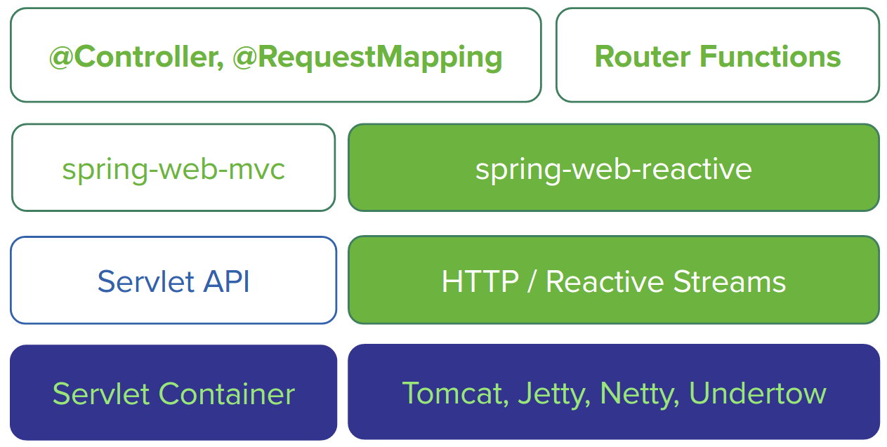

[[web-reactive]]
= Web Reactive Framework
This section provides basic information on the Spring Web Reactive support in Spring Framework 5.

[[web-reactive-intro]]
== Introduction

[[web-reactive-programming]]
=== Reactive Programming

In plain terms reactive programming is about non-blocking applications that are asynchronous
and event-driven and require a small number of threads to scale. A key aspect of that
definition is the concept of backpressure which is a mechanism to ensure producers
don't overwhelm consumers. For example in a pipeline of reactive components that extends
from the database to the HTTP socket when the HTTP client is slow the data
repository slows down or stops until capacity frees up.

From a programming model perspective reactive programming involves a major shift from imperative style logic
to a declarative composition of async logic. It is comparable to using `CompletableFuture` in Java 8
and composing follow-up actions via lambda expressions.

For a more extended introduction to reactive programming check the excellent multi-part series
https://spring.io/blog/2016/06/07/notes-on-reactive-programming-part-i-the-reactive-landscape["Notes on Reactive Programming"]
by Dave Syer.

[[web-reactive-api]]
=== Spring Web Reactive Types

Spring Framework 5 embraces
https://github.com/reactive-streams/reactive-streams-jvm#reactive-streams[Reactive Streams]
as the contract for communicating backpressure across async components and
libraries. Reactive Streams is a specification created through industry collaboration that
has also been adopted in Java 9 as `java.util.concurrent.Flow`.

The Spring Framework uses https://projectreactor.io/[Reactor] internally for its own
reactive support. Reactor is a Reactive Streams implementation that further extends the
basic Reactive Streams `Publisher` contract with the `Flux` and `Mono` composable API
types to provide declarative operations on data sequences of `0..N` and `0..1`.

The Spring Framework exposes `Flux` and `Mono` in many of its own reactive APIs.
At the application level however, as always, Spring provides choice and fully supports
the use of RxJava. For more on reactive types check the post
https://spring.io/blog/2016/04/19/understanding-reactive-types["Understanding Reactive Types"]
by Sebastien Deleuze.

[[web-reactive-feature-overview]]
== Spring Web Reactive Overview

[[web-reactive-module]]
=== Spring Web Reactive Module

Spring Framework 5 adds a new `spring-web-reactive` module that supports the same
`@Controller` programming model as Spring MVC but executed on a reactive,
non-blocking engine. The diagram below shows how Spring MVC and Spring Web
Reactive compare side by side:

Spring Web Reactive makes use of Servlet 3.1 non-blocking I/O and runs on
Servlet 3.1 containers. It also runs on non-Servlet runtimes such as Netty and Undertow.
Each runtime is adapted to a set of shared, reactive `ServerHttpRequest` and
`ServerHttpResponse` abstractions that expose the request and response body
as `Flux<DataBuffer>` with full backpressure support on the read and the
write side.

The `spring-core` module provides reactive `Encoder` and `Decoder` contracts
that enable the serialization of a `Flux` of bytes to and from typed objects.
The `spring-web` module adds JSON (Jackson) and XML (JAXB) implementations for use in
web applications as well as others for SSE streaming and zero-copy file transfer.

The `spring-web-reactive` module contains the Spring Web Reactive framework that supports
the `@Controller` programming model. It re-defines many of the Spring MVC contracts
such as `HandlerMapping` and `HandlerAdapter` to be asynchronous and
non-blocking and to operate on the reactive HTTP request and response. For this reason
Spring MVC and Spring Web Reactive cannot share any code. However they do share
many of the same algorithms.

The end result is a programming model identical to today's Spring MVC but
with support for reactive types and executed in a reactive manner.
For example a controller method can declare the following as an
`@RequestBody` method argument:

* `Account account` -- the account is deserialized without
blocking before the controller is invoked.
* `Mono<Account> account` -- the controller can use the `Mono`
to declare logic to be executed after the account is deserialized.
* `Single<Account> account` -- same as with `Mono` but using RxJava
* `Flux<Account> accounts` -- input streaming scenario.
* `Observable<Account> accounts` -- input streaming with RxJava.

The above also applies to return value handling:

* `Mono<Account>` -- serialize without blocking the given Account when the `Mono` completes.
* `Singe<Account>` -- same but using RxJava.
* `Flux<Account>` -- streaming scenario, possibly SSE depending on the requested content type.
* `Flux<SseEvent>` -- SSE streaming.
* `Observable<SseEvent>` -- same but using RxJava.
* `Mono<Void>` -- request handling completes when the `Mono` completes.
* `void` -- request handling completes when the method returns;
implies a synchronous, non-blocking controller method.
* `Account` -- serialize without blocking the given Account;
implies a synchronous, non-blocking controller method.

[[web-reactive-client]]
=== Reactive Web Client

Spring Framework 5 adds a new reactive `WebClient` in addition to the existing `RestTemplate`.

Each supported HTTP client (e.g. Reactor Netty) is adapted to a set of shared,
reactive `ClientHttpRequest` and `ClientHttpResponse` abstractions that expose the request
and response body as `Flux<DataBuffer>` with full backpressure support on the read and
the write side. The `Encoder` and `Decoder` abstractions from `spring-core` are also used on
the client side for the serialization of a `Flux` of bytes to and from typed objects.

An example of using the `WebClient`:

[source,java,indent=0]
[subs="verbatim,quotes"]
----
ClientHttpConnector httpConnector = new ReactorClientHttpConnector();
WebClient webClient = new WebClient(httpConnector);

Mono<Account> response = webClient
		.perform(get("http://example.com/accounts/1").accept(APPLICATION_JSON))
		.extract(body(Account.class));
----

The above assumes static method imports from `ClientWebRequestBuilder` and `ResponseExtractors`
that enable a fluent syntax. The same can also be done with RxJava using static imports from
`RxJava1ClientWebRequestBuilder` and `RxJava1ResponseExtractors` instead:

[source,java,indent=0]
[subs="verbatim,quotes"]
----
Single<Account> response = webClient
		.perform(get("http://example.com/accounts/1").accept(APPLICATION_JSON))
		.extract(body(Account.class));
----

[[web-reactive-getting-started]]
== Getting Started

[[web-reactive-getting-started-boot]]
=== Spring Boot Starter

The experimental Spring Boot Web Reactive starter available via http://start.spring.io
is the quickest way to get started. It does all the work so you can start
writing `@Controller` classes. By default it runs on Tomcat but the dependencies can
be changed as usual with Spring Boot to switch to a different runtime.

[[web-reactive-getting-started-manual]]
=== Manual Bootstrapping

It is also easy to get started by writing a few lines of code:

[source,java,indent=0]
[subs="verbatim,quotes"]
----
AnnotationConfigApplicationContext context;
context = new AnnotationConfigApplicationContext();
context.register(WebReactiveConfiguration.class); 	// (1)
context.refresh();

DispatcherHandler handler = new DispatcherHandler();	// (2)
handler.setApplicationContext(context);
HttpHandler httpHandler = WebHttpHandlerBuilder.webHandler(handler).build();

HttpServer server = new TomcatHttpServer();	// (3)
server.setPort(8080);
server.setHandler(httpHandler);
server.afterPropertiesSet();
server.start();
----

The `WebReactiveConfiguration` at (1) is the Java config from `spring-web-reactive`
and is similar in purpose to the MVC Java config from `spring-webmvc`. It provides the
web framework configuration required to get started leaving you only to
declare your own `@Controller` beans.

The `DispatcherHandler` at (2) is the equivalent of the `DispatcherServlet` in Spring MVC.

The `HttpServer` at (3) is an abstraction from the
https://github.com/spring-projects/spring-framework/tree/master/spring-web/src/test/java/org/springframework/http/server/reactive/bootstrap[test sources]
of `spring-web-reactive` used for Spring Framework's own integration tests.
The abstraction comes with basic implementations for each supported runtime.

[[web-reactive-getting-started-M1]]
=== Extent of Support in 5.0 M1

For M1 the Spring Web Reactive module focuses on REST scenarios for both
client and server. Basic HTML rendering with Freemarker is also supported but
limited to rendering but not form submissions.
