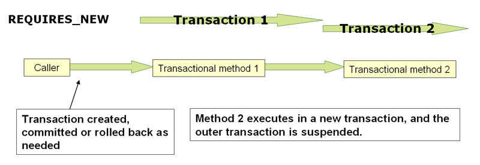
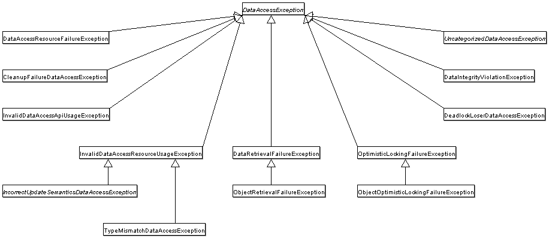

[[spring-data-tier]]
= Data Access
:toc: left
:toclevels: 4
:tabsize: 4
:docinfo1:

This part of the reference documentation is concerned with data access and the
interaction between the data access layer and the business or service layer.

Spring's comprehensive transaction management support is covered in some detail,
followed by thorough coverage of the various data access frameworks and technologies
with which the Spring Framework integrates.

[[transaction]]
== Transaction Management

Comprehensive transaction support is among the most compelling reasons to use the Spring
Framework. The Spring Framework provides a consistent abstraction for transaction
management that delivers the following benefits:

* A consistent programming model across different transaction APIs, such as Java
  Transaction API (JTA), JDBC, Hibernate, and the Java Persistence API (JPA).
* Support for <<transaction-declarative, declarative transaction management>>.
* A simpler API for <<transaction-programmatic, programmatic>> transaction management
  than complex transaction APIs, such as JTA.
* Excellent integration with Spring's data access abstractions.

The following sections describe the Spring Framework's transaction features and
technologies:

* <<transaction-motivation, Advantages of the Spring Framework's transaction support
  model>> describes why you would use the Spring Framework's transaction abstraction
  instead of EJB Container-Managed Transactions (CMT) or choosing to drive local
  transactions through a proprietary API, such as Hibernate.
* <<transaction-strategies, Understanding the Spring Framework transaction abstraction>>
  outlines the core classes and describes how to configure and obtain `DataSource`
  instances from a variety of sources.
* <<tx-resource-synchronization, Synchronizing resources with transactions>> describes
  how the application code ensures that resources are created, reused, and cleaned up
  properly.
* <<transaction-declarative, Declarative transaction management>> describes support for
  declarative transaction management.
* <<transaction-programmatic, Programmatic transaction management>> covers support for
  programmatic (that is, explicitly coded) transaction management.
* <<transaction-event, Transaction bound event>> describes how you could use application
  events within a transaction.

The chapter also includes discussions of best practices,
<<transaction-application-server-integration, application server integration>>,
and <<transaction-solutions-to-common-problems, solutions to common problems>>.

[[transaction-motivation]]
=== Advantages of the Spring Framework's Transaction Support Model

Traditionally, Java EE developers have had two choices for transaction management:
global or local transactions, both of which have profound limitations. Global
and local transaction management is reviewed in the next two sections, followed by a
discussion of how the Spring Framework's transaction management support addresses the
limitations of the global and local transaction models.

[[transaction-global]]
==== Global Transactions

Global transactions let you work with multiple transactional resources, typically
relational databases and message queues. The application server manages global
transactions through the JTA, which is a cumbersome API (partly due to its
exception model). Furthermore, a JTA `UserTransaction` normally needs to be sourced from
JNDI, meaning that you also need to use JNDI in order to use JTA. The use
of global transactions limits any potential reuse of application code, as JTA is
normally only available in an application server environment.

Previously, the preferred way to use global transactions was through EJB CMT
(Container Managed Transaction). CMT is a form of declarative transaction
management (as distinguished from programmatic transaction management). EJB CMT
removes the need for transaction-related JNDI lookups, although the use of EJB
itself necessitates the use of JNDI. It removes most but not all of the need to write
Java code to control transactions. The significant downside is that CMT is tied to JTA
and an application server environment. Also, it is only available if one chooses to
implement business logic in EJBs (or at least behind a transactional EJB facade). The
negatives of EJB in general are so great that this is not an attractive proposition,
especially in the face of compelling alternatives for declarative transaction management.

[[transaction-local]]
==== Local Transactions

Local transactions are resource-specific, such as a transaction associated with a JDBC
connection. Local transactions may be easier to use but have a significant disadvantage:
They cannot work across multiple transactional resources. For example, code that manages
transactions by using a JDBC connection cannot run within a global JTA transaction. Because
the application server is not involved in transaction management, it cannot help ensure
correctness across multiple resources. (It is worth noting that most applications use a
single transaction resource.) Another downside is that local transactions are invasive
to the programming model.

[[transaction-programming-model]]
==== Spring Framework's Consistent Programming Model

Spring resolves the disadvantages of global and local transactions. It lets
application developers use a consistent programming model in any environment.
You write your code once, and it can benefit from different transaction management
strategies in different environments. The Spring Framework provides both declarative and
programmatic transaction management. Most users prefer declarative transaction
management, which we recommend in most cases.

With programmatic transaction management, developers work with the Spring Framework
transaction abstraction, which can run over any underlying transaction infrastructure.
With the preferred declarative model, developers typically write little or no code
related to transaction management and, hence, do not depend on the Spring Framework
transaction API or any other transaction API.

.Do you need an application server for transaction management?
****
The Spring Framework's transaction management support changes traditional rules as to
when an enterprise Java application requires an application server.

In particular, you do not need an application server purely for declarative transactions
through EJBs. In fact, even if your application server has powerful JTA capabilities,
you may decide that the Spring Framework's declarative transactions offer more power and
a more productive programming model than EJB CMT.

Typically, you need an application server's JTA capability only if your application needs
to handle transactions across multiple resources, which is not a requirement for many
applications. Many high-end applications use a single, highly scalable database (such as
Oracle RAC) instead. Stand-alone transaction managers (such as
https://www.atomikos.com/[Atomikos Transactions] and http://jotm.objectweb.org/[JOTM])
are other options. Of course, you may need other application server capabilities, such as
Java Message Service (JMS) and Java EE Connector Architecture (JCA).

The Spring Framework gives you the choice of when to scale your application to a fully
loaded application server. Gone are the days when the only alternative to using EJB
CMT or JTA was to write code with local transactions (such as those on JDBC connections)
and face a hefty rework if you need that code to run within global, container-managed
transactions. With the Spring Framework, only some of the bean definitions in your
configuration file need to change (rather than your code).
****

[[transaction-strategies]]
=== Understanding the Spring Framework Transaction Abstraction

The key to the Spring transaction abstraction is the notion of a transaction strategy. A
transaction strategy is defined by a `TransactionManager`, specifically the
`org.springframework.transaction.PlatformTransactionManager` interface for imperative
transaction management and the
`org.springframework.transaction.ReactiveTransactionManager` interface for reactive
transaction management. The following listing shows the definition of the
`PlatformTransactionManager` API:

[source,java,indent=0,subs="verbatim,quotes"]
----
	public interface PlatformTransactionManager extends TransactionManager {

		TransactionStatus getTransaction(TransactionDefinition definition) throws TransactionException;

		void commit(TransactionStatus status) throws TransactionException;

		void rollback(TransactionStatus status) throws TransactionException;
	}
----

This is primarily a service provider interface (SPI), although you can use it
<<transaction-programmatic-ptm, programmatically>> from your application code. Because
`PlatformTransactionManager` is an interface, it can be easily mocked or stubbed as
necessary. It is not tied to a lookup strategy, such as JNDI.
`PlatformTransactionManager` implementations are defined like any other object (or bean)
in the Spring Framework IoC container. This benefit alone makes Spring Framework
transactions a worthwhile abstraction, even when you work with JTA. You can test
transactional code much more easily than if it used JTA directly.

Again, in keeping with Spring's philosophy, the `TransactionException` that can be thrown
by any of the `PlatformTransactionManager` interface's methods is unchecked (that
is, it extends the `java.lang.RuntimeException` class). Transaction infrastructure
failures are almost invariably fatal. In rare cases where application code can actually
recover from a transaction failure, the application developer can still choose to catch
and handle `TransactionException`. The salient point is that developers are not
_forced_ to do so.

The `getTransaction(..)` method returns a `TransactionStatus` object, depending on a
`TransactionDefinition` parameter. The returned `TransactionStatus` might represent a
new transaction or can represent an existing transaction, if a matching transaction
exists in the current call stack. The implication in this latter case is that, as with
Java EE transaction contexts, a `TransactionStatus` is associated with a thread of
execution.

As of Spring Framework 5.2, Spring also provides a transaction management abstraction for
reactive applications that make use of reactive types or Kotlin Coroutines. The following
listing shows the transaction strategy defined by
`org.springframework.transaction.ReactiveTransactionManager`:

[source,java,indent=0,subs="verbatim,quotes"]
----
	public interface ReactiveTransactionManager extends TransactionManager {

		Mono<ReactiveTransaction> getReactiveTransaction(TransactionDefinition definition) throws TransactionException;

		Mono<Void> commit(ReactiveTransaction status) throws TransactionException;

		Mono<Void> rollback(ReactiveTransaction status) throws TransactionException;
	}
----

The reactive transaction manager is primarily a service provider interface (SPI),
although you can use it <<transaction-programmatic-rtm, programmatically>> from your
application code. Because `ReactiveTransactionManager` is an interface, it can be easily
mocked or stubbed as necessary.

The `TransactionDefinition` interface specifies:

* Propagation: Typically, all code within a transaction scope runs in
  that transaction. However, you can specify the behavior if
  a transactional method is run when a transaction context already exists. For
  example, code can continue running in the existing transaction (the common case), or
  the existing transaction can be suspended and a new transaction created. Spring
  offers all of the transaction propagation options familiar from EJB CMT. To read
  about the semantics of transaction propagation in Spring, see <<tx-propagation>>.
* Isolation: The degree to which this transaction is isolated from the work of other
  transactions. For example, can this transaction see uncommitted writes from other
  transactions?
* Timeout: How long this transaction runs before timing out and being automatically rolled back
  by the underlying transaction infrastructure.
* Read-only status: You can use a read-only transaction when your code reads but
  does not modify data. Read-only transactions can be a useful optimization in some
  cases, such as when you use Hibernate.

These settings reflect standard transactional concepts. If necessary, refer to resources
that discuss transaction isolation levels and other core transaction concepts.
Understanding these concepts is essential to using the Spring Framework or any
transaction management solution.

The `TransactionStatus` interface provides a simple way for transactional code to
control transaction execution and query transaction status. The concepts should be
familiar, as they are common to all transaction APIs. The following listing shows the
`TransactionStatus` interface:

[source,java,indent=0,subs="verbatim,quotes"]
----
	public interface TransactionStatus extends TransactionExecution, SavepointManager, Flushable {

		@Override
		boolean isNewTransaction();

		boolean hasSavepoint();

		@Override
		void setRollbackOnly();

		@Override
		boolean isRollbackOnly();

		void flush();

		@Override
		boolean isCompleted();
	}
----

Regardless of whether you opt for declarative or programmatic transaction management in
Spring, defining the correct `TransactionManager` implementation is absolutely essential.
You typically define this implementation through dependency injection.

`TransactionManager` implementations normally require knowledge of the environment in
which they work: JDBC, JTA, Hibernate, and so on. The following examples show how you can
define a local `PlatformTransactionManager` implementation (in this case, with plain
JDBC.)

You can define a JDBC `DataSource` by creating a bean similar to the following:

[source,xml,indent=0,subs="verbatim,quotes"]
----
	<bean id="dataSource" class="org.apache.commons.dbcp.BasicDataSource" destroy-method="close">
		<property name="driverClassName" value="${jdbc.driverClassName}" />
		<property name="url" value="${jdbc.url}" />
		<property name="username" value="${jdbc.username}" />
		<property name="password" value="${jdbc.password}" />
	</bean>
----

The related `PlatformTransactionManager` bean definition then has a reference to the
`DataSource` definition. It should resemble the following example:

[source,xml,indent=0,subs="verbatim,quotes"]
----
	<bean id="txManager" class="org.springframework.jdbc.datasource.DataSourceTransactionManager">
		<property name="dataSource" ref="dataSource"/>
	</bean>
----

If you use JTA in a Java EE container, then you use a container `DataSource`, obtained
through JNDI, in conjunction with Spring's `JtaTransactionManager`. The following example
shows what the JTA and JNDI lookup version would look like:

[source,xml,indent=0,subs="verbatim,quotes"]
----
	<?xml version="1.0" encoding="UTF-8"?>
	<beans xmlns="http://www.springframework.org/schema/beans"
		xmlns:xsi="http://www.w3.org/2001/XMLSchema-instance"
		xmlns:jee="http://www.springframework.org/schema/jee"
		xsi:schemaLocation="
			http://www.springframework.org/schema/beans
			https://www.springframework.org/schema/beans/spring-beans.xsd
			http://www.springframework.org/schema/jee
			https://www.springframework.org/schema/jee/spring-jee.xsd">

		<jee:jndi-lookup id="dataSource" jndi-name="jdbc/jpetstore"/>

		<bean id="txManager" class="org.springframework.transaction.jta.JtaTransactionManager" />

		<!-- other <bean/> definitions here -->

	</beans>
----

The `JtaTransactionManager` does not need to know about the `DataSource` (or any other
specific resources) because it uses the container's global transaction management
infrastructure.

NOTE: The preceding definition of the `dataSource` bean uses the `<jndi-lookup/>` tag
from the `jee` namespace. For more information see
<<integration.adoc#xsd-schemas-jee, The JEE Schema>>.

NOTE: If you use JTA, your transaction manager definition should look the same, regardless
of what data access technology you use, be it JDBC, Hibernate JPA, or any other supported
technology. This is due to the fact that JTA transactions are global transactions, which
can enlist any transactional resource.

In all Spring transaction setups, application code does not need to change. You can change
how transactions are managed merely by changing configuration, even if that change means
moving from local to global transactions or vice versa.

[[transaction-strategies-hibernate]]
==== Hibernate Transaction Setup

You can also easily use Hibernate local transactions, as shown in the following examples.
In this case, you need to define a Hibernate `LocalSessionFactoryBean`, which your
application code can use to obtain Hibernate `Session` instances.

The `DataSource` bean definition is similar to the local JDBC example shown previously
and, thus, is not shown in the following example.

NOTE: If the `DataSource` (used by any non-JTA transaction manager) is looked up through
JNDI and managed by a Java EE container, it should be non-transactional, because the
Spring Framework (rather than the Java EE container) manages the transactions.

The `txManager` bean in this case is of the `HibernateTransactionManager` type. In the
same way as the `DataSourceTransactionManager` needs a reference to the `DataSource`, the
`HibernateTransactionManager` needs a reference to the `SessionFactory`. The following
example declares `sessionFactory` and `txManager` beans:

[source,xml,indent=0,subs="verbatim,quotes"]
----
	<bean id="sessionFactory" class="org.springframework.orm.hibernate5.LocalSessionFactoryBean">
		<property name="dataSource" ref="dataSource"/>
		<property name="mappingResources">
			<list>
				<value>org/springframework/samples/petclinic/hibernate/petclinic.hbm.xml</value>
			</list>
		</property>
		<property name="hibernateProperties">
			<value>
				hibernate.dialect=${hibernate.dialect}
			</value>
		</property>
	</bean>

	<bean id="txManager" class="org.springframework.orm.hibernate5.HibernateTransactionManager">
		<property name="sessionFactory" ref="sessionFactory"/>
	</bean>
----

If you use Hibernate and Java EE container-managed JTA transactions, you should use the
same `JtaTransactionManager` as in the previous JTA example for JDBC, as the following
example shows. Also, it is recommended to make Hibernate aware of JTA through its
transaction coordinator and possibly also its connection release mode configuration:

[source,xml,indent=0,subs="verbatim,quotes"]
----
	<bean id="sessionFactory" class="org.springframework.orm.hibernate5.LocalSessionFactoryBean">
		<property name="dataSource" ref="dataSource"/>
		<property name="mappingResources">
			<list>
				<value>org/springframework/samples/petclinic/hibernate/petclinic.hbm.xml</value>
			</list>
		</property>
		<property name="hibernateProperties">
			<value>
				hibernate.dialect=${hibernate.dialect}
				hibernate.transaction.coordinator_class=jta
				hibernate.connection.handling_mode=DELAYED_ACQUISITION_AND_RELEASE_AFTER_STATEMENT
			</value>
		</property>
	</bean>

	<bean id="txManager" class="org.springframework.transaction.jta.JtaTransactionManager"/>
----

Or alternatively, you may pass the `JtaTransactionManager` into your `LocalSessionFactoryBean`
for enforcing the same defaults:

[source,xml,indent=0,subs="verbatim,quotes"]
----
	<bean id="sessionFactory" class="org.springframework.orm.hibernate5.LocalSessionFactoryBean">
		<property name="dataSource" ref="dataSource"/>
		<property name="mappingResources">
			<list>
				<value>org/springframework/samples/petclinic/hibernate/petclinic.hbm.xml</value>
			</list>
		</property>
		<property name="hibernateProperties">
			<value>
				hibernate.dialect=${hibernate.dialect}
			</value>
		</property>
		<property name="jtaTransactionManager" ref="txManager"/>
	</bean>

	<bean id="txManager" class="org.springframework.transaction.jta.JtaTransactionManager"/>
----

[[tx-resource-synchronization]]
=== Synchronizing Resources with Transactions

How to create different transaction managers and how they are linked to related resources
that need to be synchronized to transactions (for example `DataSourceTransactionManager`
to a JDBC `DataSource`, `HibernateTransactionManager` to a Hibernate `SessionFactory`,
and so forth) should now be clear. This section describes how the application code
(directly or indirectly, by using a persistence API such as JDBC, Hibernate, or JPA)
ensures that these resources are created, reused, and cleaned up properly. The section
also discusses how transaction synchronization is (optionally) triggered through the
relevant `TransactionManager`.

[[tx-resource-synchronization-high]]
==== High-level Synchronization Approach

The preferred approach is to use Spring's highest-level template-based persistence
integration APIs or to use native ORM APIs with transaction-aware factory beans or
proxies for managing the native resource factories. These transaction-aware solutions
internally handle resource creation and reuse, cleanup, optional transaction
synchronization of the resources, and exception mapping. Thus, user data access code does
not have to address these tasks but can focus purely on non-boilerplate
persistence logic. Generally, you use the native ORM API or take a template approach
for JDBC access by using the `JdbcTemplate`. These solutions are detailed in subsequent
sections of this reference documentation.

[[tx-resource-synchronization-low]]
==== Low-level Synchronization Approach

Classes such as `DataSourceUtils` (for JDBC), `EntityManagerFactoryUtils` (for JPA),
`SessionFactoryUtils` (for Hibernate), and so on exist at a lower level. When you want the
application code to deal directly with the resource types of the native persistence APIs,
you use these classes to ensure that proper Spring Framework-managed instances are obtained,
transactions are (optionally) synchronized, and exceptions that occur in the process are
properly mapped to a consistent API.

For example, in the case of JDBC, instead of the traditional JDBC approach of calling
the `getConnection()` method on the `DataSource`, you can instead use Spring's
`org.springframework.jdbc.datasource.DataSourceUtils` class, as follows:

[source,java,indent=0,subs="verbatim,quotes"]
----
	Connection conn = DataSourceUtils.getConnection(dataSource);
----

If an existing transaction already has a connection synchronized (linked) to it, that
instance is returned. Otherwise, the method call triggers the creation of a new
connection, which is (optionally) synchronized to any existing transaction and made
available for subsequent reuse in that same transaction. As mentioned earlier, any
`SQLException` is wrapped in a Spring Framework `CannotGetJdbcConnectionException`, one
of the Spring Framework's hierarchy of unchecked `DataAccessException` types. This approach
gives you more information than can be obtained easily from the `SQLException` and
ensures portability across databases and even across different persistence technologies.

This approach also works without Spring transaction management (transaction
synchronization is optional), so you can use it whether or not you use Spring for
transaction management.

Of course, once you have used Spring's JDBC support, JPA support, or Hibernate support,
you generally prefer not to use `DataSourceUtils` or the other helper classes,
because you are much happier working through the Spring abstraction than directly
with the relevant APIs. For example, if you use the Spring `JdbcTemplate` or
`jdbc.object` package to simplify your use of JDBC, correct connection retrieval occurs
behind the scenes and you need not write any special code.

[[tx-resource-synchronization-tadsp]]
==== `TransactionAwareDataSourceProxy`

At the very lowest level exists the `TransactionAwareDataSourceProxy` class. This is a
proxy for a target `DataSource`, which wraps the target `DataSource` to add awareness of
Spring-managed transactions. In this respect, it is similar to a transactional JNDI
`DataSource`, as provided by a Java EE server.

You should almost never need or want to use this class, except when existing
code must be called and passed a standard JDBC `DataSource` interface implementation. In
that case, it is possible that this code is usable but is participating in Spring-managed
transactions. You can write your new code by using the higher-level
abstractions mentioned earlier.

[[transaction-declarative]]
=== Declarative Transaction Management

NOTE: Most Spring Framework users choose declarative transaction management. This option has
the least impact on application code and, hence, is most consistent with the ideals of a
non-invasive lightweight container.

The Spring Framework's declarative transaction management is made possible with Spring
aspect-oriented programming (AOP). However, as the transactional aspects code comes
with the Spring Framework distribution and may be used in a boilerplate fashion, AOP
concepts do not generally have to be understood to make effective use of this code.

The Spring Framework's declarative transaction management is similar to EJB CMT, in that
you can specify transaction behavior (or lack of it) down to the individual method level.
You can make a `setRollbackOnly()` call within a transaction context, if
necessary. The differences between the two types of transaction management are:

* Unlike EJB CMT, which is tied to JTA, the Spring Framework's declarative transaction
  management works in any environment. It can work with JTA transactions or local
  transactions by using JDBC, JPA, or Hibernate by adjusting the configuration
  files.
* You can apply the Spring Framework declarative transaction management to any class,
  not merely special classes such as EJBs.
* The Spring Framework offers declarative
  <<transaction-declarative-rolling-back, rollback rules>>, a feature with no EJB
  equivalent. Both programmatic and declarative support for rollback rules is provided.
* The Spring Framework lets you customize transactional behavior by using AOP.
  For example, you can insert custom behavior in the case of transaction rollback. You
  can also add arbitrary advice, along with transactional advice. With EJB CMT, you
  cannot influence the container's transaction management, except with
  `setRollbackOnly()`.
* The Spring Framework does not support propagation of transaction contexts across
  remote calls, as high-end application servers do. If you need this feature, we
  recommend that you use EJB. However, consider carefully before using such a feature,
  because, normally, one does not want transactions to span remote calls.

The concept of rollback rules is important. They let you specify which exceptions
(and throwables) should cause automatic rollback. You can specify this declaratively, in
configuration, not in Java code. So, although you can still call `setRollbackOnly()` on
the `TransactionStatus` object to roll back the current transaction back, most often you
can specify a rule that `MyApplicationException` must always result in rollback. The
significant advantage to this option is that business objects do not depend on the
transaction infrastructure. For example, they typically do not need to import Spring
transaction APIs or other Spring APIs.

Although EJB container default behavior automatically rolls back the transaction on a
system exception (usually a runtime exception), EJB CMT does not roll back the
transaction automatically on an application exception (that is, a checked exception
other than `java.rmi.RemoteException`). While the Spring default behavior for
declarative transaction management follows EJB convention (roll back is automatic only
on unchecked exceptions), it is often useful to customize this behavior.

[[tx-decl-explained]]
==== Understanding the Spring Framework's Declarative Transaction Implementation

It is not sufficient merely to tell you to annotate your classes with the
`@Transactional` annotation, add `@EnableTransactionManagement` to your configuration,
and expect you to understand how it all works. To provide a deeper understanding, this
section explains the inner workings of the Spring Framework's declarative transaction
infrastructure in the context of transaction-related issues.

The most important concepts to grasp with regard to the Spring Framework's declarative
transaction support are that this support is enabled
<<core.adoc#aop-understanding-aop-proxies, via AOP proxies>> and that the transactional
advice is driven by metadata (currently XML- or annotation-based). The combination of AOP
with transactional metadata yields an AOP proxy that uses a `TransactionInterceptor` in
conjunction with an appropriate `TransactionManager` implementation to drive transactions
around method invocations.

NOTE: Spring AOP is covered in <<core.adoc#aop, the AOP section>>.

Spring Framework's `TransactionInterceptor` provides transaction management for
imperative and reactive programming models. The interceptor detects the desired flavor of
transaction management by inspecting the method return type. Methods returning a reactive
type such as `Publisher` or Kotlin `Flow` (or a subtype of those) qualify for reactive
transaction management. All other return types including `void` use the code path for
imperative transaction management.

Transaction management flavors impact which transaction manager is required. Imperative
transactions require a `PlatformTransactionManager`, while reactive transactions use
`ReactiveTransactionManager` implementations.

[NOTE]
====
`@Transactional` commonly works with thread-bound transactions managed by
`PlatformTransactionManager`, exposing a transaction to all data access operations within
the current execution thread. Note: This does _not_ propagate to newly started threads
within the method.

A reactive transaction managed by `ReactiveTransactionManager` uses the Reactor context
instead of thread-local attributes. As a consequence, all participating data access
operations need to execute within the same Reactor context in the same reactive pipeline.
====

The following image shows a conceptual view of calling a method on a transactional proxy:

image::images/tx.png[]

[[transaction-declarative-first-example]]
==== Example of Declarative Transaction Implementation

Consider the following interface and its attendant implementation. This example uses
`Foo` and `Bar` classes as placeholders so that you can concentrate on the transaction
usage without focusing on a particular domain model. For the purposes of this example,
the fact that the `DefaultFooService` class throws `UnsupportedOperationException`
instances in the body of each implemented method is good. That behavior lets you see
transactions being created and then rolled back in response to the
`UnsupportedOperationException` instance. The following listing shows the `FooService`
interface:

[source,java,indent=0,subs="verbatim,quotes",role="primary"]
.Java
----
	// the service interface that we want to make transactional

	package x.y.service;

	public interface FooService {

		Foo getFoo(String fooName);

		Foo getFoo(String fooName, String barName);

		void insertFoo(Foo foo);

		void updateFoo(Foo foo);

	}
----
[source,kotlin,indent=0,subs="verbatim,quotes",role="secondary"]
.Kotlin
----
	// the service interface that we want to make transactional

	package x.y.service

	interface FooService {

		fun getFoo(fooName: String): Foo

		fun getFoo(fooName: String, barName: String): Foo

		fun insertFoo(foo: Foo)

		fun updateFoo(foo: Foo)
	}
----

The following example shows an implementation of the preceding interface:

[source,java,indent=0,subs="verbatim,quotes",role="primary"]
.Java
----
	package x.y.service;

	public class DefaultFooService implements FooService {

		@Override
		public Foo getFoo(String fooName) {
			// ...
		}

		@Override
		public Foo getFoo(String fooName, String barName) {
			// ...
		}

		@Override
		public void insertFoo(Foo foo) {
			// ...
		}

		@Override
		public void updateFoo(Foo foo) {
			// ...
		}
	}
----
[source,kotlin,indent=0,subs="verbatim,quotes",role="secondary"]
.Kotlin
----
	package x.y.service

	class DefaultFooService : FooService {

		override fun getFoo(fooName: String): Foo {
			// ...
		}

		override fun getFoo(fooName: String, barName: String): Foo {
			// ...
		}

		override fun insertFoo(foo: Foo) {
			// ...
		}

		override fun updateFoo(foo: Foo) {
			// ...
		}
	}
----

Assume that the first two methods of the `FooService` interface, `getFoo(String)` and
`getFoo(String, String)`, must run in the context of a transaction with read-only
semantics and that the other methods, `insertFoo(Foo)` and `updateFoo(Foo)`, must
run in the context of a transaction with read-write semantics. The following
configuration is explained in detail in the next few paragraphs:

[source,xml,indent=0,subs="verbatim"]
----
	<!-- from the file 'context.xml' -->
	<?xml version="1.0" encoding="UTF-8"?>
	<beans xmlns="http://www.springframework.org/schema/beans"
		xmlns:xsi="http://www.w3.org/2001/XMLSchema-instance"
		xmlns:aop="http://www.springframework.org/schema/aop"
		xmlns:tx="http://www.springframework.org/schema/tx"
		xsi:schemaLocation="
			http://www.springframework.org/schema/beans
			https://www.springframework.org/schema/beans/spring-beans.xsd
			http://www.springframework.org/schema/tx
			https://www.springframework.org/schema/tx/spring-tx.xsd
			http://www.springframework.org/schema/aop
			https://www.springframework.org/schema/aop/spring-aop.xsd">

		<!-- this is the service object that we want to make transactional -->
		<bean id="fooService" class="x.y.service.DefaultFooService"/>

		<!-- the transactional advice (what 'happens'; see the <aop:advisor/> bean below) -->
		<tx:advice id="txAdvice" transaction-manager="txManager">
			<!-- the transactional semantics... -->
			<tx:attributes>
				<!-- all methods starting with 'get' are read-only -->
				<tx:method name="get*" read-only="true"/>
				<!-- other methods use the default transaction settings (see below) -->
				<tx:method name="*"/>
			</tx:attributes>
		</tx:advice>

		<!-- ensure that the above transactional advice runs for any execution
			of an operation defined by the FooService interface -->
		<aop:config>
			<aop:pointcut id="fooServiceOperation" expression="execution(* x.y.service.FooService.*(..))"/>
			<aop:advisor advice-ref="txAdvice" pointcut-ref="fooServiceOperation"/>
		</aop:config>

		<!-- don't forget the DataSource -->
		<bean id="dataSource" class="org.apache.commons.dbcp.BasicDataSource" destroy-method="close">
			<property name="driverClassName" value="oracle.jdbc.driver.OracleDriver"/>
			<property name="url" value="jdbc:oracle:thin:@rj-t42:1521:elvis"/>
			<property name="username" value="scott"/>
			<property name="password" value="tiger"/>
		</bean>

		<!-- similarly, don't forget the TransactionManager -->
		<bean id="txManager" class="org.springframework.jdbc.datasource.DataSourceTransactionManager">
			<property name="dataSource" ref="dataSource"/>
		</bean>

		<!-- other <bean/> definitions here -->

	</beans>
----

Examine the preceding configuration. It assumes that you want to make a service object,
the `fooService` bean, transactional. The transaction semantics to apply are encapsulated
in the `<tx:advice/>` definition. The `<tx:advice/>` definition reads as "all methods
starting with `get` are to run in the context of a read-only transaction, and all
other methods are to run with the default transaction semantics". The
`transaction-manager` attribute of the `<tx:advice/>` tag is set to the name of the
`TransactionManager` bean that is going to drive the transactions (in this case, the
`txManager` bean).

TIP: You can omit the `transaction-manager` attribute in the transactional advice
(`<tx:advice/>`) if the bean name of the `TransactionManager` that you want to
wire in has the name `transactionManager`. If the `TransactionManager` bean that
you want to wire in has any other name, you must use the `transaction-manager`
attribute explicitly, as in the preceding example.

The `<aop:config/>` definition ensures that the transactional advice defined by the
`txAdvice` bean runs at the appropriate points in the program. First, you define a
pointcut that matches the execution of any operation defined in the `FooService` interface
(`fooServiceOperation`). Then you associate the pointcut with the `txAdvice` by using an
advisor. The result indicates that, at the execution of a `fooServiceOperation`,
the advice defined by `txAdvice` is run.

The expression defined within the `<aop:pointcut/>` element is an AspectJ pointcut
expression. See <<core.adoc#aop, the AOP section>> for more details on pointcut
expressions in Spring.

A common requirement is to make an entire service layer transactional. The best way to
do this is to change the pointcut expression to match any operation in your
service layer. The following example shows how to do so:

[source,xml,indent=0,subs="verbatim"]
----
	<aop:config>
		<aop:pointcut id="fooServiceMethods" expression="execution(* x.y.service.*.*(..))"/>
		<aop:advisor advice-ref="txAdvice" pointcut-ref="fooServiceMethods"/>
	</aop:config>
----

NOTE: In the preceding example, it is assumed that all your service interfaces are defined
in the `x.y.service` package. See <<core.adoc#aop, the AOP section>> for more details.

Now that we have analyzed the configuration, you may be asking yourself,
"What does all this configuration actually do?"

The configuration shown earlier is used to create a transactional proxy around the object
that is created from the `fooService` bean definition. The proxy is configured with
the transactional advice so that, when an appropriate method is invoked on the proxy,
a transaction is started, suspended, marked as read-only, and so on, depending on the
transaction configuration associated with that method. Consider the following program
that test drives the configuration shown earlier:

[source,java,indent=0,subs="verbatim,quotes",role="primary"]
.Java
----
	public final class Boot {

		public static void main(final String[] args) throws Exception {
			ApplicationContext ctx = new ClassPathXmlApplicationContext("context.xml");
			FooService fooService = ctx.getBean(FooService.class);
			fooService.insertFoo(new Foo());
		}
	}
----
[source,kotlin,indent=0,subs="verbatim,quotes",role="secondary"]
.Kotlin
----
	import org.springframework.beans.factory.getBean

	fun main() {
		val ctx = ClassPathXmlApplicationContext("context.xml")
		val fooService = ctx.getBean<FooService>("fooService")
		fooService.insertFoo(Foo())
	}
----

The output from running the preceding program should resemble the following (the Log4J
output and the stack trace from the `UnsupportedOperationException` thrown by the
`insertFoo(..)` method of the `DefaultFooService` class have been truncated for clarity):

[source,xml,indent=0,subs="verbatim,quotes"]
----
	<!-- the Spring container is starting up... -->
	[AspectJInvocationContextExposingAdvisorAutoProxyCreator] - Creating implicit proxy for bean 'fooService' with 0 common interceptors and 1 specific interceptors

	<!-- the DefaultFooService is actually proxied -->
	[JdkDynamicAopProxy] - Creating JDK dynamic proxy for [x.y.service.DefaultFooService]

	<!-- ... the insertFoo(..) method is now being invoked on the proxy -->
	[TransactionInterceptor] - Getting transaction for x.y.service.FooService.insertFoo

	<!-- the transactional advice kicks in here... -->
	[DataSourceTransactionManager] - Creating new transaction with name [x.y.service.FooService.insertFoo]
	[DataSourceTransactionManager] - Acquired Connection [org.apache.commons.dbcp.PoolableConnection@a53de4] for JDBC transaction

	<!-- the insertFoo(..) method from DefaultFooService throws an exception... -->
	[RuleBasedTransactionAttribute] - Applying rules to determine whether transaction should rollback on java.lang.UnsupportedOperationException
	[TransactionInterceptor] - Invoking rollback for transaction on x.y.service.FooService.insertFoo due to throwable [java.lang.UnsupportedOperationException]

	<!-- and the transaction is rolled back (by default, RuntimeException instances cause rollback) -->
	[DataSourceTransactionManager] - Rolling back JDBC transaction on Connection [org.apache.commons.dbcp.PoolableConnection@a53de4]
	[DataSourceTransactionManager] - Releasing JDBC Connection after transaction
	[DataSourceUtils] - Returning JDBC Connection to DataSource

	Exception in thread "main" java.lang.UnsupportedOperationException at x.y.service.DefaultFooService.insertFoo(DefaultFooService.java:14)
	<!-- AOP infrastructure stack trace elements removed for clarity -->
	at $Proxy0.insertFoo(Unknown Source)
	at Boot.main(Boot.java:11)
----

To use reactive transaction management the code has to use reactive types.

NOTE: Spring Framework uses the `ReactiveAdapterRegistry` to determine whether a method
return type is reactive.

The following listing shows a modified version of the previously used `FooService`, but
this time the code uses reactive types:

[source,java,indent=0,subs="verbatim,quotes",role="primary"]
.Java
----
	// the reactive service interface that we want to make transactional

	package x.y.service;

	public interface FooService {

		Flux<Foo> getFoo(String fooName);

		Publisher<Foo> getFoo(String fooName, String barName);

		Mono<Void> insertFoo(Foo foo);

		Mono<Void> updateFoo(Foo foo);

	}
----
[source,kotlin,indent=0,subs="verbatim,quotes",role="secondary"]
.Kotlin
----
	// the reactive service interface that we want to make transactional

	package x.y.service

	interface FooService {

		fun getFoo(fooName: String): Flow<Foo>

		fun getFoo(fooName: String, barName: String): Publisher<Foo>

		fun insertFoo(foo: Foo) : Mono<Void>

		fun updateFoo(foo: Foo) : Mono<Void>
	}
----

The following example shows an implementation of the preceding interface:

[source,java,indent=0,subs="verbatim,quotes",role="primary"]
.Java
----
	package x.y.service;

	public class DefaultFooService implements FooService {

		@Override
		public Flux<Foo> getFoo(String fooName) {
			// ...
		}

		@Override
		public Publisher<Foo> getFoo(String fooName, String barName) {
			// ...
		}

		@Override
		public Mono<Void> insertFoo(Foo foo) {
			// ...
		}

		@Override
		public Mono<Void> updateFoo(Foo foo) {
			// ...
		}
	}
----
[source,kotlin,indent=0,subs="verbatim,quotes",role="secondary"]
.Kotlin
----
	package x.y.service

	class DefaultFooService : FooService {

		override fun getFoo(fooName: String): Flow<Foo> {
			// ...
		}

		override fun getFoo(fooName: String, barName: String): Publisher<Foo> {
			// ...
		}

		override fun insertFoo(foo: Foo): Mono<Void> {
			// ...
		}

		override fun updateFoo(foo: Foo): Mono<Void> {
			// ...
		}
	}
----

Imperative and reactive transaction management share the same semantics for transaction
boundary and transaction attribute definitions. The main difference between imperative
and reactive transactions is the deferred nature of the latter. `TransactionInterceptor`
decorates the returned reactive type with a transactional operator to begin and clean up
the transaction. Therefore, calling a transactional reactive method defers the actual
transaction management to a subscription type that activates processing of the reactive
type.

Another aspect of reactive transaction management relates to data escaping which is a
natural consequence of the programming model.

Method return values of imperative transactions are returned from transactional methods
upon successful termination of a method so that partially computed results do not escape
the method closure.

Reactive transaction methods return a reactive wrapper type which represents a
computation sequence along with a promise to begin and complete the computation.

A `Publisher` can emit data while a transaction is ongoing but not necessarily completed.
Therefore, methods that depend upon successful completion of an entire transaction need
to ensure completion and buffer results in the calling code.

[[transaction-declarative-rolling-back]]
==== Rolling Back a Declarative Transaction

The previous section outlined the basics of how to specify transactional settings for
classes, typically service layer classes, declaratively in your application. This section
describes how you can control the rollback of transactions in a simple, declarative
fashion in XML configuration. For details on controlling rollback semantics declaratively
with the `@Transactional` annotation, see
<<transaction-declarative-attransactional-settings>>.

The recommended way to indicate to the Spring Framework's transaction infrastructure
that a transaction's work is to be rolled back is to throw an `Exception` from code that
is currently executing in the context of a transaction. The Spring Framework's
transaction infrastructure code catches any unhandled `Exception` as it bubbles up
the call stack and makes a determination whether to mark the transaction for rollback.

In its default configuration, the Spring Framework's transaction infrastructure code
marks a transaction for rollback only in the case of runtime, unchecked exceptions.
That is, when the thrown exception is an instance or subclass of `RuntimeException`.
(`Error` instances also, by default, result in a rollback). Checked exceptions that are
thrown from a transactional method do not result in rollback in the default
configuration.

You can configure exactly which `Exception` types mark a transaction for rollback,
including checked exceptions by specifying _rollback rules_.

.Rollback rules
[[transaction-declarative-rollback-rules]]
[NOTE]
====
Rollback rules determine if a transaction should be rolled back when a given exception is
thrown, and the rules are based on patterns. A pattern can be a fully qualified class
name or a substring of a fully qualified class name for an exception type (which must be
a subclass of `Throwable`), with no wildcard support at present. For example, a value of
`"javax.servlet.ServletException"` or `"ServletException"` will match
`javax.servlet.ServletException` and its subclasses.

Rollback rules may be configured in XML via the `rollback-for` and `no-rollback-for`
attributes, which allow patterns to be specified as strings. When using
<<transaction-declarative-attransactional-settings,`@Transactional`>>, rollback rules may
be configured via the `rollbackFor`/`noRollbackFor` and
`rollbackForClassName`/`noRollbackForClassName` attributes, which allow patterns to be
specified as `Class` references or strings, respectively. When an exception type is
specified as a class reference its fully qualified name will be used as the pattern.
Consequently, `@Transactional(rollbackFor = example.CustomException.class)` is equivalent
to `@Transactional(rollbackForClassName = "example.CustomException")`.

[WARNING]
=====
You must carefully consider how specific the pattern is and whether to include package
information (which isn't mandatory). For example, `"Exception"` will match nearly
anything and will probably hide other rules. `"java.lang.Exception"` would be correct if
`"Exception"` were meant to define a rule for all checked exceptions. With more unique
exception names such as `"BaseBusinessException"` there is likely no need to use the
fully qualified class name for the exception pattern.

Furthermore, rollback rules may result in unintentional matches for similarly named
exceptions and nested classes. This is due to the fact that a thrown exception is
considered to be a match for a given rollback rule if the name of thrown exception
contains the exception pattern configured for the rollback rule. For example, given a
rule configured to match on `com.example.CustomException`, that rule would match against
an exception named `com.example.CustomExceptionV2` (an exception in the same package as
`CustomException` but with an additional suffix) or an exception named
`com.example.CustomException$AnotherException` (an exception declared as a nested class
in `CustomException`).
=====
====

The following XML snippet demonstrates how to configure rollback for a checked,
application-specific `Exception` type by supplying an _exception pattern_ via the
`rollback-for` attribute:

[source,xml,indent=0,subs="verbatim,quotes"]
----
	<tx:advice id="txAdvice" transaction-manager="txManager">
		<tx:attributes>
		<tx:method name="get*" read-only="true" rollback-for="NoProductInStockException"/>
		<tx:method name="*"/>
		</tx:attributes>
	</tx:advice>
----

If you do not want a transaction rolled back when an exception is thrown, you can also
specify 'no rollback' rules. The following example tells the Spring Framework's
transaction infrastructure to commit the attendant transaction even in the face of an
unhandled `InstrumentNotFoundException`:

[source,xml,indent=0,subs="verbatim,quotes"]
----
	<tx:advice id="txAdvice">
		<tx:attributes>
		<tx:method name="updateStock" no-rollback-for="InstrumentNotFoundException"/>
		<tx:method name="*"/>
		</tx:attributes>
	</tx:advice>
----

When the Spring Framework's transaction infrastructure catches an exception and consults
the configured rollback rules to determine whether to mark the transaction for rollback,
the strongest matching rule wins. So, in the case of the following configuration, any
exception other than an `InstrumentNotFoundException` results in a rollback of the
attendant transaction:

[source,xml,indent=0,subs="verbatim,quotes"]
----
	<tx:advice id="txAdvice">
		<tx:attributes>
		<tx:method name="*" rollback-for="Throwable" no-rollback-for="InstrumentNotFoundException"/>
		</tx:attributes>
	</tx:advice>
----

You can also indicate a required rollback programmatically. Although simple, this process
is quite invasive and tightly couples your code to the Spring Framework's transaction
infrastructure. The following example shows how to programmatically indicate a required
rollback:

[source,java,indent=0,subs="verbatim,quotes",role="primary"]
.Java
----
	public void resolvePosition() {
		try {
			// some business logic...
		} catch (NoProductInStockException ex) {
			// trigger rollback programmatically
			TransactionAspectSupport.currentTransactionStatus().setRollbackOnly();
		}
	}
----
[source,kotlin,indent=0,subs="verbatim,quotes",role="secondary"]
.Kotlin
----
	fun resolvePosition() {
		try {
			// some business logic...
		} catch (ex: NoProductInStockException) {
			// trigger rollback programmatically
			TransactionAspectSupport.currentTransactionStatus().setRollbackOnly();
		}
	}
----

You are strongly encouraged to use the declarative approach to rollback, if at all
possible. Programmatic rollback is available should you absolutely need it, but its
usage flies in the face of achieving a clean POJO-based architecture.

[[transaction-declarative-diff-tx]]
==== Configuring Different Transactional Semantics for Different Beans

Consider the scenario where you have a number of service layer objects, and you want to
apply a totally different transactional configuration to each of them. You can do so
by defining distinct `<aop:advisor/>` elements with differing `pointcut` and
`advice-ref` attribute values.

As a point of comparison, first assume that all of your service layer classes are
defined in a root `x.y.service` package. To make all beans that are instances of classes
defined in that package (or in subpackages) and that have names ending in `Service` have
the default transactional configuration, you could write the following:

[source,xml,indent=0,subs="verbatim"]
----
	<?xml version="1.0" encoding="UTF-8"?>
	<beans xmlns="http://www.springframework.org/schema/beans"
		xmlns:xsi="http://www.w3.org/2001/XMLSchema-instance"
		xmlns:aop="http://www.springframework.org/schema/aop"
		xmlns:tx="http://www.springframework.org/schema/tx"
		xsi:schemaLocation="
			http://www.springframework.org/schema/beans
			https://www.springframework.org/schema/beans/spring-beans.xsd
			http://www.springframework.org/schema/tx
			https://www.springframework.org/schema/tx/spring-tx.xsd
			http://www.springframework.org/schema/aop
			https://www.springframework.org/schema/aop/spring-aop.xsd">

		<aop:config>

			<aop:pointcut id="serviceOperation"
					expression="execution(* x.y.service..*Service.*(..))"/>

			<aop:advisor pointcut-ref="serviceOperation" advice-ref="txAdvice"/>

		</aop:config>

		<!-- these two beans will be transactional... -->
		<bean id="fooService" class="x.y.service.DefaultFooService"/>
		<bean id="barService" class="x.y.service.extras.SimpleBarService"/>

		<!-- ... and these two beans won't -->
		<bean id="anotherService" class="org.xyz.SomeService"/> <!-- (not in the right package) -->
		<bean id="barManager" class="x.y.service.SimpleBarManager"/> <!-- (doesn't end in 'Service') -->

		<tx:advice id="txAdvice">
			<tx:attributes>
				<tx:method name="get*" read-only="true"/>
				<tx:method name="*"/>
			</tx:attributes>
		</tx:advice>

		<!-- other transaction infrastructure beans such as a TransactionManager omitted... -->

	</beans>
----

The following example shows how to configure two distinct beans with totally different
transactional settings:

[source,xml,indent=0,subs="verbatim"]
----
	<?xml version="1.0" encoding="UTF-8"?>
	<beans xmlns="http://www.springframework.org/schema/beans"
		xmlns:xsi="http://www.w3.org/2001/XMLSchema-instance"
		xmlns:aop="http://www.springframework.org/schema/aop"
		xmlns:tx="http://www.springframework.org/schema/tx"
		xsi:schemaLocation="
			http://www.springframework.org/schema/beans
			https://www.springframework.org/schema/beans/spring-beans.xsd
			http://www.springframework.org/schema/tx
			https://www.springframework.org/schema/tx/spring-tx.xsd
			http://www.springframework.org/schema/aop
			https://www.springframework.org/schema/aop/spring-aop.xsd">

		<aop:config>

			<aop:pointcut id="defaultServiceOperation"
					expression="execution(* x.y.service.*Service.*(..))"/>

			<aop:pointcut id="noTxServiceOperation"
					expression="execution(* x.y.service.ddl.DefaultDdlManager.*(..))"/>

			<aop:advisor pointcut-ref="defaultServiceOperation" advice-ref="defaultTxAdvice"/>

			<aop:advisor pointcut-ref="noTxServiceOperation" advice-ref="noTxAdvice"/>

		</aop:config>

		<!-- this bean will be transactional (see the 'defaultServiceOperation' pointcut) -->
		<bean id="fooService" class="x.y.service.DefaultFooService"/>

		<!-- this bean will also be transactional, but with totally different transactional settings -->
		<bean id="anotherFooService" class="x.y.service.ddl.DefaultDdlManager"/>

		<tx:advice id="defaultTxAdvice">
			<tx:attributes>
				<tx:method name="get*" read-only="true"/>
				<tx:method name="*"/>
			</tx:attributes>
		</tx:advice>

		<tx:advice id="noTxAdvice">
			<tx:attributes>
				<tx:method name="*" propagation="NEVER"/>
			</tx:attributes>
		</tx:advice>

		<!-- other transaction infrastructure beans such as a TransactionManager omitted... -->

	</beans>
----

[[transaction-declarative-txadvice-settings]]
==== <tx:advice/> Settings

This section summarizes the various transactional settings that you can specify by using
the `<tx:advice/>` tag. The default `<tx:advice/>` settings are:

* The <<tx-propagation, propagation setting>> is `REQUIRED.`
* The isolation level is `DEFAULT.`
* The transaction is read-write.
* The transaction timeout defaults to the default timeout of the underlying transaction
  system or none if timeouts are not supported.
* Any `RuntimeException` triggers rollback, and any checked `Exception` does not.

You can change these default settings. The following table summarizes the various attributes of the `<tx:method/>` tags
that are nested within `<tx:advice/>` and `<tx:attributes/>` tags:

[[tx-method-settings]]
.<tx:method/> settings
|===
| Attribute| Required?| Default| Description

| `name`
| Yes
|
| Method names with which the transaction attributes are to be associated. The
  wildcard ({asterisk}) character can be used to associate the same transaction attribute
  settings with a number of methods (for example, `get*`, `handle*`, `on*Event`, and so
  forth).

| `propagation`
| No
| `REQUIRED`
| Transaction propagation behavior.

| `isolation`
| No
| `DEFAULT`
| Transaction isolation level. Only applicable to propagation settings of `REQUIRED` or `REQUIRES_NEW`.

| `timeout`
| No
| -1
| Transaction timeout (seconds). Only applicable to propagation `REQUIRED` or `REQUIRES_NEW`.

| `read-only`
| No
| false
| Read-write versus read-only transaction. Applies only to `REQUIRED` or `REQUIRES_NEW`.

| `rollback-for`
| No
|
| Comma-delimited list of `Exception` instances that trigger rollback. For example,
  `com.foo.MyBusinessException,ServletException`.

| `no-rollback-for`
| No
|
| Comma-delimited list of `Exception` instances that do not trigger rollback. For example,
  `com.foo.MyBusinessException,ServletException`.
|===

[[transaction-declarative-annotations]]
==== Using `@Transactional`

In addition to the XML-based declarative approach to transaction configuration, you can
use an annotation-based approach. Declaring transaction semantics directly in the Java
source code puts the declarations much closer to the affected code. There is not much
danger of undue coupling, because code that is meant to be used transactionally is
almost always deployed that way anyway.

NOTE: The standard `javax.transaction.Transactional` annotation is also supported as a
drop-in replacement to Spring's own annotation. Please refer to JTA 1.2 documentation
for more details.

The ease-of-use afforded by the use of the `@Transactional` annotation is best
illustrated with an example, which is explained in the text that follows.
Consider the following class definition:

[source,java,indent=0,subs="verbatim,quotes",role="primary"]
.Java
----
	// the service class that we want to make transactional
	@Transactional
	public class DefaultFooService implements FooService {

		@Override
		public Foo getFoo(String fooName) {
			// ...
		}

		@Override
		public Foo getFoo(String fooName, String barName) {
			// ...
		}

		@Override
		public void insertFoo(Foo foo) {
			// ...
		}

		@Override
		public void updateFoo(Foo foo) {
			// ...
		}
	}
----
[source,kotlin,indent=0,subs="verbatim,quotes",role="secondary"]
.Kotlin
----
	// the service class that we want to make transactional
	@Transactional
	class DefaultFooService : FooService {

		override fun getFoo(fooName: String): Foo {
			// ...
		}

		override fun getFoo(fooName: String, barName: String): Foo {
			// ...
		}

		override fun insertFoo(foo: Foo) {
			// ...
		}

		override fun updateFoo(foo: Foo) {
			// ...
		}
	}
----

Used at the class level as above, the annotation indicates a default for all methods of
the declaring class (as well as its subclasses). Alternatively, each method can be
annotated individually. See <<transaction-declarative-annotations-method-visibility>> for
further details on which methods Spring considers transactional. Note that a class-level
annotation does not apply to ancestor classes up the class hierarchy; in such a scenario,
inherited methods need to be locally redeclared in order to participate in a
subclass-level annotation.

When a POJO class such as the one above is defined as a bean in a Spring context,
you can make the bean instance transactional through an `@EnableTransactionManagement`
annotation in a `@Configuration` class. See the
{api-spring-framework}/transaction/annotation/EnableTransactionManagement.html[javadoc]
for full details.

In XML configuration, the `<tx:annotation-driven/>` tag provides similar convenience:

[source,xml,indent=0,subs="verbatim,quotes"]
----
	<!-- from the file 'context.xml' -->
	<?xml version="1.0" encoding="UTF-8"?>
	<beans xmlns="http://www.springframework.org/schema/beans"
		xmlns:xsi="http://www.w3.org/2001/XMLSchema-instance"
		xmlns:aop="http://www.springframework.org/schema/aop"
		xmlns:tx="http://www.springframework.org/schema/tx"
		xsi:schemaLocation="
			http://www.springframework.org/schema/beans
			https://www.springframework.org/schema/beans/spring-beans.xsd
			http://www.springframework.org/schema/tx
			https://www.springframework.org/schema/tx/spring-tx.xsd
			http://www.springframework.org/schema/aop
			https://www.springframework.org/schema/aop/spring-aop.xsd">

		<!-- this is the service object that we want to make transactional -->
		<bean id="fooService" class="x.y.service.DefaultFooService"/>

		<!-- enable the configuration of transactional behavior based on annotations -->
		<!-- a TransactionManager is still required -->
		<tx:annotation-driven transaction-manager="txManager"/> <1>

		<bean id="txManager" class="org.springframework.jdbc.datasource.DataSourceTransactionManager">
			<!-- (this dependency is defined somewhere else) -->
			<property name="dataSource" ref="dataSource"/>
		</bean>

		<!-- other <bean/> definitions here -->

	</beans>
----
<1> The line that makes the bean instance transactional.

TIP: You can omit the `transaction-manager` attribute in the `<tx:annotation-driven/>`
tag if the bean name of the `TransactionManager` that you want to wire in has the name
`transactionManager`. If the `TransactionManager` bean that you want to dependency-inject
has any other name, you have to use the `transaction-manager` attribute, as in the
preceding example.

Reactive transactional methods use reactive return types in contrast to imperative
programming arrangements as the following listing shows:

[source,java,indent=0,subs="verbatim,quotes",role="primary"]
.Java
----
	// the reactive service class that we want to make transactional
	@Transactional
	public class DefaultFooService implements FooService {

		@Override
		public Publisher<Foo> getFoo(String fooName) {
			// ...
		}

		@Override
		public Mono<Foo> getFoo(String fooName, String barName) {
			// ...
		}

		@Override
		public Mono<Void> insertFoo(Foo foo) {
			// ...
		}

		@Override
		public Mono<Void> updateFoo(Foo foo) {
			// ...
		}
	}
----
[source,kotlin,indent=0,subs="verbatim,quotes",role="secondary"]
.Kotlin
----
	// the reactive service class that we want to make transactional
	@Transactional
	class DefaultFooService : FooService {

		override fun getFoo(fooName: String): Flow<Foo> {
			// ...
		}

		override fun getFoo(fooName: String, barName: String): Mono<Foo> {
			// ...
		}

		override fun insertFoo(foo: Foo): Mono<Void> {
			// ...
		}

		override fun updateFoo(foo: Foo): Mono<Void> {
			// ...
		}
	}
----

Note that there are special considerations for the returned `Publisher` with regards to
Reactive Streams cancellation signals. See the <<tx-prog-operator-cancel>> section under
"Using the TransactionOperator" for more details.

[[transaction-declarative-annotations-method-visibility]]
.Method visibility and `@Transactional`
[NOTE]
====
When you use transactional proxies with Spring's standard configuration, you should apply
the `@Transactional` annotation only to methods with `public` visibility. If you do
annotate `protected`, `private`, or package-visible methods with the `@Transactional`
annotation, no error is raised, but the annotated method does not exhibit the configured
transactional settings. If you need to annotate non-public methods, consider the tip in
the following paragraph for class-based proxies or consider using AspectJ compile-time or
load-time weaving (described later).

When using `@EnableTransactionManagement` in a `@Configuration` class, `protected` or
package-visible methods can also be made transactional for class-based proxies by
registering a custom `transactionAttributeSource` bean like in the following example.
Note, however, that transactional methods in interface-based proxies must always be
`public` and defined in the proxied interface.

[source,java,indent=0,subs="verbatim,quotes"]
----
	/**
	 * Register a custom AnnotationTransactionAttributeSource with the
	 * publicMethodsOnly flag set to false to enable support for
	 * protected and package-private @Transactional methods in
	 * class-based proxies.
	 *
	 * @see ProxyTransactionManagementConfiguration#transactionAttributeSource()
	 */
	@Bean
	TransactionAttributeSource transactionAttributeSource() {
		return new AnnotationTransactionAttributeSource(false);
	}
----

The _Spring TestContext Framework_ supports non-private `@Transactional` test methods by
default. See <<testing.adoc#testcontext-tx,Transaction Management>> in the testing
chapter for examples.
====

You can apply the `@Transactional` annotation to an interface definition, a method
on an interface, a class definition, or a method on a class. However, the
mere presence of the `@Transactional` annotation is not enough to activate the
transactional behavior. The `@Transactional` annotation is merely metadata that can
be consumed by some runtime infrastructure that is `@Transactional`-aware and that
can use the metadata to configure the appropriate beans with transactional behavior.
In the preceding example, the `<tx:annotation-driven/>` element switches on the
transactional behavior.

TIP: The Spring team recommends that you annotate only concrete classes (and methods of
concrete classes) with the `@Transactional` annotation, as opposed to annotating interfaces.
You certainly can place the `@Transactional` annotation on an interface (or an interface
method), but this works only as you would expect it to if you use interface-based
proxies. The fact that Java annotations are not inherited from interfaces means that,
if you use class-based proxies (`proxy-target-class="true"`) or the weaving-based
aspect (`mode="aspectj"`), the transaction settings are not recognized by the proxying
and weaving infrastructure, and the object is not wrapped in a transactional proxy.

NOTE: In proxy mode (which is the default), only external method calls coming in through
the proxy are intercepted. This means that self-invocation (in effect, a method within
the target object calling another method of the target object) does not lead to an actual
transaction at runtime even if the invoked method is marked with `@Transactional`. Also,
the proxy must be fully initialized to provide the expected behavior, so you should not
rely on this feature in your initialization code -- for example, in a `@PostConstruct`
method.

Consider using AspectJ mode (see the `mode` attribute in the following table) if you
expect self-invocations to be wrapped with transactions as well. In this case, there is
no proxy in the first place. Instead, the target class is woven (that is, its byte code
is modified) to support `@Transactional` runtime behavior on any kind of method.

[[tx-annotation-driven-settings]]
.Annotation driven transaction settings
|===
| XML Attribute| Annotation Attribute| Default| Description

| `transaction-manager`
| N/A (see {api-spring-framework}/transaction/annotation/TransactionManagementConfigurer.html[`TransactionManagementConfigurer`] javadoc)
| `transactionManager`
| Name of the transaction manager to use. Required only if the name of the transaction
  manager is not `transactionManager`, as in the preceding example.

| `mode`
| `mode`
| `proxy`
| The default mode (`proxy`) processes annotated beans to be proxied by using Spring's AOP
  framework (following proxy semantics, as discussed earlier, applying to method calls
  coming in through the proxy only). The alternative mode (`aspectj`) instead weaves the
  affected classes with Spring's AspectJ transaction aspect, modifying the target class
  byte code to apply to any kind of method call. AspectJ weaving requires
  `spring-aspects.jar` in the classpath as well as having load-time weaving (or compile-time
  weaving) enabled. (See <<core.adoc#aop-aj-ltw-spring, Spring configuration>>
  for details on how to set up load-time weaving.)

| `proxy-target-class`
| `proxyTargetClass`
| `false`
| Applies to `proxy` mode only. Controls what type of transactional proxies are created
  for classes annotated with the `@Transactional` annotation. If the
  `proxy-target-class` attribute is set to `true`, class-based proxies are created.
  If `proxy-target-class` is `false` or if the attribute is omitted, then standard JDK
  interface-based proxies are created. (See <<core.adoc#aop-proxying, Proxying Mechanisms>>
  for a detailed examination of the different proxy types.)

| `order`
| `order`
| `Ordered.LOWEST_PRECEDENCE`
| Defines the order of the transaction advice that is applied to beans annotated with
  `@Transactional`. (For more information about the rules related to ordering of AOP
  advice, see <<core.adoc#aop-ataspectj-advice-ordering, Advice Ordering>>.)
  No specified ordering means that the AOP subsystem determines the order of the advice.
|===

NOTE: The default advice mode for processing `@Transactional` annotations is `proxy`,
which allows for interception of calls through the proxy only. Local calls within the
same class cannot get intercepted that way. For a more advanced mode of interception,
consider switching to `aspectj` mode in combination with compile-time or load-time weaving.

NOTE: The `proxy-target-class` attribute controls what type of transactional proxies are
created for classes annotated with the `@Transactional` annotation. If
`proxy-target-class` is set to `true`, class-based proxies are created. If
`proxy-target-class` is `false` or if the attribute is omitted, standard JDK
interface-based proxies are created. (See <<core.adoc#aop-proxying, Proxying Mechanisms>>
for a discussion of the different proxy types.)

NOTE: `@EnableTransactionManagement` and `<tx:annotation-driven/>` look for
`@Transactional` only on beans in the same application context in which they are defined.
This means that, if you put annotation-driven configuration in a `WebApplicationContext`
for a `DispatcherServlet`, it checks for `@Transactional` beans only in your controllers
and not in your services. See <<web.adoc#mvc-servlet, MVC>> for more information.

The most derived location takes precedence when evaluating the transactional settings
for a method. In the case of the following example, the `DefaultFooService` class is
annotated at the class level with the settings for a read-only transaction, but the
`@Transactional` annotation on the `updateFoo(Foo)` method in the same class takes
precedence over the transactional settings defined at the class level.

[source,java,indent=0,subs="verbatim,quotes",role="primary"]
.Java
----
	@Transactional(readOnly = true)
	public class DefaultFooService implements FooService {

		public Foo getFoo(String fooName) {
			// ...
		}

		// these settings have precedence for this method
		@Transactional(readOnly = false, propagation = Propagation.REQUIRES_NEW)
		public void updateFoo(Foo foo) {
			// ...
		}
	}
----
[source,kotlin,indent=0,subs="verbatim",role="secondary"]
.Kotlin
----
	@Transactional(readOnly = true)
	class DefaultFooService : FooService {

		override fun getFoo(fooName: String): Foo {
			// ...
		}

		// these settings have precedence for this method
		@Transactional(readOnly = false, propagation = Propagation.REQUIRES_NEW)
		override fun updateFoo(foo: Foo) {
			// ...
		}
	}
----

[[transaction-declarative-attransactional-settings]]
===== `@Transactional` Settings

The `@Transactional` annotation is metadata that specifies that an interface, class,
or method must have transactional semantics (for example, "start a brand new read-only
transaction when this method is invoked, suspending any existing transaction").
The default `@Transactional` settings are as follows:

* The propagation setting is `PROPAGATION_REQUIRED.`
* The isolation level is `ISOLATION_DEFAULT.`
* The transaction is read-write.
* The transaction timeout defaults to the default timeout of the underlying transaction
  system, or to none if timeouts are not supported.
* Any `RuntimeException` or `Error` triggers rollback, and any checked `Exception` does
  not.

You can change these default settings. The following table summarizes the various
properties of the `@Transactional` annotation:

[[tx-attransactional-properties]]
.@Transactional Settings
|===
| Property| Type| Description

| <<tx-multiple-tx-mgrs-with-attransactional,value>>
| `String`
| Optional qualifier that specifies the transaction manager to be used.

| `transactionManager`
| `String`
| Alias for `value`.

| `label`
| Array of `String` labels to add an expressive description to the transaction.
| Labels may be evaluated by transaction managers to associate implementation-specific behavior with the actual transaction.

| <<tx-propagation,propagation>>
| `enum`: `Propagation`
| Optional propagation setting.

| `isolation`
| `enum`: `Isolation`
| Optional isolation level. Applies only to propagation values of `REQUIRED` or `REQUIRES_NEW`.

| `timeout`
| `int` (in seconds of granularity)
| Optional transaction timeout. Applies only to propagation values of `REQUIRED` or `REQUIRES_NEW`.

| `timeoutString`
| `String` (in seconds of granularity)
| Alternative for specifying the `timeout` in seconds as a `String` value -- for example, as a placeholder.

| `readOnly`
| `boolean`
| Read-write versus read-only transaction. Only applicable to values of `REQUIRED` or `REQUIRES_NEW`.

| `rollbackFor`
| Array of `Class` objects, which must be derived from `Throwable.`
| Optional array of exception types that must cause rollback.

| `rollbackForClassName`
| Array of exception name patterns.
| Optional array of exception name patterns that must cause rollback.

| `noRollbackFor`
| Array of `Class` objects, which must be derived from `Throwable.`
| Optional array of exception types that must not cause rollback.

| `noRollbackForClassName`
| Array of exception name patterns.
| Optional array of exception name patterns that must not cause rollback.
|===

TIP: See <<transaction-declarative-rollback-rules, Rollback rules>> for further details
on rollback rule semantics, patterns, and warnings regarding possible unintentional
matches.

Currently, you cannot have explicit control over the name of a transaction, where 'name'
means the transaction name that appears in a transaction monitor, if applicable
(for example, WebLogic's transaction monitor), and in logging output. For declarative
transactions, the transaction name is always the fully-qualified class name + `.`
+ the method name of the transactionally advised class. For example, if the
`handlePayment(..)` method of the `BusinessService` class started a transaction, the
name of the transaction would be: `com.example.BusinessService.handlePayment`.

[[tx-multiple-tx-mgrs-with-attransactional]]
===== Multiple Transaction Managers with `@Transactional`

Most Spring applications need only a single transaction manager, but there may be
situations where you want multiple independent transaction managers in a single
application. You can use the `value` or `transactionManager` attribute of the
`@Transactional` annotation to optionally specify the identity of the
`TransactionManager` to be used. This can either be the bean name or the qualifier value
of the transaction manager bean. For example, using the qualifier notation, you can
combine the following Java code with the following transaction manager bean declarations
in the application context:

[source,java,indent=0,subs="verbatim,quotes",role="primary"]
.Java
----
	public class TransactionalService {

		@Transactional("order")
		public void setSomething(String name) { ... }

		@Transactional("account")
		public void doSomething() { ... }

		@Transactional("reactive-account")
		public Mono<Void> doSomethingReactive() { ... }
	}
----
[source,kotlin,indent=0,subs="verbatim",role="secondary"]
.Kotlin
----
	class TransactionalService {

		@Transactional("order")
		fun setSomething(name: String) {
			// ...
		}

		@Transactional("account")
		fun doSomething() {
			// ...
		}

		@Transactional("reactive-account")
		fun doSomethingReactive(): Mono<Void> {
			// ...
		}
	}
----

The following listing shows the bean declarations:

[source,xml,indent=0,subs="verbatim,quotes"]
----
	<tx:annotation-driven/>

		<bean id="transactionManager1" class="org.springframework.jdbc.datasource.DataSourceTransactionManager">
			...
			<qualifier value="order"/>
		</bean>

		<bean id="transactionManager2" class="org.springframework.jdbc.datasource.DataSourceTransactionManager">
			...
			<qualifier value="account"/>
		</bean>

		<bean id="transactionManager3" class="org.springframework.data.r2dbc.connectionfactory.R2dbcTransactionManager">
			...
			<qualifier value="reactive-account"/>
		</bean>
----

In this case, the individual methods on `TransactionalService` run under separate
transaction managers, differentiated by the `order`, `account`, and `reactive-account`
qualifiers. The default `<tx:annotation-driven>` target bean name, `transactionManager`,
is still used if no specifically qualified `TransactionManager` bean is found.

[[tx-custom-attributes]]
===== Custom Composed Annotations

If you find you repeatedly use the same attributes with `@Transactional` on many different
methods, <<core.adoc#beans-meta-annotations, Spring's meta-annotation support>> lets you
define custom composed annotations for your specific use cases. For example, consider the
following annotation definitions:

[source,java,indent=0,subs="verbatim,quotes",role="primary"]
.Java
----
	@Target({ElementType.METHOD, ElementType.TYPE})
	@Retention(RetentionPolicy.RUNTIME)
	@Transactional(transactionManager = "order", label = "causal-consistency")
	public @interface OrderTx {
	}

	@Target({ElementType.METHOD, ElementType.TYPE})
	@Retention(RetentionPolicy.RUNTIME)
	@Transactional(transactionManager = "account", label = "retryable")
	public @interface AccountTx {
	}
----
[source,kotlin,indent=0,subs="verbatim",role="secondary"]
.Kotlin
----
	@Target(AnnotationTarget.FUNCTION, AnnotationTarget.TYPE)
	@Retention(AnnotationRetention.RUNTIME)
	@Transactional(transactionManager = "order", label = ["causal-consistency"])
	annotation class OrderTx

	@Target(AnnotationTarget.FUNCTION, AnnotationTarget.TYPE)
	@Retention(AnnotationRetention.RUNTIME)
	@Transactional(transactionManager = "account", label = ["retryable"])
	annotation class AccountTx
----

The preceding annotations let us write the example from the previous section as follows:

[source,java,indent=0,subs="verbatim,quotes",role="primary"]
.Java
----
	public class TransactionalService {

		@OrderTx
		public void setSomething(String name) {
			// ...
		}

		@AccountTx
		public void doSomething() {
			// ...
		}
	}
----
[source,kotlin,indent=0,subs="verbatim",role="secondary"]
.Kotlin
----
	class TransactionalService {

		@OrderTx
		fun setSomething(name: String) {
			// ...
		}

		@AccountTx
		fun doSomething() {
			// ...
		}
	}
----

In the preceding example, we used the syntax to define the transaction manager qualifier
and transactional labels, but we could also have included propagation behavior,
rollback rules, timeouts, and other features.

[[tx-propagation]]
==== Transaction Propagation

This section describes some semantics of transaction propagation in Spring. Note
that this section is not a proper introduction to transaction propagation. Rather, it
details some of the semantics regarding transaction propagation in Spring.

In Spring-managed transactions, be aware of the difference between physical and
logical transactions, and how the propagation setting applies to this difference.

[[tx-propagation-required]]
===== Understanding `PROPAGATION_REQUIRED`

image::images/tx_prop_required.png[]

`PROPAGATION_REQUIRED` enforces a physical transaction, either locally for the current
scope if no transaction exists yet or participating in an existing 'outer' transaction
defined for a larger scope. This is a fine default in common call stack arrangements
within the same thread (for example, a service facade that delegates to several repository methods
where all the underlying resources have to participate in the service-level transaction).

NOTE: By default, a participating transaction joins the characteristics of the outer scope,
silently ignoring the local isolation level, timeout value, or read-only flag (if any).
Consider switching the `validateExistingTransactions` flag to `true` on your transaction
manager if you want isolation level declarations to be rejected when participating in
an existing transaction with a different isolation level. This non-lenient mode also
rejects read-only mismatches (that is, an inner read-write transaction that tries to participate
in a read-only outer scope).

When the propagation setting is `PROPAGATION_REQUIRED`, a logical transaction scope
is created for each method upon which the setting is applied. Each such logical
transaction scope can determine rollback-only status individually, with an outer
transaction scope being logically independent from the inner transaction scope.
In the case of standard `PROPAGATION_REQUIRED` behavior, all these scopes are
mapped to the same physical transaction. So a rollback-only marker set in the inner
transaction scope does affect the outer transaction's chance to actually commit.

However, in the case where an inner transaction scope sets the rollback-only marker, the
outer transaction has not decided on the rollback itself, so the rollback (silently
triggered by the inner transaction scope) is unexpected. A corresponding
`UnexpectedRollbackException` is thrown at that point. This is expected behavior so
that the caller of a transaction can never be misled to assume that a commit was
performed when it really was not. So, if an inner transaction (of which the outer caller
is not aware) silently marks a transaction as rollback-only, the outer caller still
calls commit. The outer caller needs to receive an `UnexpectedRollbackException` to
indicate clearly that a rollback was performed instead.

[[tx-propagation-requires_new]]
===== Understanding `PROPAGATION_REQUIRES_NEW`

`PROPAGATION_REQUIRES_NEW`, in contrast to `PROPAGATION_REQUIRED`, always uses an
independent physical transaction for each affected transaction scope, never
participating in an existing transaction for an outer scope. In such an arrangement,
the underlying resource transactions are different and, hence, can commit or roll back
independently, with an outer transaction not affected by an inner transaction's rollback
status and with an inner transaction's locks released immediately after its completion.
Such an independent inner transaction can also declare its own isolation level, timeout,
and read-only settings and not inherit an outer transaction's characteristics.

[[tx-propagation-nested]]
===== Understanding `PROPAGATION_NESTED`

`PROPAGATION_NESTED` uses a single physical transaction with multiple savepoints
that it can roll back to. Such partial rollbacks let an inner transaction scope
trigger a rollback for its scope, with the outer transaction being able to continue
the physical transaction despite some operations having been rolled back. This setting
is typically mapped onto JDBC savepoints, so it works only with JDBC resource
transactions. See Spring's {api-spring-framework}/jdbc/datasource/DataSourceTransactionManager.html[`DataSourceTransactionManager`].

[[transaction-declarative-applying-more-than-just-tx-advice]]
==== Advising Transactional Operations

Suppose you want to run both transactional operations and some basic profiling advice.
How do you effect this in the context of `<tx:annotation-driven/>`?

When you invoke the `updateFoo(Foo)` method, you want to see the following actions:

* The configured profiling aspect starts.
* The transactional advice runs.
* The method on the advised object runs.
* The transaction commits.
* The profiling aspect reports the exact duration of the whole transactional method invocation.

NOTE: This chapter is not concerned with explaining AOP in any great detail (except as it
applies to transactions). See <<core.adoc#aop,AOP>> for detailed coverage of the AOP
configuration and AOP in general.

The following code shows the simple profiling aspect discussed earlier:

[source,java,indent=0,subs="verbatim,quotes",role="primary"]
.Java
----
	package x.y;

	import org.aspectj.lang.ProceedingJoinPoint;
	import org.springframework.util.StopWatch;
	import org.springframework.core.Ordered;

	public class SimpleProfiler implements Ordered {

		private int order;

		// allows us to control the ordering of advice
		public int getOrder() {
			return this.order;
		}

		public void setOrder(int order) {
			this.order = order;
		}

		// this method is the around advice
		public Object profile(ProceedingJoinPoint call) throws Throwable {
			Object returnValue;
			StopWatch clock = new StopWatch(getClass().getName());
			try {
				clock.start(call.toShortString());
				returnValue = call.proceed();
			} finally {
				clock.stop();
				System.out.println(clock.prettyPrint());
			}
			return returnValue;
		}
	}
----
[source,kotlin,indent=0,subs="verbatim",role="secondary"]
.Kotlin
----
	class SimpleProfiler : Ordered {

		private var order: Int = 0

		// allows us to control the ordering of advice
		override fun getOrder(): Int {
			return this.order
		}

		fun setOrder(order: Int) {
			this.order = order
		}

		// this method is the around advice
		fun profile(call: ProceedingJoinPoint): Any {
			var returnValue: Any
			val clock = StopWatch(javaClass.name)
			try {
				clock.start(call.toShortString())
				returnValue = call.proceed()
			} finally {
				clock.stop()
				println(clock.prettyPrint())
			}
			return returnValue
		}
	}
----

The ordering of advice
is controlled through the `Ordered` interface. For full details on advice ordering, see
<<core.adoc#aop-ataspectj-advice-ordering,Advice ordering>>.

The following configuration creates a `fooService` bean that has profiling and
transactional aspects applied to it in the desired order:

[source,xml,indent=0,subs="verbatim"]
----
	<?xml version="1.0" encoding="UTF-8"?>
	<beans xmlns="http://www.springframework.org/schema/beans"
		xmlns:xsi="http://www.w3.org/2001/XMLSchema-instance"
		xmlns:aop="http://www.springframework.org/schema/aop"
		xmlns:tx="http://www.springframework.org/schema/tx"
		xsi:schemaLocation="
			http://www.springframework.org/schema/beans
			https://www.springframework.org/schema/beans/spring-beans.xsd
			http://www.springframework.org/schema/tx
			https://www.springframework.org/schema/tx/spring-tx.xsd
			http://www.springframework.org/schema/aop
			https://www.springframework.org/schema/aop/spring-aop.xsd">

		<bean id="fooService" class="x.y.service.DefaultFooService"/>

		<!-- this is the aspect -->
		<bean id="profiler" class="x.y.SimpleProfiler">
			<!-- run before the transactional advice (hence the lower order number) -->
			<property name="order" value="1"/>
		</bean>

		<tx:annotation-driven transaction-manager="txManager" order="200"/>

		<aop:config>
				<!-- this advice runs around the transactional advice -->
				<aop:aspect id="profilingAspect" ref="profiler">
					<aop:pointcut id="serviceMethodWithReturnValue"
							expression="execution(!void x.y..*Service.*(..))"/>
					<aop:around method="profile" pointcut-ref="serviceMethodWithReturnValue"/>
				</aop:aspect>
		</aop:config>

		<bean id="dataSource" class="org.apache.commons.dbcp.BasicDataSource" destroy-method="close">
			<property name="driverClassName" value="oracle.jdbc.driver.OracleDriver"/>
			<property name="url" value="jdbc:oracle:thin:@rj-t42:1521:elvis"/>
			<property name="username" value="scott"/>
			<property name="password" value="tiger"/>
		</bean>

		<bean id="txManager" class="org.springframework.jdbc.datasource.DataSourceTransactionManager">
			<property name="dataSource" ref="dataSource"/>
		</bean>

	</beans>
----

You can configure any number
of additional aspects in similar fashion.

The following example creates the same setup as the previous two examples but uses the purely XML
declarative approach:

[source,xml,indent=0,subs="verbatim"]
----
	<?xml version="1.0" encoding="UTF-8"?>
	<beans xmlns="http://www.springframework.org/schema/beans"
		xmlns:xsi="http://www.w3.org/2001/XMLSchema-instance"
		xmlns:aop="http://www.springframework.org/schema/aop"
		xmlns:tx="http://www.springframework.org/schema/tx"
		xsi:schemaLocation="
			http://www.springframework.org/schema/beans
			https://www.springframework.org/schema/beans/spring-beans.xsd
			http://www.springframework.org/schema/tx
			https://www.springframework.org/schema/tx/spring-tx.xsd
			http://www.springframework.org/schema/aop
			https://www.springframework.org/schema/aop/spring-aop.xsd">

		<bean id="fooService" class="x.y.service.DefaultFooService"/>

		<!-- the profiling advice -->
		<bean id="profiler" class="x.y.SimpleProfiler">
			<!-- run before the transactional advice (hence the lower order number) -->
			<property name="order" value="1"/>
		</bean>

		<aop:config>
			<aop:pointcut id="entryPointMethod" expression="execution(* x.y..*Service.*(..))"/>
			<!-- runs after the profiling advice (cf. the order attribute) -->

			<aop:advisor advice-ref="txAdvice" pointcut-ref="entryPointMethod" order="2"/>
			<!-- order value is higher than the profiling aspect -->

			<aop:aspect id="profilingAspect" ref="profiler">
				<aop:pointcut id="serviceMethodWithReturnValue"
						expression="execution(!void x.y..*Service.*(..))"/>
				<aop:around method="profile" pointcut-ref="serviceMethodWithReturnValue"/>
			</aop:aspect>

		</aop:config>

		<tx:advice id="txAdvice" transaction-manager="txManager">
			<tx:attributes>
				<tx:method name="get*" read-only="true"/>
				<tx:method name="*"/>
			</tx:attributes>
		</tx:advice>

		<!-- other <bean/> definitions such as a DataSource and a TransactionManager here -->

	</beans>
----

The result of the preceding configuration is a `fooService` bean that has profiling and
transactional aspects applied to it in that order. If you want the profiling advice
to run after the transactional advice on the way in and before the
transactional advice on the way out, you can swap the value of the profiling
aspect bean's `order` property so that it is higher than the transactional advice's
order value.

You can configure additional aspects in similar fashion.

[[transaction-declarative-aspectj]]
==== Using `@Transactional` with AspectJ

You can also use the Spring Framework's `@Transactional` support outside of a Spring
container by means of an AspectJ aspect. To do so, first annotate your classes
(and optionally your classes' methods) with the `@Transactional` annotation,
and then link (weave) your application with the
`org.springframework.transaction.aspectj.AnnotationTransactionAspect` defined in the
`spring-aspects.jar` file. You must also configure the aspect with a transaction
manager. You can use the Spring Framework's IoC container to take care of
dependency-injecting the aspect. The simplest way to configure the transaction
management aspect is to use the `<tx:annotation-driven/>` element and specify the `mode`
attribute to `aspectj` as described in <<transaction-declarative-annotations>>. Because
we focus here on applications that run outside of a Spring container, we show
you how to do it programmatically.

NOTE: Prior to continuing, you may want to read <<transaction-declarative-annotations>> and
<<core.adoc#aop, AOP>> respectively.

The following example shows how to create a transaction manager and configure the
`AnnotationTransactionAspect` to use it:

[source,java,indent=0,subs="verbatim,quotes",role="primary"]
.Java
----
	// construct an appropriate transaction manager
	DataSourceTransactionManager txManager = new DataSourceTransactionManager(getDataSource());

	// configure the AnnotationTransactionAspect to use it; this must be done before executing any transactional methods
	AnnotationTransactionAspect.aspectOf().setTransactionManager(txManager);
----
[source,kotlin,indent=0,subs="verbatim,quotes",role="secondary"]
.Kotlin
----
	// construct an appropriate transaction manager
	val txManager = DataSourceTransactionManager(getDataSource())

	// configure the AnnotationTransactionAspect to use it; this must be done before executing any transactional methods
	AnnotationTransactionAspect.aspectOf().transactionManager = txManager
----

NOTE: When you use this aspect, you must annotate the implementation class (or the methods
within that class or both), not the interface (if any) that the class implements. AspectJ
follows Java's rule that annotations on interfaces are not inherited.

The `@Transactional` annotation on a class specifies the default transaction semantics
for the execution of any public method in the class.

The `@Transactional` annotation on a method within the class overrides the default
transaction semantics given by the class annotation (if present). You can annotate any method,
regardless of visibility.

To weave your applications with the `AnnotationTransactionAspect`, you must either build
your application with AspectJ (see the
https://www.eclipse.org/aspectj/doc/released/devguide/index.html[AspectJ Development
Guide]) or use load-time weaving. See <<core.adoc#aop-aj-ltw,Load-time weaving with
AspectJ in the Spring Framework>> for a discussion of load-time weaving with AspectJ.

[[transaction-programmatic]]
=== Programmatic Transaction Management

The Spring Framework provides two means of programmatic transaction management, by using:

* The `TransactionTemplate` or `TransactionalOperator`.
* A `TransactionManager` implementation directly.

The Spring team generally recommends the `TransactionTemplate` for programmatic
transaction management in imperative flows and `TransactionalOperator` for reactive code.
The second approach is similar to using the JTA `UserTransaction` API, although exception
handling is less cumbersome.

[[tx-prog-template]]
==== Using the `TransactionTemplate`

The `TransactionTemplate` adopts the same approach as other Spring templates, such as
the `JdbcTemplate`. It uses a callback approach (to free application code from having to
do the boilerplate acquisition and release transactional resources) and results in
code that is intention driven, in that your code focuses solely on what
you want to do.

NOTE: As the examples that follow show, using the `TransactionTemplate` absolutely
couples you to Spring's transaction infrastructure and APIs. Whether or not programmatic
transaction management is suitable for your development needs is a decision that you
have to make yourself.

Application code that must run in a transactional context and that explicitly uses the
`TransactionTemplate` resembles the next example. You, as an application
developer, can write a `TransactionCallback` implementation (typically expressed as an
anonymous inner class) that contains the code that you need to run in the context of
a transaction. You can then pass an instance of your custom `TransactionCallback` to the
`execute(..)` method exposed on the `TransactionTemplate`. The following example shows how to do so:

[source,java,indent=0,subs="verbatim,quotes",role="primary"]
.Java
----
	public class SimpleService implements Service {

		// single TransactionTemplate shared amongst all methods in this instance
		private final TransactionTemplate transactionTemplate;

		// use constructor-injection to supply the PlatformTransactionManager
		public SimpleService(PlatformTransactionManager transactionManager) {
			this.transactionTemplate = new TransactionTemplate(transactionManager);
		}

		public Object someServiceMethod() {
			return transactionTemplate.execute(new TransactionCallback() {
				// the code in this method runs in a transactional context
				public Object doInTransaction(TransactionStatus status) {
					updateOperation1();
					return resultOfUpdateOperation2();
				}
			});
		}
	}
----
[source,kotlin,indent=0,subs="verbatim,quotes",role="secondary"]
.Kotlin
----
	// use constructor-injection to supply the PlatformTransactionManager
	class SimpleService(transactionManager: PlatformTransactionManager) : Service {

		// single TransactionTemplate shared amongst all methods in this instance
		private val transactionTemplate = TransactionTemplate(transactionManager)

		fun someServiceMethod() = transactionTemplate.execute<Any?> {
			updateOperation1()
			resultOfUpdateOperation2()
		}
	}
----

If there is no return value, you can use the convenient `TransactionCallbackWithoutResult` class
with an anonymous class, as follows:

[source,java,indent=0,subs="verbatim,quotes",role="primary"]
.Java
----
	transactionTemplate.execute(new TransactionCallbackWithoutResult() {
		protected void doInTransactionWithoutResult(TransactionStatus status) {
			updateOperation1();
			updateOperation2();
		}
	});
----
[source,kotlin,indent=0,subs="verbatim,quotes",role="secondary"]
.Kotlin
----
	transactionTemplate.execute(object : TransactionCallbackWithoutResult() {
		override fun doInTransactionWithoutResult(status: TransactionStatus) {
			updateOperation1()
			updateOperation2()
		}
	})
----

Code within the callback can roll the transaction back by calling the
`setRollbackOnly()` method on the supplied `TransactionStatus` object, as follows:

[source,java,indent=0,subs="verbatim,quotes",role="primary"]
.Java
----
	transactionTemplate.execute(new TransactionCallbackWithoutResult() {

		protected void doInTransactionWithoutResult(TransactionStatus status) {
			try {
				updateOperation1();
				updateOperation2();
			} catch (SomeBusinessException ex) {
				status.setRollbackOnly();
			}
		}
	});
----
[source,kotlin,indent=0,subs="verbatim,quotes",role="secondary"]
.Kotlin
----
	transactionTemplate.execute(object : TransactionCallbackWithoutResult() {

		override fun doInTransactionWithoutResult(status: TransactionStatus) {
			try {
				updateOperation1()
				updateOperation2()
			} catch (ex: SomeBusinessException) {
				status.setRollbackOnly()
			}
		}
	})
----

[[tx-prog-template-settings]]
===== Specifying Transaction Settings

You can specify transaction settings (such as the propagation mode, the isolation level,
the timeout, and so forth) on the `TransactionTemplate` either programmatically or in
configuration. By default, `TransactionTemplate` instances have the
<<transaction-declarative-txadvice-settings,default transactional settings>>. The
following example shows the programmatic customization of the transactional settings for
a specific `TransactionTemplate:`

[source,java,indent=0,subs="verbatim,quotes",role="primary"]
.Java
----
	public class SimpleService implements Service {

		private final TransactionTemplate transactionTemplate;

		public SimpleService(PlatformTransactionManager transactionManager) {
			this.transactionTemplate = new TransactionTemplate(transactionManager);

			// the transaction settings can be set here explicitly if so desired
			this.transactionTemplate.setIsolationLevel(TransactionDefinition.ISOLATION_READ_UNCOMMITTED);
			this.transactionTemplate.setTimeout(30); // 30 seconds
			// and so forth...
		}
	}
----
[source,kotlin,indent=0,subs="verbatim,quotes",role="secondary"]
.Kotlin
----
	class SimpleService(transactionManager: PlatformTransactionManager) : Service {

		private val transactionTemplate = TransactionTemplate(transactionManager).apply {
			// the transaction settings can be set here explicitly if so desired
			isolationLevel = TransactionDefinition.ISOLATION_READ_UNCOMMITTED
			timeout = 30 // 30 seconds
			// and so forth...
		}
	}
----

The following example defines a `TransactionTemplate` with some custom transactional
settings by using Spring XML configuration:

[source,xml,indent=0,subs="verbatim,quotes"]
----
	<bean id="sharedTransactionTemplate"
			class="org.springframework.transaction.support.TransactionTemplate">
		<property name="isolationLevelName" value="ISOLATION_READ_UNCOMMITTED"/>
		<property name="timeout" value="30"/>
	</bean>
----

You can then inject the `sharedTransactionTemplate`
into as many services as are required.

Finally, instances of the `TransactionTemplate` class are thread-safe, in that instances
do not maintain any conversational state. `TransactionTemplate` instances do, however,
maintain configuration state. So, while a number of classes may share a single instance
of a `TransactionTemplate`, if a class needs to use a `TransactionTemplate` with
different settings (for example, a different isolation level), you need to create
two distinct `TransactionTemplate` instances.

[[tx-prog-operator]]
==== Using the `TransactionOperator`

The `TransactionOperator` follows an operator design that is similar to other reactive
operators. It uses a callback approach (to free application code from having to do the
boilerplate acquisition and release transactional resources) and results in code that is
intention driven, in that your code focuses solely on what you want to do.

NOTE: As the examples that follow show, using the `TransactionOperator` absolutely
couples you to Spring's transaction infrastructure and APIs. Whether or not programmatic
transaction management is suitable for your development needs is a decision that you have
to make yourself.

Application code that must run in a transactional context and that explicitly uses
the `TransactionOperator` resembles the next example:

[source,java,indent=0,subs="verbatim,quotes",role="primary"]
.Java
----
	public class SimpleService implements Service {

		// single TransactionOperator shared amongst all methods in this instance
		private final TransactionalOperator transactionalOperator;

		// use constructor-injection to supply the ReactiveTransactionManager
		public SimpleService(ReactiveTransactionManager transactionManager) {
			this.transactionOperator = TransactionalOperator.create(transactionManager);
		}

		public Mono<Object> someServiceMethod() {

			// the code in this method runs in a transactional context

			Mono<Object> update = updateOperation1();

			return update.then(resultOfUpdateOperation2).as(transactionalOperator::transactional);
		}
	}
----
[source,kotlin,indent=0,subs="verbatim,quotes",role="secondary"]
.Kotlin
----
	// use constructor-injection to supply the ReactiveTransactionManager
	class SimpleService(transactionManager: ReactiveTransactionManager) : Service {

		// single TransactionalOperator shared amongst all methods in this instance
		private val transactionalOperator = TransactionalOperator.create(transactionManager)

		suspend fun someServiceMethod() = transactionalOperator.executeAndAwait<Any?> {
			updateOperation1()
			resultOfUpdateOperation2()
		}
	}
----

`TransactionalOperator` can be used in two ways:

* Operator-style using Project Reactor types (`mono.as(transactionalOperator::transactional)`)
* Callback-style for every other case (`transactionalOperator.execute(TransactionCallback<T>)`)

Code within the callback can roll the transaction back by calling the `setRollbackOnly()`
method on the supplied `ReactiveTransaction` object, as follows:

[source,java,indent=0,subs="verbatim,quotes",role="primary"]
.Java
----
	transactionalOperator.execute(new TransactionCallback<>() {

		public Mono<Object> doInTransaction(ReactiveTransaction status) {
			return updateOperation1().then(updateOperation2)
						.doOnError(SomeBusinessException.class, e -> status.setRollbackOnly());
			}
		}
	});
----
[source,kotlin,indent=0,subs="verbatim,quotes",role="secondary"]
.Kotlin
----
	transactionalOperator.execute(object : TransactionCallback() {

		override fun doInTransactionWithoutResult(status: ReactiveTransaction) {
			updateOperation1().then(updateOperation2)
						.doOnError(SomeBusinessException.class, e -> status.setRollbackOnly())
		}
	})
----

[[tx-prog-operator-cancel]]
===== Cancel Signals

In Reactive Streams, a `Subscriber` can cancel its `Subscription` and stop its
`Publisher`. Operators in Project Reactor, as well as in other libraries, such as `next()`,
`take(long)`, `timeout(Duration)`, and others can issue cancellations. There is no way to
know the reason for the cancellation, whether it is due to an error or a simply lack of
interest to consume further. Since version 5.3 cancel signals lead to a roll back.
As a result it is important to consider the operators used downstream from a transaction
`Publisher`. In particular in the case of a `Flux` or other multi-value `Publisher`,
the full output must be consumed to allow the transaction to complete.

[[tx-prog-operator-settings]]
===== Specifying Transaction Settings

You can specify transaction settings (such as the propagation mode, the isolation level,
the timeout, and so forth) for the `TransactionalOperator`. By default,
`TransactionalOperator` instances have
<<transaction-declarative-txadvice-settings,default transactional settings>>. The
following example shows customization of the transactional settings for a specific
`TransactionalOperator:`

[source,java,indent=0,subs="verbatim,quotes",role="primary"]
.Java
----
	public class SimpleService implements Service {

		private final TransactionalOperator transactionalOperator;

		public SimpleService(ReactiveTransactionManager transactionManager) {
			DefaultTransactionDefinition definition = new DefaultTransactionDefinition();

			// the transaction settings can be set here explicitly if so desired
			definition.setIsolationLevel(TransactionDefinition.ISOLATION_READ_UNCOMMITTED);
			definition.setTimeout(30); // 30 seconds
			// and so forth...

			this.transactionalOperator = TransactionalOperator.create(transactionManager, definition);
		}
	}
----
[source,kotlin,indent=0,subs="verbatim,quotes",role="secondary"]
.Kotlin
----
	class SimpleService(transactionManager: ReactiveTransactionManager) : Service {

		private val definition = DefaultTransactionDefinition().apply {
			// the transaction settings can be set here explicitly if so desired
			isolationLevel = TransactionDefinition.ISOLATION_READ_UNCOMMITTED
			timeout = 30 // 30 seconds
			// and so forth...
		}
		private val transactionalOperator = TransactionalOperator(transactionManager, definition)
	}
----

[[transaction-programmatic-tm]]
==== Using the `TransactionManager`

The following sections explain programmatic usage of imperative and reactive transaction
managers.

[[transaction-programmatic-ptm]]
===== Using the `PlatformTransactionManager`

For imperative transactions, you can use a
`org.springframework.transaction.PlatformTransactionManager` directly to manage your
transaction. To do so, pass the implementation of the `PlatformTransactionManager` you
use to your bean through a bean reference. Then, by using the `TransactionDefinition` and
`TransactionStatus` objects, you can initiate transactions, roll back, and commit. The
following example shows how to do so:

[source,java,indent=0,subs="verbatim,quotes",role="primary"]
.Java
----
	DefaultTransactionDefinition def = new DefaultTransactionDefinition();
	// explicitly setting the transaction name is something that can be done only programmatically
	def.setName("SomeTxName");
	def.setPropagationBehavior(TransactionDefinition.PROPAGATION_REQUIRED);

	TransactionStatus status = txManager.getTransaction(def);
	try {
		// put your business logic here
	} catch (MyException ex) {
		txManager.rollback(status);
		throw ex;
	}
	txManager.commit(status);
----
[source,kotlin,indent=0,subs="verbatim,quotes",role="secondary"]
.Kotlin
----
	val def = DefaultTransactionDefinition()
	// explicitly setting the transaction name is something that can be done only programmatically
	def.setName("SomeTxName")
	def.propagationBehavior = TransactionDefinition.PROPAGATION_REQUIRED

	val status = txManager.getTransaction(def)
	try {
		// put your business logic here
	} catch (ex: MyException) {
		txManager.rollback(status)
		throw ex
	}

	txManager.commit(status)
----

[[transaction-programmatic-rtm]]
===== Using the `ReactiveTransactionManager`

When working with reactive transactions, you can use a
`org.springframework.transaction.ReactiveTransactionManager` directly to manage your
transaction. To do so, pass the implementation of the `ReactiveTransactionManager` you
use to your bean through a bean reference. Then, by using the `TransactionDefinition` and
`ReactiveTransaction` objects, you can initiate transactions, roll back, and commit. The
following example shows how to do so:

[source,java,indent=0,subs="verbatim,quotes",role="primary"]
.Java
----
	DefaultTransactionDefinition def = new DefaultTransactionDefinition();
	// explicitly setting the transaction name is something that can be done only programmatically
	def.setName("SomeTxName");
	def.setPropagationBehavior(TransactionDefinition.PROPAGATION_REQUIRED);

	Mono<ReactiveTransaction> reactiveTx = txManager.getReactiveTransaction(def);

	reactiveTx.flatMap(status -> {

		Mono<Object> tx = ...; // put your business logic here

		return tx.then(txManager.commit(status))
				.onErrorResume(ex -> txManager.rollback(status).then(Mono.error(ex)));
	});
----
[source,kotlin,indent=0,subs="verbatim,quotes",role="secondary"]
.Kotlin
----
	val def = DefaultTransactionDefinition()
	// explicitly setting the transaction name is something that can be done only programmatically
	def.setName("SomeTxName")
	def.propagationBehavior = TransactionDefinition.PROPAGATION_REQUIRED

	val reactiveTx = txManager.getReactiveTransaction(def)
	reactiveTx.flatMap { status ->

		val tx = ... // put your business logic here

		tx.then(txManager.commit(status))
				.onErrorResume { ex -> txManager.rollback(status).then(Mono.error(ex)) }
	}
----

[[tx-decl-vs-prog]]
=== Choosing Between Programmatic and Declarative Transaction Management

Programmatic transaction management is usually a good idea only if you have a small
number of transactional operations. For example, if you have a web application that
requires transactions only for certain update operations, you may not want to set up
transactional proxies by using Spring or any other technology. In this case, using the
`TransactionTemplate` may be a good approach. Being able to set the transaction name
explicitly is also something that can be done only by using the programmatic approach
to transaction management.

On the other hand, if your application has numerous transactional operations,
declarative transaction management is usually worthwhile. It keeps transaction
management out of business logic and is not difficult to configure. When using the
Spring Framework, rather than EJB CMT, the configuration cost of declarative transaction
management is greatly reduced.

[[transaction-event]]
=== Transaction-bound Events

As of Spring 4.2, the listener of an event can be bound to a phase of the transaction.
The typical example is to handle the event when the transaction has completed successfully.
Doing so lets events be used with more flexibility when the outcome of the current
transaction actually matters to the listener.

You can register a regular event listener by using the `@EventListener` annotation.
If you need to bind it to the transaction, use `@TransactionalEventListener`.
When you do so, the listener is bound to the commit phase of the transaction by default.

The next example shows this concept. Assume that a component publishes an order-created
event and that we want to define a listener that should only handle that event once the
transaction in which it has been published has committed successfully. The following
example sets up such an event listener:

[source,java,indent=0,subs="verbatim,quotes",role="primary"]
.Java
----
	@Component
	public class MyComponent {

		@TransactionalEventListener
		public void handleOrderCreatedEvent(CreationEvent<Order> creationEvent) {
			// ...
		}
	}
----
[source,kotlin,indent=0,subs="verbatim,quotes",role="secondary"]
.Kotlin
----
	@Component
	class MyComponent {

		@TransactionalEventListener
		fun handleOrderCreatedEvent(creationEvent: CreationEvent<Order>) {
			// ...
		}
	}
----

The `@TransactionalEventListener` annotation exposes a `phase` attribute that lets you
customize the phase of the transaction to which the listener should be bound.
The valid phases are `BEFORE_COMMIT`, `AFTER_COMMIT` (default), `AFTER_ROLLBACK`, as well as
`AFTER_COMPLETION` which aggregates the transaction completion (be it a commit or a rollback).

If no transaction is running, the listener is not invoked at all, since we cannot honor the
required semantics. You can, however, override that behavior by setting the `fallbackExecution`
attribute of the annotation to `true`.

[NOTE]
====
`@TransactionalEventListener` only works with thread-bound transactions managed by
`PlatformTransactionManager`. A reactive transaction managed by `ReactiveTransactionManager`
uses the Reactor context instead of thread-local attributes, so from the perspective of
an event listener, there is no compatible active transaction that it can participate in.
====

[[transaction-application-server-integration]]
=== Application server-specific integration

Spring's transaction abstraction is generally application server-agnostic. Additionally,
Spring's `JtaTransactionManager` class (which can optionally perform a JNDI lookup for
the JTA `UserTransaction` and `TransactionManager` objects) autodetects the location for
the latter object, which varies by application server. Having access to the JTA
`TransactionManager` allows for enhanced transaction semantics -- in particular,
supporting transaction suspension. See the
{api-spring-framework}/transaction/jta/JtaTransactionManager.html[`JtaTransactionManager`]
javadoc for details.

Spring's `JtaTransactionManager` is the standard choice to run on Java EE application
servers and is known to work on all common servers. Advanced functionality, such as
transaction suspension, works on many servers as well (including GlassFish, JBoss and
Geronimo) without any special configuration required. However, for fully supported
transaction suspension and further advanced integration, Spring includes special adapters
for WebLogic Server and WebSphere. These adapters are discussed in the following
sections.

For standard scenarios, including WebLogic Server and WebSphere, consider using the
convenient `<tx:jta-transaction-manager/>` configuration element. When configured,
this element automatically detects the underlying server and chooses the best
transaction manager available for the platform. This means that you need not explicitly
configure server-specific adapter classes (as discussed in the following sections).
Rather, they are chosen automatically, with the standard
`JtaTransactionManager` as the default fallback.

[[transaction-application-server-integration-websphere]]
==== IBM WebSphere

On WebSphere 6.1.0.9 and above, the recommended Spring JTA transaction manager to use is
`WebSphereUowTransactionManager`. This special adapter uses IBM's `UOWManager` API,
which is available in WebSphere Application Server 6.1.0.9 and later. With this adapter,
Spring-driven transaction suspension (suspend and resume as initiated by
`PROPAGATION_REQUIRES_NEW`) is officially supported by IBM.

[[transaction-application-server-integration-weblogic]]
==== Oracle WebLogic Server

On WebLogic Server 9.0 or above, you would typically use the
`WebLogicJtaTransactionManager` instead of the stock `JtaTransactionManager` class. This
special WebLogic-specific subclass of the normal `JtaTransactionManager` supports the
full power of Spring's transaction definitions in a WebLogic-managed transaction
environment, beyond standard JTA semantics. Features include transaction names,
per-transaction isolation levels, and proper resuming of transactions in all cases.

[[transaction-solutions-to-common-problems]]
=== Solutions to Common Problems

This section describes solutions to some common problems.

[[transaction-solutions-to-common-problems-wrong-ptm]]
==== Using the Wrong Transaction Manager for a Specific `DataSource`

Use the correct `PlatformTransactionManager` implementation based on your choice of
transactional technologies and requirements. Used properly, the Spring Framework merely
provides a straightforward and portable abstraction. If you use global
transactions, you must use the
`org.springframework.transaction.jta.JtaTransactionManager` class (or an
<<transaction-application-server-integration,application server-specific subclass>> of
it) for all your transactional operations. Otherwise, the transaction infrastructure
tries to perform local transactions on such resources as container `DataSource`
instances. Such local transactions do not make sense, and a good application server
treats them as errors.

[[transaction-resources]]
=== Further Resources

For more information about the Spring Framework's transaction support, see:

* https://www.javaworld.com/javaworld/jw-01-2009/jw-01-spring-transactions.html[Distributed
  transactions in Spring, with and without XA] is a JavaWorld presentation in which
  Spring's David Syer guides you through seven patterns for distributed
  transactions in Spring applications, three of them with XA and four without.
* https://www.infoq.com/minibooks/JTDS[_Java Transaction Design Strategies_] is a book
  available from https://www.infoq.com/[InfoQ] that provides a well-paced introduction
  to transactions in Java. It also includes side-by-side examples of how to configure
  and use transactions with both the Spring Framework and EJB3.

[[dao]]
== DAO Support

The Data Access Object (DAO) support in Spring is aimed at making it easy to work with
data access technologies (such as JDBC, Hibernate, or JPA) in a consistent way. This
lets you switch between the aforementioned persistence technologies fairly easily,
and it also lets you code without worrying about catching exceptions that are
specific to each technology.

[[dao-exceptions]]
=== Consistent Exception Hierarchy

Spring provides a convenient translation from technology-specific exceptions, such as
`SQLException` to its own exception class hierarchy, which has `DataAccessException` as
the root exception. These exceptions wrap the original exception so that there is never
any risk that you might lose any information about what might have gone wrong.

In addition to JDBC exceptions, Spring can also wrap JPA- and Hibernate-specific exceptions,
converting them to a set of focused runtime exceptions. This lets you handle most
non-recoverable persistence exceptions in only the appropriate layers, without having
annoying boilerplate catch-and-throw blocks and exception declarations in your DAOs.
(You can still trap and handle exceptions anywhere you need to though.) As mentioned above,
JDBC exceptions (including database-specific dialects) are also converted to the same
hierarchy, meaning that you can perform some operations with JDBC within a consistent
programming model.

The preceding discussion holds true for the various template classes in Spring's support
for various ORM frameworks. If you use the interceptor-based classes, the application must
care about handling `HibernateExceptions` and `PersistenceExceptions` itself, preferably by
delegating to the `convertHibernateAccessException(..)` or `convertJpaAccessException(..)`
methods, respectively, of `SessionFactoryUtils`. These methods convert the exceptions
to exceptions that are compatible with the exceptions in the `org.springframework.dao`
exception hierarchy. As `PersistenceExceptions` are unchecked, they can get thrown, too
(sacrificing generic DAO abstraction in terms of exceptions, though).

The following image shows the exception hierarchy that Spring provides.
(Note that the class hierarchy detailed in the image shows only a subset of the entire
`DataAccessException` hierarchy.)

[[dao-annotations]]
=== Annotations Used to Configure DAO or Repository Classes

The best way to guarantee that your Data Access Objects (DAOs) or repositories provide
exception translation is to use the `@Repository` annotation. This annotation also
lets the component scanning support find and configure your DAOs and repositories
without having to provide XML configuration entries for them. The following example shows
how to use the `@Repository` annotation:

[source,java,indent=0,subs="verbatim,quotes",role="primary"]
.Java
----
	@Repository // <1>
	public class SomeMovieFinder implements MovieFinder {
		// ...
	}
----
<1> The `@Repository` annotation.

[source,kotlin,indent=0,subs="verbatim,quotes",role="secondary"]
.Kotlin
----
	@Repository // <1>
	class SomeMovieFinder : MovieFinder {
		// ...
	}
----
<1> The `@Repository` annotation.

Any DAO or repository implementation needs access to a persistence resource,
depending on the persistence technology used. For example, a JDBC-based repository
needs access to a JDBC `DataSource`, and a JPA-based repository needs access to an
`EntityManager`. The easiest way to accomplish this is to have this resource dependency
injected by using one of the `@Autowired`, `@Inject`, `@Resource` or `@PersistenceContext`
annotations. The following example works for a JPA repository:

[source,java,indent=0,subs="verbatim,quotes",role="primary"]
.Java
----
	@Repository
	public class JpaMovieFinder implements MovieFinder {

		@PersistenceContext
		private EntityManager entityManager;

		// ...
	}
----

[source,kotlin,indent=0,subs="verbatim,quotes",role="secondary"]
.Kotlin
----
	@Repository
	class JpaMovieFinder : MovieFinder {

		@PersistenceContext
		private lateinit var entityManager: EntityManager

		// ...
	}
----

If you use the classic Hibernate APIs, you can inject `SessionFactory`, as the following
example shows:

[source,java,indent=0,subs="verbatim,quotes",role="primary"]
.Java
----
	@Repository
	public class HibernateMovieFinder implements MovieFinder {

		private SessionFactory sessionFactory;

		@Autowired
		public void setSessionFactory(SessionFactory sessionFactory) {
			this.sessionFactory = sessionFactory;
		}

		// ...
	}
----
[source,kotlin,indent=0,subs="verbatim,quotes",role="secondary"]
.Kotlin
----
	@Repository
	class HibernateMovieFinder(private val sessionFactory: SessionFactory) : MovieFinder {
		// ...
	}
----

The last example we show here is for typical JDBC support. You could have the
`DataSource` injected into an initialization method or a constructor, where you would create a
`JdbcTemplate` and other data access support classes (such as `SimpleJdbcCall` and others) by using
this `DataSource`. The following example autowires a `DataSource`:

[source,java,indent=0,subs="verbatim,quotes",role="primary"]
.Java
----
	@Repository
	public class JdbcMovieFinder implements MovieFinder {

		private JdbcTemplate jdbcTemplate;

		@Autowired
		public void init(DataSource dataSource) {
			this.jdbcTemplate = new JdbcTemplate(dataSource);
		}

		// ...
	}
----
[source,kotlin,indent=0,subs="verbatim,quotes",role="secondary"]
.Kotlin
----
	@Repository
	class JdbcMovieFinder(dataSource: DataSource) : MovieFinder {

		private val jdbcTemplate = JdbcTemplate(dataSource)

		// ...
	}
----

NOTE: See the specific coverage of each persistence technology for details on how to
configure the application context to take advantage of these annotations.

[[jdbc]]
== Data Access with JDBC

The value provided by the Spring Framework JDBC abstraction is perhaps best shown by
the sequence of actions outlined in the following table below. The table shows which actions Spring
takes care of and which actions are your responsibility.

[[jdbc-who-does-what]]
.Spring JDBC - who does what?
|===
| Action| Spring| You

| Define connection parameters.
|
| X

| Open the connection.
| X
|

| Specify the SQL statement.
|
| X

| Declare parameters and provide parameter values
|
| X

| Prepare and run the statement.
| X
|

| Set up the loop to iterate through the results (if any).
| X
|

| Do the work for each iteration.
|
| X

| Process any exception.
| X
|

| Handle transactions.
| X
|

| Close the connection, the statement, and the resultset.
| X
|
|===

The Spring Framework takes care of all the low-level details that can make JDBC such a
tedious API.

[[jdbc-choose-style]]
=== Choosing an Approach for JDBC Database Access

You can choose among several approaches to form the basis for your JDBC database access.
In addition to three flavors of `JdbcTemplate`, a new `SimpleJdbcInsert` and
`SimpleJdbcCall` approach optimizes database metadata, and the RDBMS Object style takes a
more object-oriented approach similar to that of JDO Query design. Once you start using
one of these approaches, you can still mix and match to include a feature from a
different approach. All approaches require a JDBC 2.0-compliant driver, and some
advanced features require a JDBC 3.0 driver.

* `JdbcTemplate` is the classic and most popular Spring JDBC approach. This
  "`lowest-level`" approach and all others use a JdbcTemplate under the covers.
* `NamedParameterJdbcTemplate` wraps a `JdbcTemplate` to provide named parameters
  instead of the traditional JDBC `?` placeholders. This approach provides better
  documentation and ease of use when you have multiple parameters for an SQL statement.
* `SimpleJdbcInsert` and `SimpleJdbcCall` optimize database metadata to limit the amount
  of necessary configuration. This approach simplifies coding so that you need to
  provide only the name of the table or procedure and provide a map of parameters matching
  the column names. This works only if the database provides adequate metadata. If the
  database does not provide this metadata, you have to provide explicit
  configuration of the parameters.
* RDBMS objects — including `MappingSqlQuery`, `SqlUpdate`, and `StoredProcedure` —
  require you to create reusable and thread-safe objects during initialization of your
  data-access layer. This approach is modeled after JDO Query, wherein you define your
  query string, declare parameters, and compile the query. Once you do that,
  `execute(...)`, `update(...)`, and `findObject(...)` methods can be called multiple
  times with various parameter values.

[[jdbc-packages]]
=== Package Hierarchy

The Spring Framework's JDBC abstraction framework consists of four different packages:

* `core`: The `org.springframework.jdbc.core` package contains the `JdbcTemplate` class and its
various callback interfaces, plus a variety of related classes. A subpackage named
`org.springframework.jdbc.core.simple` contains the `SimpleJdbcInsert` and
`SimpleJdbcCall` classes. Another subpackage named
`org.springframework.jdbc.core.namedparam` contains the `NamedParameterJdbcTemplate`
class and the related support classes. See <<jdbc-core>>, <<jdbc-advanced-jdbc>>, and
<<jdbc-simple-jdbc>>.

* `datasource`: The `org.springframework.jdbc.datasource` package contains a utility class for easy
`DataSource` access and various simple `DataSource` implementations that you can use for
testing and running unmodified JDBC code outside of a Java EE container. A subpackage
named `org.springfamework.jdbc.datasource.embedded` provides support for creating
embedded databases by using Java database engines, such as HSQL, H2, and Derby. See
<<jdbc-connections>> and <<jdbc-embedded-database-support>>.

* `object`: The `org.springframework.jdbc.object` package contains classes that represent RDBMS
queries, updates, and stored procedures as thread-safe, reusable objects. See
<<jdbc-object>>. This approach is modeled by JDO, although objects returned by queries
are naturally disconnected from the database. This higher-level of JDBC abstraction
depends on the lower-level abstraction in the `org.springframework.jdbc.core` package.

* `support`: The `org.springframework.jdbc.support` package provides `SQLException` translation
functionality and some utility classes. Exceptions thrown during JDBC processing are
translated to exceptions defined in the `org.springframework.dao` package. This means
that code using the Spring JDBC abstraction layer does not need to implement JDBC or
RDBMS-specific error handling. All translated exceptions are unchecked, which gives you
the option of catching the exceptions from which you can recover while letting other
exceptions be propagated to the caller. See <<jdbc-SQLExceptionTranslator>>.

[[jdbc-core]]
=== Using the JDBC Core Classes to Control Basic JDBC Processing and Error Handling

This section covers how to use the JDBC core classes to control basic JDBC processing,
including error handling. It includes the following topics:

* <<jdbc-JdbcTemplate>>
* <<jdbc-NamedParameterJdbcTemplate>>
* <<jdbc-SQLExceptionTranslator>>
* <<jdbc-statements-executing>>
* <<jdbc-statements-querying>>
* <<jdbc-updates>>
* <<jdbc-auto-generated-keys>>

[[jdbc-JdbcTemplate]]
==== Using `JdbcTemplate`

`JdbcTemplate` is the central class in the JDBC core package. It handles the
creation and release of resources, which helps you avoid common errors, such as
forgetting to close the connection. It performs the basic tasks of the core JDBC
workflow (such as statement creation and execution), leaving application code to provide
SQL and extract results. The `JdbcTemplate` class:

* Runs SQL queries
* Updates statements and stored procedure calls
* Performs iteration over `ResultSet` instances and extraction of returned parameter values.
* Catches JDBC exceptions and translates them to the generic, more informative, exception
hierarchy defined in the `org.springframework.dao` package. (See <<dao-exceptions>>.)

When you use the `JdbcTemplate` for your code, you need only to implement callback
interfaces, giving them a clearly defined contract. Given a `Connection` provided by the
`JdbcTemplate` class, the `PreparedStatementCreator` callback interface creates a prepared
statement, providing SQL and any necessary parameters. The same is true for the
`CallableStatementCreator` interface, which creates callable statements. The
`RowCallbackHandler` interface extracts values from each row of a `ResultSet`.

You can use `JdbcTemplate` within a DAO implementation through direct instantiation
with a `DataSource` reference, or you can configure it in a Spring IoC container and give it to
DAOs as a bean reference.

NOTE: The `DataSource` should always be configured as a bean in the Spring IoC container. In
the first case the bean is given to the service directly; in the second case it is given
to the prepared template.

All SQL issued by this class is logged at the `DEBUG` level under the category
corresponding to the fully qualified class name of the template instance (typically
`JdbcTemplate`, but it may be different if you use a custom subclass of the
`JdbcTemplate` class).

The following sections provide some examples of `JdbcTemplate` usage. These examples
are not an exhaustive list of all of the functionality exposed by the `JdbcTemplate`.
See the attendant {api-spring-framework}/jdbc/core/JdbcTemplate.html[javadoc] for that.

[[jdbc-JdbcTemplate-examples-query]]
===== Querying (`SELECT`)

The following query gets the number of rows in a relation:

[source,java,indent=0,subs="verbatim,quotes",role="primary"]
.Java
----
	int rowCount = this.jdbcTemplate.queryForObject("select count(*) from t_actor", Integer.class);
----
[source,kotlin,indent=0,subs="verbatim,quotes",role="secondary"]
.Kotlin
----
	val rowCount = jdbcTemplate.queryForObject<Int>("select count(*) from t_actor")!!
----

The following query uses a bind variable:

[source,java,indent=0,subs="verbatim,quotes",role="primary"]
.Java
----
	int countOfActorsNamedJoe = this.jdbcTemplate.queryForObject(
			"select count(*) from t_actor where first_name = ?", Integer.class, "Joe");
----
[source,kotlin,indent=0,subs="verbatim,quotes",role="secondary"]
.Kotlin
----
	val countOfActorsNamedJoe = jdbcTemplate.queryForObject<Int>(
			"select count(*) from t_actor where first_name = ?", arrayOf("Joe"))!!
----

The following query looks for a `String`:

[source,java,indent=0,subs="verbatim,quotes",role="primary"]
.Java
----
	String lastName = this.jdbcTemplate.queryForObject(
			"select last_name from t_actor where id = ?",
			String.class, 1212L);
----
[source,kotlin,indent=0,subs="verbatim,quotes",role="secondary"]
.Kotlin
----
	val lastName = this.jdbcTemplate.queryForObject<String>(
			"select last_name from t_actor where id = ?",
			arrayOf(1212L))!!
----

The following query finds and populates a single domain object:

[source,java,indent=0,subs="verbatim,quotes",role="primary"]
.Java
----
	Actor actor = jdbcTemplate.queryForObject(
			"select first_name, last_name from t_actor where id = ?",
			(resultSet, rowNum) -> {
				Actor newActor = new Actor();
				newActor.setFirstName(resultSet.getString("first_name"));
				newActor.setLastName(resultSet.getString("last_name"));
				return newActor;
			},
			1212L);
----
[source,kotlin,indent=0,subs="verbatim,quotes",role="secondary"]
.Kotlin
----
	val actor = jdbcTemplate.queryForObject(
				"select first_name, last_name from t_actor where id = ?",
				arrayOf(1212L)) { rs, _ ->
			Actor(rs.getString("first_name"), rs.getString("last_name"))
		}
----

The following query finds and populates a list of domain objects:

[source,java,indent=0,subs="verbatim,quotes",role="primary"]
.Java
----
	List<Actor> actors = this.jdbcTemplate.query(
			"select first_name, last_name from t_actor",
			(resultSet, rowNum) -> {
				Actor actor = new Actor();
				actor.setFirstName(resultSet.getString("first_name"));
				actor.setLastName(resultSet.getString("last_name"));
				return actor;
			});
----
[source,kotlin,indent=0,subs="verbatim,quotes",role="secondary"]
.Kotlin
----
	val actors = jdbcTemplate.query("select first_name, last_name from t_actor") { rs, _ ->
			Actor(rs.getString("first_name"), rs.getString("last_name"))
----

If the last two snippets of code actually existed in the same application, it would make
sense to remove the duplication present in the two `RowMapper` lambda expressions and
extract them out into a single field that could then be referenced by DAO methods as needed.
For example, it may be better to write the preceding code snippet as follows:

[source,java,indent=0,subs="verbatim,quotes",role="primary"]
.Java
----
	private final RowMapper<Actor> actorRowMapper = (resultSet, rowNum) -> {
		Actor actor = new Actor();
		actor.setFirstName(resultSet.getString("first_name"));
		actor.setLastName(resultSet.getString("last_name"));
		return actor;
	};

	public List<Actor> findAllActors() {
		return this.jdbcTemplate.query("select first_name, last_name from t_actor", actorRowMapper);
	}
----
[source,kotlin,indent=0,subs="verbatim,quotes",role="secondary"]
.Kotlin
----
	val actorMapper = RowMapper<Actor> { rs: ResultSet, rowNum: Int ->
		Actor(rs.getString("first_name"), rs.getString("last_name"))
	}

	fun findAllActors(): List<Actor> {
		return jdbcTemplate.query("select first_name, last_name from t_actor", actorMapper)
	}
----

[[jdbc-JdbcTemplate-examples-update]]
===== Updating (`INSERT`, `UPDATE`, and `DELETE`) with `JdbcTemplate`

You can use the `update(..)` method to perform insert, update, and delete operations.
Parameter values are usually provided as variable arguments or, alternatively, as an object array.

The following example inserts a new entry:

[source,java,indent=0,subs="verbatim,quotes",role="primary"]
.Java
----
	this.jdbcTemplate.update(
			"insert into t_actor (first_name, last_name) values (?, ?)",
			"Leonor", "Watling");
----
[source,kotlin,indent=0,subs="verbatim,quotes",role="secondary"]
.Kotlin
----
	jdbcTemplate.update(
			"insert into t_actor (first_name, last_name) values (?, ?)",
			"Leonor", "Watling")
----

The following example updates an existing entry:

[source,java,indent=0,subs="verbatim,quotes",role="primary"]
.Java
----
	this.jdbcTemplate.update(
			"update t_actor set last_name = ? where id = ?",
			"Banjo", 5276L);
----
[source,kotlin,indent=0,subs="verbatim,quotes",role="secondary"]
.Kotlin
----
	jdbcTemplate.update(
			"update t_actor set last_name = ? where id = ?",
			"Banjo", 5276L)
----

The following example deletes an entry:

[source,java,indent=0,subs="verbatim,quotes",role="primary"]
.Java
----
	this.jdbcTemplate.update(
			"delete from t_actor where id = ?",
			Long.valueOf(actorId));
----
[source,kotlin,indent=0,subs="verbatim,quotes",role="secondary"]
.Kotlin
----
	jdbcTemplate.update("delete from t_actor where id = ?", actorId.toLong())
----

[[jdbc-JdbcTemplate-examples-other]]
===== Other `JdbcTemplate` Operations

You can use the `execute(..)` method to run any arbitrary SQL. Consequently, the
method is often used for DDL statements. It is heavily overloaded with variants that take
callback interfaces, binding variable arrays, and so on. The following example creates a
table:

[source,java,indent=0,subs="verbatim,quotes",role="primary"]
.Java
----
	this.jdbcTemplate.execute("create table mytable (id integer, name varchar(100))");
----
[source,kotlin,indent=0,subs="verbatim,quotes",role="secondary"]
.Kotlin
----
	jdbcTemplate.execute("create table mytable (id integer, name varchar(100))")
----

The following example invokes a stored procedure:

[source,java,indent=0,subs="verbatim,quotes",role="primary"]
.Java
----
	this.jdbcTemplate.update(
			"call SUPPORT.REFRESH_ACTORS_SUMMARY(?)",
			Long.valueOf(unionId));
----
[source,kotlin,indent=0,subs="verbatim,quotes",role="secondary"]
.Kotlin
----
	jdbcTemplate.update(
			"call SUPPORT.REFRESH_ACTORS_SUMMARY(?)",
			unionId.toLong())
----

More sophisticated stored procedure support is <<jdbc-StoredProcedure, covered later>>.

[[jdbc-JdbcTemplate-idioms]]
===== `JdbcTemplate` Best Practices

Instances of the `JdbcTemplate` class are thread-safe, once configured. This is
important because it means that you can configure a single instance of a `JdbcTemplate`
and then safely inject this shared reference into multiple DAOs (or repositories).
The `JdbcTemplate` is stateful, in that it maintains a reference to a `DataSource`, but
this state is not conversational state.

A common practice when using the `JdbcTemplate` class (and the associated
<<jdbc-NamedParameterJdbcTemplate, `NamedParameterJdbcTemplate`>> class) is to
configure a `DataSource` in your Spring configuration file and then dependency-inject
that shared `DataSource` bean into your DAO classes. The `JdbcTemplate` is created in
the setter for the `DataSource`. This leads to DAOs that resemble the following:

[source,java,indent=0,subs="verbatim,quotes",role="primary"]
.Java
----
	public class JdbcCorporateEventDao implements CorporateEventDao {

		private JdbcTemplate jdbcTemplate;

		public void setDataSource(DataSource dataSource) {
			this.jdbcTemplate = new JdbcTemplate(dataSource);
		}

		// JDBC-backed implementations of the methods on the CorporateEventDao follow...
	}
----
[source,kotlin,indent=0,subs="verbatim,quotes",role="secondary"]
.Kotlin
----
	class JdbcCorporateEventDao(dataSource: DataSource) : CorporateEventDao {

		private val jdbcTemplate = JdbcTemplate(dataSource)

		// JDBC-backed implementations of the methods on the CorporateEventDao follow...
	}
----

The following example shows the corresponding XML configuration:

[source,xml,indent=0,subs="verbatim,quotes"]
----
	<?xml version="1.0" encoding="UTF-8"?>
	<beans xmlns="http://www.springframework.org/schema/beans"
		xmlns:xsi="http://www.w3.org/2001/XMLSchema-instance"
		xmlns:context="http://www.springframework.org/schema/context"
		xsi:schemaLocation="
			http://www.springframework.org/schema/beans
			https://www.springframework.org/schema/beans/spring-beans.xsd
			http://www.springframework.org/schema/context
			https://www.springframework.org/schema/context/spring-context.xsd">

		<bean id="corporateEventDao" class="com.example.JdbcCorporateEventDao">
			<property name="dataSource" ref="dataSource"/>
		</bean>

		<bean id="dataSource" class="org.apache.commons.dbcp.BasicDataSource" destroy-method="close">
			<property name="driverClassName" value="${jdbc.driverClassName}"/>
			<property name="url" value="${jdbc.url}"/>
			<property name="username" value="${jdbc.username}"/>
			<property name="password" value="${jdbc.password}"/>
		</bean>

		<context:property-placeholder location="jdbc.properties"/>

	</beans>
----

An alternative to explicit configuration is to use component-scanning and annotation
support for dependency injection. In this case, you can annotate the class with `@Repository`
(which makes it a candidate for component-scanning) and annotate the `DataSource` setter
method with `@Autowired`. The following example shows how to do so:

[source,java,indent=0,subs="verbatim,quotes",role="primary"]
.Java
----
	@Repository // <1>
	public class JdbcCorporateEventDao implements CorporateEventDao {

		private JdbcTemplate jdbcTemplate;

		@Autowired // <2>
		public void setDataSource(DataSource dataSource) {
			this.jdbcTemplate = new JdbcTemplate(dataSource); // <3>
		}

		// JDBC-backed implementations of the methods on the CorporateEventDao follow...
	}
----
<1> Annotate the class with `@Repository`.
<2> Annotate the `DataSource` setter method with `@Autowired`.
<3> Create a new `JdbcTemplate` with the `DataSource`.

[source,kotlin,indent=0,subs="verbatim,quotes",role="secondary"]
.Kotlin
----
	@Repository // <1>
	class JdbcCorporateEventDao(dataSource: DataSource) : CorporateEventDao { // <2>

		private val jdbcTemplate = JdbcTemplate(dataSource) // <3>

		// JDBC-backed implementations of the methods on the CorporateEventDao follow...
	}
----
<1> Annotate the class with `@Repository`.
<2> Constructor injection of the `DataSource`.
<3> Create a new `JdbcTemplate` with the `DataSource`.

The following example shows the corresponding XML configuration:

[source,xml,indent=0,subs="verbatim,quotes"]
----
	<?xml version="1.0" encoding="UTF-8"?>
	<beans xmlns="http://www.springframework.org/schema/beans"
		xmlns:xsi="http://www.w3.org/2001/XMLSchema-instance"
		xmlns:context="http://www.springframework.org/schema/context"
		xsi:schemaLocation="
			http://www.springframework.org/schema/beans
			https://www.springframework.org/schema/beans/spring-beans.xsd
			http://www.springframework.org/schema/context
			https://www.springframework.org/schema/context/spring-context.xsd">

		<!-- Scans within the base package of the application for @Component classes to configure as beans -->
		<context:component-scan base-package="org.springframework.docs.test" />

		<bean id="dataSource" class="org.apache.commons.dbcp.BasicDataSource" destroy-method="close">
			<property name="driverClassName" value="${jdbc.driverClassName}"/>
			<property name="url" value="${jdbc.url}"/>
			<property name="username" value="${jdbc.username}"/>
			<property name="password" value="${jdbc.password}"/>
		</bean>

		<context:property-placeholder location="jdbc.properties"/>

	</beans>
----

If you use Spring's `JdbcDaoSupport` class and your various JDBC-backed DAO classes
extend from it, your sub-class inherits a `setDataSource(..)` method from the
`JdbcDaoSupport` class. You can choose whether to inherit from this class. The
`JdbcDaoSupport` class is provided as a convenience only.

Regardless of which of the above template initialization styles you choose to use (or
not), it is seldom necessary to create a new instance of a `JdbcTemplate` class each
time you want to run SQL. Once configured, a `JdbcTemplate` instance is thread-safe.
If your application accesses multiple
databases, you may want multiple `JdbcTemplate` instances, which requires multiple `DataSources` and, subsequently, multiple differently
configured `JdbcTemplate` instances.

[[jdbc-NamedParameterJdbcTemplate]]
==== Using `NamedParameterJdbcTemplate`

The `NamedParameterJdbcTemplate` class adds support for programming JDBC statements
by using named parameters, as opposed to programming JDBC statements using only classic
placeholder ( `'?'`) arguments. The `NamedParameterJdbcTemplate` class wraps a
`JdbcTemplate` and delegates to the wrapped `JdbcTemplate` to do much of its work. This
section describes only those areas of the `NamedParameterJdbcTemplate` class that differ
from the `JdbcTemplate` itself -- namely, programming JDBC statements by using named
parameters. The following example shows how to use `NamedParameterJdbcTemplate`:

[source,java,indent=0,subs="verbatim,quotes",role="primary"]
.Java
----
	// some JDBC-backed DAO class...
	private NamedParameterJdbcTemplate namedParameterJdbcTemplate;

	public void setDataSource(DataSource dataSource) {
		this.namedParameterJdbcTemplate = new NamedParameterJdbcTemplate(dataSource);
	}

	public int countOfActorsByFirstName(String firstName) {

		String sql = "select count(*) from T_ACTOR where first_name = :first_name";

		SqlParameterSource namedParameters = new MapSqlParameterSource("first_name", firstName);

		return this.namedParameterJdbcTemplate.queryForObject(sql, namedParameters, Integer.class);
	}
----

[source,kotlin,indent=0,subs="verbatim,quotes",role="secondary"]
.Kotlin
----
	private val namedParameterJdbcTemplate = NamedParameterJdbcTemplate(dataSource)

	fun countOfActorsByFirstName(firstName: String): Int {
		val sql = "select count(*) from T_ACTOR where first_name = :first_name"
		val namedParameters = MapSqlParameterSource("first_name", firstName)
		return namedParameterJdbcTemplate.queryForObject(sql, namedParameters, Int::class.java)!!
	}
----

Notice the use of the named parameter notation in the value assigned to the `sql`
variable and the corresponding value that is plugged into the `namedParameters`
variable (of type `MapSqlParameterSource`).

Alternatively, you can pass along named parameters and their corresponding values to a
`NamedParameterJdbcTemplate` instance by using the `Map`-based style. The remaining
methods exposed by the `NamedParameterJdbcOperations` and implemented by the
`NamedParameterJdbcTemplate` class follow a similar pattern and are not covered here.

The following example shows the use of the `Map`-based style:

[source,java,indent=0,subs="verbatim,quotes",role="primary"]
.Java
----
	// some JDBC-backed DAO class...
	private NamedParameterJdbcTemplate namedParameterJdbcTemplate;

	public void setDataSource(DataSource dataSource) {
		this.namedParameterJdbcTemplate = new NamedParameterJdbcTemplate(dataSource);
	}

	public int countOfActorsByFirstName(String firstName) {

		String sql = "select count(*) from T_ACTOR where first_name = :first_name";

		Map<String, String> namedParameters = Collections.singletonMap("first_name", firstName);

		return this.namedParameterJdbcTemplate.queryForObject(sql, namedParameters,  Integer.class);
	}
----
[source,kotlin,indent=0,subs="verbatim,quotes",role="secondary"]
.Kotlin
----
	// some JDBC-backed DAO class...
	private val namedParameterJdbcTemplate = NamedParameterJdbcTemplate(dataSource)

	fun countOfActorsByFirstName(firstName: String): Int {
		val sql = "select count(*) from T_ACTOR where first_name = :first_name"
		val namedParameters = mapOf("first_name" to firstName)
		return namedParameterJdbcTemplate.queryForObject(sql, namedParameters, Int::class.java)!!
	}
----

One nice feature related to the `NamedParameterJdbcTemplate` (and existing in the same
Java package) is the `SqlParameterSource` interface. You have already seen an example of
an implementation of this interface in one of the previous code snippets (the
`MapSqlParameterSource` class). An `SqlParameterSource` is a source of named parameter
values to a `NamedParameterJdbcTemplate`. The `MapSqlParameterSource` class is a
simple implementation that is an adapter around a `java.util.Map`, where the keys
are the parameter names and the values are the parameter values.

Another `SqlParameterSource` implementation is the `BeanPropertySqlParameterSource`
class. This class wraps an arbitrary JavaBean (that is, an instance of a class that
adheres to https://www.oracle.com/technetwork/java/javase/documentation/spec-136004.html[the
JavaBean conventions]) and uses the properties of the wrapped JavaBean as the source
of named parameter values.

The following example shows a typical JavaBean:

[source,java,indent=0,subs="verbatim,quotes",role="primary"]
.Java
----
	public class Actor {

		private Long id;
		private String firstName;
		private String lastName;

		public String getFirstName() {
			return this.firstName;
		}

		public String getLastName() {
			return this.lastName;
		}

		public Long getId() {
			return this.id;
		}

		// setters omitted...

	}
----
[source,kotlin,indent=0,subs="verbatim,quotes",role="secondary"]
.Kotlin
----
	data class Actor(val id: Long, val firstName: String, val lastName: String)
----

The following example uses a `NamedParameterJdbcTemplate` to return the count of the
members of the class shown in the preceding example:

[source,java,indent=0,subs="verbatim,quotes",role="primary"]
.Java
----
	// some JDBC-backed DAO class...
	private NamedParameterJdbcTemplate namedParameterJdbcTemplate;

	public void setDataSource(DataSource dataSource) {
		this.namedParameterJdbcTemplate = new NamedParameterJdbcTemplate(dataSource);
	}

	public int countOfActors(Actor exampleActor) {

		// notice how the named parameters match the properties of the above 'Actor' class
		String sql = "select count(*) from T_ACTOR where first_name = :firstName and last_name = :lastName";

		SqlParameterSource namedParameters = new BeanPropertySqlParameterSource(exampleActor);

		return this.namedParameterJdbcTemplate.queryForObject(sql, namedParameters, Integer.class);
	}
----
[source,kotlin,indent=0,subs="verbatim,quotes",role="secondary"]
.Kotlin
----
	// some JDBC-backed DAO class...
	private val namedParameterJdbcTemplate = NamedParameterJdbcTemplate(dataSource)

	private val namedParameterJdbcTemplate = NamedParameterJdbcTemplate(dataSource)

	fun countOfActors(exampleActor: Actor): Int {
		// notice how the named parameters match the properties of the above 'Actor' class
		val sql = "select count(*) from T_ACTOR where first_name = :firstName and last_name = :lastName"
		val namedParameters = BeanPropertySqlParameterSource(exampleActor)
		return namedParameterJdbcTemplate.queryForObject(sql, namedParameters, Int::class.java)!!
	}
----

Remember that the `NamedParameterJdbcTemplate` class wraps a classic `JdbcTemplate`
template. If you need access to the wrapped `JdbcTemplate` instance to access
functionality that is present only in the `JdbcTemplate` class, you can use the
`getJdbcOperations()` method to access the wrapped `JdbcTemplate` through the
`JdbcOperations` interface.

See also <<jdbc-JdbcTemplate-idioms>> for guidelines on using the
`NamedParameterJdbcTemplate` class in the context of an application.

[[jdbc-SQLExceptionTranslator]]
==== Using `SQLExceptionTranslator`

`SQLExceptionTranslator` is an interface to be implemented by classes that can translate
between ``SQLException``s and Spring's own `org.springframework.dao.DataAccessException`,
which is agnostic in regard to data access strategy. Implementations can be generic (for
example, using SQLState codes for JDBC) or proprietary (for example, using Oracle error
codes) for greater precision.

`SQLErrorCodeSQLExceptionTranslator` is the implementation of `SQLExceptionTranslator`
that is used by default. This implementation uses specific vendor codes. It is more
precise than the `SQLState` implementation. The error code translations are based on
codes held in a JavaBean type class called `SQLErrorCodes`. This class is created and
populated by an `SQLErrorCodesFactory`, which (as the name suggests) is a factory for
creating `SQLErrorCodes` based on the contents of a configuration file named
`sql-error-codes.xml`. This file is populated with vendor codes and based on the
`DatabaseProductName` taken from `DatabaseMetaData`. The codes for the actual
database you are using are used.

The `SQLErrorCodeSQLExceptionTranslator` applies matching rules in the following sequence:

. Any custom translation implemented by a subclass. Normally, the provided concrete
  `SQLErrorCodeSQLExceptionTranslator` is used, so this rule does not apply. It
  applies only if you have actually provided a subclass implementation.
. Any custom implementation of the `SQLExceptionTranslator` interface that is provided
  as the `customSqlExceptionTranslator` property of the `SQLErrorCodes` class.
. The list of instances of the `CustomSQLErrorCodesTranslation` class (provided for the
  `customTranslations` property of the `SQLErrorCodes` class) are searched for a match.
. Error code matching is applied.
. Use the fallback translator. `SQLExceptionSubclassTranslator` is the default fallback
  translator. If this translation is not available, the next fallback translator is
  the `SQLStateSQLExceptionTranslator`.

NOTE: The `SQLErrorCodesFactory` is used by default to define `Error` codes and custom exception
translations. They are looked up in a file named `sql-error-codes.xml` from the
classpath, and the matching `SQLErrorCodes` instance is located based on the database
name from the database metadata of the database in use.

You can extend `SQLErrorCodeSQLExceptionTranslator`, as the following example shows:

[source,java,indent=0,subs="verbatim,quotes",role="primary"]
.Java
----
	public class CustomSQLErrorCodesTranslator extends SQLErrorCodeSQLExceptionTranslator {

		protected DataAccessException customTranslate(String task, String sql, SQLException sqlEx) {
			if (sqlEx.getErrorCode() == -12345) {
				return new DeadlockLoserDataAccessException(task, sqlEx);
			}
			return null;
		}
	}
----
[source,kotlin,indent=0,subs="verbatim,quotes",role="secondary"]
.Kotlin
----
	class CustomSQLErrorCodesTranslator : SQLErrorCodeSQLExceptionTranslator() {

		override fun customTranslate(task: String, sql: String?, sqlEx: SQLException): DataAccessException? {
			if (sqlEx.errorCode == -12345) {
				return DeadlockLoserDataAccessException(task, sqlEx)
			}
			return null
		}
	}
----

In the preceding example, the specific error code (`-12345`) is translated, while other errors are
left to be translated by the default translator implementation. To use this custom
translator, you must pass it to the `JdbcTemplate` through the method
`setExceptionTranslator`, and you must use this `JdbcTemplate` for all of the data access
processing where this translator is needed. The following example shows how you can use this custom
translator:

[source,java,indent=0,subs="verbatim,quotes",role="primary"]
.Java
----
	private JdbcTemplate jdbcTemplate;

	public void setDataSource(DataSource dataSource) {

		// create a JdbcTemplate and set data source
		this.jdbcTemplate = new JdbcTemplate();
		this.jdbcTemplate.setDataSource(dataSource);

		// create a custom translator and set the DataSource for the default translation lookup
		CustomSQLErrorCodesTranslator tr = new CustomSQLErrorCodesTranslator();
		tr.setDataSource(dataSource);
		this.jdbcTemplate.setExceptionTranslator(tr);

	}

	public void updateShippingCharge(long orderId, long pct) {
		// use the prepared JdbcTemplate for this update
		this.jdbcTemplate.update("update orders" +
			" set shipping_charge = shipping_charge * ? / 100" +
			" where id = ?", pct, orderId);
	}
----
[source,kotlin,indent=0,subs="verbatim,quotes",role="secondary"]
.Kotlin
----
	// create a JdbcTemplate and set data source
	private val jdbcTemplate = JdbcTemplate(dataSource).apply {
		// create a custom translator and set the DataSource for the default translation lookup
		exceptionTranslator = CustomSQLErrorCodesTranslator().apply {
			this.dataSource = dataSource
		}
	}

	fun updateShippingCharge(orderId: Long, pct: Long) {
		// use the prepared JdbcTemplate for this update
		this.jdbcTemplate!!.update("update orders" +
				" set shipping_charge = shipping_charge * ? / 100" +
				" where id = ?", pct, orderId)
	}
----

The custom translator is passed a data source in order to look up the error codes in
`sql-error-codes.xml`.

[[jdbc-statements-executing]]
==== Running Statements

Running an SQL statement requires very little code. You need a `DataSource` and a
`JdbcTemplate`, including the convenience methods that are provided with the
`JdbcTemplate`. The following example shows what you need to include for a minimal but
fully functional class that creates a new table:

[source,java,indent=0,subs="verbatim,quotes",role="primary"]
.Java
----
	import javax.sql.DataSource;
	import org.springframework.jdbc.core.JdbcTemplate;

	public class ExecuteAStatement {

		private JdbcTemplate jdbcTemplate;

		public void setDataSource(DataSource dataSource) {
			this.jdbcTemplate = new JdbcTemplate(dataSource);
		}

		public void doExecute() {
			this.jdbcTemplate.execute("create table mytable (id integer, name varchar(100))");
		}
	}
----
[source,kotlin,indent=0,subs="verbatim,quotes",role="secondary"]
.Kotlin
----
	import javax.sql.DataSource
	import org.springframework.jdbc.core.JdbcTemplate

	class ExecuteAStatement(dataSource: DataSource) {

		private val jdbcTemplate = JdbcTemplate(dataSource)

		fun doExecute() {
			jdbcTemplate.execute("create table mytable (id integer, name varchar(100))")
		}
	}
----

[[jdbc-statements-querying]]
==== Running Queries

Some query methods return a single value. To retrieve a count or a specific value from
one row, use `queryForObject(..)`. The latter converts the returned JDBC `Type` to the
Java class that is passed in as an argument. If the type conversion is invalid, an
`InvalidDataAccessApiUsageException` is thrown. The following example contains two
query methods, one for an `int` and one that queries for a `String`:

[source,java,indent=0,subs="verbatim,quotes",role="primary"]
.Java
----
	import javax.sql.DataSource;
	import org.springframework.jdbc.core.JdbcTemplate;

	public class RunAQuery {

		private JdbcTemplate jdbcTemplate;

		public void setDataSource(DataSource dataSource) {
			this.jdbcTemplate = new JdbcTemplate(dataSource);
		}

		public int getCount() {
			return this.jdbcTemplate.queryForObject("select count(*) from mytable", Integer.class);
		}

		public String getName() {
			return this.jdbcTemplate.queryForObject("select name from mytable", String.class);
		}
	}
----
[source,kotlin,indent=0,subs="verbatim,quotes",role="secondary"]
.Kotlin
----
import javax.sql.DataSource
import org.springframework.jdbc.core.JdbcTemplate

class RunAQuery(dataSource: DataSource) {

	private val jdbcTemplate = JdbcTemplate(dataSource)

	val count: Int
		get() = jdbcTemplate.queryForObject("select count(*) from mytable")!!

	val name: String?
		get() = jdbcTemplate.queryForObject("select name from mytable")
}
----

In addition to the single result query methods, several methods return a list with an
entry for each row that the query returned. The most generic method is `queryForList(..)`,
which returns a `List` where each element is a `Map` containing one entry for each column,
using the column name as the key. If you add a method to the preceding example to retrieve a
list of all the rows, it might be as follows:

[source,java,indent=0,subs="verbatim,quotes",role="primary"]
.Java
----
	private JdbcTemplate jdbcTemplate;

	public void setDataSource(DataSource dataSource) {
		this.jdbcTemplate = new JdbcTemplate(dataSource);
	}

	public List<Map<String, Object>> getList() {
		return this.jdbcTemplate.queryForList("select * from mytable");
	}
----
[source,kotlin,indent=0,subs="verbatim,quotes",role="secondary"]
.Kotlin
----
	private val jdbcTemplate = JdbcTemplate(dataSource)

	fun getList(): List<Map<String, Any>> {
		return jdbcTemplate.queryForList("select * from mytable")
	}
----

The returned list would resemble the following:

[literal,subs="verbatim,quotes"]
----
[{name=Bob, id=1}, {name=Mary, id=2}]
----

[[jdbc-updates]]
==== Updating the Database

The following example updates a column for a certain primary key:

[source,java,indent=0,subs="verbatim,quotes",role="primary"]
.Java
----
	import javax.sql.DataSource;
	import org.springframework.jdbc.core.JdbcTemplate;

	public class ExecuteAnUpdate {

		private JdbcTemplate jdbcTemplate;

		public void setDataSource(DataSource dataSource) {
			this.jdbcTemplate = new JdbcTemplate(dataSource);
		}

		public void setName(int id, String name) {
			this.jdbcTemplate.update("update mytable set name = ? where id = ?", name, id);
		}
	}
----
[source,kotlin,indent=0,subs="verbatim,quotes",role="secondary"]
.Kotlin
----
	import javax.sql.DataSource
	import org.springframework.jdbc.core.JdbcTemplate

	class ExecuteAnUpdate(dataSource: DataSource) {

		private val jdbcTemplate = JdbcTemplate(dataSource)

		fun setName(id: Int, name: String) {
			jdbcTemplate.update("update mytable set name = ? where id = ?", name, id)
		}
	}
----

In the preceding example,
an SQL statement has placeholders for row parameters. You can pass the parameter values
in as varargs or, alternatively, as an array of objects. Thus, you should explicitly wrap primitives
in the primitive wrapper classes, or you should use auto-boxing.

[[jdbc-auto-generated-keys]]
==== Retrieving Auto-generated Keys

An `update()` convenience method supports the retrieval of primary keys generated by the
database. This support is part of the JDBC 3.0 standard. See Chapter 13.6 of the
specification for details. The method takes a `PreparedStatementCreator` as its first
argument, and this is the way the required insert statement is specified. The other
argument is a `KeyHolder`, which contains the generated key on successful return from the
update. There is no standard single way to create an appropriate `PreparedStatement`
(which explains why the method signature is the way it is). The following example works
on Oracle but may not work on other platforms:

[source,java,indent=0,subs="verbatim,quotes",role="primary"]
.Java
----
	final String INSERT_SQL = "insert into my_test (name) values(?)";
	final String name = "Rob";

	KeyHolder keyHolder = new GeneratedKeyHolder();
	jdbcTemplate.update(connection -> {
		PreparedStatement ps = connection.prepareStatement(INSERT_SQL, new String[] { "id" });
		ps.setString(1, name);
		return ps;
	}, keyHolder);

	// keyHolder.getKey() now contains the generated key
----
[source,kotlin,indent=0,subs="verbatim,quotes",role="secondary"]
.Kotlin
----
	val INSERT_SQL = "insert into my_test (name) values(?)"
	val name = "Rob"

	val keyHolder = GeneratedKeyHolder()
	jdbcTemplate.update({
		it.prepareStatement (INSERT_SQL, arrayOf("id")).apply { setString(1, name) }
	}, keyHolder)

	// keyHolder.getKey() now contains the generated key
----

[[jdbc-connections]]
=== Controlling Database Connections

This section covers:

* <<jdbc-datasource>>
* <<jdbc-DataSourceUtils>>
* <<jdbc-SmartDataSource>>
* <<jdbc-AbstractDataSource>>
* <<jdbc-SingleConnectionDataSource>>
* <<jdbc-DriverManagerDataSource>>
* <<jdbc-TransactionAwareDataSourceProxy>>
* <<jdbc-DataSourceTransactionManager>>

[[jdbc-datasource]]
==== Using `DataSource`

Spring obtains a connection to the database through a `DataSource`. A `DataSource` is
part of the JDBC specification and is a generalized connection factory. It lets a
container or a framework hide connection pooling and transaction management issues
from the application code. As a developer, you need not know details about how to
connect to the database. That is the responsibility of the administrator who sets up
the datasource. You most likely fill both roles as you develop and test code, but you
do not necessarily have to know how the production data source is configured.

When you use Spring's JDBC layer, you can obtain a data source from JNDI, or you can
configure your own with a connection pool implementation provided by a third party.
Traditional choices are Apache Commons DBCP and C3P0 with bean-style `DataSource` classes;
for a modern JDBC connection pool, consider HikariCP with its builder-style API instead.

NOTE: You should use the `DriverManagerDataSource` and `SimpleDriverDataSource` classes
(as included in the Spring distribution) only for testing purposes! Those variants do not
provide pooling and perform poorly when multiple requests for a connection are made.

The following section uses Spring's `DriverManagerDataSource` implementation.
Several other `DataSource` variants are covered later.

To configure a `DriverManagerDataSource`:

. Obtain a connection with `DriverManagerDataSource` as you typically obtain a JDBC
  connection.
. Specify the fully qualified classname of the JDBC driver so that the `DriverManager`
  can load the driver class.
. Provide a URL that varies between JDBC drivers. (See the documentation for your driver
  for the correct value.)
. Provide a username and a password to connect to the database.

The following example shows how to configure a `DriverManagerDataSource` in Java:

[source,java,indent=0,subs="verbatim,quotes",role="primary"]
.Java
----
	DriverManagerDataSource dataSource = new DriverManagerDataSource();
	dataSource.setDriverClassName("org.hsqldb.jdbcDriver");
	dataSource.setUrl("jdbc:hsqldb:hsql://localhost:");
	dataSource.setUsername("sa");
	dataSource.setPassword("");
----
[source,kotlin,indent=0,subs="verbatim,quotes",role="secondary"]
.Kotlin
----
	val dataSource = DriverManagerDataSource().apply {
		setDriverClassName("org.hsqldb.jdbcDriver")
		url = "jdbc:hsqldb:hsql://localhost:"
		username = "sa"
		password = ""
	}
----

The following example shows the corresponding XML configuration:

[source,xml,indent=0,subs="verbatim,quotes"]
----
	<bean id="dataSource" class="org.springframework.jdbc.datasource.DriverManagerDataSource">
		<property name="driverClassName" value="${jdbc.driverClassName}"/>
		<property name="url" value="${jdbc.url}"/>
		<property name="username" value="${jdbc.username}"/>
		<property name="password" value="${jdbc.password}"/>
	</bean>

	<context:property-placeholder location="jdbc.properties"/>
----

The next two examples show the basic connectivity and configuration for DBCP and C3P0.
To learn about more options that help control the pooling features, see the product
documentation for the respective connection pooling implementations.

The following example shows DBCP configuration:

[source,xml,indent=0,subs="verbatim,quotes"]
----
	<bean id="dataSource" class="org.apache.commons.dbcp.BasicDataSource" destroy-method="close">
		<property name="driverClassName" value="${jdbc.driverClassName}"/>
		<property name="url" value="${jdbc.url}"/>
		<property name="username" value="${jdbc.username}"/>
		<property name="password" value="${jdbc.password}"/>
	</bean>

	<context:property-placeholder location="jdbc.properties"/>
----

The following example shows C3P0 configuration:

[source,xml,indent=0,subs="verbatim,quotes"]
----
	<bean id="dataSource" class="com.mchange.v2.c3p0.ComboPooledDataSource" destroy-method="close">
		<property name="driverClass" value="${jdbc.driverClassName}"/>
		<property name="jdbcUrl" value="${jdbc.url}"/>
		<property name="user" value="${jdbc.username}"/>
		<property name="password" value="${jdbc.password}"/>
	</bean>

	<context:property-placeholder location="jdbc.properties"/>
----

[[jdbc-DataSourceUtils]]
==== Using `DataSourceUtils`

The `DataSourceUtils` class is a convenient and powerful helper class that provides
`static` methods to obtain connections from JNDI and close connections if necessary. It
supports thread-bound connections with, for example, `DataSourceTransactionManager`.

[[jdbc-SmartDataSource]]
==== Implementing `SmartDataSource`

The `SmartDataSource` interface should be implemented by classes that can provide a
connection to a relational database. It extends the `DataSource` interface to let
classes that use it query whether the connection should be closed after a given
operation. This usage is efficient when you know that you need to reuse a connection.

[[jdbc-AbstractDataSource]]
==== Extending `AbstractDataSource`

`AbstractDataSource` is an `abstract` base class for Spring's `DataSource`
implementations. It implements code that is common to all `DataSource` implementations.
You should extend the `AbstractDataSource` class if you write your own `DataSource`
implementation.

[[jdbc-SingleConnectionDataSource]]
==== Using `SingleConnectionDataSource`

The `SingleConnectionDataSource` class is an implementation of the `SmartDataSource`
interface that wraps a single `Connection` that is not closed after each use.
This is not multi-threading capable.

If any client code calls `close` on the assumption of a pooled connection (as when using
persistence tools), you should set the `suppressClose` property to `true`. This setting
returns a close-suppressing proxy that wraps the physical connection. Note that you can
no longer cast this to a native Oracle `Connection` or a similar object.

`SingleConnectionDataSource` is primarily a test class. It typically enables easy testing
of code outside an application server, in conjunction with a simple JNDI environment.
In contrast to `DriverManagerDataSource`, it reuses the same connection all the time,
avoiding excessive creation of physical connections.

[[jdbc-DriverManagerDataSource]]
==== Using `DriverManagerDataSource`

The `DriverManagerDataSource` class is an implementation of the standard `DataSource`
interface that configures a plain JDBC driver through bean properties and returns a new
`Connection` every time.

This implementation is useful for test and stand-alone environments outside of a Java EE
container, either as a `DataSource` bean in a Spring IoC container or in conjunction
with a simple JNDI environment. Pool-assuming `Connection.close()` calls
close the connection, so any `DataSource`-aware persistence code should work. However,
using JavaBean-style connection pools (such as `commons-dbcp`) is so easy, even in a test
environment, that it is almost always preferable to use such a connection pool over
`DriverManagerDataSource`.

[[jdbc-TransactionAwareDataSourceProxy]]
==== Using `TransactionAwareDataSourceProxy`

`TransactionAwareDataSourceProxy` is a proxy for a target `DataSource`. The proxy wraps that
target `DataSource` to add awareness of Spring-managed transactions. In this respect, it
is similar to a transactional JNDI `DataSource`, as provided by a Java EE server.

NOTE: It is rarely desirable to use this class, except when already existing code must be
called and passed a standard JDBC `DataSource` interface implementation. In this case,
you can still have this code be usable and, at the same time, have this code
participating in Spring managed transactions. It is generally preferable to write your
own new code by using the higher level abstractions for resource management, such as
`JdbcTemplate` or `DataSourceUtils`.

See the {api-spring-framework}/jdbc/datasource/TransactionAwareDataSourceProxy.html[`TransactionAwareDataSourceProxy`]
javadoc for more details.

[[jdbc-DataSourceTransactionManager]]
==== Using `DataSourceTransactionManager`

The `DataSourceTransactionManager` class is a `PlatformTransactionManager`
implementation for single JDBC datasources. It binds a JDBC connection from the
specified data source to the currently executing thread, potentially allowing for one
thread connection per data source.

Application code is required to retrieve the JDBC connection through
`DataSourceUtils.getConnection(DataSource)` instead of Java EE's standard
`DataSource.getConnection`. It throws unchecked `org.springframework.dao` exceptions
instead of checked `SQLExceptions`. All framework classes (such as `JdbcTemplate`) use this
strategy implicitly. If not used with this transaction manager, the lookup strategy
behaves exactly like the common one. Thus, it can be used in any case.

The `DataSourceTransactionManager` class supports custom isolation levels and timeouts
that get applied as appropriate JDBC statement query timeouts. To support the latter,
application code must either use `JdbcTemplate` or call the
`DataSourceUtils.applyTransactionTimeout(..)` method for each created statement.

You can use this implementation instead of `JtaTransactionManager` in the single-resource
case, as it does not require the container to support JTA. Switching between
both is just a matter of configuration, provided you stick to the required connection lookup
pattern. JTA does not support custom isolation levels.

[[jdbc-advanced-jdbc]]
=== JDBC Batch Operations

Most JDBC drivers provide improved performance if you batch multiple calls to the same
prepared statement. By grouping updates into batches, you limit the number of round trips
to the database.

[[jdbc-batch-classic]]
==== Basic Batch Operations with `JdbcTemplate`

You accomplish `JdbcTemplate` batch processing by implementing two methods of a special
interface, `BatchPreparedStatementSetter`, and passing that implementation in as the second parameter
in your `batchUpdate` method call. You can use the `getBatchSize` method to provide the size of
the current batch. You can use the `setValues` method to set the values for the parameters of
the prepared statement. This method is called the number of times that you
specified in the `getBatchSize` call. The following example updates the `t_actor` table
based on entries in a list, and the entire list is used as the batch:

[source,java,indent=0,subs="verbatim,quotes",role="primary"]
.Java
----
	public class JdbcActorDao implements ActorDao {

		private JdbcTemplate jdbcTemplate;

		public void setDataSource(DataSource dataSource) {
			this.jdbcTemplate = new JdbcTemplate(dataSource);
		}

		public int[] batchUpdate(final List<Actor> actors) {
			return this.jdbcTemplate.batchUpdate(
					"update t_actor set first_name = ?, last_name = ? where id = ?",
					new BatchPreparedStatementSetter() {
						public void setValues(PreparedStatement ps, int i) throws SQLException {
							Actor actor = actors.get(i);
							ps.setString(1, actor.getFirstName());
							ps.setString(2, actor.getLastName());
							ps.setLong(3, actor.getId().longValue());
						}
						public int getBatchSize() {
							return actors.size();
						}
					});
		}

		// ... additional methods
	}
----
[source,kotlin,indent=0,subs="verbatim,quotes",role="secondary"]
.Kotlin
----
	class JdbcActorDao(dataSource: DataSource) : ActorDao {

		private val jdbcTemplate = JdbcTemplate(dataSource)

		fun batchUpdate(actors: List<Actor>): IntArray {
			return jdbcTemplate.batchUpdate(
					"update t_actor set first_name = ?, last_name = ? where id = ?",
					object: BatchPreparedStatementSetter {
						override fun setValues(ps: PreparedStatement, i: Int) {
							ps.setString(1, actors[i].firstName)
							ps.setString(2, actors[i].lastName)
							ps.setLong(3, actors[i].id)
						}

						override fun getBatchSize() = actors.size
					})
		}

		// ... additional methods
	}
----

If you process a stream of updates or reading from a file, you might have a
preferred batch size, but the last batch might not have that number of entries. In this
case, you can use the `InterruptibleBatchPreparedStatementSetter` interface, which lets
you interrupt a batch once the input source is exhausted. The `isBatchExhausted` method
lets you signal the end of the batch.

[[jdbc-batch-list]]
==== Batch Operations with a List of Objects

Both the `JdbcTemplate` and the `NamedParameterJdbcTemplate` provides an alternate way
of providing the batch update. Instead of implementing a special batch interface, you
provide all parameter values in the call as a list. The framework loops over these
values and uses an internal prepared statement setter. The API varies, depending on
whether you use named parameters. For the named parameters, you provide an array of
`SqlParameterSource`, one entry for each member of the batch. You can use the
`SqlParameterSourceUtils.createBatch` convenience methods to create this array, passing
in an array of bean-style objects (with getter methods corresponding to parameters),
`String`-keyed `Map` instances (containing the corresponding parameters as values), or a mix of both.

The following example shows a batch update using named parameters:

[source,java,indent=0,subs="verbatim,quotes",role="primary"]
.Java
----
	public class JdbcActorDao implements ActorDao {

		private NamedParameterTemplate namedParameterJdbcTemplate;

		public void setDataSource(DataSource dataSource) {
			this.namedParameterJdbcTemplate = new NamedParameterJdbcTemplate(dataSource);
		}

		public int[] batchUpdate(List<Actor> actors) {
			return this.namedParameterJdbcTemplate.batchUpdate(
					"update t_actor set first_name = :firstName, last_name = :lastName where id = :id",
					SqlParameterSourceUtils.createBatch(actors));
		}

		// ... additional methods
	}
----
[source,kotlin,indent=0,subs="verbatim,quotes",role="secondary"]
.Kotlin
----
	class JdbcActorDao(dataSource: DataSource) : ActorDao {

		private val namedParameterJdbcTemplate = NamedParameterJdbcTemplate(dataSource)

		fun batchUpdate(actors: List<Actor>): IntArray {
			return this.namedParameterJdbcTemplate.batchUpdate(
					"update t_actor set first_name = :firstName, last_name = :lastName where id = :id",
					SqlParameterSourceUtils.createBatch(actors));
		}

			// ... additional methods
	}
----

For an SQL statement that uses the classic `?` placeholders, you pass in a list
containing an object array with the update values. This object array must have one entry
for each placeholder in the SQL statement, and they must be in the same order as they are
defined in the SQL statement.

The following example is the same as the preceding example, except that it uses classic
JDBC `?` placeholders:

[source,java,indent=0,subs="verbatim,quotes",role="primary"]
.Java
----
	public class JdbcActorDao implements ActorDao {

		private JdbcTemplate jdbcTemplate;

		public void setDataSource(DataSource dataSource) {
			this.jdbcTemplate = new JdbcTemplate(dataSource);
		}

		public int[] batchUpdate(final List<Actor> actors) {
			List<Object[]> batch = new ArrayList<Object[]>();
			for (Actor actor : actors) {
				Object[] values = new Object[] {
						actor.getFirstName(), actor.getLastName(), actor.getId()};
				batch.add(values);
			}
			return this.jdbcTemplate.batchUpdate(
					"update t_actor set first_name = ?, last_name = ? where id = ?",
					batch);
		}

		// ... additional methods
	}
----
[source,kotlin,indent=0,subs="verbatim,quotes",role="secondary"]
.Kotlin
----
	class JdbcActorDao(dataSource: DataSource) : ActorDao {

		private val jdbcTemplate = JdbcTemplate(dataSource)

		fun batchUpdate(actors: List<Actor>): IntArray {
			val batch = mutableListOf<Array<Any>>()
			for (actor in actors) {
				batch.add(arrayOf(actor.firstName, actor.lastName, actor.id))
			}
			return jdbcTemplate.batchUpdate(
					"update t_actor set first_name = ?, last_name = ? where id = ?", batch)
		}

		// ... additional methods
	}
----

All of the batch update methods that we described earlier return an `int` array
containing the number of affected rows for each batch entry. This count is reported by
the JDBC driver. If the count is not available, the JDBC driver returns a value of `-2`.

[NOTE]
====
In such a scenario, with automatic setting of values on an underlying `PreparedStatement`,
the corresponding JDBC type for each value needs to be derived from the given Java type.
While this usually works well, there is a potential for issues (for example, with Map-contained
`null` values). Spring, by default, calls `ParameterMetaData.getParameterType` in such a
case, which can be expensive with your JDBC driver. You should use a recent driver
version and consider setting the `spring.jdbc.getParameterType.ignore` property to `true`
(as a JVM system property or via the
<<appendix.adoc#appendix-spring-properties,`SpringProperties`>> mechanism) if you encounter
a performance issue (as reported on Oracle 12c, JBoss, and PostgreSQL).

Alternatively, you might consider specifying the corresponding JDBC types explicitly,
either through a `BatchPreparedStatementSetter` (as shown earlier), through an explicit type
array given to a `List<Object[]>` based call, through `registerSqlType` calls on a
custom `MapSqlParameterSource` instance, or through a `BeanPropertySqlParameterSource`
that derives the SQL type from the Java-declared property type even for a null value.
====

[[jdbc-batch-multi]]
==== Batch Operations with Multiple Batches

The preceding example of a batch update deals with batches that are so large that you want to
break them up into several smaller batches. You can do this with the methods
mentioned earlier by making multiple calls to the `batchUpdate` method, but there is now a
more convenient method. This method takes, in addition to the SQL statement, a
`Collection` of objects that contain the parameters, the number of updates to make for each
batch, and a `ParameterizedPreparedStatementSetter` to set the values for the parameters
of the prepared statement. The framework loops over the provided values and breaks the
update calls into batches of the size specified.

The following example shows a batch update that uses a batch size of 100:

[source,java,indent=0,subs="verbatim,quotes",role="primary"]
.Java
----
	public class JdbcActorDao implements ActorDao {

		private JdbcTemplate jdbcTemplate;

		public void setDataSource(DataSource dataSource) {
			this.jdbcTemplate = new JdbcTemplate(dataSource);
		}

		public int[][] batchUpdate(final Collection<Actor> actors) {
			int[][] updateCounts = jdbcTemplate.batchUpdate(
					"update t_actor set first_name = ?, last_name = ? where id = ?",
					actors,
					100,
					(PreparedStatement ps, Actor actor) -> {
						ps.setString(1, actor.getFirstName());
						ps.setString(2, actor.getLastName());
						ps.setLong(3, actor.getId().longValue());
					});
			return updateCounts;
		}

		// ... additional methods
	}
----
[source,kotlin,indent=0,subs="verbatim,quotes",role="secondary"]
.Kotlin
----
	class JdbcActorDao(dataSource: DataSource) : ActorDao {

		private val jdbcTemplate = JdbcTemplate(dataSource)

		fun batchUpdate(actors: List<Actor>): Array<IntArray> {
			return jdbcTemplate.batchUpdate(
						"update t_actor set first_name = ?, last_name = ? where id = ?",
						actors, 100) { ps, argument ->
				ps.setString(1, argument.firstName)
				ps.setString(2, argument.lastName)
				ps.setLong(3, argument.id)
			}
		}

		// ... additional methods
	}
----

The batch update method for this call returns an array of `int` arrays that contains an
array entry for each batch with an array of the number of affected rows for each update.
The top-level array's length indicates the number of batches run, and the second level
array's length indicates the number of updates in that batch. The number of updates in
each batch should be the batch size provided for all batches (except that the last one
that might be less), depending on the total number of update objects provided. The update
count for each update statement is the one reported by the JDBC driver. If the count is
not available, the JDBC driver returns a value of `-2`.

[[jdbc-simple-jdbc]]
=== Simplifying JDBC Operations with the `SimpleJdbc` Classes

The `SimpleJdbcInsert` and `SimpleJdbcCall` classes provide a simplified configuration
by taking advantage of database metadata that can be retrieved through the JDBC driver.
This means that you have less to configure up front, although you can override or turn off
the metadata processing if you prefer to provide all the details in your code.

[[jdbc-simple-jdbc-insert-1]]
==== Inserting Data by Using `SimpleJdbcInsert`

We start by looking at the `SimpleJdbcInsert` class with the minimal amount of
configuration options. You should instantiate the `SimpleJdbcInsert` in the data access
layer's initialization method. For this example, the initializing method is the
`setDataSource` method. You do not need to subclass the `SimpleJdbcInsert` class. Instead,
you can create a new instance and set the table name by using the `withTableName` method.
Configuration methods for this class follow the `fluid` style that returns the instance
of the `SimpleJdbcInsert`, which lets you chain all configuration methods. The following
example uses only one configuration method (we show examples of multiple methods later):

[source,java,indent=0,subs="verbatim,quotes",role="primary"]
.Java
----
	public class JdbcActorDao implements ActorDao {

		private SimpleJdbcInsert insertActor;

		public void setDataSource(DataSource dataSource) {
			this.insertActor = new SimpleJdbcInsert(dataSource).withTableName("t_actor");
		}

		public void add(Actor actor) {
			Map<String, Object> parameters = new HashMap<String, Object>(3);
			parameters.put("id", actor.getId());
			parameters.put("first_name", actor.getFirstName());
			parameters.put("last_name", actor.getLastName());
			insertActor.execute(parameters);
		}

		// ... additional methods
	}
----
[source,kotlin,indent=0,subs="verbatim,quotes",role="secondary"]
.Kotlin
----
	class JdbcActorDao(dataSource: DataSource) : ActorDao {

		private val insertActor = SimpleJdbcInsert(dataSource).withTableName("t_actor")

		fun add(actor: Actor) {
			val parameters = mutableMapOf<String, Any>()
			parameters["id"] = actor.id
			parameters["first_name"] = actor.firstName
			parameters["last_name"] = actor.lastName
			insertActor.execute(parameters)
		}

		// ... additional methods
	}
----

The `execute` method used here takes a plain `java.util.Map` as its only parameter. The
important thing to note here is that the keys used for the `Map` must match the column
names of the table, as defined in the database. This is because we read the metadata
to construct the actual insert statement.

[[jdbc-simple-jdbc-insert-2]]
==== Retrieving Auto-generated Keys by Using `SimpleJdbcInsert`

The next example uses the same insert as the preceding example, but, instead of passing in the `id`, it
retrieves the auto-generated key and sets it on the new `Actor` object. When it creates
the `SimpleJdbcInsert`, in addition to specifying the table name, it specifies the name
of the generated key column with the `usingGeneratedKeyColumns` method. The following
listing shows how it works:

[source,java,indent=0,subs="verbatim,quotes",role="primary"]
.Java
----
	public class JdbcActorDao implements ActorDao {

		private SimpleJdbcInsert insertActor;

		public void setDataSource(DataSource dataSource) {
			this.insertActor = new SimpleJdbcInsert(dataSource)
					.withTableName("t_actor")
					.usingGeneratedKeyColumns("id");
		}

		public void add(Actor actor) {
			Map<String, Object> parameters = new HashMap<String, Object>(2);
			parameters.put("first_name", actor.getFirstName());
			parameters.put("last_name", actor.getLastName());
			Number newId = insertActor.executeAndReturnKey(parameters);
			actor.setId(newId.longValue());
		}

		// ... additional methods
	}
----
[source,kotlin,indent=0,subs="verbatim,quotes",role="secondary"]
.Kotlin
----
	class JdbcActorDao(dataSource: DataSource) : ActorDao {

		private val insertActor = SimpleJdbcInsert(dataSource)
				.withTableName("t_actor").usingGeneratedKeyColumns("id")

		fun add(actor: Actor): Actor {
			val parameters = mapOf(
					"first_name" to actor.firstName,
					"last_name" to actor.lastName)
			val newId = insertActor.executeAndReturnKey(parameters);
			return actor.copy(id = newId.toLong())
		}

		// ... additional methods
	}
----

The main difference when you run the insert by using this second approach is that you do not
add the `id` to the `Map`, and you call the `executeAndReturnKey` method. This returns a
`java.lang.Number` object with which you can create an instance of the numerical type that
is used in your domain class. You cannot rely on all databases to return a specific Java
class here. `java.lang.Number` is the base class that you can rely on. If you have
multiple auto-generated columns or the generated values are non-numeric, you can
use a `KeyHolder` that is returned from the `executeAndReturnKeyHolder` method.

[[jdbc-simple-jdbc-insert-3]]
==== Specifying Columns for a `SimpleJdbcInsert`

You can limit the columns for an insert by specifying a list of column names with the
`usingColumns` method, as the following example shows:

[source,java,indent=0,subs="verbatim,quotes",role="primary"]
.Java
----
	public class JdbcActorDao implements ActorDao {

		private SimpleJdbcInsert insertActor;

		public void setDataSource(DataSource dataSource) {
			this.insertActor = new SimpleJdbcInsert(dataSource)
					.withTableName("t_actor")
					.usingColumns("first_name", "last_name")
					.usingGeneratedKeyColumns("id");
		}

		public void add(Actor actor) {
			Map<String, Object> parameters = new HashMap<String, Object>(2);
			parameters.put("first_name", actor.getFirstName());
			parameters.put("last_name", actor.getLastName());
			Number newId = insertActor.executeAndReturnKey(parameters);
			actor.setId(newId.longValue());
		}

		// ... additional methods
	}
----
[source,kotlin,indent=0,subs="verbatim,quotes",role="secondary"]
.Kotlin
----
	class JdbcActorDao(dataSource: DataSource) : ActorDao {

		private val insertActor = SimpleJdbcInsert(dataSource)
				.withTableName("t_actor")
				.usingColumns("first_name", "last_name")
				.usingGeneratedKeyColumns("id")

		fun add(actor: Actor): Actor {
			val parameters = mapOf(
					"first_name" to actor.firstName,
					"last_name" to actor.lastName)
			val newId = insertActor.executeAndReturnKey(parameters);
			return actor.copy(id = newId.toLong())
		}

		// ... additional methods
	}
----

The execution of the insert is the same as if you had relied on the metadata to determine
which columns to use.

[[jdbc-simple-jdbc-parameters]]
==== Using `SqlParameterSource` to Provide Parameter Values

Using a `Map` to provide parameter values works fine, but it is not the most convenient
class to use. Spring provides a couple of implementations of the `SqlParameterSource`
interface that you can use instead. The first one is `BeanPropertySqlParameterSource`,
which is a very convenient class if you have a JavaBean-compliant class that contains
your values. It uses the corresponding getter method to extract the parameter
values. The following example shows how to use `BeanPropertySqlParameterSource`:

[source,java,indent=0,subs="verbatim,quotes",role="primary"]
.Java
----
	public class JdbcActorDao implements ActorDao {

		private SimpleJdbcInsert insertActor;

		public void setDataSource(DataSource dataSource) {
			this.insertActor = new SimpleJdbcInsert(dataSource)
					.withTableName("t_actor")
					.usingGeneratedKeyColumns("id");
		}

		public void add(Actor actor) {
			SqlParameterSource parameters = new BeanPropertySqlParameterSource(actor);
			Number newId = insertActor.executeAndReturnKey(parameters);
			actor.setId(newId.longValue());
		}

		// ... additional methods
	}
----
[source,kotlin,indent=0,subs="verbatim,quotes",role="secondary"]
.Kotlin
----
	class JdbcActorDao(dataSource: DataSource) : ActorDao {

		private val insertActor = SimpleJdbcInsert(dataSource)
				.withTableName("t_actor")
				.usingGeneratedKeyColumns("id")

		fun add(actor: Actor): Actor {
			val parameters = BeanPropertySqlParameterSource(actor)
			val newId = insertActor.executeAndReturnKey(parameters)
			return actor.copy(id = newId.toLong())
		}

		// ... additional methods
	}
----

Another option is the `MapSqlParameterSource` that resembles a `Map` but provides a more
convenient `addValue` method that can be chained. The following example shows how to use it:

[source,java,indent=0,subs="verbatim,quotes",role="primary"]
.Java
----
	public class JdbcActorDao implements ActorDao {

		private SimpleJdbcInsert insertActor;

		public void setDataSource(DataSource dataSource) {
			this.insertActor = new SimpleJdbcInsert(dataSource)
					.withTableName("t_actor")
					.usingGeneratedKeyColumns("id");
		}

		public void add(Actor actor) {
			SqlParameterSource parameters = new MapSqlParameterSource()
					.addValue("first_name", actor.getFirstName())
					.addValue("last_name", actor.getLastName());
			Number newId = insertActor.executeAndReturnKey(parameters);
			actor.setId(newId.longValue());
		}

		// ... additional methods
	}
----
[source,kotlin,indent=0,subs="verbatim,quotes",role="secondary"]
.Kotlin
----
	class JdbcActorDao(dataSource: DataSource) : ActorDao {

		private val insertActor = SimpleJdbcInsert(dataSource)
				.withTableName("t_actor")
				.usingGeneratedKeyColumns("id")

		fun add(actor: Actor): Actor {
			val parameters = MapSqlParameterSource()
						.addValue("first_name", actor.firstName)
						.addValue("last_name", actor.lastName)
			val newId = insertActor.executeAndReturnKey(parameters)
			return actor.copy(id = newId.toLong())
		}

		// ... additional methods
	}
----

As you can see, the configuration is the same. Only the executing code has to change to
use these alternative input classes.

[[jdbc-simple-jdbc-call-1]]
==== Calling a Stored Procedure with `SimpleJdbcCall`

The `SimpleJdbcCall` class uses metadata in the database to look up names of `in`
and `out` parameters so that you do not have to explicitly declare them. You can
declare parameters if you prefer to do that or if you have parameters (such as `ARRAY`
or `STRUCT`) that do not have an automatic mapping to a Java class. The first example
shows a simple procedure that returns only scalar values in `VARCHAR` and `DATE` format
from a MySQL database. The example procedure reads a specified actor entry and returns
`first_name`, `last_name`, and `birth_date` columns in the form of `out` parameters.
The following listing shows the first example:

[source,sql,indent=0,subs="verbatim,quotes"]
----
	CREATE PROCEDURE read_actor (
		IN in_id INTEGER,
		OUT out_first_name VARCHAR(100),
		OUT out_last_name VARCHAR(100),
		OUT out_birth_date DATE)
	BEGIN
		SELECT first_name, last_name, birth_date
		INTO out_first_name, out_last_name, out_birth_date
		FROM t_actor where id = in_id;
	END;
----

The `in_id` parameter contains the `id` of the actor that you are looking up. The `out`
parameters return the data read from the table.

You can declare `SimpleJdbcCall` in a manner similar to declaring `SimpleJdbcInsert`. You
should instantiate and configure the class in the initialization method of your data-access
layer. Compared to the `StoredProcedure` class, you need not create a subclass
and you need not to declare parameters that can be looked up in the database metadata.
The following example of a `SimpleJdbcCall` configuration uses the preceding stored
procedure (the only configuration option, in addition to the `DataSource`, is the name
of the stored procedure):

[source,java,indent=0,subs="verbatim,quotes",role="primary"]
.Java
----
	public class JdbcActorDao implements ActorDao {

		private SimpleJdbcCall procReadActor;

		public void setDataSource(DataSource dataSource) {
			this.procReadActor = new SimpleJdbcCall(dataSource)
					.withProcedureName("read_actor");
		}

		public Actor readActor(Long id) {
			SqlParameterSource in = new MapSqlParameterSource()
					.addValue("in_id", id);
			Map out = procReadActor.execute(in);
			Actor actor = new Actor();
			actor.setId(id);
			actor.setFirstName((String) out.get("out_first_name"));
			actor.setLastName((String) out.get("out_last_name"));
			actor.setBirthDate((Date) out.get("out_birth_date"));
			return actor;
		}

		// ... additional methods
	}
----
[source,kotlin,indent=0,subs="verbatim,quotes",role="secondary"]
.Kotlin
----
	class JdbcActorDao(dataSource: DataSource) : ActorDao {

		private val procReadActor = SimpleJdbcCall(dataSource)
				.withProcedureName("read_actor")

		fun readActor(id: Long): Actor {
			val source = MapSqlParameterSource().addValue("in_id", id)
			val output = procReadActor.execute(source)
			return Actor(
					id,
					output["out_first_name"] as String,
					output["out_last_name"] as String,
					output["out_birth_date"] as Date)
		}

			// ... additional methods
	}
----

The code you write for the execution of the call involves creating an `SqlParameterSource`
containing the IN parameter. You must match the name provided for the input value
with that of the parameter name declared in the stored procedure. The case does not have
to match because you use metadata to determine how database objects should be referred to
in a stored procedure. What is specified in the source for the stored procedure is not
necessarily the way it is stored in the database. Some databases transform names to all
upper case, while others use lower case or use the case as specified.

The `execute` method takes the IN parameters and returns a `Map` that contains any `out`
parameters keyed by the name, as specified in the stored procedure. In this case, they are
`out_first_name`, `out_last_name`, and `out_birth_date`.

The last part of the `execute` method creates an `Actor` instance to use to return the
data retrieved. Again, it is important to use the names of the `out` parameters as they
are declared in the stored procedure. Also, the case in the names of the `out`
parameters stored in the results map matches that of the `out` parameter names in the
database, which could vary between databases. To make your code more portable, you should
do a case-insensitive lookup or instruct Spring to use a `LinkedCaseInsensitiveMap`.
To do the latter, you can create your own `JdbcTemplate` and set the `setResultsMapCaseInsensitive`
property to `true`. Then you can pass this customized `JdbcTemplate` instance into
the constructor of your `SimpleJdbcCall`. The following example shows this configuration:

[source,java,indent=0,subs="verbatim,quotes",role="primary"]
.Java
----
	public class JdbcActorDao implements ActorDao {

		private SimpleJdbcCall procReadActor;

		public void setDataSource(DataSource dataSource) {
			JdbcTemplate jdbcTemplate = new JdbcTemplate(dataSource);
			jdbcTemplate.setResultsMapCaseInsensitive(true);
			this.procReadActor = new SimpleJdbcCall(jdbcTemplate)
					.withProcedureName("read_actor");
		}

		// ... additional methods
	}
----
[source,kotlin,indent=0,subs="verbatim,quotes",role="secondary"]
.Kotlin
----
	class JdbcActorDao(dataSource: DataSource) : ActorDao {

		private var procReadActor = SimpleJdbcCall(JdbcTemplate(dataSource).apply {
			isResultsMapCaseInsensitive = true
		}).withProcedureName("read_actor")

		// ... additional methods
	}
----

By taking this action, you avoid conflicts in the case used for the names of your
returned `out` parameters.

[[jdbc-simple-jdbc-call-2]]
==== Explicitly Declaring Parameters to Use for a `SimpleJdbcCall`

Earlier in this chapter, we described how parameters are deduced from metadata, but you can declare them
explicitly if you wish. You can do so by creating and configuring `SimpleJdbcCall` with
the `declareParameters` method, which takes a variable number of `SqlParameter` objects
as input. See the <<jdbc-params, next section>> for details on how to define an `SqlParameter`.

NOTE: Explicit declarations are necessary if the database you use is not a Spring-supported
database. Currently, Spring supports metadata lookup of stored procedure calls for the
following databases: Apache Derby, DB2, MySQL, Microsoft SQL Server, Oracle, and Sybase.
We also support metadata lookup of stored functions for MySQL, Microsoft SQL Server,
and Oracle.

You can opt to explicitly declare one, some, or all of the parameters. The parameter
metadata is still used where you do not explicitly declare parameters. To bypass all
processing of metadata lookups for potential parameters and use only the declared
parameters, you can call the method `withoutProcedureColumnMetaDataAccess` as part of the
declaration. Suppose that you have two or more different call signatures declared for a
database function. In this case, you call `useInParameterNames` to specify the list
of IN parameter names to include for a given signature.

The following example shows a fully declared procedure call and uses the information from
the preceding example:

[source,java,indent=0,subs="verbatim,quotes",role="primary"]
.Java
----
	public class JdbcActorDao implements ActorDao {

		private SimpleJdbcCall procReadActor;

		public void setDataSource(DataSource dataSource) {
			JdbcTemplate jdbcTemplate = new JdbcTemplate(dataSource);
			jdbcTemplate.setResultsMapCaseInsensitive(true);
			this.procReadActor = new SimpleJdbcCall(jdbcTemplate)
					.withProcedureName("read_actor")
					.withoutProcedureColumnMetaDataAccess()
					.useInParameterNames("in_id")
					.declareParameters(
							new SqlParameter("in_id", Types.NUMERIC),
							new SqlOutParameter("out_first_name", Types.VARCHAR),
							new SqlOutParameter("out_last_name", Types.VARCHAR),
							new SqlOutParameter("out_birth_date", Types.DATE)
					);
		}

		// ... additional methods
	}
----
[source,kotlin,indent=0,subs="verbatim,quotes",role="secondary"]
.Kotlin
----
	class JdbcActorDao(dataSource: DataSource) : ActorDao {

			private val procReadActor = SimpleJdbcCall(JdbcTemplate(dataSource).apply {
				isResultsMapCaseInsensitive = true
			}).withProcedureName("read_actor")
					.withoutProcedureColumnMetaDataAccess()
					.useInParameterNames("in_id")
					.declareParameters(
							SqlParameter("in_id", Types.NUMERIC),
							SqlOutParameter("out_first_name", Types.VARCHAR),
							SqlOutParameter("out_last_name", Types.VARCHAR),
							SqlOutParameter("out_birth_date", Types.DATE)
		)

			// ... additional methods
	}
----

The execution and end results of the two examples are the same. The second example specifies all
details explicitly rather than relying on metadata.

[[jdbc-params]]
==== How to Define `SqlParameters`

To define a parameter for the `SimpleJdbc` classes and also for the RDBMS operations
classes (covered in <<jdbc-object>>) you can use `SqlParameter` or one of its subclasses.
To do so, you typically specify the parameter name and SQL type in the constructor. The SQL type
is specified by using the `java.sql.Types` constants. Earlier in this chapter, we saw declarations
similar to the following:

[source,java,indent=0,subs="verbatim,quotes",role="primary"]
.Java
----
	new SqlParameter("in_id", Types.NUMERIC),
	new SqlOutParameter("out_first_name", Types.VARCHAR),
----
[source,kotlin,indent=0,subs="verbatim,quotes",role="secondary"]
.Kotlin
----
	SqlParameter("in_id", Types.NUMERIC),
	SqlOutParameter("out_first_name", Types.VARCHAR),
----

The first line with the `SqlParameter` declares an IN parameter. You can use IN parameters
for both stored procedure calls and for queries by using the `SqlQuery` and its
subclasses (covered in <<jdbc-SqlQuery>>).

The second line (with the `SqlOutParameter`) declares an `out` parameter to be used in a
stored procedure call. There is also an `SqlInOutParameter` for `InOut` parameters
(parameters that provide an IN value to the procedure and that also return a value).

NOTE: Only parameters declared as `SqlParameter` and `SqlInOutParameter` are used to
provide input values. This is different from the `StoredProcedure` class, which (for
backwards compatibility reasons) lets input values be provided for parameters
declared as `SqlOutParameter`.

For IN parameters, in addition to the name and the SQL type, you can specify a scale for
numeric data or a type name for custom database types. For `out` parameters, you can
provide a `RowMapper` to handle mapping of rows returned from a `REF` cursor. Another
option is to specify an `SqlReturnType` that provides an opportunity to define
customized handling of the return values.

[[jdbc-simple-jdbc-call-3]]
==== Calling a Stored Function by Using `SimpleJdbcCall`

You can call a stored function in almost the same way as you call a stored procedure, except
that you provide a function name rather than a procedure name. You use the
`withFunctionName` method as part of the configuration to indicate that you want to make
a call to a function, and the corresponding string for a function call is generated. A
specialized call (`executeFunction`) is used to run the function, and it
returns the function return value as an object of a specified type, which means you do
not have to retrieve the return value from the results map. A similar convenience method
(named `executeObject`) is also available for stored procedures that have only one `out`
parameter. The following example (for MySQL) is based on a stored function named `get_actor_name`
that returns an actor's full name:

[source,sql,indent=0,subs="verbatim,quotes"]
----
	CREATE FUNCTION get_actor_name (in_id INTEGER)
	RETURNS VARCHAR(200) READS SQL DATA
	BEGIN
		DECLARE out_name VARCHAR(200);
		SELECT concat(first_name, ' ', last_name)
			INTO out_name
			FROM t_actor where id = in_id;
		RETURN out_name;
	END;
----

To call this function, we again create a `SimpleJdbcCall` in the initialization method,
as the following example shows:

[source,java,indent=0,subs="verbatim,quotes",role="primary"]
.Java
----
	public class JdbcActorDao implements ActorDao {

		private SimpleJdbcCall funcGetActorName;

		public void setDataSource(DataSource dataSource) {
			JdbcTemplate jdbcTemplate = new JdbcTemplate(dataSource);
			jdbcTemplate.setResultsMapCaseInsensitive(true);
			this.funcGetActorName = new SimpleJdbcCall(jdbcTemplate)
					.withFunctionName("get_actor_name");
		}

		public String getActorName(Long id) {
			SqlParameterSource in = new MapSqlParameterSource()
					.addValue("in_id", id);
			String name = funcGetActorName.executeFunction(String.class, in);
			return name;
		}

		// ... additional methods
	}
----
[source,kotlin,indent=0,subs="verbatim,quotes",role="secondary"]
.Kotlin
----
	class JdbcActorDao(dataSource: DataSource) : ActorDao {

		private val jdbcTemplate = JdbcTemplate(dataSource).apply {
			isResultsMapCaseInsensitive = true
		}
		private val funcGetActorName = SimpleJdbcCall(jdbcTemplate)
				.withFunctionName("get_actor_name")

		fun getActorName(id: Long): String {
			val source = MapSqlParameterSource().addValue("in_id", id)
			return funcGetActorName.executeFunction(String::class.java, source)
		}

		// ... additional methods
	}
----

The `executeFunction` method used returns a `String` that contains the return value from the
function call.

[[jdbc-simple-jdbc-call-4]]
==== Returning a `ResultSet` or REF Cursor from a `SimpleJdbcCall`

Calling a stored procedure or function that returns a result set is a bit tricky. Some
databases return result sets during the JDBC results processing, while others require an
explicitly registered `out` parameter of a specific type. Both approaches need
additional processing to loop over the result set and process the returned rows. With
the `SimpleJdbcCall`, you can use the `returningResultSet` method and declare a `RowMapper`
implementation to be used for a specific parameter. If the result set is
returned during the results processing, there are no names defined, so the returned
results must match the order in which you declare the `RowMapper`
implementations. The name specified is still used to store the processed list of results
in the results map that is returned from the `execute` statement.

The next example (for MySQL) uses a stored procedure that takes no IN parameters and returns
all rows from the `t_actor` table:

[source,sql,indent=0,subs="verbatim,quotes"]
----
	CREATE PROCEDURE read_all_actors()
	BEGIN
	 SELECT a.id, a.first_name, a.last_name, a.birth_date FROM t_actor a;
	END;
----

To call this procedure, you can declare the `RowMapper`. Because the class to which you want
to map follows the JavaBean rules, you can use a `BeanPropertyRowMapper` that is created by
passing in the required class to map to in the `newInstance` method.
The following example shows how to do so:

[source,java,indent=0,subs="verbatim,quotes",role="primary"]
.Java
----
	public class JdbcActorDao implements ActorDao {

		private SimpleJdbcCall procReadAllActors;

		public void setDataSource(DataSource dataSource) {
			JdbcTemplate jdbcTemplate = new JdbcTemplate(dataSource);
			jdbcTemplate.setResultsMapCaseInsensitive(true);
			this.procReadAllActors = new SimpleJdbcCall(jdbcTemplate)
					.withProcedureName("read_all_actors")
					.returningResultSet("actors",
					BeanPropertyRowMapper.newInstance(Actor.class));
		}

		public List getActorsList() {
			Map m = procReadAllActors.execute(new HashMap<String, Object>(0));
			return (List) m.get("actors");
		}

		// ... additional methods
	}
----
[source,kotlin,indent=0,subs="verbatim,quotes",role="secondary"]
.Kotlin
----
	class JdbcActorDao(dataSource: DataSource) : ActorDao {

			private val procReadAllActors = SimpleJdbcCall(JdbcTemplate(dataSource).apply {
				isResultsMapCaseInsensitive = true
			}).withProcedureName("read_all_actors")
					.returningResultSet("actors",
							BeanPropertyRowMapper.newInstance(Actor::class.java))

		fun getActorsList(): List<Actor> {
			val m = procReadAllActors.execute(mapOf<String, Any>())
			return m["actors"] as List<Actor>
		}

		// ... additional methods
	}
----

The `execute` call passes in an empty `Map`, because this call does not take any parameters.
The list of actors is then retrieved from the results map and returned to the caller.

[[jdbc-object]]
=== Modeling JDBC Operations as Java Objects

The `org.springframework.jdbc.object` package contains classes that let you access
the database in a more object-oriented manner. As an example, you can run queries
and get the results back as a list that contains business objects with the relational
column data mapped to the properties of the business object. You can also run stored
procedures and run update, delete, and insert statements.

[NOTE]
====
Many Spring developers believe that the various RDBMS operation classes described below
(with the exception of the <<jdbc-StoredProcedure, `StoredProcedure`>> class) can often
be replaced with straight `JdbcTemplate` calls. Often, it is simpler to write a DAO
method that calls a method on a `JdbcTemplate` directly (as opposed to
encapsulating a query as a full-blown class).

However, if you are getting measurable value from using the RDBMS operation classes,
you should continue to use these classes.
====

[[jdbc-SqlQuery]]
==== Understanding `SqlQuery`

`SqlQuery` is a reusable, thread-safe class that encapsulates an SQL query. Subclasses
must implement the `newRowMapper(..)` method to provide a `RowMapper` instance that can
create one object per row obtained from iterating over the `ResultSet` that is created
during the execution of the query. The `SqlQuery` class is rarely used directly, because
the `MappingSqlQuery` subclass provides a much more convenient implementation for
mapping rows to Java classes. Other implementations that extend `SqlQuery` are
`MappingSqlQueryWithParameters` and `UpdatableSqlQuery`.

[[jdbc-MappingSqlQuery]]
==== Using `MappingSqlQuery`

`MappingSqlQuery` is a reusable query in which concrete subclasses must implement the
abstract `mapRow(..)` method to convert each row of the supplied `ResultSet` into an
object of the type specified. The following example shows a custom query that maps the
data from the `t_actor` relation to an instance of the `Actor` class:

[source,java,indent=0,subs="verbatim,quotes",role="primary"]
.Java
----
	public class ActorMappingQuery extends MappingSqlQuery<Actor> {

		public ActorMappingQuery(DataSource ds) {
			super(ds, "select id, first_name, last_name from t_actor where id = ?");
			declareParameter(new SqlParameter("id", Types.INTEGER));
			compile();
		}

		@Override
		protected Actor mapRow(ResultSet rs, int rowNumber) throws SQLException {
			Actor actor = new Actor();
			actor.setId(rs.getLong("id"));
			actor.setFirstName(rs.getString("first_name"));
			actor.setLastName(rs.getString("last_name"));
			return actor;
		}
	}
----
[source,kotlin,indent=0,subs="verbatim,quotes",role="secondary"]
.Kotlin
----
	class ActorMappingQuery(ds: DataSource) : MappingSqlQuery<Actor>(ds, "select id, first_name, last_name from t_actor where id = ?") {

		init {
			declareParameter(SqlParameter("id", Types.INTEGER))
			compile()
		}

		override fun mapRow(rs: ResultSet, rowNumber: Int) = Actor(
				rs.getLong("id"),
				rs.getString("first_name"),
				rs.getString("last_name")
		)
	}

----

The class extends `MappingSqlQuery` parameterized with the `Actor` type. The constructor
for this customer query takes a `DataSource` as the only parameter. In this
constructor, you can call the constructor on the superclass with the `DataSource` and the SQL
that should be run to retrieve the rows for this query. This SQL is used to
create a `PreparedStatement`, so it may contain placeholders for any parameters to be
passed in during execution. You must declare each parameter by using the `declareParameter`
method passing in an `SqlParameter`. The `SqlParameter` takes a name, and the JDBC type
as defined in `java.sql.Types`. After you define all parameters, you can call the
`compile()` method so that the statement can be prepared and later run. This class is
thread-safe after it is compiled, so, as long as these instances are created when the DAO
is initialized, they can be kept as instance variables and be reused. The following
example shows how to define such a class:

[source,java,indent=0,subs="verbatim,quotes",role="primary"]
.Java
----
	private ActorMappingQuery actorMappingQuery;

	@Autowired
	public void setDataSource(DataSource dataSource) {
		this.actorMappingQuery = new ActorMappingQuery(dataSource);
	}

	public Customer getCustomer(Long id) {
		return actorMappingQuery.findObject(id);
	}
----
[source,kotlin,indent=0,subs="verbatim,quotes",role="secondary"]
.Kotlin
----
	private val actorMappingQuery = ActorMappingQuery(dataSource)

	fun getCustomer(id: Long) = actorMappingQuery.findObject(id)
----

The method in the preceding example retrieves the customer with the `id` that is passed in as the
only parameter. Since we want only one object to be returned, we call the `findObject` convenience
method with the `id` as the parameter. If we had instead a query that returned a
list of objects and took additional parameters, we would use one of the `execute`
methods that takes an array of parameter values passed in as varargs. The following
example shows such a method:

[source,java,indent=0,subs="verbatim,quotes",role="primary"]
.Java
----
	public List<Actor> searchForActors(int age, String namePattern) {
		List<Actor> actors = actorSearchMappingQuery.execute(age, namePattern);
		return actors;
	}
----
[source,kotlin,indent=0,subs="verbatim,quotes",role="secondary"]
.Kotlin
----
	fun searchForActors(age: Int, namePattern: String) =
				actorSearchMappingQuery.execute(age, namePattern)
----

[[jdbc-SqlUpdate]]
==== Using `SqlUpdate`

The `SqlUpdate` class encapsulates an SQL update. As with a query, an update object is
reusable, and, as with all `RdbmsOperation` classes, an update can have parameters and is
defined in SQL. This class provides a number of `update(..)` methods analogous to the
`execute(..)` methods of query objects. The `SqlUpdate` class is concrete. It can be
subclassed -- for example, to add a custom update method.
However, you do not have to subclass the `SqlUpdate`
class, since it can easily be parameterized by setting SQL and declaring parameters.
The following example creates a custom update method named `execute`:

[source,java,indent=0,subs="verbatim,quotes",role="primary"]
.Java
----
	import java.sql.Types;
	import javax.sql.DataSource;
	import org.springframework.jdbc.core.SqlParameter;
	import org.springframework.jdbc.object.SqlUpdate;

	public class UpdateCreditRating extends SqlUpdate {

		public UpdateCreditRating(DataSource ds) {
			setDataSource(ds);
			setSql("update customer set credit_rating = ? where id = ?");
			declareParameter(new SqlParameter("creditRating", Types.NUMERIC));
			declareParameter(new SqlParameter("id", Types.NUMERIC));
			compile();
		}

		/**
		 * @param id for the Customer to be updated
		 * @param rating the new value for credit rating
		 * @return number of rows updated
		 */
		public int execute(int id, int rating) {
			return update(rating, id);
		}
	}
----
[source,kotlin,indent=0,subs="verbatim,quotes",role="secondary"]
.Kotlin
----
	import java.sql.Types
	import javax.sql.DataSource
	import org.springframework.jdbc.core.SqlParameter
	import org.springframework.jdbc.`object`.SqlUpdate

	class UpdateCreditRating(ds: DataSource) : SqlUpdate() {

		init {
			setDataSource(ds)
			sql = "update customer set credit_rating = ? where id = ?"
			declareParameter(SqlParameter("creditRating", Types.NUMERIC))
			declareParameter(SqlParameter("id", Types.NUMERIC))
			compile()
		}

		/**
		 * @param id for the Customer to be updated
		 * @param rating the new value for credit rating
		 * @return number of rows updated
		 */
		fun execute(id: Int, rating: Int): Int {
			return update(rating, id)
		}
	}
----

[[jdbc-StoredProcedure]]
==== Using `StoredProcedure`

The `StoredProcedure` class is an `abstract` superclass for object abstractions of RDBMS
stored procedures.

The inherited `sql` property is the name of the stored procedure in the RDBMS.

To define a parameter for the `StoredProcedure` class, you can use an `SqlParameter` or one
of its subclasses. You must specify the parameter name and SQL type in the constructor,
as the following code snippet shows:

[source,java,indent=0,subs="verbatim,quotes",role="primary"]
.Java
----
	new SqlParameter("in_id", Types.NUMERIC),
	new SqlOutParameter("out_first_name", Types.VARCHAR),
----
[source,kotlin,indent=0,subs="verbatim,quotes",role="secondary"]
.Kotlin
----
	SqlParameter("in_id", Types.NUMERIC),
	SqlOutParameter("out_first_name", Types.VARCHAR),
----

The SQL type is specified using the `java.sql.Types` constants.

The first line (with the `SqlParameter`) declares an IN parameter. You can use IN parameters
both for stored procedure calls and for queries using the `SqlQuery` and its
subclasses (covered in <<jdbc-SqlQuery>>).

The second line (with the `SqlOutParameter`) declares an `out` parameter to be used in the
stored procedure call. There is also an `SqlInOutParameter` for `InOut` parameters
(parameters that provide an `in` value to the procedure and that also return a value).

For `in` parameters, in addition to the name and the SQL type, you can specify a
scale for numeric data or a type name for custom database types. For `out` parameters,
you can provide a `RowMapper` to handle mapping of rows returned from a `REF` cursor.
Another option is to specify an `SqlReturnType` that lets you define customized
handling of the return values.

The next example of a simple DAO uses a `StoredProcedure` to call a function
(`sysdate()`), which comes with any Oracle database. To use the stored procedure
functionality, you have to create a class that extends `StoredProcedure`. In this
example, the `StoredProcedure` class is an inner class. However, if you need to reuse the
`StoredProcedure`, you can declare it as a top-level class. This example has no input
parameters, but an output parameter is declared as a date type by using the
`SqlOutParameter` class. The `execute()` method runs the procedure and extracts the
returned date from the results `Map`. The results `Map` has an entry for each declared
output parameter (in this case, only one) by using the parameter name as the key.
The following listing shows our custom StoredProcedure class:

[source,java,indent=0,subs="verbatim,quotes",role="primary"]
.Java
----
	import java.sql.Types;
	import java.util.Date;
	import java.util.HashMap;
	import java.util.Map;
	import javax.sql.DataSource;
	import org.springframework.beans.factory.annotation.Autowired;
	import org.springframework.jdbc.core.SqlOutParameter;
	import org.springframework.jdbc.object.StoredProcedure;

	public class StoredProcedureDao {

		private GetSysdateProcedure getSysdate;

		@Autowired
		public void init(DataSource dataSource) {
			this.getSysdate = new GetSysdateProcedure(dataSource);
		}

		public Date getSysdate() {
			return getSysdate.execute();
		}

		private class GetSysdateProcedure extends StoredProcedure {

			private static final String SQL = "sysdate";

			public GetSysdateProcedure(DataSource dataSource) {
				setDataSource(dataSource);
				setFunction(true);
				setSql(SQL);
				declareParameter(new SqlOutParameter("date", Types.DATE));
				compile();
			}

			public Date execute() {
				// the 'sysdate' sproc has no input parameters, so an empty Map is supplied...
				Map<String, Object> results = execute(new HashMap<String, Object>());
				Date sysdate = (Date) results.get("date");
				return sysdate;
			}
		}

	}
----
[source,kotlin,indent=0,subs="verbatim,quotes",role="secondary"]
.Kotlin
----
	import java.sql.Types
	import java.util.Date
	import java.util.Map
	import javax.sql.DataSource
	import org.springframework.jdbc.core.SqlOutParameter
	import org.springframework.jdbc.object.StoredProcedure

	class StoredProcedureDao(dataSource: DataSource) {

		private val SQL = "sysdate"

		private val getSysdate = GetSysdateProcedure(dataSource)

		val sysdate: Date
			get() = getSysdate.execute()

		private inner class GetSysdateProcedure(dataSource: DataSource) : StoredProcedure() {

			init {
				setDataSource(dataSource)
				isFunction = true
				sql = SQL
				declareParameter(SqlOutParameter("date", Types.DATE))
				compile()
			}

			fun execute(): Date {
				// the 'sysdate' sproc has no input parameters, so an empty Map is supplied...
				val results = execute(mutableMapOf<String, Any>())
				return results["date"] as Date
			}
		}
	}
----

The following example of a `StoredProcedure` has two output parameters (in this case,
Oracle REF cursors):

[source,java,indent=0,subs="verbatim,quotes",role="primary"]
.Java
----
	import java.util.HashMap;
	import java.util.Map;
	import javax.sql.DataSource;
	import oracle.jdbc.OracleTypes;
	import org.springframework.jdbc.core.SqlOutParameter;
	import org.springframework.jdbc.object.StoredProcedure;

	public class TitlesAndGenresStoredProcedure extends StoredProcedure {

		private static final String SPROC_NAME = "AllTitlesAndGenres";

		public TitlesAndGenresStoredProcedure(DataSource dataSource) {
			super(dataSource, SPROC_NAME);
			declareParameter(new SqlOutParameter("titles", OracleTypes.CURSOR, new TitleMapper()));
			declareParameter(new SqlOutParameter("genres", OracleTypes.CURSOR, new GenreMapper()));
			compile();
		}

		public Map<String, Object> execute() {
			// again, this sproc has no input parameters, so an empty Map is supplied
			return super.execute(new HashMap<String, Object>());
		}
	}
----
[source,kotlin,indent=0,subs="verbatim,quotes",role="secondary"]
.Kotlin
----
	import java.util.HashMap
	import javax.sql.DataSource
	import oracle.jdbc.OracleTypes
	import org.springframework.jdbc.core.SqlOutParameter
	import org.springframework.jdbc.`object`.StoredProcedure

	class TitlesAndGenresStoredProcedure(dataSource: DataSource) : StoredProcedure(dataSource, SPROC_NAME) {

		companion object {
			private const val SPROC_NAME = "AllTitlesAndGenres"
		}

		init {
			declareParameter(SqlOutParameter("titles", OracleTypes.CURSOR, TitleMapper()))
			declareParameter(SqlOutParameter("genres", OracleTypes.CURSOR, GenreMapper()))
			compile()
		}

		fun execute(): Map<String, Any> {
			// again, this sproc has no input parameters, so an empty Map is supplied
			return super.execute(HashMap<String, Any>())
		}
	}
----

Notice how the overloaded variants of the `declareParameter(..)` method that have been
used in the `TitlesAndGenresStoredProcedure` constructor are passed `RowMapper`
implementation instances. This is a very convenient and powerful way to reuse existing
functionality. The next two examples provide code for the two `RowMapper` implementations.

The `TitleMapper` class maps a `ResultSet` to a `Title` domain object for each row in
the supplied `ResultSet`, as follows:

[source,java,indent=0,subs="verbatim,quotes",role="primary"]
.Java
----
	import java.sql.ResultSet;
	import java.sql.SQLException;
	import com.foo.domain.Title;
	import org.springframework.jdbc.core.RowMapper;

	public final class TitleMapper implements RowMapper<Title> {

		public Title mapRow(ResultSet rs, int rowNum) throws SQLException {
			Title title = new Title();
			title.setId(rs.getLong("id"));
			title.setName(rs.getString("name"));
			return title;
		}
	}
----
[source,kotlin,indent=0,subs="verbatim,quotes",role="secondary"]
.Kotlin
----
	import java.sql.ResultSet
	import com.foo.domain.Title
	import org.springframework.jdbc.core.RowMapper

	class TitleMapper : RowMapper<Title> {

		override fun mapRow(rs: ResultSet, rowNum: Int) =
				Title(rs.getLong("id"), rs.getString("name"))
	}
----

The `GenreMapper` class maps a `ResultSet` to a `Genre` domain object for each row in
the supplied `ResultSet`, as follows:

[source,java,indent=0,subs="verbatim,quotes",role="primary"]
.Java
----
	import java.sql.ResultSet;
	import java.sql.SQLException;
	import com.foo.domain.Genre;
	import org.springframework.jdbc.core.RowMapper;

	public final class GenreMapper implements RowMapper<Genre> {

		public Genre mapRow(ResultSet rs, int rowNum) throws SQLException {
			return new Genre(rs.getString("name"));
		}
	}
----
[source,kotlin,indent=0,subs="verbatim,quotes",role="secondary"]
.Kotlin
----
	import java.sql.ResultSet
	import com.foo.domain.Genre
	import org.springframework.jdbc.core.RowMapper

	class GenreMapper : RowMapper<Genre> {

		override fun mapRow(rs: ResultSet, rowNum: Int): Genre {
			return Genre(rs.getString("name"))
		}
	}
----

To pass parameters to a stored procedure that has one or more input parameters in its
definition in the RDBMS, you can code a strongly typed `execute(..)` method that would
delegate to the untyped `execute(Map)` method in the superclass, as the following example shows:

[source,java,indent=0,subs="verbatim,quotes",role="primary"]
.Java
----
	import java.sql.Types;
	import java.util.Date;
	import java.util.HashMap;
	import java.util.Map;
	import javax.sql.DataSource;
	import oracle.jdbc.OracleTypes;
	import org.springframework.jdbc.core.SqlOutParameter;
	import org.springframework.jdbc.core.SqlParameter;
	import org.springframework.jdbc.object.StoredProcedure;

	public class TitlesAfterDateStoredProcedure extends StoredProcedure {

		private static final String SPROC_NAME = "TitlesAfterDate";
		private static final String CUTOFF_DATE_PARAM = "cutoffDate";

		public TitlesAfterDateStoredProcedure(DataSource dataSource) {
			super(dataSource, SPROC_NAME);
			declareParameter(new SqlParameter(CUTOFF_DATE_PARAM, Types.DATE);
			declareParameter(new SqlOutParameter("titles", OracleTypes.CURSOR, new TitleMapper()));
			compile();
		}

		public Map<String, Object> execute(Date cutoffDate) {
			Map<String, Object> inputs = new HashMap<String, Object>();
			inputs.put(CUTOFF_DATE_PARAM, cutoffDate);
			return super.execute(inputs);
		}
	}
----
[source,kotlin,indent=0,subs="verbatim,quotes",role="secondary"]
.Kotlin
----
	import java.sql.Types
	import java.util.Date
	import javax.sql.DataSource
	import oracle.jdbc.OracleTypes
	import org.springframework.jdbc.core.SqlOutParameter
	import org.springframework.jdbc.core.SqlParameter
	import org.springframework.jdbc.`object`.StoredProcedure

	class TitlesAfterDateStoredProcedure(dataSource: DataSource) : StoredProcedure(dataSource, SPROC_NAME) {

		companion object {
			private const val SPROC_NAME = "TitlesAfterDate"
			private const val CUTOFF_DATE_PARAM = "cutoffDate"
		}

		init {
			declareParameter(SqlParameter(CUTOFF_DATE_PARAM, Types.DATE))
			declareParameter(SqlOutParameter("titles", OracleTypes.CURSOR, TitleMapper()))
			compile()
		}

		fun execute(cutoffDate: Date) = super.execute(
				mapOf<String, Any>(CUTOFF_DATE_PARAM to cutoffDate))
	}
----

[[jdbc-parameter-handling]]
=== Common Problems with Parameter and Data Value Handling

Common problems with parameters and data values exist in the different approaches
provided by Spring Framework's JDBC support. This section covers how to address them.

[[jdbc-type-information]]
==== Providing SQL Type Information for Parameters

Usually, Spring determines the SQL type of the parameters based on the type of parameter
passed in. It is possible to explicitly provide the SQL type to be used when setting
parameter values. This is sometimes necessary to correctly set `NULL` values.

You can provide SQL type information in several ways:

* Many update and query methods of the `JdbcTemplate` take an additional parameter in
  the form of an `int` array. This array is used to indicate the SQL type of the
  corresponding parameter by using constant values from the `java.sql.Types` class. Provide
  one entry for each parameter.
* You can use the `SqlParameterValue` class to wrap the parameter value that needs this
  additional information. To do so, create a new instance for each value and pass in the SQL type
  and the parameter value in the constructor. You can also provide an optional scale
  parameter for numeric values.
* For methods that work with named parameters, you can use the `SqlParameterSource` classes,
  `BeanPropertySqlParameterSource` or `MapSqlParameterSource`. They both have methods
  for registering the SQL type for any of the named parameter values.

[[jdbc-lob]]
==== Handling BLOB and CLOB objects

You can store images, other binary data, and large chunks of text in the database. These
large objects are called BLOBs (Binary Large OBject) for binary data and CLOBs (Character
Large OBject) for character data. In Spring, you can handle these large objects by using
the `JdbcTemplate` directly and also when using the higher abstractions provided by RDBMS
Objects and the `SimpleJdbc` classes. All of these approaches use an implementation of
the `LobHandler` interface for the actual management of the LOB (Large OBject) data.
`LobHandler` provides access to a `LobCreator` class, through the `getLobCreator` method,
that is used for creating new LOB objects to be inserted.

`LobCreator` and `LobHandler` provide the following support for LOB input and output:

* BLOB
** `byte[]`: `getBlobAsBytes` and `setBlobAsBytes`
** `InputStream`: `getBlobAsBinaryStream` and `setBlobAsBinaryStream`
* CLOB
** `String`: `getClobAsString` and `setClobAsString`
** `InputStream`: `getClobAsAsciiStream` and `setClobAsAsciiStream`
** `Reader`: `getClobAsCharacterStream` and `setClobAsCharacterStream`

The next example shows how to create and insert a BLOB. Later we show how to read
it back from the database.

This example uses a `JdbcTemplate` and an implementation of the
`AbstractLobCreatingPreparedStatementCallback`. It implements one method,
`setValues`. This method provides a `LobCreator` that we use to set the values for the
LOB columns in your SQL insert statement.

For this example, we assume that there is a variable, `lobHandler`, that is already
set to an instance of a `DefaultLobHandler`. You typically set this value through
dependency injection.

The following example shows how to create and insert a BLOB:

[source,java,indent=0,subs="verbatim,quotes",role="primary"]
.Java
----
	final File blobIn = new File("spring2004.jpg");
	final InputStream blobIs = new FileInputStream(blobIn);
	final File clobIn = new File("large.txt");
	final InputStream clobIs = new FileInputStream(clobIn);
	final InputStreamReader clobReader = new InputStreamReader(clobIs);

	jdbcTemplate.execute(
		"INSERT INTO lob_table (id, a_clob, a_blob) VALUES (?, ?, ?)",
		new AbstractLobCreatingPreparedStatementCallback(lobHandler) {  // <1>
			protected void setValues(PreparedStatement ps, LobCreator lobCreator) throws SQLException {
				ps.setLong(1, 1L);
				lobCreator.setClobAsCharacterStream(ps, 2, clobReader, (int)clobIn.length());  // <2>
				lobCreator.setBlobAsBinaryStream(ps, 3, blobIs, (int)blobIn.length());  // <3>
			}
		}
	);

	blobIs.close();
	clobReader.close();
----
<1> Pass in the `lobHandler` that (in this example) is a plain `DefaultLobHandler`.
<2> Using the method `setClobAsCharacterStream` to pass in the contents of the CLOB.
<3> Using the method `setBlobAsBinaryStream` to pass in the contents of the BLOB.

[source,kotlin,indent=0,subs="verbatim,quotes",role="secondary"]
.Kotlin
----
	val blobIn = File("spring2004.jpg")
	val blobIs = FileInputStream(blobIn)
	val clobIn = File("large.txt")
	val clobIs = FileInputStream(clobIn)
	val clobReader = InputStreamReader(clobIs)

	jdbcTemplate.execute(
			"INSERT INTO lob_table (id, a_clob, a_blob) VALUES (?, ?, ?)",
			object: AbstractLobCreatingPreparedStatementCallback(lobHandler) {  // <1>
				override fun setValues(ps: PreparedStatement, lobCreator: LobCreator) {
					ps.setLong(1, 1L)
					lobCreator.setClobAsCharacterStream(ps, 2, clobReader, clobIn.length().toInt())  // <2>
					lobCreator.setBlobAsBinaryStream(ps, 3, blobIs, blobIn.length().toInt())  // <3>
				}
			}
	)
	blobIs.close()
	clobReader.close()
----
<1> Pass in the `lobHandler` that (in this example) is a plain `DefaultLobHandler`.
<2> Using the method `setClobAsCharacterStream` to pass in the contents of the CLOB.
<3> Using the method `setBlobAsBinaryStream` to pass in the contents of the BLOB.

[NOTE]
====
If you invoke the `setBlobAsBinaryStream`, `setClobAsAsciiStream`, or
`setClobAsCharacterStream` method on the `LobCreator` returned from
`DefaultLobHandler.getLobCreator()`, you can optionally specify a negative value for the
`contentLength` argument. If the specified content length is negative, the
`DefaultLobHandler` uses the JDBC 4.0 variants of the set-stream methods without a
length parameter. Otherwise, it passes the specified length on to the driver.

See the documentation for the JDBC driver you use to verify that it supports streaming a
LOB without providing the content length.
====

Now it is time to read the LOB data from the database. Again, you use a `JdbcTemplate`
with the same instance variable `lobHandler` and a reference to a `DefaultLobHandler`.
The following example shows how to do so:

[source,java,indent=0,subs="verbatim,quotes",role="primary"]
.Java
----
	List<Map<String, Object>> l = jdbcTemplate.query("select id, a_clob, a_blob from lob_table",
		new RowMapper<Map<String, Object>>() {
			public Map<String, Object> mapRow(ResultSet rs, int i) throws SQLException {
				Map<String, Object> results = new HashMap<String, Object>();
				String clobText = lobHandler.getClobAsString(rs, "a_clob");  // <1>
				results.put("CLOB", clobText);
				byte[] blobBytes = lobHandler.getBlobAsBytes(rs, "a_blob");  // <2>
				results.put("BLOB", blobBytes);
				return results;
			}
		});
----
<1> Using the method `getClobAsString` to retrieve the contents of the CLOB.
<2> Using the method `getBlobAsBytes` to retrieve the contents of the BLOB.

[source,kotlin,indent=0,subs="verbatim,quotes",role="secondary"]
.Kotlin
----
	val l = jdbcTemplate.query("select id, a_clob, a_blob from lob_table") { rs, _ ->
		val clobText = lobHandler.getClobAsString(rs, "a_clob")  // <1>
		val blobBytes = lobHandler.getBlobAsBytes(rs, "a_blob")  // <2>
		mapOf("CLOB" to clobText, "BLOB" to blobBytes)
	}
----
<1> Using the method `getClobAsString` to retrieve the contents of the CLOB.
<2> Using the method `getBlobAsBytes` to retrieve the contents of the BLOB.

[[jdbc-in-clause]]
==== Passing in Lists of Values for IN Clause

The SQL standard allows for selecting rows based on an expression that includes a
variable list of values. A typical example would be `select * from T_ACTOR where id in
(1, 2, 3)`. This variable list is not directly supported for prepared statements by the
JDBC standard. You cannot declare a variable number of placeholders. You need a number
of variations with the desired number of placeholders prepared, or you need to generate
the SQL string dynamically once you know how many placeholders are required. The named
parameter support provided in the `NamedParameterJdbcTemplate` and `JdbcTemplate` takes
the latter approach. You can pass in the values as a `java.util.List` of primitive objects. This
list is used to insert the required placeholders and pass in the values during
statement execution.

NOTE: Be careful when passing in many values. The JDBC standard does not guarantee that you
can use more than 100 values for an `in` expression list. Various databases exceed this
number, but they usually have a hard limit for how many values are allowed. For example, Oracle's
limit is 1000.

In addition to the primitive values in the value list, you can create a `java.util.List`
of object arrays. This list can support multiple expressions being defined for the `in`
clause, such as `+++select * from T_ACTOR where (id, last_name) in ((1, 'Johnson'), (2,
'Harrop'))+++`. This, of course, requires that your database supports this syntax.

[[jdbc-complex-types]]
==== Handling Complex Types for Stored Procedure Calls

When you call stored procedures, you can sometimes use complex types specific to the
database. To accommodate these types, Spring provides a `SqlReturnType` for handling
them when they are returned from the stored procedure call and `SqlTypeValue` when they
are passed in as a parameter to the stored procedure.

The `SqlReturnType` interface has a single method (named `getTypeValue`) that must be
implemented. This interface is used as part of the declaration of an `SqlOutParameter`.
The following example shows returning the value of an Oracle `STRUCT` object of the user
declared type `ITEM_TYPE`:

[source,java,indent=0,subs="verbatim,quotes",role="primary"]
.Java
----
	public class TestItemStoredProcedure extends StoredProcedure {

		public TestItemStoredProcedure(DataSource dataSource) {
			// ...
			declareParameter(new SqlOutParameter("item", OracleTypes.STRUCT, "ITEM_TYPE",
				(CallableStatement cs, int colIndx, int sqlType, String typeName) -> {
					STRUCT struct = (STRUCT) cs.getObject(colIndx);
					Object[] attr = struct.getAttributes();
					TestItem item = new TestItem();
					item.setId(((Number) attr[0]).longValue());
					item.setDescription((String) attr[1]);
					item.setExpirationDate((java.util.Date) attr[2]);
					return item;
				}));
			// ...
		}
----
[source,kotlin,indent=0,subs="verbatim,quotes",role="secondary"]
.Kotlin
----
	class TestItemStoredProcedure(dataSource: DataSource) : StoredProcedure() {

		init {
			// ...
			declareParameter(SqlOutParameter("item", OracleTypes.STRUCT, "ITEM_TYPE") { cs, colIndx, sqlType, typeName ->
				val struct = cs.getObject(colIndx) as STRUCT
				val attr = struct.getAttributes()
				TestItem((attr[0] as Long, attr[1] as String, attr[2] as Date)
			})
			// ...
		}
	}
----

You can use `SqlTypeValue` to pass the value of a Java object (such as `TestItem`) to a
stored procedure. The `SqlTypeValue` interface has a single method (named
`createTypeValue`) that you must implement. The active connection is passed in, and you
can use it to create database-specific objects, such as `StructDescriptor` instances
or `ArrayDescriptor` instances. The following example creates a `StructDescriptor` instance:

[source,java,indent=0,subs="verbatim,quotes",role="primary"]
.Java
----
	final TestItem testItem = new TestItem(123L, "A test item",
			new SimpleDateFormat("yyyy-M-d").parse("2010-12-31"));

	SqlTypeValue value = new AbstractSqlTypeValue() {
		protected Object createTypeValue(Connection conn, int sqlType, String typeName) throws SQLException {
			StructDescriptor itemDescriptor = new StructDescriptor(typeName, conn);
			Struct item = new STRUCT(itemDescriptor, conn,
			new Object[] {
				testItem.getId(),
				testItem.getDescription(),
				new java.sql.Date(testItem.getExpirationDate().getTime())
			});
			return item;
		}
	};
----
[source,kotlin,indent=0,subs="verbatim,quotes",role="secondary"]
.Kotlin
----
	val (id, description, expirationDate) = TestItem(123L, "A test item",
			SimpleDateFormat("yyyy-M-d").parse("2010-12-31"))

	val value = object : AbstractSqlTypeValue() {
		override fun createTypeValue(conn: Connection, sqlType: Int, typeName: String?): Any {
			val itemDescriptor = StructDescriptor(typeName, conn)
			return STRUCT(itemDescriptor, conn,
					arrayOf(id, description, java.sql.Date(expirationDate.time)))
		}
	}
----

You can now add this `SqlTypeValue` to the `Map` that contains the input parameters for the
`execute` call of the stored procedure.

Another use for the `SqlTypeValue` is passing in an array of values to an Oracle stored
procedure. Oracle has its own internal `ARRAY` class that must be used in this case, and
you can use the `SqlTypeValue` to create an instance of the Oracle `ARRAY` and populate
it with values from the Java `ARRAY`, as the following example shows:

[source,java,indent=0,subs="verbatim,quotes",role="primary"]
.Java
----
	final Long[] ids = new Long[] {1L, 2L};

	SqlTypeValue value = new AbstractSqlTypeValue() {
		protected Object createTypeValue(Connection conn, int sqlType, String typeName) throws SQLException {
			ArrayDescriptor arrayDescriptor = new ArrayDescriptor(typeName, conn);
			ARRAY idArray = new ARRAY(arrayDescriptor, conn, ids);
			return idArray;
		}
	};
----
[source,kotlin,indent=0,subs="verbatim,quotes",role="secondary"]
.Kotlin
----
	class TestItemStoredProcedure(dataSource: DataSource) : StoredProcedure() {

		init {
			val ids = arrayOf(1L, 2L)
			val value = object : AbstractSqlTypeValue() {
				override fun createTypeValue(conn: Connection, sqlType: Int, typeName: String?): Any {
					val arrayDescriptor = ArrayDescriptor(typeName, conn)
					return ARRAY(arrayDescriptor, conn, ids)
				}
			}
		}
	}
----

[[jdbc-embedded-database-support]]
=== Embedded Database Support

The `org.springframework.jdbc.datasource.embedded` package provides support for embedded
Java database engines. Support for http://www.hsqldb.org[HSQL],
https://www.h2database.com[H2], and https://db.apache.org/derby[Derby] is provided
natively. You can also use an extensible API to plug in new embedded database types and
`DataSource` implementations.

[[jdbc-why-embedded-database]]
==== Why Use an Embedded Database?

An embedded database can be useful during the development phase of a project because of its
lightweight nature. Benefits include ease of configuration, quick startup time,
testability, and the ability to rapidly evolve your SQL during development.

[[jdbc-embedded-database-xml]]
==== Creating an Embedded Database by Using Spring XML

If you want to expose an embedded database instance as a bean in a Spring
`ApplicationContext`, you can use the `embedded-database` tag in the `spring-jdbc` namespace:

[source,xml,indent=0,subs="verbatim,quotes"]
----
	<jdbc:embedded-database id="dataSource" generate-name="true">
		<jdbc:script location="classpath:schema.sql"/>
		<jdbc:script location="classpath:test-data.sql"/>
	</jdbc:embedded-database>
----

The preceding configuration creates an embedded HSQL database that is populated with SQL from
the `schema.sql` and `test-data.sql` resources in the root of the classpath. In addition, as
a best practice, the embedded database is assigned a uniquely generated name. The
embedded database is made available to the Spring container as a bean of type
`javax.sql.DataSource` that can then be injected into data access objects as needed.

[[jdbc-embedded-database-java]]
==== Creating an Embedded Database Programmatically

The `EmbeddedDatabaseBuilder` class provides a fluent API for constructing an embedded
database programmatically. You can use this when you need to create an embedded database in a
stand-alone environment or in a stand-alone integration test, as in the following example:

[source,java,indent=0,subs="verbatim,quotes",role="primary"]
.Java
----
	EmbeddedDatabase db = new EmbeddedDatabaseBuilder()
			.generateUniqueName(true)
			.setType(H2)
			.setScriptEncoding("UTF-8")
			.ignoreFailedDrops(true)
			.addScript("schema.sql")
			.addScripts("user_data.sql", "country_data.sql")
			.build();

	// perform actions against the db (EmbeddedDatabase extends javax.sql.DataSource)

	db.shutdown()
----
[source,kotlin,indent=0,subs="verbatim,quotes",role="secondary"]
.Kotlin
----
	val db = EmbeddedDatabaseBuilder()
			.generateUniqueName(true)
			.setType(H2)
			.setScriptEncoding("UTF-8")
			.ignoreFailedDrops(true)
			.addScript("schema.sql")
			.addScripts("user_data.sql", "country_data.sql")
			.build()

	// perform actions against the db (EmbeddedDatabase extends javax.sql.DataSource)

	db.shutdown()
----

See the {api-spring-framework}/jdbc/datasource/embedded/EmbeddedDatabaseBuilder.html[javadoc for `EmbeddedDatabaseBuilder`]
for further details on all supported options.

You can also use the `EmbeddedDatabaseBuilder` to create an embedded database by using Java
configuration, as the following example shows:

[source,java,indent=0,subs="verbatim,quotes",role="primary"]
.Java
----
	@Configuration
	public class DataSourceConfig {

		@Bean
		public DataSource dataSource() {
			return new EmbeddedDatabaseBuilder()
					.generateUniqueName(true)
					.setType(H2)
					.setScriptEncoding("UTF-8")
					.ignoreFailedDrops(true)
					.addScript("schema.sql")
					.addScripts("user_data.sql", "country_data.sql")
					.build();
		}
	}
----
[source,kotlin,indent=0,subs="verbatim,quotes",role="secondary"]
.Kotlin
----
	@Configuration
	class DataSourceConfig {

		@Bean
		fun dataSource(): DataSource {
			return EmbeddedDatabaseBuilder()
					.generateUniqueName(true)
					.setType(H2)
					.setScriptEncoding("UTF-8")
					.ignoreFailedDrops(true)
					.addScript("schema.sql")
					.addScripts("user_data.sql", "country_data.sql")
					.build()
		}
	}
----

[[jdbc-embedded-database-types]]
==== Selecting the Embedded Database Type

This section covers how to select one of the three embedded databases that Spring
supports. It includes the following topics:

* <<jdbc-embedded-database-using-HSQL>>
* <<jdbc-embedded-database-using-H2>>
* <<jdbc-embedded-database-using-Derby>>

[[jdbc-embedded-database-using-HSQL]]
===== Using HSQL

Spring supports HSQL 1.8.0 and above. HSQL is the default embedded database if no type is
explicitly specified. To specify HSQL explicitly, set the `type` attribute of the
`embedded-database` tag to `HSQL`. If you use the builder API, call the
`setType(EmbeddedDatabaseType)` method with `EmbeddedDatabaseType.HSQL`.

[[jdbc-embedded-database-using-H2]]
===== Using H2

Spring supports the H2 database. To enable H2, set the `type` attribute of the
`embedded-database` tag to `H2`. If you use the builder API, call the
`setType(EmbeddedDatabaseType)` method with `EmbeddedDatabaseType.H2`.

[[jdbc-embedded-database-using-Derby]]
===== Using Derby

Spring supports Apache Derby 10.5 and above. To enable Derby, set the `type`
attribute of the `embedded-database` tag to `DERBY`. If you use the builder API,
call the `setType(EmbeddedDatabaseType)` method with `EmbeddedDatabaseType.DERBY`.

[[jdbc-embedded-database-dao-testing]]
==== Testing Data Access Logic with an Embedded Database

Embedded databases provide a lightweight way to test data access code. The next example is a
data access integration test template that uses an embedded database. Using such a template
can be useful for one-offs when the embedded database does not need to be reused across test
classes. However, if you wish to create an embedded database that is shared within a test suite,
consider using the <<testing.adoc#testcontext-framework, Spring TestContext Framework>> and
configuring the embedded database as a bean in the Spring `ApplicationContext` as described
in <<jdbc-embedded-database-xml>> and <<jdbc-embedded-database-java>>. The following listing
shows the test template:

[source,java,indent=0,subs="verbatim,quotes",role="primary"]
.Java
----
	public class DataAccessIntegrationTestTemplate {

		private EmbeddedDatabase db;

		@BeforeEach
		public void setUp() {
			// creates an HSQL in-memory database populated from default scripts
			// classpath:schema.sql and classpath:data.sql
			db = new EmbeddedDatabaseBuilder()
					.generateUniqueName(true)
					.addDefaultScripts()
					.build();
		}

		@Test
		public void testDataAccess() {
			JdbcTemplate template = new JdbcTemplate(db);
			template.query( /* ... */ );
		}

		@AfterEach
		public void tearDown() {
			db.shutdown();
		}

	}
----
[source,kotlin,indent=0,subs="verbatim,quotes",role="secondary"]
.Kotlin
----
	class DataAccessIntegrationTestTemplate {

		private lateinit var db: EmbeddedDatabase

		@BeforeEach
		fun setUp() {
			// creates an HSQL in-memory database populated from default scripts
			// classpath:schema.sql and classpath:data.sql
			db = EmbeddedDatabaseBuilder()
					.generateUniqueName(true)
					.addDefaultScripts()
					.build()
		}

		@Test
		fun testDataAccess() {
			val template = JdbcTemplate(db)
			template.query( /* ... */)
		}

		@AfterEach
		fun tearDown() {
			db.shutdown()
		}
	}
----

[[jdbc-embedded-database-unique-names]]
==== Generating Unique Names for Embedded Databases

Development teams often encounter errors with embedded databases if their test suite
inadvertently attempts to recreate additional instances of the same database. This can
happen quite easily if an XML configuration file or `@Configuration` class is responsible
for creating an embedded database and the corresponding configuration is then reused
across multiple testing scenarios within the same test suite (that is, within the same JVM
process) -- for example, integration tests against embedded databases whose
`ApplicationContext` configuration differs only with regard to which bean definition
profiles are active.

The root cause of such errors is the fact that Spring's `EmbeddedDatabaseFactory` (used
internally by both the `<jdbc:embedded-database>` XML namespace element and the
`EmbeddedDatabaseBuilder` for Java configuration) sets the name of the embedded database to
`testdb` if not otherwise specified. For the case of `<jdbc:embedded-database>`, the
embedded database is typically assigned a name equal to the bean's `id` (often,
something like `dataSource`). Thus, subsequent attempts to create an embedded database
do not result in a new database. Instead, the same JDBC connection URL is reused,
and attempts to create a new embedded database actually point to an existing
embedded database created from the same configuration.

To address this common issue, Spring Framework 4.2 provides support for generating
unique names for embedded databases. To enable the use of generated names, use one of
the following options.

* `EmbeddedDatabaseFactory.setGenerateUniqueDatabaseName()`
* `EmbeddedDatabaseBuilder.generateUniqueName()`
* `<jdbc:embedded-database generate-name="true" ... >`

[[jdbc-embedded-database-extension]]
==== Extending the Embedded Database Support

You can extend Spring JDBC embedded database support in two ways:

* Implement `EmbeddedDatabaseConfigurer` to support a new embedded database type.
* Implement `DataSourceFactory` to support a new `DataSource` implementation, such as a
  connection pool to manage embedded database connections.

We encourage you to contribute extensions to the Spring community at
https://github.com/spring-projects/spring-framework/issues[GitHub Issues].

[[jdbc-initializing-datasource]]
=== Initializing a `DataSource`

The `org.springframework.jdbc.datasource.init` package provides support for initializing
an existing `DataSource`. The embedded database support provides one option for creating
and initializing a `DataSource` for an application. However, you may sometimes need to initialize
an instance that runs on a server somewhere.

[[jdbc-initializing-datasource-xml]]
==== Initializing a Database by Using Spring XML

If you want to initialize a database and you can provide a reference to a `DataSource`
bean, you can use the `initialize-database` tag in the `spring-jdbc` namespace:

[source,xml,indent=0,subs="verbatim,quotes"]
----
	<jdbc:initialize-database data-source="dataSource">
		<jdbc:script location="classpath:com/foo/sql/db-schema.sql"/>
		<jdbc:script location="classpath:com/foo/sql/db-test-data.sql"/>
	</jdbc:initialize-database>
----

The preceding example runs the two specified scripts against the database. The first
script creates a schema, and the second populates tables with a test data set. The script
locations can also be patterns with wildcards in the usual Ant style used for resources
in Spring (for example,
`classpath{asterisk}:/com/foo/{asterisk}{asterisk}/sql/{asterisk}-data.sql`). If you use a
pattern, the scripts are run in the lexical order of their URL or filename.

The default behavior of the database initializer is to unconditionally run the provided
scripts. This may not always be what you want -- for instance, if you run
the scripts against a database that already has test data in it. The likelihood
of accidentally deleting data is reduced by following the common pattern (shown earlier)
of creating the tables first and then inserting the data. The first step fails if
the tables already exist.

However, to gain more control over the creation and deletion of existing data, the XML
namespace provides a few additional options. The first is a flag to switch the
initialization on and off. You can set this according to the environment (such as pulling a
boolean value from system properties or from an environment bean). The following example gets a value from a system property:

[source,xml,indent=0,subs="verbatim,quotes"]
----
	<jdbc:initialize-database data-source="dataSource"
		enabled="#{systemProperties.INITIALIZE_DATABASE}"> <1>
		<jdbc:script location="..."/>
	</jdbc:initialize-database>
----
<1> Get the value for `enabled` from a system property called `INITIALIZE_DATABASE`.

The second option to control what happens with existing data is to be more tolerant of
failures. To this end, you can control the ability of the initializer to ignore certain
errors in the SQL it runs from the scripts, as the following example shows:

[source,xml,indent=0,subs="verbatim,quotes"]
----
	<jdbc:initialize-database data-source="dataSource" ignore-failures="DROPS">
		<jdbc:script location="..."/>
	</jdbc:initialize-database>
----

In the preceding example, we are saying that we expect that, sometimes, the scripts are run
against an empty database, and there are some `DROP` statements in the scripts that
would, therefore, fail. So failed SQL `DROP` statements will be ignored, but other failures
will cause an exception. This is useful if your SQL dialect doesn't support `DROP ... IF
EXISTS` (or similar) but you want to unconditionally remove all test data before
re-creating it. In that case the first script is usually a set of `DROP` statements,
followed by a set of `CREATE` statements.

The `ignore-failures` option can be set to `NONE` (the default), `DROPS` (ignore failed
drops), or `ALL` (ignore all failures).

Each statement should be separated by `;` or a new line if the `;` character is not
present at all in the script. You can control that globally or script by script, as the
following example shows:

[source,xml,indent=0,subs="verbatim,quotes"]
----
	<jdbc:initialize-database data-source="dataSource" separator="@@"> <1>
		<jdbc:script location="classpath:com/myapp/sql/db-schema.sql" separator=";"/> <2>
		<jdbc:script location="classpath:com/myapp/sql/db-test-data-1.sql"/>
		<jdbc:script location="classpath:com/myapp/sql/db-test-data-2.sql"/>
	</jdbc:initialize-database>
----
<1> Set the separator scripts to `@@`.
<2> Set the separator for `db-schema.sql` to `;`.

In this example, the two `test-data` scripts use `@@` as statement separator and only
the `db-schema.sql` uses `;`. This configuration specifies that the default separator
is `@@` and overrides that default for the `db-schema` script.

If you need more control than you get from the XML namespace, you can use the
`DataSourceInitializer` directly and define it as a component in your application.

[[jdbc-client-component-initialization]]
===== Initialization of Other Components that Depend on the Database

A large class of applications (those that do not use the database until after the Spring context has
started) can use the database initializer with no further
complications. If your application is not one of those, you might need to read the rest
of this section.

The database initializer depends on a `DataSource` instance and runs the scripts
provided in its initialization callback (analogous to an `init-method` in an XML bean
definition, a `@PostConstruct` method in a component, or the `afterPropertiesSet()`
method in a component that implements `InitializingBean`). If other beans depend on the
same data source and use the data source in an initialization callback, there
might be a problem because the data has not yet been initialized. A common example of
this is a cache that initializes eagerly and loads data from the database on application
startup.

To get around this issue, you have two options: change your cache initialization strategy
to a later phase or ensure that the database initializer is initialized first.

Changing your cache initialization strategy might be easy if the application is in your control and not otherwise.
Some suggestions for how to implement this include:

* Make the cache initialize lazily on first usage, which improves application startup
  time.
* Have your cache or a separate component that initializes the cache implement
  `Lifecycle` or `SmartLifecycle`. When the application context starts, you can
  automatically start a `SmartLifecycle` by setting its `autoStartup` flag, and you can
  manually start a `Lifecycle` by calling `ConfigurableApplicationContext.start()`
  on the enclosing context.
* Use a Spring `ApplicationEvent` or similar custom observer mechanism to trigger the
  cache initialization. `ContextRefreshedEvent` is always published by the context when
  it is ready for use (after all beans have been initialized), so that is often a useful
  hook (this is how the `SmartLifecycle` works by default).

Ensuring that the database initializer is initialized first can also be easy. Some suggestions on how to implement this include:

* Rely on the default behavior of the Spring `BeanFactory`, which is that beans are
  initialized in registration order. You can easily arrange that by adopting the common
  practice of a set of `<import/>` elements in XML configuration that order your
  application modules and ensuring that the database and database initialization are
  listed first.
* Separate the `DataSource` and the business components that use it and control their
  startup order by putting them in separate `ApplicationContext` instances (for example, the
  parent context contains the `DataSource`, and the child context contains the business
  components). This structure is common in Spring web applications but can be more
  generally applied.

[[r2dbc]]
== Data Access with R2DBC

https://r2dbc.io[R2DBC] ("Reactive Relational Database Connectivity") is a community-driven
specification effort to standardize access to SQL databases using reactive patterns.

[[r2dbc-packages]]
=== Package Hierarchy

The Spring Framework's R2DBC abstraction framework consists of two different packages:

* `core`: The `org.springframework.r2dbc.core` package contains the `DatabaseClient`
class plus a variety of related classes. See <<r2dbc-core>>.

* `connection`: The `org.springframework.r2dbc.connection` package contains a utility class
for easy `ConnectionFactory` access and various simple `ConnectionFactory` implementations
that you can use for testing and running unmodified R2DBC. See <<r2dbc-connections>>.

[[r2dbc-core]]
=== Using the R2DBC Core Classes to Control Basic R2DBC Processing and Error Handling

This section covers how to use the R2DBC core classes to control basic R2DBC processing,
including error handling. It includes the following topics:

* <<r2dbc-DatabaseClient>>
* <<r2dbc-DatabaseClient-examples-statement>>
* <<r2dbc-DatabaseClient-examples-query>>
* <<r2dbc-DatabaseClient-examples-update>>
* <<r2dbc-DatabaseClient-filter>>
* <<r2dbc-auto-generated-keys>>

[[r2dbc-DatabaseClient]]
==== Using `DatabaseClient`

`DatabaseClient` is the central class in the R2DBC core package. It handles the
creation and release of resources, which helps to avoid common errors, such as
forgetting to close the connection. It performs the basic tasks of the core R2DBC
workflow (such as statement creation and execution), leaving application code to provide
SQL and extract results. The `DatabaseClient` class:

* Runs SQL queries
* Update statements and stored procedure calls
* Performs iteration over `Result` instances
* Catches R2DBC exceptions and translates them to the generic, more informative, exception
hierarchy defined in the `org.springframework.dao` package. (See <<dao-exceptions>>.)

The client has a functional, fluent API using reactive types for declarative composition.

When you use the `DatabaseClient` for your code, you need only to implement
`java.util.function` interfaces, giving them a clearly defined contract.
Given a `Connection` provided by the `DatabaseClient` class, a `Function`
callback creates a `Publisher`. The same is true for mapping functions that
extract a `Row` result.

You can use `DatabaseClient` within a DAO implementation through direct instantiation
with a `ConnectionFactory` reference, or you can configure it in a Spring IoC container
and give it to DAOs as a bean reference.

The simplest way to create a `DatabaseClient` object is through a static factory method, as follows:

[source,java,indent=0,subs="verbatim,quotes",role="primary"]
.Java
----
	DatabaseClient client = DatabaseClient.create(connectionFactory);
----
[source,kotlin,indent=0,subs="verbatim,quotes",role="secondary"]
.Kotlin
----
	val client = DatabaseClient.create(connectionFactory)
----

NOTE: The `ConnectionFactory` should always be configured as a bean in the Spring IoC
container.

The preceding method creates a `DatabaseClient` with default settings.

You can also obtain a `Builder` instance from `DatabaseClient.builder()`.
You can customize the client by calling the following methods:

* `….bindMarkers(…)`: Supply a specific `BindMarkersFactory` to configure named
parameter to database bind marker translation.
* `….executeFunction(…)`: Set the `ExecuteFunction` how `Statement` objects get
 run.
* `….namedParameters(false)`: Disable named parameter expansion. Enabled by default.

TIP: Dialects are resolved by {api-spring-framework}/r2dbc/core/binding/BindMarkersFactoryResolver.html[`BindMarkersFactoryResolver`]
 from a `ConnectionFactory`, typically by inspecting `ConnectionFactoryMetadata`.
 +
You can let Spring auto-discover your `BindMarkersFactory` by registering a
class that implements `org.springframework.r2dbc.core.binding.BindMarkersFactoryResolver$BindMarkerFactoryProvider`
through `META-INF/spring.factories`.
`BindMarkersFactoryResolver` discovers bind marker provider implementations from
the class path using Spring's `SpringFactoriesLoader`.
 +

Currently supported databases are:

* H2
* MariaDB
* Microsoft SQL Server
* MySQL
* Postgres

All SQL issued by this class is logged at the `DEBUG` level under the category
corresponding to the fully qualified class name of the client instance (typically
`DefaultDatabaseClient`). Additionally, each execution registers a checkpoint in
the reactive sequence to aid debugging.

The following sections provide some examples of `DatabaseClient` usage. These examples
are not an exhaustive list of all of the functionality exposed by the `DatabaseClient`.
See the attendant {api-spring-framework}/r2dbc/core/DatabaseClient.html[javadoc] for that.

[[r2dbc-DatabaseClient-examples-statement]]
===== Executing Statements

`DatabaseClient` provides the basic functionality of running a statement.
The following example shows what you need to include for minimal but fully functional
code that creates a new table:

[source,java,indent=0,subs="verbatim,quotes",role="primary"]
.Java
----
	Mono<Void> completion = client.sql("CREATE TABLE person (id VARCHAR(255) PRIMARY KEY, name VARCHAR(255), age INTEGER);")
	        .then();
----
[source,kotlin,indent=0,subs="verbatim,quotes",role="secondary"]
.Kotlin
----
	client.sql("CREATE TABLE person (id VARCHAR(255) PRIMARY KEY, name VARCHAR(255), age INTEGER);")
	        .await()
----

`DatabaseClient` is designed for convenient, fluent usage.
It exposes intermediate, continuation, and terminal methods at each stage of the
execution specification. The preceding example above uses `then()` to return a completion
`Publisher` that completes as soon as the query (or queries, if the SQL query contains
multiple statements) completes.

NOTE: `execute(…)` accepts either the SQL query string or a query `Supplier<String>`
to defer the actual query creation until execution.

[[r2dbc-DatabaseClient-examples-query]]
===== Querying (`SELECT`)

SQL queries can return values through `Row` objects or the number of affected rows.
`DatabaseClient` can return the number of updated rows or the rows themselves,
depending on the issued query.

The following query gets the `id` and `name` columns from a table:

[source,java,indent=0,subs="verbatim,quotes",role="primary"]
.Java
----
	Mono<Map<String, Object>> first = client.sql("SELECT id, name FROM person")
	        .fetch().first();
----
[source,kotlin,indent=0,subs="verbatim,quotes",role="secondary"]
.Kotlin
----
	val first = client.sql("SELECT id, name FROM person")
	        .fetch().awaitSingle()
----

The following query uses a bind variable:

[source,java,indent=0,subs="verbatim,quotes",role="primary"]
.Java
----
	Mono<Map<String, Object>> first = client.sql("SELECT id, name FROM person WHERE first_name = :fn")
	        .bind("fn", "Joe")
	        .fetch().first();
----
[source,kotlin,indent=0,subs="verbatim,quotes",role="secondary"]
.Kotlin
----
	val first = client.sql("SELECT id, name FROM person WHERE WHERE first_name = :fn")
	        .bind("fn", "Joe")
	        .fetch().awaitSingle()
----

You might have noticed the use of `fetch()` in the example above. `fetch()` is a
continuation operator that lets you specify how much data you want to consume.

Calling `first()` returns the first row from the result and discards remaining rows.
You can consume data with the following operators:

* `first()` return the first row of the entire result. Its Kotlin Coroutine variant
is named `awaitSingle()` for non-nullable return values and `awaitSingleOrNull()`
if the value is optional.
* `one()` returns exactly one result and fails if the result contains more rows.
Using Kotlin Coroutines, `awaitOne()` for exactly one value or `awaitOneOrNull()`
if the value may be `null`.
* `all()` returns all rows of the result. When using Kotlin Coroutines, use `flow()`.
* `rowsUpdated()` returns the number of affected rows (`INSERT`/`UPDATE`/`DELETE`
count). Its Kotlin Coroutine variant is named `awaitRowsUpdated()`.

Without specifying further mapping details, queries return tabular results
as `Map` whose keys are case-insensitive column names that map to their column value.

You can take control over result mapping by supplying a `Function<Row, T>` that gets
called for each `Row` so it can can return arbitrary values (singular values,
collections and maps, and objects).

The following example extracts the `name` column and emits its value:

[source,java,indent=0,subs="verbatim,quotes",role="primary"]
.Java
----
	Flux<String> names = client.sql("SELECT name FROM person")
	        .map(row -> row.get("name", String.class))
	        .all();
----
[source,kotlin,indent=0,subs="verbatim,quotes",role="secondary"]
.Kotlin
----
	val names = client.sql("SELECT name FROM person")
	        .map{ row: Row -> row.get("name", String.class) }
	        .flow()
----

[[r2dbc-DatabaseClient-mapping-null]]
.What about `null`?
****
Relational database results can contain `null` values.
The Reactive Streams specification forbids the emission of `null` values.
That requirement mandates proper `null` handling in the extractor function.
While you can obtain `null` values from a `Row`, you must not emit a `null`
value. You must wrap any `null` values in an object (for example, `Optional`
for singular values) to make sure a `null` value is never returned directly
by your extractor function.
****

[[r2dbc-DatabaseClient-examples-update]]
===== Updating (`INSERT`, `UPDATE`, and `DELETE`) with `DatabaseClient`

The only difference of modifying statements is that these statements typically
do not return tabular data so you use `rowsUpdated()` to consume results.

The following example shows an `UPDATE` statement that returns the number
of updated rows:

[source,java,indent=0,subs="verbatim,quotes",role="primary"]
.Java
----
	Mono<Integer> affectedRows = client.sql("UPDATE person SET first_name = :fn")
	        .bind("fn", "Joe")
	        .fetch().rowsUpdated();
----
[source,kotlin,indent=0,subs="verbatim,quotes",role="secondary"]
.Kotlin
----
	val affectedRows = client.sql("UPDATE person SET first_name = :fn")
	        .bind("fn", "Joe")
	        .fetch().awaitRowsUpdated()
----

[[r2dbc-DatabaseClient-named-parameters]]
===== Binding Values to Queries

A typical application requires parameterized SQL statements to select or
update rows according to some input. These are typically `SELECT` statements
constrained by a `WHERE` clause or `INSERT` and `UPDATE` statements that accept
input parameters. Parameterized statements bear the risk of SQL injection if
parameters are not escaped properly. `DatabaseClient` leverages R2DBC's
`bind` API to eliminate the risk of SQL injection for query parameters.
You can provide a parameterized SQL statement with the `execute(…)` operator
and bind parameters to the actual `Statement`. Your R2DBC driver then runs
the statement by using prepared statements and parameter substitution.

Parameter binding supports two binding strategies:

* By Index, using zero-based parameter indexes.
* By Name, using the placeholder name.

The following example shows parameter binding for a query:

====
[source,java]
----
db.sql("INSERT INTO person (id, name, age) VALUES(:id, :name, :age)")
    .bind("id", "joe")
    .bind("name", "Joe")
    .bind("age", 34);
----
====

.R2DBC Native Bind Markers
****
R2DBC uses database-native bind markers that depend on the actual database vendor.
As an example, Postgres uses indexed markers, such as `$1`, `$2`, `$n`.
Another example is SQL Server, which uses named bind markers prefixed with `@`.

This is different from JDBC, which requires `?` as bind markers.
In JDBC, the actual drivers translate `?` bind markers to database-native
markers as part of their statement execution.

Spring Framework's R2DBC support lets you use native bind markers or named bind
markers with the `:name` syntax.

Named parameter support leverages a `BindMarkersFactory` instance to expand named
parameters to native bind markers at the time of query execution, which gives you
a certain degree of query portability across various database vendors.
****

The query-preprocessor unrolls named `Collection` parameters into a series of bind
markers to remove the need of dynamic query creation based on the number of arguments.
Nested object arrays are expanded to allow usage of (for example) select lists.

Consider the following query:

[source,sql]
----
SELECT id, name, state FROM table WHERE (name, age) IN (('John', 35), ('Ann', 50))
----

The preceding query can be parametrized and run as follows:

[source,java,indent=0,subs="verbatim,quotes",role="primary"]
.Java
----
	List<Object[]> tuples = new ArrayList<>();
	tuples.add(new Object[] {"John", 35});
	tuples.add(new Object[] {"Ann",  50});

	client.sql("SELECT id, name, state FROM table WHERE (name, age) IN (:tuples)")
	    .bind("tuples", tuples);
----
[source,kotlin,indent=0,subs="verbatim,quotes",role="secondary"]
.Kotlin
----
	val tuples: MutableList<Array<Any>> = ArrayList()
	tuples.add(arrayOf("John", 35))
	tuples.add(arrayOf("Ann", 50))

	client.sql("SELECT id, name, state FROM table WHERE (name, age) IN (:tuples)")
	    .bind("tuples", tuples)
----

NOTE: Usage of select lists is vendor-dependent.

The following example shows a simpler variant using `IN` predicates:

[source,java,indent=0,subs="verbatim,quotes",role="primary"]
.Java
----
	client.sql("SELECT id, name, state FROM table WHERE age IN (:ages)")
	    .bind("ages", Arrays.asList(35, 50));
----
[source,kotlin,indent=0,subs="verbatim,quotes",role="secondary"]
.Kotlin
----
	val tuples: MutableList<Array<Any>> = ArrayList()
	tuples.add(arrayOf("John", 35))
	tuples.add(arrayOf("Ann", 50))

	client.sql("SELECT id, name, state FROM table WHERE age IN (:ages)")
	    .bind("tuples", arrayOf(35, 50))
----

NOTE: R2DBC itself does not support Collection-like values. Nevertheless,
expanding a given `List` in the example above works for named parameters
in Spring's R2DBC support, e.g. for use in `IN` clauses as shown above.
However, inserting or updating array-typed columns (e.g. in Postgres)
requires an array type that is supported by the underlying R2DBC driver:
typically a Java array, e.g. `String[]` to update a `text[]` column.
Do not pass `Collection<String>` or the like as an array parameter.

[[r2dbc-DatabaseClient-filter]]
===== Statement Filters

Sometimes it you need to fine-tune options on the actual `Statement`
before it gets run. Register a `Statement` filter
(`StatementFilterFunction`) through `DatabaseClient` to intercept and
modify statements in their execution, as the following example shows:

[source,java,indent=0,subs="verbatim,quotes",role="primary"]
.Java
----
	client.sql("INSERT INTO table (name, state) VALUES(:name, :state)")
	    .filter((s, next) -> next.execute(s.returnGeneratedValues("id")))
	    .bind("name", …)
	    .bind("state", …);
----
[source,kotlin,indent=0,subs="verbatim,quotes",role="secondary"]
.Kotlin
----
	client.sql("INSERT INTO table (name, state) VALUES(:name, :state)")
				.filter { s: Statement, next: ExecuteFunction -> next.execute(s.returnGeneratedValues("id")) }
				.bind("name", …)
				.bind("state", …)
----

`DatabaseClient` exposes also simplified `filter(…)` overload accepting `Function<Statement, Statement>`:

[source,java,indent=0,subs="verbatim,quotes",role="primary"]
.Java
----
	client.sql("INSERT INTO table (name, state) VALUES(:name, :state)")
	    .filter(statement -> s.returnGeneratedValues("id"));

	client.sql("SELECT id, name, state FROM table")
	    .filter(statement -> s.fetchSize(25));
----
[source,kotlin,indent=0,subs="verbatim,quotes",role="secondary"]
.Kotlin
----
	client.sql("INSERT INTO table (name, state) VALUES(:name, :state)")
	    .filter { statement -> s.returnGeneratedValues("id") }

	client.sql("SELECT id, name, state FROM table")
	    .filter { statement -> s.fetchSize(25) }
----

`StatementFilterFunction` implementations allow filtering of the
`Statement` and filtering of `Result` objects.

[[r2dbc-DatabaseClient-idioms]]
===== `DatabaseClient` Best Practices

Instances of the `DatabaseClient` class are thread-safe, once configured. This is
important because it means that you can configure a single instance of a `DatabaseClient`
and then safely inject this shared reference into multiple DAOs (or repositories).
The `DatabaseClient` is stateful, in that it maintains a reference to a `ConnectionFactory`,
but this state is not conversational state.

A common practice when using the `DatabaseClient` class is to configure a `ConnectionFactory`
in your Spring configuration file and then dependency-inject
that shared `ConnectionFactory` bean into your DAO classes. The `DatabaseClient` is created in
the setter for the `ConnectionFactory`. This leads to DAOs that resemble the following:

[source,java,indent=0,subs="verbatim,quotes",role="primary"]
.Java
----
	public class R2dbcCorporateEventDao implements CorporateEventDao {

		private DatabaseClient databaseClient;

		public void setConnectionFactory(ConnectionFactory connectionFactory) {
			this.databaseClient = DatabaseClient.create(connectionFactory);
		}

		// R2DBC-backed implementations of the methods on the CorporateEventDao follow...
	}
----
[source,kotlin,indent=0,subs="verbatim,quotes",role="secondary"]
.Kotlin
----
	class R2dbcCorporateEventDao(connectionFactory: ConnectionFactory) : CorporateEventDao {

		private val databaseClient = DatabaseClient.create(connectionFactory)

		// R2DBC-backed implementations of the methods on the CorporateEventDao follow...
	}
----

An alternative to explicit configuration is to use component-scanning and annotation
support for dependency injection. In this case, you can annotate the class with `@Component`
(which makes it a candidate for component-scanning) and annotate the `ConnectionFactory` setter
method with `@Autowired`. The following example shows how to do so:

[source,java,indent=0,subs="verbatim,quotes",role="primary"]
.Java
----
	@Component // <1>
	public class R2dbcCorporateEventDao implements CorporateEventDao {

		private DatabaseClient databaseClient;

		@Autowired // <2>
		public void setConnectionFactory(ConnectionFactory connectionFactory) {
			this.databaseClient = DatabaseClient.create(connectionFactory); // <3>
		}

		// R2DBC-backed implementations of the methods on the CorporateEventDao follow...
	}
----
<1> Annotate the class with `@Component`.
<2> Annotate the `ConnectionFactory` setter method with `@Autowired`.
<3> Create a new `DatabaseClient` with the `ConnectionFactory`.

[source,kotlin,indent=0,subs="verbatim,quotes",role="secondary"]
.Kotlin
----
	@Component // <1>
	class R2dbcCorporateEventDao(connectionFactory: ConnectionFactory) : CorporateEventDao { // <2>

		private val databaseClient = DatabaseClient(connectionFactory) // <3>

		// R2DBC-backed implementations of the methods on the CorporateEventDao follow...
	}
----
<1> Annotate the class with `@Component`.
<2> Constructor injection of the `ConnectionFactory`.
<3> Create a new `DatabaseClient` with the `ConnectionFactory`.

Regardless of which of the above template initialization styles you choose to use (or
not), it is seldom necessary to create a new instance of a `DatabaseClient` class each
time you want to run SQL. Once configured, a `DatabaseClient` instance is thread-safe.
If your application accesses multiple
databases, you may want multiple `DatabaseClient` instances, which requires multiple
`ConnectionFactory` and, subsequently, multiple differently configured `DatabaseClient`
instances.

[[r2dbc-auto-generated-keys]]
=== Retrieving Auto-generated Keys

`INSERT` statements may generate keys when inserting rows into a table
that defines an auto-increment or identity column. To get full control over
the column name to generate, simply register a `StatementFilterFunction` that
requests the generated key for the desired column.

[source,java,indent=0,subs="verbatim,quotes",role="primary"]
.Java
----
	Mono<Integer> generatedId = client.sql("INSERT INTO table (name, state) VALUES(:name, :state)")
	    .filter(statement -> s.returnGeneratedValues("id"))
			.map(row -> row.get("id", Integer.class))
			.first();

	// generatedId emits the generated key once the INSERT statement has finished
----
[source,kotlin,indent=0,subs="verbatim,quotes",role="secondary"]
.Kotlin
----
	val generatedId = client.sql("INSERT INTO table (name, state) VALUES(:name, :state)")
	    .filter { statement -> s.returnGeneratedValues("id") }
			.map { row -> row.get("id", Integer.class) }
			.awaitOne()

	// generatedId emits the generated key once the INSERT statement has finished
----

[[r2dbc-connections]]
=== Controlling Database Connections

This section covers:

* <<r2dbc-ConnectionFactory>>
* <<r2dbc-ConnectionFactoryUtils>>
* <<r2dbc-SingleConnectionFactory>>
* <<r2dbc-TransactionAwareConnectionFactoryProxy>>
* <<r2dbc-R2dbcTransactionManager>>

[[r2dbc-ConnectionFactory]]
==== Using `ConnectionFactory`

Spring obtains an R2DBC connection to the database through a `ConnectionFactory`.
A `ConnectionFactory` is part of the R2DBC specification and is a common entry-point
for drivers. It lets a container or a framework hide connection pooling
and transaction management issues from the application code. As a developer,
you need not know details about how to connect to the database. That is the
responsibility of the administrator who sets up the `ConnectionFactory`. You
most likely fill both roles as you develop and test code, but you do not
necessarily have to know how the production data source is configured.

When you use Spring's R2DBC layer, you can can configure your own with a
connection pool implementation provided by a third party. A popular
implementation is R2DBC Pool (`r2dbc-pool`). Implementations in the Spring
distribution are meant only for testing purposes and do not provide pooling.

To configure a `ConnectionFactory`:

. Obtain a connection with `ConnectionFactory` as you typically obtain an R2DBC `ConnectionFactory`.
. Provide an R2DBC URL
(See the documentation for your driver for the correct value).

The following example shows how to configure a `ConnectionFactory`:

[source,java,indent=0,subs="verbatim,quotes",role="primary"]
.Java
----
	ConnectionFactory factory = ConnectionFactories.get("r2dbc:h2:mem:///test?options=DB_CLOSE_DELAY=-1;DB_CLOSE_ON_EXIT=FALSE");
----
[source,kotlin,indent=0,subs="verbatim,quotes",role="secondary"]
.Kotlin
----
	val factory = ConnectionFactories.get("r2dbc:h2:mem:///test?options=DB_CLOSE_DELAY=-1;DB_CLOSE_ON_EXIT=FALSE");
----

[[r2dbc-ConnectionFactoryUtils]]
==== Using `ConnectionFactoryUtils`

The `ConnectionFactoryUtils` class is a convenient and powerful helper class
that provides `static` methods to obtain connections from `ConnectionFactory`
and close connections (if necessary).

It supports subscriber ``Context``-bound connections with, for example
`R2dbcTransactionManager`.

[[r2dbc-SingleConnectionFactory]]
==== Using `SingleConnectionFactory`

The `SingleConnectionFactory` class is an implementation of `DelegatingConnectionFactory`
interface that wraps a single `Connection` that is not closed after each use.

If any client code calls `close` on the assumption of a pooled connection (as when using
persistence tools), you should set the `suppressClose` property to `true`. This setting
returns a close-suppressing proxy that wraps the physical connection. Note that you can
no longer cast this to a native `Connection` or a similar object.

`SingleConnectionFactory` is primarily a test class and may be used for specific requirements
such as pipelining if your R2DBC driver permits for such use.
In contrast to a pooled `ConnectionFactory`, it reuses the same connection all the time, avoiding
excessive creation of physical connections.

[[r2dbc-TransactionAwareConnectionFactoryProxy]]
==== Using `TransactionAwareConnectionFactoryProxy`

`TransactionAwareConnectionFactoryProxy` is a proxy for a target `ConnectionFactory`.
The proxy wraps that target `ConnectionFactory` to add awareness of Spring-managed transactions.

NOTE: Using this class is required if you use a R2DBC client that is not integrated otherwise
with Spring's R2DBC support. In this case, you can still use this client and, at
the same time, have this client participating in Spring managed transactions. It is generally
preferable to integrate a R2DBC client with proper access to `ConnectionFactoryUtils`
for resource management.

See the {api-spring-framework}/r2dbc/connection/TransactionAwareConnectionFactoryProxy.html[`TransactionAwareConnectionFactoryProxy`]
javadoc for more details.

[[r2dbc-R2dbcTransactionManager]]
==== Using `R2dbcTransactionManager`

The `R2dbcTransactionManager` class is a `ReactiveTransactionManager` implementation for
single R2DBC datasources. It binds an R2DBC connection from the specified connection factory
to the subscriber `Context`, potentially allowing for one subscriber connection for each
connection factory.

Application code is required to retrieve the R2DBC connection through
`ConnectionFactoryUtils.getConnection(ConnectionFactory)`, instead of R2DBC's standard
`ConnectionFactory.create()`.

All framework classes (such as `DatabaseClient`) use this strategy implicitly.
If not used with this transaction manager, the lookup strategy behaves exactly like the common one.
Thus, it can be used in any case.

The `R2dbcTransactionManager` class supports custom isolation levels that get applied to the connection.

[[orm]]
== Object Relational Mapping (ORM) Data Access

This section covers data access when you use Object Relational Mapping (ORM).

[[orm-introduction]]
=== Introduction to ORM with Spring

The Spring Framework supports integration with the Java Persistence API (JPA) and
supports native Hibernate for resource management, data access object (DAO) implementations,
and transaction strategies. For example, for Hibernate, there is first-class support with
several convenient IoC features that address many typical Hibernate integration issues.
You can configure all of the supported features for OR (object relational) mapping
tools through Dependency Injection. They can participate in Spring's resource and
transaction management, and they comply with Spring's generic transaction and DAO
exception hierarchies. The recommended integration style is to code DAOs against plain
Hibernate or JPA APIs.

Spring adds significant enhancements to the ORM layer of your choice when you create
data access applications. You can leverage as much of the integration support as you
wish, and you should compare this integration effort with the cost and risk of building
a similar infrastructure in-house. You can use much of the ORM support as you would a
library, regardless of technology, because everything is designed as a set of reusable
JavaBeans. ORM in a Spring IoC container facilitates configuration and deployment. Thus,
most examples in this section show configuration inside a Spring container.

The benefits of using the Spring Framework to create your ORM DAOs include:

* *Easier testing.* Spring's IoC approach makes it easy to swap the implementations
  and configuration locations of Hibernate `SessionFactory` instances, JDBC `DataSource`
  instances, transaction managers, and mapped object implementations (if needed). This
  in turn makes it much easier to test each piece of persistence-related code in
  isolation.
* *Common data access exceptions.* Spring can wrap exceptions from your ORM tool,
  converting them from proprietary (potentially checked) exceptions to a common runtime
  `DataAccessException` hierarchy. This feature lets you handle most persistence
  exceptions, which are non-recoverable, only in the appropriate layers, without
  annoying boilerplate catches, throws, and exception declarations. You can still trap
  and handle exceptions as necessary. Remember that JDBC exceptions (including
  DB-specific dialects) are also converted to the same hierarchy, meaning that you can
  perform some operations with JDBC within a consistent programming model.
* *General resource management.* Spring application contexts can handle the location
  and configuration of Hibernate `SessionFactory` instances, JPA `EntityManagerFactory`
  instances, JDBC `DataSource` instances, and other related resources. This makes these
  values easy to manage and change. Spring offers efficient, easy, and safe handling of
  persistence resources. For example, related code that uses Hibernate generally needs to
  use the same Hibernate `Session` to ensure efficiency and proper transaction handling.
  Spring makes it easy to create and bind a `Session` to the current thread transparently,
  by exposing a current `Session` through the Hibernate `SessionFactory`. Thus, Spring
  solves many chronic problems of typical Hibernate usage, for any local or JTA
  transaction environment.
* *Integrated transaction management.* You can wrap your ORM code with a declarative,
  aspect-oriented programming (AOP) style method interceptor either through the
  `@Transactional` annotation or by explicitly configuring the transaction AOP advice in
  an XML configuration file. In both cases, transaction semantics and exception handling
  (rollback and so on) are handled for you. As discussed in <<orm-resource-mngmnt>>,
  you can also swap various transaction managers, without affecting your ORM-related code.
  For example, you can swap between local transactions and JTA, with the same full services
  (such as declarative transactions) available in both scenarios. Additionally,
  JDBC-related code can fully integrate transactionally with the code you use to do ORM.
  This is useful for data access that is not suitable for ORM (such as batch processing and
  BLOB streaming) but that still needs to share common transactions with ORM operations.

TIP: For more comprehensive ORM support, including support for alternative database
technologies such as MongoDB, you might want to check out the
https://projects.spring.io/spring-data/[Spring Data] suite of projects. If you are
a JPA user, the https://spring.io/guides/gs/accessing-data-jpa/[Getting Started Accessing
Data with JPA] guide from https://spring.io provides a great introduction.

[[orm-general]]
=== General ORM Integration Considerations

This section highlights considerations that apply to all ORM technologies.
The <<orm-hibernate>> section provides more details and also show these features and
configurations in a concrete context.

The major goal of Spring's ORM integration is clear application layering (with any data
access and transaction technology) and for loose coupling of application objects -- no
more business service dependencies on the data access or transaction strategy, no more
hard-coded resource lookups, no more hard-to-replace singletons, no more custom service
registries. The goal is to have one simple and consistent approach to wiring up application objects, keeping
them as reusable and free from container dependencies as possible. All the individual
data access features are usable on their own but integrate nicely with Spring's
application context concept, providing XML-based configuration and cross-referencing of
plain JavaBean instances that need not be Spring-aware. In a typical Spring application,
many important objects are JavaBeans: data access templates, data access objects,
transaction managers, business services that use the data access objects and transaction
managers, web view resolvers, web controllers that use the business services, and so on.

[[orm-resource-mngmnt]]
==== Resource and Transaction Management

Typical business applications are cluttered with repetitive resource management code.
Many projects try to invent their own solutions, sometimes sacrificing proper handling
of failures for programming convenience. Spring advocates simple solutions for proper
resource handling, namely IoC through templating in the case of JDBC and applying AOP
interceptors for the ORM technologies.

The infrastructure provides proper resource handling and appropriate conversion of
specific API exceptions to an unchecked infrastructure exception hierarchy. Spring
introduces a DAO exception hierarchy, applicable to any data access strategy. For direct
JDBC, the `JdbcTemplate` class mentioned in a <<jdbc-JdbcTemplate, previous section>>
provides connection handling and proper conversion of `SQLException` to the
`DataAccessException` hierarchy, including translation of database-specific SQL error
codes to meaningful exception classes. For ORM technologies, see the
<<orm-exception-translation, next section>> for how to get the same exception
translation benefits.

When it comes to transaction management, the `JdbcTemplate` class hooks in to the Spring
transaction support and supports both JTA and JDBC transactions, through respective
Spring transaction managers. For the supported ORM technologies, Spring offers Hibernate
and JPA support through the Hibernate and JPA transaction managers as well as JTA support.
For details on transaction support, see the <<transaction>> chapter.

[[orm-exception-translation]]
==== Exception Translation

When you use Hibernate or JPA in a DAO, you must decide how to handle the persistence
technology's native exception classes. The DAO throws a subclass of a `HibernateException`
or `PersistenceException`, depending on the technology. These exceptions are all runtime
exceptions and do not have to be declared or caught. You may also have to deal with
`IllegalArgumentException` and `IllegalStateException`. This means that callers can only
treat exceptions as being generally fatal, unless they want to depend on the persistence
technology's own exception structure. Catching specific causes (such as an optimistic
locking failure) is not possible without tying the caller to the implementation strategy.
This trade-off might be acceptable to applications that are strongly ORM-based or
do not need any special exception treatment (or both). However, Spring lets exception
translation be applied transparently through the `@Repository` annotation. The following
examples (one for Java configuration and one for XML configuration) show how to do so:

[source,java,indent=0,subs="verbatim,quotes",role="primary"]
.Java
----
	@Repository
	public class ProductDaoImpl implements ProductDao {

		// class body here...

	}
----
[source,kotlin,indent=0,subs="verbatim,quotes",role="secondary"]
.Kotlin
----
	@Repository
	class ProductDaoImpl : ProductDao {

		// class body here...

	}
----

[source,xml,indent=0,subs="verbatim,quotes"]
----
	<beans>

		<!-- Exception translation bean post processor -->
		<bean class="org.springframework.dao.annotation.PersistenceExceptionTranslationPostProcessor"/>

		<bean id="myProductDao" class="product.ProductDaoImpl"/>

	</beans>
----

The postprocessor automatically looks for all exception translators (implementations of
the `PersistenceExceptionTranslator` interface) and advises all beans marked with the
`@Repository` annotation so that the discovered translators can intercept and apply the
appropriate translation on the thrown exceptions.

In summary, you can implement DAOs based on the plain persistence technology's API and
annotations while still benefiting from Spring-managed transactions, dependency
injection, and transparent exception conversion (if desired) to Spring's custom
exception hierarchies.

[[orm-hibernate]]
=== Hibernate

We start with a coverage of https://hibernate.org/[Hibernate 5] in a Spring environment,
using it to demonstrate the approach that Spring takes towards integrating OR mappers.
This section covers many issues in detail and shows different variations of DAO
implementations and transaction demarcation. Most of these patterns can be directly
translated to all other supported ORM tools. The later sections in this chapter then
cover the other ORM technologies and show brief examples.

NOTE: As of Spring Framework 5.3, Spring requires Hibernate ORM 5.2+ for Spring's
`HibernateJpaVendorAdapter` as well as for a native Hibernate `SessionFactory` setup.
It is strongly recommended to go with Hibernate ORM 5.4 for a newly started application.
For use with `HibernateJpaVendorAdapter`, Hibernate Search needs to be upgraded to 5.11.6.

[[orm-session-factory-setup]]
==== `SessionFactory` Setup in a Spring Container

To avoid tying application objects to hard-coded resource lookups, you can define
resources (such as a JDBC `DataSource` or a Hibernate `SessionFactory`) as beans in the
Spring container. Application objects that need to access resources receive references
to such predefined instances through bean references, as illustrated in the DAO
definition in the <<orm-hibernate-straight, next section>>.

The following excerpt from an XML application context definition shows how to set up a
JDBC `DataSource` and a Hibernate `SessionFactory` on top of it:

[source,xml,indent=0,subs="verbatim,quotes"]
----
	<beans>

		<bean id="myDataSource" class="org.apache.commons.dbcp.BasicDataSource" destroy-method="close">
			<property name="driverClassName" value="org.hsqldb.jdbcDriver"/>
			<property name="url" value="jdbc:hsqldb:hsql://localhost:9001"/>
			<property name="username" value="sa"/>
			<property name="password" value=""/>
		</bean>

		<bean id="mySessionFactory" class="org.springframework.orm.hibernate5.LocalSessionFactoryBean">
			<property name="dataSource" ref="myDataSource"/>
			<property name="mappingResources">
				<list>
					<value>product.hbm.xml</value>
				</list>
			</property>
			<property name="hibernateProperties">
				<value>
					hibernate.dialect=org.hibernate.dialect.HSQLDialect
				</value>
			</property>
		</bean>

	</beans>
----

Switching from a local Jakarta Commons DBCP `BasicDataSource` to a JNDI-located
`DataSource` (usually managed by an application server) is only a matter of
configuration, as the following example shows:

[source,xml,indent=0,subs="verbatim,quotes"]
----
	<beans>
		<jee:jndi-lookup id="myDataSource" jndi-name="java:comp/env/jdbc/myds"/>
	</beans>
----

You can also access a JNDI-located `SessionFactory`, using Spring's
`JndiObjectFactoryBean` / `<jee:jndi-lookup>` to retrieve and expose it.
However, that is typically not common outside of an EJB context.

[NOTE]
====
Spring also provides a `LocalSessionFactoryBuilder` variant, seamlessly integrating
with `@Bean` style configuration and programmatic setup (no `FactoryBean` involved).

Both `LocalSessionFactoryBean` and `LocalSessionFactoryBuilder` support background
bootstrapping, with Hibernate initialization running in parallel to the application
bootstrap thread on a given bootstrap executor (such as a `SimpleAsyncTaskExecutor`).
On `LocalSessionFactoryBean`, this is available through the `bootstrapExecutor`
property. On the programmatic `LocalSessionFactoryBuilder`, there is an overloaded
`buildSessionFactory` method that takes a bootstrap executor argument.

As of Spring Framework 5.1, such a native Hibernate setup can also expose a JPA
`EntityManagerFactory` for standard JPA interaction next to native Hibernate access.
See <<orm-jpa-hibernate, Native Hibernate Setup for JPA>> for details.
====

[[orm-hibernate-straight]]
==== Implementing DAOs Based on the Plain Hibernate API

Hibernate has a feature called contextual sessions, wherein Hibernate itself manages
one current `Session` per transaction. This is roughly equivalent to Spring's
synchronization of one Hibernate `Session` per transaction. A corresponding DAO
implementation resembles the following example, based on the plain Hibernate API:

[source,java,indent=0,subs="verbatim,quotes",role="primary"]
.Java
----
	public class ProductDaoImpl implements ProductDao {

		private SessionFactory sessionFactory;

		public void setSessionFactory(SessionFactory sessionFactory) {
			this.sessionFactory = sessionFactory;
		}

		public Collection loadProductsByCategory(String category) {
			return this.sessionFactory.getCurrentSession()
					.createQuery("from test.Product product where product.category=?")
					.setParameter(0, category)
					.list();
		}
	}
----
[source,kotlin,indent=0,subs="verbatim,quotes",role="secondary"]
.Kotlin
----
	class ProductDaoImpl(private val sessionFactory: SessionFactory) : ProductDao {

		fun loadProductsByCategory(category: String): Collection<*> {
			return sessionFactory.currentSession
					.createQuery("from test.Product product where product.category=?")
					.setParameter(0, category)
					.list()
		}
	}
----

This style is similar to that of the Hibernate reference documentation and examples,
except for holding the `SessionFactory` in an instance variable. We strongly recommend
such an instance-based setup over the old-school `static` `HibernateUtil` class from
Hibernate's CaveatEmptor sample application. (In general, do not keep any resources in
`static` variables unless absolutely necessary.)

The preceding DAO example follows the dependency injection pattern. It fits nicely into a Spring IoC
container, as it would if coded against Spring's `HibernateTemplate`.
You can also set up such a DAO in plain Java (for example, in unit tests). To do so,
instantiate it and call `setSessionFactory(..)` with the desired factory reference. As a
Spring bean definition, the DAO would resemble the following:

[source,xml,indent=0,subs="verbatim,quotes"]
----
	<beans>

		<bean id="myProductDao" class="product.ProductDaoImpl">
			<property name="sessionFactory" ref="mySessionFactory"/>
		</bean>

	</beans>
----

The main advantage of this DAO style is that it depends on Hibernate API only. No import
of any Spring class is required. This is appealing from a non-invasiveness
perspective and may feel more natural to Hibernate developers.

However, the DAO throws plain `HibernateException` (which is unchecked, so it does not have
to be declared or caught), which means that callers can treat exceptions only as being
generally fatal -- unless they want to depend on Hibernate's own exception hierarchy.
Catching specific causes (such as an optimistic locking failure) is not possible without
tying the caller to the implementation strategy. This trade off might be acceptable to
applications that are strongly Hibernate-based, do not need any special exception
treatment, or both.

Fortunately, Spring's `LocalSessionFactoryBean` supports Hibernate's
`SessionFactory.getCurrentSession()` method for any Spring transaction strategy,
returning the current Spring-managed transactional `Session`, even with
`HibernateTransactionManager`. The standard behavior of that method remains
to return the current `Session` associated with the ongoing JTA transaction, if any.
This behavior applies regardless of whether you use Spring's
`JtaTransactionManager`, EJB container managed transactions (CMTs), or JTA.

In summary, you can implement DAOs based on the plain Hibernate API, while still being
able to participate in Spring-managed transactions.

[[orm-hibernate-tx-declarative]]
==== Declarative Transaction Demarcation

We recommend that you use Spring's declarative transaction support, which lets you
replace explicit transaction demarcation API calls in your Java code with an AOP
transaction interceptor. You can configure this transaction interceptor in a Spring
container by using either Java annotations or XML. This declarative transaction capability
lets you keep business services free of repetitive transaction demarcation code and
focus on adding business logic, which is the real value of your application.

NOTE: Before you continue, we are strongly encourage you to read <<transaction-declarative>>
if you have not already done so.

You can annotate the service layer with `@Transactional` annotations and instruct the
Spring container to find these annotations and provide transactional semantics for
these annotated methods. The following example shows how to do so:

[source,java,indent=0,subs="verbatim,quotes",role="primary"]
.Java
----
	public class ProductServiceImpl implements ProductService {

		private ProductDao productDao;

		public void setProductDao(ProductDao productDao) {
			this.productDao = productDao;
		}

		@Transactional
		public void increasePriceOfAllProductsInCategory(final String category) {
			List productsToChange = this.productDao.loadProductsByCategory(category);
			// ...
		}

		@Transactional(readOnly = true)
		public List<Product> findAllProducts() {
			return this.productDao.findAllProducts();
		}
	}
----
[source,kotlin,indent=0,subs="verbatim,quotes",role="secondary"]
.Kotlin
----
	class ProductServiceImpl(private val productDao: ProductDao) : ProductService {

		@Transactional
		fun increasePriceOfAllProductsInCategory(category: String) {
			val productsToChange = productDao.loadProductsByCategory(category)
			// ...
		}

		@Transactional(readOnly = true)
		fun findAllProducts() = productDao.findAllProducts()
	}
----

In the container, you need to set up the `PlatformTransactionManager` implementation
(as a bean) and a `<tx:annotation-driven/>` entry, opting into `@Transactional`
processing at runtime. The following example shows how to do so:

[source,xml,indent=0,subs="verbatim,quotes"]
----
	<?xml version="1.0" encoding="UTF-8"?>
	<beans xmlns="http://www.springframework.org/schema/beans"
		xmlns:xsi="http://www.w3.org/2001/XMLSchema-instance"
		xmlns:aop="http://www.springframework.org/schema/aop"
		xmlns:tx="http://www.springframework.org/schema/tx"
		xsi:schemaLocation="
			http://www.springframework.org/schema/beans
			https://www.springframework.org/schema/beans/spring-beans.xsd
			http://www.springframework.org/schema/tx
			https://www.springframework.org/schema/tx/spring-tx.xsd
			http://www.springframework.org/schema/aop
			https://www.springframework.org/schema/aop/spring-aop.xsd">

		<!-- SessionFactory, DataSource, etc. omitted -->

		<bean id="transactionManager"
				class="org.springframework.orm.hibernate5.HibernateTransactionManager">
			<property name="sessionFactory" ref="sessionFactory"/>
		</bean>

		<tx:annotation-driven/>

		<bean id="myProductService" class="product.SimpleProductService">
			<property name="productDao" ref="myProductDao"/>
		</bean>

	</beans>
----

[[orm-hibernate-tx-programmatic]]
==== Programmatic Transaction Demarcation

You can demarcate transactions in a higher level of the application, on top of
lower-level data access services that span any number of operations. Nor do restrictions
exist on the implementation of the surrounding business service. It needs only a Spring
`PlatformTransactionManager`. Again, the latter can come from anywhere, but preferably
as a bean reference through a `setTransactionManager(..)` method. Also, the
`productDAO` should be set by a `setProductDao(..)` method. The following pair of snippets show
a transaction manager and a business service definition in a Spring application context
and an example for a business method implementation:

[source,xml,indent=0,subs="verbatim,quotes"]
----
	<beans>

		<bean id="myTxManager" class="org.springframework.orm.hibernate5.HibernateTransactionManager">
			<property name="sessionFactory" ref="mySessionFactory"/>
		</bean>

		<bean id="myProductService" class="product.ProductServiceImpl">
			<property name="transactionManager" ref="myTxManager"/>
			<property name="productDao" ref="myProductDao"/>
		</bean>

	</beans>
----

[source,java,indent=0,subs="verbatim,quotes",role="primary"]
.Java
----
	public class ProductServiceImpl implements ProductService {

		private TransactionTemplate transactionTemplate;
		private ProductDao productDao;

		public void setTransactionManager(PlatformTransactionManager transactionManager) {
			this.transactionTemplate = new TransactionTemplate(transactionManager);
		}

		public void setProductDao(ProductDao productDao) {
			this.productDao = productDao;
		}

		public void increasePriceOfAllProductsInCategory(final String category) {
			this.transactionTemplate.execute(new TransactionCallbackWithoutResult() {
				public void doInTransactionWithoutResult(TransactionStatus status) {
					List productsToChange = this.productDao.loadProductsByCategory(category);
					// do the price increase...
				}
			});
		}
	}
----
[source,kotlin,indent=0,subs="verbatim,quotes",role="secondary"]
.Kotlin
----
	class ProductServiceImpl(transactionManager: PlatformTransactionManager,
							private val productDao: ProductDao) : ProductService {

		private val transactionTemplate = TransactionTemplate(transactionManager)

		fun increasePriceOfAllProductsInCategory(category: String) {
			transactionTemplate.execute {
				val productsToChange = productDao.loadProductsByCategory(category)
				// do the price increase...
			}
		}
	}
----

Spring's `TransactionInterceptor` lets any checked application exception be thrown
with the callback code, while `TransactionTemplate` is restricted to unchecked
exceptions within the callback. `TransactionTemplate` triggers a rollback in case of
an unchecked application exception or if the transaction is marked rollback-only by
the application (by setting `TransactionStatus`). By default, `TransactionInterceptor`
behaves the same way but allows configurable rollback policies per method.

[[orm-hibernate-tx-strategies]]
==== Transaction Management Strategies

Both `TransactionTemplate` and `TransactionInterceptor` delegate the actual transaction
handling to a `PlatformTransactionManager` instance (which can be a
`HibernateTransactionManager` (for a single Hibernate `SessionFactory`) by using a
`ThreadLocal` `Session` under the hood) or a `JtaTransactionManager` (delegating to the
JTA subsystem of the container) for Hibernate applications. You can even use a custom
`PlatformTransactionManager` implementation. Switching from native Hibernate transaction
management to JTA (such as when facing distributed transaction requirements for certain
deployments of your application) is only a matter of configuration. You can replace
the Hibernate transaction manager with Spring's JTA transaction implementation. Both
transaction demarcation and data access code work without changes, because they
use the generic transaction management APIs.

For distributed transactions across multiple Hibernate session factories, you can combine
`JtaTransactionManager` as a transaction strategy with multiple
`LocalSessionFactoryBean` definitions. Each DAO then gets one specific `SessionFactory`
reference passed into its corresponding bean property. If all underlying JDBC data
sources are transactional container ones, a business service can demarcate transactions
across any number of DAOs and any number of session factories without special regard, as
long as it uses `JtaTransactionManager` as the strategy.

Both `HibernateTransactionManager` and `JtaTransactionManager` allow for proper
JVM-level cache handling with Hibernate, without container-specific transaction manager
lookup or a JCA connector (if you do not use EJB to initiate transactions).

`HibernateTransactionManager` can export the Hibernate JDBC `Connection` to plain JDBC
access code for a specific `DataSource`. This ability allows for high-level
transaction demarcation with mixed Hibernate and JDBC data access completely without
JTA, provided you access only one database. `HibernateTransactionManager` automatically
exposes the Hibernate transaction as a JDBC transaction if you have set up the passed-in
`SessionFactory` with a `DataSource` through the `dataSource` property of the
`LocalSessionFactoryBean` class. Alternatively, you can specify explicitly the
`DataSource` for which the transactions are supposed to be exposed through the
`dataSource` property of the `HibernateTransactionManager` class.

[[orm-hibernate-resources]]
==== Comparing Container-managed and Locally Defined Resources

You can switch between a container-managed JNDI `SessionFactory` and a locally defined
one without having to change a single line of application code. Whether to keep
resource definitions in the container or locally within the application is mainly a
matter of the transaction strategy that you use. Compared to a Spring-defined local
`SessionFactory`, a manually registered JNDI `SessionFactory` does not provide any
benefits. Deploying a `SessionFactory` through Hibernate's JCA connector provides the
added value of participating in the Java EE server's management infrastructure, but does
not add actual value beyond that.

Spring's transaction support is not bound to a container. When configured with any strategy
other than JTA, transaction support also works in a stand-alone or test environment.
Especially in the typical case of single-database transactions, Spring's single-resource
local transaction support is a lightweight and powerful alternative to JTA. When you use
local EJB stateless session beans to drive transactions, you depend both on an EJB
container and on JTA, even if you access only a single database and use only stateless
session beans to provide declarative transactions through container-managed
transactions. Direct use of JTA programmatically also requires a Java EE environment.
JTA does not involve only container dependencies in terms of JTA itself and of
JNDI `DataSource` instances. For non-Spring, JTA-driven Hibernate transactions, you have
to use the Hibernate JCA connector or extra Hibernate transaction code with the
`TransactionManagerLookup` configured for proper JVM-level caching.

Spring-driven transactions can work as well with a locally defined Hibernate
`SessionFactory` as they do with a local JDBC `DataSource`, provided they access a
single database. Thus, you need only use Spring's JTA transaction strategy when you
have distributed transaction requirements. A JCA connector requires container-specific
deployment steps, and (obviously) JCA support in the first place. This configuration
requires more work than deploying a simple web application with local resource
definitions and Spring-driven transactions. Also, you often need the Enterprise Edition
of your container if you use, for example, WebLogic Express, which does not
provide JCA. A Spring application with local resources and transactions that span one
single database works in any Java EE web container (without JTA, JCA, or EJB), such as
Tomcat, Resin, or even plain Jetty. Additionally, you can easily reuse such a middle
tier in desktop applications or test suites.

All things considered, if you do not use EJBs, stick with local `SessionFactory` setup
and Spring's `HibernateTransactionManager` or `JtaTransactionManager`. You get all of
the benefits, including proper transactional JVM-level caching and distributed
transactions, without the inconvenience of container deployment. JNDI registration of a
Hibernate `SessionFactory` through the JCA connector adds value only when used in
conjunction with EJBs.

[[orm-hibernate-invalid-jdbc-access-error]]
==== Spurious Application Server Warnings with Hibernate

In some JTA environments with very strict `XADataSource` implementations (currently
some WebLogic Server and WebSphere versions), when Hibernate is configured without
regard to the JTA transaction manager for that environment, spurious warnings or
exceptions can show up in the application server log. These warnings or exceptions
indicate that the connection being accessed is no longer valid or JDBC access is no
longer valid, possibly because the transaction is no longer active. As an example,
here is an actual exception from WebLogic:

[literal]
[subs="verbatim,quotes"]
----
java.sql.SQLException: The transaction is no longer active - status: 'Committed'. No
further JDBC access is allowed within this transaction.
----

Another common problem is a connection leak after JTA transactions, with Hibernate
sessions (and potentially underlying JDBC connections) not getting closed properly.

You can resolve such issues by making Hibernate aware of the JTA transaction manager,
to which it synchronizes (along with Spring). You have two options for doing this:

* Pass your Spring `JtaTransactionManager` bean to your Hibernate setup. The easiest
  way is a bean reference into the `jtaTransactionManager` property for your
  `LocalSessionFactoryBean` bean (see <<transaction-strategies-hibernate>>).
  Spring then makes the corresponding JTA strategies available to Hibernate.
* You may also configure Hibernate's JTA-related properties explicitly, in particular
  "hibernate.transaction.coordinator_class", "hibernate.connection.handling_mode"
  and potentially "hibernate.transaction.jta.platform" in your "hibernateProperties"
  on `LocalSessionFactoryBean` (see Hibernate's manual for details on those properties).

The remainder of this section describes the sequence of events that occur with and
without Hibernate's awareness of the JTA `PlatformTransactionManager`.

When Hibernate is not configured with any awareness of the JTA transaction manager,
the following events occur when a JTA transaction commits:

* The JTA transaction commits.
* Spring's `JtaTransactionManager` is synchronized to the JTA transaction, so it is
  called back through an `afterCompletion` callback by the JTA transaction manager.
* Among other activities, this synchronization can trigger a callback by Spring to
  Hibernate, through Hibernate's `afterTransactionCompletion` callback (used to clear
  the Hibernate cache), followed by an explicit `close()` call on the Hibernate session,
  which causes Hibernate to attempt to `close()` the JDBC Connection.
* In some environments, this `Connection.close()` call then triggers the warning or
  error, as the application server no longer considers the `Connection` to be usable,
  because the transaction has already been committed.

When Hibernate is configured with awareness of the JTA transaction manager,
the following events occur when a JTA transaction commits:

* The JTA transaction is ready to commit.
* Spring's `JtaTransactionManager` is synchronized to the JTA transaction, so the
  transaction is called back through a `beforeCompletion` callback by the JTA
  transaction manager.
* Spring is aware that Hibernate itself is synchronized to the JTA transaction and
  behaves differently than in the previous scenario. In particular, it aligns with
  Hibernate's transactional resource management.
* The JTA transaction commits.
* Hibernate is synchronized to the JTA transaction, so the transaction is called back
  through an `afterCompletion` callback by the JTA transaction manager and can
  properly clear its cache.

[[orm-jpa]]
=== JPA

The Spring JPA, available under the `org.springframework.orm.jpa` package, offers
comprehensive support for the
https://www.oracle.com/technetwork/articles/javaee/jpa-137156.html[Java Persistence
API] in a manner similar to the integration with Hibernate while being aware of
the underlying implementation in order to provide additional features.

[[orm-jpa-setup]]
==== Three Options for JPA Setup in a Spring Environment

The Spring JPA support offers three ways of setting up the JPA `EntityManagerFactory`
that is used by the application to obtain an entity manager.

* <<orm-jpa-setup-lemfb>>
* <<orm-jpa-setup-jndi>>
* <<orm-jpa-setup-lcemfb>>

[[orm-jpa-setup-lemfb]]
===== Using `LocalEntityManagerFactoryBean`

You can use this option only in simple deployment environments such as stand-alone
applications and integration tests.

The `LocalEntityManagerFactoryBean` creates an `EntityManagerFactory` suitable for
simple deployment environments where the application uses only JPA for data access.
The factory bean uses the JPA `PersistenceProvider` auto-detection mechanism (according
to JPA's Java SE bootstrapping) and, in most cases, requires you to specify only the
persistence unit name. The following XML example configures such a bean:

[source,xml,indent=0,subs="verbatim,quotes"]
----
	<beans>
		<bean id="myEmf" class="org.springframework.orm.jpa.LocalEntityManagerFactoryBean">
			<property name="persistenceUnitName" value="myPersistenceUnit"/>
		</bean>
	</beans>
----

This form of JPA deployment is the simplest and the most limited. You cannot refer to an
existing JDBC `DataSource` bean definition, and no support for global transactions
exists. Furthermore, weaving (byte-code transformation) of persistent classes is
provider-specific, often requiring a specific JVM agent to be specified on startup. This
option is sufficient only for stand-alone applications and test environments, for which
the JPA specification is designed.

[[orm-jpa-setup-jndi]]
===== Obtaining an EntityManagerFactory from JNDI

You can use this option when deploying to a Java EE server. Check your server's documentation
on how to deploy a custom JPA provider into your server, allowing for a different
provider than the server's default.

Obtaining an `EntityManagerFactory` from JNDI (for example in a Java EE environment),
is a matter of changing the XML configuration, as the following example shows:

[source,xml,indent=0,subs="verbatim,quotes"]
----
	<beans>
		<jee:jndi-lookup id="myEmf" jndi-name="persistence/myPersistenceUnit"/>
	</beans>
----

This action assumes standard Java EE bootstrapping. The Java EE server auto-detects
persistence units (in effect, `META-INF/persistence.xml` files in application jars) and
`persistence-unit-ref` entries in the Java EE deployment descriptor (for example,
`web.xml`) and defines environment naming context locations for those persistence units.

In such a scenario, the entire persistence unit deployment, including the weaving
(byte-code transformation) of persistent classes, is up to the Java EE server. The JDBC
`DataSource` is defined through a JNDI location in the `META-INF/persistence.xml` file.
`EntityManager` transactions are integrated with the server's JTA subsystem. Spring merely
uses the obtained `EntityManagerFactory`, passing it on to application objects through
dependency injection and managing transactions for the persistence unit (typically
through `JtaTransactionManager`).

If you use multiple persistence units in the same application, the bean names of such
JNDI-retrieved persistence units should match the persistence unit names that the
application uses to refer to them (for example, in `@PersistenceUnit` and
`@PersistenceContext` annotations).

[[orm-jpa-setup-lcemfb]]
===== Using `LocalContainerEntityManagerFactoryBean`

You can use this option for full JPA capabilities in a Spring-based application environment.
This includes web containers such as Tomcat, stand-alone applications, and
integration tests with sophisticated persistence requirements.

NOTE: If you want to specifically configure a Hibernate setup, an immediate alternative
is to set up a native Hibernate `LocalSessionFactoryBean` instead of a plain JPA
`LocalContainerEntityManagerFactoryBean`, letting it interact with JPA access code
as well as native Hibernate access code.
See <<orm-jpa-hibernate, Native Hibernate setup for JPA interaction>> for details.

The `LocalContainerEntityManagerFactoryBean` gives full control over
`EntityManagerFactory` configuration and is appropriate for environments where
fine-grained customization is required. The `LocalContainerEntityManagerFactoryBean`
creates a `PersistenceUnitInfo` instance based on the `persistence.xml` file, the
supplied `dataSourceLookup` strategy, and the specified `loadTimeWeaver`. It is, thus,
possible to work with custom data sources outside of JNDI and to control the weaving
process. The following example shows a typical bean definition for a
`LocalContainerEntityManagerFactoryBean`:

[source,xml,indent=0,subs="verbatim,quotes"]
----
	<beans>
		<bean id="myEmf" class="org.springframework.orm.jpa.LocalContainerEntityManagerFactoryBean">
			<property name="dataSource" ref="someDataSource"/>
			<property name="loadTimeWeaver">
				<bean class="org.springframework.instrument.classloading.InstrumentationLoadTimeWeaver"/>
			</property>
		</bean>
	</beans>
----

The following example shows a typical `persistence.xml` file:

[source,xml,indent=0,subs="verbatim,quotes"]
----
	<persistence xmlns="http://java.sun.com/xml/ns/persistence" version="1.0">
		<persistence-unit name="myUnit" transaction-type="RESOURCE_LOCAL">
			<mapping-file>META-INF/orm.xml</mapping-file>
			<exclude-unlisted-classes/>
		</persistence-unit>
	</persistence>
----

NOTE: The `<exclude-unlisted-classes/>` shortcut indicates that no scanning for
annotated entity classes is supposed to occur. An explicit 'true' value
(`<exclude-unlisted-classes>true</exclude-unlisted-classes/>`) also means no scan.
`<exclude-unlisted-classes>false</exclude-unlisted-classes/>` does trigger a scan.
However, we recommend omitting the `exclude-unlisted-classes` element
if you want entity class scanning to occur.

Using the `LocalContainerEntityManagerFactoryBean` is the most powerful JPA setup
option, allowing for flexible local configuration within the application. It supports
links to an existing JDBC `DataSource`, supports both local and global transactions, and
so on. However, it also imposes requirements on the runtime environment, such as the
availability of a weaving-capable class loader if the persistence provider demands
byte-code transformation.

This option may conflict with the built-in JPA capabilities of a Java EE server. In a
full Java EE environment, consider obtaining your `EntityManagerFactory` from JNDI.
Alternatively, specify a custom `persistenceXmlLocation` on your
`LocalContainerEntityManagerFactoryBean` definition (for example,
META-INF/my-persistence.xml) and include only a descriptor with that name in your
application jar files. Because the Java EE server looks only for default
`META-INF/persistence.xml` files, it ignores such custom persistence units and, hence,
avoids conflicts with a Spring-driven JPA setup upfront. (This applies to Resin 3.1, for
example.)

.When is load-time weaving required?
****
Not all JPA providers require a JVM agent. Hibernate is an example of one that does not.
If your provider does not require an agent or you have other alternatives, such as
applying enhancements at build time through a custom compiler or an Ant task, you should not use the
load-time weaver.
****

The `LoadTimeWeaver` interface is a Spring-provided class that lets JPA
`ClassTransformer` instances be plugged in a specific manner, depending on whether the
environment is a web container or application server. Hooking `ClassTransformers`
through an
https://docs.oracle.com/javase/6/docs/api/java/lang/instrument/package-summary.html[agent]
is typically not efficient. The agents work against the entire virtual machine and
inspect every class that is loaded, which is usually undesirable in a production
server environment.

Spring provides a number of `LoadTimeWeaver` implementations for various environments,
letting `ClassTransformer` instances be applied only for each class loader and not
for each VM.

See the <<core.adoc#aop-aj-ltw-spring, Spring configuration>> in the AOP chapter for
more insight regarding the `LoadTimeWeaver` implementations and their setup, either
generic or customized to various platforms (such as Tomcat, JBoss and WebSphere).

As described in <<core.adoc#aop-aj-ltw-spring, Spring configuration>>, you can configure
a context-wide `LoadTimeWeaver` by using the `@EnableLoadTimeWeaving` annotation or the
`context:load-time-weaver` XML element. Such a global weaver is automatically picked up
by all JPA `LocalContainerEntityManagerFactoryBean` instances. The following example
shows the preferred way of setting up a load-time weaver, delivering auto-detection
of the platform (e.g. Tomcat's weaving-capable class loader or Spring's JVM agent)
and automatic propagation of the weaver to all weaver-aware beans:

[source,xml,indent=0,subs="verbatim,quotes"]
----
	<context:load-time-weaver/>
	<bean id="emf" class="org.springframework.orm.jpa.LocalContainerEntityManagerFactoryBean">
		...
	</bean>
----

However, you can, if needed, manually specify a dedicated weaver through the
`loadTimeWeaver` property, as the following example shows:

[source,xml,indent=0,subs="verbatim,quotes"]
----
	<bean id="emf" class="org.springframework.orm.jpa.LocalContainerEntityManagerFactoryBean">
		<property name="loadTimeWeaver">
			<bean class="org.springframework.instrument.classloading.ReflectiveLoadTimeWeaver"/>
		</property>
	</bean>
----

No matter how the LTW is configured, by using this technique, JPA applications relying on
instrumentation can run in the target platform (for example, Tomcat) without needing an agent.
This is especially important when the hosting applications rely on different JPA
implementations, because the JPA transformers are applied only at the class-loader level and
are, thus, isolated from each other.

[[orm-jpa-setup-multiple]]
===== Dealing with Multiple Persistence Units

For applications that rely on multiple persistence units locations (stored in various
JARS in the classpath, for example), Spring offers the `PersistenceUnitManager` to act as
a central repository and to avoid the persistence units discovery process, which can be
expensive. The default implementation lets multiple locations be specified. These locations are
parsed and later retrieved through the persistence unit name. (By default, the classpath
is searched for `META-INF/persistence.xml` files.) The following example configures
multiple locations:

[source,xml,indent=0,subs="verbatim"]
----
	<bean id="pum" class="org.springframework.orm.jpa.persistenceunit.DefaultPersistenceUnitManager">
		<property name="persistenceXmlLocations">
			<list>
				<value>org/springframework/orm/jpa/domain/persistence-multi.xml</value>
				<value>classpath:/my/package/**/custom-persistence.xml</value>
				<value>classpath*:META-INF/persistence.xml</value>
			</list>
		</property>
		<property name="dataSources">
			<map>
				<entry key="localDataSource" value-ref="local-db"/>
				<entry key="remoteDataSource" value-ref="remote-db"/>
			</map>
		</property>
		<!-- if no datasource is specified, use this one -->
		<property name="defaultDataSource" ref="remoteDataSource"/>
	</bean>

	<bean id="emf" class="org.springframework.orm.jpa.LocalContainerEntityManagerFactoryBean">
		<property name="persistenceUnitManager" ref="pum"/>
		<property name="persistenceUnitName" value="myCustomUnit"/>
	</bean>
----

The default implementation allows customization of the `PersistenceUnitInfo` instances
(before they are fed to the JPA provider) either declaratively (through its properties, which
affect all hosted units) or programmatically (through the
`PersistenceUnitPostProcessor`, which allows persistence unit selection). If no
`PersistenceUnitManager` is specified, one is created and used internally by
`LocalContainerEntityManagerFactoryBean`.

[[orm-jpa-setup-background]]
===== Background Bootstrapping

`LocalContainerEntityManagerFactoryBean` supports background bootstrapping through
the `bootstrapExecutor` property, as the following example shows:

[source,xml,indent=0,subs="verbatim,quotes"]
----
	<bean id="emf" class="org.springframework.orm.jpa.LocalContainerEntityManagerFactoryBean">
		<property name="bootstrapExecutor">
			<bean class="org.springframework.core.task.SimpleAsyncTaskExecutor"/>
		</property>
	</bean>
----

The actual JPA provider bootstrapping is handed off to the specified executor and then,
running in parallel, to the application bootstrap thread. The exposed `EntityManagerFactory`
proxy can be injected into other application components and is even able to respond to
`EntityManagerFactoryInfo` configuration inspection. However, once the actual JPA provider
is being accessed by other components (for example, calling `createEntityManager`), those calls
block until the background bootstrapping has completed. In particular, when you use
Spring Data JPA, make sure to set up deferred bootstrapping for its repositories as well.

[[orm-jpa-dao]]
==== Implementing DAOs Based on JPA: `EntityManagerFactory` and `EntityManager`

NOTE: Although `EntityManagerFactory` instances are thread-safe, `EntityManager` instances are
not. The injected JPA `EntityManager` behaves like an `EntityManager` fetched from an
application server's JNDI environment, as defined by the JPA specification. It delegates
all calls to the current transactional `EntityManager`, if any. Otherwise, it falls back
to a newly created `EntityManager` per operation, in effect making its usage thread-safe.

It is possible to write code against the plain JPA without any Spring dependencies, by
using an injected `EntityManagerFactory` or `EntityManager`. Spring can understand the
`@PersistenceUnit` and `@PersistenceContext` annotations both at the field and the method level
if a `PersistenceAnnotationBeanPostProcessor` is enabled. The following example shows a plain JPA DAO implementation
that uses the `@PersistenceUnit` annotation:

[source,java,indent=0,subs="verbatim,quotes",role="primary"]
.Java
----
	public class ProductDaoImpl implements ProductDao {

		private EntityManagerFactory emf;

		@PersistenceUnit
		public void setEntityManagerFactory(EntityManagerFactory emf) {
			this.emf = emf;
		}

		public Collection loadProductsByCategory(String category) {
			EntityManager em = this.emf.createEntityManager();
			try {
				Query query = em.createQuery("from Product as p where p.category = ?1");
				query.setParameter(1, category);
				return query.getResultList();
			}
			finally {
				if (em != null) {
					em.close();
				}
			}
		}
	}
----
[source,kotlin,indent=0,subs="verbatim,quotes",role="secondary"]
.Kotlin
----
	class ProductDaoImpl : ProductDao {

		private lateinit var emf: EntityManagerFactory

		@PersistenceUnit
		fun setEntityManagerFactory(emf: EntityManagerFactory) {
			this.emf = emf
		}

		fun loadProductsByCategory(category: String): Collection<*> {
			val em = this.emf.createEntityManager()
			val query = em.createQuery("from Product as p where p.category = ?1");
			query.setParameter(1, category);
			return query.resultList;
		}
	}
----

The preceding DAO has no dependency on Spring and still fits nicely into a Spring
application context. Moreover, the DAO takes advantage of annotations to require the
injection of the default `EntityManagerFactory`, as the following example bean definition shows:

[source,xml,indent=0,subs="verbatim,quotes"]
----
	<beans>

		<!-- bean post-processor for JPA annotations -->
		<bean class="org.springframework.orm.jpa.support.PersistenceAnnotationBeanPostProcessor"/>

		<bean id="myProductDao" class="product.ProductDaoImpl"/>

	</beans>
----

As an alternative to explicitly defining a `PersistenceAnnotationBeanPostProcessor`,
consider using the Spring `context:annotation-config` XML element in your application
context configuration. Doing so automatically registers all Spring standard
post-processors for annotation-based configuration, including
`CommonAnnotationBeanPostProcessor` and so on.

Consider the following example:

[source,xml,indent=0,subs="verbatim,quotes"]
----
	<beans>

		<!-- post-processors for all standard config annotations -->
		<context:annotation-config/>

		<bean id="myProductDao" class="product.ProductDaoImpl"/>

	</beans>
----

The main problem with such a DAO is that it always creates a new `EntityManager` through
the factory. You can avoid this by requesting a transactional `EntityManager` (also
called a "`shared EntityManager`" because it is a shared, thread-safe proxy for the actual
transactional EntityManager) to be injected instead of the factory. The following example shows how to do so:

[source,java,indent=0,subs="verbatim,quotes",role="primary"]
.Java
----
	public class ProductDaoImpl implements ProductDao {

		@PersistenceContext
		private EntityManager em;

		public Collection loadProductsByCategory(String category) {
			Query query = em.createQuery("from Product as p where p.category = :category");
			query.setParameter("category", category);
			return query.getResultList();
		}
	}
----
[source,kotlin,indent=0,subs="verbatim,quotes",role="secondary"]
.Kotlin
----
	class ProductDaoImpl : ProductDao {

		@PersistenceContext
		private lateinit var em: EntityManager

		fun loadProductsByCategory(category: String): Collection<*> {
			val query = em.createQuery("from Product as p where p.category = :category")
			query.setParameter("category", category)
			return query.resultList
		}
	}
----

The `@PersistenceContext` annotation has an optional attribute called `type`, which defaults to
`PersistenceContextType.TRANSACTION`. You can use this default to receive a shared
`EntityManager` proxy. The alternative, `PersistenceContextType.EXTENDED`, is a completely
different affair. This results in a so-called extended `EntityManager`, which is not
thread-safe and, hence, must not be used in a concurrently accessed component, such as a
Spring-managed singleton bean. Extended `EntityManager` instances are only supposed to be used in
stateful components that, for example, reside in a session, with the lifecycle of the
`EntityManager` not tied to a current transaction but rather being completely up to the
application.

.Method- and field-level Injection
****
You can apply annotations that indicate dependency injections (such as `@PersistenceUnit` and
`@PersistenceContext`) on field or methods inside a class -- hence the
expressions "`method-level injection`" and "`field-level injection`". Field-level
annotations are concise and easier to use while method-level annotations allow for further
processing of the injected dependency. In both cases, the member visibility (public,
protected, or private) does not matter.

What about class-level annotations?

On the Java EE platform, they are used for dependency declaration and not for resource
injection.
****

The injected `EntityManager` is Spring-managed (aware of the ongoing transaction).
Even though the new DAO implementation uses method-level
injection of an `EntityManager` instead of an `EntityManagerFactory`, no change is
required in the application context XML, due to annotation usage.

The main advantage of this DAO style is that it depends only on the Java Persistence API.
No import of any Spring class is required. Moreover, as the JPA annotations are understood,
the injections are applied automatically by the Spring container. This is appealing from
a non-invasiveness perspective and can feel more natural to JPA developers.

[[orm-jpa-tx]]
==== Spring-driven JPA transactions

NOTE: We strongly encourage you to read <<transaction-declarative>>, if you have not
already done so, to get more detailed coverage of Spring's declarative transaction support.

The recommended strategy for JPA is local transactions through JPA's native transaction
support. Spring's `JpaTransactionManager` provides many capabilities known from local
JDBC transactions (such as transaction-specific isolation levels and resource-level
read-only optimizations) against any regular JDBC connection pool (no XA requirement).

Spring JPA also lets a configured `JpaTransactionManager` expose a JPA transaction
to JDBC access code that accesses the same `DataSource`, provided that the registered
`JpaDialect` supports retrieval of the underlying JDBC `Connection`.
Spring provides dialects for the EclipseLink and Hibernate JPA implementations.
See the <<orm-jpa-dialect, next section>> for details on the `JpaDialect` mechanism.

NOTE: As an immediate alternative, Spring's native `HibernateTransactionManager` is capable
of interacting with JPA access code, adapting to several Hibernate specifics and providing
JDBC interaction. This makes particular sense in combination with `LocalSessionFactoryBean`
setup. See <<orm-jpa-hibernate, Native Hibernate Setup for JPA Interaction>> for details.

[[orm-jpa-dialect]]
==== Understanding `JpaDialect` and `JpaVendorAdapter`

As an advanced feature, `JpaTransactionManager` and subclasses of
`AbstractEntityManagerFactoryBean` allow a custom `JpaDialect` to be passed into the
`jpaDialect` bean property. A `JpaDialect` implementation can enable the following advanced
features supported by Spring, usually in a vendor-specific manner:

* Applying specific transaction semantics (such as custom isolation level or transaction
  timeout)
* Retrieving the transactional JDBC `Connection` (for exposure to JDBC-based DAOs)
* Advanced translation of `PersistenceExceptions` to Spring `DataAccessExceptions`

This is particularly valuable for special transaction semantics and for advanced
translation of exception. The default implementation (`DefaultJpaDialect`) does
not provide any special abilities and, if the features listed earlier are required, you have
to specify the appropriate dialect.

TIP: As an even broader provider adaptation facility primarily for Spring's full-featured
`LocalContainerEntityManagerFactoryBean` setup, `JpaVendorAdapter` combines the
capabilities of `JpaDialect` with other provider-specific defaults. Specifying a
`HibernateJpaVendorAdapter` or `EclipseLinkJpaVendorAdapter` is the most convenient
way of auto-configuring an `EntityManagerFactory` setup for Hibernate or EclipseLink,
respectively. Note that those provider adapters are primarily designed for use with
Spring-driven transaction management (that is, for use with `JpaTransactionManager`).

See the {api-spring-framework}/orm/jpa/JpaDialect.html[`JpaDialect`] and
{api-spring-framework}/orm/jpa/JpaVendorAdapter.html[`JpaVendorAdapter`] javadoc for
more details of its operations and how they are used within Spring's JPA support.

[[orm-jpa-jta]]
==== Setting up JPA with JTA Transaction Management

As an alternative to `JpaTransactionManager`, Spring also allows for multi-resource
transaction coordination through JTA, either in a Java EE environment or with a
stand-alone transaction coordinator, such as Atomikos. Aside from choosing Spring's
`JtaTransactionManager` instead of `JpaTransactionManager`, you need to take few further
steps:

* The underlying JDBC connection pools need to be XA-capable and be integrated with
your transaction coordinator. This is usually straightforward in a Java EE environment,
exposing a different kind of `DataSource` through JNDI. See your application server
documentation for details. Analogously, a standalone transaction coordinator usually
comes with special XA-integrated `DataSource` variants. Again, check its documentation.

* The JPA `EntityManagerFactory` setup needs to be configured for JTA. This is
provider-specific, typically through special properties to be specified as `jpaProperties`
on `LocalContainerEntityManagerFactoryBean`. In the case of Hibernate, these properties
are even version-specific. See your Hibernate documentation for details.

* Spring's `HibernateJpaVendorAdapter` enforces certain Spring-oriented defaults, such
as the connection release mode, `on-close`, which matches Hibernate's own default in
Hibernate 5.0 but not any more in Hibernate 5.1+. For a JTA setup, make sure to declare
your persistence unit transaction type as "JTA". Alternatively, set Hibernate 5.2's
`hibernate.connection.handling_mode` property to
`DELAYED_ACQUISITION_AND_RELEASE_AFTER_STATEMENT` to restore Hibernate's own default.
See <<orm-hibernate-invalid-jdbc-access-error>> for related notes.

* Alternatively, consider obtaining the `EntityManagerFactory` from your application
server itself (that is, through a JNDI lookup instead of a locally declared
`LocalContainerEntityManagerFactoryBean`). A server-provided `EntityManagerFactory`
might require special definitions in your server configuration (making the deployment
less portable) but is set up for the server's JTA environment.

[[orm-jpa-hibernate]]
==== Native Hibernate Setup and Native Hibernate Transactions for JPA Interaction

A native `LocalSessionFactoryBean` setup in combination with `HibernateTransactionManager`
allows for interaction with `@PersistenceContext` and other JPA access code. A Hibernate
`SessionFactory` natively implements JPA's `EntityManagerFactory` interface now
and a Hibernate `Session` handle natively is a JPA `EntityManager`.
Spring's JPA support facilities automatically detect native Hibernate sessions.

Such native Hibernate setup can, therefore, serve as a replacement for a standard JPA
`LocalContainerEntityManagerFactoryBean` and `JpaTransactionManager` combination
in many scenarios, allowing for interaction with `SessionFactory.getCurrentSession()`
(and also `HibernateTemplate`) next to `@PersistenceContext EntityManager` within
the same local transaction. Such a setup also provides stronger Hibernate integration
and more configuration flexibility, because it is not constrained by JPA bootstrap contracts.

You do not need `HibernateJpaVendorAdapter` configuration in such a scenario,
since Spring's native Hibernate setup provides even more features
(for example, custom Hibernate Integrator setup, Hibernate 5.3 bean container integration,
and stronger optimizations for read-only transactions). Last but not least, you can also
express native Hibernate setup through `LocalSessionFactoryBuilder`,
seamlessly integrating with `@Bean` style configuration (no `FactoryBean` involved).

[NOTE]
====
`LocalSessionFactoryBean` and `LocalSessionFactoryBuilder` support background
bootstrapping, just as the JPA `LocalContainerEntityManagerFactoryBean` does.
See <<orm-jpa-setup-background, Background Bootstrapping>> for an introduction.

On `LocalSessionFactoryBean`, this is available through the `bootstrapExecutor`
property. On the programmatic `LocalSessionFactoryBuilder`, an overloaded
`buildSessionFactory` method takes a bootstrap executor argument.
====

[[oxm]]
== Marshalling XML by Using Object-XML Mappers

[[oxm-introduction]]
=== Introduction

This chapter, describes Spring's Object-XML Mapping support. Object-XML
Mapping (O-X mapping for short) is the act of converting an XML document to and from
an object. This conversion process is also known as XML Marshalling, or XML
Serialization. This chapter uses these terms interchangeably.

Within the field of O-X mapping, a marshaller is responsible for serializing an
object (graph) to XML. In similar fashion, an unmarshaller deserializes the XML to
an object graph. This XML can take the form of a DOM document, an input or output
stream, or a SAX handler.

Some of the benefits of using Spring for your O/X mapping needs are:

* <<oxm-ease-of-configuration>>
* <<oxm-consistent-interfaces>>
* <<oxm-consistent-exception-hierarchy>>

[[oxm-ease-of-configuration]]
==== Ease of configuration

Spring's bean factory makes it easy to configure marshallers, without needing to
construct JAXB context, JiBX binding factories, and so on. You can configure the marshallers
as you would any other bean in your application context. Additionally, XML namespace-based
configuration is available for a number of marshallers, making the configuration even
simpler.

[[oxm-consistent-interfaces]]
==== Consistent Interfaces

Spring's O-X mapping operates through two global interfaces: {api-spring-framework}/oxm/Marshaller.html[`Marshaller`] and
{api-spring-framework}/oxm/Unmarshaller.html[`Unmarshaller`]. These abstractions let you switch O-X mapping frameworks
with relative ease, with little or no change required on the classes that do the
marshalling. This approach has the additional benefit of making it possible to do XML
marshalling with a mix-and-match approach (for example, some marshalling performed using JAXB
and some by XStream) in a non-intrusive fashion, letting you use the strength of each
technology.

[[oxm-consistent-exception-hierarchy]]
==== Consistent Exception Hierarchy

Spring provides a conversion from exceptions from the underlying O-X mapping tool to its
own exception hierarchy with the `XmlMappingException` as the root exception.
These runtime exceptions wrap the original exception so that no information is lost.

[[oxm-marshaller-unmarshaller]]
=== `Marshaller` and `Unmarshaller`

As stated in the <<oxm-introduction, introduction>>, a marshaller serializes an object
to XML, and an unmarshaller deserializes XML stream to an object. This section describes
the two Spring interfaces used for this purpose.

[[oxm-marshaller]]
==== Understanding `Marshaller`

Spring abstracts all marshalling operations behind the
`org.springframework.oxm.Marshaller` interface, the main method of which follows:

[source,java,indent=0,subs="verbatim,quotes"]
----
	public interface Marshaller {

		/**
		 * Marshal the object graph with the given root into the provided Result.
		 */
		void marshal(Object graph, Result result) throws XmlMappingException, IOException;
	}
----

The `Marshaller` interface has one main method, which marshals the given object to a
given `javax.xml.transform.Result`. The result is a tagging interface that basically
represents an XML output abstraction. Concrete implementations wrap various XML
representations, as the following table indicates:

[[oxm-marshller-tbl]]
|===
| Result implementation| Wraps XML representation

| `DOMResult`
| `org.w3c.dom.Node`

| `SAXResult`
| `org.xml.sax.ContentHandler`

| `StreamResult`
| `java.io.File`, `java.io.OutputStream`, or `java.io.Writer`
|===

NOTE: Although the `marshal()` method accepts a plain object as its first parameter, most
`Marshaller` implementations cannot handle arbitrary objects. Instead, an object class
must be mapped in a mapping file, be marked with an annotation, be registered with the
marshaller, or have a common base class. Refer to the later sections in this chapter
to determine how your O-X technology manages this.

[[oxm-unmarshaller]]
==== Understanding `Unmarshaller`

Similar to the `Marshaller`, we have the `org.springframework.oxm.Unmarshaller`
interface, which the following listing shows:

[source,java,indent=0,subs="verbatim,quotes"]
----
	public interface Unmarshaller {

		/**
		 * Unmarshal the given provided Source into an object graph.
		 */
		Object unmarshal(Source source) throws XmlMappingException, IOException;
	}
----

This interface also has one method, which reads from the given
`javax.xml.transform.Source` (an XML input abstraction) and returns the object read. As
with `Result`, `Source` is a tagging interface that has three concrete implementations. Each
wraps a different XML representation, as the following table indicates:

[[oxm-unmarshller-tbl]]
|===
| Source implementation| Wraps XML representation

| `DOMSource`
| `org.w3c.dom.Node`

| `SAXSource`
| `org.xml.sax.InputSource`, and `org.xml.sax.XMLReader`

| `StreamSource`
| `java.io.File`, `java.io.InputStream`, or `java.io.Reader`
|===

Even though there are two separate marshalling interfaces (`Marshaller` and
`Unmarshaller`), all implementations in Spring-WS implement both in one class.
This means that you can wire up one marshaller class and refer to it both as a
marshaller and as an unmarshaller in your `applicationContext.xml`.

[[oxm-xmlmappingexception]]
==== Understanding `XmlMappingException`

Spring converts exceptions from the underlying O-X mapping tool to its own exception
hierarchy with the `XmlMappingException` as the root exception.
These runtime exceptions wrap the original exception so that no information will be lost.

Additionally, the `MarshallingFailureException` and `UnmarshallingFailureException`
provide a distinction between marshalling and unmarshalling operations, even though the
underlying O-X mapping tool does not do so.

The O-X Mapping exception hierarchy is shown in the following figure:

image::images/oxm-exceptions.png[]

[[oxm-usage]]
=== Using `Marshaller` and `Unmarshaller`

You can use Spring's OXM for a wide variety of situations. In the following example, we
use it to marshal the settings of a Spring-managed application as an XML file. In the following example, we
use a simple JavaBean to represent the settings:

[source,java,indent=0,subs="verbatim,quotes",role="primary"]
.Java
----
	public class Settings {

		private boolean fooEnabled;

		public boolean isFooEnabled() {
			return fooEnabled;
		}

		public void setFooEnabled(boolean fooEnabled) {
			this.fooEnabled = fooEnabled;
		}
	}
----
[source,kotlin,indent=0,subs="verbatim,quotes",role="secondary"]
.Kotlin
----
	class Settings {
		var isFooEnabled: Boolean = false
	}
----

The application class uses this bean to store its settings. Besides a main method, the
class has two methods: `saveSettings()` saves the settings bean to a file named
`settings.xml`, and `loadSettings()` loads these settings again. The following `main()` method
constructs a Spring application context and calls these two methods:

[source,java,indent=0,subs="verbatim,quotes",role="primary"]
.Java
----
	import java.io.FileInputStream;
	import java.io.FileOutputStream;
	import java.io.IOException;
	import javax.xml.transform.stream.StreamResult;
	import javax.xml.transform.stream.StreamSource;
	import org.springframework.context.ApplicationContext;
	import org.springframework.context.support.ClassPathXmlApplicationContext;
	import org.springframework.oxm.Marshaller;
	import org.springframework.oxm.Unmarshaller;

	public class Application {

		private static final String FILE_NAME = "settings.xml";
		private Settings settings = new Settings();
		private Marshaller marshaller;
		private Unmarshaller unmarshaller;

		public void setMarshaller(Marshaller marshaller) {
			this.marshaller = marshaller;
		}

		public void setUnmarshaller(Unmarshaller unmarshaller) {
			this.unmarshaller = unmarshaller;
		}

		public void saveSettings() throws IOException {
			try (FileOutputStream os = new FileOutputStream(FILE_NAME)) {
				this.marshaller.marshal(settings, new StreamResult(os));
			}
		}

		public void loadSettings() throws IOException {
			try (FileInputStream is = new FileInputStream(FILE_NAME)) {
				this.settings = (Settings) this.unmarshaller.unmarshal(new StreamSource(is));
			}
		}

		public static void main(String[] args) throws IOException {
			ApplicationContext appContext =
					new ClassPathXmlApplicationContext("applicationContext.xml");
			Application application = (Application) appContext.getBean("application");
			application.saveSettings();
			application.loadSettings();
		}
	}
----
[source,kotlin,indent=0,subs="verbatim,quotes",role="secondary"]
.Kotlin
----
	class Application {

		lateinit var marshaller: Marshaller

		lateinit var unmarshaller: Unmarshaller

		fun saveSettings() {
			FileOutputStream(FILE_NAME).use { outputStream -> marshaller.marshal(settings, StreamResult(outputStream)) }
		}

		fun loadSettings() {
			FileInputStream(FILE_NAME).use { inputStream -> settings = unmarshaller.unmarshal(StreamSource(inputStream)) as Settings }
		}
	}

	private const val FILE_NAME = "settings.xml"

	fun main(args: Array<String>) {
		val appContext = ClassPathXmlApplicationContext("applicationContext.xml")
		val application = appContext.getBean("application") as Application
		application.saveSettings()
		application.loadSettings()
	}
----

The `Application` requires both a `marshaller` and an `unmarshaller` property to be set. We
can do so by using the following `applicationContext.xml`:

[source,xml,indent=0,subs="verbatim,quotes"]
----
	<beans>
		<bean id="application" class="Application">
			<property name="marshaller" ref="xstreamMarshaller" />
			<property name="unmarshaller" ref="xstreamMarshaller" />
		</bean>
		<bean id="xstreamMarshaller" class="org.springframework.oxm.xstream.XStreamMarshaller"/>
	</beans>
----

This application context uses XStream, but we could have used any of the other marshaller
instances described later in this chapter. Note that, by default, XStream does not require
any further configuration, so the bean definition is rather simple. Also note that the
`XStreamMarshaller` implements both `Marshaller` and `Unmarshaller`, so we can refer to the
`xstreamMarshaller` bean in both the `marshaller` and `unmarshaller` property of the
application.

This sample application produces the following `settings.xml` file:

[source,xml,indent=0,subs="verbatim,quotes"]
----
	<?xml version="1.0" encoding="UTF-8"?>
	<settings foo-enabled="false"/>
----

[[oxm-schema-based-config]]
=== XML Configuration Namespace

You can configure marshallers more concisely by using tags from the OXM namespace.
To make these tags available, you must first reference the appropriate schema in the
preamble of the XML configuration file. The following example shows how to do so:

[source,xml,indent=0,subs="verbatim,quotes"]
----
	<?xml version="1.0" encoding="UTF-8"?>
	<beans xmlns="http://www.springframework.org/schema/beans"
		xmlns:xsi="http://www.w3.org/2001/XMLSchema-instance"
		xmlns:oxm="http://www.springframework.org/schema/oxm" <1>
    xsi:schemaLocation="http://www.springframework.org/schema/beans
      https://www.springframework.org/schema/beans/spring-beans.xsd
      http://www.springframework.org/schema/oxm https://www.springframework.org/schema/oxm/spring-oxm.xsd"> <2>
----
<1> Reference the `oxm` schema.
<2> Specify the `oxm` schema location.

The schema makes the following elements available:

* <<oxm-jaxb2-xsd, `jaxb2-marshaller`>>
* <<oxm-jibx-xsd, `jibx-marshaller`>>

Each tag is explained in its respective marshaller's section. As an example, though,
the configuration of a JAXB2 marshaller might resemble the following:

[source,xml,indent=0,subs="verbatim,quotes"]
----
	<oxm:jaxb2-marshaller id="marshaller" contextPath="org.springframework.ws.samples.airline.schema"/>
----

[[oxm-jaxb]]
=== JAXB

The JAXB binding compiler translates a W3C XML Schema into one or more Java classes, a
`jaxb.properties` file, and possibly some resource files. JAXB also offers a way to
generate a schema from annotated Java classes.

Spring supports the JAXB 2.0 API as XML marshalling strategies, following the
`Marshaller` and `Unmarshaller` interfaces described in <<oxm-marshaller-unmarshaller>>.
The corresponding integration classes reside in the `org.springframework.oxm.jaxb`
package.

[[oxm-jaxb2]]
==== Using `Jaxb2Marshaller`

The `Jaxb2Marshaller` class implements both of Spring's `Marshaller` and `Unmarshaller`
interfaces. It requires a context path to operate. You can set the context path by setting the
`contextPath` property. The context path is a list of colon-separated Java package
names that contain schema derived classes. It also offers a `classesToBeBound` property,
which allows you to set an array of classes to be supported by the marshaller. Schema
validation is performed by specifying one or more schema resources to the bean, as the following example shows:

[source,xml,indent=0,subs="verbatim,quotes"]
----
	<beans>
		<bean id="jaxb2Marshaller" class="org.springframework.oxm.jaxb.Jaxb2Marshaller">
			<property name="classesToBeBound">
				<list>
					<value>org.springframework.oxm.jaxb.Flight</value>
					<value>org.springframework.oxm.jaxb.Flights</value>
				</list>
			</property>
			<property name="schema" value="classpath:org/springframework/oxm/schema.xsd"/>
		</bean>

		...

	</beans>
----

[[oxm-jaxb2-xsd]]
===== XML Configuration Namespace

The `jaxb2-marshaller` element configures a `org.springframework.oxm.jaxb.Jaxb2Marshaller`,
as the following example shows:

[source,xml,indent=0,subs="verbatim,quotes"]
----
	<oxm:jaxb2-marshaller id="marshaller" contextPath="org.springframework.ws.samples.airline.schema"/>
----

Alternatively, you can provide the list of classes to bind to the marshaller by using the
`class-to-be-bound` child element:

[source,xml,indent=0,subs="verbatim,quotes"]
----
	<oxm:jaxb2-marshaller id="marshaller">
		<oxm:class-to-be-bound name="org.springframework.ws.samples.airline.schema.Airport"/>
		<oxm:class-to-be-bound name="org.springframework.ws.samples.airline.schema.Flight"/>
		...
	</oxm:jaxb2-marshaller>
----

The following table describes the available attributes:

|===
| Attribute| Description| Required

| `id`
| The ID of the marshaller
| No

| `contextPath`
| The JAXB Context path
| No
|===

[[oxm-jibx]]
=== JiBX

The JiBX framework offers a solution similar to that which Hibernate provides for ORM: A
binding definition defines the rules for how your Java objects are converted to or from
XML. After preparing the binding and compiling the classes, a JiBX binding compiler
enhances the class files and adds code to handle converting instances of the classes
from or to XML.

For more information on JiBX, see the http://jibx.sourceforge.net/[JiBX web
site]. The Spring integration classes reside in the `org.springframework.oxm.jibx`
package.

[[oxm-jibx-marshaller]]
==== Using `JibxMarshaller`

The `JibxMarshaller` class implements both the `Marshaller` and `Unmarshaller`
interface. To operate, it requires the name of the class to marshal in, which you can
set using the `targetClass` property. Optionally, you can set the binding name by setting the
`bindingName` property. In the following example, we bind the `Flights` class:

[source,xml,indent=0,subs="verbatim,quotes"]
----
	<beans>
		<bean id="jibxFlightsMarshaller" class="org.springframework.oxm.jibx.JibxMarshaller">
			<property name="targetClass">org.springframework.oxm.jibx.Flights</property>
		</bean>
		...
	</beans>
----

A `JibxMarshaller` is configured for a single class. If you want to marshal multiple
classes, you have to configure multiple `JibxMarshaller` instances with different `targetClass`
property values.

[[oxm-jibx-xsd]]
===== XML Configuration Namespace

The `jibx-marshaller` tag configures a `org.springframework.oxm.jibx.JibxMarshaller`,
as the following example shows:

[source,xml,indent=0,subs="verbatim,quotes"]
----
	<oxm:jibx-marshaller id="marshaller" target-class="org.springframework.ws.samples.airline.schema.Flight"/>
----

The following table describes the available attributes:

|===
| Attribute| Description| Required

| `id`
| The ID of the marshaller
| No

| `target-class`
| The target class for this marshaller
| Yes

| `bindingName`
| The binding name used by this marshaller
| No
|===

[[oxm-xstream]]
=== XStream

XStream is a simple library to serialize objects to XML and back again. It does not
require any mapping and generates clean XML.

For more information on XStream, see the https://x-stream.github.io/[XStream
web site]. The Spring integration classes reside in the
`org.springframework.oxm.xstream` package.

[[oxm-xstream-marshaller]]
==== Using `XStreamMarshaller`

The `XStreamMarshaller` does not require any configuration and can be configured in an
application context directly. To further customize the XML, you can set an alias map,
which consists of string aliases mapped to classes, as the following example shows:

[source,xml,indent=0,subs="verbatim,quotes"]
----
	<beans>
		<bean id="xstreamMarshaller" class="org.springframework.oxm.xstream.XStreamMarshaller">
			<property name="aliases">
				<props>
					<prop key="Flight">org.springframework.oxm.xstream.Flight</prop>
				</props>
			</property>
		</bean>
		...
	</beans>
----

[WARNING]
=====
By default, XStream lets arbitrary classes be unmarshalled, which can lead to
unsafe Java serialization effects. As such, we do not recommend using the
`XStreamMarshaller` to unmarshal XML from external sources (that is, the Web), as this can
result in security vulnerabilities.

If you choose to use the `XStreamMarshaller` to unmarshal XML from an external source,
set the `supportedClasses` property on the `XStreamMarshaller`, as the following example shows:

[source,xml,indent=0,subs="verbatim,quotes"]
----
	<bean id="xstreamMarshaller" class="org.springframework.oxm.xstream.XStreamMarshaller">
		<property name="supportedClasses" value="org.springframework.oxm.xstream.Flight"/>
		...
	</bean>
----

Doing so ensures that only the registered classes are eligible for unmarshalling.

Additionally, you can register
{api-spring-framework}/oxm/xstream/XStreamMarshaller.html#setConverters(com.thoughtworks.xstream.converters.ConverterMatcher...)[custom
converters] to make sure that only your supported classes can be unmarshalled. You might
want to add a `CatchAllConverter` as the last converter in the list, in addition to
converters that explicitly support the domain classes that should be supported. As a
result, default XStream converters with lower priorities and possible security
vulnerabilities do not get invoked.
=====

NOTE: Note that XStream is an XML serialization library, not a data binding library.
Therefore, it has limited namespace support. As a result, it is rather unsuitable for usage
within Web Services.

include::data-access/data-access-appendix.adoc[leveloffset=+1]
