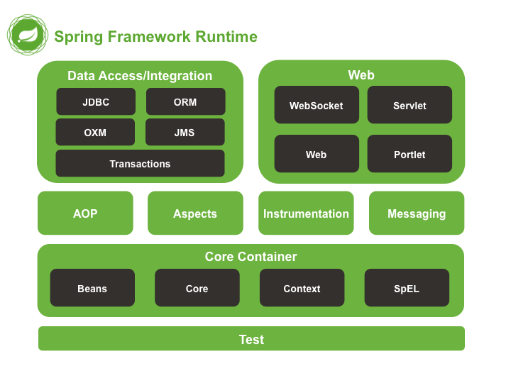
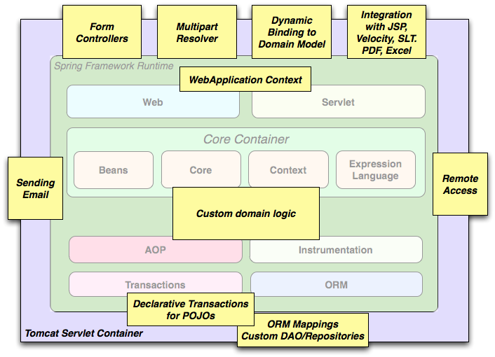

[[spring-introduction]]
= Overview of Spring Framework
:doc-root: https://docs.spring.io
:api-spring-framework: {doc-root}/spring-framework/docs/{spring-version}/javadoc-api/org/springframework
:toc: left
:toclevels: 2

[[overview-getting-started-with-spring]]
== Getting Started with Spring
This reference guide provides detailed information about the Spring Framework.
It provides comprehensive documentation for all features, as well as some background
about the underlying concepts (such as __"Dependency Injection"__) that Spring has
embraced.

If you are just getting started with Spring, you may want to begin using the Spring Framework
by creating a http://projects.spring.io/spring-boot/[Spring Boot] based application.
Spring Boot provides a quick (and opinionated) way to create a production-ready Spring based
application. It is based on the Spring Framework, favors convention over configuration, and is
designed to get you up and running as quickly as possible.

You can use http://start.spring.io[start.spring.io] to generate a basic project or follow
one of the https://spring.io/guides["Getting Started" guides] like the
https://spring.io/guides/gs/rest-service/[Getting Started Building a RESTful Web Service]
one. As well as being easier to digest, these guides are very __task focused__, and most of
them are based on Spring Boot. They also cover other projects from the Spring portfolio
that you might want to consider when solving a particular problem.

[[overview]]
== Introduction to the Spring Framework
The Spring Framework is a Java platform that provides comprehensive infrastructure support
for developing Java applications. Spring handles the infrastructure so you can focus on
your application.

Spring enables you to build applications from "plain old Java objects" (POJOs) and to
apply enterprise services non-invasively to POJOs. This capability applies to the Java
SE programming model and to full and partial Java EE.

Examples of how you, as an application developer, can benefit from the Spring platform:

* Make a Java method execute in a database transaction without having to deal with
  transaction APIs.
* Make a local Java method an HTTP endpoint without having to deal with the Servlet API.
* Make a local Java method a message handler without having to deal with the JMS API.
* Make a local Java method a management operation without having to deal with the JMX API.

[[overview-dependency-injection]]
=== Dependency Injection and Inversion of Control

A Java application -- a loose term that runs the gamut from constrained, embedded
applications to n-tier, server-side enterprise applications -- typically consists of
objects that collaborate to form the application proper. Thus the objects in an
application have __dependencies__ on each other.

Although the Java platform provides a wealth of application development functionality,
it lacks the means to organize the basic building blocks into a coherent whole, leaving
that task to architects and developers. Although you can use design patterns such
as __Factory__, __Abstract Factory__, __Builder__, __Decorator__, and __Service Locator__
to compose the various classes and object instances that make up an application,
these patterns are simply that: best practices given a name, with a description
of what the pattern does, where to apply it, the problems it addresses, and so forth.
Patterns are formalized best practices that __you must implement yourself__ in your
application.

The Spring Framework __Inversion of Control__ (IoC) component addresses this concern by
providing a formalized means of composing disparate components into a fully working
application ready for use. The Spring Framework codifies formalized design patterns as
first-class objects that you can integrate into your own application(s). Numerous
organizations and institutions use the Spring Framework in this manner to engineer
robust, __maintainable__ applications.

[[background-ioc]]
.Background
****
"__The question is, what aspect of control are [they] inverting?__" Martin Fowler posed
this question about Inversion of Control (IoC)
http://martinfowler.com/articles/injection.html[on his site] in 2004. Fowler suggested
renaming the principle to make it more self-explanatory and came up with __Dependency
Injection__.
****

[[overview-modules]]
=== Framework Modules
The Spring Framework consists of features organized into about 20 modules. These modules
are grouped into Core Container, Data Access/Integration, Web, AOP (Aspect Oriented
Programming), Instrumentation, Messaging, and Test, as shown in the following diagram.

.Overview of the Spring Framework

The following sections list the available modules for each feature along with their
artifact names and the topics they cover. Artifact names correlate to _artifact IDs_ used
in <<dependency-management,Dependency Management tools>>.

[[overview-core-container]]
==== Core Container
The <<core.adoc#beans-introduction,__Core Container__>> consists of the `spring-core`,
`spring-beans`, `spring-context`, `spring-context-support`, and `spring-expression`
(Spring Expression Language) modules.

The `spring-core` and `spring-beans` modules <<core.adoc#beans-introduction,provide
the fundamental parts of the framework>>, including the IoC and Dependency Injection features.
The `BeanFactory` is a sophisticated implementation of the factory pattern. It removes the
need for programmatic singletons and allows you to decouple the configuration and
specification of dependencies from your actual program logic.

The <<core.adoc#context-introduction,__Context__>> (`spring-context`) module builds on the solid
base provided by the <<core.adoc#beans-introduction,__Core and Beans__>> modules: it is a means to
access objects in a framework-style manner that is similar to a JNDI registry. The
Context module inherits its features from the Beans module and adds support for
internationalization (using, for example, resource bundles), event propagation, resource
loading, and the transparent creation of contexts by, for example, a Servlet container.
The Context module also supports Java EE features such as EJB, JMX, and basic remoting.
The `ApplicationContext` interface is the focal point of the Context module.
`spring-context-support` provides support for integrating common third-party libraries
into a Spring application context, in particular for caching (EhCache, JCache) and
scheduling (CommonJ, Quartz).

The `spring-expression` module provides a powerful <<core.adoc#expressions,__Expression
Language__>> for querying and manipulating an object graph at runtime. It is an extension
of the unified expression language (unified EL) as specified in the JSP 2.1
specification. The language supports setting and getting property values, property
assignment, method invocation, accessing the content of arrays, collections and indexers,
logical and arithmetic operators, named variables, and retrieval of objects by name from
Spring's IoC container. It also supports list projection and selection as well as common
list aggregations.

[[overview-aop-instrumentation]]
==== AOP and Instrumentation
The `spring-aop` module provides an <<core.adoc#aop-introduction,__AOP__>> Alliance-compliant
aspect-oriented programming implementation allowing you to define, for example,
method interceptors and pointcuts to cleanly decouple code that implements functionality
that should be separated. Using source-level metadata functionality, you can also
incorporate behavioral information into your code, in a manner similar to that of .NET
attributes.

The separate `spring-aspects` module provides integration with AspectJ.

The `spring-instrument` module provides class instrumentation support and classloader
implementations to be used in certain application servers. The `spring-instrument-tomcat`
module contains Spring's instrumentation agent for Tomcat.

[[overview-messaging]]
==== Messaging
Spring Framework 4 includes a `spring-messaging` module with key abstractions from the
_Spring Integration_ project such as `Message`, `MessageChannel`, `MessageHandler`, and
others to serve as a foundation for messaging-based applications. The module also
includes a set of annotations for mapping messages to methods, similar to the Spring MVC
annotation based programming model.

[[overview-data-access]]
==== Data Access/Integration
The __Data Access/Integration__ layer consists of the JDBC, ORM, OXM, JMS, and
Transaction modules.

The `spring-jdbc` module provides a <<data-access.adoc#jdbc-introduction,JDBC>>-abstraction
layer that removes the need to do tedious JDBC coding and parsing of database-vendor
specific error codes.

The `spring-tx` module supports <<data-access.adoc#transaction,programmatic and declarative transaction>>
management for classes that implement special interfaces and for __all your POJOs (Plain
Old Java Objects)__.

The `spring-orm` module provides integration layers for popular
<<data-access.adoc#orm-introduction,object-relational mapping>> APIs,
including <<data-access.adoc#orm-jpa,JPA>> and <<data-access.adoc#orm-hibernate,Hibernate>>.
Using the `spring-orm` module you can use these O/R-mapping frameworks in combination with
all of the other features Spring offers, such as the simple declarative transaction
management feature mentioned previously.

The `spring-oxm` module provides an abstraction layer that supports
<<data-access.adoc#oxm,Object/XML mapping>> implementations such as JAXB, Castor, JiBX and XStream.

The `spring-jms` module (<<integration.adoc#jms,Java Messaging Service>>) contains features for
producing and consuming messages. Since Spring Framework 4.1, it provides integration with the
`spring-messaging` module.

[[overview-web]]
==== Web
The __Web__ layer consists of the `spring-web`, `spring-webmvc` and `spring-websocket`
modules.

The `spring-web` module provides basic web-oriented integration features such as
multipart file upload functionality and the initialization of the IoC container using
Servlet listeners and a web-oriented application context. It also contains an HTTP client
and the web-related parts of Spring's remoting support.

The `spring-webmvc` module (also known as the __Web-Servlet__ module) contains Spring's
model-view-controller (<<web.adoc#mvc-introduction,__MVC__>>) and REST Web Services implementation
for web applications. Spring's MVC framework provides a clean separation between domain
model code and web forms and integrates with all of the other features of the Spring
Framework.

[[overview-testing]]
==== Test
The `spring-test` module supports the <<testing.adoc#unit-testing,unit testing>> and
<<testing.adoc#integration-testing,integration testing>> of Spring components with JUnit or TestNG. It
provides consistent <<testing.adoc#testcontext-ctx-management,loading>> of Spring
``ApplicationContext``s and <<testing.adoc#testcontext-ctx-management-caching,caching>> of those
contexts. It also provides <<testing.adoc#mock-objects,mock objects>> that you can use to test your
code in isolation.

[[overview-usagescenarios]]
=== Usage scenarios
The building blocks described previously make Spring a logical choice in many scenarios,
from embedded applications that run on resource-constrained devices to full-fledged
enterprise applications that use Spring's transaction management functionality and web
framework integration.

.Typical full-fledged Spring web application

Spring's <<data-access.adoc#transaction-declarative,declarative transaction management features>>
make the web application fully transactional, just as it would be if you used EJB
container-managed transactions. All your custom business logic can be implemented with
simple POJOs and managed by Spring's IoC container. Additional services include support
for sending email and validation that is independent of the web layer, which lets you
choose where to execute validation rules. Spring's ORM support is integrated with JPA
and Hibernate; for example, when using Hibernate, you can continue to use your existing
mapping files and standard Hibernate `SessionFactory` configuration. Form controllers
seamlessly integrate the web-layer with the domain model, removing the need for
`ActionForms` or other classes that transform HTTP parameters to values for your
domain model.

.Spring middle-tier using a third-party web framework
image::images/overview-thirdparty-web.png[]

Sometimes circumstances do not allow you to completely switch to a different framework.
The Spring Framework does __not__ force you to use everything within it; it is not an
__all-or-nothing__ solution. Existing front-ends built with Struts, Tapestry, JSF
or other UI frameworks can be integrated with a Spring-based middle-tier, which allows
you to use Spring transaction features. You simply need to wire up your business logic
using an `ApplicationContext` and use a `WebApplicationContext` to integrate your web
layer.

.Remoting usage scenario
image::images/overview-remoting.png[]

When you need to access existing code through web services, you can use Spring's
`Hessian-`, `Rmi-` or `HttpInvokerProxyFactoryBean` classes. Enabling remote access to
existing applications is not difficult.

.EJBs - Wrapping existing POJOs
image::images/overview-ejb.png[]

The Spring Framework also provides an <<integration.adoc#ejb,access and abstraction layer>> for
Enterprise JavaBeans, enabling you to reuse your existing POJOs and wrap them in
stateless session beans for use in scalable, fail-safe web applications that might need
declarative security.

[[dependency-management]]
==== Dependency Management and Naming Conventions
Dependency management and dependency injection are different things. To get those nice
features of Spring into your application (like dependency injection) you need to
assemble all the libraries needed (jar files) and get them onto your classpath at
runtime, and possibly at compile time. These dependencies are not virtual components
that are injected, but physical resources in a file system (typically). The process of
dependency management involves locating those resources, storing them and adding them to
classpaths. Dependencies can be direct (e.g. my application depends on Spring at
runtime), or indirect (e.g. my application depends on `commons-dbcp` which depends on
`commons-pool`). The indirect dependencies are also known as "transitive" and it is
those dependencies that are hardest to identify and manage.

If you are going to use Spring you need to get a copy of the jar libraries that comprise
the pieces of Spring that you need. To make this easier Spring is packaged as a set of
modules that separate the dependencies as much as possible, so for example if you don't
want to write a web application you don't need the spring-web modules. To refer to
Spring library modules in this guide we use a shorthand naming convention `spring-{asterisk}` or
`spring-{asterisk}.jar,` where `{asterisk}` represents the short name for the module
(e.g. `spring-core`, `spring-webmvc`, `spring-jms`, etc.). The actual jar file name that
you use is normally the module name concatenated with the version number
(e.g. __spring-core-{spring-version}.jar__).

Each release of the Spring Framework will publish artifacts to the following places:

* Maven Central, which is the default repository that Maven queries, and does not
  require any special configuration to use. Many of the common libraries that Spring
  depends on also are available from Maven Central and a large section of the Spring
  community uses Maven for dependency management, so this is convenient for them. The
  names of the jars here are in the form `spring-*-<version>.jar` and the Maven groupId
  is `org.springframework`.
* In a public Maven repository hosted specifically for Spring. In addition to the final
  GA releases, this repository also hosts development snapshots and milestones. The jar
  file names are in the same form as Maven Central, so this is a useful place to get
  development versions of Spring to use with other libraries deployed in Maven Central.
  This repository also contains a bundle distribution zip file that contains all Spring
  jars  bundled together for easy download.

So the first thing you need to decide is how to manage your dependencies: we generally
recommend the use of an automated system like Maven, Gradle or Ivy, but you can also do
it manually by downloading all the jars yourself.

Below you will find the list of Spring artifacts. For a more complete description of
each module, see <<overview-modules>>.

.Spring Framework Artifacts
|===
|GroupId |ArtifactId |Description

|org.springframework
|spring-aop
|Proxy-based AOP support

|org.springframework
|spring-aspects
|AspectJ based aspects

|org.springframework
|spring-beans
|Beans support, including Groovy

|org.springframework
|spring-context
|Application context runtime, including scheduling and remoting abstractions

|org.springframework
|spring-context-support
|Support classes for integrating common third-party libraries into a Spring application context

|org.springframework
|spring-core
|Core utilities, used by many other Spring modules

|org.springframework
|spring-expression
|Spring Expression Language (SpEL)

|org.springframework
|spring-instrument
|Instrumentation agent for JVM bootstrapping

|org.springframework
|spring-instrument-tomcat
|Instrumentation agent for Tomcat

|org.springframework
|spring-jdbc
|JDBC support package, including DataSource setup and JDBC access support

|org.springframework
|spring-jms
|JMS support package, including helper classes to send/receive JMS messages

|org.springframework
|spring-messaging
|Support for messaging architectures and protocols

|org.springframework
|spring-orm
|Object/Relational Mapping, including JPA and Hibernate support

|org.springframework
|spring-oxm
|Object/XML Mapping

|org.springframework
|spring-test
|Support for unit testing and integration testing Spring components

|org.springframework
|spring-tx
|Transaction infrastructure, including DAO support and JCA integration

|org.springframework
|spring-web
|Foundational web support, including web client and web-based remoting

|org.springframework
|spring-webmvc
|HTTP-based Model-View-Controller and REST endpoints for Servlet stacks

|org.springframework
|spring-websocket
|WebSocket and SockJS infrastructure, including STOMP messaging support
|===

[[overview-spring-dependencies]]
===== Spring Dependencies and Depending on Spring
Although Spring provides integration and support for a huge range of enterprise and
other external tools, it intentionally keeps its mandatory dependencies to an absolute
minimum: you shouldn't have to locate and download (even automatically) a large number
of jar libraries in order to use Spring for simple use cases. For basic dependency
injection there is only one mandatory external dependency, and that is for logging
(see below for a more detailed description of logging options).

Next we outline the basic steps needed to configure an application that depends on
Spring, first with Maven and then with Gradle and finally using Ivy. In all cases, if
anything is unclear, refer to the documentation of your dependency management system, or
look at some sample code - Spring itself uses Gradle to manage dependencies when it is
building, and our samples mostly use Gradle or Maven.

[[overview-maven-dependency-management]]
===== Maven Dependency Management
If you are using http://maven.apache.org/[Maven] for dependency management you don't even
need to supply the logging dependency explicitly. For example, to create an application
context and use dependency injection to configure an application, your Maven dependencies
will look like this:

[source,xml,indent=0]
[subs="verbatim,quotes,attributes"]
----
	<dependencies>
		<dependency>
			<groupId>org.springframework</groupId>
			<artifactId>spring-context</artifactId>
			<version>{spring-version}</version>
			<scope>runtime</scope>
		</dependency>
	</dependencies>
----

That's it. Note the scope can be declared as runtime if you don't need to compile
against Spring APIs, which is typically the case for basic dependency injection use
cases.

The example above works with the Maven Central repository. To use the Spring Maven
repository (e.g. for milestones or developer snapshots), you need to specify the
repository location in your Maven configuration. For full releases:

[source,xml,indent=0]
[subs="verbatim,quotes"]
----
	<repositories>
		<repository>
			<id>io.spring.repo.maven.release</id>
			<url>http://repo.spring.io/release/</url>
			<snapshots><enabled>false</enabled></snapshots>
		</repository>
	</repositories>
----

For milestones:

[source,xml,indent=0]
[subs="verbatim,quotes"]
----
	<repositories>
		<repository>
			<id>io.spring.repo.maven.milestone</id>
			<url>http://repo.spring.io/milestone/</url>
			<snapshots><enabled>false</enabled></snapshots>
		</repository>
	</repositories>
----

And for snapshots:

[source,xml,indent=0]
[subs="verbatim,quotes"]
----
	<repositories>
		<repository>
			<id>io.spring.repo.maven.snapshot</id>
			<url>http://repo.spring.io/snapshot/</url>
			<snapshots><enabled>true</enabled></snapshots>
		</repository>
	</repositories>
----

[[overview-maven-bom]]
===== Maven "Bill Of Materials" Dependency =====
It is possible to accidentally mix different versions of Spring JARs when using Maven.
For example, you may find that a third-party library, or another Spring project,
pulls in a transitive dependency to an older release. If you forget to explicitly declare
a direct dependency yourself, all sorts of unexpected issues can arise.

To overcome such problems Maven supports the concept of a "bill of materials" (BOM)
dependency. You can import the `spring-framework-bom` in your `dependencyManagement`
section to ensure that all spring dependencies (both direct and transitive) are at
the same version.

[source,xml,indent=0]
[subs="verbatim,quotes,attributes"]
----
	<dependencyManagement>
		<dependencies>
			<dependency>
				<groupId>org.springframework</groupId>
				<artifactId>spring-framework-bom</artifactId>
				<version>{spring-version}</version>
				<type>pom</type>
				<scope>import</scope>
			</dependency>
		</dependencies>
	</dependencyManagement>
----

An added benefit of using the BOM is that you no longer need to specify the `<version>`
attribute when depending on Spring Framework artifacts:

[source,xml,indent=0]
[subs="verbatim,quotes,attributes"]
----
	<dependencies>
		<dependency>
			<groupId>org.springframework</groupId>
			<artifactId>spring-context</artifactId>
		</dependency>
		<dependency>
			<groupId>org.springframework</groupId>
			<artifactId>spring-web</artifactId>
		</dependency>
	<dependencies>
----

[[overview-gradle-dependency-management]]
===== Gradle Dependency Management
To use the Spring repository with the http://www.gradle.org/[Gradle] build system,
include the appropriate URL in the `repositories` section:

[source,groovy,indent=0]
[subs="verbatim,quotes"]
----
	repositories {
		mavenCentral()
		// and optionally...
		maven { url "http://repo.spring.io/release" }
	}
----

You can change the `repositories` URL from `/release` to `/milestone` or `/snapshot` as
appropriate. Once a repository has been configured, you can declare dependencies in the
usual Gradle way:

[source,groovy,indent=0]
[subs="verbatim,quotes,attributes"]
----
	dependencies {
		compile("org.springframework:spring-context:{spring-version}")
		testCompile("org.springframework:spring-test:{spring-version}")
	}
----

[[overview-ivy-dependency-management]]
===== Ivy Dependency Management
If you prefer to use http://ant.apache.org/ivy[Ivy] to manage dependencies then there
are similar configuration options.

To configure Ivy to point to the Spring repository add the following resolver to your
`ivysettings.xml`:

[source,xml,indent=0]
[subs="verbatim,quotes"]
----
	<resolvers>
		<ibiblio name="io.spring.repo.maven.release"
				m2compatible="true"
				root="http://repo.spring.io/release/"/>
	</resolvers>
----

You can change the `root` URL from `/release/` to `/milestone/` or `/snapshot/` as
appropriate.

Once configured, you can add dependencies in the usual way. For example (in `ivy.xml`):

[source,xml,indent=0]
[subs="verbatim,quotes,attributes"]
----
	<dependency org="org.springframework"
		name="spring-core" rev="{spring-version}" conf="compile->runtime"/>
----

[[overview-distribution-zip]]
===== Distribution Zip Files
Although using a build system that supports dependency management is the recommended
way to obtain the Spring Framework, it is still possible to download a distribution
zip file.

Distribution zips are published to the Spring Maven Repository (this is just for our
convenience, you don't need Maven or any other build system in order to download them).

To download a distribution zip open a web browser to
http://repo.spring.io/release/org/springframework/spring and select the appropriate
subfolder for the version that you want. Distribution files end `-dist.zip`, for example
+spring-framework-{spring-version}-RELEASE-dist.zip+. Distributions are also published
for http://repo.spring.io/milestone/org/springframework/spring[milestones] and
http://repo.spring.io/snapshot/org/springframework/spring[snapshots].

[[overview-logging]]
==== Logging
Spring's logging setup has been revised for Spring 5: It is still based on the Apache
Commons Logging API, also known as Jakarta Commons Logging (JCL). However, `spring-core`
refers to a custom Commons Logging bridge in the `spring-jcl` module now, with a
Spring-specific `LogFactory` implementation which automatically bridges to
https://logging.apache.org/log4j/2.x/[Log4j 2], http://www.slf4j.org[SLF4J], or the
JDK's own `java.util.logging` (JUL). This implementation acts like the JCL-over-SLF4J
bridge but with a range of dynamically detected providers, analogous to JBoss Logging's
common targets (as supported by e.g. Hibernate and Undertow).

As a benefit, there is no need for external bridges like JCL-over-SLF4J anymore,
and correspondingly no need for a manual exclude of the standard Commons Logging jar
from `spring-core` dependencies. Instead, it all just works in Spring's autodetection
style at runtime: Simply put Log4j 2.x or SLF4J on your classpath, without any extra
bridge jars, or rely on default logging through JUL (with a customizable JUL setup).
And nicely aligned, default Hibernate setup will choose the same common log targets.

If both Log4j and SLF4J are present, the Log4j API will be used preferably (since it
directly matches JCL's signatures and natively supports a 'fatal' log level as well as
lazily resolved message objects), analogous to JBoss Logging's provider preferences.
Log4j may nevertheless be configured to delegate to SLF4J, or SLF4J may be configured
to delegate to Log4j: Please check the instructions on their websites on how to arrive
at a consistent outcome in such a mixed scenario.

[TIP]
====
As of Spring 5, drop any references to external Commons Logging bridges and also any
manual exclude of the standard Commons Logging jar from your existing `spring-core`
dependency setup. Your Log4j or SLF4J or JUL setup will keep working without changes.
Note that you may still need a `commons-logging` exclude for other libraries (e.g.
Apache HttpClient, Castor, HtmlUnit) in order to pick up Spring's JCL bridge instead.

A custom `LogFactory` implementation at the Commons Logging level will NOT get picked
up since Spring's bridge does not support custom `commons-logging.properties' setup.
For any other log provider, please set up a corresponding SLF4J or JUL bridge (which
you are very likely going to need for other libraries such as Hibernate anyway).
Note that Log4j 1.x has reached its end-of-life; please migrate to Log4j 2.x.

If you run into any remaining issues with Spring's Commons Logging implementation,
consider excluding `spring-jcl` and switching to the standard `commons-logging`
artifact (supporting `commons-logging.properties' setup) or to `jcl-over-slf4j`.
====

[[overview-logging-log4j]]
===== Using Log4j 2.x

http://logging.apache.org/log4j[Log4j 2] established itself as a fresh rewrite of
the original Log4j project (1.x is EOL now). As of Spring 5, the embedded logging
bridge will automatically delegate to Log4j 2.x when available on the classpath.

So to use Log4j with Spring, all you need to do is put Log4j on the classpath and
provide it with a configuration file (`log4j2.xml`, `log4j2.properties`, or other
http://logging.apache.org/log4j/2.x/manual/configuration.html[supported configuration
formats]). For Maven users, the minimal dependency needed is:

[source,xml,indent=0]
[subs="verbatim,quotes,attributes"]
----
	<dependencies>
		<dependency>
			<groupId>org.apache.logging.log4j</groupId>
			<artifactId>log4j-core</artifactId>
			<version>2.8.2</version>
		</dependency>
	</dependencies>
----

If you also wish to enable SLF4J to delegate to Log4j, e.g. for other libraries
which use SLF4J by default, the following dependency is also needed:

[source,xml,indent=0]
[subs="verbatim,quotes,attributes"]
----
	<dependencies>
	  <dependency>
		<groupId>org.apache.logging.log4j</groupId>
		<artifactId>log4j-slf4j-impl</artifactId>
		<version>2.8.2</version>
	  </dependency>
	</dependencies>
----

Here is an example `log4j2.xml` for logging to the console:

[source,xml,indent=0]
[subs="verbatim,quotes,attributes"]
----
	<?xml version="1.0" encoding="UTF-8"?>
	<Configuration status="WARN">
	  <Appenders>
		<Console name="Console" target="SYSTEM_OUT">
		  <PatternLayout pattern="%d{HH:mm:ss.SSS} [%t] %-5level %logger{36} - %msg%n"/>
		</Console>
	  </Appenders>
	  <Loggers>
		<Logger name="org.springframework.beans.factory" level="DEBUG"/>
		<Root level="error">
		  <AppenderRef ref="Console"/>
		</Root>
	  </Loggers>
	</Configuration>
----

[[overview-logging-slf4j]]
===== Using SLF4J with Logback

The Simple Logging Facade for Java (http://www.slf4j.org[SLF4J]) is a popular API
used by other libraries commonly used with Spring. It is typically used with
https://logback.qos.ch/[Logback] which is a native implementation of the SLF4J API
and therefore autodetected by Spring when added to the application classpath:

[source,xml,indent=0]
[subs="verbatim,quotes,attributes"]
----
	<dependencies>
		<dependency>
    		<groupId>ch.qos.logback</groupId>
    		<artifactId>logback-classic</artifactId>
    		<version>1.2.2</version>
		</dependency>
	</dependencies>
----

Alternatively, you may also configure SLF4J to delegate to Log4j (see above) or to
JUL, in particular for other libraries which use SLF4J by default. Note that it is
not important for all libraries to go through the same logging facade; it only
matters that they eventually delegate to the same log provider. So while Spring may
go to Log4j directly, other libraries may go through the SLF4J binding for Log4j,
or analogously for JUL.

[[overview-logging-jul]]
===== Using JUL (java.util.logging)

Spring will delegate to `java.util.logging` by default, provided that no Log4j or
SLF4J API is detected on the classpath. So there is no special dependency to set up:
just use Spring with no external dependency for log output to `java.util.logging`,
either in a standalone application (with a custom or default JUL setup at the JDK
level) or with an application server's log system (and its system-wide JUL setup).

Note that the `java.logging` module is NOT present by default on JDK 9, since it is
not included in `java.base`. This works fine when using Spring with Log4j or SLF4J
since the JUL API is not referenced in such a scenario. However, when choosing to
use JUL as a default log provider, remember to activate the `java.logging` module.

[[overview-logging-websphere]]
===== Commons Logging on WebSphere
Spring applications may run on a container that itself provides an implementation of
JCL, e.g. IBM's WebSphere Application Server (WAS). This does not cause issues per se
but leads to two different scenarios that need to be understood:

In a "parent first" ClassLoader delegation model (the default on WAS), applications
will always pick up the server-provided version of Commons Logging, delegating to the
WAS logging subsystem (which is actually based on JUL). An application-provided variant
of JCL, whether Spring 5's or the JCL-over-SLF4J bridge, will effectively be ignored,
along with any locally included log provider.

With a "parent last" delegation model (the default in a regular Servlet container but
an explicit configuration option on WAS), an application-provided Commons Logging
variant will be picked up, enabling you to set up a locally included log provider,
e.g. Log4j or Logback, within your application. In case of no local log provider,
Spring (like regular Commons Logging) will delegate to JUL by default, effectively
logging to WebSphere's logging subsystem like in the "parent first" scenario.

All in all, we recommend deploying Spring applications in the "parent last" model
since it naturally allows for local providers as well as the server's log subsystem.
